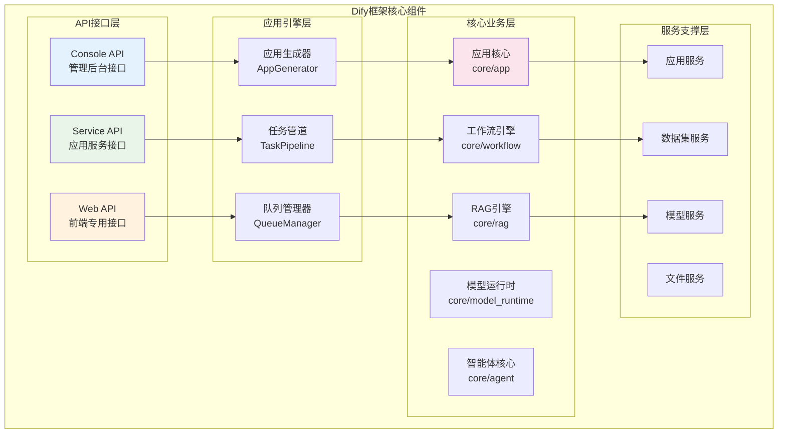
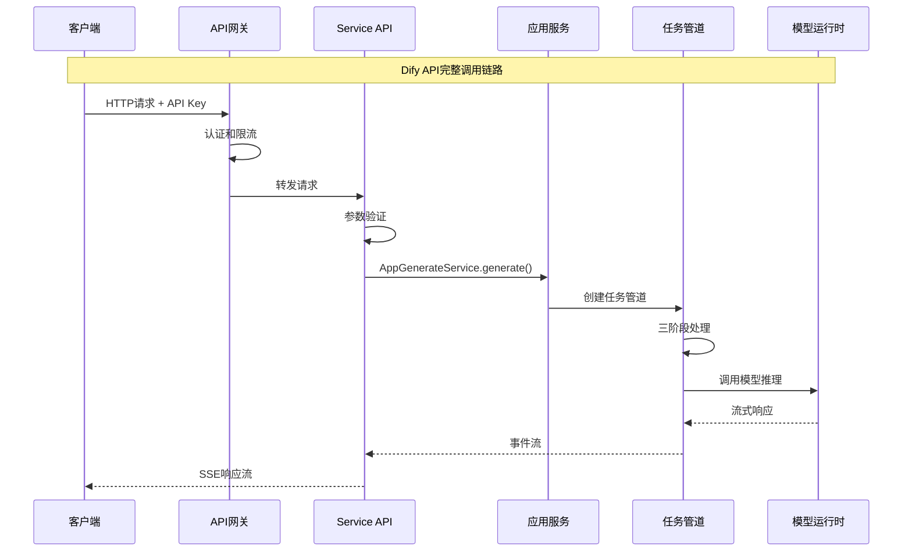

## 概述

本文档提供Dify框架的完整使用指南，从基础概念到高级应用，帮助开发者快速掌握Dify平台的开发技能。

<!--more-->

## 1. Dify框架概述

### 1.1 框架特点

Dify是一个企业级AI应用开发平台，具有以下核心特点：

**架构特点**：
- **分层设计**：清晰的API层、业务层、服务层和数据层分离
- **模块化**：各功能模块独立，便于维护和扩展
- **事件驱动**：基于队列的异步事件处理机制
- **多租户**：原生支持多租户架构和数据隔离

**技术特点**：
- **多模型支持**：统一接口支持OpenAI、Anthropic、本地模型等
- **工作流引擎**：可视化的工作流编排和执行
- **RAG能力**：完整的检索增强生成管道
- **智能体系统**：支持函数调用和思维链推理

### 1.2 核心组件架构



## 2. API接口详解

### 2.1 API架构设计

Dify采用三层API架构，每层面向不同的用户群体：



### 2.2 Service API核心接口

#### 2.2.1 Chat Messages接口

**接口定义**：
```python
@service_api_ns.route("/chat-messages")
class ChatApi(Resource):
    """
    发送聊天消息接口
    
    功能：处理聊天、智能体聊天和高级聊天应用的消息
    支持：对话管理、流式和阻塞响应模式
    """
    
    @service_api_ns.expect(chat_parser)
    @service_api_ns.doc("create_chat_message")
    @validate_app_token(fetch_user_arg=FetchUserArg(fetch_from=WhereisUserArg.JSON, required=True))
    def post(self, app_model: App, end_user: EndUser):
        """
        发送聊天消息
        
        Args:
            app_model (App): 应用模型实例，通过装饰器注入
            end_user (EndUser): 终端用户实例，通过装饰器注入
            
        Returns:
            Generator: 流式响应生成器或阻塞响应
            
        Raises:
            NotChatAppError: 应用类型不支持聊天
            ConversationNotExistsError: 对话不存在
            AppUnavailableError: 应用不可用
            ProviderNotInitializeError: 模型提供商未初始化
        """
        # 1. 验证应用类型
        app_mode = AppMode.value_of(app_model.mode)
        if app_mode not in {AppMode.CHAT, AppMode.AGENT_CHAT, AppMode.ADVANCED_CHAT}:
            raise NotChatAppError()

        # 2. 解析请求参数
        args = chat_parser.parse_args()
        
        # 3. 处理外部追踪ID
        external_trace_id = get_external_trace_id(request)
        if external_trace_id:
            args["external_trace_id"] = external_trace_id

        # 4. 确定响应模式
        streaming = args["response_mode"] == "streaming"

        try:
            # 5. 调用应用生成服务
            response = AppGenerateService.generate(
                app_model=app_model, 
                user=end_user, 
                args=args, 
                invoke_from=InvokeFrom.SERVICE_API, 
                streaming=streaming
            )

            # 6. 格式化响应
            return helper.compact_generate_response(response)
            
        except Exception as e:
            # 7. 异常处理
            logger.exception("聊天消息处理失败")
            raise InternalServerError()
```

**请求参数**：
```python
# 聊天消息请求参数定义
chat_parser = reqparse.RequestParser()
chat_parser.add_argument("inputs", type=dict, required=True, location="json", 
                        help="输入变量字典")
chat_parser.add_argument("query", type=str, required=True, location="json", 
                        help="用户查询内容")
chat_parser.add_argument("response_mode", type=str, choices=["blocking", "streaming"], 
                        default="streaming", location="json", help="响应模式")
chat_parser.add_argument("conversation_id", type=str, location="json", 
                        help="对话ID，新对话时为空")
chat_parser.add_argument("user", type=str, required=True, location="json", 
                        help="用户标识")
chat_parser.add_argument("files", type=list, default=[], location="json", 
                        help="文件列表")
```

**调用示例**：
```python
import requests
import json

def send_chat_message():
    """发送聊天消息示例"""
    
    # API配置
    api_base_url = "https://api.dify.ai/v1"
    api_key = "app-your-api-key"
    app_id = "your-app-id"
    
    # 请求头
    headers = {
        'Authorization': f'Bearer {api_key}',
        'Content-Type': 'application/json'
    }
    
    # 请求数据
    data = {
        "inputs": {
            "topic": "人工智能",
            "context": "技术讨论"
        },
        "query": "请介绍一下大语言模型的发展历程",
        "response_mode": "streaming",
        "conversation_id": "",  # 新对话
        "user": "user_123",
        "files": []
    }
    
    # 发送请求
    response = requests.post(
        f"{api_base_url}/chat-messages",
        headers=headers,
        json=data,
        stream=True
    )
    
    # 处理流式响应
    if response.status_code == 200:
        for line in response.iter_lines():
            if line and line.startswith(b'data: '):
                try:
                    data = json.loads(line[6:].decode('utf-8'))
                    event = data.get('event')
                    
                    if event == 'message':
                        print(f"消息: {data.get('answer', '')}")
                    elif event == 'message_end':
                        print(f"对话ID: {data.get('conversation_id')}")
                        print(f"消息ID: {data.get('id')}")
                        break
                    elif event == 'error':
                        print(f"错误: {data.get('message')}")
                        break
                        
                except json.JSONDecodeError:
                    continue
    else:
        print(f"请求失败: {response.status_code}")
        print(response.text)

# 使用示例
send_chat_message()
```

#### 2.2.2 Completion Messages接口

**接口定义**：
```python
@service_api_ns.route("/completion-messages")
class CompletionApi(Resource):
    """
    文本完成接口
    
    功能：基于提示生成文本完成
    支持：流式和阻塞响应模式
    """
    
    @service_api_ns.expect(completion_parser)
    @validate_app_token(fetch_user_arg=FetchUserArg(fetch_from=WhereisUserArg.JSON, required=True))
    def post(self, app_model: App, end_user: EndUser):
        """
        创建文本完成
        
        Args:
            app_model (App): 应用模型实例
            end_user (EndUser): 终端用户实例
            
        Returns:
            Generator: 完成结果生成器
            
        Raises:
            AppUnavailableError: 应用不可用（非completion模式）
            ProviderNotInitializeError: 模型提供商未初始化
            CompletionRequestError: 完成请求错误
        """
        # 1. 验证应用模式
        if app_model.mode != "completion":
            raise AppUnavailableError()

        # 2. 解析参数
        args = completion_parser.parse_args()
        
        # 3. 处理外部追踪
        external_trace_id = get_external_trace_id(request)
        if external_trace_id:
            args["external_trace_id"] = external_trace_id

        # 4. 设置响应模式
        streaming = args["response_mode"] == "streaming"
        args["auto_generate_name"] = False

        try:
            # 5. 生成完成
            response = AppGenerateService.generate(
                app_model=app_model,
                user=end_user,
                args=args,
                invoke_from=InvokeFrom.SERVICE_API,
                streaming=streaming,
            )

            return helper.compact_generate_response(response)
            
        except Exception as e:
            logger.exception("文本完成生成失败")
            raise InternalServerError()
```

### 2.3 AppGenerateService核心实现

**服务入口**：
```python
class AppGenerateService:
    """
    应用生成服务
    
    功能：统一的应用内容生成入口
    支持：Chat、Completion、Agent、Workflow等多种应用类型
    """
    
    # 系统级限流器
    system_rate_limiter = RateLimiter(
        prefix="system_generate_rate_limit",
        max_attempts=dify_config.APP_DAILY_RATE_LIMIT,
        time_window=86400  # 24小时
    )

    @classmethod
    def generate(
        cls,
        app_model: App,
        user: Union[Account, EndUser],
        args: Mapping[str, Any],
        invoke_from: InvokeFrom,
        streaming: bool = True,
    ):
        """
        应用内容生成主入口
        
        Args:
            app_model (App): 应用模型实例
            user (Union[Account, EndUser]): 用户实例
            args (Mapping[str, Any]): 生成参数
            invoke_from (InvokeFrom): 调用来源
            streaming (bool): 是否流式输出
            
        Returns:
            Generator: 生成结果流
            
        Raises:
            InvokeRateLimitError: 调用频率限制
            WorkflowNotFoundError: 工作流未找到
            AppUnavailableError: 应用不可用
        """
        
        # 1. 系统级限流检查
        if dify_config.BILLING_ENABLED:
            limit_info = BillingService.get_info(app_model.tenant_id)
            if limit_info["subscription"]["plan"] == "sandbox":
                if cls.system_rate_limiter.is_rate_limited(app_model.tenant_id):
                    raise InvokeRateLimitError(
                        f"Rate limit exceeded, please upgrade your plan "
                        f"or your RPD was {dify_config.APP_DAILY_RATE_LIMIT} requests/day"
                    )
                cls.system_rate_limiter.increment_rate_limit(app_model.tenant_id)

        # 2. 应用级限流设置
        max_active_request = cls._get_max_active_requests(app_model)
        rate_limit = RateLimit(
            tenant_id=app_model.tenant_id,
            app_id=app_model.id,
            max_active_requests=max_active_request
        )

        # 3. 生成请求ID并进入限流
        request_id = RateLimit.gen_request_key()
        try:
            request_id = rate_limit.enter(request_id)
            
            # 4. 根据应用模式选择生成器
            if app_model.mode == AppMode.COMPLETION:
                return rate_limit.generate(
                    CompletionAppGenerator.convert_to_event_stream(
                        CompletionAppGenerator().generate(
                            app_model=app_model, 
                            user=user, 
                            args=args, 
                            invoke_from=invoke_from, 
                            streaming=streaming
                        ),
                    ),
                    request_id=request_id,
                )
                
            elif app_model.mode == AppMode.AGENT_CHAT or app_model.is_agent:
                return rate_limit.generate(
                    AgentChatAppGenerator.convert_to_event_stream(
                        AgentChatAppGenerator().generate(
                            app_model=app_model, 
                            user=user, 
                            args=args, 
                            invoke_from=invoke_from, 
                            streaming=streaming
                        ),
                    ),
                    request_id,
                )
                
            elif app_model.mode == AppMode.CHAT:
                return rate_limit.generate(
                    ChatAppGenerator.convert_to_event_stream(
                        ChatAppGenerator().generate(
                            app_model=app_model, 
                            user=user, 
                            args=args, 
                            invoke_from=invoke_from, 
                            streaming=streaming
                        ),
                    ),
                    request_id=request_id,
                )
                
            elif app_model.mode == AppMode.ADVANCED_CHAT:
                # 高级聊天需要工作流ID
                workflow_id = args.get("workflow_id")
                if not workflow_id:
                    raise WorkflowNotFoundError("workflow_id is required for advanced chat")
                
                # 验证工作流格式
                try:
                    uuid.UUID(workflow_id)
                except ValueError:
                    raise WorkflowIdFormatError("Invalid workflow ID format")
                
                # 获取工作流
                workflow = WorkflowService.get_published_workflow(
                    app_model=app_model, 
                    workflow_id=workflow_id
                )
                if not workflow:
                    raise WorkflowNotFoundError("Workflow not found or not published")
                
                return rate_limit.generate(
                    AdvancedChatAppGenerator.convert_to_event_stream(
                        AdvancedChatAppGenerator().generate(
                            app_model=app_model,
                            workflow=workflow,
                            user=user,
                            args=args,
                            invoke_from=invoke_from,
                            streaming=streaming,
                        ),
                    ),
                    request_id=request_id,
                )
                
            elif app_model.mode == AppMode.WORKFLOW:
                # 工作流应用
                workflow = WorkflowService.get_published_workflow(app_model=app_model)
                if not workflow:
                    raise WorkflowNotFoundError("Workflow not found")
                
                return rate_limit.generate(
                    WorkflowAppGenerator.convert_to_event_stream(
                        WorkflowAppGenerator().generate(
                            app_model=app_model,
                            workflow=workflow,
                            user=user,
                            args=args,
                            invoke_from=invoke_from,
                            streaming=streaming,
                        ),
                    ),
                    request_id=request_id,
                )
            else:
                raise ValueError(f"Invalid app mode: {app_model.mode}")
                
        except RateLimitError:
            raise InvokeRateLimitError("Rate limit exceeded")
        finally:
            # 5. 退出限流
            rate_limit.exit(request_id)

    @classmethod
    def _get_max_active_requests(cls, app_model: App) -> int:
        """
        获取应用最大并发请求数
        
        Args:
            app_model (App): 应用模型
            
        Returns:
            int: 最大并发请求数
        """
        max_active_requests = app_model.max_active_requests
        if max_active_requests is None:
            max_active_requests = int(dify_config.APP_MAX_ACTIVE_REQUESTS)
        return max_active_requests
```

## 3. 应用开发示例

### 3.1 创建Chat应用

```python
def create_chat_app_example():
    """
    创建Chat应用示例
    
    功能：创建一个基础的聊天应用
    配置：模型、提示模板、用户输入表单
    """
    from services.app_service import AppService
    from services.app_model_config_service import AppModelConfigService
    
    # 1. 应用基本信息
    app_args = {
        'name': '智能客服助手',
        'mode': 'chat',
        'icon': '🤖',
        'description': '基于GPT-4的智能客服助手，能够回答用户问题并提供帮助'
    }
    
    # 2. 模型配置
    model_config = {
        'provider': 'openai',
        'model': 'gpt-4',
        'parameters': {
            'temperature': 0.7,
            'max_tokens': 2048,
            'top_p': 1.0,
            'frequency_penalty': 0.0,
            'presence_penalty': 0.0
        },
        'stop': []
    }
    
    # 3. 提示模板配置
    prompt_template = {
        'prompt_type': 'simple',
        'simple_prompt_template': '''你是一个专业的客服助手，请根据用户的问题提供准确、友好的回答。

用户信息：
- 姓名：{{name}}
- 问题类型：{{question_type}}

用户问题：{{query}}

请提供详细的回答，如果需要进一步信息，请主动询问。'''
    }
    
    # 4. 用户输入表单配置
    user_input_form = [
        {
            'variable': 'name',
            'label': '您的姓名',
            'type': 'text-input',
            'required': True,
            'max_length': 50
        },
        {
            'variable': 'question_type',
            'label': '问题类型',
            'type': 'select',
            'required': True,
            'options': ['技术支持', '产品咨询', '账户问题', '其他']
        }
    ]
    
    # 5. 创建应用
    app = AppService.create_app(
        tenant_id='tenant_123',
        args=app_args,
        account=account  # 当前用户账户
    )
    
    # 6. 更新应用配置
    config_data = {
        'model_config': model_config,
        'prompt_template': prompt_template,
        'user_input_form': user_input_form,
        'opening_statement': '您好！我是智能客服助手，很高兴为您服务。请告诉我您的问题，我会尽力帮助您。',
        'suggested_questions': [
            '如何重置密码？',
            '产品有哪些功能？',
            '如何联系技术支持？'
        ]
    }
    
    AppModelConfigService.update_app_config(
        app_id=app.id,
        config=config_data,
        account=account
    )
    
    return app
```

### 3.2 创建Agent应用

```python
def create_agent_app_example():
    """
    创建Agent应用示例
    
    功能：创建具备工具调用能力的智能体应用
    工具：搜索、计算器、天气查询
    """
    from services.app_service import AppService
    from services.app_model_config_service import AppModelConfigService
    
    # 1. 应用基本信息
    app_args = {
        'name': '智能助手Agent',
        'mode': 'agent-chat',
        'icon': '🤖',
        'description': '具备搜索、计算和天气查询能力的智能助手'
    }
    
    # 2. Agent配置
    agent_config = {
        'strategy': 'function-calling',  # 使用函数调用策略
        'max_iteration': 10,
        'tools': [
            {
                'type': 'builtin',
                'provider': 'duckduckgo',
                'tool_name': 'duckduckgo_search',
                'tool_configuration': {
                    'result_type': 'text'
                }
            },
            {
                'type': 'builtin',
                'provider': 'calculator',
                'tool_name': 'calculator',
                'tool_configuration': {}
            },
            {
                'type': 'builtin',
                'provider': 'weather',
                'tool_name': 'weather_query',
                'tool_configuration': {
                    'api_key': 'your-weather-api-key'
                }
            }
        ]
    }
    
    # 3. 模型配置（需要支持函数调用的模型）
    model_config = {
        'provider': 'openai',
        'model': 'gpt-4',
        'parameters': {
            'temperature': 0.2,  # 较低温度保证工具调用准确性
            'max_tokens': 4096,
            'top_p': 1.0
        }
    }
    
    # 4. 提示模板
    prompt_template = {
        'prompt_type': 'simple',
        'simple_prompt_template': '''你是一个智能助手，可以帮助用户搜索信息、进行计算和查询天气。

你有以下能力：
1. 搜索互联网信息
2. 进行数学计算
3. 查询天气信息

请根据用户的需求选择合适的工具来帮助用户。如果需要使用工具，请先说明你要做什么，然后调用相应的工具。

用户问题：{{query}}'''
    }
    
    # 5. 创建应用
    app = AppService.create_app(
        tenant_id='tenant_123',
        args=app_args,
        account=account
    )
    
    # 6. 更新配置
    config_data = {
        'model_config': model_config,
        'prompt_template': prompt_template,
        'agent': agent_config,
        'opening_statement': '你好！我是智能助手，可以帮您搜索信息、进行计算和查询天气。请告诉我您需要什么帮助。',
        'suggested_questions': [
            '今天北京的天气怎么样？',
            '帮我计算 123 * 456',
            '搜索最新的AI技术发展'
        ]
    }
    
    AppModelConfigService.update_app_config(
        app_id=app.id,
        config=config_data,
        account=account
    )
    
    return app
```

### 3.3 创建Workflow应用

```python
def create_workflow_app_example():
    """
    创建Workflow应用示例
    
    功能：创建一个文档分析工作流应用
    流程：文档上传 -> 内容提取 -> 摘要生成 -> 关键词提取
    """
    from services.app_service import AppService
    from services.workflow_service import WorkflowService
    
    # 1. 应用基本信息
    app_args = {
        'name': '文档分析工作流',
        'mode': 'workflow',
        'icon': '📄',
        'description': '自动分析文档内容，生成摘要和关键词'
    }
    
    # 2. 工作流图定义
    workflow_graph = {
        'nodes': [
            {
                'id': 'start',
                'type': 'start',
                'data': {
                    'title': '开始',
                    'variables': [
                        {
                            'variable': 'document',
                            'type': 'file',
                            'label': '文档文件',
                            'required': True,
                            'allowed_file_types': ['pdf', 'docx', 'txt']
                        }
                    ]
                }
            },
            {
                'id': 'extract_content',
                'type': 'code',
                'data': {
                    'title': '提取文档内容',
                    'code': '''
def main(document):
    """提取文档内容"""
    import PyPDF2
    import docx
    
    content = ""
    file_type = document.get('type', '').lower()
    
    if file_type == 'pdf':
        # 处理PDF文件
        content = extract_pdf_content(document['content'])
    elif file_type == 'docx':
        # 处理Word文档
        content = extract_docx_content(document['content'])
    elif file_type == 'txt':
        # 处理文本文件
        content = document['content'].decode('utf-8')
    
    return {
        'content': content,
        'word_count': len(content.split())
    }

def extract_pdf_content(pdf_content):
    # PDF内容提取逻辑
    pass

def extract_docx_content(docx_content):
    # Word文档内容提取逻辑
    pass
                    ''',
                    'outputs': [
                        {'variable': 'content', 'type': 'string'},
                        {'variable': 'word_count', 'type': 'number'}
                    ]
                }
            },
            {
                'id': 'generate_summary',
                'type': 'llm',
                'data': {
                    'title': '生成摘要',
                    'model': {
                        'provider': 'openai',
                        'name': 'gpt-4',
                        'parameters': {
                            'temperature': 0.3,
                            'max_tokens': 500
                        }
                    },
                    'prompt': '''请为以下文档内容生成一个简洁的摘要：

文档内容：
{{#extract_content.content#}}

要求：
1. 摘要长度控制在200字以内
2. 突出文档的核心观点和主要内容
3. 使用简洁明了的语言

摘要：''',
                    'outputs': [
                        {'variable': 'summary', 'type': 'string'}
                    ]
                }
            },
            {
                'id': 'extract_keywords',
                'type': 'llm',
                'data': {
                    'title': '提取关键词',
                    'model': {
                        'provider': 'openai',
                        'name': 'gpt-4',
                        'parameters': {
                            'temperature': 0.1,
                            'max_tokens': 200
                        }
                    },
                    'prompt': '''请从以下文档内容中提取5-10个关键词：

文档内容：
{{#extract_content.content#}}

要求：
1. 关键词应该是文档中最重要的概念或主题
2. 每个关键词用逗号分隔
3. 按重要性排序

关键词：''',
                    'outputs': [
                        {'variable': 'keywords', 'type': 'string'}
                    ]
                }
            },
            {
                'id': 'end',
                'type': 'end',
                'data': {
                    'title': '结束',
                    'outputs': [
                        {
                            'variable': 'analysis_result',
                            'type': 'object',
                            'value': {
                                'summary': '{{#generate_summary.summary#}}',
                                'keywords': '{{#extract_keywords.keywords#}}',
                                'word_count': '{{#extract_content.word_count#}}'
                            }
                        }
                    ]
                }
            }
        ],
        'edges': [
            {'source': 'start', 'target': 'extract_content'},
            {'source': 'extract_content', 'target': 'generate_summary'},
            {'source': 'extract_content', 'target': 'extract_keywords'},
            {'source': 'generate_summary', 'target': 'end'},
            {'source': 'extract_keywords', 'target': 'end'}
        ]
    }
    
    # 3. 创建应用
    app = AppService.create_app(
        tenant_id='tenant_123',
        args=app_args,
        account=account
    )
    
    # 4. 创建工作流
    workflow = WorkflowService.create_workflow(
        app_id=app.id,
        graph=workflow_graph,
        account=account
    )
    
    # 5. 发布工作流
    WorkflowService.publish_workflow(
        workflow_id=workflow.id,
        account=account
    )
    
    return app, workflow
```

## 4. 最佳实践

### 4.1 API调用最佳实践

#### 4.1.1 错误处理

```python
import requests
import json
import time
from typing import Generator, Dict, Any

class DifyAPIClient:
    """
    Dify API客户端
    
    功能：封装Dify API调用，提供错误处理和重试机制
    """
    
    def __init__(self, api_key: str, base_url: str = "https://api.dify.ai/v1"):
        """
        初始化API客户端
        
        Args:
            api_key (str): API密钥
            base_url (str): API基础URL
        """
        self.api_key = api_key
        self.base_url = base_url
        self.session = requests.Session()
        self.session.headers.update({
            'Authorization': f'Bearer {api_key}',
            'Content-Type': 'application/json'
        })
    
    def send_message(
        self, 
        inputs: Dict[str, Any], 
        query: str, 
        user: str,
        conversation_id: str = "",
        stream: bool = True,
        max_retries: int = 3
    ) -> Generator[Dict[str, Any], None, None]:
        """
        发送聊天消息
        
        Args:
            inputs (Dict[str, Any]): 输入变量
            query (str): 用户查询
            user (str): 用户标识
            conversation_id (str): 对话ID
            stream (bool): 是否流式输出
            max_retries (int): 最大重试次数
            
        Yields:
            Dict[str, Any]: 响应事件
            
        Raises:
            APIError: API调用错误
            RateLimitError: 频率限制错误
        """
        data = {
            "inputs": inputs,
            "query": query,
            "response_mode": "streaming" if stream else "blocking",
            "conversation_id": conversation_id,
            "user": user
        }
        
        for attempt in range(max_retries + 1):
            try:
                response = self.session.post(
                    f"{self.base_url}/chat-messages",
                    json=data,
                    stream=stream,
                    timeout=60
                )
                
                if response.status_code == 200:
                    if stream:
                        yield from self._parse_stream_response(response)
                    else:
                        yield response.json()
                    return
                    
                elif response.status_code == 429:
                    # 频率限制，指数退避重试
                    if attempt < max_retries:
                        wait_time = 2 ** attempt
                        time.sleep(wait_time)
                        continue
                    else:
                        raise RateLimitError("Rate limit exceeded")
                        
                elif response.status_code == 401:
                    raise AuthenticationError("Invalid API key")
                    
                elif response.status_code == 400:
                    error_data = response.json()
                    raise ValidationError(f"Validation error: {error_data.get('message')}")
                    
                else:
                    response.raise_for_status()
                    
            except requests.RequestException as e:
                if attempt < max_retries:
                    time.sleep(2 ** attempt)
                    continue
                else:
                    raise APIError(f"Request failed: {str(e)}")
    
    def _parse_stream_response(self, response: requests.Response) -> Generator[Dict[str, Any], None, None]:
        """
        解析流式响应
        
        Args:
            response (requests.Response): HTTP响应对象
            
        Yields:
            Dict[str, Any]: 解析后的事件数据
        """
        for line in response.iter_lines():
            if line and line.startswith(b'data: '):
                try:
                    data = json.loads(line[6:].decode('utf-8'))
                    yield data
                except json.JSONDecodeError:
                    continue

# 自定义异常类
class APIError(Exception):
    """API调用错误"""
    pass

class RateLimitError(APIError):
    """频率限制错误"""
    pass

class AuthenticationError(APIError):
    """认证错误"""
    pass

class ValidationError(APIError):
    """验证错误"""
    pass
```

#### 4.1.2 并发调用管理

```python
import asyncio
import aiohttp
from typing import List, Dict, Any
from concurrent.futures import ThreadPoolExecutor

class AsyncDifyClient:
    """
    异步Dify API客户端
    
    功能：支持并发API调用，提高处理效率
    """
    
    def __init__(self, api_key: str, base_url: str = "https://api.dify.ai/v1"):
        self.api_key = api_key
        self.base_url = base_url
        self.headers = {
            'Authorization': f'Bearer {api_key}',
            'Content-Type': 'application/json'
        }
    
    async def send_multiple_messages(
        self, 
        messages: List[Dict[str, Any]], 
        max_concurrent: int = 5
    ) -> List[Dict[str, Any]]:
        """
        并发发送多个消息
        
        Args:
            messages (List[Dict[str, Any]]): 消息列表
            max_concurrent (int): 最大并发数
            
        Returns:
            List[Dict[str, Any]]: 响应结果列表
        """
        semaphore = asyncio.Semaphore(max_concurrent)
        
        async def send_single_message(message_data: Dict[str, Any]) -> Dict[str, Any]:
            async with semaphore:
                async with aiohttp.ClientSession() as session:
                    try:
                        async with session.post(
                            f"{self.base_url}/chat-messages",
                            json=message_data,
                            headers=self.headers,
                            timeout=aiohttp.ClientTimeout(total=60)
                        ) as response:
                            if response.status == 200:
                                return await response.json()
                            else:
                                return {
                                    "error": f"HTTP {response.status}",
                                    "message": await response.text()
                                }
                    except Exception as e:
                        return {
                            "error": "Request failed",
                            "message": str(e)
                        }
        
        tasks = [send_single_message(msg) for msg in messages]
        results = await asyncio.gather(*tasks, return_exceptions=True)
        
        return results

# 使用示例
async def batch_process_example():
    """批量处理示例"""
    client = AsyncDifyClient("your-api-key")
    
    messages = [
        {
            "inputs": {"topic": "AI"},
            "query": "What is artificial intelligence?",
            "user": f"user_{i}",
            "response_mode": "blocking"
        }
        for i in range(10)
    ]
    
    results = await client.send_multiple_messages(messages, max_concurrent=3)
    
    for i, result in enumerate(results):
        if "error" not in result:
            print(f"Message {i}: Success")
        else:
            print(f"Message {i}: Error - {result['error']}")

# 运行示例
# asyncio.run(batch_process_example())
```

### 4.2 应用配置最佳实践

#### 4.2.1 配置管理

```python
from dataclasses import dataclass
from typing import Dict, List, Optional, Any
import yaml
import json

@dataclass
class ModelConfig:
    """模型配置"""
    provider: str
    model: str
    parameters: Dict[str, Any]
    stop: List[str] = None
    
    def __post_init__(self):
        if self.stop is None:
            self.stop = []

@dataclass
class PromptConfig:
    """提示配置"""
    prompt_type: str
    simple_prompt_template: Optional[str] = None
    chat_prompt_config: Optional[Dict[str, Any]] = None

@dataclass
class ToolConfig:
    """工具配置"""
    tool_type: str
    provider: str
    tool_name: str
    tool_configuration: Dict[str, Any] = None
    
    def __post_init__(self):
        if self.tool_configuration is None:
            self.tool_configuration = {}

class AppConfigManager:
    """
    应用配置管理器
    
    功能：统一管理应用配置，支持配置文件和环境变量
    """
    
    def __init__(self, config_file: Optional[str] = None):
        """
        初始化配置管理器
        
        Args:
            config_file (Optional[str]): 配置文件路径
        """
        self.config_file = config_file
        self.config_data = {}
        
        if config_file:
            self.load_from_file(config_file)
    
    def load_from_file(self, file_path: str):
        """
        从文件加载配置
        
        Args:
            file_path (str): 配置文件路径
        """
        try:
            with open(file_path, 'r', encoding='utf-8') as f:
                if file_path.endswith('.yaml') or file_path.endswith('.yml'):
                    self.config_data = yaml.safe_load(f)
                elif file_path.endswith('.json'):
                    self.config_data = json.load(f)
                else:
                    raise ValueError("Unsupported config file format")
        except Exception as e:
            raise ConfigError(f"Failed to load config file: {e}")
    
    def get_model_config(self, app_type: str) -> ModelConfig:
        """
        获取模型配置
        
        Args:
            app_type (str): 应用类型
            
        Returns:
            ModelConfig: 模型配置对象
        """
        model_configs = self.config_data.get('model_configs', {})
        config = model_configs.get(app_type, model_configs.get('default', {}))
        
        return ModelConfig(
            provider=config.get('provider', 'openai'),
            model=config.get('model', 'gpt-3.5-turbo'),
            parameters=config.get('parameters', {}),
            stop=config.get('stop', [])
        )
    
    def get_prompt_config(self, app_type: str) -> PromptConfig:
        """
        获取提示配置
        
        Args:
            app_type (str): 应用类型
            
        Returns:
            PromptConfig: 提示配置对象
        """
        prompt_configs = self.config_data.get('prompt_configs', {})
        config = prompt_configs.get(app_type, {})
        
        return PromptConfig(
            prompt_type=config.get('prompt_type', 'simple'),
            simple_prompt_template=config.get('simple_prompt_template'),
            chat_prompt_config=config.get('chat_prompt_config')
        )
    
    def get_tool_configs(self, app_type: str) -> List[ToolConfig]:
        """
        获取工具配置列表
        
        Args:
            app_type (str): 应用类型
            
        Returns:
            List[ToolConfig]: 工具配置列表
        """
        tool_configs = self.config_data.get('tool_configs', {})
        configs = tool_configs.get(app_type, [])
        
        return [
            ToolConfig(
                tool_type=config.get('tool_type'),
                provider=config.get('provider'),
                tool_name=config.get('tool_name'),
                tool_configuration=config.get('tool_configuration', {})
            )
            for config in configs
        ]

# 配置文件示例 (config.yaml)
CONFIG_EXAMPLE = """
model_configs:
  default:
    provider: openai
    model: gpt-3.5-turbo
    parameters:
      temperature: 0.7
      max_tokens: 2048
    stop: []
  
  chat:
    provider: openai
    model: gpt-4
    parameters:
      temperature: 0.8
      max_tokens: 4096
  
  agent:
    provider: openai
    model: gpt-4
    parameters:
      temperature: 0.2
      max_tokens: 4096

prompt_configs:
  chat:
    prompt_type: simple
    simple_prompt_template: |
      你是一个有用的助手。请根据用户的输入提供准确和有帮助的回答。
      
      用户输入：{{query}}
  
  agent:
    prompt_type: simple
    simple_prompt_template: |
      你是一个智能助手，可以使用各种工具来帮助用户。
      请根据用户的需求选择合适的工具。
      
      用户需求：{{query}}

tool_configs:
  agent:
    - tool_type: builtin
      provider: duckduckgo
      tool_name: duckduckgo_search
      tool_configuration:
        result_type: text
    
    - tool_type: builtin
      provider: calculator
      tool_name: calculator
      tool_configuration: {}
"""

class ConfigError(Exception):
    """配置错误"""
    pass
```

### 4.3 性能优化实践

#### 4.3.1 缓存策略

```python
import redis
import json
import hashlib
from typing import Any, Optional, Callable
from functools import wraps

class CacheManager:
    """
    缓存管理器
    
    功能：提供多级缓存支持，优化API响应性能
    """
    
    def __init__(self, redis_url: str = "redis://localhost:6379"):
        """
        初始化缓存管理器
        
        Args:
            redis_url (str): Redis连接URL
        """
        self.redis_client = redis.from_url(redis_url)
        self.local_cache = {}
        self.max_local_cache_size = 1000
    
    def get_cache_key(self, prefix: str, **kwargs) -> str:
        """
        生成缓存键
        
        Args:
            prefix (str): 缓存前缀
            **kwargs: 缓存参数
            
        Returns:
            str: 缓存键
        """
        # 将参数排序并序列化
        sorted_params = sorted(kwargs.items())
        param_str = json.dumps(sorted_params, sort_keys=True)
        
        # 生成哈希
        hash_obj = hashlib.md5(param_str.encode('utf-8'))
        return f"{prefix}:{hash_obj.hexdigest()}"
    
    def get(self, key: str) -> Optional[Any]:
        """
        获取缓存值
        
        Args:
            key (str): 缓存键
            
        Returns:
            Optional[Any]: 缓存值
        """
        # 先查本地缓存
        if key in self.local_cache:
            return self.local_cache[key]
        
        # 再查Redis缓存
        try:
            value = self.redis_client.get(key)
            if value:
                decoded_value = json.loads(value)
                # 更新本地缓存
                self._update_local_cache(key, decoded_value)
                return decoded_value
        except Exception as e:
            print(f"Redis get error: {e}")
        
        return None
    
    def set(self, key: str, value: Any, ttl: int = 3600):
        """
        设置缓存值
        
        Args:
            key (str): 缓存键
            value (Any): 缓存值
            ttl (int): 过期时间（秒）
        """
        # 更新本地缓存
        self._update_local_cache(key, value)
        
        # 更新Redis缓存
        try:
            self.redis_client.setex(
                key, 
                ttl, 
                json.dumps(value, ensure_ascii=False)
            )
        except Exception as e:
            print(f"Redis set error: {e}")
    
    def _update_local_cache(self, key: str, value: Any):
        """
        更新本地缓存
        
        Args:
            key (str): 缓存键
            value (Any): 缓存值
        """
        # 如果本地缓存已满，删除最老的条目
        if len(self.local_cache) >= self.max_local_cache_size:
            oldest_key = next(iter(self.local_cache))
            del self.local_cache[oldest_key]
        
        self.local_cache[key] = value

def cached_response(cache_manager: CacheManager, ttl: int = 3600, prefix: str = "api"):
    """
    缓存装饰器
    
    Args:
        cache_manager (CacheManager): 缓存管理器
        ttl (int): 缓存过期时间
        prefix (str): 缓存前缀
    """
    def decorator(func: Callable) -> Callable:
        @wraps(func)
        def wrapper(*args, **kwargs):
            # 生成缓存键
            cache_key = cache_manager.get_cache_key(
                prefix=f"{prefix}:{func.__name__}",
                args=args,
                kwargs=kwargs
            )
            
            # 尝试从缓存获取
            cached_result = cache_manager.get(cache_key)
            if cached_result is not None:
                return cached_result
            
            # 执行函数
            result = func(*args, **kwargs)
            
            # 缓存结果
            cache_manager.set(cache_key, result, ttl)
            
            return result
        
        return wrapper
    return decorator

# 使用示例
cache_manager = CacheManager()

@cached_response(cache_manager, ttl=1800, prefix="chat")
def get_chat_response(query: str, model: str = "gpt-3.5-turbo"):
    """
    获取聊天响应（带缓存）
    
    Args:
        query (str): 用户查询
        model (str): 模型名称
        
    Returns:
        str: 聊天响应
    """
    # 这里是实际的API调用逻辑
    # 为了演示，返回模拟响应
    return f"Response for '{query}' using {model}"
```

#### 4.3.2 连接池管理

```python
import requests
from requests.adapters import HTTPAdapter
from urllib3.util.retry import Retry
from typing import Dict, Any
import threading

class ConnectionPoolManager:
    """
    连接池管理器
    
    功能：管理HTTP连接池，提高API调用效率
    """
    
    _instance = None
    _lock = threading.Lock()
    
    def __new__(cls):
        """单例模式"""
        if cls._instance is None:
            with cls._lock:
                if cls._instance is None:
                    cls._instance = super().__new__(cls)
        return cls._instance
    
    def __init__(self):
        """初始化连接池"""
        if hasattr(self, '_initialized'):
            return
        
        self._sessions = {}
        self._initialized = True
    
    def get_session(self, base_url: str, **kwargs) -> requests.Session:
        """
        获取会话对象
        
        Args:
            base_url (str): 基础URL
            **kwargs: 额外配置参数
            
        Returns:
            requests.Session: 会话对象
        """
        if base_url not in self._sessions:
            session = self._create_session(**kwargs)
            self._sessions[base_url] = session
        
        return self._sessions[base_url]
    
    def _create_session(self, **kwargs) -> requests.Session:
        """
        创建会话对象
        
        Args:
            **kwargs: 配置参数
            
        Returns:
            requests.Session: 配置好的会话对象
        """
        session = requests.Session()
        
        # 配置重试策略
        retry_strategy = Retry(
            total=kwargs.get('max_retries', 3),
            status_forcelist=[429, 500, 502, 503, 504],
            method_whitelist=["HEAD", "GET", "PUT", "DELETE", "OPTIONS", "TRACE", "POST"],
            backoff_factor=kwargs.get('backoff_factor', 1)
        )
        
        # 配置HTTP适配器
        adapter = HTTPAdapter(
            pool_connections=kwargs.get('pool_connections', 10),
            pool_maxsize=kwargs.get('pool_maxsize', 20),
            max_retries=retry_strategy
        )
        
        session.mount("http://", adapter)
        session.mount("https://", adapter)
        
        # 设置超时
        session.timeout = kwargs.get('timeout', 30)
        
        return session

class OptimizedDifyClient:
    """
    优化的Dify客户端
    
    功能：使用连接池和缓存优化的API客户端
    """
    
    def __init__(self, api_key: str, base_url: str = "https://api.dify.ai/v1"):
        """
        初始化客户端
        
        Args:
            api_key (str): API密钥
            base_url (str): API基础URL
        """
        self.api_key = api_key
        self.base_url = base_url
        
        # 获取连接池管理器
        self.pool_manager = ConnectionPoolManager()
        
        # 获取会话
        self.session = self.pool_manager.get_session(
            base_url,
            max_retries=3,
            pool_connections=20,
            pool_maxsize=50,
            timeout=60
        )
        
        # 设置请求头
        self.session.headers.update({
            'Authorization': f'Bearer {api_key}',
            'Content-Type': 'application/json',
            'User-Agent': 'DifyClient/1.0'
        })
        
        # 初始化缓存
        self.cache_manager = CacheManager()
    
    @cached_response(CacheManager(), ttl=300, prefix="dify_chat")
    def send_message_cached(
        self, 
        inputs: Dict[str, Any], 
        query: str, 
        user: str,
        **kwargs
    ) -> Dict[str, Any]:
        """
        发送消息（带缓存）
        
        Args:
            inputs (Dict[str, Any]): 输入变量
            query (str): 用户查询
            user (str): 用户标识
            **kwargs: 其他参数
            
        Returns:
            Dict[str, Any]: 响应结果
        """
        data = {
            "inputs": inputs,
            "query": query,
            "user": user,
            "response_mode": "blocking",
            **kwargs
        }
        
        response = self.session.post(
            f"{self.base_url}/chat-messages",
            json=data
        )
        
        response.raise_for_status()
        return response.json()
    
    def send_message_stream(
        self, 
        inputs: Dict[str, Any], 
        query: str, 
        user: str,
        **kwargs
    ):
        """
        发送流式消息
        
        Args:
            inputs (Dict[str, Any]): 输入变量
            query (str): 用户查询
            user (str): 用户标识
            **kwargs: 其他参数
            
        Yields:
            Dict[str, Any]: 流式响应事件
        """
        data = {
            "inputs": inputs,
            "query": query,
            "user": user,
            "response_mode": "streaming",
            **kwargs
        }
        
        response = self.session.post(
            f"{self.base_url}/chat-messages",
            json=data,
            stream=True
        )
        
        response.raise_for_status()
        
        for line in response.iter_lines():
            if line and line.startswith(b'data: '):
                try:
                    data = json.loads(line[6:].decode('utf-8'))
                    yield data
                except json.JSONDecodeError:
                    continue
```

## 5. 实战案例

### 5.1 智能客服系统

```python
class IntelligentCustomerService:
    """
    智能客服系统
    
    功能：基于Dify构建的完整客服解决方案
    特性：意图识别、知识库检索、工单创建、满意度调查
    """
    
    def __init__(self, dify_client: OptimizedDifyClient):
        """
        初始化客服系统
        
        Args:
            dify_client (OptimizedDifyClient): Dify客户端
        """
        self.dify_client = dify_client
        self.conversation_manager = ConversationManager()
        self.knowledge_base = KnowledgeBaseManager()
        self.ticket_system = TicketSystem()
    
    async def handle_customer_inquiry(
        self, 
        customer_id: str, 
        message: str, 
        context: Dict[str, Any] = None
    ) -> Dict[str, Any]:
        """
        处理客户咨询
        
        Args:
            customer_id (str): 客户ID
            message (str): 客户消息
            context (Dict[str, Any]): 上下文信息
            
        Returns:
            Dict[str, Any]: 处理结果
        """
        try:
            # 1. 获取或创建对话
            conversation = await self.conversation_manager.get_or_create_conversation(
                customer_id
            )
            
            # 2. 意图识别
            intent = await self._identify_intent(message)
            
            # 3. 根据意图处理
            if intent['category'] == 'faq':
                # 常见问题，直接从知识库检索
                response = await self._handle_faq(message, context)
            elif intent['category'] == 'technical_support':
                # 技术支持，使用Agent处理
                response = await self._handle_technical_support(
                    message, conversation['id'], context
                )
            elif intent['category'] == 'complaint':
                # 投诉，创建工单并转人工
                response = await self._handle_complaint(
                    customer_id, message, context
                )
            else:
                # 通用对话
                response = await self._handle_general_chat(
                    message, conversation['id'], context
                )
            
            # 4. 记录对话历史
            await self.conversation_manager.add_message(
                conversation['id'], 
                'user', 
                message
            )
            await self.conversation_manager.add_message(
                conversation['id'], 
                'assistant', 
                response['answer']
            )
            
            # 5. 返回结果
            return {
                'success': True,
                'response': response,
                'conversation_id': conversation['id'],
                'intent': intent
            }
            
        except Exception as e:
            logger.exception(f"处理客户咨询失败: {e}")
            return {
                'success': False,
                'error': str(e),
                'fallback_response': '抱歉，系统暂时无法处理您的请求，请稍后重试或联系人工客服。'
            }
    
    async def _identify_intent(self, message: str) -> Dict[str, Any]:
        """
        识别用户意图
        
        Args:
            message (str): 用户消息
            
        Returns:
            Dict[str, Any]: 意图识别结果
        """
        # 使用专门的意图识别应用
        response = await self.dify_client.send_message_cached(
            inputs={
                'message': message
            },
            query='请识别用户意图',
            user='intent_classifier'
        )
        
        # 解析意图
        intent_text = response.get('answer', '')
        
        # 简单的意图分类逻辑（实际应用中可能更复杂）
        if any(keyword in message.lower() for keyword in ['密码', '登录', '账户']):
            category = 'technical_support'
        elif any(keyword in message.lower() for keyword in ['投诉', '不满', '问题']):
            category = 'complaint'
        elif any(keyword in message.lower() for keyword in ['如何', '怎么', '什么是']):
            category = 'faq'
        else:
            category = 'general'
        
        return {
            'category': category,
            'confidence': 0.8,
            'details': intent_text
        }
    
    async def _handle_faq(self, message: str, context: Dict[str, Any]) -> Dict[str, Any]:
        """
        处理常见问题
        
        Args:
            message (str): 用户消息
            context (Dict[str, Any]): 上下文
            
        Returns:
            Dict[str, Any]: 处理结果
        """
        # 从知识库检索相关答案
        kb_results = await self.knowledge_base.search(message)
        
        if kb_results and kb_results[0]['score'] > 0.8:
            # 高置信度匹配，直接返回知识库答案
            return {
                'answer': kb_results[0]['content'],
                'source': 'knowledge_base',
                'confidence': kb_results[0]['score']
            }
        else:
            # 低置信度，使用LLM生成答案
            response = await self.dify_client.send_message_cached(
                inputs={
                    'question': message,
                    'context': json.dumps(context or {})
                },
                query='请基于知识库回答用户问题',
                user='faq_assistant'
            )
            
            return {
                'answer': response.get('answer', ''),
                'source': 'llm_generated',
                'confidence': 0.6
            }
    
    async def _handle_technical_support(
        self, 
        message: str, 
        conversation_id: str, 
        context: Dict[str, Any]
    ) -> Dict[str, Any]:
        """
        处理技术支持请求
        
        Args:
            message (str): 用户消息
            conversation_id (str): 对话ID
            context (Dict[str, Any]): 上下文
            
        Returns:
            Dict[str, Any]: 处理结果
        """
        # 使用Agent应用处理技术支持
        inputs = {
            'user_message': message,
            'user_context': json.dumps(context or {}),
            'conversation_history': await self._get_conversation_history(conversation_id)
        }
        
        # 流式处理技术支持请求
        response_parts = []
        async for event in self.dify_client.send_message_stream(
            inputs=inputs,
            query='请帮助用户解决技术问题',
            user=f'tech_support_{conversation_id}',
            conversation_id=conversation_id
        ):
            if event.get('event') == 'message':
                response_parts.append(event.get('answer', ''))
            elif event.get('event') == 'message_end':
                break
        
        full_response = ''.join(response_parts)
        
        return {
            'answer': full_response,
            'source': 'agent_support',
            'requires_followup': True
        }
    
    async def _handle_complaint(
        self, 
        customer_id: str, 
        message: str, 
        context: Dict[str, Any]
    ) -> Dict[str, Any]:
        """
        处理投诉
        
        Args:
            customer_id (str): 客户ID
            message (str): 投诉内容
            context (Dict[str, Any]): 上下文
            
        Returns:
            Dict[str, Any]: 处理结果
        """
        # 创建工单
        ticket = await self.ticket_system.create_ticket(
            customer_id=customer_id,
            category='complaint',
            description=message,
            priority='high',
            context=context
        )
        
        # 生成回复
        response = f"""
感谢您的反馈，我们非常重视您的意见。

您的投诉已经记录，工单号为：{ticket['ticket_id']}

我们的客服专员将在2小时内与您联系，为您解决问题。

如有紧急情况，请拨打客服热线：400-123-4567
        """.strip()
        
        return {
            'answer': response,
            'source': 'ticket_system',
            'ticket_id': ticket['ticket_id'],
            'escalated': True
        }

class ConversationManager:
    """对话管理器"""
    
    def __init__(self):
        self.conversations = {}
    
    async def get_or_create_conversation(self, customer_id: str) -> Dict[str, Any]:
        """获取或创建对话"""
        if customer_id not in self.conversations:
            self.conversations[customer_id] = {
                'id': f"conv_{customer_id}_{int(time.time())}",
                'customer_id': customer_id,
                'created_at': time.time(),
                'messages': []
            }
        return self.conversations[customer_id]
    
    async def add_message(self, conversation_id: str, role: str, content: str):
        """添加消息到对话历史"""
        for conv in self.conversations.values():
            if conv['id'] == conversation_id:
                conv['messages'].append({
                    'role': role,
                    'content': content,
                    'timestamp': time.time()
                })
                break

class KnowledgeBaseManager:
    """知识库管理器"""
    
    async def search(self, query: str) -> List[Dict[str, Any]]:
        """搜索知识库"""
        # 模拟知识库搜索
        return [
            {
                'content': '这是知识库中的答案...',
                'score': 0.9,
                'source': 'kb_001'
            }
        ]

class TicketSystem:
    """工单系统"""
    
    async def create_ticket(self, **kwargs) -> Dict[str, Any]:
        """创建工单"""
        ticket_id = f"TK{int(time.time())}"
        return {
            'ticket_id': ticket_id,
            'status': 'open',
            'created_at': time.time(),
            **kwargs
        }
```

### 5.2 文档处理工作流

```python
class DocumentProcessingWorkflow:
    """
    文档处理工作流
    
    功能：自动化文档处理流程
    流程：上传 -> 解析 -> 分析 -> 摘要 -> 存储
    """
    
    def __init__(self, dify_client: OptimizedDifyClient):
        """
        初始化文档处理工作流
        
        Args:
            dify_client (OptimizedDifyClient): Dify客户端
        """
        self.dify_client = dify_client
        self.file_processor = FileProcessor()
        self.document_analyzer = DocumentAnalyzer()
        self.storage_manager = StorageManager()
    
    async def process_document(
        self, 
        file_path: str, 
        user_id: str,
        processing_options: Dict[str, Any] = None
    ) -> Dict[str, Any]:
        """
        处理文档
        
        Args:
            file_path (str): 文件路径
            user_id (str): 用户ID
            processing_options (Dict[str, Any]): 处理选项
            
        Returns:
            Dict[str, Any]: 处理结果
        """
        processing_id = f"proc_{int(time.time())}_{user_id}"
        
        try:
            # 1. 文件预处理
            file_info = await self.file_processor.process_file(file_path)
            
            # 2. 使用工作流处理文档
            workflow_inputs = {
                'document_content': file_info['content'],
                'document_type': file_info['type'],
                'file_name': file_info['name'],
                'processing_options': json.dumps(processing_options or {})
            }
            
            # 3. 调用Dify工作流
            processing_result = {}
            async for event in self.dify_client.send_message_stream(
                inputs=workflow_inputs,
                query='处理文档',
                user=user_id
            ):
                if event.get('event') == 'workflow_finished':
                    processing_result = event.get('data', {})
                    break
                elif event.get('event') == 'node_finished':
                    # 记录节点完成状态
                    node_data = event.get('data', {})
                    print(f"节点 {node_data.get('title')} 完成")
            
            # 4. 后处理
            final_result = await self._post_process_result(
                processing_result, 
                file_info, 
                processing_id
            )
            
            # 5. 存储结果
            await self.storage_manager.store_result(
                processing_id, 
                final_result
            )
            
            return {
                'success': True,
                'processing_id': processing_id,
                'result': final_result
            }
            
        except Exception as e:
            logger.exception(f"文档处理失败: {e}")
            return {
                'success': False,
                'processing_id': processing_id,
                'error': str(e)
            }
    
    async def _post_process_result(
        self, 
        workflow_result: Dict[str, Any], 
        file_info: Dict[str, Any],
        processing_id: str
    ) -> Dict[str, Any]:
        """
        后处理工作流结果
        
        Args:
            workflow_result (Dict[str, Any]): 工作流结果
            file_info (Dict[str, Any]): 文件信息
            processing_id (str): 处理ID
            
        Returns:
            Dict[str, Any]: 最终结果
        """
        return {
            'processing_id': processing_id,
            'file_info': file_info,
            'summary': workflow_result.get('summary', ''),
            'keywords': workflow_result.get('keywords', ''),
            'analysis': workflow_result.get('analysis', {}),
            'processed_at': time.time()
        }

class FileProcessor:
    """文件处理器"""
    
    async def process_file(self, file_path: str) -> Dict[str, Any]:
        """处理文件"""
        # 模拟文件处理
        return {
            'name': os.path.basename(file_path),
            'type': 'pdf',
            'content': '文档内容...',
            'size': 1024
        }

class DocumentAnalyzer:
    """文档分析器"""
    
    async def analyze_document(self, content: str) -> Dict[str, Any]:
        """分析文档"""
        return {
            'word_count': len(content.split()),
            'language': 'zh',
            'topics': ['主题1', '主题2']
        }

class StorageManager:
    """存储管理器"""
    
    async def store_result(self, processing_id: str, result: Dict[str, Any]):
        """存储结果"""
        # 模拟存储操作
        print(f"存储处理结果: {processing_id}")
```

## 6. 总结

本文档提供了Dify框架的完整使用指南，涵盖了：

1. **框架概述**：核心特点和组件架构
2. **API接口详解**：三层API设计和核心接口实现
3. **应用开发示例**：Chat、Agent、Workflow应用创建
4. **最佳实践**：错误处理、缓存策略、性能优化
5. **实战案例**：智能客服系统和文档处理工作流

通过这些内容，开发者可以：
- 快速理解Dify框架的设计理念
- 掌握API接口的使用方法
- 学会创建不同类型的AI应用
- 应用最佳实践优化应用性能
- 参考实战案例构建复杂系统

Dify框架为AI应用开发提供了强大而灵活的基础设施，通过合理使用其各项功能，可以快速构建出高质量的AI应用。
