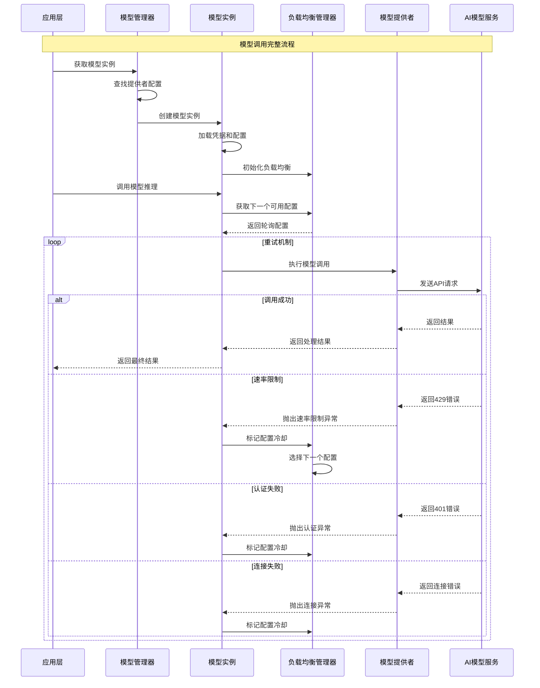
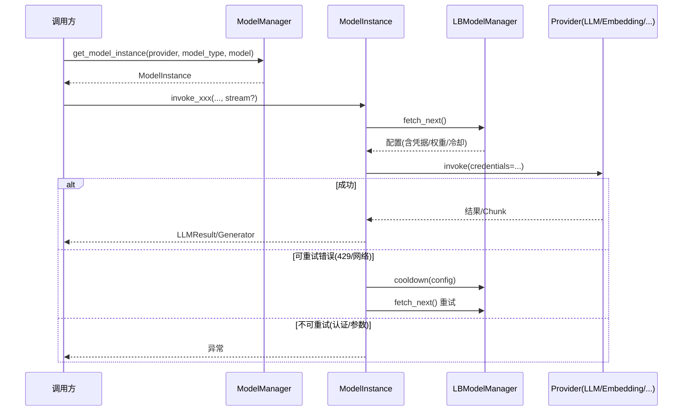
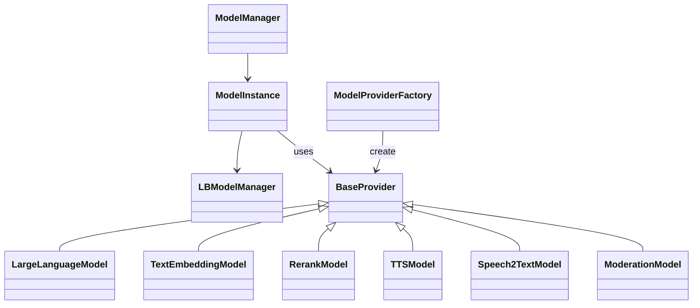

## 概述

Dify的模型运行时模块（`core/model_runtime/`）是平台的多模型统一管理引擎，为上层应用提供了统一的模型调用接口。该模块支持40+个主流AI模型提供者、6种不同类型的AI模型，并实现了智能负载均衡、凭据管理和错误处理机制。

**技术栈与架构特点**：
Dify模型运行时采用了**Python/Flask/PostgreSQL**的经典技术栈：
- **Flask框架**：轻量级Web框架，支持快速API开发和模块化扩展
- **PostgreSQL数据库**：企业级关系数据库，支持JSON字段和复杂查询
- **Redis缓存**：高性能缓存层，用于会话管理和负载均衡状态
- **Celery任务队列**：异步任务处理，支持大规模并发和长时间运行任务

**模型适配器模式**：
Dify通过**适配器模式**实现对40+模型提供者的统一支持：
```python
# 模型提供者适配器示例
class ModelProviderAdapter:
    """模型提供者适配器基类"""
    
    def __init__(self, provider_config: dict):
        self.provider_config = provider_config
        self.rate_limiter = self._init_rate_limiter()
        self.credential_manager = self._init_credentials()
    
    def invoke_model(self, prompt: str, **kwargs) -> ModelResponse:
        """统一的模型调用接口"""
        # 1. 凭据验证
        self._validate_credentials()
        
        # 2. 速率控制
        self._check_rate_limits()
        
        # 3. 参数适配
        adapted_params = self._adapt_parameters(**kwargs)
        
        # 4. 模型调用
        return self._call_provider_api(prompt, adapted_params)
```

、核心组件和关键实现细节。

<!--more-->

## 1. 模型运行时整体架构

### 1.1 三层架构设计

```mermaid
graph TB
    subgraph "工厂层 Factory Layer"
        ModelProviderFactory[ModelProviderFactory 模型提供者工厂]
        ModelManager[ModelManager 模型管理器]
        ProviderManager[ProviderManager 提供者管理器]
    end
    
    subgraph "提供者层 Provider Layer"
        BaseProvider[BaseProvider 基础提供者]
        
        subgraph "主流云服务提供者"
            OpenAI[OpenAI Provider]
            Anthropic[Anthropic Provider]
            Google[Google Provider]
            Azure[Azure OpenAI Provider]
            AWS[AWS Bedrock Provider]
        end
        
        subgraph "国内AI提供者"
            ZhipuAI[智谱AI Provider]
            Tongyi[通义千问 Provider]
            Wenxin[文心一言 Provider]
            Moonshot[月之暗面 Provider]
            Minimax[Minimax Provider]
        end
        
        subgraph "开源/本地部署"
            Ollama[Ollama Provider]
            LocalAI[LocalAI Provider]
            Xinference[Xinference Provider]
            HuggingFace[HuggingFace Provider]
        end
    end
    
    subgraph "模型层 Model Layer"
        BaseModel[BaseModel 基础模型]
        
        subgraph "6种模型类型"
            LLM[LargeLanguageModel 大语言模型]
            Embedding[TextEmbeddingModel 嵌入模型]
            Rerank[RerankModel 重排序模型]
            TTS[TTSModel 语音合成模型]
            STT[Speech2TextModel 语音转文字模型]
            Moderation[ModerationModel 内容审核模型]
        end
    end
    
    subgraph "支撑服务层"
        LoadBalancer[LBModelManager 负载均衡管理器]
        CredentialManager[凭据管理器]
        CallbackSystem[回调系统]
        ErrorHandler[错误处理器]
    end
    
    ModelProviderFactory --> BaseProvider
    ModelManager --> ModelInstance[ModelInstance 模型实例]
    
    BaseProvider --> OpenAI
    BaseProvider --> ZhipuAI
    BaseProvider --> Ollama
    
    BaseModel --> LLM
    BaseModel --> Embedding
    BaseModel --> Rerank
    
    OpenAI --> LLM
    Anthropic --> LLM
    Google --> Embedding
    
    ModelInstance --> LoadBalancer
    ModelInstance --> CredentialManager
    
    style ModelProviderFactory fill:#e3f2fd
    style BaseProvider fill:#e8f5e8
    style BaseModel fill:#fff3e0
    style LoadBalancer fill:#fce4ec
```



### 1.2 模型调用流程



## 2. 模型管理器核心实现

### 2.1 ModelManager统一管理

```python
class ModelManager:
    """
    模型管理器
    提供统一的模型实例获取和管理接口
    """
    
    def __init__(self):
        """
        初始化模型管理器
        创建提供者管理器实例
        """
        self._provider_manager = ProviderManager()
        
        # 模型实例缓存（可选）
        self._model_instance_cache = {}
        
        # 性能统计
        self._performance_stats = ModelPerformanceStats()

    def get_model_instance(
        self, 
        tenant_id: str, 
        provider: str, 
        model_type: ModelType, 
        model: str
    ) -> ModelInstance:
        """
        获取模型实例
        这是模型调用的主要入口点
        
        Args:
            tenant_id: 租户ID，用于隔离不同租户的模型配置
            provider: 模型提供者名称（如openai、anthropic等）
            model_type: 模型类型枚举（LLM、Embedding等）
            model: 具体模型名称（如gpt-4、claude-3等）
            
        Returns:
            ModelInstance: 配置好的模型实例
            
        Raises:
            ProviderTokenNotInitError: 提供者凭据未初始化
            ModelNotFoundError: 模型不存在
        """
        # 如果提供者为空，使用默认模型
        if not provider:
            return self.get_default_model_instance(tenant_id, model_type)

        # 获取提供者模型包
        provider_model_bundle = self._provider_manager.get_provider_model_bundle(
            tenant_id=tenant_id,
            provider=provider,
            model_type=model_type
        )

        # 创建模型实例
        model_instance = ModelInstance(provider_model_bundle, model)
        
        # 记录性能统计
        self._performance_stats.record_model_request(
            provider=provider,
            model_type=model_type,
            model=model
        )
        
        return model_instance

    def get_default_model_instance(
        self, 
        tenant_id: str, 
        model_type: ModelType
    ) -> ModelInstance:
        """
        获取默认模型实例
        当未指定特定提供者时，返回配置的默认模型
        
        Args:
            tenant_id: 租户ID
            model_type: 模型类型
            
        Returns:
            ModelInstance: 默认模型实例
            
        Raises:
            ProviderTokenNotInitError: 默认模型未配置
        """
        # 获取默认模型实体
        default_model_entity = self._provider_manager.get_default_model(
            tenant_id=tenant_id, 
            model_type=model_type
        )

        if not default_model_entity:
            raise ProviderTokenNotInitError(f"模型类型 {model_type} 的默认模型未找到")

        # 返回默认模型实例
        return self.get_model_instance(
            tenant_id=tenant_id,
            provider=default_model_entity.provider.provider,
            model_type=model_type,
            model=default_model_entity.model,
        )

    def get_default_provider_model_name(
        self, 
        tenant_id: str, 
        model_type: ModelType
    ) -> tuple[str | None, str | None]:
        """
        获取默认提供者和模型名称
        返回第一个可用的提供者和该提供者下的第一个模型
        
        Args:
            tenant_id: 租户ID
            model_type: 模型类型
            
        Returns:
            tuple[str | None, str | None]: (提供者名称, 模型名称)
        """
        return self._provider_manager.get_first_provider_first_model(tenant_id, model_type)

    def validate_model_availability(
        self,
        tenant_id: str,
        provider: str,
        model_type: ModelType,
        model: str
    ) -> bool:
        """
        验证模型可用性
        检查模型是否存在且配置正确
        
        Args:
            tenant_id: 租户ID
            provider: 提供者名称
            model_type: 模型类型
            model: 模型名称
            
        Returns:
            bool: 模型是否可用
        """
        try:
            model_instance = self.get_model_instance(
                tenant_id=tenant_id,
                provider=provider,
                model_type=model_type,
                model=model
            )
            
            # 可以进一步进行健康检查
            # 例如调用简单的测试请求
            return True
            
        except Exception as e:
            logger.warning(f"模型可用性检查失败: {provider}/{model}: {e}")
            return False

    def get_available_models(
        self,
        tenant_id: str,
        model_type: ModelType
    ) -> list[dict[str, Any]]:
        """
        获取可用模型列表
        返回所有配置正确的模型信息
        
        Args:
            tenant_id: 租户ID
            model_type: 模型类型
            
        Returns:
            list[dict[str, Any]]: 可用模型列表
        """
        available_models = []
        
        # 获取所有提供者
        providers = self._provider_manager.get_providers(tenant_id)
        
        for provider in providers:
            try:
                # 获取提供者支持的模型
                provider_models = self._provider_manager.get_provider_models(
                    tenant_id=tenant_id,
                    provider=provider.provider,
                    model_type=model_type
                )
                
                for model in provider_models:
                    # 检查模型配置状态
                    if self.validate_model_availability(
                        tenant_id=tenant_id,
                        provider=provider.provider,
                        model_type=model_type,
                        model=model.model
                    ):
                        available_models.append({
                            "provider": provider.provider,
                            "provider_label": provider.label,
                            "model": model.model,
                            "model_label": model.label,
                            "model_type": model_type.value,
                            "features": model.features or [],
                            "parameter_rules": model.parameter_rules or [],
                        })
                        
            except Exception as e:
                logger.warning(f"获取提供者 {provider.provider} 的模型列表失败: {e}")
                continue
        
        return available_models

class ModelPerformanceStats:
    """模型性能统计"""
    
    def __init__(self):
        self.request_counts = {}
        self.error_counts = {}
        self.response_times = {}
        
    def record_model_request(
        self, 
        provider: str, 
        model_type: ModelType, 
        model: str
    ):
        """记录模型请求"""
        key = f"{provider}:{model_type.value}:{model}"
        self.request_counts[key] = self.request_counts.get(key, 0) + 1
    
    def record_model_error(
        self, 
        provider: str, 
        model_type: ModelType, 
        model: str, 
        error_type: str
    ):
        """记录模型错误"""
        key = f"{provider}:{model_type.value}:{model}:{error_type}"
        self.error_counts[key] = self.error_counts.get(key, 0) + 1
    
    def get_stats(self) -> dict[str, Any]:
        """获取统计信息"""
        return {
            "request_counts": self.request_counts,
            "error_counts": self.error_counts,
            "response_times": self.response_times
        }
```

### 1.2 ModelInstance模型实例

ModelInstance是模型调用的核心抽象，提供了统一的模型调用接口：

```python
class ModelInstance:
    """
    模型实例类
    封装了单个模型的完整调用逻辑，包括凭据管理、负载均衡和错误处理
    """

    def __init__(self, provider_model_bundle: ProviderModelBundle, model: str):
        """
        初始化模型实例
        
        Args:
            provider_model_bundle: 提供者模型包，包含提供者配置和模型类型实例
            model: 具体的模型名称
        """
        # 基础属性
        self.provider_model_bundle = provider_model_bundle
        self.model = model
        self.provider = provider_model_bundle.configuration.provider.provider
        
        # 获取模型凭据
        self.credentials = self._fetch_credentials_from_bundle(provider_model_bundle, model)
        
        # 模型类型实例（实际的模型调用实现）
        self.model_type_instance = provider_model_bundle.model_type_instance
        
        # 初始化负载均衡管理器（如果配置了负载均衡）
        self.load_balancing_manager = self._get_load_balancing_manager(
            configuration=provider_model_bundle.configuration,
            model_type=provider_model_bundle.model_type_instance.model_type,
            model=model,
            credentials=self.credentials,
        )

    @staticmethod
    def _fetch_credentials_from_bundle(
        provider_model_bundle: ProviderModelBundle, 
        model: str
    ) -> dict[str, Any]:
        """
        从提供者模型包中获取凭据
        
        Args:
            provider_model_bundle: 提供者模型包
            model: 模型名称
            
        Returns:
            dict[str, Any]: 模型凭据字典
            
        Raises:
            ProviderTokenNotInitError: 凭据未初始化
        """
        configuration = provider_model_bundle.configuration
        model_type = provider_model_bundle.model_type_instance.model_type
        
        # 获取当前模型的凭据
        credentials = configuration.get_current_credentials(
            model_type=model_type, 
            model=model
        )

        if credentials is None:
            raise ProviderTokenNotInitError(f"模型 {model} 的凭据未初始化")

        return credentials

    @staticmethod
    def _get_load_balancing_manager(
        configuration: ProviderConfiguration,
        model_type: ModelType,
        model: str,
        credentials: dict
    ) -> Optional["LBModelManager"]:
        """
        获取负载均衡管理器
        如果配置了负载均衡，创建相应的管理器实例
        
        Args:
            configuration: 提供者配置
            model_type: 模型类型
            model: 模型名称
            credentials: 基础凭据
            
        Returns:
            Optional[LBModelManager]: 负载均衡管理器（如果配置了负载均衡）
        """
        # 检查是否为自定义提供者且配置了模型设置
        if (configuration.model_settings and 
            configuration.using_provider_type == ProviderType.CUSTOM):
            
            # 查找当前模型的设置
            current_model_setting = None
            for model_setting in configuration.model_settings:
                if (model_setting.model_type == model_type and 
                    model_setting.model == model):
                    current_model_setting = model_setting
                    break

            # 检查是否启用了负载均衡
            if (current_model_setting and 
                current_model_setting.load_balancing_configs):
                
                # 创建负载均衡管理器
                lb_model_manager = LBModelManager(
                    tenant_id=configuration.tenant_id,
                    provider=configuration.provider.provider,
                    model_type=model_type,
                    model=model,
                    load_balancing_configs=current_model_setting.load_balancing_configs,
                    managed_credentials=(
                        credentials if configuration.custom_configuration.provider 
                        else None
                    ),
                )

                return lb_model_manager

        return None

    # LLM模型调用方法（支持方法重载）
    @overload
    def invoke_llm(
        self,
        prompt_messages: Sequence[PromptMessage],
        model_parameters: Optional[dict] = None,
        tools: Sequence[PromptMessageTool] | None = None,
        stop: Optional[list[str]] = None,
        stream: Literal[True] = True,
        user: Optional[str] = None,
        callbacks: Optional[list[Callback]] = None,
    ) -> Generator: ...

    @overload
    def invoke_llm(
        self,
        prompt_messages: list[PromptMessage],
        model_parameters: Optional[dict] = None,
        tools: Sequence[PromptMessageTool] | None = None,
        stop: Optional[list[str]] = None,
        stream: Literal[False] = False,
        user: Optional[str] = None,
        callbacks: Optional[list[Callback]] = None,
    ) -> LLMResult: ...

    def invoke_llm(
        self,
        prompt_messages: Sequence[PromptMessage],
        model_parameters: Optional[dict] = None,
        tools: Sequence[PromptMessageTool] | None = None,
        stop: Optional[Sequence[str]] = None,
        stream: bool = True,
        user: Optional[str] = None,
        callbacks: Optional[list[Callback]] = None,
    ) -> Union[LLMResult, Generator]:
        """
        调用大语言模型
        支持流式和非流式输出，自动处理负载均衡和错误重试
        
        Args:
            prompt_messages: 提示消息列表，包含系统、用户、助手消息
            model_parameters: 模型参数，如温度、最大令牌数等
            tools: 工具列表，用于函数调用
            stop: 停止词列表
            stream: 是否流式输出
            user: 唯一用户标识，用于模型提供者的使用统计
            callbacks: 回调函数列表，用于监控和日志记录
            
        Returns:
            Union[LLMResult, Generator]: 
                - 非流式：LLMResult对象
                - 流式：Generator生成器，产生LLMResultChunk对象
                
        Raises:
            Exception: 模型类型不匹配时抛出异常
        """
        # 验证模型类型
        if not isinstance(self.model_type_instance, LargeLanguageModel):
            raise Exception("模型类型实例不是LargeLanguageModel")
        
        # 使用轮询调用执行实际的模型调用
        return cast(
            Union[LLMResult, Generator],
            self._round_robin_invoke(
                function=self.model_type_instance.invoke,
                model=self.model,
                credentials=self.credentials,
                prompt_messages=prompt_messages,
                model_parameters=model_parameters,
                tools=tools,
                stop=stop,
                stream=stream,
                user=user,
                callbacks=callbacks,
            ),
        )

    def get_llm_num_tokens(
        self, 
        prompt_messages: Sequence[PromptMessage], 
        tools: Optional[Sequence[PromptMessageTool]] = None
    ) -> int:
        """
        获取LLM令牌数量
        计算提示消息和工具调用的总令牌数
        
        Args:
            prompt_messages: 提示消息列表
            tools: 工具列表（用于函数调用）
            
        Returns:
            int: 令牌总数
            
        Raises:
            Exception: 模型类型不匹配时抛出异常
        """
        if not isinstance(self.model_type_instance, LargeLanguageModel):
            raise Exception("模型类型实例不是LargeLanguageModel")
        
        return cast(
            int,
            self._round_robin_invoke(
                function=self.model_type_instance.get_num_tokens,
                model=self.model,
                credentials=self.credentials,
                prompt_messages=prompt_messages,
                tools=tools,
            ),
        )

    def invoke_text_embedding(
        self, 
        texts: list[str], 
        user: Optional[str] = None, 
        input_type: EmbeddingInputType = EmbeddingInputType.DOCUMENT
    ) -> TextEmbeddingResult:
        """
        调用文本嵌入模型
        将文本转换为向量表示
        
        Args:
            texts: 待嵌入的文本列表
            user: 用户标识
            input_type: 输入类型，影响嵌入优化策略
            
        Returns:
            TextEmbeddingResult: 嵌入结果，包含向量列表和使用统计
            
        Raises:
            Exception: 模型类型不匹配时抛出异常
        """
        if not isinstance(self.model_type_instance, TextEmbeddingModel):
            raise Exception("模型类型实例不是TextEmbeddingModel")
        
        return cast(
            TextEmbeddingResult,
            self._round_robin_invoke(
                function=self.model_type_instance.invoke,
                model=self.model,
                credentials=self.credentials,
                texts=texts,
                user=user,
                input_type=input_type,
            ),
        )

    def get_text_embedding_num_tokens(self, texts: list[str]) -> list[int]:
        """
        获取文本嵌入令牌数量
        计算每个文本的令牌数量
        
        Args:
            texts: 文本列表
            
        Returns:
            list[int]: 每个文本的令牌数量列表
        """
        if not isinstance(self.model_type_instance, TextEmbeddingModel):
            raise Exception("模型类型实例不是TextEmbeddingModel")
        
        return cast(
            list[int],
            self._round_robin_invoke(
                function=self.model_type_instance.get_num_tokens,
                model=self.model,
                credentials=self.credentials,
                texts=texts,
            ),
        )

    def invoke_rerank(
        self,
        query: str,
        docs: list[str],
        score_threshold: Optional[float] = None,
        top_n: Optional[int] = None,
        user: Optional[str] = None,
    ) -> RerankResult:
        """
        调用重排序模型
        对文档列表按相关性重新排序
        
        Args:
            query: 搜索查询
            docs: 待重排序的文档列表
            score_threshold: 分数阈值，过滤低相关性文档
            top_n: 返回前N个结果
            user: 用户标识
            
        Returns:
            RerankResult: 重排序结果
        """
        if not isinstance(self.model_type_instance, RerankModel):
            raise Exception("模型类型实例不是RerankModel")
        
        return cast(
            RerankResult,
            self._round_robin_invoke(
                function=self.model_type_instance.invoke,
                model=self.model,
                credentials=self.credentials,
                query=query,
                docs=docs,
                score_threshold=score_threshold,
                top_n=top_n,
                user=user,
            ),
        )

    def invoke_moderation(self, text: str, user: Optional[str] = None) -> bool:
        """
        调用内容审核模型
        检查文本内容是否合规
        
        Args:
            text: 待审核的文本
            user: 用户标识
            
        Returns:
            bool: True表示内容有问题，False表示内容安全
        """
        if not isinstance(self.model_type_instance, ModerationModel):
            raise Exception("模型类型实例不是ModerationModel")
        
        return cast(
            bool,
            self._round_robin_invoke(
                function=self.model_type_instance.invoke,
                model=self.model,
                credentials=self.credentials,
                text=text,
                user=user,
            ),
        )

    def invoke_speech2text(self, file: IO[bytes], user: Optional[str] = None) -> str:
        """
        调用语音转文字模型
        将音频文件转换为文本
        
        Args:
            file: 音频文件二进制流
            user: 用户标识
            
        Returns:
            str: 转换后的文本内容
        """
        if not isinstance(self.model_type_instance, Speech2TextModel):
            raise Exception("模型类型实例不是Speech2TextModel")
        
        return cast(
            str,
            self._round_robin_invoke(
                function=self.model_type_instance.invoke,
                model=self.model,
                credentials=self.credentials,
                file=file,
                user=user,
            ),
        )

    def invoke_tts(
        self, 
        content_text: str, 
        tenant_id: str, 
        voice: str, 
        user: Optional[str] = None
    ) -> Iterable[bytes]:
        """
        调用文字转语音模型
        将文本转换为音频流
        
        Args:
            content_text: 待转换的文本内容
            tenant_id: 租户ID
            voice: 语音音色
            user: 用户标识
            
        Returns:
            Iterable[bytes]: 音频数据流
        """
        if not isinstance(self.model_type_instance, TTSModel):
            raise Exception("模型类型实例不是TTSModel")
        
        return cast(
            Iterable[bytes],
            self._round_robin_invoke(
                function=self.model_type_instance.invoke,
                model=self.model,
                credentials=self.credentials,
                content_text=content_text,
                user=user,
                tenant_id=tenant_id,
                voice=voice,
            ),
        )

    def _round_robin_invoke(self, function: Callable[..., Any], *args, **kwargs):
        """
        轮询调用方法
        实现负载均衡和故障转移的核心逻辑
        
        Args:
            function: 要调用的函数
            *args: 位置参数
            **kwargs: 关键字参数
            
        Returns:
            调用结果
            
        Raises:
            ProviderTokenNotInitError: 所有凭据都不可用
            最后一个异常: 如果所有重试都失败
        """
        # 如果没有负载均衡配置，直接调用
        if not self.load_balancing_manager:
            return function(*args, **kwargs)

        last_exception: Union[
            InvokeRateLimitError, 
            InvokeAuthorizationError, 
            InvokeConnectionError, 
            None
        ] = None

        # 负载均衡轮询循环
        while True:
            # 获取下一个可用的负载均衡配置
            lb_config = self.load_balancing_manager.fetch_next()
            
            if not lb_config:
                # 没有可用配置
                if not last_exception:
                    raise ProviderTokenNotInitError("模型凭据未初始化")
                else:
                    raise last_exception

            # 额外的策略合规性检查（作为fetch_next的后备）
            try:
                from core.helper.credential_utils import check_credential_policy_compliance
                
                if lb_config.credential_id:
                    check_credential_policy_compliance(
                        credential_id=lb_config.credential_id,
                        provider=self.provider,
                        credential_type=PluginCredentialType.MODEL,
                    )
                    
            except Exception as e:
                logger.warning(
                    f"负载均衡配置 {lb_config.id} 策略合规性检查失败: {e}"
                )
                # 将该配置标记为冷却状态
                self.load_balancing_manager.cooldown(lb_config, expire=60)
                continue

            try:
                # 使用负载均衡配置的凭据调用函数
                if "credentials" in kwargs:
                    del kwargs["credentials"]
                
                return function(*args, **kwargs, credentials=lb_config.credentials)
                
            except InvokeRateLimitError as e:
                # 速率限制错误：将配置标记为冷却60秒
                self.load_balancing_manager.cooldown(lb_config, expire=60)
                last_exception = e
                continue
                
            except (InvokeAuthorizationError, InvokeConnectionError) as e:
                # 认证或连接错误：将配置标记为冷却10秒
                self.load_balancing_manager.cooldown(lb_config, expire=10)
                last_exception = e
                continue
                
            except Exception as e:
                # 其他异常：直接抛出，不进行重试
                raise e

    def get_tts_voices(self, language: Optional[str] = None):
        """
        获取TTS模型支持的语音列表
        
        Args:
            language: 可选的语言限制
            
        Returns:
            TTS模型支持的语音列表
        """
        if not isinstance(self.model_type_instance, TTSModel):
            raise Exception("模型类型实例不是TTSModel")
        
        return self.model_type_instance.get_tts_model_voices(
            model=self.model, 
            credentials=self.credentials, 
            language=language
        )
```

## 3. 负载均衡管理器

### 3.1 LBModelManager智能负载均衡

```python
class LBModelManager:
    """
    负载均衡模型管理器
    实现多个模型配置之间的智能负载均衡和故障转移
    """

    def __init__(
        self,
        tenant_id: str,
        provider: str,
        model_type: ModelType,
        model: str,
        load_balancing_configs: list[ModelLoadBalancingConfiguration],
        managed_credentials: Optional[dict] = None,
    ):
        """
        初始化负载均衡管理器
        
        Args:
            tenant_id: 租户ID
            provider: 提供者名称
            model_type: 模型类型
            model: 模型名称
            load_balancing_configs: 负载均衡配置列表
            managed_credentials: 托管凭据（用于__inherit__配置）
        """
        self._tenant_id = tenant_id
        self._provider = provider
        self._model_type = model_type
        self._model = model
        self._load_balancing_configs = load_balancing_configs

        # 处理继承凭据的配置
        for load_balancing_config in self._load_balancing_configs[:]:
            if load_balancing_config.name == "__inherit__":
                if not managed_credentials:
                    # 如果没有提供托管凭据，移除继承配置
                    self._load_balancing_configs.remove(load_balancing_config)
                else:
                    # 使用托管凭据
                    load_balancing_config.credentials = managed_credentials

    def fetch_next(self) -> Optional[ModelLoadBalancingConfiguration]:
        """
        获取下一个可用的负载均衡配置
        使用轮询策略实现负载均衡
        
        Returns:
            Optional[ModelLoadBalancingConfiguration]: 下一个可用配置，None表示无可用配置
        """
        # 构建Redis缓存键，用于记录轮询索引
        cache_key = "model_lb_index:{}:{}:{}:{}".format(
            self._tenant_id, self._provider, self._model_type.value, self._model
        )

        cooldown_configs = []  # 记录处于冷却状态的配置
        max_index = len(self._load_balancing_configs)

        while True:
            # 原子性地增加轮询索引
            current_index = redis_client.incr(cache_key)
            current_index = cast(int, current_index)
            
            # 防止索引过大，重置为1
            if current_index >= 10000000:
                current_index = 1
                redis_client.set(cache_key, current_index)

            # 设置缓存过期时间
            redis_client.expire(cache_key, 3600)
            
            # 计算实际配置索引
            if current_index > max_index:
                current_index = current_index % max_index

            real_index = current_index - 1
            if real_index >= max_index:
                real_index = 0

            # 获取当前配置
            config: ModelLoadBalancingConfiguration = self._load_balancing_configs[real_index]

            # 检查配置是否在冷却期
            if self.in_cooldown(config):
                cooldown_configs.append(config)
                
                # 如果所有配置都在冷却期，返回None
                if len(cooldown_configs) >= len(self._load_balancing_configs):
                    return None

                continue  # 尝试下一个配置

            # 检查策略合规性
            try:
                from core.helper.credential_utils import check_credential_policy_compliance

                if config.credential_id:
                    check_credential_policy_compliance(
                        credential_id=config.credential_id,
                        provider=self._provider,
                        credential_type=PluginCredentialType.MODEL,
                    )
                    
            except Exception as e:
                logger.warning(f"负载均衡配置 {config.id} 策略合规性检查失败: {e}")
                cooldown_configs.append(config)
                
                if len(cooldown_configs) >= len(self._load_balancing_configs):
                    return None
                continue

            # 调试日志
            if dify_config.DEBUG:
                logger.info(
                    f"""模型负载均衡选择:
ID: {config.id}
名称: {config.name}
租户ID: {self._tenant_id}
提供者: {self._provider}
模型类型: {self._model_type.value}
模型: {self._model}"""
                )

            return config

    def cooldown(self, config: ModelLoadBalancingConfiguration, expire: int = 60):
        """
        将负载均衡配置标记为冷却状态
        用于暂时屏蔽有问题的配置
        
        Args:
            config: 要冷却的配置
            expire: 冷却时间（秒）
        """
        cooldown_cache_key = "model_lb_index:cooldown:{}:{}:{}:{}:{}".format(
            self._tenant_id, self._provider, self._model_type.value, self._model, config.id
        )

        # 设置冷却标记，带过期时间
        redis_client.setex(cooldown_cache_key, expire, "true")
        
        logger.info(f"配置 {config.id} 已进入冷却期 {expire} 秒")

    def in_cooldown(self, config: ModelLoadBalancingConfiguration) -> bool:
        """
        检查配置是否在冷却期
        
        Args:
            config: 要检查的配置
            
        Returns:
            bool: 是否在冷却期
        """
        cooldown_cache_key = "model_lb_index:cooldown:{}:{}:{}:{}:{}".format(
            self._tenant_id, self._provider, self._model_type.value, self._model, config.id
        )

        return bool(redis_client.exists(cooldown_cache_key))

    @staticmethod
    def get_config_in_cooldown_and_ttl(
        tenant_id: str, 
        provider: str, 
        model_type: ModelType, 
        model: str, 
        config_id: str
    ) -> tuple[bool, int]:
        """
        获取配置的冷却状态和剩余时间
        
        Args:
            tenant_id: 租户ID
            provider: 提供者名称
            model_type: 模型类型
            model: 模型名称
            config_id: 配置ID
            
        Returns:
            tuple[bool, int]: (是否在冷却期, 剩余冷却时间秒数)
        """
        cooldown_cache_key = "model_lb_index:cooldown:{}:{}:{}:{}:{}".format(
            tenant_id, provider, model_type.value, model, config_id
        )

        ttl = redis_client.ttl(cooldown_cache_key)
        
        if ttl == -2:  # 键不存在
            return False, 0

        ttl = cast(int, ttl)
        return True, ttl

    def get_active_configs(self) -> list[ModelLoadBalancingConfiguration]:
        """
        获取当前活跃的配置列表
        排除处于冷却期的配置
        
        Returns:
            list[ModelLoadBalancingConfiguration]: 活跃配置列表
        """
        active_configs = []
        
        for config in self._load_balancing_configs:
            if not self.in_cooldown(config):
                active_configs.append(config)
        
        return active_configs

    def get_load_balancing_status(self) -> dict[str, Any]:
        """
        获取负载均衡状态
        返回所有配置的状态信息
        
        Returns:
            dict[str, Any]: 负载均衡状态信息
        """
        status_info = {
            "total_configs": len(self._load_balancing_configs),
            "active_configs": 0,
            "cooldown_configs": 0,
            "config_details": []
        }
        
        for config in self._load_balancing_configs:
            is_cooldown, ttl = self.get_config_in_cooldown_and_ttl(
                self._tenant_id, self._provider, self._model_type, 
                self._model, config.id
            )
            
            config_detail = {
                "id": config.id,
                "name": config.name,
                "is_cooldown": is_cooldown,
                "cooldown_ttl": ttl,
                "weight": getattr(config, 'weight', 1)
            }
            
            status_info["config_details"].append(config_detail)
            
            if is_cooldown:
                status_info["cooldown_configs"] += 1
            else:
                status_info["active_configs"] += 1
        
        return status_info

class ModelLoadBalancingConfiguration(BaseModel):
    """
    模型负载均衡配置
    定义单个负载均衡配置的所有信息
    """
    
    # 配置唯一ID
    id: str
    
    # 配置名称
    name: str
    
    # 模型凭据
    credentials: dict[str, Any]
    
    # 凭据ID（用于策略合规性检查）
    credential_id: Optional[str] = None
    
    # 权重（用于加权轮询）
    weight: int = 1
    
    # 优先级（数字越小优先级越高）
    priority: int = 0
    
    # 是否启用
    enabled: bool = True
    
    # 配置元数据
    metadata: dict[str, Any] = Field(default_factory=dict)
```

## 4. 模型提供者工厂

### 4.1 ModelProviderFactory提供者管理

```python
class ModelProviderFactory:
    """
    模型提供者工厂
    负责管理和创建各种模型提供者实例
    """

    def __init__(self, tenant_id: str):
        """
        初始化模型提供者工厂
        
        Args:
            tenant_id: 租户ID，用于获取租户特定的配置
        """
        self.tenant_id = tenant_id
        self.plugin_model_manager = PluginModelClient()
        
        # 提供者缓存
        self._provider_cache = {}
        self._cache_lock = Lock()

    def get_providers(self) -> Sequence[ProviderEntity]:
        """
        获取所有可用的模型提供者
        返回支持的所有提供者列表，包括云服务、开源和插件提供者
        
        Returns:
            Sequence[ProviderEntity]: 提供者实体列表
        """
        # 从插件服务器获取提供者（包含内置和插件提供者）
        plugin_providers = self.get_plugin_model_providers()
        
        # 提取提供者声明
        return [provider.declaration for provider in plugin_providers]

    def get_plugin_model_providers(self) -> Sequence[PluginModelProviderEntity]:
        """
        获取所有插件模型提供者
        包含内置提供者和第三方插件提供者
        
        Returns:
            Sequence[PluginModelProviderEntity]: 插件模型提供者列表
        """
        # 使用上下文变量进行线程安全的缓存
        try:
            contexts.plugin_model_providers.get()
        except LookupError:
            contexts.plugin_model_providers.set(None)
            contexts.plugin_model_providers_lock.set(Lock())

        with contexts.plugin_model_providers_lock.get():
            plugin_model_providers = contexts.plugin_model_providers.get()
            
            # 检查缓存
            if plugin_model_providers is not None:
                return plugin_model_providers

            # 缓存为空，重新加载
            plugin_model_providers = []
            contexts.plugin_model_providers.set(plugin_model_providers)

            # 从插件服务器获取模型提供者
            plugin_providers = self.plugin_model_manager.fetch_model_providers(self.tenant_id)

            for provider in plugin_providers:
                # 为插件提供者添加命名空间前缀
                provider.declaration.provider = (
                    provider.plugin_id + "/" + provider.declaration.provider
                )
                plugin_model_providers.append(provider)

            return plugin_model_providers

    def get_provider_schema(self, provider: str) -> ProviderEntity:
        """
        获取提供者schema
        返回提供者的配置规则和支持的模型信息
        
        Args:
            provider: 提供者名称
            
        Returns:
            ProviderEntity: 提供者实体，包含配置规则
            
        Raises:
            ValueError: 提供者不存在
        """
        providers = self.get_providers()
        
        for provider_entity in providers:
            if provider_entity.provider == provider:
                return provider_entity
        
        raise ValueError(f"提供者 {provider} 不存在")

    def get_provider_instance(
        self, 
        provider: str, 
        model_type: ModelType
    ) -> BaseProvider:
        """
        获取提供者实例
        根据提供者名称和模型类型创建提供者实例
        
        Args:
            provider: 提供者名称
            model_type: 模型类型
            
        Returns:
            BaseProvider: 提供者实例
        """
        # 检查缓存
        cache_key = f"{provider}:{model_type.value}"
        if cache_key in self._provider_cache:
            return self._provider_cache[cache_key]

        # 创建新的提供者实例
        provider_instance = self._create_provider_instance(provider, model_type)
        
        # 缓存实例
        with self._cache_lock:
            self._provider_cache[cache_key] = provider_instance
        
        return provider_instance

    def _create_provider_instance(
        self, 
        provider: str, 
        model_type: ModelType
    ) -> BaseProvider:
        """
        创建提供者实例
        根据提供者名称动态导入和创建相应的提供者类
        
        Args:
            provider: 提供者名称
            model_type: 模型类型
            
        Returns:
            BaseProvider: 创建的提供者实例
        """
        # 处理插件提供者（包含命名空间）
        if "/" in provider:
            plugin_id, provider_name = provider.split("/", 1)
            return self._create_plugin_provider_instance(
                plugin_id=plugin_id,
                provider_name=provider_name,
                model_type=model_type
            )
        
        # 内置提供者映射
        provider_mapping = {
            "openai": "core.model_runtime.model_providers.openai",
            "anthropic": "core.model_runtime.model_providers.anthropic", 
            "google": "core.model_runtime.model_providers.google",
            "azure_openai": "core.model_runtime.model_providers.azure_openai",
            "zhipuai": "core.model_runtime.model_providers.zhipuai",
            "tongyi": "core.model_runtime.model_providers.tongyi",
            "wenxin": "core.model_runtime.model_providers.wenxin",
            "moonshot": "core.model_runtime.model_providers.moonshot",
            "ollama": "core.model_runtime.model_providers.ollama",
            # ... 更多提供者映射
        }
        
        provider_module_path = provider_mapping.get(provider)
        if not provider_module_path:
            raise ValueError(f"不支持的提供者: {provider}")
        
        # 动态导入提供者模块
        try:
            provider_module = importlib.import_module(provider_module_path)
            provider_class = getattr(provider_module, f"{provider.title()}Provider")
            
            return provider_class(tenant_id=self.tenant_id)
            
        except (ImportError, AttributeError) as e:
            raise ValueError(f"无法加载提供者 {provider}: {e}")

    def _create_plugin_provider_instance(
        self,
        plugin_id: str,
        provider_name: str,
        model_type: ModelType
    ) -> BaseProvider:
        """
        创建插件提供者实例
        
        Args:
            plugin_id: 插件ID
            provider_name: 提供者名称
            model_type: 模型类型
            
        Returns:
            BaseProvider: 插件提供者实例
        """
        # 通过插件管理器创建提供者实例
        plugin_provider = self.plugin_model_manager.create_provider_instance(
            plugin_id=plugin_id,
            provider_name=provider_name,
            model_type=model_type,
            tenant_id=self.tenant_id
        )
        
        return plugin_provider

    def validate_provider_credentials(
        self,
        provider: str,
        model_type: ModelType,
        credentials: dict[str, Any]
    ) -> tuple[bool, Optional[str]]:
        """
        验证提供者凭据
        检查提供的凭据是否有效
        
        Args:
            provider: 提供者名称
            model_type: 模型类型
            credentials: 凭据字典
            
        Returns:
            tuple[bool, Optional[str]]: (是否有效, 错误信息)
        """
        try:
            # 获取提供者实例
            provider_instance = self.get_provider_instance(provider, model_type)
            
            # 验证凭据
            provider_instance.validate_provider_credentials(credentials)
            
            return True, None
            
        except Exception as e:
            error_message = f"凭据验证失败: {str(e)}"
            logger.warning(error_message)
            return False, error_message

    def get_provider_supported_models(
        self,
        provider: str,
        model_type: ModelType
    ) -> list[dict[str, Any]]:
        """
        获取提供者支持的模型列表
        
        Args:
            provider: 提供者名称
            model_type: 模型类型
            
        Returns:
            list[dict[str, Any]]: 支持的模型列表
        """
        try:
            provider_instance = self.get_provider_instance(provider, model_type)
            
            # 获取预定义模型
            predefined_models = provider_instance.get_predefined_models(model_type)
            
            # 获取远程模型（如果支持）
            remote_models = []
            if hasattr(provider_instance, 'get_remote_models'):
                try:
                    remote_models = provider_instance.get_remote_models(model_type)
                except Exception as e:
                    logger.warning(f"获取远程模型失败: {e}")
            
            # 合并模型列表
            all_models = predefined_models + remote_models
            
            return [
                {
                    "model": model.model,
                    "label": model.label,
                    "model_type": model_type.value,
                    "features": model.features or [],
                    "parameter_rules": model.parameter_rules or [],
                    "pricing": model.pricing or {},
                    "deprecated": getattr(model, 'deprecated', False)
                }
                for model in all_models
            ]
            
        except Exception as e:
            logger.exception(f"获取提供者 {provider} 支持的模型失败: {e}")
            return []
```

## 5. 多模型类型支持

### 5.1 六种模型类型架构

Dify支持6种不同类型的AI模型，每种模型都有专门的接口和实现。Dify的模型类型设计充分考虑了**AI应用的全生命周期需求**：

**模型类型设计的战略考虑**：
```python
# 基于AI应用场景的模型类型规划
AI_APPLICATION_MODEL_MATRIX = {
    "对话应用场景": {
        "核心模型": "LLM",
        "增强模型": ["Embedding", "Moderation"], 
        "可选模型": ["TTS", "STT"],
        "典型架构": "LLM + Embedding(RAG) + Moderation(安全)"
    },
    
    "知识问答场景": {
        "核心模型": "LLM", 
        "增强模型": ["Embedding", "Rerank"],
        "可选模型": ["Moderation"],
        "典型架构": "LLM + Embedding(向量化) + Rerank(重排序)"
    },
    
    "内容创作场景": {
        "核心模型": "LLM",
        "增强模型": ["Moderation"],
        "可选模型": ["TTS", "Embedding"],
        "典型架构": "LLM + Moderation(内容安全)"
    },
    
    "多模态应用场景": {
        "核心模型": "LLM",
        "增强模型": ["Embedding", "STT", "TTS"],
        "可选模型": ["Moderation", "Rerank"],
        "典型架构": "LLM + STT(语音输入) + TTS(语音输出) + Embedding(多模态检索)"
    },
    
    "企业级知识管理": {
        "核心模型": "LLM",
        "增强模型": ["Embedding", "Rerank", "Moderation"],
        "可选模型": ["STT", "TTS"],
        "典型架构": "LLM + 全套模型支持(完整的企业级能力)"
    }
}

# 40+模型提供者的生态位分析
MODEL_PROVIDER_ECOSYSTEM = {
    "全球头部厂商": {
        "openai": {
            "优势": ["技术领先", "生态完善", "API稳定"],
            "劣势": ["成本较高", "数据出境", "API限制"],
            "适用场景": ["高端应用", "原型验证", "技术标杆"],
            "推荐模型": ["gpt-4", "text-embedding-3-large", "whisper-1"]
        },
        "anthropic": {
            "优势": ["安全性强", "推理能力优", "长上下文"],
            "劣势": ["模型种类少", "价格偏高", "可用性限制"],
            "适用场景": ["企业应用", "安全敏感", "长文本处理"],
            "推荐模型": ["claude-3-opus", "claude-3-haiku"]
        },
        "google": {
            "优势": ["多模态强", "免费额度", "技术创新"],
            "劣势": ["API稳定性", "中文支持弱", "商业化程度"],
            "适用场景": ["多模态应用", "创新试验", "成本控制"],
            "推荐模型": ["gemini-pro", "embedding-001"]
        }
    },
    
    "中国本土厂商": {
        "zhipuai": {
            "优势": ["中文优化", "本土化服务", "合规性强"],
            "劣势": ["国际化程度", "技术代际", "生态建设"],
            "适用场景": ["中文应用", "合规要求", "本土部署"],
            "推荐模型": ["glm-4", "embedding-2"]
        },
        "tongyi": {
            "优势": ["阿里生态", "企业级服务", "中文优化"],
            "劣势": ["开放程度", "成本结构", "技术依赖"],
            "适用场景": ["阿里云生态", "企业客户", "电商场景"],
            "推荐模型": ["qwen-max", "text-embedding-v1"]
        },
        "moonshot": {
            "优势": ["长上下文", "性价比高", "响应速度"],
            "劣势": ["模型数量", "稳定性", "功能完整性"],
            "适用场景": ["长文档处理", "成本敏感", "快速迭代"],
            "推荐模型": ["moonshot-v1-128k"]
        }
    },
    
    "开源本地化方案": {
        "ollama": {
            "优势": ["完全本地", "零成本", "数据安全"],
            "劣势": ["性能要求", "模型质量", "维护成本"],
            "适用场景": ["数据敏感", "离线环境", "开发测试"],
            "推荐模型": ["llama2", "code-llama", "mistral"]
        },
        "xinference": {
            "优势": ["模型丰富", "部署灵活", "性能优化"],
            "劣势": ["运维复杂", "资源要求", "技术门槛"],
            "适用场景": ["混合部署", "模型对比", "性能调优"],
            "推荐模型": ["chatglm", "baichuan", "internlm"]
        }
    }
}
```

**模型提供者选择的决策矩阵**：
根据实际部署经验，不同业务场景下的最优选择：

- **初创企业**：OpenAI(快速验证) + 阿里云通义千问(中文优化) + Ollama(成本控制)
- **中型企业**：Claude(安全性) + 智谱AI(中文专业) + 本地部署(数据安全)
- **大型企业**：多提供者混合(风险分散) + 私有化部署(合规要求) + 成本优化策略
- **政府机构**：纯国产化方案 + 私有云部署 + 严格的安全审计

```python
class ModelType(Enum):
    """
    模型类型枚举
    定义Dify支持的所有AI模型类型
    """
    
    # 大语言模型 - 文本生成和对话
    LLM = "llm"
    
    # 文本嵌入模型 - 向量化文本
    TEXT_EMBEDDING = "text-embedding"
    
    # 重排序模型 - 文档相关性重排序
    RERANK = "rerank"
    
    # 语音转文字模型 - 音频转录
    SPEECH2TEXT = "speech2text"
    
    # 文字转语音模型 - 语音合成
    TTS = "tts"
    
    # 内容审核模型 - 内容安全检测
    MODERATION = "moderation"

# 模型类型特性对比
model_type_features = {
    "llm": {
        "description": "大语言模型，支持文本生成、对话和推理",
        "primary_function": "text_generation",
        "input_types": ["text", "image", "audio"],
        "output_types": ["text", "function_calls"],
        "key_features": [
            "多轮对话", "函数调用", "代码生成", 
            "内容创作", "推理问答", "多模态理解"
        ],
        "providers": [
            "openai", "anthropic", "google", "azure_openai",
            "zhipuai", "tongyi", "wenxin", "moonshot", "ollama"
        ],
        "typical_models": [
            "gpt-4", "claude-3", "gemini-pro", 
            "qwen-plus", "ernie-4.0", "moonshot-v1"
        ]
    },
    "text-embedding": {
        "description": "文本嵌入模型，将文本转换为高维向量表示",
        "primary_function": "text_vectorization", 
        "input_types": ["text"],
        "output_types": ["vector"],
        "key_features": [
            "语义相似度计算", "文档检索", "聚类分析",
            "推荐系统", "异常检测"
        ],
        "providers": [
            "openai", "google", "cohere", "jina",
            "zhipuai", "tongyi", "bge", "m3e"
        ],
        "typical_models": [
            "text-embedding-3-large", "embedding-001",
            "embed-multilingual-v3.0", "bge-large-zh"
        ]
    },
    "rerank": {
        "description": "重排序模型，对检索结果按相关性重新排序",
        "primary_function": "relevance_ranking",
        "input_types": ["query_document_pairs"],
        "output_types": ["relevance_scores"],
        "key_features": [
            "检索结果优化", "相关性评分", "排序算法",
            "多语言支持", "跨域泛化"
        ],
        "providers": [
            "cohere", "jina", "voyage", "xinference",
            "bge", "bce"
        ],
        "typical_models": [
            "rerank-english-v3.0", "jina-reranker-v1-base",
            "voyage-rerank-lite", "bge-reranker-large"
        ]
    },
    "speech2text": {
        "description": "语音转文字模型，将音频转录为文本",
        "primary_function": "audio_transcription",
        "input_types": ["audio"],
        "output_types": ["text"],
        "key_features": [
            "多语言识别", "实时转录", "标点符号",
            "说话人识别", "噪声处理"
        ],
        "providers": [
            "openai", "azure_openai", "google",
            "alibaba", "baidu", "iflytek"
        ],
        "typical_models": [
            "whisper-1", "whisper-large-v3",
            "speech-recognition-v1", "asr-v1"
        ]
    },
    "tts": {
        "description": "文字转语音模型，将文本合成为语音",
        "primary_function": "speech_synthesis",
        "input_types": ["text"],
        "output_types": ["audio"],
        "key_features": [
            "多音色选择", "情感表达", "语速控制",
            "多语言合成", "高保真音质"
        ],
        "providers": [
            "openai", "azure_openai", "google",
            "alibaba", "baidu", "iflytek", "elevenlabs"
        ],
        "typical_models": [
            "tts-1", "tts-1-hd", "neural-voice",
            "speech-synthesis-v1"
        ]
    },
    "moderation": {
        "description": "内容审核模型，检测文本内容的安全性",
        "primary_function": "content_safety_detection",
        "input_types": ["text"],
        "output_types": ["safety_scores"],
        "key_features": [
            "有害内容检测", "敏感信息识别", "多维度评分",
            "实时审核", "合规性检查"
        ],
        "providers": [
            "openai", "azure_openai", "google",
            "alibaba", "baidu", "tencent"
        ],
        "typical_models": [
            "text-moderation-latest", "content-safety-v1",
            "moderation-api"
        ]
    }
}

class LargeLanguageModel(AIModel):
    """
    大语言模型基类
    定义所有LLM提供者的通用接口
    """
    
    model_type: ModelType = ModelType.LLM

    @abstractmethod
    def invoke(
        self,
        model: str,
        credentials: dict[str, Any],
        prompt_messages: list[PromptMessage],
        model_parameters: Optional[dict] = None,
        tools: Optional[list[PromptMessageTool]] = None,
        stop: Optional[list[str]] = None,
        stream: bool = True,
        user: Optional[str] = None,
        callbacks: Optional[list[Callback]] = None,
    ) -> Union[LLMResult, Generator[LLMResultChunk, None, None]]:
        """
        调用大语言模型
        子类必须实现的核心调用方法
        
        Args:
            model: 模型名称
            credentials: 模型凭据
            prompt_messages: 提示消息列表
            model_parameters: 模型参数（温度、最大令牌等）
            tools: 工具列表（用于函数调用）
            stop: 停止词列表
            stream: 是否流式输出
            user: 用户标识
            callbacks: 回调函数列表
            
        Returns:
            Union[LLMResult, Generator]: LLM调用结果
        """
        raise NotImplementedError("子类必须实现invoke方法")

    @abstractmethod
    def get_num_tokens(
        self,
        model: str,
        credentials: dict[str, Any],
        prompt_messages: list[PromptMessage],
        tools: Optional[list[PromptMessageTool]] = None,
    ) -> int:
        """
        获取提示消息的令牌数量
        用于成本计算和上下文长度管理
        
        Args:
            model: 模型名称
            credentials: 模型凭据
            prompt_messages: 提示消息列表
            tools: 工具列表
            
        Returns:
            int: 令牌总数
        """
        raise NotImplementedError("子类必须实现get_num_tokens方法")

    def validate_credentials(
        self, 
        model: str, 
        credentials: dict[str, Any]
    ) -> bool:
        """
        验证模型凭据
        检查提供的凭据是否能够成功调用模型
        
        Args:
            model: 模型名称
            credentials: 凭据字典
            
        Returns:
            bool: 凭据是否有效
        """
        try:
            # 使用简单的测试提示验证凭据
            test_messages = [
                UserPromptMessage(content="Hello")
            ]
            
            # 调用模型（非流式，最小参数）
            result = self.invoke(
                model=model,
                credentials=credentials,
                prompt_messages=test_messages,
                model_parameters={"max_tokens": 1, "temperature": 0},
                stream=False,
                user="system_validation"
            )
            
            return True
            
        except Exception as e:
            logger.warning(f"凭据验证失败: {e}")
            return False

    def get_model_schema(
        self, 
        model: str, 
        credentials: dict[str, Any]
    ) -> Optional[AIModelEntity]:
        """
        获取模型schema
        返回模型的能力、参数规则和限制信息
        
        Args:
            model: 模型名称
            credentials: 模型凭据
            
        Returns:
            Optional[AIModelEntity]: 模型实体，包含完整的模型信息
        """
        # 首先从预定义模型中查找
        predefined_models = self.get_predefined_models()
        
        for predefined_model in predefined_models:
            if predefined_model.model == model:
                return predefined_model
        
        # 如果支持远程模型，尝试获取
        if hasattr(self, 'get_remote_models'):
            try:
                remote_models = self.get_remote_models(credentials)
                for remote_model in remote_models:
                    if remote_model.model == model:
                        return remote_model
            except Exception as e:
                logger.warning(f"获取远程模型schema失败: {e}")
        
        return None

    def calculate_cost(
        self,
        model: str,
        prompt_tokens: int,
        completion_tokens: int
    ) -> float:
        """
        计算调用成本
        根据令牌数量和模型定价计算成本
        
        Args:
            model: 模型名称
            prompt_tokens: 提示令牌数
            completion_tokens: 完成令牌数
            
        Returns:
            float: 调用成本（美元）
        """
        model_schema = self.get_model_schema(model, {})
        if not model_schema or not model_schema.pricing:
            return 0.0
        
        pricing = model_schema.pricing
        
        # 计算提示成本
        prompt_cost = (prompt_tokens / 1000000) * pricing.input_price
        
        # 计算完成成本
        completion_cost = (completion_tokens / 1000000) * pricing.output_price
        
        return prompt_cost + completion_cost

class TextEmbeddingModel(AIModel):
    """
    文本嵌入模型基类
    定义文本向量化的通用接口
    """
    
    model_type: ModelType = ModelType.TEXT_EMBEDDING

    @abstractmethod
    def invoke(
        self,
        model: str,
        credentials: dict[str, Any],
        texts: list[str],
        user: Optional[str] = None,
        input_type: EmbeddingInputType = EmbeddingInputType.DOCUMENT,
    ) -> TextEmbeddingResult:
        """
        调用文本嵌入模型
        
        Args:
            model: 模型名称
            credentials: 模型凭据
            texts: 待嵌入的文本列表
            user: 用户标识
            input_type: 输入类型，影响嵌入优化策略
            
        Returns:
            TextEmbeddingResult: 嵌入结果
        """
        raise NotImplementedError("子类必须实现invoke方法")

    @abstractmethod
    def get_num_tokens(
        self, 
        model: str, 
        credentials: dict[str, Any], 
        texts: list[str]
    ) -> list[int]:
        """
        获取文本令牌数量
        
        Args:
            model: 模型名称
            credentials: 模型凭据
            texts: 文本列表
            
        Returns:
            list[int]: 每个文本的令牌数量
        """
        raise NotImplementedError("子类必须实现get_num_tokens方法")

    def batch_embed_with_optimization(
        self,
        model: str,
        credentials: dict[str, Any],
        texts: list[str],
        batch_size: int = 100,
        user: Optional[str] = None,
        input_type: EmbeddingInputType = EmbeddingInputType.DOCUMENT,
    ) -> TextEmbeddingResult:
        """
        批量嵌入优化
        对大量文本进行分批处理，避免API限制
        
        Args:
            model: 模型名称
            credentials: 模型凭据
            texts: 待嵌入的文本列表
            batch_size: 批次大小
            user: 用户标识
            input_type: 输入类型
            
        Returns:
            TextEmbeddingResult: 合并的嵌入结果
        """
        if len(texts) <= batch_size:
            # 小于批次大小，直接调用
            return self.invoke(
                model=model,
                credentials=credentials,
                texts=texts,
                user=user,
                input_type=input_type
            )

        # 分批处理
        all_embeddings = []
        total_tokens = 0
        
        for i in range(0, len(texts), batch_size):
            batch_texts = texts[i:i + batch_size]
            
            batch_result = self.invoke(
                model=model,
                credentials=credentials,
                texts=batch_texts,
                user=user,
                input_type=input_type
            )
            
            all_embeddings.extend(batch_result.embeddings)
            total_tokens += batch_result.usage.total_tokens

        # 合并结果
        return TextEmbeddingResult(
            embeddings=all_embeddings,
            usage=EmbeddingUsage(
                tokens=total_tokens,
                total_price=self._calculate_embedding_cost(model, total_tokens)
            )
        )

class RerankModel(AIModel):
    """
    重排序模型基类
    对检索结果进行相关性重新排序
    """
    
    model_type: ModelType = ModelType.RERANK

    @abstractmethod
    def invoke(
        self,
        model: str,
        credentials: dict[str, Any],
        query: str,
        docs: list[str],
        score_threshold: Optional[float] = None,
        top_n: Optional[int] = None,
        user: Optional[str] = None,
    ) -> RerankResult:
        """
        调用重排序模型
        
        Args:
            model: 模型名称
            credentials: 模型凭据
            query: 搜索查询
            docs: 待重排序的文档列表
            score_threshold: 相关性分数阈值
            top_n: 返回前N个结果
            user: 用户标识
            
        Returns:
            RerankResult: 重排序结果
        """
        raise NotImplementedError("子类必须实现invoke方法")

    def batch_rerank(
        self,
        model: str,
        credentials: dict[str, Any],
        queries: list[str],
        docs_list: list[list[str]],
        score_threshold: Optional[float] = None,
        top_n: Optional[int] = None,
        user: Optional[str] = None,
    ) -> list[RerankResult]:
        """
        批量重排序
        同时处理多个查询的重排序任务
        
        Args:
            model: 模型名称
            credentials: 模型凭据
            queries: 查询列表
            docs_list: 对应的文档列表
            score_threshold: 分数阈值
            top_n: 返回数量
            user: 用户标识
            
        Returns:
            list[RerankResult]: 重排序结果列表
        """
        results = []
        
        for query, docs in zip(queries, docs_list):
            try:
                result = self.invoke(
                    model=model,
                    credentials=credentials,
                    query=query,
                    docs=docs,
                    score_threshold=score_threshold,
                    top_n=top_n,
                    user=user
                )
                results.append(result)
                
            except Exception as e:
                logger.warning(f"重排序失败 - 查询: {query[:50]}..., 错误: {e}")
                # 返回空结果作为备选
                results.append(RerankResult(docs=[]))
        
        return results

class TTSModel(AIModel):
    """
    文字转语音模型基类
    文本到语音合成的通用接口
    """
    
    model_type: ModelType = ModelType.TTS

    @abstractmethod
    def invoke(
        self,
        model: str,
        credentials: dict[str, Any],
        content_text: str,
        user: Optional[str] = None,
        tenant_id: Optional[str] = None,
        voice: Optional[str] = None,
    ) -> Iterable[bytes]:
        """
        调用文字转语音模型
        
        Args:
            model: 模型名称
            credentials: 模型凭据
            content_text: 待合成的文本内容
            user: 用户标识
            tenant_id: 租户ID
            voice: 语音音色
            
        Returns:
            Iterable[bytes]: 音频数据流
        """
        raise NotImplementedError("子类必须实现invoke方法")

    @abstractmethod
    def get_tts_model_voices(
        self, 
        model: str, 
        credentials: dict[str, Any], 
        language: Optional[str] = None
    ) -> list[dict]:
        """
        获取TTS模型支持的语音列表
        
        Args:
            model: 模型名称
            credentials: 模型凭据
            language: 可选的语言过滤
            
        Returns:
            list[dict]: 语音列表，包含音色信息
        """
        raise NotImplementedError("子类必须实现get_tts_model_voices方法")

    def synthesize_long_text(
        self,
        model: str,
        credentials: dict[str, Any],
        content_text: str,
        voice: str,
        max_chunk_length: int = 1000,
        user: Optional[str] = None,
        tenant_id: Optional[str] = None,
    ) -> Iterable[bytes]:
        """
        长文本语音合成
        将长文本分块进行语音合成，避免长度限制
        
        Args:
            model: 模型名称
            credentials: 模型凭据
            content_text: 长文本内容
            voice: 语音音色
            max_chunk_length: 最大块长度
            user: 用户标识
            tenant_id: 租户ID
            
        Yields:
            bytes: 音频数据块
        """
        # 智能分块，避免在句子中间断开
        text_chunks = self._smart_split_text(content_text, max_chunk_length)
        
        for chunk in text_chunks:
            if chunk.strip():
                try:
                    # 合成当前块
                    audio_stream = self.invoke(
                        model=model,
                        credentials=credentials,
                        content_text=chunk,
                        user=user,
                        tenant_id=tenant_id,
                        voice=voice
                    )
                    
                    # 输出音频数据
                    for audio_chunk in audio_stream:
                        yield audio_chunk
                        
                except Exception as e:
                    logger.warning(f"文本块合成失败: {e}")
                    continue

    def _smart_split_text(self, text: str, max_length: int) -> list[str]:
        """
        智能文本分块
        在句子边界处分割，保持语义完整性
        
        Args:
            text: 原始文本
            max_length: 最大块长度
            
        Returns:
            list[str]: 分割后的文本块
        """
        if len(text) <= max_length:
            return [text]
        
        chunks = []
        sentences = re.split(r'[。！？.!?]', text)
        
        current_chunk = ""
        for sentence in sentences:
            sentence = sentence.strip()
            if not sentence:
                continue
            
            # 检查是否可以添加到当前块
            if len(current_chunk + sentence) <= max_length:
                current_chunk += sentence + "。"
            else:
                # 当前块已满，开始新块
                if current_chunk:
                    chunks.append(current_chunk)
                current_chunk = sentence + "。"
        
        # 添加最后一块
        if current_chunk:
            chunks.append(current_chunk)
        
        return chunks

class ModerationModel(AIModel):
    """
    内容审核模型基类
    检测文本内容的安全性和合规性
    """
    
    model_type: ModelType = ModelType.MODERATION

    @abstractmethod
    def invoke(
        self,
        model: str,
        credentials: dict[str, Any],
        text: str,
        user: Optional[str] = None,
    ) -> bool:
        """
        调用内容审核模型
        
        Args:
            model: 模型名称
            credentials: 模型凭据
            text: 待审核的文本
            user: 用户标识
            
        Returns:
            bool: True表示内容有问题，False表示内容安全
        """
        raise NotImplementedError("子类必须实现invoke方法")

    def batch_moderate(
        self,
        model: str,
        credentials: dict[str, Any],
        texts: list[str],
        user: Optional[str] = None,
    ) -> list[bool]:
        """
        批量内容审核
        同时审核多个文本
        
        Args:
            model: 模型名称
            credentials: 模型凭据
            texts: 待审核的文本列表
            user: 用户标识
            
        Returns:
            list[bool]: 每个文本的审核结果
        """
        results = []
        
        for text in texts:
            try:
                result = self.invoke(
                    model=model,
                    credentials=credentials,
                    text=text,
                    user=user
                )
                results.append(result)
                
            except Exception as e:
                logger.warning(f"文本审核失败: {e}")
                # 出错时标记为有问题，确保安全
                results.append(True)
        
        return results

    def get_moderation_details(
        self,
        model: str,
        credentials: dict[str, Any],
        text: str,
        user: Optional[str] = None,
    ) -> dict[str, Any]:
        """
        获取详细的审核信息
        返回各个维度的审核分数和原因
        
        Args:
            model: 模型名称
            credentials: 模型凭据
            text: 待审核文本
            user: 用户标识
            
        Returns:
            dict[str, Any]: 详细审核信息
        """
        # 基础实现，子类可以覆盖以提供更详细的信息
        is_flagged = self.invoke(model, credentials, text, user)
        
        return {
            "flagged": is_flagged,
            "categories": {},  # 子类应该提供具体的分类信息
            "scores": {},      # 子类应该提供具体的分数信息
        }
```

### 5.3 模型路由与熔断策略

**多维度路由**：价格、延迟、可靠性、配额、区域合规。

```python
class SmartModelRouter:
    def select(self, candidates: list[ProviderModel], context: dict) -> ProviderModel:
        # 评分 = w1*成本 + w2*延迟 + w3*(1-错误率) + w4*配额占比
        for c in candidates:
            c.score = (
                0.3*c.cost_per_1k + 0.3*c.p95_latency + 0.3*(1-c.error_rate) + 0.1*c.quota_ratio
            )
        return min(candidates, key=lambda x: x.score)
```

**熔断降级**：
- 快速失败 → 备用同档模型 → 低成本模型 → 规则回答
- 按提供商维度健康度评分（滑动窗口错误率/超时率）

**成本/延迟参考矩阵（示例）**：
- 高端：GPT-4 / Claude-Opus（高成本/高质量/中延迟）
- 中端：Claude-Haiku / Qwen-Plus（中成本/中质量/低延迟）
- 低端：GPT-3.5 / Qwen-Turbo（低成本/中质量/低延迟）

## 6. 错误处理与重试机制

### 6.1 智能错误处理

```python
class ModelInvokeErrorHandler:
    """
    模型调用错误处理器
    提供智能的错误分类、重试和故障转移机制
    """
    
    # 可重试的错误类型
    RETRYABLE_ERRORS = {
        InvokeRateLimitError: {"max_retries": 5, "backoff_factor": 2},
        InvokeConnectionError: {"max_retries": 3, "backoff_factor": 1.5},
        InvokeServerError: {"max_retries": 2, "backoff_factor": 1},
    }
    
    # 不可重试的错误类型
    NON_RETRYABLE_ERRORS = {
        InvokeAuthorizationError,  # 认证错误
        InvokeQuotaExceededError,  # 配额超出
        InvokeValidationError,     # 参数验证错误
    }

    def __init__(self, model_instance: ModelInstance):
        """
        初始化错误处理器
        
        Args:
            model_instance: 模型实例
        """
        self.model_instance = model_instance
        self.retry_counts = {}

    def handle_invoke_error(
        self,
        error: Exception,
        function: Callable,
        *args,
        **kwargs
    ) -> Any:
        """
        处理模型调用错误
        根据错误类型决定重试、故障转移或直接抛出
        
        Args:
            error: 捕获的异常
            function: 调用的函数
            *args: 函数参数
            **kwargs: 函数关键字参数
            
        Returns:
            Any: 重试成功的结果
            
        Raises:
            Exception: 最终失败时抛出原始异常
        """
        error_type = type(error)
        
        # 检查是否为可重试错误
        if error_type in self.NON_RETRYABLE_ERRORS:
            logger.error(f"不可重试错误: {error}")
            raise error

        if error_type not in self.RETRYABLE_ERRORS:
            logger.error(f"未知错误类型: {error}")
            raise error

        # 获取重试配置
        retry_config = self.RETRYABLE_ERRORS[error_type]
        max_retries = retry_config["max_retries"]
        backoff_factor = retry_config["backoff_factor"]

        # 获取当前重试次数
        error_key = f"{function.__name__}:{error_type.__name__}"
        current_retries = self.retry_counts.get(error_key, 0)

        if current_retries >= max_retries:
            logger.error(f"重试次数已达上限 {max_retries}: {error}")
            raise error

        # 执行重试
        self.retry_counts[error_key] = current_retries + 1
        
        # 计算退避时间
        backoff_time = backoff_factor ** current_retries
        
        logger.info(
            f"重试调用 ({current_retries + 1}/{max_retries})，"
            f"等待 {backoff_time} 秒: {error}"
        )
        
        time.sleep(backoff_time)
        
        try:
            # 重新执行调用
            result = function(*args, **kwargs)
            
            # 重试成功，重置计数
            if error_key in self.retry_counts:
                del self.retry_counts[error_key]
            
            return result
            
        except Exception as retry_error:
            # 重试仍然失败，递归处理
            return self.handle_invoke_error(retry_error, function, *args, **kwargs)

class ModelHealthChecker:
    """
    模型健康检查器
    定期检查模型的可用性和性能
    """
    
    def __init__(self, model_manager: ModelManager):
        """
        初始化健康检查器
        
        Args:
            model_manager: 模型管理器实例
        """
        self.model_manager = model_manager
        self.health_status = {}
        self.performance_metrics = {}

    def check_model_health(
        self,
        tenant_id: str,
        provider: str,
        model_type: ModelType,
        model: str
    ) -> dict[str, Any]:
        """
        检查单个模型的健康状况
        
        Args:
            tenant_id: 租户ID
            provider: 提供者
            model_type: 模型类型
            model: 模型名称
            
        Returns:
            dict[str, Any]: 健康状况报告
        """
        health_report = {
            "model_key": f"{provider}:{model_type.value}:{model}",
            "is_healthy": False,
            "response_time": None,
            "error": None,
            "last_check": time.time()
        }
        
        try:
            start_time = time.time()
            
            # 获取模型实例
            model_instance = self.model_manager.get_model_instance(
                tenant_id=tenant_id,
                provider=provider,
                model_type=model_type,
                model=model
            )
            
            # 执行健康检查调用
            if model_type == ModelType.LLM:
                self._check_llm_health(model_instance)
            elif model_type == ModelType.TEXT_EMBEDDING:
                self._check_embedding_health(model_instance)
            elif model_type == ModelType.RERANK:
                self._check_rerank_health(model_instance)
            # ... 其他模型类型的健康检查
            
            response_time = time.time() - start_time
            
            health_report.update({
                "is_healthy": True,
                "response_time": response_time
            })
            
        except Exception as e:
            health_report.update({
                "is_healthy": False,
                "error": str(e)
            })
        
        # 更新健康状态缓存
        self.health_status[health_report["model_key"]] = health_report
        
        return health_report

    def _check_llm_health(self, model_instance: ModelInstance):
        """检查LLM模型健康状况"""
        test_messages = [UserPromptMessage(content="Hello")]
        
        result = model_instance.invoke_llm(
            prompt_messages=test_messages,
            model_parameters={"max_tokens": 1, "temperature": 0},
            stream=False,
            user="health_check"
        )
        
        if not result or not result.message:
            raise Exception("LLM健康检查失败：无返回内容")

    def _check_embedding_health(self, model_instance: ModelInstance):
        """检查嵌入模型健康状况"""
        test_texts = ["健康检查测试文本"]
        
        result = model_instance.invoke_text_embedding(
            texts=test_texts,
            user="health_check"
        )
        
        if not result or not result.embeddings:
            raise Exception("嵌入模型健康检查失败：无返回向量")

    def _check_rerank_health(self, model_instance: ModelInstance):
        """检查重排序模型健康状况"""
        test_query = "测试查询"
        test_docs = ["测试文档1", "测试文档2"]
        
        result = model_instance.invoke_rerank(
            query=test_query,
            docs=test_docs,
            user="health_check"
        )
        
        if not result or not result.docs:
            raise Exception("重排序模型健康检查失败：无返回结果")

    def get_overall_health_status(self) -> dict[str, Any]:
        """
        获取整体健康状况
        
        Returns:
            dict[str, Any]: 整体健康状况统计
        """
        total_models = len(self.health_status)
        healthy_models = sum(
            1 for status in self.health_status.values()
            if status["is_healthy"]
        )
        
        return {
            "total_models": total_models,
            "healthy_models": healthy_models,
            "unhealthy_models": total_models - healthy_models,
            "health_rate": healthy_models / total_models if total_models > 0 else 0,
            "last_check": max(
                (status["last_check"] for status in self.health_status.values()),
                default=0
            )
        }
```

## 7. 总结

### 7.1 模型运行时核心特点

Dify模型运行时模块的设计体现了以下特点：

1. **统一接口**：为6种模型类型提供一致的调用接口
2. **多提供者支持**：支持40+个主流AI模型提供者
3. **智能负载均衡**：自动故障转移和负载分发
4. **错误处理**：完善的重试机制和错误分类
5. **性能监控**：全面的性能指标和健康检查

### 7.2 技术优势

1. **横向扩展性**：新提供者和模型类型易于添加
2. **高可用性**：多重故障转移保障服务稳定
3. **成本优化**：智能的令牌计算和成本控制
4. **插件生态**：支持第三方插件扩展
5. **企业级特性**：完整的租户隔离和权限管理


## 8. 关键函数核心代码与说明

以下摘录聚焦统一调用与负载均衡的关键路径，便于与源码交叉对照。

```python
class ModelManager:
    def get_model_instance(self, tenant_id: str, provider: str, model_type: ModelType, model: str) -> ModelInstance:
        """返回封装好凭据/类型实例/负载均衡器的 `ModelInstance`。找不到配置将抛出语义化异常。"""

class ModelInstance:
    def invoke_llm(self, prompt_messages: Sequence[PromptMessage], model_parameters: dict | None = None,
                   tools: Sequence[PromptMessageTool] | None = None, stop: Sequence[str] | None = None,
                   stream: bool = True, user: str | None = None, callbacks: list[Callback] | None = None) -> Union[LLMResult, Generator]:
        """统一的 LLM 调用入口；内部通过 `_round_robin_invoke` 进行负载均衡与错误处理。"""

    def _round_robin_invoke(self, function: Callable[..., Any], *args, **kwargs):
        """轮询取下一个可用配置并调用；对限流/认证/连接等错误做冷却与重试，其他异常直抛。"""

class LBModelManager:
    def fetch_next(self) -> Optional[ModelLoadBalancingConfiguration]:
        """返回未处于冷却期的下一个配置；基于 Redis 维护轮询索引与冷却状态。"""

class ModelProviderFactory:
    def get_provider_instance(self, provider: str, model_type: ModelType) -> BaseProvider:
        """按 provider + model_type 动态创建/缓存 Provider 实例；支持插件命名空间。"""
```

### 8.1 要点说明

- 统一入口：上层仅依赖 `ModelManager`/`ModelInstance`，屏蔽 Provider 细节。
- 负载均衡：`_round_robin_invoke` 与 `LBModelManager` 协作，支持冷却与轮询。
- 错误治理：区分可重试（429/网络）与不可重试（认证/参数）路径。
- 可拓展性：`ModelProviderFactory` 动态加载与缓存 Provider 实例。

## 9. 关键函数调用链（按职责）

```text
调用发起(应用/服务)
  → ModelManager.get_model_instance
    → ProviderManager.get_provider_model_bundle
    → ModelInstance.__init__(凭据提取 + LB 初始化)
  → ModelInstance.invoke_* (llm/embedding/rerank/...)
    → ModelInstance._round_robin_invoke
      → LBModelManager.fetch_next → 合规检查/冷却判断
      → BaseProvider(ModelType).invoke(..., credentials=...)
      → 成功返回 或 捕获错误 → 冷却/重试/直抛
```

## 10. 统一时序图（精简版）



## 11. 关键结构与继承关系（类图）


