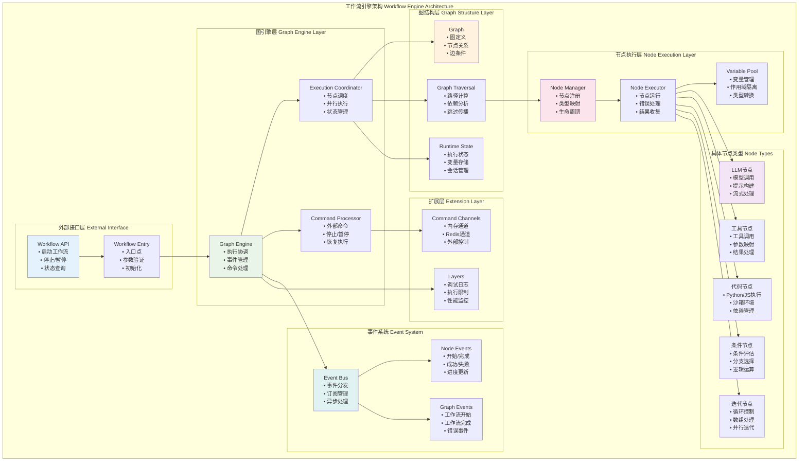
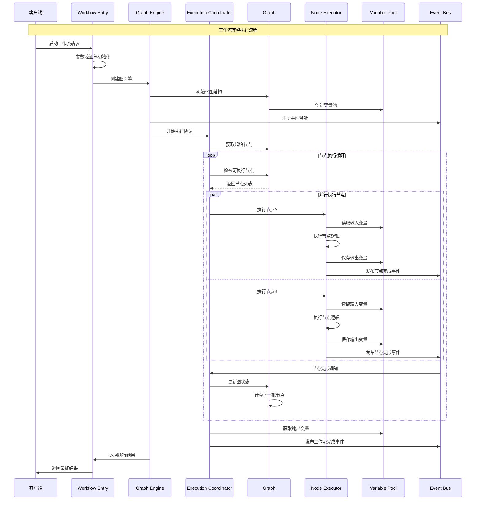
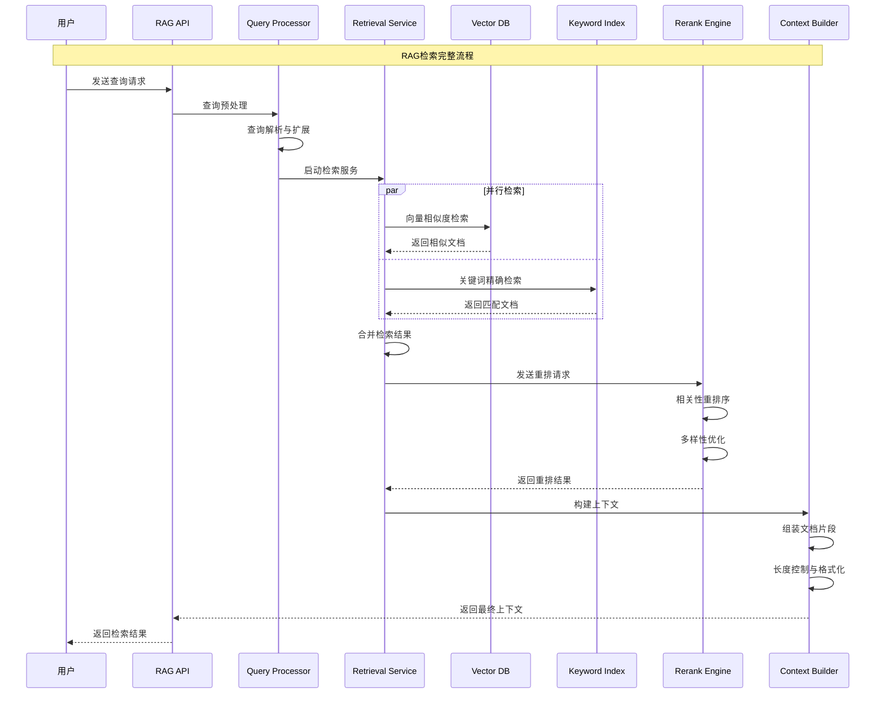
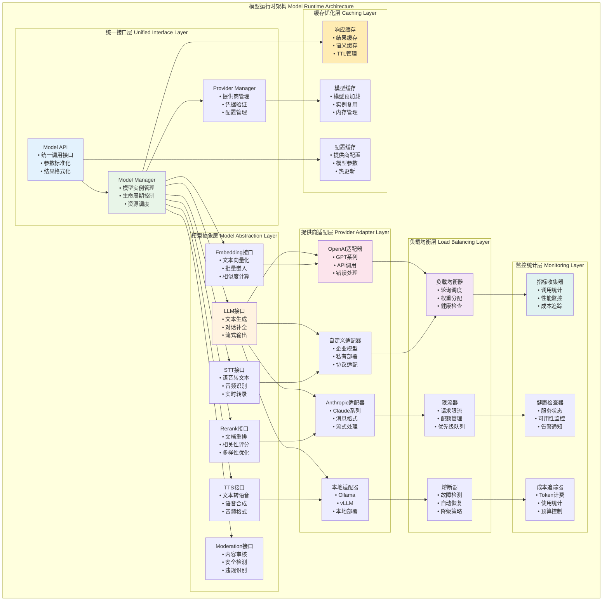
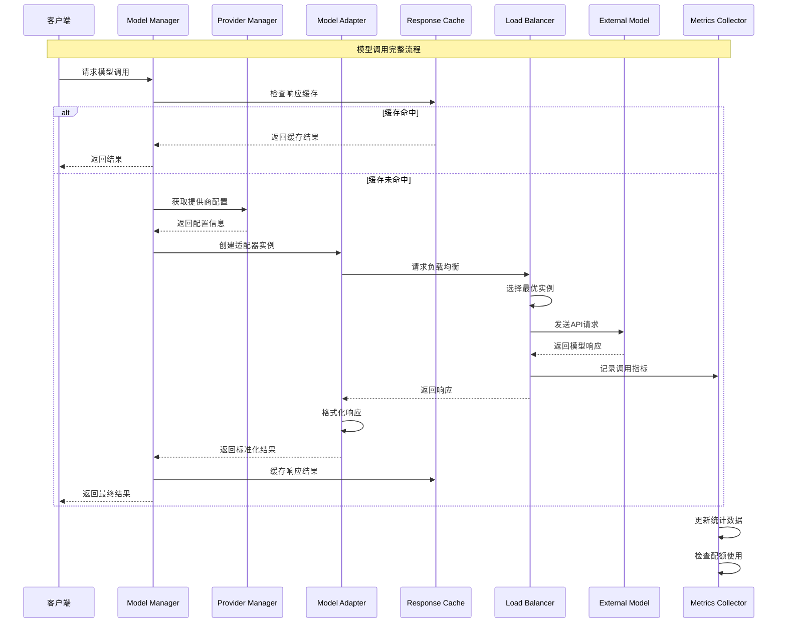
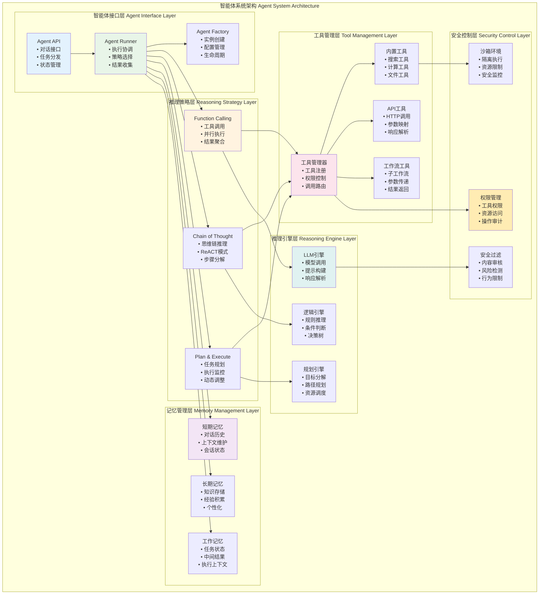
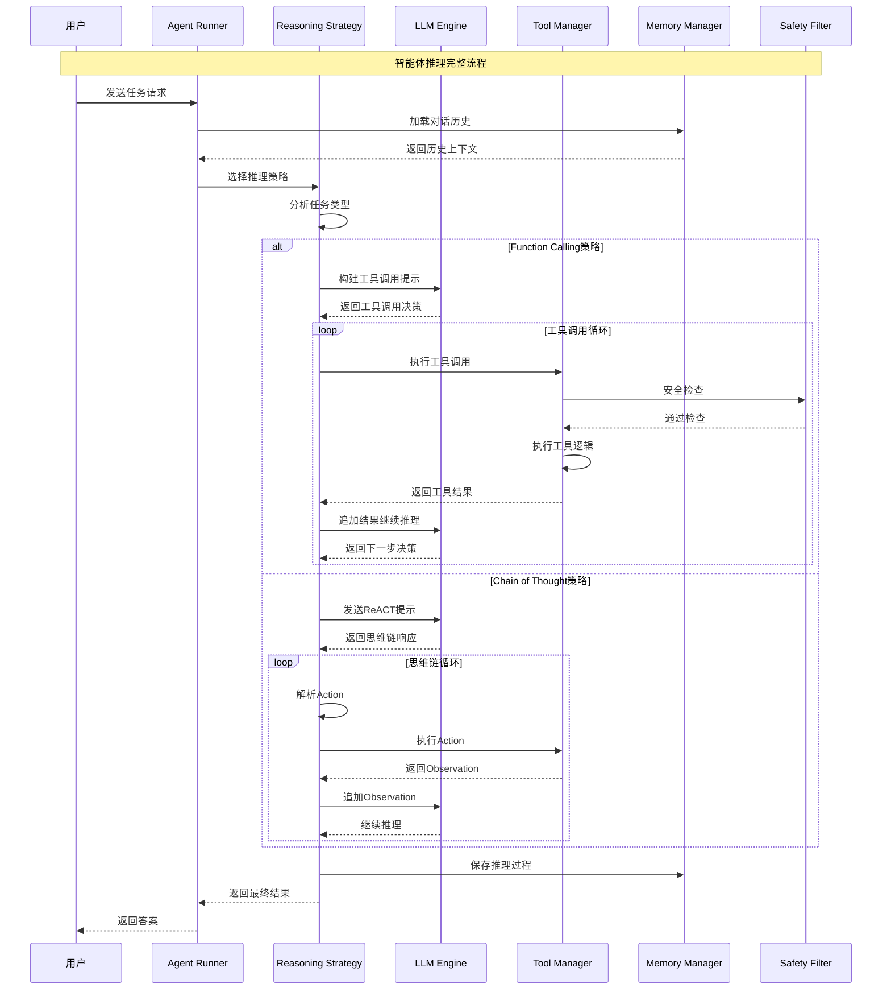

## 概述

本文档深入分析Dify平台的核心模块，通过架构图、时序图、API分析和关键函数代码，全面解析各模块的设计理念、实现细节和交互机制。

<!--more-->

## 1. 工作流引擎模块 (Workflow Engine)

### 1.1 模块架构图



### 1.2 工作流执行时序图



### 1.3 核心类设计

```python
# api/core/workflow/workflow_entry.py
class WorkflowEntry:
    """工作流入口点，负责初始化和启动工作流执行"""
    
    def __init__(
        self,
        tenant_id: str,
        app_id: str,
        workflow_id: str,
        graph_config: Mapping[str, Any],
        graph: Graph,
        user_id: str,
        user_from: UserFrom,
        invoke_from: InvokeFrom,
        call_depth: int,
        variable_pool: VariablePool,
        graph_runtime_state: GraphRuntimeState,
        command_channel: CommandChannel | None = None,
    ) -> None:
        self.tenant_id = tenant_id
        self.app_id = app_id
        self.workflow_id = workflow_id
        self.graph_config = graph_config
        self.graph = graph
        self.user_id = user_id
        self.user_from = user_from
        self.invoke_from = invoke_from
        self.call_depth = call_depth
        self.variable_pool = variable_pool
        self.graph_runtime_state = graph_runtime_state
        self.command_channel = command_channel or InMemoryChannel()
        
    def run(self, inputs: Mapping[str, Any]) -> Generator[GraphEngineEvent, None, None]:
        """运行工作流并返回事件流"""
        # 初始化系统变量
        system_variables = SystemVariable.fetch(
            tenant_id=self.tenant_id,
            user_id=self.user_id,
            user_from=self.user_from,
            invoke_from=self.invoke_from,
        )
        
        # 加载变量到变量池
        load_into_variable_pool(
            variable_pool=self.variable_pool,
            variables=inputs,
            system_variables=system_variables,
        )
        
        # 创建图引擎
        graph_engine = GraphEngine(
            graph=self.graph,
            graph_runtime_state=self.graph_runtime_state,
            variable_pool=self.variable_pool,
            command_channel=self.command_channel,
        )
        
        # 添加扩展层
        if dify_config.DEBUG:
            graph_engine.add_layer(DebugLoggingLayer())
        
        graph_engine.add_layer(ExecutionLimitsLayer(max_execution_steps=500))
        
        # 执行工作流
        yield from graph_engine.run()
```

### 1.4 节点类型映射

```python
# api/core/workflow/nodes/node_mapping.py
from core.workflow.nodes import NodeType

NODE_TYPE_CLASSES_MAPPING = {
    NodeType.START: "core.workflow.nodes.start.start_node.StartNode",
    NodeType.END: "core.workflow.nodes.end.end_node.EndNode",
    NodeType.LLM: "core.workflow.nodes.llm.llm_node.LLMNode",
    NodeType.KNOWLEDGE_RETRIEVAL: "core.workflow.nodes.knowledge_retrieval.knowledge_retrieval_node.KnowledgeRetrievalNode",
    NodeType.IF_ELSE: "core.workflow.nodes.if_else.if_else_node.IfElseNode",
    NodeType.CODE: "core.workflow.nodes.code.code_node.CodeNode",
    NodeType.TEMPLATE_TRANSFORM: "core.workflow.nodes.template_transform.template_transform_node.TemplateTransformNode",
    NodeType.HTTP_REQUEST: "core.workflow.nodes.http_request.http_request_node.HttpRequestNode",
    NodeType.TOOL: "core.workflow.nodes.tool.tool_node.ToolNode",
    NodeType.VARIABLE_AGGREGATOR: "core.workflow.nodes.variable_aggregator.variable_aggregator_node.VariableAggregatorNode",
    NodeType.VARIABLE_ASSIGNER: "core.workflow.nodes.variable_assigner.variable_assigner_node.VariableAssignerNode",
    NodeType.ITERATION: "core.workflow.nodes.iteration.iteration_node.IterationNode",
    NodeType.PARAMETER_EXTRACTOR: "core.workflow.nodes.parameter_extractor.parameter_extractor_node.ParameterExtractorNode",
    NodeType.CONVERSATION_VARIABLE_ASSIGNER: "core.workflow.nodes.conversation_variable_assigner.conversation_variable_assigner_node.ConversationVariableAssignerNode",
}
```

## 2. RAG系统模块 (RAG Engine)

### 2.1 RAG系统架构图

```mermaid
graph TB
    subgraph "RAG系统架构 RAG System Architecture"
        subgraph "文档处理层 Document Processing Layer"
            DocumentUpload[文档上传<br/>• 格式验证<br/>• 大小限制<br/>• 类型检查]
            DocumentParser[文档解析器<br/>• PDF解析<br/>• DOCX解析<br/>• 文本提取]
            ContentCleaner[内容清理<br/>• 格式清理<br/>• 噪声去除<br/>• 编码转换]
        end
        
        subgraph "文本处理层 Text Processing Layer"
            TextSplitter[文本分割器<br/>• 段落分割<br/>• 语义分割<br/>• 重叠处理]
            ChunkProcessor[块处理器<br/>• 大小控制<br/>• 元数据添加<br/>• 质量评估]
            QAProcessor[QA处理器<br/>• 问答对提取<br/>• 结构化处理<br/>• 质量验证]
        end
        
        subgraph "向量化层 Vectorization Layer"
            EmbeddingModel[嵌入模型<br/>• 文本向量化<br/>• 批量处理<br/>• 模型管理]
            VectorGenerator[向量生成器<br/>• 向量计算<br/>• 归一化<br/>• 质量检查]
            BatchProcessor[批处理器<br/>• 批量嵌入<br/>• 进度跟踪<br/>• 错误重试]
        end
        
        subgraph "索引构建层 Index Building Layer"
            VectorIndex[向量索引<br/>• HNSW索引<br/>• 相似度计算<br/>• 快速检索]
            KeywordIndex[关键词索引<br/>• 全文索引<br/>• 倒排索引<br/>• 精确匹配]
            MetadataIndex[元数据索引<br/>• 属性索引<br/>• 过滤查询<br/>• 范围搜索]
        end
        
        subgraph "存储层 Storage Layer"
            VectorDB[向量数据库<br/>• Qdrant<br/>• Weaviate<br/>• Pinecone]
            SearchEngine[搜索引擎<br/>• Elasticsearch<br/>• 全文检索<br/>• 聚合查询]
            MetaDB[元数据库<br/>• PostgreSQL<br/>• 关系数据<br/>• 事务支持]
        end
        
        subgraph "检索层 Retrieval Layer"
            QueryProcessor[查询处理器<br/>• 查询解析<br/>• 意图识别<br/>• 查询扩展]
            RetrievalService[检索服务<br/>• 多路检索<br/>• 结果合并<br/>• 去重处理]
            HybridSearch[混合检索<br/>• 向量检索<br/>• 关键词检索<br/>• 权重融合]
        end
        
        subgraph "后处理层 Post-processing Layer"
            RerankEngine[重排引擎<br/>• 相关性重排<br/>• 多样性优化<br/>• 质量评分]
            ResultMerger[结果合并<br/>• 多源合并<br/>• 去重去噪<br/>• 排序优化]
            ContextBuilder[上下文构建<br/>• 上下文组装<br/>• 长度控制<br/>• 格式化]
        end
    end
    
    %% 数据流向
    DocumentUpload --> DocumentParser
    DocumentParser --> ContentCleaner
    ContentCleaner --> TextSplitter
    
    TextSplitter --> ChunkProcessor
    ChunkProcessor --> QAProcessor
    QAProcessor --> EmbeddingModel
    
    EmbeddingModel --> VectorGenerator
    VectorGenerator --> BatchProcessor
    BatchProcessor --> VectorIndex
    
    VectorIndex --> VectorDB
    ChunkProcessor --> KeywordIndex
    KeywordIndex --> SearchEngine
    QAProcessor --> MetadataIndex
    MetadataIndex --> MetaDB
    
    QueryProcessor --> RetrievalService
    RetrievalService --> HybridSearch
    HybridSearch --> VectorDB
    HybridSearch --> SearchEngine
    HybridSearch --> MetaDB
    
    VectorDB --> RerankEngine
    SearchEngine --> ResultMerger
    MetaDB --> ContextBuilder
    
    RerankEngine --> ResultMerger
    ResultMerger --> ContextBuilder
    
    %% 样式
    style DocumentUpload fill:#e3f2fd
    style TextSplitter fill:#e8f5e8
    style EmbeddingModel fill:#fff3e0
    style VectorIndex fill:#fce4ec
    style VectorDB fill:#f3e5f5
    style QueryProcessor fill:#e0f2f1
    style RerankEngine fill:#ffecb3
```



### 2.2 RAG检索时序图



### 2.3 核心检索服务实现

```python
# api/core/rag/datasource/retrieval_service.py
class RetrievalService:
    """RAG检索服务核心实现"""
    
    @classmethod
    def retrieve(
        cls,
        retrieval_method: str,
        dataset_id: str,
        query: str,
        top_k: int,
        score_threshold: float,
        reranking_model: dict | None = None,
        all_documents: list | None = None,
        search_method: str = "semantic_search",
        document_ids_filter: list[str] | None = None,
    ) -> list[Document]:
        """
        执行多模式检索
        
        Args:
            retrieval_method: 检索方法 (semantic_search, full_text_search, hybrid_search)
            dataset_id: 数据集ID
            query: 查询文本
            top_k: 返回文档数量
            score_threshold: 相似度阈值
            reranking_model: 重排模型配置
            document_ids_filter: 文档ID过滤器
            
        Returns:
            检索到的文档列表
        """
        with current_app.app_context():
            all_documents = all_documents or []
            threads = []
            exceptions = []
            
            # 根据检索方法启动相应的检索线程
            if retrieval_method in ["semantic_search", "hybrid_search"]:
                # 向量检索线程
                semantic_thread = threading.Thread(
                    target=cls.embedding_search,
                    args=(
                        current_app._get_current_object(),
                        dataset_id,
                        query,
                        top_k,
                        score_threshold,
                        reranking_model,
                        all_documents,
                        retrieval_method,
                        exceptions,
                        document_ids_filter,
                    ),
                )
                threads.append(semantic_thread)
                semantic_thread.start()
            
            if retrieval_method in ["full_text_search", "hybrid_search"]:
                # 全文检索线程
                full_text_thread = threading.Thread(
                    target=cls.full_text_index_search,
                    args=(
                        current_app._get_current_object(),
                        dataset_id,
                        query,
                        top_k,
                        score_threshold,
                        reranking_model,
                        all_documents,
                        retrieval_method,
                        exceptions,
                        document_ids_filter,
                    ),
                )
                threads.append(full_text_thread)
                full_text_thread.start()
            
            # 等待所有检索线程完成
            for thread in threads:
                thread.join()
            
            # 处理异常
            if exceptions:
                logger.exception(f"Retrieval failed: {exceptions}")
            
            # 混合检索结果处理
            if retrieval_method == "hybrid_search":
                return cls._hybrid_search_fusion(all_documents, query, top_k, score_threshold)
            
            return all_documents[:top_k]
    
    @classmethod
    def embedding_search(
        cls,
        flask_app: Flask,
        dataset_id: str,
        query: str,
        top_k: int,
        score_threshold: float | None,
        reranking_model: dict | None,
        all_documents: list,
        retrieval_method: str,
        exceptions: list,
        document_ids_filter: list[str] | None = None,
    ):
        """向量相似度检索实现"""
        with flask_app.app_context():
            try:
                dataset = cls._get_dataset(dataset_id)
                if not dataset:
                    raise ValueError("dataset not found")
                
                # 创建向量检索器
                vector = Vector(dataset=dataset)
                documents = vector.search_by_vector(
                    query,
                    search_type="similarity_score_threshold",
                    top_k=top_k,
                    score_threshold=score_threshold,
                    filter={"group_id": [dataset.id]},
                    document_ids_filter=document_ids_filter,
                )
                
                # 应用重排模型
                if documents and reranking_model and retrieval_method == "semantic_search":
                    data_post_processor = DataPostProcessor(
                        str(dataset.tenant_id), 
                        str(RerankMode.RERANKING_MODEL.value), 
                        reranking_model, 
                        None, 
                        False
                    )
                    all_documents.extend(
                        data_post_processor.invoke(
                            query=query,
                            documents=documents,
                            score_threshold=score_threshold,
                            top_n=len(documents),
                        )
                    )
                else:
                    all_documents.extend(documents)
                    
            except Exception as e:
                exceptions.append(str(e))
```

### 2.4 向量数据库工厂模式

```python
# api/core/rag/datasource/vdb/vector_factory.py
class Vector:
    """向量数据库统一接口"""
    
    def __init__(self, dataset: Dataset, attributes: list | None = None):
        if dataset.indexing_technique != "high_quality":
            raise ValueError("Vector store is only available for high quality indexing")
        
        self.dataset = dataset
        self.attributes = attributes or []
        
        # 获取嵌入模型
        model_manager = ModelManager()
        self._embeddings = model_manager.get_model_instance(
            tenant_id=dataset.tenant_id,
            provider=dataset.embedding_model_provider,
            model_type=ModelType.TEXT_EMBEDDING,
            model=dataset.embedding_model,
        )
        
        # 获取向量处理器
        vector_type = dify_config.VECTOR_STORE
        vector_factory = self.get_vector_factory(vector_type)
        self._vector_processor = vector_factory.init_vector(dataset, attributes, self._embeddings)
    
    @staticmethod
    def get_vector_factory(vector_type: str) -> type[AbstractVectorFactory]:
        """根据配置获取向量数据库工厂"""
        match vector_type:
            case VectorType.QDRANT:
                from core.rag.datasource.vdb.qdrant.qdrant_vector import QdrantVectorFactory
                return QdrantVectorFactory
            case VectorType.WEAVIATE:
                from core.rag.datasource.vdb.weaviate.weaviate_vector import WeaviateVectorFactory
                return WeaviateVectorFactory
            case VectorType.PINECONE:
                from core.rag.datasource.vdb.pinecone.pinecone_vector import PineconeVectorFactory
                return PineconeVectorFactory
            case VectorType.CHROMA:
                from core.rag.datasource.vdb.chroma.chroma_vector import ChromaVectorFactory
                return ChromaVectorFactory
            case _:
                raise ValueError(f"Vector store {vector_type} is not supported.")
    
    def create(self, texts: list | None = None, **kwargs):
        """批量创建向量索引"""
        if texts:
            start = time.time()
            logger.info("start embedding %s texts %s", len(texts), start)
            
            batch_size = 1000
            total_batches = (len(texts) + batch_size - 1) // batch_size
            
            for i in range(0, len(texts), batch_size):
                batch = texts[i : i + batch_size]
                batch_start = time.time()
                logger.info("Processing batch %s/%s (%s texts)", 
                           i // batch_size + 1, total_batches, len(batch))
                
                # 批量嵌入
                batch_embeddings = self._embeddings.embed_documents(
                    [document.page_content for document in batch]
                )
                
                logger.info("Embedding batch %s/%s took %s s", 
                           i // batch_size + 1, total_batches, time.time() - batch_start)
                
                # 创建向量索引
                self._vector_processor.create(texts=batch, embeddings=batch_embeddings, **kwargs)
            
            logger.info("Embedding %s texts took %s s", len(texts), time.time() - start)
    
    def search_by_vector(self, query: str, **kwargs: Any) -> list[Document]:
        """向量相似度搜索"""
        query_vector = self._embeddings.embed_query(query)
        return self._vector_processor.search_by_vector(query_vector, **kwargs)
```

## 3. 模型运行时模块 (Model Runtime)

### 3.1 模型运行时架构图



### 3.2 模型调用时序图



### 3.3 核心模型管理器实现

```python
# api/core/model_manager.py
class ModelManager:
    """模型管理器核心实现"""
    
    def __init__(self):
        self.provider_manager = ProviderManager()
        self._model_instances: dict[str, Any] = {}
        self._lock = threading.RLock()
    
    def get_model_instance(
        self,
        tenant_id: str,
        provider: str,
        model_type: ModelType,
        model: str,
        credentials: dict | None = None,
    ) -> ModelInstance:
        """
        获取模型实例，支持实例复用和缓存
        
        Args:
            tenant_id: 租户ID
            provider: 提供商名称
            model_type: 模型类型
            model: 模型名称
            credentials: 认证凭据
            
        Returns:
            模型实例
        """
        # 构建缓存键
        cache_key = f"{tenant_id}:{provider}:{model_type.value}:{model}"
        
        with self._lock:
            # 检查实例缓存
            if cache_key in self._model_instances:
                instance = self._model_instances[cache_key]
                if self._validate_instance(instance):
                    return instance
                else:
                    # 清理无效实例
                    del self._model_instances[cache_key]
            
            # 创建新实例
            instance = self._create_model_instance(
                tenant_id, provider, model_type, model, credentials
            )
            
            # 缓存实例
            self._model_instances[cache_key] = instance
            return instance
    
    def _create_model_instance(
        self,
        tenant_id: str,
        provider: str,
        model_type: ModelType,
        model: str,
        credentials: dict | None = None,
    ) -> ModelInstance:
        """创建模型实例"""
        # 获取提供商配置
        provider_instance = self.provider_manager.get_provider_instance(provider)
        
        # 获取或验证凭据
        if not credentials:
            credentials = self.provider_manager.get_provider_credentials(
                tenant_id, provider
            )
        
        # 验证凭据
        provider_instance.validate_provider_credentials(credentials)
        
        # 获取模型实例
        model_instance = provider_instance.get_model_instance(model_type)
        
        # 配置模型参数
        model_instance.load_model(
            model=model,
            model_kwargs=self._get_model_kwargs(provider, model_type, model),
            credentials=credentials,
        )
        
        return ModelInstance(
            provider=provider,
            model_type=model_type,
            model=model,
            model_instance=model_instance,
            credentials=credentials,
        )
    
    def invoke_llm(
        self,
        tenant_id: str,
        provider: str,
        model: str,
        prompt_messages: list[PromptMessage],
        model_parameters: dict | None = None,
        tools: list[PromptMessageTool] | None = None,
        stop: list[str] | None = None,
        stream: bool = True,
        user: str | None = None,
    ) -> LLMResult | Generator[LLMResultChunk, None, None]:
        """
        调用LLM模型
        
        Args:
            tenant_id: 租户ID
            provider: 提供商
            model: 模型名称
            prompt_messages: 提示消息列表
            model_parameters: 模型参数
            tools: 工具列表
            stop: 停止词
            stream: 是否流式输出
            user: 用户标识
            
        Returns:
            LLM调用结果
        """
        # 获取模型实例
        model_instance = self.get_model_instance(
            tenant_id=tenant_id,
            provider=provider,
            model_type=ModelType.LLM,
            model=model,
        )
        
        # 构建调用参数
        invoke_kwargs = {
            "model": model,
            "messages": prompt_messages,
            "model_parameters": model_parameters or {},
            "tools": tools,
            "stop": stop,
            "stream": stream,
            "user": user,
        }
        
        # 应用负载均衡和限流
        with self._get_rate_limiter(tenant_id, provider).acquire():
            try:
                # 执行模型调用
                if stream:
                    return model_instance.invoke_llm_stream(**invoke_kwargs)
                else:
                    return model_instance.invoke_llm(**invoke_kwargs)
                    
            except Exception as e:
                # 记录错误指标
                self._record_error_metrics(tenant_id, provider, model, str(e))
                raise
            finally:
                # 记录调用指标
                self._record_invoke_metrics(tenant_id, provider, model)
```

### 3.4 提供商管理器实现

```python
# api/core/provider_manager.py
class ProviderManager:
    """提供商管理器"""
    
    def __init__(self):
        self._providers: dict[str, ModelProvider] = {}
        self._provider_credentials: dict[str, dict] = {}
        self._lock = threading.RLock()
    
    def get_provider_instance(self, provider: str) -> ModelProvider:
        """获取提供商实例"""
        with self._lock:
            if provider not in self._providers:
                self._providers[provider] = self._load_provider(provider)
            return self._providers[provider]
    
    def _load_provider(self, provider: str) -> ModelProvider:
        """动态加载提供商"""
        provider_map = {
            "openai": "core.model_runtime.model_providers.openai.openai.OpenAIProvider",
            "anthropic": "core.model_runtime.model_providers.anthropic.anthropic.AnthropicProvider",
            "ollama": "core.model_runtime.model_providers.ollama.ollama.OllamaProvider",
            # 更多提供商...
        }
        
        if provider not in provider_map:
            raise ValueError(f"Unsupported provider: {provider}")
        
        module_path, class_name = provider_map[provider].rsplit(".", 1)
        module = importlib.import_module(module_path)
        provider_class = getattr(module, class_name)
        
        return provider_class()
    
    def get_provider_credentials(self, tenant_id: str, provider: str) -> dict:
        """获取提供商凭据"""
        cache_key = f"{tenant_id}:{provider}"
        
        if cache_key in self._provider_credentials:
            return self._provider_credentials[cache_key]
        
        # 从数据库加载凭据
        credentials = self._load_credentials_from_db(tenant_id, provider)
        
        # 缓存凭据
        self._provider_credentials[cache_key] = credentials
        return credentials
    
    def validate_provider_credentials(
        self, provider: str, credentials: dict
    ) -> tuple[bool, str | None]:
        """验证提供商凭据"""
        try:
            provider_instance = self.get_provider_instance(provider)
            provider_instance.validate_provider_credentials(credentials)
            return True, None
        except Exception as e:
            return False, str(e)
```

## 4. 智能体系统模块 (Agent System)

### 4.1 智能体系统架构图



### 4.2 智能体推理时序图



### 4.3 Function Calling智能体实现

```python
# api/core/agent/agent_runner/function_call_agent_runner.py
class FunctionCallAgentRunner(BaseAgentRunner):
    """Function Calling策略智能体运行器"""
    
    def run(
        self,
        message: Message,
        query: str,
        inputs: dict[str, str] | None = None,
        **kwargs
    ) -> Generator[LLMResultChunk, None, None]:
        """
        执行Function Calling推理流程
        
        Args:
            message: 消息对象
            query: 用户查询
            inputs: 输入参数
            
        Yields:
            LLM结果块
        """
        app_generate_entity = self.application_generate_entity
        app_config = app_generate_entity.app_config
        
        # 初始化工具和提示
        prompt_messages, tools = self._init_prompt_tools(
            query=query,
            inputs=inputs,
            agent_entity=app_config.agent,
            conversation_id=self.conversation.id,
            message_id=message.id,
        )
        
        # 创建智能体思维记录
        agent_thought = self.create_agent_thought(
            message_id=message.id,
            message="",
            tool_name="",
            tool_input="",
            messages_ids=[]
        )
        
        # 执行多轮对话
        iteration = 0
        max_iteration = min(app_config.agent.max_iteration, 5)
        
        while iteration < max_iteration:
            iteration += 1
            
            # 调用LLM
            llm_result_chunk_stream = self._handle_llm_invoke(
                prompt_messages=prompt_messages,
                tools=tools,
                agent_thought=agent_thought,
            )
            
            # 处理流式响应
            tool_calls = []
            assistant_message_content = ""
            
            for chunk in llm_result_chunk_stream:
                if chunk.delta.message and chunk.delta.message.content:
                    assistant_message_content += chunk.delta.message.content
                    yield chunk
                
                if chunk.delta.message and chunk.delta.message.tool_calls:
                    tool_calls.extend(chunk.delta.message.tool_calls)
            
            # 添加助手消息到对话历史
            prompt_messages.append(
                AssistantPromptMessage(
                    content=assistant_message_content,
                    tool_calls=tool_calls
                )
            )
            
            # 如果没有工具调用，结束推理
            if not tool_calls:
                break
            
            # 执行工具调用
            tool_responses = self._execute_tool_calls(
                tool_calls=tool_calls,
                agent_thought=agent_thought,
            )
            
            # 添加工具响应到对话历史
            for tool_response in tool_responses:
                prompt_messages.append(
                    ToolPromptMessage(
                        content=tool_response.result,
                        tool_call_id=tool_response.tool_call_id,
                        name=tool_response.tool_name,
                    )
                )
            
            # 如果所有工具都执行成功，继续下一轮推理
            if all(resp.result for resp in tool_responses):
                continue
            else:
                break
        
        # 保存智能体思维
        self.save_agent_thought(
            agent_thought=agent_thought,
            tool_name="",
            tool_input="",
            tool_output="",
        )
    
    def _execute_tool_calls(
        self,
        tool_calls: list[AssistantPromptMessage.ToolCall],
        agent_thought: AgentThought,
    ) -> list[ToolResponse]:
        """
        执行工具调用
        
        Args:
            tool_calls: 工具调用列表
            agent_thought: 智能体思维记录
            
        Returns:
            工具响应列表
        """
        tool_responses = []
        
        for tool_call in tool_calls:
            # 获取工具实例
            tool_instance = self._get_tool_instance(tool_call.function.name)
            
            if not tool_instance:
                tool_responses.append(
                    ToolResponse(
                        tool_call_id=tool_call.id,
                        tool_name=tool_call.function.name,
                        result=f"Tool {tool_call.function.name} not found",
                    )
                )
                continue
            
            try:
                # 解析工具参数
                tool_parameters = json.loads(tool_call.function.arguments)
                
                # 执行工具
                tool_result = tool_instance.invoke(
                    user_id=self.user_id,
                    tool_parameters=tool_parameters,
                )
                
                # 格式化工具结果
                result_content = self._format_tool_response(tool_result)
                
                tool_responses.append(
                    ToolResponse(
                        tool_call_id=tool_call.id,
                        tool_name=tool_call.function.name,
                        result=result_content,
                    )
                )
                
                # 更新智能体思维
                self._update_agent_thought(
                    agent_thought=agent_thought,
                    tool_name=tool_call.function.name,
                    tool_input=tool_call.function.arguments,
                    tool_output=result_content,
                )
                
            except Exception as e:
                logger.exception(f"Tool execution failed: {e}")
                tool_responses.append(
                    ToolResponse(
                        tool_call_id=tool_call.id,
                        tool_name=tool_call.function.name,
                        result=f"Tool execution failed: {str(e)}",
                    )
                )
        
        return tool_responses
```

### 4.4 工具管理器实现

```python
# api/core/tools/tool_manager.py
class ToolManager:
    """工具管理器核心实现"""
    
    def __init__(self):
        self._builtin_tools: dict[str, type] = {}
        self._api_tools: dict[str, dict] = {}
        self._workflow_tools: dict[str, dict] = {}
        self._load_builtin_tools()
    
    def get_agent_tool_runtime(
        self,
        tenant_id: str,
        app_id: str,
        agent_tool: AgentToolEntity,
        invoke_from: InvokeFrom,
    ) -> Tool:
        """
        获取智能体工具运行时实例
        
        Args:
            tenant_id: 租户ID
            app_id: 应用ID
            agent_tool: 智能体工具配置
            invoke_from: 调用来源
            
        Returns:
            工具实例
        """
        if agent_tool.tool_type == AgentToolType.BUILTIN:
            return self._get_builtin_tool_runtime(agent_tool)
        elif agent_tool.tool_type == AgentToolType.API:
            return self._get_api_tool_runtime(tenant_id, agent_tool)
        elif agent_tool.tool_type == AgentToolType.WORKFLOW:
            return self._get_workflow_tool_runtime(tenant_id, agent_tool)
        else:
            raise ValueError(f"Unsupported tool type: {agent_tool.tool_type}")
    
    def _get_builtin_tool_runtime(self, agent_tool: AgentToolEntity) -> BuiltinTool:
        """获取内置工具运行时"""
        tool_provider = agent_tool.provider
        tool_name = agent_tool.tool_name
        
        # 获取工具类
        tool_class = self._get_builtin_tool_class(tool_provider, tool_name)
        
        # 创建工具实例
        tool_instance = tool_class()
        
        # 配置工具参数
        if agent_tool.tool_configuration:
            tool_instance.load_configuration(agent_tool.tool_configuration)
        
        return tool_instance
    
    def _get_api_tool_runtime(
        self, tenant_id: str, agent_tool: AgentToolEntity
    ) -> ApiTool:
        """获取API工具运行时"""
        # 从数据库加载API工具配置
        api_tool_config = self._load_api_tool_config(
            tenant_id, agent_tool.tool_id
        )
        
        # 创建API工具实例
        api_tool = ApiTool(
            api_config=api_tool_config,
            tool_configuration=agent_tool.tool_configuration,
        )
        
        return api_tool
    
    def _get_workflow_tool_runtime(
        self, tenant_id: str, agent_tool: AgentToolEntity
    ) -> WorkflowTool:
        """获取工作流工具运行时"""
        # 从数据库加载工作流配置
        workflow_config = self._load_workflow_config(
            tenant_id, agent_tool.workflow_id
        )
        
        # 创建工作流工具实例
        workflow_tool = WorkflowTool(
            workflow_config=workflow_config,
            tool_configuration=agent_tool.tool_configuration,
        )
        
        return workflow_tool
    
    def _load_builtin_tools(self):
        """加载内置工具"""
        builtin_tools_dir = Path(__file__).parent / "builtin_tools"
        
        for provider_dir in builtin_tools_dir.iterdir():
            if not provider_dir.is_dir():
                continue
            
            provider_name = provider_dir.name
            tools_dir = provider_dir / "tools"
            
            if not tools_dir.exists():
                continue
            
            for tool_file in tools_dir.glob("*.py"):
                if tool_file.name.startswith("_"):
                    continue
                
                tool_name = tool_file.stem
                tool_key = f"{provider_name}.{tool_name}"
                
                # 动态导入工具类
                module_path = f"core.tools.builtin_tools.{provider_name}.tools.{tool_name}"
                try:
                    module = importlib.import_module(module_path)
                    tool_class = getattr(module, f"{tool_name.title()}Tool")
                    self._builtin_tools[tool_key] = tool_class
                except (ImportError, AttributeError) as e:
                    logger.warning(f"Failed to load builtin tool {tool_key}: {e}")
```

## 5. 总结

### 5.1 模块设计特点

1. **工作流引擎**：
   - 基于图的执行模型，支持复杂的节点依赖关系
   - 事件驱动架构，实现松耦合的组件通信
   - 分层设计，支持中间件扩展和外部控制
   - 并行执行能力，提高工作流执行效率

2. **RAG系统**：
   - 模块化的处理流水线，支持不同的索引策略
   - 多模式检索，结合向量检索和关键词检索
   - 可插拔的向量数据库支持，适应不同部署需求
   - 智能重排和后处理，提高检索质量

3. **模型运行时**：
   - 统一的模型接口，屏蔽不同提供商的差异
   - 负载均衡和故障转移，保证服务可用性
   - 智能缓存和成本控制，优化性能和成本
   - 丰富的监控指标，支持运维管理

4. **智能体系统**：
   - 多种推理策略，适应不同类型的任务
   - 灵活的工具系统，支持内置、API和工作流工具
   - 完善的安全控制，确保智能体行为安全
   - 记忆管理机制，支持上下文感知和个性化

### 5.2 架构优势

- **可扩展性**：模块化设计支持水平扩展和功能扩展
- **可维护性**：清晰的分层架构和接口设计
- **可观测性**：完善的事件系统和监控机制
- **可靠性**：错误处理、重试机制和故障转移
- **性能优化**：缓存、批处理和并行执行
- **安全性**：权限控制、内容审核和沙箱执行

这些模块共同构成了Dify平台强大而灵活的技术基础，为构建复杂的AI应用提供了坚实的支撑。
