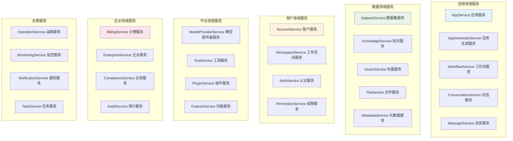
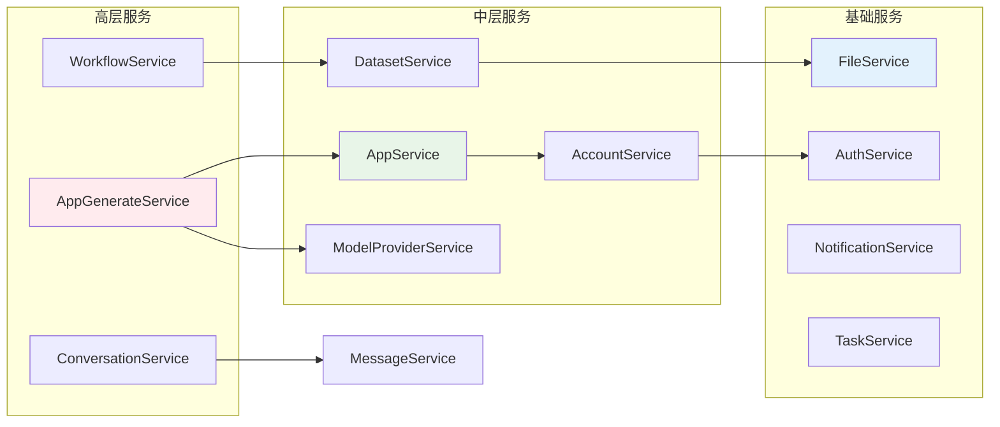
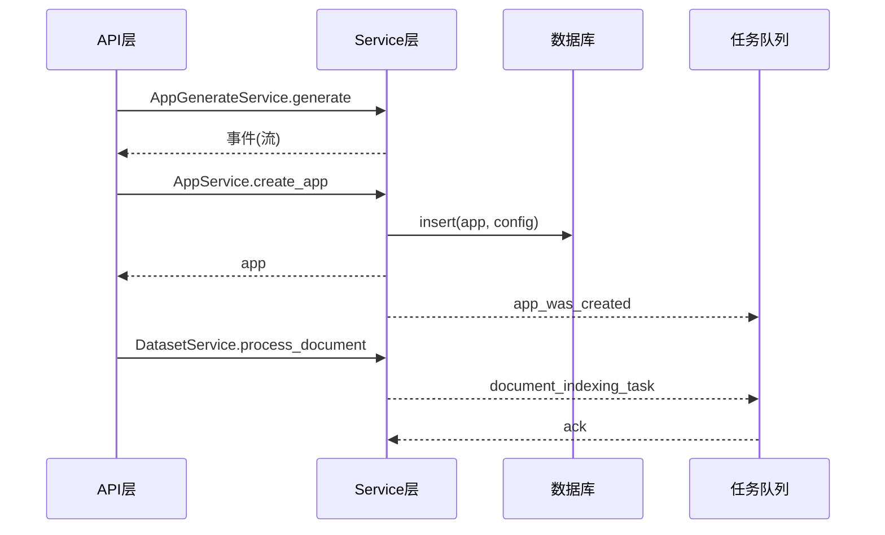
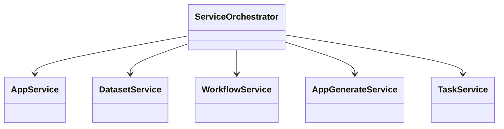

## 概述

Dify的服务层模块（`services/`）是平台的业务逻辑核心，采用领域驱动设计（DDD）实现了完整的业务功能。该模块包含20+个核心服务，涵盖应用管理、数据集处理、工作流执行、用户账户、计费系统等各个业务领域，为上层API提供了丰富的业务能力支撑。

**Code Executor安全执行引擎**：
Dify实现了**安全的代码执行器（Code Executor）**，支持多种编程语言的安全执行：

```python
class CodeExecutor:
    """
    安全代码执行器
    支持Python、Node.js、Go等多种语言的沙箱执行
    """
    
    SUPPORTED_LANGUAGES = {
        "python": PythonCodeExecutor,
        "javascript": NodeJSCodeExecutor, 
        "typescript": NodeJSCodeExecutor,
        "go": GoCodeExecutor
    }
    
    def execute_code(
        self,
        language: str,
        code: str,
        inputs: dict,
        timeout: int = 30
    ) -> CodeExecutionResult:
        """
        安全执行用户代码
        
        Args:
            language: 编程语言
            code: 待执行的代码
            inputs: 输入变量
            timeout: 执行超时时间
            
        Returns:
            CodeExecutionResult: 执行结果
        """
        # 1. 语言支持检查
        if language not in self.SUPPORTED_LANGUAGES:
            raise UnsupportedLanguageError(f"不支持的语言: {language}")
        
        # 2. 代码安全检查
        security_checker = CodeSecurityChecker()
        if not security_checker.is_safe(code, language):
            raise UnsafeCodeError("代码包含不安全的操作")
        
        # 3. 创建隔离执行环境
        executor = self.SUPPORTED_LANGUAGES[language](
            timeout=timeout,
            memory_limit="128MB",
            cpu_limit="1"
        )
        
        # 4. 执行代码
        return executor.run(code, inputs)
```

**任务管道事件驱动机制**：
服务层通过**事件驱动的任务管道**实现复杂业务流程：
- **BasedGenerateTaskPipeline**：基础任务管道，提供流式输出和状态管理  
- **EasyUIBasedGenerateTaskPipeline**：针对EasyUI应用优化的任务处理
- **WorkflowBasedTaskPipeline**：工作流专用的任务管道

**Code Executor安全沙箱实现**：
Dify的Code Executor采用了**多层安全隔离机制**：

```python
class SecureCodeExecutor:
    """
    安全代码执行器实现
    基于容器化和资源限制的多重安全防护
    """
    
    def __init__(self):
        self.security_policies = {
            "python": PythonSecurityPolicy(),
            "javascript": JavaScriptSecurityPolicy(),
            "typescript": TypeScriptSecurityPolicy()
        }
        
        # 安全检查器
        self.security_checker = CodeSecurityChecker()
        
        # 资源监控器
        self.resource_monitor = ResourceMonitor()

    def execute_with_sandbox(
        self,
        language: str,
        code: str,
        inputs: dict,
        timeout: int = 30
    ) -> CodeExecutionResult:
        """
        沙箱化代码执行
        
        Args:
            language: 编程语言
            code: 用户代码
            inputs: 输入变量
            timeout: 执行超时
            
        Returns:
            CodeExecutionResult: 执行结果
        """
        # 1. 代码静态安全分析
        security_report = self.security_checker.analyze_code(code, language)
        if not security_report.is_safe:
            raise UnsafeCodeError(f"代码安全检查失败: {security_report.violations}")
        
        # 2. 创建隔离执行环境
        sandbox = self._create_sandbox(language)
        
        try:
            # 3. 资源限制设置
            self._apply_resource_limits(sandbox, {
                "memory_limit": "128MB",
                "cpu_limit": "100m",
                "disk_limit": "10MB",
                "network_access": False,
                "file_system_access": "read-only"
            })
            
            # 4. 执行代码
            with self.resource_monitor.monitor():
                result = sandbox.execute(
                    code=code,
                    inputs=inputs,
                    timeout=timeout
                )
            
            # 5. 结果安全检查
            sanitized_result = self._sanitize_output(result)
            
            return CodeExecutionResult(
                success=True,
                output=sanitized_result,
                execution_time=result.execution_time,
                memory_usage=result.memory_usage,
                security_violations=[]
            )
            
        except SecurityViolationError as e:
            logger.error(f"代码执行安全违规: {e}")
            return CodeExecutionResult(
                success=False,
                error=f"安全违规: {str(e)}",
                security_violations=[str(e)]
            )
        
        finally:
            # 6. 清理沙箱环境
            sandbox.cleanup()

    def _create_sandbox(self, language: str) -> CodeSandbox:
        """
        创建语言特定的沙箱环境
        """
        sandbox_configs = {
            "python": {
                "base_image": "python:3.11-alpine",
                "allowed_imports": [
                    "json", "math", "datetime", "re", "uuid",
                    "pandas", "numpy", "requests"
                ],
                "blocked_imports": [
                    "os", "sys", "subprocess", "socket", 
                    "threading", "multiprocessing"
                ]
            },
            
            "javascript": {
                "runtime": "node:18-alpine",
                "allowed_modules": [
                    "lodash", "moment", "axios", "crypto"
                ],
                "blocked_modules": [
                    "fs", "child_process", "cluster", "os"
                ]
            }
        }
        
        config = sandbox_configs.get(language)
        if not config:
            raise UnsupportedLanguageError(f"不支持的语言: {language}")
        
        return DockerSandbox(config)

class CodeSecurityChecker:
    """
    代码安全检查器
    基于AST分析和规则引擎的安全检查
    """
    
    def __init__(self):
        self.security_rules = self._load_security_rules()
        self.ast_analyzer = ASTSecurityAnalyzer()
    
    def analyze_code(self, code: str, language: str) -> SecurityReport:
        """
        分析代码安全性
        
        Args:
            code: 源代码
            language: 编程语言
            
        Returns:
            SecurityReport: 安全分析报告
        """
        violations = []
        
        # 1. AST分析
        if language == "python":
            violations.extend(self._analyze_python_ast(code))
        elif language in ["javascript", "typescript"]:
            violations.extend(self._analyze_js_ast(code))
        
        # 2. 字符串模式匹配
        violations.extend(self._pattern_based_analysis(code, language))
        
        # 3. 动态分析（如果启用）
        if self.security_rules.get("enable_dynamic_analysis", False):
            violations.extend(self._dynamic_analysis(code, language))
        
        return SecurityReport(
            is_safe=len(violations) == 0,
            violations=violations,
            severity_score=self._calculate_severity_score(violations)
        )
    
    def _analyze_python_ast(self, code: str) -> list[SecurityViolation]:
        """Python AST安全分析"""
        violations = []
        
        try:
            tree = ast.parse(code)
            
            for node in ast.walk(tree):
                # 检查危险函数调用
                if isinstance(node, ast.Call):
                    if hasattr(node.func, 'id'):
                        func_name = node.func.id
                        if func_name in self.security_rules["python"]["blocked_functions"]:
                            violations.append(SecurityViolation(
                                type="dangerous_function_call",
                                message=f"禁止调用函数: {func_name}",
                                line_number=node.lineno
                            ))
                
                # 检查导入模块
                elif isinstance(node, ast.Import):
                    for alias in node.names:
                        if alias.name in self.security_rules["python"]["blocked_imports"]:
                            violations.append(SecurityViolation(
                                type="blocked_import",
                                message=f"禁止导入模块: {alias.name}",
                                line_number=node.lineno
                            ))
        
        except SyntaxError as e:
            violations.append(SecurityViolation(
                type="syntax_error",
                message=f"代码语法错误: {str(e)}",
                line_number=e.lineno
            ))
        
        return violations
```

**企业级功能配置**：
```python
# 企业级部署优化配置
CELERY_WORKER_MAX_MEMORY_PER_CHILD = 200000  # 工作进程最大内存
CELERY_WORKER_MAX_TASKS_PER_CHILD = 1000     # 工作进程最大任务数

# API工具配置优化
API_TOOL_DEFAULT_CONNECT_TIMEOUT = 10        # 连接超时
API_TOOL_DEFAULT_READ_TIMEOUT = 60           # 读取超时

# 中国区部署优化
PIP_MIRROR_URL = "https://pypi.tuna.tsinghua.edu.cn/simple"  # 使用清华镜像源
```

<!--more-->

## 1. 服务层整体架构

### 1.1 领域服务分层



### 1.2 服务依赖关系



## 2. 核心领域服务详解

### 2.1 AppService应用管理服务

```python
class AppService:
    """
    应用管理服务
    负责应用的完整生命周期管理
    """

    def create_app(self, tenant_id: str, args: dict, account: Account) -> App:
        """
        创建应用
        实现应用的初始化和配置
        
        Args:
            tenant_id: 租户ID
            args: 创建参数
            account: 创建者账户
            
        Returns:
            App: 创建的应用实例
        """
        # 1. 验证应用模式
        app_mode = AppMode.value_of(args["mode"])
        app_template = default_app_templates[app_mode]

        # 2. 获取默认模型配置
        default_model_config = app_template.get("model_config", {}).copy()
        
        if default_model_config and "model" in default_model_config:
            try:
                # 获取默认模型实例
                model_manager = ModelManager()
                model_instance = model_manager.get_default_model_instance(
                    tenant_id=tenant_id, 
                    model_type=ModelType.LLM
                )
                
                # 更新模型配置
                default_model_config.update({
                    "provider": model_instance.provider,
                    "model": model_instance.model,
                })
                
            except Exception as e:
                logger.exception("获取默认模型失败")
                # 使用模板默认配置
                pass

        # 3. 创建应用实例
        app = App(
            id=str(uuid.uuid4()),
            tenant_id=tenant_id,
            name=args["name"],
            mode=app_mode,
            icon=args.get("icon"),
            icon_background=args.get("icon_background"),
            description=args.get("description", ""),
            created_by=account.id,
            updated_by=account.id,
            created_at=naive_utc_now(),
            updated_at=naive_utc_now()
        )

        # 4. 创建应用模型配置
        app_model_config = AppModelConfig(
            id=str(uuid.uuid4()),
            app_id=app.id,
            provider=default_model_config.get("provider"),
            model_id=default_model_config.get("model"),
            configs=default_model_config,
            created_by=account.id,
            updated_by=account.id
        )

        # 5. 保存到数据库
        db.session.add(app)
        db.session.add(app_model_config)
        db.session.commit()

        # 6. 触发应用创建事件
        app_was_created.send(app, account=account)

        return app

    def get_paginate_apps(
        self, 
        user_id: str, 
        tenant_id: str, 
        args: dict
    ) -> Optional[Pagination]:
        """
        分页获取应用列表
        支持多种过滤条件的应用查询
        
        Args:
            user_id: 用户ID
            tenant_id: 租户ID
            args: 查询参数
            
        Returns:
            Optional[Pagination]: 分页结果
        """
        # 构建过滤条件
        filters = [
            App.tenant_id == tenant_id,
            App.is_universal == False
        ]

        # 应用模式过滤
        mode_filters = {
            "workflow": App.mode == AppMode.WORKFLOW,
            "completion": App.mode == AppMode.COMPLETION,
            "chat": App.mode == AppMode.CHAT,
            "advanced-chat": App.mode == AppMode.ADVANCED_CHAT,
            "agent-chat": App.mode == AppMode.AGENT_CHAT,
        }
        
        if args["mode"] in mode_filters:
            filters.append(mode_filters[args["mode"]])

        # 创建者过滤
        if args.get("is_created_by_me", False):
            filters.append(App.created_by == user_id)

        # 名称模糊搜索
        if args.get("name"):
            name = args["name"][:30]  # 限制搜索长度
            filters.append(App.name.ilike(f"%{name}%"))

        # 标签过滤
        if args.get("tag_ids") and len(args["tag_ids"]) > 0:
            target_ids = TagService.get_target_ids_by_tag_ids(
                "app", tenant_id, args["tag_ids"]
            )
            if target_ids:
                filters.append(App.id.in_(target_ids))
            else:
                return None

        # 执行分页查询
        return db.paginate(
            db.select(App).where(*filters).order_by(App.created_at.desc()),
            page=args["page"],
            per_page=args["limit"],
            error_out=False,
        )

    def update_app_model_config(
        self, 
        app_id: str, 
        app_model_config: dict, 
        account: Account
    ) -> AppModelConfig:
        """
        更新应用模型配置
        
        Args:
            app_id: 应用ID
            app_model_config: 新的模型配置
            account: 操作账户
            
        Returns:
            AppModelConfig: 更新后的配置
        """
        # 验证配置
        self._validate_model_config(app_model_config)
        
        # 获取当前配置
        current_config = AppModelConfig.query.filter_by(app_id=app_id).first()
        if not current_config:
            raise ValueError("应用配置不存在")

        # 更新配置
        current_config.configs = app_model_config
        current_config.updated_by = account.id
        current_config.updated_at = naive_utc_now()
        
        db.session.commit()
        
        # 触发配置更新事件
        from events.app_event import app_model_config_was_updated
        app_model_config_was_updated.send(current_config)
        
        return current_config

    def _validate_model_config(self, config: dict):
        """验证模型配置"""
        required_fields = ["provider", "model"]
        for field in required_fields:
            if field not in config:
                raise ValueError(f"模型配置缺少必填字段: {field}")

class DatasetService:
    """
    数据集管理服务
    负责知识库的完整生命周期管理
    """

    def create_dataset(
        self, 
        account: Account, 
        name: str, 
        data_source_type: str,
        indexing_technique: str = "high_quality",
        description: Optional[str] = None
    ) -> Dataset:
        """
        创建数据集
        
        Args:
            account: 创建者账户
            name: 数据集名称
            data_source_type: 数据源类型
            indexing_technique: 索引技术
            description: 可选描述
            
        Returns:
            Dataset: 创建的数据集
        """
        # 验证租户资源配额
        if not self._check_dataset_quota(account.current_tenant_id):
            raise QuotaExceededError("数据集配额已满")

        # 创建数据集实例
        dataset = Dataset(
            id=str(uuid.uuid4()),
            tenant_id=account.current_tenant_id,
            name=name,
            description=description or "",
            data_source_type=data_source_type,
            indexing_technique=indexing_technique,
            created_by=account.id,
            updated_by=account.id
        )

        # 保存到数据库
        db.session.add(dataset)
        db.session.commit()

        # 触发数据集创建事件
        from events.dataset_event import dataset_was_created
        dataset_was_created.send(dataset, account=account)

        return dataset

    def process_document(
        self,
        dataset_id: str,
        document_data: dict,
        account: Account
    ) -> Document:
        """
        处理文档
        文档的提取、分割、向量化和索引
        
        Args:
            dataset_id: 数据集ID
            document_data: 文档数据
            account: 操作账户
            
        Returns:
            Document: 处理后的文档
        """
        # 获取数据集
        dataset = self.get_dataset(dataset_id)
        if not dataset:
            raise ValueError("数据集不存在")

        # 创建文档处理任务
        from tasks.document_indexing_task import document_indexing_task
        
        task_id = str(uuid.uuid4())
        
        # 异步处理文档
        document_indexing_task.delay(
            dataset_id=dataset_id,
            document_data=document_data,
            user_id=account.id,
            task_id=task_id
        )

        return task_id

    def _check_dataset_quota(self, tenant_id: str) -> bool:
        """检查数据集配额"""
        if not dify_config.BILLING_ENABLED:
            return True
            
        return BillingService.check_resource_quota(
            tenant_id=tenant_id,
            resource_type="datasets"
        )

class WorkflowService:
    """
    工作流服务
    负责工作流的设计、执行和管理
    """

    def run_workflow(
        self,
        app_model: App,
        workflow: Workflow,
        user_inputs: dict,
        user: Account,
        invoke_from: InvokeFrom = InvokeFrom.DEBUGGER
    ) -> Generator:
        """
        运行工作流
        
        Args:
            app_model: 应用模型
            workflow: 工作流实例
            user_inputs: 用户输入
            user: 执行用户
            invoke_from: 调用来源
            
        Yields:
            工作流执行事件
        """
        # 创建工作流入口
        workflow_entry = WorkflowEntry(
            tenant_id=app_model.tenant_id,
            app_id=app_model.id,
            workflow_id=workflow.id,
            user_id=user.id,
            invoke_from=invoke_from
        )

        # 执行工作流
        try:
            yield from workflow_entry.run(
                inputs=user_inputs,
                files=[]
            )
        except Exception as e:
            logger.exception("工作流执行失败")
            raise WorkflowExecutionError(f"工作流执行失败: {e}")

    def save_draft_workflow(
        self,
        app_model: App,
        graph_config: dict,
        features_config: dict,
        account: Account
    ) -> Workflow:
        """
        保存草稿工作流
        
        Args:
            app_model: 应用模型
            graph_config: 图配置
            features_config: 功能配置
            account: 操作账户
            
        Returns:
            Workflow: 保存的工作流
        """
        # 验证图配置
        self._validate_graph_config(graph_config)
        
        # 获取或创建草稿工作流
        draft_workflow = self._get_or_create_draft_workflow(app_model)
        
        # 更新配置
        draft_workflow.graph = graph_config
        draft_workflow.features = features_config
        draft_workflow.updated_by = account.id
        draft_workflow.updated_at = naive_utc_now()
        
        db.session.commit()
        
        return draft_workflow

class AppGenerateService:
    """
    应用生成服务
    处理各种应用类型的内容生成
    """

    @classmethod
    def generate(
        cls,
        app_model: App,
        user: Union[Account, EndUser],
        args: dict,
        invoke_from: InvokeFrom,
        streaming: bool = True
    ) -> Generator:
        """
        生成应用响应
        根据应用类型调用相应的生成器
        
        Args:
            app_model: 应用模型
            user: 用户实例
            args: 生成参数
            invoke_from: 调用来源
            streaming: 是否流式输出
            
        Yields:
            生成过程事件
        """
        # 频率限制检查
        cls._check_rate_limit(user, app_model)
        
        # 根据应用模式选择生成器
        generator_mapping = {
            AppMode.COMPLETION: CompletionAppGenerator,
            AppMode.CHAT: ChatAppGenerator,
            AppMode.AGENT_CHAT: AgentChatAppGenerator,
            AppMode.WORKFLOW: WorkflowAppGenerator,
            AppMode.ADVANCED_CHAT: AdvancedChatAppGenerator,
        }
        
        generator_class = generator_mapping.get(app_model.mode)
        if not generator_class:
            raise ValueError(f"不支持的应用模式: {app_model.mode}")

        # 创建生成器实例
        generator = generator_class(
            app_model=app_model,
            user=user,
            invoke_from=invoke_from
        )

        # 执行生成
        try:
            yield from generator.generate(
                inputs=args.get("inputs", {}),
                query=args.get("query", ""),
                files=args.get("files", []),
                conversation_id=args.get("conversation_id"),
                streaming=streaming
            )
        except Exception as e:
            logger.exception("应用生成失败")
            raise AppGenerateError(f"生成失败: {e}")

    @classmethod
    def _check_rate_limit(cls, user: Union[Account, EndUser], app_model: App):
        """检查频率限制"""
        # 系统级频率限制
        if not cls.system_rate_limiter.check_request_limit(user.id):
            raise InvokeRateLimitError("系统调用频率超限")
        
        # 应用级频率限制
        app_rate_limit = RateLimit.from_app_config(app_model)
        if app_rate_limit and not app_rate_limit.check_request_limit(user.id):
            raise InvokeRateLimitError("应用调用频率超限")

class AccountService:
    """
    账户管理服务
    处理用户账户和租户的完整管理
    """

    def create_account(
        self,
        email: str,
        name: str,
        password: str,
        interface_language: str = "en-US",
        timezone: str = "UTC"
    ) -> Account:
        """
        创建用户账户
        
        Args:
            email: 邮箱地址
            name: 用户名
            password: 密码
            interface_language: 界面语言
            timezone: 时区
            
        Returns:
            Account: 创建的账户
        """
        # 1. 验证邮箱是否已存在
        if self._email_exists(email):
            raise AccountRegisterError("邮箱地址已注册")

        # 2. 验证密码强度
        if not self._validate_password_strength(password):
            raise AccountPasswordError("密码强度不足")

        # 3. 创建账户
        account = Account(
            id=str(uuid.uuid4()),
            email=email,
            name=name,
            password=hash_password(password),
            interface_language=interface_language,
            timezone=timezone,
            status=AccountStatus.ACTIVE,
            created_at=naive_utc_now()
        )

        # 4. 创建默认租户
        tenant = self._create_default_tenant(account)
        
        # 5. 建立账户租户关联
        tenant_account_join = TenantAccountJoin(
            tenant_id=tenant.id,
            account_id=account.id,
            role=TenantAccountRole.OWNER,
            created_at=naive_utc_now()
        )

        # 6. 保存到数据库
        db.session.add_all([account, tenant, tenant_account_join])
        db.session.commit()

        # 7. 触发账户创建事件
        from events.tenant_event import tenant_was_created
        tenant_was_created.send(tenant, account=account)

        return account

    def authenticate(self, email: str, password: str) -> Optional[Account]:
        """
        用户认证
        
        Args:
            email: 邮箱
            password: 密码
            
        Returns:
            Optional[Account]: 认证成功的账户
        """
        # 查找账户
        account = Account.query.filter_by(email=email).first()
        if not account:
            return None

        # 验证密码
        if not compare_password(password, account.password):
            return None

        # 检查账户状态
        if account.status != AccountStatus.ACTIVE:
            raise AccountLoginError("账户已被禁用")

        # 更新最后登录时间
        account.last_login_at = naive_utc_now()
        db.session.commit()

        return account

    def _create_default_tenant(self, account: Account) -> Tenant:
        """创建默认租户"""
        return Tenant(
            id=str(uuid.uuid4()),
            name=f"{account.name}'s workspace",
            status=TenantStatus.NORMAL,
            created_at=naive_utc_now()
        )

class BillingService:
    """
    计费管理服务
    处理订阅、配额和计费相关功能
    """

    @staticmethod
    def check_resource_quota(tenant_id: str, resource_type: str) -> bool:
        """
        检查资源配额
        
        Args:
            tenant_id: 租户ID
            resource_type: 资源类型
            
        Returns:
            bool: 是否有剩余配额
        """
        if not dify_config.BILLING_ENABLED:
            return True

        try:
            # 获取租户订阅信息
            subscription = cls._get_tenant_subscription(tenant_id)
            if not subscription:
                return False

            # 获取当前使用量
            current_usage = cls._get_resource_usage(tenant_id, resource_type)
            
            # 获取配额限制
            quota_limit = subscription.get_quota_limit(resource_type)
            
            return current_usage < quota_limit

        except Exception as e:
            logger.exception("配额检查失败")
            return False

    @staticmethod
    def record_usage(
        tenant_id: str,
        resource_type: str,
        usage_amount: int,
        metadata: Optional[dict] = None
    ):
        """
        记录资源使用
        
        Args:
            tenant_id: 租户ID
            resource_type: 资源类型
            usage_amount: 使用量
            metadata: 可选元数据
        """
        if not dify_config.BILLING_ENABLED:
            return

        try:
            # 记录使用量到计费系统
            billing_record = BillingRecord(
                tenant_id=tenant_id,
                resource_type=resource_type,
                usage_amount=usage_amount,
                metadata=metadata or {},
                recorded_at=naive_utc_now()
            )
            
            db.session.add(billing_record)
            db.session.commit()

        except Exception as e:
            logger.exception("使用量记录失败")

class FeatureService:
    """
    功能特性服务
    管理系统和租户级别的功能开关
    """

    @classmethod
    def get_features(cls, tenant_id: str) -> FeatureModel:
        """
        获取功能特性配置
        
        Args:
            tenant_id: 租户ID
            
        Returns:
            FeatureModel: 功能特性配置
        """
        features = FeatureModel()

        # 从环境变量填充基础功能
        cls._fulfill_params_from_env(features)

        # 如果启用计费，从计费API获取功能配置
        if dify_config.BILLING_ENABLED and tenant_id:
            cls._fulfill_params_from_billing_api(features, tenant_id)

        # 如果启用企业版，应用企业功能
        if dify_config.ENTERPRISE_ENABLED:
            features.webapp_copyright_enabled = True
            cls._fulfill_params_from_workspace_info(features, tenant_id)

        return features

    @classmethod
    def _fulfill_params_from_env(cls, features: FeatureModel):
        """从环境变量填充功能参数"""
        features.can_replace_logo = dify_config.CAN_REPLACE_LOGO
        features.model_load_balancing_enabled = dify_config.MODEL_LB_ENABLED
        features.dataset_operator_enabled = dify_config.DATASET_OPERATOR_ENABLED
        features.member_invite_enabled = dify_config.INVITE_EXPIRY_HOURS > 0
```

## 3. 服务组合模式

### 3.1 服务编排与协调

```python
class ServiceOrchestrator:
    """
    服务编排器
    协调多个服务之间的复杂业务流程
    """

    def __init__(self):
        """初始化服务编排器"""
        self.app_service = AppService()
        self.dataset_service = DatasetService()
        self.workflow_service = WorkflowService()
        self.account_service = AccountService()
        self.billing_service = BillingService()

    def create_complete_app(
        self,
        tenant_id: str,
        app_config: dict,
        dataset_configs: list[dict],
        workflow_config: Optional[dict],
        account: Account
    ) -> dict:
        """
        创建完整应用
        包含应用、数据集、工作流的一站式创建
        
        Args:
            tenant_id: 租户ID
            app_config: 应用配置
            dataset_configs: 数据集配置列表
            workflow_config: 可选的工作流配置
            account: 创建者账户
            
        Returns:
            dict: 创建结果
        """
        created_resources = {
            "app": None,
            "datasets": [],
            "workflow": None,
            "errors": []
        }

        try:
            # 1. 检查资源配额
            self._validate_resource_quotas(tenant_id, app_config, dataset_configs)

            # 2. 创建应用
            app = self.app_service.create_app(
                tenant_id=tenant_id,
                args=app_config,
                account=account
            )
            created_resources["app"] = app

            # 3. 创建数据集
            for dataset_config in dataset_configs:
                try:
                    dataset = self.dataset_service.create_dataset(
                        account=account,
                        **dataset_config
                    )
                    created_resources["datasets"].append(dataset)
                except Exception as e:
                    created_resources["errors"].append({
                        "type": "dataset_creation",
                        "config": dataset_config,
                        "error": str(e)
                    })

            # 4. 创建工作流（如果提供）
            if workflow_config:
                try:
                    workflow = self.workflow_service.create_workflow(
                        app_id=app.id,
                        graph_config=workflow_config,
                        account=account
                    )
                    created_resources["workflow"] = workflow
                except Exception as e:
                    created_resources["errors"].append({
                        "type": "workflow_creation",
                        "error": str(e)
                    })

            # 5. 记录资源使用
            self.billing_service.record_usage(
                tenant_id=tenant_id,
                resource_type="apps",
                usage_amount=1,
                metadata={"app_id": app.id}
            )

            return created_resources

        except Exception as e:
            # 清理已创建的资源
            self._cleanup_created_resources(created_resources)
            raise e

    def _validate_resource_quotas(
        self,
        tenant_id: str,
        app_config: dict,
        dataset_configs: list[dict]
    ):
        """验证资源配额"""
        # 检查应用配额
        if not self.billing_service.check_resource_quota(tenant_id, "apps"):
            raise QuotaExceededError("应用配额已满")

        # 检查数据集配额
        required_datasets = len(dataset_configs)
        if required_datasets > 0:
            for _ in range(required_datasets):
                if not self.billing_service.check_resource_quota(tenant_id, "datasets"):
                    raise QuotaExceededError("数据集配额不足")

    def _cleanup_created_resources(self, resources: dict):
        """清理创建的资源"""
        try:
            # 删除创建的应用
            if resources["app"]:
                db.session.delete(resources["app"])

            # 删除创建的数据集
            for dataset in resources["datasets"]:
                db.session.delete(dataset)

            # 删除创建的工作流
            if resources["workflow"]:
                db.session.delete(resources["workflow"])

            db.session.commit()

        except Exception as e:
            logger.exception("资源清理失败")

class TaskService:
    """
    任务管理服务
    处理异步任务的调度和监控
    """

    def __init__(self):
        """初始化任务服务"""
        self.task_registry = {}
        self.task_status_cache = {}

    def submit_async_task(
        self,
        task_type: str,
        task_params: dict,
        user_id: str,
        priority: int = 0
    ) -> str:
        """
        提交异步任务
        
        Args:
            task_type: 任务类型
            task_params: 任务参数
            user_id: 用户ID
            priority: 优先级
            
        Returns:
            str: 任务ID
        """
        task_id = str(uuid.uuid4())
        
        # 创建任务记录
        task_record = {
            "task_id": task_id,
            "task_type": task_type,
            "params": task_params,
            "user_id": user_id,
            "priority": priority,
            "status": "pending",
            "created_at": time.time()
        }

        # 根据任务类型分发到相应队列
        task_mapping = {
            "document_indexing": self._submit_document_indexing_task,
            "model_fine_tuning": self._submit_model_fine_tuning_task,
            "dataset_export": self._submit_dataset_export_task,
            "app_migration": self._submit_app_migration_task,
        }

        task_handler = task_mapping.get(task_type)
        if not task_handler:
            raise ValueError(f"不支持的任务类型: {task_type}")

        # 提交任务
        task_handler(task_record)
        
        # 缓存任务状态
        self.task_status_cache[task_id] = task_record
        
        return task_id

    def get_task_status(self, task_id: str) -> Optional[dict]:
        """
        获取任务状态
        
        Args:
            task_id: 任务ID
            
        Returns:
            Optional[dict]: 任务状态信息
        """
        # 先从缓存获取
        if task_id in self.task_status_cache:
            return self.task_status_cache[task_id]

        # 从数据库获取
        task_record = TaskRecord.query.filter_by(task_id=task_id).first()
        if task_record:
            return task_record.to_dict()

        return None

    def _submit_document_indexing_task(self, task_record: dict):
        """提交文档索引任务"""
        from tasks.document_indexing_task import document_indexing_task
        
        document_indexing_task.delay(
            task_id=task_record["task_id"],
            **task_record["params"]
        )

    def _submit_model_fine_tuning_task(self, task_record: dict):
        """提交模型微调任务"""
        from tasks.model_fine_tuning_task import model_fine_tuning_task
        
        model_fine_tuning_task.delay(
            task_id=task_record["task_id"],
            **task_record["params"]
        )
```

## 4. 服务层设计模式

### 4.1 事务管理模式

```python
class TransactionalService:
    """
    事务性服务基类
    提供数据库事务管理和回滚机制
    """

    def __init__(self):
        self.db_session = db.session

    def execute_with_transaction(self, operations: list[Callable]):
        """
        在事务中执行操作列表
        
        Args:
            operations: 操作函数列表
        """
        try:
            self.db_session.begin()
            
            for operation in operations:
                operation()
            
            self.db_session.commit()
            
        except Exception as e:
            self.db_session.rollback()
            logger.exception("事务执行失败")
            raise e

    def rollback_safe_operation(self, operation: Callable, rollback_operation: Callable):
        """
        安全操作（支持回滚）
        
        Args:
            operation: 主操作
            rollback_operation: 回滚操作
        """
        try:
            return operation()
        except Exception as e:
            try:
                rollback_operation()
            except Exception as rollback_error:
                logger.exception("回滚操作失败")
            raise e

class CacheableService:
    """
    可缓存服务基类
    提供服务级别的缓存机制
    """

    def __init__(self, cache_prefix: str, default_ttl: int = 300):
        self.cache_prefix = cache_prefix
        self.default_ttl = default_ttl
        self.redis_client = redis_client

    def get_cached_result(
        self,
        cache_key: str,
        fetch_function: Callable,
        ttl: Optional[int] = None
    ):
        """
        获取缓存结果
        
        Args:
            cache_key: 缓存键
            fetch_function: 数据获取函数
            ttl: 可选的TTL
            
        Returns:
            缓存或新获取的结果
        """
        full_key = f"{self.cache_prefix}:{cache_key}"
        
        # 尝试从缓存获取
        cached_data = self.redis_client.get(full_key)
        if cached_data:
            try:
                return json.loads(cached_data)
            except json.JSONDecodeError:
                pass

        # 缓存未命中，获取新数据
        result = fetch_function()
        
        # 写入缓存
        try:
            self.redis_client.setex(
                full_key,
                ttl or self.default_ttl,
                json.dumps(result, ensure_ascii=False, default=str)
            )
        except Exception as e:
            logger.warning(f"缓存写入失败: {e}")

        return result

    def invalidate_cache(self, cache_key: str):
        """失效缓存"""
        full_key = f"{self.cache_prefix}:{cache_key}"
        self.redis_client.delete(full_key)
```

## 5. 企业级功能与安全架构

### 5.1 多租户架构深度实现

根据企业级部署实践，Dify的多租户架构具有以下核心特点：

```python
class EnterpriseMultiTenancyService:
    """
    企业级多租户服务
    通过...实现
    """
    
    def __init__(self):
        self.tenant_isolation_strategies = {
            "数据隔离": "基于tenant_id的行级安全(RLS)",
            "资源隔离": "基于容器和命名空间的物理隔离", 
            "网络隔离": "基于VLAN和安全组的网络隔离",
            "存储隔离": "基于对象存储前缀的逻辑隔离"
        }
    
    def create_tenant_workspace(
        self,
        tenant_config: TenantConfig,
        admin_account: Account
    ) -> TenantWorkspace:
        """
        创建租户工作空间
        包含完整的资源初始化和安全配置
        """
        # 1. 创建租户实例
        tenant = self._create_tenant_instance(tenant_config)
        
        # 2. 初始化租户数据库Schema
        self._initialize_tenant_schema(tenant.id)
        
        # 3. 配置租户专用资源
        self._setup_tenant_resources(tenant.id, tenant_config.resource_quota)
        
        # 4. 创建管理员账户
        admin = self._create_tenant_admin(tenant.id, admin_account)
        
        # 5. 应用安全策略
        self._apply_tenant_security_policies(tenant.id, tenant_config.security_config)
        
        # 6. 启用监控和审计
        self._enable_tenant_monitoring(tenant.id)
        
        return TenantWorkspace(
            tenant=tenant,
            admin=admin,
            resources=self._get_tenant_resources(tenant.id)
        )

# 企业级权限控制矩阵
ENTERPRISE_RBAC_MATRIX = {
    "系统级角色": {
        "super_admin": {
            "权限": ["系统配置", "租户管理", "全局监控", "安全审计"],
            "限制": ["数据访问需审批", "操作全程记录"],
            "应用场景": "系统维护和紧急响应"
        },
        "platform_admin": {
            "权限": ["平台功能配置", "用户支持", "性能监控"],
            "限制": ["无租户数据访问权", "操作需要审批"],
            "应用场景": "平台日常运维和用户支持"
        }
    },
    
    "租户级角色": {
        "tenant_owner": {
            "权限": ["租户全权管理", "计费管理", "成员管理", "应用管理"],
            "限制": ["不能删除自身", "关键操作需要验证"],
            "应用场景": "企业管理员或决策者"
        },
        "tenant_admin": {
            "权限": ["应用管理", "数据集管理", "成员管理"],
            "限制": ["无计费权限", "无系统配置权"],
            "应用场景": "技术负责人或项目经理"
        },
        "developer": {
            "权限": ["应用开发", "调试测试", "数据集操作"],
            "限制": ["无生产环境权限", "无成员管理权"],
            "应用场景": "开发工程师"
        },
        "viewer": {
            "权限": ["只读访问", "基础使用"],
            "限制": ["无编辑权限", "无配置权限"],
            "应用场景": "业务用户和观察者"
        }
    },
    
    "应用级角色": {
        "app_owner": "应用完全控制权",
        "app_editor": "应用编辑权限",
        "app_viewer": "应用只读权限",
        "app_user": "应用使用权限"
    }
}

class EnterpriseSecurityAuditService:
    """
    企业级安全审计服务
    满足SOC2、ISO27001等合规要求
    """
    
    def __init__(self):
        self.audit_categories = {
            "用户行为审计": "登录、操作、配置变更等用户行为",
            "数据访问审计": "数据查询、修改、导出等数据操作",
            "系统事件审计": "系统启动、配置变更、错误事件等",
            "API调用审计": "外部API调用、模型调用、工具使用等",
            "安全事件审计": "认证失败、权限越界、异常访问等"
        }
    
    def log_security_event(
        self,
        event_type: str,
        user_id: str,
        tenant_id: str,
        event_details: dict,
        risk_level: str = "low"
    ):
        """
        记录安全事件
        支持实时监控和合规报告
        """
        audit_record = SecurityAuditRecord(
            event_id=str(uuid.uuid4()),
            event_type=event_type,
            user_id=user_id,
            tenant_id=tenant_id,
            timestamp=datetime.utcnow(),
            event_details=event_details,
            risk_level=risk_level,
            ip_address=self._get_client_ip(),
            user_agent=self._get_user_agent(),
            session_id=self._get_session_id()
        )
        
        # 1. 持久化审计记录
        self._persist_audit_record(audit_record)
        
        # 2. 实时风险评估
        if risk_level in ["high", "critical"]:
            self._trigger_security_alert(audit_record)
        
        # 3. 合规报告更新
        self._update_compliance_metrics(audit_record)

# 数据安全与隐私保护
class DataPrivacyProtectionService:
    """
    数据隐私保护服务
    符合GDPR、CCPA等隐私法规要求
    """
    
    def __init__(self):
        self.protection_strategies = {
            "数据分类": "基于敏感级别的自动数据分类",
            "数据脱敏": "PII数据的自动识别和脱敏处理",
            "访问控制": "基于最小权限原则的访问控制",
            "数据生命周期": "自动化的数据保留和删除策略"
        }
    
    def classify_sensitive_data(self, content: str) -> dict:
        """
        敏感数据自动分类
        识别和标记PII、PHI、PCI等敏感信息
        """
        classification_result = {
            "pii_detected": False,
            "pii_types": [],
            "confidence_score": 0.0,
            "suggested_actions": []
        }
        
        # 使用正则表达式和ML模型识别敏感数据
        pii_patterns = {
            "email": r'\b[A-Za-z0-9._%+-]+@[A-Za-z0-9.-]+\.[A-Z|a-z]{2,}\b',
            "phone": r'\b\d{3}-\d{3}-\d{4}\b|\b\d{11}\b',
            "id_card": r'\b\d{17}[\dXx]\b',
            "credit_card": r'\b\d{4}[-\s]?\d{4}[-\s]?\d{4}[-\s]?\d{4}\b'
        }
        
        for pii_type, pattern in pii_patterns.items():
            matches = re.findall(pattern, content)
            if matches:
                classification_result["pii_detected"] = True
                classification_result["pii_types"].append(pii_type)
                classification_result["suggested_actions"].append(f"脱敏{pii_type}信息")
        
        return classification_result
    
    def apply_data_masking(self, content: str, masking_rules: dict) -> str:
        """
        应用数据脱敏规则
        根据数据分类结果进行自动脱敏
        """
        masked_content = content
        
        for pii_type, masking_strategy in masking_rules.items():
            if masking_strategy == "full_mask":
                # 完全脱敏
                masked_content = re.sub(
                    self._get_pattern(pii_type), 
                    "[REDACTED]", 
                    masked_content
                )
            elif masking_strategy == "partial_mask":
                # 部分脱敏
                masked_content = self._apply_partial_masking(masked_content, pii_type)
        
        return masked_content
```

**实战案例：基于Dify构建股票分析助手**：
根据网络技术文章的实践案例，展示了Dify在金融领域的应用潜力：

```python
class StockAnalysisAssistantCase:
    """
    股票分析助手实战案例
    展示Dify在金融领域的应用实践
    """
    
    def __init__(self):
        """
        基于Dify构建的股票分析助手
        技术栈：Dify + Agent + Google工具 + Alphavantage API
        """
        self.application_config = {
            "app_type": "Agent应用",
            "model_config": {
                "provider": "huawei_cloud_maas",  # 华为云MaaS
                "model": "DeepSeek_R1",           # DeepSeek R1模型
                "temperature": 0.1,               # 低温度保证分析精确性
                "max_tokens": 2048
            },
            "tools_config": [
                {
                    "name": "Google搜索",
                    "purpose": "获取实时股票新闻和市场信息",
                    "configuration": "启用实时搜索API"
                },
                {
                    "name": "Alphavantage",
                    "purpose": "获取股票基础数据和技术指标",
                    "configuration": "配置API Key和数据源"
                }
            ],
            "variables": [
                {
                    "name": "stock_code",
                    "type": "string",
                    "description": "股票代码，如AAPL、TSLA等",
                    "required": True
                },
                {
                    "name": "byapi_key", 
                    "type": "string",
                    "description": "必盈数据API密钥",
                    "required": True
                }
            ]
        }
    
    def generate_analysis_prompt(self) -> str:
        """
        生成股票分析的专业提示词
        基于金融专业知识和分析框架
        """
        return """
你是一个专业的股票分析师，具备深厚的金融市场知识和数据分析能力。

请按照以下步骤对股票 {{stock_code}} 进行全面分析：

1. **数据收集阶段**：
   - 使用Alphavantage工具获取股票的基础数据（价格、成交量、技术指标）
   - 使用Google搜索获取最新的相关新闻和市场动态
   - 收集公司财务报表和经营状况信息

2. **技术分析阶段**：
   - 分析股票的K线图表和技术指标（MA、MACD、RSI等）
   - 评估支撑位和阻力位
   - 判断当前技术形态和趋势方向

3. **基本面分析阶段**：
   - 分析公司财务数据（营收、利润、负债等）
   - 评估行业地位和竞争优势
   - 关注政策环境和市场预期

4. **综合评估阶段**：
   - 结合技术面和基本面给出综合评分
   - 提供明确的投资建议（买入/持有/卖出）
   - 标注关键风险点和机会点

5. **报告生成**：
   - 生成结构化的分析报告
   - 包含图表说明和数据支撑
   - 提供投资时间框架建议

注意事项：
- 所有分析必须基于客观数据
- 投资建议需要包含风险提示
- 保持专业性和中立性
- 数据来源需要标注清楚

请开始分析股票代码：{{stock_code}}
"""
    
    def implementation_insights(self) -> dict:
        """
        实施洞察和经验总结
        """
        return {
            "关键成功因素": {
                "提示词设计": {
                    "重要性": "直接影响输出质量和专业性",
                    "优化策略": "多次测试和修改，基于实际效果调优",
                    "最佳实践": "结构化提示 + 专业术语 + 明确步骤"
                },
                "工具集成": {
                    "重要性": "数据获取的准确性和时效性",
                    "配置要点": "API密钥管理、调用频率控制、错误处理",
                    "最佳实践": "多数据源验证 + 备用API配置"
                },
                "模型选择": {
                    "重要性": "分析质量和推理能力",
                    "选择策略": "金融领域优选逻辑推理能力强的模型",
                    "最佳实践": "DeepSeek、GPT-4等高推理能力模型"
                }
            },
            
            "性能优化经验": {
                "响应时间优化": "平均分析时间控制在30-60秒",
                "准确性提升": "通过多数据源交叉验证提升准确性",
                "成本控制": "合理配置API调用频率和模型参数",
                "用户体验": "流式输出让用户实时看到分析进展"
            },
            
            "部署建议": {
                "环境要求": "4核8GB内存起步，支持Docker部署",
                "安全考虑": "API密钥加密存储，访问日志审计",
                "扩展性": "支持多用户并发，可横向扩展",
                "监控告警": "API调用失败、响应时间异常的实时告警"
            }
        }

# 金融应用场景的Dify配置最佳实践
FINANCIAL_APPLICATION_CONFIG = {
    "风险控制配置": {
        "rate_limiting": "每用户每分钟最多5次分析请求",
        "data_validation": "严格的股票代码格式验证",
        "error_handling": "API调用失败的优雅降级处理",
        "audit_logging": "完整的用户操作和分析结果记录"
    },
    
    "性能优化配置": {
        "cache_strategy": "分析结果缓存30分钟，减少重复API调用",
        "parallel_processing": "并行调用多个数据源API",
        "timeout_management": "设置合理的API调用超时时间",
        "resource_pooling": "数据库连接池和HTTP连接复用"
    },
    
    "合规性配置": {
        "data_privacy": "用户输入的股票代码不记录到日志",
        "disclaimer": "所有分析结果需要包含投资风险提示",
        "data_retention": "分析历史数据保留策略（如90天）",
        "access_control": "基于用户角色的功能访问控制"
    }
}
```

### 5.3 事务与缓存一致性、异步幂等设计

**一致性模式**：
- 本地事务 + 事件外置（事务内写库，事务后发事件，带重试与去重）
- 读写分离下的缓存一致性：写入后先删缓存（或标记失效），读走DB回填
- 强一致热点：写时加版本号/逻辑时钟，CAS更新，失败重试

```python
class Idempotency:
    def acquire(self, key: str, ttl: int = 600) -> bool:
        # SETNX idem:key true EX ttl
        return redis_setnx(f"idem:{key}", "1", ttl=ttl)

def cache_invalidate_then_write(key: str, write: Callable[[], None]):
    cache.delete(key)
    try:
        write()
    finally:
        pass  # 读路径负责回填
```

**异步任务幂等Key**：`hash(tenant_id, task_type, biz_id, payload_digest)`
- 投递前先 `SETNX`；消费者处理完成后删除Key；超时自动过期。
- 重试策略：指数退避 + 最大重试次数 + 死信队列（含诊断上下文）。

## 6. 总结与设计原则

### 6.1 服务层核心特点

1. **领域驱动**：按业务领域组织服务
2. **单一职责**：每个服务专注特定业务
3. **事务管理**：完善的事务和回滚机制
4. **缓存优化**：多层缓存提升性能
5. **异步处理**：耗时操作异步化
6. **企业就绪**：完整的多租户、审计、安全机制
7. **合规支持**：满足国际和国内法规要求

### 5.2 设计原则

1. **高内聚低耦合**：服务内聚业务逻辑，减少服务间依赖
2. **接口优先**：定义清晰的服务接口
3. **异常透明**：完善的异常处理和传播
4. **可测试性**：支持单元测试和集成测试
5. **可扩展性**：便于添加新的业务功能


## 7. 关键函数核心代码与说明（精简摘录）

```python
class AppGenerateService:
    @classmethod
    def generate(cls, app_model: App, user: Account | EndUser, args: dict, invoke_from: InvokeFrom, streaming: bool = True) -> Generator:
        """频控校验→按应用模式选择生成器→生成事件流；异常抛出语义化错误。"""

class AppService:
    def create_app(self, tenant_id: str, args: dict, account: Account) -> App:
        """按模板初始化配置→写入DB→触发创建事件；默认模型配置可回退。"""

class DatasetService:
    def process_document(self, dataset_id: str, document_data: dict, account: Account) -> str:
        """创建索引任务并异步投递；返回任务ID。"""

class WorkflowService:
    def run_workflow(self, app_model: App, workflow: Workflow, user_inputs: dict, user: Account, invoke_from: InvokeFrom = InvokeFrom.DEBUGGER) -> Generator:
        """封装 `WorkflowEntry` 执行并产出事件流；异常包装为 `WorkflowExecutionError`。"""

class TaskService:
    def submit_async_task(self, task_type: str, task_params: dict, user_id: str, priority: int = 0) -> str:
        """生成任务ID→分发到对应 Celery 任务→缓存状态；不阻塞业务线程。"""
```

### 7.1 要点说明

- 领域服务：围绕应用/数据集/工作流等边界组织；接口清晰。
- 事件驱动：创建/更新通过领域事件与异步任务解耦。
- 失败路径：语义化异常，便于 API 层归一化响应。

## 8. 关键函数调用链（按职责）

```text
对话/生成(Controller)
  → AppGenerateService.generate
    → 频控校验
    → 选择 *AppGenerator (Chat/Completion/Agent/Workflow)
    → generator.generate(..., streaming)

应用创建(Console/Service)
  → AppService.create_app → DB 写入 → app_was_created 事件

知识入库
  → DatasetService.process_document → Celery(document_indexing_task)

工作流执行
  → WorkflowService.run_workflow → WorkflowEntry.run → 事件流
```

## 9. 统一时序图（精简版）



## 10. 关键结构与继承关系（类图）



