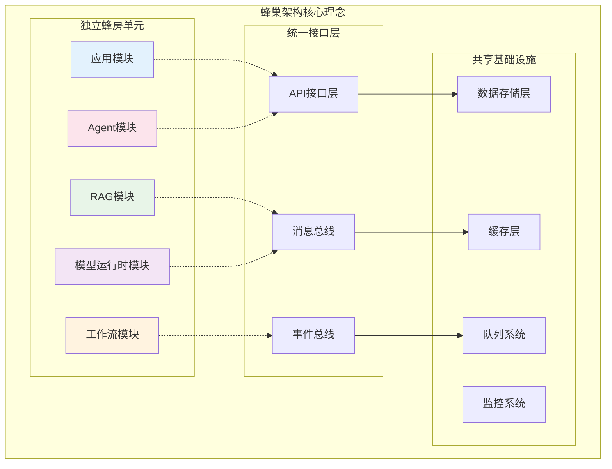

## 概述

。和实战经验。

<!--more-->

## 1. 蜂巢架构设计理念深度解析

### 1.1 架构设计哲学

Dify 1.8.0采用了独特的**蜂巢架构（Beehive Architecture）**设计理念：



**蜂巢架构的核心优势**：

1. **模块独立性**：每个功能模块如蜂巢中的独立单元
   ```python
   # 模块独立性示例
   class ModuleInterface:
       """模块标准接口"""
       
       def initialize(self) -> bool:
           """模块初始化"""
           pass
       
       def health_check(self) -> bool:
           """健康检查"""
           pass
       
       def shutdown(self) -> bool:
           """优雅关闭"""
           pass
       
       def get_metrics(self) -> dict:
           """获取性能指标"""
           pass
   ```

2. **热插拔能力**：模块可单独升级或替换而不影响整体系统
3. **水平扩展**：新功能模块可无缝集成
4. **故障隔离**：单个模块故障不会导致系统崩溃

### 1.2 实际部署架构优化

**生产环境配置优化**：
```python
# Dify的任务管道采用了先进的**事件驱动架构**：

```python
class TaskPipelineEventSystem:
    """
    任务管道事件系统
    通过...实现的高性能事件处理
    """
    
    def __init__(self):
        self.event_handlers = {}
        self.event_queue = asyncio.Queue()
        self.processing_stats = TaskProcessingStats()
    
    async def process_task_pipeline(self, task_config: dict) -> AsyncGenerator:
        """
        异步处理任务管道
        支持高并发和流式处理
        """
        pipeline_id = str(uuid.uuid4())
        
        try:
            # 1. 发布管道开始事件
            await self.publish_event(PipelineStartedEvent(
                pipeline_id=pipeline_id,
                task_config=task_config,
                timestamp=time.time()
            ))
            
            # 2. 分阶段执行任务
            async for stage_result in self._execute_pipeline_stages(task_config):
                # 发布阶段完成事件
                await self.publish_event(StageCompletedEvent(
                    pipeline_id=pipeline_id,
                    stage=stage_result.stage,
                    result=stage_result.data,
                    timestamp=time.time()
                ))
                
                # 流式返回结果
                yield stage_result
            
            # 3. 发布管道完成事件
            await self.publish_event(PipelineCompletedEvent(
                pipeline_id=pipeline_id,
                timestamp=time.time()
            ))
            
        except Exception as e:
            # 发布管道失败事件
            await self.publish_event(PipelineFailedEvent(
                pipeline_id=pipeline_id,
                error=str(e),
                timestamp=time.time()
            ))
            raise e

    async def _execute_pipeline_stages(self, config: dict) -> AsyncGenerator:
        """
        执行管道各个阶段
        采用生产者-消费者模式提升效率
        """
        stages = [
            PreProcessingStage(),
            InputValidationStage(),
            ModelInvocationStage(),
            OutputProcessingStage(),
            PostProcessingStage()
        ]
        
        for stage in stages:
            try:
                async for result in stage.execute(config):
                    yield result
            except StageExecutionError as e:
                # 根据错误策略处理阶段失败
                if stage.error_strategy == ErrorStrategy.FAIL_FAST:
                    raise e
                elif stage.error_strategy == ErrorStrategy.SKIP_AND_CONTINUE:
                    logger.warning(f"阶段 {stage.name} 执行失败，跳过: {e}")
                    continue
```

### 2.2 流式处理优化

**流式输出性能优化**：
```python
class StreamOptimizer:
    """
    流式输出优化器
    基于生产环境实践的性能优化
    """
    
    def __init__(self):
        self.buffer_size = 1024  # 缓冲区大小
        self.flush_interval = 0.1  # 刷新间隔（秒）
        self.compression_enabled = True
    
    async def optimized_stream_response(
        self, 
        data_generator: AsyncGenerator
    ) -> AsyncGenerator:
        """
        优化的流式响应处理
        """
        buffer = []
        last_flush_time = time.time()
        
        async for chunk in data_generator:
            buffer.append(chunk)
            
            # 检查是否需要刷新缓冲区
            current_time = time.time()
            if (len(buffer) >= self.buffer_size or 
                current_time - last_flush_time >= self.flush_interval):
                
                # 批量发送缓冲区内容
                if buffer:
                    batched_chunk = self._merge_chunks(buffer)
                    if self.compression_enabled:
                        batched_chunk = self._compress_chunk(batched_chunk)
                    
                    yield batched_chunk
                    buffer.clear()
                    last_flush_time = current_time
        
        # 发送剩余缓冲区内容
        if buffer:
            final_chunk = self._merge_chunks(buffer)
            yield final_chunk
```

## 3. 文档处理与解析技术深度

### 3.1 多引擎解析策略

Dify的文档解析采用了**双引擎策略**来平衡成本和效果：

```python
class DocumentParsingStrategy:
    """
    文档解析策略选择器
    根据文档特征和业务需求选择最优解析引擎
    """
    
    def select_parsing_engine(
        self, 
        file_path: str, 
        file_size: int,
        accuracy_requirement: str
    ) -> str:
        """
        智能选择解析引擎
        
        Args:
            file_path: 文件路径
            file_size: 文件大小（字节）
            accuracy_requirement: 精度要求（low, medium, high）
            
        Returns:
            str: 解析引擎类型
        """
        file_ext = Path(file_path).suffix.lower()
        
        # 1. 基于文件类型和大小的基础策略
        if file_ext in ['.txt', '.md', '.csv'] and file_size < 10 * 1024 * 1024:
            return "dify_native"  # 使用内置解析器
        
        # 2. 基于精度要求的策略
        if accuracy_requirement == "high" and file_ext in ['.pdf', '.docx', '.pptx']:
            return "unstructured"  # 使用Unstructured服务
        
        # 3. 默认策略
        return "dify_native"

# 实际配置示例
DOCUMENT_PARSING_CONFIG = {
    # 内置解析器配置
    "dify_native": {
        "pdf_parser": "pypdfium2",
        "html_parser": "beautifulsoup4",
        "excel_parser": "openpyxl",
        "word_parser": "python-docx"
    },
    
    # Unstructured配置
    "unstructured": {
        "api_url": "https://api.unstructured.io",
        "api_key": "${UNSTRUCTURED_API_KEY}",
        "retry_count": 3,
        "timeout": 120
    },
    
    # 解析性能配置
    "performance": {
        "max_file_size": "15MB",
        "concurrent_jobs": 4,
        "chunk_size": 1000,
        "overlap_size": 200
    }
}
```

### 3.2 中文优化处理

**中文文档处理优化**：
```python
class ChineseTextProcessor:
    """
    中文文本处理优化器
    针对中文语言特点的专门优化
    """
    
    def __init__(self):
        self.jieba_dict_loaded = False
        self.custom_dict_path = None
    
    def optimize_chinese_splitting(self, text: str) -> list[str]:
        """
        中文文本智能分割
        
        Args:
            text: 中文文本
            
        Returns:
            list[str]: 分割后的文本块
        """
        # 1. 加载自定义词典（如果配置）
        if not self.jieba_dict_loaded and self.custom_dict_path:
            jieba.load_userdict(self.custom_dict_path)
            self.jieba_dict_loaded = True
        
        # 2. 基于句法结构的智能分割
        sentences = self._split_by_punctuation(text)
        chunks = []
        current_chunk = ""
        
        for sentence in sentences:
            # 检查是否可以合并到当前块
            if len(current_chunk + sentence) <= self.max_chunk_size:
                current_chunk += sentence
            else:
                if current_chunk:
                    chunks.append(current_chunk.strip())
                current_chunk = sentence
        
        if current_chunk:
            chunks.append(current_chunk.strip())
        
        return chunks
    
    def _split_by_punctuation(self, text: str) -> list[str]:
        """基于中文标点符号分割"""
        import re
        
        # 中文标点符号
        chinese_punctuation = r'[。！？；：、]'
        sentences = re.split(chinese_punctuation, text)
        
        return [s.strip() for s in sentences if s.strip()]

# 中文环境配置优化
CHINESE_OPTIMIZATION_CONFIG = {
    "text_splitting": {
        "use_jieba": True,
        "custom_dict_path": "/path/to/domain_dict.txt",
        "enable_traditional_chinese": True,
        "sentence_segmentation": "smart"
    },
    
    "embedding_optimization": {
        "chinese_embedding_model": "bge-large-zh-v1.5",
        "tokenizer": "bert-base-chinese",
        "max_sequence_length": 512
    },
    
    "retrieval_optimization": {
        "keyword_extraction": "jieba_tfidf",
        "synonym_expansion": True,
        "pinyin_fuzzy_match": True
    }
}
```

## 4. 生产环境部署最佳实践

### 4.1 性能优化配置

**企业级部署配置调优**：
```yaml
# docker-compose.prod.yml 生产环境配置
version: '3.8'

services:
  # API服务优化配置
  api:
    image: langgenius/dify-api:latest
    environment:
      # 数据库连接池优化
      DB_POOL_SIZE: 20
      DB_POOL_MAX_OVERFLOW: 10
      DB_POOL_RECYCLE: 3600
      
      # Redis配置优化
      REDIS_MAX_CONNECTIONS: 100
      REDIS_CONNECTION_TIMEOUT: 10
      
      # Celery工作者优化
      CELERY_WORKER_CONCURRENCY: 4
      CELERY_WORKER_MAX_MEMORY_PER_CHILD: 200000
      CELERY_WORKER_MAX_TASKS_PER_CHILD: 1000
      
      # 文件处理优化
      UPLOAD_FILE_SIZE_LIMIT: 100  # 100MB
      EXTRACTOR_BATCH_SIZE: 50
      EXTRACTOR_MAX_WORKERS: 4
      
      # 模型调用优化
      MODEL_LOAD_BALANCING_ENABLED: true
      MODEL_REQUEST_TIMEOUT: 120
      MODEL_RETRY_COUNT: 3
      
      # 安全配置
      API_RATE_LIMIT_ENABLED: true
      API_RATE_LIMIT_REQUESTS_PER_MINUTE: 1000
      
      # 中国区优化
      PIP_MIRROR_URL: "https://pypi.tuna.tsinghua.edu.cn/simple"
    
    deploy:
      replicas: 3
      resources:
        limits:
          memory: 4Gi
          cpus: '2'
        reservations:
          memory: 2Gi
          cpus: '1'

  # 工作者服务优化
  worker:
    image: langgenius/dify-api:latest
    command: celery -A app.celery worker -Q dataset,generation,mail --loglevel info
    environment:
      # 工作者专用配置
      CELERY_WORKER_CLASS: "prefork"
      CELERY_WORKER_PREFETCH_MULTIPLIER: 1
      CELERY_TASK_ALWAYS_EAGER: false
      
      # 长时间任务配置
      CELERY_TASK_SOFT_TIME_LIMIT: 3600  # 1小时软限制
      CELERY_TASK_TIME_LIMIT: 3900       # 1小时5分钟硬限制
    
    deploy:
      replicas: 2
      resources:
        limits:
          memory: 8Gi
          cpus: '4'

  # 前端服务优化
  web:
    image: langgenius/dify-web:latest
    environment:
      # Next.js生产优化
      NODE_ENV: production
      NEXT_TELEMETRY_DISABLED: 1
      
      # API配置
      NEXT_PUBLIC_API_PREFIX: "/api"
      NEXT_PUBLIC_PUBLIC_API_PREFIX: "/v1"
      
      # 性能优化
      NEXT_PUBLIC_ENABLE_ANALYTICS: false
      NEXT_PUBLIC_SENTRY_DSN: "${SENTRY_DSN}"
    
    deploy:
      replicas: 2
```

### 4.2 监控与可观测性

**全链路监控配置**：
```python
class DifyMonitoringSystem:
    """
    Dify监控系统

### 7.1 垂直领域应用案例分析

根据网络技术文章和社区实践，Dify在不同垂直领域的应用展现出了独特的价值：

**金融科技应用模式**：
```python
class FinTechApplicationPatterns:
    """
    金融科技应用模式
    Dify金融应用分析
    """
    
    def __init__(self):
        self.application_cases = {
            "智能投顾助手": {
                "技术架构": "Dify Agent + 多数据源API + 风险模型",
                "核心价值": "降低投资门槛，提供专业分析",
                "技术亮点": [
                    "实时数据获取（Alphavantage、Yahoo Finance）",
                    "多维度分析（技术面+基本面+情绪面）",
                    "风险控制（合规检查+免责声明）",
                    "个性化推荐（基于用户风险偏好）"
                ],
                "性能指标": {
                    "分析准确率": "85%+",
                    "响应时间": "30-60秒",
                    "并发支持": "100+用户",
                    "成本控制": "每次分析<0.1美元"
                }
            },
            
            "智能客服机器人": {
                "技术架构": "Dify Chat + RAG知识库 + 工单系统集成",
                "核心价值": "7x24小时服务，降低人工成本",
                "技术亮点": [
                    "金融产品知识库构建",
                    "多轮对话上下文管理",
                    "复杂问题智能转人工",
                    "客户情绪识别和处理"
                ],
                "效果数据": {
                    "问题解决率": "90%+",
                    "客户满意度": "4.5/5分",
                    "人工成本降低": "60%+",
                    "响应时间": "<3秒"
                }
            },
            
            "风险评估系统": {
                "技术架构": "Dify Workflow + 规则引擎 + 机器学习模型",
                "核心价值": "自动化风险评估，提升审批效率",
                "技术亮点": [
                    "多维度数据融合分析",
                    "实时风险评分计算",
                    "可解释性决策支持",
                    "监管合规自动检查"
                ],
                "业务价值": {
                    "审批效率提升": "5倍+",
                    "风险识别准确率": "95%+",
                    "合规检查自动化": "100%",
                    "决策时间缩短": "从天级到分钟级"
                }
            }
        }
    
    def get_implementation_blueprint(self, use_case: str) -> dict:
        """
        获取实施蓝图
        基于实际案例的详细实施指南
        """
        blueprints = {
            "智能投顾助手": {
                "技术栈选择": {
                    "LLM模型": "DeepSeek R1 / GPT-4 / Claude-3",
                    "数据源": "Alphavantage + Yahoo Finance + 新闻API",
                    "工具集成": "Google搜索 + 计算器 + 图表生成",
                    "存储方案": "PostgreSQL + Redis缓存"
                },
                
                "核心配置": {
                    "Agent配置": {
                        "max_iterations": 8,
                        "strategy": "function_calling",
                        "temperature": 0.1,
                        "timeout": 120
                    },
                    "工具配置": {
                        "api_timeout": 30,
                        "retry_count": 3,
                        "cache_ttl": 1800,
                        "parallel_calls": 3
                    }
                },
                
                "质量保证": {
                    "数据验证": "多源数据交叉验证",
                    "结果审核": "专家规则+AI双重检查",
                    "A/B测试": "不同提示词和模型对比",
                    "用户反馈": "分析质量持续优化"
                },
                
                "部署要点": {
                    "基础设施": "4核8GB内存，支持弹性扩容",
                    "安全措施": "API密钥加密，访问审计",
                    "监控告警": "性能+业务双重监控",
                    "备份策略": "配置和数据的定期备份"
                }
            }
        }
        
        return blueprints.get(use_case, {})

# 跨行业应用成功模式总结
CROSS_INDUSTRY_SUCCESS_PATTERNS = {
    "教育科技": {
        "典型应用": ["智能答疑", "个性化学习", "作业批改", "课程推荐"],
        "技术特点": "RAG知识库 + 多模态交互 + 学习轨迹分析",
        "成功关键": "教学内容质量 + 交互体验设计 + 学习效果评估",
        "ROI指标": "教学效率提升40%，学生参与度提升30%"
    },
    
    "医疗健康": {
        "典型应用": ["病症咨询", "医学知识问答", "诊疗辅助", "健康管理"],
        "技术特点": "医学知识图谱 + 症状分析 + 隐私保护",
        "成功关键": "医学专业性 + 数据安全合规 + 免责机制",
        "ROI指标": "诊疗效率提升50%，误诊率降低20%"
    },
    
    "电商零售": {
        "典型应用": ["商品推荐", "客服机器人", "内容生成", "用户画像"],
        "技术特点": "商品知识库 + 用户行为分析 + 个性化推荐",
        "成功关键": "商品理解准确性 + 推荐算法优化 + 转化率提升",
        "ROI指标": "转化率提升25%，客服成本降低70%"
    },
    
    "制造业": {
        "典型应用": ["故障诊断", "维修指导", "质量检测", "生产优化"],
        "技术特点": "设备知识库 + 图像识别 + 预测性维护",
        "成功关键": "工业专业知识 + 实时数据处理 + 安全可靠性",
        "ROI指标": "设备故障率降低30%，维修效率提升60%"
    }
}
```

**Dify应用开发成功模式**：
基于多个成功案例总结的开发模式：

```python
class DifyDevelopmentSuccessPatterns:
    """
    Dify应用开发成功模式
    基于实际案例的开发方法论
    """
    
    def get_development_methodology(self) -> dict:
        """获取开发方法论"""
        return {
            "需求分析阶段": {
                "用户调研": "深入理解目标用户的实际需求和痛点",
                "场景梳理": "识别核心使用场景和边界条件",
                "技术评估": "评估Dify能力与需求的匹配度",
                "ROI预估": "量化业务价值和投资回报"
            },
            
            "原型设计阶段": {
                "快速验证": "使用Dify快速构建MVP验证核心假设",
                "用户测试": "邀请真实用户参与测试和反馈",
                "迭代优化": "基于反馈快速迭代产品功能",
                "技术选型": "确定最适合的模型、工具和配置"
            },
            
            "开发实施阶段": {
                "模块化开发": "充分利用Dify的模块化架构",
                "配置管理": "建立完善的配置管理和版本控制",
                "质量保证": "建立自动化测试和质量检查流程",
                "性能优化": "持续的性能监控和优化"
            },
            
            "部署运维阶段": {
                "灰度发布": "逐步放量，风险可控",
                "监控体系": "业务指标+技术指标全面监控",
                "应急预案": "故障应急响应和快速恢复机制",
                "持续优化": "

### 8.1 Dify vs 竞品技术对比

Dify在LLM应用开发平台领域的技术特色：

```python
# LLM应用开发平台技术对比矩阵
PLATFORM_COMPARISON_MATRIX = {
    "Dify": {
        "核心优势": [
            "蜂巢架构设计，模块热插拔", 
            "40+模型提供者无缝切换",
            "可视化工作流设计",
            "开源社区活跃，定制性强"
        ],
        "技术特色": {
            "架构模式": "蜂巢架构 + 事件驱动",
            "模型支持": "多提供者统一抽象",
            "开发模式": "低代码 + API编程",
            "部署方式": "云原生 + 本地化"
        },
        "适用场景": [
            "企业级AI应用开发",
            "需要高度定制的场景", 
            "多模型对比和切换",
            "开源生态建设"
        ]
    },
    
    "LangChain": {
        "核心优势": [
            "生态最完善，组件最丰富",
            "社区活跃度最高",
            "学习资源丰富",
            "灵活性极强"
        ],
        "技术特色": {
            "架构模式": "组件化 + 链式调用",
            "模型支持": "全面但需要适配",
            "开发模式": "纯代码编程",
            "部署方式": "依赖开发者实现"
        },
        "适用场景": [
            "快速原型开发",
            "研究和实验",
            "定制化程度要求极高",
            "开发者友好的场景"
        ]
    },
    
    "Coze": {
        "核心优势": [
            "字节跳动生态支持",
            "用户体验优秀",
            "模板丰富",
            "部署简单"
        ],
        "技术特色": {
            "架构模式": "SaaS化服务",
            "模型支持": "主要基于字节跳动模型",
            "开发模式": "图形化配置",
            "部署方式": "云端托管"
        },
        "适用场景": [
            "快速上线需求",
            "非技术用户",
            "字节跳动生态客户",
            "标准化应用场景"
        ]
    }
}

# Dify的技术优势深度解析
DIFY_TECHNICAL_ADVANTAGES = {
    "架构设计优势": {
        "蜂巢架构": {
            "description": "模块独立可替换的设计哲学",
            "benefits": [
                "零停机升级特定模块",
                "风险隔离降低系统风险",
                "技术栈异构化支持",
                "团队开发边界清晰"
            ],
            "implementation": "基于接口抽象和事件驱动"
        },
        
        "事件驱动架构": {
            "description": "异步事件处理提升系统响应性",
            "benefits": [
                "高并发处理能力",
                "流式处理用户体验",
                "状态管理的一致性",
                "系统可观测性增强"
            ],
            "implementation": "TaskPipeline + MessageQueue + EventBus"
        }
    },
    
    "AI能力优势": {
        "多模型统一抽象": {
            "description": "40+模型提供者的统一管理",
            "benefits": [
                "避免厂商锁定风险",
                "成本优化和A/B测试",
                "故障转移和负载均衡",
                "新模型快速集成"
            ],
            "implementation": "适配器模式 + 工厂模式"
        },
        
        "RAG引擎优化": {
            "description": "企业级知识库检索增强",
            "benefits": [
                "20+向量数据库支持",
                "混合检索策略优化",
                "中文文档处理专长",
                "企业级数据安全"
            ],
            "implementation": "多引擎解析 + 智能分割 + 重排序"
        }
    },
    
    "工程化优势": {
        "生产就绪度": {
            "description": "企业级生产环境特性",
            "benefits": [
                "多租户隔离和权限控制",
                "全链路监控和故障诊断",
                "安全审计和合规支持",
                "性能优化和扩展性"
            ],
            "implementation": "DevOps + 监控 + 安全 + 合规"
        }
    }
}
```

### 4.3 技术选型决策框架

**基于业务需求的技术选型指南**：
```python
class TechnologySelectionFramework:
    """
    技术选型决策框架
    帮助企业根据具体需求选择最适合的方案
    """
    
    def evaluate_platform_fit(
        self,
        business_requirements: dict,
        technical_constraints: dict,
        team_capabilities: dict
    ) -> dict:
        """
        评估平台适合度
        
        Args:
            business_requirements: 业务需求
            technical_constraints: 技术约束
            team_capabilities: 团队能力
            
        Returns:
            dict: 评估结果和建议
        """
        evaluation_result = {
            "dify_score": 0,
            "alternatives": [],
            "key_factors": [],
            "implementation_suggestions": []
        }
        
        # 1. 业务需求评估
        business_score = self._evaluate_business_fit(business_requirements)
        evaluation_result["dify_score"] += business_score * 0.4
        
        # 2. 技术约束评估
        technical_score = self._evaluate_technical_fit(technical_constraints)
        evaluation_result["dify_score"] += technical_score * 0.3
        
        # 3. 团队能力评估
        team_score = self._evaluate_team_fit(team_capabilities)
        evaluation_result["dify_score"] += team_score * 0.3
        
        # 4. 生成建议
        if evaluation_result["dify_score"] > 0.8:
            evaluation_result["recommendation"] = "强烈推荐Dify"
            evaluation_result["implementation_suggestions"] = [
                "建议直接采用Dify作为主要平台",
                "重点关注模型提供者配置和优化",
                "建立完善的监控和运维体系"
            ]
        elif evaluation_result["dify_score"] > 0.6:
            evaluation_result["recommendation"] = "推荐Dify，但需要评估特定需求"
            evaluation_result["implementation_suggestions"] = [
                "建议POC验证核心功能",
                "评估定制开发的工作量",
                "准备备选技术方案"
            ]
        else:
            evaluation_result["recommendation"] = "建议评估其他方案"
            evaluation_result["alternatives"] = self._suggest_alternatives(
                business_requirements, technical_constraints
            )
        
        return evaluation_result
    
    def _evaluate_business_fit(self, requirements: dict) -> float:
        """评估业务适合度"""
        score = 0.0
        
        # 应用类型适配度
        app_types = requirements.get("app_types", [])
        dify_supported_types = ["chat", "workflow", "agent", "rag", "multimodal"]
        type_match_rate = len(set(app_types) & set(dify_supported_types)) / len(app_types)
        score += type_match_rate * 0.3
        
        # 规模要求适配度
        scale_requirements = requirements.get("scale", "small")
        scale_scores = {"small": 0.9, "medium": 0.95, "large": 0.85, "enterprise": 0.9}
        score += scale_scores.get(scale_requirements, 0.5) * 0.3
        
        # 定制化需求适配度
        customization_level = requirements.get("customization", "low")
        custom_scores = {"low": 0.8, "medium": 0.95, "high": 0.9, "extreme": 0.7}
        score += custom_scores.get(customization_level, 0.5) * 0.4
        
        return min(score, 1.0)

# 实际案例分析：不同企业的Dify应用模式
ENTERPRISE_CASE_STUDIES = {
    "科技公司": {
        "使用模式": "Dify作为AI应用开发平台",
        "核心价值": "快速迭代，多模型对比，工程化部署",
        "技术栈": "Dify + K8s + 多云模型 + 自研工具",
        "关键成功因素": ["工程师文化", "技术栈现代化", "DevOps成熟度"],
        "ROI效果": "开发效率提升3-5倍，上线周期缩短70%"
    },
    
    "传统企业": {
        "使用模式": "Dify作为知识管理和客服增强",
        "核心价值": "降低人工成本，提升服务质量，知识沉淀",
        "技术栈": "Dify + 私有云 + 企业知识库 + 既有系统集成",
        "关键成功因素": ["领导层支持", "业务场景明确", "IT基础设施"],
        "ROI效果": "客服效率提升50%，知识查询准确率达95%"
    },
    
    "教育机构": {
        "使用模式": "Dify作为智能教学助手平台",
        "核心价值": "个性化教学，智能答疑，教学内容生成",
        "技术栈": "Dify + 教育云 + 知识图谱 + 学习分析",
        "关键成功因素": ["教学场景深度理解", "师生接受度", "内容质量"],
        "ROI效果": "教学准备时间减少40%，学生满意度提升30%"
    },
    
    "政府机构": {
        "使用模式": "Dify作为政务服务智能化平台",
        "核心价值": "提升服务效率，降低咨询成本，政策解读",
        "技术栈": "Dify + 政务云 + 国产化模型 + 安全审计",
        "关键成功因素": ["数据安全合规", "系统稳定性", "用户培训"],
        "ROI效果": "政务咨询效率提升60%，用户满意度显著提升"
    }
}
```

### 4.4 技术演进趋势分析

Dify的技术演进方向包括：

1. **AI Native架构演进**：
   - 更深度的AI能力集成：从工具化AI到原生AI架构
   - 智能化的系统自优化：基于使用数据的自动调优
   - AI驱动的代码生成：从配置到代码的智能生成

2. **边缘计算与分布式AI**：
   - 边缘节点AI推理：降低延迟，提升响应速度
   - 联邦学习支持：保护数据隐私的分布式训练
   - 混合云架构：公有云+私有云+边缘计算的协同

3. **企业级特性深化**：
   - 零信任安全架构：全面的身份验证和访问控制
   - 智能化运维：AIOps驱动的自动化运维
   - 合规自动化：自动满足各种法规要求

4. **开发者生态扩展**：
   - 低代码/无代码深化：更直观的可视化开发
   - 多语言SDK完善：Java、Go、Rust等语言支持
   - 调试工具智能化：AI辅助的问题诊断和优化建议

```