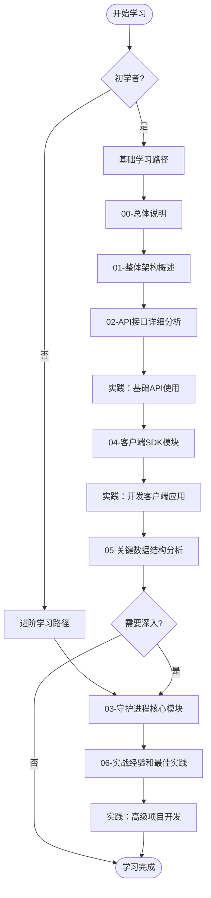
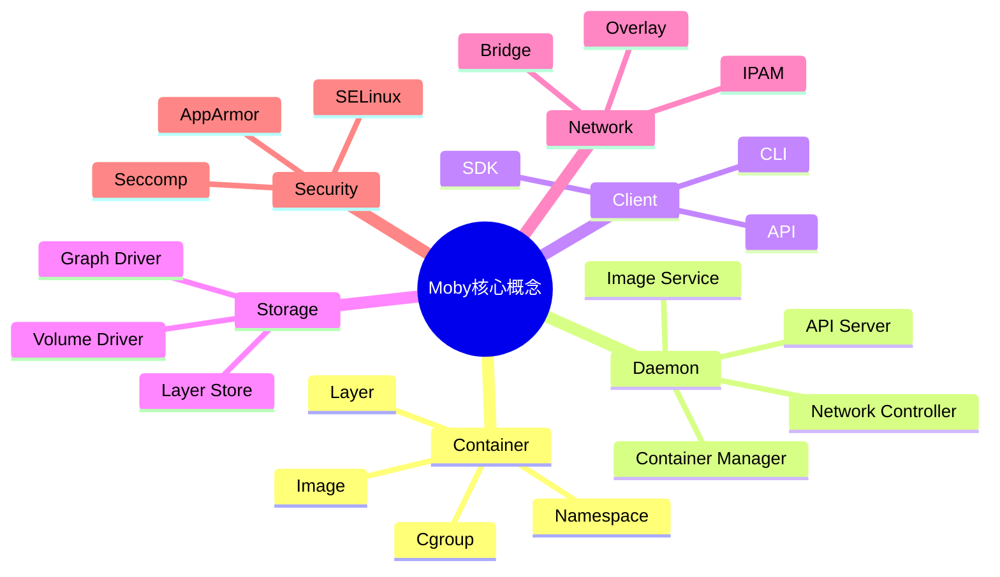
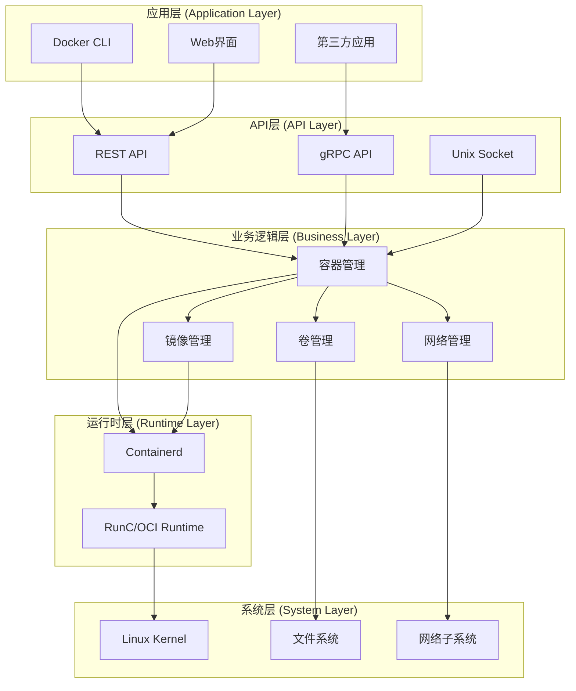
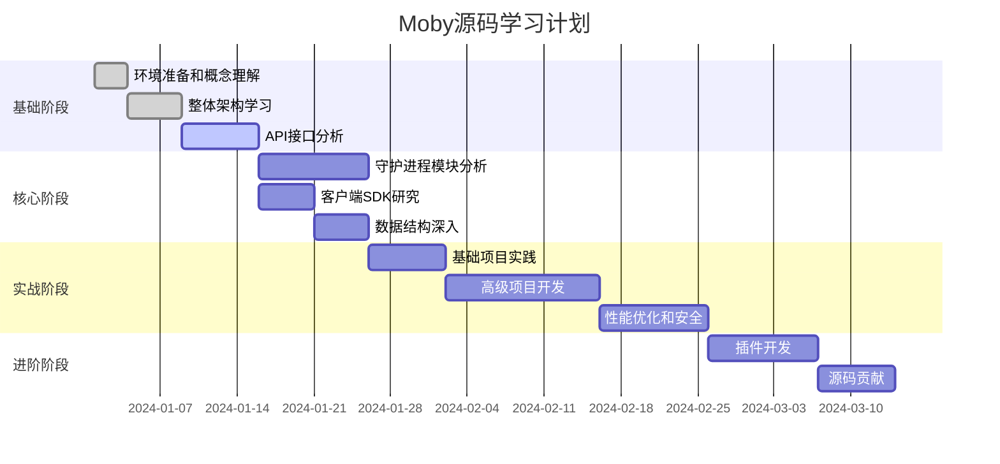

# Moby项目源码剖析 - 总体说明

## 文档概述

本文档集合是对Moby项目（Docker的开源版本）的全面、深入的源码分析。通过详细的架构分析、代码解读、实战案例和最佳实践，帮助开发者从零开始，系统地掌握整个项目的核心技术和设计理念。

## 文档结构

### 📋 文档导航

| 文档编号 | 文档标题 | 主要内容 | 技术难度 |
|---------|----------|----------|----------|
| **00** | [总体说明](00-总体说明.md) | 文档概述、学习路径、术语表 | ⭐ |
| **01** | [整体架构概述](01-整体架构概述.md) | 系统架构、技术栈、设计原则 | ⭐⭐ |
| **02** | [API接口详细分析](02-API接口详细分析.md) | REST API、SDK使用、版本控制 | ⭐⭐⭐ |
| **03** | [守护进程核心模块](03-守护进程核心模块.md) | Daemon架构、容器管理、生命周期 | ⭐⭐⭐⭐ |
| **04** | [客户端SDK模块](04-客户端SDK模块.md) | 客户端设计、连接管理、错误处理 | ⭐⭐⭐ |
| **05** | [关键数据结构分析](05-关键数据结构分析.md) | 核心数据类型、UML图、序列化 | ⭐⭐⭐ |
| **06** | [实战经验和最佳实践](06-实战经验和最佳实践.md) | 项目实战、性能优化、安全实践 | ⭐⭐⭐⭐⭐ |

### 🎯 学习路径推荐



## 技术要求与前置知识

### 📚 前置知识要求

| 知识领域 | 必需程度 | 说明 |
|---------|----------|------|
| **Go语言** | ⭐⭐⭐⭐⭐ | 熟练掌握Go语法、并发模型、接口设计 |
| **HTTP/REST** | ⭐⭐⭐⭐ | 理解HTTP协议、REST API设计原则 |
| **Linux系统** | ⭐⭐⭐⭐ | 熟悉文件系统、进程管理、网络配置 |
| **Docker基础** | ⭐⭐⭐ | 了解容器概念、基本命令使用 |
| **分布式系统** | ⭐⭐ | 了解微服务、负载均衡等概念 |
| **网络编程** | ⭐⭐⭐ | TCP/UDP、Socket编程、网络协议 |

### 🛠️ 开发环境准备

```bash
# 1. 安装Go语言环境
# 要求Go 1.24+
go version

# 2. 克隆Moby项目
git clone https://github.com/moby/moby.git
cd moby

# 3. 安装Docker（用于测试）
curl -fsSL https://get.docker.com -o get-docker.sh
sudo sh get-docker.sh

# 4. 安装开发工具
go install golang.org/x/tools/gopls@latest
go install github.com/golangci/golangci-lint/cmd/golangci-lint@latest

# 5. 验证环境
make help
```

## 核心概念与术语

### 🔑 核心概念图



### 📖 重要术语表

| 术语 | 英文 | 说明 | 相关概念 |
|------|------|------|----------|
| **容器** | Container | 运行应用程序的隔离环境 | 进程隔离、资源限制 |
| **镜像** | Image | 容器的只读模板 | 分层文件系统、Dockerfile |
| **守护进程** | Daemon | Docker的后台服务进程 | API服务器、资源管理 |
| **图形驱动** | Graph Driver | 管理镜像层的存储驱动 | OverlayFS、AUFS、DeviceMapper |
| **命名空间** | Namespace | Linux内核隔离机制 | PID、Network、Mount、User |
| **控制组** | Cgroup | Linux资源控制和监控 | CPU、Memory、IO限制 |
| **网络驱动** | Network Driver | 容器网络实现机制 | Bridge、Overlay、Host |
| **存储卷** | Volume | 持久化数据存储 | 绑定挂载、命名卷、临时卷 |
| **运行时** | Runtime | 容器执行环境 | containerd、runc、OCI |
| **快照器** | Snapshotter | 文件系统快照管理 | 写时复制、增量快照 |

### 🏗️ 架构层次说明



## 学习建议与注意事项

### 📈 学习进度规划



### ⚠️ 重要注意事项

1. **代码版本同步**
   - 本文档基于Moby v2.x版本分析
   - 建议使用与文档相匹配的代码版本
   - 注意API版本兼容性问题

2. **实践环境要求**
   - 建议使用Linux环境进行实践
   - 确保有足够的磁盘空间（至少10GB）
   - 需要root权限或Docker组权限

3. **安全考虑**
   - 在生产环境中谨慎使用实验性功能
   - 注意容器安全配置
   - 定期更新依赖组件

4. **性能注意**
   - 大规模部署前进行性能测试
   - 监控资源使用情况
   - 考虑网络和存储性能影响

### 🎓 学习成果检验

完成学习后，你应该能够：

- ✅ **理解架构**: 清晰掌握Moby的整体架构和各模块关系
- ✅ **使用API**: 熟练使用Docker API进行容器操作
- ✅ **分析源码**: 能够阅读和理解核心模块的源代码
- ✅ **开发应用**: 基于Moby开发自定义的容器管理工具
- ✅ **排查问题**: 具备容器化环境的故障诊断能力
- ✅ **优化性能**: 了解性能调优和安全加固的方法
- ✅ **扩展功能**: 开发插件或贡献代码到开源项目

### 📞 获取帮助

1. **官方资源**
   - [Moby项目主页](https://mobyproject.org/)
   - [GitHub仓库](https://github.com/moby/moby)
   - [官方文档](https://docs.docker.com/)

2. **社区支持**
   - [Moby论坛](https://forums.mobyproject.org/)
   - [Docker社区](https://www.docker.com/community)
   - [Stack Overflow](https://stackoverflow.com/questions/tagged/docker)

3. **技术讨论**
   - IRC: #moby on freenode
   - Slack: Docker Community Slack
   - 微信/QQ技术群组

## 版本信息与更新日志

### 📅 文档版本历史

| 版本 | 日期 | 主要变更 | 作者 |
|------|------|----------|------|
| v1.0 | 2024-01-15 | 初始版本，完整源码分析 | AI Assistant |
| v1.1 | 2024-01-20 | 新增实战项目，优化代码示例 | AI Assistant |
| v1.2 | 2024-01-25 | 增加性能优化章节 | AI Assistant |

### 🔄 后续更新计划

- [ ] 补充Swarm模式详细分析
- [ ] 增加BuildKit构建系统分析  
- [ ] 添加Windows容器支持分析
- [ ] 扩展插件开发实战案例
- [ ] 完善故障排查手册

---

## 开始你的Moby源码之旅

现在你已经了解了文档的整体结构和学习路径，建议从 [01-整体架构概述](01-整体架构概述.md) 开始你的深度学习之旅。记住，源码分析是一个循序渐进的过程，需要理论学习和实践操作相结合。

**愿你在容器化技术的海洋中扬帆起航！** ⛵

---

> 💡 **提示**: 在学习过程中遇到问题是正常的，建议做好笔记，多动手实践，并积极参与开源社区讨论。每一次的深入理解都会让你离成为容器化技术专家更近一步！
