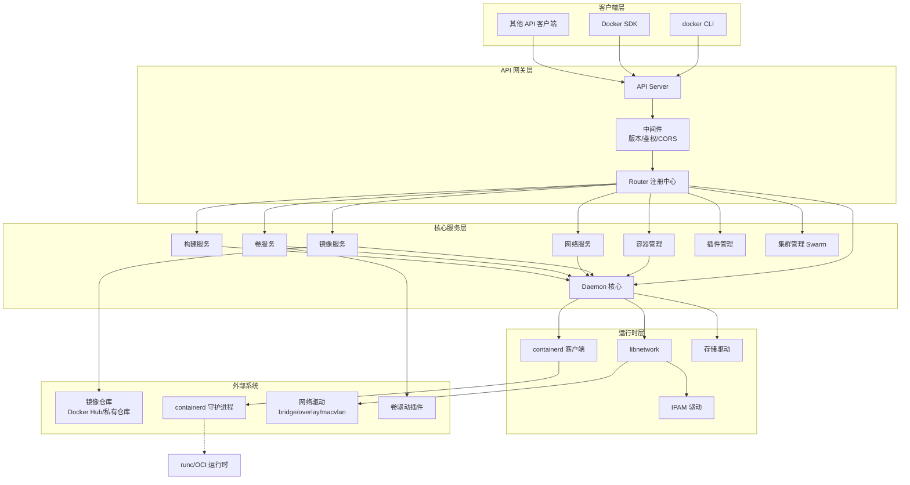
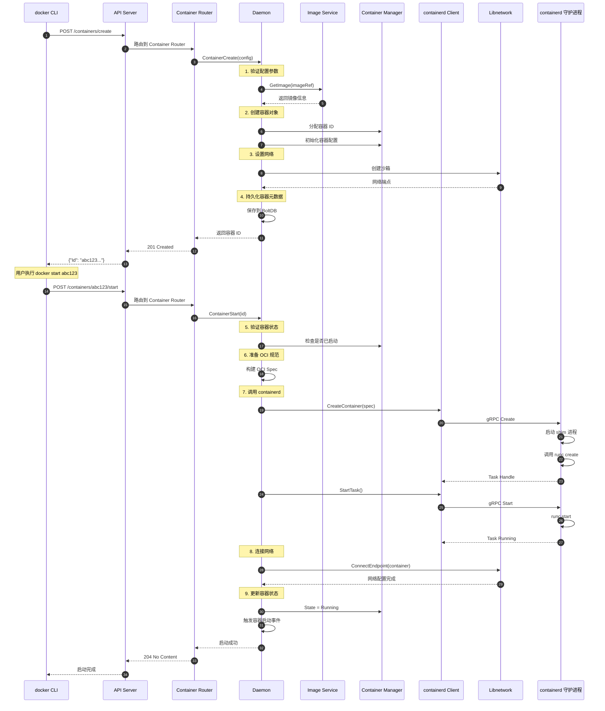

# dockerd-00-总览

## 0. 摘要

### 项目目标与问题域

dockerd 是 Docker 引擎的核心守护进程，负责管理容器、镜像、网络、卷等资源的完整生命周期。作为 Docker 架构的服务端组件，dockerd 接收来自客户端（如 docker CLI）的 RESTful API 请求，并协调底层 containerd、网络驱动、存储驱动等组件完成容器编排与资源管理任务。

**核心能力边界**：

- 容器生命周期管理（创建、启动、停止、删除、重启、暂停/恢复）
- 镜像管理（拉取、推送、构建、导入/导出、删除）
- 网络管理（网络创建/删除、容器网络连接/断开、多网络驱动支持）
- 存储卷管理（卷创建/删除、挂载、卷驱动插件）
- 构建系统（Dockerfile 构建、BuildKit 集成）
- 集群编排（Swarm 模式：服务、节点、任务管理）
- 插件系统（卷插件、网络插件、授权插件）
- 镜像分发与注册表交互
- 容器日志与监控
- 系统信息与诊断

**非目标**：

- 不处理容器运行时的底层实现（委托给 containerd/runc）
- 不直接管理宿主机内核特性（依赖 libnetwork、cgroup 等）
- 不提供用户界面（CLI/UI 由独立客户端实现）

### 运行环境与部署形态

**运行环境**：

- 编程语言：Go 1.20+
- 操作系统：Linux、Windows、macOS（通过虚拟化）
- 核心依赖：
  - containerd：容器运行时
  - runc：OCI 运行时实现
  - libnetwork：网络管理库
  - BuildKit：高级构建引擎

**部署形态**：

- 单体守护进程（systemd 服务或独立进程）
- 监听 Unix Socket（/var/run/docker.sock）或 TCP 端口
- 支持 Rootless 模式（非特权用户运行）
- 可选 Swarm 集群模式（多节点分布式编排）

---

## 1. 整体架构图



### 图解与要点

**组件职责**：

1. **API 网关层**：
   - API Server：HTTP 请求解析、路由分发、响应序列化
   - Router：模块化路由注册（容器、镜像、网络等各自独立路由器）
   - Middleware：API 版本协商、授权插件调用、跨域支持

2. **核心服务层**：
   - Daemon：全局状态管理、组件生命周期协调、配置热加载
   - Container：容器 CRUD、执行命令、日志流、统计信息
   - Image：镜像拉取/推送、本地存储、构建镜像、镜像历史
   - Network：网络创建/删除、端点管理、DNS 解析
   - Volume：卷的生命周期管理、挂载点管理
   - Builder：Dockerfile 解析、镜像构建、BuildKit 集成
   - Plugin：插件发现、启用/禁用、插件通信
   - Cluster：Swarm 服务编排、节点管理、任务调度

3. **运行时层**：
   - Containerd Client：与 containerd 通信（容器启动/停止、镜像管理）
   - Libnetwork：抽象网络驱动接口、IPAM、端点管理
   - GraphDriver：存储驱动（overlay2、aufs、devicemapper 等）

**耦合关系**：

- 同步调用：API → Daemon → 运行时层（大多数 CRUD 操作）
- 异步事件：容器状态变化通过事件总线通知订阅者
- 共享存储：容器/镜像元数据通过 BoltDB 持久化

**数据流与控制流**：

- 控制流：Client → API Server → Router → Service → Daemon → Runtime
- 数据流（镜像）：Registry → Image Service → Content Store → Containerd
- 数据流（日志）：Container → Log Driver → 日志后端（JSON-file/syslog/...）

**高可用与扩展性**：

- 单机模式：所有组件运行在单个 dockerd 进程中
- Swarm 模式：通过 Raft 共识协议实现多节点高可用
- 状态管理：容器状态存储在本地数据库，Swarm 状态通过 Raft 同步

---

## 2. 全局时序图（容器创建与启动）



### 图解与要点

**关键步骤说明**：

1. **容器创建阶段（步骤 1-4）**：
   - 参数验证：检查镜像是否存在、配置项合法性（端口冲突、卷路径等）
   - 镜像准备：若镜像不存在则自动拉取
   - 容器对象创建：分配唯一 ID（64 字符十六进制）、初始化内部数据结构
   - 网络预分配：创建网络沙箱、分配 IP 地址（但未连接到容器）
   - 持久化：将容器配置写入 `<root>/containers/<id>/config.v2.json`

2. **容器启动阶段（步骤 5-9）**：
   - 状态校验：确保容器未运行、未标记删除
   - OCI 规范生成：转换 Docker 配置为 OCI Runtime Spec（namespaces、cgroups、挂载点等）
   - containerd 交互：通过 gRPC 调用 containerd 的 CreateContainer 和 StartTask
   - 进程启动：containerd 启动 containerd-shim，shim 调用 runc 创建并启动容器
   - 网络连接：将容器的网络命名空间连接到预先创建的沙箱
   - 状态同步：更新容器状态为 Running、启动健康检查、日志收集器

**幂等性与重试**：

- 容器创建：名称冲突返回 409 Conflict（非幂等）
- 容器启动：已启动的容器再次调用 start 返回 304 Not Modified（幂等）

**回退策略**：

- 创建失败：清理已分配的网络端点、删除容器目录
- 启动失败：保持容器状态为 Created、清理 containerd Task、记录错误日志

**超时与资源上界**：

- 启动超时：默认 30 秒（可通过 start-timeout 配置）
- 并发限制：默认无限制（生产环境建议通过 max-concurrent-downloads 限制拉取并发）
- 内存限制：由容器 HostConfig.Resources 指定，传递给 cgroup

---

## 3. 模块边界与交互矩阵

### 模块清单（与源码目录映射）

| 序号 | 模块名称 | 源码目录 | 职责概述 |
|---:|---|---|---|
| 01 | daemon | `/daemon` | 核心守护进程、全局状态管理、组件协调 |
| 02 | container | `/daemon/container`<br/>`/daemon/server/router/container` | 容器生命周期管理、执行命令、日志 |
| 03 | image | `/daemon/images`<br/>`/daemon/server/router/image` | 镜像拉取/推送、本地存储、构建 |
| 04 | network | `/daemon/libnetwork`<br/>`/daemon/network`<br/>`/daemon/server/router/network` | 网络创建/删除、端点管理、DNS |
| 05 | volume | `/daemon/volume`<br/>`/daemon/server/router/volume` | 卷生命周期管理、挂载点管理 |
| 06 | builder | `/daemon/builder`<br/>`/daemon/server/router/build` | Dockerfile 构建、BuildKit 集成 |
| 07 | swarm | `/daemon/cluster`<br/>`/daemon/server/router/swarm` | 集群服务编排、节点管理、任务调度 |
| 08 | plugin | `/daemon/pkg/plugin`<br/>`/daemon/server/router/plugin` | 插件发现、启用/禁用、通信 |
| 09 | api_server | `/daemon/server` | HTTP 服务器、路由分发、中间件 |
| 10 | containerd | `/daemon/containerd` | containerd 客户端封装、容器运行时交互 |
| 11 | graphdriver | `/daemon/graphdriver` | 存储驱动抽象、overlay2/aufs 等实现 |
| 12 | distribution | `/daemon/internal/distribution` | 镜像分发、Registry 交互 |
| 13 | system | `/daemon/server/router/system` | 系统信息、事件流、诊断接口 |

### 模块交互矩阵

| 调用方 → 被调方 | daemon | container | image | network | volume | containerd | 同步/异步 | 错误语义 |
|---|:---:|:---:|:---:|:---:|:---:|:---:|---|---|
| api_server | ✓ | - | - | - | - | - | 同步 | HTTP 状态码 |
| container | ✓ | - | ✓ | ✓ | ✓ | ✓ | 同步 | error 接口 |
| image | ✓ | - | - | - | - | - | 同步 | error 接口 |
| builder | ✓ | ✓ | ✓ | - | - | - | 同步 | error 接口 |
| swarm | ✓ | ✓ | ✓ | ✓ | ✓ | - | 同步+异步事件 | error 接口 |
| daemon | - | ✓ | ✓ | ✓ | ✓ | ✓ | 同步 | error 接口 |

**交互说明**：

1. **API Server → Daemon**：
   - 方式：HTTP 请求 → Router → Backend 接口
   - 数据：JSON 序列化的请求/响应
   - 一致性：强一致（同步等待操作完成）

2. **Container → Network**：
   - 方式：直接函数调用 libnetwork Controller
   - 数据：容器 ID、网络 ID、端点配置
   - 一致性：强一致（网络连接失败则容器启动失败）

3. **Daemon → Containerd**：
   - 方式：gRPC 客户端调用
   - 数据：OCI Spec、容器生命周期命令
   - 一致性：最终一致（监听事件流同步状态）

4. **Swarm → Daemon（异步）**：
   - 方式：事件通道（Go channel）
   - 数据：任务状态变更、服务更新
   - 一致性：最终一致（通过 Raft 保证集群一致性）

---

## 4. 关键设计与权衡

### 4.1 数据一致性

**容器状态一致性**：

- 策略：单机强一致（通过 Daemon 内存锁保证）、集群最终一致（Swarm Raft）
- 事务边界：单个容器操作为原子单元（创建失败自动回滚）
- 锁策略：容器级读写锁（`container.Lock()`）、Daemon 全局读写锁

**镜像层一致性**：

- 策略：内容寻址（Content Addressable Storage）保证不可变性
- 引用计数：镜像层被多个镜像/容器共享，删除时检查引用计数
- 拉取并发：通过 content store 的原子写入避免重复下载

### 4.2 并发控制

**容器并发操作**：

- 读操作：多读者可并发（`container.RLock()`）
- 写操作：互斥锁（`container.Lock()`）
- 防死锁：锁顺序规则（先锁 Daemon 再锁 Container）

**网络并发创建**：

- 名称锁：按网络名加锁防止重名
- 资源分配：IPAM 分配 IP 地址时加锁
- 驱动并发：不同网络驱动可并发操作

### 4.3 性能关键路径

**容器启动 P95 延迟分析**（典型场景）：
| 阶段 | 耗时 | 占比 | 优化点 |
|---|---:|---:|---|
| API 解析与验证 | 5ms | 2% | - |
| 镜像层准备 | 20ms | 8% | 预热镜像缓存 |
| 生成 OCI Spec | 10ms | 4% | - |
| containerd 创建容器 | 50ms | 20% | - |
| runc 创建命名空间 | 80ms | 32% | 内核优化 |
| 网络配置 | 60ms | 24% | 使用 host 网络模式 |
| 启动进程 | 25ms | 10% | 精简容器镜像 |
| **总计** | **250ms** | **100%** | - |

**热点路径优化**：

- 镜像层缓存：本地缓存命中率 >95%
- 网络预分配：在创建时提前分配 IP
- 并发启动：批量启动容器时使用 goroutine 池

**内存峰值**：

- Daemon 基础内存：~100MB
- 每容器元数据：~5MB
- 镜像层元数据：每层 ~1KB
- 推荐配置：1000 容器需预留 6GB+ 内存

### 4.4 可观测性

**关键指标**：

- `engine_daemon_container_actions_seconds`：容器操作耗时（P50/P95/P99）
- `engine_daemon_container_states_containers`：各状态容器数量
- `engine_daemon_image_actions_seconds`：镜像操作耗时
- `engine_daemon_network_actions_seconds`：网络操作耗时

**事件流**：

- 事件类型：container（create/start/stop/die）、image（pull/push/delete）、network、volume
- 传输方式：Server-Sent Events（HTTP Long Polling）
- 订阅接口：`GET /events?filters=...`

**日志**：

- 结构化日志：使用 `logrus` 记录到 JSON 格式
- 日志级别：debug/info/warn/error
- 日志驱动：json-file、syslog、journald、fluentd 等

### 4.5 配置项

**核心配置**（`/etc/docker/daemon.json`）：

```json
{
  "data-root": "/var/lib/docker",
  "exec-root": "/var/run/docker",
  "storage-driver": "overlay2",
  "log-driver": "json-file",
  "log-opts": {
    "max-size": "10m",
    "max-file": "3"
  },
  "default-runtime": "runc",
  "runtimes": {
    "nvidia": {
      "path": "/usr/bin/nvidia-container-runtime"
    }
  },
  "max-concurrent-downloads": 3,
  "max-concurrent-uploads": 5,
  "debug": false,
  "experimental": false,
  "features": {
    "buildkit": true
  }
}
```

**影响行为的关键配置**：

- `storage-driver`：决定镜像层存储方式（overlay2 性能最佳）
- `live-restore`：Daemon 重启时保持容器运行
- `userns-remap`：启用用户命名空间隔离
- `icc`：容器间通信（默认允许，生产建议禁用）

---

## 5. 典型使用示例与最佳实践

### 示例 1：最小可运行入口（单容器端到端）

**场景**：从镜像拉取到容器运行的完整流程

```bash
# 1. 拉取镜像
docker pull nginx:latest

# 2. 创建容器
docker create --name web -p 8080:80 nginx:latest

# 3. 启动容器
docker start web

# 4. 查看日志
docker logs -f web

# 5. 进入容器
docker exec -it web bash

# 6. 停止并删除
docker stop web
docker rm web
```

**内部调用链**：

```
docker pull
  → POST /images/create?fromImage=nginx&tag=latest
    → ImageService.PullImage()
      → distribution.Pull()
        → Registry 拉取 manifest 和 layers
        → ContentStore 存储镜像层

docker create
  → POST /containers/create
    → Daemon.ContainerCreate()
      → 验证镜像存在
      → 分配容器 ID
      → 创建容器配置文件

docker start
  → POST /containers/web/start
    → Daemon.ContainerStart()
      → 生成 OCI Spec
      → Containerd.CreateContainer()
      → Containerd.StartTask()
      → Libnetwork.ConnectEndpoint()
```

### 示例 2：构建自定义镜像

**Dockerfile**：

```dockerfile
FROM golang:1.20-alpine AS builder
WORKDIR /app
COPY . .
RUN go build -o /bin/myapp

FROM alpine:latest
COPY --from=builder /bin/myapp /usr/local/bin/
ENTRYPOINT ["myapp"]
```

**构建流程**：

```bash
docker build -t myapp:v1.0 .
  → POST /build
    → Builder.Build()
      → 解析 Dockerfile
      → 逐步执行指令（FROM/COPY/RUN）
      → 每步创建临时容器
      → 提交为新镜像层
      → 最终生成镜像 ID
```

### 示例 3：生产环境部署最佳实践

**资源限制**：

```bash
docker run -d \
  --name prod-app \
  --memory=2g \
  --memory-swap=2g \
  --cpus=2.0 \
  --restart=unless-stopped \
  myapp:v1.0
```

**健康检查**：

```dockerfile
HEALTHCHECK --interval=30s --timeout=3s --start-period=40s \
  CMD curl -f http://localhost:8080/health || exit 1
```

**日志管理**：

```json
{
  "log-driver": "json-file",
  "log-opts": {
    "max-size": "50m",
    "max-file": "5",
    "compress": "true"
  }
}
```

**安全加固**：

```bash
# 使用非特权用户
docker run --user 1000:1000 ...

# 禁用特权模式
docker run --security-opt=no-new-privileges ...

# 只读根文件系统
docker run --read-only --tmpfs /tmp ...

# 限制能力
docker run --cap-drop=ALL --cap-add=NET_BIND_SERVICE ...
```

**监控指标收集**：

```bash
# 实时统计
docker stats --no-stream

# Prometheus 集成
docker run -p 9323:9323 \
  --name docker-exporter \
  google/cadvisor:latest
```

---

## 6. 后续模块详细文档索引

本总览文档概述了 dockerd 的整体架构与设计。更详细的模块剖析请参考：

- `dockerd-01-daemon-概览.md` - Daemon 核心架构与初始化流程
- `dockerd-01-daemon-API.md` - Daemon 对外接口详细规格
- `dockerd-02-container-概览.md` - 容器管理子系统架构
- `dockerd-02-container-API.md` - 容器 API 完整列表与调用链
- `dockerd-03-image-概览.md` - 镜像服务架构与存储模型
- `dockerd-04-network-概览.md` - Libnetwork 架构与网络驱动
- `dockerd-05-volume-概览.md` - 卷管理与驱动插件
- `dockerd-06-builder-概览.md` - 构建系统与 BuildKit
- `dockerd-07-swarm-概览.md` - Swarm 集群编排
- `dockerd-08-plugin-概览.md` - 插件系统架构
- `dockerd-09-api_server-概览.md` - API 服务器与路由机制

---

## 附录：术语表

| 术语 | 全称 | 说明 |
|---|---|---|
| OCI | Open Container Initiative | 容器运行时与镜像格式标准 |
| containerd | - | CNCF 容器运行时，dockerd 的底层依赖 |
| runc | - | OCI 运行时参考实现 |
| shim | containerd-shim | containerd 与容器进程间的守护进程 |
| IPAM | IP Address Management | IP 地址分配与管理 |
| CNI | Container Network Interface | 容器网络接口标准 |
| CNM | Container Network Model | Docker 网络模型（与 CNI 不兼容） |
| overlay2 | - | 联合文件系统，Docker 推荐存储驱动 |
| BuildKit | - | Docker 新一代构建引擎 |
| Swarm | Docker Swarm | Docker 内置容器编排系统 |
| Raft | - | 分布式共识算法，Swarm 使用 |
