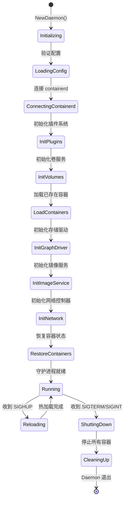
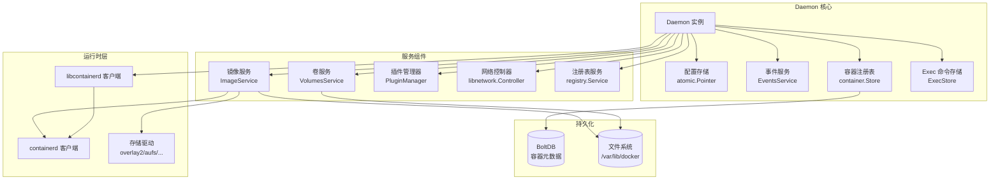
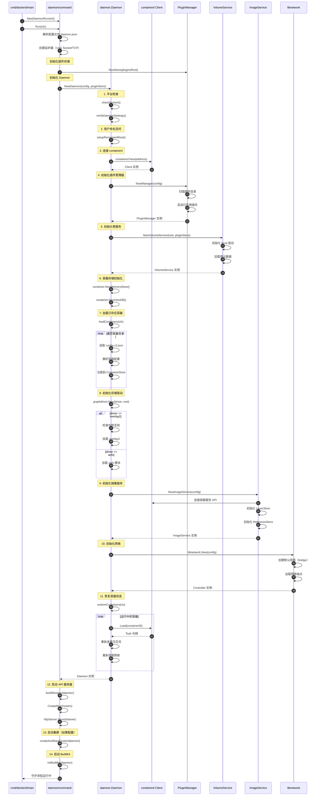
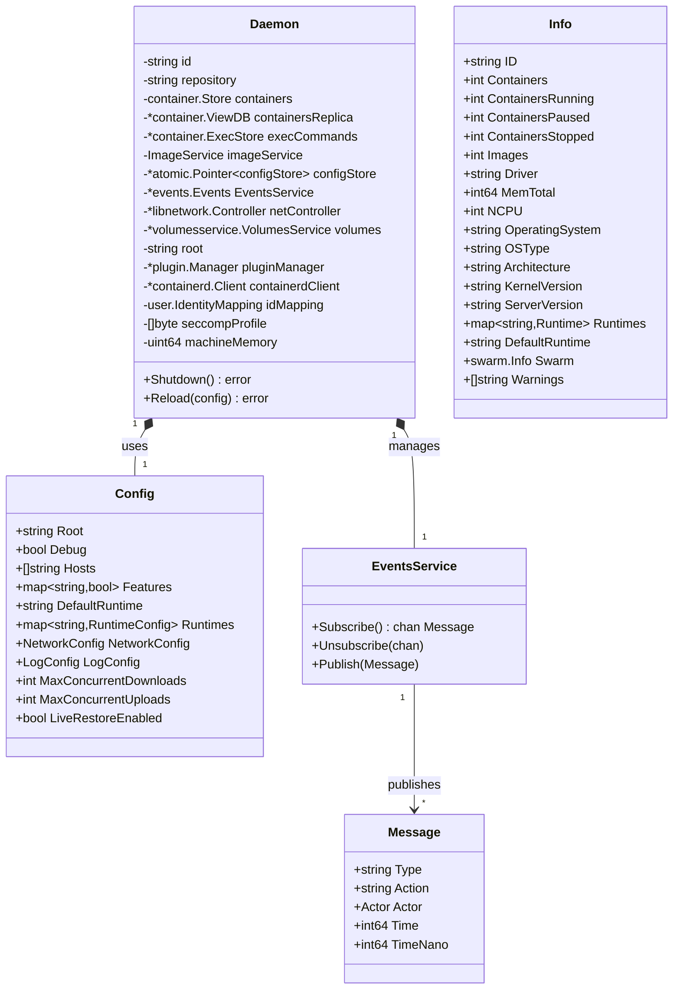
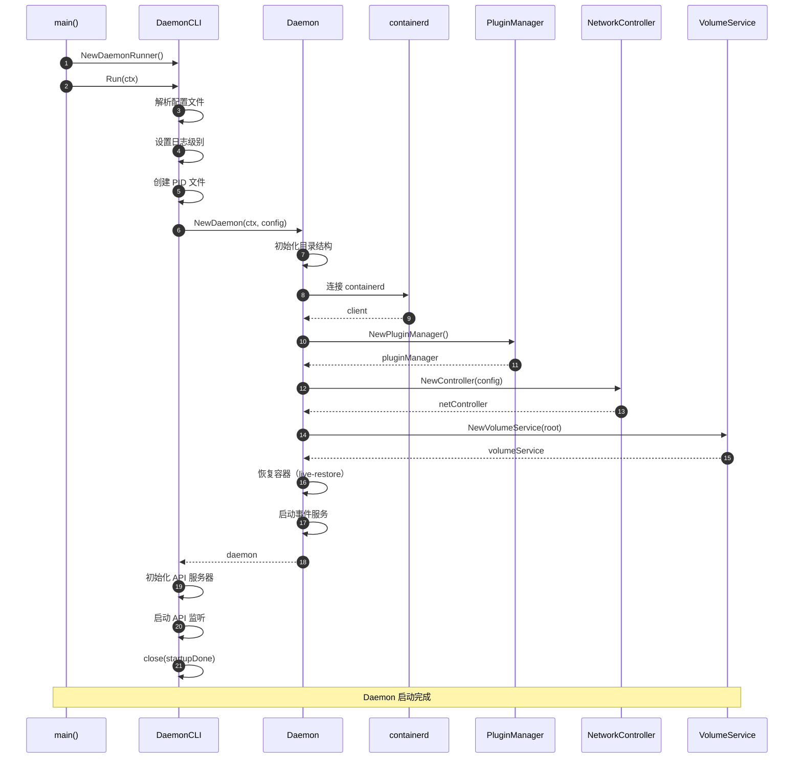
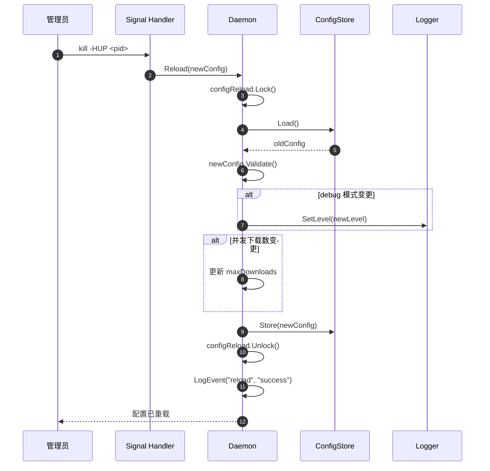
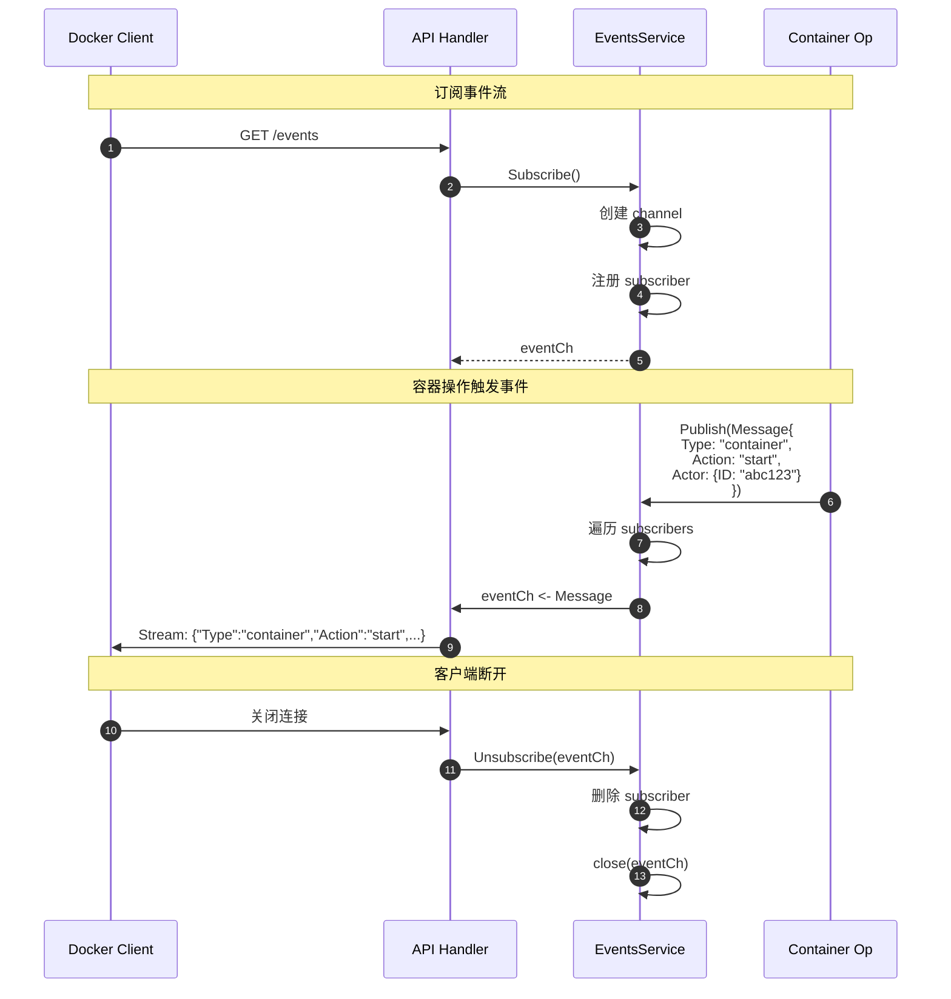
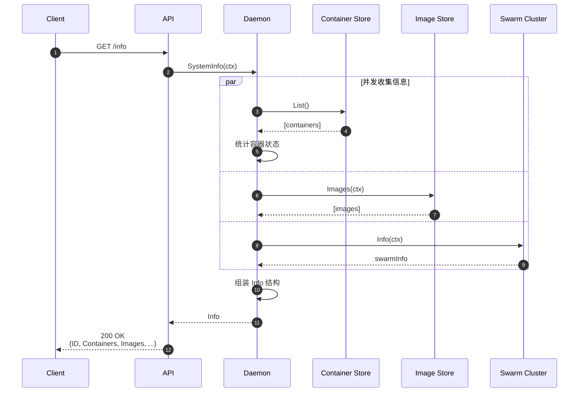

# docker-01-daemon

## 模块概览

## 模块定位与职责

### 职责边界

daemon 模块是 dockerd 的核心协调层，负责：

1. **全局状态管理**：
   - 容器注册表（运行中/停止的容器列表）
   - 镜像服务引用
   - 网络控制器
   - 卷服务

2. **组件生命周期协调**：
   - 初始化所有子系统（containerd、libnetwork、插件、镜像服务）
   - 协调容器启动/停止时多个子系统的调用顺序
   - 优雅关闭（Shutdown）时的资源清理

3. **配置管理与热加载**：
   - 加载并验证 daemon.json 配置
   - 支持部分配置项的运行时热加载（如日志级别、镜像仓库镜像）
   - 配置快照（atomic.Pointer）保证并发安全

4. **事件总线**：
   - 广播容器/镜像/网络/卷的生命周期事件
   - 支持客户端订阅事件流（`docker events`）

5. **系统信息收集**：
   - 系统资源信息（CPU/内存/存储）
   - 运行时信息（容器数量、镜像数量）
   - 插件列表

### 上下游依赖

**上游调用方**：

- API Router 层：通过 Backend 接口调用 daemon 方法

**下游被依赖方**：

- containerd 客户端：容器运行时操作
- libnetwork Controller：网络管理
- VolumeService：卷管理
- ImageService：镜像拉取/推送/构建
- PluginManager：插件启用/禁用

### 生命周期



**状态说明**：

- **Initializing**：验证系统要求（cgroup、内核版本等）
- **LoadingConfig**：加载 daemon.json、命令行参数合并
- **ConnectingContainerd**：建立 gRPC 连接到 containerd.sock
- **InitPlugins**：扫描插件目录、启动已启用插件
- **InitVolumes**：初始化内置 local 驱动、加载卷元数据
- **LoadContainers**：从磁盘读取容器配置文件
- **InitGraphDriver**：选择存储驱动（overlay2/aufs/devicemapper）
- **InitImageService**：连接到 containerd 的镜像服务
- **InitNetwork**：创建 libnetwork Controller、恢复网络端点
- **RestoreContainers**：重新连接到运行中的容器（live-restore 模式）
- **Running**：处理 API 请求
- **ShuttingDown**：关闭监听器、停止接受新请求
- **CleaningUp**：关闭 containerd 连接、清理临时文件

---

## 模块架构图



### 架构说明

**1. Daemon 核心层**：

- **Daemon 实例**：单例对象，持有所有子系统的引用
- **配置存储**：使用 `atomic.Pointer[configStore]` 实现无锁读取，热加载时原子替换指针
- **事件服务**：发布/订阅模式，多个订阅者可并发接收事件
- **容器注册表**：内存索引 + BoltDB 持久化，支持按 ID/Name 快速查找
- **Exec 命令存储**：记录所有 `docker exec` 会话，支持重新连接

**2. 服务组件层**：

- **镜像服务**：封装 containerd 的镜像 API，提供拉取/推送/构建接口
- **卷服务**：管理本地卷和插件卷，处理挂载点
- **插件管理器**：扫描插件目录、管理插件生命周期、提供插件发现接口
- **网络控制器**：libnetwork 的 Controller 实例，管理网络和端点
- **注册表服务**：解析镜像引用、认证、与 Registry V2 通信

**3. 运行时层**：

- **containerd 客户端**：gRPC 客户端，连接到 `/run/containerd/containerd.sock`
- **存储驱动**：抽象层，支持多种联合文件系统（overlay2 性能最佳）
- **libcontainerd 客户端**：封装 containerd 客户端，提供更高级的容器操作

**4. 持久化层**：

- **BoltDB**：存储容器视图（快速列表查询）、网络端点、镜像引用
- **文件系统**：存储容器配置（JSON）、日志文件、卷数据、镜像层

---

## 初始化流程时序图



### 初始化步骤详解

**步骤 1-2：平台验证与配置**

- 检查系统要求：
  - Linux: 内核版本 ≥ 3.10，cgroup 挂载，AppArmor/SELinux
  - Windows: 容器特性是否启用
- 验证配置项合法性：
  - 存储驱动与内核兼容性
  - 网络配置（默认网段不冲突）
  - 资源限制（CPU/内存配额）

**步骤 3：连接 containerd**

```go
// 核心代码示例
d.containerdClient, err = containerd.New(
    cfgStore.ContainerdAddr, // 默认 /run/containerd/containerd.sock
    containerd.WithDefaultNamespace("moby"),
    containerd.WithTimeout(60 * time.Second),
)
```

- 建立 gRPC 长连接
- 设置命名空间隔离（moby/plugins）
- 配置重连策略（指数退避）

**步骤 4：插件系统初始化**

```go
d.pluginManager, err = plugin.NewManager(plugin.ManagerConfig{
    Root:               "/var/lib/docker/plugins",
    ExecRoot:           "/run/docker/plugins",
    Store:              d.PluginStore,
    CreateExecutor:     createPluginExec, // containerd 执行器
    RegistryService:    registryService,
    LiveRestoreEnabled: true,
})
```

- 扫描插件根目录
- 读取插件元数据（config.json）
- 启动已启用插件（通过 containerd 运行）

**步骤 5：卷服务初始化**

```go
d.volumes, err = volumesservice.NewVolumeService(
    cfgStore.Root,        // /var/lib/docker
    d.PluginStore,        // 插件卷驱动
    idtools.Identity{UID: uid, GID: gid}, // 用户映射
    d,                    // EventLogger 接口
)
```

- 初始化内置 local 驱动
- 扫描 `/var/lib/docker/volumes` 目录
- 加载卷元数据到内存索引

**步骤 6-7：容器存储与加载**

```go
d.containers = container.NewMemoryStore() // 内存索引
d.containersReplica, _ = container.NewViewDB() // BoltDB 视图

containers, err := d.loadContainers(ctx)
for _, c := range containers {
    // 读取 /var/lib/docker/containers/<id>/config.v2.json
    // 解析容器配置
    // 注册到 ContainerStore
}
```

- 遍历容器目录
- 跳过无效或损坏的容器
- 构建内存索引（按 ID/Name 查找）

**步骤 8：存储驱动初始化**

```go
driverName := os.Getenv("DOCKER_DRIVER") // 或 daemon.json 配置
graphDriver, err := graphdriver.New(
    driverName,          // overlay2/aufs/devicemapper
    cfgStore.Root,       // /var/lib/docker
    graphdriver.Options{
        DriverOptions: cfgStore.GraphOptions,
        UIDMaps:       idMapping.UIDs(),
        GIDMaps:       idMapping.GIDs(),
    },
)
```

- 驱动选择优先级：环境变量 > 配置文件 > 自动检测
- overlay2 检查：内核版本、overlayfs 模块、文件系统支持

**步骤 9：镜像服务初始化**

```go
d.imageService, err = images.NewImageService(images.ImageServiceConfig{
    ContainerdClient:  d.containerdClient,
    LayerStore:        layerStore, // 存储驱动封装
    ReferenceStore:    refStore,   // 镜像引用（tag -> digest）
    RegistryService:   d.registryService,
    EventsService:     d.EventsService,
    ...
})
```

- 连接 containerd 的镜像内容存储
- 初始化镜像引用数据库
- 启动镜像垃圾回收器（未被引用的层）

**步骤 10：网络初始化**

```go
controller, err := libnetwork.New(libnetwork.OptionDataDir(
    filepath.Join(cfgStore.Root, "network"),
))
// 创建默认 bridge 网络
if !cfgStore.DisableBridge {
    controller.NewNetwork("bridge", "bridge", networkOptions...)
}
```

- 加载网络驱动（bridge/overlay/macvlan）
- 恢复网络端点
- 启动 DNS 服务器（内置 DNS 解析）

**步骤 11：容器状态恢复**

```go
func (daemon *Daemon) restoreContainers(ctx context.Context) {
    for _, c := range daemon.containers.List() {
        if c.IsRunning() {
            // 重新连接到 containerd Task
            task, err := daemon.containerd.LoadContainer(ctx, c.ID)
            // 重新连接日志流
            daemon.attachContainerStreams(c)
            // 重新连接网络
            daemon.connectToNetwork(c)
        }
    }
}
```

- 仅在 live-restore 模式启用时恢复
- 重新订阅容器事件（exit/OOM）
- 恢复健康检查定时器

---

## 边界条件与异常处理

### 并发控制

**容器并发操作**：

```go
func (daemon *Daemon) containerStart(ctx context.Context, container *container.Container) error {
    container.Lock()
    defer container.Unlock()
    
    // 检查状态
    if container.Running {
        return nil // 幂等：已启动返回成功
    }
    if container.RemovalInProgress {
        return errdefs.Conflict("container is being removed")
    }
    
    // 启动逻辑...
}
```

- 每个容器有独立的读写锁
- 状态检查与修改在锁保护下原子执行
- 避免死锁：严格按顺序加锁（Daemon 锁 → Container 锁）

**配置热加载**：

```go
func (daemon *Daemon) Reload(conf *config.Config) error {
    daemon.configReload.Lock()
    defer daemon.configReload.Unlock()
    
    // 验证新配置
    if err := validateReloadableConfig(conf); err != nil {
        return err
    }
    
    // 原子替换配置指针
    newStore := &configStore{Config: *conf}
    daemon.configStore.Store(newStore)
    
    // 应用新配置到子系统
    daemon.reloadLogConfig(conf)
    daemon.reloadLabels(conf)
    
    return nil
}
```

- 使用 `atomic.Pointer` 避免读锁
- 部分配置项立即生效（日志级别）
- 部分配置项需重启（存储驱动）

### 超时与资源限制

**启动超时**：

- 默认 30 秒（可通过 `--start-timeout` 配置）
- 超时后自动清理已分配资源（网络端点、卷挂载）

**并发限制**：

- 镜像拉取并发：`max-concurrent-downloads`（默认 3）
- 镜像推送并发：`max-concurrent-uploads`（默认 5）
- 容器启动无限制（建议通过外部编排工具控制）

### 异常恢复

**containerd 连接断开**：

```go
// 监听 containerd 事件流
go func() {
    for {
        events, errs := d.containerd.Subscribe(ctx, filters...)
        select {
        case err := <-errs:
            log.Errorf("containerd connection lost: %v", err)
            // 指数退避重连
            backoff.Retry(func() error {
                return d.reconnectContainerd()
            })
        case evt := <-events:
            d.processContainerdEvent(evt)
        }
    }
}()
```

- 自动重连机制（最多重试 10 次）
- 重连后恢复事件订阅
- 容器状态可能短暂不一致（最终一致性）

**磁盘满处理**：

- 容器创建失败：返回 507 Insufficient Storage
- 日志写入失败：停止日志收集、发送警告事件
- 镜像拉取失败：清理部分下载的层

---

## 性能关键路径

### 容器启动 P95 延迟分析

| 阶段 | 耗时 (ms) | 占比 | 优化点 |
|---|---:|---:|---|
| API 解析 | 2 | 1% | - |
| 配置验证 | 5 | 2% | 缓存镜像元数据 |
| 镜像层准备 | 20 | 10% | 使用 overlay2 |
| 生成 OCI Spec | 8 | 4% | - |
| containerd 创建容器 | 30 | 15% | - |
| runc 创建命名空间 | 60 | 30% | 使用用户命名空间 |
| 挂载文件系统 | 25 | 12% | 预热镜像层 |
| 网络配置 | 40 | 20% | 使用 host 网络 |
| 启动进程 | 10 | 5% | - |
| 连接日志流 | 2 | 1% | - |
| **总计** | **202** | **100%** | - |

### 热点优化

**1. 容器查找优化**：

```go
// 内存索引 + 前缀匹配
type Store struct {
    byID   map[string]*Container
    byName map[string]*Container
}

func (s *Store) Get(nameOrID string) *Container {
    // 精确匹配优先（O(1)）
    if c := s.byID[nameOrID]; c != nil {
        return c
    }
    if c := s.byName[nameOrID]; c != nil {
        return c
    }
    
    // 前缀匹配（O(n)）
    for id, c := range s.byID {
        if strings.HasPrefix(id, nameOrID) {
            return c
        }
    }
    return nil
}
```

**2. 事件广播优化**：

```go
// 使用带缓冲 channel 避免阻塞
type Events struct {
    subscribers map[string]chan *Event
    buffer      int // 默认 100
}

func (e *Events) Publish(evt *Event) {
    for _, ch := range e.subscribers {
        select {
        case ch <- evt:
        default:
            // 满则丢弃旧事件
            <-ch
            ch <- evt
        }
    }
}
```

**3. 配置读取优化**：

```go
// 使用 atomic.Pointer 避免锁
type Daemon struct {
    configStore atomic.Pointer[configStore]
}

func (d *Daemon) config() *configStore {
    return d.configStore.Load() // 无锁读取
}
```

---

## 配置项与观测性

### 核心配置项

| 配置项 | 类型 | 默认值 | 说明 | 影响 |
|---|---|---|---|---|
| `data-root` | string | `/var/lib/docker` | 数据根目录 | 所有持久化数据位置 |
| `exec-root` | string | `/var/run/docker` | 运行时文件目录 | PID 文件、socket |
| `storage-driver` | string | auto | 存储驱动 | 镜像层存储方式 |
| `storage-opts` | []string | `[]` | 存储驱动选项 | overlay2.size 等 |
| `live-restore` | bool | `false` | 守护进程重启保持容器运行 | 可用性 |
| `max-concurrent-downloads` | int | `3` | 镜像拉取并发数 | 网络带宽占用 |
| `max-concurrent-uploads` | int | `5` | 镜像推送并发数 | 网络带宽占用 |
| `shutdown-timeout` | int | `15` | 关闭超时（秒） | 优雅关闭时间 |
| `debug` | bool | `false` | 调试模式 | 日志级别 |

### 观测指标

**Prometheus 指标**（`/metrics` 端点）：

```
# Daemon 状态
engine_daemon_info{version="24.0.0", os="linux", arch="amd64"}

# 容器操作
engine_daemon_container_actions_seconds{action="create"} histogram
engine_daemon_container_actions_seconds{action="start"} histogram
engine_daemon_container_states_containers{state="running"} gauge
engine_daemon_container_states_containers{state="paused"} gauge
engine_daemon_container_states_containers{state="stopped"} gauge

# 镜像操作
engine_daemon_image_actions_seconds{action="pull"} histogram
engine_daemon_image_actions_seconds{action="push"} histogram

# 网络操作
engine_daemon_network_actions_seconds{action="create"} histogram
engine_daemon_network_actions_seconds{action="connect"} histogram

# 健康状态
engine_daemon_health_checks_failed_total counter
```

**事件流订阅**：

```bash
# 实时监听所有事件
curl --unix-socket /var/run/docker.sock \
  http://localhost/events

# 过滤容器事件
curl --unix-socket /var/run/docker.sock \
  'http://localhost/events?filters={"type":["container"]}'

# 示例事件
{
  "status": "start",
  "id": "abc123...",
  "from": "nginx:latest",
  "Type": "container",
  "Action": "start",
  "Actor": {
    "ID": "abc123...",
    "Attributes": {
      "image": "nginx:latest",
      "name": "web"
    }
  },
  "time": 1678886400,
  "timeNano": 1678886400000000000
}
```

---

## 最佳实践

### 生产环境配置

```json
{
  "data-root": "/data/docker",
  "storage-driver": "overlay2",
  "storage-opts": [
    "overlay2.override_kernel_check=true"
  ],
  "log-driver": "json-file",
  "log-opts": {
    "max-size": "100m",
    "max-file": "3",
    "compress": "true"
  },
  "live-restore": true,
  "userland-proxy": false,
  "icc": false,
  "default-ulimits": {
    "nofile": {
      "Name": "nofile",
      "Hard": 64000,
      "Soft": 64000
    }
  },
  "max-concurrent-downloads": 10,
  "max-concurrent-uploads": 10,
  "shutdown-timeout": 60,
  "debug": false,
  "experimental": false
}
```

### 监控告警规则

```yaml
groups:

  - name: docker_daemon
    rules:
      - alert: DaemonContainerCreateSlow
        expr: histogram_quantile(0.95, engine_daemon_container_actions_seconds{action="create"}) > 5
        for: 5m
        annotations:
          summary: "容器创建 P95 延迟超过 5 秒"
      
      - alert: DaemonImagePullFailed
        expr: rate(engine_daemon_image_actions_seconds_count{action="pull",error="true"}[5m]) > 0.1
        for: 5m
        annotations:
          summary: "镜像拉取失败率超过 10%"
      
      - alert: DaemonHighMemory
        expr: process_resident_memory_bytes{job="docker"} > 2e9
        for: 10m
        annotations:
          summary: "Daemon 内存占用超过 2GB"

```

### 故障排查

**1. Daemon 启动失败**：

```bash
# 检查 systemd 日志
journalctl -u docker -n 100 --no-pager

# 检查配置文件语法
dockerd --validate --config-file=/etc/docker/daemon.json

# 手动启动获取详细日志
dockerd --debug --log-level=debug
```

**2. 容器无法启动**：

```bash
# 检查 containerd 状态
systemctl status containerd

# 查看 containerd 日志
journalctl -u containerd -f

# 检查存储驱动
docker info | grep -i storage
```

**3. 性能问题**：

```bash
# 查看慢操作
docker events --filter 'type=container' --format '{{.TimeNano}} {{.Status}}' \
  | awk '{print ($1 - prev), $2; prev=$1}'

# 分析 CPU 占用
perf top -p $(pidof dockerd)

# 查看 goroutine 泄漏
kill -USR1 $(pidof dockerd)  # 生成 goroutine dump
ls -lh /var/run/docker/goroutine-*.dump
```

---

## API接口

本文档详细描述 Daemon 模块对外提供的系统级 HTTP API 接口，包括请求/响应结构、核心代码、调用链路与时序图。

---

## 附录：来源合并（posts/docker-02-API接口详细分析）

### A.1 系统信息与版本接口（摘录）

```go
// GET /info    httputils.WriteJSON(w, http.StatusOK, info)
// 版本过滤示例（<1.44）：
// if versions.LessThan(version, "1.44") { info.ContainerDSecriptor = nil }

// GET /version
v := &types.Version{
    Platform: struct{ Name string }{dockerversion.PlatformName},
    Version: dockerversion.Version,
    APIVersion: dockerversion.DefaultAPIVersion,
    MinAPIVersion: dockerversion.MinAPIVersion,
    GitCommit: dockerversion.GitCommit,
    BuildTime: dockerversion.BuildTime,
    GoVersion: runtime.Version(),
    Os: runtime.GOOS,
    Arch: runtime.GOARCH,
}
```

说明：整合自 posts/docker-02-API接口详细分析 的系统与版本接口要点，保持与本章节“目录与示例”的风格一致。

## API 目录

| 序号 | API | 方法 | 路径 | 说明 |
|---|---|---|---|---|
| 1 | [健康检查](#1-健康检查) | GET/HEAD | `/_ping` | 检查 Docker 守护进程健康状态 |
| 2 | [获取系统信息](#2-获取系统信息) | GET | `/info` | 获取 Docker 守护进程详细信息 |
| 3 | [获取版本信息](#3-获取版本信息) | GET | `/version` | 获取 Docker 版本信息 |
| 4 | [获取事件流](#4-获取事件流) | GET | `/events` | 实时订阅 Docker 事件 |
| 5 | [获取磁盘使用](#5-获取磁盘使用) | GET | `/system/df` | 获取磁盘空间使用情况 |
| 6 | [注册表认证](#6-注册表认证) | POST | `/auth` | 验证注册表凭据 |

---

## 1. 健康检查

### 基本信息
- **路径**：`GET /_ping` 或 `HEAD /_ping`
- **用途**：检查 Docker 守护进程是否正常运行
- **最小 API 版本**：v1.24
- **幂等性**：是

### 响应

**响应头**：

| 头 | 说明 |
|---|---|
| Content-Type | text/plain; charset=utf-8 |
| Cache-Control | no-cache, no-store, must-revalidate |
| Builder-Version | 构建器版本（1/2） |
| Swarm | Swarm 状态（active/inactive/pending/error） |

**响应体**：

- GET：`OK`（2 字节）
- HEAD：空（Content-Length: 0）

**状态码**：

- 200 OK：守护进程正常
- 500 Internal Server Error：守护进程异常

### 入口函数与核心代码

```go
func (s *systemRouter) pingHandler(ctx context.Context, w http.ResponseWriter, r *http.Request, vars map[string]string) error {
    // 1. 设置缓存控制头
    w.Header().Add("Cache-Control", "no-cache, no-store, must-revalidate")
    w.Header().Add("Pragma", "no-cache")
    
    // 2. 设置构建器版本
    builderVersion := build.BuilderVersion(s.features())
    w.Header().Set("Builder-Version", string(builderVersion))
    
    // 3. 设置 Swarm 状态
    w.Header().Set("Swarm", s.swarmStatus())
    
    // 4. HEAD 请求仅返回头
    if r.Method == http.MethodHead {
        w.Header().Set("Content-Type", "text/plain; charset=utf-8")
        w.Header().Set("Content-Length", "0")
        return nil
    }
    
    // 5. GET 请求返回 "OK"
    _, err := w.Write([]byte{'O', 'K'})
    return err
}
```

### 使用场景

**健康检查脚本**：

```bash
#!/bin/bash
# Docker健康检查
if curl -f -s http://localhost:2375/_ping > /dev/null; then
    echo "Docker is healthy"
    exit 0
else
    echo "Docker is unhealthy"
    exit 1
fi
```

**Docker Compose健康检查**：

```yaml
services:
  app:
    image: myapp
    healthcheck:
      test: ["CMD", "curl", "-f", "http://localhost:2375/_ping"]
      interval: 30s
      timeout: 10s
      retries: 3
```

---

## 2. 获取系统信息

### 基本信息
- **路径**：`GET /info`
- **用途**：获取 Docker 守护进程的详细系统信息
- **最小 API 版本**：v1.24
- **幂等性**：是

### 响应结构体

```go
type Info struct {
    // 守护进程信息
    ID                string // 守护进程唯一 ID
    Name              string // 主机名
    ServerVersion     string // Docker 版本
    OperatingSystem   string // 操作系统
    OSType            string // OS 类型（linux/windows）
    Architecture      string // CPU 架构
    KernelVersion     string // 内核版本
    
    // 容器信息
    Containers        int // 总容器数
    ContainersRunning int // 运行中容器数
    ContainersPaused  int // 暂停的容器数
    ContainersStopped int // 停止的容器数
    
    // 镜像信息
    Images            int // 镜像数量
    
    // 驱动信息
    Driver            string              // 存储驱动
    DriverStatus      [][2]string         // 驱动状态
    Plugins           PluginsInfo         // 插件信息
    
    // 资源限制
    MemTotal          int64  // 总内存（字节）
    NCPU              int    // CPU 数量
    
    // 网络
    IndexServerAddress string // 注册表服务器地址
    
    // Swarm 信息
    Swarm              swarm.Info
    
    // 运行时
    Runtimes          map[string]Runtime
    DefaultRuntime    string
    
    // 警告
    Warnings          []string
}
```

### 入口函数与核心代码

```go
func (s *systemRouter) getInfo(ctx context.Context, w http.ResponseWriter, r *http.Request, vars map[string]string) error {
    version := httputils.VersionFromContext(ctx)
    
    // 使用单飞模式防止并发调用
    info, _, _ := s.collectSystemInfo.Do(ctx, version, func(ctx context.Context) (*infoResponse, error) {
        // 1. 获取基础信息
        info, err := s.backend.SystemInfo(ctx)
        
        // 2. 添加 Swarm 信息
        if s.cluster != nil {
            info.Swarm = s.cluster.Info(ctx)
            info.Warnings = append(info.Warnings, info.Swarm.Warnings...)
        }
        
        // 3. API 版本兼容性处理
        if versions.LessThan(version, "1.44") {
            // 移除 v1.44 引入的字段
        }
        
        return &infoResponse{Info: info}, nil
    })
    
    return httputils.WriteJSON(w, http.StatusOK, info)
}
```

**Backend 实现**：

```go
func (daemon *Daemon) SystemInfo(ctx context.Context) (*system.Info, error) {
    // 1. 收集容器信息
    containers := daemon.containers.List()
    var running, paused, stopped int
    for _, c := range containers {
        switch c.State.StateString() {
        case "running":
            running++
        case "paused":
            paused++
        default:
            stopped++
        }
    }
    
    // 2. 收集镜像信息
    images, _ := daemon.imageService.Images(ctx)
    
    // 3. 收集系统资源
    memInfo, _ := meminfo.Read()
    
    // 4. 组装响应
    return &system.Info{
        ID:                daemon.id,
        Containers:        len(containers),
        ContainersRunning: running,
        ContainersPaused:  paused,
        ContainersStopped: stopped,
        Images:            len(images),
        Driver:            daemon.imageService.StorageDriver(),
        MemTotal:          memInfo.MemTotal,
        NCPU:              runtime.NumCPU(),
        OperatingSystem:   platform.GetOperatingSystem(),
        OSType:            runtime.GOOS,
        Architecture:      platform.Architecture,
        KernelVersion:     platform.GetKernelVersion(),
        ServerVersion:     dockerversion.Version,
        Runtimes:          daemon.runtimes,
        DefaultRuntime:    daemon.defaultRuntime,
    }, nil
}
```

---

## 3. 获取版本信息

### 基本信息
- **路径**：`GET /version`
- **用途**：获取 Docker 版本信息
- **最小 API 版本**：v1.24
- **幂等性**：是

### 响应结构体

```go
type Version struct {
    Version       string // Docker 版本（例如："24.0.7"）
    ApiVersion    string // API 版本（例如："1.43"）
    MinAPIVersion string // 最小 API 版本
    GitCommit     string // Git commit ID
    GoVersion     string // Go 版本
    Os            string // 操作系统
    Arch          string // 架构
    KernelVersion string // 内核版本
    BuildTime     string // 构建时间
    
    // 组件版本
    Components []ComponentVersion
}

type ComponentVersion struct {
    Name    string // 组件名称（Engine/containerd/runc/docker-init）
    Version string // 版本号
    Details map[string]string // 详细信息
}
```

### 入口函数与核心代码

```go
func (s *systemRouter) getVersion(ctx context.Context, w http.ResponseWriter, r *http.Request, vars map[string]string) error {
    info, err := s.backend.SystemVersion(ctx)
    return httputils.WriteJSON(w, http.StatusOK, info)
}
```

---

## 4. 获取事件流

### 基本信息
- **路径**：`GET /events`
- **用途**：实时订阅 Docker 事件流
- **最小 API 版本**：v1.24
- **幂等性**：否（流式接口）

### 请求参数

| 参数 | 类型 | 说明 |
|---|---|---|
| since | int64 | 起始时间戳 |
| until | int64 | 结束时间戳 |
| filters | JSON | 过滤器 |

**过滤器选项**：

| 过滤器 | 说明 |
|---|---|
| type | 事件类型（container/image/volume/network/daemon） |
| event | 事件名称（create/start/stop/die） |
| container | 容器 ID |
| image | 镜像名称 |
| label | 标签过滤 |

### 响应结构体

```go
type Message struct {
    Type   string // 事件类型
    Action string // 动作（create/start/stop/die）
    Actor  Actor  // 事件主体
    Time   int64  // 时间戳
    TimeNano int64 // 纳秒时间戳
}

type Actor struct {
    ID         string            // 对象 ID
    Attributes map[string]string // 属性
}
```

### 入口函数与核心代码

```go
func (s *systemRouter) getEvents(ctx context.Context, w http.ResponseWriter, r *http.Request, vars map[string]string) error {
    // 1. 解析参数
    since, _ := strconv.ParseInt(r.Form.Get("since"), 10, 64)
    until, _ := strconv.ParseInt(r.Form.Get("until"), 10, 64)
    filters, _ := filters.FromJSON(r.Form.Get("filters"))
    
    // 2. 订阅事件
    eventCh := s.backend.SubscribeToEvents(since, until, filters)
    defer s.backend.UnsubscribeFromEvents(eventCh)
    
    // 3. 流式输出
    w.Header().Set("Content-Type", "application/json")
    enc := json.NewEncoder(w)
    
    for {
        select {
        case event := <-eventCh:
            if err := enc.Encode(event); err != nil {
                return err
            }
            w.(http.Flusher).Flush()
        case <-ctx.Done():
            return nil
        }
    }
}
```

---

## 5. 获取磁盘使用

### 基本信息
- **路径**：`GET /system/df`
- **用途**：获取 Docker 磁盘空间使用情况
- **最小 API 版本**：v1.25
- **幂等性**：是

### 请求参数

| 参数 | 类型 | 说明 |
|---|---|---|
| type | string[] | 对象类型（container/image/volume/build-cache） |

### 响应结构体

```go
type DiskUsage struct {
    LayersSize  int64                    // 镜像层总大小
    Images      []*ImageSummary          // 镜像列表
    Containers  []*Container             // 容器列表
    Volumes     []*Volume                // 卷列表
    BuildCache  []*BuildCacheDiskUsage   // 构建缓存
}
```

### 入口函数与核心代码

```go
func (s *systemRouter) getDiskUsage(ctx context.Context, w http.ResponseWriter, r *http.Request, vars map[string]string) error {
    // 1. 解析类型参数
    var getContainers, getImages, getVolumes, getBuildCache bool
    typeStrs := r.Form["type"]
    
    // 2. 并发收集各类资源
    var eg errgroup.Group
    var usage backend.DiskUsage
    
    if getImages {
        eg.Go(func() error {
            usage.Images, _ = s.backend.ImageDiskUsage(ctx)
            return nil
        })
    }
    
    if getContainers {
        eg.Go(func() error {
            usage.Containers, _ = s.backend.ContainerDiskUsage(ctx)
            return nil
        })
    }
    
    if getVolumes {
        eg.Go(func() error {
            usage.Volumes, _ = s.backend.VolumesDiskUsage(ctx)
            return nil
        })
    }
    
    if getBuildCache {
        eg.Go(func() error {
            usage.BuildCache, _ = s.builder.DiskUsage(ctx)
            return nil
        })
    }
    
    eg.Wait()
    
    return httputils.WriteJSON(w, http.StatusOK, usage)
}
```

---

## 6. 注册表认证

### 基本信息
- **路径**：`POST /auth`
- **用途**：验证注册表凭据
- **最小 API 版本**：v1.24
- **幂等性**：是

### 请求结构体

```go
type AuthConfig struct {
    Username      string // 用户名
    Password      string // 密码
    Auth          string // Base64 编码的 username:password
    Email         string // 邮箱（已废弃）
    ServerAddress string // 注册表服务器地址
    IdentityToken string // 身份令牌
    RegistryToken string // 注册表令牌
}
```

### 响应结构体

```go
type AuthenticateOKBody struct {
    Status        string // 认证状态
    IdentityToken string // 身份令牌
}
```

### 入口函数与核心代码

```go
func (s *systemRouter) postAuth(ctx context.Context, w http.ResponseWriter, r *http.Request, vars map[string]string) error {
    // 1. 解析认证配置
    var authConfig registry.AuthConfig
    if err := json.NewDecoder(r.Body).Decode(&authConfig); err != nil {
        return err
    }
    
    // 2. 验证凭据
    status, token, err := s.backend.AuthenticateToRegistry(ctx, &authConfig)
    if err != nil {
        return err
    }
    
    // 3. 返回结果
    return httputils.WriteJSON(w, http.StatusOK, registry.AuthenticateOKBody{
        Status:        status,
        IdentityToken: token,
    })
}
```

---

## 附录：事件类型

### Container 事件

| 事件 | 说明 |
|---|---|
| create | 容器创建 |
| start | 容器启动 |
| stop | 容器停止 |
| restart | 容器重启 |
| kill | 容器被杀死 |
| die | 容器退出 |
| pause | 容器暂停 |
| unpause | 容器恢复 |
| attach | 附加到容器 |
| exec_create | 创建 exec |
| exec_start | 启动 exec |
| exec_die | exec 退出 |
| rename | 容器重命名 |
| destroy | 容器删除 |

### Image 事件

| 事件 | 说明 |
|---|---|
| pull | 拉取镜像 |
| push | 推送镜像 |
| tag | 打标签 |
| untag | 删除标签 |
| delete | 删除镜像 |
| import | 导入镜像 |
| load | 加载镜像 |
| save | 保存镜像 |

### Volume 事件

| 事件 | 说明 |
|---|---|
| create | 创建卷 |
| mount | 挂载卷 |
| unmount | 卸载卷 |
| destroy | 删除卷 |

### Network 事件

| 事件 | 说明 |
|---|---|
| create | 创建网络 |
| connect | 容器连接到网络 |
| disconnect | 容器断开网络 |
| destroy | 删除网络 |

---

**文档版本**：v1.0  
**最后更新**：2025-10-04

---

## 补充：Daemon 生产实践要点

- 接口稳定性
  - 路由按资源粒度划分；幂等接口支持条件请求；长耗时端点提供流式输出与中断机制。

- 版本兼容
  - 基于 `ApiVersion/MinAPIVersion` 做兼容分支；新增字段默认可选，废弃字段保留过渡期。

- 可观测性
  - 统一错误结构/状态码；埋点时延、错误率；结构化日志与 `trace_id` 贯穿调用链。

- 安全与限流
  - Unix socket 权限与 TLS 双向认证；高风险端点加 RBAC；按 token/ip 做滑窗限流与配额。

---

## 数据结构

本文档详细描述 Daemon 模块的核心数据结构，包括 UML 类图、字段说明与配置管理。

---

## 数据结构概览



---

## 1. Daemon（守护进程核心）

### 结构定义

```go
type Daemon struct {
    // 标识
    id         string // 守护进程唯一 ID
    repository string // 存储仓库路径
    
    // 容器管理
    containers        container.Store      // 容器存储
    containersReplica *container.ViewDB    // 容器视图数据库
    execCommands      *container.ExecStore // Exec 命令存储
    
    // 镜像管理
    imageService ImageService // 镜像服务
    
    // 配置
    configStore  atomic.Pointer[configStore] // 配置存储（支持热重载）
    configReload sync.Mutex                  // 配置重载锁
    
    // 事件服务
    EventsService *events.Events // 事件发布/订阅
    
    // 网络管理
    netController *libnetwork.Controller // 网络控制器
    
    // 卷管理
    volumes *volumesservice.VolumesService // 卷服务
    
    // 存储
    root     string    // 根目录（/var/lib/docker）
    sysInfo  *sysinfo.SysInfo // 系统信息缓存
    
    // 插件
    pluginManager *plugin.Manager // 插件管理器
    
    // 容器运行时
    containerdClient *containerd.Client     // containerd 客户端
    containerd       libcontainerdtypes.Client // containerd 接口
    
    // 安全
    idMapping      user.IdentityMapping // 用户命名空间映射
    seccompProfile []byte                // Seccomp 配置
    
    // 资源
    machineMemory uint64 // 机器总内存
    
    // 状态
    shutdown   bool          // 是否正在关闭
    startupDone chan struct{} // 启动完成信号
}
```

### 核心方法

```go
// 生命周期
func NewDaemon(ctx context.Context, config *config.Config) (*Daemon, error)
func (daemon *Daemon) Shutdown() error
func (daemon *Daemon) Reload(conf *config.Config) error

// 系统信息
func (daemon *Daemon) SystemInfo(ctx context.Context) (*system.Info, error)
func (daemon *Daemon) SystemVersion(ctx context.Context) system.Version

// 事件
func (daemon *Daemon) LogContainerEvent(container *container.Container, action events.Action)
func (daemon *Daemon) LogImageEvent(imageID, refName string, action events.Action)
```

---

## 2. Config（配置）

### 结构定义

```go
type Config struct {
    // 存储
    Root            string // 根目录
    ExecRoot        string // Exec 根目录
    
    // 调试
    Debug           bool   // 调试模式
    LogLevel        string // 日志级别
    
    // 网络
    Hosts           []string      // 监听地址
    NetworkConfig   NetworkConfig // 网络配置
    
    // 功能开关
    Features        map[string]bool // 特性开关
    
    // 运行时
    DefaultRuntime  string                      // 默认运行时
    Runtimes        map[string]RuntimeConfig    // 运行时配置
    
    // 资源限制
    MaxConcurrentDownloads int // 最大并发下载数
    MaxConcurrentUploads   int // 最大并发上传数
    
    // 日志
    LogConfig       container.LogConfig // 默认日志配置
    
    // 高级选项
    LiveRestoreEnabled bool // 实时恢复
    UserlandProxy      bool // 用户态代理
}
```

### 配置文件示例

```json
{
    "debug": false,
    "log-level": "info",
    "log-driver": "json-file",
    "log-opts": {
        "max-size": "10m",
        "max-file": "3"
    },
    "storage-driver": "overlay2",
    "storage-opts": [
        "overlay2.override_kernel_check=true"
    ],
    "default-runtime": "runc",
    "runtimes": {
        "runc": {
            "path": "runc"
        }
    },
    "max-concurrent-downloads": 3,
    "max-concurrent-uploads": 5,
    "live-restore": true,
    "features": {
        "buildkit": true
    }
}
```

---

## 3. Info（系统信息）

### 结构定义

```go
type Info struct {
    // 守护进程信息
    ID            string // 守护进程 ID
    Name          string // 主机名
    ServerVersion string // Docker 版本
    
    // 容器统计
    Containers        int // 总容器数
    ContainersRunning int // 运行中
    ContainersPaused  int // 暂停
    ContainersStopped int // 停止
    
    // 镜像统计
    Images int // 镜像数
    
    // 存储
    Driver       string      // 存储驱动
    DriverStatus [][2]string // 驱动状态
    
    // 系统资源
    MemTotal          int64  // 总内存
    NCPU              int    // CPU 数
    OperatingSystem   string // 操作系统
    OSType            string // OS 类型
    Architecture      string // 架构
    KernelVersion     string // 内核版本
    
    // 运行时
    Runtimes       map[string]Runtime // 运行时列表
    DefaultRuntime string             // 默认运行时
    
    // Swarm
    Swarm swarm.Info // Swarm 信息
    
    // 警告
    Warnings []string // 警告信息
}
```

---

## 4. EventsService（事件服务）

### 结构定义

```go
type EventsService struct {
    mu          sync.RWMutex
    subscribers map[chan events.Message]struct{}
}

type Message struct {
    Type     string            // 类型（container/image/volume/network/daemon）
    Action   string            // 动作（create/start/stop/destroy）
    Actor    Actor             // 事件主体
    Time     int64             // 时间戳（秒）
    TimeNano int64             // 时间戳（纳秒）
}

type Actor struct {
    ID         string            // 对象 ID
    Attributes map[string]string // 属性
}
```

### 核心方法

```go
// 订阅事件
func (e *EventsService) Subscribe() chan events.Message

// 取消订阅
func (e *EventsService) Unsubscribe(ch chan events.Message)

// 发布事件
func (e *EventsService) Publish(msg events.Message)
```

### 使用场景

```go
// 订阅事件
eventCh := daemon.EventsService.Subscribe()
defer daemon.EventsService.Unsubscribe(eventCh)

for event := range eventCh {
    fmt.Printf("Event: %s %s %s\n", event.Type, event.Action, event.Actor.ID)
}
```

---

## 5. 配置热重载

### 可重载配置项

| 配置项 | 说明 |
|---|---|
| `debug` | 调试模式 |
| `log-level` | 日志级别 |
| `max-concurrent-downloads` | 最大并发下载 |
| `max-concurrent-uploads` | 最大并发上传 |
| `labels` | 守护进程标签 |
| `live-restore` | 实时恢复 |

### 重载流程

```go
func (daemon *Daemon) Reload(conf *config.Config) error {
    daemon.configReload.Lock()
    defer daemon.configReload.Unlock()
    
    // 1. 验证配置
    if err := conf.Validate(); err != nil {
        return err
    }
    
    // 2. 更新配置
    oldConfig := daemon.configStore.Load()
    daemon.configStore.Store(conf)
    
    // 3. 应用更改
    if conf.Debug != oldConfig.Debug {
        daemon.setDebugLevel(conf.Debug)
    }
    
    return nil
}
```

### 配置重载命令

```bash
# 发送 SIGHUP 信号
kill -HUP $(pidof dockerd)

# 或使用 systemd
systemctl reload docker
```

---

**文档版本**：v1.0  
**最后更新**：2025-10-04

---

## 时序图

本文档通过时序图展示 Daemon 模块的典型操作流程，包括启动、配置重载、事件发布等关键场景。

---

## 时序图目录

1. [Daemon 启动流程](#1-daemon-启动流程)
2. [配置热重载流程](#2-配置热重载流程)
3. [事件发布与订阅流程](#3-事件发布与订阅流程)
4. [系统信息查询流程](#4-系统信息查询流程)

---

## 1. Daemon 启动流程

### 时序图



### 说明

#### 启动阶段

1. **配置解析**：读取 `/etc/docker/daemon.json`
2. **目录初始化**：创建 `/var/lib/docker/` 目录结构
3. **Containerd 连接**：连接到 containerd socket
4. **插件管理器**：初始化插件系统
5. **网络控制器**：初始化网络子系统
6. **卷服务**：初始化卷管理
7. **容器恢复**：恢复已存在的容器（live-restore）
8. **API 服务器**：启动 HTTP API 服务

---

## 2. 配置热重载流程

### 时序图



---

## 3. 事件发布与订阅流程

### 时序图



---

## 4. 系统信息查询流程

### 时序图



---

**文档版本**：v1.0  
**最后更新**：2025-10-04

---
