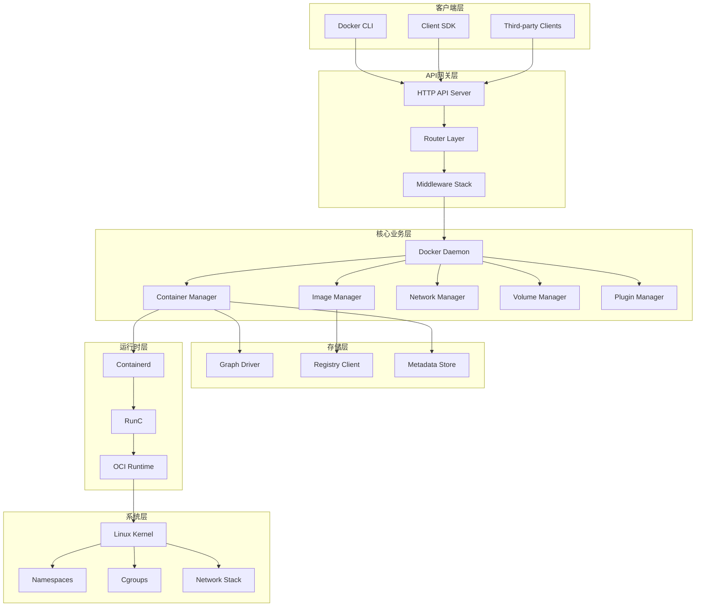
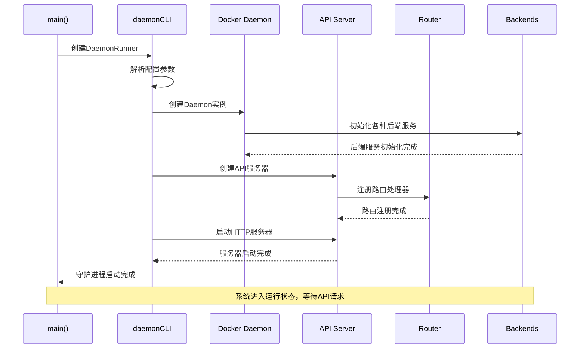
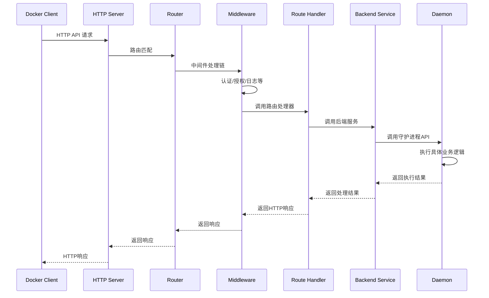

## 1. 项目简介

### 1.1 项目背景
Moby是Docker公司开源的容器化平台项目，是Docker CE的上游项目。它提供了一套模块化的工具包，用于构建基于容器的系统。项目采用Go语言开发，遵循模块化、可扩展的设计原则。

### 1.2 核心特性
- **模块化设计**: 组件具有明确定义的功能和API接口
- **可插拔架构**: 支持组件替换和扩展
- **安全默认**: 提供安全的默认配置
- **开发者友好**: 面向开发者的API设计

### 1.3 版本信息
- **当前API版本**: v1.52
- **Go版本**: 1.24.0
- **协议支持**: HTTP/HTTPS, Unix Socket
- **架构支持**: Linux, Windows, macOS

## 2. 整体架构设计

### 2.1 系统架构图



### 2.2 模块分层说明

#### 2.2.1 客户端层 (Client Layer)
- **Docker CLI**: 命令行客户端工具
- **Client SDK**: Go语言客户端库
- **Third-party Clients**: 第三方客户端应用

#### 2.2.2 API网关层 (API Gateway Layer)  
- **HTTP API Server**: RESTful API服务器
- **Router Layer**: 路由分发层
- **Middleware Stack**: 中间件处理栈

#### 2.2.3 核心业务层 (Core Business Layer)
- **Docker Daemon**: 核心守护进程
- **Container Manager**: 容器管理器
- **Image Manager**: 镜像管理器
- **Network Manager**: 网络管理器
- **Volume Manager**: 存储卷管理器
- **Plugin Manager**: 插件管理器

#### 2.2.4 存储层 (Storage Layer)
- **Graph Driver**: 镜像存储驱动
- **Registry Client**: 镜像仓库客户端
- **Metadata Store**: 元数据存储

#### 2.2.5 运行时层 (Runtime Layer)
- **Containerd**: 容器运行时管理器
- **RunC**: OCI容器运行时
- **OCI Runtime**: OCI标准运行时接口

#### 2.2.6 系统层 (System Layer)
- **Linux Kernel**: Linux内核
- **Namespaces**: 命名空间隔离
- **Cgroups**: 控制组资源限制
- **Network Stack**: 网络协议栈

## 3. 核心组件模块

### 3.1 主要目录结构

```
moby/
├── api/                    # API定义和类型
├── client/                 # 客户端库
├── cmd/                    # 可执行文件入口
│   ├── dockerd/           # Docker守护进程
│   └── docker-proxy/      # Docker网络代理
├── daemon/                 # 守护进程核心逻辑
│   ├── server/            # HTTP服务器
│   ├── container/         # 容器管理
│   ├── images/            # 镜像管理
│   ├── network/           # 网络管理
│   ├── volume/            # 存储卷管理
│   ├── libnetwork/        # 网络库
│   └── ...
├── pkg/                   # 通用工具包
├── internal/              # 内部工具包
├── integration/           # 集成测试
└── vendor/                # 第三方依赖
```

### 3.2 核心模块功能

| 模块 | 功能描述 | 关键组件 |
|------|----------|----------|
| **API模块** | 定义REST API接口和数据类型 | swagger.yaml, types/ |
| **客户端模块** | 提供Go语言客户端SDK | client/ |
| **守护进程模块** | 实现核心业务逻辑 | daemon/ |
| **服务器模块** | HTTP API服务器实现 | daemon/server/ |
| **容器模块** | 容器生命周期管理 | daemon/container/ |
| **镜像模块** | 镜像存储和管理 | daemon/images/ |
| **网络模块** | 网络功能实现 | daemon/libnetwork/ |
| **存储模块** | 存储卷管理 | daemon/volume/ |
| **插件模块** | 插件系统 | daemon/pkg/plugin/ |

## 4. 核心工作流程

### 4.1 系统启动时序图



### 4.2 API请求处理时序图



## 5. 技术栈和依赖

### 5.1 核心技术栈
- **编程语言**: Go 1.24+
- **网络框架**: Gorilla Mux
- **容器运行时**: Containerd + RunC
- **数据存储**: BBolt (嵌入式KV存储)
- **日志系统**: Logrus
- **配置管理**: TOML/JSON/YAML
- **API文档**: OpenAPI/Swagger 2.0

### 5.2 关键第三方依赖
- **github.com/containerd/containerd**: 容器运行时
- **github.com/gorilla/mux**: HTTP路由器
- **github.com/sirupsen/logrus**: 结构化日志
- **go.etcd.io/bbolt**: 嵌入式数据库
- **github.com/docker/distribution**: 镜像分发
- **github.com/opencontainers/image-spec**: OCI镜像规范
- **github.com/opencontainers/runtime-spec**: OCI运行时规范

### 5.3 构建系统
- **构建工具**: Make, Docker BuildKit
- **依赖管理**: Go Modules
- **测试框架**: Go内置testing + gotest.tools
- **代码生成**: Swagger Codegen

## 6. 设计原则与模式

### 6.1 设计原则
1. **模块化**: 每个组件职责单一，接口清晰
2. **可扩展性**: 支持插件和驱动扩展
3. **向后兼容**: API版本兼容机制
4. **错误处理**: 统一错误处理和状态码
5. **安全性**: 默认安全配置和权限控制

### 6.2 设计模式
- **工厂模式**: 用于创建各种驱动和后端服务
- **策略模式**: 不同存储驱动的选择
- **观察者模式**: 事件系统和状态监控  
- **装饰器模式**: 中间件处理链
- **适配器模式**: 不同运行时接口适配

### 6.3 并发模型
- **Goroutine池**: 处理并发请求
- **Context传播**: 请求上下文管理
- **Channel通信**: 组件间异步通信
- **锁机制**: 资源访问同步控制

## 7. 扩展机制

### 7.1 插件系统
支持多种类型的插件扩展：
- **存储插件**: 自定义存储驱动
- **网络插件**: 自定义网络驱动
- **日志插件**: 自定义日志驱动
- **授权插件**: 自定义授权机制

### 7.2 驱动接口
提供标准化的驱动接口：
- **Graph Driver**: 镜像层存储驱动
- **Network Driver**: 网络驱动接口
- **IPAM Driver**: IP地址管理驱动
- **Volume Driver**: 存储卷驱动

### 7.3 API扩展
- **版本控制**: 支持多API版本共存
- **实验性功能**: 可选的实验性API
- **自定义端点**: 插件可注册自定义API端点

这个整体架构概述为后续各模块的详细分析奠定了基础。接下来我们将深入分析每个核心模块的实现细节。
