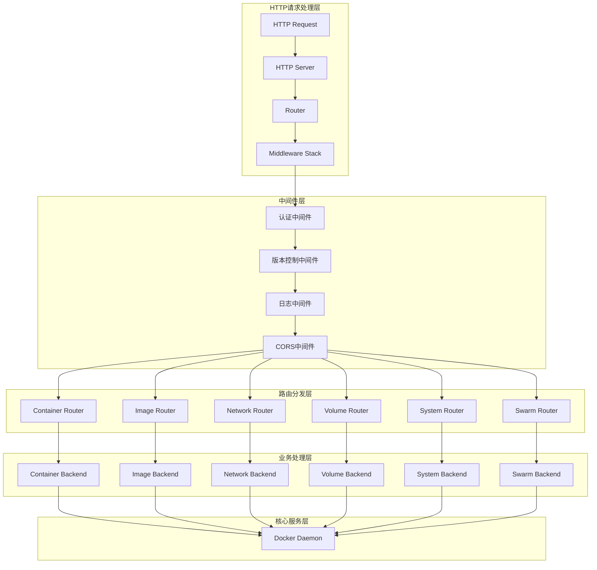
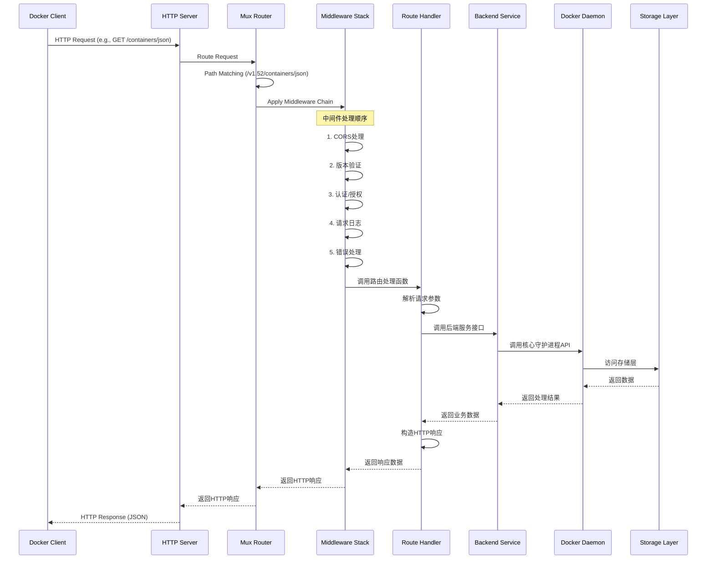
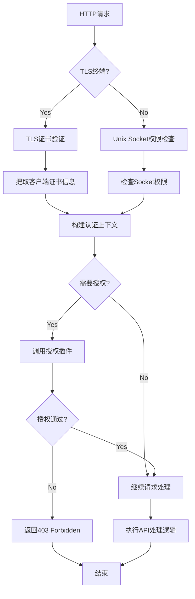

## 1. API架构概述

### 1.1 API设计原则
Moby采用RESTful API设计风格，所有API都遵循统一的设计原则：
- **资源导向**: 每个API端点对应一个或一类资源
- **HTTP方法语义**: 使用标准HTTP方法表达操作意图
- **版本控制**: 支持API版本化，保证向后兼容
- **统一错误处理**: 标准化错误响应格式
- **流式处理**: 支持长连接和流式数据传输

### 1.2 API版本控制
```go
// API版本路径格式
const versionMatcher = "/v{version:[0-9.]+}"

// 当前支持的API版本
basePath: "/v1.52"  // 最新版本
// 最小支持版本: v1.24
```

### 1.3 API入口点架构



## 2. 核心API模块分析

### 2.1 Container API模块

#### 2.1.1 API路由定义
```go
// 文件路径: daemon/server/router/container/container.go

// containerRouter 结构体定义容器路由器
type containerRouter struct {
	backend Backend      // 后端服务接口
	routes  []router.Route // 路由列表
}

// 容器API路由初始化
func (c *containerRouter) initRoutes() {
	c.routes = []router.Route{
		// HEAD 方法 - 检查资源存在性
		router.NewHeadRoute("/containers/{name:.*}/archive", c.headContainersArchive),
		
		// GET 方法 - 查询操作
		router.NewGetRoute("/containers/json", c.getContainersJSON),           // 列出容器
		router.NewGetRoute("/containers/{name:.*}/json", c.getContainersByName), // 检查容器详情
		router.NewGetRoute("/containers/{name:.*}/logs", c.getContainersLogs),   // 获取容器日志
		router.NewGetRoute("/containers/{name:.*}/stats", c.getContainersStats), // 获取容器统计信息
		router.NewGetRoute("/containers/{name:.*}/top", c.getContainersTop),     // 获取容器进程列表
		router.NewGetRoute("/containers/{name:.*}/changes", c.getContainersChanges), // 获取文件系统变化
		
		// POST 方法 - 创建和操作
		router.NewPostRoute("/containers/create", c.postContainersCreate),       // 创建容器
		router.NewPostRoute("/containers/{name:.*}/start", c.postContainersStart), // 启动容器
		router.NewPostRoute("/containers/{name:.*}/stop", c.postContainersStop),   // 停止容器
		router.NewPostRoute("/containers/{name:.*}/restart", c.postContainersRestart), // 重启容器
		router.NewPostRoute("/containers/{name:.*}/kill", c.postContainersKill),   // 强制终止容器
		router.NewPostRoute("/containers/{name:.*}/pause", c.postContainersPause), // 暂停容器
		router.NewPostRoute("/containers/{name:.*}/unpause", c.postContainersUnpause), // 恢复容器
		
		// DELETE 方法 - 删除操作
		router.NewDeleteRoute("/containers/{name:.*}", c.deleteContainers),      // 删除容器
	}
}
```

#### 2.1.2 核心API处理函数分析

**容器列表API (GET /containers/json)**

```go
// 功能: 获取容器列表，支持过滤、分页等查询参数
// 入口函数: getContainersJSON
// 处理流程: HTTP请求 -> 参数解析 -> 后端查询 -> 版本兼容处理 -> JSON响应

func (c *containerRouter) getContainersJSON(ctx context.Context, w http.ResponseWriter, r *http.Request, vars map[string]string) error {
	// 1. 解析HTTP查询参数
	if err := httputils.ParseForm(r); err != nil {
		return err
	}
	
	// 2. 解析过滤条件
	filter, err := filters.FromJSON(r.Form.Get("filters"))
	if err != nil {
		return err
	}

	// 3. 构建查询配置
	config := &backend.ContainerListOptions{
		All:     httputils.BoolValue(r, "all"),        // 是否显示所有容器
		Size:    httputils.BoolValue(r, "size"),       // 是否包含大小信息
		Since:   r.Form.Get("since"),                  // 起始时间过滤
		Before:  r.Form.Get("before"),                 // 结束时间过滤
		Filters: filter,                               // 其他过滤条件
	}

	// 4. 处理分页限制
	if tmpLimit := r.Form.Get("limit"); tmpLimit != "" {
		limit, err := strconv.Atoi(tmpLimit)
		if err != nil {
			return err
		}
		config.Limit = limit
	}

	// 5. 调用后端服务查询容器列表
	containers, err := c.backend.Containers(ctx, config)
	if err != nil {
		return err
	}

	// 6. API版本兼容性处理
	version := httputils.VersionFromContext(ctx)
	
	// API v1.46之前版本不支持HostConfig.Annotations
	if versions.LessThan(version, "1.46") {
		for _, c := range containers {
			c.HostConfig.Annotations = nil
		}
	}
	
	// API v1.48之前版本不支持ImageManifestDescriptor
	if versions.LessThan(version, "1.48") {
		for _, c := range containers {
			c.ImageManifestDescriptor = nil
		}
	}

	// 7. 返回JSON响应
	return httputils.WriteJSON(w, http.StatusOK, containers)
}
```

**容器创建API (POST /containers/create)**

```go
// 功能: 创建新容器，但不启动
// 入口函数: postContainersCreate
// 核心数据结构: container.Config, container.HostConfig

func (c *containerRouter) postContainersCreate(ctx context.Context, w http.ResponseWriter, r *http.Request, vars map[string]string) error {
	// 1. 解析请求体中的容器配置
	var config *container.Config
	var hostConfig *container.HostConfig
	var networkingConfig *network.NetworkingConfig
	
	// 解析JSON请求体
	if err := httputils.ReadJSON(r, &config); err != nil {
		return err
	}
	
	// 2. 获取容器名称（可选）
	name := r.Form.Get("name")
	
	// 3. 平台架构处理
	version := httputils.VersionFromContext(ctx)
	if versions.GreaterThanOrEqualTo(version, "1.41") {
		if platform := r.Form.Get("platform"); platform != "" {
			// 解析平台信息（如 linux/amd64）
		}
	}
	
	// 4. 调用后端创建容器
	ccr, err := c.backend.ContainerCreate(ctx, types.ContainerCreateConfig{
		Name:             name,
		Config:           config,
		HostConfig:       hostConfig,
		NetworkingConfig: networkingConfig,
		Platform:         platform,
	})
	
	if err != nil {
		return err
	}
	
	// 5. 返回创建结果
	return httputils.WriteJSON(w, http.StatusCreated, ccr)
}
```

#### 2.1.3 Container Backend接口

```go
// 文件路径: daemon/server/router/container/backend.go

// Backend 定义了容器操作的后端接口
// 这是容器路由器与核心Daemon之间的抽象层
type Backend interface {
	// 容器生命周期管理
	ContainerCreate(ctx context.Context, config types.ContainerCreateConfig) (*container.CreateResponse, error)
	ContainerStart(ctx context.Context, name string, hostConfig *container.HostConfig, checkpoint string, checkpointDir string) error
	ContainerStop(ctx context.Context, name string, options container.StopOptions) error
	ContainerRestart(ctx context.Context, name string, options container.StopOptions) error
	ContainerKill(ctx context.Context, name string, signal string) error
	ContainerPause(name string) error
	ContainerUnpause(name string) error
	
	// 容器查询操作
	Containers(ctx context.Context, config *backend.ContainerListOptions) ([]*types.Container, error)
	ContainerInspect(ctx context.Context, name string, size bool, version string) (interface{}, error)
	ContainerLogs(ctx context.Context, name string, config *backend.ContainerLogsConfig) (*bytes.Buffer, error)
	ContainerStats(ctx context.Context, name string, config *backend.ContainerStatsConfig) error
	ContainerTop(name string, psArgs string) (*container.ContainerTopOKBody, error)
	
	// 容器文件操作
	ContainerArchivePath(name string, path string) (*tar.Archive, *container.PathStat, error)
	ContainerExtractToDir(name, path string, copyUIDGID, noOverwriteDirNonDir bool, content io.Reader) error
	
	// 容器删除和清理
	ContainerDelete(name string, config *backend.ContainerDeleteConfig) error
	ContainersPrune(ctx context.Context, pruneFilters filters.Args) (*container.PruneReport, error)
}
```

### 2.2 Image API模块

#### 2.2.1 镜像API路由定义

```go
// 文件路径: daemon/server/router/image/image.go

func (ir *imageRouter) initRoutes() {
	ir.routes = []router.Route{
		// GET 方法 - 查询操作
		router.NewGetRoute("/images/json", ir.getImagesJSON),              // 列出镜像
		router.NewGetRoute("/images/search", ir.getImagesSearch),          // 搜索镜像
		router.NewGetRoute("/images/get", ir.getImagesGet),                // 导出镜像
		router.NewGetRoute("/images/{name:.*}/history", ir.getImagesHistory), // 获取镜像历史
		router.NewGetRoute("/images/{name:.*}/json", ir.getImagesByName),   // 检查镜像详情
		
		// POST 方法 - 创建和操作
		router.NewPostRoute("/images/load", ir.postImagesLoad),           // 加载镜像
		router.NewPostRoute("/images/create", ir.postImagesCreate),       // 拉取/导入镜像
		router.NewPostRoute("/images/{name:.*}/push", ir.postImagesPush), // 推送镜像
		router.NewPostRoute("/images/{name:.*}/tag", ir.postImagesTag),   // 标记镜像
		
		// DELETE 方法 - 删除操作
		router.NewDeleteRoute("/images/{name:.*}", ir.deleteImages),      // 删除镜像
	}
}
```

#### 2.2.2 镜像拉取API分析

```go
// 功能: 从镜像仓库拉取镜像或从tar文件导入镜像
// 入口函数: postImagesCreate
// 支持操作: Pull (拉取) 和 Import (导入)

func (ir *imageRouter) postImagesCreate(ctx context.Context, w http.ResponseWriter, r *http.Request, vars map[string]string) error {
	// 1. 解析请求参数
	var (
		img         = r.Form.Get("fromImage")    // 拉取的镜像名
		repo        = r.Form.Get("repo")         // 导入时的仓库名
		tag         = r.Form.Get("tag")          // 镜像标签
		comment     = r.Form.Get("message")      // 导入时的提交信息
		platform    *ocispec.Platform           // 目标平台架构
		output      = ioutils.NewWriteFlusher(w) // 流式输出
	)
	defer output.Close()

	// 2. 设置响应头为流式JSON
	w.Header().Set("Content-Type", "application/json")

	// 3. 处理平台架构参数（API v1.32+）
	version := httputils.VersionFromContext(ctx)
	if versions.GreaterThanOrEqualTo(version, "1.32") {
		if p := r.FormValue("platform"); p != "" {
			sp, err := platforms.Parse(p)  // 解析如 "linux/amd64"
			if err != nil {
				return errdefs.InvalidParameter(err)
			}
			platform = &sp
		}
	}

	if img != "" { // 镜像拉取操作
		// 4. 解析镜像引用
		imgName := strings.TrimSuffix(img, ":")
		ref, err := reference.ParseNormalizedNamed(imgName)
		if err != nil {
			return errdefs.InvalidParameter(err)
		}

		// 5. 处理标签或摘要
		if tag != "" {
			if dgst, err := digest.Parse(tag); err == nil {
				// tag实际是摘要
				ref, err = reference.WithDigest(reference.TrimNamed(ref), dgst)
			} else {
				// tag是真正的标签
				ref, err = reference.WithTag(ref, tag)
			}
			if err != nil {
				return errdefs.InvalidParameter(err)
			}
		}

		// 6. 获取认证信息
		authConfig := &registry.AuthConfig{}
		authEncoded := r.Header.Get("X-Registry-Auth")
		if authEncoded != "" {
			if err := json.NewDecoder(base64.NewDecoder(base64.URLEncoding, strings.NewReader(authEncoded))).Decode(authConfig); err != nil {
				return errors.Wrap(err, "invalid auth config")
			}
		}

		// 7. 调用后端拉取镜像（流式处理）
		if err := ir.backend.PullImage(ctx, ref, platform, metaHeaders, authConfig, output); err != nil {
			// 处理拉取错误
			if !output.Flushed() {
				return err
			}
			_, _ = output.Write(streamformatter.FormatError(err))
		}
		
	} else { // 镜像导入操作
		// 8. 处理镜像导入
		src := r.Form.Get("fromSrc")        // 导入源
		
		// 9. 读取tar数据流
		var input io.ReadCloser = r.Body
		if src != "" {
			// 从URL导入
			u, err := url.Parse(src)
			if err != nil {
				return errdefs.InvalidParameter(err)
			}
			input, err = remotecontext.OpenFromURL(ctx, src, u)
			if err != nil {
				return err
			}
			defer input.Close()
		}

		// 10. 调用后端导入镜像
		if err := ir.backend.ImportImage(ctx, src, repo, platform, tag, comment, input, output, r.Form["changes"]); err != nil {
			if !output.Flushed() {
				return err
			}
			_, _ = output.Write(streamformatter.FormatError(err))
		}
	}

	return nil
}
```

### 2.3 System API模块

#### 2.3.1 系统信息API

```go
// 功能: 获取Docker系统信息和配置
// 端点: GET /info
// 返回: 系统配置、运行时信息、插件状态等

func (s *systemRouter) getInfo(ctx context.Context, w http.ResponseWriter, r *http.Request, vars map[string]string) error {
	// 1. 调用后端获取系统信息
	info, err := s.backend.SystemInfo(ctx)
	if err != nil {
		return err
	}

	// 2. API版本兼容性处理
	version := httputils.VersionFromContext(ctx)
	
	// 根据API版本过滤不支持的字段
	if versions.LessThan(version, "1.44") {
		info.ContainerDSecriptor = nil
	}

	// 3. 返回系统信息
	return httputils.WriteJSON(w, http.StatusOK, info)
}
```

#### 2.3.2 版本信息API

```go
// 功能: 获取Docker版本信息
// 端点: GET /version
// 返回: API版本、Git提交、构建时间等

func (s *systemRouter) getVersion(ctx context.Context, w http.ResponseWriter, r *http.Request, vars map[string]string) error {
	// 1. 构建版本信息响应
	v := &types.Version{
		Platform: struct{ Name string }{dockerversion.PlatformName}, // 平台名称
		Version:     dockerversion.Version,                          // Docker版本
		APIVersion:  dockerversion.DefaultAPIVersion,                // API版本
		MinAPIVersion: dockerversion.MinAPIVersion,                  // 最小支持API版本
		GitCommit:   dockerversion.GitCommit,                       // Git提交哈希
		BuildTime:   dockerversion.BuildTime,                       // 构建时间
		GoVersion:   runtime.Version(),                             // Go版本
		Os:          runtime.GOOS,                                  // 操作系统
		Arch:        runtime.GOARCH,                                // CPU架构
	}

	// 2. 添加实验性功能标识
	if dockerversion.ExperimentalBuild {
		v.Experimental = true
	}

	// 3. 返回版本信息
	return httputils.WriteJSON(w, http.StatusOK, v)
}
```

## 3. API请求处理流程

### 3.1 HTTP请求处理时序图



### 3.2 API认证和授权流程



### 3.3 错误处理机制

```go
// 统一错误响应格式
type ErrorResponse struct {
	Message string `json:"message"`
}

// HTTP状态码映射
func httpstatus.FromError(err error) int {
	switch {
	case errdefs.IsNotFound(err):
		return http.StatusNotFound        // 404
	case errdefs.IsInvalidParameter(err):
		return http.StatusBadRequest      // 400
	case errdefs.IsConflict(err):
		return http.StatusConflict        // 409
	case errdefs.IsUnauthorized(err):
		return http.StatusUnauthorized    // 401
	case errdefs.IsForbidden(err):
		return http.StatusForbidden       // 403
	case errdefs.IsUnavailable(err):
		return http.StatusServiceUnavailable // 503
	case errdefs.IsNotModified(err):
		return http.StatusNotModified     // 304
	default:
		return http.StatusInternalServerError // 500
	}
}

// 错误处理中间件
func (s *Server) makeHTTPHandler(r router.Route) http.HandlerFunc {
	return func(w http.ResponseWriter, req *http.Request) {
		// ... 其他处理逻辑 ...
		
		if err := handlerFunc(ctx, w, req, vars); err != nil {
			statusCode := httpstatus.FromError(err)
			
			// 记录错误日志（服务器内部错误）
			if statusCode >= http.StatusInternalServerError {
				log.G(ctx).Errorf("Handler for %s %s returned error: %v", 
					req.Method, req.URL.Path, err)
			}
			
			// API版本兼容性处理
			if version := vars["version"]; version != "" && versions.LessThan(version, "1.24") {
				// 老版本API返回纯文本错误
				http.Error(w, err.Error(), statusCode)
			} else {
				// 新版本API返回JSON错误
				_ = httputils.WriteJSON(w, statusCode, &ErrorResponse{
					Message: err.Error(),
				})
			}
		}
	}
}
```

## 4. 框架使用示例

### 4.1 基本Docker客户端使用

```go
package main

import (
	"context"
	"fmt"
	"log"

	"github.com/moby/moby/client"
	"github.com/moby/moby/api/types/container"
	"github.com/moby/moby/api/types/image"
)

func main() {
	// 1. 创建Docker客户端
	cli, err := client.NewClientWithOpts(
		client.FromEnv,                    // 从环境变量读取配置
		client.WithAPIVersionNegotiation(), // 自动协商API版本
	)
	if err != nil {
		log.Fatal(err)
	}
	defer cli.Close()

	ctx := context.Background()

	// 2. 列出所有容器
	containers, err := cli.ContainerList(ctx, container.ListOptions{All: true})
	if err != nil {
		log.Fatal(err)
	}

	fmt.Printf("找到 %d 个容器:\n", len(containers))
	for _, c := range containers {
		fmt.Printf("- %s: %s (%s)\n", c.Names[0], c.Image, c.State)
	}

	// 3. 拉取镜像
	reader, err := cli.ImagePull(ctx, "nginx:latest", image.PullOptions{})
	if err != nil {
		log.Fatal(err)
	}
	defer reader.Close()

	// 4. 创建容器
	resp, err := cli.ContainerCreate(ctx, &container.Config{
		Image: "nginx:latest",
		ExposedPorts: nat.PortSet{
			"80/tcp": struct{}{},
		},
	}, &container.HostConfig{
		PortBindings: nat.PortMap{
			"80/tcp": []nat.PortBinding{
				{
					HostIP:   "0.0.0.0",
					HostPort: "8080",
				},
			},
		},
	}, nil, nil, "my-nginx-container")
	
	if err != nil {
		log.Fatal(err)
	}

	// 5. 启动容器
	if err := cli.ContainerStart(ctx, resp.ID, container.StartOptions{}); err != nil {
		log.Fatal(err)
	}

	fmt.Printf("容器已创建并启动: %s\n", resp.ID)
}
```

### 4.2 自定义API客户端

```go
package main

import (
	"bytes"
	"context"
	"encoding/json"
	"fmt"
	"net/http"
)

// CustomDockerClient 自定义Docker API客户端
type CustomDockerClient struct {
	baseURL    string
	httpClient *http.Client
}

// ContainerInfo 容器信息结构体
type ContainerInfo struct {
	ID      string            `json:"Id"`
	Names   []string          `json:"Names"`
	Image   string            `json:"Image"`
	State   string            `json:"State"`
	Status  string            `json:"Status"`
	Labels  map[string]string `json:"Labels"`
}

// NewCustomDockerClient 创建自定义客户端
func NewCustomDockerClient(socketPath string) *CustomDockerClient {
	return &CustomDockerClient{
		baseURL:    "http://unix",
		httpClient: &http.Client{
			Transport: &http.Transport{
				DialContext: func(ctx context.Context, network, addr string) (net.Conn, error) {
					return net.DialUnix("unix", nil, &net.UnixAddr{
						Name: socketPath,
						Net:  "unix",
					})
				},
			},
		},
	}
}

// ListContainers 列出容器
func (c *CustomDockerClient) ListContainers(ctx context.Context, all bool) ([]ContainerInfo, error) {
	url := fmt.Sprintf("%s/v1.52/containers/json?all=%t", c.baseURL, all)
	
	req, err := http.NewRequestWithContext(ctx, "GET", url, nil)
	if err != nil {
		return nil, err
	}

	resp, err := c.httpClient.Do(req)
	if err != nil {
		return nil, err
	}
	defer resp.Body.Close()

	if resp.StatusCode != http.StatusOK {
		return nil, fmt.Errorf("API请求失败: %s", resp.Status)
	}

	var containers []ContainerInfo
	if err := json.NewDecoder(resp.Body).Decode(&containers); err != nil {
		return nil, err
	}

	return containers, nil
}

// CreateContainer 创建容器
func (c *CustomDockerClient) CreateContainer(ctx context.Context, config ContainerConfig) (string, error) {
	url := fmt.Sprintf("%s/v1.52/containers/create", c.baseURL)
	
	jsonData, err := json.Marshal(config)
	if err != nil {
		return "", err
	}

	req, err := http.NewRequestWithContext(ctx, "POST", url, bytes.NewBuffer(jsonData))
	if err != nil {
		return "", err
	}
	req.Header.Set("Content-Type", "application/json")

	resp, err := c.httpClient.Do(req)
	if err != nil {
		return "", err
	}
	defer resp.Body.Close()

	if resp.StatusCode != http.StatusCreated {
		return "", fmt.Errorf("创建容器失败: %s", resp.Status)
	}

	var result struct {
		ID string `json:"Id"`
	}
	if err := json.NewDecoder(resp.Body).Decode(&result); err != nil {
		return "", err
	}

	return result.ID, nil
}

func main() {
	client := NewCustomDockerClient("/var/run/docker.sock")
	ctx := context.Background()

	// 列出所有容器
	containers, err := client.ListContainers(ctx, true)
	if err != nil {
		log.Fatal(err)
	}

	fmt.Printf("找到 %d 个容器\n", len(containers))
	for _, container := range containers {
		fmt.Printf("- %s: %s (%s)\n", 
			container.Names[0], container.Image, container.State)
	}
}
```

## 5. API扩展和插件机制

### 5.1 授权插件示例

```go
// 授权插件实现示例
type AuthorizationPlugin struct {
	client *http.Client
	url    string
}

// AuthorizeRequest 请求授权
func (p *AuthorizationPlugin) AuthorizeRequest(req *authorization.Request) (*authorization.Response, error) {
	// 构建授权请求
	authReq := struct {
		User     string            `json:"user"`
		Method   string            `json:"method"`
		URI      string            `json:"uri"`
		Headers  map[string]string `json:"headers"`
	}{
		User:    req.User,
		Method:  req.RequestMethod,
		URI:     req.RequestURI,
		Headers: req.RequestHeaders,
	}

	// 发送授权请求到插件服务器
	jsonData, _ := json.Marshal(authReq)
	resp, err := p.client.Post(p.url+"/authz/request", "application/json", bytes.NewBuffer(jsonData))
	if err != nil {
		return &authorization.Response{Allow: false, Msg: "授权服务不可用"}, nil
	}
	defer resp.Body.Close()

	var authResp authorization.Response
	json.NewDecoder(resp.Body).Decode(&authResp)
	return &authResp, nil
}
```

### 5.2 网络插件接口

```go
// 网络驱动插件接口
type NetworkDriver interface {
	// 创建网络
	CreateNetwork(req *network.CreateRequest) (*network.CreateResponse, error)
	
	// 删除网络  
	DeleteNetwork(req *network.DeleteRequest) error
	
	// 创建端点
	CreateEndpoint(req *network.CreateEndpointRequest) (*network.CreateEndpointResponse, error)
	
	// 删除端点
	DeleteEndpoint(req *network.DeleteEndpointRequest) error
	
	// 加入端点到沙盒
	Join(req *network.JoinRequest) (*network.JoinResponse, error)
	
	// 离开沙盒
	Leave(req *network.LeaveRequest) error
}
```

这个API详细分析为理解Moby的API架构提供了深入的视角，展示了从HTTP请求到最终业务逻辑处理的完整流程。
