# docker-02-container

## 模块概览

## 模块定位与职责

### 职责边界

container 模块负责容器的完整生命周期管理，是 Docker 最核心的功能模块：

1. **容器 CRUD 操作**：
   - 创建容器（分配 ID、初始化配置、预分配网络）
   - 启动容器（生成 OCI Spec、调用 containerd、连接网络）
   - 停止容器（发送信号、等待退出、清理资源）
   - 删除容器（移除文件系统、释放网络/卷、删除元数据）

2. **容器运行时管理**：
   - 暂停/恢复（freeze/thaw cgroup）
   - 重启（stop + start）
   - 重命名（更新索引、移动目录）
   - 更新资源限制（CPU/内存配额动态调整）

3. **容器交互**：
   - 附加到容器（stdin/stdout/stderr 流）
   - 执行命令（docker exec）
   - 查看日志（tail -f 日志文件）
   - 查看统计信息（CPU/内存/网络/磁盘 I/O）

4. **容器元数据管理**：
   - 持久化容器配置（config.v2.json）
   - 维护容器状态（Running/Paused/Exited/Dead）
   - 记录容器历史（重启次数、退出码）

### 上下游依赖

**上游调用方**：

- Container Router：处理容器相关的 HTTP API
- Daemon：容器生命周期的协调者
- Cluster/Swarm：集群模式下的任务调度

**下游被依赖方**：

- containerd Client：容器运行时操作
- Libnetwork：网络端点管理
- VolumeService：卷挂载
- ImageService：镜像层准备
- LogDriver：日志收集

### 生命周期状态机

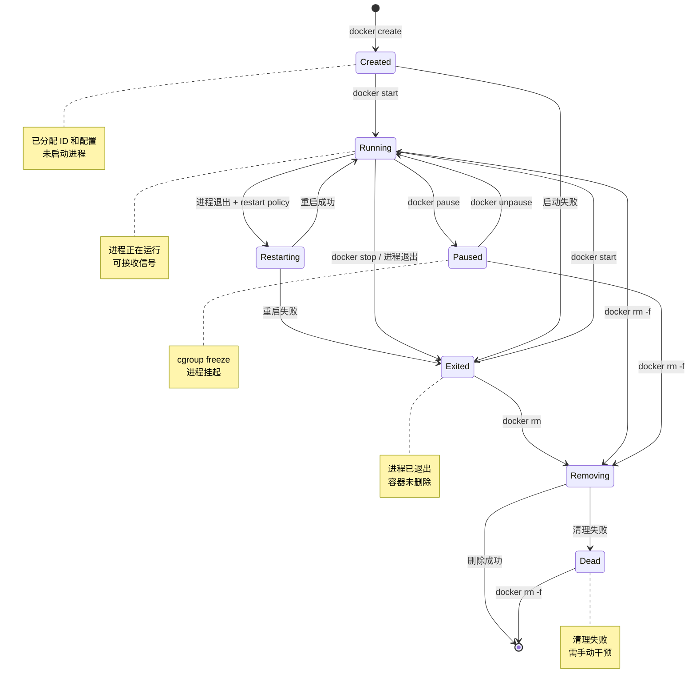

**状态转换详解**：

| 状态 | 说明 | 允许操作 | 磁盘数据 |
|---|---|---|---|
| **Created** | 已创建但未启动 | start, rm, inspect | 配置文件存在 |
| **Running** | 进程正在运行 | stop, kill, pause, exec, attach | 配置 + 日志 |
| **Paused** | 进程被暂停（cgroup freeze） | unpause, kill, rm -f | 配置 + 日志 |
| **Restarting** | 自动重启中 | stop（中断重启） | 配置 + 日志 |
| **Exited** | 进程已退出 | start, rm, logs | 配置 + 日志 |
| **Removing** | 正在删除 | 等待完成 | 逐步删除中 |
| **Dead** | 清理失败 | rm -f（强制清理） | 部分残留 |

---

## 模块架构图

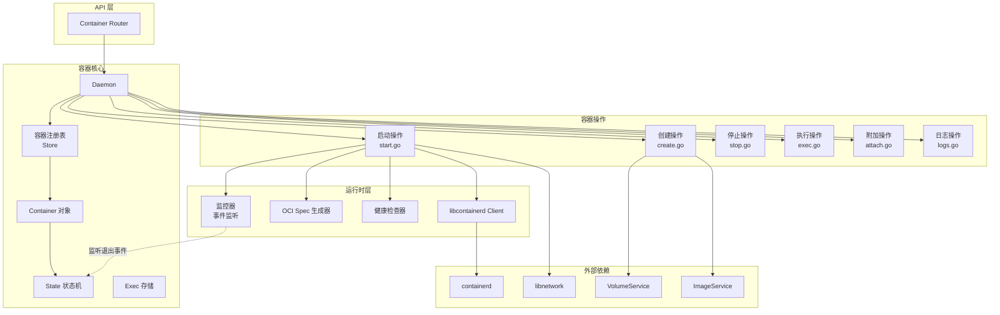

### 架构说明

**1. 容器核心层**：

- **容器注册表**：内存索引，支持按 ID/Name/前缀查找

  ```go
  type Store struct {
      byID   map[string]*Container
      byName map[string]*Container
      mu     sync.RWMutex
  }
```

- **Container 对象**：每个容器的完整状态与配置

  ```go
  type Container struct {
      ID          string
      Name        string
      Config      *container.Config      // 用户配置
      HostConfig  *container.HostConfig  // 宿主机配置
      State       *State                  // 运行状态
      Created     time.Time
      Path        string                  // 容器文件系统路径
      NetworkSettings *network.Settings
      LogPath     string
      mu          sync.Mutex
  }
```

- **State 状态机**：管理容器状态转换

  ```go
  type State struct {
      Running       bool
      Paused        bool
      Restarting    bool
      Dead          bool
      Pid           int
      ExitCode      int
      StartedAt     time.Time
      FinishedAt    time.Time
      Health        *Health
      mu            sync.Mutex
  }
```

**2. 容器操作层**：

- **创建操作**：
  - 验证镜像存在
  - 分配容器 ID（SHA256 随机生成）
  - 初始化容器目录结构
  - 预分配网络端点（但不连接）
  - 持久化配置到 `config.v2.json`

- **启动操作**：
  - 验证容器状态（未运行）
  - 准备文件系统（挂载卷、镜像层）
  - 生成 OCI Runtime Spec
  - 调用 containerd 创建并启动 Task
  - 连接网络端点
  - 启动健康检查
  - 启动日志收集

- **停止操作**：
  - 发送 SIGTERM 信号
  - 等待超时（默认 10 秒）
  - 超时后发送 SIGKILL
  - 断开网络连接
  - 停止健康检查

**3. 运行时层**：

- **libcontainerd Client**：封装 containerd gRPC 调用
- **OCI Spec 生成器**：将 Docker 配置转换为 OCI Runtime Spec
  - Namespaces（PID/NET/IPC/UTS/Mount）
  - Cgroups（CPU/内存/设备限制）
  - Mounts（卷、tmpfs、bind mount）
  - Process（命令、环境变量、用户）
  - Capabilities（Linux 权限）
  - Seccomp/AppArmor/SELinux 配置

- **健康检查器**：定时执行健康检查命令
- **监控器**：订阅容器退出事件、OOM 事件

---

## 容器启动完整时序图

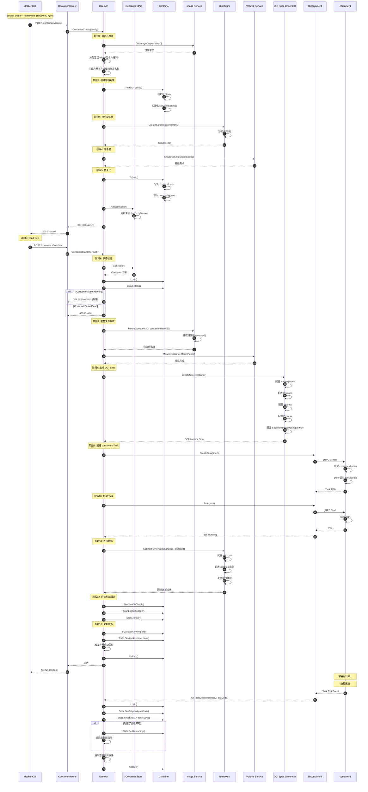

### 时序图关键点说明

**阶段1-5：容器创建（docker create）**

- **时长**：约 50-100ms
- **关键操作**：
  - 镜像验证：检查本地镜像是否存在（5ms）
  - ID 生成：SHA256(随机数 + 时间戳) 取前 64 位（<1ms）
  - 网络预分配：从 IPAM 分配 IP 地址，但不创建 veth pair（10ms）
  - 持久化：写入 config.v2.json、hostconfig.json（10ms）
- **幂等性**：非幂等，重复调用返回 409 Conflict（容器名已存在）

**阶段6：状态验证**

- **时长**：<1ms
- **关键检查**：
  - 容器是否已运行（幂等：返回 304）
  - 容器是否标记删除（冲突：返回 409）
  - 容器是否处于 Dead 状态（冲突：返回 409）

**阶段7：准备文件系统**

- **时长**：20-50ms
- **镜像层挂载（overlay2）**：

```
  lowerdir=/var/lib/docker/overlay2/l/AAA:/var/lib/docker/overlay2/l/BBB
  upperdir=/var/lib/docker/overlay2/<container-id>/diff
  workdir=/var/lib/docker/overlay2/<container-id>/work
```

- **卷挂载**：
  - 本地卷：bind mount `/var/lib/docker/volumes/<vol>/\_data`
  - 插件卷：调用插件驱动的 Mount 方法

**阶段8：生成 OCI Spec**

- **时长**：5-10ms
- **Spec 关键部分**：

  ```json
  {
    "ociVersion": "1.0.2",
    "process": {
      "terminal": false,
      "user": {"uid": 0, "gid": 0},
      "args": ["nginx", "-g", "daemon off;"],
      "env": ["PATH=/usr/local/sbin:...", "NGINX_VERSION=1.21.0"],
      "cwd": "/",
      "capabilities": {...},
      "rlimits": [{"type": "RLIMIT_NOFILE", "hard": 1024, "soft": 1024}]
    },
    "root": {"path": "/var/lib/docker/overlay2/<id>/merged"},
    "mounts": [...],
    "linux": {
      "namespaces": [
        {"type": "pid"},
        {"type": "network", "path": "/var/run/docker/netns/<sandbox-id>"},
        {"type": "ipc"},
        {"type": "uts"},
        {"type": "mount"}
      ],
      "cgroupsPath": "/docker/<container-id>",
      "resources": {
        "memory": {"limit": 536870912},
        "cpu": {"quota": 50000, "period": 100000}
      },
      "seccomp": {...}
    }
  }
```

**阶段9-10：containerd Task 创建与启动**

- **时长**：80-150ms
- **containerd-shim 职责**：
  - 作为容器进程的父进程（reparenting）
  - 处理容器进程的 stdout/stderr
  - 监听容器退出事件
  - 在 dockerd 重启时保持容器运行
- **runc create**：
  - 创建 cgroup 层级结构
  - 创建网络命名空间（或加入现有命名空间）
  - 创建 PID/IPC/UTS/Mount 命名空间
  - 设置 seccomp/AppArmor/SELinux 配置
- **runc start**：
  - 执行容器入口进程（exec）
  - 应用资源限制
  - 切换到容器根文件系统（pivot_root）

**阶段11：连接网络**

- **时长**：40-80ms
- **bridge 模式**：
  - 创建 veth pair（vethXXX ↔ eth0）
  - 将 vethXXX 连接到 docker0 网桥
  - 将 eth0 移动到容器网络命名空间
  - 配置 IP 地址和路由
  - 配置 iptables 规则（端口映射、SNAT）
- **overlay 模式**：
  - 创建 VXLAN 隧道
  - 配置跨主机路由

**阶段12：启动附加服务**

- **健康检查**：
  - 解析 HEALTHCHECK 指令
  - 启动定时器（默认 30 秒间隔）
  - 执行健康检查命令（在容器内 exec）
  - 更新健康状态（starting → healthy/unhealthy）
- **日志收集**：
  - 打开容器 stdout/stderr 流
  - 通过 log driver 写入日志后端（json-file/syslog/...）
  - 支持日志轮转（max-size/max-file）
- **监控器**：
  - 订阅 containerd 事件流
  - 监听容器退出、OOM、execDie 事件

**阶段13：状态更新**

- **时长**：<1ms
- **状态字段**：
  - Running: true
  - Paused: false
  - Restarting: false
  - Pid: <容器主进程 PID>
  - StartedAt: <启动时间戳>
- **事件触发**：

  ```json
  {
    "Type": "container",
    "Action": "start",
    "Actor": {
      "ID": "abc123...",
      "Attributes": {
        "image": "nginx:latest",
        "name": "web"
      }
    }
  }
```

---

## 边界条件与异常处理

### 并发安全

**容器级锁**：

```go
func (daemon *Daemon) ContainerStart(ctx context.Context, name string) error {
    container, err := daemon.GetContainer(name)
    
    container.Lock() // 获取容器锁
    defer container.Unlock()
    
    // 状态检查与修改在锁保护下进行
    if container.Running {
        return nil // 幂等
    }
    
    // 启动逻辑...
}
```

- 每个容器有独立的 `sync.Mutex`
- 防止并发启动/停止同一容器
- 锁粒度：单个容器（不阻塞其他容器操作）

**ContainerStore 锁**：

```go
type Store struct {
    byID   map[string]*Container
    byName map[string]*Container
    mu     sync.RWMutex
}

func (s *Store) Get(nameOrID string) *Container {
    s.mu.RLock()
    defer s.mu.RUnlock()
    return s.byID[nameOrID]
}

func (s *Store) Add(c *Container) {
    s.mu.Lock()
    defer s.mu.Unlock()
    s.byID[c.ID] = c
    s.byName[c.Name] = c
}
```

- 读多写少场景使用 `sync.RWMutex`
- 查找容器时不阻塞其他读操作
- 添加/删除容器时短暂阻塞所有操作

### 超时与重试

**启动超时**：

```go
const defaultStartTimeout = 30 * time.Second

ctx, cancel := context.WithTimeout(ctx, startTimeout)
defer cancel()

if err := daemon.containerd.Start(ctx, container.ID); err != nil {
    if errors.Is(err, context.DeadlineExceeded) {
        // 清理已创建的资源
        daemon.cleanupContainer(container)
    }
    return err
}
```

**停止超时**：

```go
func (daemon *Daemon) ContainerStop(ctx context.Context, name string, opts backend.ContainerStopOptions) error {
    timeout := 10 // 默认 10 秒
    if opts.Timeout != nil {
        timeout = *opts.Timeout
    }
    
    // 发送 SIGTERM
    daemon.kill(container, syscall.SIGTERM)
    
    // 等待退出或超时
    select {
    case <-container.Wait(ctx, container.WaitConditionNotRunning):
        return nil
    case <-time.After(time.Duration(timeout) * time.Second):
        // 超时后发送 SIGKILL
        daemon.kill(container, syscall.SIGKILL)
    }
}
```

**重启策略**：

```go
type RestartPolicy struct {
    Name              string // no/always/on-failure/unless-stopped
    MaximumRetryCount int
}

func (daemon *Daemon) autoRestart(container *Container, exitCode int) {
    policy := container.HostConfig.RestartPolicy
    
    switch policy.Name {
    case "always":
        daemon.containerStart(ctx, container)
    case "on-failure":
        if exitCode != 0 {
            if container.RestartCount < policy.MaximumRetryCount {
                time.Sleep(backoff(container.RestartCount))
                daemon.containerStart(ctx, container)
            }
        }
    case "unless-stopped":
        if !container.HasBeenManuallyStop {
            daemon.containerStart(ctx, container)
        }
    }
}
```

### 异常恢复

**containerd 连接丢失**：

```go
// 监听 containerd 事件
go daemon.processContainerdEvents(ctx)

func (daemon *Daemon) processContainerdEvents(ctx context.Context) {
    for {
        events, errs := daemon.containerd.Subscribe(ctx)
        for {
            select {
            case evt := <-events:
                daemon.handleContainerdEvent(evt)
            case err := <-errs:
                log.Errorf("containerd event stream error: %v", err)
                // 等待重连
                time.Sleep(1 * time.Second)
                goto Reconnect
            }
        }
    Reconnect:
    }
}
```

**Live Restore（守护进程重启保持容器运行）**：

```go
// daemon 启动时恢复容器状态
func (daemon *Daemon) restore() {
    containers := daemon.loadContainersFromDisk()
    
    for _, c := range containers {
        if c.IsRunning() {
            // 重新连接到 containerd Task
            task, err := daemon.containerd.LoadContainer(ctx, c.ID)
            if err != nil {
                log.Errorf("Failed to restore container %s: %v", c.ID, err)
                c.SetStopped(unknownExitCode)
                continue
            }
            
            // 恢复状态
            c.Pid = int(task.Pid())
            
            // 重新订阅事件
            go daemon.monitorContainer(c)
            
            // 重新连接日志流
            daemon.attachContainerStreams(c)
        }
    }
}
```

**磁盘满处理**：

```go
func (daemon *Daemon) ContainerCreate(...) error {
    // 创建容器目录
    if err := os.MkdirAll(container.Root, 0700); err != nil {
        if errors.Is(err, syscall.ENOSPC) {
            return errdefs.System(errors.New("no space left on device"))
        }
        return err
    }
    
    // 写入配置文件
    if err := container.ToDisk(); err != nil {
        os.RemoveAll(container.Root) // 清理
        return err
    }
}
```

---

## 性能优化

### 快速路径优化

**容器查找缓存**：

```go
// 前缀匹配优化
func (s *Store) Get(nameOrID string) *Container {
    // 精确匹配 O(1)
    if c, ok := s.byID[nameOrID]; ok {
        return c
    }
    
    // 短 ID 前缀匹配（至少 12 位）
    if len(nameOrID) >= 12 {
        for id, c := range s.byID {
            if strings.HasPrefix(id, nameOrID) {
                return c
            }
        }
    }
    
    return nil
}
```

**批量启动优化**：

```go
func (daemon *Daemon) ContainersStart(ctx context.Context, ids []string) error {
    var wg sync.WaitGroup
    sem := semaphore.NewWeighted(10) // 最多并发 10 个
    
    for _, id := range ids {
        wg.Add(1)
        sem.Acquire(ctx, 1)
        
        go func(id string) {
            defer wg.Done()
            defer sem.Release(1)
            
            daemon.ContainerStart(ctx, id)
        }(id)
    }
    
    wg.Wait()
}
```

**日志流优化**：

```go
// 使用带缓冲 channel 避免阻塞
type LogCollector struct {
    buffer chan *LogMessage
}

func (lc *LogCollector) Collect(msg *LogMessage) {
    select {
    case lc.buffer <- msg:
    default:
        // 缓冲区满，丢弃旧消息
        <-lc.buffer
        lc.buffer <- msg
    }
}
```

---

## 最佳实践

### 资源限制

```bash
# CPU 限制
docker run -d \
  --cpus=2.0 \              # 使用 2 个 CPU
  --cpu-shares=1024 \       # CPU 权重
  nginx

# 内存限制
docker run -d \
  --memory=1g \             # 最大内存 1GB
  --memory-swap=1g \        # 禁用 swap
  --memory-reservation=512m \ # 软限制
  --oom-kill-disable \      # 禁止 OOM killer
  nginx

# 磁盘 I/O 限制
docker run -d \
  --blkio-weight=500 \      # I/O 权重 (10-1000)
  --device-read-bps=/dev/sda:1mb \  # 读限速
  --device-write-bps=/dev/sda:1mb \ # 写限速
  nginx
```

### 健康检查

```dockerfile
FROM nginx
HEALTHCHECK --interval=30s --timeout=3s --start-period=5s --retries=3 \
  CMD curl -f http://localhost/ || exit 1
```

### 日志管理

```json
{
  "log-driver": "json-file",
  "log-opts": {
    "max-size": "10m",
    "max-file": "3",
    "compress": "true",
    "labels": "app,env"
  }
}
```

### 重启策略

```bash
# 生产环境推荐配置
docker run -d \
  --restart=unless-stopped \  # 除非手动停止否则自动重启
  --health-cmd="curl -f http://localhost/health" \
  --health-interval=30s \
  nginx
```

---

## API接口

本文档详细列出容器模块的所有对外 API 接口，包括请求/响应结构体、字段说明、入口函数、调用链与时序图。

---

## API 目录

### 容器生命周期
1. [创建容器](#1-创建容器) - `POST /containers/create`
2. [启动容器](#2-启动容器) - `POST /containers/{id}/start`
3. [停止容器](#3-停止容器) - `POST /containers/{id}/stop`
4. [重启容器](#4-重启容器) - `POST /containers/{id}/restart`
5. [删除容器](#5-删除容器) - `DELETE /containers/{id}`
6. [杀死容器](#6-杀死容器) - `POST /containers/{id}/kill`
7. [暂停容器](#7-暂停容器) - `POST /containers/{id}/pause`
8. [恢复容器](#8-恢复容器) - `POST /containers/{id}/unpause`

### 容器查询
1. [列出容器](#9-列出容器) - `GET /containers/json`
2. [检查容器](#10-检查容器) - `GET /containers/{id}/json`
3. [查看容器进程](#11-查看容器进程) - `GET /containers/{id}/top`
4. [查看容器日志](#12-查看容器日志) - `GET /containers/{id}/logs`
5. [查看容器统计](#13-查看容器统计) - `GET /containers/{id}/stats`
6. [查看容器变更](#14-查看容器变更) - `GET /containers/{id}/changes`

### 容器操作
1. [更新容器](#15-更新容器) - `POST /containers/{id}/update`
2. [重命名容器](#16-重命名容器) - `POST /containers/{id}/rename`
3. [等待容器](#17-等待容器) - `POST /containers/{id}/wait`
4. [调整终端大小](#18-调整终端大小) - `POST /containers/{id}/resize`

### 容器执行
1. [创建 Exec](#19-创建-exec) - `POST /containers/{id}/exec`
2. [启动 Exec](#20-启动-exec) - `POST /exec/{id}/start`
3. [检查 Exec](#21-检查-exec) - `GET /exec/{id}/json`

### 容器附加
1. [附加到容器](#22-附加到容器) - `POST /containers/{id}/attach`
2. [WebSocket 附加](#23-websocket-附加) - `GET /containers/{id}/attach/ws`

### 容器文件操作
1. [导出容器](#24-导出容器) - `GET /containers/{id}/export`
2. [获取文件归档](#25-获取文件归档) - `GET /containers/{id}/archive`
3. [提取文件归档](#26-提取文件归档) - `PUT /containers/{id}/archive`
4. [检查文件路径](#27-检查文件路径) - `HEAD /containers/{id}/archive`

### 其他操作
1. [提交容器为镜像](#28-提交容器为镜像) - `POST /commit`
2. [清理容器](#29-清理容器) - `POST /containers/prune`

---

## 1. 创建容器

### 基本信息
- **路径**：`POST /containers/create`
- **功能**：创建一个新容器但不启动它
- **幂等性**：非幂等（重复调用返回 409 Conflict）

### 请求参数

**Query 参数**：
| 参数 | 类型 | 必填 | 说明 |
|---|---|---:|---|
| name | string | 否 | 容器名称（不指定则自动生成） |
| platform | string | 否 | 平台（如 `linux/amd64`） |

**Body（JSON）**：

```json
{
  "Image": "nginx:latest",
  "Cmd": ["nginx", "-g", "daemon off;"],
  "Env": ["NODE_ENV=production"],
  "ExposedPorts": {
    "80/tcp": {}
  },
  "HostConfig": {
    "PortBindings": {
      "80/tcp": [{"HostPort": "8080"}]
    },
    "Memory": 536870912,
    "CpuShares": 512,
    "Binds": ["myvolume:/data"],
    "RestartPolicy": {
      "Name": "unless-stopped",
      "MaximumRetryCount": 3
    }
  },
  "NetworkingConfig": {
    "EndpointsConfig": {
      "mynet": {
        "IPAMConfig": {
          "IPv4Address": "172.18.0.10"
        }
      }
    }
  }
}
```

### 请求结构体字段表

**Config（容器配置）**：
| 字段 | 类型 | 必填 | 默认值 | 说明 |
|---|---|---:|---|---|
| Image | string | 是 | - | 镜像名称 |
| Cmd | []string | 否 | 镜像默认 | 启动命令 |
| Entrypoint | []string | 否 | 镜像默认 | 入口点 |
| Env | []string | 否 | `[]` | 环境变量 |
| WorkingDir | string | 否 | 镜像默认 | 工作目录 |
| User | string | 否 | 镜像默认 | 用户（UID:GID） |
| Hostname | string | 否 | 容器 ID | 主机名 |
| Domainname | string | 否 | - | 域名 |
| MacAddress | string | 否 | 自动分配 | MAC 地址 |
| ExposedPorts | map | 否 | `{}` | 暴露端口 |
| Volumes | map | 否 | `{}` | 挂载点 |
| Labels | map | 否 | `{}` | 标签 |
| StopSignal | string | 否 | SIGTERM | 停止信号 |
| StopTimeout | *int | 否 | 10 | 停止超时（秒） |
| Healthcheck | object | 否 | - | 健康检查配置 |

**HostConfig（宿主机配置）**：
| 字段 | 类型 | 必填 | 默认值 | 约束 | 说明 |
|---|---|---:|---|---|---|
| Binds | []string | 否 | `[]` | - | 卷绑定 |
| Memory | int64 | 否 | 0 | ≥ 6291456 (6MB) | 内存限制（字节） |
| MemorySwap | int64 | 否 | Memory*2 | - | 内存+交换限制 |
| CpuShares | int64 | 否 | 1024 | 0-1024 | CPU 权重 |
| CpuPeriod | int64 | 否 | 100000 | - | CPU CFS 周期 |
| CpuQuota | int64 | 否 | 0 | - | CPU CFS 配额 |
| CpusetCpus | string | 否 | - | - | 允许的 CPU（0-3,8） |
| PortBindings | map | 否 | `{}` | - | 端口映射 |
| PublishAllPorts | bool | 否 | false | - | 发布所有暴露端口 |
| Privileged | bool | 否 | false | - | 特权模式 |
| ReadonlyRootfs | bool | 否 | false | - | 只读根文件系统 |
| NetworkMode | string | 否 | bridge | - | 网络模式 |
| RestartPolicy | object | 否 | no | - | 重启策略 |
| AutoRemove | bool | 否 | false | - | 退出后自动删除 |

### 响应结构体

**成功响应（201 Created）**：

```json
{
  "Id": "abc123def456...",
  "Warnings": []
}
```

---

## 附录：来源合并（posts/docker-02-API接口详细分析）

### A.1 容器路由概览（摘录）

```go
// 文件: daemon/server/router/container/container.go
type containerRouter struct {
    backend Backend
    routes  []router.Route
}

func (c *containerRouter) initRoutes() {
    c.routes = []router.Route{
        router.NewHeadRoute("/containers/{name:.*}/archive", c.headContainersArchive),
        router.NewGetRoute("/containers/json", c.getContainersJSON),
        router.NewGetRoute("/containers/{name:.*}/json", c.getContainersByName),
        router.NewGetRoute("/containers/{name:.*}/logs", c.getContainersLogs),
        router.NewGetRoute("/containers/{name:.*}/stats", c.getContainersStats),
        router.NewGetRoute("/containers/{name:.*}/top", c.getContainersTop),
        router.NewGetRoute("/containers/{name:.*}/changes", c.getContainersChanges),
        router.NewPostRoute("/containers/create", c.postContainersCreate),
        router.NewPostRoute("/containers/{name:.*}/start", c.postContainersStart),
        router.NewPostRoute("/containers/{name:.*}/stop", c.postContainersStop),
        router.NewPostRoute("/containers/{name:.*}/restart", c.postContainersRestart),
        router.NewPostRoute("/containers/{name:.*}/kill", c.postContainersKill),
        router.NewPostRoute("/containers/{name:.*}/pause", c.postContainersPause),
        router.NewPostRoute("/containers/{name:.*}/unpause", c.postContainersUnpause),
        router.NewDeleteRoute("/containers/{name:.*}", c.deleteContainers),
    }
}
```

### A.2 列出容器（GET /containers/json）处理流程（摘录）

```go
func (c *containerRouter) getContainersJSON(ctx context.Context, w http.ResponseWriter, r *http.Request, vars map[string]string) error {
    if err := httputils.ParseForm(r); err != nil { return err }
    filter, err := filters.FromJSON(r.Form.Get("filters"))
    if err != nil { return err }

    config := &backend.ContainerListOptions{
        All:     httputils.BoolValue(r, "all"),
        Size:    httputils.BoolValue(r, "size"),
        Since:   r.Form.Get("since"),
        Before:  r.Form.Get("before"),
        Filters: filter,
    }
    if tmpLimit := r.Form.Get("limit"); tmpLimit != "" {
        if limit, err := strconv.Atoi(tmpLimit); err == nil { config.Limit = limit } else { return err }
    }

    containers, err := c.backend.Containers(ctx, config)
    if err != nil { return err }

    version := httputils.VersionFromContext(ctx)
    if versions.LessThan(version, "1.46") {
        for _, c := range containers { c.HostConfig.Annotations = nil }
    }
    if versions.LessThan(version, "1.48") {
        for _, c := range containers { c.ImageManifestDescriptor = nil }
    }
    return httputils.WriteJSON(w, http.StatusOK, containers)
}
```

说明：本节内容自 posts/docker-02-API接口详细分析 摘要整合，仅保留关键路径与版本兼容处理要点。

| 字段 | 类型 | 说明 |
|---|---|---|
| Id | string | 容器 ID（64 位十六进制） |
| Warnings | []string | 警告信息（如使用了过时参数） |

**错误响应**：

- `400 Bad Request`：参数验证失败
- `404 Not Found`：镜像不存在
- `409 Conflict`：容器名已存在
- `500 Internal Server Error`：内部错误

### 入口函数与核心代码

```go
// API Handler
func (c *containerRouter) postContainersCreate(ctx context.Context, w http.ResponseWriter, r *http.Request) error {
    name := r.Form.Get("name")
    
    // 解码请求体
    req, err := runconfig.DecodeCreateRequest(r.Body, c.backend.RawSysInfo())
    config := req.Config
    hostConfig := req.HostConfig
    networkingConfig := req.NetworkingConfig
    
    // 处理默认网络
    if hostConfig.NetworkMode == "" || hostConfig.NetworkMode.IsDefault() {
        hostConfig.NetworkMode = networkSettings.DefaultNetwork
    }
    
    // 调用后端创建容器
    ccr, err := c.backend.ContainerCreate(ctx, backend.ContainerCreateConfig{
        Name:             name,
        Config:           config,
        HostConfig:       hostConfig,
        NetworkingConfig: networkingConfig,
        Platform:         platform,
    })
    
    return httputils.WriteJSON(w, http.StatusCreated, ccr)
}
```

### 调用链

```
HTTP Handler (postContainersCreate)
  ↓
backend.ContainerCreate()
  ↓
daemon.ContainerCreate()
  ↓
daemon.containerCreate()
  ├─ 1. 验证镜像存在
  │   └─ ImageService.GetImage()
  ├─ 2. 分配容器 ID
  │   └─ generateIDAndName()
  ├─ 3. 创建容器对象
  │   └─ container.NewContainer()
  ├─ 4. 预分配网络
  │   └─ libnetwork.CreateSandbox()
  ├─ 5. 准备卷
  │   └─ VolumeService.CreateVolumes()
  └─ 6. 持久化配置
      └─ Container.ToDisk()
```

### 时序图

参见 `dockerd-02-container-时序图.md` 中的"容器创建时序图"。

---

## 2. 启动容器

### 基本信息
- **路径**：`POST /containers/{id}/start`
- **功能**：启动一个已创建的容器
- **幂等性**：幂等（已启动的容器返回 304 Not Modified）

### 请求参数

**Path 参数**：
| 参数 | 类型 | 必填 | 说明 |
|---|---|---:|---|
| id | string | 是 | 容器 ID 或名称 |

**Query 参数**：
| 参数 | 类型 | 必填 | 说明 |
|---|---|---:|---|
| checkpoint | string | 否 | 检查点 ID（实验性） |
| checkpoint-dir | string | 否 | 检查点目录 |

### 响应

**成功响应（204 No Content）**：无响应体

**错误响应**：

- `304 Not Modified`：容器已启动（幂等）
- `404 Not Found`：容器不存在
- `409 Conflict`：容器正在删除
- `500 Internal Server Error`：启动失败

### 入口函数与核心代码

```go
// API Handler
func (c *containerRouter) postContainersStart(ctx context.Context, w http.ResponseWriter, r *http.Request) error {
    if err := c.backend.ContainerStart(ctx, vars["name"], r.Form.Get("checkpoint"), r.Form.Get("checkpoint-dir")); err != nil {
        return err
    }
    w.WriteHeader(http.StatusNoContent)
    return nil
}

// Backend Implementation
func (daemon *Daemon) ContainerStart(ctx context.Context, name string, checkpoint string, checkpointDir string) error {
    container, err := daemon.GetContainer(name)
    
    return daemon.containerStart(ctx, daemon.config(), container, checkpoint, checkpointDir, true)
}

// Core Logic
func (daemon *Daemon) containerStart(ctx context.Context, container *container.Container) error {
    container.Lock()
    defer container.Unlock()
    
    // 1. 状态检查
    if container.Running {
        return nil // 幂等
    }
    
    // 2. 准备文件系统
    if err := daemon.Mount(container); err != nil {
        return err
    }
    
    // 3. 生成 OCI Spec
    spec, err := daemon.createSpec(ctx, container)
    
    // 4. 创建并启动 containerd Task
    task, err := daemon.containerd.Create(ctx, container.ID, spec)
    if err := task.Start(ctx); err != nil {
        return err
    }
    
    // 5. 连接网络
    if err := daemon.initializeNetworking(container); err != nil {
        return err
    }
    
    // 6. 启动健康检查
    container.StartHealthCheck()
    
    // 7. 更新状态
    container.SetRunning(task.Pid())
    daemon.LogContainerEvent(container, "start")
    
    return nil
}
```

### 调用链

```
HTTP Handler (postContainersStart)
  ↓
backend.ContainerStart()
  ↓
daemon.ContainerStart()
  ↓
daemon.containerStart()
  ├─ 1. 状态验证
  ├─ 2. 挂载文件系统
  │   └─ ImageService.Mount()
  ├─ 3. 生成 OCI Spec
  │   └─ daemon.createSpec()
  ├─ 4. containerd Task 创建与启动
  │   ├─ containerd.Create()
  │   └─ task.Start()
  ├─ 5. 网络连接
  │   └─ libnetwork.ConnectEndpoint()
  ├─ 6. 启动附加服务
  │   ├─ StartHealthCheck()
  │   └─ StartLogCollection()
  └─ 7. 状态更新
      └─ container.SetRunning()
```

---

## 3. 停止容器

### 基本信息
- **路径**：`POST /containers/{id}/stop`
- **功能**：停止一个运行中的容器
- **幂等性**：幂等（已停止的容器返回 304 Not Modified）

### 请求参数

**Path 参数**：
| 参数 | 类型 | 必填 | 说明 |
|---|---|---:|---|
| id | string | 是 | 容器 ID 或名称 |

**Query 参数**：
| 参数 | 类型 | 必填 | 默认值 | 说明 |
|---|---|---:|---|---|
| t | int | 否 | 10 | 超时时间（秒）<br/>-1 表示无限等待<br/>0 表示立即 SIGKILL |
| signal | string | 否 | - | 停止信号（API v1.42+）<br/>如 SIGTERM, SIGKILL |

### 响应

**成功响应（204 No Content）**：无响应体

**错误响应**：

- `304 Not Modified`：容器已停止
- `404 Not Found`：容器不存在
- `500 Internal Server Error`：停止失败

### 入口函数与核心代码

```go
// API Handler
func (c *containerRouter) postContainersStop(ctx context.Context, w http.ResponseWriter, r *http.Request) error {
    var options backend.ContainerStopOptions
    
    // 解析信号参数（API v1.42+）
    if versions.GreaterThanOrEqualTo(version, "1.42") {
        options.Signal = r.Form.Get("signal")
    }
    
    // 解析超时参数
    if tmpSeconds := r.Form.Get("t"); tmpSeconds != "" {
        valSeconds, _ := strconv.Atoi(tmpSeconds)
        options.Timeout = &valSeconds
    }
    
    if err := c.backend.ContainerStop(ctx, vars["name"], options); err != nil {
        return err
    }
    
    w.WriteHeader(http.StatusNoContent)
    return nil
}

// Core Logic
func (daemon *Daemon) ContainerStop(ctx context.Context, name string, options backend.ContainerStopOptions) error {
    container, err := daemon.GetContainer(name)
    
    container.Lock()
    defer container.Unlock()
    
    if !container.Running {
        return nil // 幂等
    }
    
    // 1. 确定超时时间
    timeout := 10
    if options.Timeout != nil {
        timeout = *options.Timeout
    }
    
    // 2. 确定信号
    signal := container.StopSignal()
    if options.Signal != "" {
        signal = options.Signal
    }
    
    // 3. 发送信号
    if err := daemon.kill(container, signal); err != nil {
        return err
    }
    
    // 4. 等待退出或超时
    if timeout > 0 {
        select {
        case <-container.Wait(ctx, container.WaitConditionNotRunning):
            // 容器正常退出
        case <-time.After(time.Duration(timeout) * time.Second):
            // 超时，发送 SIGKILL
            daemon.kill(container, "SIGKILL")
        }
    } else if timeout == 0 {
        // 立即 SIGKILL
        daemon.kill(container, "SIGKILL")
    }
    
    // 5. 断开网络
    daemon.disconnectFromNetwork(container)
    
    // 6. 更新状态
    container.SetStopped(&exitStatus{ExitCode: exitCode})
    
    return nil
}
```

---

## 9. 列出容器

### 基本信息
- **路径**：`GET /containers/json`
- **功能**：列出所有容器（默认仅运行中的容器）
- **幂等性**：是

### 请求参数

**Query 参数**：
| 参数 | 类型 | 必填 | 默认值 | 说明 |
|---|---|---:|---|---|
| all | boolean | 否 | false | 是否显示所有容器（包括已停止） |
| limit | int | 否 | -1 | 返回数量限制 |
| size | boolean | 否 | false | 是否显示容器大小 |
| filters | string | 否 | - | 过滤条件（JSON 格式） |
| since | string | 否 | - | 显示在此容器之后创建的容器 |
| before | string | 否 | - | 显示在此容器之前创建的容器 |

**filters 参数支持**：

```json
{
  "id": ["abc123"],
  "name": ["web"],
  "label": ["env=prod", "app=nginx"],
  "status": ["created", "restarting", "running", "removing", "paused", "exited", "dead"],
  "ancestor": ["nginx:latest"],
  "volume": ["myvolume"],
  "network": ["mynet"],
  "health": ["healthy", "unhealthy", "starting", "none"]
}
```

### 响应结构体

**成功响应（200 OK）**：

```json
[
  {
    "Id": "abc123def456...",
    "Names": ["/web"],
    "Image": "nginx:latest",
    "ImageID": "sha256:def456...",
    "Command": "nginx -g 'daemon off;'",
    "Created": 1678886400,
    "State": "running",
    "Status": "Up 2 hours",
    "Ports": [
      {
        "PrivatePort": 80,
        "PublicPort": 8080,
        "Type": "tcp"
      }
    ],
    "Labels": {
      "env": "production"
    },
    "SizeRw": 1024,
    "SizeRootFs": 133521408,
    "HostConfig": {
      "NetworkMode": "bridge"
    },
    "NetworkSettings": {
      "Networks": {
        "bridge": {
          "IPAddress": "172.17.0.2",
          "Gateway": "172.17.0.1",
          "MacAddress": "02:42:ac:11:00:02"
        }
      }
    },
    "Mounts": [
      {
        "Type": "volume",
        "Name": "myvolume",
        "Source": "/var/lib/docker/volumes/myvolume/_data",
        "Destination": "/data",
        "Mode": "rw",
        "RW": true
      }
    ]
  }
]
```

### 字段说明

| 字段 | 类型 | 说明 |
|---|---|---|
| Id | string | 容器 ID（64 位） |
| Names | []string | 容器名称（带 `/` 前缀） |
| Image | string | 镜像名称 |
| ImageID | string | 镜像 ID |
| Command | string | 启动命令 |
| Created | int64 | 创建时间（Unix 时间戳） |
| State | string | 状态（created/running/paused/exited/dead） |
| Status | string | 状态描述（Up 2 hours / Exited (0) 1 hour ago） |
| Ports | []Port | 端口映射列表 |
| Labels | map | 标签 |
| SizeRw | int64 | 可写层大小（字节） |
| SizeRootFs | int64 | 根文件系统大小（字节） |
| NetworkSettings | object | 网络配置 |
| Mounts | []Mount | 挂载点列表 |

---

## 19. 创建 Exec

### 基本信息
- **路径**：`POST /containers/{id}/exec`
- **功能**：在运行中的容器内创建一个 exec 实例
- **幂等性**：否（每次创建新的 exec ID）

### 请求参数

**Body（JSON）**：

```json
{
  "AttachStdin": true,
  "AttachStdout": true,
  "AttachStderr": true,
  "Tty": false,
  "Cmd": ["bash", "-c", "echo hello"],
  "Env": ["FOO=bar"],
  "WorkingDir": "/app",
  "User": "root",
  "Privileged": false
}
```

### 请求结构体字段表

| 字段 | 类型 | 必填 | 默认值 | 说明 |
|---|---|---:|---|---|
| Cmd | []string | 是 | - | 要执行的命令 |
| AttachStdin | bool | 否 | false | 附加标准输入 |
| AttachStdout | bool | 否 | true | 附加标准输出 |
| AttachStderr | bool | 否 | true | 附加标准错误 |
| DetachKeys | string | 否 | - | 分离键序列 |
| Tty | bool | 否 | false | 分配伪终端 |
| Env | []string | 否 | `[]` | 环境变量 |
| WorkingDir | string | 否 | 容器工作目录 | 工作目录 |
| User | string | 否 | 容器用户 | 用户（UID:GID） |
| Privileged | bool | 否 | false | 特权模式 |
| ConsoleSize | [2]uint | 否 | - | 控制台大小（高,宽） |

### 响应结构体

**成功响应（201 Created）**：

```json
{
  "Id": "exec123abc..."
}
```

### 入口函数与核心代码

```go
// API Handler
func (c *containerRouter) postContainerExecCreate(ctx context.Context, w http.ResponseWriter, r *http.Request) error {
    var config container.ExecOptions
    if err := httputils.ReadJSON(r, &config); err != nil {
        return err
    }
    
    execID, err := c.backend.ContainerExecCreate(ctx, vars["name"], &config)
    if err != nil {
        return err
    }
    
    return httputils.WriteJSON(w, http.StatusCreated, &container.ExecCreateResponse{
        ID: execID,
    })
}

// Core Logic
func (daemon *Daemon) ContainerExecCreate(ctx context.Context, name string, config *container.ExecOptions) (string, error) {
    cntr, err := daemon.GetContainer(name)
    
    if !cntr.IsRunning() {
        return "", errNotRunning(cntr.ID)
    }
    
    // 1. 创建 exec 配置
    execConfig := &container.ExecConfig{
        ID:            stringid.GenerateRandomID(),
        Container:     cntr,
        Cmd:           config.Cmd,
        Env:           config.Env,
        WorkingDir:    config.WorkingDir,
        User:          config.User,
        Privileged:    config.Privileged,
        Tty:           config.Tty,
        AttachStdin:   config.AttachStdin,
        AttachStdout:  config.AttachStdout,
        AttachStderr:  config.AttachStderr,
        DetachKeys:    config.DetachKeys,
    }
    
    // 2. 注册 exec
    daemon.registerExecCommand(cntr, execConfig)
    
    return execConfig.ID, nil
}
```

---

## 28. 提交容器为镜像

### 基本信息
- **路径**：`POST /commit`
- **功能**：基于容器当前状态创建新镜像
- **幂等性**：否（每次生成新镜像 ID）

### 请求参数

**Query 参数**：
| 参数 | 类型 | 必填 | 说明 |
|---|---|---:|---|
| container | string | 是 | 容器 ID 或名称 |
| repo | string | 否 | 仓库名 |
| tag | string | 否 | 标签名 |
| comment | string | 否 | 提交备注 |
| author | string | 否 | 作者信息 |
| pause | boolean | 否 | 提交前是否暂停容器（默认 true） |
| changes | []string | 否 | Dockerfile 指令（如 `CMD ["nginx"]`） |

**Body（JSON，可选）**：

```json
{
  "Cmd": ["/bin/sh"],
  "Env": ["PATH=/usr/local/sbin:/usr/local/bin"],
  "ExposedPorts": {
    "8080/tcp": {}
  }
}
```

### 响应结构体

**成功响应（201 Created）**：

```json
{
  "Id": "sha256:abc123def456..."
}
```

### 入口函数与核心代码

```go
// API Handler
func (c *containerRouter) postCommit(ctx context.Context, w http.ResponseWriter, r *http.Request) error {
    config, err := decodeCommitRequest(r)
    
    ref, err := httputils.RepoTagReference(r.Form.Get("repo"), r.Form.Get("tag"))
    
    noPause := false
    if r.Form.Has("pause") && !httputils.BoolValue(r, "pause") {
        noPause = true
    }
    
    imgID, err := c.backend.CreateImageFromContainer(ctx, r.Form.Get("container"), &backend.CreateImageConfig{
        NoPause: noPause,
        Tag:     ref,
        Author:  r.Form.Get("author"),
        Comment: r.Form.Get("comment"),
        Config:  config,
        Changes: r.Form["changes"],
    })
    
    return httputils.WriteJSON(w, http.StatusCreated, &container.CommitResponse{ID: imgID})
}

// Core Logic
func (daemon *Daemon) CreateImageFromContainer(ctx context.Context, containerID string, config *backend.CreateImageConfig) (string, error) {
    container, err := daemon.GetContainer(containerID)
    
    // 1. 暂停容器（如果需要）
    if !config.NoPause {
        if err := daemon.ContainerPause(ctx, containerID); err != nil {
            return "", err
        }
        defer daemon.ContainerUnpause(ctx, containerID)
    }
    
    // 2. 获取容器层变更
    rwLayer, err := daemon.imageService.GetLayerByID(container.ID)
    
    // 3. 创建新镜像层
    newLayer, err := daemon.imageService.CreateLayer(rwLayer)
    
    // 4. 合并配置
    imageConfig := container.Config
    if config.Config != nil {
        imageConfig = mergeConfigs(imageConfig, config.Config)
    }
    
    // 5. 应用 Dockerfile 指令变更
    for _, change := range config.Changes {
        applyDockerfileInstruction(imageConfig, change)
    }
    
    // 6. 创建镜像
    imageID, err := daemon.imageService.CreateImage(imageConfig, newLayer)
    
    // 7. 添加标签
    if config.Tag != nil {
        daemon.imageService.TagImage(imageID, config.Tag)
    }
    
    return imageID, nil
}
```

---

## 29. 清理容器

### 基本信息
- **路径**：`POST /containers/prune`
- **功能**：删除所有已停止的容器
- **幂等性**：是
- **最低 API 版本**：1.25

### 请求参数

**Query 参数**：
| 参数 | 类型 | 必填 | 说明 |
|---|---|---:|---|
| filters | string | 否 | 过滤条件（JSON 格式） |

**filters 参数支持**：

```json
{
  "until": ["1h", "2023-01-01T00:00:00"],
  "label": ["env=test", "app!=prod"]
}
```

### 响应结构体

**成功响应（200 OK）**：

```json
{
  "ContainersDeleted": [
    "abc123...",
    "def456..."
  ],
  "SpaceReclaimed": 1073741824
}
```

| 字段 | 类型 | 说明 |
|---|---|---|
| ContainersDeleted | []string | 已删除容器 ID 列表 |
| SpaceReclaimed | uint64 | 回收的磁盘空间（字节） |

### 入口函数与核心代码

```go
// API Handler
func (c *containerRouter) postContainersPrune(ctx context.Context, w http.ResponseWriter, r *http.Request) error {
    filter, err := filters.FromJSON(r.Form.Get("filters"))
    
    pruneReport, err := c.backend.ContainersPrune(ctx, &filters.Args{})
    
    return httputils.WriteJSON(w, http.StatusOK, pruneReport)
}

// Core Logic
func (daemon *Daemon) ContainersPrune(ctx context.Context, pruneFilters filters.Args) (*container.PruneReport, error) {
    rep := &container.PruneReport{}
    
    until, err := filters.GetUntilTimestamp(pruneFilters)
    
    // 遍历所有容器
    for _, c := range daemon.List() {
        if c.IsRunning() {
            continue
        }
        
        // 检查过滤条件
        if !until.IsZero() && c.Created.After(until) {
            continue
        }
        
        if !pruneFilters.MatchKVList("label", c.Config.Labels) {
            continue
        }
        
        // 删除容器
        size, err := daemon.getContainerSize(c.ID)
        if err := daemon.ContainerRm(c.ID, &backend.ContainerRmConfig{
            ForceRemove: false,
            RemoveVolume: false,
        }); err != nil {
            continue
        }
        
        rep.ContainersDeleted = append(rep.ContainersDeleted, c.ID)
        rep.SpaceReclaimed += uint64(size)
    }
    
    return rep, nil
}
```

---

## API 调用示例

### 创建并启动容器

```bash
# 1. 创建容器
curl -X POST http://localhost/v1.43/containers/create \
  -H "Content-Type: application/json" \
  -d '{
    "Image": "nginx:latest",
    "HostConfig": {
      "PortBindings": {
        "80/tcp": [{"HostPort": "8080"}]
      }
    }
  }'
# 响应: {"Id":"abc123..."}

# 2. 启动容器
curl -X POST http://localhost/v1.43/containers/abc123/start

# 3. 查看容器
curl http://localhost/v1.43/containers/abc123/json
```

### 执行命令

```bash
# 1. 创建 exec
curl -X POST http://localhost/v1.43/containers/abc123/exec \
  -H "Content-Type: application/json" \
  -d '{
    "Cmd": ["echo", "hello"],
    "AttachStdout": true
  }'
# 响应: {"Id":"exec123..."}

# 2. 启动 exec
curl -X POST http://localhost/v1.43/exec/exec123/start \
  -H "Content-Type: application/json" \
  -d '{"Detach": false, "Tty": false}'
```

### 清理停止的容器

```bash
# 删除所有停止的容器
curl -X POST http://localhost/v1.43/containers/prune

# 删除 1 小时前停止的容器
curl -X POST "http://localhost/v1.43/containers/prune?filters=%7B%22until%22%3A%5B%221h%22%5D%7D"
```

---

## 错误码参考

| 状态码 | 说明 | 常见原因 |
|---:|---|---|
| 200 | 成功（有响应体） | 查询操作成功 |
| 201 | 已创建 | 创建操作成功 |
| 204 | 成功（无响应体） | 操作成功但无返回内容 |
| 304 | 未修改 | 幂等操作，状态未变化 |
| 400 | 请求错误 | 参数验证失败 |
| 404 | 未找到 | 容器/镜像不存在 |
| 409 | 冲突 | 名称已存在/容器正在删除 |
| 500 | 服务器错误 | 内部错误 |

---

**文档版本**：v1.0  
**对应 API 版本**：v1.43+  
**最后更新**：2025-10-04

---

## 补充：Container API 生产实践要点

- 幂等与可中断
  - `start/stop/restart` 保持幂等；`logs/stats/export` 等流式接口支持中断与超时，防止挂起。

- 版本处理
  - 针对 `signal/ConsoleSize/StopTimeout` 等版本差异做分支；默认值与回退策略明确。

- 安全与资源
  - 校验 `Binds`、`Privileged`、`NetworkMode=host` 等高风险参数；对 `t` 超时做边界限制。

- 观测
  - 关键路径计时（挂载、创建 spec、task 启动、网络连接），失败聚合标签：`reason=image_missing|mount_fail|task_err`。

---

## 数据结构

本文档详细描述容器模块的核心数据结构，包括 UML 类图、字段说明、关系与使用场景。

---

## 数据结构概览

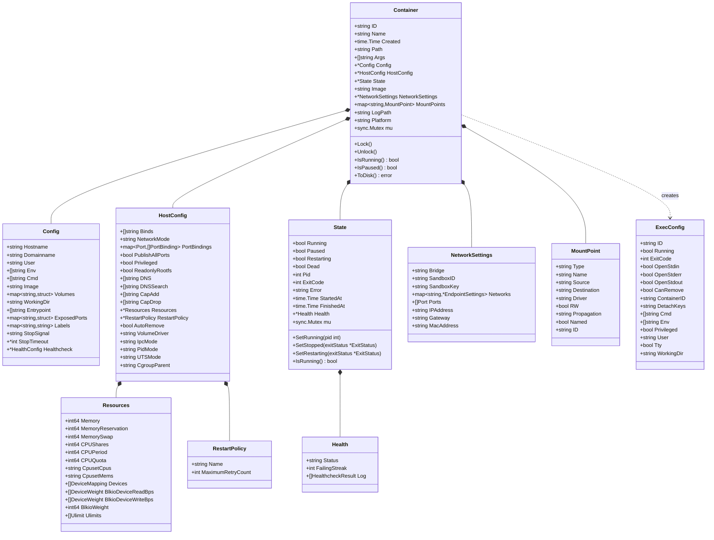

---

## 1. Container（容器对象）

### 结构定义

```go
type Container struct {
    // 基础信息
    ID          string    // 容器 ID（64 位十六进制）
    Name        string    // 容器名称
    Created     time.Time // 创建时间
    Path        string    // 容器启动命令路径
    Args        []string  // 启动命令参数
    
    // 配置
    Config      *container.Config      // 容器配置
    HostConfig  *container.HostConfig  // 宿主机配置
    
    // 状态
    State       *State // 运行状态
    
    // 网络
    NetworkSettings *network.Settings // 网络配置
    
    // 存储
    Image       string                   // 镜像 ID
    MountPoints map[string]*MountPoint   // 挂载点
    
    // 日志
    LogPath     string // 日志文件路径
    
    // 平台
    Platform    string // 目标平台（如 linux/amd64）
    
    // 并发控制
    mu          sync.Mutex
}
```

### 字段说明

| 字段 | 类型 | 说明 | 示例值 |
|---|---|---|---|
| ID | string | 容器唯一标识符 | `abc123def456...` |
| Name | string | 容器名称 | `/web` |
| Created | time.Time | 创建时间 | `2023-01-01 00:00:00` |
| Path | string | 启动命令路径 | `/usr/sbin/nginx` |
| Args | []string | 命令参数 | `["-g", "daemon off;"]` |
| Config | *Config | 用户配置 | 见 Config 结构 |
| HostConfig | *HostConfig | 宿主机配置 | 见 HostConfig 结构 |
| State | *State | 运行状态 | 见 State 结构 |
| NetworkSettings | *NetworkSettings | 网络配置 | 见 NetworkSettings 结构 |
| Image | string | 基础镜像 ID | `sha256:abc123...` |
| MountPoints | map | 挂载点映射 | `{"/data": {...}}` |
| LogPath | string | 日志文件路径 | `/var/lib/docker/containers/<id>/<id>-json.log` |
| Platform | string | 目标平台 | `linux/amd64` |

### 核心方法

```go
// 并发控制
func (c *Container) Lock()
func (c *Container) Unlock()
func (c *Container) RLock()
func (c *Container) RUnlock()

// 状态查询
func (c *Container) IsRunning() bool
func (c *Container) IsPaused() bool
func (c *Container) IsRestarting() bool

// 持久化
func (c *Container) ToDisk() error
func (c *Container) FromDisk() error

// 生命周期
func (c *Container) Start() error
func (c *Container) Stop(timeout time.Duration) error
func (c *Container) Kill(signal string) error
func (c *Container) Restart(timeout time.Duration) error
```

### 存储路径

```
/var/lib/docker/containers/<container-id>/
├── config.v2.json          # 容器配置
├── hostconfig.json          # 宿主机配置
├── hostname                 # 主机名
├── hosts                    # /etc/hosts 内容
├── resolv.conf              # DNS 配置
├── <container-id>-json.log  # 日志文件
└── checkpoints/             # 检查点目录
```

---

## 2. Config（容器配置）

### 结构定义

```go
type Config struct {
    // 主机配置
    Hostname     string // 主机名
    Domainname   string // 域名
    User         string // 用户（UID:GID 或 username:groupname）
    
    // 环境
    Env          []string // 环境变量（KEY=value）
    
    // 命令
    Cmd          []string // 启动命令
    Image        string   // 镜像名称
    Entrypoint   []string // 入口点
    
    // 工作目录
    WorkingDir   string // 工作目录
    
    // 网络
    ExposedPorts map[nat.Port]struct{} // 暴露端口
    
    // 存储
    Volumes      map[string]struct{} // 卷挂载点
    
    // 元数据
    Labels       map[string]string // 标签
    
    // 停止配置
    StopSignal   string // 停止信号（默认 SIGTERM）
    StopTimeout  *int   // 停止超时（秒）
    
    // 健康检查
    Healthcheck  *HealthConfig // 健康检查配置
}
```

### 字段详解

**基础配置**：
| 字段 | 类型 | 默认值 | 约束 | 说明 |
|---|---|---|---|---|
| Hostname | string | 容器 ID 前 12 位 | 长度 ≤ 64 | 容器主机名 |
| User | string | 镜像默认 | - | 用户格式：`1000`, `1000:1000`, `user:group` |
| WorkingDir | string | 镜像默认 | - | 工作目录（绝对路径） |

**命令配置**：

```go
// 完整命令 = Entrypoint + Cmd
// 示例：
Config{
    Entrypoint: []string{"/bin/sh", "-c"},
    Cmd:        []string{"echo hello"},
}
// 实际执行：/bin/sh -c echo hello
```

**环境变量**：

```go
Env: []string{
    "PATH=/usr/local/sbin:/usr/local/bin:/usr/sbin:/usr/bin:/sbin:/bin",
    "NODE_ENV=production",
    "API_KEY=secret",
}
```

**暴露端口**：

```go
ExposedPorts: map[nat.Port]struct{}{
    "80/tcp":   {},
    "443/tcp":  {},
    "8080/udp": {},
}
```

**健康检查**：

```go
type HealthConfig struct {
    Test        []string      // 健康检查命令
    Interval    time.Duration // 检查间隔
    Timeout     time.Duration // 超时时间
    StartPeriod time.Duration // 启动期
    Retries     int           // 重试次数
}

// 示例
Healthcheck: &HealthConfig{
    Test:        []string{"CMD", "curl", "-f", "http://localhost/"},
    Interval:    30 * time.Second,
    Timeout:     3 * time.Second,
    StartPeriod: 40 * time.Second,
    Retries:     3,
}
```

---

## 3. HostConfig（宿主机配置）

### 结构定义

```go
type HostConfig struct {
    // 存储
    Binds        []string // 卷绑定
    VolumeDriver string   // 卷驱动
    VolumesFrom  []string // 继承卷
    
    // 网络
    NetworkMode  container.NetworkMode // 网络模式
    PortBindings nat.PortMap           // 端口映射
    PublishAllPorts bool                // 发布所有端口
    
    // 安全
    Privileged      bool     // 特权模式
    ReadonlyRootfs  bool     // 只读根文件系统
    CapAdd          []string // 添加能力
    CapDrop         []string // 删除能力
    SecurityOpt     []string // 安全选项
    
    // 资源
    Resources       *Resources // 资源限制
    
    // 重启策略
    RestartPolicy   *RestartPolicy // 重启策略
    AutoRemove      bool           // 退出后自动删除
    
    // IPC/PID/UTS 命名空间
    IpcMode      container.IpcMode // IPC 模式
    PidMode      container.PidMode // PID 模式
    UTSMode      string            // UTS 模式
    
    // Cgroup
    CgroupParent string // Cgroup 父路径
    
    // 日志
    LogConfig    container.LogConfig // 日志配置
}
```

### 网络模式

| 模式 | 值 | 说明 |
|---|---|---|
| 桥接 | `bridge` | 默认模式，使用 docker0 网桥 |
| 主机 | `host` | 使用宿主机网络命名空间 |
| 无网络 | `none` | 无网络配置 |
| 容器 | `container:<id>` | 共享另一个容器的网络 |
| 自定义 | `<network-name>` | 使用自定义网络 |

### 端口映射

```go
PortBindings: nat.PortMap{
    "80/tcp": []nat.PortBinding{
        {HostIP: "0.0.0.0", HostPort: "8080"},
        {HostIP: "0.0.0.0", HostPort: "8081"},
    },
    "443/tcp": []nat.PortBinding{
        {HostIP: "", HostPort: "8443"},
    },
}
```

### 卷绑定

```go
Binds: []string{
    "/host/path:/container/path:ro",        // 只读
    "named-volume:/container/path:rw",      // 读写
    "/host/path:/container/path:z",         // SELinux 共享标签
    "/host/path:/container/path:Z",         // SELinux 私有标签
    "/host/path:/container/path:rslave",    // 传播模式
}
```

---

## 4. State（容器状态）

### 结构定义

```go
type State struct {
    // 状态标志
    Running    bool // 是否运行
    Paused     bool // 是否暂停
    Restarting bool // 是否重启中
    Dead       bool // 是否死亡（无法清理）
    
    // 进程信息
    Pid        int    // 主进程 PID
    ExitCode   int    // 退出码
    Error      string // 错误信息
    
    // 时间戳
    StartedAt  time.Time // 启动时间
    FinishedAt time.Time // 结束时间
    
    // 健康状态
    Health     *Health // 健康检查结果
    
    // 并发控制
    mu         sync.Mutex
}
```

### 状态转换

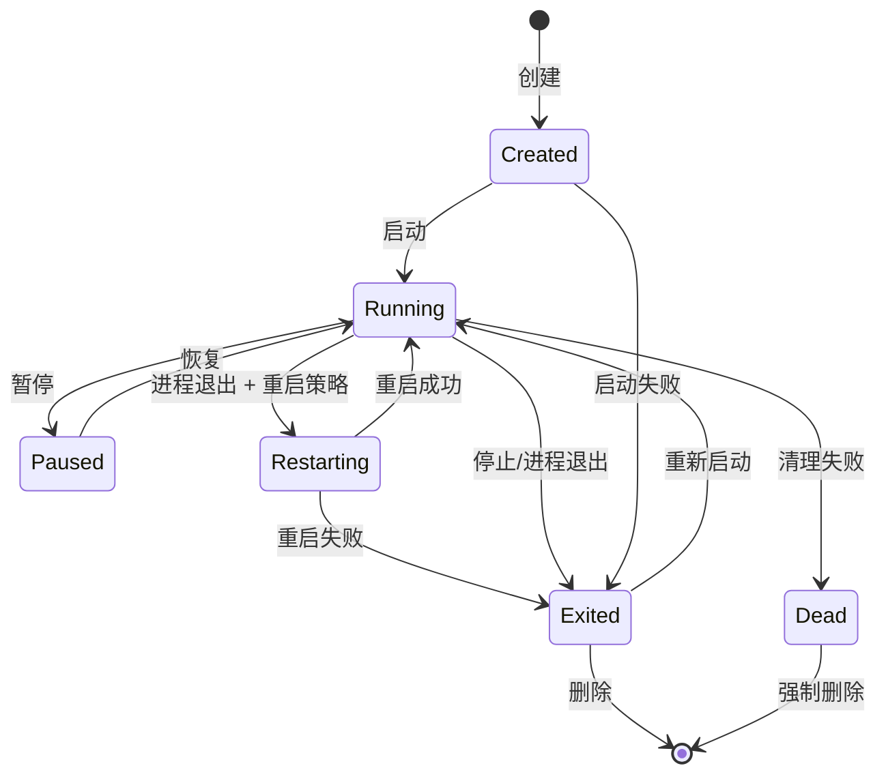

### 核心方法

```go
// 状态设置
func (s *State) SetRunning(pid int)
func (s *State) SetStopped(exitStatus *ExitStatus)
func (s *State) SetPaused()
func (s *State) SetUnpaused()
func (s *State) SetRestarting(exitStatus *ExitStatus)

// 状态查询
func (s *State) IsRunning() bool
func (s *State) IsPaused() bool
func (s *State) IsRestarting() bool

// 退出状态
type ExitStatus struct {
    ExitCode  int
    OOMKilled bool
    Error     string
}
```

### 健康状态

```go
type Health struct {
    Status        string              // starting/healthy/unhealthy
    FailingStreak int                 // 连续失败次数
    Log           []HealthcheckResult // 健康检查日志
}

type HealthcheckResult struct {
    Start    time.Time // 开始时间
    End      time.Time // 结束时间
    ExitCode int       // 退出码（0=健康）
    Output   string    // 命令输出
}
```

---

## 5. NetworkSettings（网络配置）

### 结构定义

```go
type NetworkSettings struct {
    // 桥接网络（已弃用，保留向后兼容）
    Bridge       string // 网桥名称
    IPAddress    string // IP 地址
    Gateway      string // 网关
    MacAddress   string // MAC 地址
    
    // 沙箱信息
    SandboxID    string // 网络沙箱 ID
    SandboxKey   string // 沙箱路径（网络命名空间）
    
    // 网络列表
    Networks     map[string]*EndpointSettings // 网络端点配置
    
    // 端口映射
    Ports        nat.PortMap // 端口映射（容器视角）
}
```

### EndpointSettings

```go
type EndpointSettings struct {
    // 端点信息
    EndpointID   string // 端点 ID
    Gateway      string // 网关
    IPAddress    string // IPv4 地址
    IPPrefixLen  int    // IP 前缀长度
    IPv6Gateway  string // IPv6 网关
    GlobalIPv6Address string // IPv6 地址
    MacAddress   string // MAC 地址
    
    // 网络 ID
    NetworkID    string // 网络 ID
    
    // 链接（已弃用）
    Links        []string // 容器链接
    Aliases      []string // 网络别名
    
    // IPAM 配置
    IPAMConfig   *EndpointIPAMConfig // IP 地址配置
    
    // 驱动选项
    DriverOpts   map[string]string // 驱动选项
}
```

### 示例

```go
NetworkSettings: &NetworkSettings{
    Networks: map[string]*EndpointSettings{
        "bridge": {
            NetworkID:  "abc123...",
            EndpointID: "def456...",
            Gateway:    "172.17.0.1",
            IPAddress:  "172.17.0.2",
            IPPrefixLen: 16,
            MacAddress: "02:42:ac:11:00:02",
        },
        "mynet": {
            NetworkID:  "ghi789...",
            EndpointID: "jkl012...",
            Gateway:    "172.18.0.1",
            IPAddress:  "172.18.0.10",
            IPPrefixLen: 16,
            Aliases:    []string{"web", "api"},
        },
    },
    Ports: nat.PortMap{
        "80/tcp": []nat.PortBinding{
            {HostIP: "0.0.0.0", HostPort: "8080"},
        },
    },
}
```

---

## 6. Resources（资源限制）

### 结构定义

```go
type Resources struct {
    // 内存
    Memory            int64 // 内存限制（字节）
    MemoryReservation int64 // 内存软限制
    MemorySwap        int64 // 内存 + Swap 限制
    MemorySwappiness  *int64 // Swap 倾向（0-100）
    
    // CPU
    CPUShares   int64  // CPU 权重（相对值，默认 1024）
    CPUPeriod   int64  // CPU CFS 周期（微秒，默认 100000）
    CPUQuota    int64  // CPU CFS 配额（微秒）
    CpusetCpus  string // 允许的 CPU 核心（如 "0-3,8"）
    CpusetMems  string // 允许的内存节点（NUMA）
    
    // 块设备 I/O
    BlkioWeight          uint16 // I/O 权重（10-1000）
    BlkioDeviceReadBps   []ThrottleDevice // 读速率限制
    BlkioDeviceWriteBps  []ThrottleDevice // 写速率限制
    BlkioDeviceReadIOps  []ThrottleDevice // 读 IOPS 限制
    BlkioDeviceWriteIOps []ThrottleDevice // 写 IOPS 限制
    
    // 设备
    Devices []DeviceMapping // 设备映射
    
    // 系统限制
    Ulimits []Ulimit // 资源限制（nofile/nproc/...）
}
```

### 资源限制示例

```go
Resources: &Resources{
    // 内存限制 1GB
    Memory: 1073741824,
    MemorySwap: 1073741824, // 禁用 swap
    
    // CPU 限制 0.5 核
    CPUPeriod: 100000,
    CPUQuota:  50000,
    
    // 或使用 CPU 权重
    CPUShares: 512, // 相对于默认 1024，获得 50% CPU 时间
    
    // 限制可用 CPU 核心
    CpusetCpus: "0-1", // 仅使用核心 0 和 1
    
    // 磁盘 I/O 限制
    BlkioDeviceReadBps: []ThrottleDevice{
        {Path: "/dev/sda", Rate: 10485760}, // 10 MB/s
    },
    
    // 文件描述符限制
    Ulimits: []Ulimit{
        {Name: "nofile", Soft: 1024, Hard: 2048},
    },
}
```

---

## 数据结构使用场景

### 场景 1：创建容器

```go
container := &Container{
    ID:      generateID(),
    Name:    "/web",
    Created: time.Now(),
    Path:    "/usr/sbin/nginx",
    Args:    []string{"-g", "daemon off;"},
    
    Config: &Config{
        Image:      "nginx:latest",
        Cmd:        []string{"nginx", "-g", "daemon off;"},
        Env:        []string{"PATH=/usr/local/sbin:..."},
        WorkingDir: "/",
        Labels:     map[string]string{"env": "prod"},
        ExposedPorts: map[nat.Port]struct{}{
            "80/tcp": {},
        },
    },
    
    HostConfig: &HostConfig{
        NetworkMode: "bridge",
        PortBindings: nat.PortMap{
            "80/tcp": []nat.PortBinding{{HostPort: "8080"}},
        },
        Resources: &Resources{
            Memory:    536870912, // 512 MB
            CPUShares: 512,
        },
        RestartPolicy: &RestartPolicy{
            Name: "unless-stopped",
        },
    },
    
    State: &State{
        Running: false,
    },
}

// 持久化到磁盘
container.ToDisk()
```

### 场景 2：启动容器

```go
// 加锁
container.Lock()
defer container.Unlock()

// 更新状态
container.State.SetRunning(pid)

// 更新网络配置
container.NetworkSettings = &NetworkSettings{
    Networks: map[string]*EndpointSettings{
        "bridge": {
            IPAddress: "172.17.0.2",
            Gateway:   "172.17.0.1",
        },
    },
}
```

### 场景 3：健康检查

```go
// 执行健康检查
result := &HealthcheckResult{
    Start:    time.Now(),
    ExitCode: 0,
    Output:   "OK",
}
result.End = time.Now()

// 更新健康状态
container.State.Health.Log = append(container.State.Health.Log, result)
if result.ExitCode == 0 {
    container.State.Health.Status = "healthy"
    container.State.Health.FailingStreak = 0
} else {
    container.State.Health.FailingStreak++
    if container.State.Health.FailingStreak >= healthcheck.Retries {
        container.State.Health.Status = "unhealthy"
    }
}
```

---

**文档版本**：v1.0  
**最后更新**：2025-10-04

---

## 时序图

本文档通过时序图展示容器模块的典型操作流程，包括创建、启动、停止、执行命令等关键场景。

---

## 时序图目录

1. [容器完整生命周期](#1-容器完整生命周期)
2. [容器创建流程](#2-容器创建流程)
3. [容器启动流程](#3-容器启动流程)
4. [容器停止流程](#4-容器停止流程)
5. [容器删除流程](#5-容器删除流程)
6. [容器 Exec 执行](#6-容器-exec-执行)
7. [容器附加（Attach）](#7-容器附加attach)
8. [容器提交为镜像](#8-容器提交为镜像)
9. [容器健康检查](#9-容器健康检查)
10. [容器重启策略](#10-容器重启策略)

---

## 1. 容器完整生命周期

### 时序图

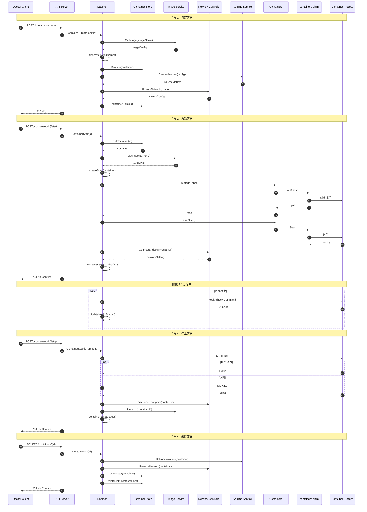

### 说明

#### 图意概述
完整展示了从容器创建、启动、运行、停止到删除的全生命周期，涉及 Docker 客户端、API 服务器、Daemon、存储、镜像服务、网络控制器、卷服务、containerd 以及容器进程等九个参与者。

#### 关键步骤分解

**创建阶段（步骤 1-11）**：

1. 客户端发起创建请求
2. Daemon 验证镜像存在
3. 生成容器 ID 和名称
4. 注册到容器存储
5. 创建所需卷
6. 预分配网络资源
7. 持久化配置到磁盘

**启动阶段（步骤 12-24）**：

1. 客户端发起启动请求
2. 从存储获取容器对象
3. 挂载镜像文件系统
4. 生成 OCI 规范
5. 通过 containerd 创建任务
6. containerd 启动 shim 并创建进程
7. 连接网络端点
8. 更新容器状态为运行中

**运行阶段（步骤 25-27）**：

1. 如果配置了健康检查，定期执行检查命令
2. 根据返回码更新健康状态

**停止阶段（步骤 28-35）**：

1. 客户端发起停止请求
2. 发送 SIGTERM 信号给容器主进程
3. 等待超时时间
4. 如果超时则发送 SIGKILL 强制终止
5. 断开网络连接
6. 卸载文件系统
7. 更新容器状态为已停止

**删除阶段（步骤 36-41）**：

1. 客户端发起删除请求
2. 释放卷引用
3. 释放网络资源
4. 从存储注销
5. 删除磁盘文件

#### 边界条件

- **并发安全**：所有状态变更都持有容器锁
- **超时控制**：停止操作有超时机制，默认 10 秒
- **幂等性**：启动已启动的容器返回成功，停止已停止的容器返回成功
- **资源清理**：删除操作确保释放所有资源（网络、卷、文件系统）

#### 异常路径

- **镜像不存在**：创建失败，返回 404
- **启动失败**：回滚状态，清理已分配资源
- **停止超时**：发送 SIGKILL 强制终止
- **删除失败**：容器标记为 Dead 状态，需要强制删除

#### 性能要点

- **创建操作**：轻量级，仅准备元数据，不启动进程
- **启动操作**：涉及文件系统挂载、网络配置，耗时约 100-500ms
- **停止操作**：优雅停止耗时取决于应用响应，强制停止立即生效
- **并发限制**：Daemon 全局无锁，单容器操作串行化

---

## 2. 容器创建流程

### 时序图

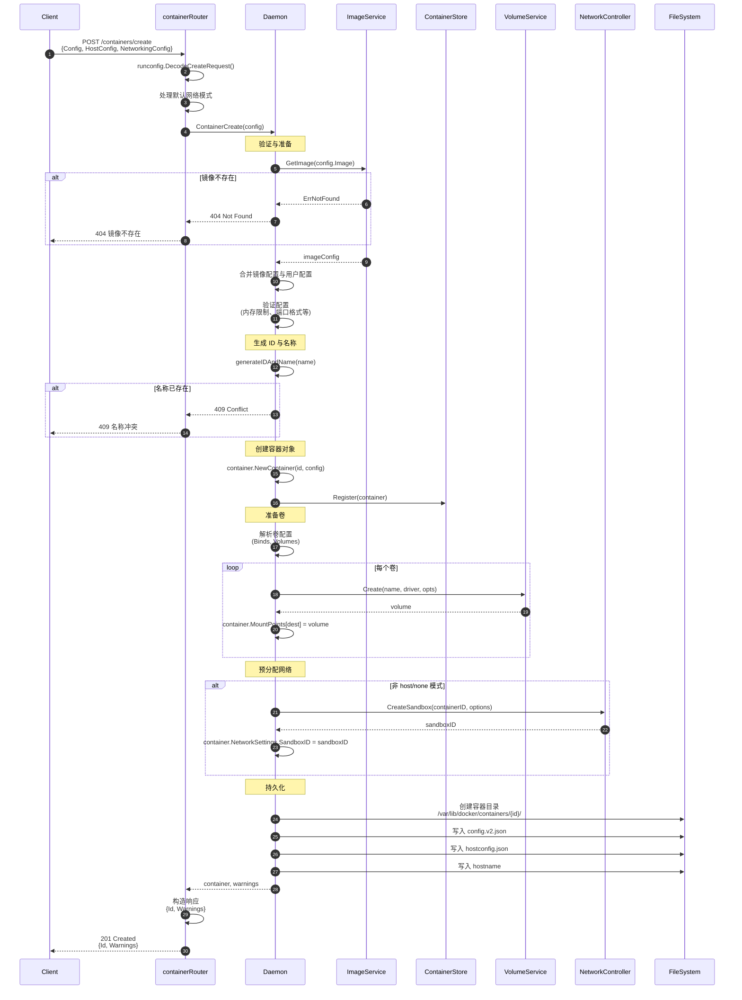

### 说明

#### 图意概述
详细展示容器创建过程，包括配置解析、镜像验证、ID 生成、卷准备、网络预分配、持久化等关键步骤。

#### 关键决策点

1. **镜像验证**（步骤 6-10）：
   - 检查镜像是否存在于本地
   - 不存在则返回 404，提示用户先拉取镜像

2. **配置合并**（步骤 12）：

   ```go
   // 优先级：用户配置 > 镜像配置 > 默认配置
   finalConfig := mergeConfigs(imageConfig, userConfig, defaults)
```

3. **名称唯一性检查**（步骤 15-18）：
   - 如果指定名称，检查是否冲突
   - 未指定则自动生成（形容词+名词，如 `quirky_einstein`）

4. **卷准备**（步骤 23-28）：
   - 解析 `Binds`（绑定挂载）和 `Volumes`（命名卷）
   - 创建或获取卷对象
   - 记录挂载点映射

5. **网络预分配**（步骤 30-34）：
   - 仅在 `bridge`、自定义网络模式下预分配
   - `host`、`none` 模式不创建沙箱
   - 实际网络连接在容器启动时完成

#### 配置验证规则

```go
// 内存限制验证
if hostConfig.Memory > 0 && hostConfig.Memory < 6291456 {
    return errors.New("memory limit must be at least 6MB")
}

// 端口格式验证
for port := range config.ExposedPorts {
    if !validPort(port) {
        return errors.New("invalid port format")
    }
}

// CPU 配额验证
if hostConfig.CPUQuota > 0 && hostConfig.CPUPeriod == 0 {
    hostConfig.CPUPeriod = 100000 // 默认值
}
```

#### 性能与容量

- **平均耗时**：50-200ms（不含镜像拉取）
- **内存开销**：容器对象约 10KB，配置文件约 5-20KB
- **磁盘写入**：3 个配置文件，总计 10-50KB
- **并发能力**：单 Daemon 支持并发创建，无全局锁

#### 版本兼容

- **API v1.24-**：不支持 `AutoRemove` 参数
- **API v1.25+**：支持 `prune` 操作
- **API v1.40+**：支持平台参数（多架构镜像）

---

## 3. 容器启动流程

### 时序图

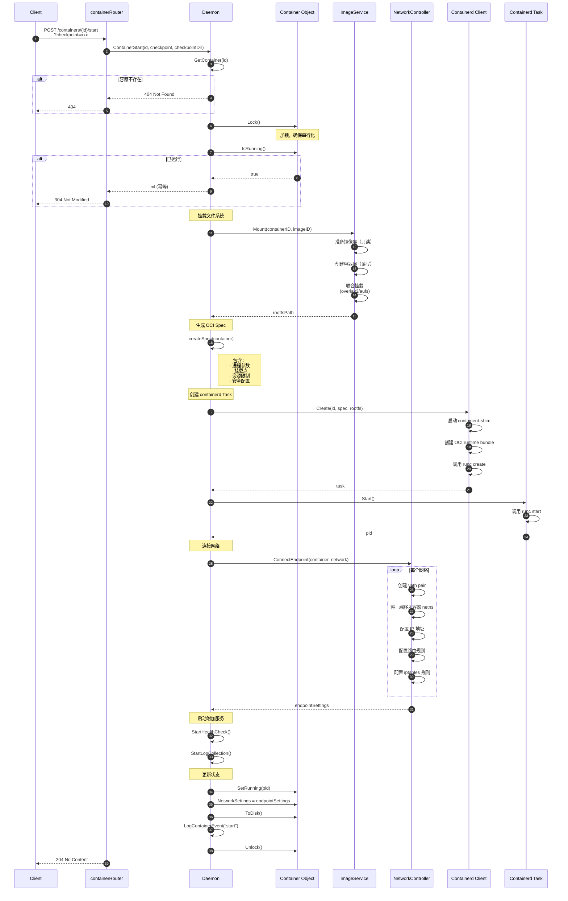

### 说明

#### 图意概述
展示容器启动的完整流程，从 API 请求到容器进程运行，涉及文件系统挂载、OCI Spec 生成、containerd 交互、网络连接等核心步骤。

#### 关键步骤详解

**1. 状态检查（步骤 4-10）**：

```go
container.Lock()
defer container.Unlock()

if container.Running {
    return nil // 幂等：已启动则返回成功
}

if container.Removing {
    return errdefs.Conflict(errors.New("container is being removed"))
}
```

**2. 文件系统挂载（步骤 12-16）**：

```
镜像层栈（只读）
├── Layer 1: ubuntu base
├── Layer 2: apt install nginx
├── Layer 3: COPY config
└── Container Layer (读写): /var/lib/docker/overlay2/{id}/diff

联合挂载点: /var/lib/docker/overlay2/{id}/merged
```

**3. OCI Spec 生成（步骤 18-19）**：

```json
{
  "process": {
    "args": ["nginx", "-g", "daemon off;"],
    "env": ["PATH=/usr/local/sbin:...", "NODE_ENV=production"],
    "cwd": "/",
    "user": {"uid": 0, "gid": 0}
  },
  "root": {"path": "/var/lib/docker/overlay2/{id}/merged"},
  "mounts": [
    {"destination": "/proc", "type": "proc"},
    {"destination": "/data", "source": "/var/lib/docker/volumes/myvolume/_data"}
  ],
  "linux": {
    "resources": {
      "memory": {"limit": 536870912},
      "cpu": {"shares": 512}
    },
    "namespaces": [
      {"type": "pid"},
      {"type": "network", "path": "/var/run/netns/cni-xxx"},
      {"type": "mount"},
      {"type": "uts"}
    ]
  }
}
```

**4. Containerd Task 创建（步骤 21-25）**：

```bash
# containerd-shim 启动
/usr/bin/containerd-shim -namespace moby -id {id} -address /run/containerd/containerd.sock

# runc 创建容器
runc create --bundle /run/containerd/io.containerd.runtime.v2.task/moby/{id} --pid-file /run/containerd/{id}.pid {id}
```

**5. 网络连接（步骤 28-35）**：

```bash
# 创建 veth pair
ip link add veth_host type veth peer name veth_container

# 移入容器网络命名空间
ip link set veth_container netns /var/run/netns/cni-xxx

# 配置 IP
ip netns exec cni-xxx ip addr add 172.17.0.2/16 dev veth_container
ip netns exec cni-xxx ip link set veth_container up

# 配置路由
ip netns exec cni-xxx ip route add default via 172.17.0.1

# iptables 规则（端口映射）
iptables -t nat -A DOCKER -p tcp --dport 8080 -j DNAT --to-destination 172.17.0.2:80
```

#### 异常路径与回退

- **挂载失败**：回滚状态，返回错误
- **containerd 创建失败**：卸载文件系统，回滚状态
- **网络连接失败**：停止 Task，卸载文件系统，回滚状态
- **进程立即退出**：捕获退出事件，更新状态为已退出

#### 检查点恢复（实验性）

```go
if checkpoint != "" {
    // 从检查点恢复
    opts := []containerd.NewTaskOpts{
        containerd.WithTaskCheckpoint(checkpointPath),
    }
    task, err := container.NewTask(ctx, ..., opts...)
}
```

#### 性能指标

- **平均耗时**：100-500ms
  - 文件系统挂载：20-50ms
  - containerd 创建：50-200ms
  - 网络配置：30-100ms
  - 附加服务启动：10-50ms
- **并发能力**：单容器串行化（持锁），多容器并发
- **资源峰值**：启动瞬间 CPU 占用较高

---

## 4. 容器停止流程

### 时序图

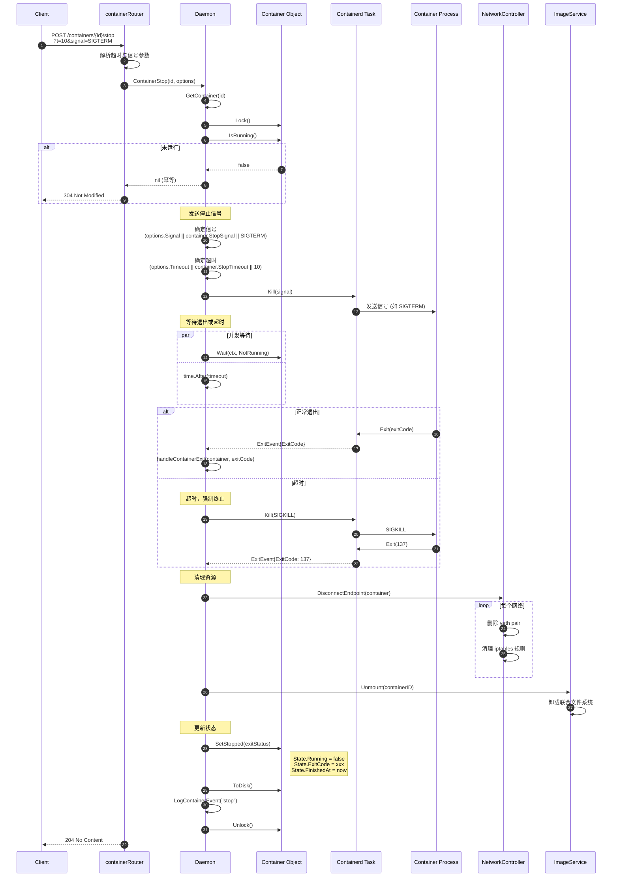

### 说明

#### 图意概述
展示容器停止的完整过程，包括信号发送、优雅停止、超时强制终止、资源清理等步骤。

#### 停止信号选择优先级

```go
signal := "SIGTERM" // 默认

// 优先级 1：API 参数指定（API v1.42+）
if options.Signal != "" {
    signal = options.Signal
}

// 优先级 2：容器配置指定
if signal == "SIGTERM" && container.StopSignal != "" {
    signal = container.StopSignal
}
```

#### 超时机制

```go
timeout := 10 // 默认 10 秒

// 优先级 1：API 参数
if options.Timeout != nil {
    timeout = *options.Timeout
}

// 优先级 2：容器配置
if timeout == 10 && container.StopTimeout != nil {
    timeout = *container.StopTimeout
}

// 特殊值
// -1：无限等待
// 0：立即 SIGKILL
```

#### 退出码说明

| 退出码 | 含义 |
|---:|---|
| 0 | 正常退出 |
| 1-127 | 应用错误 |
| 128+N | 信号终止（N 为信号编号）|
| 137 | SIGKILL（128+9） |
| 143 | SIGTERM（128+15） |

#### 异常处理

- **进程已不存在**：直接更新状态为已停止
- **网络断开失败**：记录警告，继续执行
- **文件系统卸载失败**：标记容器为 Dead 状态

#### 性能指标

- **优雅停止**：耗时取决于应用响应（0-timeout 秒）
- **强制停止**：立即生效（<10ms）
- **资源清理**：20-100ms

---

## 6. 容器 Exec 执行

### 时序图

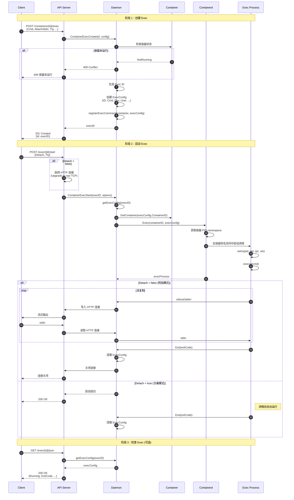

### 说明

#### 图意概述
展示在运行中的容器内执行命令的完整流程，分为创建 Exec、启动 Exec、附加 I/O 三个阶段。

#### ExecConfig 结构

```go
type ExecConfig struct {
    ID           string   // exec ID
    Running      bool     // 是否运行中
    ExitCode     int      // 退出码
    ContainerID  string   // 所属容器
    Cmd          []string // 执行命令
    Env          []string // 环境变量
    User         string   // 用户
    WorkingDir   string   // 工作目录
    Privileged   bool     // 特权模式
    Tty          bool     // 分配终端
    AttachStdin  bool     // 附加 stdin
    AttachStdout bool     // 附加 stdout
    AttachStderr bool     // 附加 stderr
    DetachKeys   string   // 分离键序列
}
```

#### 命名空间复用

Exec 进程复用容器的命名空间：

```go
namespaces := []string{
    "pid",    // 进程命名空间
    "net",    // 网络命名空间
    "ipc",    // IPC 命名空间
    "uts",    // 主机名命名空间
}

// 不复用的命名空间
// - mount: Exec 有独立的文件系统视图（可能不同）
// - user: 取决于 Privileged 配置
```

#### I/O 流复制

```go
// 非 TTY 模式：多路复用 stdout/stderr
if !exec.Tty {
    go io.Copy(conn, stdout) // stdout -> HTTP
    go io.Copy(conn, stderr) // stderr -> HTTP
    go io.Copy(stdin, conn)  // HTTP -> stdin
} else {
    // TTY 模式：单一流
    go io.Copy(conn, pty)
    go io.Copy(pty, conn)
}
```

#### 分离键序列

```go
// 默认: Ctrl-P Ctrl-Q
detachKeys := "ctrl-p,ctrl-q"

// 自定义
config.DetachKeys = "ctrl-c,ctrl-c"

// 禁用
config.DetachKeys = ""
```

#### 使用场景

1. **调试容器**：

```bash
docker exec -it mycontainer bash
```

1. **执行脚本**：

```bash
docker exec mycontainer /opt/health-check.sh
```

1. **后台任务**：

```bash
docker exec -d mycontainer /opt/cleanup.sh
```

---

## 9. 容器健康检查

### 时序图

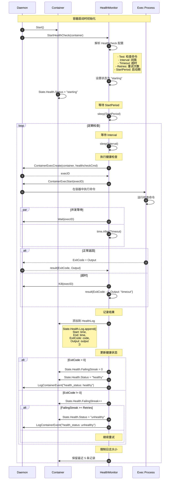

### 说明

#### 图意概述
展示容器健康检查的完整机制，包括初始化、定期执行、结果评估、状态更新等。

#### Healthcheck 配置

```go
type HealthConfig struct {
    // 检查命令
    Test []string
    // 可选格式：
    // - ["NONE"]: 禁用健康检查（覆盖镜像配置）
    // - ["CMD", "curl", "-f", "http://localhost/"]: 直接执行
    // - ["CMD-SHELL", "curl -f http://localhost/ || exit 1"]: shell 包装
    
    Interval    time.Duration // 检查间隔（默认 30s）
    Timeout     time.Duration // 超时时间（默认 30s）
    StartPeriod time.Duration // 启动宽限期（默认 0s）
    Retries     int           // 连续失败次数阈值（默认 3）
}
```

#### 状态转换

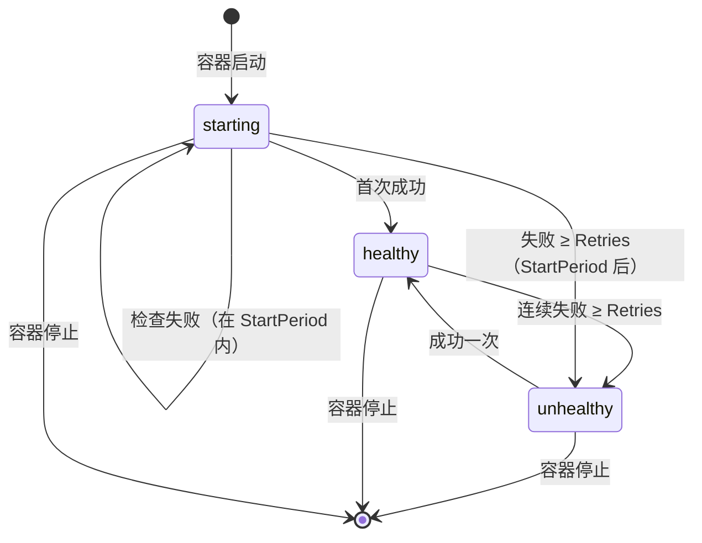

#### 健康检查命令示例

**HTTP 健康检查**：

```dockerfile
HEALTHCHECK --interval=30s --timeout=3s --retries=3 \
  CMD curl -f http://localhost/ || exit 1
```

**TCP 端口检查**：

```dockerfile
HEALTHCHECK CMD nc -z localhost 80 || exit 1
```

**自定义脚本**：

```dockerfile
HEALTHCHECK CMD /opt/health-check.sh
```

**禁用健康检查**：

```dockerfile
HEALTHCHECK NONE
```

#### StartPeriod 宽限期

```go
// StartPeriod: 容器启动后的宽限期
// - 在此期间内的失败不计入 FailingStreak
// - 但成功会立即将状态设为 "healthy"
// - 适用于启动时间较长的应用

if time.Since(container.StartedAt) < healthcheck.StartPeriod {
    if exitCode != 0 {
        // 失败但不计数
        log.Debug("healthcheck failed during start period")
    }
}
```

#### 性能考虑

- **检查频率**：不宜过高（建议 ≥10s），避免资源浪费
- **超时设置**：应小于 Interval，避免重叠执行
- **日志大小**：仅保留最近 5 条记录，防止内存泄漏

#### 实践建议

1. **选择合适的检查方式**：
   - 轻量级：TCP 端口检查
   - 应用层：HTTP 健康端点
   - 深度检查：自定义脚本

2. **设置合理的参数**：

```yaml
healthcheck:
  test: ["CMD", "curl", "-f", "http://localhost/health"]
  interval: 30s      # 检查间隔
  timeout: 3s        # 超时时间
  retries: 3         # 失败阈值
  start_period: 40s  # 启动宽限期（对于启动慢的应用）
```

1. **避免副作用**：
   - 健康检查命令应该是只读操作
   - 不要在检查中执行数据修改

---

**文档版本**：v1.0  
**最后更新**：2025-10-04

---
