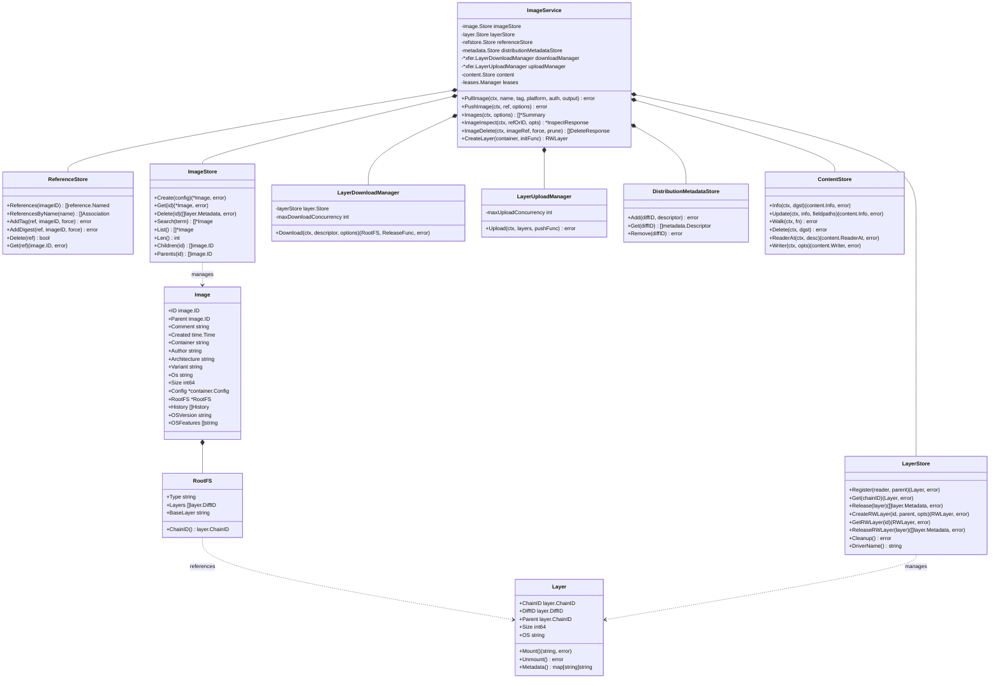

# docker-03-image

## 模块概览

## 模块定位与职责

### 职责边界

image 模块负责镜像的完整生命周期管理，是 Docker 的核心功能之一：

1. **镜像拉取与推送**：
   - 从镜像仓库拉取镜像（支持 manifest list、多平台镜像）
   - 推送本地镜像到远程仓库
   - 支持并发下载层（限流控制）
   - 断点续传与增量拉取

2. **镜像构建**：
   - 解析 Dockerfile 指令
   - 逐层构建镜像（每条指令生成一层）
   - BuildKit 集成（并行构建、缓存优化）
   - 多阶段构建支持

3. **镜像存储与管理**：
   - 内容寻址存储（Content-Addressable Storage）
   - 镜像层去重与共享
   - 镜像引用管理（tag → digest 映射）
   - 镜像垃圾回收（删除未引用层）

4. **镜像操作**：
   - 镜像导入/导出（tar 归档）
   - 镜像标签管理（tag/untag）
   - 镜像历史查询
   - 镜像元数据检查（inspect）

### 上下游依赖

**上游调用方**：

- Image Router：处理镜像相关的 HTTP API
- Daemon：容器创建时需要镜像信息
- Builder：构建过程中需要拉取基础镜像

**下游被依赖方**：

- containerd 镜像服务：实际的镜像存储与管理
- Registry：镜像仓库（Docker Hub/私有仓库）
- LayerStore：镜像层的文件系统存储
- ReferenceStore：镜像引用数据库

---

## 模块架构图


### 架构说明

**1. 镜像服务层**：

- **ImageService**：对外统一接口，协调各子服务

  ```go
  type ImageService struct {
      contentStore     ContentStore
      imageStore       ImageStore
      layerStore       LayerStore
      referenceStore   ReferenceStore
      registryService  *registry.Service
      downloadManager  *xfer.LayerDownloadManager
      uploadManager    *xfer.LayerUploadManager
      leases           LeaseManager
  }
```

**2. 存储层**：

- **Content Store**：内容寻址存储，以 SHA256 为 key

```
  /var/lib/docker/image/overlay2/content/
    ├── blobs/
    │   └── sha256/
    │       ├── abc123.../data  # 实际内容
    │       └── def456.../data
    └── ingest/  # 临时下载目录
```

- **Image Store**：存储镜像元数据（配置、层列表）

  ```json
  {
    "id": "sha256:abc123...",
    "parent": "sha256:def456...",
    "created": "2023-01-01T00:00:00Z",
    "container_config": {...},
    "rootfs": {
      "type": "layers",
      "diff_ids": [
        "sha256:layer1...",
        "sha256:layer2..."
      ]
    }
  }
```

- **Layer Store**：管理镜像层的文件系统挂载

  ```go
  type Layer struct {
      ChainID   ChainID    // 层链 ID（parent hash + diff hash）
      DiffID    DiffID     // 层内容 hash
      Parent    *Layer
      CacheID   string     // 存储驱动缓存 ID
      Size      int64
      MountID   string
      ReferenceCount atomic.Int32
  }
```

- **Reference Store**：tag → digest 映射

```
  nginx:latest → sha256:abc123...
  myapp:v1.0   → sha256:def456...
```

**3. 分发层**：

- **Puller**：镜像拉取器
  - 下载 manifest（清单）
  - 解析层列表
  - 并发下载层（限制并发数）
  - 验证层完整性（SHA256）
  - 解压并存储层

- **Pusher**：镜像推送器
  - 检查远程仓库已存在的层（blob mount）
  - 并发上传缺失的层
  - 上传镜像配置
  - 上传 manifest

- **Registry 客户端**：
  - 实现 Registry V2 API
  - 支持 token 认证
  - 支持 HTTP/HTTPS
  - 镜像仓库镜像（mirrors）

**4. 构建层**：

- **Dockerfile 解析器**：
  - 词法分析与语法分析
  - 指令验证（FROM/RUN/COPY/...）
  - 多阶段构建解析

- **BuildKit**：
  - 并行构建（independent stages）
  - 高效缓存（cache mounts）
  - 远程缓存导入/导出
  - 多平台构建

---

## 镜像拉取完整时序图


### 时序图关键点说明

**阶段1：解析引用（5ms）**

```go
func ParseReference(ref string) (reference.Named, error) {
    // 补全隐式部分
    // nginx → docker.io/library/nginx:latest
    // myregistry.com/myimage → myregistry.com/myimage:latest
    
    named, err := reference.ParseNormalizedNamed(ref)
    return reference.TagNameOnly(named), nil
}
```

**阶段2：认证（100-500ms）**

- Registry V2 token 认证流程：
  1. 请求 manifest 时返回 401 + WWW-Authenticate header
  2. 解析 header 获取 auth server 地址和 scope
  3. 向 auth server 请求 token（携带用户凭证）
  4. 使用 token 重新请求 manifest

**阶段3：拉取 Manifest（50-200ms）**

- Manifest 类型：
  - **Manifest V2 Schema 2**：单平台镜像

    ```json
    {
      "schemaVersion": 2,
      "mediaType": "application/vnd.docker.distribution.manifest.v2+json",
      "config": {
        "digest": "sha256:abc123...",
        "size": 7023
      },
      "layers": [
        {"digest": "sha256:layer1...", "size": 2800000},
        {"digest": "sha256:layer2...", "size": 1500000}
      ]
    }
```
  
  - **Manifest List**：多平台镜像

    ```json
    {
      "schemaVersion": 2,
      "mediaType": "application/vnd.docker.distribution.manifest.list.v2+json",
      "manifests": [
        {
          "digest": "sha256:amd64-digest...",
          "platform": {"architecture": "amd64", "os": "linux"}
        },
        {
          "digest": "sha256:arm64-digest...",
          "platform": {"architecture": "arm64", "os": "linux"}
        }
      ]
    }
```

**阶段4：检查本地层（10-50ms）**

```go
func (s *ImageService) filterExistingLayers(descriptors []ocispec.Descriptor) []ocispec.Descriptor {
    var missing []ocispec.Descriptor
    for _, desc := range descriptors {
        exists, err := s.contentStore.Exists(desc.Digest)
        if err != nil || !exists {
            missing = append(missing, desc)
        }
    }
    return missing
}
```

**阶段5：并发下载层（主要耗时）**

- **限流控制**：

  ```go
  sem := semaphore.NewWeighted(maxConcurrentDownloads) // 默认 3
  for _, layer := range layers {
      sem.Acquire(ctx, 1)
      go func(layer Layer) {
          defer sem.Release(1)
          downloadLayer(layer)
      }(layer)
  }
```

- **断点续传**：
  - Registry 支持 HTTP Range 请求
  - 记录已下载字节数
  - 失败后从断点继续

- **进度报告**：

  ```go
  type Progress struct {
      ID     string  // 层 ID（短格式）
      Status string  // "Downloading" / "Extracting" / "Pull complete"
      Current int64  // 当前字节数
      Total   int64  // 总字节数
  }
```

**阶段6：验证与提交（50-200ms）**

```go
func (cs *contentStore) Commit(digest string, data io.Reader) error {
    // 计算实际 hash
    h := sha256.New()
    tee := io.TeeReader(data, h)
    
    // 写入临时文件
    tmpFile := filepath.Join(cs.ingestRoot, digest+".tmp")
    io.Copy(tmpFile, tee)
    
    // 验证 hash
    actualDigest := h.Sum(nil)
    if hex.EncodeToString(actualDigest) != digest {
        return errors.New("digest mismatch")
    }
    
    // 原子移动到最终位置
    finalPath := filepath.Join(cs.blobRoot, digest[:2], digest)
    os.Rename(tmpFile, finalPath)
    
    return nil
}
```

**阶段7：解压层到 LayerStore（主要耗时）**

```go
func (ls *layerStore) Register(diffID DiffID, parent ChainID) (Layer, error) {
    // 计算 ChainID
    chainID := createChainID(parent, diffID)
    
    // 从 content store 读取压缩层
    reader := ls.contentStore.Open(diffID)
    defer reader.Close()
    
    // 解压到存储驱动
    cacheID := generateCacheID()
    ls.driver.ApplyDiff(cacheID, parent, reader)
    
    // 保存元数据
    layer := &Layer{
        ChainID: chainID,
        DiffID:  diffID,
        Parent:  parent,
        CacheID: cacheID,
    }
    ls.save(layer)
    
    return layer, nil
}
```

- **ChainID 计算**：

```
  ChainID = SHA256(parent_chainID + " " + diffID)
```

  - 第一层：`ChainID = DiffID`
  - 第二层：`ChainID = SHA256(layer1_chainID + " " + layer2_diffID)`
  - 确保层链唯一性

**阶段8：创建镜像对象（10-50ms）**

```go
func (s *ImageService) createImage(config ImageConfig, layers []Layer) (Image, error) {
    // 计算镜像 ID（配置的 SHA256）
    imageID := sha256.Sum(marshalImageConfig(config))
    
    // 保存镜像配置
    s.imageStore.Set(imageID, config)
    
    // 创建引用（tag → imageID）
    ref, _ := reference.WithTag("nginx", "latest")
    s.referenceStore.AddTag(ref, imageID, false)
    
    return Image{ID: imageID, Layers: layers}, nil
}
```

**阶段9：清理临时资源（<10ms）**

- 释放 containerd lease（防止 GC 删除正在下载的内容）
- 删除下载失败的临时文件

---

## 镜像构建时序图


---

## 性能优化

### 并发下载优化

```go
// 限制并发下载数
const maxConcurrentDownloads = 3

// 按层大小排序（先下载小层）
sort.Slice(layers, func(i, j int) bool {
    return layers[i].Size < layers[j].Size
})

// 并发下载
var wg sync.WaitGroup
sem := semaphore.NewWeighted(maxConcurrentDownloads)
for _, layer := range layers {
    wg.Add(1)
    sem.Acquire(ctx, 1)
    go func(l Layer) {
        defer wg.Done()
        defer sem.Release(1)
        downloadLayer(l)
    }(layer)
}
wg.Wait()
```

### 层缓存优化

```go
// BuildKit 缓存挂载
RUN --mount=type=cache,target=/go/pkg/mod \
    go mod download

RUN --mount=type=cache,target=/root/.cache/go-build \
    go build -o /app
```

### 镜像仓库镜像

```json
{
  "registry-mirrors": [
    "https://mirror.gcr.io",
    "https://registry.docker-cn.com"
  ]
}
```

---

## 最佳实践

### 减小镜像体积

```dockerfile
# 使用多阶段构建
FROM golang:1.20 AS builder
WORKDIR /app
COPY . .
RUN go build -o /bin/myapp

FROM alpine:latest
COPY --from=builder /bin/myapp /usr/local/bin/
CMD ["myapp"]
```

### 优化构建缓存

```dockerfile
# 先复制依赖文件（变化少）
COPY go.mod go.sum ./
RUN go mod download

# 后复制源代码（变化多）
COPY . .
RUN go build
```

### 使用 .dockerignore

```
.git
.gitignore
*.md
node_modules/
__pycache__/
*.pyc
```

---

## API接口

---

## 附录：来源合并（posts/docker-02-API接口详细分析）

### A.1 镜像路由概览（摘录）

```go
func (ir *imageRouter) initRoutes() {
    ir.routes = []router.Route{
        router.NewGetRoute("/images/json", ir.getImagesJSON),
        router.NewGetRoute("/images/search", ir.getImagesSearch),
        router.NewGetRoute("/images/get", ir.getImagesGet),
        router.NewGetRoute("/images/{name:.*}/history", ir.getImagesHistory),
        router.NewGetRoute("/images/{name:.*}/json", ir.getImagesByName),
        router.NewPostRoute("/images/load", ir.postImagesLoad),
        router.NewPostRoute("/images/create", ir.postImagesCreate),
        router.NewPostRoute("/images/{name:.*}/push", ir.postImagesPush),
        router.NewPostRoute("/images/{name:.*}/tag", ir.postImagesTag),
        router.NewDeleteRoute("/images/{name:.*}", ir.deleteImages),
    }
}
```

### A.2 拉取/导入镜像（POST /images/create）流程（摘录）

```go
func (ir *imageRouter) postImagesCreate(ctx context.Context, w http.ResponseWriter, r *http.Request, vars map[string]string) error {
    w.Header().Set("Content-Type", "application/json")
    version := httputils.VersionFromContext(ctx)
    var platform *ocispec.Platform
    if versions.GreaterThanOrEqualTo(version, "1.32") {
        if p := r.FormValue("platform"); p != "" {
            sp, err := platforms.Parse(p)
            if err != nil { return errdefs.InvalidParameter(err) }
            platform = &sp
        }
    }
    // 省略: 解析 fromImage/ref、tag/digest、X-Registry-Auth、流式输出
    return nil
}
```

说明：本节内容自 posts/docker-02-API接口详细分析 提炼，统一到 image-API 文档的附录，便于查阅API与实现细节的对应关系。

本文档详细列出镜像模块的所有对外 API 接口，包括请求/响应结构体、字段说明、入口函数、调用链与时序图。

---

## API 目录

### 镜像查询
1. [列出镜像](#1-列出镜像) - `GET /images/json`
2. [检查镜像](#2-检查镜像) - `GET /images/{name}/json`
3. [镜像历史](#3-镜像历史) - `GET /images/{name}/history`
4. [搜索镜像](#4-搜索镜像) - `GET /images/search`

### 镜像操作
1. [拉取镜像](#5-拉取镜像) - `POST /images/create`
2. [推送镜像](#6-推送镜像) - `POST /images/{name}/push`
3. [删除镜像](#7-删除镜像) - `DELETE /images/{name}`
4. [标记镜像](#8-标记镜像) - `POST /images/{name}/tag`
5. [清理镜像](#9-清理镜像) - `POST /images/prune`

### 镜像导入导出
1. [导出镜像](#10-导出镜像) - `GET /images/{name}/get`
2. [导入镜像](#11-导入镜像) - `POST /images/load`

---

## 1. 列出镜像

### 基本信息
- **路径**：`GET /images/json`
- **功能**：列出所有本地镜像
- **幂等性**：是

### 请求参数

**Query 参数**：
| 参数 | 类型 | 必填 | 默认值 | 说明 |
|---|---|---:|---|---|
| all | boolean | 否 | false | 是否显示中间层镜像 |
| filters | string | 否 | - | 过滤条件（JSON 格式） |
| shared-size | boolean | 否 | false | 是否计算共享大小（API v1.42+） |
| manifests | boolean | 否 | false | 是否包含 manifest 列表（API v1.47+） |

**filters 参数支持**：

```json
{
  "dangling": ["true"],
  "label": ["version=1.0", "env=prod"],
  "before": ["image:latest"],
  "since": ["image:1.0"],
  "reference": ["nginx:*", "redis:alpine"],
  "until": ["2h", "2023-01-01T00:00:00"]
}
```

### 响应结构体

**成功响应（200 OK）**：

```json
[
  {
    "Id": "sha256:abc123def456...",
    "ParentId": "sha256:parent123...",
    "RepoTags": [
      "nginx:latest",
      "nginx:1.21"
    ],
    "RepoDigests": [
      "nginx@sha256:digest123..."
    ],
    "Created": 1678886400,
    "Size": 133521408,
    "SharedSize": 67108864,
    "VirtualSize": 133521408,
    "Labels": {
      "maintainer": "NGINX Docker Maintainers"
    },
    "Containers": 2,
    "Descriptor": {
      "mediaType": "application/vnd.oci.image.index.v1+json",
      "digest": "sha256:...",
      "size": 1234
    }
  }
]
```

### 字段说明

| 字段 | 类型 | 说明 |
|---|---|---|
| Id | string | 镜像 ID（sha256:...） |
| ParentId | string | 父镜像 ID（构建历史） |
| RepoTags | []string | 标签列表 |
| RepoDigests | []string | Digest 列表 |
| Created | int64 | 创建时间（Unix 时间戳） |
| Size | int64 | 镜像大小（字节） |
| SharedSize | int64 | 与其他镜像共享的大小 |
| VirtualSize | int64 | 虚拟大小（已弃用，等于 Size） |
| Labels | map | 标签 |
| Containers | int | 使用此镜像的容器数（API v1.51+） |
| Descriptor | object | OCI Descriptor（API v1.48+） |

### 入口函数与核心代码

```go
// API Handler
func (ir *imageRouter) getImagesJSON(ctx context.Context, w http.ResponseWriter, r *http.Request) error {
    imageFilters, err := filters.FromJSON(r.Form.Get("filters"))
    
    sharedSize := httputils.BoolValue(r, "shared-size")
    manifests := httputils.BoolValue(r, "manifests")
    
    images, err := ir.backend.Images(ctx, imagebackend.ListOptions{
        All:        httputils.BoolValue(r, "all"),
        Filters:    imageFilters,
        SharedSize: sharedSize,
        Manifests:  manifests,
    })
    
    return httputils.WriteJSON(w, http.StatusOK, images)
}

// Backend Implementation
func (i *ImageService) Images(ctx context.Context, opts imagebackend.ListOptions) ([]*imagetypes.Summary, error) {
    // 1. 获取所有镜像
    images := i.getAllImages(ctx)
    
    // 2. 应用过滤器
    images = i.filterImages(images, opts.Filters)
    
    // 3. 计算大小
    for _, img := range images {
        img.Size = i.calculateSize(img.ID)
        if opts.SharedSize {
            img.SharedSize = i.calculateSharedSize(img.ID)
        }
    }
    
    // 4. 获取容器数量
    for _, img := range images {
        img.Containers = i.countContainersUsingImage(img.ID)
    }
    
    return images, nil
}
```

---

## 2. 检查镜像

### 基本信息
- **路径**：`GET /images/{name}/json`
- **功能**：获取镜像详细信息
- **幂等性**：是

### 请求参数

**Path 参数**：
| 参数 | 类型 | 必填 | 说明 |
|---|---|---:|---|
| name | string | 是 | 镜像名称或 ID |

**Query 参数**：
| 参数 | 类型 | 必填 | 说明 |
|---|---|---:|---|
| platform | string | 否 | 平台（API v1.49+）<br/>如 `linux/amd64` |
| manifests | boolean | 否 | 是否包含 manifest 列表（API v1.48+） |

### 响应结构体

**成功响应（200 OK）**：

```json
{
  "Id": "sha256:abc123def456...",
  "RepoTags": ["nginx:latest"],
  "RepoDigests": ["nginx@sha256:digest123..."],
  "Parent": "",
  "Comment": "",
  "Created": "2023-01-01T00:00:00.000000000Z",
  "DockerVersion": "20.10.21",
  "Author": "",
  "Config": {
    "Hostname": "",
    "Env": [
      "PATH=/usr/local/sbin:/usr/local/bin:/usr/sbin:/usr/bin:/sbin:/bin",
      "NGINX_VERSION=1.21.6"
    ],
    "Cmd": ["nginx", "-g", "daemon off;"],
    "Image": "sha256:parent123...",
    "Volumes": null,
    "WorkingDir": "",
    "Entrypoint": ["/docker-entrypoint.sh"],
    "Labels": {
      "maintainer": "NGINX Docker Maintainers"
    },
    "StopSignal": "SIGQUIT",
    "ExposedPorts": {
      "80/tcp": {}
    }
  },
  "Architecture": "amd64",
  "Variant": "",
  "Os": "linux",
  "Size": 133521408,
  "GraphDriver": {
    "Name": "overlay2",
    "Data": {
      "LowerDir": "/var/lib/docker/overlay2/.../diff",
      "MergedDir": "/var/lib/docker/overlay2/.../merged",
      "UpperDir": "/var/lib/docker/overlay2/.../diff",
      "WorkDir": "/var/lib/docker/overlay2/.../work"
    }
  },
  "RootFS": {
    "Type": "layers",
    "Layers": [
      "sha256:layer1...",
      "sha256:layer2...",
      "sha256:layer3..."
    ]
  },
  "Metadata": {
    "LastTagTime": "2023-01-01T00:00:00.000000000Z"
  },
  "Manifests": [
    {
      "Descriptor": {
        "mediaType": "application/vnd.docker.distribution.manifest.v2+json",
        "digest": "sha256:...",
        "size": 1234,
        "platform": {
          "architecture": "amd64",
          "os": "linux"
        }
      },
      "Available": true
    }
  ]
}
```

### 入口函数与核心代码

```go
// API Handler
func (ir *imageRouter) getImagesByName(ctx context.Context, w http.ResponseWriter, r *http.Request) error {
    manifests := httputils.BoolValue(r, "manifests")
    
    var platform *ocispec.Platform
    if r.Form.Get("platform") != "" {
        platform, err = httputils.DecodePlatform(r.Form.Get("platform"))
    }
    
    imageInspect, err := ir.backend.ImageInspect(ctx, vars["name"], backend.ImageInspectOpts{
        Manifests: manifests,
        Platform:  platform,
    })
    
    return httputils.WriteJSON(w, http.StatusOK, imageInspect)
}

// Backend Implementation
func (i *ImageService) ImageInspect(ctx context.Context, refOrID string, opts backend.ImageInspectOpts) (*imagetypes.InspectResponse, error) {
    // 1. 解析镜像引用
    img, err := i.GetImage(ctx, refOrID, opts.Platform)
    
    // 2. 读取镜像配置
    config, err := i.getImageConfig(img.ID)
    
    // 3. 读取 GraphDriver 信息
    graphDriver := i.getGraphDriverData(img.ID)
    
    // 4. 读取 RootFS 信息
    rootFS := i.getRootFS(img.ID)
    
    // 5. 读取 Manifests（如果需要）
    var manifests []imagetypes.ManifestSummary
    if opts.Manifests {
        manifests = i.getManifests(img.ID)
    }
    
    return &imagetypes.InspectResponse{
        Id:          img.ID.String(),
        RepoTags:    i.getRepoTags(img.ID),
        RepoDigests: i.getRepoDigests(img.ID),
        Config:      config,
        Architecture: img.Platform.Architecture,
        Os:          img.Platform.OS,
        Size:        i.calculateSize(img.ID),
        GraphDriver: graphDriver,
        RootFS:      rootFS,
        Manifests:   manifests,
    }, nil
}
```

---

## 5. 拉取镜像

### 基本信息
- **路径**：`POST /images/create`
- **功能**：从 registry 拉取镜像
- **幂等性**：是（已存在则跳过）

### 请求参数

**Query 参数**：
| 参数 | 类型 | 必填 | 说明 |
|---|---|---:|---|
| fromImage | string | 是* | 镜像名称 |
| fromSrc | string | 是* | 导入源（URL 或 `-` 表示 stdin） |
| repo | string | 否 | 仓库名 |
| tag | string | 否 | 标签名（默认 `latest`） |
| platform | string | 否 | 平台（如 `linux/amd64`） |

*注：`fromImage` 和 `fromSrc` 二选一。

**Header 参数**：
| Header | 类型 | 必填 | 说明 |
|---|---|---:|---|
| X-Registry-Auth | string | 否 | Registry 认证信息（Base64 编码的 JSON） |

**X-Registry-Auth 格式**：

```json
{
  "username": "user",
  "password": "pass",
  "email": "user@example.com",
  "serveraddress": "registry.example.com"
}
```

### 响应

**成功响应（200 OK）**：
流式 JSON 响应，每行一个 JSON 对象：

```json
{"status":"Pulling from library/nginx","id":"latest"}
{"status":"Pulling fs layer","progressDetail":{},"id":"a2abf6c4d29d"}
{"status":"Downloading","progressDetail":{"current":1024,"total":27092228},"progress":"[>                  ]  1.024kB/27.09MB","id":"a2abf6c4d29d"}
{"status":"Download complete","progressDetail":{},"id":"a2abf6c4d29d"}
{"status":"Extracting","progressDetail":{"current":1024,"total":27092228},"progress":"[>                  ]  1.024kB/27.09MB","id":"a2abf6c4d29d"}
{"status":"Pull complete","progressDetail":{},"id":"a2abf6c4d29d"}
{"status":"Digest: sha256:abc123..."}
{"status":"Status: Downloaded newer image for nginx:latest"}
```

### 入口函数与核心代码

```go
// API Handler
func (ir *imageRouter) postImagesCreate(ctx context.Context, w http.ResponseWriter, r *http.Request) error {
    image := r.Form.Get("fromImage")
    repo := r.Form.Get("repo")
    tag := r.Form.Get("tag")
    
    // 获取认证信息
    authConfig, err := registry.DecodeAuth(r.Header.Get("X-Registry-Auth"))
    
    // 解析平台
    var platform *ocispec.Platform
    if r.Form.Get("platform") != "" {
        platform, err = httputils.DecodePlatform(r.Form.Get("platform"))
    }
    
    output := ioutils.NewWriteFlusher(w)
    defer output.Close()
    
    // 调用后端拉取镜像
    if err := ir.backend.PullImage(ctx, image, tag, platform, authConfig, output); err != nil {
        output.Write(streamformatter.FormatError(err))
    }
    
    return nil
}

// Backend Implementation (daemon/images/image_pull.go)
func (i *ImageService) PullImage(ctx context.Context, imageName string, tag string, platform *ocispec.Platform,
                                   authConfig *registry.AuthConfig, outStream io.Writer) error {
    // 1. 解析镜像引用
    ref, err := reference.ParseNormalizedNamed(imageName)
    if tag != "" {
        ref, err = reference.WithTag(ref, tag)
    }
    
    // 2. 获取 registry 会话
    repoInfo, err := i.registryService.ResolveRepository(ref)
    session, err := i.registryService.NewSession(ctx, repoInfo, authConfig)
    
    // 3. 拉取 manifest
    progress.Message(outStream, "", fmt.Sprintf("Pulling from %s", reference.FamiliarName(ref)))
    
    manifest, err := session.GetManifest(ctx, ref)
    
    // 4. 处理 Manifest List（多平台）
    if manifestList, ok := manifest.(manifestlist.ManifestList); ok {
        manifest = i.selectPlatform(manifestList, platform)
    }
    
    // 5. 下载镜像层
    layers := manifest.References()
    for _, layer := range layers {
        progress.Update(outStream, layer.Digest.String(), "Pulling fs layer")
        
        // 检查本地是否已存在
        if i.layerStore.Exists(layer.Digest) {
            progress.Update(outStream, layer.Digest.String(), "Already exists")
            continue
        }
        
        // 下载层
        reader, err := session.DownloadLayer(ctx, layer.Digest)
        
        // 提取并注册层
        _, err = i.layerStore.Register(reader, layer.Digest)
        progress.Update(outStream, layer.Digest.String(), "Pull complete")
    }
    
    // 6. 创建镜像
    config := manifest.Config()
    imageID, err := i.imageStore.Create(config, layers)
    
    // 7. 添加标签
    i.referenceStore.AddTag(ref, imageID)
    
    progress.Message(outStream, "", fmt.Sprintf("Digest: %s", manifest.Descriptor().Digest))
    progress.Message(outStream, "", fmt.Sprintf("Status: Downloaded newer image for %s", reference.FamiliarString(ref)))
    
    return nil
}
```

### 时序图

参见 `dockerd-03-image-时序图.md` 中的"镜像拉取时序图"。

---

## 6. 推送镜像

### 基本信息
- **路径**：`POST /images/{name}/push`
- **功能**：推送镜像到 registry
- **幂等性**：是

### 请求参数

**Path 参数**：
| 参数 | 类型 | 必填 | 说明 |
|---|---|---:|---|
| name | string | 是 | 镜像名称或 ID |

**Query 参数**：
| 参数 | 类型 | 必填 | 说明 |
|---|---|---:|---|
| tag | string | 否 | 标签名 |
| platform | string | 否 | 平台 |

**Header 参数**：
| Header | 类型 | 必填 | 说明 |
|---|---|---:|---|
| X-Registry-Auth | string | 是 | Registry 认证信息 |

### 响应

**成功响应（200 OK）**：
流式 JSON 响应：

```json
{"status":"The push refers to repository [registry.example.com/nginx]"}
{"status":"Preparing","progressDetail":{},"id":"a2abf6c4d29d"}
{"status":"Pushing","progressDetail":{"current":1024,"total":27092228},"progress":"[>                  ]  1.024kB/27.09MB","id":"a2abf6c4d29d"}
{"status":"Pushed","progressDetail":{},"id":"a2abf6c4d29d"}
{"status":"latest: digest: sha256:abc123... size: 1234"}
```

### 入口函数与核心代码

```go
// API Handler
func (ir *imageRouter) postImagesPush(ctx context.Context, w http.ResponseWriter, r *http.Request) error {
    ref, err := httputils.RepoTagReference(vars["name"], r.Form.Get("tag"))
    
    authConfig, err := registry.DecodeAuth(r.Header.Get("X-Registry-Auth"))
    
    var platform *ocispec.Platform
    if r.Form.Get("platform") != "" {
        platform, err = httputils.DecodePlatform(r.Form.Get("platform"))
    }
    
    output := ioutils.NewWriteFlusher(w)
    defer output.Close()
    
    pushOptions := &backend.PushOptions{
        AuthConfig: authConfig,
        Output:     output,
    }
    if platform != nil {
        pushOptions.Platforms = append(pushOptions.Platforms, *platform)
    }
    
    if err := ir.backend.PushImage(ctx, ref, pushOptions); err != nil {
        output.Write(streamformatter.FormatError(err))
    }
    
    return nil
}

// Backend Implementation
func (i *ImageService) PushImage(ctx context.Context, ref reference.Named, opts *backend.PushOptions) error {
    // 1. 获取镜像
    img, err := i.GetImage(ctx, ref.String(), nil)
    
    // 2. 获取 registry 会话
    repoInfo, err := i.registryService.ResolveRepository(ref)
    session, err := i.registryService.NewSession(ctx, repoInfo, opts.AuthConfig)
    
    // 3. 上传镜像层
    layers := i.getImageLayers(img.ID)
    for _, layer := range layers {
        progress.Update(opts.Output, layer.String(), "Preparing")
        
        // 检查远程是否已存在
        exists, err := session.LayerExists(ctx, layer)
        if exists {
            progress.Update(opts.Output, layer.String(), "Layer already exists")
            continue
        }
        
        // 上传层
        reader, err := i.layerStore.GetReader(layer)
        progress.Update(opts.Output, layer.String(), "Pushing")
        
        err = session.UploadLayer(ctx, layer, reader)
        progress.Update(opts.Output, layer.String(), "Pushed")
    }
    
    // 4. 上传配置
    configBlob, err := i.getImageConfig(img.ID)
    err = session.UploadBlob(ctx, img.ConfigDigest, bytes.NewReader(configBlob))
    
    // 5. 上传 manifest
    manifest := i.buildManifest(img)
    digest, err := session.PutManifest(ctx, ref, manifest)
    
    progress.Message(opts.Output, "", fmt.Sprintf("%s: digest: %s size: %d",
        reference.FamiliarString(ref), digest, len(manifest)))
    
    return nil
}
```

---

## 7. 删除镜像

### 基本信息
- **路径**：`DELETE /images/{name}`
- **功能**：删除镜像
- **幂等性**：否（镜像不存在返回 404）

### 请求参数

**Path 参数**：
| 参数 | 类型 | 必填 | 说明 |
|---|---|---:|---|
| name | string | 是 | 镜像名称或 ID |

**Query 参数**：
| 参数 | 类型 | 必填 | 默认值 | 说明 |
|---|---|---:|---|---|
| force | boolean | 否 | false | 强制删除（忽略容器使用） |
| noprune | boolean | 否 | false | 不删除未标记的父镜像 |

### 响应结构体

**成功响应（200 OK）**：

```json
[
  {
    "Untagged": "nginx:latest"
  },
  {
    "Deleted": "sha256:abc123def456..."
  },
  {
    "Deleted": "sha256:layer1..."
  },
  {
    "Deleted": "sha256:layer2..."
  }
]
```

**错误响应**：

- `404 Not Found`：镜像不存在
- `409 Conflict`：镜像正被容器使用（且 `force=false`）
- `500 Internal Server Error`：删除失败

### 入口函数与核心代码

```go
// API Handler
func (ir *imageRouter) deleteImages(ctx context.Context, w http.ResponseWriter, r *http.Request) error {
    name := vars["name"]
    
    force := httputils.BoolValue(r, "force")
    prune := !httputils.BoolValue(r, "noprune")
    
    list, err := ir.backend.ImageDelete(ctx, name, force, prune)
    
    return httputils.WriteJSON(w, http.StatusOK, list)
}

// Backend Implementation
func (i *ImageService) ImageDelete(ctx context.Context, imageRef string, force, prune bool) ([]imagetypes.DeleteResponse, error) {
    var records []imagetypes.DeleteResponse
    
    // 1. 解析镜像引用
    img, err := i.GetImage(ctx, imageRef, nil)
    
    // 2. 检查是否被容器使用
    containers := i.daemon.ContainersUsingImage(img.ID)
    if len(containers) > 0 && !force {
        return nil, errdefs.Conflict(fmt.Errorf("image is being used by %d containers", len(containers)))
    }
    
    // 3. 删除标签
    tags := i.referenceStore.References(img.ID)
    for _, tag := range tags {
        i.referenceStore.Delete(tag)
        records = append(records, imagetypes.DeleteResponse{
            Untagged: reference.FamiliarString(tag),
        })
    }
    
    // 4. 删除镜像（如果没有其他引用）
    if i.referenceStore.ReferenceCount(img.ID) == 0 {
        i.imageStore.Delete(img.ID)
        records = append(records, imagetypes.DeleteResponse{
            Deleted: img.ID.String(),
        })
        
        // 5. 删除镜像层（如果 prune=true）
        if prune {
            layers := i.getImageLayers(img.ID)
            for _, layer := range layers {
                if i.layerStore.ReferenceCount(layer) == 0 {
                    i.layerStore.Delete(layer)
                    records = append(records, imagetypes.DeleteResponse{
                        Deleted: layer.String(),
                    })
                }
            }
        }
    }
    
    return records, nil
}
```

---

## 9. 清理镜像

### 基本信息
- **路径**：`POST /images/prune`
- **功能**：删除未使用的镜像
- **幂等性**：是
- **最低 API 版本**：1.25

### 请求参数

**Query 参数**：
| 参数 | 类型 | 必填 | 说明 |
|---|---|---:|---|
| filters | string | 否 | 过滤条件（JSON 格式） |

**filters 参数支持**：

```json
{
  "dangling": ["true"],
  "until": ["24h", "2023-01-01T00:00:00"],
  "label": ["version=1.0", "env!=prod"]
}
```

### 响应结构体

**成功响应（200 OK）**：

```json
{
  "ImagesDeleted": [
    {
      "Untagged": "nginx:old"
    },
    {
      "Deleted": "sha256:abc123..."
    },
    {
      "Deleted": "sha256:def456..."
    }
  ],
  "SpaceReclaimed": 1073741824
}
```

| 字段 | 类型 | 说明 |
|---|---|---|
| ImagesDeleted | []DeleteResponse | 已删除镜像列表 |
| SpaceReclaimed | uint64 | 回收的磁盘空间（字节） |

### 入口函数与核心代码

```go
// API Handler
func (ir *imageRouter) postImagesPrune(ctx context.Context, w http.ResponseWriter, r *http.Request) error {
    pruneFilters, err := filters.FromJSON(r.Form.Get("filters"))
    
    pruneReport, err := ir.backend.ImagesPrune(ctx, pruneFilters)
    
    return httputils.WriteJSON(w, http.StatusOK, pruneReport)
}

// Backend Implementation
func (i *ImageService) ImagesPrune(ctx context.Context, pruneFilters filters.Args) (*imagetypes.PruneReport, error) {
    rep := &imagetypes.PruneReport{}
    
    // 解析过滤条件
    pruneAll := !pruneFilters.Contains("dangling") || pruneFilters.Match("dangling", "false")
    until, err := filters.GetUntilTimestamp(pruneFilters)
    
    // 遍历所有镜像
    images := i.imageStore.List()
    for _, img := range images {
        // 检查是否被容器使用
        if len(i.daemon.ContainersUsingImage(img.ID)) > 0 {
            continue
        }
        
        // 检查是否有标签
        tags := i.referenceStore.References(img.ID)
        if !pruneAll && len(tags) > 0 {
            continue // 仅删除悬空镜像
        }
        
        // 检查时间过滤
        if !until.IsZero() && img.Created.After(until) {
            continue
        }
        
        // 检查标签过滤
        if !pruneFilters.MatchKVList("label", img.Config.Labels) {
            continue
        }
        
        // 删除镜像
        size := i.calculateSize(img.ID)
        records, err := i.ImageDelete(ctx, img.ID.String(), false, true)
        if err != nil {
            continue
        }
        
        rep.ImagesDeleted = append(rep.ImagesDeleted, records...)
        rep.SpaceReclaimed += uint64(size)
    }
    
    return rep, nil
}
```

---

## API 调用示例

### 拉取镜像

```bash
# 拉取最新版本
curl -X POST "http://localhost/v1.43/images/create?fromImage=nginx&tag=latest"

# 拉取指定平台
curl -X POST "http://localhost/v1.43/images/create?fromImage=nginx&platform=linux/arm64"

# 使用认证
AUTH=$(echo -n '{"username":"user","password":"pass"}' | base64)
curl -X POST \
  -H "X-Registry-Auth: $AUTH" \
  "http://localhost/v1.43/images/create?fromImage=registry.example.com/myimage"
```

### 推送镜像

```bash
# 推送镜像
AUTH=$(echo -n '{"username":"user","password":"pass"}' | base64)
curl -X POST \
  -H "X-Registry-Auth: $AUTH" \
  "http://localhost/v1.43/images/myimage:latest/push"
```

### 列出镜像

```bash
# 列出所有镜像
curl "http://localhost/v1.43/images/json"

# 列出悬空镜像
curl "http://localhost/v1.43/images/json?filters=%7B%22dangling%22%3A%5B%22true%22%5D%7D"

# 列出包含共享大小
curl "http://localhost/v1.43/images/json?shared-size=true"
```

### 删除镜像

```bash
# 删除镜像
curl -X DELETE "http://localhost/v1.43/images/nginx:latest"

# 强制删除
curl -X DELETE "http://localhost/v1.43/images/nginx:latest?force=true"

# 清理未使用的镜像
curl -X POST "http://localhost/v1.43/images/prune"
```

---

## 错误码参考

| 状态码 | 说明 | 常见原因 |
|---:|---|---|
| 200 | 成功 | 操作成功 |
| 201 | 已创建 | 创建成功 |
| 304 | 未修改 | 镜像已是最新 |
| 400 | 请求错误 | 参数验证失败 |
| 401 | 未授权 | Registry 认证失败 |
| 404 | 未找到 | 镜像不存在 |
| 409 | 冲突 | 镜像被容器使用 |
| 500 | 服务器错误 | 内部错误 |

---

**文档版本**：v1.0  
**对应 API 版本**：v1.43+  
**最后更新**：2025-10-04

---

## 补充：Image API 生产实践要点

- 拉取/推送
  - 平台选择优先 Manifest List；断点续传与层去重；失败重试（指数退避），失败阈值触发降级。

- 认证与速率
  - `X-Registry-Auth` 仅接收必要字段；对公有 Registry 增加 429/5xx 的重试与退避；配额与并发控制。

- 清理策略
  - `prune` 遵循“悬空优先、未被使用、时间窗口、标签过滤”；操作前试算回收量与风险提示。

- 观测
  - 记录每层大小、耗时、命中率、失败率；镜像级 `digest` 与 `repo:tag` 标签区分统计。

---

## 数据结构

本文档详细描述镜像模块的核心数据结构，包括 UML 类图、字段说明、关系与使用场景。

---

## 数据结构概览



---

## 1. ImageService（镜像服务）

### 结构定义

```go
type ImageService struct {
    // 存储
    imageStore                image.Store              // 镜像元数据存储
    layerStore                layer.Store              // 层存储
    referenceStore            refstore.Store           // 引用存储（tag/digest → imageID）
    distributionMetadataStore metadata.Store           // 分发元数据存储
    
    // 传输管理
    downloadManager           *xfer.LayerDownloadManager // 下载管理器
    uploadManager             *xfer.LayerUploadManager   // 上传管理器
    
    // Containerd 集成
    content                   content.Store            // 内容存储（CAS）
    leases                    leases.Manager           // 租约管理器
    contentNamespace          string                   // 内容命名空间
    
    // 其他依赖
    containers                containerStore           // 容器存储（用于检查引用）
    eventsService             *daemonevents.Events     // 事件服务
    registryService           distribution.RegistryResolver // Registry 解析器
    
    // 状态
    pruneRunning              atomic.Bool              // 清理是否正在运行
}
```

### 字段说明

| 字段 | 类型 | 说明 |
|---|---|---|
| imageStore | image.Store | 镜像元数据存储（ID→Image 映射） |
| layerStore | layer.Store | 层存储（ChainID→Layer 映射） |
| referenceStore | refstore.Store | 引用存储（tag/digest→ImageID 映射） |
| distributionMetadataStore | metadata.Store | Registry 元数据（DiffID→Descriptor 映射） |
| downloadManager | *xfer.LayerDownloadManager | 并发下载管理（限制并发数） |
| uploadManager | *xfer.LayerUploadManager | 并发上传管理 |
| content | content.Store | Containerd 内容存储（CAS） |
| leases | leases.Manager | 租约管理器（防止 GC） |
| pruneRunning | atomic.Bool | 防止并发清理 |

### 核心方法

```go
// 镜像拉取/推送
func (i *ImageService) PullImage(ctx, name, tag, platform, auth, output) error
func (i *ImageService) PushImage(ctx, ref, options) error

// 镜像查询
func (i *ImageService) Images(ctx, options) []*Summary
func (i *ImageService) ImageInspect(ctx, refOrID, opts) *InspectResponse
func (i *ImageService) ImageHistory(ctx, name) ([]HistoryResponseItem, error)

// 镜像管理
func (i *ImageService) ImageDelete(ctx, imageRef, force, prune) []DeleteResponse
func (i *ImageService) ImagesPrune(ctx, filters) *PruneReport
func (i *ImageService) TagImage(ctx, imageID, ref) error

// 镜像导入/导出
func (i *ImageService) LoadImage(ctx, input, platforms, output, quiet) error
func (i *ImageService) ExportImage(ctx, names, platforms, output) error

// 层管理
func (i *ImageService) CreateLayer(container, initFunc) (RWLayer, error)
func (i *ImageService) GetLayerByID(id) (Layer, error)
func (i *ImageService) ReleaseLayer(layer) error
```

---

## 2. Image（镜像对象）

### 结构定义

```go
type Image struct {
    // 基本信息
    ID               image.ID      // 镜像 ID（基于配置 SHA256）
    Parent           image.ID      // 父镜像 ID
    Created          time.Time     // 创建时间
    Container        string        // 创建时的容器 ID
    Author           string        // 作者
    Comment          string        // 注释
    
    // 平台信息
    Architecture     string        // 架构（amd64/arm64/...）
    Variant          string        // 变体（v7/v8/...）
    Os               string        // 操作系统（linux/windows/...）
    OSVersion        string        // 操作系统版本
    OSFeatures       []string      // 操作系统特性
    
    // 配置
    Config           *container.Config // 容器配置
    ContainerConfig  container.Config  // 构建时的容器配置
    DockerVersion    string        // 构建时的 Docker 版本
    
    // 文件系统
    RootFS           *RootFS       // 根文件系统
    
    // 历史
    History          []History     // 构建历史
    
    // 元数据
    Size             int64         // 镜像大小
    VirtualSize      int64         // 虚拟大小（已弃用）
}
```

### 字段详解

**镜像 ID 计算**：

```go
// 镜像 ID = SHA256(Image Config JSON)
func (img *Image) ID() image.ID {
    configJSON := img.toJSON()
    return digest.FromBytes(configJSON)
}
```

**平台信息**：

```go
Platform{
    Architecture: "amd64",      // x86_64 架构
    Variant:      "",           // 无变体
    Os:           "linux",      // Linux 系统
    OSVersion:    "",           // 内核版本（Windows 需要）
    OSFeatures:   []string{},   // 操作系统特性
}
```

**构建历史**：

```go
type History struct {
    Created    time.Time // 创建时间
    CreatedBy  string    // 创建命令（Dockerfile 指令）
    Author     string    // 作者
    Comment    string    // 注释
    EmptyLayer bool      // 是否为空层（ENV/LABEL 等）
}

// 示例
History{
    Created:    time.Parse(...),
    CreatedBy:  "/bin/sh -c apt-get update && apt-get install -y nginx",
    EmptyLayer: false,
}
```

---

## 3. RootFS（根文件系统）

### 结构定义

```go
type RootFS struct {
    Type       string          // 类型（固定为 "layers"）
    Layers     []layer.DiffID  // 层 DiffID 列表（从下到上）
    BaseLayer  string          // 基础层（Windows 容器）
}
```

### ChainID 计算

```go
// ChainID 用于唯一标识层栈
func (r *RootFS) ChainID() layer.ChainID {
    if len(r.Layers) == 0 {
        return ""
    }
    
    // 第一层：ChainID = DiffID
    chainID := layer.ChainID(r.Layers[0])
    
    // 后续层：ChainID = SHA256(parent_chainID + " " + diffID)
    for i := 1; i < len(r.Layers); i++ {
        chainID = layer.ChainID(
            digest.FromString(string(chainID) + " " + string(r.Layers[i])),
        )
    }
    
    return chainID
}
```

### 示例

```go
RootFS{
    Type: "layers",
    Layers: []layer.DiffID{
        "sha256:layer1...", // 基础层
        "sha256:layer2...", // apt-get update
        "sha256:layer3...", // apt-get install nginx
        "sha256:layer4...", // COPY config
    },
}

// ChainID 计算过程：
// chain0 = layer1
// chain1 = SHA256("layer1 layer2")
// chain2 = SHA256("chain1 layer3")
// chain3 = SHA256("chain2 layer4")
```

---

## 4. Layer（镜像层）

### 结构定义

```go
type Layer interface {
    // 唯一标识
    ChainID() layer.ChainID // 层链 ID
    DiffID() layer.DiffID   // 层 Diff ID（未压缩内容 SHA256）
    
    // 层关系
    Parent() layer.ChainID  // 父层 ChainID
    
    // 文件系统
    Mount() (string, error) // 挂载层（返回挂载点路径）
    Unmount() error         // 卸载层
    
    // 元数据
    Size() int64                        // 层大小（字节）
    DiffSize() int64                    // Diff 大小
    Metadata() (map[string]string, error) // GraphDriver 元数据
    
    // 操作系统
    OS() string // 操作系统类型
}
```

### DiffID vs ChainID

| 概念 | 说明 | 计算方式 | 用途 |
|---|---|---|---|
| **DiffID** | 层内容的 SHA256（未压缩） | `SHA256(tar)` | Registry 分发、内容寻址 |
| **ChainID** | 层栈的唯一标识 | `SHA256(parent + " " + diffID)` | 本地存储、去重 |

**示例**：

```
镜像有 3 层：
Layer 0: diffID = aaa, chainID = aaa
Layer 1: diffID = bbb, chainID = SHA256("aaa bbb")
Layer 2: diffID = ccc, chainID = SHA256("SHA256('aaa bbb') ccc")
```

### Layer 存储路径

```
/var/lib/docker/overlay2/
├── l/                           # 短链接名称
│   ├── ABCD -> ../abc123.../diff
│   └── EFGH -> ../def456.../diff
└── <chainID>/
    ├── diff/                    # 层内容（可写）
    ├── work/                    # OverlayFS 工作目录
    ├── merged/                  # 合并挂载点
    ├── lower                    # 父层列表
    ├── link                     # 短链接名称
    └── committed                # 已提交标记
```

---

## 5. ReferenceStore（引用存储）

### 结构定义

```go
type Store interface {
    // 添加引用
    AddTag(ref reference.Named, imageID image.ID, force bool) error
    AddDigest(ref reference.Canonical, imageID image.ID, force bool) error
    
    // 删除引用
    Delete(ref reference.Named) bool
    
    // 查询引用
    References(imageID image.ID) []reference.Named
    ReferencesByName(ref reference.Named) []Association
    Get(ref reference.Named) (image.ID, error)
}
```

### 引用类型

```go
// Tag 引用
// nginx:latest → sha256:abc123...
AddTag(
    reference.ParseNormalizedNamed("nginx:latest"),
    image.ID("sha256:abc123..."),
)

// Digest 引用
// nginx@sha256:digest123... → sha256:abc123...
AddDigest(
    reference.ParseNormalizedNamed("nginx@sha256:digest123..."),
    image.ID("sha256:abc123..."),
)
```

### 存储结构

```
/var/lib/docker/image/overlay2/repositories.json
{
  "Repositories": {
    "nginx": {
      "nginx:latest": "sha256:abc123...",
      "nginx:1.21": "sha256:abc123...",
      "nginx@sha256:digest123...": "sha256:abc123..."
    },
    "redis": {
      "redis:alpine": "sha256:def456..."
    }
  }
}
```

---

## 6. ImageStore（镜像存储）

### 结构定义

```go
type Store interface {
    // 创建
    Create(config []byte) (*Image, error)
    
    // 查询
    Get(id image.ID) (*Image, error)
    List() []*Image
    Search(term string) []*Image
    Len() int
    
    // 关系
    Children(id image.ID) []image.ID
    Parents(id image.ID) []image.ID
    
    // 删除
    Delete(id image.ID) ([]layer.Metadata, error)
}
```

### 存储路径

```
/var/lib/docker/image/overlay2/imagedb/
├── content/
│   └── sha256/
│       ├── abc123.../  # 镜像 ID
│       │   └── data    # Image JSON
│       └── def456.../
│           └── data
└── metadata/
    └── sha256/
        ├── abc123.../
        │   ├── lastUpdated    # 最后更新时间
        │   └── parent         # 父镜像 ID
        └── def456.../
```

**Image JSON 格式**：

```json
{
  "architecture": "amd64",
  "config": {
    "Env": ["PATH=/usr/local/sbin:..."],
    "Cmd": ["nginx", "-g", "daemon off;"],
    "ExposedPorts": {"80/tcp": {}},
    "WorkingDir": "/"
  },
  "created": "2023-01-01T00:00:00.000000000Z",
  "history": [
    {
      "created": "2023-01-01T00:00:00Z",
      "created_by": "/bin/sh -c apt-get update"
    }
  ],
  "os": "linux",
  "rootfs": {
    "type": "layers",
    "diff_ids": [
      "sha256:layer1...",
      "sha256:layer2...",
      "sha256:layer3..."
    ]
  }
}
```

---

## 7. LayerStore（层存储）

### 结构定义

```go
type Store interface {
    // 注册只读层
    Register(reader io.Reader, parent ChainID) (Layer, error)
    
    // 获取只读层
    Get(chainID ChainID) (Layer, error)
    
    // 释放只读层
    Release(layer Layer) ([]Metadata, error)
    
    // 创建读写层
    CreateRWLayer(id string, parent ChainID, opts *CreateRWLayerOpts) (RWLayer, error)
    
    // 获取读写层
    GetRWLayer(id string) (RWLayer, error)
    
    // 释放读写层
    ReleaseRWLayer(layer RWLayer) ([]Metadata, error)
    
    // 驱动信息
    DriverName() string
    
    // 清理
    Cleanup() error
}
```

### 引用计数机制

```go
// 层使用引用计数管理生命周期
type layerStore struct {
    layers map[ChainID]*roLayer
    mounts map[string]*mountedLayer
}

// 注册层（引用计数 +1）
func (ls *layerStore) Register(reader io.Reader, parent ChainID) (Layer, error) {
    diffID := calculateDiffID(reader)
    chainID := calculateChainID(parent, diffID)
    
    if layer, exists := ls.layers[chainID]; exists {
        layer.referenceCount++
        return layer, nil
    }
    
    // 创建新层
    layer := &roLayer{
        chainID:        chainID,
        diffID:         diffID,
        parent:         parent,
        referenceCount: 1,
    }
    ls.layers[chainID] = layer
    
    return layer, nil
}

// 释放层（引用计数 -1）
func (ls *layerStore) Release(layer Layer) ([]Metadata, error) {
    roLayer := ls.layers[layer.ChainID()]
    roLayer.referenceCount--
    
    if roLayer.referenceCount == 0 {
        // 删除层数据
        delete(ls.layers, layer.ChainID())
        return []Metadata{{ChainID: layer.ChainID()}}, nil
    }
    
    return nil, nil
}
```

---

## 8. LayerDownloadManager（下载管理器）

### 结构定义

```go
type LayerDownloadManager struct {
    layerStore layer.Store
    maxConcurrency int
    
    // 并发控制
    waitingTransfers map[xfer.Transfer]chan struct{}
    downloadsByChainID map[layer.ChainID]*xfer.Download
}
```

### 并发下载

```go
// 下载多个层，限制并发数
func (ldm *LayerDownloadManager) Download(ctx context.Context, descriptors []Descriptor, opts DownloadOptions) (layer.RootFS, func(), error) {
    var rootFS layer.RootFS
    var parent layer.ChainID
    
    // 创建下载任务
    downloads := make([]*xfer.Download, len(descriptors))
    for i, desc := range descriptors {
        downloads[i] = &xfer.Download{
            Descriptor: desc,
            Parent:     parent,
        }
        parent = downloads[i].Key().(layer.ChainID)
    }
    
    // 并发下载（限制并发数）
    sem := make(chan struct{}, ldm.maxConcurrency)
    for _, download := range downloads {
        sem <- struct{}{}
        go func(d *xfer.Download) {
            defer func() { <-sem }()
            ldm.downloadLayer(ctx, d)
        }(download)
    }
    
    // 等待所有下载完成
    for i := 0; i < ldm.maxConcurrency; i++ {
        sem <- struct{}{}
    }
    
    return rootFS, releaseFunc, nil
}
```

---

## 数据结构使用场景

### 场景 1：镜像拉取

```go
// 1. 解析引用
ref := reference.ParseNormalizedNamed("nginx:latest")

// 2. 拉取 manifest
manifest := pullManifest(ref)

// 3. 下载层
layers := manifest.Layers
for _, layer := range layers {
    // 检查本地是否存在
    if layerStore.Exists(layer.ChainID) {
        continue
    }
    
    // 下载层
    reader := downloadLayer(layer.Digest)
    layerStore.Register(reader, parent)
}

// 4. 创建镜像
config := manifest.Config
image := imageStore.Create(config)

// 5. 添加引用
referenceStore.AddTag(ref, image.ID)
```

### 场景 2：容器启动（创建读写层）

```go
// 1. 获取镜像
image := imageStore.Get(imageID)

// 2. 获取 RootFS
rootFS := image.RootFS
chainID := rootFS.ChainID()

// 3. 创建读写层
rwLayer := layerStore.CreateRWLayer(
    containerID,
    chainID,
    &CreateRWLayerOpts{
        MountLabel: "system_u:object_r:container_file_t:s0:c1,c2",
    },
)

// 4. 挂载层
mountPoint := rwLayer.Mount()
// mountPoint: /var/lib/docker/overlay2/{id}/merged
```

### 场景 3：镜像删除

```go
// 1. 检查容器引用
containers := imageService.containers.UsingImage(imageID)
if len(containers) > 0 && !force {
    return errors.New("image is in use")
}

// 2. 删除引用
refs := referenceStore.References(imageID)
for _, ref := range refs {
    referenceStore.Delete(ref)
}

// 3. 删除镜像
imageStore.Delete(imageID)

// 4. 释放层（如果无其他引用）
layers := image.RootFS.Layers
for _, layerDiffID := range layers {
    chainID := calculateChainID(layerDiffID)
    layer := layerStore.Get(chainID)
    layerStore.Release(layer)
}
```

---

## 存储目录结构

```
/var/lib/docker/
├── image/
│   └── overlay2/
│       ├── distribution/           # Registry 元数据
│       │   ├── diffid-by-digest/  # Digest → DiffID
│       │   └── v2metadata-by-diffid/ # DiffID → Descriptor
│       ├── imagedb/
│       │   ├── content/sha256/    # 镜像 JSON
│       │   └── metadata/sha256/   # 元数据
│       ├── layerdb/
│       │   ├── sha256/            # 层元数据
│       │   │   └── {chainID}/
│       │   │       ├── cache-id   # GraphDriver 层 ID
│       │   │       ├── diff       # DiffID
│       │   │       ├── parent     # 父 ChainID
│       │   │       ├── size       # 层大小
│       │   │       └── tar-split.json.gz # Tar 分割信息
│       │   ├── tmp/               # 临时层
│       │   └── mounts/            # 容器挂载
│       │       └── {containerID}/
│       │           ├── init-id    # Init 层 ID
│       │           ├── mount-id   # 挂载层 ID
│       │           └── parent     # 父层 ChainID
│       └── repositories.json      # 引用存储
└── overlay2/                      # GraphDriver 数据
    ├── l/                         # 短链接
    └── {layerID}/
        ├── diff/                  # 层内容
        ├── link                   # 短链接名
        ├── lower                  # 父层列表
        └── work/                  # OverlayFS 工作目录
```

---

**文档版本**：v1.0  
**最后更新**：2025-10-04

---

## 时序图

本文档通过时序图展示镜像模块的典型操作流程，包括拉取、推送、删除、构建等关键场景。

---

## 时序图目录

1. [镜像拉取流程（单平台）](#1-镜像拉取流程单平台)
2. [镜像拉取流程（多平台 Manifest List）](#2-镜像拉取流程多平台-manifest-list)
3. [镜像推送流程](#3-镜像推送流程)
4. [镜像删除流程](#4-镜像删除流程)
5. [镜像构建流程](#5-镜像构建流程)
6. [镜像导入导出](#6-镜像导入导出)

---

## 1. 镜像拉取流程（单平台）

### 时序图


### 说明

#### 图意概述
展示单平台镜像拉取的完整流程，从客户端请求到镜像在本地存储的全过程，涉及 Registry 交互、层下载、存储注册等关键步骤。

#### 关键步骤分解

**阶段 1：解析引用与认证（步骤 1-4）**：

- 解析镜像引用（`nginx:latest` → `docker.io/library/nginx:latest`）
- 解码认证信息（Base64 编码的 JSON）
- 解析 Registry 地址

**阶段 2：获取 Manifest（步骤 5-8）**：

```http
GET /v2/library/nginx/manifests/latest HTTP/1.1
Host: registry-1.docker.io
Authorization: Bearer <token>
Accept: application/vnd.docker.distribution.manifest.v2+json
```

响应：

```json
{
  "schemaVersion": 2,
  "mediaType": "application/vnd.docker.distribution.manifest.v2+json",
  "config": {
    "digest": "sha256:config123...",
    "size": 7023
  },
  "layers": [
    {"digest": "sha256:layer1...", "size": 27092228},
    {"digest": "sha256:layer2...", "size": 3395076},
    {"digest": "sha256:layer3...", "size": 1234}
  ]
}
```

**阶段 3：检查本地（步骤 9-13）**：

- 根据 manifest digest 检查镜像是否已存在
- 如果存在且标签匹配，则跳过下载

**阶段 4：下载层（步骤 14-30）**：

- 并发下载多个层（受 `maxConcurrentDownloads` 限制）
- 每个层的处理：
  1. 检查本地是否存在（通过 ChainID）
  2. 下载层数据（gzip 压缩）
  3. 解压并计算 DiffID
  4. 注册到 LayerStore
  5. 写入文件系统和元数据

**阶段 5：创建镜像（步骤 31-34）**：

- 下载镜像配置 Blob
- 计算 ImageID（`SHA256(config)`）
- 写入 ImageStore

**阶段 6：添加引用（步骤 35-39）**：

- 将 tag 映射到 ImageID
- 更新 `repositories.json`

#### 边界条件

- **镜像已存在**：直接返回，避免重复下载
- **层已存在**：跳过下载，提高效率
- **认证失败**：返回 401 错误
- **网络中断**：支持断点续传（如果 Registry 支持）

#### 异常路径

- **Manifest 不存在**：返回 404
- **层下载失败**：重试（最多 `maxDownloadAttempts` 次）
- **磁盘空间不足**：返回错误，清理已下载的层
- **配置解析失败**：返回错误

#### 性能要点

- **并发下载**：默认 3 个层并发（可配置）
- **层去重**：多个镜像共享相同的层
- **流式处理**：边下载边解压、边写入
- **进度报告**：实时更新下载进度

---

## 2. 镜像拉取流程（多平台 Manifest List）

### 时序图


### Manifest List 格式

```json
{
  "schemaVersion": 2,
  "mediaType": "application/vnd.docker.distribution.manifest.list.v2+json",
  "manifests": [
    {
      "mediaType": "application/vnd.docker.distribution.manifest.v2+json",
      "digest": "sha256:amd64_manifest...",
      "size": 1234,
      "platform": {
        "architecture": "amd64",
        "os": "linux"
      }
    },
    {
      "mediaType": "application/vnd.docker.distribution.manifest.v2+json",
      "digest": "sha256:arm64_manifest...",
      "size": 1234,
      "platform": {
        "architecture": "arm64",
        "os": "linux",
        "variant": "v8"
      }
    }
  ]
}
```

### 平台匹配规则

```go
func matchPlatform(manifests []Descriptor, target *ocispec.Platform) *Descriptor {
    // 1. 完全匹配（os + arch + variant）
    // 2. 部分匹配（os + arch）
    // 3. 默认平台
    
    for _, m := range manifests {
        if m.Platform.OS == target.OS &&
           m.Platform.Architecture == target.Architecture &&
           (m.Platform.Variant == target.Variant || target.Variant == "") {
            return &m
        }
    }
    
    return nil
}
```

---

## 3. 镜像推送流程

### 时序图


### 说明

#### 图意概述
展示镜像推送到 Registry 的完整流程，包括认证、层上传、配置上传、Manifest 上传等步骤。

#### 关键步骤详解

**阶段 1：验证镜像（步骤 1-6）**：

- 检查本地镜像是否存在
- 获取镜像元数据

**阶段 2：检查认证（步骤 7-12）**：

```http
POST /v2/auth?service=registry.docker.io&scope=repository:myrepo:push HTTP/1.1
Authorization: Basic <base64(username:password)>
```

响应：

```json
{
  "token": "eyJhbGciOiJSUzI1NiIsInR5cCI6IkpXVCJ9...",
  "expires_in": 300
}
```

**阶段 3：推送层（步骤 13-27）**：

- 检查远程是否已存在（`HEAD` 请求）
- 如果不存在，则上传：
  1. `POST` 初始化上传会话
  2. `PATCH` 上传数据（可分块）
  3. `PUT` 完成上传并验证 digest

**阶段 4：推送配置（步骤 28-33）**：

- 上传镜像配置 Blob（JSON 格式）

**阶段 5：推送 Manifest（步骤 34-38）**：

```json
{
  "schemaVersion": 2,
  "mediaType": "application/vnd.docker.distribution.manifest.v2+json",
  "config": {
    "mediaType": "application/vnd.docker.container.image.v1+json",
    "digest": "sha256:config123...",
    "size": 7023
  },
  "layers": [
    {
      "mediaType": "application/vnd.docker.image.rootfs.diff.tar.gzip",
      "digest": "sha256:layer1...",
      "size": 27092228
    }
  ]
}
```

#### 性能优化

- **层检查**：先检查远程是否已存在，避免重复上传
- **并发上传**：多个层并发上传（受 `maxConcurrentUploads` 限制）
- **断点续传**：支持 `PATCH` 分块上传
- **压缩传输**：层数据使用 gzip 压缩

---

## 4. 镜像删除流程

### 时序图


### 说明

#### 图意概述
展示镜像删除的完整流程，包括容器引用检查、引用删除、镜像删除、层删除等步骤。

#### 关键决策点

**容器引用检查（步骤 7-10）**：

```go
containers := daemon.List()
var using []*container.Container
for _, c := range containers {
    if c.ImageID == imageID {
        using = append(using, c)
    }
}

if len(using) > 0 && !force {
    return errdefs.Conflict(fmt.Errorf("image is being used by %d containers", len(using)))
}
```

**引用计数机制（步骤 18-26）**：

```go
// 镜像可能有多个引用
// nginx:latest → sha256:abc123...
// nginx:1.21   → sha256:abc123...
// myrepo/nginx → sha256:abc123...

refs := referenceStore.References(imageID)
// 仅当所有引用都被删除后，才删除镜像本身
```

**层引用计数（步骤 27-38）**：

```go
// 多个镜像可能共享相同的层
// nginx:latest 和 nginx:1.21 共享基础层

layer := layerStore.Get(chainID)
layer.referenceCount-- // 引用计数 -1

if layer.referenceCount == 0 {
    // 删除层数据
    os.RemoveAll(layerPath)
}
```

#### prune 参数

- **prune=true**（默认）：删除未被其他镜像使用的层
- **prune=false**：仅删除镜像元数据，保留所有层

#### 响应结构

```json
[
  {"Untagged": "nginx:latest"},
  {"Deleted": "sha256:abc123..."},
  {"Deleted": "sha256:layer1..."},
  {"Deleted": "sha256:layer2..."},
  {"Deleted": "sha256:layer3..."}
]
```

---

## 5. 镜像构建流程

### 时序图


### 说明

#### 图意概述
展示 Dockerfile 构建的完整流程，逐条指令创建镜像层，最终生成目标镜像。

#### 构建指令分类

**创建层的指令**：

- `FROM`：设置基础镜像
- `RUN`：执行命令，生成新层
- `COPY` / `ADD`：复制文件，生成新层

**仅修改元数据的指令**：

- `ENV`：设置环境变量
- `LABEL`：设置标签
- `EXPOSE`：声明端口
- `CMD` / `ENTRYPOINT`：设置启动命令
- `WORKDIR`：设置工作目录
- `USER`：设置用户

#### 层缓存机制

```go
// 检查缓存
cacheKey := calculateCacheKey(instruction, parentImage)
if cachedImage := builder.cache.Get(cacheKey); cachedImage != nil {
    // 使用缓存
    builder.currentImage = cachedImage
    return nil
}

// 执行构建
newImage := executeInstruction(instruction)

// 保存缓存
builder.cache.Set(cacheKey, newImage)
```

#### 多阶段构建

```dockerfile
# 阶段 1：构建
FROM golang:1.21 AS builder
WORKDIR /app
COPY . .
RUN go build -o myapp

# 阶段 2：运行
FROM alpine:latest
COPY --from=builder /app/myapp /usr/local/bin/
CMD ["myapp"]
```

---

**文档版本**：v1.0  
**最后更新**：2025-10-04

---
