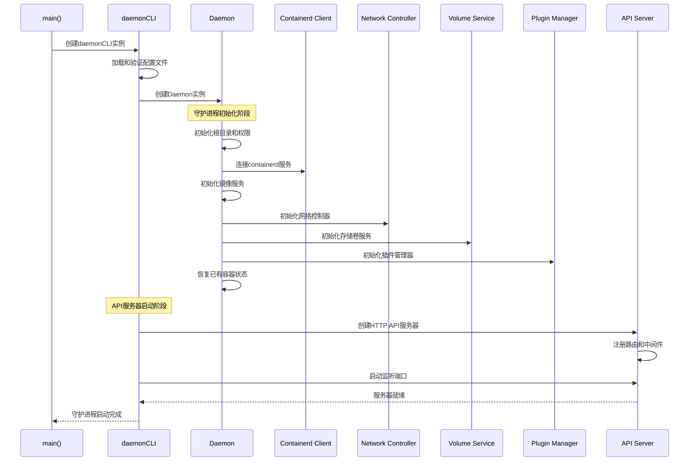
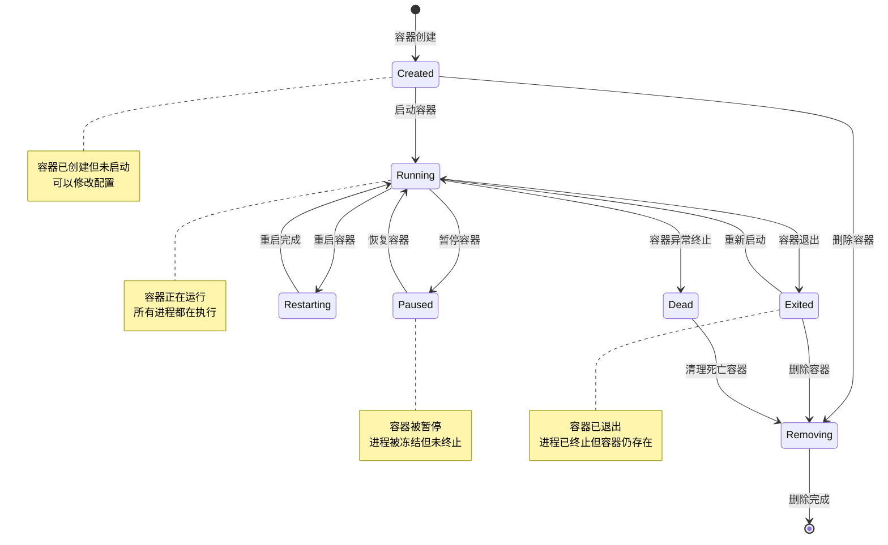
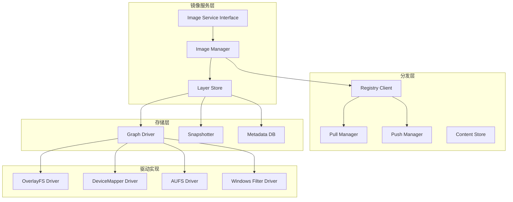
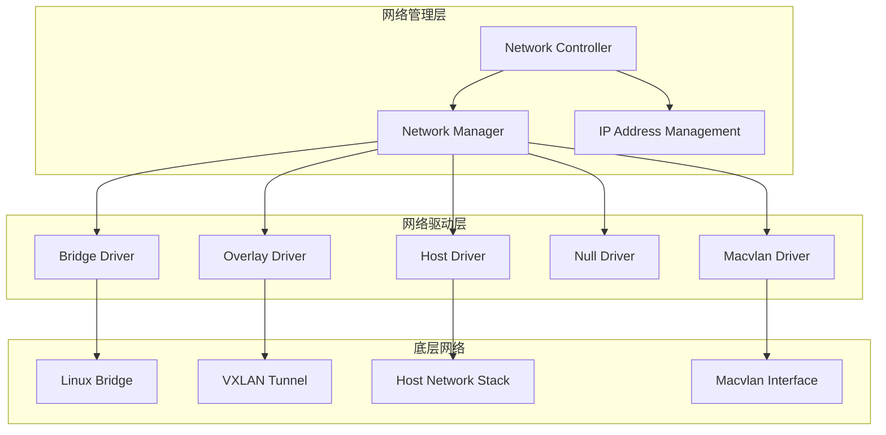
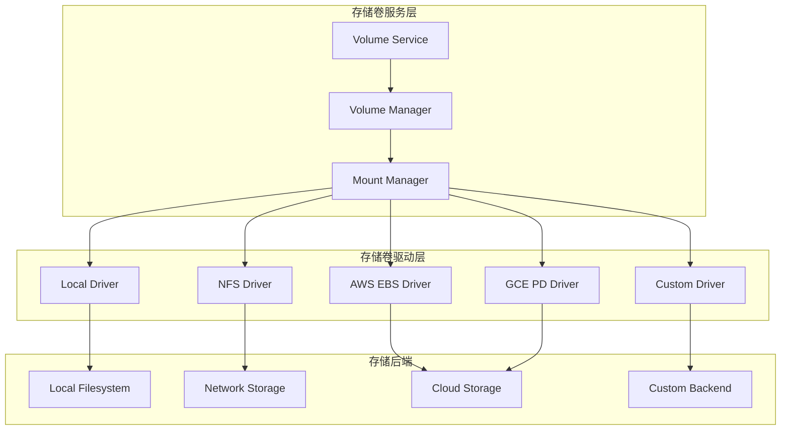
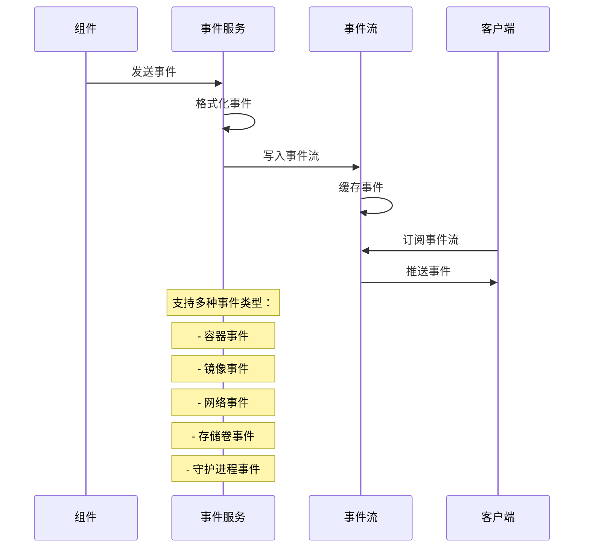

## 1. 守护进程架构概述

### 1.1 核心设计理念
Docker守护进程（dockerd）是整个Docker系统的核心，负责管理容器、镜像、网络、存储等所有资源。它采用以下设计原则：

- **单一守护进程**: 所有Docker功能都通过一个守护进程统一管理
- **状态持久化**: 重要状态信息保存到磁盘，支持重启恢复  
- **事件驱动**: 基于事件的异步处理机制
- **插件化架构**: 支持存储、网络、日志等驱动插件扩展
- **资源隔离**: 通过命名空间和cgroup实现资源隔离

### 1.2 守护进程启动流程



## 2. Daemon核心结构分析

### 2.1 Daemon结构体定义

```go
// 文件路径: daemon/daemon.go
// Daemon 是整个Docker守护进程的核心结构体，管理所有Docker资源

type Daemon struct {
	// 基础标识信息
	id                string                      // 守护进程唯一标识
	repository        string                      // 镜像仓库根路径
	root              string                      // 守护进程根目录路径
	
	// 容器管理相关
	containers        container.Store             // 容器存储接口
	containersReplica *container.ViewDB           // 容器视图数据库
	execCommands      *container.ExecStore        // 执行命令存储
	
	// 镜像管理相关
	imageService      ImageService               // 镜像服务接口
	
	// 配置管理
	configStore       atomic.Pointer[configStore] // 原子配置存储指针
	configReload      sync.Mutex                  // 配置重载锁
	
	// 统计和监控
	statsCollector    *stats.Collector            // 统计信息收集器
	EventsService     *events.Events              // 事件服务
	
	// 网络管理
	netController     *libnetwork.Controller      // 网络控制器
	attachmentStore   network.AttachmentStore     // 网络附加存储
	attachableNetworkLock *locker.Locker         // 可附加网络锁
	
	// 存储卷管理
	volumes           *volumesservice.VolumesService // 存储卷服务
	
	// 插件系统
	PluginStore       *plugin.Store               // 插件存储（待废弃）
	pluginManager     *plugin.Manager             // 插件管理器
	
	// 容器运行时
	containerdClient  *containerd.Client          // containerd客户端
	containerd        libcontainerdtypes.Client   // libcontainerd客户端
	defaultIsolation  containertypes.Isolation    // 默认隔离模式（Windows）
	
	// 集群管理
	clusterProvider   cluster.Provider            // 集群提供者
	cluster           Cluster                     // 集群接口
	genericResources  []swarm.GenericResource     // 通用资源列表
	
	// 引用存储
	ReferenceStore    refstore.Store              // 引用存储
	
	// 系统信息
	sysInfoOnce       sync.Once                   // 系统信息单例
	sysInfo           *sysinfo.SysInfo           // 系统信息
	machineMemory     uint64                      // 机器内存大小
	
	// 安全配置
	seccompProfile     []byte                      // seccomp安全配置文件
	seccompProfilePath string                      // seccomp配置文件路径
	idMapping         user.IdentityMapping        // 用户身份映射
	
	// 磁盘使用统计（使用单飞模式避免重复计算）
	usageContainers singleflight.Group[struct{}, *backend.ContainerDiskUsage]
	usageImages     singleflight.Group[struct{}, []*imagetypes.Summary]
	usageVolumes    singleflight.Group[struct{}, *backend.VolumeDiskUsage]
	usageLayer      singleflight.Group[struct{}, int64]
	
	// 运行状态
	shutdown          bool                        // 关闭标志
	pruneRunning      atomic.Bool                 // 清理操作运行标志
	hosts             map[string]bool             // 监听地址映射
	startupDone       chan struct{}               // 启动完成通道
	
	// 平台特定字段
	mdDB             *bolt.DB                     // 元数据数据库（Windows）
	usesSnapshotter  bool                        // 是否使用snapshotter
	CDICache         *cdi.Cache                  // CDI缓存
}
```

### 2.2 核心方法实现

#### 2.2.1 守护进程初始化

```go
// NewDaemon 创建新的守护进程实例
// 这是守护进程的核心初始化函数，负责设置所有必要的组件
func NewDaemon(ctx context.Context, config *config.Config, pluginStore *plugin.Store, authzMiddleware *authorization.Middleware) (daemon *Daemon, err error) {
	// 1. 设置临时目录权限（安全考虑）
	setDefaultMtu(config)
	
	// 2. 创建Daemon基础结构
	daemon = &Daemon{
		id:              generateDaemonID(),
		repository:      config.Root,
		containers:     container.NewMemoryStore(),
		execCommands:   container.NewExecStore(),
		startupDone:    make(chan struct{}),
		attachableNetworkLock: locker.New(),
	}
	
	// 3. 初始化配置存储
	daemon.configStore.Store(&configStore{
		Config: *config,
	})
	
	// 4. 初始化根目录
	if err := daemon.setupDaemonRoot(config); err != nil {
		return nil, fmt.Errorf("error setting up daemon root: %v", err)
	}
	
	// 5. 初始化身份映射（用户和组ID映射）
	if err := daemon.setupRemappedRoot(config); err != nil {
		return nil, err
	}
	
	// 6. 初始化容器运行时客户端
	if err := daemon.initContainerdClient(config); err != nil {
		return nil, fmt.Errorf("failed to initialize containerd client: %v", err) 
	}
	
	// 7. 初始化镜像服务
	if err := daemon.initImageService(config); err != nil {
		return nil, fmt.Errorf("failed to initialize image service: %v", err)
	}
	
	// 8. 初始化网络控制器
	if err := daemon.initNetworkController(config); err != nil {
		return nil, fmt.Errorf("failed to initialize network controller: %v", err)
	}
	
	// 9. 初始化存储卷服务  
	if err := daemon.initVolumeService(config); err != nil {
		return nil, fmt.Errorf("failed to initialize volume service: %v", err)
	}
	
	// 10. 初始化插件管理器
	daemon.pluginManager = plugin.NewManager(pluginStore)
	
	// 11. 初始化事件服务
	daemon.EventsService = events.New()
	
	// 12. 初始化统计收集器
	daemon.statsCollector = stats.NewCollector()
	
	// 13. 恢复已有容器状态
	if err := daemon.restore(); err != nil {
		return nil, fmt.Errorf("failed to restore containers: %v", err)
	}
	
	// 14. 启动清理任务和后台服务
	daemon.startCleanupTasks()
	
	return daemon, nil
}
```

#### 2.2.2 容器状态恢复

```go
// restore 恢复守护进程重启前的容器状态
// 这个函数在守护进程启动时调用，恢复所有已存在的容器
func (daemon *Daemon) restore() error {
	var (
		debug         = log.G(ctx).Logger.Level == logrus.DebugLevel
		containers    = make(map[string]*container.Container)
		currentDriver = daemon.imageService.StorageDriver()
	)

	log.G(ctx).Info("Loading containers: start.")

	// 1. 扫描容器目录，读取所有容器的元数据
	dir, err := os.ReadDir(daemon.repository)
	if err != nil {
		return err
	}

	containerLoop:
	for _, v := range dir {
		if !v.IsDir() {
			continue
		}
		
		id := v.Name()
		container, err := daemon.load(id)
		if err != nil {
			log.G(ctx).WithError(err).WithField("container", id).Error("Failed to load container")
			continue
		}
		
		// 2. 验证容器的存储驱动兼容性
		if container.Driver != currentDriver {
			log.G(ctx).WithFields(logrus.Fields{
				"container": container.ID,
				"old-driver": container.Driver,  
				"new-driver": currentDriver,
			}).Warn("Container was created with a different storage driver")
		}
		
		// 3. 加载容器的网络设置
		if err := daemon.registerName(container); err != nil {
			log.G(ctx).WithError(err).WithField("container", container.ID).Error("Failed to register container name")
			continue
		}
		
		containers[container.ID] = container
	}

	// 4. 批量注册到存储中
	daemon.containers.Add(containers)
	
	// 5. 恢复运行中容器的状态
	var (
		removedContainers = make(map[string]*container.Container)
		restartContainers = make(map[string]*container.Container)
	)
	
	for _, c := range containers {
		// 检查容器是否仍在运行
		alive, _, err := daemon.containerd.Restore(ctx, c.ID, c.InitializeStdio)
		if err != nil {
			log.G(ctx).WithError(err).WithField("container", c.ID).Error("Failed to restore container with containerd")
			continue
		}
		
		if !alive {
			// 容器已停止，检查是否需要重启
			if c.ShouldRestart() {
				restartContainers[c.ID] = c
			}
		} else {
			// 容器仍在运行，恢复其状态
			log.G(ctx).WithField("container", c.ID).Debug("Restoring running container")
			
			if err := daemon.containerStart(ctx, c, "", "", true); err != nil {
				log.G(ctx).WithError(err).WithField("container", c.ID).Error("Failed to restart container")
			}
		}
	}
	
	// 6. 重启需要重启的容器
	daemon.RestartSwarmContainers(ctx, restartContainers)
	
	// 7. 移除损坏的容器
	for id := range removedContainers {
		daemon.containers.Delete(id)
	}

	log.G(ctx).WithField("count", len(containers)).Info("Loading containers: done.")
	return nil
}
```

## 3. 容器管理模块

### 3.1 Container结构分析

```go
// 文件路径: daemon/container/container.go
// Container 结构体代表一个Docker容器的完整状态和配置

type Container struct {
	// 流配置和状态管理
	StreamConfig *stream.Config                  // 标准输入输出流配置
	*State       `json:"State"`                  // 容器运行状态（嵌入State结构）
	
	// 基础标识信息
	ID              string                       // 容器唯一标识
	Name            string                       // 容器名称
	Created         time.Time                    // 创建时间
	Path            string                       // 执行命令路径
	Args            []string                     // 命令参数
	
	// 文件系统相关
	Root            string  `json:"-"`           // 容器根目录路径（不序列化）
	BaseFS          string  `json:"-"`           // 图形驱动挂载点路径
	RWLayer         RWLayer `json:"-"`           // 读写层接口
	MountPoints     map[string]*volumemounts.MountPoint // 挂载点映射
	
	// 配置信息
	Config          *containertypes.Config       // 容器基础配置
	HostConfig      *containertypes.HostConfig `json:"-"` // 主机配置（不序列化）
	
	// 镜像相关
	ImageID         image.ID `json:"Image"`      // 镜像ID
	ImageManifest   *ocispec.Descriptor          // 镜像清单描述符
	ImagePlatform   ocispec.Platform             // 镜像平台信息
	
	// 网络配置
	NetworkSettings *network.Settings            // 网络设置
	
	// 运行时状态
	Driver          string                       // 存储驱动类型
	RestartCount    int                          // 重启次数
	HasBeenStartedBefore     bool                // 是否曾经启动过
	HasBeenManuallyStopped   bool                // 是否被手动停止
	HasBeenManuallyRestarted bool `json:"-"`     // 是否被手动重启
	Managed         bool                         // 是否为托管容器
	
	// 执行和依赖
	ExecCommands    *ExecStore                   // 执行命令存储
	DependencyStore agentexec.DependencyGetter `json:"-"` // 依赖存储
	
	// Swarm相关
	SecretReferences []*swarmtypes.SecretReference // 密钥引用
	ConfigReferences []*swarmtypes.ConfigReference // 配置引用
	
	// 日志相关
	LogPath         string                       // 日志文件路径
	LogDriver       logger.Logger  `json:"-"`    // 日志驱动
	LogCopier       *logger.Copier `json:"-"`    // 日志复制器
	
	// 重启管理
	restartManager  *restartmanager.RestartManager // 重启管理器
	attachContext   *attachContext                 // 附加上下文
	
	// Unix平台特定字段
	SecurityOptions                              // 安全选项（嵌入）
	HostnamePath   string                       // hostname文件路径
	HostsPath      string                       // hosts文件路径  
	ShmPath        string                       // 共享内存路径
	ResolvConfPath string                       // resolv.conf路径
	
	// Windows平台特定字段
	NetworkSharedContainerID string `json:"-"`   // 网络共享容器ID
	SharedEndpointList       []string `json:"-"` // 共享端点列表
	LocalLogCacheMeta        localLogCacheMeta `json:",omitempty"` // 本地日志缓存元数据
}

// SecurityOptions 定义容器的安全相关配置
type SecurityOptions struct {
	MountLabel      string   // 挂载标签（SELinux）
	ProcessLabel    string   // 进程标签（SELinux）
	AppArmorProfile string   // AppArmor配置文件
	SeccompProfile  string   // Seccomp安全配置文件
	NoNewPrivileges bool     // 禁止新权限
	WritableCgroups *bool    // 可写cgroups
}
```

### 3.2 容器状态管理



### 3.3 容器生命周期管理

#### 3.3.1 容器创建流程

```go
// ContainerCreate 创建新容器的核心函数
// 这个函数处理容器创建的完整流程，包括配置验证、资源分配等
func (daemon *Daemon) ContainerCreate(ctx context.Context, params types.ContainerCreateConfig) (containertypes.CreateResponse, error) {
	// 1. 验证容器配置
	if err := daemon.verifyContainerSettings(params.Config, params.HostConfig); err != nil {
		return containertypes.CreateResponse{}, errdefs.InvalidParameter(err)
	}
	
	// 2. 验证网络配置
	if err := daemon.verifyNetworkingConfig(params.NetworkingConfig); err != nil {
		return containertypes.CreateResponse{}, errdefs.InvalidParameter(err)
	}
	
	// 3. 生成容器ID和名称
	var (
		container *container.Container
		err      error
	)
	
	if params.Name != "" {
		// 验证容器名称唯一性
		if err := daemon.verifyContainerName(params.Name); err != nil {
			return containertypes.CreateResponse{}, errdefs.InvalidParameter(err)
		}
	}
	
	// 4. 创建容器对象
	container, err = daemon.newContainer(params.Name, params.Platform, params.Config, params.HostConfig, imgID, imgManifest, managed)
	if err != nil {
		return containertypes.CreateResponse{}, err
	}
	
	// 5. 设置网络配置
	if err := daemon.setNetworkConfig(container, params.NetworkingConfig); err != nil {
		return containertypes.CreateResponse{}, errdefs.InvalidParameter(err)
	}
	
	// 6. 创建容器根目录
	if err := daemon.createContainerPlatformSpecificSettings(container, params.Config, params.HostConfig); err != nil {
		return containertypes.CreateResponse{}, err
	}
	
	var warnings []string
	
	// 7. 设置存储卷挂载
	if err := daemon.setHostConfig(container, params.HostConfig); err != nil {
		return containertypes.CreateResponse{}, err
	}
	
	// 8. 保存容器配置到磁盘
	if err := container.ToDisk(); err != nil {
		return containertypes.CreateResponse{}, fmt.Errorf("failed to save container configuration: %v", err)
	}
	
	// 9. 注册容器到守护进程
	daemon.registerContainer(container)
	
	// 10. 发送容器创建事件
	daemon.LogContainerEvent(container, "create")
	
	return containertypes.CreateResponse{
		ID:       container.ID,
		Warnings: warnings,
	}, nil
}
```

#### 3.3.2 容器启动流程

```go
// ContainerStart 启动容器的核心函数
// 处理容器从Created状态转换为Running状态的完整流程
func (daemon *Daemon) ContainerStart(ctx context.Context, name string, hostConfig *containertypes.HostConfig, checkpoint string, checkpointDir string) error {
	// 1. 获取容器对象
	container, err := daemon.GetContainer(name)
	if err != nil {
		return err
	}
	
	// 2. 检查容器当前状态
	if container.IsPaused() {
		return fmt.Errorf("cannot start a paused container, try unpause instead")
	}
	
	if container.IsRunning() {
		return containerNotModifiedError{running: true}
	}
	
	// 3. 更新主机配置（如果提供）
	if hostConfig != nil {
		if err := daemon.adaptContainerSettings(container, hostConfig); err != nil {
			return errdefs.InvalidParameter(err)
		}
	}
	
	// 4. 准备容器启动
	if err := daemon.containerStart(ctx, container, checkpoint, checkpointDir, true); err != nil {
		return err
	}
	
	return nil
}

// containerStart 内部容器启动实现
func (daemon *Daemon) containerStart(ctx context.Context, container *container.Container, checkpoint string, checkpointDir string, resetRestartManager bool) (retErr error) {
	// 1. 容器状态锁定
	container.Lock()
	defer container.Unlock()
	
	// 2. 检查容器是否已删除
	if container.Removing {
		return errdefs.Conflict(fmt.Errorf("container is marked for removal and cannot be started"))
	}
	
	// 3. 设置容器为启动状态
	if err := container.SetStarting(); err != nil {
		return err
	}
	
	defer func() {
		if retErr != nil {
			container.SetStopped(&ExitStatus{
				ExitCode:  127,
				ExitedAt:  time.Now().UTC(),
			})
		}
	}()
	
	// 4. 初始化网络
	if err := daemon.initializeNetworking(ctx, container); err != nil {
		return err
	}
	
	// 5. 创建容器运行时规范
	spec, err := daemon.createSpec(ctx, container)
	if err != nil {
		return fmt.Errorf("failed to generate container spec: %v", err)
	}
	
	// 6. 启动日志收集
	if err := daemon.setupContainerLogDriver(container); err != nil {
		return err
	}
	
	// 7. 通过containerd启动容器
	if err := daemon.containerd.Create(ctx, container.ID, spec, container.StreamConfig.Stdout(), container.StreamConfig.Stderr()); err != nil {
		return fmt.Errorf("failed to create container in containerd: %v", err)
	}
	
	// 8. 启动容器进程
	pid, err := daemon.containerd.Start(ctx, container.ID, checkpoint, checkpointDir)
	if err != nil {
		return fmt.Errorf("failed to start container: %v", err)
	}
	
	// 9. 更新容器状态为运行中
	container.SetRunning(pid)
	container.HasBeenStartedBefore = true
	container.SaveToDisk(false)
	
	// 10. 启动重启管理器
	if resetRestartManager && container.RestartPolicy.IsAlways() || container.RestartPolicy.IsUnlessStopped() {
		container.RestartManager().SetPolicy(container.RestartPolicy)
	}
	
	// 11. 发送启动事件
	daemon.LogContainerEvent(container, "start")
	
	return nil
}
```

## 4. 镜像管理模块

### 4.1 镜像服务架构



### 4.2 镜像拉取流程

```go
// PullImage 拉取镜像的核心实现
// 支持多架构镜像拉取和进度报告
func (daemon *Daemon) PullImage(ctx context.Context, image, tag, platform string, metaHeaders map[string][]string, authConfig *registry.AuthConfig, outStream io.Writer) error {
	// 1. 解析镜像引用
	ref, err := reference.ParseNormalizedNamed(image)
	if err != nil {
		return errdefs.InvalidParameter(err)
	}
	
	if tag != "" {
		if digest.DigestRegexp.MatchString(tag) {
			// tag实际是摘要值
			dgst, err := digest.Parse(tag)
			if err != nil {
				return errdefs.InvalidParameter(err)
			}
			ref, err = reference.WithDigest(reference.TrimNamed(ref), dgst)
		} else {
			// 正常的标签
			ref, err = reference.WithTag(ref, tag)
		}
		if err != nil {
			return errdefs.InvalidParameter(err)
		}
	}
	
	// 2. 创建拉取配置
	pullConfig := &distribution.Config{
		Reference:     ref,
		AuthConfig:    authConfig,
		ProgressOutput: progress.ChanOutput(outStream),
		RequireSchema2: daemon.configStore.RequireSchema2,
		Platform:      platform,
		MetaHeaders:   metaHeaders,
	}
	
	// 3. 执行镜像拉取
	err = distribution.Pull(ctx, ref, daemon.imageService, pullConfig)
	if err != nil {
		return err
	}
	
	// 4. 发送拉取完成事件
	daemon.LogImageEvent(ref.String(), ref.String(), "pull")
	
	return nil
}
```

## 5. 网络管理模块

### 5.1 网络架构设计



### 5.2 网络初始化

```go
// initNetworkController 初始化网络控制器
// 设置默认网络驱动和IPAM驱动
func (daemon *Daemon) initNetworkController(config *config.Config) error {
	// 1. 创建网络控制器配置
	netOptions, err := daemon.networkOptions(config)
	if err != nil {
		return err
	}
	
	// 2. 创建网络控制器实例
	controller, err := libnetwork.New(netOptions...)
	if err != nil {
		return fmt.Errorf("error obtaining controller instance: %v", err)
	}
	
	daemon.netController = controller
	
	// 3. 设置集群提供者
	if config.Experimental {
		controller.SetClusterProvider(daemon.cluster)
	}
	
	// 4. 初始化默认网络
	if err := daemon.initDefaultNetworks(config); err != nil {
		return err
	}
	
	return nil
}

// initDefaultNetworks 初始化默认网络
func (daemon *Daemon) initDefaultNetworks(config *config.Config) error {
	// 1. 创建默认桥接网络
	if _, err := daemon.createNetwork("bridge", "bridge", map[string]interface{}{}); err != nil {
		log.G(ctx).WithError(err).Error("Failed to create bridge network")
	}
	
	// 2. 创建host网络
	if _, err := daemon.createNetwork("host", "host", map[string]interface{}{}); err != nil {
		log.G(ctx).WithError(err).Error("Failed to create host network")  
	}
	
	// 3. 创建none网络
	if _, err := daemon.createNetwork("none", "null", map[string]interface{}{}); err != nil {
		log.G(ctx).WithError(err).Error("Failed to create none network")
	}
	
	return nil
}
```

## 6. 存储卷管理模块

### 6.1 存储卷架构



### 6.2 存储卷操作

```go
// VolumeCreate 创建存储卷
func (daemon *Daemon) VolumeCreate(name, driverName string, opts map[string]string, labels map[string]string) (*volume.Volume, error) {
	// 1. 验证参数
	if name == "" {
		name = stringid.GenerateNonCryptoID()
	}
	
	// 2. 检查存储卷是否已存在
	if v, err := daemon.volumes.Get(name); err == nil {
		return v, errdefs.Conflict(errors.New("volume already exists"))
	}
	
	// 3. 获取存储卷驱动
	driver, err := daemon.volumes.GetDriver(driverName)
	if err != nil {
		return nil, err
	}
	
	// 4. 创建存储卷
	v, err := driver.Create(name, opts)
	if err != nil {
		return nil, err
	}
	
	// 5. 设置标签
	v.SetLabels(labels)
	
	// 6. 注册到服务中
	if err := daemon.volumes.Create(v); err != nil {
		return nil, err
	}
	
	// 7. 发送创建事件
	daemon.LogVolumeEvent(name, "create", map[string]string{"driver": driverName})
	
	return v, nil
}
```

## 7. 事件系统

### 7.1 事件处理架构



### 7.2 事件发送实现

```go
// LogContainerEvent 记录容器事件
func (daemon *Daemon) LogContainerEvent(container *container.Container, action string) {
	daemon.LogContainerEventWithAttributes(container, action, map[string]string{})
}

// LogContainerEventWithAttributes 记录带属性的容器事件
func (daemon *Daemon) LogContainerEventWithAttributes(container *container.Container, action string, attributes map[string]string) {
	copyAttributes := make(map[string]string, len(attributes))
	for k, v := range attributes {
		copyAttributes[k] = v
	}
	
	// 添加容器基础属性
	copyAttributes["name"] = strings.TrimPrefix(container.Name, "/")
	copyAttributes["image"] = container.Config.Image
	
	if container.Config.Labels != nil {
		for k, v := range container.Config.Labels {
			copyAttributes[k] = v
		}
	}
	
	// 创建事件对象
	event := events.Message{
		Type:       events.ContainerEventType,
		Action:     events.Action(action),
		Actor:      events.Actor{ID: container.ID, Attributes: copyAttributes},
		Scope:      "local",
		Time:       time.Now().UTC().Unix(),
		TimeNano:   time.Now().UTC().UnixNano(),
	}
	
	// 发送事件
	daemon.EventsService.Log(event.Type, event.Action, event.Actor)
}
```

通过以上分析，我们可以看到Moby守护进程模块的精心设计和复杂实现，它通过模块化的架构实现了容器、镜像、网络、存储等功能的统一管理。
