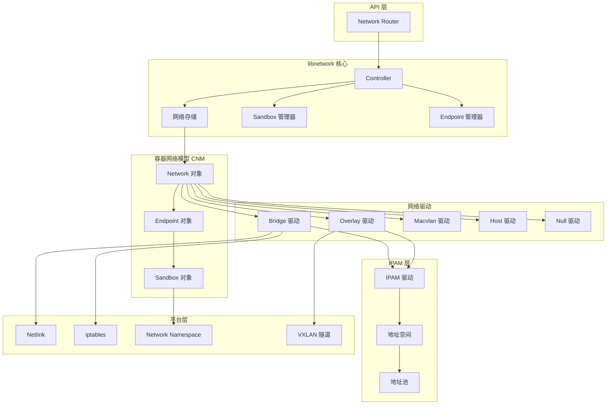
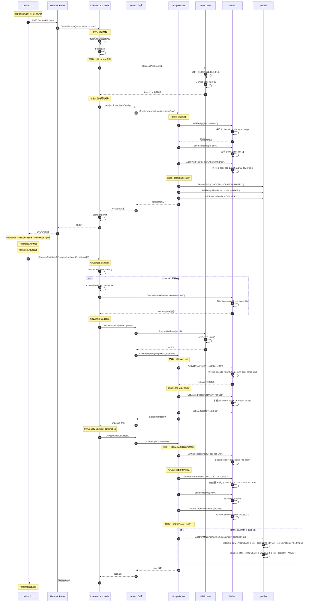
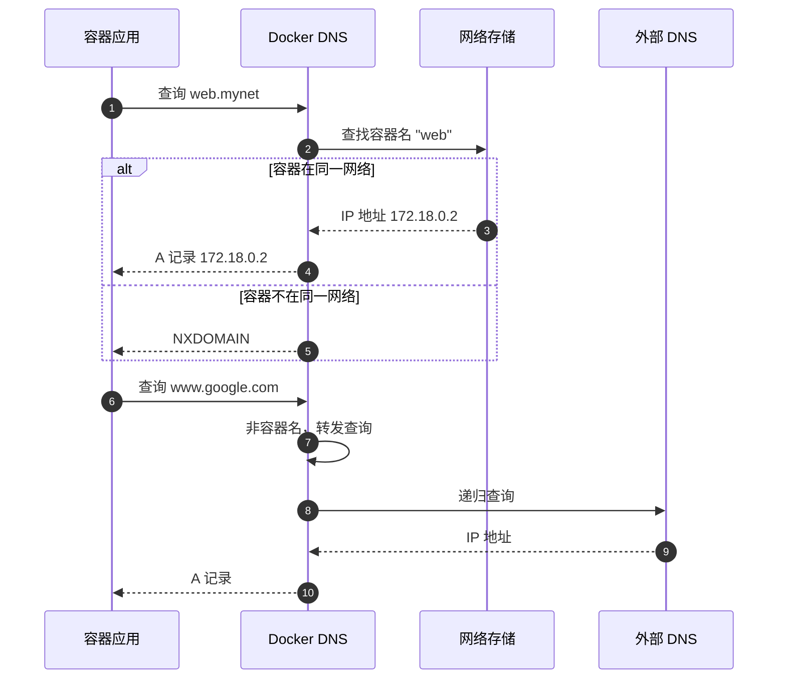
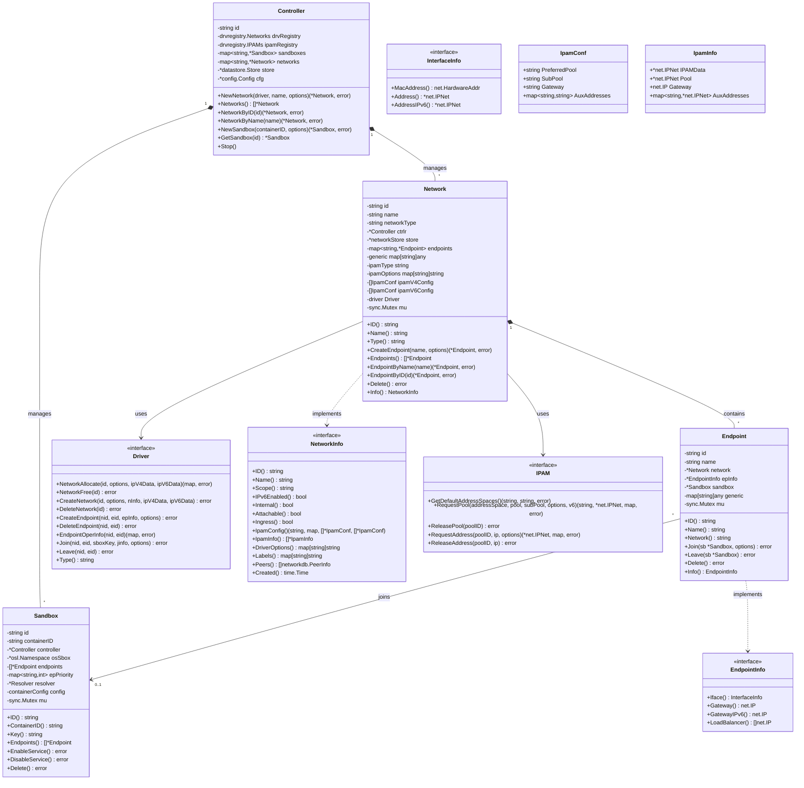
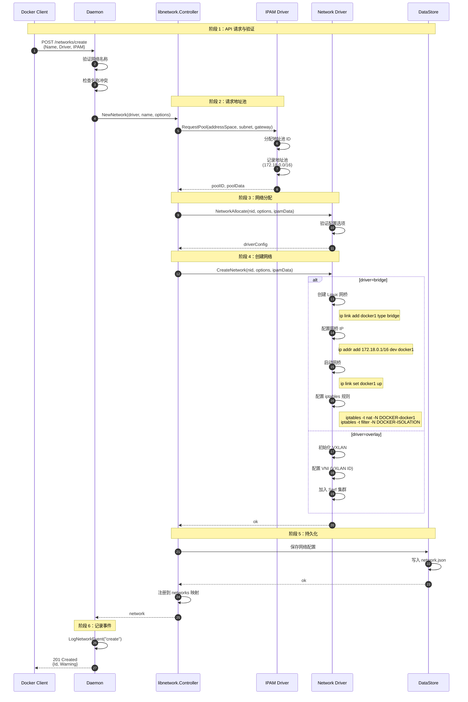
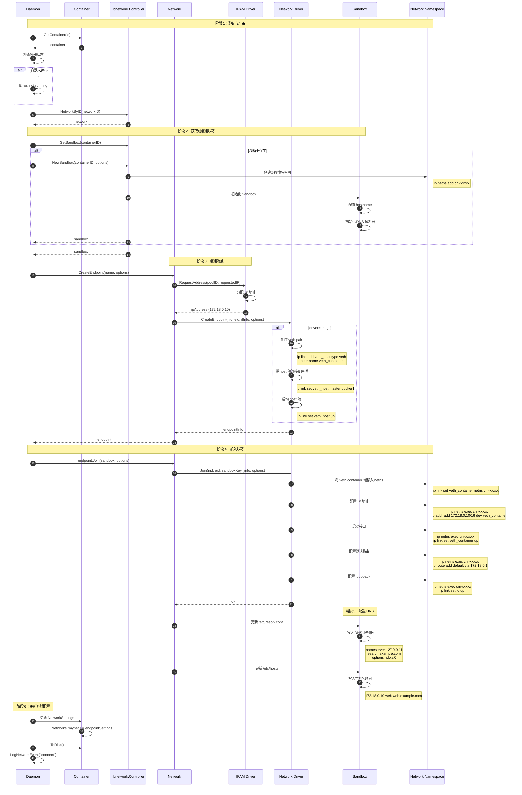
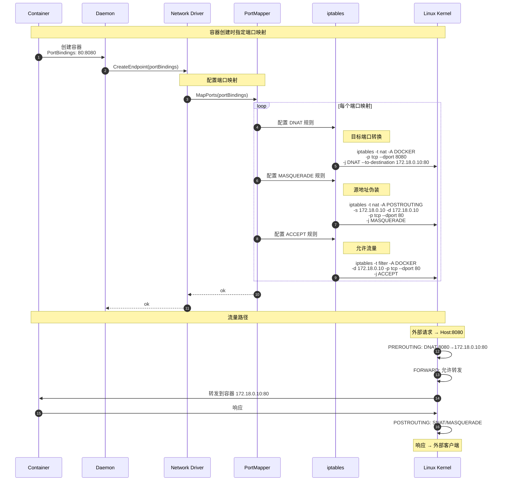
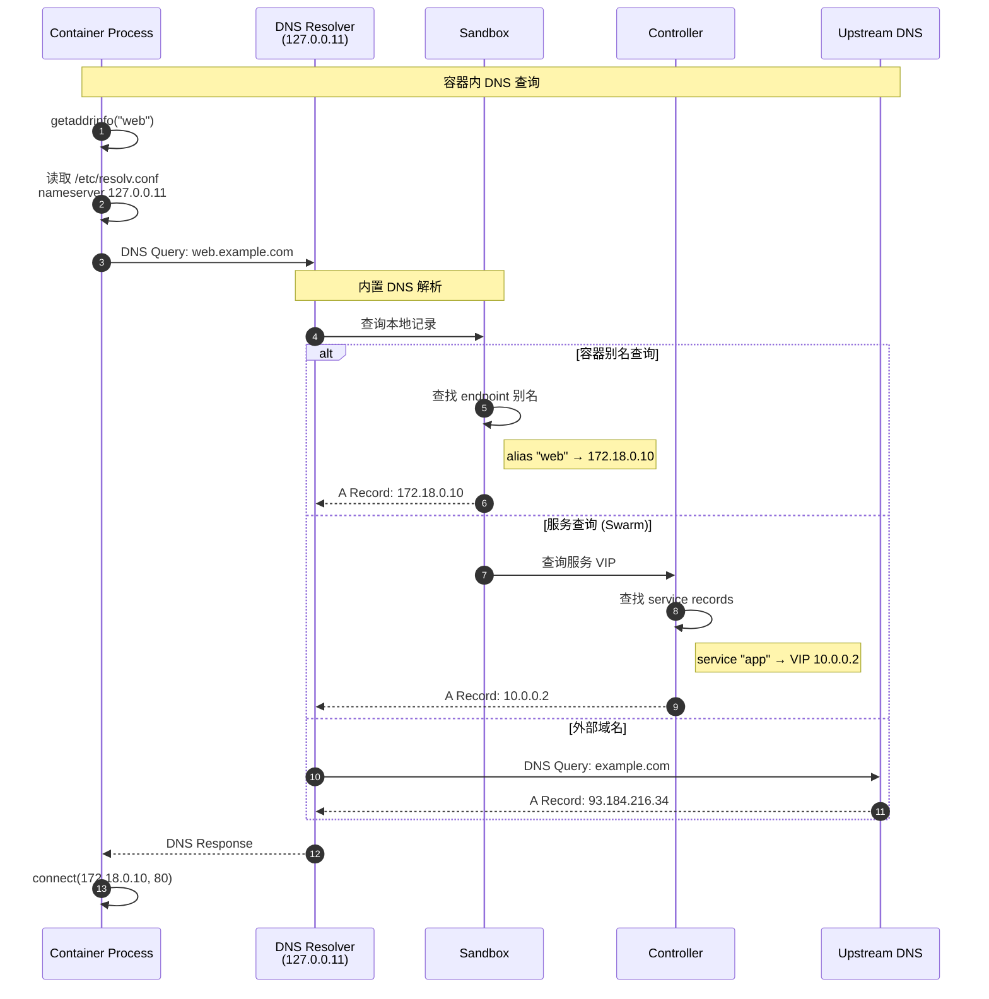
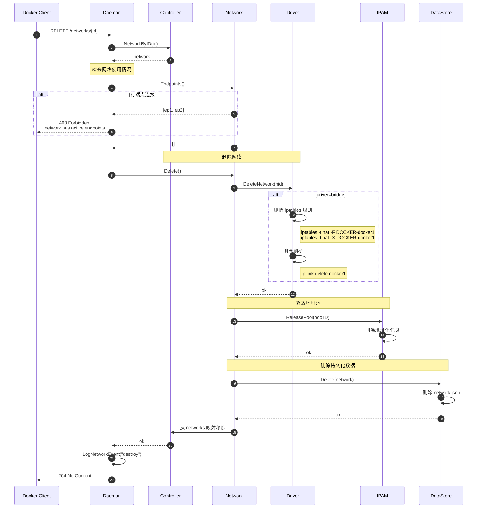

# docker-04-network

## 模块概览

## 模块定位与职责

### 职责边界

network 模块（libnetwork）负责容器网络的完整管理，实现 Docker 的容器网络模型（CNM）：

1. **网络生命周期管理**：
   - 创建/删除网络
   - 网络驱动管理（bridge/overlay/macvlan/host/none）
   - 网络配置与参数验证

2. **端点管理**：
   - 创建网络端点（容器网络接口）
   - 连接/断开容器到网络
   - 端点配置（IP 地址、MAC 地址、端口映射）

3. **IP 地址管理（IPAM）**：
   - 子网分配与释放
   - IP 地址分配与回收
   - 网关配置
   - 支持多种 IPAM 驱动

4. **网络隔离与连通**：
   - 容器间通信控制（ICC）
   - 跨主机容器网络（overlay）
   - 网络命名空间管理
   - 端口映射（NAT）

5. **服务发现**：
   - 内置 DNS 服务器
   - 服务名解析
   - 负载均衡（轮询）

### 上下游依赖

**上游调用方**：

- Network Router：处理网络相关的 HTTP API
- Daemon：容器启动时连接网络
- Swarm：集群网络管理

**下游被依赖方**：

- 网络驱动（bridge/overlay/macvlan）
- IPAM 驱动（default/dhcp）
- Netlink：Linux 网络配置
- iptables：防火墙规则
- VXLAN：跨主机隧道

---

## 模块架构图



### 架构说明

**1. 容器网络模型（CNM）**：

- **Network**：逻辑网络，多个容器可加入同一网络

  ```go
  type Network struct {
      name        string
      id          string
      networkType string      // bridge/overlay/macvlan/...
      ipamType    string      // default/dhcp
      ipamV4Config []*IpamConf
      ipamV6Config []*IpamConf
      endpoints   map[string]*Endpoint
      driver      NetworkDriver
  }
```

- **Endpoint**：网络端点，容器在网络中的接口

  ```go
  type Endpoint struct {
      id          string
      name        string
      network     *Network
      iface       *EndpointInterface  // IP/MAC 地址
      sandbox     *Sandbox
      portMapping []PortBinding
  }
```

- **Sandbox**：网络沙箱，对应一个网络命名空间

  ```go
  type Sandbox struct {
      id          string
      key         string  // 网络命名空间路径
      endpoints   []*Endpoint
      osSbox      OSInterface  // 操作系统沙箱
  }
```

**2. 网络驱动**：

- **Bridge 驱动**：
  - 创建 Linux 网桥（docker0）
  - 为容器创建 veth pair
  - 配置 iptables 规则（SNAT/DNAT）
  - 支持端口映射

- **Overlay 驱动**：
  - 基于 VXLAN 的跨主机网络
  - 分布式键值存储（etcd/consul）同步网络状态
  - VNI（VXLAN Network Identifier）隔离
  - 支持加密（IPsec）

- **Macvlan 驱动**：
  - 为容器分配物理网卡的 MAC 地址
  - 容器直接出现在物理网络
  - 无需 NAT，性能最佳
  - 需要网卡混杂模式

- **Host 驱动**：
  - 容器直接使用宿主机网络命名空间
  - 无网络隔离
  - 性能最佳

- **Null 驱动**：
  - 无网络配置
  - 仅 loopback 接口

**3. IPAM（IP 地址管理）**：

```go
type IPAM struct {
    defaultAddressSpace string  // "local" / "global"
    pools               map[string]*Pool
}

type Pool struct {
    subnet  *net.IPNet
    gateway net.IP
    allocated map[string]bool  // IP -> 是否已分配
}
```

---

## 网络创建与容器连接时序图



### 时序图关键点说明

**阶段1-3：网络创建（100-200ms）**

- 网络 ID 生成：随机 UUID
- 默认子网分配：
  - 用户未指定：自动从 `172.17.0.0/16 ~ 172.31.0.0/16` 选择未使用的子网
  - 用户指定：验证子网不与现有网络冲突

**阶段4：创建网桥（10-20ms）**

```bash
# 实际执行的命令
ip link add br-abc123 type bridge
ip link set br-abc123 up
ip addr add 172.18.0.1/16 dev br-abc123
```

**阶段5：配置 iptables 规则（20-50ms）**

```bash
# 网络隔离规则
iptables -t filter -N DOCKER-ISOLATION-STAGE-1
iptables -t filter -A DOCKER-ISOLATION-STAGE-1 -i br-abc123 ! -o br-abc123 -j DOCKER-ISOLATION-STAGE-2
iptables -t filter -A DOCKER-ISOLATION-STAGE-2 -o br-abc123 -j DROP

# SNAT 规则（容器访问外网）
iptables -t nat -A POSTROUTING -s 172.18.0.0/16 ! -o br-abc123 -j MASQUERADE

# 转发规则
iptables -t filter -A FORWARD -i br-abc123 ! -o br-abc123 -j ACCEPT
iptables -t filter -A FORWARD -o br-abc123 -m conntrack --ctstate RELATED,ESTABLISHED -j ACCEPT
```

**阶段6：创建 Sandbox（5-10ms）**

```bash
# 创建网络命名空间
ip netns add <container-id>

# 命名空间路径
/var/run/docker/netns/<container-id>
```

**阶段7：分配 IP 地址（<1ms）**

- IPAM 从地址池分配可用 IP
- 跳过网关地址（.1）和广播地址（.255）
- 支持静态 IP 分配（用户指定）

**阶段8-9：创建并连接 veth pair（10-20ms）**

```bash
# 创建 veth pair
ip link add veth123abc type veth peer name eth0

# 连接 veth 到网桥
ip link set veth123abc master br-abc123
ip link set veth123abc up
```

**阶段10-12：配置容器网络（20-40ms）**

```bash
# 移动 eth0 到容器命名空间
ip link set eth0 netns /var/run/docker/netns/<container-id>

# 在容器命名空间内配置
ip netns exec <container-id> ip addr add 172.18.0.2/16 dev eth0
ip netns exec <container-id> ip link set eth0 up
ip netns exec <container-id> ip route add default via 172.18.0.1
```

**阶段13：配置端口映射（10-30ms）**

```bash
# DNAT 规则（外部访问容器）
iptables -t nat -A DOCKER -p tcp --dport 8080 -j DNAT --to-destination 172.18.0.2:80

# FILTER 规则（允许流量）
iptables -t filter -A DOCKER -d 172.18.0.2/32 -p tcp --dport 80 -m conntrack --ctstate NEW,ESTABLISHED -j ACCEPT
```

---

## 网络驱动对比

| 特性 | bridge | overlay | macvlan | host | null |
|---|---|---|---|---|---|
| **网络隔离** | ✓ | ✓ | ✓ | ✗ | ✓ |
| **跨主机** | ✗ | ✓ | ✗ | ✗ | ✗ |
| **端口映射** | ✓ | ✓ | ✗ | ✗ | ✗ |
| **DNS 解析** | ✓ | ✓ | ✗ | ✗ | ✗ |
| **性能** | 中 | 中 | 高 | 最高 | - |
| **用例** | 单机开发 | 集群部署 | 直连物理网络 | 高性能应用 | 纯计算任务 |

---

## 内置 DNS 服务器

### DNS 解析流程



### DNS 配置

```go
// 容器 /etc/resolv.conf
nameserver 127.0.0.11  // Docker DNS 服务器
options ndots:0

// DNS 服务器监听地址
/var/run/docker/netns/<container-id>/resolv.conf
```

---

## 性能优化

### iptables 规则优化

```bash
# 使用 iptables-restore 批量加载规则（比逐条添加快 10 倍）
iptables-save > /tmp/rules.txt
# 编辑规则...
iptables-restore < /tmp/rules.txt

# 使用 nftables 替代 iptables（更高性能）
dockerd --iptables-backend=nft
```

### 网络命名空间缓存

```go
// 缓存打开的命名空间文件描述符
type NSCache struct {
    cache map[string]*os.File
    mu    sync.RWMutex
}

func (c *NSCache) Get(path string) (*os.File, error) {
    c.mu.RLock()
    if fd, ok := c.cache[path]; ok {
        c.mu.RUnlock()
        return fd, nil
    }
    c.mu.RUnlock()
    
    fd, err := os.Open(path)
    c.mu.Lock()
    c.cache[path] = fd
    c.mu.Unlock()
    return fd, err
}
```

---

## 最佳实践

### 自定义网络

```bash
# 生产环境推荐使用自定义网络（支持 DNS 解析）
docker network create \
  --driver bridge \
  --subnet 10.0.1.0/24 \
  --gateway 10.0.1.1 \
  --opt com.docker.network.bridge.name=mybr0 \
  mynet

docker run --network mynet --name web nginx
docker run --network mynet --name app myapp
# app 容器可通过 "web" 名称访问 nginx
```

### 网络隔离

```bash
# 禁用容器间通信（ICC）
docker network create \
  --opt com.docker.network.bridge.enable_icc=false \
  isolated-net

# 仅通过端口映射暴露服务
docker run --network isolated-net -p 8080:80 nginx
```

### Overlay 网络（Swarm）

```bash
# 创建加密的 overlay 网络
docker network create \
  --driver overlay \
  --opt encrypted=true \
  --subnet 10.0.9.0/24 \
  my-overlay

# 容器自动加入 overlay 网络
docker service create \
  --network my-overlay \
  --name web \
  nginx
```

### 性能优化

```bash
# 禁用 userland-proxy（使用 hairpin NAT，性能更好）
{
  "userland-proxy": false
}

# 使用 host 网络（无网络隔离，性能最佳）
docker run --network host nginx
```

### 故障排查

```bash
# 查看网络详情
docker network inspect mynet

# 查看容器网络配置
docker inspect web -f '{{json .NetworkSettings}}' | jq

# 进入容器网络命名空间
nsenter --net=/var/run/docker/netns/<container-id> bash

# 查看 iptables 规则
iptables -t nat -L DOCKER -n -v
iptables -t filter -L DOCKER -n -v
```

---

## API接口

本文档详细列出网络模块的所有对外 API 接口，包括请求/响应结构体、字段说明、入口函数、调用链与时序图。

---

## API 目录

### 网络查询
1. [列出网络](#1-列出网络) - `GET /networks`
2. [检查网络](#2-检查网络) - `GET /networks/{id}`

### 网络管理
1. [创建网络](#3-创建网络) - `POST /networks/create`
2. [删除网络](#4-删除网络) - `DELETE /networks/{id}`
3. [清理网络](#5-清理网络) - `POST /networks/prune`

### 容器网络连接
1. [连接容器到网络](#6-连接容器到网络) - `POST /networks/{id}/connect`
2. [断开容器网络](#7-断开容器网络) - `POST /networks/{id}/disconnect`

---

## 1. 列出网络

### 基本信息
- **路径**：`GET /networks`
- **功能**：列出所有网络
- **幂等性**：是

### 请求参数

**Query 参数**：
| 参数 | 类型 | 必填 | 默认值 | 说明 |
|---|---|---:|---|---|
| filters | string | 否 | - | 过滤条件（JSON 格式） |

**filters 参数支持**：

```json
{
  "driver": ["bridge", "overlay"],
  "id": ["abc123"],
  "label": ["env=prod", "app!=test"],
  "name": ["mynet"],
  "scope": ["local", "swarm", "global"],
  "type": ["custom", "builtin"]
}
```

### 响应结构体

**成功响应（200 OK）**：

```json
[
  {
    "Name": "bridge",
    "Id": "abc123def456...",
    "Created": "2023-01-01T00:00:00.000000000Z",
    "Scope": "local",
    "Driver": "bridge",
    "EnableIPv6": false,
    "IPAM": {
      "Driver": "default",
      "Config": [
        {
          "Subnet": "172.17.0.0/16",
          "Gateway": "172.17.0.1"
        }
      ]
    },
    "Internal": false,
    "Attachable": false,
    "Ingress": false,
    "Containers": {
      "container1_id": {
        "Name": "web",
        "EndpointID": "endpoint123...",
        "MacAddress": "02:42:ac:11:00:02",
        "IPv4Address": "172.17.0.2/16",
        "IPv6Address": ""
      }
    },
    "Options": {
      "com.docker.network.bridge.default_bridge": "true",
      "com.docker.network.bridge.enable_icc": "true",
      "com.docker.network.bridge.enable_ip_masquerade": "true",
      "com.docker.network.bridge.host_binding_ipv4": "0.0.0.0",
      "com.docker.network.bridge.name": "docker0"
    },
    "Labels": {
      "maintainer": "admin"
    }
  }
]
```

### 字段说明

| 字段 | 类型 | 说明 |
|---|---|---|
| Name | string | 网络名称 |
| Id | string | 网络 ID（64 位十六进制） |
| Created | string | 创建时间（RFC3339 格式） |
| Scope | string | 作用域（local/swarm/global） |
| Driver | string | 网络驱动（bridge/overlay/macvlan/host/null） |
| EnableIPv6 | bool | 是否启用 IPv6 |
| IPAM | object | IP 地址管理配置 |
| Internal | bool | 是否为内部网络（隔离外网） |
| Attachable | bool | 是否允许容器手动附加 |
| Ingress | bool | 是否为 Swarm Ingress 网络 |
| Containers | map | 已连接的容器列表 |
| Options | map | 驱动选项 |
| Labels | map | 标签 |

### 入口函数与核心代码

```go
// API Handler
func (n *networkRouter) getNetworksList(ctx context.Context, w http.ResponseWriter, r *http.Request) error {
    filterArgs, err := filters.FromJSON(r.Form.Get("filters"))
    
    filter, err := dnetwork.NewFilter(filterArgs)
    
    // API v1.28+ 返回 Summary 格式
    list, _ := n.cluster.GetNetworkSummaries(filter)
    
    // 合并本地网络
    localNetworks, err := n.backend.GetNetworkSummaries(filter)
    for _, network := range localNetworks {
        if !existsInList(list, network.ID) {
            list = append(list, network)
        }
    }
    
    return httputils.WriteJSON(w, http.StatusOK, list)
}

// Backend Implementation
func (daemon *Daemon) GetNetworkSummaries(filter dnetwork.Filter) ([]network.Summary, error) {
    // 获取所有网络
    networks := daemon.netController.Networks()
    
    // 应用过滤器
    filtered := filterNetworks(networks, filter)
    
    // 转换为 Summary 格式
    summaries := make([]network.Summary, 0, len(filtered))
    for _, nw := range filtered {
        summaries = append(summaries, network.Summary{
            Name:       nw.Name(),
            ID:         nw.ID(),
            Created:    nw.Info().Created(),
            Scope:      nw.Info().Scope(),
            Driver:     nw.Type(),
            EnableIPv6: nw.Info().IPv6Enabled(),
            Internal:   nw.Info().Internal(),
            Attachable: nw.Info().Attachable(),
            Ingress:    nw.Info().Ingress(),
            IPAM:       buildIPAMConfig(nw),
            Labels:     nw.Info().Labels(),
        })
    }
    
    return summaries, nil
}
```

---

## 2. 检查网络

### 基本信息
- **路径**：`GET /networks/{id}`
- **功能**：获取网络详细信息
- **幂等性**：是

### 请求参数

**Path 参数**：
| 参数 | 类型 | 必填 | 说明 |
|---|---|---:|---|
| id | string | 是 | 网络 ID 或名称 |

**Query 参数**：
| 参数 | 类型 | 必填 | 默认值 | 说明 |
|---|---|---:|---|---|
| verbose | boolean | 否 | false | 是否返回详细信息（包含服务/任务） |
| scope | string | 否 | - | 搜索作用域（local/swarm） |

### 响应结构体

**成功响应（200 OK）**：

```json
{
  "Name": "mynet",
  "Id": "abc123def456...",
  "Created": "2023-01-01T00:00:00.000000000Z",
  "Scope": "local",
  "Driver": "bridge",
  "EnableIPv6": false,
  "IPAM": {
    "Driver": "default",
    "Options": null,
    "Config": [
      {
        "Subnet": "172.18.0.0/16",
        "IPRange": "172.18.0.0/24",
        "Gateway": "172.18.0.1",
        "AuxiliaryAddresses": {}
      }
    ]
  },
  "Internal": false,
  "Attachable": false,
  "Ingress": false,
  "ConfigFrom": {
    "Network": ""
  },
  "ConfigOnly": false,
  "Containers": {
    "container1_id": {
      "Name": "web",
      "EndpointID": "endpoint123...",
      "MacAddress": "02:42:ac:12:00:02",
      "IPv4Address": "172.18.0.2/16",
      "IPv6Address": ""
    }
  },
  "Options": {
    "com.docker.network.bridge.enable_icc": "true",
    "com.docker.network.bridge.enable_ip_masquerade": "true"
  },
  "Labels": {},
  "Peers": [
    {
      "Name": "node1-abc123",
      "IP": "192.168.1.10"
    }
  ],
  "Services": {
    "service1_id": {
      "VIP": "10.0.0.2",
      "Ports": ["80/tcp"],
      "LocalLBIndex": 1,
      "Tasks": [
        {
          "Name": "service1.1",
          "EndpointID": "endpoint456...",
          "EndpointIP": "10.0.0.3",
          "Info": {
            "Host IP": "192.168.1.10"
          }
        }
      ]
    }
  }
}
```

### 入口函数与核心代码

```go
// API Handler
func (n *networkRouter) getNetwork(ctx context.Context, w http.ResponseWriter, r *http.Request) error {
    term := vars["id"]
    
    verbose, _ := strconv.ParseBool(r.URL.Query().Get("verbose"))
    networkScope := r.URL.Query().Get("scope")
    
    // 首先按完整 ID 查找
    filterArgs := filters.NewArgs(filters.Arg("id", term))
    if networkScope != "" {
        filterArgs.Add("scope", networkScope)
    }
    
    filter, err := dnetwork.NewFilter(filterArgs)
    filter.IDAlsoMatchesName = true
    
    // 获取网络
    nw, err := n.backend.GetNetwork(term, verbose)
    if err != nil {
        // 尝试从 Swarm 获取
        nw, err = n.cluster.GetNetwork(term, verbose)
    }
    
    return httputils.WriteJSON(w, http.StatusOK, nw)
}

// Backend Implementation
func (daemon *Daemon) GetNetwork(name string, verbose bool) (network.Inspect, error) {
    nw, err := daemon.FindNetwork(name)
    if err != nil {
        return network.Inspect{}, err
    }
    
    // 基本信息
    inspect := network.Inspect{
        Name:       nw.Name(),
        ID:         nw.ID(),
        Created:    nw.Info().Created(),
        Scope:      nw.Info().Scope(),
        Driver:     nw.Type(),
        EnableIPv6: nw.Info().IPv6Enabled(),
        Internal:   nw.Info().Internal(),
        Attachable: nw.Info().Attachable(),
        Ingress:    nw.Info().Ingress(),
        IPAM:       buildIPAMConfig(nw),
        Options:    nw.Info().DriverOptions(),
        Labels:     nw.Info().Labels(),
    }
    
    // 添加已连接的容器
    inspect.Containers = make(map[string]network.EndpointResource)
    for _, ep := range nw.Endpoints() {
        container := daemon.getContainer(ep.Name())
        if container != nil {
            inspect.Containers[container.ID] = buildEndpointResource(ep)
        }
    }
    
    // 如果 verbose=true，添加服务信息
    if verbose {
        inspect.Services = buildServiceInfo(nw)
    }
    
    return inspect, nil
}
```

---

## 3. 创建网络

### 基本信息
- **路径**：`POST /networks/create`
- **功能**：创建一个新网络
- **幂等性**：否（重名返回冲突）

### 请求参数

**Body（JSON）**：

```json
{
  "Name": "mynet",
  "CheckDuplicate": true,
  "Driver": "bridge",
  "EnableIPv6": false,
  "IPAM": {
    "Driver": "default",
    "Config": [
      {
        "Subnet": "172.18.0.0/16",
        "IPRange": "172.18.5.0/24",
        "Gateway": "172.18.0.1",
        "AuxiliaryAddresses": {
          "router": "172.18.0.254"
        }
      }
    ],
    "Options": {}
  },
  "Internal": false,
  "Attachable": false,
  "Ingress": false,
  "ConfigOnly": false,
  "ConfigFrom": {
    "Network": ""
  },
  "Options": {
    "com.docker.network.bridge.enable_icc": "true",
    "com.docker.network.bridge.enable_ip_masquerade": "true",
    "com.docker.network.driver.mtu": "1500"
  },
  "Labels": {
    "env": "production"
  }
}
```

### 请求结构体字段表

| 字段 | 类型 | 必填 | 默认值 | 说明 |
|---|---|---:|---|---|
| Name | string | 是 | - | 网络名称 |
| CheckDuplicate | bool | 否 | false | 是否检查重名 |
| Driver | string | 否 | bridge | 网络驱动（bridge/overlay/macvlan/host/null） |
| EnableIPv6 | bool | 否 | false | 是否启用 IPv6（API v1.48+） |
| IPAM | object | 否 | default | IP 地址管理配置 |
| Internal | bool | 否 | false | 是否为内部网络（隔离外网） |
| Attachable | bool | 否 | false | 容器是否可手动附加（Swarm） |
| Ingress | bool | 否 | false | 是否为 Ingress 网络（Swarm） |
| ConfigOnly | bool | 否 | false | 是否仅为配置网络 |
| ConfigFrom | object | 否 | - | 从哪个网络复制配置 |
| Options | map | 否 | `{}` | 驱动选项 |
| Labels | map | 否 | `{}` | 标签 |

**IPAM 配置**：
| 字段 | 类型 | 必填 | 默认值 | 说明 |
|---|---|---:|---|---|
| Driver | string | 否 | default | IPAM 驱动 |
| Config | []object | 否 | `[]` | IP 地址池配置 |
| Options | map | 否 | `{}` | IPAM 选项 |

**IPAM Config**：
| 字段 | 类型 | 必填 | 说明 |
|---|---|---:|---|
| Subnet | string | 是 | 子网 CIDR（如 `172.18.0.0/16`） |
| IPRange | string | 否 | 可分配 IP 范围（子网的子集） |
| Gateway | string | 否 | 网关地址 |
| AuxiliaryAddresses | map | 否 | 辅助地址（保留地址） |

### 响应结构体

**成功响应（201 Created）**：

```json
{
  "Id": "abc123def456...",
  "Warning": ""
}
```

| 字段 | 类型 | 说明 |
|---|---|---|
| Id | string | 网络 ID |
| Warning | string | 警告信息 |

**错误响应**：

- `400 Bad Request`：参数验证失败
- `403 Forbidden`：权限不足
- `409 Conflict`：网络名已存在
- `500 Internal Server Error`：创建失败

### 入口函数与核心代码

```go
// API Handler
func (n *networkRouter) postNetworkCreate(ctx context.Context, w http.ResponseWriter, r *http.Request) error {
    var create network.CreateRequest
    if err := httputils.ReadJSON(r, &create); err != nil {
        return err
    }
    
    // 检查 Swarm 网络名称冲突
    if nws, err := n.cluster.GetNetworksByName(create.Name); err == nil && len(nws) > 0 {
        return libnetwork.NetworkNameError(create.Name)
    }
    
    // 创建网络
    nw, err := n.backend.CreateNetwork(ctx, create)
    if err != nil {
        // 如果是 Swarm 网络，转发到 Swarm Manager
        if _, ok := err.(libnetwork.ManagerRedirectError); ok {
            id, err := n.cluster.CreateNetwork(create)
            nw = &network.CreateResponse{ID: id}
        } else {
            return err
        }
    }
    
    return httputils.WriteJSON(w, http.StatusCreated, nw)
}

// Backend Implementation
func (daemon *Daemon) CreateNetwork(ctx context.Context, create network.CreateRequest) (*network.CreateResponse, error) {
    // 1. 验证网络名称
    if err := validateNetworkName(create.Name); err != nil {
        return nil, err
    }
    
    // 2. 检查名称冲突
    if create.CheckDuplicate {
        if _, err := daemon.FindNetwork(create.Name); err == nil {
            return nil, libnetwork.NetworkNameError(create.Name)
        }
    }
    
    // 3. 构建网络配置
    networkOptions := []libnetwork.NetworkOption{
        libnetwork.NetworkOptionEnableIPv6(create.EnableIPv6),
        libnetwork.NetworkOptionDriverOpts(create.Options),
        libnetwork.NetworkOptionLabels(create.Labels),
        libnetwork.NetworkOptionIpam(create.IPAM.Driver, "", create.IPAM.Config, create.IPAM.Options),
    }
    
    if create.Internal {
        networkOptions = append(networkOptions, libnetwork.NetworkOptionInternalNetwork())
    }
    
    if create.Attachable {
        networkOptions = append(networkOptions, libnetwork.NetworkOptionAttachable(true))
    }
    
    // 4. 创建网络
    nw, err := daemon.netController.NewNetwork(
        create.Driver,
        create.Name,
        "",
        networkOptions...,
    )
    if err != nil {
        return nil, err
    }
    
    // 5. 记录事件
    daemon.LogNetworkEvent(nw, "create")
    
    return &network.CreateResponse{
        ID:      nw.ID(),
        Warning: "",
    }, nil
}
```

### 驱动选项示例

**Bridge 驱动**：

```json
{
  "Options": {
    "com.docker.network.bridge.name": "mybr0",
    "com.docker.network.bridge.enable_icc": "true",
    "com.docker.network.bridge.enable_ip_masquerade": "true",
    "com.docker.network.bridge.host_binding_ipv4": "0.0.0.0",
    "com.docker.network.driver.mtu": "1500"
  }
}
```

**Overlay 驱动**：

```json
{
  "Options": {
    "com.docker.network.driver.overlay.vxlanid_list": "4096",
    "encrypted": "true"
  }
}
```

---

## 6. 连接容器到网络

### 基本信息
- **路径**：`POST /networks/{id}/connect`
- **功能**：将容器连接到网络
- **幂等性**：幂等（已连接则返回成功）

### 请求参数

**Path 参数**：
| 参数 | 类型 | 必填 | 说明 |
|---|---|---:|---|
| id | string | 是 | 网络 ID 或名称 |

**Body（JSON）**：

```json
{
  "Container": "web",
  "EndpointConfig": {
    "IPAMConfig": {
      "IPv4Address": "172.18.0.10",
      "IPv6Address": "",
      "LinkLocalIPs": []
    },
    "Links": ["db:database"],
    "Aliases": ["webserver", "api"],
    "NetworkID": "",
    "EndpointID": "",
    "Gateway": "",
    "IPAddress": "",
    "IPPrefixLen": 0,
    "IPv6Gateway": "",
    "GlobalIPv6Address": "",
    "GlobalIPv6PrefixLen": 0,
    "MacAddress": "",
    "DriverOpts": {}
  }
}
```

### 请求结构体字段表

| 字段 | 类型 | 必填 | 说明 |
|---|---|---:|---|
| Container | string | 是 | 容器 ID 或名称 |
| EndpointConfig | object | 否 | 端点配置 |

**EndpointConfig**：
| 字段 | 类型 | 必填 | 说明 |
|---|---|---:|---|
| IPAMConfig | object | 否 | IP 地址配置 |
| Links | []string | 否 | 容器链接（已弃用） |
| Aliases | []string | 否 | 网络别名（DNS） |
| DriverOpts | map | 否 | 驱动选项 |

**IPAMConfig**：
| 字段 | 类型 | 必填 | 说明 |
|---|---|---:|---|
| IPv4Address | string | 否 | 指定 IPv4 地址 |
| IPv6Address | string | 否 | 指定 IPv6 地址 |
| LinkLocalIPs | []string | 否 | Link-local 地址 |

### 响应

**成功响应（200 OK）**：无响应体

**错误响应**：

- `400 Bad Request`：参数错误
- `403 Forbidden`：容器未运行
- `404 Not Found`：网络或容器不存在
- `409 Conflict`：容器已连接到该网络
- `500 Internal Server Error`：连接失败

### 入口函数与核心代码

```go
// API Handler
func (n *networkRouter) postNetworkConnect(ctx context.Context, w http.ResponseWriter, r *http.Request) error {
    var connect networkbackend.ConnectOptions
    if err := httputils.ReadJSON(r, &connect); err != nil {
        return err
    }
    
    return n.backend.ConnectContainerToNetwork(ctx, connect.Container, vars["id"], connect.EndpointConfig)
}

// Backend Implementation
func (daemon *Daemon) ConnectContainerToNetwork(ctx context.Context, containerName, networkName string, endpointConfig *network.EndpointSettings) error {
    // 1. 获取容器
    container, err := daemon.GetContainer(containerName)
    if err != nil {
        return err
    }
    
    // 2. 获取网络
    nw, err := daemon.FindNetwork(networkName)
    if err != nil {
        return err
    }
    
    // 3. 检查容器状态
    if !container.IsRunning() {
        return errNotRunning(container.ID)
    }
    
    // 4. 检查是否已连接
    if container.NetworkSettings.Networks[nw.Name()] != nil {
        return nil // 幂等
    }
    
    // 5. 构建端点配置
    epConfig := &libnetwork.EndpointConfig{
        Name:          nw.Name(),
        Aliases:       endpointConfig.Aliases,
        DriverOpts:    endpointConfig.DriverOpts,
    }
    
    if endpointConfig.IPAMConfig != nil {
        epConfig.IPAMConfig = &libnetwork.IPAMConfig{
            IPv4Address: endpointConfig.IPAMConfig.IPv4Address,
            IPv6Address: endpointConfig.IPAMConfig.IPv6Address,
        }
    }
    
    // 6. 创建端点
    ep, err := nw.CreateEndpoint(container.Name, epConfig)
    if err != nil {
        return err
    }
    
    // 7. 加入网络沙箱
    sb := container.NetworkSettings.SandboxID
    if sb != "" {
        if err := ep.Join(sb); err != nil {
            nw.DeleteEndpoint(ep.ID())
            return err
        }
    }
    
    // 8. 更新容器配置
    container.NetworkSettings.Networks[nw.Name()] = buildEndpointSettings(ep)
    container.ToDisk()
    
    // 9. 记录事件
    daemon.LogNetworkEvent(nw, "connect", map[string]string{
        "container": container.ID,
    })
    
    return nil
}
```

---

## 7. 断开容器网络

### 基本信息
- **路径**：`POST /networks/{id}/disconnect`
- **功能**：断开容器与网络的连接
- **幂等性**：幂等（未连接则返回成功）

### 请求参数

**Path 参数**：
| 参数 | 类型 | 必填 | 说明 |
|---|---|---:|---|
| id | string | 是 | 网络 ID 或名称 |

**Body（JSON）**：

```json
{
  "Container": "web",
  "Force": false
}
```

| 字段 | 类型 | 必填 | 默认值 | 说明 |
|---|---|---:|---|---|
| Container | string | 是 | - | 容器 ID 或名称 |
| Force | bool | 否 | false | 是否强制断开 |

### 响应

**成功响应（200 OK）**：无响应体

### 入口函数与核心代码

```go
// Backend Implementation
func (daemon *Daemon) DisconnectContainerFromNetwork(containerName string, networkName string, force bool) error {
    container, err := daemon.GetContainer(containerName)
    nw, err := daemon.FindNetwork(networkName)
    
    // 检查是否已连接
    if container.NetworkSettings.Networks[nw.Name()] == nil {
        return nil // 幂等
    }
    
    // 获取端点
    ep, err := container.GetEndpointInNetwork(nw)
    if err != nil && !force {
        return err
    }
    
    // 离开沙箱
    if ep != nil {
        if err := ep.Leave(container.NetworkSettings.SandboxID); err != nil && !force {
            return err
        }
        
        // 删除端点
        if err := nw.DeleteEndpoint(ep.ID()); err != nil && !force {
            return err
        }
    }
    
    // 更新容器配置
    delete(container.NetworkSettings.Networks, nw.Name())
    container.ToDisk()
    
    return nil
}
```

---

## 5. 清理网络

### 基本信息
- **路径**：`POST /networks/prune`
- **功能**：删除未使用的网络
- **幂等性**：是
- **最低 API 版本**：1.25

### 请求参数

**Query 参数**：
| 参数 | 类型 | 必填 | 说明 |
|---|---|---:|---|
| filters | string | 否 | 过滤条件（JSON 格式） |

**filters 参数支持**：

```json
{
  "until": ["24h", "2023-01-01T00:00:00"],
  "label": ["env=test", "app!=prod"]
}
```

### 响应结构体

**成功响应（200 OK）**：

```json
{
  "NetworksDeleted": [
    "mynet",
    "testnet"
  ],
  "SpaceReclaimed": 0
}
```

### 入口函数与核心代码

```go
func (daemon *Daemon) NetworksPrune(ctx context.Context, pruneFilters filters.Args) (*network.PruneReport, error) {
    until, _ := filters.GetUntilTimestamp(pruneFilters)
    
    networks := daemon.netController.Networks()
    
    var networkNames []string
    for _, nw := range networks {
        // 跳过预定义网络
        if nw.Info().Dynamic() == false {
            continue
        }
        
        // 检查是否有容器使用
        if len(nw.Endpoints()) > 0 {
            continue
        }
        
        // 检查时间过滤
        if !until.IsZero() && nw.Info().Created().After(until) {
            continue
        }
        
        // 检查标签过滤
        if !pruneFilters.MatchKVList("label", nw.Info().Labels()) {
            continue
        }
        
        // 删除网络
        if err := daemon.DeleteNetwork(nw.ID()); err != nil {
            continue
        }
        
        networkNames = append(networkNames, nw.Name())
    }
    
    return &network.PruneReport{
        NetworksDeleted: networkNames,
    }, nil
}
```

---

## API 调用示例

### 创建自定义网络

```bash
# 创建 bridge 网络
curl -X POST http://localhost/v1.43/networks/create \
  -H "Content-Type: application/json" \
  -d '{
    "Name": "mynet",
    "Driver": "bridge",
    "IPAM": {
      "Config": [
        {
          "Subnet": "172.18.0.0/16",
          "Gateway": "172.18.0.1"
        }
      ]
    }
  }'
```

### 连接容器到网络

```bash
# 连接容器
curl -X POST http://localhost/v1.43/networks/mynet/connect \
  -H "Content-Type: application/json" \
  -d '{
    "Container": "web",
    "EndpointConfig": {
      "IPAMConfig": {
        "IPv4Address": "172.18.0.10"
      },
      "Aliases": ["webserver"]
    }
  }'
```

### 列出网络

```bash
# 列出所有网络
curl http://localhost/v1.43/networks

# 过滤 bridge 驱动的网络
curl "http://localhost/v1.43/networks?filters=%7B%22driver%22%3A%5B%22bridge%22%5D%7D"
```

---

## 错误码参考

| 状态码 | 说明 | 常见原因 |
|---:|---|---|
| 200 | 成功 | 操作成功 |
| 201 | 已创建 | 网络创建成功 |
| 400 | 请求错误 | 参数验证失败 |
| 403 | 禁止访问 | 权限不足/容器未运行 |
| 404 | 未找到 | 网络或容器不存在 |
| 409 | 冲突 | 网络名已存在/容器已连接 |
| 500 | 服务器错误 | 内部错误 |

---

**文档版本**：v1.0  
**对应 API 版本**：v1.43+  
**最后更新**：2025-10-04

---

## 数据结构

本文档详细描述网络模块的核心数据结构，包括 UML 类图、字段说明、关系与使用场景。

---

## 数据结构概览



---

## 1. Controller（网络控制器）

### 结构定义

```go
type Controller struct {
    // 唯一标识
    id string // Controller ID
    
    // 驱动注册表
    drvRegistry  drvregistry.Networks    // 网络驱动注册表
    ipamRegistry drvregistry.IPAMs       // IPAM 驱动注册表
    pmRegistry   drvregistry.PortMappers // 端口映射器注册表
    
    // 网络与沙箱
    networks  map[string]*Network  // 网络映射（ID → Network）
    sandboxes map[string]*Sandbox  // 沙箱映射（ID → Sandbox）
    
    // 持久化存储
    store *datastore.Store // 数据存储
    
    // 配置
    cfg *config.Config // 控制器配置
    
    // Swarm 相关
    agent           *nwAgent        // Swarm 网络代理
    ingressSandbox  *Sandbox        // Ingress 沙箱
    serviceBindings map[serviceKey]*service // 服务绑定
    svcRecords      map[string]*svcInfo     // 服务记录
    
    // 并发控制
    mu           sync.Mutex      // 全局锁
    networksMu   sync.Mutex      // 网络映射锁
    networkLocker *locker.Locker // 网络级锁
}
```

### 字段说明

| 字段 | 类型 | 说明 |
|---|---|---|
| id | string | Controller 唯一标识符 |
| drvRegistry | drvregistry.Networks | 网络驱动注册表（bridge/overlay/macvlan 等） |
| ipamRegistry | drvregistry.IPAMs | IPAM 驱动注册表（IP 地址管理） |
| networks | map | 所有网络的内存缓存 |
| sandboxes | map | 所有沙箱的内存缓存 |
| store | *datastore.Store | 持久化存储（保存到磁盘/etcd） |
| agent | *nwAgent | Swarm 网络代理（用于 overlay 网络） |
| ingressSandbox | *Sandbox | Ingress 负载均衡沙箱 |

### 核心方法

```go
// 网络管理
func (c *Controller) NewNetwork(networkType, name string, id string, options ...NetworkOption) (*Network, error)
func (c *Controller) Networks() []*Network
func (c *Controller) NetworkByID(id string) (*Network, error)
func (c *Controller) NetworkByName(name string) (*Network, error)

// 沙箱管理
func (c *Controller) NewSandbox(containerID string, options ...SandboxOption) (*Sandbox, error)
func (c *Controller) GetSandbox(id string) *Sandbox
func (c *Controller) SandboxByID(id string) *Sandbox

// 控制器生命周期
func (c *Controller) Stop()
func (c *Controller) StartDiagnostic(port int)

// 驱动管理
func (c *Controller) RegisterDriver(networkType string, driver Driver, capability Capability) error
func (c *Controller) RegisterIpamDriver(name string, ipam IPAM) error
```

### 使用场景

```go
// 创建 Controller
c, err := libnetwork.New(config.OptionDriverConfig("bridge", bridgeConfig))

// 创建网络
nw, err := c.NewNetwork("bridge", "mynet", "",
    libnetwork.NetworkOptionIpam("default", "",
        []*IpamConf{{
            PreferredPool: "172.18.0.0/16",
            Gateway:       "172.18.0.1",
        }}, nil, nil),
    libnetwork.NetworkOptionGeneric(map[string]interface{}{
        "com.docker.network.bridge.name": "docker1",
    }),
)

// 创建沙箱
sb, err := c.NewSandbox(containerID,
    libnetwork.OptionHostname("web"),
    libnetwork.OptionDomainname("example.com"),
)
```

---

## 2. Network（网络对象）

### 结构定义

```go
type Network struct {
    // 唯一标识
    id   string // 网络 ID
    name string // 网络名称
    
    // 类型与驱动
    networkType string // 网络类型（bridge/overlay/...）
    driver      Driver // 网络驱动实例
    
    // 控制器引用
    ctrlr *Controller // 所属控制器
    
    // 端点管理
    endpoints map[string]*Endpoint // 端点映射（ID → Endpoint）
    
    // IPAM 配置
    ipamType      string             // IPAM 驱动类型
    ipamOptions   map[string]string  // IPAM 选项
    ipamV4Config  []*IpamConf        // IPv4 配置
    ipamV6Config  []*IpamConf        // IPv6 配置
    ipamV4Info    []*IpamInfo        // IPv4 分配信息
    ipamV6Info    []*IpamInfo        // IPv6 分配信息
    
    // 网络属性
    enableIPv6     bool              // 是否启用 IPv6
    internal       bool              // 是否为内部网络
    attachable     bool              // 是否可附加
    ingress        bool              // 是否为 Ingress 网络
    scope          string            // 作用域（local/swarm/global）
    dynamic        bool              // 是否为动态网络
    configOnly     bool              // 是否仅为配置网络
    
    // 驱动选项
    generic       map[string]any     // 通用选项
    driverOptions map[string]string  // 驱动选项
    labels        map[string]string  // 标签
    
    // 持久化
    store *networkStore // 网络存储
    
    // 并发控制
    mu sync.Mutex // 网络锁
}
```

### 字段说明

| 字段 | 类型 | 说明 |
|---|---|---|
| id | string | 网络唯一标识符 |
| name | string | 网络名称 |
| networkType | string | 网络类型（bridge/overlay/macvlan/host/null） |
| driver | Driver | 网络驱动实例 |
| endpoints | map | 所有端点（容器连接点） |
| ipamType | string | IPAM 驱动类型（默认 "default"） |
| ipamV4Config | []*IpamConf | IPv4 地址池配置 |
| ipamV4Info | []*IpamInfo | IPv4 实际分配信息 |
| enableIPv6 | bool | 是否启用 IPv6 |
| internal | bool | 内部网络（隔离外网） |
| attachable | bool | 容器是否可手动附加（Swarm） |
| ingress | bool | Ingress 网络（Swarm 负载均衡） |
| scope | string | 作用域（local/swarm/global） |

### 核心方法

```go
// 网络信息
func (n *Network) ID() string
func (n *Network) Name() string
func (n *Network) Type() string
func (n *Network) Info() NetworkInfo

// 端点管理
func (n *Network) CreateEndpoint(name string, options ...EndpointOption) (*Endpoint, error)
func (n *Network) Endpoints() []*Endpoint
func (n *Network) EndpointByName(name string) (*Endpoint, error)
func (n *Network) EndpointByID(id string) (*Endpoint, error)

// 网络生命周期
func (n *Network) Delete() error

// 配置查询
func (n *Network) IpamConfig() (string, map[string]string, []*IpamConf, []*IpamConf, error)
func (n *Network) IpamInfo() ([]*IpamInfo, []*IpamInfo, error)
```

---

## 3. Endpoint（端点对象）

### 结构定义

```go
type Endpoint struct {
    // 唯一标识
    id   string // 端点 ID
    name string // 端点名称（通常为容器名）
    
    // 网络引用
    network *Network // 所属网络
    
    // 沙箱连接
    sandbox *Sandbox // 连接的沙箱（容器）
    
    // 端点信息
    epInfo *EndpointInfo // 端点详细信息（IP/MAC/Gateway）
    
    // 配置
    generic      map[string]any     // 通用选项
    exposedPorts []types.TransportPort // 暴露的端口
    anonymous    bool               // 是否为匿名端点
    
    // 服务发现
    svcName    string         // 服务名称
    svcID      string         // 服务 ID
    svcAliases []string       // 服务别名
    
    // 持久化
    dbIndex  uint64         // 数据库索引
    dbExists bool           // 是否已持久化
    
    // 并发控制
    mu sync.Mutex // 端点锁
}
```

### 字段说明

| 字段 | 类型 | 说明 |
|---|---|---|
| id | string | 端点唯一标识符 |
| name | string | 端点名称（容器名） |
| network | *Network | 所属网络 |
| sandbox | *Sandbox | 连接的沙箱 |
| epInfo | *EndpointInfo | IP/MAC/Gateway 等信息 |
| exposedPorts | []TransportPort | 暴露的端口列表 |
| svcAliases | []string | DNS 别名 |

### 核心方法

```go
// 端点信息
func (ep *Endpoint) ID() string
func (ep *Endpoint) Name() string
func (ep *Endpoint) Network() string
func (ep *Endpoint) Info() EndpointInfo

// 沙箱连接
func (ep *Endpoint) Join(sb *Sandbox, options ...EndpointOption) error
func (ep *Endpoint) Leave(sb *Sandbox) error

// 端点生命周期
func (ep *Endpoint) Delete(force bool) error
```

---

## 4. Sandbox（网络沙箱）

### 结构定义

```go
type Sandbox struct {
    // 唯一标识
    id          string // 沙箱 ID
    containerID string // 容器 ID
    
    // 控制器引用
    controller *Controller // 所属控制器
    
    // 操作系统沙箱
    osSbox *osl.Namespace // 网络命名空间（Linux netns）
    
    // 端点管理
    endpoints          []*Endpoint       // 端点列表
    epPriority         map[string]int    // 端点优先级
    populatedEndpoints map[string]struct{} // 已配置的端点
    
    // DNS 解析
    resolver     *Resolver // DNS 解析器
    resolverOnce sync.Once // 解析器初始化
    
    // 配置
    config containerConfig // 容器配置（hostname/DNS/hosts）
    
    // 负载均衡
    loadBalancerNID string // 负载均衡器网络 ID
    
    // 状态
    ingress  bool // 是否为 Ingress 沙箱
    isStub   bool // 是否为存根沙箱
    inDelete bool // 是否正在删除
    
    // 并发控制
    mu          sync.Mutex // 沙箱锁
    joinLeaveMu sync.Mutex // Join/Leave 操作锁
}
```

### 字段说明

| 字段 | 类型 | 说明 |
|---|---|---|
| id | string | 沙箱唯一标识符 |
| containerID | string | 关联的容器 ID |
| osSbox | *osl.Namespace | Linux 网络命名空间 |
| endpoints | []*Endpoint | 连接的端点列表 |
| epPriority | map | 端点优先级（用于路由选择） |
| resolver | *Resolver | 内置 DNS 解析器 |
| config | containerConfig | hostname/DNS/hosts 配置 |

### containerConfig 结构

```go
type containerConfig struct {
    // Hosts 配置
    hostsPathConfig struct {
        hostName        string       // 主机名
        domainName      string       // 域名
        hostsPath       string       // /etc/hosts 路径
        originHostsPath string       // 原始 hosts 文件
        extraHosts      []extraHost  // 额外的 hosts 条目
    }
    
    // DNS 配置
    resolvConfPathConfig struct {
        resolvConfPath       string       // /etc/resolv.conf 路径
        originResolvConfPath string       // 原始 resolv.conf
        dnsList              []netip.Addr // DNS 服务器列表
        dnsSearchList        []string     // DNS 搜索域
        dnsOptionsList       []string     // DNS 选项
    }
    
    generic           map[string]any       // 通用选项
    useDefaultSandBox bool                 // 是否使用默认沙箱
    useExternalKey    bool                 // 是否使用外部键
    exposedPorts      []types.TransportPort // 暴露的端口
}
```

### 核心方法

```go
// 沙箱信息
func (sb *Sandbox) ID() string
func (sb *Sandbox) ContainerID() string
func (sb *Sandbox) Key() string // 网络命名空间路径
func (sb *Sandbox) Endpoints() []*Endpoint

// 服务发现
func (sb *Sandbox) EnableService() error
func (sb *Sandbox) DisableService() error

// 沙箱生命周期
func (sb *Sandbox) Delete() error

// 网络配置
func (sb *Sandbox) SetKey(basePath string) error
func (sb *Sandbox) ResolveIP(name string) []net.IP
```

---

## 5. IPAM（IP 地址管理）

### IpamConf（IPAM 配置）

```go
type IpamConf struct {
    PreferredPool  string            // 首选地址池（CIDR）
    SubPool        string            // 子池（地址范围）
    Gateway        string            // 网关地址
    AuxAddresses   map[string]string // 辅助地址（保留地址）
}
```

**示例**：

```go
ipamConf := &IpamConf{
    PreferredPool: "172.18.0.0/16",      // 地址池
    SubPool:       "172.18.5.0/24",       // 可分配范围
    Gateway:       "172.18.0.1",          // 网关
    AuxAddresses: map[string]string{
        "router": "172.18.0.254",         // 保留给路由器
    },
}
```

### IpamInfo（IPAM 分配信息）

```go
type IpamInfo struct {
    IPAMData       *net.IPNet            // 地址池
    Pool           *net.IPNet            // 子池
    Gateway        *net.IPNet            // 网关
    AuxAddresses   map[string]*net.IPNet // 辅助地址
}
```

### IPAM 接口

```go
type IPAM interface {
    // 获取默认地址空间
    GetDefaultAddressSpaces() (string, string, error)
    
    // 请求地址池
    RequestPool(addressSpace, pool, subPool string, options map[string]string, v6 bool) (string, *net.IPNet, map[string]string, error)
    
    // 释放地址池
    ReleasePool(poolID string) error
    
    // 请求 IP 地址
    RequestAddress(poolID string, ip net.IP, options map[string]string) (*net.IPNet, map[string]string, error)
    
    // 释放 IP 地址
    ReleaseAddress(poolID string, ip net.IP) error
}
```

---

## 6. Driver（网络驱动接口）

### Driver 接口

```go
type Driver interface {
    // 网络分配
    NetworkAllocate(id string, options map[string]string, ipV4Data, ipV6Data []IPAMData) (map[string]string, error)
    NetworkFree(id string) error
    
    // 网络生命周期
    CreateNetwork(nid string, options map[string]any, nInfo NetworkInfo, ipV4Data, ipV6Data []IPAMData) error
    DeleteNetwork(nid string) error
    
    // 端点生命周期
    CreateEndpoint(nid, eid string, ifInfo InterfaceInfo, options map[string]any) error
    DeleteEndpoint(nid, eid string) error
    EndpointOperInfo(nid, eid string) (map[string]any, error)
    
    // 加入/离开
    Join(nid, eid string, sboxKey string, jinfo JoinInfo, options map[string]any) error
    Leave(nid, eid string) error
    
    // 驱动信息
    Type() string
    IsBuiltIn() bool
    
    // 能力
    ProgramExternalConnectivity(nid, eid string, options map[string]any) error
    RevokeExternalConnectivity(nid, eid string) error
}
```

### 内置驱动

| 驱动 | 类型 | 说明 |
|---|---|---|
| **bridge** | 本地 | Linux 桥接网络（默认） |
| **host** | 本地 | 使用宿主机网络命名空间 |
| **null** | 本地 | 无网络 |
| **overlay** | 全局 | Swarm 跨主机网络（VXLAN） |
| **macvlan** | 本地 | MAC VLAN 网络 |
| **ipvlan** | 本地 | IP VLAN 网络 |

---

## 数据结构关系

### 容器网络模型（CNM）

```
Controller (1)
    ├── Networks (*) ─────────────┐
    │   └── Endpoints (*) ─────┐  │
    └── Sandboxes (*)           │  │
        └── Endpoints (*) ───────┴──┘
                                 (same Endpoint instances)
```

**关键关系**：

1. **Controller** 管理所有 **Network** 和 **Sandbox**
2. **Network** 包含多个 **Endpoint**
3. **Sandbox** 连接多个 **Endpoint**（来自不同网络）
4. **Endpoint** 属于一个 **Network**，可加入一个 **Sandbox**

### 生命周期

```
创建网络流程：
Controller.NewNetwork()
  → Network.Create()
  → Driver.CreateNetwork()
  → IPAM.RequestPool()

连接容器流程：
Network.CreateEndpoint()
  → Driver.CreateEndpoint()
  → IPAM.RequestAddress()
  → Endpoint.Join(sandbox)
  → Driver.Join()
  → 配置 veth pair
  → 配置 IP/路由/iptables
```

---

## 使用场景

### 场景 1：创建自定义网络

```go
// 1. 获取 Controller
c := daemon.netController

// 2. 创建网络
nw, err := c.NewNetwork("bridge", "mynet", "",
    libnetwork.NetworkOptionIpam("default", "",
        []*IpamConf{{
            PreferredPool: "172.18.0.0/16",
            Gateway:       "172.18.0.1",
        }}, nil, nil),
    libnetwork.NetworkOptionDriverOpts(map[string]string{
        "com.docker.network.bridge.name": "docker1",
        "com.docker.network.driver.mtu":   "1500",
    }),
)

// 3. 持久化
nw.persist()
```

### 场景 2：容器连接网络

```go
// 1. 获取或创建沙箱
sb, err := c.GetSandbox(containerID)
if sb == nil {
    sb, err = c.NewSandbox(containerID,
        libnetwork.OptionHostname("web"),
        libnetwork.OptionDomainname("example.com"),
    )
}

// 2. 创建端点
ep, err := nw.CreateEndpoint("container_name",
    libnetwork.CreateOptionIpam(net.ParseIP("172.18.0.10"), nil, nil, nil),
    libnetwork.CreateOptionAlias("web", "webserver"),
)

// 3. 加入沙箱
err = ep.Join(sb)

// 此时：
// - veth pair 已创建
// - IP 已分配：172.18.0.10/16
// - 默认路由已配置：via 172.18.0.1
// - DNS 已配置：可解析别名 "web", "webserver"
```

### 场景 3：端口映射

```go
// 创建端点时指定暴露的端口
ep, err := nw.CreateEndpoint("container_name",
    libnetwork.CreateOptionPortMapping([]types.PortBinding{
        {
            Proto:       types.TCP,
            Port:        80,
            HostPort:    8080,
            HostIP:      "0.0.0.0",
        },
    }),
)

// Driver 会自动配置 iptables 规则：
// iptables -t nat -A DOCKER -p tcp --dport 8080 -j DNAT --to-destination 172.18.0.10:80
```

---

## 存储路径

```
/var/lib/docker/network/
├── files/
│   └── local-kv.db              # 本地网络数据库
└── networks/
    └── <driver>/
        └── <network-id>/
            ├── network.json      # 网络配置
            └── endpoints/
                └── <endpoint-id>.json  # 端点配置
```

---

**文档版本**：v1.0  
**最后更新**：2025-10-04

---

## 时序图

本文档通过时序图展示网络模块的典型操作流程，包括网络创建、容器连接、端口映射等关键场景。

---

## 时序图目录

1. [网络创建流程](#1-网络创建流程)
2. [容器连接网络流程](#2-容器连接网络流程)
3. [端口映射配置流程](#3-端口映射配置流程)
4. [DNS 解析流程](#4-dns-解析流程)
5. [网络删除流程](#5-网络删除流程)
6. [Overlay 网络跨主机通信](#6-overlay-网络跨主机通信)

---

## 1. 网络创建流程

### 时序图



### 说明

#### 图意概述
展示网络创建的完整流程，从 API 请求到网络驱动初始化的全过程，重点在于 IPAM 地址池分配和驱动初始化。

#### 关键步骤详解

**阶段 1：验证（步骤 1-3）**：

```go
// 验证网络名称
if !validNetworkName(name) {
    return errors.New("invalid network name")
}

// 检查冲突
if _, err := daemon.FindNetwork(name); err == nil {
    return errors.New("network name conflict")
}
```

**阶段 2：IPAM 地址池分配（步骤 4-8）**：

```go
// 请求地址池
poolID, pool, _, err := ipam.RequestPool(
    "default",                  // addressSpace
    "172.18.0.0/16",           // preferredPool
    "",                        // subPool
    map[string]string{},       // options
    false,                     // v6
)

// IPAM 内部：
// 1. 检查地址池冲突
// 2. 分配 pool ID
// 3. 记录地址池使用情况
```

**阶段 3-4：网络驱动初始化（步骤 9-20）**：

**Bridge 驱动**：

```bash
# 1. 创建网桥
ip link add docker1 type bridge

# 2. 配置 IP
ip addr add 172.18.0.1/16 dev docker1

# 3. 启动网桥
ip link set docker1 up

# 4. 配置 IP 转发
sysctl -w net.ipv4.ip_forward=1

# 5. 配置 iptables
iptables -t nat -N DOCKER-docker1
iptables -t nat -A PREROUTING -m addrtype --dst-type LOCAL -j DOCKER-docker1
iptables -t nat -A OUTPUT ! -d 127.0.0.0/8 -m addrtype --dst-type LOCAL -j DOCKER-docker1

iptables -t filter -N DOCKER-ISOLATION-STAGE-1
iptables -t filter -N DOCKER-ISOLATION-STAGE-2
iptables -t filter -A DOCKER-ISOLATION-STAGE-1 -i docker1 ! -o docker1 -j DOCKER-ISOLATION-STAGE-2
```

**Overlay 驱动**：

- 初始化 VXLAN 隧道
- 分配 VNI（VXLAN Network Identifier）
- 加入 Serf 集群（Swarm 网络发现）

#### 边界条件

- **地址池冲突**：IPAM 检测到重叠的子网，返回错误
- **驱动初始化失败**：回滚 IPAM 分配，释放地址池
- **名称冲突**：返回 409 Conflict

#### 性能指标

- **平均耗时**：50-200ms
  - IPAM 分配：5-10ms
  - Bridge 创建：20-50ms
  - iptables 配置：10-50ms
  - 持久化：10-30ms

---

## 2. 容器连接网络流程

### 时序图



### 说明

#### 图意概述
展示容器连接到网络的完整流程，包括沙箱创建、端点创建、veth pair 配置、IP 分配、路由配置、DNS 配置等关键步骤。

#### 关键步骤详解

**阶段 1：验证（步骤 1-6）**：

- 容器必须处于运行状态
- 网络必须存在
- 检查是否已连接（幂等性）

**阶段 2：沙箱管理（步骤 7-13）**：

```go
// 获取或创建沙箱
sb := controller.GetSandbox(containerID)
if sb == nil {
    sb, err = controller.NewSandbox(containerID,
        libnetwork.OptionHostname("web"),
        libnetwork.OptionDomainname("example.com"),
        libnetwork.OptionUseDefaultSandbox(),
    )
}

// Linux 实现：
// 1. 创建网络命名空间：/var/run/netns/cni-xxxxx
// 2. 或复用容器的 netns：/proc/{pid}/ns/net
```

**阶段 3：端点创建（步骤 14-22）**：

```bash
# 1. IPAM 分配 IP
# 分配：172.18.0.10/16

# 2. 创建 veth pair
ip link add veth_host type veth peer name veth_container

# 3. 连接到网桥
ip link set veth_host master docker1
ip link set veth_host up
```

**阶段 4：加入沙箱（步骤 23-33）**：

```bash
# 1. 移动到容器 netns
ip link set veth_container netns cni-xxxxx

# 2. 重命名为 eth0（通常）
ip netns exec cni-xxxxx ip link set veth_container name eth0

# 3. 配置 IP
ip netns exec cni-xxxxx ip addr add 172.18.0.10/16 dev eth0

# 4. 启动接口
ip netns exec cni-xxxxx ip link set eth0 up
ip netns exec cni-xxxxx ip link set lo up

# 5. 配置路由
ip netns exec cni-xxxxx ip route add default via 172.18.0.1
```

**阶段 5：DNS 配置（步骤 34-39）**：

```bash
# /etc/resolv.conf
nameserver 127.0.0.11  # 内置 DNS 解析器
search example.com
options ndots:0

# /etc/hosts
127.0.0.1       localhost
::1             localhost ip6-localhost ip6-loopback
172.18.0.10     web web.example.com
```

#### 边界条件

- **IP 地址池耗尽**：IPAM 返回错误，无可用 IP
- **veth 创建失败**：回滚 IPAM 分配
- **沙箱配置失败**：删除端点，释放 IP

#### 性能指标

- **平均耗时**：50-150ms
  - 沙箱创建：10-30ms
  - 端点创建：20-50ms
  - veth 配置：20-40ms
  - DNS/hosts 配置：10-30ms

---

## 3. 端口映射配置流程

### 时序图



### 说明

#### 图意概述
展示端口映射的配置流程和流量路径，通过 iptables 规则实现端口转发。

#### iptables 规则详解

**DNAT 规则（目标地址转换）**：

```bash
# nat 表 PREROUTING 链
iptables -t nat -A PREROUTING -m addrtype --dst-type LOCAL -j DOCKER

# DOCKER 链
iptables -t nat -A DOCKER ! -i docker1 \
    -p tcp --dport 8080 \
    -j DNAT --to-destination 172.18.0.10:80
```

**MASQUERADE 规则（源地址伪装）**：

```bash
# nat 表 POSTROUTING 链
iptables -t nat -A POSTROUTING \
    -s 172.18.0.10 -d 172.18.0.10 \
    -p tcp --dport 80 \
    -j MASQUERADE

# 容器访问自己的映射端口时需要
```

**ACCEPT 规则（允许转发）**：

```bash
# filter 表 FORWARD 链
iptables -t filter -A FORWARD -o docker1 \
    -d 172.18.0.10 -p tcp --dport 80 \
    -j ACCEPT

iptables -t filter -A FORWARD -i docker1 \
    -s 172.18.0.10 -p tcp --sport 80 \
    -j ACCEPT
```

#### 流量路径

```
外部请求流程：
Client → 192.168.1.100:8080
  ↓ PREROUTING (DNAT)
  → 172.18.0.10:80
  ↓ FORWARD (ACCEPT)
  → Container
  ↓ 响应
  ← Container
  ↓ POSTROUTING (MASQUERADE if needed)
  ← 192.168.1.100:8080
  ← Client

容器访问自己的映射端口：
Container (172.18.0.10) → 192.168.1.100:8080
  ↓ PREROUTING (DNAT)
  → 172.18.0.10:80
  ↓ POSTROUTING (MASQUERADE)
  → 源地址伪装为网桥 IP
  → 容器接收（源地址看起来是外部请求）
```

---

## 4. DNS 解析流程

### 时序图



### 说明

#### 图意概述
展示 Docker 内置 DNS 解析器的工作流程，支持容器别名、服务发现、外部域名解析。

#### DNS 解析顺序

1. **容器别名**：endpoint aliases
2. **容器名称**：endpoint name
3. **服务名称**：swarm service name → VIP
4. **外部域名**：转发到上游 DNS

#### 内置 DNS 配置

```bash
# 容器内 /etc/resolv.conf
nameserver 127.0.0.11  # Docker 内置 DNS
search example.com     # DNS 搜索域
options ndots:0        # 域名查询选项
```

#### 服务发现（Swarm）

```
服务 "web" 有 3 个副本：

- task1: 10.0.0.3
- task2: 10.0.0.4
- task3: 10.0.0.5

DNS 查询 "web"：
→ 返回 VIP: 10.0.0.2
→ IPVS 负载均衡到 task1/task2/task3
```

---

## 5. 网络删除流程

### 时序图



### 说明

#### 删除前检查

- **端点检查**：网络必须无端点连接
- **预定义网络**：bridge/host/none 不可删除
- **Swarm 网络**：只有 Manager 可以删除

#### 资源清理

```bash
# Bridge 网络清理：
# 1. 删除 iptables 规则
iptables -t nat -F DOCKER-docker1
iptables -t nat -X DOCKER-docker1
iptables -t filter -F DOCKER-ISOLATION-docker1
iptables -t filter -X DOCKER-ISOLATION-docker1

# 2. 删除网桥
ip link delete docker1

# 3. 释放 IPAM 地址池
# 4. 删除持久化文件
```

---

**文档版本**：v1.0  
**最后更新**：2025-10-04

---
