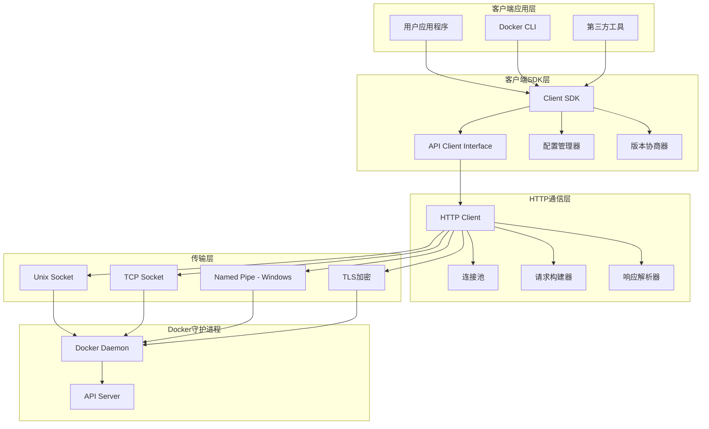
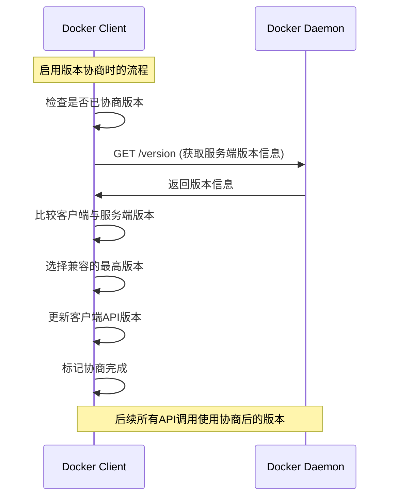
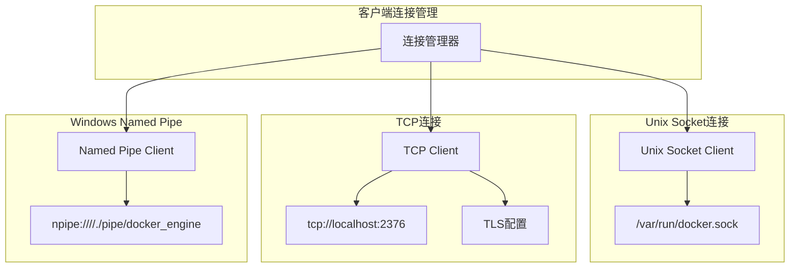

# Moby项目源码剖析 - 客户端SDK模块

## 1. 客户端架构概述

### 1.1 设计理念
Moby客户端SDK采用简洁的设计理念，为开发者提供易用的Go语言接口来与Docker守护进程交互：

- **简单易用**: 提供直观的API接口，隐藏底层HTTP通信复杂性
- **版本兼容**: 支持API版本自动协商和向后兼容
- **类型安全**: 使用强类型定义，避免运行时错误
- **可配置性**: 支持多种连接方式和配置选项
- **错误处理**: 统一的错误处理机制，提供详细的错误信息

### 1.2 客户端架构设计



## 2. Client核心结构分析

### 2.1 Client结构体定义

```go
// 文件路径: client/client.go
// Client 是执行所有Docker操作的API客户端核心结构

type Client struct {
	clientConfig                      // 嵌入客户端配置

	// API版本协商相关
	negotiated    atomic.Bool         // 是否已完成版本协商的原子标志
	negotiateLock sync.Mutex          // 版本协商过程的单飞锁，避免并发协商

	// HTTP传输层管理
	// 当客户端传输是*http.Transport（默认）时，需要做一些额外操作（如关闭空闲连接）
	// 存储原始传输，因为http.Client的传输会被链路追踪库包装
	baseTransport *http.Transport
}

// clientConfig 包含客户端的所有配置信息
type clientConfig struct {
	host      string              // Docker守护进程地址
	version   string              // API版本
	client    *http.Client        // HTTP客户端
	proto     string              // 协议类型（unix, tcp等）
	addr      string              // 连接地址
	basePath  string              // API基础路径
	scheme    string              // URL协议方案
	customHTTPHeaders map[string]string // 自定义HTTP头
	manualOverride    bool        // 手动覆盖标志
}
```

### 2.2 客户端创建流程

#### 2.2.1 NewClientWithOpts 主要构造函数

```go
// NewClientWithOpts 是创建Docker客户端的主要方法
// 支持多种配置选项，提供灵活的初始化方式
func NewClientWithOpts(ops ...Opt) (*Client, error) {
	// 1. 创建默认客户端配置
	clientConfig := clientConfig{
		host:    DefaultDockerHost,              // 默认为Unix socket
		version: MaxAPIVersion,                  // 使用最高支持的API版本
		scheme:  "http",                        // 默认HTTP协议
		client:  defaultHTTPClient(DefaultDockerHost, nil, nil), // 默认HTTP客户端
	}

	// 2. 应用配置选项
	for _, op := range ops {
		if err := op(&clientConfig); err != nil {
			return nil, err
		}
	}

	// 3. 创建HTTP客户端（如果未指定）
	if clientConfig.client == nil {
		httpClient, err := newHTTPClient(clientConfig.host, clientConfig.version)
		if err != nil {
			return nil, err
		}
		clientConfig.client = httpClient
	}

	// 4. 解析主机地址和协议
	proto, addr, basePath, err := parseHost(clientConfig.host)
	if err != nil {
		return nil, err
	}

	clientConfig.proto = proto
	clientConfig.addr = addr
	clientConfig.basePath = basePath

	// 5. 创建Client实例
	client := &Client{
		clientConfig: clientConfig,
	}

	// 6. 保存基础传输层（用于后续资源清理）
	if t, ok := client.client.Transport.(*http.Transport); ok {
		client.baseTransport = t
	}

	return client, nil
}
```

#### 2.2.2 配置选项模式实现

```go
// Opt 定义客户端配置选项的函数类型
// 使用函数式选项模式，提供灵活的配置方式
type Opt func(*clientConfig) error

// FromEnv 从环境变量配置客户端
// 读取DOCKER_HOST, DOCKER_API_VERSION, DOCKER_CERT_PATH等环境变量
func FromEnv(c *clientConfig) error {
	// 读取Docker主机地址
	if dockerHost := os.Getenv("DOCKER_HOST"); dockerHost != "" {
		c.host = dockerHost
	}

	// 读取API版本
	if version := os.Getenv("DOCKER_API_VERSION"); version != "" {
		if !isValidVersion(version) {
			return fmt.Errorf("environment variable DOCKER_API_VERSION (%s) is not a valid version", version)
		}
		c.version = version
		c.manualOverride = true
	}

	// 读取TLS配置
	if dockerTLSVerify := os.Getenv("DOCKER_TLS_VERIFY"); dockerTLSVerify != "" {
		if dockerCertPath := os.Getenv("DOCKER_CERT_PATH"); dockerCertPath == "" {
			return errors.New("DOCKER_TLS_VERIFY specified, but no DOCKER_CERT_PATH environment variable")
		}
	}

	// 配置TLS
	if dockerCertPath := os.Getenv("DOCKER_CERT_PATH"); dockerCertPath != "" {
		tlsOptions := tlsconfig.Options{
			CAFile:             filepath.Join(dockerCertPath, "ca.pem"),
			CertFile:           filepath.Join(dockerCertPath, "cert.pem"),
			KeyFile:            filepath.Join(dockerCertPath, "key.pem"),
			InsecureSkipVerify: os.Getenv("DOCKER_TLS_VERIFY") == "",
		}
		
		tlsConfig, err := tlsconfig.Client(tlsOptions)
		if err != nil {
			return err
		}
		
		c.client = newHTTPClientWithTLS(c.host, tlsConfig)
	}

	return nil
}

// WithHost 设置Docker守护进程地址
func WithHost(host string) Opt {
	return func(c *clientConfig) error {
		hostURL, err := parseHostURL(host)
		if err != nil {
			return err
		}
		c.host = hostURL.String()
		return nil
	}
}

// WithVersion 设置API版本
func WithVersion(version string) Opt {
	return func(c *clientConfig) error {
		if !isValidVersion(version) {
			return fmt.Errorf("%s is not a valid version", version)
		}
		c.version = version
		c.manualOverride = true
		return nil
	}
}

// WithAPIVersionNegotiation 启用API版本自动协商
// 客户端会自动与服务器协商最佳的API版本
func WithAPIVersionNegotiation() Opt {
	return func(c *clientConfig) error {
		if c.manualOverride {
			return errors.New("API version negotiation cannot be enabled when the API version has been manually overridden")
		}
		c.negotiateVersion = true
		return nil
	}
}

// WithHTTPClient 使用自定义HTTP客户端
func WithHTTPClient(client *http.Client) Opt {
	return func(c *clientConfig) error {
		if client != nil {
			c.client = client
		}
		return nil
	}
}

// WithTimeout 设置请求超时时间
func WithTimeout(timeout time.Duration) Opt {
	return func(c *clientConfig) error {
		c.client.Timeout = timeout
		return nil
	}
}
```

### 2.3 HTTP请求处理机制

#### 2.3.1 请求发送核心函数

```go
// 文件路径: client/request.go
// sendRequest 是所有HTTP请求的核心发送函数
// 处理请求构建、发送、错误处理等完整流程
func (cli *Client) sendRequest(ctx context.Context, method, path string, query url.Values, body io.Reader, headers http.Header) (*http.Response, error) {
	// 1. API版本协商（如果启用且未完成）
	if err := cli.checkVersion(ctx); err != nil {
		return nil, err
	}

	// 2. 构建完整的请求URL
	req, err := cli.buildRequest(ctx, method, path, body, headers)
	if err != nil {
		return nil, err
	}

	// 3. 添加查询参数
	if query != nil {
		req.URL.RawQuery = query.Encode()
	}

	// 4. 发送HTTP请求
	resp, err := cli.client.Do(req)
	if err != nil {
		// 处理连接错误
		if err, ok := err.(net.Error); ok {
			if err.Timeout() {
				return nil, errors.New("request timeout")
			}
		}
		
		// 处理上下文取消
		if errors.Is(err, context.Canceled) {
			return nil, err
		}
		
		return nil, fmt.Errorf("error during request: %v", err)
	}

	// 5. 检查HTTP状态码和错误响应
	if err := cli.checkResponseError(resp); err != nil {
		resp.Body.Close()
		return nil, err
	}

	return resp, nil
}

// buildRequest 构建HTTP请求对象
func (cli *Client) buildRequest(ctx context.Context, method, path string, body io.Reader, headers http.Header) (*http.Request, error) {
	// 1. 构建请求URL
	apiURL := &url.URL{
		Scheme: cli.scheme,
		Host:   DummyHost, // 对于Unix socket使用虚拟主机名
		Path:   cli.basePath + path,
	}

	// 2. 创建HTTP请求
	req, err := http.NewRequestWithContext(ctx, method, apiURL.String(), body)
	if err != nil {
		return nil, err
	}

	// 3. 设置请求头
	req.Host = cli.addr
	req.Header.Set("User-Agent", "Docker-Client/"+cli.version+" ("+runtime.GOOS+")")
	
	// 添加自定义头
	for k, v := range cli.customHTTPHeaders {
		req.Header.Set(k, v)
	}
	
	// 添加传入的头
	for k, v := range headers {
		req.Header[k] = v
	}

	return req, nil
}

// checkResponseError 检查响应错误
func (cli *Client) checkResponseError(resp *http.Response) error {
	if resp.StatusCode >= 400 {
		body, err := io.ReadAll(resp.Body)
		if err != nil {
			return fmt.Errorf("HTTP %d: unable to read body", resp.StatusCode)
		}

		var errorResponse common.ErrorResponse
		if err := json.Unmarshal(body, &errorResponse); err != nil {
			return fmt.Errorf("HTTP %d: %s", resp.StatusCode, string(body))
		}

		return fmt.Errorf("HTTP %d: %s", resp.StatusCode, errorResponse.Message)
	}
	return nil
}
```

#### 2.3.2 便捷HTTP方法

```go
// GET请求方法
func (cli *Client) get(ctx context.Context, path string, query url.Values, headers http.Header) (*http.Response, error) {
	return cli.sendRequest(ctx, http.MethodGet, path, query, nil, headers)
}

// POST请求方法（JSON体）
func (cli *Client) post(ctx context.Context, path string, query url.Values, body any, headers http.Header) (*http.Response, error) {
	jsonBody, headers, err := prepareJSONRequest(body, headers)
	if err != nil {
		return nil, err
	}
	return cli.sendRequest(ctx, http.MethodPost, path, query, jsonBody, headers)
}

// POST请求方法（原始体）
func (cli *Client) postRaw(ctx context.Context, path string, query url.Values, body io.Reader, headers http.Header) (*http.Response, error) {
	return cli.sendRequest(ctx, http.MethodPost, path, query, body, headers)
}

// PUT请求方法
func (cli *Client) put(ctx context.Context, path string, query url.Values, body any, headers http.Header) (*http.Response, error) {
	jsonBody, headers, err := prepareJSONRequest(body, headers)
	if err != nil {
		return nil, err
	}
	return cli.putRaw(ctx, path, query, jsonBody, headers)
}

// DELETE请求方法
func (cli *Client) delete(ctx context.Context, path string, query url.Values, headers http.Header) (*http.Response, error) {
	return cli.sendRequest(ctx, http.MethodDelete, path, query, nil, headers)
}

// HEAD请求方法
func (cli *Client) head(ctx context.Context, path string, query url.Values, headers http.Header) (*http.Response, error) {
	return cli.sendRequest(ctx, http.MethodHead, path, query, nil, headers)
}
```

## 3. API版本协商机制

### 3.1 版本协商流程



### 3.2 版本协商实现

```go
// NegotiateAPIVersion 执行API版本协商
// 查询服务器支持的API版本，选择客户端和服务器都支持的最高版本
func (cli *Client) NegotiateAPIVersion(ctx context.Context) {
	// 单飞模式确保只执行一次版本协商
	cli.negotiateLock.Lock()
	defer cli.negotiateLock.Unlock()

	// 检查是否已完成协商
	if cli.negotiated.Load() {
		return
	}

	// 1. 获取服务器版本信息
	ping, _ := cli.ping(ctx)
	
	// 2. 确定协商后的版本
	negotiatedVersion := cli.getAPIVersion(ping)
	
	// 3. 更新客户端版本
	cli.version = negotiatedVersion
	cli.negotiated.Store(true)
}

// getAPIVersion 根据ping响应确定API版本
func (cli *Client) getAPIVersion(ping types.Ping) string {
	// 如果服务器提供了API版本信息
	if ping.APIVersion != "" {
		// 选择客户端和服务器都支持的最高版本
		if versions.LessThan(ping.APIVersion, cli.version) {
			return ping.APIVersion // 服务器版本较低，使用服务器版本
		}
		return cli.version // 客户端版本较低或相等，使用客户端版本
	}
	
	// 服务器未提供版本信息，使用fallback版本
	return fallbackAPIVersion
}

// checkVersion 检查并执行版本协商（如果需要）
func (cli *Client) checkVersion(ctx context.Context) error {
	if cli.negotiateVersion && !cli.negotiated.Load() {
		cli.NegotiateAPIVersion(ctx)
	}
	return nil
}

// ClientVersion 返回客户端使用的API版本
func (cli *Client) ClientVersion() string {
	return cli.version
}

// ServerVersion 获取服务器版本信息
func (cli *Client) ServerVersion(ctx context.Context) (types.Version, error) {
	resp, err := cli.get(ctx, "/version", nil, nil)
	if err != nil {
		return types.Version{}, err
	}
	defer ensureReaderClosed(resp)

	var server types.Version
	err = json.NewDecoder(resp.Body).Decode(&server)
	return server, err
}
```

## 4. 容器操作API实现

### 4.1 容器创建API

```go
// 文件路径: client/container_create.go
// ContainerCreate 创建新容器
// 这是客户端最复杂的API之一，需要处理多种配置和版本兼容性
func (cli *Client) ContainerCreate(ctx context.Context, config *container.Config, hostConfig *container.HostConfig, networkingConfig *network.NetworkingConfig, platform *ocispec.Platform, containerName string) (container.CreateResponse, error) {
	// 1. 参数验证
	if config == nil {
		return container.CreateResponse{}, cerrdefs.ErrInvalidArgument.WithMessage("config is nil")
	}

	var response container.CreateResponse

	// 2. 版本检查（确保API版本协商已完成）
	if err := cli.checkVersion(ctx); err != nil {
		return response, err
	}

	// 3. API版本兼容性处理
	// 检查StopTimeout功能是否支持（API 1.25+）
	if err := cli.NewVersionError(ctx, "1.25", "stop timeout"); config.StopTimeout != nil && err != nil {
		return response, err
	}
	
	// 检查平台指定功能是否支持（API 1.41+）
	if err := cli.NewVersionError(ctx, "1.41", "specify container image platform"); platform != nil && err != nil {
		return response, err
	}
	
	// 检查健康检查间隔功能是否支持（API 1.44+）
	if err := cli.NewVersionError(ctx, "1.44", "specify health-check start interval"); config.Healthcheck != nil && config.Healthcheck.StartInterval != 0 && err != nil {
		return response, err
	}

	// 4. 主机配置兼容性处理
	if hostConfig != nil {
		// API 1.25以下版本不支持AutoRemove
		if versions.LessThan(cli.ClientVersion(), "1.25") {
			hostConfig.AutoRemove = false
		}
		
		// Linux平台且API 1.42以下不支持ConsoleSize
		if platform != nil && platform.OS == "linux" && versions.LessThan(cli.ClientVersion(), "1.42") {
			hostConfig.ConsoleSize = [2]uint{0, 0}
		}

		// 处理挂载选项的版本兼容性
		if versions.LessThan(cli.ClientVersion(), "1.44") {
			for _, m := range hostConfig.Mounts {
				if m.BindOptions != nil {
					if m.BindOptions.ReadOnlyForceRecursive {
						return response, errors.New("bind-recursive=readonly requires API v1.44 or later")
					}
					if m.BindOptions.NonRecursive && versions.LessThan(cli.ClientVersion(), "1.40") {
						return response, errors.New("bind-recursive=disabled requires API v1.40 or later")
					}
				}
			}
		}

		// 标准化能力（capabilities）
		hostConfig.CapAdd = normalizeCapabilities(hostConfig.CapAdd)
		hostConfig.CapDrop = normalizeCapabilities(hostConfig.CapDrop)
	}

	// 5. MAC地址兼容性处理
	// API 1.44+ 容器级MAC地址被废弃
	if versions.GreaterThanOrEqualTo(cli.ClientVersion(), "1.44") {
		config.MacAddress = ""
	}

	// 6. 构建查询参数
	query := url.Values{}
	if platform != nil {
		if p := formatPlatform(*platform); p != "unknown" {
			query.Set("platform", p)
		}
	}

	if containerName != "" {
		query.Set("name", containerName)
	}

	// 7. 构建请求体
	body := container.CreateRequest{
		Config:           config,
		HostConfig:       hostConfig,
		NetworkingConfig: networkingConfig,
	}

	// 8. 发送HTTP请求
	resp, err := cli.post(ctx, "/containers/create", query, body, nil)
	defer ensureReaderClosed(resp)
	if err != nil {
		return response, err
	}

	// 9. 解析响应
	err = json.NewDecoder(resp.Body).Decode(&response)
	return response, err
}
```

### 4.2 容器操作API实现

```go
// ContainerStart 启动容器
func (cli *Client) ContainerStart(ctx context.Context, containerID string, options container.StartOptions) error {
	// 构建查询参数
	query := url.Values{}
	if len(options.CheckpointID) != 0 {
		query.Set("checkpoint", options.CheckpointID)
	}
	if len(options.CheckpointDir) != 0 {
		query.Set("checkpoint-dir", options.CheckpointDir)
	}

	// 发送POST请求
	resp, err := cli.post(ctx, "/containers/"+containerID+"/start", query, nil, nil)
	ensureReaderClosed(resp)
	return err
}

// ContainerStop 停止容器
func (cli *Client) ContainerStop(ctx context.Context, containerID string, options container.StopOptions) error {
	query := url.Values{}
	if options.Timeout != nil {
		query.Set("t", strconv.Itoa(*options.Timeout))
	}
	if options.Signal != "" {
		query.Set("signal", options.Signal)
	}

	resp, err := cli.post(ctx, "/containers/"+containerID+"/stop", query, nil, nil)
	ensureReaderClosed(resp)
	return err
}

// ContainerList 列出容器
func (cli *Client) ContainerList(ctx context.Context, options container.ListOptions) ([]types.Container, error) {
	query := url.Values{}

	if options.All {
		query.Set("all", "1")
	}

	if options.Limit != -1 {
		query.Set("limit", strconv.Itoa(options.Limit))
	}

	if options.Size {
		query.Set("size", "1")
	}

	if options.Since != "" {
		query.Set("since", options.Since)
	}

	if options.Before != "" {
		query.Set("before", options.Before)
	}

	if options.Filters.Len() > 0 {
		filterJSON, err := filters.ToJSON(options.Filters)
		if err != nil {
			return nil, err
		}
		query.Set("filters", filterJSON)
	}

	resp, err := cli.get(ctx, "/containers/json", query, nil)
	if err != nil {
		return nil, err
	}
	defer resp.Body.Close()

	var containers []types.Container
	err = json.NewDecoder(resp.Body).Decode(&containers)
	return containers, err
}

// ContainerRemove 删除容器
func (cli *Client) ContainerRemove(ctx context.Context, containerID string, options container.RemoveOptions) error {
	query := url.Values{}
	if options.RemoveVolumes {
		query.Set("v", "1")
	}
	if options.RemoveLinks {
		query.Set("link", "1")
	}
	if options.Force {
		query.Set("force", "1")
	}

	resp, err := cli.delete(ctx, "/containers/"+containerID, query, nil)
	ensureReaderClosed(resp)
	return err
}
```

## 5. 连接管理和传输层

### 5.1 连接类型支持



### 5.2 连接创建实现

```go
// parseHost 解析主机地址，支持多种连接类型
func parseHost(host string) (proto string, addr string, basePath string, err error) {
	var u *url.URL
	u, err = url.Parse(host)
	if err != nil {
		return "", "", "", err
	}

	switch u.Scheme {
	case "unix":
		// Unix socket连接
		return "unix", u.Path, "", nil
		
	case "tcp":
		// TCP连接
		return "tcp", u.Host, "", nil
		
	case "npipe":
		// Windows命名管道
		return "npipe", u.Path, "", nil
		
	case "fd":
		// 文件描述符连接
		return "fd", u.Path, "", nil
		
	case "ssh":
		// SSH连接（通过SSH隧道）
		return "ssh", u.Host, "", nil
		
	case "http", "https":
		// HTTP/HTTPS连接
		return u.Scheme, u.Host, u.Path, nil
		
	default:
		return "", "", "", fmt.Errorf("unsupported connection type %q", u.Scheme)
	}
}

// newHTTPClient 创建HTTP客户端
func newHTTPClient(host string, tlsConfig *tls.Config) (*http.Client, error) {
	proto, addr, _, err := parseHost(host)
	if err != nil {
		return nil, err
	}

	transport := &http.Transport{
		TLSClientConfig: tlsConfig,
	}

	switch proto {
	case "unix":
		// Unix socket连接配置
		transport.DialContext = func(ctx context.Context, network, addr string) (net.Conn, error) {
			return (&net.Dialer{}).DialContext(ctx, "unix", addr)
		}
		
	case "npipe":
		// Windows命名管道连接配置
		transport.DialContext = func(ctx context.Context, network, addr string) (net.Conn, error) {
			return winio.DialPipeContext(ctx, addr)
		}
		
	case "tcp":
		// TCP连接配置
		transport.DialContext = (&net.Dialer{
			Timeout:   30 * time.Second,
			KeepAlive: 30 * time.Second,
		}).DialContext
	}

	return &http.Client{
		Transport:     transport,
		CheckRedirect: CheckRedirect, // 自定义重定向处理
		Timeout:       0,             // 不设置全局超时，由请求上下文控制
	}, nil
}
```

## 6. 错误处理机制

### 6.1 错误类型定义

```go
// 客户端错误接口
type APIError interface {
	error
	StatusCode() int
}

// 版本错误
type versionError struct {
	requiredVersion string
	feature         string
}

func (e versionError) Error() string {
	return fmt.Sprintf("feature %q requires API version %s or higher", e.feature, e.requiredVersion)
}

// 连接错误
type connectionError struct {
	host string
	err  error
}

func (e connectionError) Error() string {
	return fmt.Sprintf("cannot connect to Docker daemon at %s: %v", e.host, e.err)
}
```

### 6.2 错误处理实现

```go
// NewVersionError 创建版本错误
func (cli *Client) NewVersionError(ctx context.Context, requiredVersion, feature string) error {
	if err := cli.checkVersion(ctx); err != nil {
		return err
	}
	
	if versions.LessThan(cli.version, requiredVersion) {
		return versionError{
			requiredVersion: requiredVersion,
			feature:         feature,
		}
	}
	return nil
}

// 统一错误处理函数
func (cli *Client) wrapError(err error) error {
	if err == nil {
		return nil
	}

	// 网络连接错误
	if netErr, ok := err.(net.Error); ok {
		if netErr.Timeout() {
			return fmt.Errorf("timeout: %v", err)
		}
		return connectionError{host: cli.host, err: err}
	}

	// 上下文取消错误
	if errors.Is(err, context.Canceled) {
		return err
	}

	// 其他错误
	return err
}
```

## 7. 实际使用示例

### 7.1 基础使用示例

```go
package main

import (
	"context"
	"fmt"
	"log"

	"github.com/moby/moby/client"
	"github.com/moby/moby/api/types/container"
	"github.com/moby/moby/api/types/image"
	"github.com/moby/moby/api/types/network"
	"github.com/docker/go-connections/nat"
)

func main() {
	// 1. 创建客户端（从环境变量配置）
	cli, err := client.NewClientWithOpts(
		client.FromEnv,                    // 从环境变量读取配置
		client.WithAPIVersionNegotiation(), // 启用API版本协商
	)
	if err != nil {
		log.Fatal("创建客户端失败:", err)
	}
	defer cli.Close()

	ctx := context.Background()

	// 2. 获取系统信息
	info, err := cli.Info(ctx)
	if err != nil {
		log.Fatal("获取系统信息失败:", err)
	}
	fmt.Printf("Docker版本: %s\n", info.ServerVersion)
	fmt.Printf("容器数量: %d\n", info.Containers)

	// 3. 拉取镜像
	fmt.Println("正在拉取nginx:latest镜像...")
	reader, err := cli.ImagePull(ctx, "nginx:latest", image.PullOptions{})
	if err != nil {
		log.Fatal("拉取镜像失败:", err)
	}
	defer reader.Close()
	
	// 显示拉取进度
	scanner := bufio.NewScanner(reader)
	for scanner.Scan() {
		var progress struct {
			Status   string `json:"status"`
			Progress string `json:"progress,omitempty"`
		}
		json.Unmarshal(scanner.Bytes(), &progress)
		if progress.Progress != "" {
			fmt.Printf("\r%s: %s", progress.Status, progress.Progress)
		} else {
			fmt.Println(progress.Status)
		}
	}

	// 4. 创建容器
	containerConfig := &container.Config{
		Image:        "nginx:latest",
		ExposedPorts: nat.PortSet{"80/tcp": struct{}{}},
		Labels: map[string]string{
			"example": "client-demo",
		},
	}

	hostConfig := &container.HostConfig{
		PortBindings: nat.PortMap{
			"80/tcp": []nat.PortBinding{
				{HostIP: "0.0.0.0", HostPort: "8080"},
			},
		},
		RestartPolicy: container.RestartPolicy{
			Name: "unless-stopped",
		},
	}

	networkingConfig := &network.NetworkingConfig{}

	resp, err := cli.ContainerCreate(
		ctx,
		containerConfig,
		hostConfig,
		networkingConfig,
		nil,
		"nginx-demo",
	)
	if err != nil {
		log.Fatal("创建容器失败:", err)
	}

	fmt.Printf("容器已创建，ID: %s\n", resp.ID)

	// 5. 启动容器
	if err := cli.ContainerStart(ctx, resp.ID, container.StartOptions{}); err != nil {
		log.Fatal("启动容器失败:", err)
	}
	fmt.Println("容器已启动")

	// 6. 获取容器日志
	logOptions := container.LogsOptions{
		ShowStdout: true,
		ShowStderr: true,
		Follow:     false,
		Tail:       "10",
	}

	logReader, err := cli.ContainerLogs(ctx, resp.ID, logOptions)
	if err != nil {
		log.Fatal("获取容器日志失败:", err)
	}
	defer logReader.Close()

	fmt.Println("容器日志:")
	io.Copy(os.Stdout, logReader)

	// 7. 列出运行中的容器
	containers, err := cli.ContainerList(ctx, container.ListOptions{})
	if err != nil {
		log.Fatal("列出容器失败:", err)
	}

	fmt.Printf("\n运行中的容器 (%d个):\n", len(containers))
	for _, c := range containers {
		fmt.Printf("- %s: %s (%s)\n", 
			c.Names[0], c.Image, c.State)
	}
}
```

### 7.2 高级配置示例

```go
package main

import (
	"context"
	"crypto/tls"
	"net/http"
	"time"

	"github.com/moby/moby/client"
)

func createAdvancedClient() (*client.Client, error) {
	// 创建自定义TLS配置
	tlsConfig := &tls.Config{
		InsecureSkipVerify: false,
		MinVersion:         tls.VersionTLS12,
	}

	// 创建自定义HTTP传输
	transport := &http.Transport{
		TLSClientConfig:     tlsConfig,
		MaxIdleConns:        10,
		IdleConnTimeout:     30 * time.Second,
		DisableCompression:  true,
	}

	// 创建自定义HTTP客户端
	httpClient := &http.Client{
		Transport: transport,
		Timeout:   60 * time.Second,
	}

	// 创建Docker客户端
	cli, err := client.NewClientWithOpts(
		client.WithHost("tcp://remote-docker:2376"),    // 远程Docker主机
		client.WithVersion("1.52"),                     // 指定API版本
		client.WithHTTPClient(httpClient),              // 自定义HTTP客户端
		client.WithHTTPHeaders(map[string]string{       // 自定义HTTP头
			"X-Custom-Header": "my-value",
		}),
	)
	if err != nil {
		return nil, err
	}

	return cli, nil
}

// 带上下文和超时的操作示例
func containerOperationWithTimeout() error {
	cli, err := createAdvancedClient()
	if err != nil {
		return err
	}
	defer cli.Close()

	// 创建带超时的上下文
	ctx, cancel := context.WithTimeout(context.Background(), 30*time.Second)
	defer cancel()

	// 执行操作
	containers, err := cli.ContainerList(ctx, container.ListOptions{All: true})
	if err != nil {
		return err
	}

	fmt.Printf("找到 %d 个容器\n", len(containers))
	return nil
}
```

通过这个详细的客户端SDK分析，我们可以看到Moby客户端采用了优雅的设计模式，提供了丰富的配置选项和强大的功能，使得开发者可以轻松地与Docker守护进程进行交互。
