# docker-05-volume

## 模块概览

## 模块定位与职责

### 职责边界

volume 模块负责容器卷的完整生命周期管理，提供持久化存储能力：

1. **卷生命周期管理**：
   - 创建卷（命名卷/匿名卷）
   - 删除卷（引用计数保护）
   - 列出卷（支持过滤）
   - 检查卷详情

2. **卷挂载管理**：
   - 挂载卷到容器（引用计数）
   - 卸载卷（自动清理）
   - 支持子路径挂载
   - 支持只读挂载

3. **卷驱动管理**：
   - 内置 local 驱动（本地目录）
   - 插件驱动（NFS/Ceph/...）
   - 驱动发现与注册
   - 驱动能力查询

4. **卷存储管理**：
   - 卷元数据存储（BoltDB）
   - 卷引用追踪（容器引用）
   - 卷垃圾回收（删除未使用卷）
   - 卷备份与迁移

### 上下游依赖

**上游调用方**：

- Volume Router：处理卷相关的 HTTP API
- Daemon：容器创建时需要挂载卷
- Container：容器启动时挂载卷

**下游被依赖方**：

- Volume Drivers（local/插件驱动）
- PluginManager：管理卷插件
- 文件系统：实际的数据存储

---

## 模块架构图

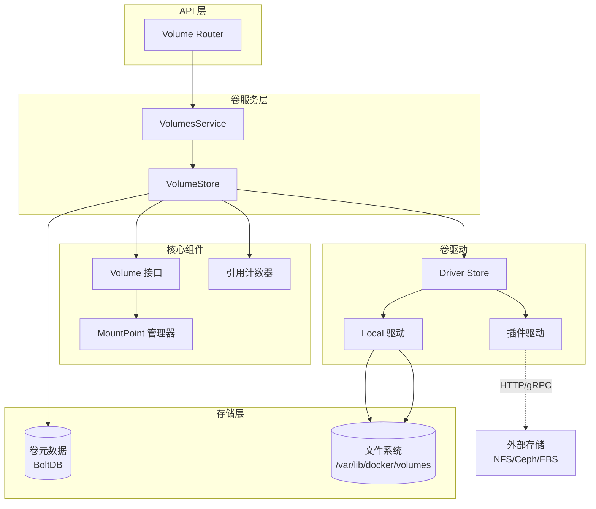
```mermaid
flowchart TB
    subgraph API["API 层"]
        VolumeRouter[Volume Router]
    end
    
    subgraph Service["卷服务层"]
        VolumesService[VolumesService]
        VolumeStore[VolumeStore]
    end
    
    subgraph Core["核心组件"]
        Volume[Volume 接口]
        MountPoint[MountPoint 管理器]
        RefCounter[引用计数器]
    end
    
    subgraph Drivers["卷驱动"]
        DriverStore[Driver Store]
        LocalDriver[Local 驱动]
        PluginDriver[插件驱动]
    end
    
    subgraph Storage["存储层"]
        Metadata[(卷元数据<br/>BoltDB)]
        FileSystem[(文件系统<br/>/var/lib/docker/volumes)]
    end
    
    VolumeRouter --> VolumesService
    VolumesService --> VolumeStore
    
    VolumeStore --> Volume
    VolumeStore --> DriverStore
    VolumeStore --> RefCounter
    
    Volume --> MountPoint
    
    DriverStore --> LocalDriver
    DriverStore --> PluginDriver
    
    LocalDriver --> FileSystem
    PluginDriver -.HTTP/gRPC.-> ExternalDriver[外部存储<br/>NFS/Ceph/EBS]
    
    VolumeStore --> Metadata
    LocalDriver --> FileSystem
```

### 架构说明

**1. 卷服务层**：

- **VolumesService**：对外统一接口

  ```go
  type VolumesService struct {
      vs           *VolumeStore
      ds           driverLister
      pruneRunning atomic.Bool
      eventLogger  VolumeEventLogger
  }
```

- **VolumeStore**：卷存储管理

  ```go
  type VolumeStore struct {
      locks   *locker.Locker
      volumes map[string]*volumeMetadata
      names   map[string]volume.Volume
      refs    map[string][]string  // volumeName -> []containerID
      drivers *drivers.Store
      db      *bolt.DB
  }
```

**2. 核心组件**：

- **Volume 接口**：统一的卷抽象

  ```go
  type Volume interface {
      Name() string
      DriverName() string
      Path() string
      Mount(id string) (string, error)
      Unmount(id string) error
      Status() map[string]interface{}
  }
```

- **MountPoint**：容器挂载点

  ```go
  type MountPoint struct {
      Type        mount.Type      // bind/volume/tmpfs
      Name        string          // 卷名称
      Source      string          // 源路径
      Destination string          // 容器内路径
      Driver      string          // 驱动名称
      RW          bool            // 读写权限
      Volume      volume.Volume   // 卷对象
      Propagation mount.Propagation
  }
```

- **引用计数器**：防止正在使用的卷被删除

  ```go
  type refCounter struct {
      refs map[string]map[string]struct{}  // volumeName -> set(refID)
      mu   sync.Mutex
  }
  
  func (rc *refCounter) Add(volume, ref string) {
      rc.refs[volume][ref] = struct{}{}
  }
  
  func (rc *refCounter) HasRef(volume string) bool {
      return len(rc.refs[volume]) > 0
  }
```

**3. 卷驱动**：

- **Local 驱动**：
  - 数据存储：`/var/lib/docker/volumes/<volume-name>/_data`
  - 元数据：`/var/lib/docker/volumes/<volume-name>/_meta.json`
  - 支持配额限制（Linux quota）
  - 支持用户命名空间映射

- **插件驱动**：
  - 通过 HTTP/gRPC 与外部驱动通信
  - 支持远程存储（NFS/Ceph/EBS/Azure Disk）
  - 驱动能力查询（Scope: local/global）
  - 驱动配置传递

---

## 卷创建与挂载时序图

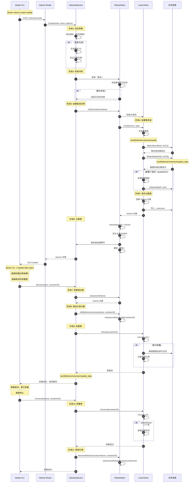
```mermaid
sequenceDiagram
    autonumber
    participant Client as docker CLI
    participant Router as Volume Router
    participant Service as VolumesService
    participant Store as VolumeStore
    participant Driver as Local Driver
    participant FS as 文件系统
    
    Note over Client: docker volume create mydata
    Client->>Router: POST /volumes/create
    Router->>Service: Create(name, driver, options)
    
    Note over Service: 阶段1: 验证参数
    Service->>Service: 验证卷名（字符限制）
    alt 名称为空
        Service->>Service: 生成随机 ID
        Service->>Service: 标记为匿名卷
    end
    
    Note over Service: 阶段2: 检查冲突
    Service->>Store: 加锁（卷名）
    Store->>Store: 检查卷是否已存在
    alt 卷已存在
        Store-->>Service: 返回已存在的卷
    end
    
    Note over Service: 阶段3: 创建驱动实例
    Service->>Store: GetDriver(driverName)
    Store->>Driver: 初始化驱动
    
    Note over Driver: 阶段4: 创建卷目录
    Store->>Driver: Create(name, opts)
    Driver->>Driver: 生成卷路径
    Note over Driver: /var/lib/docker/volumes/mydata
    
    Driver->>FS: MkdirAll(rootPath, 0o701)
    FS-->>Driver: 根目录创建成功
    
    Driver->>FS: MkdirAll(dataPath, 0o755)
    Note over FS: /var/lib/docker/volumes/mydata/_data
    FS-->>Driver: 数据目录创建成功
    
    alt 配置了选项（quota/size）
        Driver->>Driver: 设置配额限制
        Driver->>FS: setQuota(path, size)
    end
    
    Note over Driver: 阶段5: 保存元数据
    Driver->>Driver: 创建 Volume 对象
    Driver->>FS: 写入 _meta.json
    Driver-->>Store: Volume 对象
    
    Note over Service: 阶段6: 注册卷
    Store->>Store: volumes[name] = volume
    Store->>Store: 持久化到 BoltDB
    Store->>Service: 触发卷创建事件
    Store->>Store: 解锁（卷名）
    
    Service-->>Router: Volume 详情
    Router-->>Client: 201 Created
    
    Note over Client: docker run -v mydata:/data nginx
    Note over Client: (容器创建过程省略)
    
    Note over Client: 容器启动时挂载卷
    Client->>Service: Mount(volume, containerID)
    
    Note over Service: 阶段7: 获取卷对象
    Service->>Store: Get(volumeName)
    Store-->>Service: Volume 对象
    
    Note over Service: 阶段8: 增加引用计数
    Service->>Store: AddReference(volumeName, containerID)
    Store->>Store: refs[volumeName].Add(containerID)
    
    Note over Service: 阶段9: 挂载卷
    Service->>Driver: Mount(containerID)
    Driver->>Driver: mountCount++
    
    alt 首次挂载
        Driver->>FS: 确保数据目录可访问
        Driver->>Driver: 记录挂载引用
    end
    
    Driver-->>Service: 卷路径
    Note over Service: /var/lib/docker/volumes/mydata/_data
    
    Service-->>Client: 挂载成功，返回路径
    
    Note over Client: 容器启动，卷已挂载
    
    Note over Client: 容器停止
    Client->>Service: Unmount(volume, containerID)
    
    Note over Service: 阶段10: 卸载卷
    Service->>Driver: Unmount(containerID)
    Driver->>Driver: mountCount--
    
    alt mountCount == 0
        Driver->>Driver: 清理挂载状态
    end
    
    Driver-->>Service: 卸载成功
    
    Note over Service: 阶段11: 释放引用
    Service->>Store: RemoveReference(volumeName, containerID)
    Store->>Store: refs[volumeName].Remove(containerID)
    
    Service-->>Client: 卸载成功
```

### 时序图关键点说明

**阶段1-2：验证与冲突检查（5-10ms）**

- 卷名验证：
  - 长度限制：1-255 字符
  - 字符限制：字母、数字、`-`、`_`、`.`
  - Windows：不允许 `:` 和 `\`
- 匿名卷：
  - 未指定名称时自动生成 64 位十六进制 ID
  - 添加标签 `com.docker.volume.anonymous=""`
  - 容器删除时自动清理

**阶段3：驱动选择（<1ms）**

```go
// 驱动优先级
if driverName == "" {
    driverName = "local"  // 默认驱动
}

driver, err := s.drivers.CreateDriver(driverName)
```

**阶段4：创建卷目录（10-30ms）**

```bash
# Local 驱动的目录结构
/var/lib/docker/volumes/mydata/
├── _data/           # 实际数据目录（容器挂载点）
└── _meta.json       # 元数据（驱动、选项、创建时间）
```

**_meta.json 内容示例**：

```json
{
  "Driver": "local",
  "Labels": {},
  "Options": {},
  "CreatedAt": "2023-01-01T00:00:00Z"
}
```

**阶段5-6：元数据持久化（5-15ms）**

```go
// VolumeStore 持久化
func (s *VolumeStore) save(v volume.Volume) error {
    return s.db.Update(func(tx *bolt.Tx) error {
        b := tx.Bucket([]byte("volumes"))
        data := marshalVolume(v)
        return b.Put([]byte(v.Name()), data)
    })
}
```

**阶段7-9：挂载卷（20-50ms）**

- 引用计数：

  ```go
  // 防止正在使用的卷被删除
  type volumeMetadata struct {
      volume volume.Volume
      refs   map[string]struct{}  // containerID -> struct{}
  }
  
  func (vm *volumeMetadata) HasRefs() bool {
      return len(vm.refs) > 0
  }
```

- 挂载流程：
  1. 获取卷对象（从 Store）
  2. 增加引用计数（volumeName -> containerID）
  3. 调用驱动的 Mount 方法（返回宿主机路径）
  4. 容器启动时 bind mount 到容器内

**阶段10-11：卸载与引用释放（5-10ms）**

- 卸载条件：
  - 容器停止时自动卸载
  - 引用计数递减
  - 当引用计数为 0 时，卷可被删除

---

## 卷类型对比

| 特性 | 命名卷 | 匿名卷 | Bind Mount | Tmpfs Mount |
|---|---|---|---|---|
| **创建方式** | `docker volume create` | `-v /data` | `-v /host:/data` | `--tmpfs /data` |
| **持久化** | ✓ | ✓ | ✓ | ✗（内存中） |
| **容器删除后保留** | ✓ | ✗ | ✓ | ✗ |
| **权限管理** | Docker 管理 | Docker 管理 | 宿主机权限 | 容器内权限 |
| **跨容器共享** | ✓ | ✗ | ✓ | ✗ |
| **驱动支持** | ✓ | ✓ | ✗ | ✗ |
| **备份迁移** | 易 | 易 | 难 | 不可用 |
| **用例** | 生产环境数据 | 临时数据 | 开发环境 | 临时缓存 |

---

## 卷驱动插件机制

### 插件通信协议

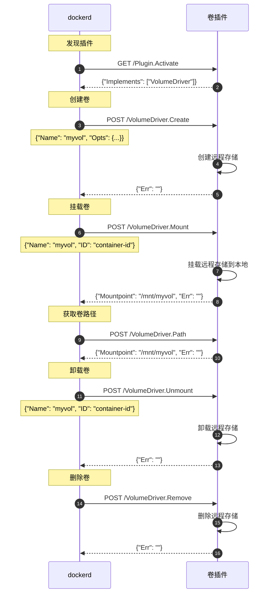
```mermaid
sequenceDiagram
    autonumber
    participant Docker as dockerd
    participant Plugin as 卷插件
    
    Note over Docker: 发现插件
    Docker->>Plugin: GET /Plugin.Activate
    Plugin-->>Docker: {"Implements": ["VolumeDriver"]}
    
    Note over Docker: 创建卷
    Docker->>Plugin: POST /VolumeDriver.Create
    Note over Docker: {"Name": "myvol", "Opts": {...}}
    Plugin->>Plugin: 创建远程存储
    Plugin-->>Docker: {"Err": ""}
    
    Note over Docker: 挂载卷
    Docker->>Plugin: POST /VolumeDriver.Mount
    Note over Docker: {"Name": "myvol", "ID": "container-id"}
    Plugin->>Plugin: 挂载远程存储到本地
    Plugin-->>Docker: {"Mountpoint": "/mnt/myvol", "Err": ""}
    
    Note over Docker: 获取卷路径
    Docker->>Plugin: POST /VolumeDriver.Path
    Plugin-->>Docker: {"Mountpoint": "/mnt/myvol", "Err": ""}
    
    Note over Docker: 卸载卷
    Docker->>Plugin: POST /VolumeDriver.Unmount
    Note over Docker: {"Name": "myvol", "ID": "container-id"}
    Plugin->>Plugin: 卸载远程存储
    Plugin-->>Docker: {"Err": ""}
    
    Note over Docker: 删除卷
    Docker->>Plugin: POST /VolumeDriver.Remove
    Plugin->>Plugin: 删除远程存储
    Plugin-->>Docker: {"Err": ""}
```

### 插件接口定义

```go
// VolumeDriver 插件接口
type VolumeDriver interface {
    // Create 创建卷
    Create(req *CreateRequest) error
    
    // Remove 删除卷
    Remove(req *RemoveRequest) error
    
    // Mount 挂载卷，返回挂载点路径
    Mount(req *MountRequest) (*MountResponse, error)
    
    // Unmount 卸载卷
    Unmount(req *UnmountRequest) error
    
    // Get 获取卷详情
    Get(req *GetRequest) (*GetResponse, error)
    
    // List 列出所有卷
    List() (*ListResponse, error)
    
    // Path 获取卷在宿主机的路径
    Path(req *PathRequest) (*PathResponse, error)
    
    // Capabilities 查询驱动能力
    Capabilities() (*CapabilitiesResponse, error)
}
```

### 插件能力

```go
type CapabilitiesResponse struct {
    Capabilities Capability
}

type Capability struct {
    // Scope 卷的作用域
    // - local: 仅本地节点可访问
    // - global: 集群所有节点可访问
    Scope string  // "local" | "global"
}
```

---

## 性能优化

### 卷引用计数优化

```go
// 使用 sync.Map 减少锁竞争
type refCounter struct {
    refs sync.Map  // volumeName -> sync.Map(refID -> struct{})
}

func (rc *refCounter) Add(volume, ref string) {
    refs, _ := rc.refs.LoadOrStore(volume, &sync.Map{})
    refs.(*sync.Map).Store(ref, struct{}{})
}

func (rc *refCounter) HasRef(volume string) bool {
    refs, ok := rc.refs.Load(volume)
    if !ok {
        return false
    }
    
    hasRef := false
    refs.(*sync.Map).Range(func(_, _ interface{}) bool {
        hasRef = true
        return false  // 找到一个引用即可停止
    })
    return hasRef
}
```

### 卷元数据缓存

```go
// 缓存卷元数据，避免频繁读取文件系统
type volumeCache struct {
    cache map[string]*cachedVolume
    mu    sync.RWMutex
    ttl   time.Duration
}

type cachedVolume struct {
    volume    volume.Volume
    expiresAt time.Time
}

func (vc *volumeCache) Get(name string) (volume.Volume, bool) {
    vc.mu.RLock()
    defer vc.mu.RUnlock()
    
    if cv, ok := vc.cache[name]; ok {
        if time.Now().Before(cv.expiresAt) {
            return cv.volume, true
        }
    }
    return nil, false
}
```

### 并发挂载优化

```go
// 使用 singleflight 避免重复挂载
type mountManager struct {
    group singleflight.Group
}

func (mm *mountManager) Mount(ctx context.Context, vol volume.Volume, ref string) (string, error) {
    key := vol.Name() + ":" + ref
    
    result, err, _ := mm.group.Do(key, func() (interface{}, error) {
        return vol.Mount(ref)
    })
    
    if err != nil {
        return "", err
    }
    return result.(string), nil
}
```

---

## 最佳实践

### 命名卷 vs 匿名卷

```bash
# 推荐：命名卷（持久化、易管理）
docker volume create mydata
docker run -v mydata:/data nginx

# 不推荐：匿名卷（容器删除后丢失）
docker run -v /data nginx
```

### 卷备份与恢复

```bash
# 备份卷数据
docker run --rm \
  -v mydata:/data \
  -v $(pwd):/backup \
  alpine tar czf /backup/mydata.tar.gz -C /data .

# 恢复卷数据
docker run --rm \
  -v mydata:/data \
  -v $(pwd):/backup \
  alpine tar xzf /backup/mydata.tar.gz -C /data
```

### 卷迁移

```bash
# 方式1: 使用 docker volume export/import（需插件支持）
docker volume export mydata > mydata.tar
docker volume import mydata < mydata.tar

# 方式2: 使用容器复制数据
docker run --rm \
  -v old_volume:/from \
  -v new_volume:/to \
  alpine sh -c "cp -av /from/. /to"
```

### 卷清理

```bash
# 删除未使用的卷
docker volume prune

# 强制删除卷（即使有容器引用）
docker volume rm -f mydata

# 查看卷占用空间
docker system df -v
```

### 插件驱动使用

```bash
# 安装 NFS 驱动插件
docker plugin install vieux/sshfs

# 创建 NFS 卷
docker volume create \
  --driver vieux/sshfs \
  --opt sshcmd=user@host:/path \
  --opt password=secret \
  nfs-volume

# 使用远程卷
docker run -v nfs-volume:/data nginx
```

### 性能优化

```bash
# 使用 bind mount（避免卷层开销）
docker run -v /host/data:/data nginx

# 使用 tmpfs（内存文件系统，极高性能）
docker run --tmpfs /tmp:rw,size=1g nginx

# 使用卷的 nocopy 选项（跳过初始化复制）
docker run -v mydata:/data:nocopy nginx
```

### 安全加固

```bash
# 只读卷
docker run -v mydata:/data:ro nginx

# 使用卷标签管理
docker volume create \
  --label env=production \
  --label app=web \
  mydata

# 限制卷大小（需驱动支持）
docker volume create \
  --opt size=10G \
  mydata
```

---

## 故障排查

### 卷挂载失败

```bash
# 检查卷是否存在
docker volume inspect mydata

# 检查卷驱动是否可用
docker plugin ls | grep volume

# 查看卷挂载点权限
ls -la /var/lib/docker/volumes/mydata/_data

# 检查容器日志
docker logs <container-id>
```

### 卷无法删除

```bash
# 查看卷引用（哪些容器正在使用）
docker ps -a --filter volume=mydata

# 停止并删除引用容器
docker rm -f $(docker ps -aq --filter volume=mydata)

# 强制删除卷
docker volume rm -f mydata
```

### 卷数据丢失

```bash
# 检查卷数据是否在磁盘上
ls -la /var/lib/docker/volumes/

# 检查 BoltDB 元数据
strings /var/lib/docker/volumes/metadata.db | grep mydata

# 恢复卷元数据
docker volume create --name mydata
# 手动复制数据到 /var/lib/docker/volumes/mydata/_data
```

---

## API接口

本文档详细描述 Volume 模块对外提供的 HTTP API 接口，包括请求/响应结构、核心代码、调用链路与时序图。

---

## API 目录

| 序号 | API | 方法 | 路径 | 说明 |
|---|---|---|---|---|
| 1 | [列出所有卷](#1-列出所有卷) | GET | `/volumes` | 获取卷列表（支持过滤器） |
| 2 | [获取卷详情](#2-获取卷详情) | GET | `/volumes/{name:.*}` | 获取指定卷的详细信息 |
| 3 | [创建卷](#3-创建卷) | POST | `/volumes/create` | 创建新卷（本地或集群） |
| 4 | [更新卷](#4-更新卷) | PUT | `/volumes/{name:.*}` | 更新集群卷配置（v1.42+） |
| 5 | [删除卷](#5-删除卷) | DELETE | `/volumes/{name:.*}` | 删除卷 |
| 6 | [清理卷](#6-清理卷) | POST | `/volumes/prune` | 清理未使用的卷（v1.25+） |

---

## 1. 列出所有卷

### 基本信息
- **路径**：`GET /volumes`
- **用途**：获取所有卷的列表
- **最小 API 版本**：v1.24
- **幂等性**：是

### 请求参数

**Query 参数**：

| 参数 | 类型 | 必填 | 说明 |
|---|---|---|---|
| filters | string | 否 | JSON 编码的过滤器 |

**过滤器选项**：

| 过滤器 | 说明 | 示例 |
|---|---|---|
| `dangling` | 未使用的卷 | `{"dangling":["true"]}` |
| `name` | 卷名称（部分匹配） | `{"name":["myvol"]}` |
| `driver` | 驱动类型 | `{"driver":["local"]}` |
| `label` | 标签过滤 | `{"label":["env=prod"]}` |

### 响应结构体

```go
type ListResponse struct {
    // Volumes 卷列表
    Volumes []*Volume `json:"Volumes"`
    
    // Warnings 警告信息（例如驱动错误）
    Warnings []string `json:"Warnings"`
}

type Volume struct {
    // Name 卷名称
    Name string `json:"Name"`
    
    // Driver 驱动名称
    Driver string `json:"Driver"`
    
    // Mountpoint 挂载点路径
    Mountpoint string `json:"Mountpoint"`
    
    // CreatedAt 创建时间
    CreatedAt string `json:"CreatedAt,omitempty"`
    
    // Status 驱动状态（驱动特定）
    Status map[string]interface{} `json:"Status,omitempty"`
    
    // Labels 标签
    Labels map[string]string `json:"Labels"`
    
    // Scope 作用域（local/global）
    Scope string `json:"Scope"`
    
    // Options 驱动选项
    Options map[string]string `json:"Options"`
    
    // UsageData 使用情况
    UsageData *UsageData `json:"UsageData,omitempty"`
    
    // ClusterVolume 集群卷信息（v1.42+）
    ClusterVolume *ClusterVolume `json:"ClusterVolume,omitempty"`
}
```

### 入口函数与核心代码

**HTTP Handler**（`daemon/server/router/volume/volume_routes.go`）：

```go
func (v *volumeRouter) getVolumesList(ctx context.Context, w http.ResponseWriter, r *http.Request, vars map[string]string) error {
    // 1. 解析过滤器
    f, err := filters.FromJSON(r.Form.Get("filters"))
    
    // 2. 获取本地卷列表
    volumes, warnings, err := v.backend.List(ctx, f)
    
    // 3. 如果是 Swarm Manager，追加集群卷
    version := httputils.VersionFromContext(ctx)
    if versions.GreaterThanOrEqualTo(version, "1.42") && v.cluster.IsManager() {
        clusterVolumes, swarmErr := v.cluster.GetVolumes(volumebackend.ListOptions{Filters: f})
        if swarmErr != nil {
            warnings = append(warnings, swarmErr.Error())
        }
        volumes = append(volumes, clusterVolumes...)
    }
    
    // 4. 返回响应
    return httputils.WriteJSON(w, http.StatusOK, &volume.ListResponse{
        Volumes:  volumes,
        Warnings: warnings,
    })
}
```

**Backend 实现**（`daemon/volume/service/service.go`）：

```go
func (s *VolumesService) List(ctx context.Context, filter filters.Args) ([]*volumetypes.Volume, []string, error) {
    // 1. 转换过滤器
    by, err := filtersToBy(filter, acceptedListFilters)
    
    // 2. 从 VolumeStore 查找
    vols, warns, err := s.vs.Find(ctx, by)
    
    // 3. 转换为 API 类型
    return s.volumesToAPI(ctx, vols, useCachedPath(true)), warns, nil
}
```

**VolumeStore 查找**（`daemon/volume/service/store.go`）：

```go
func (s *VolumeStore) Find(ctx context.Context, by By) ([]*volumeWrapper, []string, error) {
    s.locks.Lock()
    defer s.locks.Unlock()
    
    // 1. 过滤卷列表
    var volumes []*volumeWrapper
    var warnings []string
    
    for _, v := range s.vols {
        // 应用过滤器（名称/驱动/标签/dangling）
        if by.Name != "" && !strings.Contains(v.Name(), by.Name) {
            continue
        }
        if by.Driver != "" && v.DriverName() != by.Driver {
            continue
        }
        // ... 其他过滤逻辑
        
        volumes = append(volumes, v)
    }
    
    return volumes, warnings, nil
}
```

### 时序图

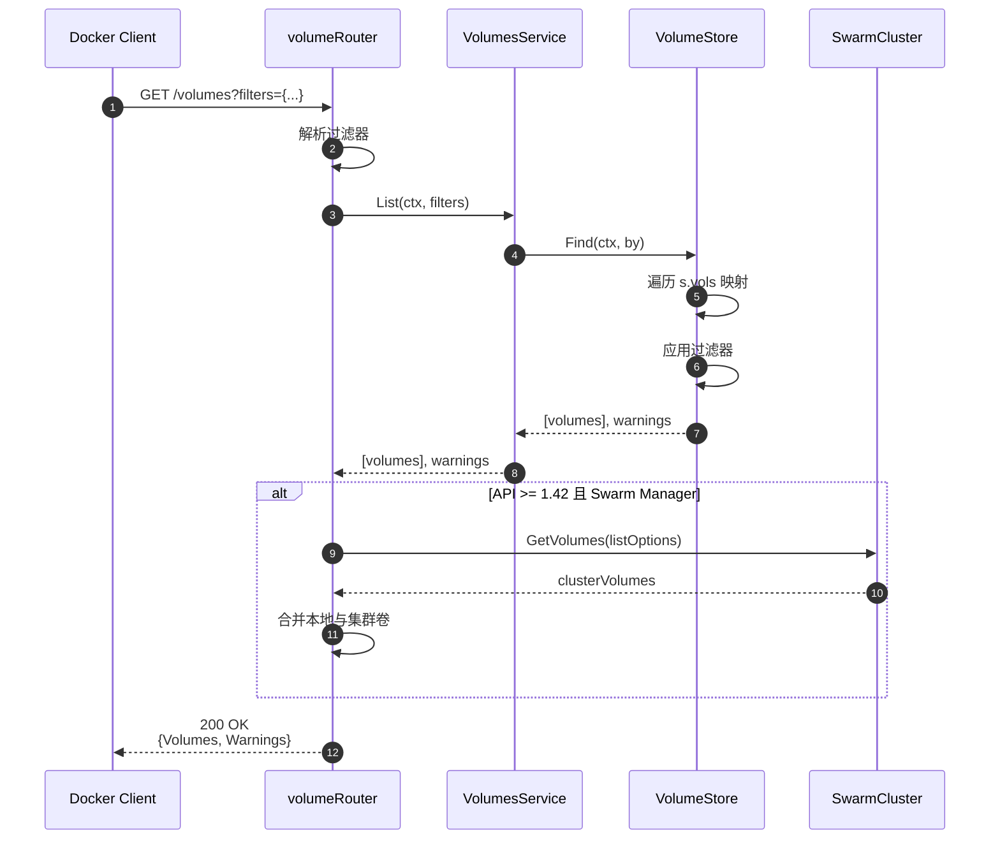
```mermaid
sequenceDiagram
    autonumber
    participant Client as Docker Client
    participant Router as volumeRouter
    participant Backend as VolumesService
    participant Store as VolumeStore
    participant Cluster as SwarmCluster
    
    Client->>Router: GET /volumes?filters={...}
    Router->>Router: 解析过滤器
    Router->>Backend: List(ctx, filters)
    Backend->>Store: Find(ctx, by)
    Store->>Store: 遍历 s.vols 映射
    Store->>Store: 应用过滤器
    Store-->>Backend: [volumes], warnings
    Backend-->>Router: [volumes], warnings
    
    alt API >= 1.42 且 Swarm Manager
        Router->>Cluster: GetVolumes(listOptions)
        Cluster-->>Router: clusterVolumes
        Router->>Router: 合并本地与集群卷
    end
    
    Router-->>Client: 200 OK<br/>{Volumes, Warnings}
```

### 异常与性能

**异常场景**：

- 过滤器格式错误：返回 400 Bad Request
- 驱动故障：记录警告但不阻塞列表

**性能指标**：

- 平均响应时间：10-50ms
- 优化：内存缓存所有卷对象

---

## 2. 获取卷详情

### 基本信息
- **路径**：`GET /volumes/{name:.*}`
- **用途**：获取指定卷的详细信息
- **最小 API 版本**：v1.24
- **幂等性**：是

### 请求参数

**路径参数**：

| 参数 | 类型 | 说明 |
|---|---|---|
| name | string | 卷名称或 ID（集群卷） |

### 响应结构体

同 [列出所有卷](#响应结构体)，但返回单个 `Volume` 对象。

### 入口函数与核心代码

**HTTP Handler**：

```go
func (v *volumeRouter) getVolumeByName(ctx context.Context, w http.ResponseWriter, r *http.Request, vars map[string]string) error {
    version := httputils.VersionFromContext(ctx)
    
    // 1. 优先从本地查找
    vol, err := v.backend.Get(ctx, vars["name"], opts.WithGetResolveStatus)
    
    // 2. 本地未找到，尝试从 Swarm 集群查找（v1.42+）
    if cerrdefs.IsNotFound(err) &&
       versions.GreaterThanOrEqualTo(version, "1.42") &&
       v.cluster.IsManager() {
        swarmVol, err := v.cluster.GetVolume(vars["name"])
        vol = &swarmVol
    }
    
    // 3. 返回卷信息
    return httputils.WriteJSON(w, http.StatusOK, vol)
}
```

**Backend 实现**：

```go
func (s *VolumesService) Get(ctx context.Context, name string, getOpts ...opts.GetOption) (*volumetypes.Volume, error) {
    // 1. 从 VolumeStore 获取
    v, err := s.vs.Get(ctx, name, getOpts...)
    
    // 2. 转换为 API 类型
    vol := volumeToAPIType(v)
    
    // 3. 如果需要状态信息，调用驱动
    var cfg opts.GetConfig
    for _, o := range getOpts {
        o(&cfg)
    }
    if cfg.ResolveStatus {
        vol.Status = v.Status()  // 调用驱动的 Status() 方法
    }
    
    return &vol, nil
}
```

**VolumeStore 获取**：

```go
func (s *VolumeStore) Get(ctx context.Context, name string, opts ...opts.GetOption) (volume.Volume, error) {
    s.locks.Lock(name)
    defer s.locks.Unlock(name)
    
    // 1. 从内存缓存获取
    v, exists := s.vols[name]
    if !exists {
        return nil, &OpErr{Op: "get", Name: name, Err: ErrNoSuchVolume}
    }
    
    return v, nil
}
```

### 时序图

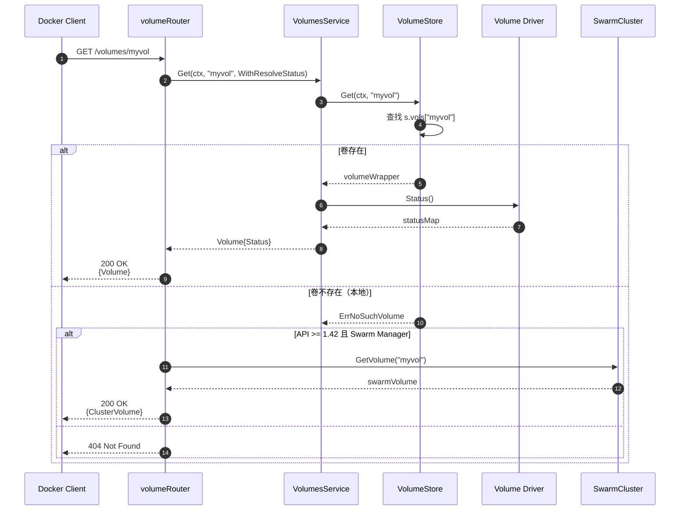
```mermaid
sequenceDiagram
    autonumber
    participant Client as Docker Client
    participant Router as volumeRouter
    participant Backend as VolumesService
    participant Store as VolumeStore
    participant Driver as Volume Driver
    participant Cluster as SwarmCluster
    
    Client->>Router: GET /volumes/myvol
    Router->>Backend: Get(ctx, "myvol", WithResolveStatus)
    Backend->>Store: Get(ctx, "myvol")
    Store->>Store: 查找 s.vols["myvol"]
    
    alt 卷存在
        Store-->>Backend: volumeWrapper
        Backend->>Driver: Status()
        Driver-->>Backend: statusMap
        Backend-->>Router: Volume{Status}
        Router-->>Client: 200 OK<br/>{Volume}
    else 卷不存在（本地）
        Store-->>Backend: ErrNoSuchVolume
        alt API >= 1.42 且 Swarm Manager
            Router->>Cluster: GetVolume("myvol")
            Cluster-->>Router: swarmVolume
            Router-->>Client: 200 OK<br/>{ClusterVolume}
        else
            Router-->>Client: 404 Not Found
        end
    end
```

### 异常与性能

**异常场景**：

- 卷不存在：404 Not Found
- 驱动无响应：Status 字段为空

**性能指标**：

- 平均响应时间：5-20ms

---

## 3. 创建卷

### 基本信息
- **路径**：`POST /volumes/create`
- **用途**：创建新卷
- **最小 API 版本**：v1.24
- **幂等性**：否（重复创建同名卷会返回已存在的卷）

### 请求结构体

```go
type CreateOptions struct {
    // Name 卷名称（可选，留空则生成随机名）
    Name string `json:"Name"`
    
    // Driver 驱动名称（默认 "local"）
    Driver string `json:"Driver"`
    
    // DriverOpts 驱动选项
    DriverOpts map[string]string `json:"DriverOpts"`
    
    // Labels 标签
    Labels map[string]string `json:"Labels"`
    
    // ClusterVolumeSpec 集群卷规格（v1.42+）
    ClusterVolumeSpec *ClusterVolumeSpec `json:"ClusterVolumeSpec,omitempty"`
}
```

| 字段 | 类型 | 必填 | 默认 | 说明 |
|---|---|---|---|---|
| Name | string | 否 | 随机ID | 卷名称 |
| Driver | string | 否 | local | 驱动类型 |
| DriverOpts | map | 否 | {} | 驱动特定选项 |
| Labels | map | 否 | {} | 标签 |
| ClusterVolumeSpec | object | 否 | nil | 集群卷配置 |

**DriverOpts 示例（local 驱动）**：

```json
{
    "type": "nfs",
    "o": "addr=192.168.1.100,rw",
    "device": ":/path/to/dir"
}
```

### 响应结构体

同 [列出所有卷](#响应结构体)，返回创建的 `Volume` 对象。

### 入口函数与核心代码

**HTTP Handler**：

```go
func (v *volumeRouter) postVolumesCreate(ctx context.Context, w http.ResponseWriter, r *http.Request, vars map[string]string) error {
    // 1. 解析请求
    var req volume.CreateOptions
    if err := httputils.ReadJSON(r, &req); err != nil {
        return err
    }
    
    version := httputils.VersionFromContext(ctx)
    
    // 2. 判断是否为集群卷
    var vol *volume.Volume
    var err error
    
    if req.ClusterVolumeSpec != nil && versions.GreaterThanOrEqualTo(version, "1.42") {
        // 集群卷：通过 Swarm 创建
        vol, err = v.cluster.CreateVolume(req)
    } else {
        // 本地卷：通过 VolumesService 创建
        vol, err = v.backend.Create(ctx, req.Name, req.Driver,
            opts.WithCreateOptions(req.DriverOpts),
            opts.WithCreateLabels(req.Labels))
    }
    
    // 3. 返回创建的卷
    return httputils.WriteJSON(w, http.StatusCreated, vol)
}
```

**Backend 实现**：

```go
func (s *VolumesService) Create(ctx context.Context, name, driverName string, options ...opts.CreateOption) (*volumetypes.Volume, error) {
    // 1. 生成匿名卷名称
    if name == "" {
        name = stringid.GenerateRandomID()
        if driverName == "" {
            driverName = volume.DefaultDriverName
        }
        options = append(options, opts.WithCreateLabel(AnonymousLabel, ""))
    }
    
    // 2. 调用 VolumeStore 创建
    v, err := s.vs.Create(ctx, name, driverName, options...)
    
    // 3. 转换为 API 类型
    apiV := volumeToAPIType(v)
    return &apiV, nil
}
```

**VolumeStore 创建**（`daemon/volume/service/store.go`）：

```go
func (s *VolumeStore) Create(ctx context.Context, name, driverName string, opts ...opts.CreateOption) (volume.Volume, error) {
    // 1. 应用选项
    var cfg opts.CreateConfig
    for _, o := range opts {
        o(&cfg)
    }
    
    s.locks.Lock(name)
    defer s.locks.Unlock(name)
    
    // 2. 检查卷是否已存在
    if v, exists := s.vols[name]; exists {
        if v.DriverName() != driverName {
            return nil, &OpErr{Op: "create", Name: name, Err: ErrVolumeExists}
        }
        return v, nil  // 幂等返回
    }
    
    // 3. 获取驱动
    if driverName == "" {
        driverName = volume.DefaultDriverName
    }
    driver, err := volumedrivers.GetDriver(driverName)
    
    // 4. 调用驱动创建卷
    v, err := driver.Create(name, cfg.Options)
    
    // 5. 包装并缓存
    vw := &volumeWrapper{
        name:        name,
        driverName:  driverName,
        labels:      cfg.Labels,
        v:           v,
        options:     cfg.Options,
    }
    s.vols[name] = vw
    
    // 6. 持久化元数据
    s.setMeta(name, volumeMetadata{
        Name:    name,
        Driver:  driverName,
        Labels:  cfg.Labels,
        Options: cfg.Options,
    })
    
    // 7. 记录事件
    s.eventLogger.LogVolumeEvent(name, events.ActionCreate, attributes)
    
    return vw, nil
}
```

**Local 驱动创建**（`daemon/volume/local/local.go`）：

```go
func (r *Root) Create(name string, opts map[string]string) (volume.Volume, error) {
    // 1. 验证卷名称
    if err := r.validateName(name); err != nil {
        return nil, err
    }
    
    r.m.Lock()
    defer r.m.Unlock()
    
    // 2. 创建卷目录
    path := r.DataPath(name)
    if err := os.MkdirAll(path, 0755); err != nil {
        return nil, err
    }
    
    // 3. 应用挂载选项（NFS/CIFS 等）
    v := &localVolume{
        name:       name,
        path:       path,
        opts:       opts,
    }
    
    // 4. 如果有挂载选项，执行挂载
    if optsConfig != nil {
        if err := v.mount(); err != nil {
            return nil, err
        }
    }
    
    return v, nil
}
```

### 时序图

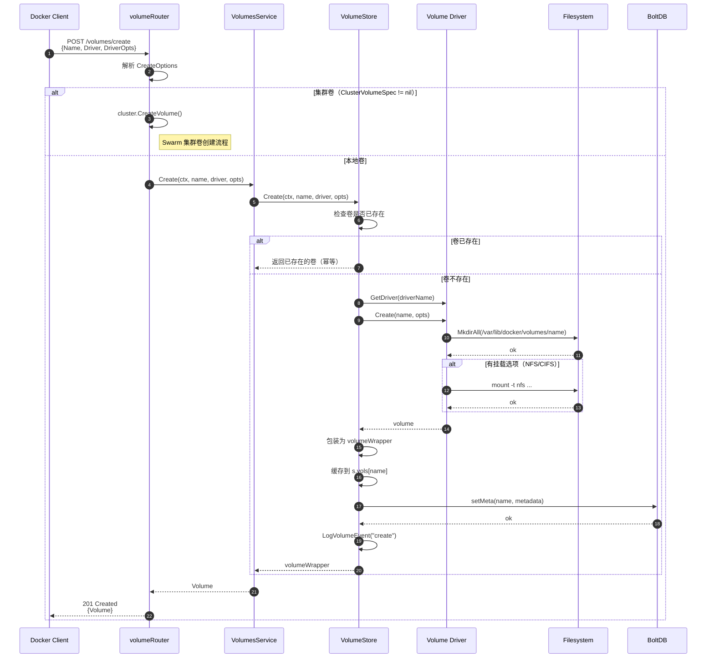
```mermaid
sequenceDiagram
    autonumber
    participant Client as Docker Client
    participant Router as volumeRouter
    participant Backend as VolumesService
    participant Store as VolumeStore
    participant Driver as Volume Driver
    participant FS as Filesystem
    participant DB as BoltDB
    
    Client->>Router: POST /volumes/create<br/>{Name, Driver, DriverOpts}
    Router->>Router: 解析 CreateOptions
    
    alt 集群卷（ClusterVolumeSpec != nil）
        Router->>Router: cluster.CreateVolume()
        Note right of Router: Swarm 集群卷创建流程
    else 本地卷
        Router->>Backend: Create(ctx, name, driver, opts)
        Backend->>Store: Create(ctx, name, driver, opts)
        
        Store->>Store: 检查卷是否已存在
        alt 卷已存在
            Store-->>Backend: 返回已存在的卷（幂等）
        else 卷不存在
            Store->>Driver: GetDriver(driverName)
            Store->>Driver: Create(name, opts)
            
            Driver->>FS: MkdirAll(/var/lib/docker/volumes/name)
            FS-->>Driver: ok
            
            alt 有挂载选项（NFS/CIFS）
                Driver->>FS: mount -t nfs ...
                FS-->>Driver: ok
            end
            
            Driver-->>Store: volume
            
            Store->>Store: 包装为 volumeWrapper
            Store->>Store: 缓存到 s.vols[name]
            Store->>DB: setMeta(name, metadata)
            DB-->>Store: ok
            
            Store->>Store: LogVolumeEvent("create")
            Store-->>Backend: volumeWrapper
        end
        
        Backend-->>Router: Volume
        Router-->>Client: 201 Created<br/>{Volume}
    end
```

### 异常与性能

**异常场景**：

- 驱动不存在：404 Plugin not found
- 挂载失败（NFS）：500 Internal Server Error
- 磁盘空间不足：507 Insufficient Storage

**性能指标**：

- 本地卷平均创建时间：10-30ms
- NFS 卷平均创建时间：50-200ms（取决于网络）

---

## 4. 更新卷

### 基本信息
- **路径**：`PUT /volumes/{name:.*}`
- **用途**：更新集群卷配置
- **最小 API 版本**：v1.42
- **幂等性**：是
- **限制**：仅支持 Swarm 集群卷

### 请求参数

**路径参数**：

| 参数 | 类型 | 说明 |
|---|---|---|
| name | string | 卷名称或 ID |

**Query 参数**：

| 参数 | 类型 | 必填 | 说明 |
|---|---|---|---|
| version | uint64 | 是 | 卷的 Swarm 对象版本号 |

### 请求结构体

```go
type UpdateOptions struct {
    // Spec 新的集群卷规格
    Spec *ClusterVolumeSpec `json:"Spec,omitempty"`
}
```

### 入口函数与核心代码

**HTTP Handler**：

```go
func (v *volumeRouter) putVolumesUpdate(ctx context.Context, w http.ResponseWriter, r *http.Request, vars map[string]string) error {
    // 1. 检查 Swarm 状态
    if !v.cluster.IsManager() {
        return errdefs.Unavailable(errors.New("volume update only valid for cluster volumes"))
    }
    
    // 2. 解析版本号
    rawVersion := r.URL.Query().Get("version")
    version, err := strconv.ParseUint(rawVersion, 10, 64)
    
    // 3. 解析更新选项
    var req volume.UpdateOptions
    if err := httputils.ReadJSON(r, &req); err != nil {
        return err
    }
    
    // 4. 调用 Swarm 更新
    return v.cluster.UpdateVolume(vars["name"], version, req)
}
```

### 时序图

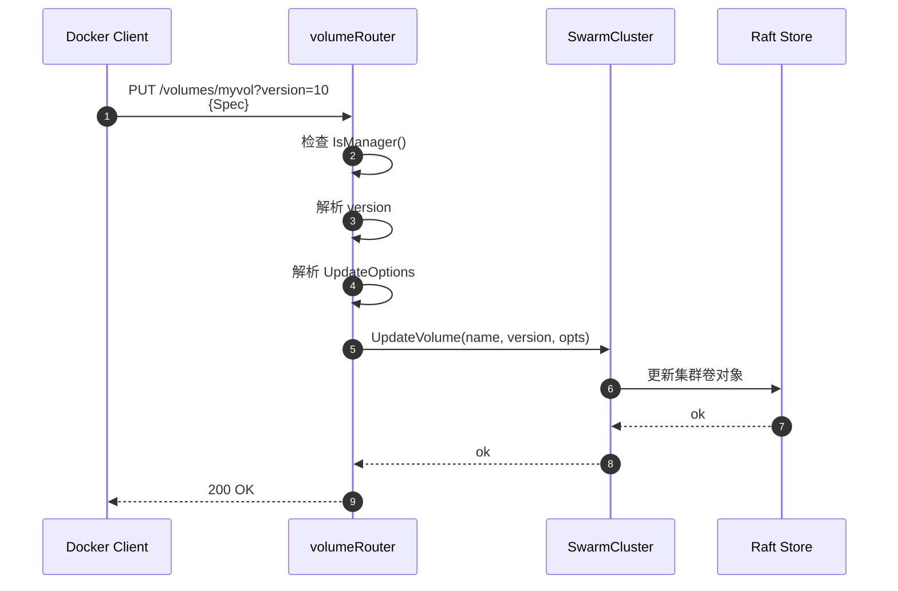
```mermaid
sequenceDiagram
    autonumber
    participant Client as Docker Client
    participant Router as volumeRouter
    participant Cluster as SwarmCluster
    participant Raft as Raft Store
    
    Client->>Router: PUT /volumes/myvol?version=10<br/>{Spec}
    Router->>Router: 检查 IsManager()
    Router->>Router: 解析 version
    Router->>Router: 解析 UpdateOptions
    Router->>Cluster: UpdateVolume(name, version, opts)
    Cluster->>Raft: 更新集群卷对象
    Raft-->>Cluster: ok
    Cluster-->>Router: ok
    Router-->>Client: 200 OK
```

### 异常与性能

**异常场景**：

- 非 Manager 节点：503 Service Unavailable
- 版本不匹配：409 Conflict
- 卷不存在：404 Not Found

---

## 5. 删除卷

### 基本信息
- **路径**：`DELETE /volumes/{name:.*}`
- **用途**：删除卷
- **最小 API 版本**：v1.24
- **幂等性**：是（force=true）

### 请求参数

**路径参数**：

| 参数 | 类型 | 说明 |
|---|---|---|
| name | string | 卷名称 |

**Query 参数**：

| 参数 | 类型 | 默认 | 说明 |
|---|---|---|---|
| force | bool | false | 强制删除（忽略不存在错误） |

### 入口函数与核心代码

**HTTP Handler**：

```go
func (v *volumeRouter) deleteVolumes(ctx context.Context, w http.ResponseWriter, r *http.Request, vars map[string]string) error {
    force := httputils.BoolValue(r, "force")
    
    // 1. 尝试删除本地卷
    err := v.backend.Remove(ctx, vars["name"], opts.WithPurgeOnError(force))
    
    // 2. 如果本地未找到，尝试删除集群卷
    if cerrdefs.IsNotFound(err) || force {
        version := httputils.VersionFromContext(ctx)
        if versions.GreaterThanOrEqualTo(version, "1.42") && v.cluster.IsManager() {
            err = v.cluster.RemoveVolume(vars["name"], force)
        }
    }
    
    if err != nil {
        return err
    }
    w.WriteHeader(http.StatusNoContent)
    return nil
}
```

**Backend 实现**：

```go
func (s *VolumesService) Remove(ctx context.Context, name string, rmOpts ...opts.RemoveOption) error {
    var cfg opts.RemoveConfig
    for _, o := range rmOpts {
        o(&cfg)
    }
    
    // 1. 获取卷
    v, err := s.vs.Get(ctx, name)
    if err != nil {
        if IsNotExist(err) && cfg.PurgeOnError {
            return nil  // force 模式忽略不存在
        }
        return err
    }
    
    // 2. 调用 VolumeStore 删除
    err = s.vs.Remove(ctx, v, rmOpts...)
    if IsInUse(err) {
        err = errdefs.Conflict(err)
    }
    return err
}
```

**VolumeStore 删除**：

```go
func (s *VolumeStore) Remove(ctx context.Context, v volume.Volume, opts ...opts.RemoveOption) error {
    name := v.Name()
    s.locks.Lock(name)
    defer s.locks.Unlock(name)
    
    // 1. 检查引用计数
    vw, exists := s.vols[name]
    if vw.refCount() > 0 {
        return &OpErr{Op: "remove", Name: name, Err: ErrVolumeInUse}
    }
    
    // 2. 调用驱动删除
    if err := vw.getVolume().Remove(); err != nil {
        return err
    }
    
    // 3. 从内存删除
    delete(s.vols, name)
    
    // 4. 从数据库删除
    s.removeMeta(name)
    
    // 5. 记录事件
    s.eventLogger.LogVolumeEvent(name, events.ActionDestroy, nil)
    
    return nil
}
```

### 时序图

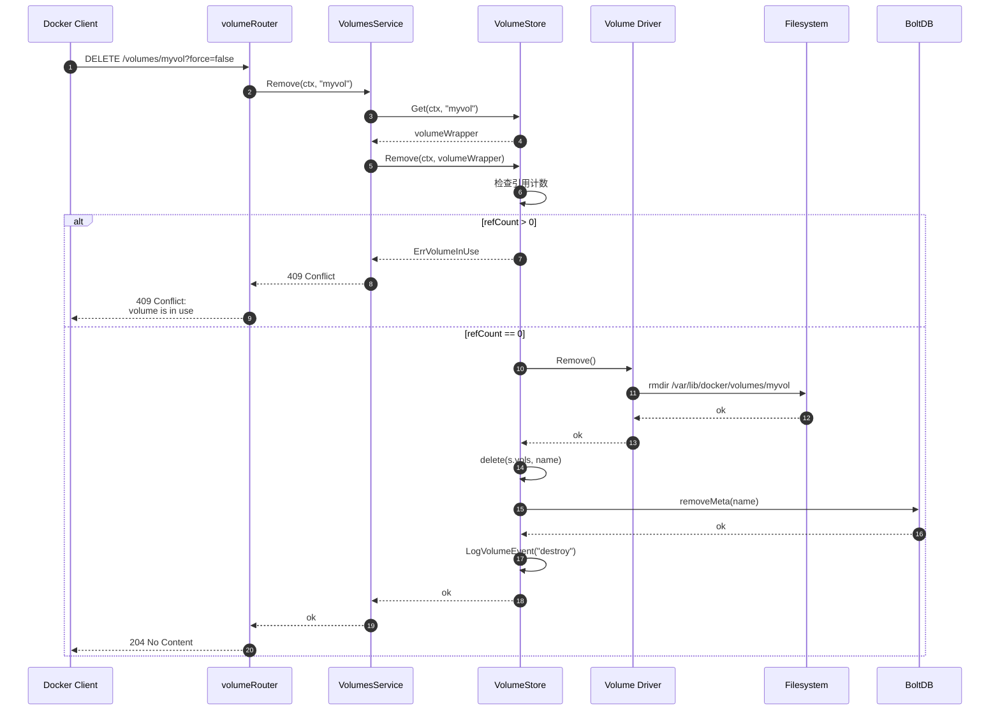
```mermaid
sequenceDiagram
    autonumber
    participant Client as Docker Client
    participant Router as volumeRouter
    participant Backend as VolumesService
    participant Store as VolumeStore
    participant Driver as Volume Driver
    participant FS as Filesystem
    participant DB as BoltDB
    
    Client->>Router: DELETE /volumes/myvol?force=false
    Router->>Backend: Remove(ctx, "myvol")
    Backend->>Store: Get(ctx, "myvol")
    Store-->>Backend: volumeWrapper
    
    Backend->>Store: Remove(ctx, volumeWrapper)
    Store->>Store: 检查引用计数
    
    alt refCount > 0
        Store-->>Backend: ErrVolumeInUse
        Backend-->>Router: 409 Conflict
        Router-->>Client: 409 Conflict:<br/>volume is in use
    else refCount == 0
        Store->>Driver: Remove()
        Driver->>FS: rmdir /var/lib/docker/volumes/myvol
        FS-->>Driver: ok
        Driver-->>Store: ok
        
        Store->>Store: delete(s.vols, name)
        Store->>DB: removeMeta(name)
        DB-->>Store: ok
        
        Store->>Store: LogVolumeEvent("destroy")
        Store-->>Backend: ok
        Backend-->>Router: ok
        Router-->>Client: 204 No Content
    end
```

### 异常与性能

**异常场景**：

- 卷不存在：404 Not Found（force=false）
- 卷正在使用：409 Conflict
- 驱动删除失败：500 Internal Server Error

**性能指标**：

- 平均删除时间：10-50ms

---

## 6. 清理卷

### 基本信息
- **路径**：`POST /volumes/prune`
- **用途**：删除未使用的卷
- **最小 API 版本**：v1.25
- **幂等性**：是

### 请求参数

**Query 参数**：

| 参数 | 类型 | 必填 | 说明 |
|---|---|---|---|
| filters | string | 否 | JSON 编码的过滤器 |

**过滤器选项**：

| 过滤器 | 说明 |
|---|---|
| `label` | 标签过滤 |
| `label!` | 标签排除 |
| `all` | 清理所有未使用卷（v1.42+默认仅匿名卷） |

### 响应结构体

```go
type PruneReport struct {
    // VolumesDeleted 已删除的卷名称列表
    VolumesDeleted []string `json:"VolumesDeleted"`
    
    // SpaceReclaimed 回收的磁盘空间（字节）
    SpaceReclaimed uint64 `json:"SpaceReclaimed"`
}
```

### 入口函数与核心代码

**HTTP Handler**：

```go
func (v *volumeRouter) postVolumesPrune(ctx context.Context, w http.ResponseWriter, r *http.Request, vars map[string]string) error {
    // 1. 解析过滤器
    pruneFilters, err := filters.FromJSON(r.Form.Get("filters"))
    
    // 2. API < 1.42 时，默认清理所有卷（兼容旧版本）
    if versions.LessThan(httputils.VersionFromContext(ctx), "1.42") {
        pruneFilters.Add("all", "true")
    }
    
    // 3. 执行清理
    pruneReport, err := v.backend.Prune(ctx, pruneFilters)
    
    return httputils.WriteJSON(w, http.StatusOK, pruneReport)
}
```

**Backend 实现**（`daemon/volume/service/service.go`）：

```go
func (s *VolumesService) Prune(ctx context.Context, filter filters.Args) (*volumetypes.PruneReport, error) {
    // 1. 防止并发清理
    if !s.pruneRunning.CompareAndSwap(false, true) {
        return nil, errdefs.Conflict(errors.New("a prune operation is already running"))
    }
    defer s.pruneRunning.Store(false)
    
    // 2. 转换过滤器
    by, err := filtersToBy(filter, acceptedPruneFilters)
    
    // 3. 查找符合条件的卷
    vols, _, err := s.vs.Find(ctx, by)
    
    // 4. 清理每个卷
    var (
        deleted []string
        spaceReclaimed uint64
    )
    
    for _, v := range vols {
        // 跳过正在使用的卷
        if v.refCount() > 0 {
            continue
        }
        
        // 如果不是 "all" 模式，只删除匿名卷
        if !by.All && v.labels[AnonymousLabel] == "" {
            continue
        }
        
        // 获取卷大小
        if du, err := v.CachedPath(); err == nil {
            spaceReclaimed += uint64(du)
        }
        
        // 删除卷
        if err := s.vs.Remove(ctx, v); err == nil {
            deleted = append(deleted, v.Name())
        }
    }
    
    return &volumetypes.PruneReport{
        VolumesDeleted: deleted,
        SpaceReclaimed: spaceReclaimed,
    }, nil
}
```

### 时序图

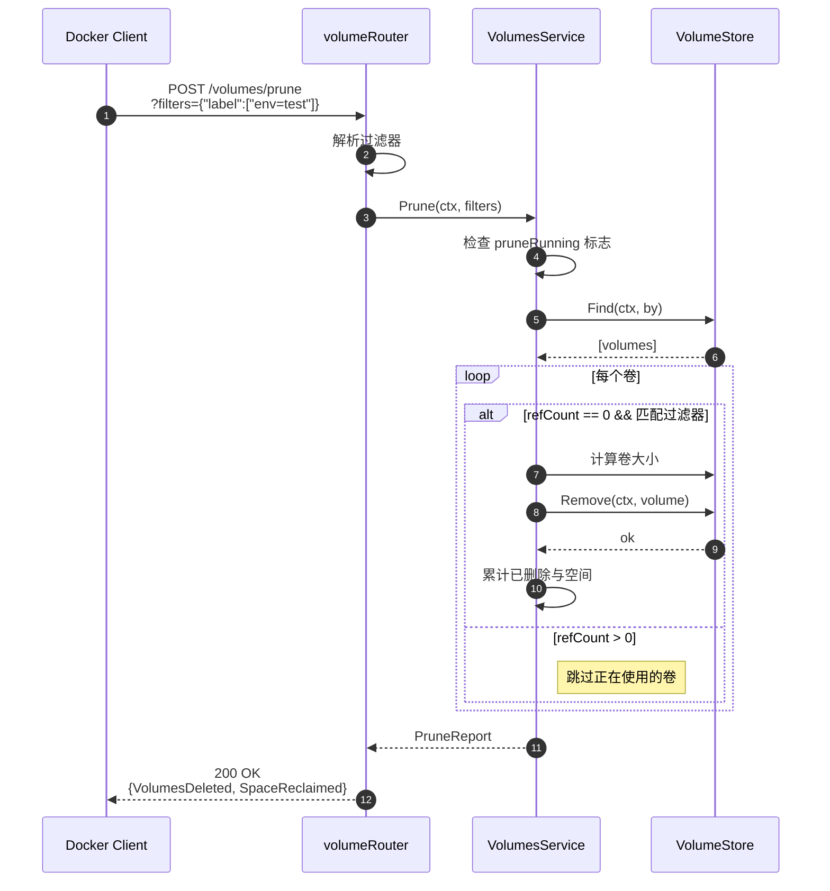
```mermaid
sequenceDiagram
    autonumber
    participant Client as Docker Client
    participant Router as volumeRouter
    participant Backend as VolumesService
    participant Store as VolumeStore
    
    Client->>Router: POST /volumes/prune<br/>?filters={"label":["env=test"]}
    Router->>Router: 解析过滤器
    Router->>Backend: Prune(ctx, filters)
    
    Backend->>Backend: 检查 pruneRunning 标志
    Backend->>Store: Find(ctx, by)
    Store-->>Backend: [volumes]
    
    loop 每个卷
        alt refCount == 0 && 匹配过滤器
            Backend->>Store: 计算卷大小
            Backend->>Store: Remove(ctx, volume)
            Store-->>Backend: ok
            Backend->>Backend: 累计已删除与空间
        else refCount > 0
            Note right of Backend: 跳过正在使用的卷
        end
    end
    
    Backend-->>Router: PruneReport
    Router-->>Client: 200 OK<br/>{VolumesDeleted, SpaceReclaimed}
```

### 异常与性能

**异常场景**：

- 并发清理：409 Conflict
- 过滤器格式错误：400 Bad Request

**性能指标**：

- 清理 100 个卷：1-5 秒
- 优化：并发删除（计划中）

---

## 附录：驱动选项参考

### Local 驱动（NFS）

```json
{
    "Driver": "local",
    "DriverOpts": {
        "type": "nfs",
        "o": "addr=192.168.1.100,vers=4,soft,timeo=180,bg,tcp,rw",
        "device": ":/exported/path"
    }
}
```

### Local 驱动（CIFS/SMB）

```json
{
    "Driver": "local",
    "DriverOpts": {
        "type": "cifs",
        "o": "username=user,password=pass,vers=3.0",
        "device": "//192.168.1.100/share"
    }
}
```

---

**文档版本**：v1.0  
**最后更新**：2025-10-04

---

## 数据结构

本文档详细描述卷模块的核心数据结构，包括 UML 类图、字段说明、接口定义与使用场景。

---

## 数据结构概览

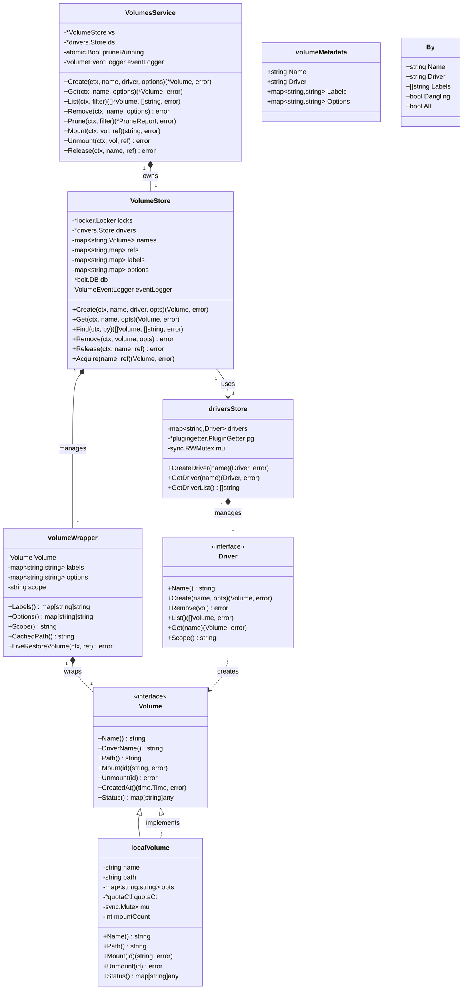
```mermaid
classDiagram
    class VolumesService {
        -*VolumeStore vs
        -*drivers.Store ds
        -atomic.Bool pruneRunning
        -VolumeEventLogger eventLogger
        +Create(ctx, name, driver, options) (*Volume, error)
        +Get(ctx, name, options) (*Volume, error)
        +List(ctx, filter) ([]*Volume, []string, error)
        +Remove(ctx, name, options) error
        +Prune(ctx, filter) (*PruneReport, error)
        +Mount(ctx, vol, ref) (string, error)
        +Unmount(ctx, vol, ref) error
        +Release(ctx, name, ref) error
    }
    
    class VolumeStore {
        -*locker.Locker locks
        -*drivers.Store drivers
        -map~string,Volume~ names
        -map~string,map~ refs
        -map~string,map~ labels
        -map~string,map~ options
        -*bolt.DB db
        -VolumeEventLogger eventLogger
        +Create(ctx, name, driver, opts) (Volume, error)
        +Get(ctx, name, opts) (Volume, error)
        +Find(ctx, by) ([]Volume, []string, error)
        +Remove(ctx, volume, opts) error
        +Release(ctx, name, ref) error
        +Acquire(name, ref) (Volume, error)
    }
    
    class Volume {
        <<interface>>
        +Name() string
        +DriverName() string
        +Path() string
        +Mount(id) (string, error)
        +Unmount(id) error
        +CreatedAt() (time.Time, error)
        +Status() map[string]any
    }
    
    class volumeWrapper {
        -Volume Volume
        -map~string,string~ labels
        -map~string,string~ options
        -string scope
        +Labels() map[string]string
        +Options() map[string]string
        +Scope() string
        +CachedPath() string
        +LiveRestoreVolume(ctx, ref) error
    }
    
    class Driver {
        <<interface>>
        +Name() string
        +Create(name, opts) (Volume, error)
        +Remove(vol) error
        +List() ([]Volume, error)
        +Get(name) (Volume, error)
        +Scope() string
    }
    
    class localVolume {
        -string name
        -string path
        -map~string,string~ opts
        -*quotaCtl quotaCtl
        -sync.Mutex mu
        -int mountCount
        +Name() string
        +Path() string
        +Mount(id) (string, error)
        +Unmount(id) error
        +Status() map[string]any
    }
    
    class volumeMetadata {
        +string Name
        +string Driver
        +map~string,string~ Labels
        +map~string,string~ Options
    }
    
    class driversStore {
        -map~string,Driver~ drivers
        -*plugingetter.PluginGetter pg
        -sync.RWMutex mu
        +CreateDriver(name) (Driver, error)
        +GetDriver(name) (Driver, error)
        +GetDriverList() []string
    }
    
    class By {
        +string Name
        +string Driver
        +[]string Labels
        +bool Dangling
        +bool All
    }
    
    VolumesService "1" *-- "1" VolumeStore : owns
    VolumeStore "1" *-- "*" volumeWrapper : manages
    volumeWrapper "1" *-- "1" Volume : wraps
    VolumeStore "1" --> "1" driversStore : uses
    driversStore "1" *-- "*" Driver : manages
    Driver ..> Volume : creates
    localVolume ..|> Volume : implements
    Volume <|-- localVolume
```

---

## 1. VolumesService（卷服务）

### 结构定义

```go
type VolumesService struct {
    // 卷存储
    vs *VolumeStore // 核心卷存储管理器
    
    // 驱动列表
    ds driverLister // 驱动注册表
    
    // 清理状态
    pruneRunning atomic.Bool // 防止并发清理
    
    // 事件日志
    eventLogger VolumeEventLogger // 卷事件记录器
}
```

### 字段说明

| 字段 | 类型 | 说明 |
|---|---|---|
| vs | *VolumeStore | 核心卷存储管理器 |
| ds | driverLister | 驱动注册表（获取驱动列表） |
| pruneRunning | atomic.Bool | 清理操作标志（防止并发） |
| eventLogger | VolumeEventLogger | 事件记录器（记录创建/删除等事件） |

### 核心方法

```go
// 卷生命周期
func (s *VolumesService) Create(ctx context.Context, name, driverName string, options ...opts.CreateOption) (*volumetypes.Volume, error)
func (s *VolumesService) Get(ctx context.Context, name string, getOpts ...opts.GetOption) (*volumetypes.Volume, error)
func (s *VolumesService) List(ctx context.Context, filter filters.Args) ([]*volumetypes.Volume, []string, error)
func (s *VolumesService) Remove(ctx context.Context, name string, rmOpts ...opts.RemoveOption) error
func (s *VolumesService) Prune(ctx context.Context, filter filters.Args) (*volumetypes.PruneReport, error)

// 卷挂载
func (s *VolumesService) Mount(ctx context.Context, vol *volumetypes.Volume, ref string) (string, error)
func (s *VolumesService) Unmount(ctx context.Context, vol *volumetypes.Volume, ref string) error

// 引用计数
func (s *VolumesService) Release(ctx context.Context, name string, ref string) error

// 恢复
func (s *VolumesService) LiveRestoreVolume(ctx context.Context, vol *volumetypes.Volume, ref string) error
```

### 使用场景

```go
// 创建卷服务
vs, err := service.NewVolumeService(
    "/var/lib/docker",
    pluginGetter,
    idtools.Identity{UID: 0, GID: 0},
    eventLogger,
)

// 创建卷
vol, err := vs.Create(ctx, "myvol", "local",
    opts.WithCreateLabel("env", "prod"),
    opts.WithCreateOptions(map[string]string{
        "type": "nfs",
        "o": "addr=192.168.1.100,rw",
        "device": ":/exported/path",
    }),
)

// 挂载卷
mountPath, err := vs.Mount(ctx, vol, "container-id")
// mountPath: /var/lib/docker/volumes/myvol/_data

// 卸载卷
err = vs.Unmount(ctx, vol, "container-id")
```

---

## 2. VolumeStore（卷存储）

### 结构定义

```go
type VolumeStore struct {
    // 并发控制
    locks      *locker.Locker // 卷级锁（细粒度锁定）
    globalLock sync.RWMutex   // 全局锁（保护映射）
    
    // 驱动管理
    drivers *drivers.Store // 驱动存储
    
    // 卷映射
    names   map[string]volume.Volume       // 卷名称 → 卷对象
    refs    map[string]map[string]struct{} // 卷名称 → 引用集合
    labels  map[string]map[string]string   // 卷名称 → 标签
    options map[string]map[string]string   // 卷名称 → 选项
    
    // 持久化
    db *bolt.DB // BoltDB 数据库（存储元数据）
    
    // 事件日志
    eventLogger VolumeEventLogger
}
```

### 字段说明

| 字段 | 类型 | 说明 |
|---|---|---|
| locks | *locker.Locker | 卷级锁（每个卷独立锁定） |
| globalLock | sync.RWMutex | 全局读写锁（保护映射访问） |
| drivers | *drivers.Store | 驱动注册表 |
| names | map | 卷名称到卷对象的映射 |
| refs | map | 卷引用计数（容器 ID 集合） |
| labels | map | 卷标签存储 |
| options | map | 卷选项存储 |
| db | *bolt.DB | 元数据持久化数据库 |

### 核心方法

```go
// 卷操作
func (s *VolumeStore) Create(ctx context.Context, name, driverName string, opts ...opts.CreateOption) (volume.Volume, error)
func (s *VolumeStore) Get(ctx context.Context, name string, opts ...opts.GetOption) (volume.Volume, error)
func (s *VolumeStore) Find(ctx context.Context, by By) ([]volume.Volume, []string, error)
func (s *VolumeStore) Remove(ctx context.Context, v volume.Volume, opts ...opts.RemoveOption) error

// 引用管理
func (s *VolumeStore) Acquire(name, ref string) (volume.Volume, error)
func (s *VolumeStore) Release(ctx context.Context, name, ref string) error
func (s *VolumeStore) hasRef(name string) bool
func (s *VolumeStore) refs(name string) int

// 元数据持久化
func (s *VolumeStore) setMeta(name string, meta volumeMetadata) error
func (s *VolumeStore) getMeta(name string) (volumeMetadata, error)
func (s *VolumeStore) removeMeta(name string) error

// 恢复
func (s *VolumeStore) restore()
```

### 引用计数机制

```go
// 引用计数示例
type VolumeStore struct {
    refs map[string]map[string]struct{} // volume-name → {ref1, ref2, ...}
}

// 获取卷并增加引用
func (s *VolumeStore) Acquire(name, ref string) (volume.Volume, error) {
    s.locks.Lock(name)
    defer s.locks.Unlock(name)
    
    v, exists := s.names[name]
    if !exists {
        return nil, ErrNoSuchVolume
    }
    
    // 添加引用
    s.globalLock.Lock()
    if s.refs[name] == nil {
        s.refs[name] = make(map[string]struct{})
    }
    s.refs[name][ref] = struct{}{}
    s.globalLock.Unlock()
    
    return v, nil
}

// 释放引用
func (s *VolumeStore) Release(ctx context.Context, name, ref string) error {
    s.locks.Lock(name)
    defer s.locks.Unlock(name)
    
    s.globalLock.Lock()
    if s.refs[name] != nil {
        delete(s.refs[name], ref)
        if len(s.refs[name]) == 0 {
            delete(s.refs, name)
        }
    }
    s.globalLock.Unlock()
    
    return nil
}

// 检查卷是否正在使用
func (s *VolumeStore) hasRef(name string) bool {
    s.globalLock.RLock()
    defer s.globalLock.RUnlock()
    return len(s.refs[name]) > 0
}
```

### 持久化存储

**数据库路径**：`/var/lib/docker/volumes/metadata.db`

**存储结构**：

```
BoltDB
└── volumes (bucket)
    ├── "myvol" → volumeMetadata (JSON)
    ├── "vol2"  → volumeMetadata (JSON)
    └── ...
```

**volumeMetadata**：

```go
type volumeMetadata struct {
    Name    string            // 卷名称
    Driver  string            // 驱动名称
    Labels  map[string]string // 标签
    Options map[string]string // 驱动选项
}
```

---

## 3. Volume 接口

### 接口定义

```go
type Volume interface {
    // Name 返回卷名称
    Name() string
    
    // DriverName 返回驱动名称
    DriverName() string
    
    // Path 返回卷的绝对路径
    Path() string
    
    // Mount 挂载卷并返回挂载点
    // id: 挂载引用 ID（通常为容器 ID）
    Mount(id string) (string, error)
    
    // Unmount 卸载卷
    // id: 挂载引用 ID
    Unmount(id string) error
    
    // CreatedAt 返回卷创建时间
    CreatedAt() (time.Time, error)
    
    // Status 返回驱动特定的状态信息
    Status() map[string]any
}
```

### 扩展接口

```go
// DetailedVolume 扩展接口（包含标签/选项/作用域）
type DetailedVolume interface {
    Volume
    Labels() map[string]string
    Options() map[string]string
    Scope() string
}

// LiveRestorer 卷恢复接口
type LiveRestorer interface {
    // LiveRestoreVolume 恢复卷资源（用于容器 live-restore）
    LiveRestoreVolume(ctx context.Context, ref string) error
}
```

### 实现类：volumeWrapper

```go
type volumeWrapper struct {
    volume.Volume            // 嵌入原始卷对象
    labels        map[string]string // 用户标签
    options       map[string]string // 驱动选项
    scope         string            // 作用域（local/global）
}

func (v volumeWrapper) Labels() map[string]string {
    // 返回标签副本（防止修改）
    labels := make(map[string]string, len(v.labels))
    for key, value := range v.labels {
        labels[key] = value
    }
    return labels
}

func (v volumeWrapper) Scope() string {
    return v.scope
}

func (v volumeWrapper) CachedPath() string {
    // 优先返回缓存路径（避免重复计算）
    if vv, ok := v.Volume.(interface{ CachedPath() string }); ok {
        return vv.CachedPath()
    }
    return v.Volume.Path()
}
```

---

## 4. Driver 接口

### 接口定义

```go
type Driver interface {
    // Name 返回驱动名称
    Name() string
    
    // Create 创建新卷
    Create(name string, opts map[string]string) (Volume, error)
    
    // Remove 删除卷
    Remove(vol Volume) error
    
    // List 列出所有卷
    List() ([]Volume, error)
    
    // Get 获取指定卷
    Get(name string) (Volume, error)
    
    // Scope 返回驱动作用域（local/global）
    Scope() string
}
```

### Capability（驱动能力）

```go
type Capability struct {
    // Scope 作用域
    // - local: 驱动仅管理本地资源
    // - global: 驱动管理集群范围资源
    Scope string
}
```

### 内置驱动：localVolume

```go
type localVolume struct {
    // 基本信息
    name string // 卷名称
    path string // 卷路径
    
    // 挂载配置
    opts       map[string]string // 驱动选项（NFS/CIFS 配置）
    active     activeMount       // 活动挂载信息
    
    // 配额控制
    quotaCtl *quotaCtl // 磁盘配额管理
    
    // 挂载计数
    mu         sync.Mutex // 锁
    mountCount int        // 挂载计数（引用计数）
}

func (v *localVolume) Mount(id string) (string, error) {
    v.mu.Lock()
    defer v.mu.Unlock()
    
    // 增加挂载计数
    v.mountCount++
    
    // 首次挂载时执行实际挂载
    if v.mountCount == 1 {
        if err := v.mount(); err != nil {
            v.mountCount--
            return "", err
        }
    }
    
    return v.path, nil
}

func (v *localVolume) Unmount(id string) error {
    v.mu.Lock()
    defer v.mu.Unlock()
    
    // 减少挂载计数
    v.mountCount--
    
    // 最后一个引用释放时卸载
    if v.mountCount == 0 {
        return v.unmount()
    }
    
    return nil
}
```

---

## 5. 驱动管理

### driversStore（驱动存储）

```go
type driversStore struct {
    // 内置驱动
    drivers map[string]Driver // name → Driver
    
    // 插件驱动
    pg *plugingetter.PluginGetter // 插件获取器
    
    // 并发控制
    mu sync.RWMutex
}

func (s *driversStore) GetDriver(name string) (Driver, error) {
    s.mu.RLock()
    defer s.mu.RUnlock()
    
    // 1. 查找内置驱动
    if drv, exists := s.drivers[name]; exists {
        return drv, nil
    }
    
    // 2. 查找插件驱动
    p, err := s.pg.Get(name, "VolumeDriver", plugingetter.Lookup)
    if err != nil {
        return nil, ErrNoSuchDriver
    }
    
    return NewPluginDriver(p), nil
}
```

### 驱动类型

| 驱动 | 类型 | Scope | 说明 |
|---|---|---|---|
| **local** | 内置 | local | 本地文件系统卷 |
| **nfs** | 插件 | global | NFS 网络卷 |
| **ceph** | 插件 | global | Ceph RBD 卷 |
| **glusterfs** | 插件 | global | GlusterFS 卷 |
| **convoy** | 插件 | local | 块设备卷 |

---

## 6. 查询与过滤

### By 结构（查询条件）

```go
type By struct {
    // 名称过滤（部分匹配）
    Name string
    
    // 驱动过滤
    Driver string
    
    // 标签过滤
    Labels []string
    
    // 是否 dangling（未使用）
    Dangling bool
    
    // 是否包含所有卷（默认仅匿名卷）
    All bool
}
```

### 过滤实现

```go
func (s *VolumeStore) Find(ctx context.Context, by By) ([]volume.Volume, []string, error) {
    s.globalLock.RLock()
    defer s.globalLock.RUnlock()
    
    var volumes []volume.Volume
    var warnings []string
    
    for _, v := range s.names {
        // 名称过滤
        if by.Name != "" && !strings.Contains(v.Name(), by.Name) {
            continue
        }
        
        // 驱动过滤
        if by.Driver != "" && v.DriverName() != by.Driver {
            continue
        }
        
        // dangling 过滤
        if by.Dangling && s.hasRef(v.Name()) {
            continue
        }
        
        // 标签过滤
        if !matchLabels(s.labels[v.Name()], by.Labels) {
            continue
        }
        
        volumes = append(volumes, v)
    }
    
    return volumes, warnings, nil
}
```

---

## 数据结构关系图

### 整体架构

```
Daemon
  └── VolumesService
        ├── VolumeStore
        │     ├── names: map[string]Volume
        │     ├── refs:  map[string]map[string]struct{}
        │     ├── db:    BoltDB (metadata)
        │     └── drivers: driversStore
        │           ├── local: localVolume
        │           └── plugins: PluginDriver
        └── eventLogger: EventsService
```

### 卷生命周期

```

1. 创建阶段：
   Create() → VolumeStore.Create()
     → Driver.Create()
     → mkdir /var/lib/docker/volumes/{name}/_data
     → setMeta(volumeMetadata)
     → LogVolumeEvent("create")

2. 使用阶段：
   Acquire(ref) → refs[name][ref] = struct{}{}
   Mount(id)    → volume.Mount(id) → mountCount++
   Unmount(id)  → volume.Unmount(id) → mountCount--
   Release(ref) → delete(refs[name], ref)

3. 删除阶段：
   Remove()
     → 检查 hasRef() == false
     → Driver.Remove()
     → rmdir /var/lib/docker/volumes/{name}
     → removeMeta(name)
     → LogVolumeEvent("destroy")

```

---

## 使用场景

### 场景 1：创建本地卷

```go
vs, _ := service.NewVolumeService(...)

// 创建简单本地卷
vol, err := vs.Create(ctx, "data", "local", nil)
// 路径：/var/lib/docker/volumes/data/_data

// 创建 NFS 卷
vol, err := vs.Create(ctx, "nfs-data", "local",
    opts.WithCreateOptions(map[string]string{
        "type":   "nfs",
        "o":      "addr=192.168.1.100,rw",
        "device": ":/exports/data",
    }),
)
// 挂载：mount -t nfs -o addr=... 192.168.1.100:/exports/data /var/lib/docker/volumes/nfs-data/_data
```

### 场景 2：容器使用卷

```go
// 1. 容器启动时获取卷
vol, err := vs.Get(ctx, "data")

// 2. 挂载卷
mountPath, err := vs.Mount(ctx, vol, containerID)
// mountPath: /var/lib/docker/volumes/data/_data

// 3. 容器运行中...
// 4. 容器停止时卸载
err = vs.Unmount(ctx, vol, containerID)

// 5. 容器删除时释放引用
err = vs.Release(ctx, "data", containerID)
```

### 场景 3：清理未使用卷

```go
// 清理所有匿名卷
report, err := vs.Prune(ctx, filters.Args{})
// report.VolumesDeleted: ["64f57...", "a3f21..."]
// report.SpaceReclaimed: 1024000000

// 清理特定标签的卷
report, err := vs.Prune(ctx, filters.NewArgs(
    filters.Arg("label", "env=test"),
))
```

---

## 存储目录结构

```
/var/lib/docker/
└── volumes/
    ├── metadata.db         # BoltDB 元数据库
    ├── myvol/              # 卷目录
    │   └── _data/          # 实际数据目录
    │       └── (用户文件)
    ├── nfs-vol/            # NFS 卷
    │   └── _data/          # NFS 挂载点
    │       └── (远程文件)
    └── anonymous-vol-64f57/  # 匿名卷
        └── _data/
```

---

**文档版本**：v1.0  
**最后更新**：2025-10-04

---

## 时序图

本文档通过时序图展示卷模块的典型操作流程，包括卷创建、挂载、引用管理等关键场景。

---

## 时序图目录

1. [卷创建流程](#1-卷创建流程)
2. [卷挂载与卸载流程](#2-卷挂载与卸载流程)
3. [容器使用卷的完整流程](#3-容器使用卷的完整流程)
4. [卷删除流程](#4-卷删除流程)
5. [卷清理流程](#5-卷清理流程)
6. [NFS 卷挂载流程](#6-nfs-卷挂载流程)

---

## 1. 卷创建流程

### 时序图

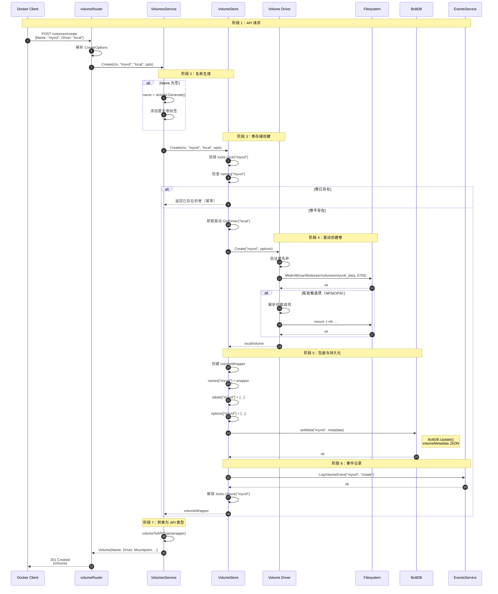
```mermaid
sequenceDiagram
    autonumber
    participant Client as Docker Client
    participant API as volumeRouter
    participant Service as VolumesService
    participant Store as VolumeStore
    participant Driver as Volume Driver
    participant FS as Filesystem
    participant DB as BoltDB
    participant Events as EventsService
    
    Note over Client,Events: 阶段 1：API 请求
    Client->>API: POST /volumes/create<br/>{Name: "myvol", Driver: "local"}
    API->>API: 解析 CreateOptions
    API->>Service: Create(ctx, "myvol", "local", opts)
    
    Note over Service,Store: 阶段 2：名称生成
    alt Name 为空
        Service->>Service: name = stringid.Generate()
        Service->>Service: 添加匿名卷标签
    end
    
    Note over Store,Driver: 阶段 3：卷存储创建
    Service->>Store: Create(ctx, "myvol", "local", opts)
    Store->>Store: 加锁 locks.Lock("myvol")
    
    Store->>Store: 检查 names["myvol"]
    alt 卷已存在
        Store-->>Service: 返回已存在的卷（幂等）
    else 卷不存在
        Store->>Store: 获取驱动 GetDriver("local")
        
        Note over Driver,FS: 阶段 4：驱动创建卷
        Store->>Driver: Create("myvol", options)
        Driver->>Driver: 验证卷名称
        Driver->>FS: MkdirAll(/var/lib/docker/volumes/myvol/_data, 0755)
        FS-->>Driver: ok
        
        alt 有挂载选项（NFS/CIFS）
            Driver->>Driver: 解析挂载选项
            Driver->>FS: mount -t nfs ...
            FS-->>Driver: ok
        end
        
        Driver-->>Store: localVolume
        
        Note over Store,DB: 阶段 5：包装与持久化
        Store->>Store: 创建 volumeWrapper
        Store->>Store: names["myvol"] = wrapper
        Store->>Store: labels["myvol"] = {...}
        Store->>Store: options["myvol"] = {...}
        
        Store->>DB: setMeta("myvol", metadata)
        Note right of DB: BoltDB.Update()<br/>volumeMetadata JSON
        DB-->>Store: ok
        
        Note over Store,Events: 阶段 6：事件记录
        Store->>Events: LogVolumeEvent("myvol", "create")
        Events-->>Store: ok
        
        Store->>Store: 解锁 locks.Unlock("myvol")
        Store-->>Service: volumeWrapper
    end
    
    Note over Service: 阶段 7：转换为 API 类型
    Service->>Service: volumeToAPIType(wrapper)
    Service-->>API: Volume{Name, Driver, Mountpoint, ...}
    API-->>Client: 201 Created<br/>{Volume}
```

### 说明

#### 图意概述
展示卷创建的完整流程，从 API 请求到驱动创建、元数据持久化、事件记录的全过程。

#### 关键步骤详解

**阶段 1-2：请求处理与名称生成（步骤 1-5）**：

```go
// 匿名卷名称生成
if name == "" {
    name = stringid.GenerateRandomID()  // 生成 64 字符随机 ID
    options = append(options, opts.WithCreateLabel(AnonymousLabel, ""))
}
```

**阶段 3：并发控制（步骤 6-10）**：

```go
// 卷级细粒度锁
store.locks.Lock(name)
defer store.locks.Unlock(name)

// 幂等性检查
if v, exists := store.names[name]; exists {
    if v.DriverName() != driverName {
        return ErrVolumeExists  // 驱动不匹配
    }
    return v, nil  // 返回已存在的卷
}
```

**阶段 4：驱动创建（步骤 11-17）**：

```bash
# Local 驱动创建卷
mkdir -p /var/lib/docker/volumes/myvol/_data
chmod 755 /var/lib/docker/volumes/myvol/_data

# 如果有挂载选项（NFS）
mount -t nfs -o addr=192.168.1.100,rw 192.168.1.100:/exports/data \
    /var/lib/docker/volumes/myvol/_data
```

**阶段 5：持久化（步骤 18-25）**：

```json
// BoltDB 存储的 volumeMetadata
{
    "Name": "myvol",
    "Driver": "local",
    "Labels": {"env": "prod"},
    "Options": {"type": "nfs", "o": "addr=192.168.1.100,rw", "device": ":/exports/data"}
}
```

#### 边界条件

- **卷名称冲突**：返回已存在的卷（幂等）
- **驱动不匹配**：同名但驱动不同，返回错误
- **挂载失败（NFS）**：回滚目录创建
- **磁盘空间不足**：mkdir 失败，返回错误

#### 性能指标

- **本地卷创建**：10-30ms
  - mkdir：5-10ms
  - setMeta：5-10ms
  - 其他：5-10ms
- **NFS 卷创建**：50-200ms（取决于网络延迟）

---

## 2. 卷挂载与卸载流程

### 时序图

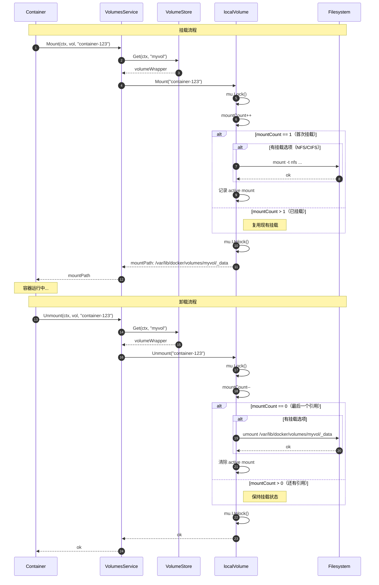
```mermaid
sequenceDiagram
    autonumber
    participant Container as Container
    participant Service as VolumesService
    participant Store as VolumeStore
    participant Volume as localVolume
    participant FS as Filesystem
    
    Note over Container,FS: 挂载流程
    Container->>Service: Mount(ctx, vol, "container-123")
    Service->>Store: Get(ctx, "myvol")
    Store-->>Service: volumeWrapper
    
    Service->>Volume: Mount("container-123")
    Volume->>Volume: mu.Lock()
    Volume->>Volume: mountCount++
    
    alt mountCount == 1（首次挂载）
        alt 有挂载选项（NFS/CIFS）
            Volume->>FS: mount -t nfs ...
            FS-->>Volume: ok
        end
        Volume->>Volume: 记录 active mount
    else mountCount > 1（已挂载）
        Note right of Volume: 复用现有挂载
    end
    
    Volume->>Volume: mu.Unlock()
    Volume-->>Service: mountPath: /var/lib/docker/volumes/myvol/_data
    Service-->>Container: mountPath
    
    Note over Container: 容器运行中...
    
    Note over Container,FS: 卸载流程
    Container->>Service: Unmount(ctx, vol, "container-123")
    Service->>Store: Get(ctx, "myvol")
    Store-->>Service: volumeWrapper
    
    Service->>Volume: Unmount("container-123")
    Volume->>Volume: mu.Lock()
    Volume->>Volume: mountCount--
    
    alt mountCount == 0（最后一个引用）
        alt 有挂载选项
            Volume->>FS: umount /var/lib/docker/volumes/myvol/_data
            FS-->>Volume: ok
        end
        Volume->>Volume: 清除 active mount
    else mountCount > 0（还有引用）
        Note right of Volume: 保持挂载状态
    end
    
    Volume->>Volume: mu.Unlock()
    Volume-->>Service: ok
    Service-->>Container: ok
```

### 说明

#### 图意概述
展示卷挂载与卸载的流程，重点是引用计数机制和 NFS 挂载的延迟卸载。

#### 挂载计数机制

```go
type localVolume struct {
    mu         sync.Mutex
    mountCount int  // 挂载引用计数
}

func (v *localVolume) Mount(id string) (string, error) {
    v.mu.Lock()
    defer v.mu.Unlock()
    
    v.mountCount++
    
    // 仅首次挂载时执行实际挂载操作
    if v.mountCount == 1 && v.needsMount() {
        if err := v.mount(); err != nil {
            v.mountCount--
            return "", err
        }
    }
    
    return v.path, nil
}

func (v *localVolume) Unmount(id string) error {
    v.mu.Lock()
    defer v.mu.Unlock()
    
    if v.mountCount == 0 {
        return errors.New("volume not mounted")
    }
    
    v.mountCount--
    
    // 仅最后一个引用释放时卸载
    if v.mountCount == 0 && v.active.mounted {
        return v.unmount()
    }
    
    return nil
}
```

#### 使用场景

```
容器 A 启动：Mount(vol, "container-A")  → mountCount = 1 → 执行 mount
容器 B 启动：Mount(vol, "container-B")  → mountCount = 2 → 复用挂载
容器 A 停止：Unmount(vol, "container-A") → mountCount = 1 → 保持挂载
容器 B 停止：Unmount(vol, "container-B") → mountCount = 0 → 执行 umount
```

#### 边界条件

- **重复挂载**：mountCount 正确递增
- **挂载失败**：回滚 mountCount
- **卸载未挂载卷**：返回错误

---

## 3. 容器使用卷的完整流程

### 时序图

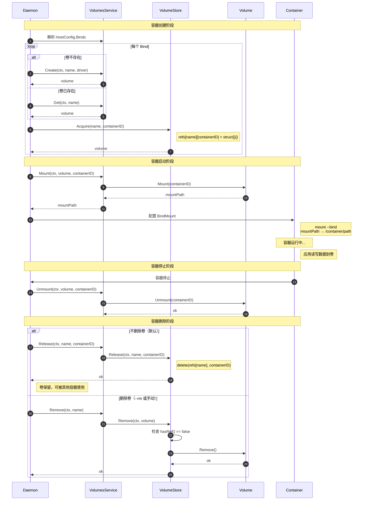
```mermaid
sequenceDiagram
    autonumber
    participant Daemon as Daemon
    participant Service as VolumesService
    participant Store as VolumeStore
    participant Volume as Volume
    participant Container as Container
    
    Note over Daemon,Container: 容器创建阶段
    Daemon->>Service: 解析 HostConfig.Binds
    
    loop 每个 Bind
        alt 卷不存在
            Daemon->>Service: Create(ctx, name, driver)
            Service-->>Daemon: volume
        else 卷已存在
            Daemon->>Service: Get(ctx, name)
            Service-->>Daemon: volume
        end
        
        Daemon->>Store: Acquire(name, containerID)
        Note right of Store: refs[name][containerID] = struct{}{}
        Store-->>Daemon: volume
    end
    
    Note over Daemon,Container: 容器启动阶段
    Daemon->>Service: Mount(ctx, volume, containerID)
    Service->>Volume: Mount(containerID)
    Volume-->>Service: mountPath
    Service-->>Daemon: mountPath
    
    Daemon->>Container: 配置 BindMount
    Note right of Container: mount --bind<br/>mountPath → /container/path
    
    Note over Container: 容器运行中...
    Note right of Container: 应用读写数据到卷
    
    Note over Daemon,Container: 容器停止阶段
    Container->>Daemon: 容器停止
    Daemon->>Service: Unmount(ctx, volume, containerID)
    Service->>Volume: Unmount(containerID)
    Volume-->>Service: ok
    
    Note over Daemon,Container: 容器删除阶段
    alt 不删除卷（默认）
        Daemon->>Service: Release(ctx, name, containerID)
        Service->>Store: Release(ctx, name, containerID)
        Note right of Store: delete(refs[name], containerID)
        Store-->>Daemon: ok
        Note right of Daemon: 卷保留，可被其他容器使用
    else 删除卷（--rm 或手动）
        Daemon->>Service: Remove(ctx, name)
        Service->>Store: Remove(ctx, volume)
        Store->>Store: 检查 hasRef() == false
        Store->>Volume: Remove()
        Volume-->>Store: ok
        Store-->>Daemon: ok
    end
```

### 说明

#### 图意概述
展示容器从创建到删除的完整卷使用流程，包括引用管理和挂载绑定。

#### 关键阶段

**1. 卷获取与引用（步骤 1-9）**：

```go
// 解析 HostConfig.Binds
for _, bind := range hostConfig.Binds {
    parts := strings.SplitN(bind, ":", 2)
    volumeName := parts[0]
    containerPath := parts[1]
    
    // 获取或创建卷
    vol, err := volumeService.Get(ctx, volumeName)
    if err != nil {
        vol, err = volumeService.Create(ctx, volumeName, "")
    }
    
    // 获取卷并增加引用
    vol, err = volumeStore.Acquire(volumeName, containerID)
}
```

**2. 挂载绑定（步骤 10-14）**：

```bash
# 1. 卷挂载（如果需要）
mount -t nfs ... /var/lib/docker/volumes/myvol/_data

# 2. 绑定到容器
mount --bind /var/lib/docker/volumes/myvol/_data \
    /var/lib/docker/containers/{id}/mounts/{mountID}

# 3. 容器 rootfs 配置
# runc 配置中添加 mount 规则
```

**3. 引用释放（步骤 17-23）**：

```go
// 容器删除时
for _, vol := range container.MountPoints {
    // 卸载
    volumeService.Unmount(ctx, vol, containerID)
    
    // 释放引用
    volumeService.Release(ctx, vol.Name, containerID)
}

// 如果是匿名卷且容器设置了 --rm
if vol.Anonymous && container.RemoveVolume {
    volumeService.Remove(ctx, vol.Name)
}
```

#### 边界条件

- **容器异常退出**：引用保留，可通过 live-restore 恢复
- **匿名卷**：容器删除时自动删除
- **命名卷**：容器删除后保留

---

## 4. 卷删除流程

### 时序图

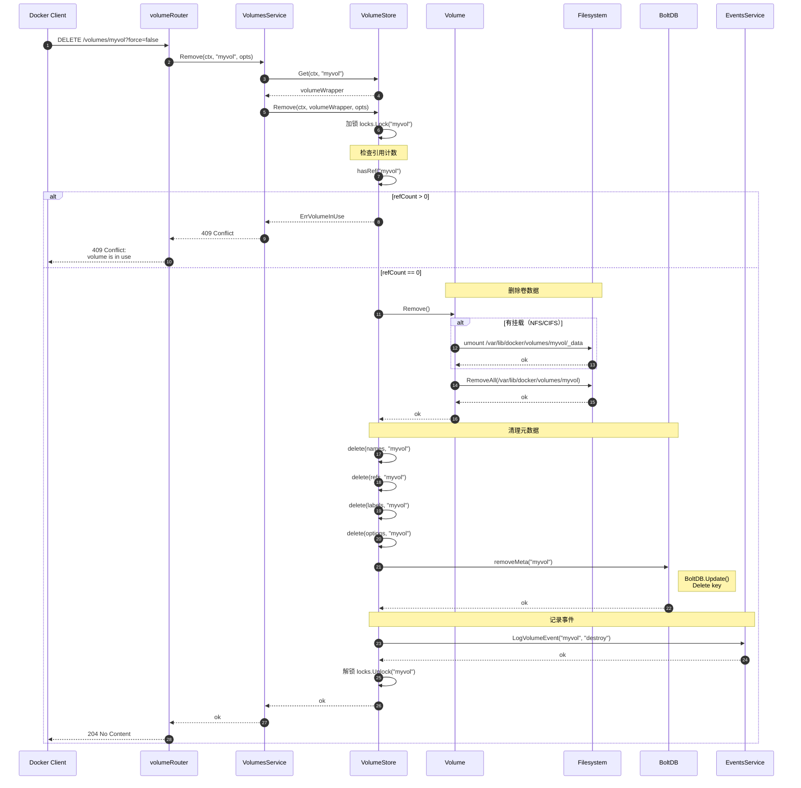
```mermaid
sequenceDiagram
    autonumber
    participant Client as Docker Client
    participant API as volumeRouter
    participant Service as VolumesService
    participant Store as VolumeStore
    participant Volume as Volume
    participant FS as Filesystem
    participant DB as BoltDB
    participant Events as EventsService
    
    Client->>API: DELETE /volumes/myvol?force=false
    API->>Service: Remove(ctx, "myvol", opts)
    Service->>Store: Get(ctx, "myvol")
    Store-->>Service: volumeWrapper
    
    Service->>Store: Remove(ctx, volumeWrapper, opts)
    Store->>Store: 加锁 locks.Lock("myvol")
    
    Note over Store: 检查引用计数
    Store->>Store: hasRef("myvol")
    
    alt refCount > 0
        Store-->>Service: ErrVolumeInUse
        Service-->>API: 409 Conflict
        API-->>Client: 409 Conflict:<br/>volume is in use
    else refCount == 0
        Note over Volume,FS: 删除卷数据
        Store->>Volume: Remove()
        
        alt 有挂载（NFS/CIFS）
            Volume->>FS: umount /var/lib/docker/volumes/myvol/_data
            FS-->>Volume: ok
        end
        
        Volume->>FS: RemoveAll(/var/lib/docker/volumes/myvol)
        FS-->>Volume: ok
        Volume-->>Store: ok
        
        Note over Store,DB: 清理元数据
        Store->>Store: delete(names, "myvol")
        Store->>Store: delete(refs, "myvol")
        Store->>Store: delete(labels, "myvol")
        Store->>Store: delete(options, "myvol")
        
        Store->>DB: removeMeta("myvol")
        Note right of DB: BoltDB.Update()<br/>Delete key
        DB-->>Store: ok
        
        Note over Store,Events: 记录事件
        Store->>Events: LogVolumeEvent("myvol", "destroy")
        Events-->>Store: ok
        
        Store->>Store: 解锁 locks.Unlock("myvol")
        Store-->>Service: ok
        Service-->>API: ok
        API-->>Client: 204 No Content
    end
```

### 说明

#### 图意概述
展示卷删除的完整流程，重点是引用计数检查和元数据清理。

#### 引用计数检查

```go
func (s *VolumeStore) Remove(ctx context.Context, v volume.Volume, opts ...opts.RemoveOption) error {
    name := v.Name()
    s.locks.Lock(name)
    defer s.locks.Unlock(name)
    
    // 检查引用
    if s.hasRef(name) {
        refs := s.countRefs(name)
        return &OpErr{
            Op:   "remove",
            Name: name,
            Err:  fmt.Errorf("volume is in use - %d container(s) reference it", refs),
        }
    }
    
    // 调用驱动删除
    if err := v.Remove(); err != nil {
        return err
    }
    
    // 清理元数据
    s.globalLock.Lock()
    delete(s.names, name)
    delete(s.refs, name)
    delete(s.labels, name)
    delete(s.options, name)
    s.globalLock.Unlock()
    
    s.removeMeta(name)
    s.eventLogger.LogVolumeEvent(name, events.ActionDestroy, nil)
    
    return nil
}
```

#### 边界条件

- **卷正在使用**：返回 409 Conflict
- **卷不存在**：返回 404 Not Found（force=false）
- **驱动删除失败**：返回 500 Internal Server Error
- **force=true**：忽略不存在错误

---

## 5. 卷清理流程

### 时序图

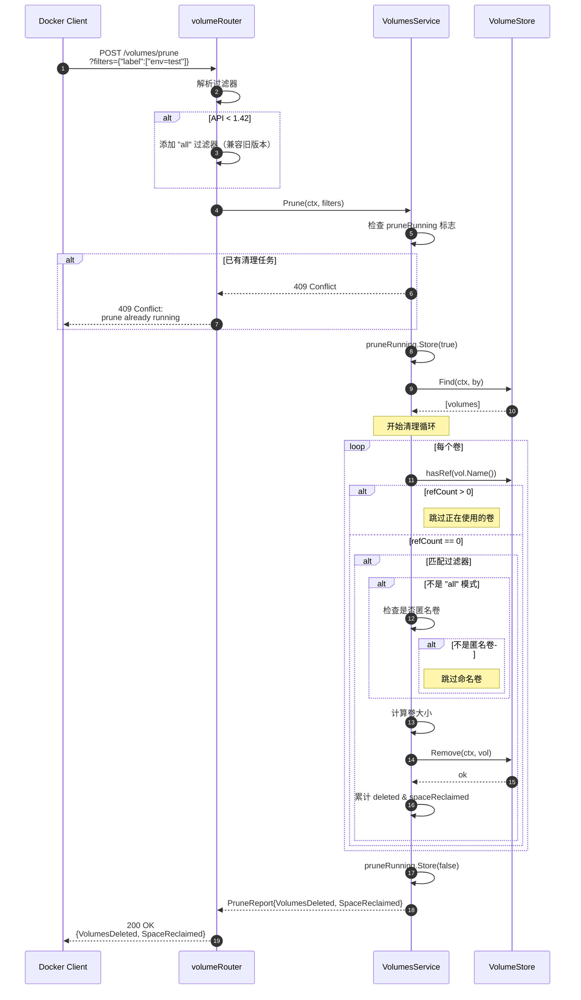
```mermaid
sequenceDiagram
    autonumber
    participant Client as Docker Client
    participant API as volumeRouter
    participant Service as VolumesService
    participant Store as VolumeStore
    
    Client->>API: POST /volumes/prune<br/>?filters={"label":["env=test"]}
    API->>API: 解析过滤器
    
    alt API < 1.42
        API->>API: 添加 "all" 过滤器（兼容旧版本）
    end
    
    API->>Service: Prune(ctx, filters)
    
    Service->>Service: 检查 pruneRunning 标志
    alt 已有清理任务
        Service-->>API: 409 Conflict
        API-->>Client: 409 Conflict:<br/>prune already running
    end
    
    Service->>Service: pruneRunning.Store(true)
    Service->>Store: Find(ctx, by)
    Store-->>Service: [volumes]
    
    Note over Service: 开始清理循环
    loop 每个卷
        Service->>Store: hasRef(vol.Name())
        
        alt refCount > 0
            Note right of Service: 跳过正在使用的卷
        else refCount == 0
            alt 匹配过滤器
                alt 不是 "all" 模式
                    Service->>Service: 检查是否匿名卷
                    alt 不是匿名卷
                        Note right of Service: 跳过命名卷
                    end
                end
                
                Service->>Service: 计算卷大小
                Service->>Store: Remove(ctx, vol)
                Store-->>Service: ok
                Service->>Service: 累计 deleted & spaceReclaimed
            end
        end
    end
    
    Service->>Service: pruneRunning.Store(false)
    Service-->>API: PruneReport{VolumesDeleted, SpaceReclaimed}
    API-->>Client: 200 OK<br/>{VolumesDeleted, SpaceReclaimed}
```

### 说明

#### 图意概述
展示卷清理的完整流程，包括并发控制、过滤逻辑、匿名卷判断。

#### 清理逻辑

```go
func (s *VolumesService) Prune(ctx context.Context, filter filters.Args) (*volumetypes.PruneReport, error) {
    // 防止并发清理
    if !s.pruneRunning.CompareAndSwap(false, true) {
        return nil, errdefs.Conflict(errors.New("prune already running"))
    }
    defer s.pruneRunning.Store(false)
    
    // 查找卷
    by, _ := filtersToBy(filter, acceptedPruneFilters)
    vols, _, _ := s.vs.Find(ctx, by)
    
    var deleted []string
    var spaceReclaimed uint64
    
    for _, v := range vols {
        // 跳过正在使用
        if s.vs.hasRef(v.Name()) {
            continue
        }
        
        // API >= 1.42: 默认仅清理匿名卷
        if !by.All && v.labels[AnonymousLabel] == "" {
            continue
        }
        
        // 计算空间
        if size, err := calculateSize(v.Path()); err == nil {
            spaceReclaimed += size
        }
        
        // 删除卷
        if err := s.vs.Remove(ctx, v); err == nil {
            deleted = append(deleted, v.Name())
        }
    }
    
    return &volumetypes.PruneReport{
        VolumesDeleted: deleted,
        SpaceReclaimed: spaceReclaimed,
    }, nil
}
```

#### 版本差异

**API < 1.42**：

- 默认清理**所有**未使用卷（匿名 + 命名）
- filters 隐式添加 `{"all": ["true"]}`

**API >= 1.42**：

- 默认仅清理**匿名**未使用卷
- 需要显式添加 `{"all": ["true"]}` 才清理命名卷

#### 边界条件

- **并发清理**：返回 409 Conflict
- **过滤器错误**：返回 400 Bad Request
- **部分删除失败**：成功的卷仍记录在报告中

---

## 6. NFS 卷挂载流程

### 时序图

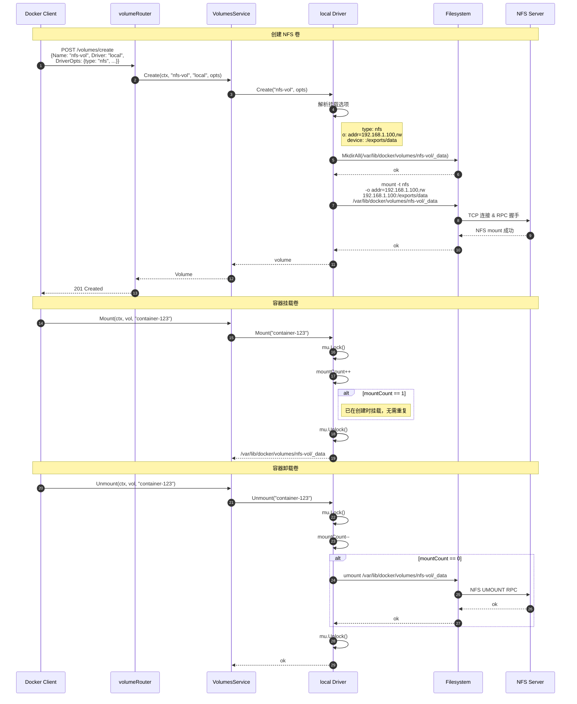
```mermaid
sequenceDiagram
    autonumber
    participant Client as Docker Client
    participant API as volumeRouter
    participant Service as VolumesService
    participant Driver as local Driver
    participant FS as Filesystem
    participant NFS as NFS Server
    
    Note over Client,NFS: 创建 NFS 卷
    Client->>API: POST /volumes/create<br/>{Name: "nfs-vol", Driver: "local",<br/>DriverOpts: {type: "nfs", ...}}
    API->>Service: Create(ctx, "nfs-vol", "local", opts)
    Service->>Driver: Create("nfs-vol", opts)
    
    Driver->>Driver: 解析挂载选项
    Note right of Driver: type: nfs<br/>o: addr=192.168.1.100,rw<br/>device: :/exports/data
    
    Driver->>FS: MkdirAll(/var/lib/docker/volumes/nfs-vol/_data)
    FS-->>Driver: ok
    
    Driver->>FS: mount -t nfs<br/>-o addr=192.168.1.100,rw<br/>192.168.1.100:/exports/data<br/>/var/lib/docker/volumes/nfs-vol/_data
    
    FS->>NFS: TCP 连接 & RPC 握手
    NFS-->>FS: NFS mount 成功
    FS-->>Driver: ok
    
    Driver-->>Service: volume
    Service-->>API: Volume
    API-->>Client: 201 Created
    
    Note over Client,NFS: 容器挂载卷
    Client->>Service: Mount(ctx, vol, "container-123")
    Service->>Driver: Mount("container-123")
    
    Driver->>Driver: mu.Lock()
    Driver->>Driver: mountCount++
    
    alt mountCount == 1
        Note right of Driver: 已在创建时挂载，无需重复
    end
    
    Driver->>Driver: mu.Unlock()
    Driver-->>Service: /var/lib/docker/volumes/nfs-vol/_data
    
    Note over Client,NFS: 容器卸载卷
    Client->>Service: Unmount(ctx, vol, "container-123")
    Service->>Driver: Unmount("container-123")
    
    Driver->>Driver: mu.Lock()
    Driver->>Driver: mountCount--
    
    alt mountCount == 0
        Driver->>FS: umount /var/lib/docker/volumes/nfs-vol/_data
        FS->>NFS: NFS UMOUNT RPC
        NFS-->>FS: ok
        FS-->>Driver: ok
    end
    
    Driver->>Driver: mu.Unlock()
    Driver-->>Service: ok
```

### 说明

#### 图意概述
展示 NFS 卷的特殊挂载流程，包括 NFS 协议交互和挂载计数管理。

#### NFS 挂载选项

```json
{
    "Driver": "local",
    "DriverOpts": {
        "type": "nfs",
        "o": "addr=192.168.1.100,vers=4,soft,timeo=180,bg,tcp,rw",
        "device": ":/exports/data"
    }
}
```

**对应的 mount 命令**：

```bash
mount -t nfs \
    -o addr=192.168.1.100,vers=4,soft,timeo=180,bg,tcp,rw \
    192.168.1.100:/exports/data \
    /var/lib/docker/volumes/nfs-vol/_data
```

#### 挂载时机

- **创建时挂载**：有 DriverOpts 时立即挂载
- **首次使用时挂载**：无 DriverOpts 的 NFS 卷

#### 边界条件

- **NFS 服务器不可达**：创建失败（超时）
- **网络中断**：soft 选项允许超时返回
- **权限不足**：EACCES 错误

---

**文档版本**：v1.0  
**最后更新**：2025-10-04

---
