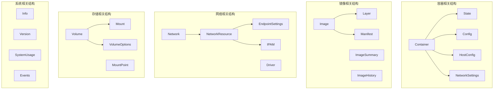
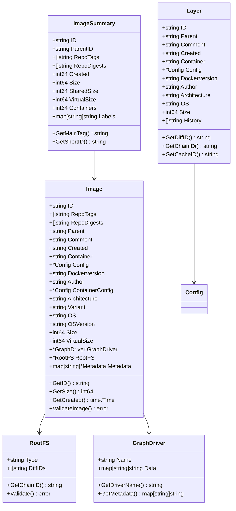
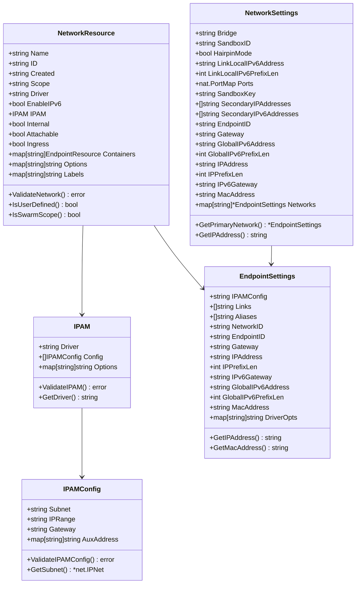
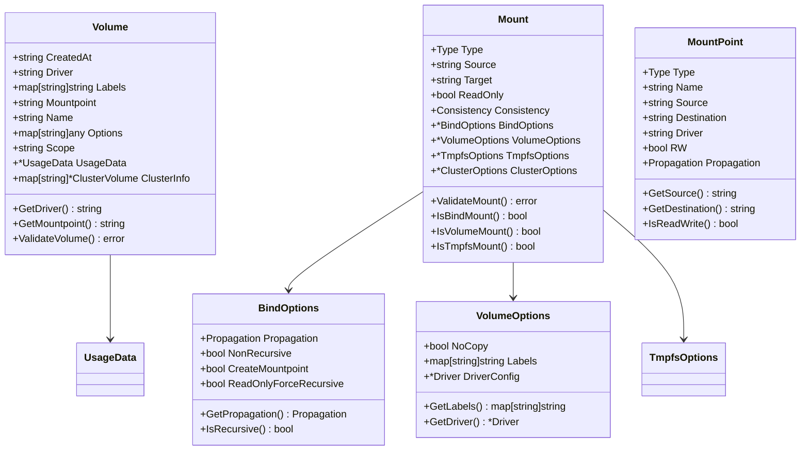

# Moby项目源码剖析 - 关键数据结构分析

## 1. 数据结构设计概述

### 1.1 设计原则
Moby项目中的数据结构设计遵循以下原则：

- **类型安全**: 使用强类型定义，避免运行时类型错误
- **序列化友好**: 支持JSON/YAML序列化，便于配置文件和API通信
- **版本兼容**: 通过标签和字段可选性支持API版本演进
- **组合优于继承**: 通过嵌入和接口组合实现功能扩展
- **不可变性**: 关键状态数据采用只读或原子操作保护

### 1.2 核心数据结构分类



## 2. 容器相关数据结构

### 2.1 Container 核心结构

```mermaid
classDiagram
    class Container {
        +string ID
        +string Name
        +time.Time Created
        +string Path
        +[]string Args
        +*Config Config
        +*HostConfig HostConfig
        +*NetworkSettings NetworkSettings
        +*State State
        +string Root
        +string BaseFS
        +RWLayer RWLayer
        +image.ID ImageID
        +*ocispec.Descriptor ImageManifest
        +ocispec.Platform ImagePlatform
        +map[string]*MountPoint MountPoints
        +int RestartCount
        +bool HasBeenStartedBefore
        +bool HasBeenManuallyStopped
        +*ExecStore ExecCommands
        +logger.Logger LogDriver
        +*logger.Copier LogCopier
        +*restartmanager.RestartManager restartManager
        +SecurityOptions
        +string HostnamePath
        +string HostsPath
        +string ResolvConfPath
        +string ShmPath
        
        +Lock()
        +Unlock()
        +SetStarting() error
        +SetRunning(pid int)
        +SetStopped(*ExitStatus)
        +IsRunning() bool
        +IsPaused() bool
        +ShouldRestart() bool
        +ToDisk() error
        +FromDisk() error
    }

    class State {
        +sync.Mutex
        +ContainerState Status
        +bool Running
        +bool Paused  
        +bool Restarting
        +bool OOMKilled
        +bool Dead
        +int Pid
        +int ExitCode
        +string Error
        +string StartedAt
        +string FinishedAt
        +*Health Health
        +*ExitStatus ExitStatus
        
        +String() string
        +StateString() string
        +SetStarting() error
        +SetRunning(pid int, startedAt time.Time)
        +SetStopped(exitStatus *ExitStatus)
        +SetRestarting(exitStatus *ExitStatus)  
        +SetError(err error)
        +SetPaused()
        +SetUnpaused()
        +IsValidStateTransition(newState ContainerState) bool
    }

    class Config {
        +string Hostname
        +string Domainname
        +string User
        +bool AttachStdin
        +bool AttachStdout
        +bool AttachStderr
        +nat.PortSet ExposedPorts
        +bool Tty
        +bool OpenStdin
        +bool StdinOnce
        +[]string Env
        +[]string Cmd
        +*HealthConfig Healthcheck
        +bool ArgsEscaped
        +string Image
        +map[string]struct{} Volumes
        +string WorkingDir
        +[]string Entrypoint
        +bool NetworkDisabled
        +string MacAddress
        +[]string OnBuild
        +map[string]string Labels
        +*int StopTimeout
        +string StopSignal
        +[]string Shell
        
        +ValidateConfig() error
    }

    class HostConfig {
        +[]string Binds
        +string ContainerIDFile
        +*LogConfig LogConfig
        +string NetworkMode
        +nat.PortMap PortBindings
        +*RestartPolicy RestartPolicy
        +bool AutoRemove
        +string VolumeDriver
        +[]string VolumesFrom
        +[]string CapAdd
        +[]string CapDrop
        +[]string CgroupnsMode
        +[]string DNS
        +[]string DNSOptions
        +[]string DNSSearch
        +[]string ExtraHosts
        +[]string GroupAdd
        +string IpcMode
        +string Cgroup
        +[]string Links
        +string OomScoreAdj
        +string PidMode
        +bool Privileged
        +bool PublishAllPorts
        +bool ReadonlyRootfs
        +[]string SecurityOpt
        +map[string]string StorageOpt
        +map[string]string Tmpfs
        +string UTSMode
        +string UsernsMode
        +int64 ShmSize
        +*Resources Resources
        +[]mount.Mount Mounts
        +[]string MaskedPaths
        +[]string ReadonlyPaths
        +string Init
        +[2]uint ConsoleSize
        +string Isolation
        
        +ValidateHostConfig() error
    }

    Container --> State
    Container --> Config
    Container --> HostConfig
    Container --> SecurityOptions
```

### 2.2 容器状态管理

```go
// 文件路径: daemon/container/state.go
// State 定义容器的运行状态，包含状态转换逻辑和并发安全保护

type State struct {
	sync.Mutex                          // 状态锁，保护并发访问

	// 基础状态字段
	Status      ContainerState          // 容器状态枚举值
	Running     bool                    // 是否正在运行
	Paused      bool                    // 是否已暂停
	Restarting  bool                    // 是否正在重启
	OOMKilled   bool                    // 是否被OOM杀死
	Dead        bool                    // 是否处于死亡状态
	Pid         int                     // 主进程PID
	ExitCode    int                     // 退出代码
	Error       string                  // 错误信息
	StartedAt   string                  // 启动时间
	FinishedAt  string                  // 结束时间

	// 健康检查状态
	Health      *Health                 // 健康检查结果

	// 退出状态详情
	ExitStatus  *ExitStatus            // 退出状态详细信息
}

// ContainerState 定义容器状态枚举
type ContainerState string

const (
	// Created 容器已创建但未启动
	Created ContainerState = "created"
	
	// Running 容器正在运行
	Running ContainerState = "running"
	
	// Paused 容器被暂停（进程冻结但未终止）
	Paused ContainerState = "paused"
	
	// Restarting 容器正在重启
	Restarting ContainerState = "restarting"
	
	// Removing 容器正在被删除
	Removing ContainerState = "removing"
	
	// Exited 容器已退出
	Exited ContainerState = "exited"
	
	// Dead 容器处于死亡状态（异常终止）
	Dead ContainerState = "dead"
)

// SetRunning 设置容器为运行状态
func (s *State) SetRunning(pid int, startedAt time.Time) {
	s.Lock()
	defer s.Unlock()
	
	s.Status = Running
	s.Running = true
	s.Paused = false
	s.Restarting = false
	s.Dead = false
	s.Pid = pid
	s.StartedAt = startedAt.UTC().Format(time.RFC3339Nano)
}

// SetStopped 设置容器为停止状态
func (s *State) SetStopped(exitStatus *ExitStatus) {
	s.Lock()
	defer s.Unlock()
	
	s.Status = Exited
	s.Running = false
	s.Paused = false
	s.Restarting = false
	s.Dead = false
	s.Pid = 0
	s.ExitCode = exitStatus.ExitCode
	s.FinishedAt = exitStatus.ExitedAt.UTC().Format(time.RFC3339Nano)
	s.ExitStatus = exitStatus
}

// SetPaused 设置容器为暂停状态
func (s *State) SetPaused() {
	s.Lock()
	defer s.Unlock()
	
	s.Status = Paused
	s.Paused = true
}

// SetUnpaused 取消容器暂停状态
func (s *State) SetUnpaused() {
	s.Lock()
	defer s.Unlock()
	
	s.Status = Running
	s.Paused = false
}

// IsValidStateTransition 验证状态转换是否有效
func (s *State) IsValidStateTransition(newState ContainerState) bool {
	currentState := s.Status
	
	// 定义有效的状态转换映射
	validTransitions := map[ContainerState][]ContainerState{
		Created:    {Running, Removing, Dead},
		Running:    {Paused, Exited, Restarting, Dead, Removing},
		Paused:     {Running, Exited, Dead, Removing},
		Restarting: {Running, Exited, Dead, Removing},
		Exited:     {Running, Removing, Dead},
		Dead:       {Removing},
		Removing:   {}, // 终态，不能转换到其他状态
	}
	
	validNext, exists := validTransitions[currentState]
	if !exists {
		return false
	}
	
	for _, valid := range validNext {
		if valid == newState {
			return true
		}
	}
	
	return false
}
```

### 2.3 容器配置结构

```go
// 文件路径: api/types/container/config.go
// Config 定义容器的基础配置信息

type Config struct {
	// 基础标识信息
	Hostname     string                 // 容器主机名
	Domainname   string                 // 域名
	User         string                 // 运行用户
	
	// 标准输入输出配置
	AttachStdin  bool                   // 是否附加标准输入
	AttachStdout bool                   // 是否附加标准输出
	AttachStderr bool                   // 是否附加标准错误
	
	// 网络配置
	ExposedPorts nat.PortSet            // 暴露的端口集合
	MacAddress   string                 // MAC地址（已废弃）
	
	// 终端配置
	Tty          bool                   // 是否分配伪终端
	OpenStdin    bool                   // 是否保持标准输入开启
	StdinOnce    bool                   // 标准输入是否只读一次
	
	// 环境和命令
	Env          []string               // 环境变量列表
	Cmd          strslice.StrSlice      // 容器启动命令
	Entrypoint   strslice.StrSlice      // 入口点
	
	// 镜像和工作目录
	Image        string                 // 镜像名称
	WorkingDir   string                 // 工作目录
	
	// 存储卷
	Volumes      map[string]struct{}    // 声明的存储卷
	
	// 健康检查
	Healthcheck  *HealthConfig          // 健康检查配置
	
	// 网络配置
	NetworkDisabled bool                // 是否禁用网络
	
	// 停止配置
	StopSignal   string                 // 停止信号
	StopTimeout  *int                   // 停止超时时间（秒）
	Shell        strslice.StrSlice      // Shell命令
	
	// 构建相关
	OnBuild      []string               // OnBuild指令
	ArgsEscaped  bool                   // 参数是否已转义
	
	// 元数据
	Labels       map[string]string      // 标签键值对
}

// HealthConfig 定义健康检查配置
type HealthConfig struct {
	// 健康检查命令
	Test []string `json:",omitempty"`
	
	// 检查间隔（纳秒）
	Interval time.Duration `json:",omitempty"`
	
	// 检查超时（纳秒）  
	Timeout time.Duration `json:",omitempty"`
	
	// 启动前延迟检查时间（纳秒）
	StartPeriod time.Duration `json:",omitempty"`
	
	// 启动间隔检查时间（纳秒，API 1.44+）
	StartInterval time.Duration `json:",omitempty"`
	
	// 连续失败次数阈值
	Retries int `json:",omitempty"`
}

// ValidateConfig 验证容器配置
func (config *Config) ValidateConfig() error {
	// 1. 验证镜像名称
	if config.Image == "" {
		return errors.New("image name cannot be empty")
	}
	
	// 2. 验证用户格式
	if config.User != "" {
		if err := validateUser(config.User); err != nil {
			return fmt.Errorf("invalid user: %v", err)
		}
	}
	
	// 3. 验证环境变量格式
	for _, env := range config.Env {
		if !strings.Contains(env, "=") {
			return fmt.Errorf("invalid environment variable: %s", env)
		}
	}
	
	// 4. 验证标签格式
	for key := range config.Labels {
		if err := validateLabelKey(key); err != nil {
			return fmt.Errorf("invalid label key %s: %v", key, err)
		}
	}
	
	// 5. 验证健康检查配置
	if config.Healthcheck != nil {
		if err := config.Healthcheck.Validate(); err != nil {
			return fmt.Errorf("invalid healthcheck: %v", err)
		}
	}
	
	return nil
}
```

## 3. 镜像相关数据结构

### 3.1 镜像结构UML图



### 3.2 镜像数据结构实现

```go
// 文件路径: api/types/image/image.go
// Image 定义镜像的完整信息结构

type Image struct {
	// 基础标识
	ID          string    `json:"Id"`           // 镜像ID（SHA256摘要）
	RepoTags    []string  `json:"RepoTags"`     // 仓库标签列表
	RepoDigests []string  `json:"RepoDigests"`  // 仓库摘要列表
	Parent      string    `json:"Parent"`       // 父镜像ID
	Comment     string    `json:"Comment"`      // 注释信息
	Created     string    `json:"Created"`      // 创建时间
	Container   string    `json:"Container"`    // 创建该镜像的容器ID
	
	// 配置信息
	Config          *container.Config `json:"Config"`          // 容器配置
	ContainerConfig *container.Config `json:"ContainerConfig"` // 构建时容器配置
	
	// 构建信息
	DockerVersion string `json:"DockerVersion"` // Docker版本
	Author        string `json:"Author"`        // 作者信息
	
	// 平台信息
	Architecture string `json:"Architecture"` // CPU架构
	Variant      string `json:"Variant"`      // 架构变体
	OS           string `json:"Os"`           // 操作系统
	OSVersion    string `json:"OsVersion"`    // 操作系统版本
	OSFeatures   []string `json:"OsFeatures"` // 操作系统特性
	
	// 大小信息
	Size        int64 `json:"Size"`        // 镜像大小
	VirtualSize int64 `json:"VirtualSize"` // 虚拟大小（包含父镜像）
	
	// 存储信息
	GraphDriver *GraphDriver `json:"GraphDriver"` // 图形驱动信息
	RootFS      *RootFS      `json:"RootFS"`      // 根文件系统信息
	
	// 元数据
	Metadata map[string]*Metadata `json:"Metadata"` // 镜像元数据
}

// ImageSummary 定义镜像摘要信息，用于列表显示
type ImageSummary struct {
	ID          string            `json:"Id"`          // 镜像ID
	ParentID    string            `json:"ParentId"`    // 父镜像ID
	RepoTags    []string          `json:"RepoTags"`    // 仓库标签
	RepoDigests []string          `json:"RepoDigests"` // 仓库摘要
	Created     int64             `json:"Created"`     // 创建时间戳
	Size        int64             `json:"Size"`        // 镜像大小
	SharedSize  int64             `json:"SharedSize"`  // 共享大小
	VirtualSize int64             `json:"VirtualSize"` // 虚拟大小
	Labels      map[string]string `json:"Labels"`      // 标签
	Containers  int64             `json:"Containers"`  // 使用此镜像的容器数量
}

// RootFS 定义根文件系统结构
type RootFS struct {
	Type    string   `json:"type"`     // 文件系统类型，通常为"layers"
	DiffIDs []string `json:"diff_ids"` // 层差异ID列表
}

// GraphDriver 定义图形驱动信息
type GraphDriver struct {
	Name string                 `json:"Name"` // 驱动名称（如overlay2、aufs等）
	Data map[string]string      `json:"Data"` // 驱动特定数据
}

// GetMainTag 获取主要标签（第一个非<none>标签）
func (summary *ImageSummary) GetMainTag() string {
	for _, tag := range summary.RepoTags {
		if tag != "<none>:<none>" {
			return tag
		}
	}
	if len(summary.RepoTags) > 0 {
		return summary.RepoTags[0]
	}
	return "<none>:<none>"
}

// GetShortID 获取短ID（前12个字符）
func (summary *ImageSummary) GetShortID() string {
	if len(summary.ID) > 12 {
		return summary.ID[:12]
	}
	return summary.ID
}

// ValidateImage 验证镜像数据结构
func (img *Image) ValidateImage() error {
	// 1. 验证ID格式
	if img.ID == "" {
		return errors.New("image ID cannot be empty")
	}
	
	if !isValidImageID(img.ID) {
		return fmt.Errorf("invalid image ID format: %s", img.ID)
	}
	
	// 2. 验证架构信息
	if img.Architecture == "" {
		return errors.New("image architecture cannot be empty")
	}
	
	// 3. 验证操作系统
	if img.OS == "" {
		return errors.New("image OS cannot be empty")
	}
	
	// 4. 验证根文件系统
	if img.RootFS == nil {
		return errors.New("image rootfs cannot be nil")
	}
	
	if err := img.RootFS.Validate(); err != nil {
		return fmt.Errorf("invalid rootfs: %v", err)
	}
	
	return nil
}

// Validate 验证根文件系统结构
func (rfs *RootFS) Validate() error {
	if rfs.Type == "" {
		return errors.New("rootfs type cannot be empty")
	}
	
	if len(rfs.DiffIDs) == 0 {
		return errors.New("rootfs must have at least one diff ID")
	}
	
	// 验证每个DiffID格式
	for i, diffID := range rfs.DiffIDs {
		if !isValidDiffID(diffID) {
			return fmt.Errorf("invalid diff ID at index %d: %s", i, diffID)
		}
	}
	
	return nil
}
```

## 4. 网络相关数据结构

### 4.1 网络结构UML图



### 4.2 网络配置结构实现

```go
// 文件路径: api/types/network/network.go
// NetworkResource 定义网络资源的完整信息

type NetworkResource struct {
	// 基础信息
	Name       string    `json:"Name"`       // 网络名称
	ID         string    `json:"Id"`         // 网络ID
	Created    time.Time `json:"Created"`    // 创建时间
	Scope      string    `json:"Scope"`      // 作用域（local/global/swarm）
	Driver     string    `json:"Driver"`     // 网络驱动名称
	EnableIPv6 bool      `json:"EnableIPv6"` // 是否启用IPv6
	
	// IPAM配置
	IPAM IPAM `json:"IPAM"` // IP地址管理配置
	
	// 网络属性
	Internal   bool `json:"Internal"`   // 是否为内部网络
	Attachable bool `json:"Attachable"` // 是否允许手动附加
	Ingress    bool `json:"Ingress"`    // 是否为Swarm入口网络
	
	// 容器连接信息
	Containers map[string]EndpointResource `json:"Containers"` // 连接的容器
	
	// 配置选项
	Options map[string]string `json:"Options"` // 驱动选项
	Labels  map[string]string `json:"Labels"`  // 网络标签
}

// IPAM 定义IP地址管理配置
type IPAM struct {
	Driver  string                 `json:"Driver"`  // IPAM驱动名称
	Config  []IPAMConfig           `json:"Config"`  // IPAM配置列表
	Options map[string]string      `json:"Options"` // IPAM选项
}

// IPAMConfig 定义IPAM具体配置
type IPAMConfig struct {
	Subnet     string            `json:"Subnet,omitempty"`     // 子网CIDR
	IPRange    string            `json:"IPRange,omitempty"`    // IP范围
	Gateway    string            `json:"Gateway,omitempty"`    // 网关地址
	AuxAddress map[string]string `json:"AuxiliaryAddresses,omitempty"` // 辅助地址
}

// EndpointSettings 定义端点设置（容器在网络中的配置）
type EndpointSettings struct {
	// IPAM配置
	IPAMConfig *EndpointIPAMConfig `json:"IPAMConfig"` // 端点IPAM配置
	
	// 连接设置
	Links   []string `json:"Links"`   // 链接的容器
	Aliases []string `json:"Aliases"` // 网络别名
	
	// 网络标识
	NetworkID  string `json:"NetworkID"`  // 网络ID
	EndpointID string `json:"EndpointID"` // 端点ID
	
	// IP配置
	Gateway             string `json:"Gateway"`             // IPv4网关
	IPAddress           string `json:"IPAddress"`           // IPv4地址
	IPPrefixLen         int    `json:"IPPrefixLen"`         // IPv4前缀长度
	IPv6Gateway         string `json:"IPv6Gateway"`         // IPv6网关
	GlobalIPv6Address   string `json:"GlobalIPv6Address"`   // IPv6地址
	GlobalIPv6PrefixLen int    `json:"GlobalIPv6PrefixLen"` // IPv6前缀长度
	MacAddress          string `json:"MacAddress"`          // MAC地址
	
	// 驱动选项
	DriverOpts map[string]string `json:"DriverOpts"` // 端点驱动选项
}

// NetworkSettings 定义容器的网络设置
type NetworkSettings struct {
	// 默认网络设置（向后兼容）
	Bridge                 string                `json:"Bridge"`                 // 桥接网络名称
	SandboxID              string                `json:"SandboxID"`              // 网络沙盒ID
	HairpinMode            bool                  `json:"HairpinMode"`            // 是否启用Hairpin模式
	LinkLocalIPv6Address   string                `json:"LinkLocalIPv6Address"`   // 链路本地IPv6地址
	LinkLocalIPv6PrefixLen int                   `json:"LinkLocalIPv6PrefixLen"` // 链路本地IPv6前缀长度
	Ports                  nat.PortMap           `json:"Ports"`                  // 端口映射
	SandboxKey             string                `json:"SandboxKey"`             // 沙盒键
	SecondaryIPAddresses   []Address             `json:"SecondaryIPAddresses"`   // 辅助IPv4地址
	SecondaryIPv6Addresses []Address             `json:"SecondaryIPv6Addresses"` // 辅助IPv6地址
	
	// 默认网络的端点设置（向后兼容）
	EndpointID        string `json:"EndpointID"`        // 端点ID
	Gateway           string `json:"Gateway"`           // 网关
	GlobalIPv6Address string `json:"GlobalIPv6Address"` // IPv6地址
	GlobalIPv6PrefixLen int  `json:"GlobalIPv6PrefixLen"` // IPv6前缀长度
	IPAddress         string `json:"IPAddress"`         // IP地址
	IPPrefixLen       int    `json:"IPPrefixLen"`       // IP前缀长度
	IPv6Gateway       string `json:"IPv6Gateway"`       // IPv6网关
	MacAddress        string `json:"MacAddress"`        // MAC地址
	
	// 所有网络的端点设置
	Networks map[string]*EndpointSettings `json:"Networks"` // 网络端点映射
}

// ValidateNetwork 验证网络配置
func (n *NetworkResource) ValidateNetwork() error {
	// 1. 验证网络名称
	if n.Name == "" {
		return errors.New("network name cannot be empty")
	}
	
	if !isValidNetworkName(n.Name) {
		return fmt.Errorf("invalid network name: %s", n.Name)
	}
	
	// 2. 验证网络驱动
	if n.Driver == "" {
		return errors.New("network driver cannot be empty")
	}
	
	// 3. 验证IPAM配置
	if err := n.IPAM.ValidateIPAM(); err != nil {
		return fmt.Errorf("invalid IPAM configuration: %v", err)
	}
	
	// 4. 验证作用域
	validScopes := []string{"local", "global", "swarm"}
	if !contains(validScopes, n.Scope) {
		return fmt.Errorf("invalid network scope: %s", n.Scope)
	}
	
	return nil
}

// ValidateIPAM 验证IPAM配置
func (ipam *IPAM) ValidateIPAM() error {
	// 1. 验证驱动名称
	if ipam.Driver == "" {
		ipam.Driver = "default" // 使用默认驱动
	}
	
	// 2. 验证配置列表
	for i, config := range ipam.Config {
		if err := config.ValidateIPAMConfig(); err != nil {
			return fmt.Errorf("invalid IPAM config at index %d: %v", i, err)
		}
	}
	
	return nil
}

// ValidateIPAMConfig 验证IPAM具体配置
func (config *IPAMConfig) ValidateIPAMConfig() error {
	// 1. 验证子网格式
	if config.Subnet != "" {
		if _, _, err := net.ParseCIDR(config.Subnet); err != nil {
			return fmt.Errorf("invalid subnet CIDR: %s", config.Subnet)
		}
	}
	
	// 2. 验证IP范围格式
	if config.IPRange != "" {
		if _, _, err := net.ParseCIDR(config.IPRange); err != nil {
			return fmt.Errorf("invalid IP range CIDR: %s", config.IPRange)
		}
	}
	
	// 3. 验证网关地址
	if config.Gateway != "" {
		if net.ParseIP(config.Gateway) == nil {
			return fmt.Errorf("invalid gateway IP: %s", config.Gateway)
		}
	}
	
	// 4. 验证辅助地址
	for name, addr := range config.AuxAddress {
		if net.ParseIP(addr) == nil {
			return fmt.Errorf("invalid auxiliary address %s: %s", name, addr)
		}
	}
	
	return nil
}

// GetPrimaryNetwork 获取主要网络端点设置
func (ns *NetworkSettings) GetPrimaryNetwork() *EndpointSettings {
	// 1. 如果只有一个网络，返回该网络
	if len(ns.Networks) == 1 {
		for _, endpoint := range ns.Networks {
			return endpoint
		}
	}
	
	// 2. 优先返回bridge网络
	if endpoint, exists := ns.Networks["bridge"]; exists {
		return endpoint
	}
	
	// 3. 返回第一个网络
	for _, endpoint := range ns.Networks {
		return endpoint
	}
	
	return nil
}
```

## 5. 存储相关数据结构

### 5.1 存储卷结构UML图



### 5.2 存储结构实现

```go
// 文件路径: api/types/volume/volume.go
// Volume 定义存储卷的完整信息

type Volume struct {
	// 创建时间
	CreatedAt string `json:"CreatedAt,omitempty"`
	
	// 驱动信息
	Driver string `json:"Driver"` // 存储卷驱动名称
	
	// 元数据
	Labels map[string]string `json:"Labels"` // 存储卷标签
	
	// 挂载信息
	Mountpoint string `json:"Mountpoint"` // 挂载点路径
	Name       string `json:"Name"`       // 存储卷名称
	
	// 驱动选项
	Options map[string]interface{} `json:"Options"` // 驱动特定选项
	
	// 作用域
	Scope string `json:"Scope"` // 存储卷作用域
	
	// 使用情况（可选）
	UsageData *UsageData `json:"UsageData,omitempty"` // 使用统计
	
	// 集群卷信息（Swarm模式）
	ClusterInfo map[string]*ClusterVolume `json:"ClusterVolume,omitempty"`
}

// UsageData 定义存储卷使用统计
type UsageData struct {
	Size     int64 `json:"Size"`     // 存储卷大小
	RefCount int64 `json:"RefCount"` // 引用计数
}

// 文件路径: api/types/mount/mount.go
// Mount 定义挂载配置

type Mount struct {
	// 挂载类型
	Type Type `json:"Type,omitempty"`
	
	// 源和目标路径
	Source string `json:"Source,omitempty"` // 源路径
	Target string `json:"Target,omitempty"` // 容器内目标路径
	
	// 读写权限
	ReadOnly bool `json:"ReadOnly,omitempty"`
	
	// 一致性模式（macOS/Windows）
	Consistency Consistency `json:"Consistency,omitempty"`
	
	// 类型特定选项
	BindOptions    *BindOptions    `json:"BindOptions,omitempty"`
	VolumeOptions  *VolumeOptions  `json:"VolumeOptions,omitempty"`
	TmpfsOptions   *TmpfsOptions   `json:"TmpfsOptions,omitempty"`
	ClusterOptions *ClusterOptions `json:"ClusterOptions,omitempty"`
}

// Type 定义挂载类型
type Type string

const (
	// TypeBind 绑定挂载（主机路径到容器路径）
	TypeBind Type = "bind"
	
	// TypeVolume 存储卷挂载
	TypeVolume Type = "volume"
	
	// TypeTmpfs 临时文件系统挂载
	TypeTmpfs Type = "tmpfs"
	
	// TypeNamedPipe 命名管道挂载（Windows）
	TypeNamedPipe Type = "npipe"
	
	// TypeCluster 集群存储卷挂载
	TypeCluster Type = "cluster"
)

// BindOptions 定义绑定挂载选项
type BindOptions struct {
	// 传播模式
	Propagation Propagation `json:"Propagation,omitempty"`
	
	// 是否非递归绑定
	NonRecursive bool `json:"NonRecursive,omitempty"`
	
	// 是否创建挂载点
	CreateMountpoint bool `json:"CreateMountpoint,omitempty"`
	
	// 是否强制递归只读
	ReadOnlyForceRecursive bool `json:"ReadOnlyForceRecursive,omitempty"`
}

// Propagation 定义挂载传播模式
type Propagation string

const (
	// PropagationRPrivate 私有递归传播
	PropagationRPrivate Propagation = "rprivate"
	
	// PropagationPrivate 私有传播
	PropagationPrivate Propagation = "private"
	
	// PropagationRShared 共享递归传播
	PropagationRShared Propagation = "rshared"
	
	// PropagationShared 共享传播
	PropagationShared Propagation = "shared"
	
	// PropagationRSlave 从属递归传播
	PropagationRSlave Propagation = "rslave"
	
	// PropagationSlave 从属传播
	PropagationSlave Propagation = "slave"
)

// VolumeOptions 定义存储卷挂载选项
type VolumeOptions struct {
	// 是否禁用复制
	NoCopy bool `json:"NoCopy,omitempty"`
	
	// 存储卷标签
	Labels map[string]string `json:"Labels,omitempty"`
	
	// 驱动配置
	DriverConfig *Driver `json:"DriverConfig,omitempty"`
}

// Driver 定义存储卷驱动配置
type Driver struct {
	Name    string            `json:"Name"`    // 驱动名称
	Options map[string]string `json:"Options"` // 驱动选项
}

// TmpfsOptions 定义tmpfs挂载选项
type TmpfsOptions struct {
	SizeBytes int64  `json:"SizeBytes,omitempty"` // 大小限制（字节）
	Mode      uint32 `json:"Mode,omitempty"`      // 文件模式
}

// ValidateMount 验证挂载配置
func (m *Mount) ValidateMount() error {
	// 1. 验证挂载类型
	if m.Type == "" {
		return errors.New("mount type cannot be empty")
	}
	
	validTypes := []Type{TypeBind, TypeVolume, TypeTmpfs, TypeNamedPipe, TypeCluster}
	if !contains(validTypes, m.Type) {
		return fmt.Errorf("invalid mount type: %s", m.Type)
	}
	
	// 2. 验证目标路径
	if m.Target == "" {
		return errors.New("mount target cannot be empty")
	}
	
	if !filepath.IsAbs(m.Target) {
		return fmt.Errorf("mount target must be absolute path: %s", m.Target)
	}
	
	// 3. 根据类型验证特定配置
	switch m.Type {
	case TypeBind:
		if m.Source == "" {
			return errors.New("bind mount source cannot be empty")
		}
		
		if !filepath.IsAbs(m.Source) {
			return fmt.Errorf("bind mount source must be absolute path: %s", m.Source)
		}
		
		if m.BindOptions != nil {
			if err := m.BindOptions.Validate(); err != nil {
				return fmt.Errorf("invalid bind options: %v", err)
			}
		}
		
	case TypeVolume:
		// 存储卷名称可以为空（匿名卷）
		if m.VolumeOptions != nil {
			if err := m.VolumeOptions.Validate(); err != nil {
				return fmt.Errorf("invalid volume options: %v", err)
			}
		}
		
	case TypeTmpfs:
		if m.Source != "" {
			return errors.New("tmpfs mount should not specify source")
		}
		
		if m.TmpfsOptions != nil {
			if err := m.TmpfsOptions.Validate(); err != nil {
				return fmt.Errorf("invalid tmpfs options: %v", err)
			}
		}
	}
	
	return nil
}

// IsBindMount 检查是否为绑定挂载
func (m *Mount) IsBindMount() bool {
	return m.Type == TypeBind
}

// IsVolumeMount 检查是否为存储卷挂载
func (m *Mount) IsVolumeMount() bool {
	return m.Type == TypeVolume
}

// IsTmpfsMount 检查是否为tmpfs挂载
func (m *Mount) IsTmpfsMount() bool {
	return m.Type == TypeTmpfs
}
```

## 6. 系统相关数据结构

### 6.1 系统信息结构

```go
// 文件路径: api/types/system/info.go
// Info 定义Docker系统信息

type Info struct {
	// 基础信息
	ID               string    `json:"ID"`               // 守护进程ID
	Containers       int       `json:"Containers"`       // 容器总数
	ContainersRunning int       `json:"ContainersRunning"` // 运行中容器数
	ContainersPaused int       `json:"ContainersPaused"`  // 暂停容器数
	ContainersStopped int      `json:"ContainersStopped"` // 停止容器数
	Images           int       `json:"Images"`            // 镜像总数
	Driver           string    `json:"Driver"`            // 存储驱动
	DriverStatus     [][2]string `json:"DriverStatus"`    // 驱动状态信息
	
	// 系统资源
	SystemStatus     [][2]string `json:"SystemStatus"`     // 系统状态
	Plugins          PluginsInfo `json:"Plugins"`          // 插件信息
	MemoryLimit      bool        `json:"MemoryLimit"`      // 内存限制支持
	SwapLimit        bool        `json:"SwapLimit"`        // 交换限制支持
	KernelMemory     bool        `json:"KernelMemory"`     // 内核内存支持
	CpuCfsPeriod     bool        `json:"CpuCfsPeriod"`     // CPU CFS周期支持
	CpuCfsQuota      bool        `json:"CpuCfsQuota"`      // CPU CFS配额支持
	CPUShares        bool        `json:"CPUShares"`        // CPU份额支持
	CPUSet           bool        `json:"CPUSet"`           // CPU集合支持
	PidsLimit        bool        `json:"PidsLimit"`        // PID限制支持
	IPv4Forwarding   bool        `json:"IPv4Forwarding"`   // IPv4转发
	BridgeNfIptables bool        `json:"BridgeNfIptables"` // 桥接netfilter
	BridgeNfIp6tables bool       `json:"BridgeNfIp6tables"` // 桥接IPv6 netfilter
	Debug            bool        `json:"Debug"`            // 调试模式
	NFd              int         `json:"NFd"`              // 文件描述符数
	OomKillDisable   bool        `json:"OomKillDisable"`   // OOM杀死禁用
	NGoroutines      int         `json:"NGoroutines"`      // Goroutine数量
	
	// 版本信息
	SystemTime     string `json:"SystemTime"`     // 系统时间
	LoggingDriver  string `json:"LoggingDriver"`  // 日志驱动
	CgroupDriver   string `json:"CgroupDriver"`   // Cgroup驱动
	NEventsListener int   `json:"NEventsListener"` // 事件监听器数
	KernelVersion  string `json:"KernelVersion"`  // 内核版本
	OperatingSystem string `json:"OperatingSystem"` // 操作系统
	OSVersion      string `json:"OSVersion"`      // 操作系统版本
	OSType         string `json:"OSType"`         // 操作系统类型
	Architecture   string `json:"Architecture"`   // CPU架构
	IndexServerAddress string `json:"IndexServerAddress"` // 索引服务器地址
	
	// 存储信息
	RegistryConfig *registry.ServiceConfig `json:"RegistryConfig"` // 注册表配置
	NCPU           int                      `json:"NCPU"`           // CPU核心数
	MemTotal       int64                    `json:"MemTotal"`       // 总内存
	GenericResources []swarm.GenericResource `json:"GenericResources"` // 通用资源
	DockerRootDir   string                   `json:"DockerRootDir"`    // Docker根目录
	HttpProxy       string                   `json:"HttpProxy"`        // HTTP代理
	HttpsProxy      string                   `json:"HttpsProxy"`       // HTTPS代理
	NoProxy         string                   `json:"NoProxy"`          // 不使用代理的地址
	Name            string                   `json:"Name"`             // 节点名称
	Labels          []string                 `json:"Labels"`           // 节点标签
	ExperimentalBuild bool                   `json:"ExperimentalBuild"` // 实验性构建
	ServerVersion   string                   `json:"ServerVersion"`    // 服务器版本
	ClusterStore    string                   `json:"ClusterStore"`     // 集群存储
	ClusterAdvertise string                  `json:"ClusterAdvertise"` // 集群广播地址
	
	// 运行时信息
	Runtimes         map[string]Runtime   `json:"Runtimes"`         // 运行时列表
	DefaultRuntime   string               `json:"DefaultRuntime"`   // 默认运行时
	Swarm            swarm.Info           `json:"Swarm"`            // Swarm信息
	LiveRestoreEnabled bool               `json:"LiveRestoreEnabled"` // 实时恢复启用
	Isolation        string               `json:"Isolation"`        // 隔离模式
	InitBinary       string               `json:"InitBinary"`       // Init二进制文件
	ContainerdCommit Commit               `json:"ContainerdCommit"` // Containerd提交信息
	RuncCommit       Commit               `json:"RuncCommit"`       // Runc提交信息
	InitCommit       Commit               `json:"InitCommit"`       // Init提交信息
	SecurityOptions  []string             `json:"SecurityOptions"`  // 安全选项
	ProductLicense   string               `json:"ProductLicense"`   // 产品许可证
	Warnings         []string             `json:"Warnings"`         // 警告信息
}

// PluginsInfo 定义插件信息
type PluginsInfo struct {
	Volume        []string `json:"Volume"`        // 存储卷插件
	Network       []string `json:"Network"`       // 网络插件
	Authorization []string `json:"Authorization"` // 授权插件
	Log           []string `json:"Log"`           // 日志插件
}

// Runtime 定义运行时信息
type Runtime struct {
	Path string   `json:"path"`         // 运行时路径
	Args []string `json:"runtimeArgs"`  // 运行时参数
}

// Commit 定义提交信息
type Commit struct {
	ID       string `json:"ID"`       // 提交ID
	Expected string `json:"Expected"` // 期望提交
}

// Version 定义版本信息
type Version struct {
	Platform   struct{ Name string } `json:"Platform"`   // 平台信息
	Version    string                `json:"Version"`    // Docker版本
	APIVersion string                `json:"ApiVersion"` // API版本
	MinAPIVersion string             `json:"MinAPIVersion"` // 最小API版本
	GitCommit  string                `json:"GitCommit"`  // Git提交
	BuildTime  string                `json:"BuildTime"`  // 构建时间
	GoVersion  string                `json:"GoVersion"`  // Go版本
	Os         string                `json:"Os"`         // 操作系统
	Arch       string                `json:"Arch"`       // CPU架构
	Experimental bool                 `json:"Experimental"` // 实验性功能
	Components []ComponentVersion    `json:"Components"` // 组件版本
}

// ComponentVersion 定义组件版本信息
type ComponentVersion struct {
	Name    string `json:"Name"`    // 组件名称
	Version string `json:"Version"` // 组件版本
	Details map[string]string `json:"Details,omitempty"` // 详细信息
}
```

通过这个详细的数据结构分析，我们可以看到Moby项目采用了精心设计的数据模型，通过类型安全的Go结构体和清晰的层次关系，有效地管理容器化环境中的各种资源和配置信息。
