# docker-06-builder

## 模块概览

## 模块定位与职责

### 职责边界

builder 模块负责 Docker 镜像构建，支持传统 Dockerfile 构建和 BuildKit 高级构建：

1. **Dockerfile 解析与执行**：
   - 词法分析与语法分析
   - 指令验证（FROM/RUN/COPY/ADD/...）
   - 多阶段构建支持
   - ARG 与 ENV 变量替换

2. **逐层构建**：
   - 每条指令生成一个镜像层
   - 层缓存机制（复用已有层）
   - 构建上下文管理
   - 临时容器管理

3. **BuildKit 集成**：
   - 并行构建（independent stages）
   - 高效缓存（cache mounts）
   - 远程缓存导入/导出
   - 多平台构建
   - Dockerfile frontend 支持

4. **构建上下文**：
   - 上下文传输（tar 归档）
   - .dockerignore 过滤
   - 远程上下文（Git URL）
   - 上下文缓存

### 上下游依赖

**上游调用方**：

- Build Router：处理构建相关的 HTTP API
- Daemon：镜像构建请求

**下游被依赖方**：

- ImageService：镜像拉取与存储
- Container：临时容器创建与执行
- BuildKit：高级构建引擎
- Registry：基础镜像拉取

---

## 模块架构图

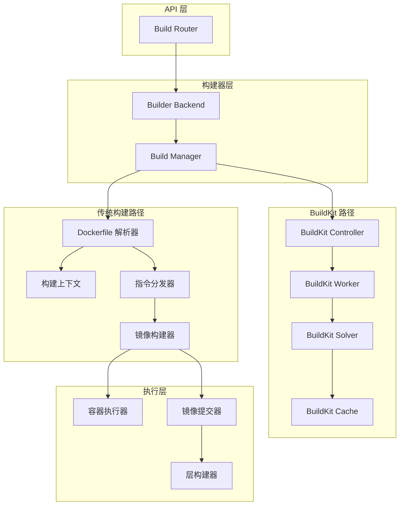

### 架构说明

**1. 传统构建路径**：

- **Dockerfile 解析器**：

  ```go
  type Parser struct {
      Directive *parser.Directive
  }
  
  func (p *Parser) Parse(rwc io.Reader) (*parser.Result, error) {
      // 词法分析
      // 语法分析
      // 生成指令树
  }
```

- **指令分发器**：

  ```go
  type Dispatcher struct {
      builder Builder
      state   *dispatchState
  }
  
  // 执行单条指令
  func (d *Dispatcher) dispatch(cmd *instructions.Command) error {
      switch cmd.Name {
      case "from":
          return d.dispatchFrom(cmd)
      case "run":
          return d.dispatchRun(cmd)
      case "copy":
          return d.dispatchCopy(cmd)
      // ...
      }
  }
```

- **镜像构建器**：

  ```go
  type Builder struct {
      imageCache  *imageCache
      containerManager ContainerManager
      imageSource ImageSource
      buildStages []*buildStage
  }
  
  // 逐指令构建
  func (b *Builder) build(ctx context.Context, stages []instructions.Stage) error {
      for _, stage := range stages {
          for _, cmd := range stage.Commands {
              if err := b.dispatch(cmd); err != nil {
                  return err
              }
          }
      }
  }
```

**2. BuildKit 路径**：

- **BuildKit Controller**：

  ```go
  type Controller struct {
      worker    *worker.Worker
      solver    *solver.Solver
      cache     solver.CacheManager
      frontends map[string]frontend.Frontend
  }
```

- **BuildKit Solver**：
  - LLB（Low-Level Build）图构建
  - 依赖分析与并行执行
  - 缓存查询与复用
  - 远程缓存支持

---

## Dockerfile 构建完整时序图

```mermaid
sequenceDiagram
    autonumber
    participant Client as docker CLI
    participant Router as Build Router
    participant Backend as Builder Backend
    participant Parser as Dockerfile Parser
    participant ImageSvc as Image Service
    participant Container as Container Manager
    participant Containerd as containerd
    
    Note over Client: docker build -t myapp:v1.0 .
    Client->>Router: POST /build
    Note over Client: 上传构建上下文（tar 归档）
    
    Note over Router: 阶段1: 接收构建上下文
    Router->>Backend: Build(context, options)
    Backend->>Backend: 解压 tar 到临时目录
    Backend->>Backend: 读取 .dockerignore
    Backend->>Backend: 过滤文件
    
    Note over Backend: 阶段2: 解析 Dockerfile
    Backend->>Parser: Parse(dockerfile)
    Parser->>Parser: 词法分析
    Parser->>Parser: 语法分析
    Parser->>Parser: 指令验证
    Parser-->>Backend: 指令列表
    
    Note over Backend: 阶段3: 多阶段分析
    Backend->>Backend: 分析依赖关系
    Backend->>Backend: 确定构建顺序
    
    Note over Backend: 阶段4: 逐指令执行
    loop 遍历每条指令
        alt 指令 = FROM
            Note over Backend: 获取基础镜像
            Backend->>ImageSvc: GetImage(baseImage)
            alt 镜像不存在
                ImageSvc->>ImageSvc: PullImage(baseImage)
            end
            ImageSvc-->>Backend: 镜像信息
            Backend->>Backend: 创建构建阶段
            Backend->>Backend: 设置当前镜像为基础镜像
            
        else 指令 = RUN
            Note over Backend: 执行命令
            Backend->>Backend: 检查缓存（指令 hash）
            alt 缓存命中
                Backend->>Backend: 复用缓存层
            else 缓存未命中
                Backend->>Container: Create(image, command)
                Container-->>Backend: 容器 ID
                
                Backend->>Container: Start(containerID)
                Container->>Containerd: 启动容器
                Containerd-->>Container: 容器运行
                
                Backend->>Container: Attach(containerID)
                Backend->>Backend: 流式输出日志
                
                Container->>Containerd: 等待容器退出
                Containerd-->>Container: 退出码
                
                alt 退出码 != 0
                    Backend-->>Client: 构建失败
                end
                
                Backend->>Container: Commit(containerID)
                Container->>ImageSvc: CreateLayer(containerID)
                ImageSvc->>ImageSvc: 计算层 diff
                ImageSvc->>ImageSvc: 保存新层
                ImageSvc-->>Backend: 新镜像 ID
                
                Backend->>Container: Remove(containerID)
                Backend->>Backend: 更新缓存
                Backend->>Backend: 更新当前镜像
            end
            
        else 指令 = COPY/ADD
            Note over Backend: 复制文件
            Backend->>Backend: 从构建上下文读取文件
            Backend->>Backend: 计算文件 checksum
            Backend->>Backend: 检查缓存
            
            alt 缓存未命中
                Backend->>Container: Create(临时容器)
                Backend->>Container: 复制文件到容器
                Backend->>Container: Commit(容器)
                Container->>ImageSvc: CreateLayer
                ImageSvc-->>Backend: 新镜像 ID
                Backend->>Container: Remove(临时容器)
            end
            
        else 指令 = ENV/LABEL/EXPOSE/...
            Note over Backend: 更新镜像配置（无新层）
            Backend->>Backend: 更新镜像元数据
            Backend->>Backend: config.Env.Add(key, value)
            
        else 指令 = ARG
            Note over Backend: 设置构建参数
            Backend->>Backend: buildArgs[key] = value
            Backend->>Backend: 替换后续指令中的 $ARG
        end
    end
    
    Note over Backend: 阶段5: 生成最终镜像
    Backend->>ImageSvc: CreateImage(config, layers)
    ImageSvc->>ImageSvc: 计算镜像 ID
    ImageSvc->>ImageSvc: 添加 tag (myapp:v1.0)
    ImageSvc-->>Backend: 镜像 ID
    
    Note over Backend: 阶段6: 清理临时资源
    Backend->>Backend: 删除临时目录
    Backend->>Backend: 删除临时容器
    
    Backend-->>Router: 构建成功
    Router-->>Client: 200 OK + 构建日志
    
    Note over Client: 输出示例
    Note over Client: Sending build context to Docker daemon  2.048kB<br/>Step 1/5 : FROM golang:1.20<br/> ---> abc123...<br/>Step 2/5 : WORKDIR /app<br/> ---> Running in def456...<br/> ---> ghi789...<br/>Step 3/5 : COPY . .<br/> ---> jkl012...<br/>Step 4/5 : RUN go build<br/> ---> Running in mno345...<br/> ---> pqr678...<br/>Step 5/5 : CMD ["./myapp"]<br/> ---> Running in stu901...<br/> ---> vwx234...<br/>Successfully built vwx234...<br/>Successfully tagged myapp:v1.0
```

### 时序图关键点说明

**阶段1：接收构建上下文（100-500ms）**

- 构建上下文大小限制：建议 < 50MB
- .dockerignore 规则：

```
  .git
  node_modules/
  __pycache__/
  *.log
```

**阶段2：解析 Dockerfile（10-50ms）**

```dockerfile
# 示例 Dockerfile
FROM golang:1.20 AS builder
WORKDIR /app
COPY go.mod go.sum ./
RUN go mod download
COPY . .
RUN go build -o /bin/myapp

FROM alpine:latest
COPY --from=builder /bin/myapp /usr/local/bin/
CMD ["myapp"]
```

**解析结果**：

```go
stages := []Stage{
    {
        Name: "builder",
        Commands: []*Command{
            {Name: "from", Args: []string{"golang:1.20"}},
            {Name: "workdir", Args: []string{"/app"}},
            {Name: "copy", Args: []string{"go.mod", "go.sum", "./"}},
            {Name: "run", Args: []string{"go", "mod", "download"}},
            {Name: "copy", Args: []string{".", "."}},
            {Name: "run", Args: []string{"go", "build", "-o", "/bin/myapp"}},
        },
    },
    {
        Name: "",
        Commands: []*Command{
            {Name: "from", Args: []string{"alpine:latest"}},
            {Name: "copy", Args: []string{"--from=builder", "/bin/myapp", "/usr/local/bin/"}},
            {Name: "cmd", Args: []string{"myapp"}},
        },
    },
}
```

**阶段3：多阶段分析（<1ms）**

- 构建依赖图：

```
  stage[0] (builder) → stage[1]
```

- 并行构建机会（BuildKit）：
  - 独立的 stage 可并行执行
  - 依赖的 stage 顺序执行

**阶段4：RUN 指令执行（主要耗时）**

```go
// 缓存键计算
func cacheKey(instruction *Command, parentImage string) string {
    h := sha256.New()
    h.Write([]byte(parentImage))          // 父镜像 ID
    h.Write([]byte(instruction.String())) // 指令内容
    return hex.EncodeToString(h.Sum(nil))
}

// 缓存查找
if cachedLayer := cache.Get(cacheKey); cachedLayer != nil {
    currentImage = cachedLayer
    fmt.Println(" ---> Using cache")
} else {
    // 执行指令并创建新层
}
```

**COPY 指令优化**：

```go
// 计算源文件 checksum
func calculateChecksum(files []string) string {
    h := sha256.New()
    for _, file := range files {
        data, _ := os.ReadFile(file)
        h.Write(data)
    }
    return hex.EncodeToString(h.Sum(nil))
}
```

**阶段5：生成最终镜像（10-30ms）**

```go
// 镜像配置
config := &ImageConfig{
    Cmd:        []string{"myapp"},
    Env:        []string{"PATH=/usr/local/sbin:...", "GO_VERSION=1.20"},
    WorkingDir: "/app",
    ExposedPorts: map[string]struct{}{
        "8080/tcp": {},
    },
}

// 计算镜像 ID（配置的 SHA256）
imageID := sha256.Sum(marshalConfig(config))
```

---

## BuildKit 优势

### 并行构建

**传统构建**（串行）：

```dockerfile
FROM base
RUN task1  # 耗时 10s
RUN task2  # 耗时 10s
RUN task3  # 耗时 10s
# 总耗时：30s
```

**BuildKit**（并行）：

```dockerfile
FROM base AS stage1
RUN task1  # 耗时 10s

FROM base AS stage2
RUN task2  # 耗时 10s

FROM base AS stage3
RUN task3  # 耗时 10s

FROM base
COPY --from=stage1 /output1 /
COPY --from=stage2 /output2 /
COPY --from=stage3 /output3 /
# 总耗时：10s（并行执行）
```

### Cache Mounts

```dockerfile
# 传统方式：每次构建都重新下载依赖
FROM golang:1.20
COPY go.mod go.sum ./
RUN go mod download  # 每次都重新下载

# BuildKit：缓存依赖到持久化卷
FROM golang:1.20
COPY go.mod go.sum ./
RUN --mount=type=cache,target=/go/pkg/mod \
    go mod download  # 依赖持久化缓存
```

### 远程缓存

```bash
# 导出缓存到 Registry
docker buildx build \
  --cache-to type=registry,ref=myregistry.com/myapp:cache \
  -t myapp:v1.0 .

# 从 Registry 导入缓存
docker buildx build \
  --cache-from type=registry,ref=myregistry.com/myapp:cache \
  -t myapp:v1.0 .
```

---

## 最佳实践

### 层缓存优化

```dockerfile
# ❌ 不推荐：频繁变化的文件先复制
FROM golang:1.20
COPY . .
RUN go mod download

# ✅ 推荐：依赖文件先复制（变化少）
FROM golang:1.20
COPY go.mod go.sum ./
RUN go mod download
COPY . .
```

### 多阶段构建

```dockerfile
# 编译阶段（大镜像）
FROM golang:1.20 AS builder
WORKDIR /app
COPY . .
RUN go build -o myapp

# 运行阶段（小镜像）
FROM alpine:latest
RUN apk --no-cache add ca-certificates
COPY --from=builder /app/myapp /usr/local/bin/
CMD ["myapp"]
```

### .dockerignore

```
# 排除 Git 文件
.git
.gitignore

# 排除开发文件
*.md
Dockerfile*
docker-compose*.yml

# 排除依赖目录
node_modules/
vendor/
__pycache__/

# 排除构建产物
*.o
*.a
*.so
dist/
build/
```

### 构建参数

```dockerfile
ARG GO_VERSION=1.20
FROM golang:${GO_VERSION}

ARG BUILD_DATE
ARG VCS_REF
LABEL org.opencontainers.image.created="${BUILD_DATE}" \
      org.opencontainers.image.revision="${VCS_REF}"
```

```bash
docker build \
  --build-arg BUILD_DATE=$(date -u +'%Y-%m-%dT%H:%M:%SZ') \
  --build-arg VCS_REF=$(git rev-parse --short HEAD) \
  -t myapp:v1.0 .
```

### BuildKit 特性

```bash
# 启用 BuildKit
export DOCKER_BUILDKIT=1

# 或使用 buildx
docker buildx build -t myapp:v1.0 .

# 查看构建详情
docker buildx build --progress=plain -t myapp:v1.0 .

# 多平台构建
docker buildx build \
  --platform linux/amd64,linux/arm64 \
  -t myapp:v1.0 .
```

---

## API接口

本文档详细描述 Builder 模块对外提供的 HTTP API 接口，包括请求/响应结构、核心代码、调用链路与时序图。

---

## API 目录

| 序号 | API | 方法 | 路径 | 说明 |
|---|---|---|---|---|
| 1 | [构建镜像](#1-构建镜像) | POST | `/build` | 从 Dockerfile 构建镜像 |
| 2 | [清理构建缓存](#2-清理构建缓存) | POST | `/build/prune` | 清理未使用的构建缓存（v1.31+） |
| 3 | [取消构建](#3-取消构建) | POST | `/build/cancel` | 取消正在进行的构建 |

---

## 1. 构建镜像

### 基本信息
- **路径**：`POST /build`
- **用途**：从 Dockerfile 构建 Docker 镜像
- **最小 API 版本**：v1.24
- **幂等性**：否
- **Content-Type**：`application/x-tar`（请求体为 tar 归档）
- **响应格式**：`application/json`（流式 JSON）

### 请求参数

**Query 参数**：

| 参数 | 类型 | 必填 | 默认 | 说明 |
|---|---|---|---|---|
| dockerfile | string | 否 | Dockerfile | Dockerfile 文件名 |
| t | string[] | 否 | [] | 镜像标签（可多个） |
| extrahosts | string[] | 否 | [] | 额外的 hosts 映射 |
| remote | string | 否 | "" | Git URL（远程构建上下文） |
| q | bool | 否 | false | 静默构建（抑制输出） |
| nocache | bool | 否 | false | 不使用缓存 |
| cachefrom | string[] | 否 | [] | 缓存来源镜像 |
| pull | bool | 否 | false | 总是拉取基础镜像 |
| rm | bool | 否 | true | 构建成功后删除中间容器 |
| forcerm | bool | 否 | false | 总是删除中间容器 |
| memory | int64 | 否 | 0 | 内存限制（字节） |
| memswap | int64 | 否 | 0 | Swap 限制（字节） |
| cpushares | int64 | 否 | 0 | CPU shares |
| cpusetcpus | string | 否 | "" | CPU 集合 |
| cpuperiod | int64 | 否 | 0 | CPU CFS 周期 |
| cpuquota | int64 | 否 | 0 | CPU CFS 配额 |
| buildargs | JSON | 否 | {} | 构建参数（ARG） |
| shmsize | int64 | 否 | 0 | /dev/shm 大小（字节） |
| squash | bool | 否 | false | 压缩层（实验性） |
| labels | JSON | 否 | {} | 镜像标签 |
| networkmode | string | 否 | default | 网络模式 |
| platform | string | 否 | "" | 目标平台（v1.32+） |
| target | string | 否 | "" | 目标构建阶段 |
| outputs | JSON | 否 | [] | 输出配置（v1.40+） |
| version | string | 否 | 2 | 构建器版本（1/2） |
| session | string | 否 | "" | Session ID |
| buildid | string | 否 | "" | Build ID |

**请求体**：

- tar 归档包含构建上下文（Dockerfile + 文件）

### 响应结构体

**流式 JSON 响应**（逐行）：

```go
// 普通日志
type BuildProgressStream struct {
    Stream string `json:"stream,omitempty"` // 构建日志
}

// 构建步骤
type BuildProgressStatus struct {
    Status   string `json:"status,omitempty"`   // 步骤状态
    ID       string `json:"id,omitempty"`       // 步骤 ID
    Progress string `json:"progress,omitempty"` // 进度
}

// 错误
type BuildProgressError struct {
    Error       string `json:"error,omitempty"`
    ErrorDetail struct {
        Message string `json:"message"`
    } `json:"errorDetail,omitempty"`
}

// 辅助信息（最终镜像 ID）
type BuildAux struct {
    Aux struct {
        ID string `json:"ID"` // 镜像 ID
    } `json:"aux"`
}
```

**响应示例**：

```json
{"stream":"Step 1/5 : FROM alpine:3.14\n"}
{"stream":" ---\u003e 14119a10abf4\n"}
{"stream":"Step 2/5 : RUN apk add --no-cache curl\n"}
{"stream":" ---\u003e Running in 3f8c2b1d5e6a\n"}
{"stream":"fetch http://dl-cdn.alpinelinux.org/alpine/v3.14/main/x86_64/APKINDEX.tar.gz\n"}
{"stream":"OK: 6 MiB in 15 packages\n"}
{"stream":" ---\u003e 8f3c1b2d3e4f\n"}
{"stream":"Step 3/5 : COPY app.sh /app.sh\n"}
{"stream":" ---\u003e 9a2b3c4d5e6f\n"}
{"stream":"Successfully built 9a2b3c4d5e6f\n"}
{"stream":"Successfully tagged myapp:latest\n"}
{"aux":{"ID":"sha256:9a2b3c4d5e6f..."}}
```

### 入口函数与核心代码

**HTTP Handler**（`daemon/server/router/build/build_routes.go`）：

```go
func (br *buildRouter) postBuild(ctx context.Context, w http.ResponseWriter, r *http.Request, vars map[string]string) error {
    // 1. 设置响应头
    w.Header().Set("Content-Type", "application/json")
    
    // 2. 创建输出流
    output := ioutils.NewWriteFlusher(w)
    defer output.Close()
    
    // 3. 解析构建选项
    buildOptions, err := newImageBuildOptions(ctx, r)
    buildOptions.AuthConfigs = getAuthConfigs(r.Header)
    
    // 4. 获取进度写入器
    progBuff := &syncBuffer{Buffer: bytes.NewBuffer(nil)}
    buildOptions.ProgressWriter = buildProgressWriter(output, true, createProgressReader)
    
    // 5. 构建配置
    buildConfig := buildbackend.BuildConfig{
        Source:         body,
        Options:        buildOptions,
        ProgressWriter: buildOptions.ProgressWriter,
    }
    
    // 6. 执行构建
    imgID, err := br.backend.Build(ctx, buildConfig)
    
    // 7. 输出镜像 ID
    if imgID != "" {
        aux := &struct {
            ID string `json:"ID"`
        }{ID: imgID}
        output.Write(streamformatter.FormatAux(aux))
    }
    
    return nil
}
```

**解析构建选项**：

```go
func newImageBuildOptions(ctx context.Context, r *http.Request) (*buildbackend.BuildOptions, error) {
    options := &buildbackend.BuildOptions{
        Version:        build.BuilderV1,  // 默认 Builder V1，可覆盖
        Dockerfile:     r.FormValue("dockerfile"),
        SuppressOutput: httputils.BoolValue(r, "q"),
        NoCache:        httputils.BoolValue(r, "nocache"),
        ForceRemove:    httputils.BoolValue(r, "forcerm"),
        PullParent:     httputils.BoolValue(r, "pull"),
        Memory:         httputils.Int64ValueOrZero(r, "memory"),
        Tags:           r.Form["t"],
        Target:         r.FormValue("target"),
        RemoteContext:  r.FormValue("remote"),
        SessionID:      r.FormValue("session"),
        BuildID:        r.FormValue("buildid"),
    }
    
    // 解析 buildargs（JSON）
    if buildArgsJSON := r.FormValue("buildargs"); buildArgsJSON != "" {
        buildArgs := map[string]*string{}
        json.Unmarshal([]byte(buildArgsJSON), &buildArgs)
        options.BuildArgs = buildArgs
    }
    
    // 解析 labels（JSON）
    if labelsJSON := r.FormValue("labels"); labelsJSON != "" {
        labels := map[string]string{}
        json.Unmarshal([]byte(labelsJSON), &labels)
        options.Labels = labels
    }
    
    // 解析 version（Builder V1 / BuildKit）
    if bv := r.FormValue("version"); bv != "" {
        v, _ := parseVersion(bv)
        options.Version = v
    }
    
    return options, nil
}
```

**Backend 实现**（`daemon/server/buildbackend/build.go`）：

```go
func (b *Backend) Build(ctx context.Context, config buildbackend.BuildConfig) (string, error) {
    // 1. 根据版本选择构建器
    switch config.Options.Version {
    case build.BuilderBuildKit:
        // BuildKit 构建
        return b.buildkit.Build(ctx, config)
    default:
        // Classic Builder 构建
        return b.builder.Build(ctx, config)
    }
}
```

**Classic Builder 构建**（`daemon/images/builder.go`）：

```go
func (b *Builder) Build(ctx context.Context, config BuildConfig) (string, error) {
    // 1. 创建构建上下文
    buildContext, err := b.createBuildContext(config.Source)
    
    // 2. 解析 Dockerfile
    dockerfile, err := b.parseDockerfile(buildContext, config.Options.Dockerfile)
    
    // 3. 逐步执行 Dockerfile 指令
    var imageID string
    for _, instruction := range dockerfile.AST.Children {
        switch instruction.Value {
        case "FROM":
            imageID, err = b.processFromInstruction(instruction)
        case "RUN":
            imageID, err = b.processRunInstruction(instruction, imageID)
        case "COPY":
            imageID, err = b.processCopyInstruction(instruction, imageID, buildContext)
        case "ENV":
            imageID, err = b.processEnvInstruction(instruction, imageID)
        // ... 其他指令
        }
        
        // 写入进度
        config.ProgressWriter.Write(fmt.Sprintf("Step %d/%d : %s\n", i+1, total, instruction))
    }
    
    // 4. 打标签
    for _, tag := range config.Options.Tags {
        b.daemon.TagImage(imageID, tag)
    }
    
    return imageID, nil
}
```

**BuildKit 构建**（`daemon/server/buildbackend/buildkit/builder.go`）：

```go
func (b *Builder) Build(ctx context.Context, config BuildConfig) (string, error) {
    // 1. 创建 BuildKit session
    session, err := b.sessionManager.Get(ctx, config.Options.SessionID)
    
    // 2. 构建前端（Dockerfile）
    frontend := "dockerfile.v0"
    
    // 3. 构建选项
    opts := map[string]string{
        "filename":   config.Options.Dockerfile,
        "target":     config.Options.Target,
        "no-cache":   strconv.FormatBool(config.Options.NoCache),
        "pull":       strconv.FormatBool(config.Options.PullParent),
    }
    
    // 4. 执行构建
    res, err := b.controller.Build(ctx, control.BuildOptions{
        Inputs: map[string]llb.State{
            "context": llb.Local("context"),
        },
        Frontend:      frontend,
        FrontendAttrs: opts,
        Session:       []session.Attachable{session},
    }, config.ProgressWriter)
    
    // 5. 导出镜像
    imageID, err := res.ExportImage(ctx)
    
    return imageID, nil
}
```

### 时序图

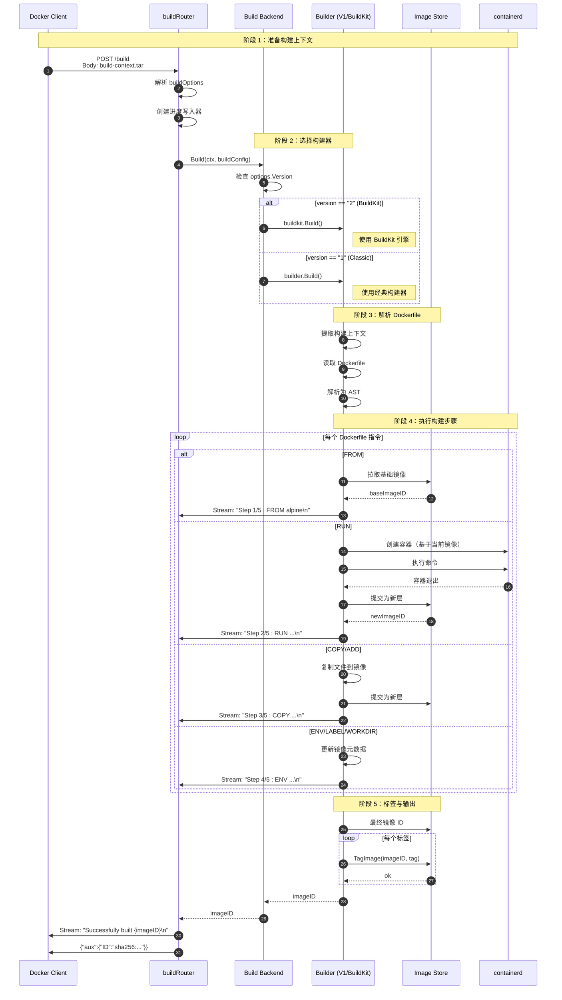

### 说明

#### 图意概述
展示镜像构建的完整流程，从上传构建上下文到逐步执行 Dockerfile 指令，最终生成镜像的全过程。

#### 关键步骤详解

**阶段 1-2：构建器选择（步骤 1-7）**：

- **Builder V1（Classic）**：传统构建器，逐步执行 Dockerfile 指令
- **Builder V2（BuildKit）**：现代构建器，支持并发构建、缓存优化、多阶段并行

**阶段 3：Dockerfile 解析（步骤 8-10）**：

```dockerfile
# 示例 Dockerfile
FROM alpine:3.14
RUN apk add --no-cache curl
COPY app.sh /app.sh
ENV APP_ENV=production
CMD ["/app.sh"]
```

**阶段 4：指令执行（步骤 11-29）**：

**FROM 指令**：

```go
// 拉取或查找基础镜像
baseImage, err := imageStore.Get(ctx, "alpine:3.14")
currentImageID = baseImage.ID
```

**RUN 指令**：

```bash
# 1. 创建容器
containerID = containerd.Create(currentImageID, cmd)

# 2. 启动并等待
containerd.Start(containerID)
containerd.Wait(containerID)

# 3. 提交为新层
newImageID = imageStore.Commit(containerID, "RUN apk add ...")
currentImageID = newImageID
```

**COPY 指令**：

```go
// 1. 从构建上下文提取文件
files := buildContext.Extract("app.sh")

// 2. 创建新层
layer := createLayer(files)
newImageID = imageStore.AddLayer(currentImageID, layer)
currentImageID = newImageID
```

**ENV/LABEL 指令**：

```go
// 仅更新镜像元数据，不创建新层
imageConfig.Env = append(imageConfig.Env, "APP_ENV=production")
```

#### 边界条件

- **构建失败**：返回错误 JSON，清理中间容器
- **缓存命中**：跳过指令执行，使用缓存层
- **Squash 层**：实验性功能，压缩所有层为一层
- **多平台构建**：BuildKit 支持，Classic Builder 不支持

#### 性能指标

- **小镜像（无 RUN）**：10-30 秒
- **中等镜像（5-10 个 RUN）**：1-5 分钟
- **大镜像（复杂依赖）**：5-30 分钟
- **BuildKit 优化**：缓存命中可减少 80-90% 构建时间

---

## 2. 清理构建缓存

### 基本信息
- **路径**：`POST /build/prune`
- **用途**：清理未使用的构建缓存
- **最小 API 版本**：v1.31
- **幂等性**：是

### 请求参数

**Query 参数**：

| 参数 | 类型 | 必填 | 默认 | 说明 |
|---|---|---|---|---|
| filters | JSON | 否 | {} | 过滤器 |
| all | bool | 否 | false | 删除所有缓存（包括正在使用） |
| keep-storage | int64 | 否 | 0 | 保留的存储空间（字节，已废弃） |
| reserved-space | int64 | 否 | 0 | 保留空间（字节，v1.48+） |
| max-used-space | int64 | 否 | 0 | 最大使用空间（字节，v1.48+） |
| min-free-space | int64 | 否 | 0 | 最小空闲空间（字节，v1.48+） |

**过滤器选项**：

| 过滤器 | 说明 |
|---|---|
| `until` | 清理指定时间之前的缓存 |
| `id` | 清理指定 ID 的缓存 |
| `parent` | 清理指定父缓存 |

### 响应结构体

```go
type CachePruneReport struct {
    // CachesDeleted 已删除的缓存 ID 列表
    CachesDeleted []string `json:"CachesDeleted"`
    
    // SpaceReclaimed 回收的磁盘空间（字节）
    SpaceReclaimed uint64 `json:"SpaceReclaimed"`
}
```

### 入口函数与核心代码

**HTTP Handler**：

```go
func (br *buildRouter) postPrune(ctx context.Context, w http.ResponseWriter, r *http.Request, vars map[string]string) error {
    // 1. 解析过滤器
    fltrs, err := filters.FromJSON(r.Form.Get("filters"))
    
    // 2. 解析选项
    opts := buildbackend.CachePruneOptions{
        All:     httputils.BoolValue(r, "all"),
        Filters: fltrs,
    }
    
    // 3. 解析空间限制（v1.48+）
    version := httputils.VersionFromContext(ctx)
    if versions.GreaterThanOrEqualTo(version, "1.48") {
        opts.ReservedSpace, _ = parseBytesFromFormValue("reserved-space")
        opts.MaxUsedSpace, _ = parseBytesFromFormValue("max-used-space")
        opts.MinFreeSpace, _ = parseBytesFromFormValue("min-free-space")
    } else {
        opts.ReservedSpace, _ = parseBytesFromFormValue("keep-storage")
    }
    
    // 4. 执行清理
    report, err := br.backend.PruneCache(ctx, opts)
    
    return httputils.WriteJSON(w, http.StatusOK, report)
}
```

**Backend 实现**：

```go
func (b *Backend) PruneCache(ctx context.Context, opts CachePruneOptions) (*build.CachePruneReport, error) {
    // BuildKit 缓存清理
    if b.buildkit != nil {
        return b.buildkit.Prune(ctx, opts)
    }
    
    // Classic Builder 无缓存管理
    return &build.CachePruneReport{}, nil
}
```

### 时序图

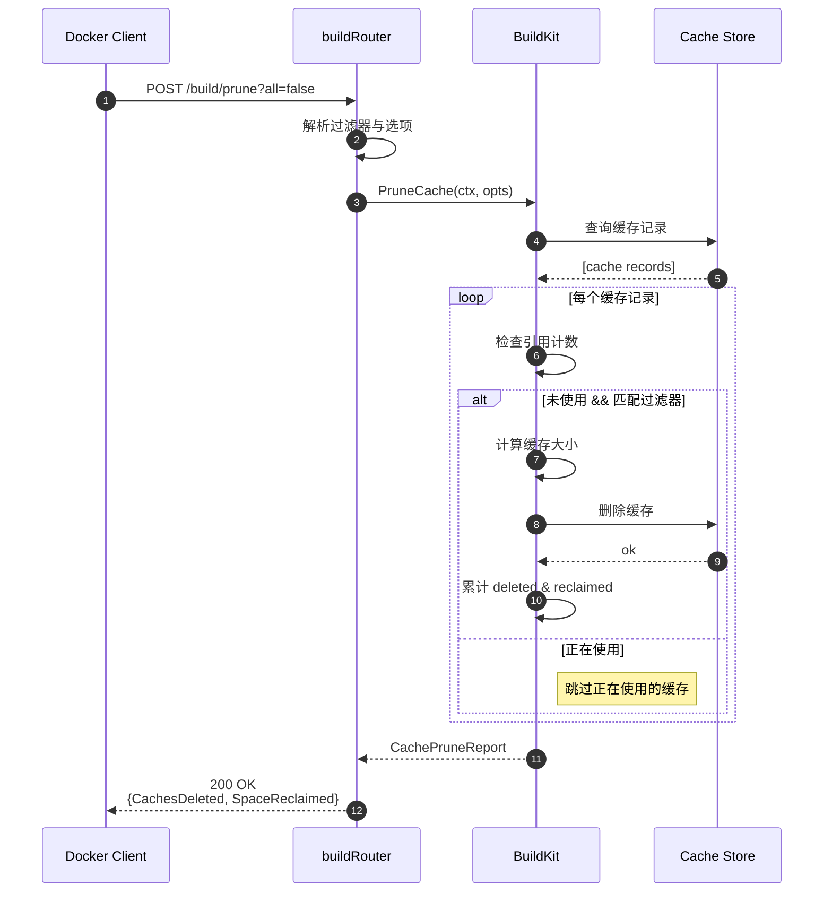

### 异常与性能

**异常场景**：

- BuildKit 未启用：返回空报告
- 过滤器格式错误：400 Bad Request

**性能指标**：

- 清理 1000 个缓存：5-30 秒

---

## 3. 取消构建

### 基本信息
- **路径**：`POST /build/cancel`
- **用途**：取消正在进行的构建
- **最小 API 版本**：v1.24
- **幂等性**：是

### 请求参数

**Query 参数**：

| 参数 | 类型 | 必填 | 说明 |
|---|---|---|---|
| id | string | 是 | 构建 ID（buildid） |

### 响应

- **成功**：204 No Content
- **失败**：错误 JSON

### 入口函数与核心代码

**HTTP Handler**：

```go
func (br *buildRouter) postCancel(ctx context.Context, w http.ResponseWriter, r *http.Request, vars map[string]string) error {
    // 1. 获取构建 ID
    id := r.FormValue("id")
    if id == "" {
        return invalidParam{errors.New("build ID not provided")}
    }
    
    // 2. 取消构建
    return br.backend.Cancel(ctx, id)
}
```

**Backend 实现**：

```go
func (b *Backend) Cancel(ctx context.Context, buildID string) error {
    // 查找构建任务
    build, exists := b.activeBuilds[buildID]
    if !exists {
        return errdefs.NotFound(errors.Errorf("build ID %s not found", buildID))
    }
    
    // 取消构建上下文
    build.cancelFunc()
    
    return nil
}
```

### 时序图

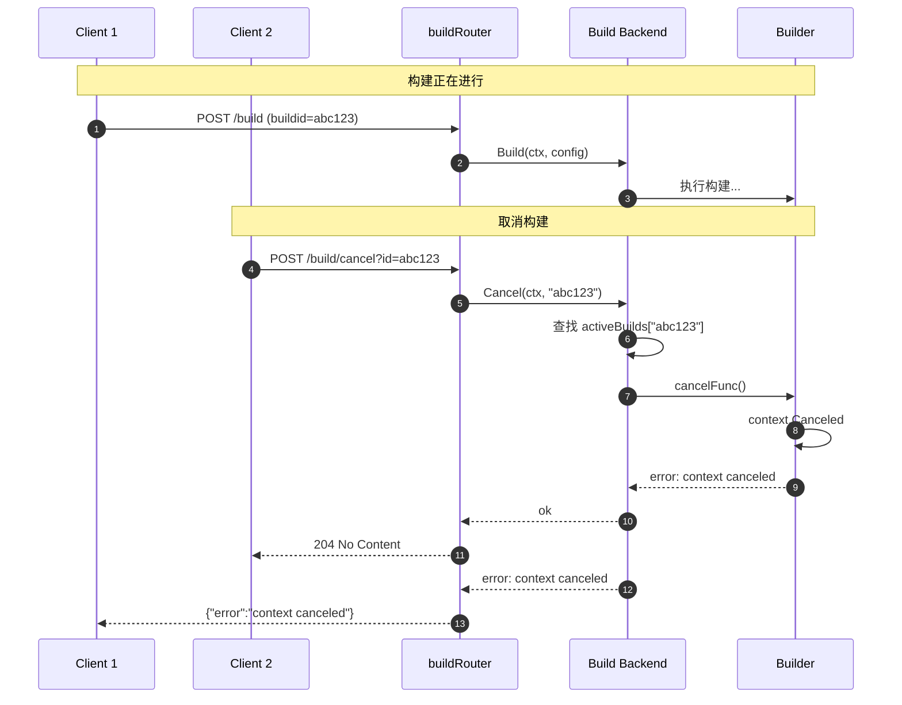

---

## 附录：Builder 版本对比

### Classic Builder（V1）

**特点**：

- 串行执行 Dockerfile 指令
- 简单的层缓存机制
- 不支持并发构建
- 不支持远程缓存

**适用场景**：

- 简单的单阶段构建
- Windows 容器构建
- 向后兼容

### BuildKit（V2）

**特点**：

- 并发执行（依赖图优化）
- 高级缓存（本地 + 远程）
- 多平台构建
- Secrets/SSH 挂载
- 增量传输

**适用场景**：

- 复杂的多阶段构建
- 大规模 CI/CD
- 多平台镜像

---

**文档版本**：v1.0  
**最后更新**：2025-10-04

---

## 数据结构

本文档详细描述构建器模块的核心数据结构，包括 UML 类图、字段说明、接口定义与使用场景。

---

## 数据结构概览

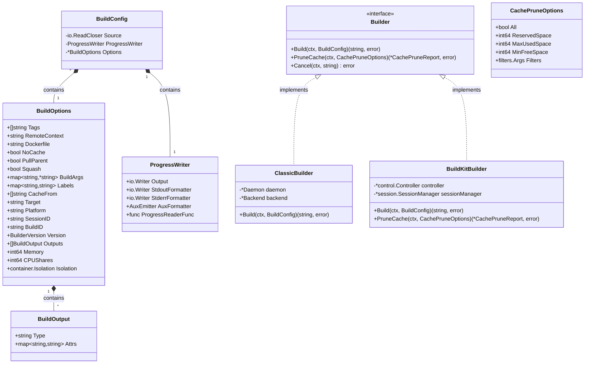

---

## 1. BuildConfig（构建配置）

### 结构定义

```go
type BuildConfig struct {
    // Source 构建上下文（tar 归档）
    Source io.ReadCloser
    
    // ProgressWriter 进度输出
    ProgressWriter ProgressWriter
    
    // Options 构建选项
    Options *BuildOptions
}
```

### 字段说明

| 字段 | 类型 | 说明 |
|---|---|---|
| Source | io.ReadCloser | 构建上下文的 tar 归档（包含 Dockerfile 和文件） |
| ProgressWriter | ProgressWriter | 进度输出流（stdout/stderr/aux） |
| Options | *BuildOptions | 详细的构建选项 |

### 使用场景

```go
// 创建构建配置
buildConfig := buildbackend.BuildConfig{
    Source: tarArchive,  // 构建上下文 tar 流
    ProgressWriter: buildbackend.ProgressWriter{
        Output: responseWriter,  // HTTP 响应流
        AuxFormatter: auxEmitter,
    },
    Options: &buildbackend.BuildOptions{
        Tags:       []string{"myapp:latest"},
        Dockerfile: "Dockerfile",
        NoCache:    false,
        Version:    build.BuilderBuildKit,
    },
}

// 执行构建
imageID, err := builder.Build(ctx, buildConfig)
```

---

## 2. BuildOptions（构建选项）

### 结构定义

```go
type BuildOptions struct {
    // 镜像标签
    Tags []string  // 例如：["myapp:latest", "myapp:v1.0"]
    
    // Dockerfile 配置
    Dockerfile     string  // Dockerfile 文件名（默认 "Dockerfile"）
    RemoteContext  string  // Git URL（远程构建上下文）
    Target         string  // 目标构建阶段（多阶段构建）
    
    // 构建参数
    BuildArgs   map[string]*string  // ARG 变量（*string 用于区分空值与未设置）
    Labels      map[string]string   // 镜像标签
    
    // 缓存控制
    NoCache   bool     // 不使用缓存
    CacheFrom []string // 缓存来源镜像
    
    // 基础镜像
    PullParent bool  // 总是拉取基础镜像
    
    // 层压缩
    Squash bool  // 压缩所有层为一层（实验性）
    
    // 中间容器清理
    Remove      bool  // 构建成功后删除中间容器
    ForceRemove bool  // 总是删除中间容器
    
    // 资源限制
    Memory     int64   // 内存限制（字节）
    MemorySwap int64   // Swap 限制（字节）
    CPUShares  int64   // CPU shares（相对权重）
    CPUQuota   int64   // CPU CFS 配额
    CPUPeriod  int64   // CPU CFS 周期
    CPUSetCPUs string  // CPU 集合（例如："0-3,8-11"）
    CPUSetMems string  // 内存节点集合
    ShmSize    int64   // /dev/shm 大小（字节）
    
    // 网络与隔离
    NetworkMode  string               // 网络模式（default/host/none）
    Isolation    container.Isolation  // 容器隔离（Windows）
    CgroupParent string               // Cgroup 父路径
    
    // 安全与限制
    SecurityOpt []string            // 安全选项
    Ulimits     []*container.Ulimit // 资源限制
    ExtraHosts  []string            // 额外的 hosts 映射
    
    // 认证
    AuthConfigs map[string]registry.AuthConfig  // 注册表认证
    
    // 输出
    SuppressOutput bool  // 静默构建
    
    // 平台
    Platform string  // 目标平台（例如："linux/amd64"）
    
    // 构建器
    Version build.BuilderVersion  // 构建器版本（V1/BuildKit）
    
    // Session（BuildKit）
    SessionID string  // Session ID（BuildKit 专用）
    BuildID   string  // Build ID（用于取消构建）
    
    // 输出配置（BuildKit）
    Outputs []BuildOutput  // 构建输出配置
}
```

### BuildArgs 特殊说明

```go
// BuildArgs 使用 *string 而不是 string 的原因：
// 1. nil: 用户指定了 --build-arg FOO 但 FOO 未设置
// 2. "": 用户指定了 --build-arg FOO="" 或 FOO 为空字符串
// 3. "value": 用户指定了 --build-arg FOO=value

BuildArgs: map[string]*string{
    "NODE_VERSION": StringPtr("18"),    // 明确设置
    "DEBUG":        StringPtr(""),      // 设置为空
    "UNDEFINED":    nil,                // 未定义（会触发警告）
}
```

### 使用场景

```go
// 多阶段构建示例
opts := &buildbackend.BuildOptions{
    Tags:       []string{"myapp:latest"},
    Dockerfile: "Dockerfile.multi",
    Target:     "production",  // 只构建到 production 阶段
    BuildArgs: map[string]*string{
        "GO_VERSION": StringPtr("1.21"),
        "APP_ENV":    StringPtr("prod"),
    },
    NoCache:    false,
    CacheFrom:  []string{"myapp:cache"},
    Version:    build.BuilderBuildKit,
}

// 资源限制构建
opts := &buildbackend.BuildOptions{
    Tags:       []string{"heavy-app:latest"},
    Memory:     2 * 1024 * 1024 * 1024,  // 2GB
    CPUShares:  1024,
    CPUSetCPUs: "0-3",
    ShmSize:    512 * 1024 * 1024,  // 512MB
}

// 跨平台构建（BuildKit）
opts := &buildbackend.BuildOptions{
    Tags:     []string{"myapp:latest"},
    Platform: "linux/arm64",
    Version:  build.BuilderBuildKit,
}
```

---

## 3. ProgressWriter（进度写入器）

### 结构定义

```go
type ProgressWriter struct {
    // Output 主输出流
    Output io.Writer
    
    // StdoutFormatter stdout 格式化器
    StdoutFormatter io.Writer
    
    // StderrFormatter stderr 格式化器
    StderrFormatter io.Writer
    
    // AuxFormatter 辅助信息发射器
    AuxFormatter AuxEmitter
    
    // ProgressReaderFunc 进度读取函数
    ProgressReaderFunc func(io.ReadCloser) io.ReadCloser
}

// AuxEmitter 辅助信息发射器接口
type AuxEmitter interface {
    Emit(string, any) error
}
```

### 字段说明

| 字段 | 类型 | 说明 |
|---|---|---|
| Output | io.Writer | 主输出流（通常为 HTTP 响应） |
| StdoutFormatter | io.Writer | 标准输出格式化（用于 RUN 命令输出） |
| StderrFormatter | io.Writer | 标准错误格式化（用于错误信息） |
| AuxFormatter | AuxEmitter | 辅助信息发射器（用于镜像 ID 等） |
| ProgressReaderFunc | func | 进度读取包装函数 |

### 使用场景

```go
// 创建进度写入器
pw := buildbackend.ProgressWriter{
    Output: httpResponseWriter,
    AuxFormatter: &auxEmitter{
        emitFunc: func(msg string, obj any) error {
            return json.NewEncoder(httpResponseWriter).Encode(obj)
        },
    },
}

// 输出构建日志
pw.Output.Write([]byte(`{"stream":"Step 1/5 : FROM alpine\n"}`))

// 输出辅助信息（镜像 ID）
pw.AuxFormatter.Emit("ID", map[string]string{
    "ID": "sha256:abc123...",
})
```

---

## 4. Builder 接口

### 接口定义

```go
type Builder interface {
    // Build 构建镜像
    Build(ctx context.Context, config BuildConfig) (string, error)
    
    // PruneCache 清理构建缓存
    PruneCache(ctx context.Context, opts CachePruneOptions) (*build.CachePruneReport, error)
    
    // Cancel 取消构建
    Cancel(ctx context.Context, buildID string) error
}
```

### 实现类：ClassicBuilder

```go
type ClassicBuilder struct {
    daemon  *Daemon
    backend *Backend
}

func (b *ClassicBuilder) Build(ctx context.Context, config BuildConfig) (string, error) {
    // 1. 提取构建上下文
    buildContext, err := b.extractContext(config.Source)
    
    // 2. 解析 Dockerfile
    dockerfile, err := b.parseDockerfile(buildContext, config.Options.Dockerfile)
    
    // 3. 逐步执行指令
    var imageID string
    for _, instruction := range dockerfile.AST.Children {
        imageID, err = b.processInstruction(ctx, instruction, imageID, config)
        config.ProgressWriter.Output.Write(progressJSON)
    }
    
    // 4. 打标签
    for _, tag := range config.Options.Tags {
        b.daemon.TagImage(imageID, tag)
    }
    
    return imageID, nil
}
```

### 实现类：BuildKitBuilder

```go
type BuildKitBuilder struct {
    controller     *control.Controller
    sessionManager *session.SessionManager
}

func (b *BuildKitBuilder) Build(ctx context.Context, config BuildConfig) (string, error) {
    // 1. 获取 session
    session, err := b.sessionManager.Get(ctx, config.Options.SessionID)
    
    // 2. 构建选项
    opts := map[string]string{
        "filename": config.Options.Dockerfile,
        "target":   config.Options.Target,
    }
    
    // 3. 执行构建
    res, err := b.controller.Build(ctx, control.BuildOptions{
        Frontend:      "dockerfile.v0",
        FrontendAttrs: opts,
        Session:       []session.Attachable{session},
    }, config.ProgressWriter)
    
    // 4. 导出镜像
    imageID, err := res.ExportImage(ctx)
    
    return imageID, nil
}

func (b *BuildKitBuilder) PruneCache(ctx context.Context, opts CachePruneOptions) (*build.CachePruneReport, error) {
    // BuildKit 缓存清理
    records, err := b.controller.Prune(ctx, opts.Filters, opts.All)
    
    var deleted []string
    var reclaimed uint64
    for _, record := range records {
        deleted = append(deleted, record.ID)
        reclaimed += uint64(record.Size)
    }
    
    return &build.CachePruneReport{
        CachesDeleted:  deleted,
        SpaceReclaimed: reclaimed,
    }, nil
}
```

---

## 5. CachePruneOptions（缓存清理选项）

### 结构定义

```go
type CachePruneOptions struct {
    // All 删除所有缓存（包括正在使用）
    All bool
    
    // ReservedSpace 保留的存储空间（字节）
    ReservedSpace int64
    
    // MaxUsedSpace 最大使用空间（字节）
    MaxUsedSpace int64
    
    // MinFreeSpace 最小空闲空间（字节）
    MinFreeSpace int64
    
    // Filters 过滤器
    Filters filters.Args
}
```

### 使用场景

```go
// 清理所有缓存
opts := CachePruneOptions{
    All: true,
}

// 清理超过 1 周的缓存
opts := CachePruneOptions{
    Filters: filters.NewArgs(
        filters.Arg("until", "168h"),  // 7 days
    ),
}

// 保留 10GB 空间
opts := CachePruneOptions{
    MinFreeSpace: 10 * 1024 * 1024 * 1024,
}
```

---

## 6. BuildOutput（构建输出）

### 结构定义

```go
type BuildOutput struct {
    // Type 输出类型
    Type string
    
    // Attrs 输出属性
    Attrs map[string]string
}
```

### 输出类型

| Type | 说明 | Attrs 示例 |
|---|---|---|
| **image** | 导出为镜像 | `{"name":"myapp:latest"}` |
| **local** | 导出到本地目录 | `{"dest":"/tmp/output"}` |
| **tar** | 导出为 tar 归档 | `{"dest":"/tmp/output.tar"}` |
| **registry** | 直接推送到注册表 | `{"name":"registry.io/myapp:latest"}` |

### 使用场景（BuildKit）

```go
// 导出到本地目录
opts := &BuildOptions{
    Version: build.BuilderBuildKit,
    Outputs: []BuildOutput{
        {
            Type: "local",
            Attrs: map[string]string{
                "dest": "/tmp/build-output",
            },
        },
    },
}

// 多平台导出
opts := &BuildOptions{
    Version:  build.BuilderBuildKit,
    Platform: "linux/amd64,linux/arm64",
    Outputs: []BuildOutput{
        {
            Type: "image",
            Attrs: map[string]string{
                "name":              "myapp:latest",
                "push":              "true",
                "annotation-key":    "value",
            },
        },
    },
}
```

---

## 数据流图

### 构建流程

```
Client
  ↓ tar archive
API Handler
  ↓ BuildConfig
Backend
  ↓
  ├→ ClassicBuilder (Version=1)
  │   ↓
  │   ├→ 解析 Dockerfile
  │   ├→ 逐步执行指令
  │   └→ 生成镜像 ID
  │
  └→ BuildKitBuilder (Version=2)
      ↓
      ├→ 创建 BuildKit session
      ├→ 并发执行构建图
      └→ 生成镜像 ID
```

---

## 构建器版本对比

| 特性 | Classic Builder（V1） | BuildKit（V2） |
|---|---|---|
| **执行模式** | 串行 | 并发（依赖图） |
| **缓存** | 简单层缓存 | 高级缓存（本地+远程） |
| **多平台** | ❌ | ✅ |
| **Secrets** | ❌ | ✅ |
| **SSH 挂载** | ❌ | ✅ |
| **输出控制** | ❌ | ✅（多种格式） |
| **并行构建** | ❌ | ✅ |
| **增量传输** | ❌ | ✅ |
| **平台支持** | Linux/Windows | Linux（Windows 实验性） |

---

**文档版本**：v1.0  
**最后更新**：2025-10-04

---

## 时序图

本文档通过时序图展示构建器模块的典型操作流程，包括镜像构建、缓存管理等关键场景。

---

## 时序图目录

1. [Classic Builder 构建流程](#1-classic-builder-构建流程)
2. [BuildKit 构建流程](#2-buildkit-构建流程)
3. [多阶段构建流程](#3-多阶段构建流程)
4. [构建缓存命中流程](#4-构建缓存命中流程)
5. [构建缓存清理流程](#5-构建缓存清理流程)

---

## 1. Classic Builder 构建流程

### 时序图

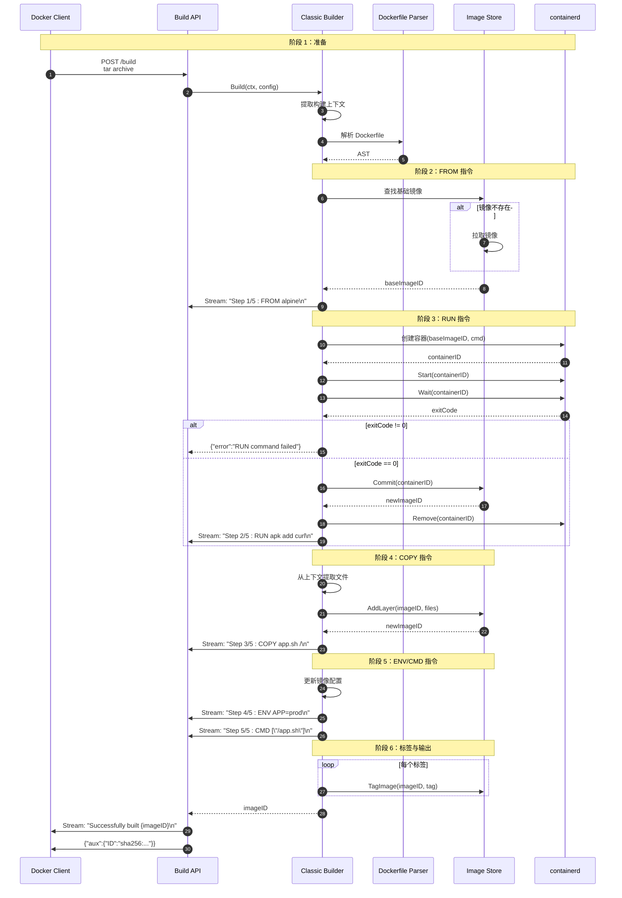

### 说明

#### 图意概述
展示 Classic Builder 的串行构建流程，从解析 Dockerfile 到逐步执行每个指令，最终生成镜像。

#### 关键步骤

**FROM 指令执行**：

- 查找本地镜像
- 本地不存在则拉取
- 设置为当前构建基础

**RUN 指令执行**：

```bash
# 1. 创建容器
docker create <imageID> /bin/sh -c "apk add --no-cache curl"

# 2. 启动容器
docker start <containerID>

# 3. 等待退出
docker wait <containerID>

# 4. 提交为新层
docker commit <containerID> → newImageID

# 5. 删除容器
docker rm <containerID>
```

**COPY 指令执行**：

- 从构建上下文提取文件
- 创建新的镜像层
- 更新镜像 ID

**ENV/CMD 指令执行**：

- 仅更新镜像元数据
- 不创建新层

#### 性能指标

- **小镜像（2-3 层）**：10-30 秒
- **中等镜像（5-10 层）**：1-5 分钟
- **大镜像（20+ 层）**：10-30 分钟

---

## 2. BuildKit 构建流程

### 时序图

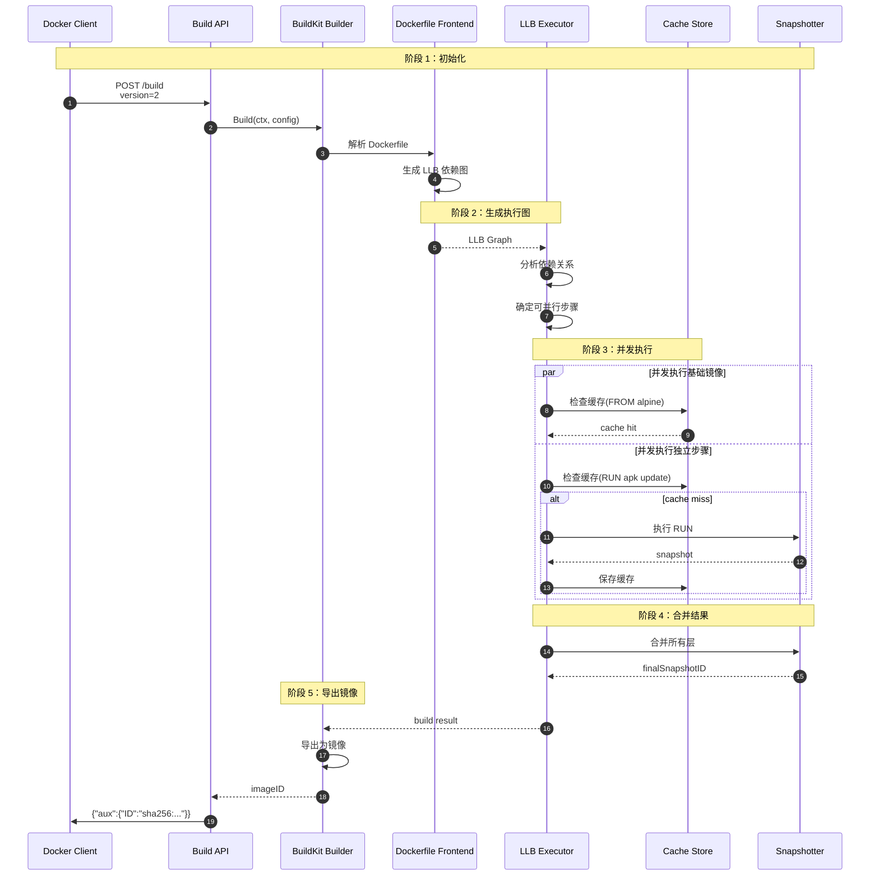

### 说明

#### 图意概述
展示 BuildKit 的并发构建流程，通过依赖图分析实现最大程度的并行化。

#### BuildKit 优势

**并发执行**：

```dockerfile
# Dockerfile
FROM alpine:3.14 AS base1
RUN apk add --no-cache curl

FROM alpine:3.14 AS base2
RUN apk add --no-cache wget

FROM base1 AS final
COPY --from=base2 /usr/bin/wget /usr/bin/
```

**执行顺序**：

```
base1 和 base2 并发执行 ────┐
                           ↓
                         final
```

#### 性能提升

- **并发构建**：减少 50-70% 构建时间
- **高级缓存**：命中率提升 30-50%
- **增量传输**：减少 60-80% 网络传输

---

## 3. 多阶段构建流程

### 时序图

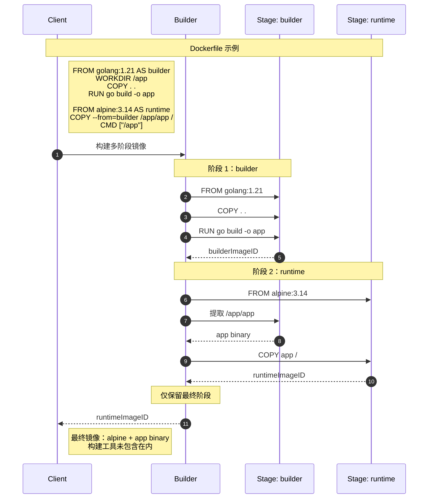

### 说明

#### 图意概述
展示多阶段构建如何分离构建环境和运行环境，减小最终镜像大小。

#### 多阶段构建优势

**镜像大小对比**：

- **单阶段（golang:1.21）**：800+ MB
- **多阶段（alpine）**：10-20 MB

**安全性提升**：

- 构建工具未包含在最终镜像
- 减少攻击面

---

## 4. 构建缓存命中流程

### 时序图

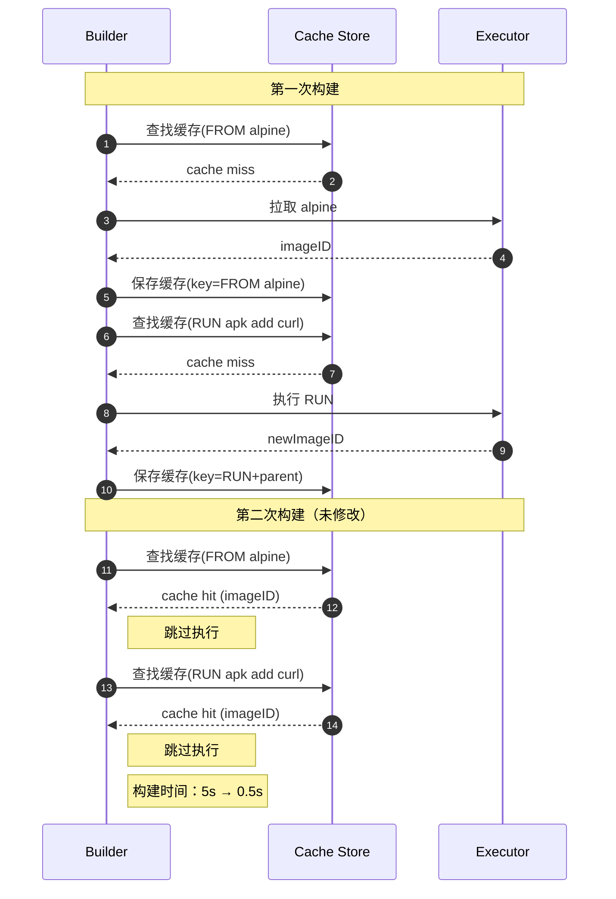

### 说明

#### 缓存键计算

**Classic Builder**：

```
cacheKey = hash(instruction + parentImageID + context files)
```

**BuildKit**：

```
cacheKey = hash(LLB vertex + input snapshots + metadata)
```

#### 缓存失效场景

- Dockerfile 指令修改
- 上下文文件变更（COPY/ADD）
- 父层缓存失效（级联失效）
- 使用 `--no-cache` 选项

---

## 5. 构建缓存清理流程

### 时序图

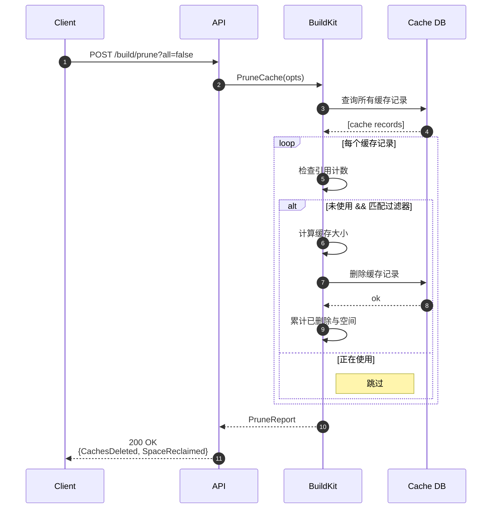

---

**文档版本**：v1.0  
**最后更新**：2025-10-04

---
