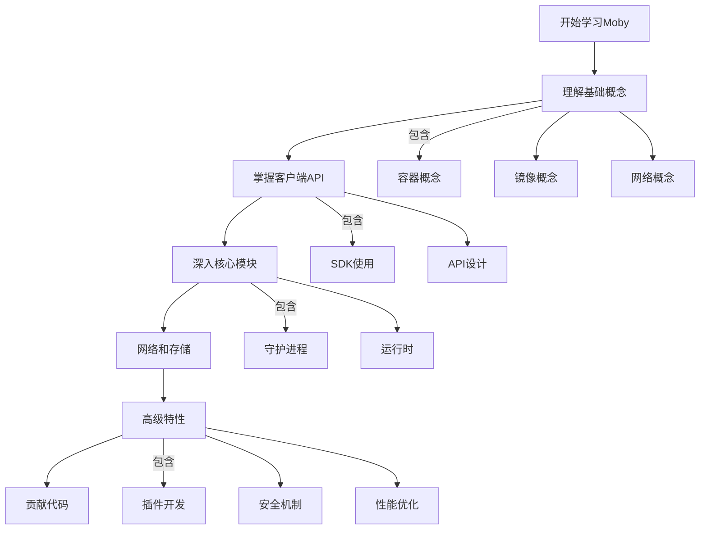
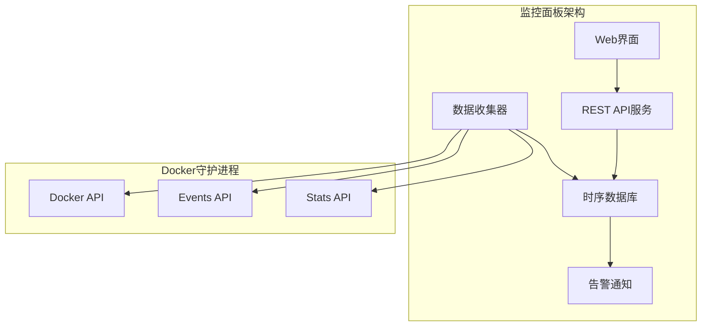
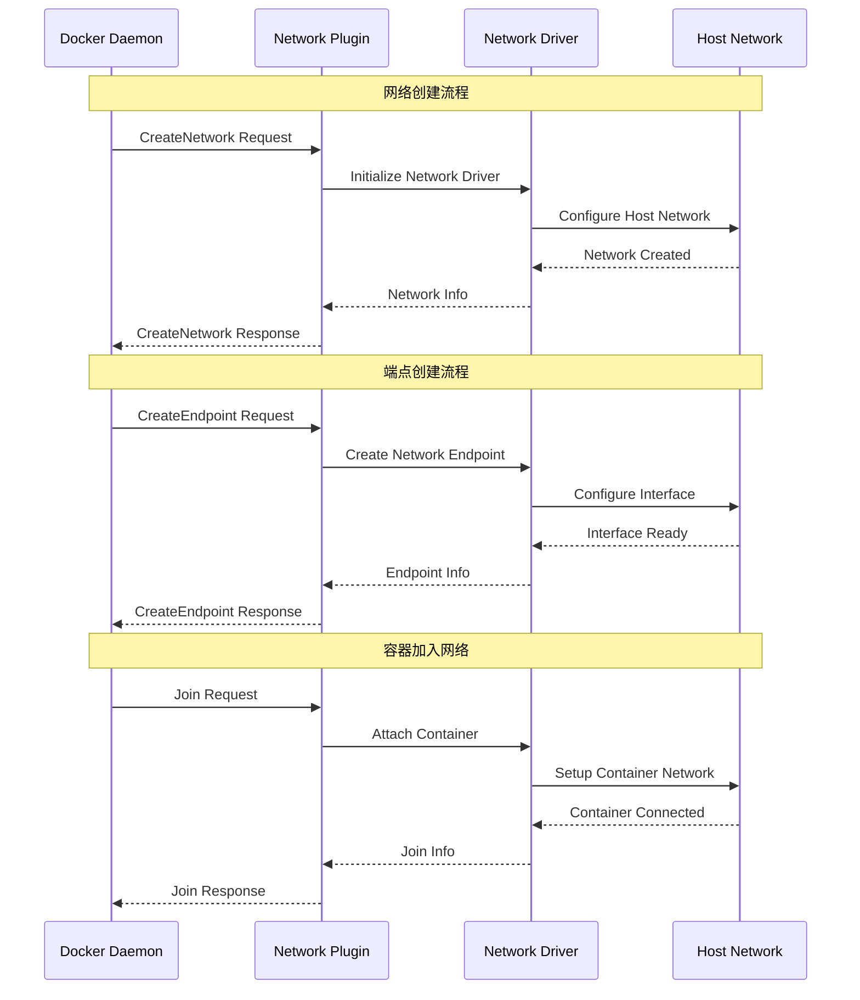
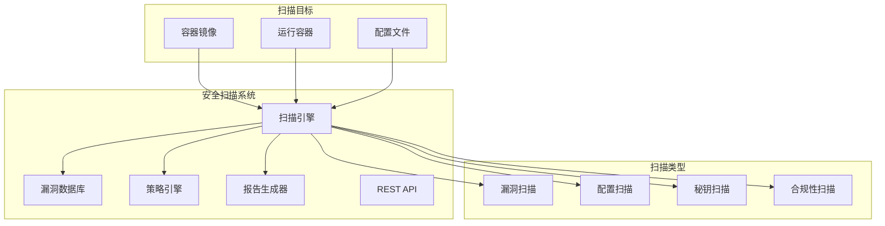

# Moby项目源码剖析 - 实战经验和最佳实践

## 1. 实战经验概述

### 1.1 学习路径建议
基于Moby项目的复杂性，建议按以下路径深入学习：



### 1.2 实战项目分类

| 项目类型 | 难度等级 | 主要技术点 | 预期收获 |
|---------|----------|-----------|----------|
| **基础工具开发** | ⭐⭐ | 客户端API、基础容器操作 | 熟悉Docker API和基础概念 |
| **监控系统** | ⭐⭐⭐ | 事件系统、统计API、实时数据 | 掌握Docker事件和监控机制 |
| **网络插件** | ⭐⭐⭐⭐ | 网络驱动、IPAM、路由 | 深入理解Docker网络架构 |
| **存储驱动** | ⭐⭐⭐⭐ | 图形驱动、文件系统、快照 | 理解镜像分层和存储机制 |
| **安全增强** | ⭐⭐⭐⭐⭐ | 授权插件、安全扫描、策略引擎 | 掌握容器安全最佳实践 |

## 2. 基础实战项目

### 2.1 项目1：容器管理工具

#### 2.1.1 项目目标
开发一个简化的容器管理工具，类似于简版的Docker CLI，帮助理解容器生命周期管理。

#### 2.1.2 核心功能设计

```go
package main

import (
	"context"
	"fmt"
	"log"
	"os"
	"text/tabwriter"
	"time"

	"github.com/moby/moby/client"
	"github.com/moby/moby/api/types/container"
	"github.com/moby/moby/api/types/image"
	"github.com/spf13/cobra"
)

// ContainerManager 容器管理器
type ContainerManager struct {
	client *client.Client
	ctx    context.Context
}

// NewContainerManager 创建容器管理器实例
func NewContainerManager() (*ContainerManager, error) {
	// 1. 创建Docker客户端
	cli, err := client.NewClientWithOpts(
		client.FromEnv,                    // 从环境变量读取配置
		client.WithAPIVersionNegotiation(), // 启用API版本协商
	)
	if err != nil {
		return nil, fmt.Errorf("failed to create docker client: %v", err)
	}

	// 2. 验证连接
	ctx := context.Background()
	if _, err := cli.Ping(ctx); err != nil {
		return nil, fmt.Errorf("failed to connect to docker daemon: %v", err)
	}

	return &ContainerManager{
		client: cli,
		ctx:    ctx,
	}, nil
}

// ListContainers 列出容器，支持多种过滤选项
func (cm *ContainerManager) ListContainers(all bool, format string) error {
	// 1. 配置列表选项
	options := container.ListOptions{
		All: all,
	}

	// 2. 获取容器列表
	containers, err := cm.client.ContainerList(cm.ctx, options)
	if err != nil {
		return fmt.Errorf("failed to list containers: %v", err)
	}

	// 3. 格式化输出
	switch format {
	case "table":
		return cm.printContainerTable(containers)
	case "json":
		return cm.printContainerJSON(containers)
	default:
		return cm.printContainerTable(containers)
	}
}

// printContainerTable 以表格形式打印容器信息
func (cm *ContainerManager) printContainerTable(containers []types.Container) error {
	w := tabwriter.NewWriter(os.Stdout, 0, 0, 2, ' ', 0)
	defer w.Flush()

	// 打印表头
	fmt.Fprintln(w, "CONTAINER ID\tIMAGE\tCOMMAND\tCREATED\tSTATUS\tPORTS\tNAMES")

	// 打印容器信息
	for _, c := range containers {
		// 格式化创建时间
		created := time.Unix(c.Created, 0).Format("2006-01-02 15:04:05")
		
		// 格式化容器名称（去掉前缀斜杠）
		names := ""
		if len(c.Names) > 0 {
			names = c.Names[0][1:] // 去掉前缀 '/'
		}

		// 格式化端口信息
		ports := cm.formatPorts(c.Ports)

		// 输出容器信息行
		fmt.Fprintf(w, "%s\t%s\t%s\t%s\t%s\t%s\t%s\n",
			c.ID[:12],           // 短ID
			c.Image,             // 镜像名
			c.Command,           // 命令
			created,             // 创建时间
			c.State+" "+c.Status, // 状态
			ports,               // 端口
			names,               // 名称
		)
	}

	return nil
}

// formatPorts 格式化端口映射信息
func (cm *ContainerManager) formatPorts(ports []types.Port) string {
	if len(ports) == 0 {
		return ""
	}

	var result []string
	for _, port := range ports {
		if port.PublicPort != 0 {
			result = append(result, fmt.Sprintf("%s:%d->%d/%s",
				port.IP, port.PublicPort, port.PrivatePort, port.Type))
		} else {
			result = append(result, fmt.Sprintf("%d/%s",
				port.PrivatePort, port.Type))
		}
	}

	return strings.Join(result, ", ")
}

// CreateContainer 创建容器的高级封装
func (cm *ContainerManager) CreateContainer(opts ContainerCreateOptions) (string, error) {
	// 1. 验证镜像是否存在，如果不存在则尝试拉取
	if err := cm.ensureImage(opts.Image); err != nil {
		return "", fmt.Errorf("failed to ensure image: %v", err)
	}

	// 2. 构建容器配置
	config := &container.Config{
		Image:        opts.Image,
		Cmd:          opts.Cmd,
		Env:          opts.Env,
		WorkingDir:   opts.WorkingDir,
		ExposedPorts: opts.ExposedPorts,
		Labels:       opts.Labels,
	}

	// 3. 构建主机配置
	hostConfig := &container.HostConfig{
		PortBindings:  opts.PortBindings,
		RestartPolicy: opts.RestartPolicy,
		AutoRemove:    opts.AutoRemove,
		Binds:         opts.Binds,
		Resources:     opts.Resources,
	}

	// 4. 创建容器
	resp, err := cm.client.ContainerCreate(
		cm.ctx,
		config,
		hostConfig,
		nil, // 网络配置
		nil, // 平台配置
		opts.Name,
	)
	if err != nil {
		return "", fmt.Errorf("failed to create container: %v", err)
	}

	// 5. 输出警告信息（如果有）
	for _, warning := range resp.Warnings {
		fmt.Printf("WARNING: %s\n", warning)
	}

	return resp.ID, nil
}

// ContainerCreateOptions 容器创建选项
type ContainerCreateOptions struct {
	Name          string
	Image         string
	Cmd           []string
	Env           []string
	WorkingDir    string
	ExposedPorts  nat.PortSet
	PortBindings  nat.PortMap
	RestartPolicy container.RestartPolicy
	AutoRemove    bool
	Binds         []string
	Resources     container.Resources
	Labels        map[string]string
}

// ensureImage 确保镜像存在，不存在则拉取
func (cm *ContainerManager) ensureImage(imageName string) error {
	// 1. 检查镜像是否已存在
	images, err := cm.client.ImageList(cm.ctx, image.ListOptions{})
	if err != nil {
		return err
	}

	// 2. 查找匹配的镜像
	for _, img := range images {
		for _, tag := range img.RepoTags {
			if tag == imageName {
				fmt.Printf("镜像 %s 已存在\n", imageName)
				return nil
			}
		}
	}

	// 3. 镜像不存在，开始拉取
	fmt.Printf("正在拉取镜像 %s...\n", imageName)
	reader, err := cm.client.ImagePull(cm.ctx, imageName, image.PullOptions{})
	if err != nil {
		return err
	}
	defer reader.Close()

	// 4. 显示拉取进度
	return cm.showPullProgress(reader)
}

// showPullProgress 显示镜像拉取进度
func (cm *ContainerManager) showPullProgress(reader io.Reader) error {
	decoder := json.NewDecoder(reader)
	
	for {
		var message struct {
			Status         string `json:"status"`
			Progress       string `json:"progress,omitempty"`
			ProgressDetail struct {
				Current int64 `json:"current"`
				Total   int64 `json:"total"`
			} `json:"progressDetail,omitempty"`
		}

		if err := decoder.Decode(&message); err != nil {
			if err == io.EOF {
				break
			}
			return err
		}

		// 显示进度信息
		if message.Progress != "" {
			fmt.Printf("\r%s: %s", message.Status, message.Progress)
		} else {
			fmt.Println(message.Status)
		}
	}

	fmt.Println("\n镜像拉取完成")
	return nil
}

// StartContainer 启动容器
func (cm *ContainerManager) StartContainer(containerID string) error {
	if err := cm.client.ContainerStart(cm.ctx, containerID, container.StartOptions{}); err != nil {
		return fmt.Errorf("failed to start container: %v", err)
	}
	
	fmt.Printf("容器 %s 已启动\n", containerID[:12])
	return nil
}

// StopContainer 停止容器
func (cm *ContainerManager) StopContainer(containerID string, timeout *int) error {
	options := container.StopOptions{}
	if timeout != nil {
		options.Timeout = timeout
	}

	if err := cm.client.ContainerStop(cm.ctx, containerID, options); err != nil {
		return fmt.Errorf("failed to stop container: %v", err)
	}
	
	fmt.Printf("容器 %s 已停止\n", containerID[:12])
	return nil
}

// RemoveContainer 删除容器
func (cm *ContainerManager) RemoveContainer(containerID string, force bool) error {
	options := container.RemoveOptions{
		Force: force,
	}

	if err := cm.client.ContainerRemove(cm.ctx, containerID, options); err != nil {
		return fmt.Errorf("failed to remove container: %v", err)
	}
	
	fmt.Printf("容器 %s 已删除\n", containerID[:12])
	return nil
}

// 命令行接口实现
func main() {
	var rootCmd = &cobra.Command{
		Use:   "container-mgr",
		Short: "一个简化的容器管理工具",
		Long:  "基于Moby客户端SDK开发的容器管理工具，用于学习Docker API",
	}

	// 初始化容器管理器
	mgr, err := NewContainerManager()
	if err != nil {
		log.Fatal("初始化失败:", err)
	}

	// 添加子命令
	rootCmd.AddCommand(
		createListCommand(mgr),
		createRunCommand(mgr),
		createStartCommand(mgr),
		createStopCommand(mgr),
		createRemoveCommand(mgr),
	)

	if err := rootCmd.Execute(); err != nil {
		log.Fatal(err)
	}
}

// createListCommand 创建list命令
func createListCommand(mgr *ContainerManager) *cobra.Command {
	var all bool
	var format string

	cmd := &cobra.Command{
		Use:   "list",
		Short: "列出容器",
		RunE: func(cmd *cobra.Command, args []string) error {
			return mgr.ListContainers(all, format)
		},
	}

	cmd.Flags().BoolVarP(&all, "all", "a", false, "显示所有容器")
	cmd.Flags().StringVar(&format, "format", "table", "输出格式 (table|json)")

	return cmd
}

// createRunCommand 创建run命令
func createRunCommand(mgr *ContainerManager) *cobra.Command {
	var opts ContainerCreateOptions

	cmd := &cobra.Command{
		Use:   "run [OPTIONS] IMAGE [COMMAND] [ARG...]",
		Short: "创建并启动容器",
		Args:  cobra.MinimumNArgs(1),
		RunE: func(cmd *cobra.Command, args []string) error {
			opts.Image = args[0]
			if len(args) > 1 {
				opts.Cmd = args[1:]
			}

			// 创建容器
			containerID, err := mgr.CreateContainer(opts)
			if err != nil {
				return err
			}

			// 启动容器
			return mgr.StartContainer(containerID)
		},
	}

	// 添加常用选项
	cmd.Flags().StringVar(&opts.Name, "name", "", "容器名称")
	cmd.Flags().StringSliceVarP(&opts.Env, "env", "e", nil, "环境变量")
	cmd.Flags().StringVarP(&opts.WorkingDir, "workdir", "w", "", "工作目录")
	cmd.Flags().BoolVar(&opts.AutoRemove, "rm", false, "容器退出时自动删除")

	return cmd
}
```

#### 2.1.3 实战要点总结

1. **错误处理**: 每个API调用都需要适当的错误处理
2. **资源管理**: 及时关闭HTTP响应体和客户端连接
3. **版本兼容**: 使用API版本协商确保兼容性
4. **用户体验**: 提供进度显示和友好的错误信息

### 2.2 项目2：Docker监控面板

#### 2.2.1 项目架构设计



#### 2.2.2 核心监控代码

```go
package main

import (
	"context"
	"encoding/json"
	"fmt"
	"log"
	"net/http"
	"sync"
	"time"

	"github.com/moby/moby/client"
	"github.com/moby/moby/api/types"
	"github.com/moby/moby/api/types/events"
	"github.com/gorilla/mux"
	"github.com/gorilla/websocket"
)

// MonitoringService 监控服务
type MonitoringService struct {
	client         *client.Client
	ctx            context.Context
	statsCollector *StatsCollector
	eventCollector *EventCollector
	clients        map[*websocket.Conn]bool
	clientsMux     sync.RWMutex
	upgrader       websocket.Upgrader
}

// StatsCollector 统计信息收集器
type StatsCollector struct {
	client  *client.Client
	ctx     context.Context
	stats   map[string]*ContainerStats
	statsMux sync.RWMutex
}

// ContainerStats 容器统计信息
type ContainerStats struct {
	ContainerID   string    `json:"container_id"`
	Name          string    `json:"name"`
	CPUPercent    float64   `json:"cpu_percent"`
	MemoryUsage   uint64    `json:"memory_usage"`
	MemoryPercent float64   `json:"memory_percent"`
	NetworkRx     uint64    `json:"network_rx"`
	NetworkTx     uint64    `json:"network_tx"`
	BlockRead     uint64    `json:"block_read"`
	BlockWrite    uint64    `json:"block_write"`
	Timestamp     time.Time `json:"timestamp"`
}

// EventCollector 事件收集器
type EventCollector struct {
	client      *client.Client
	ctx         context.Context
	eventChan   chan events.Message
	subscribers []chan events.Message
	subMux      sync.RWMutex
}

// NewMonitoringService 创建监控服务
func NewMonitoringService() (*MonitoringService, error) {
	// 1. 创建Docker客户端
	cli, err := client.NewClientWithOpts(
		client.FromEnv,
		client.WithAPIVersionNegotiation(),
	)
	if err != nil {
		return nil, err
	}

	ctx := context.Background()

	// 2. 创建统计收集器
	statsCollector := &StatsCollector{
		client: cli,
		ctx:    ctx,
		stats:  make(map[string]*ContainerStats),
	}

	// 3. 创建事件收集器
	eventCollector := &EventCollector{
		client:    cli,
		ctx:       ctx,
		eventChan: make(chan events.Message, 100),
	}

	// 4. 创建监控服务
	service := &MonitoringService{
		client:         cli,
		ctx:            ctx,
		statsCollector: statsCollector,
		eventCollector: eventCollector,
		clients:        make(map[*websocket.Conn]bool),
		upgrader: websocket.Upgrader{
			CheckOrigin: func(r *http.Request) bool {
				return true // 允许跨域
			},
		},
	}

	return service, nil
}

// Start 启动监控服务
func (ms *MonitoringService) Start() error {
	// 1. 启动统计信息收集
	go ms.statsCollector.Start()

	// 2. 启动事件收集
	go ms.eventCollector.Start()

	// 3. 启动事件分发
	go ms.eventDistributor()

	// 4. 启动HTTP服务器
	return ms.startHTTPServer()
}

// Start 启动统计信息收集
func (sc *StatsCollector) Start() {
	ticker := time.NewTicker(5 * time.Second)
	defer ticker.Stop()

	for {
		select {
		case <-ticker.C:
			sc.collectStats()
		case <-sc.ctx.Done():
			return
		}
	}
}

// collectStats 收集统计信息
func (sc *StatsCollector) collectStats() {
	// 1. 获取运行中的容器列表
	containers, err := sc.client.ContainerList(sc.ctx, container.ListOptions{})
	if err != nil {
		log.Printf("Failed to list containers: %v", err)
		return
	}

	// 2. 并行收集每个容器的统计信息
	var wg sync.WaitGroup
	for _, c := range containers {
		wg.Add(1)
		go func(containerID string, name string) {
			defer wg.Done()
			
			// 获取容器统计信息
			stats, err := sc.client.ContainerStats(sc.ctx, containerID, false)
			if err != nil {
				log.Printf("Failed to get stats for container %s: %v", containerID, err)
				return
			}
			defer stats.Body.Close()

			// 解析统计信息
			var statsData types.Stats
			if err := json.NewDecoder(stats.Body).Decode(&statsData); err != nil {
				log.Printf("Failed to decode stats: %v", err)
				return
			}

			// 计算统计指标
			containerStats := sc.calculateStats(containerID, name, &statsData)

			// 更新统计信息缓存
			sc.statsMux.Lock()
			sc.stats[containerID] = containerStats
			sc.statsMux.Unlock()
		}(c.ID, c.Names[0])
	}

	wg.Wait()
}

// calculateStats 计算统计指标
func (sc *StatsCollector) calculateStats(containerID, name string, stats *types.Stats) *ContainerStats {
	// 1. 计算CPU使用率
	cpuPercent := calculateCPUPercent(stats)

	// 2. 计算内存使用情况
	memoryUsage := stats.MemoryStats.Usage
	memoryPercent := float64(memoryUsage) / float64(stats.MemoryStats.Limit) * 100

	// 3. 计算网络I/O
	var networkRx, networkTx uint64
	for _, network := range stats.Networks {
		networkRx += network.RxBytes
		networkTx += network.TxBytes
	}

	// 4. 计算磁盘I/O
	var blockRead, blockWrite uint64
	for _, blkio := range stats.BlkioStats.IoServiceBytesRecursive {
		if blkio.Op == "Read" {
			blockRead += blkio.Value
		} else if blkio.Op == "Write" {
			blockWrite += blkio.Value
		}
	}

	return &ContainerStats{
		ContainerID:   containerID,
		Name:          name,
		CPUPercent:    cpuPercent,
		MemoryUsage:   memoryUsage,
		MemoryPercent: memoryPercent,
		NetworkRx:     networkRx,
		NetworkTx:     networkTx,
		BlockRead:     blockRead,
		BlockWrite:    blockWrite,
		Timestamp:     time.Now(),
	}
}

// calculateCPUPercent 计算CPU使用百分比
func calculateCPUPercent(stats *types.Stats) float64 {
	// Docker统计信息中的CPU计算逻辑
	cpuDelta := float64(stats.CPUStats.CPUUsage.TotalUsage) - float64(stats.PreCPUStats.CPUUsage.TotalUsage)
	systemDelta := float64(stats.CPUStats.SystemUsage) - float64(stats.PreCPUStats.SystemUsage)

	if systemDelta > 0.0 && cpuDelta > 0.0 {
		return (cpuDelta / systemDelta) * float64(len(stats.CPUStats.CPUUsage.PercpuUsage)) * 100.0
	}
	return 0.0
}

// Start 启动事件收集
func (ec *EventCollector) Start() {
	// 监听Docker事件
	eventChan, errChan := ec.client.Events(ec.ctx, types.EventsOptions{})

	for {
		select {
		case event := <-eventChan:
			ec.eventChan <- event
		case err := <-errChan:
			log.Printf("Error receiving events: %v", err)
		case <-ec.ctx.Done():
			return
		}
	}
}

// Subscribe 订阅事件
func (ec *EventCollector) Subscribe() chan events.Message {
	ec.subMux.Lock()
	defer ec.subMux.Unlock()

	eventChan := make(chan events.Message, 10)
	ec.subscribers = append(ec.subscribers, eventChan)
	return eventChan
}

// eventDistributor 事件分发器
func (ms *MonitoringService) eventDistributor() {
	for {
		select {
		case event := <-ms.eventCollector.eventChan:
			// 分发事件给所有订阅者
			ms.eventCollector.subMux.RLock()
			for _, subscriber := range ms.eventCollector.subscribers {
				select {
				case subscriber <- event:
				default:
					// 非阻塞发送，避免慢订阅者影响其他订阅者
				}
			}
			ms.eventCollector.subMux.RUnlock()

			// 通过WebSocket分发给前端客户端
			ms.broadcastEvent(event)
		case <-ms.ctx.Done():
			return
		}
	}
}

// broadcastEvent 广播事件到WebSocket客户端
func (ms *MonitoringService) broadcastEvent(event events.Message) {
	ms.clientsMux.RLock()
	defer ms.clientsMux.RUnlock()

	message, _ := json.Marshal(map[string]interface{}{
		"type":  "event",
		"event": event,
	})

	for conn := range ms.clients {
		if err := conn.WriteMessage(websocket.TextMessage, message); err != nil {
			log.Printf("Failed to write to WebSocket: %v", err)
			conn.Close()
			delete(ms.clients, conn)
		}
	}
}

// startHTTPServer 启动HTTP服务器
func (ms *MonitoringService) startHTTPServer() error {
	router := mux.NewRouter()

	// API路由
	api := router.PathPrefix("/api/v1").Subrouter()
	api.HandleFunc("/stats", ms.handleStats).Methods("GET")
	api.HandleFunc("/containers", ms.handleContainers).Methods("GET")

	// WebSocket路由
	router.HandleFunc("/ws", ms.handleWebSocket)

	// 静态文件服务
	router.PathPrefix("/").Handler(http.FileServer(http.Dir("./web/")))

	log.Println("监控服务启动在端口 :8080")
	return http.ListenAndServe(":8080", router)
}

// handleStats 处理统计信息API
func (ms *MonitoringService) handleStats(w http.ResponseWriter, r *http.Request) {
	ms.statsCollector.statsMux.RLock()
	defer ms.statsCollector.statsMux.RUnlock()

	w.Header().Set("Content-Type", "application/json")
	json.NewEncoder(w).Encode(ms.statsCollector.stats)
}

// handleContainers 处理容器列表API
func (ms *MonitoringService) handleContainers(w http.ResponseWriter, r *http.Request) {
	containers, err := ms.client.ContainerList(ms.ctx, container.ListOptions{All: true})
	if err != nil {
		http.Error(w, err.Error(), http.StatusInternalServerError)
		return
	}

	w.Header().Set("Content-Type", "application/json")
	json.NewEncoder(w).Encode(containers)
}

// handleWebSocket 处理WebSocket连接
func (ms *MonitoringService) handleWebSocket(w http.ResponseWriter, r *http.Request) {
	conn, err := ms.upgrader.Upgrade(w, r, nil)
	if err != nil {
		log.Printf("Failed to upgrade to WebSocket: %v", err)
		return
	}

	// 注册客户端
	ms.clientsMux.Lock()
	ms.clients[conn] = true
	ms.clientsMux.Unlock()

	// 发送初始数据
	ms.sendInitialData(conn)

	// 处理客户端消息（心跳等）
	for {
		_, _, err := conn.ReadMessage()
		if err != nil {
			log.Printf("WebSocket read error: %v", err)
			break
		}
	}

	// 清理连接
	ms.clientsMux.Lock()
	delete(ms.clients, conn)
	ms.clientsMux.Unlock()
	conn.Close()
}

// sendInitialData 发送初始数据
func (ms *MonitoringService) sendInitialData(conn *websocket.Conn) {
	// 发送当前统计信息
	ms.statsCollector.statsMux.RLock()
	stats := ms.statsCollector.stats
	ms.statsCollector.statsMux.RUnlock()

	message, _ := json.Marshal(map[string]interface{}{
		"type":  "initial_stats",
		"stats": stats,
	})

	conn.WriteMessage(websocket.TextMessage, message)
}

func main() {
	service, err := NewMonitoringService()
	if err != nil {
		log.Fatal("Failed to create monitoring service:", err)
	}

	log.Fatal(service.Start())
}
```

## 3. 高级实战项目

### 3.1 项目3：自定义网络插件

#### 3.1.1 网络插件架构



#### 3.1.2 网络插件实现

```go
package main

import (
	"encoding/json"
	"fmt"
	"log"
	"net"
	"net/http"
	"os"
	"path/filepath"

	"github.com/docker/go-plugins-helpers/network"
	"github.com/vishvananda/netlink"
	"github.com/vishvananda/netns"
)

// CustomNetworkDriver 自定义网络驱动
type CustomNetworkDriver struct {
	networks  map[string]*NetworkInfo
	endpoints map[string]*EndpointInfo
}

// NetworkInfo 网络信息
type NetworkInfo struct {
	ID      string                 `json:"id"`
	Name    string                 `json:"name"`
	Gateway string                 `json:"gateway"`
	Subnet  string                 `json:"subnet"`
	Bridge  string                 `json:"bridge"`
	Options map[string]interface{} `json:"options"`
}

// EndpointInfo 端点信息
type EndpointInfo struct {
	ID        string `json:"id"`
	NetworkID string `json:"network_id"`
	Interface string `json:"interface"`
	IPAddress string `json:"ip_address"`
	MacAddress string `json:"mac_address"`
}

// NewCustomNetworkDriver 创建自定义网络驱动
func NewCustomNetworkDriver() *CustomNetworkDriver {
	return &CustomNetworkDriver{
		networks:  make(map[string]*NetworkInfo),
		endpoints: make(map[string]*EndpointInfo),
	}
}

// GetCapabilities 获取驱动能力
func (d *CustomNetworkDriver) GetCapabilities() (*network.CapabilitiesResponse, error) {
	log.Printf("收到GetCapabilities请求")
	
	return &network.CapabilitiesResponse{
		Scope:             "local",        // 作用域：local/global
		ConnectivityScope: "local",        // 连接性作用域
	}, nil
}

// AllocateNetwork 分配网络资源
func (d *CustomNetworkDriver) AllocateNetwork(req *network.AllocateNetworkRequest) (*network.AllocateNetworkResponse, error) {
	log.Printf("收到AllocateNetwork请求: %+v", req)
	
	// 对于local作用域的驱动，通常不需要特殊的网络分配逻辑
	return &network.AllocateNetworkResponse{}, nil
}

// FreeNetwork 释放网络资源
func (d *CustomNetworkDriver) FreeNetwork(req *network.FreeNetworkRequest) error {
	log.Printf("收到FreeNetwork请求: %+v", req)
	
	// 清理网络资源
	delete(d.networks, req.NetworkID)
	return nil
}

// CreateNetwork 创建网络
func (d *CustomNetworkDriver) CreateNetwork(req *network.CreateNetworkRequest) error {
	log.Printf("收到CreateNetwork请求: %+v", req)
	
	// 1. 解析网络配置
	netInfo := &NetworkInfo{
		ID:      req.NetworkID,
		Options: req.Options,
	}
	
	// 2. 从IPv4Data中获取子网和网关信息
	if len(req.IPv4Data) > 0 {
		ipv4Data := req.IPv4Data[0]
		netInfo.Subnet = ipv4Data.Pool
		netInfo.Gateway = ipv4Data.Gateway
	}
	
	// 3. 生成桥接设备名称
	bridgeName := fmt.Sprintf("br-%s", req.NetworkID[:12])
	netInfo.Bridge = bridgeName
	
	// 4. 创建Linux桥接设备
	if err := d.createBridge(bridgeName, netInfo.Gateway, netInfo.Subnet); err != nil {
		return fmt.Errorf("创建网桥失败: %v", err)
	}
	
	// 5. 存储网络信息
	d.networks[req.NetworkID] = netInfo
	
	log.Printf("网络创建成功: %s (桥接: %s)", req.NetworkID, bridgeName)
	return nil
}

// createBridge 创建Linux桥接设备
func (d *CustomNetworkDriver) createBridge(name, gateway, subnet string) error {
	// 1. 创建桥接设备
	bridge := &netlink.Bridge{
		LinkAttrs: netlink.LinkAttrs{
			Name: name,
		},
	}
	
	// 2. 检查桥接是否已存在
	if _, err := netlink.LinkByName(name); err == nil {
		log.Printf("桥接 %s 已存在", name)
		return nil
	}
	
	// 3. 添加桥接设备
	if err := netlink.LinkAdd(bridge); err != nil {
		return fmt.Errorf("添加桥接设备失败: %v", err)
	}
	
	// 4. 启用桥接设备
	if err := netlink.LinkSetUp(bridge); err != nil {
		return fmt.Errorf("启用桥接设备失败: %v", err)
	}
	
	// 5. 配置网关地址
	if gateway != "" && subnet != "" {
		gatewayAddr, err := netlink.ParseAddr(fmt.Sprintf("%s/%s", gateway, subnet))
		if err != nil {
			return fmt.Errorf("解析网关地址失败: %v", err)
		}
		
		if err := netlink.AddrAdd(bridge, gatewayAddr); err != nil {
			return fmt.Errorf("添加网关地址失败: %v", err)
		}
	}
	
	log.Printf("桥接 %s 创建成功", name)
	return nil
}

// DeleteNetwork 删除网络
func (d *CustomNetworkDriver) DeleteNetwork(req *network.DeleteNetworkRequest) error {
	log.Printf("收到DeleteNetwork请求: %+v", req)
	
	// 1. 获取网络信息
	netInfo, exists := d.networks[req.NetworkID]
	if !exists {
		log.Printf("网络 %s 不存在", req.NetworkID)
		return nil
	}
	
	// 2. 删除桥接设备
	if err := d.deleteBridge(netInfo.Bridge); err != nil {
		log.Printf("删除桥接失败: %v", err)
		// 不返回错误，继续清理
	}
	
	// 3. 清理网络信息
	delete(d.networks, req.NetworkID)
	
	log.Printf("网络删除成功: %s", req.NetworkID)
	return nil
}

// deleteBridge 删除Linux桥接设备
func (d *CustomNetworkDriver) deleteBridge(name string) error {
	// 1. 获取桥接设备
	bridge, err := netlink.LinkByName(name)
	if err != nil {
		// 桥接不存在
		return nil
	}
	
	// 2. 关闭桥接设备
	if err := netlink.LinkSetDown(bridge); err != nil {
		log.Printf("关闭桥接设备失败: %v", err)
	}
	
	// 3. 删除桥接设备
	if err := netlink.LinkDel(bridge); err != nil {
		return fmt.Errorf("删除桥接设备失败: %v", err)
	}
	
	log.Printf("桥接 %s 删除成功", name)
	return nil
}

// CreateEndpoint 创建端点
func (d *CustomNetworkDriver) CreateEndpoint(req *network.CreateEndpointRequest) (*network.CreateEndpointResponse, error) {
	log.Printf("收到CreateEndpoint请求: %+v", req)
	
	// 1. 获取网络信息
	netInfo, exists := d.networks[req.NetworkID]
	if !exists {
		return nil, fmt.Errorf("网络 %s 不存在", req.NetworkID)
	}
	
	// 2. 解析接口信息
	var ipAddress, macAddress string
	if req.Interface != nil {
		ipAddress = req.Interface.Address
		macAddress = req.Interface.MacAddress
	}
	
	// 3. 创建veth对
	vethName := fmt.Sprintf("veth%s", req.EndpointID[:8])
	peerName := fmt.Sprintf("peer%s", req.EndpointID[:8])
	
	if err := d.createVethPair(vethName, peerName); err != nil {
		return nil, fmt.Errorf("创建veth对失败: %v", err)
	}
	
	// 4. 将veth的一端连接到桥接
	if err := d.attachToBridge(vethName, netInfo.Bridge); err != nil {
		return nil, fmt.Errorf("连接到桥接失败: %v", err)
	}
	
	// 5. 存储端点信息
	endpointInfo := &EndpointInfo{
		ID:         req.EndpointID,
		NetworkID:  req.NetworkID,
		Interface:  peerName,
		IPAddress:  ipAddress,
		MacAddress: macAddress,
	}
	d.endpoints[req.EndpointID] = endpointInfo
	
	// 6. 返回接口信息
	response := &network.CreateEndpointResponse{}
	if req.Interface == nil {
		// Docker没有提供接口配置，我们需要返回配置信息
		response.Interface = &network.EndpointInterface{
			Address: ipAddress,
		}
	}
	
	log.Printf("端点创建成功: %s", req.EndpointID)
	return response, nil
}

// createVethPair 创建veth对
func (d *CustomNetworkDriver) createVethPair(vethName, peerName string) error {
	// 1. 创建veth链接
	veth := &netlink.Veth{
		LinkAttrs: netlink.LinkAttrs{
			Name: vethName,
		},
		PeerName: peerName,
	}
	
	// 2. 添加veth对
	if err := netlink.LinkAdd(veth); err != nil {
		return fmt.Errorf("添加veth对失败: %v", err)
	}
	
	// 3. 启用veth设备
	if err := netlink.LinkSetUp(veth); err != nil {
		return fmt.Errorf("启用veth设备失败: %v", err)
	}
	
	// 4. 启用peer设备
	peer, err := netlink.LinkByName(peerName)
	if err != nil {
		return fmt.Errorf("获取peer设备失败: %v", err)
	}
	
	if err := netlink.LinkSetUp(peer); err != nil {
		return fmt.Errorf("启用peer设备失败: %v", err)
	}
	
	log.Printf("veth对创建成功: %s <-> %s", vethName, peerName)
	return nil
}

// attachToBridge 将设备连接到桥接
func (d *CustomNetworkDriver) attachToBridge(deviceName, bridgeName string) error {
	// 1. 获取设备
	device, err := netlink.LinkByName(deviceName)
	if err != nil {
		return fmt.Errorf("获取设备失败: %v", err)
	}
	
	// 2. 获取桥接
	bridge, err := netlink.LinkByName(bridgeName)
	if err != nil {
		return fmt.Errorf("获取桥接失败: %v", err)
	}
	
	// 3. 连接设备到桥接
	if err := netlink.LinkSetMaster(device, bridge); err != nil {
		return fmt.Errorf("连接到桥接失败: %v", err)
	}
	
	log.Printf("设备 %s 已连接到桥接 %s", deviceName, bridgeName)
	return nil
}

// DeleteEndpoint 删除端点
func (d *CustomNetworkDriver) DeleteEndpoint(req *network.DeleteEndpointRequest) error {
	log.Printf("收到DeleteEndpoint请求: %+v", req)
	
	// 1. 获取端点信息
	endpointInfo, exists := d.endpoints[req.EndpointID]
	if !exists {
		log.Printf("端点 %s 不存在", req.EndpointID)
		return nil
	}
	
	// 2. 删除veth设备（会自动删除整个veth对）
	vethName := fmt.Sprintf("veth%s", req.EndpointID[:8])
	if err := d.deleteVeth(vethName); err != nil {
		log.Printf("删除veth失败: %v", err)
	}
	
	// 3. 清理端点信息
	delete(d.endpoints, req.EndpointID)
	
	log.Printf("端点删除成功: %s", req.EndpointID)
	return nil
}

// deleteVeth 删除veth设备
func (d *CustomNetworkDriver) deleteVeth(vethName string) error {
	// 获取veth设备
	veth, err := netlink.LinkByName(vethName)
	if err != nil {
		// 设备不存在
		return nil
	}
	
	// 删除veth设备
	if err := netlink.LinkDel(veth); err != nil {
		return fmt.Errorf("删除veth设备失败: %v", err)
	}
	
	log.Printf("veth %s 删除成功", vethName)
	return nil
}

// Join 容器加入网络
func (d *CustomNetworkDriver) Join(req *network.JoinRequest) (*network.JoinResponse, error) {
	log.Printf("收到Join请求: %+v", req)
	
	// 1. 获取端点信息
	endpointInfo, exists := d.endpoints[req.EndpointID]
	if !exists {
		return nil, fmt.Errorf("端点 %s 不存在", req.EndpointID)
	}
	
	// 2. 返回加入信息
	response := &network.JoinResponse{
		InterfaceName: network.InterfaceName{
			SrcName:   endpointInfo.Interface,
			DstPrefix: "eth",
		},
	}
	
	log.Printf("容器加入网络成功: 端点 %s", req.EndpointID)
	return response, nil
}

// Leave 容器离开网络
func (d *CustomNetworkDriver) Leave(req *network.LeaveRequest) error {
	log.Printf("收到Leave请求: %+v", req)
	
	// 对于这个简单的实现，离开网络时不需要特殊处理
	// 实际的清理工作在DeleteEndpoint中完成
	
	log.Printf("容器离开网络成功: 端点 %s", req.EndpointID)
	return nil
}

// DiscoverNew 发现新资源
func (d *CustomNetworkDriver) DiscoverNew(req *network.DiscoveryNotification) error {
	log.Printf("收到DiscoverNew请求: %+v", req)
	return nil
}

// DiscoverDelete 删除发现的资源
func (d *CustomNetworkDriver) DiscoverDelete(req *network.DiscoveryNotification) error {
	log.Printf("收到DiscoverDelete请求: %+v", req)
	return nil
}

// ProgramExternalConnectivity 配置外部连接性
func (d *CustomNetworkDriver) ProgramExternalConnectivity(req *network.ProgramExternalConnectivityRequest) error {
	log.Printf("收到ProgramExternalConnectivity请求: %+v", req)
	return nil
}

// RevokeExternalConnectivity 撤销外部连接性
func (d *CustomNetworkDriver) RevokeExternalConnectivity(req *network.RevokeExternalConnectivityRequest) error {
	log.Printf("收到RevokeExternalConnectivity请求: %+v", req)
	return nil
}

// main 主函数
func main() {
	// 创建网络驱动
	driver := NewCustomNetworkDriver()
	
	// 创建网络处理器
	handler := network.NewHandler(driver)
	
	// 启动HTTP服务器
	log.Printf("自定义网络插件启动在 /run/docker/plugins/custom-network.sock")
	
	// 确保插件目录存在
	pluginDir := "/run/docker/plugins"
	if err := os.MkdirAll(pluginDir, 0755); err != nil {
		log.Fatal("创建插件目录失败:", err)
	}
	
	// 监听Unix socket
	socketPath := filepath.Join(pluginDir, "custom-network.sock")
	if err := handler.ServeUnix(socketPath, 0); err != nil {
		log.Fatal("启动网络插件失败:", err)
	}
}
```

### 3.2 项目4：容器安全扫描器

#### 3.2.1 安全扫描架构



## 4. 性能优化最佳实践

### 4.1 客户端优化

```go
// 连接池优化
func createOptimizedClient() (*client.Client, error) {
	transport := &http.Transport{
		MaxIdleConns:        100,              // 最大空闲连接数
		MaxIdleConnsPerHost: 10,               // 每个主机的最大空闲连接
		IdleConnTimeout:     90 * time.Second, // 空闲连接超时
		TLSHandshakeTimeout: 10 * time.Second, // TLS握手超时
		DisableCompression:  true,             // 禁用压缩以减少CPU使用
	}
	
	httpClient := &http.Client{
		Transport: transport,
		Timeout:   30 * time.Second, // 总体超时
	}
	
	return client.NewClientWithOpts(
		client.WithHTTPClient(httpClient),
		client.WithAPIVersionNegotiation(),
	)
}

// 批量操作优化
func batchContainerOperations(cli *client.Client, containerIDs []string, operation string) error {
	const maxConcurrency = 5
	semaphore := make(chan struct{}, maxConcurrency)
	
	var wg sync.WaitGroup
	errChan := make(chan error, len(containerIDs))
	
	for _, id := range containerIDs {
		wg.Add(1)
		go func(containerID string) {
			defer wg.Done()
			semaphore <- struct{}{} // 获取信号量
			defer func() { <-semaphore }() // 释放信号量
			
			switch operation {
			case "start":
				err := cli.ContainerStart(context.Background(), containerID, container.StartOptions{})
				if err != nil {
					errChan <- fmt.Errorf("启动容器 %s 失败: %v", containerID, err)
				}
			case "stop":
				timeout := 30
				err := cli.ContainerStop(context.Background(), containerID, container.StopOptions{
					Timeout: &timeout,
				})
				if err != nil {
					errChan <- fmt.Errorf("停止容器 %s 失败: %v", containerID, err)
				}
			}
		}(id)
	}
	
	wg.Wait()
	close(errChan)
	
	// 收集错误
	var errors []string
	for err := range errChan {
		errors = append(errors, err.Error())
	}
	
	if len(errors) > 0 {
		return fmt.Errorf("批量操作失败: %v", strings.Join(errors, "; "))
	}
	
	return nil
}
```

### 4.2 内存和资源管理

```go
// 流式处理大文件
func streamLargeFile(cli *client.Client, containerID, srcPath, dstPath string) error {
	// 1. 创建tar读取器
	reader, _, err := cli.CopyFromContainer(context.Background(), containerID, srcPath)
	if err != nil {
		return err
	}
	defer reader.Close()
	
	// 2. 创建目标文件
	file, err := os.Create(dstPath)
	if err != nil {
		return err
	}
	defer file.Close()
	
	// 3. 使用缓冲区流式复制
	buffer := make([]byte, 32*1024) // 32KB缓冲区
	_, err = io.CopyBuffer(file, reader, buffer)
	return err
}

// 资源清理管理器
type ResourceManager struct {
	containers []string
	networks   []string
	volumes    []string
	client     *client.Client
}

func (rm *ResourceManager) Cleanup() {
	// 清理容器
	for _, containerID := range rm.containers {
		rm.client.ContainerRemove(context.Background(), containerID, container.RemoveOptions{
			Force: true,
		})
	}
	
	// 清理网络
	for _, networkID := range rm.networks {
		rm.client.NetworkRemove(context.Background(), networkID)
	}
	
	// 清理存储卷
	for _, volumeName := range rm.volumes {
		rm.client.VolumeRemove(context.Background(), volumeName, true)
	}
}
```

### 4.3 错误处理和重试机制

```go
// 指数退避重试
func retryWithExponentialBackoff(operation func() error, maxRetries int) error {
	var lastError error
	
	for i := 0; i < maxRetries; i++ {
		err := operation()
		if err == nil {
			return nil
		}
		
		lastError = err
		
		// 检查是否是可重试的错误
		if !isRetryableError(err) {
			return err
		}
		
		// 计算退避时间
		backoffTime := time.Duration(1<<uint(i)) * time.Second
		if backoffTime > 30*time.Second {
			backoffTime = 30 * time.Second
		}
		
		log.Printf("操作失败，%v 后重试 (第 %d/%d 次): %v", backoffTime, i+1, maxRetries, err)
		time.Sleep(backoffTime)
	}
	
	return fmt.Errorf("操作在 %d 次重试后仍然失败: %v", maxRetries, lastError)
}

// 判断是否是可重试的错误
func isRetryableError(err error) bool {
	// 网络错误
	if netErr, ok := err.(net.Error); ok {
		return netErr.Timeout() || netErr.Temporary()
	}
	
	// 上下文超时
	if errors.Is(err, context.DeadlineExceeded) {
		return true
	}
	
	// 服务器内部错误（5xx）
	if strings.Contains(err.Error(), "500") ||
		strings.Contains(err.Error(), "502") ||
		strings.Contains(err.Error(), "503") {
		return true
	}
	
	return false
}
```

## 5. 安全最佳实践

### 5.1 安全配置检查

```go
// 安全配置检查器
type SecurityChecker struct {
	client *client.Client
}

// CheckContainerSecurity 检查容器安全配置
func (sc *SecurityChecker) CheckContainerSecurity(containerID string) (*SecurityReport, error) {
	// 1. 获取容器详细信息
	containerJSON, err := sc.client.ContainerInspect(context.Background(), containerID)
	if err != nil {
		return nil, err
	}
	
	report := &SecurityReport{
		ContainerID: containerID,
		Issues:      []SecurityIssue{},
	}
	
	// 2. 检查特权模式
	if containerJSON.HostConfig.Privileged {
		report.Issues = append(report.Issues, SecurityIssue{
			Level:   "HIGH",
			Type:    "PRIVILEGED_CONTAINER",
			Message: "容器运行在特权模式，具有完整的系统访问权限",
			Recommendation: "避免使用特权模式，使用具体的capabilities替代",
		})
	}
	
	// 3. 检查网络模式
	if containerJSON.HostConfig.NetworkMode == "host" {
		report.Issues = append(report.Issues, SecurityIssue{
			Level:   "MEDIUM",
			Type:    "HOST_NETWORK",
			Message: "容器使用主机网络模式",
			Recommendation: "使用自定义网络替代主机网络模式",
		})
	}
	
	// 4. 检查PID模式
	if containerJSON.HostConfig.PidMode == "host" {
		report.Issues = append(report.Issues, SecurityIssue{
			Level:   "HIGH",
			Type:    "HOST_PID",
			Message: "容器使用主机PID命名空间",
			Recommendation: "避免使用主机PID命名空间",
		})
	}
	
	// 5. 检查用户配置
	if containerJSON.Config.User == "" || containerJSON.Config.User == "root" || containerJSON.Config.User == "0" {
		report.Issues = append(report.Issues, SecurityIssue{
			Level:   "MEDIUM",
			Type:    "ROOT_USER",
			Message: "容器以root用户运行",
			Recommendation: "使用非特权用户运行容器",
		})
	}
	
	// 6. 检查只读根文件系统
	if !containerJSON.HostConfig.ReadonlyRootfs {
		report.Issues = append(report.Issues, SecurityIssue{
			Level:   "LOW",
			Type:    "WRITABLE_ROOT_FS",
			Message: "根文件系统可写",
			Recommendation: "考虑设置只读根文件系统",
		})
	}
	
	// 7. 检查capabilities
	sc.checkCapabilities(containerJSON.HostConfig, report)
	
	// 8. 检查挂载点
	sc.checkMounts(containerJSON.HostConfig, report)
	
	return report, nil
}

// checkCapabilities 检查capabilities配置
func (sc *SecurityChecker) checkCapabilities(hostConfig *container.HostConfig, report *SecurityReport) {
	dangerousCapabilities := []string{
		"SYS_ADMIN", "SYS_MODULE", "SYS_RAWIO", "SYS_PTRACE",
		"DAC_OVERRIDE", "DAC_READ_SEARCH", "SETUID", "SETGID",
	}
	
	for _, cap := range hostConfig.CapAdd {
		for _, dangerousCap := range dangerousCapabilities {
			if strings.EqualFold(cap, dangerousCap) {
				report.Issues = append(report.Issues, SecurityIssue{
					Level:   "HIGH",
					Type:    "DANGEROUS_CAPABILITY",
					Message: fmt.Sprintf("添加了危险的capability: %s", cap),
					Recommendation: fmt.Sprintf("评估是否真的需要 %s capability", cap),
				})
			}
		}
	}
}

// checkMounts 检查挂载配置
func (sc *SecurityChecker) checkMounts(hostConfig *container.HostConfig, report *SecurityReport) {
	sensitivePaths := []string{
		"/", "/etc", "/proc", "/sys", "/dev", "/var/run/docker.sock",
	}
	
	for _, mount := range hostConfig.Mounts {
		for _, sensitivePath := range sensitivePaths {
			if strings.HasPrefix(mount.Source, sensitivePath) {
				level := "MEDIUM"
				if mount.Source == "/var/run/docker.sock" || mount.Source == "/" {
					level = "HIGH"
				}
				
				report.Issues = append(report.Issues, SecurityIssue{
					Level:   level,
					Type:    "SENSITIVE_MOUNT",
					Message: fmt.Sprintf("挂载了敏感路径: %s -> %s", mount.Source, mount.Target),
					Recommendation: "限制敏感路径的挂载，使用具体的子目录",
				})
			}
		}
	}
}

// SecurityReport 安全报告
type SecurityReport struct {
	ContainerID string          `json:"container_id"`
	Issues      []SecurityIssue `json:"issues"`
	Score       int             `json:"score"`
}

// SecurityIssue 安全问题
type SecurityIssue struct {
	Level          string `json:"level"`
	Type           string `json:"type"`
	Message        string `json:"message"`
	Recommendation string `json:"recommendation"`
}
```

## 6. 调试和故障排查

### 6.1 调试工具和技巧

```go
// 调试信息收集器
type DebugCollector struct {
	client *client.Client
}

// CollectDebugInfo 收集调试信息
func (dc *DebugCollector) CollectDebugInfo(containerID string) (*DebugInfo, error) {
	info := &DebugInfo{
		ContainerID: containerID,
		Timestamp:   time.Now(),
	}
	
	// 1. 收集容器基本信息
	containerJSON, err := dc.client.ContainerInspect(context.Background(), containerID)
	if err != nil {
		return nil, err
	}
	info.ContainerInfo = containerJSON
	
	// 2. 收集容器日志
	logOptions := container.LogsOptions{
		ShowStdout: true,
		ShowStderr: true,
		Tail:       "100",
		Timestamps: true,
	}
	
	logReader, err := dc.client.ContainerLogs(context.Background(), containerID, logOptions)
	if err != nil {
		log.Printf("获取容器日志失败: %v", err)
	} else {
		defer logReader.Close()
		logData, _ := io.ReadAll(logReader)
		info.Logs = string(logData)
	}
	
	// 3. 收集容器进程信息
	processes, err := dc.client.ContainerTop(context.Background(), containerID, []string{})
	if err != nil {
		log.Printf("获取容器进程失败: %v", err)
	} else {
		info.Processes = processes
	}
	
	// 4. 收集资源使用情况
	stats, err := dc.client.ContainerStats(context.Background(), containerID, false)
	if err != nil {
		log.Printf("获取容器统计失败: %v", err)
	} else {
		defer stats.Body.Close()
		var statsData types.Stats
		if err := json.NewDecoder(stats.Body).Decode(&statsData); err == nil {
			info.Stats = &statsData
		}
	}
	
	return info, nil
}

// DebugInfo 调试信息
type DebugInfo struct {
	ContainerID   string                   `json:"container_id"`
	Timestamp     time.Time                `json:"timestamp"`
	ContainerInfo types.ContainerJSON      `json:"container_info"`
	Logs          string                   `json:"logs"`
	Processes     *container.ContainerTopOKBody `json:"processes"`
	Stats         *types.Stats             `json:"stats"`
}

// ExportDebugInfo 导出调试信息
func (dc *DebugCollector) ExportDebugInfo(info *DebugInfo, filename string) error {
	file, err := os.Create(filename)
	if err != nil {
		return err
	}
	defer file.Close()
	
	encoder := json.NewEncoder(file)
	encoder.SetIndent("", "  ")
	return encoder.Encode(info)
}
```

通过这些实战项目和最佳实践，开发者可以循序渐进地掌握Moby项目的各个方面，从基础的API使用到高级的插件开发，从性能优化到安全加固，全面提升容器化技术的实战能力。
