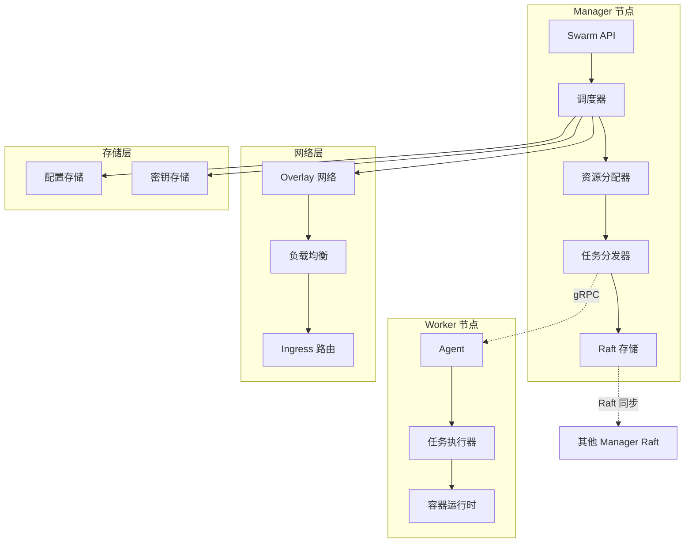
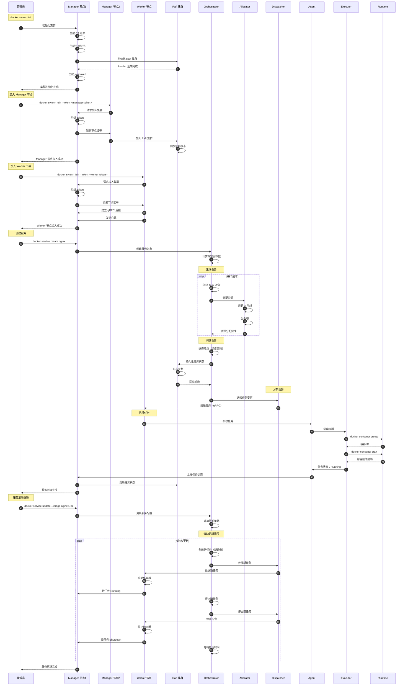
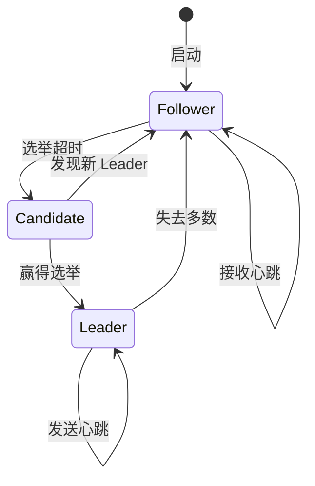
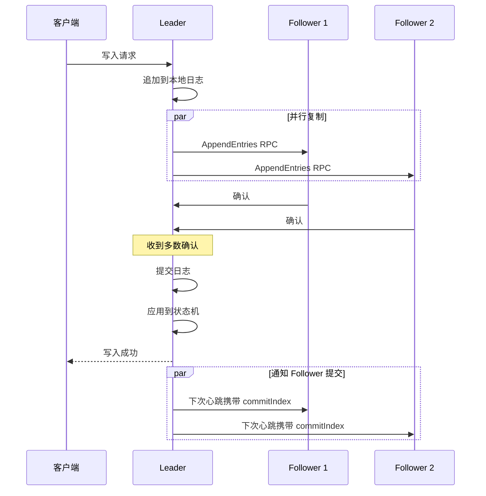
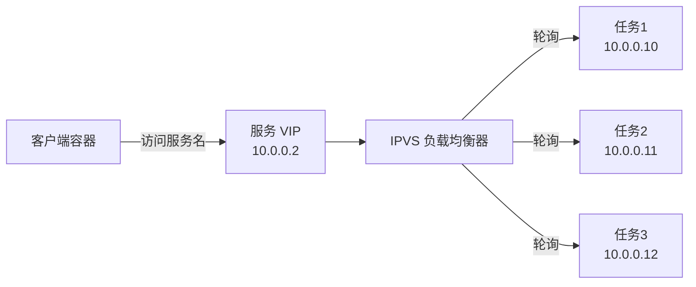
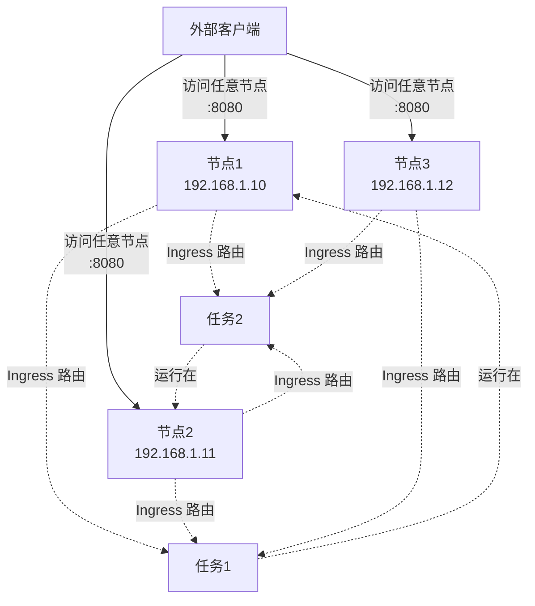

# dockerd-07-swarm-概览

## 模块定位与职责

### 职责边界

swarm 模块实现 Docker 的内置容器编排功能，提供集群管理与服务编排：

1. **集群管理**：
   - 节点管理（Manager/Worker）
   - 集群初始化与加入
   - Raft 共识协议
   - 集群状态同步

2. **服务编排**：
   - 服务创建与更新
   - 任务调度（spread/binpack）
   - 滚动更新
   - 服务发现与负载均衡

3. **网络编排**：
   - Overlay 网络
   - 服务 VIP
   - Ingress 路由网格
   - 端口发布

4. **存储编排**：
   - 配置管理（Config）
   - 密钥管理（Secret）
   - 卷管理

### 上下游依赖

**上游调用方**：

- Swarm Router：处理集群相关的 HTTP API
- Daemon：集群通知处理

**下游被依赖方**：

- SwarmKit：底层编排引擎
- libnetwork：Overlay 网络
- Raft：分布式一致性
- gRPC：节点间通信

---

## 模块架构图



### 架构说明

**1. Manager 节点**：

- **调度器（Orchestrator）**：
  - 监听服务变更事件
  - 计算期望状态（desired state）
  - 生成任务（Task）
  - 调度任务到节点

- **资源分配器（Allocator）**：
  - IP 地址分配
  - 端口分配
  - 卷分配
  - 配置/密钥分配

- **任务分发器（Dispatcher）**：
  - 将任务推送到 Worker 节点
  - 监听任务状态反馈
  - 处理节点心跳

- **Raft 存储**：
  - 集群状态持久化
  - Leader 选举
  - 日志复制
  - 强一致性保证

**2. Worker 节点**：

- **Agent**：
  - 接收 Manager 分发的任务
  - 上报任务状态
  - 发送心跳到 Manager
  - 处理节点标签

- **任务执行器（Executor）**：
  - 创建容器
  - 启动容器
  - 监控容器健康
  - 上报容器状态

**3. 网络层**：

- **Overlay 网络**：
  - VXLAN 隧道
  - 跨主机容器通信
  - 服务 VIP（虚拟 IP）
  - 服务发现

- **Ingress 路由网格**：
  - 发布服务端口到所有节点
  - 入站流量负载均衡
  - 透明路由到服务容器

---

## Swarm 集群初始化与服务调度时序图



### 时序图关键点说明

**集群初始化（1-5 步骤）**：

- CA 证书生成：

```
  /var/lib/docker/swarm/certificates/
  ├── swarm-root-ca.crt    # 集群 CA 证书
  └── swarm-node.crt       # 节点证书
```

- Join Token 格式：

```
  SWMTKN-1-<cluster-id>-<manager/worker-token>
```

**节点加入（6-13 步骤）**：

- Manager 节点：
  - 参与 Raft 共识
  - 可接收 API 请求
  - 最多 7 个（Raft 限制）

- Worker 节点：
  - 仅执行任务
  - 不参与决策
  - 数量无限制

**服务创建（14-27 步骤）**：

- 服务定义：

  ```go
  type Service struct {
      ID   string
      Spec ServiceSpec {
          Name         string
          Image        string
          Replicas     *uint64
          Networks     []string
          Mounts       []Mount
          UpdateConfig *UpdateConfig
          RollbackConfig *RollbackConfig
      }
      Endpoint Endpoint {
          VirtualIPs []VirtualIP
          Ports      []PortConfig
      }
  }
```

- 任务生成：

  ```go
  type Task struct {
      ID        string
      ServiceID string
      NodeID    string
      Status    TaskStatus {
          State     TaskState  // New/Pending/Assigned/Accepted/Preparing/Starting/Running/Complete/Shutdown/Failed/Rejected
          Timestamp time.Time
          Message   string
      }
      DesiredState TaskState
      Spec         TaskSpec {
          Runtime      RuntimeSpec
          Networks     []NetworkAttachment
          LogDriver    *LogDriver
      }
  }
```

**调度策略**：

1. **Spread**（默认）：均匀分布到所有节点
2. **Binpack**：尽可能填满节点
3. **Random**：随机分配

**节点选择考虑因素**：

- 节点可用性（Ready/Down）
- 节点资源（CPU/内存）
- 节点标签约束
- 服务放置策略
- 亲和性/反亲和性规则

**滚动更新（34-47 步骤）**：

- 更新配置：

  ```go
  type UpdateConfig struct {
      Parallelism   uint64        // 并行更新数量
      Delay         time.Duration // 批次间延迟
      FailureAction string        // pause/continue/rollback
      Monitor       time.Duration // 监控期
      MaxFailureRatio float32     // 最大失败率
  }
```

- 更新流程：
  1. 创建新任务（新镜像）
  2. 等待新任务 Running
  3. 停止旧任务
  4. 延迟（Delay）
  5. 重复直到所有副本更新

---

## Raft 共识协议

### Raft 角色



### Raft 日志复制



---

## 服务发现与负载均衡

### VIP（虚拟 IP）



### DNS 解析

```bash
# 服务 DNS 记录
nslookup web
# Server:  127.0.0.11
# Address: 127.0.0.11#53
#
# Name:    web
# Address: 10.0.0.2  # VIP

# 任务 DNS 记录
nslookup tasks.web
# Server:  127.0.0.11
# Address: 127.0.0.11#53
#
# Name:    tasks.web
# Address: 10.0.0.10
# Name:    tasks.web
# Address: 10.0.0.11
# Name:    tasks.web
# Address: 10.0.0.12
```

### Ingress 路由网格



**Ingress 网络实现**：

1. 每个节点监听发布的端口
2. 使用 IPVS 做负载均衡
3. 通过 Overlay 网络路由到目标容器
4. 支持任意节点访问

---

## 最佳实践

### 高可用部署

```bash
# 至少 3 个 Manager 节点（容忍 1 个故障）
docker swarm init
docker swarm join-token manager

# 在另外两个节点执行
docker swarm join --token <manager-token> <manager-ip>:2377

# 建议配置：
# - 3 个 Manager：容忍 1 个故障
# - 5 个 Manager：容忍 2 个故障
# - 7 个 Manager：容忍 3 个故障（最大）
```

### 服务约束

```bash
# 节点标签
docker node update --label-add type=compute worker1
docker node update --label-add type=storage worker2

# 服务放置约束
docker service create \
  --name web \
  --constraint 'node.labels.type==compute' \
  nginx

# 亲和性
docker service create \
  --name web \
  --constraint 'node.hostname!=node1' \
  nginx
```

### 滚动更新

```bash
# 创建服务时配置更新策略
docker service create \
  --name web \
  --replicas 10 \
  --update-parallelism 2 \
  --update-delay 10s \
  --update-failure-action rollback \
  --update-max-failure-ratio 0.2 \
  nginx:1.20

# 更新服务
docker service update --image nginx:1.21 web

# 回滚服务
docker service rollback web
```

### 密钥管理

```bash
# 创建密钥
echo "mypassword" | docker secret create db_password -

# 使用密钥
docker service create \
  --name db \
  --secret db_password \
  postgres

# 容器内访问密钥
cat /run/secrets/db_password
```

### 配置管理

```bash
# 创建配置
docker config create nginx.conf nginx.conf

# 使用配置
docker service create \
  --name web \
  --config source=nginx.conf,target=/etc/nginx/nginx.conf \
  nginx
```

### 健康检查

```dockerfile
HEALTHCHECK --interval=30s --timeout=3s --start-period=40s \
  CMD curl -f http://localhost/ || exit 1
```

### 资源限制

```bash
docker service create \
  --name web \
  --limit-cpu 0.5 \
  --limit-memory 512M \
  --reserve-cpu 0.25 \
  --reserve-memory 256M \
  nginx
```

### 日志管理

```bash
# 查看服务日志
docker service logs web

# 查看任务日志
docker service logs web.1

# 实时跟踪
docker service logs -f web
```

---

## 故障排查

### 节点故障

```bash
# 查看节点状态
docker node ls

# 查看节点详情
docker node inspect node1

# 排空节点（维护）
docker node update --availability drain node1

# 恢复节点
docker node update --availability active node1
```

### 服务故障

```bash
# 查看服务状态
docker service ps web

# 查看失败任务
docker service ps --filter "desired-state=shutdown" web

# 查看任务日志
docker service logs web.1

# 强制更新服务（重新调度）
docker service update --force web
```

### Raft 故障

```bash
# 查看 Raft 状态
docker node ls --format "{{.Hostname}}: {{.ManagerStatus}}"

# 恢复 Raft 集群（灾难恢复）
docker swarm init --force-new-cluster
```
