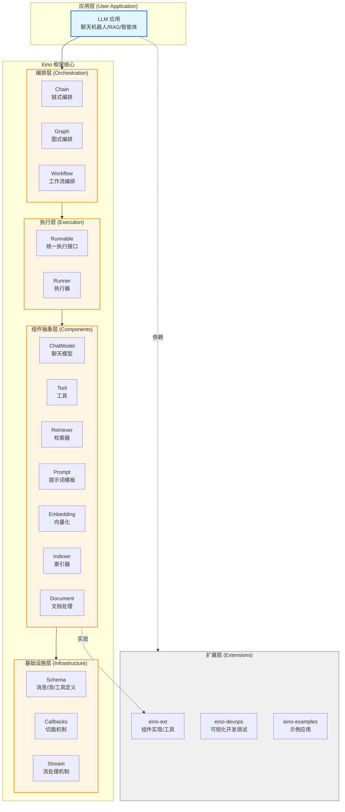
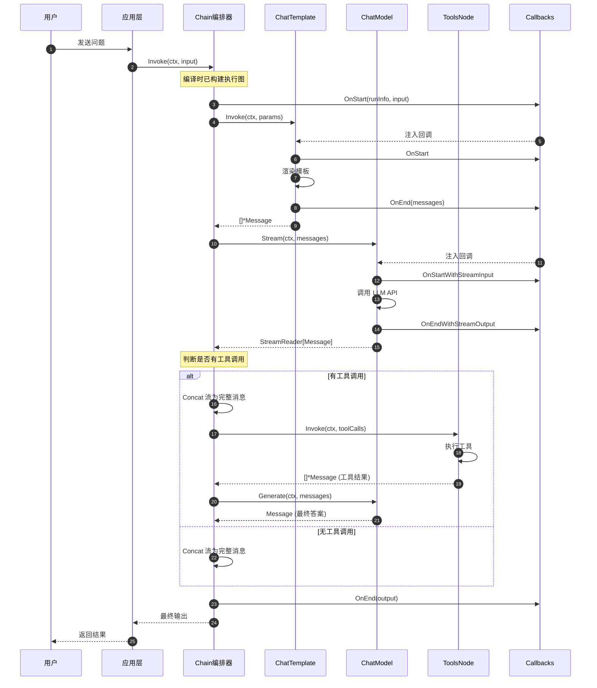
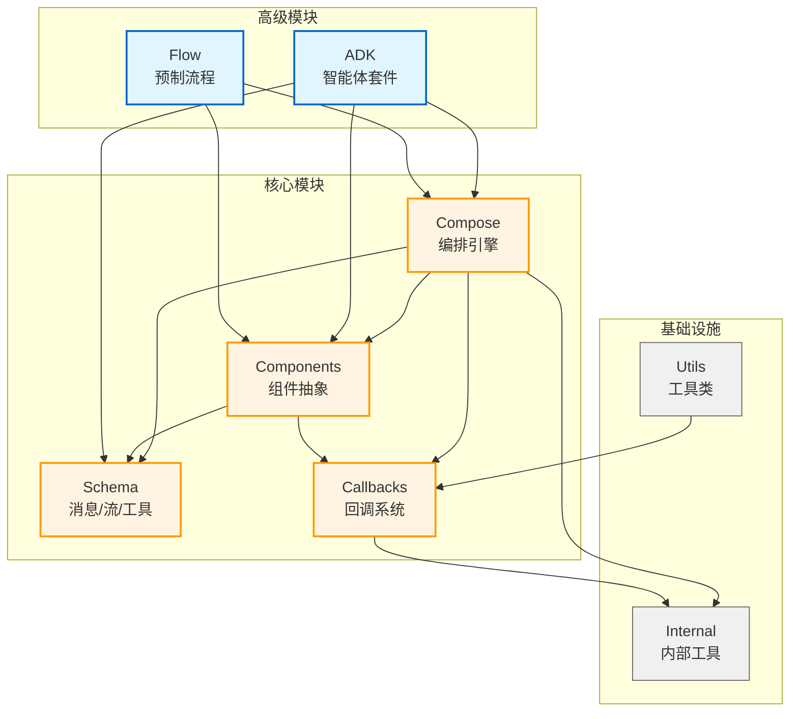
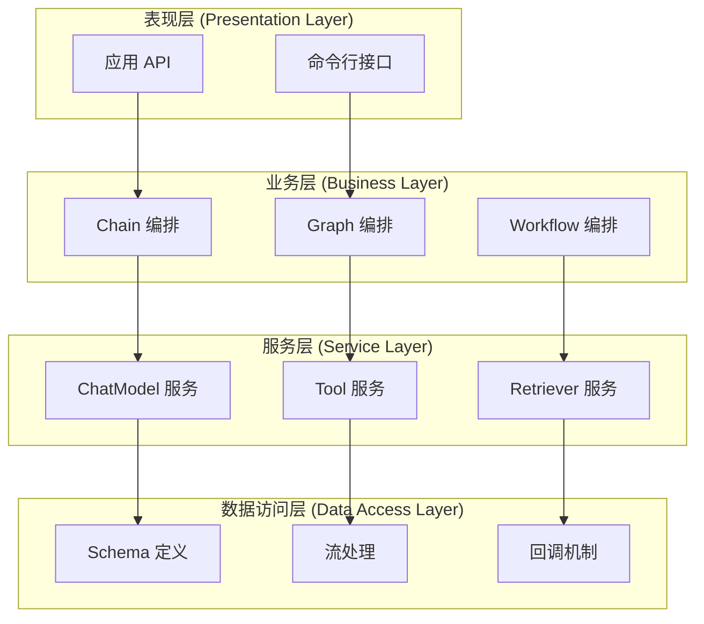
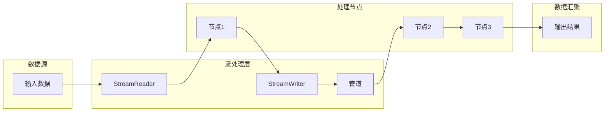
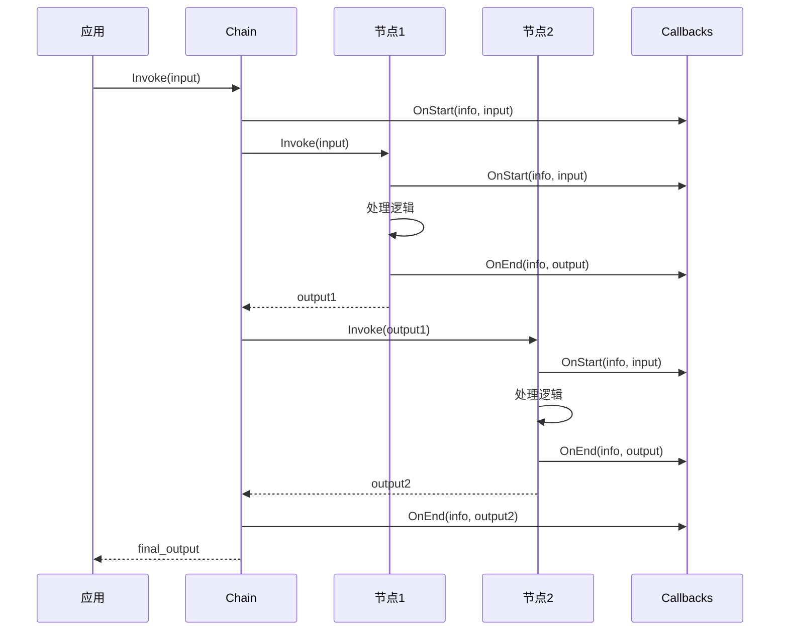
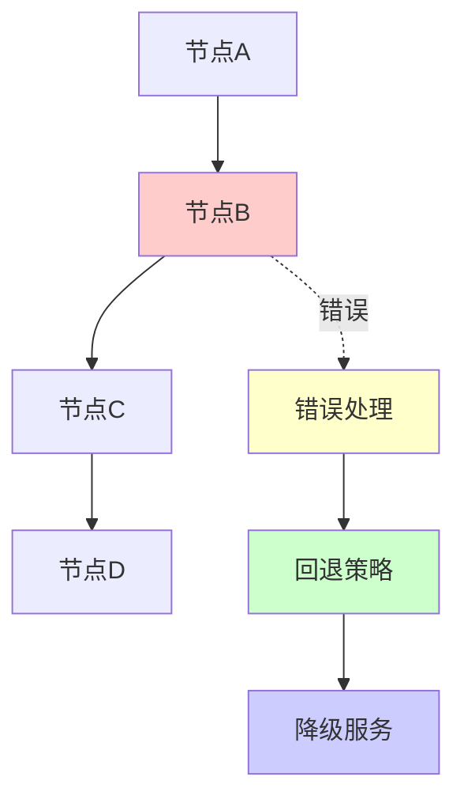

# Eino-00-总览

## 0. 摘要

### 0.1 项目目标与问题域

**Eino**（发音类似 "I know"）是由 CloudWeGo 开源的 Go 语言 LLM（大语言模型）应用开发框架。项目旨在提供一个强调简洁性、可扩展性、可靠性与有效性的终极 LLM 应用开发框架，更符合 Go 语言编程惯例。

**核心问题域**：

- **组件复用**: 提供标准化的组件抽象（ChatModel、Tool、Retriever、Prompt 等），解决 LLM 应用中组件重复开发问题
- **编排复杂性**: 简化多个 AI 组件的有向数据流编排，支持链式、图式、工作流三种编排模式
- **流式处理**: 统一处理 LLM 的流式输出与非流式输出，自动处理流的拼接、复制、合并
- **类型安全**: 利用 Go 泛型提供编译时类型检查，避免运行时类型错误
- **可观测性**: 通过切面机制提供完整的回调系统，支持日志、追踪、指标统计等横切关注点

### 0.2 核心能力边界

**包含的能力**：

1. **组件抽象层**: ChatModel、Tool、Retriever、Embedding、Indexer、Document Loader/Transformer、Prompt Template
2. **编排能力**: Chain（链式）、Graph（图式）、Workflow（工作流）三种编排模式
3. **流处理机制**: StreamReader/StreamWriter、流的拼接/复制/合并/转换
4. **切面机制**: OnStart、OnEnd、OnError、OnStartWithStreamInput、OnEndWithStreamOutput 五种切面
5. **状态管理**: Graph 中的全局状态读写与并发安全保障
6. **类型系统**: 基于泛型的类型安全保障与自动类型转换

**不包含的能力（非目标）**：

- 具体的 LLM 模型实现（如 OpenAI、Claude 等，这些在 eino-ext 仓库中）
- 向量数据库实现
- 前端界面和可视化开发工具（在 eino-devops 仓库中）
- 评估器和提示优化器（在 eino-ext 仓库中）

### 0.3 运行环境与部署形态

**运行环境**：

- **语言**: Go 1.18 及以上版本（利用泛型特性）
- **依赖**: 核心框架依赖极少，主要依赖包括：
  - `github.com/bytedance/sonic`: 高性能 JSON 序列化
  - `github.com/getkin/kin-openapi`: OpenAPI JSONSchema 实现
  - `github.com/google/uuid`: UUID 生成
  - `github.com/nikolalohinski/gonja`: Jinja2 模板支持

**部署形态**：

- **库/框架**: Eino 是一个 Go 语言库，通过 `go get github.com/cloudwego/eino` 引入
- **嵌入式**: 作为应用程序的一部分运行，不是独立的服务
- **灵活集成**: 可集成到任何 Go 应用中，包括 Web 服务、CLI 工具、后台任务等
- **分层架构**: 核心框架（eino）+ 扩展实现（eino-ext）+ 开发工具（eino-devops）+ 示例应用（eino-examples）

---

## 1. 整体架构图

### 1.1 Eino 框架设计理念

**核心设计原则**：

1. **简洁性 (Simplicity)**
   - API 设计遵循"少即是多"原则，核心接口保持简洁
   - 统一的 Runnable 接口抽象四种数据流模式
   - 链式 API 设计，提供流畅的开发体验

2. **可扩展性 (Extensibility)**
   - 组件化架构，支持自定义组件实现
   - 插件式的 Callbacks 机制，支持横切关注点
   - 开放的扩展点，支持第三方集成

3. **可靠性 (Reliability)**
   - 编译时类型检查，减少运行时错误
   - 完善的错误处理和传播机制
   - 资源管理和生命周期控制

4. **有效性 (Effectiveness)**
   - 高性能的流处理机制
   - 并发执行支持，充分利用多核资源
   - 内存优化和资源复用

### 1.2 Eino 框架整体架构



### 1.2 架构图要点说明

#### 1.2.1 图意概述

该架构图展示了 Eino 框架的分层设计，从下至上分为四个核心层次：

1. **基础设施层**: 提供最底层的数据结构和机制支持
   - Schema 模块定义了 Message（消息）、ToolInfo（工具信息）等核心数据结构
   - Stream 模块提供 StreamReader/StreamWriter，支持流式数据处理
   - Callbacks 模块提供切面机制，支持监控、日志、追踪等横切关注点

2. **组件抽象层**: 定义了 LLM 应用中常见组件的标准接口
   - 每个组件抽象（如 ChatModel）定义了标准的输入输出类型和方法签名
   - 组件实现细节对上层透明，支持灵活替换和扩展
   - 所有组件都支持四种数据流范式：Invoke、Stream、Collect、Transform

3. **执行层**: 提供统一的执行接口和执行器
   - Runnable 接口定义了四种执行方法，抽象了不同的数据流模式
   - Runner 负责具体的执行逻辑，处理类型转换、流处理、回调注入等

4. **编排层**: 提供三种编排模式
   - Chain: 简单的链式有向图，适合顺序处理流程
   - Graph: 支持循环的有向图，功能强大灵活，支持分支、状态管理
   - Workflow: 非循环图，支持字段级别的数据映射

#### 1.2.2 关键字段与接口

**核心接口**：

```go
// Runnable 是所有可执行对象的统一接口
type Runnable[I, O any] interface {
    // Invoke: 非流输入 => 非流输出
    Invoke(ctx context.Context, input I, opts ...Option) (output O, err error)
    
    // Stream: 非流输入 => 流输出
    Stream(ctx context.Context, input I, opts ...Option) (output *schema.StreamReader[O], err error)
    
    // Collect: 流输入 => 非流输出
    Collect(ctx context.Context, input *schema.StreamReader[I], opts ...Option) (output O, err error)
    
    // Transform: 流输入 => 流输出
    Transform(ctx context.Context, input *schema.StreamReader[I], opts ...Option) (output *schema.StreamReader[O], err error)
}
```

**核心数据结构**：

```go
// Message 是 LLM 交互的核心消息结构
type Message struct {
    Role         RoleType          // 角色: system/user/assistant/tool
    Content      string            // 文本内容
    MultiContent []ChatMessagePart // 多模态内容（图片/音频/视频）
    ToolCalls    []ToolCall        // 工具调用列表
    ResponseMeta *ResponseMeta     // 响应元信息（token使用量、结束原因等）
}

// StreamReader 是流式数据的读取器
type StreamReader[T any] struct {
    // 内部实现支持多种读取模式：stream/array/multiStream/convert/child
}
```

#### 1.2.3 边界条件

**并发安全**：

- StreamReader 的 Recv() 和 Close() 方法不是并发安全的，同一个 StreamReader 实例应在单个 goroutine 中使用
- 但 StreamReader.Copy(n) 可以创建 n 个独立的 StreamReader，每个可在不同 goroutine 中使用
- Graph 的 State 通过 StatePreHandler/StatePostHandler 提供线程安全的读写

**超时控制**：

- 框架本身不强制超时，由调用方通过 context.Context 控制超时
- 每个 Runnable 的 Invoke/Stream/Collect/Transform 方法都接受 ctx 参数
- 组件实现应正确处理 context 的取消信号

**幂等性**：

- 框架层面不保证幂等性，由具体组件实现决定
- 例如 ChatModel.Generate() 通常不是幂等的（每次调用可能返回不同结果）
- 状态管理需要应用层自行设计幂等策略

**顺序性**：

- Chain 保证严格的顺序执行
- Graph 在 Pregel 模式下支持并发执行，顺序由拓扑排序和分支逻辑决定
- Workflow 通过依赖关系和字段映射确定执行顺序

#### 1.2.4 异常路径与回退

**错误传播**：

- 任何节点返回错误都会立即终止执行，错误会沿调用栈向上传播
- StreamReader 通过 Recv() 返回的 error 传递错误，使用 `io.EOF` 表示流结束
- 错误信息会通过 Callbacks.OnError 切面通知给监听器

**流的异常处理**：

```go
// 接收流数据的标准模式
for {
    chunk, err := streamReader.Recv()
    if err == io.EOF {
        break  // 正常结束
    }
    if err != nil {
        // 处理错误
        return err
    }
    // 处理 chunk
}
```

**资源清理**：

- StreamReader 必须调用 Close() 释放资源，否则可能导致 goroutine 泄漏
- 推荐使用 `defer streamReader.Close()` 确保资源释放
- 或使用 `streamReader.SetAutomaticClose()` 让 GC 自动清理

**回退策略**：

- 框架不提供内置的重试机制，需要应用层实现
- 可通过 Lambda 节点包装重试逻辑
- 可通过 Callbacks.OnError 实现统一的错误处理和降级策略

#### 1.2.5 性能与容量假设

**内存管理**：

- StreamReader 内部使用带缓冲的 channel，默认容量为 5-10
- Message 的 Content 字段是字符串，大文本会占用较多内存
- StreamReader.Copy(n) 会创建共享的链表结构，避免数据复制

**并发性能**：

- Graph 在 DAG 模式下支持节点并发执行，可充分利用多核
- 流的复制和合并操作在 goroutine 中异步执行
- Callbacks 的调用是同步的，不会阻塞主流程

**容量上界**：

- 单个 Graph 建议节点数不超过 100 个
- 单条消息的 Content 建议不超过 1MB
- StreamReader.Copy() 的 n 参数建议不超过 10

**性能关键路径**：

- 流的拼接操作（concat）需要遍历所有 chunk
- 类型转换和反射操作在编译时完成，运行时开销小
- Callbacks 的调用会增加一定开销，建议只在必要时启用

#### 1.2.6 版本兼容与演进

**版本策略**：

- 核心接口（Runnable、BaseChatModel 等）保持向后兼容
- 新特性通过新增接口（如 ToolCallingChatModel）提供，避免破坏性变更
- 内部实现可能变化，但对外 API 保持稳定

**迁移路径**：

- 旧的 ChatModel.BindTools() 已废弃，建议使用 ToolCallingChatModel.WithTools()
- 使用 WithTools() 返回新实例，避免并发问题

**灰度策略**：

- 通过 Option 机制支持功能开关
- 可通过 Callbacks 实现影子测试和 A/B 测试

### 1.3 核心 API 设计

#### 1.3.1 Runnable 接口设计

Runnable 是 Eino 框架的核心抽象，定义了四种数据流处理模式：

```go
type Runnable[I, O any] interface {
    // Invoke: 非流输入 => 非流输出 (经典的请求-响应模式)
    Invoke(ctx context.Context, input I, opts ...Option) (output O, err error)
    
    // Stream: 非流输入 => 流输出 (适用于流式生成场景)
    Stream(ctx context.Context, input I, opts ...Option) (output *StreamReader[O], err error)
    
    // Collect: 流输入 => 非流输出 (流数据聚合场景)
    Collect(ctx context.Context, input *StreamReader[I], opts ...Option) (output O, err error)
    
    // Transform: 流输入 => 流输出 (流数据转换场景)
    Transform(ctx context.Context, input *StreamReader[I], opts ...Option) (output *StreamReader[O], err error)
}
```

**设计优势**：

- **统一抽象**: 所有组件和编排器都实现相同接口
- **自动适配**: 框架自动在四种模式间转换
- **类型安全**: 泛型确保编译时类型检查
- **组合友好**: 支持任意组件的链式组合

#### 1.3.2 组件接口设计

**ChatModel 接口**:

```go
type BaseChatModel interface {
    Generate(ctx context.Context, input []*Message, opts ...Option) (*Message, error)
    Stream(ctx context.Context, input []*Message, opts ...Option) (*StreamReader[*Message], error)
}

type ToolCallingChatModel interface {
    BaseChatModel
    WithTools(tools []*ToolInfo) ToolCallingChatModel
}
```

**Tool 接口**:

```go
type Tool interface {
    Info() *ToolInfo
    Invoke(ctx context.Context, input string, opts ...Option) (string, error)
}
```

**Retriever 接口**:

```go
type Retriever interface {
    Retrieve(ctx context.Context, query string, opts ...Option) ([]*Document, error)
}
```

#### 1.3.3 编排接口设计

**Chain 链式编排**:

```go
type Chain[I, O any] struct {
    // 私有字段
}

func (c *Chain[I, O]) AppendChatModel(key string, model BaseChatModel, opts ...NodeOption) *Chain[I, O]
func (c *Chain[I, O]) AppendLambda(key string, lambda *Lambda, opts ...NodeOption) *Chain[I, O]
func (c *Chain[I, O]) Compile(ctx context.Context, opts ...CompileOption) (Runnable[I, O], error)
```

**Graph 图式编排**:

```go
type Graph[I, O any] struct {
    // 私有字段
}

func (g *Graph[I, O]) AddChatModelNode(key string, model BaseChatModel, opts ...NodeOption) error
func (g *Graph[I, O]) AddEdge(from, to string) error
func (g *Graph[I, O]) AddBranch(from string, branch *GraphBranch) error
func (g *Graph[I, O]) Compile(ctx context.Context, opts ...CompileOption) (Runnable[I, O], error)
```

**Workflow 工作流编排**:

```go
type Workflow[I, O any] struct {
    // 私有字段
}

type WorkflowNode struct {
    // 私有字段
}

func (wn *WorkflowNode) AddInput(fromNodeKey string, inputs ...*FieldMapping) *WorkflowNode
func (wn *WorkflowNode) SetStaticValue(path FieldPath, value any) *WorkflowNode
```

---

## 2. 全局时序图

### 2.1 典型 LLM 应用调用时序



### 2.2 时序图要点说明

#### 2.2.1 入口点

应用层调用 Chain/Graph/Workflow 的 `Invoke(ctx, input)` 方法是整个流程的入口点。在此之前，必须先通过 `Compile(ctx)` 将 Chain/Graph/Workflow 编译为 Runnable。

编译阶段完成的工作：

- 验证节点连接的类型兼容性
- 构建执行图的拓扑排序
- 确定流处理策略（何时拼接、何时复制）
- 注入回调切面

#### 2.2.2 鉴权与幂等

**鉴权**：

- Eino 框架本身不处理鉴权，由应用层或组件实现层负责
- 可通过 Callbacks.OnStart 统一拦截请求进行鉴权
- 组件实现（如 OpenAI ChatModel）在调用 API 时处理 API Key

**幂等性**：

- LLM 调用通常不是幂等的，每次调用可能返回不同结果
- 工具调用是否幂等取决于工具的实现
- 如需幂等性，可在应用层实现请求去重或结果缓存

#### 2.2.3 回退策略

**错误回退**：

1. **组件级回退**: 组件内部可实现重试逻辑（如网络失败重试）
2. **节点级回退**: 通过 Branch 分支可实现条件路由，失败时走降级路径
3. **应用级回退**: Callbacks.OnError 可统一处理错误，决定是否重试或降级

**示例回退逻辑**：

```go
// 在 Lambda 节点中实现重试
lambda := compose.InvokableLambda(func(ctx context.Context, input string) (string, error) {
    var lastErr error
    for i := 0; i < 3; i++ {  // 重试3次
        result, err := callExternalAPI(ctx, input)
        if err == nil {
            return result, nil
        }
        lastErr = err
        time.Sleep(time.Second * time.Duration(i+1))  // 指数退避
    }
    return "", lastErr
})
```

#### 2.2.4 重试点

框架本身不提供自动重试，需要在以下层面实现：

1. **组件实现层**: 在 ChatModel、Tool 等组件内部实现 HTTP 请求重试
2. **应用编排层**: 通过 Graph 的循环边实现业务级重试
3. **回调层**: 在 Callbacks.OnError 中判断错误类型，决定是否重试

#### 2.2.5 超时设定

**超时控制**：

- 通过 context.Context 的超时机制控制
- 每个 Runnable 方法都接受 ctx 参数，会传递给下游节点
- 组件实现应正确处理 context 的取消信号

**超时示例**：

```go
ctx, cancel := context.WithTimeout(context.Background(), 30*time.Second)
defer cancel()

result, err := chain.Invoke(ctx, input)
if errors.Is(err, context.DeadlineExceeded) {
    // 处理超时
}
```

#### 2.2.6 资源上界

**并发限制**：

- Graph 在 DAG 模式下可并发执行多个节点，并发数取决于拓扑结构
- StreamReader 的内部 channel 有缓冲区限制（通常 5-10）
- 应用层应控制总并发请求数，避免资源耗尽

**内存上界**：

- 单条消息建议不超过 1MB
- StreamReader.Copy(n) 会创建 n 个独立读取器，共享底层数据
- 大文件处理应使用流式处理，避免一次性加载到内存

---

## 3. 模块边界与交互图

### 3.1 模块清单

Eino 框架包含以下核心模块：

| 序号 | 模块名 | 目录路径 | 核心职责 | 对外API |
|-----|--------|---------|---------|---------|
| 01 | Schema | `/schema` | 消息、流、工具定义 | Message, StreamReader, ToolInfo |
| 02 | Compose | `/compose` | 编排引擎 | Chain, Graph, Workflow, Runnable |
| 03 | Components | `/components` | 组件抽象 | ChatModel, Tool, Retriever等 |
| 04 | Callbacks | `/callbacks` | 切面机制 | Handler, HandlerBuilder |
| 05 | ADK | `/adk` | 智能体开发套件 | ReAct Agent, Workflow等 |
| 06 | Flow | `/flow` | 预制流程 | MultiAgent, MultiQuery等 |
| 07 | Utils | `/utils` | 工具类 | Callback工具 |
| 08 | Internal | `/internal` | 内部工具 | 泛型、并发、序列化工具 |

### 3.2 模块依赖关系图



### 3.3 模块交互矩阵

| 调用方 ↓ / 被调方 → | Schema | Compose | Components | Callbacks | ADK | Flow | Internal |
|-------------------|--------|---------|------------|-----------|-----|------|----------|
| **Schema** | - | - | - | - | - | - | ✓ (泛型、序列化) |
| **Compose** | ✓ (Message, Stream) | ✓ (嵌套Graph) | ✓ (组件接口) | ✓ (切面注入) | - | - | ✓ (泛型、并发) |
| **Components** | ✓ (Message, Tool) | - | - | ✓ (回调接口) | - | - | - |
| **Callbacks** | - | - | - | - | - | - | ✓ (并发安全) |
| **ADK** | ✓ (Message) | ✓ (Graph, Chain) | ✓ (Model, Tool) | ✓ (回调) | - | - | - |
| **Flow** | ✓ (Message) | ✓ (Graph) | ✓ (Retriever) | - | - | - | - |

**交互说明**：

1. **同步调用**:
   - Compose 编排器同步调用 Components 的接口方法
   - Components 同步调用 Callbacks 的切面方法
   - 所有模块都可能同步调用 Internal 的工具函数

2. **异步消息**:
   - StreamReader 内部使用 channel 实现异步数据流
   - StreamWriter.Send() 是非阻塞的（如果 channel 未满）

3. **共享存储**:
   - Graph 的 State 在多个节点间共享
   - 通过 StatePreHandler/StatePostHandler 保证线程安全

4. **订阅/发布**:
   - Callbacks 机制类似发布订阅模式
   - 节点执行时"发布"事件，Handler"订阅"并处理事件

---

## 4. 关键设计与权衡

### 4.1 数据一致性与事务边界

**一致性模型**：

- Eino 框架本身不提供事务支持，一致性由应用层和组件实现层保证
- Graph 的 State 提供强一致性（通过锁保证）
- LLM 调用结果的一致性是最终一致性（每次调用结果可能不同）

**事务边界**：

- 单个节点的执行是原子的（要么成功，要么失败）
- 跨多个节点的事务需要应用层实现补偿逻辑
- 工具调用的事务性由工具实现决定

**状态管理**：

```go
// Graph 的 State 提供线程安全的读写
graph := NewGraph[Input, Output](
    WithState(func(ctx context.Context) *MyState {
        return &MyState{Data: make(map[string]any)}
    }),
)

// StatePreHandler 读取状态
graph.AddPreHandler("node1", StatePreHandler(func(ctx context.Context, state *MyState) context.Context {
    // 线程安全地读取 state
    value := state.Data["key"]
    return context.WithValue(ctx, "value", value)
}))

// StatePostHandler 写入状态
graph.AddPostHandler("node1", StatePostHandler(func(ctx context.Context, state *MyState, out any) {
    // 线程安全地写入 state
    state.Data["result"] = out
}))
```

### 4.2 锁与并发策略

**锁策略**：

- State 读写使用互斥锁（sync.Mutex）保证线程安全
- StreamReader 不使用锁，依赖 channel 的并发安全特性
- Callbacks 的调用是同步的，不需要额外的锁

**并发模型**：

- **DAG 模式**: 节点按拓扑排序并发执行，无依赖的节点可并行
- **Pregel 模式**: 迭代执行，每轮迭代内节点可并发
- **流处理**: StreamReader.Copy(n) 创建 n 个独立的读取器，可在不同 goroutine 中并发读取

**并发示例**：

```go
// 创建并发节点
graph := NewGraph[Input, Output]()
graph.AddLambdaNode("node1", lambda1)
graph.AddLambdaNode("node2", lambda2)
graph.AddLambdaNode("node3", lambda3)

// node1 和 node2 并发执行
graph.AddEdge(START, "node1")
graph.AddEdge(START, "node2")

// node3 等待 node1 和 node2 完成后执行
graph.AddEdge("node1", "node3")
graph.AddEdge("node2", "node3")
graph.AddEdge("node3", END)
```

### 4.3 性能关键路径

**热点路径**：

1. **消息拼接**: StreamReader 的 concat 操作需要遍历所有 chunk
2. **类型转换**: 使用反射进行类型检查和转换（但在编译时完成大部分）
3. **回调调用**: 每个节点执行前后都会调用 Callbacks，增加额外开销

**优化策略**：

- StreamReader 使用 strings.Builder 优化字符串拼接
- 类型信息在编译时缓存，运行时直接使用
- Callbacks 支持 TimingChecker 接口，跳过不需要的回调

**内存优化**：

- StreamReader.Copy() 使用共享链表，避免数据复制
- Message 的 Extra 字段使用 map[string]any，避免结构体膨胀
- 大文本使用 string 而非 []byte，利用 Go 的字符串优化

### 4.4 可观测性指标

**指标类型**：

1. **性能指标**: 通过 Callbacks.OnStart/OnEnd 计算执行时长
2. **Token 使用量**: 通过 Message.ResponseMeta.Usage 获取
3. **错误率**: 通过 Callbacks.OnError 统计错误次数和类型
4. **流式延迟**: 测量首个 chunk 到达时间和总时长

**指标示例**：

```go
// 创建性能监控回调
handler := callbacks.NewHandlerBuilder().
    OnStartFn(func(ctx context.Context, info *RunInfo, input CallbackInput) context.Context {
        start := time.Now()
        return context.WithValue(ctx, "start_time", start)
    }).
    OnEndFn(func(ctx context.Context, info *RunInfo, output CallbackOutput) context.Context {
        start := ctx.Value("start_time").(time.Time)
        duration := time.Since(start)
        // 记录指标
        metrics.RecordDuration(info.Component, info.NodeKey, duration)
        
        // 记录 Token 使用量
        if msg, ok := output.Output.(*schema.Message); ok && msg.ResponseMeta != nil {
            metrics.RecordTokens(msg.ResponseMeta.Usage)
        }
        return ctx
    }).
    OnErrorFn(func(ctx context.Context, info *RunInfo, err error) context.Context {
        metrics.RecordError(info.Component, info.NodeKey, err)
        return ctx
    }).
    Build()
```

### 4.5 配置项

Eino 框架支持通过 Option 模式配置各种行为：

**Graph 配置**：

```go
graph := NewGraph[Input, Output](
    WithState(stateGenerator),           // 启用状态管理
    WithGenericState[*MyState](),        // 指定状态类型
    WithNodeTriggerMode(AllPredecessor), // 节点触发模式
)
```

**Compile 配置**：

```go
runnable, err := graph.Compile(ctx,
    WithMaxRunSteps(10),        // 最大迭代次数（Pregel模式）
    WithStreamGraph(true),      // 启用图流式输出
)
```

**Runtime 配置**：

```go
result, err := runnable.Invoke(ctx, input,
    WithCallbacks(handler),                        // 添加回调
    WithChatModelOption(WithTemperature(0.7)),     // 配置 ChatModel
    WithToolOption(WithTimeout(30*time.Second)),   // 配置 Tool
)
```

---

## 5. 典型使用示例与最佳实践

### 5.1 示例 1: 最小可运行的 Chain

这是一个最简单的例子，演示如何创建和运行一个 Chain：

```go
package main

import (
    "context"
    "fmt"

    "github.com/cloudwego/eino/compose"
    "github.com/cloudwego/eino/schema"
)

func main() {
    ctx := context.Background()

    // 创建一个简单的处理器
    processor := compose.InvokableLambda(func(ctx context.Context, input string) (string, error) {
        return fmt.Sprintf("处理结果: %s", input), nil
    })

    // 创建 Chain
    chain := compose.NewChain[string, string]()
    chain.AppendLambda("processor", processor)

    // 编译
    runnable, err := chain.Compile(ctx)
    if err != nil {
        panic(err)
    }

    // 执行
    result, err := runnable.Invoke(ctx, "你好，Eino!")
    if err != nil {
        panic(err)
    }

    fmt.Println(result)
    // 输出: 处理结果: 你好，Eino!
}
```

**要点**：

- Chain 通过 `AppendXXX()` 方法链式添加节点
- 使用泛型 `[I, O]` 指定输入输出类型
- 必须先 `Compile()` 再使用
- Lambda 节点可以快速创建自定义处理逻辑

### 5.2 示例 2: ChatModel + Prompt Template

演示如何结合 Prompt Template 和 ChatModel：

```go
package main

import (
    "context"
    "fmt"

    "github.com/cloudwego/eino/compose"
    "github.com/cloudwego/eino/components/prompt"
    "github.com/cloudwego/eino/schema"
    // 假设你已经实现了 OpenAI ChatModel
    // "your-project/models/openai"
)

func main() {
    ctx := context.Background()

    // 创建 Prompt Template
    chatTemplate := prompt.FromMessages(
        schema.SystemMessage("你是一个有帮助的AI助手"),
        schema.UserMessage("用户问题: {query}"),
    )

    // 创建 ChatModel（示例，实际需要从 eino-ext 导入）
    // chatModel, _ := openai.NewChatModel(ctx, &openai.Config{
    //     APIKey: "your-api-key",
    //     Model:  "gpt-3.5-turbo",
    // })

    // 创建 Chain
    chain := compose.NewChain[map[string]any, *schema.Message]()
    chain.AppendChatTemplate("template", chatTemplate)
    // chain.AppendChatModel("model", chatModel)  // 取消注释以使用真实模型

    // 为了演示，我们用 Lambda 模拟 ChatModel
    mockModel := compose.InvokableLambda(func(ctx context.Context, messages []*schema.Message) (*schema.Message, error) {
        lastMsg := messages[len(messages)-1]
        return schema.AssistantMessage("这是对以下问题的回答: "+lastMsg.Content, nil), nil
    })
    chain.AppendLambda("model", mockModel)

    // 编译并执行
    runnable, _ := chain.Compile(ctx)
    result, _ := runnable.Invoke(ctx, map[string]any{
        "query": "什么是 Eino 框架？",
    })

    fmt.Println(result.Content)
}
```

**要点**：

- Prompt Template 使用 `{key}` 语法引用参数
- ChatTemplate 输入是 `map[string]any`，输出是 `[]*schema.Message`
- ChatModel 输入是 `[]*schema.Message`，输出是 `*schema.Message`
- Chain 会自动进行类型匹配和转换

### 5.3 示例 3: Graph 的流式输出

演示如何使用 Graph 的流式输出：

```go
package main

import (
    "context"
    "errors"
    "fmt"
    "io"
    "time"

    "github.com/cloudwego/eino/compose"
    "github.com/cloudwego/eino/schema"
)

func main() {
    ctx := context.Background()

    // 创建一个流式 Lambda
    streamLambda := compose.StreamableLambda(func(ctx context.Context, input string) (*schema.StreamReader[string], error) {
        sr, sw := schema.Pipe[string](10)

        go func() {
            defer sw.Close()

            words := []string{"流式", "输出", "示例", "演示"}
            for _, word := range words {
                sw.Send(word+" ", nil)
                time.Sleep(100 * time.Millisecond) // 模拟延迟
            }
        }()

        return sr, nil
    })

    // 创建 Graph
    graph := compose.NewGraph[string, string]()
    graph.AddLambdaNode("streamer", streamLambda)
    graph.AddEdge(compose.START, "streamer")
    graph.AddEdge("streamer", compose.END)

    // 编译
    runnable, _ := graph.Compile(ctx)

    // 流式执行
    stream, _ := runnable.Stream(ctx, "输入")

    // 接收流数据
    defer stream.Close()
    for {
        chunk, err := stream.Recv()
        if errors.Is(err, io.EOF) {
            break
        }
        if err != nil {
            panic(err)
        }
        fmt.Print(chunk)
    }
    // 输出: 流式 输出 示例 演示
}
```

**要点**：

- 使用 `StreamableLambda` 创建流式节点
- `schema.Pipe[T](cap)` 创建流的读写对
- 必须 `defer sw.Close()` 通知接收端流结束
- 必须 `defer stream.Close()` 释放资源

### 5.4 示例 4: 带工具调用的 ReAct Agent

演示如何创建一个简单的 ReAct Agent：

```go
package main

import (
    "context"
    "fmt"

    "github.com/cloudwego/eino/compose"
    "github.com/cloudwego/eino/schema"
)

func main() {
    ctx := context.Background()

    // 定义工具
    weatherTool := &schema.ToolInfo{
        Name: "get_weather",
        Desc: "获取指定城市的天气",
        ParamsOneOf: schema.NewParamsOneOfByParams(map[string]*schema.ParameterInfo{
            "city": {Type: "string", Desc: "城市名称"},
        }),
    }

    // 创建 ToolsNode
    toolsNode := compose.NewToolsNode()
    toolsNode.RegisterTool(weatherTool, func(ctx context.Context, arguments string) (string, error) {
        return fmt.Sprintf("北京今天晴天，25度"), nil
    })

    // 创建 Graph（ReAct 模式）
    graph := compose.NewGraph[map[string]any, *schema.Message]()

    // 添加 ChatTemplate 节点（处理输入）
    // 添加 ChatModel 节点（生成回复或工具调用）
    // 添加 ToolsNode 节点（执行工具）
    // 添加 Branch 节点（判断是否需要工具调用）

    // (完整实现见 flow/agent/react 包)

    fmt.Println("ReAct Agent 示例（简化版）")
}
```

**要点**：

- ToolInfo 定义工具的名称、描述和参数
- ToolsNode 注册工具的实际实现函数
- ReAct 模式需要使用 Graph 的 Branch 和循环边
- 完整的 ReAct 实现见 `flow/agent/react` 包

### 5.5 示例 5: 使用 Callbacks 监控执行

演示如何使用 Callbacks 监控 Chain 的执行：

```go
package main

import (
    "context"
    "fmt"
    "time"

    "github.com/cloudwego/eino/callbacks"
    "github.com/cloudwego/eino/compose"
)

func main() {
    ctx := context.Background()

    // 创建监控 Handler
    handler := callbacks.NewHandlerBuilder().
        OnStartFn(func(ctx context.Context, info *callbacks.RunInfo, input callbacks.CallbackInput) context.Context {
            fmt.Printf("[%s] 开始执行节点: %s\n", time.Now().Format("15:04:05"), info.NodeKey)
            return context.WithValue(ctx, "start_time", time.Now())
        }).
        OnEndFn(func(ctx context.Context, info *callbacks.RunInfo, output callbacks.CallbackOutput) context.Context {
            start := ctx.Value("start_time").(time.Time)
            duration := time.Since(start)
            fmt.Printf("[%s] 节点 %s 执行完成，耗时: %v\n", time.Now().Format("15:04:05"), info.NodeKey, duration)
            return ctx
        }).
        OnErrorFn(func(ctx context.Context, info *callbacks.RunInfo, err error) context.Context {
            fmt.Printf("[%s] 节点 %s 执行失败: %v\n", time.Now().Format("15:04:05"), info.NodeKey, err)
            return ctx
        }).
        Build()

    // 创建 Chain
    lambda1 := compose.InvokableLambda(func(ctx context.Context, input string) (string, error) {
        time.Sleep(100 * time.Millisecond)
        return input + " -> Lambda1", nil
    })

    lambda2 := compose.InvokableLambda(func(ctx context.Context, input string) (string, error) {
        time.Sleep(150 * time.Millisecond)
        return input + " -> Lambda2", nil
    })

    chain := compose.NewChain[string, string]()
    chain.AppendLambda("lambda1", lambda1)
    chain.AppendLambda("lambda2", lambda2)

    runnable, _ := chain.Compile(ctx)

    // 使用 Callbacks 执行
    result, _ := runnable.Invoke(ctx, "输入", compose.WithCallbacks(handler))

    fmt.Printf("\n最终结果: %s\n", result)
}
```

**输出示例**：

```
[14:30:01] 开始执行节点: lambda1
[14:30:01] 节点 lambda1 执行完成，耗时: 100ms
[14:30:01] 开始执行节点: lambda2
[14:30:01] 节点 lambda2 执行完成，耗时: 150ms

最终结果: 输入 -> Lambda1 -> Lambda2
```

**要点**：

- HandlerBuilder 提供链式 API 构建 Handler
- OnStartFn/OnEndFn/OnErrorFn 定义不同阶段的回调
- 通过 context 在回调间传递信息（如开始时间）
- 使用 `WithCallbacks(handler)` 注入 Handler

### 5.6 示例 6: Workflow 的字段映射

演示如何使用 Workflow 进行字段级别的数据映射：

```go
package main

import (
    "context"
    "fmt"

    "github.com/cloudwego/eino/compose"
    "github.com/cloudwego/eino/schema"
)

type UserInfo struct {
    Name string
    Age  int
}

type ProcessedInfo struct {
    Greeting string
    Category string
}

func main() {
    ctx := context.Background()

    // Lambda 1: 处理姓名
    lambda1 := compose.InvokableLambda(func(ctx context.Context, input struct{ Name string }) (struct{ Greeting string }, error) {
        return struct{ Greeting string }{
            Greeting: "你好, " + input.Name,
        }, nil
    })

    // Lambda 2: 处理年龄
    lambda2 := compose.InvokableLambda(func(ctx context.Context, input struct{ Age int }) (struct{ Category string }, error) {
        category := "成人"
        if input.Age < 18 {
            category = "未成年"
        }
        return struct{ Category string }{Category: category}, nil
    })

    // Lambda 3: 合并结果
    lambda3 := compose.InvokableLambda(func(ctx context.Context, input ProcessedInfo) (*schema.Message, error) {
        content := fmt.Sprintf("%s，您是%s", input.Greeting, input.Category)
        return schema.UserMessage(content), nil
    })

    // 创建 Workflow
    wf := compose.NewWorkflow[UserInfo, *schema.Message]()

    // 添加节点并建立字段映射
    wf.AddLambdaNode("lambda1", lambda1).
        AddInput(compose.START, compose.MapFields("Name", "Name"))

    wf.AddLambdaNode("lambda2", lambda2).
        AddInput(compose.START, compose.MapFields("Age", "Age"))

    wf.AddLambdaNode("lambda3", lambda3).
        AddInput("lambda1", compose.MapFields("Greeting", "Greeting")).
        AddInput("lambda2", compose.MapFields("Category", "Category"))

    wf.End().AddInput("lambda3")

    // 编译并执行
    runnable, _ := wf.Compile(ctx)
    result, _ := runnable.Invoke(ctx, UserInfo{
        Name: "张三",
        Age:  25,
    })

    fmt.Println(result.Content)
    // 输出: 你好, 张三，您是成人
}
```

**要点**：

- Workflow 通过 `AddInput()` 声明依赖和字段映射
- `MapFields(fromField, toField)` 定义字段映射规则
- lambda1 和 lambda2 可以并发执行（无依赖关系）
- lambda3 等待 lambda1 和 lambda2 完成后执行

---

## 6. 扩展点与插件接入

### 6.1 自定义组件

Eino 支持创建自定义组件，只需实现对应的接口：

```go
// 自定义 ChatModel
type MyChatModel struct {
    // 配置字段
}

func (m *MyChatModel) Generate(ctx context.Context, input []*schema.Message, opts ...model.Option) (*schema.Message, error) {
    // 实现生成逻辑
    return schema.AssistantMessage("回复内容", nil), nil
}

func (m *MyChatModel) Stream(ctx context.Context, input []*schema.Message, opts ...model.Option) (*schema.StreamReader[*schema.Message], error) {
    // 实现流式生成逻辑
    sr, sw := schema.Pipe[*schema.Message](10)
    go func() {
        defer sw.Close()
        // 发送流式数据
    }()
    return sr, nil
}

// 使用自定义组件
chain := compose.NewChain[map[string]any, *schema.Message]()
chain.AppendChatModel("my_model", &MyChatModel{})
```

### 6.2 自定义回调 Handler

创建自定义回调 Handler 实现监控、日志等功能：

```go
type MyHandler struct {
    logger *log.Logger
}

func (h *MyHandler) OnStart(ctx context.Context, info *callbacks.RunInfo, input callbacks.CallbackInput) context.Context {
    h.logger.Printf("开始: %s", info.NodeKey)
    return ctx
}

func (h *MyHandler) OnEnd(ctx context.Context, info *callbacks.RunInfo, output callbacks.CallbackOutput) context.Context {
    h.logger.Printf("结束: %s", info.NodeKey)
    return ctx
}

func (h *MyHandler) OnError(ctx context.Context, info *callbacks.RunInfo, err error) context.Context {
    h.logger.Printf("错误: %s, %v", info.NodeKey, err)
    return ctx
}

// 使用自定义 Handler
handler := &MyHandler{logger: log.New(os.Stdout, "", log.LstdFlags)}
runnable.Invoke(ctx, input, compose.WithCallbacks(handler))
```

### 6.3 扩展 Graph 功能

通过 Lambda 节点可以灵活扩展 Graph 的功能：

```go
// 条件分支 Lambda
branchLambda := compose.InvokableLambda(func(ctx context.Context, input *schema.Message) (string, error) {
    if len(input.ToolCalls) > 0 {
        return "tools", nil  // 有工具调用，走工具路径
    }
    return "end", nil  // 无工具调用，直接结束
})

// 使用 Branch
graph.AddLambdaNode("branch", branchLambda)
graph.AddBranch("model", compose.NewGraphBranch(branchLambda, map[string]string{
    "tools": "tools_node",
    "end":   compose.END,
}))
```

---

## 7. 规模化与上线注意事项

### 7.1 性能优化

**减少内存分配**：

- 复用 Message 对象，避免频繁创建
- 使用 StreamReader 处理大文本，避免一次性加载到内存
- 及时关闭 StreamReader，释放资源

**并发优化**：

- 使用 Graph 的 DAG 模式并发执行无依赖节点
- 合理设置 StreamReader 的 channel 缓冲区大小
- 避免在 Callbacks 中执行耗时操作

**缓存策略**：

- 缓存编译后的 Runnable，避免重复编译
- 缓存 Prompt 渲染结果（对于相同输入）
- 缓存 Embedding 结果

### 7.2 错误处理

**优雅降级**：

```go
// 通过 Branch 实现降级
graph.AddBranch("model", compose.NewGraphBranch(
    compose.InvokableLambda(func(ctx context.Context, input *schema.Message) (string, error) {
        if input.ResponseMeta != nil && input.ResponseMeta.FinishReason == "error" {
            return "fallback", nil
        }
        return "normal", nil
    }),
    map[string]string{
        "normal":   compose.END,
        "fallback": "fallback_node",
    },
))
```

**错误重试**：

```go
// 在 Lambda 中实现重试逻辑
retryLambda := compose.InvokableLambda(func(ctx context.Context, input string) (string, error) {
    maxRetries := 3
    for i := 0; i < maxRetries; i++ {
        result, err := doSomething(ctx, input)
        if err == nil {
            return result, nil
        }
        if i < maxRetries-1 {
            time.Sleep(time.Second * time.Duration(i+1))
        }
    }
    return "", fmt.Errorf("达到最大重试次数")
})
```

### 7.3 监控与告警

**关键指标**：

- 请求成功率、失败率
- P50/P95/P99 延迟
- Token 使用量和成本
- 并发请求数

**监控实现**：

```go
// 全局监控 Handler
monitorHandler := callbacks.NewHandlerBuilder().
    OnEndFn(func(ctx context.Context, info *callbacks.RunInfo, output callbacks.CallbackOutput) context.Context {
        // 记录延迟
        duration := getDuration(ctx)
        prometheus.RecordLatency(info.Component, duration)
        
        // 记录 Token
        if msg, ok := output.Output.(*schema.Message); ok && msg.ResponseMeta != nil {
            prometheus.RecordTokens(msg.ResponseMeta.Usage.TotalTokens)
        }
        return ctx
    }).
    OnErrorFn(func(ctx context.Context, info *callbacks.RunInfo, err error) context.Context {
        // 记录错误
        prometheus.RecordError(info.Component, err.Error())
        return ctx
    }).
    Build()

// 全局注入
callbacks.AppendGlobalHandlers(monitorHandler)
```

### 7.4 安全性

**API Key 管理**：

- 使用环境变量或密钥管理服务存储 API Key
- 避免在代码中硬编码 API Key
- 定期轮换 API Key

**输入验证**：

```go
// 在 Lambda 中验证输入
validateLambda := compose.InvokableLambda(func(ctx context.Context, input map[string]any) (map[string]any, error) {
    query, ok := input["query"].(string)
    if !ok || len(query) == 0 {
        return nil, fmt.Errorf("无效输入: query 必须是非空字符串")
    }
    if len(query) > 10000 {
        return nil, fmt.Errorf("输入过长: query 不能超过 10000 字符")
    }
    return input, nil
})
```

**防止注入攻击**：

- 使用参数化的 Prompt Template，避免直接拼接用户输入
- 对工具调用的参数进行严格校验
- 限制 LLM 的输出长度

---

## 8. 版本历史与演进规划

### 8.1 当前版本特性

**当前主要特性**（基于代码分析）：

- 完整的 Runnable 四种执行模式
- Chain、Graph、Workflow 三种编排模式
- 丰富的组件抽象（7 大类组件）
- 完善的流处理机制
- 灵活的 Callbacks 切面系统
- 类型安全的泛型支持

### 8.2 API 稳定性承诺

**稳定 API**（不会有破坏性变更）：

- Runnable 接口
- 核心组件接口（BaseChatModel、Tool、Retriever 等）
- Schema 核心数据结构（Message、StreamReader、ToolInfo）
- Callbacks 接口

**实验性 API**（可能变更）：

- Workflow 的部分高级特性
- 部分内部工具函数

**已废弃 API**：

- `ChatModel.BindTools()` → 使用 `ToolCallingChatModel.WithTools()`
- `InitCallbackHandlers()` → 使用 `AppendGlobalHandlers()`

### 8.3 未来演进方向

**可能的新特性**（基于框架设计推测）：

- 更多预制的 Flow（Multi-Agent、RAG 等）
- 更完善的可视化开发工具
- 性能优化和内存优化
- 更多的组件实现（在 eino-ext 中）

---

## 9. 相关资源

### 9.1 官方资源

- **项目仓库**: https://github.com/cloudwego/eino
- **官方文档**: https://cloudwego.io/docs/eino
- **扩展仓库**: https://github.com/cloudwego/eino-ext
- **示例仓库**: https://github.com/cloudwego/eino-examples
- **开发工具**: https://github.com/cloudwego/eino-ext/tree/main/devops

### 9.2 社区资源

- **Issues**: https://github.com/cloudwego/eino/issues
- **飞书用户群**: 见 README 中的二维码

### 9.3 许可证

- **许可证类型**: Apache-2.0
- **许可证文件**: LICENSE-APACHE

---

## 10. 深度架构分析

### 10.1 整体架构设计模式

Eino 框架采用了多种经典的架构设计模式：

#### 10.1.1 分层架构模式 (Layered Architecture)



**优势**：

- **关注点分离**: 每层职责明确，降低耦合
- **可测试性**: 各层可独立测试
- **可维护性**: 修改某层不影响其他层

#### 10.1.2 管道-过滤器模式 (Pipeline-Filter)

Chain 编排体现了管道-过滤器模式：

```go
// 每个组件都是一个过滤器
chain := compose.NewChain[string, *schema.Message]()
chain.AppendChatTemplate("template", template)  // 过滤器1: 模板渲染
chain.AppendChatModel("model", model)          // 过滤器2: LLM 生成
chain.AppendLambda("formatter", formatter)     // 过滤器3: 结果格式化
```

**优势**：

- **可组合性**: 过滤器可任意组合
- **可重用性**: 过滤器可在不同管道中复用
- **并行性**: 某些过滤器可并行执行

#### 10.1.3 发布-订阅模式 (Publish-Subscribe)

Callbacks 机制实现了发布-订阅模式：

```go
// 订阅者（Handler）
handler := callbacks.NewHandlerBuilder().
    OnStartFn(func(ctx context.Context, info *RunInfo, input CallbackInput) context.Context {
        // 处理开始事件
        return ctx
    }).
    OnEndFn(func(ctx context.Context, info *RunInfo, output CallbackOutput) context.Context {
        // 处理结束事件
        return ctx
    }).
    Build()

// 发布者（Runnable）在执行时发布事件
runnable.Invoke(ctx, input, compose.WithCallbacks(handler))
```

### 10.2 数据流架构分析

#### 10.2.1 流式数据处理架构



**关键特性**：

- **背压控制**: 通过 channel 缓冲区控制流速
- **流复制**: StreamReader.Copy(n) 支持一对多分发
- **流合并**: MultiStreamReader 支持多对一合并
- **类型安全**: 泛型确保流数据类型安全

#### 10.2.2 消息传递架构



### 10.3 并发与状态管理

#### 10.3.1 并发执行模型

**Graph DAG 模式并发**：

```go
// 创建并发执行的图
graph := compose.NewGraph[Input, Output]()

// 添加可并发的节点
graph.AddLambdaNode("parallel1", lambda1)
graph.AddLambdaNode("parallel2", lambda2)
graph.AddLambdaNode("merge", mergeLambda)

// 定义依赖关系
graph.AddEdge(compose.START, "parallel1")
graph.AddEdge(compose.START, "parallel2")
graph.AddEdge("parallel1", "merge")
graph.AddEdge("parallel2", "merge")
graph.AddEdge("merge", compose.END)
```

**执行时序**：

1. parallel1 和 parallel2 并发执行
2. merge 等待两者完成后执行
3. 最终输出结果

#### 10.3.2 状态管理策略

**全局状态管理**：

```go
type GlobalState struct {
    mu    sync.RWMutex
    data  map[string]any
}

func (s *GlobalState) Get(key string) any {
    s.mu.RLock()
    defer s.mu.RUnlock()
    return s.data[key]
}

func (s *GlobalState) Set(key string, value any) {
    s.mu.Lock()
    defer s.mu.Unlock()
    s.data[key] = value
}

// 在 Graph 中使用
graph := compose.NewGraph[Input, Output](
    compose.WithState(func(ctx context.Context) *GlobalState {
        return &GlobalState{data: make(map[string]any)}
    }),
)
```

### 10.4 错误处理与恢复机制

#### 10.4.1 错误传播链



**错误处理策略**：

1. **快速失败**: 节点出错立即停止执行链
2. **错误传播**: 错误沿调用栈向上传播
3. **回调通知**: 通过 OnError 回调通知监听器
4. **资源清理**: 确保 StreamReader 等资源正确释放

#### 10.4.2 容错与降级

```go
// 实现容错的 Lambda
resilientLambda := compose.InvokableLambda(func(ctx context.Context, input string) (string, error) {
    // 主要逻辑
    result, err := primaryService.Process(ctx, input)
    if err == nil {
        return result, nil
    }
    
    // 降级逻辑
    fallbackResult, fallbackErr := fallbackService.Process(ctx, input)
    if fallbackErr == nil {
        return fallbackResult, nil
    }
    
    // 兜底逻辑
    return "服务暂时不可用，请稍后重试", nil
})
```

---

## 11. 性能优化与最佳实践

### 11.1 内存管理最佳实践

#### 11.1.1 对象池化

```go
// 消息对象池
var messagePool = sync.Pool{
    New: func() interface{} {
        return &schema.Message{
            Extra: make(map[string]any),
        }
    },
}

func GetMessage() *schema.Message {
    return messagePool.Get().(*schema.Message)
}

func PutMessage(msg *schema.Message) {
    // 重置对象状态
    msg.Role = ""
    msg.Content = ""
    msg.MultiContent = nil
    msg.ToolCalls = nil
    msg.ResponseMeta = nil
    for k := range msg.Extra {
        delete(msg.Extra, k)
    }
    messagePool.Put(msg)
}
```

#### 11.1.2 流式数据优化

```go
// 优化的流处理
func OptimizedStreamProcessing(input *schema.StreamReader[string]) *schema.StreamReader[string] {
    sr, sw := schema.Pipe[string](100) // 增大缓冲区
    
    go func() {
        defer sw.Close()
        
        var buffer strings.Builder
        buffer.Grow(1024) // 预分配容量
        
        for {
            chunk, err := input.Recv()
            if err == io.EOF {
                break
            }
            if err != nil {
                sw.Send("", err)
                return
            }
            
            // 批量处理，减少系统调用
            buffer.WriteString(chunk)
            if buffer.Len() > 512 {
                processed := processChunk(buffer.String())
                buffer.Reset()
                sw.Send(processed, nil)
            }
        }
        
        // 处理剩余数据
        if buffer.Len() > 0 {
            processed := processChunk(buffer.String())
            sw.Send(processed, nil)
        }
    }()
    
    return sr
}
```

### 11.2 并发性能优化

#### 11.2.1 工作池模式

```go
type WorkerPool struct {
    workers   int
    jobQueue  chan Job
    wg        sync.WaitGroup
}

type Job struct {
    Input  string
    Output chan<- string
    Error  chan<- error
}

func NewWorkerPool(workers int) *WorkerPool {
    return &WorkerPool{
        workers:  workers,
        jobQueue: make(chan Job, workers*2),
    }
}

func (wp *WorkerPool) Start(ctx context.Context) {
    for i := 0; i < wp.workers; i++ {
        wp.wg.Add(1)
        go wp.worker(ctx)
    }
}

func (wp *WorkerPool) worker(ctx context.Context) {
    defer wp.wg.Done()
    
    for {
        select {
        case job := <-wp.jobQueue:
            result, err := processJob(ctx, job.Input)
            if err != nil {
                job.Error <- err
            } else {
                job.Output <- result
            }
        case <-ctx.Done():
            return
        }
    }
}
```

#### 11.2.2 批处理优化

```go
// 批处理 Lambda
func CreateBatchLambda(batchSize int, timeout time.Duration) *compose.Lambda {
    return compose.InvokableLambda(func(ctx context.Context, inputs []string) ([]string, error) {
        if len(inputs) <= batchSize {
            return processBatch(ctx, inputs)
        }
        
        // 分批处理
        var results []string
        for i := 0; i < len(inputs); i += batchSize {
            end := i + batchSize
            if end > len(inputs) {
                end = len(inputs)
            }
            
            batch := inputs[i:end]
            batchResults, err := processBatch(ctx, batch)
            if err != nil {
                return nil, err
            }
            
            results = append(results, batchResults...)
        }
        
        return results, nil
    })
}
```

### 11.3 监控与可观测性

#### 11.3.1 性能指标收集

```go
type MetricsCollector struct {
    requestDuration *prometheus.HistogramVec
    requestCount    *prometheus.CounterVec
    errorCount      *prometheus.CounterVec
    tokenUsage      *prometheus.CounterVec
}

func NewMetricsCollector() *MetricsCollector {
    return &MetricsCollector{
        requestDuration: prometheus.NewHistogramVec(
            prometheus.HistogramOpts{
                Name: "eino_request_duration_seconds",
                Help: "Request duration in seconds",
            },
            []string{"component", "node"},
        ),
        requestCount: prometheus.NewCounterVec(
            prometheus.CounterOpts{
                Name: "eino_requests_total",
                Help: "Total number of requests",
            },
            []string{"component", "node", "status"},
        ),
        errorCount: prometheus.NewCounterVec(
            prometheus.CounterOpts{
                Name: "eino_errors_total",
                Help: "Total number of errors",
            },
            []string{"component", "node", "error_type"},
        ),
        tokenUsage: prometheus.NewCounterVec(
            prometheus.CounterOpts{
                Name: "eino_tokens_total",
                Help: "Total token usage",
            },
            []string{"model", "type"},
        ),
    }
}

// 创建监控 Handler
func (mc *MetricsCollector) CreateHandler() callbacks.Handler {
    return callbacks.NewHandlerBuilder().
        OnStartFn(func(ctx context.Context, info *callbacks.RunInfo, input callbacks.CallbackInput) context.Context {
            start := time.Now()
            return context.WithValue(ctx, "start_time", start)
        }).
        OnEndFn(func(ctx context.Context, info *callbacks.RunInfo, output callbacks.CallbackOutput) context.Context {
            start := ctx.Value("start_time").(time.Time)
            duration := time.Since(start)
            
            mc.requestDuration.WithLabelValues(info.Component, info.NodeKey).Observe(duration.Seconds())
            mc.requestCount.WithLabelValues(info.Component, info.NodeKey, "success").Inc()
            
            // 记录 Token 使用量
            if msg, ok := output.Output.(*schema.Message); ok && msg.ResponseMeta != nil {
                if usage := msg.ResponseMeta.Usage; usage != nil {
                    mc.tokenUsage.WithLabelValues("unknown", "prompt").Add(float64(usage.PromptTokens))
                    mc.tokenUsage.WithLabelValues("unknown", "completion").Add(float64(usage.CompletionTokens))
                }
            }
            
            return ctx
        }).
        OnErrorFn(func(ctx context.Context, info *callbacks.RunInfo, err error) context.Context {
            mc.requestCount.WithLabelValues(info.Component, info.NodeKey, "error").Inc()
            mc.errorCount.WithLabelValues(info.Component, info.NodeKey, fmt.Sprintf("%T", err)).Inc()
            return ctx
        }).
        Build()
}
```

#### 11.3.2 分布式追踪

```go
import (
    "go.opentelemetry.io/otel"
    "go.opentelemetry.io/otel/attribute"
    "go.opentelemetry.io/otel/trace"
)

// 创建追踪 Handler
func CreateTracingHandler() callbacks.Handler {
    tracer := otel.Tracer("eino")
    
    return callbacks.NewHandlerBuilder().
        OnStartFn(func(ctx context.Context, info *callbacks.RunInfo, input callbacks.CallbackInput) context.Context {
            spanName := fmt.Sprintf("%s.%s", info.Component, info.NodeKey)
            ctx, span := tracer.Start(ctx, spanName)
            
            span.SetAttributes(
                attribute.String("component", info.Component),
                attribute.String("node", info.NodeKey),
                attribute.String("input_type", fmt.Sprintf("%T", input.Input)),
            )
            
            return context.WithValue(ctx, "span", span)
        }).
        OnEndFn(func(ctx context.Context, info *callbacks.RunInfo, output callbacks.CallbackOutput) context.Context {
            if span, ok := ctx.Value("span").(trace.Span); ok {
                span.SetAttributes(
                    attribute.String("output_type", fmt.Sprintf("%T", output.Output)),
                )
                span.SetStatus(codes.Ok, "completed")
                span.End()
            }
            return ctx
        }).
        OnErrorFn(func(ctx context.Context, info *callbacks.RunInfo, err error) context.Context {
            if span, ok := ctx.Value("span").(trace.Span); ok {
                span.RecordError(err)
                span.SetStatus(codes.Error, err.Error())
                span.End()
            }
            return ctx
        }).
        Build()
}
```

### 11.4 生产环境部署指南

#### 11.4.1 配置管理

```go
type Config struct {
    Server struct {
        Port    int           `yaml:"port" default:"8080"`
        Timeout time.Duration `yaml:"timeout" default:"30s"`
    } `yaml:"server"`
    
    LLM struct {
        Provider    string  `yaml:"provider" default:"openai"`
        Model       string  `yaml:"model" default:"gpt-3.5-turbo"`
        Temperature float64 `yaml:"temperature" default:"0.7"`
        MaxTokens   int     `yaml:"max_tokens" default:"4096"`
    } `yaml:"llm"`
    
    Performance struct {
        WorkerPoolSize int           `yaml:"worker_pool_size" default:"10"`
        BatchSize      int           `yaml:"batch_size" default:"5"`
        BatchTimeout   time.Duration `yaml:"batch_timeout" default:"100ms"`
    } `yaml:"performance"`
    
    Monitoring struct {
        EnableMetrics bool   `yaml:"enable_metrics" default:"true"`
        EnableTracing bool   `yaml:"enable_tracing" default:"true"`
        MetricsPort   int    `yaml:"metrics_port" default:"9090"`
    } `yaml:"monitoring"`
}
```

#### 11.4.2 健康检查

```go
func CreateHealthChecker(runnable compose.Runnable[string, string]) http.HandlerFunc {
    return func(w http.ResponseWriter, r *http.Request) {
        ctx, cancel := context.WithTimeout(r.Context(), 5*time.Second)
        defer cancel()
        
        // 执行简单的健康检查
        _, err := runnable.Invoke(ctx, "health-check")
        if err != nil {
            w.WriteHeader(http.StatusServiceUnavailable)
            json.NewEncoder(w).Encode(map[string]string{
                "status": "unhealthy",
                "error":  err.Error(),
            })
            return
        }
        
        w.WriteHeader(http.StatusOK)
        json.NewEncoder(w).Encode(map[string]string{
            "status": "healthy",
        })
    }
}
```

#### 11.4.3 优雅关闭

```go
func GracefulShutdown(server *http.Server, cleanup func()) {
    sigChan := make(chan os.Signal, 1)
    signal.Notify(sigChan, syscall.SIGINT, syscall.SIGTERM)
    
    <-sigChan
    log.Println("收到关闭信号，开始优雅关闭...")
    
    // 设置关闭超时
    ctx, cancel := context.WithTimeout(context.Background(), 30*time.Second)
    defer cancel()
    
    // 关闭 HTTP 服务器
    if err := server.Shutdown(ctx); err != nil {
        log.Printf("服务器关闭失败: %v", err)
    }
    
    // 执行清理工作
    cleanup()
    
    log.Println("服务器已优雅关闭")
}
```

---

**文档版本**: v1.0  
**最后更新**: 2024-12-19  
**适用 Eino 版本**: main 分支（最新版本）

---

## 补充：Eino 生产实践与核心要点

### 设计理念强化

- **简洁性**：核心 `Runnable` 接口统一四种数据流模式（同步/异步×单值/流式），链式 API 提供流畅开发体验。
- **类型安全**：利用 Go 泛型实现编译时类型检查，输入输出类型在编译时确定，避免运行时类型错误。
- **流式优先**：自动处理流的拼接（Concatenate）、转换（Transform）、合并（Merge）、复制（Copy），统一处理 LLM 的流式与非流式输出。
- **切面机制**：五种切面类型（OnStart、OnEnd、OnError、OnStartWithStreamInput、OnEndWithStreamOutput），支持日志、追踪、指标统计等横切关注点。

### 编排模式对比

| 特性 | Chain | Graph | Workflow |
|------|-------|-------|----------|
| 拓扑结构 | 简单有向链 | 循环/非循环有向图 | 非循环图 |
| 数据流 | 只能向前推进 | 灵活的分支和合并 | 结构体字段级映射 |
| 状态管理 | 无需状态 | 全局状态读写 | 隐式状态传递 |
| 适用场景 | 简单串联任务 | 复杂决策逻辑 | 强类型工作流 |

### 项目结构最佳实践

```
your-eino-project/
├── cmd/server/main.go          # 应用入口
├── internal/
│   ├── config/                 # 配置管理
│   ├── handlers/               # 业务处理器
│   └── models/                 # 数据模型
├── pkg/
│   ├── chains/                 # 预定义链
│   ├── components/             # 自定义组件
│   └── utils/                  # 工具函数
├── configs/                    # 配置文件
├── tests/                      # 测试
└── deployments/                # 部署配置
```

### 组件开发关键点

- **ChatModel 实现**：实现 `Generate(ctx, messages, opts)` 与 `Stream(ctx, messages, opts)` 接口，支持流式与非流式输出。
- **Tool 实现**：定义 `Info()` 返回工具元数据（名称、描述、JSONSchema），实现 `InvokableRun(ctx, args)` 执行工具逻辑。
- **Retriever 实现**：实现 `Retrieve(ctx, query, opts)` 返回相关文档切片，支持向量检索、全文检索等多种检索策略。
- **Prompt Template**：使用 Jinja2 模板语法，支持变量替换、条件渲染、循环渲染，通过 `Format(ctx, input)` 生成最终提示词。

### 性能优化策略

- **并发执行**：Graph 中的并发分支自动并行执行，利用 Go 的 goroutine 充分利用多核资源。
- **流处理优化**：避免不必要的流到值转换，使用 `StreamReader` 直接传递流数据，减少内存占用。
- **连接池管理**：为 ChatModel 和 Retriever 配置合理的连接池大小，避免频繁创建和销毁连接。
- **批处理支持**：对多个输入使用 `Batch(ctx, inputs)` 批量处理，提升吞吐量。

### 监控与可观测性

- **Callbacks 集成**：实现自定义 Callback 处理器，记录每个组件的执行时间、输入输出、错误信息。
- **Metrics 指标**：采集关键指标（请求数、延迟、错误率、Token 用量），集成 Prometheus 进行监控。
- **Tracing 追踪**：为每个请求生成 trace_id，通过 Callbacks 传递 span 信息，集成 OpenTelemetry。
- **日志规范**：结构化日志记录（JSON 格式），包含 trace_id、component_name、execution_time、input_size、output_size 等关键字段。

### 生产部署要点

- **配置管理**：使用 Viper 管理多环境配置，支持环境变量覆盖，敏感信息（API Key）加密存储。
- **健康检查**：提供 `/health` 和 `/readiness` 端点，检测模型连接、数据库连接、缓存连接的可用性。
- **优雅关闭**：监听 SIGINT/SIGTERM 信号，设置 30 秒关闭超时，完成当前请求后关闭服务器，执行资源清理。
- **容器化部署**：使用多阶段构建减小镜像体积，设置合理的资源限制（CPU/Memory），配置 Kubernetes 探针。

### 常见问题与解决方案

- **流式输出中断**：确保 StreamReader 被完全消费或显式关闭，避免 goroutine 泄漏。
- **类型转换错误**：使用 Lambda 函数进行显式类型转换，避免泛型类型不匹配导致的编译错误。
- **并发安全问题**：Graph 的全局状态使用 sync.RWMutex 保护，避免并发读写导致的数据竞争。
- **Token 超限**：实现 Token 计数与截断逻辑，使用滑动窗口保留最近的对话历史，避免上下文超出模型限制。

### 与其他框架对比

| 框架 | 语言 | 类型安全 | 性能 | 并发支持 | 流式处理 | 生态成熟度 |
|------|------|---------|------|---------|---------|-----------|
| **Eino** | Go | ✅ 编译时检查 | ✅ 高性能 | ✅ 原生支持 | ✅ 完整支持 | ⚠️ 新兴 |
| LangChain | Python | ❌ 运行时检查 | ⚠️ 中等 | ⚠️ 需额外处理 | ⚠️ 部分支持 | ✅ 成熟 |
| LlamaIndex | Python | ❌ 运行时检查 | ⚠️ 中等 | ⚠️ 需额外处理 | ⚠️ 部分支持 | ✅ 成熟 |

### 核心数据结构速查

- **Message**：`{Role, Content, MultiContent, ToolCalls, ToolCallID, ResponseMeta}`，支持多模态内容与工具调用。
- **StreamReader[T]**：`Recv() (T, error)`，流式数据读取器，自动处理流结束（io.EOF）。
- **ToolInfo**：`{Name, Desc, ParamsOneOf}`，工具元数据，ParamsOneOf 支持 JSONSchema 定义参数。
- **Document**：`{Content, MetaData}`，文档结构，MetaData 存储来源、时间戳等元信息。
