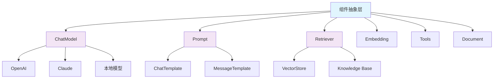
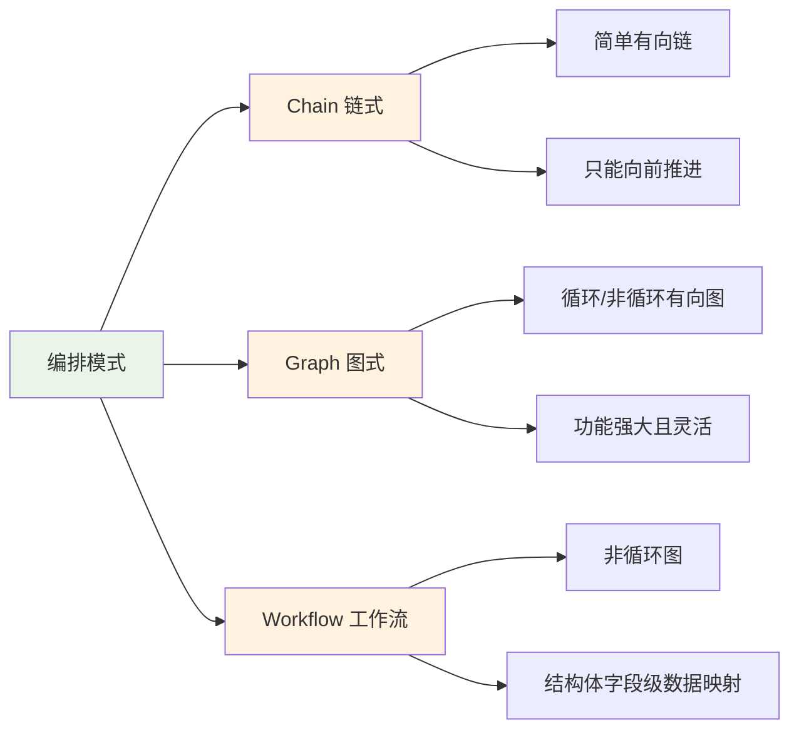
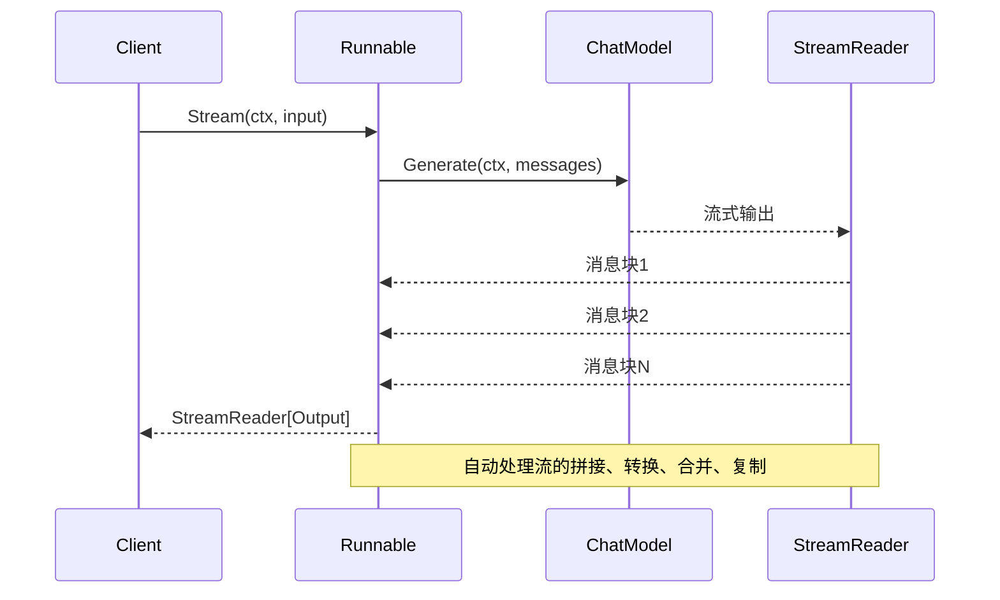
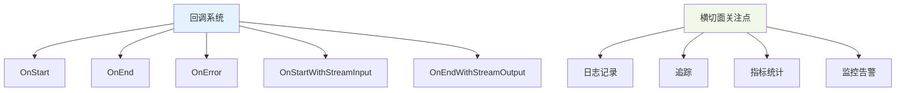
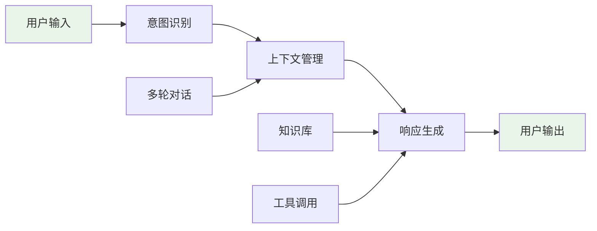
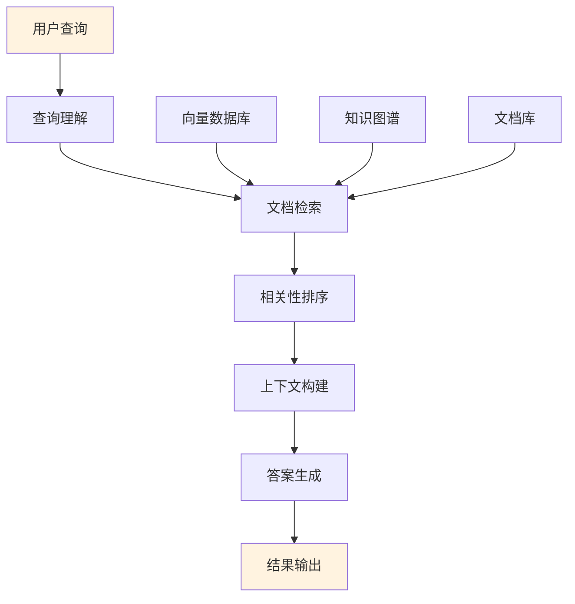
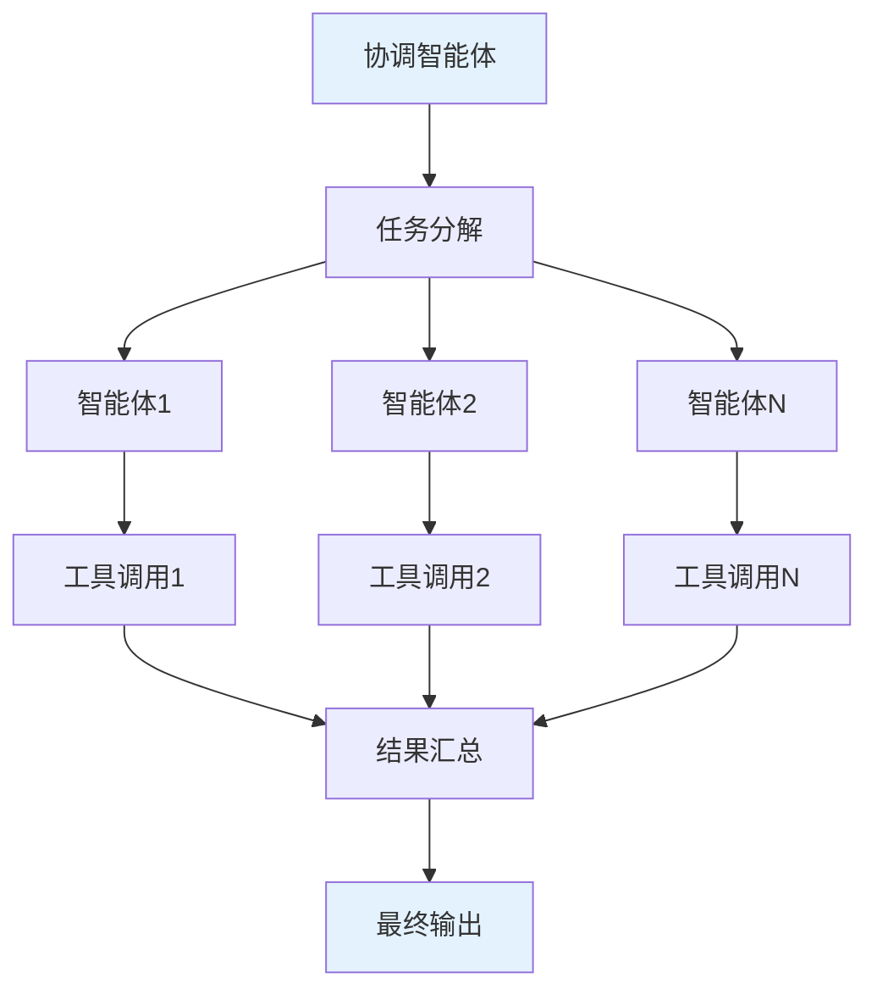

## 📖 文档概述

本文档是 CloudWeGo Eino 框架的完整技术分析的第一部分，详细介绍了框架的基本信息、核心设计理念、使用示例和适用场景。

## 🏗️ 框架简介

**Eino**（发音类似 "I know"）是 CloudWeGo 开源的 Go 语言 LLM 应用开发框架，旨在成为终极的大语言模型应用开发框架。它从开源社区中的诸多优秀 LLM 应用开发框架，如 LangChain 和 LlamaIndex 等获取灵感，同时借鉴前沿研究成果与实际应用，提供了一个强调简洁性、可扩展性、可靠性与有效性，且更符合 Go 语言编程惯例的 LLM 应用开发框架。

### 项目基本信息

- **项目名称**: Eino
- **开发语言**: Go 1.18+
- **开源协议**: Apache-2.0
- **项目地址**: https://github.com/cloudwego/eino
- **维护团队**: CloudWeGo 团队

### 核心特性

#### 1. 组件化架构


**设计理念**: 提供丰富的组件抽象，支持灵活组合
- 每个组件都实现统一的接口规范
- 支持热插拔和动态替换
- 提供丰富的预置实现和扩展点

#### 2. 强大编排能力


**设计理念**: 支持 Chain、Graph、Workflow 三种编排模式
- **Chain**: 简单的链式有向图，只能向前推进
- **Graph**: 循环或非循环有向图，功能强大且灵活
- **Workflow**: 非循环图，支持在结构体字段级别进行数据映射

#### 3. 流式处理优先


**设计理念**: 完整的流式数据处理支持
- 自动流拼接（Concatenate）
- 自动流转换（Transform）
- 自动流合并（Merge）
- 自动流复制（Copy）

#### 4. 类型安全保障

**设计理念**: 利用 Go 泛型实现编译时类型检查
- 输入输出类型在编译时确定
- 避免运行时类型错误
- 提供更好的IDE支持和代码提示

核心的 `Runnable` 接口定义了四种数据流模式，支持同步/异步、单值/流式的所有组合。详细定义请参考 [核心API深度分析](/posts/eino-03-core-api-analysis/)。

#### 5. 切面机制


**设计理念**: 完整的回调系统，支持监控和扩展
- 支持五种切面类型
- 可注入到不支持回调的组件中
- 支持自定义回调处理程序

## 🚀 框架使用示例

Eino 框架提供了多种使用模式，从简单的链式调用到复杂的工具调用图。

### 快速开始

以下是一个最简单的使用示例：

```go
// 创建链式编排
chain := compose.NewChain[map[string]any, *schema.Message]().
    AppendChatTemplate(chatTemplate).
    AppendChatModel(chatModel)

// 编译并执行
runnable, _ := chain.Compile(ctx)
result, _ := runnable.Invoke(ctx, input)
```

详细的使用示例、工具调用、流式处理等高级功能请参考以下文档：
- [核心API深度分析](/posts/eino-03-core-api-analysis/) - 详细的API使用和代码示例
- [Components模块详解](/posts/eino-05-components-module/) - 各组件的使用方法
- [Compose模块详解](/posts/eino-06-compose-module/) - 编排能力的使用指南


## 🎯 适用场景

### 1. 聊天机器人和智能助手


**典型应用**:
- 客服机器人
- 个人助手
- 技术支持系统
- 教育辅导系统

### 2. RAG检索增强生成应用


**典型应用**:
- 企业知识问答
- 文档智能检索
- 法律咨询系统
- 医疗诊断辅助

### 3. 工具调用和多智能体系统


**典型应用**:
- 自动化工作流
- 复杂任务处理
- 多领域专家系统
- 智能运维平台

## 🔧 核心设计原则

### 1. 简洁性 (Simplicity)
- **API设计简洁明了**: 遵循Go语言惯例，提供直观的接口
- **概念模型清晰**: 核心概念少而精，易于理解和使用
- **配置简单**: 提供合理的默认值，减少配置复杂度

### 2. 可扩展性 (Extensibility)
- **组件化设计**: 每个组件都可以独立扩展和替换
- **插件机制**: 支持自定义组件和扩展点
- **回调系统**: 提供完整的生命周期钩子

### 3. 可靠性 (Reliability)
- **类型安全**: 利用Go泛型确保编译时类型检查
- **错误处理**: 完善的错误处理和恢复机制
- **资源管理**: 自动管理流资源的生命周期

### 4. 有效性 (Effectiveness)
- **性能优化**: 支持并发处理和流式计算
- **内存效率**: 优化内存使用，支持大规模数据处理
- **生产就绪**: 提供监控、追踪、调试等生产环境必需功能

## 📊 框架优势对比

| 特性 | Eino | LangChain | LlamaIndex |
|------|------|-----------|------------|
| 语言 | Go | Python | Python |
| 类型安全 | ✅ 编译时检查 | ❌ 运行时检查 | ❌ 运行时检查 |
| 性能 | ✅ 高性能 | ⚠️ 中等 | ⚠️ 中等 |
| 并发支持 | ✅ 原生支持 | ⚠️ 需要额外处理 | ⚠️ 需要额外处理 |
| 流式处理 | ✅ 完整支持 | ⚠️ 部分支持 | ⚠️ 部分支持 |
| 部署便利性 | ✅ 单二进制 | ❌ 依赖复杂 | ❌ 依赖复杂 |
| 生态成熟度 | ⚠️ 新兴 | ✅ 成熟 | ✅ 成熟 |

## 🔗 相关资源

- **项目仓库**: [github.com/cloudwego/eino](https://github.com/cloudwego/eino)
- **扩展库**: [github.com/cloudwego/eino-ext](https://github.com/cloudwego/eino-ext)
- **官方文档**: [www.cloudwego.io/docs/eino](https://www.cloudwego.io/docs/eino)
- **社区讨论**: [CloudWeGo 社区](https://github.com/cloudwego/community)

---

## 🔗 相关文档

### 系列文档
1. **[Eino 框架概述与设计理念](/posts/eino-01-framework-overview/)** - 本文档
2. **[整体架构分析](/posts/eino-02-architecture-analysis/)** - 分层架构设计和模块交互关系  
3. **[核心API深度分析](/posts/eino-03-core-api-analysis/)** - Runnable接口、编排API和Lambda函数
4. **[Schema模块详解](/posts/eino-04-schema-module/)** - 消息系统、流处理和工具定义
5. **[Components模块详解](/posts/eino-05-components-module/)** - 组件抽象和实现
6. **[Compose模块详解](/posts/eino-06-compose-module/)** - 编排引擎和执行机制

### 深入学习建议
- 如果您是初次接触，建议按顺序阅读系列文档
- 如果要了解具体API，请直接查看[核心API深度分析](/posts/eino-03-core-api-analysis/)
- 如果要开发自定义组件，请参考[Components模块详解](/posts/eino-05-components-module/)

**更新时间**: 2024-12-19 | **文档版本**: v1.0
