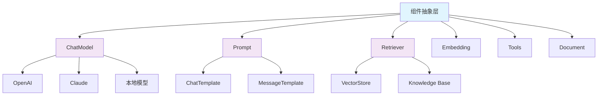
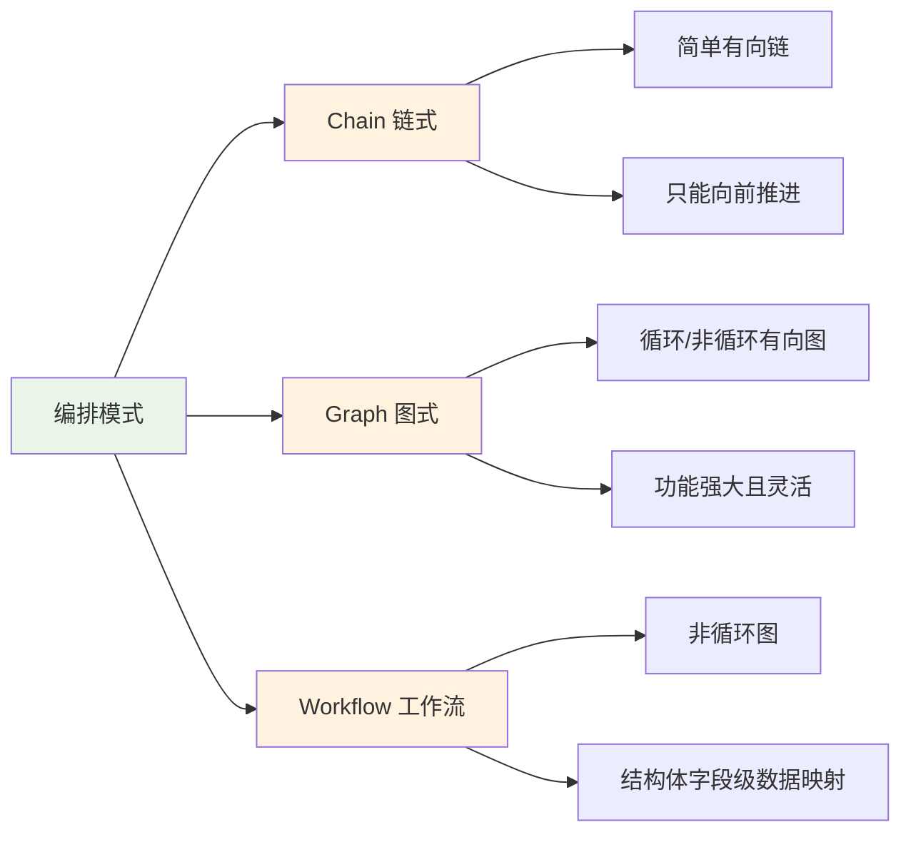
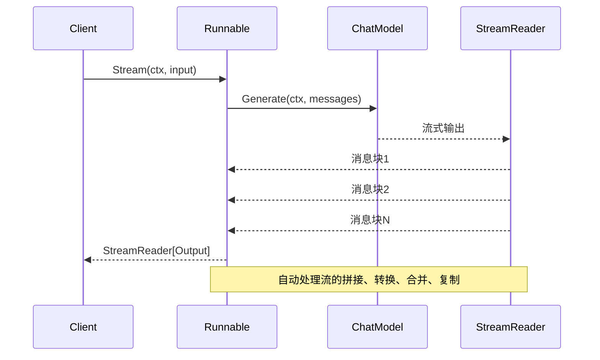
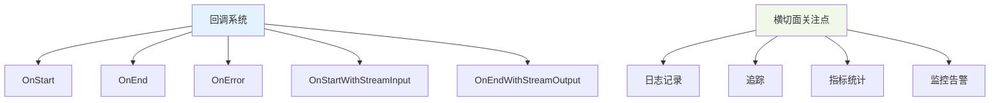
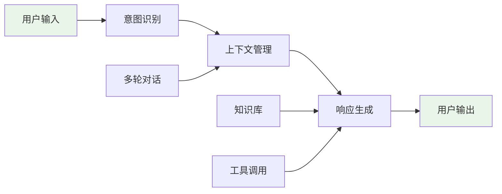
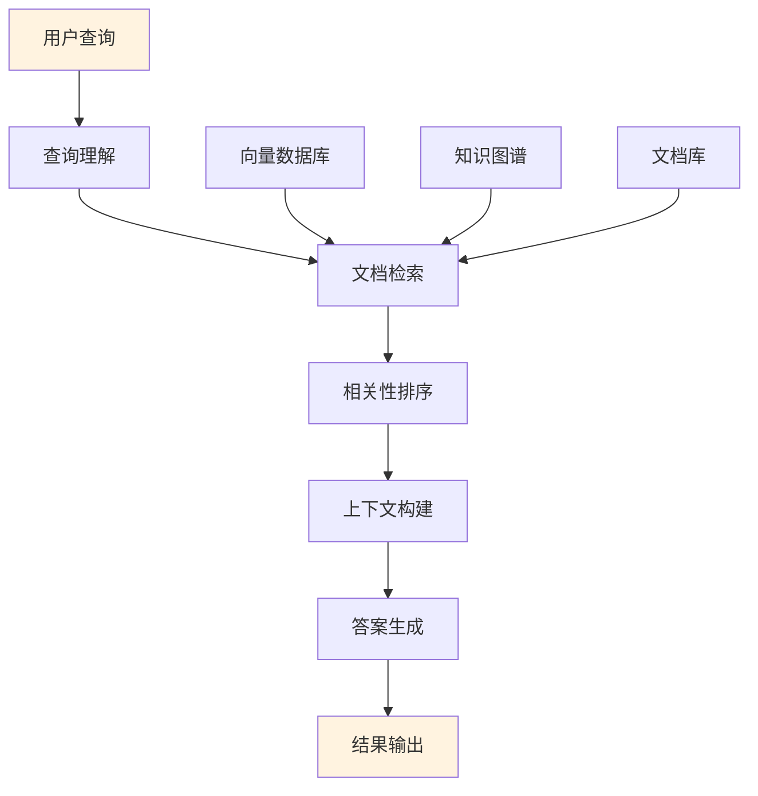
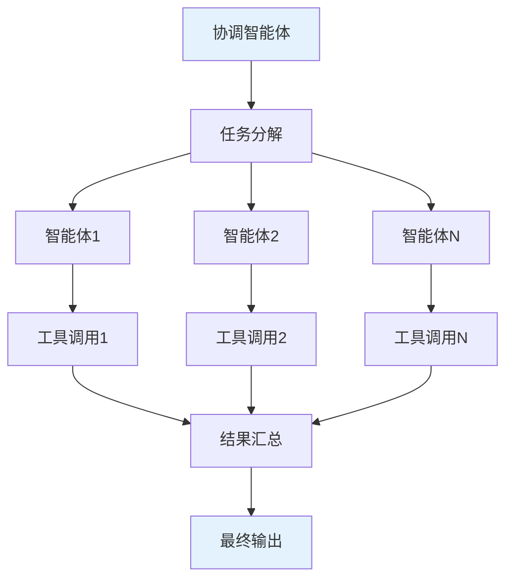

# Eino 框架概述与设计理念

## 📖 文档概述

本文档是 CloudWeGo Eino 框架的完整技术分析的第一部分，详细介绍了框架的基本信息、核心设计理念、使用示例和适用场景。

## 🏗️ 框架简介

**Eino**（发音类似 "I know"）是 CloudWeGo 开源的 Go 语言 LLM 应用开发框架，旨在成为终极的大语言模型应用开发框架。它从开源社区中的诸多优秀 LLM 应用开发框架，如 LangChain 和 LlamaIndex 等获取灵感，同时借鉴前沿研究成果与实际应用，提供了一个强调简洁性、可扩展性、可靠性与有效性，且更符合 Go 语言编程惯例的 LLM 应用开发框架。

### 项目基本信息

- **项目名称**: Eino
- **开发语言**: Go 1.18+
- **开源协议**: Apache-2.0
- **项目地址**: https://github.com/cloudwego/eino
- **维护团队**: CloudWeGo 团队

### 核心特性

#### 1. 组件化架构


**设计理念**: 提供丰富的组件抽象，支持灵活组合
- 每个组件都实现统一的接口规范
- 支持热插拔和动态替换
- 提供丰富的预置实现和扩展点

#### 2. 强大编排能力


**设计理念**: 支持 Chain、Graph、Workflow 三种编排模式
- **Chain**: 简单的链式有向图，只能向前推进
- **Graph**: 循环或非循环有向图，功能强大且灵活
- **Workflow**: 非循环图，支持在结构体字段级别进行数据映射

#### 3. 流式处理优先


**设计理念**: 完整的流式数据处理支持
- 自动流拼接（Concatenate）
- 自动流转换（Transform）
- 自动流合并（Merge）
- 自动流复制（Copy）

#### 4. 类型安全保障
```go
// 利用 Go 泛型实现编译时类型检查
type Runnable[I, O any] interface {
    Invoke(ctx context.Context, input I, opts ...Option) (output O, err error)
    Stream(ctx context.Context, input I, opts ...Option) (output *schema.StreamReader[O], err error)
    Collect(ctx context.Context, input *schema.StreamReader[I], opts ...Option) (output O, err error)
    Transform(ctx context.Context, input *schema.StreamReader[I], opts ...Option) (output *schema.StreamReader[O], err error)
}
```

**设计理念**: 利用 Go 泛型实现编译时类型检查
- 输入输出类型在编译时确定
- 避免运行时类型错误
- 提供更好的IDE支持和代码提示

#### 5. 切面机制


**设计理念**: 完整的回调系统，支持监控和扩展
- 支持五种切面类型
- 可注入到不支持回调的组件中
- 支持自定义回调处理程序

## 🚀 框架使用示例

### 基础示例：简单链式调用

```go
package main

import (
    "context"
    "fmt"
    "log"
    
    "github.com/cloudwego/eino/compose"
    "github.com/cloudwego/eino/components/model"
    "github.com/cloudwego/eino/components/prompt"
    "github.com/cloudwego/eino/schema"
)

func main() {
    ctx := context.Background()
    
    // 1. 创建聊天模板
    // 使用 FString 格式化类型，支持 Python 风格的字符串格式化
    chatTemplate, err := prompt.FromMessages(schema.FString,
        schema.SystemMessage("你是一个有用的助手，专门回答关于 {topic} 的问题。"),
        schema.UserMessage("{query}"),
    )
    if err != nil {
        log.Fatal("创建聊天模板失败:", err)
    }
    
    // 2. 创建聊天模型（这里使用模拟实现）
    chatModel := &MockChatModel{}
    
    // 3. 创建链式编排
    // Chain[I, O] 中 I 是输入类型，O 是输出类型
    chain := compose.NewChain[map[string]any, *schema.Message]().
        AppendChatTemplate(chatTemplate).  // 添加模板节点
        AppendChatModel(chatModel)         // 添加模型节点
    
    // 4. 编译链
    runnable, err := chain.Compile(ctx)
    if err != nil {
        log.Fatal("编译链失败:", err)
    }
    
    // 5. 执行调用
    input := map[string]any{
        "topic": "Go语言编程",
        "query": "什么是goroutine？",
    }
    
    result, err := runnable.Invoke(ctx, input)
    if err != nil {
        log.Fatal("执行失败:", err)
    }
    
    fmt.Printf("助手回复: %s\n", result.Content)
}

// MockChatModel 模拟聊天模型实现
type MockChatModel struct{}

func (m *MockChatModel) Generate(ctx context.Context, messages []*schema.Message, opts ...model.Option) (*schema.Message, error) {
    // 模拟生成回复
    return schema.AssistantMessage("Goroutine是Go语言的轻量级线程，由Go运行时管理。", nil), nil
}

func (m *MockChatModel) Stream(ctx context.Context, messages []*schema.Message, opts ...model.Option) (*schema.StreamReader[*schema.Message], error) {
    // 模拟流式输出
    chunks := []*schema.Message{
        schema.AssistantMessage("Goroutine", nil),
        schema.AssistantMessage("是Go语言的", nil),
        schema.AssistantMessage("轻量级线程", nil),
    }
    return schema.StreamReaderFromArray(chunks), nil
}
```

### 进阶示例：工具调用图

```go
package main

import (
    "context"
    "encoding/json"
    "fmt"
    "log"
    "time"
    
    "github.com/cloudwego/eino/compose"
    "github.com/cloudwego/eino/components/tool"
    "github.com/cloudwego/eino/schema"
)

func main() {
    ctx := context.Background()
    
    // 1. 定义工具
    weatherTool := &tool.Tool{
        Info: tool.Info{
            Name:        "get_weather",
            Description: "获取指定城市的天气信息",
            Parameters: map[string]any{
                "type": "object",
                "properties": map[string]any{
                    "city": map[string]any{
                        "type":        "string",
                        "description": "城市名称",
                    },
                },
                "required": []string{"city"},
            },
        },
        InvokeFunc: func(ctx context.Context, params string) (string, error) {
            var p struct {
                City string `json:"city"`
            }
            if err := json.Unmarshal([]byte(params), &p); err != nil {
                return "", err
            }
            
            // 模拟天气查询
            weather := map[string]any{
                "city":        p.City,
                "temperature": "22°C",
                "condition":   "晴朗",
                "humidity":    "65%",
            }
            
            result, _ := json.Marshal(weather)
            return string(result), nil
        },
    }
    
    // 2. 创建工具节点
    toolsNode, err := compose.NewToolsNode(ctx, &compose.ToolsNodeConfig{
        Tools: []*tool.Tool{weatherTool},
    })
    if err != nil {
        log.Fatal("创建工具节点失败:", err)
    }
    
    // 3. 创建图编排
    graph := compose.NewGraph[map[string]any, *schema.Message]()
    
    // 添加聊天模型节点
    chatModel := &ToolCallChatModel{}
    err = graph.AddChatModelNode("chat_model", chatModel)
    if err != nil {
        log.Fatal("添加聊天模型节点失败:", err)
    }
    
    // 添加工具节点
    err = graph.AddToolsNode("tools", toolsNode)
    if err != nil {
        log.Fatal("添加工具节点失败:", err)
    }
    
    // 4. 添加条件分支
    // 根据模型输出决定是否调用工具
    condition := func(ctx context.Context, msg *schema.Message) ([]string, error) {
        if len(msg.ToolCalls) > 0 {
            return []string{"tools"}, nil // 有工具调用，转到工具节点
        }
        return []string{compose.END}, nil // 没有工具调用，结束
    }
    
    branch := compose.NewGraphBranch(condition, map[string]bool{
        "tools":      true,
        compose.END: true,
    })
    
    // 5. 构建图结构
    err = graph.AddEdge(compose.START, "chat_model")
    if err != nil {
        log.Fatal("添加边失败:", err)
    }
    
    err = graph.AddBranch("chat_model", branch)
    if err != nil {
        log.Fatal("添加分支失败:", err)
    }
    
    err = graph.AddEdge("tools", "chat_model") // 工具执行后回到模型
    if err != nil {
        log.Fatal("添加边失败:", err)
    }
    
    // 6. 编译并执行
    runnable, err := graph.Compile(ctx)
    if err != nil {
        log.Fatal("编译图失败:", err)
    }
    
    input := map[string]any{
        "messages": []*schema.Message{
            schema.UserMessage("北京今天天气怎么样？"),
        },
    }
    
    result, err := runnable.Invoke(ctx, input)
    if err != nil {
        log.Fatal("执行失败:", err)
    }
    
    fmt.Printf("最终回复: %s\n", result.Content)
}

// ToolCallChatModel 支持工具调用的模拟聊天模型
type ToolCallChatModel struct{}

func (m *ToolCallChatModel) Generate(ctx context.Context, messages []*schema.Message, opts ...model.Option) (*schema.Message, error) {
    lastMsg := messages[len(messages)-1]
    
    // 如果是用户询问天气，生成工具调用
    if lastMsg.Role == schema.User && contains(lastMsg.Content, "天气") {
        toolCall := schema.ToolCall{
            ID:   "call_weather_001",
            Type: "function",
            Function: schema.FunctionCall{
                Name:      "get_weather",
                Arguments: `{"city": "北京"}`,
            },
        }
        
        return schema.AssistantMessage("我来为您查询北京的天气信息。", []schema.ToolCall{toolCall}), nil
    }
    
    // 如果有工具调用结果，生成最终回复
    for _, msg := range messages {
        if msg.Role == schema.Tool {
            return schema.AssistantMessage("根据查询结果，北京今天天气晴朗，温度22°C，湿度65%。", nil), nil
        }
    }
    
    return schema.AssistantMessage("我无法理解您的问题，请重新描述。", nil), nil
}

func (m *ToolCallChatModel) Stream(ctx context.Context, messages []*schema.Message, opts ...model.Option) (*schema.StreamReader[*schema.Message], error) {
    msg, err := m.Generate(ctx, messages, opts...)
    if err != nil {
        return nil, err
    }
    return schema.StreamReaderFromArray([]*schema.Message{msg}), nil
}

func contains(s, substr string) bool {
    return len(s) >= len(substr) && (s == substr || len(s) > len(substr) && 
        (s[:len(substr)] == substr || s[len(s)-len(substr):] == substr || 
         findInString(s, substr)))
}

func findInString(s, substr string) bool {
    for i := 0; i <= len(s)-len(substr); i++ {
        if s[i:i+len(substr)] == substr {
            return true
        }
    }
    return false
}
```

### 流式处理示例

```go
package main

import (
    "context"
    "fmt"
    "io"
    "log"
    
    "github.com/cloudwego/eino/compose"
    "github.com/cloudwego/eino/schema"
)

func main() {
    ctx := context.Background()
    
    // 创建支持流式输出的处理链
    processor := compose.InvokableLambda(func(ctx context.Context, input string) (*schema.Message, error) {
        return schema.AssistantMessage(fmt.Sprintf("处理结果: %s", input), nil), nil
    })
    
    chain := compose.NewChain[string, *schema.Message]().
        AppendLambda("processor", processor)
    
    runnable, err := chain.Compile(ctx)
    if err != nil {
        log.Fatal("编译失败:", err)
    }
    
    // 1. 普通调用 (Invoke)
    fmt.Println("=== 普通调用 ===")
    result, err := runnable.Invoke(ctx, "Hello World")
    if err != nil {
        log.Fatal("调用失败:", err)
    }
    fmt.Printf("结果: %s\n\n", result.Content)
    
    // 2. 流式输出 (Stream)
    fmt.Println("=== 流式输出 ===")
    stream, err := runnable.Stream(ctx, "Hello Stream")
    if err != nil {
        log.Fatal("流式调用失败:", err)
    }
    defer stream.Close()
    
    for {
        chunk, err := stream.Recv()
        if err == io.EOF {
            break
        }
        if err != nil {
            log.Fatal("接收流数据失败:", err)
        }
        fmt.Printf("流块: %s\n", chunk.Content)
    }
    
    // 3. 流式输入处理 (Collect)
    fmt.println("\n=== 流式输入处理 ===")
    inputStream := schema.StreamReaderFromArray([]string{
        "输入1", "输入2", "输入3",
    })
    
    collectResult, err := runnable.Collect(ctx, inputStream)
    if err != nil {
        log.Fatal("流式输入处理失败:", err)
    }
    fmt.Printf("收集结果: %s\n\n", collectResult.Content)
    
    // 4. 流到流转换 (Transform)
    fmt.Println("=== 流到流转换 ===")
    inputStream2 := schema.StreamReaderFromArray([]string{
        "转换输入1", "转换输入2",
    })
    
    outputStream, err := runnable.Transform(ctx, inputStream2)
    if err != nil {
        log.Fatal("流转换失败:", err)
    }
    defer outputStream.Close()
    
    for {
        chunk, err := outputStream.Recv()
        if err == io.EOF {
            break
        }
        if err != nil {
            log.Fatal("接收转换流失败:", err)
        }
        fmt.Printf("转换结果: %s\n", chunk.Content)
    }
}
```

## 🎯 适用场景

### 1. 聊天机器人和智能助手


**典型应用**:
- 客服机器人
- 个人助手
- 技术支持系统
- 教育辅导系统

### 2. RAG检索增强生成应用


**典型应用**:
- 企业知识问答
- 文档智能检索
- 法律咨询系统
- 医疗诊断辅助

### 3. 工具调用和多智能体系统


**典型应用**:
- 自动化工作流
- 复杂任务处理
- 多领域专家系统
- 智能运维平台

## 🔧 核心设计原则

### 1. 简洁性 (Simplicity)
- **API设计简洁明了**: 遵循Go语言惯例，提供直观的接口
- **概念模型清晰**: 核心概念少而精，易于理解和使用
- **配置简单**: 提供合理的默认值，减少配置复杂度

### 2. 可扩展性 (Extensibility)
- **组件化设计**: 每个组件都可以独立扩展和替换
- **插件机制**: 支持自定义组件和扩展点
- **回调系统**: 提供完整的生命周期钩子

### 3. 可靠性 (Reliability)
- **类型安全**: 利用Go泛型确保编译时类型检查
- **错误处理**: 完善的错误处理和恢复机制
- **资源管理**: 自动管理流资源的生命周期

### 4. 有效性 (Effectiveness)
- **性能优化**: 支持并发处理和流式计算
- **内存效率**: 优化内存使用，支持大规模数据处理
- **生产就绪**: 提供监控、追踪、调试等生产环境必需功能

## 📊 框架优势对比

| 特性 | Eino | LangChain | LlamaIndex |
|------|------|-----------|------------|
| 语言 | Go | Python | Python |
| 类型安全 | ✅ 编译时检查 | ❌ 运行时检查 | ❌ 运行时检查 |
| 性能 | ✅ 高性能 | ⚠️ 中等 | ⚠️ 中等 |
| 并发支持 | ✅ 原生支持 | ⚠️ 需要额外处理 | ⚠️ 需要额外处理 |
| 流式处理 | ✅ 完整支持 | ⚠️ 部分支持 | ⚠️ 部分支持 |
| 部署便利性 | ✅ 单二进制 | ❌ 依赖复杂 | ❌ 依赖复杂 |
| 生态成熟度 | ⚠️ 新兴 | ✅ 成熟 | ✅ 成熟 |

## 🔗 相关资源

- **项目仓库**: [github.com/cloudwego/eino](https://github.com/cloudwego/eino)
- **扩展库**: [github.com/cloudwego/eino-ext](https://github.com/cloudwego/eino-ext)
- **官方文档**: [www.cloudwego.io/docs/eino](https://www.cloudwego.io/docs/eino)
- **社区讨论**: [CloudWeGo 社区](https://github.com/cloudwego/community)

---

**下一篇**: [整体架构分析](eino-02-architecture-analysis.md) - 深入分析Eino的分层架构设计和模块交互关系

**更新时间**: 2024-12-19 | **文档版本**: v1.0
