# eino-01-schema模块

## 模块概览

## 1. 模块职责与边界

### 1.1 核心职责

Schema 模块是 Eino 框架的基础设施层核心模块，定义了 LLM 应用中所有基础数据结构和机制。其主要职责包括：

1. **消息定义**: 定义 LLM 交互的消息格式（Message），支持文本、多模态内容、工具调用等
2. **流处理机制**: 提供完整的流式数据处理能力（StreamReader/StreamWriter）
3. **工具定义**: 定义工具（Tool）的参数结构和调用规范（ToolInfo）
4. **文档定义**: 定义文档结构（Document），用于 RAG 等场景
5. **消息模板**: 支持多种模板格式（FString、Go Template、Jinja2）的消息渲染
6. **流操作**: 提供流的拼接、复制、合并、转换等操作

### 1.2 输入与输出

**输入**：

- 原始文本字符串（用于创建 Message）
- 模板字符串和参数（用于渲染消息）
- 数组数据（转换为 StreamReader）
- 其他 StreamReader（用于合并、复制、转换）

**输出**：

- Message 对象（表示一条消息）
- StreamReader 对象（表示消息或数据的流）
- Tool小程序Info 对象（表示工具定义）
- Document 对象（表示文档）

### 1.3 上下游依赖

**上游依赖**：

- 无直接依赖其他 Eino 模块
- 依赖 Go 标准库和第三方库：
  - `text/template`: Go 模板支持
  - `github.com/nikolalohinski/gonja`: Jinja2 模板支持
  - `github.com/slongfield/pyfmt`: Python 格式字符串支持
  - `github.com/getkin/kin-openapi`: OpenAPI 规范支持
  - `github.com/eino-contrib/jsonschema`: JSON Schema 支持

**下游使用者**：

- Components 模块：ChatModel、Tool、Retriever 等组件使用 Message、Document 等数据结构
- Compose 模块：编排器使用 StreamReader 进行流式处理和类型转换
- ADK 模块：智能体使用 Message 进行对话和工具调用
- Flow 模块：预制流程使用 Message 和 Document

### 1.4 生命周期

Schema 模块的数据结构生命周期：

1. **Message 生命周期**：
   - 创建: 通过工厂函数（SystemMessage、UserMessage 等）创建
   - 传递: 在组件间传递，作为 LLM 的输入输出
   - 拼接: 流式消息通过 ConcatMessages 拼接为完整消息
   - 释放: 由 Go GC 自动回收

2. **StreamReader 生命周期**：
   - 创建: 通过 Pipe、StreamReaderFromArray 等函数创建
   - 读取: 通过 Recv() 方法逐个读取数据
   - 关闭: **必须调用 Close()** 释放资源，否则可能导致 goroutine 泄漏
   - 释放: 调用 Close() 后由 Go GC 回收

3. **ToolInfo 生命周期**：
   - 创建: 构造 ToolInfo 结构体
   - 绑定: 通过 ChatModel.WithTools() 或 BindTools() 绑定到模型
   - 使用: LLM 根据 ToolInfo 生成工具调用
   - 释放: 由 Go GC 自动回收

---

## 2. 模块架构图

### 2.1 整体架构

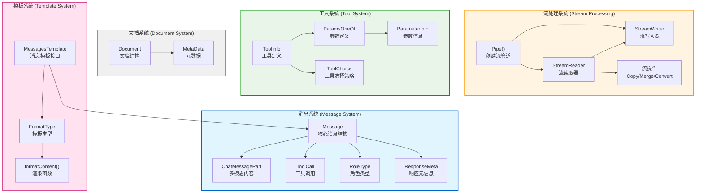
```mermaid
flowchart TB
    subgraph 消息系统["消息系统 (Message System)"]
        Message["Message<br/>核心消息结构"]
        MessagePart["ChatMessagePart<br/>多模态内容"]
        ToolCall["ToolCall<br/>工具调用"]
        RoleType["RoleType<br/>角色类型"]
        ResponseMeta["ResponseMeta<br/>响应元信息"]
    end

    subgraph 流处理系统["流处理系统 (Stream Processing)"]
        StreamReader["StreamReader<br/>流读取器"]
        StreamWriter["StreamWriter<br/>流写入器"]
        Pipe["Pipe()<br/>创建流管道"]
        StreamOps["流操作<br/>Copy/Merge/Convert"]
    end

    subgraph 工具系统["工具系统 (Tool System)"]
        ToolInfo["ToolInfo<br/>工具定义"]
        ParamsOneOf["ParamsOneOf<br/>参数定义"]
        ParameterInfo["ParameterInfo<br/>参数信息"]
        ToolChoice["ToolChoice<br/>工具选择策略"]
    end

    subgraph 文档系统["文档系统 (Document System)"]
        Document["Document<br/>文档结构"]
        DocMetaData["MetaData<br/>元数据"]
    end

    subgraph 模板系统["模板系统 (Template System)"]
        MessagesTemplate["MessagesTemplate<br/>消息模板接口"]
        FormatType["FormatType<br/>模板类型"]
        FormatFunc["formatContent()<br/>渲染函数"]
    end

    Message --> MessagePart
    Message --> ToolCall
    Message --> RoleType
    Message --> ResponseMeta

    StreamReader --> StreamWriter
    Pipe --> StreamReader
    Pipe --> StreamWriter
    StreamReader --> StreamOps

    ToolInfo --> ParamsOneOf
    ParamsOneOf --> ParameterInfo
    ToolInfo --> ToolChoice

    Document --> DocMetaData

    MessagesTemplate --> Message
    MessagesTemplate --> FormatType
    FormatType --> FormatFunc

    classDef messageStyle fill:#e1f5ff,stroke:#0066cc,stroke-width:2px
    classDef streamStyle fill:#fff4e1,stroke:#ff9900,stroke-width:2px
    classDef toolStyle fill:#e8f5e8,stroke:#009900,stroke-width:2px
    classDef docStyle fill:#f0f0f0,stroke:#666,stroke-width:1px
    classDef templateStyle fill:#ffe1f0,stroke:#cc0066,stroke-width:1px

    class 消息系统 messageStyle
    class 流处理系统 streamStyle
    class 工具系统 toolStyle
    class 文档系统 docStyle
    class 模板系统 templateStyle
```

### 2.2 架构图说明

#### 2.2.1 消息系统

**核心结构 Message**：

```go
// Message 是 LLM 交互的核心消息结构
type Message struct {
    Role             RoleType          // 角色: system/user/assistant/tool
    Content          string            // 文本内容
    MultiContent     []ChatMessagePart // 多模态内容
    Name             string            // 可选的名称标识
    ToolCalls        []ToolCall        // 助手返回的工具调用列表
    ToolCallID       string            // 工具消息的调用ID
    ToolName         string            // 工具名称
    ResponseMeta     *ResponseMeta     // 响应元信息
    ReasoningContent string            // 推理过程内容
    Extra            map[string]any    // 扩展字段
}
```

**角色类型**：

- `System`: 系统消息，通常用于设置角色和规则
- `User`: 用户消息，表示用户的输入
- `Assistant`: 助手消息，表示 LLM 的回复
- `Tool`: 工具消息，表示工具执行的结果

**工具调用 ToolCall**：

```go
type ToolCall struct {
    Index    *int         // 索引（流式模式下用于合并）
    ID       string       // 工具调用唯一ID
    Type     string       // 类型，默认 "function"
    Function FunctionCall // 函数调用信息
    Extra    map[string]any
}

type FunctionCall struct {
    Name      string // 函数名
    Arguments string // JSON 格式的参数
}
```

**多模态内容 ChatMessagePart**：

```go
type ChatMessagePart struct {
    Type     ChatMessagePartType // text/image_url/audio_url/video_url/file_url
    Text     string              // 文本内容
    ImageURL *ChatMessageImageURL // 图片URL
    AudioURL *ChatMessageAudioURL // 音频URL
    VideoURL *ChatMessageVideoURL // 视频URL
    FileURL  *ChatMessageFileURL  // 文件URL
}
```

支持的多模态类型：

- **文本（Text）**: 纯文本内容
- **图片（ImageURL）**: 支持 URL 或 RFC-2397 格式的内嵌图片数据
- **音频（AudioURL）**: 音频文件 URL
- **视频（VideoURL）**: 视频文件 URL
- **文件（FileURL）**: 通用文件 URL

#### 2.2.2 流处理系统

**StreamReader 的多种实现类型**：

```go
type StreamReader[T any] struct {
    typ readerType  // 读取器类型
    
    st  *stream[T]              // 基础流实现
    ar  *arrayReader[T]         // 数组读取器
    msr *multiStreamReader[T]   // 多流合并读取器
    srw *streamReaderWithConvert[T] // 带转换的读取器
    csr *childStreamReader[T]   // 子流读取器（用于Copy）
}

// 读取器类型
const (
    readerTypeStream        // 基于 channel 的流
    readerTypeArray         // 基于数组的流
    readerTypeMultiStream   // 多流合并
    readerTypeWithConvert   // 带类型转换
    readerTypeChild         // Copy 产生的子流
)
```

**基础流实现**：

```go
// stream 是基于 channel 的流，1个发送者和1个接收者
type stream[T any] struct {
    items  chan streamItem[T] // 数据通道
    closed chan struct{}      // 关闭信号通道
    
    automaticClose bool       // 是否启用自动关闭（GC时）
    closedFlag     *uint32    // 关闭标志（用于自动关闭）
}

type streamItem[T any] struct {
    chunk T     // 数据块
    err   error // 错误（如果有）
}
```

**流操作**：

1. **创建流**：
   - `Pipe[T](cap)`: 创建流管道，返回 Reader 和 Writer
   - `StreamReaderFromArray[T](arr)`: 从数组创建流

2. **复制流**：
   - `StreamReader.Copy(n)`: 创建 n 个独立的读取器
   - 使用共享链表实现，避免数据复制

3. **合并流**：
   - `MergeStreamReaders(srs)`: 合并多个流为一个
   - `MergeNamedStreamReaders(namedSrs)`: 合并并保留流名称

4. **转换流**：
   - `StreamReaderWithConvert(sr, convertFunc)`: 转换流的数据类型

#### 2.2.3 工具系统

**工具定义 ToolInfo**：

```go
type ToolInfo struct {
    Name  string       // 工具名称，唯一标识
    Desc  string       // 工具描述，告诉模型何时使用
    Extra map[string]any // 扩展信息
    *ParamsOneOf       // 参数定义（可选）
}
```

**参数定义 ParamsOneOf**：

支持三种方式定义工具参数：

1. **通过 ParameterInfo**（推荐）：

```go
params := &ParameterInfo{
    Type: Object,
    SubParams: map[string]*ParameterInfo{
        "city": {
            Type:     String,
            Desc:     "城市名称",
            Required: true,
        },
        "unit": {
            Type:     String,
            Desc:     "温度单位",
            Enum:     []string{"celsius", "fahrenheit"},
            Required: false,
        },
    },
}

toolInfo := &ToolInfo{
    Name:        "get_weather",
    Desc:        "获取指定城市的天气",
    ParamsOneOf: NewParamsOneOfByParams(map[string]*ParameterInfo{
        "city": params.SubParams["city"],
        "unit": params.SubParams["unit"],
    }),
}
```

1. **通过 JSONSchema**：

```go
jsonSchema := &jsonschema.Schema{
    Type: "object",
    Properties: orderedmap.New[string, *jsonschema.Schema](),
    Required: []string{"city"},
}
jsonSchema.Properties.Set("city", &jsonschema.Schema{
    Type:        "string",
    Description: "城市名称",
})

toolInfo := &ToolInfo{
    Name:        "get_weather",
    Desc:        "获取指定城市的天气",
    ParamsOneOf: NewParamsOneOfByJSONSchema(jsonSchema),
}
```

1. **通过 OpenAPIV3 Schema**（已废弃，建议使用 JSONSchema）

**工具选择策略 ToolChoice**：

- `ToolChoiceForbidden`: 禁止调用工具
- `ToolChoiceAllowed`: 允许调用（模型自主选择）
- `ToolChoiceForced`: 强制调用

#### 2.2.4 文档系统

**文档结构 Document**：

```go
type Document struct {
    ID       string         // 文档唯一标识
    Content  string         // 文档内容
    MetaData map[string]any // 元数据
}
```

**元数据辅助方法**：

Document 提供了便捷方法来设置和获取常用元数据：

```go
// 评分相关
doc.WithScore(0.95)  // 设置相关性评分
score := doc.Score() // 获取评分

// 子索引
doc.WithSubIndexes([]string{"index1", "index2"})
indexes := doc.SubIndexes()

// 向量
doc.WithDenseVector([]float64{0.1, 0.2, 0.3})
vector := doc.DenseVector()

doc.WithSparseVector(map[int]float64{0: 0.5, 10: 0.8})
sparse := doc.SparseVector()

// 额外信息
doc.WithExtraInfo("这是一篇技术文档")
info := doc.ExtraInfo()

// DSL信息（用于查询）
doc.WithDSLInfo(map[string]any{"filter": "category:tech"})
dsl := doc.DSLInfo()
```

#### 2.2.5 模板系统

**消息模板接口**：

```go
type MessagesTemplate interface {
    Format(ctx context.Context, vs map[string]any, formatType FormatType) ([]*Message, error)
}
```

**支持的模板类型**：

- `FString`: Python 风格的格式字符串（PEP-3101）
- `GoTemplate`: Go 标准模板
- `Jinja2`: Jinja2 模板（常用于 LangChain）

**使用示例**：

```go
// 1. 单条消息模板
msg := schema.UserMessage("你好，{name}！")
formatted, _ := msg.Format(ctx, map[string]any{"name": "Eino"}, schema.FString)
// formatted[0].Content = "你好，Eino！"

// 2. 消息占位符
template := prompt.FromMessages(
    schema.SystemMessage("你是一个有帮助的助手"),
    schema.MessagesPlaceholder("history", false), // 插入历史消息
    schema.UserMessage("问题：{query}"),
)

params := map[string]any{
    "history": []*schema.Message{
        schema.UserMessage("我是谁？"),
        schema.AssistantMessage("你是用户", nil),
    },
    "query": "今天天气怎么样？",
}

messages, _ := template.Format(ctx, params, schema.FString)
```

---

## 3. 边界条件与约束

### 3.1 消息系统边界

**Role 字段约束**：

- Message 的 Role 必须是四种类型之一：system/user/assistant/tool
- 同一对话中，Role 之间有隐含的顺序关系（虽然框架不强制）
- Tool 消息必须包含 ToolCallID 字段

**内容字段约束**：

- `Content` 和 `MultiContent` 通常只使用一个
- 如果 `MultiContent` 不为空，则 `MultiContent` 优先
- `MultiContent` 用于多模态内容（图片、音频等）

**ToolCalls 字段约束**：

- 只有 Assistant 消息才应该包含 ToolCalls
- ToolCalls 的 Index 字段用于流式模式下的 chunk 合并
- ToolCalls 的 ID 必须唯一

**消息拼接约束**：

```go
// ConcatMessages 有严格的约束
func ConcatMessages(msgs []*Message) (*Message, error) {
    // 1. 所有消息的 Role 必须相同
    // 2. 所有消息的 Name 必须相同（如果有）
    // 3. 所有消息的 ToolCallID 必须相同（如果有）
    // 4. ToolCalls 通过 Index 合并，Index 相同的合并为一个
    // 5. Content 按顺序拼接
}
```

### 3.2 流处理边界

**StreamReader 使用约束**：

- **必须调用 Close()**：否则可能导致 goroutine 泄漏
- **单 goroutine 使用**：Recv() 和 Close() 不是并发安全的
- **Copy 后原流不可用**：Copy(n) 后原 StreamReader 会失效
- **EOF 表示结束**：Recv() 返回 io.EOF 表示流正常结束

**StreamWriter 使用约束**：

- **必须调用 Close()**：通知接收端流已结束
- **Send 后检查返回值**：返回 true 表示流已关闭，应停止发送
- **单 goroutine 发送**：虽然 Send 是线程安全的，但建议单个 goroutine 发送

**流的缓冲区**：

```go
// Pipe 创建的流有缓冲区限制
sr, sw := schema.Pipe[string](10) // 缓冲区大小为 10

// 发送满后会阻塞
for i := 0; i < 20; i++ {
    sw.Send(fmt.Sprintf("data-%d", i), nil) // 第11次会阻塞，直到接收端读取
}
```

**流的复制约束**：

```go
// Copy 创建独立的读取器，共享底层数据
readers := sr.Copy(3) // 创建3个独立读取器

// 原流 sr 不可再使用
// 每个 reader 可独立读取，互不影响
for i, r := range readers {
    go func(idx int, reader *StreamReader[string]) {
        defer reader.Close()
        for {
            chunk, err := reader.Recv()
            if err == io.EOF {
                break
            }
            // 处理 chunk
        }
    }(i, r)
}
```

### 3.3 工具系统边界

**参数定义约束**：

- ParameterInfo 的 Type 必须是七种数据类型之一
- Array 类型必须指定 ElemInfo
- Object 类型必须指定 SubParams
- Enum 只能用于 String 类型

**参数转换**：

```go
// ParamsOneOf 可以转换为 JSONSchema 或 OpenAPIV3
paramsOneOf := NewParamsOneOfByParams(params)

// 转换为 JSONSchema（推荐）
jsonSchema, err := paramsOneOf.ToJSONSchema()

// 转换为 OpenAPIV3（已废弃）
openAPIV3, err := paramsOneOf.ToOpenAPIV3()
```

**ToolInfo 约束**：

- Name 字段是必填的，且应该是唯一的
- Desc 字段应该清晰描述工具的用途和使用场景
- 如果工具不需要参数，ParamsOneOf 可以为 nil

### 3.4 并发安全

**线程安全的操作**：

- StreamWriter.Send() 是线程安全的
- StreamReader.Copy() 创建的多个读取器可在不同 goroutine 中使用
- Message、Document、ToolInfo 等数据结构是不可变的，读取是线程安全的

**非线程安全的操作**：

- StreamReader.Recv() 不是线程安全的，必须在单个 goroutine 中调用
- StreamReader.Close() 不是线程安全的
- Message 的字段修改不是线程安全的（但通常不会修改）

### 3.5 内存管理

**StreamReader 自动关闭**：

```go
sr := schema.Pipe[string](10)

// 启用自动关闭，GC 时自动释放资源
sr.SetAutomaticClose()

// 无需手动 Close，GC 会自动清理
// 但手动 Close 更可控
```

**消息大小限制**：

- 单条消息的 Content 建议不超过 1MB
- 超大内容应该拆分为多条消息或使用流式处理
- MultiContent 的每个 Part 也应该控制大小

---

## 4. 扩展点

### 4.1 自定义消息模板

实现 `MessagesTemplate` 接口可以自定义消息模板渲染逻辑：

```go
type MyCustomTemplate struct {
    template string
}

func (t *MyCustomTemplate) Format(ctx context.Context, vs map[string]any, formatType FormatType) ([]*Message, error) {
    // 自定义渲染逻辑
    content := renderTemplate(t.template, vs)
    return []*Message{
        schema.UserMessage(content),
    }, nil
}
```

### 4.2 自定义流转换

使用 `StreamReaderWithConvert` 可以实现自定义的流数据转换：

```go
// 将 Message 流转换为纯文本流
textStream := schema.StreamReaderWithConvert(messageStream, func(msg *schema.Message) (string, error) {
    if msg.Content == "" {
        return "", schema.ErrNoValue // 跳过空消息
    }
    return msg.Content, nil
})
```

### 4.3 自定义元数据

Document 的 MetaData 是 `map[string]any`，可以存储任意元数据：

```go
doc := &schema.Document{
    ID:      "doc-1",
    Content: "文档内容",
    MetaData: map[string]any{
        "author":     "张三",
        "created_at": time.Now(),
        "tags":       []string{"tech", "ai"},
        "custom":     myCustomData,
    },
}
```

---

## 5. 资源占用与性能特征

### 5.1 内存占用

**Message 内存占用**：

- 基础结构体约 200 bytes
- Content 字段占用与文本长度成正比
- MultiContent 每个 Part 约 100-200 bytes
- ToolCalls 每个约 150 bytes
- ResponseMeta 约 100 bytes

**StreamReader 内存占用**：

- 基础结构体约 50 bytes
- channel 缓冲区占用：cap × sizeof(streamItem)
- Copy 创建的子流共享数据，内存开销小

### 5.2 性能特征

**消息拼接性能**：

```go
// ConcatMessages 使用 strings.Builder 优化
// 时间复杂度：O(n × m)，n 为消息数，m 为平均内容长度
// 空间复杂度：O(总内容长度)

// 性能测试（参考值）：
// 1000条消息，每条100字符：约 1ms
// 10000条消息，每条100字符：约 10ms
```

**流处理性能**：

- StreamReader 基于 channel，性能接近原生 channel
- Copy 使用链表结构，内存和时间开销都很小
- Merge 使用 reflect.Select，性能随流数量增加而下降
  - ≤10 个流：性能良好
  - \>10 个流：建议分批合并

**模板渲染性能**：

- FString：最快，适合简单场景
- GoTemplate：中等，适合复杂逻辑
- Jinja2：最慢，但功能最强大

### 5.3 资源清理

**自动清理**：

```go
// 启用自动关闭
sr.SetAutomaticClose()
// GC 时自动调用 Close()
```

**手动清理**（推荐）：

```go
sr, sw := schema.Pipe[string](10)

// 发送端
go func() {
    defer sw.Close() // 确保关闭
    for _, item := range items {
        sw.Send(item, nil)
    }
}()

// 接收端
defer sr.Close() // 确保关闭
for {
    chunk, err := sr.Recv()
    if err == io.EOF {
        break
    }
    // 处理 chunk
}
```

---

## 6. 典型使用场景

### 6.1 场景 1：创建和发送消息

```go
// 创建系统消息
sysMsg := schema.SystemMessage("你是一个有帮助的AI助手")

// 创建用户消息
userMsg := schema.UserMessage("什么是 Eino 框架？")

// 创建带工具调用的助手消息
toolCalls := []schema.ToolCall{
    {
        ID:   "call-1",
        Type: "function",
        Function: schema.FunctionCall{
            Name:      "search_web",
            Arguments: `{"query":"Eino framework"}`,
        },
    },
}
assistantMsg := schema.AssistantMessage("让我搜索一下", toolCalls)

// 创建工具响应消息
toolMsg := schema.ToolMessage(
    "搜索结果：Eino 是一个 Go 语言的 LLM 应用开发框架",
    "call-1",
    schema.WithToolName("search_web"),
)
```

### 6.2 场景 2：处理流式消息

```go
// 接收流式消息并拼接
var chunks []*schema.Message
defer stream.Close()

for {
    chunk, err := stream.Recv()
    if err == io.EOF {
        break
    }
    if err != nil {
        return err
    }
    chunks = append(chunks, chunk)
}

// 拼接为完整消息
fullMessage, err := schema.ConcatMessages(chunks)
if err != nil {
    return err
}

fmt.Println(fullMessage.Content)
```

### 6.3 场景 3：创建工具定义

```go
// 定义天气查询工具
weatherTool := &schema.ToolInfo{
    Name: "get_weather",
    Desc: "获取指定城市的天气信息。当用户询问天气时使用此工具。",
    ParamsOneOf: schema.NewParamsOneOfByParams(map[string]*schema.ParameterInfo{
        "city": {
            Type:     schema.String,
            Desc:     "城市名称，例如：北京、上海",
            Required: true,
        },
        "unit": {
            Type:     schema.String,
            Desc:     "温度单位",
            Enum:     []string{"celsius", "fahrenheit"},
            Required: false,
        },
    }),
}

// 定义数学计算工具
calcTool := &schema.ToolInfo{
    Name: "calculator",
    Desc: "执行数学计算。支持加减乘除和基础数学函数。",
    ParamsOneOf: schema.NewParamsOneOfByParams(map[string]*schema.ParameterInfo{
        "expression": {
            Type:     schema.String,
            Desc:     "数学表达式，例如：1 + 2 * 3",
            Required: true,
        },
    }),
}
```

### 6.4 场景 4：使用消息模板

```go
// 使用 FString 格式
msg := schema.UserMessage("你好，{name}！今天是{date}")
formatted, _ := msg.Format(ctx, map[string]any{
    "name": "Alice",
    "date": "2024-12-19",
}, schema.FString)
// 输出：你好，Alice！今天是2024-12-19

// 使用 Jinja2 格式（支持循环、条件等）
msg2 := schema.UserMessage(`


- {{ item }}


`)
formatted2, _ := msg2.Format(ctx, map[string]any{
    "items": []string{"苹果", "香蕉", "橙子"},
}, schema.Jinja2)
```

### 6.5 场景 5：创建和使用流

```go
// 创建流管道
sr, sw := schema.Pipe[string](10)

// 发送数据
go func() {
    defer sw.Close()
    for i := 0; i < 5; i++ {
        sw.Send(fmt.Sprintf("chunk-%d", i), nil)
        time.Sleep(100 * time.Millisecond)
    }
}()

// 接收数据
defer sr.Close()
for {
    chunk, err := sr.Recv()
    if err == io.EOF {
        break
    }
    fmt.Println(chunk)
}
```

### 6.6 场景 6：合并多个流

```go
// 创建多个流
sr1, sw1 := schema.Pipe[string](5)
sr2, sw2 := schema.Pipe[string](5)
sr3, sw3 := schema.Pipe[string](5)

// 分别发送数据
go sendData(sw1, "stream1")
go sendData(sw2, "stream2")
go sendData(sw3, "stream3")

// 合并流
mergedStream := schema.MergeStreamReaders([]*schema.StreamReader[string]{
    sr1, sr2, sr3,
})

// 读取合并后的流（顺序不确定）
defer mergedStream.Close()
for {
    chunk, err := mergedStream.Recv()
    if err == io.EOF {
        break
    }
    fmt.Println(chunk)
}
```

---

## 7. 配置项

Schema 模块本身配置项较少，主要配置在使用层面：

### 7.1 流缓冲区大小

```go
// 创建流时指定缓冲区大小
sr, sw := schema.Pipe[string](100) // 缓冲区大小为 100

// 缓冲区大小影响：
// - 太小：发送端容易阻塞
// - 太大：占用内存多
// - 建议：10-100 之间
```

### 7.2 模板格式选择

```go
// 三种模板格式的选择：
// 1. FString：简单变量替换，性能最好
formatType := schema.FString

// 2. GoTemplate：支持条件、循环等，性能中等
formatType := schema.GoTemplate

// 3. Jinja2：功能最强大，兼容 LangChain，性能较慢
formatType := schema.Jinja2
```

### 7.3 自动关闭设置

```go
// 启用自动关闭（GC 时自动释放）
sr.SetAutomaticClose()

// 适用场景：
// - 流的生命周期不确定
// - 无法保证手动调用 Close()
// - 性能不是特别敏感
```

---

## 8. 常见问题与最佳实践

### 8.1 为什么 StreamReader 必须 Close()？

**原因**：

- StreamReader 内部可能有 goroutine 在运行
- 不 Close() 会导致 goroutine 泄漏
- channel 不会被 GC 自动关闭

**最佳实践**：

```go
// ✅ 正确：使用 defer 确保关闭
sr, sw := schema.Pipe[string](10)
defer sr.Close()

for {
    chunk, err := sr.Recv()
    if err == io.EOF {
        break
    }
    // 处理 chunk
}

// ❌ 错误：忘记关闭
sr, sw := schema.Pipe[string](10)
for {
    chunk, err := sr.Recv()
    if err == io.EOF {
        break
    }
}
// sr 泄漏！
```

### 8.2 如何选择模板格式？

**选择指南**：

1. **FString**（推荐优先使用）：
   - 只需要简单的变量替换
   - 性能要求高
   - 不需要条件和循环

2. **GoTemplate**：
   - 需要条件判断或循环
   - 已经熟悉 Go template 语法
   - 性能要求适中

3. **Jinja2**：
   - 需要与 Python/LangChain 兼容
   - 需要高级模板功能
   - 性能不是主要考虑

### 8.3 如何处理大文件？

**问题**：

- 大文件一次性加载到 Message.Content 会占用大量内存

**解决方案**：

```go
// 方案 1：拆分为多条消息
func splitLargeContent(content string, chunkSize int) []*schema.Message {
    var messages []*schema.Message
    for i := 0; i < len(content); i += chunkSize {
        end := i + chunkSize
        if end > len(content) {
            end = len(content)
        }
        messages = append(messages, schema.UserMessage(content[i:end]))
    }
    return messages
}

// 方案 2：使用流式处理
sr, sw := schema.Pipe[string](10)
go func() {
    defer sw.Close()
    file, _ := os.Open("large_file.txt")
    scanner := bufio.NewScanner(file)
    for scanner.Scan() {
        sw.Send(scanner.Text(), nil)
    }
}()
```

### 8.4 如何复用消息？

**问题**：

- Message 结构体比较大，频繁创建会有性能开销

**解决方案**：

```go
// 方案 1：使用消息池
var messagePool = sync.Pool{
    New: func() interface{} {
        return &schema.Message{}
    },
}

func getMessage() *schema.Message {
    return messagePool.Get().(*schema.Message)
}

func putMessage(msg *schema.Message) {
    *msg = schema.Message{} // 重置
    messagePool.Put(msg)
}

// 方案 2：复用 Content 字段
var sb strings.Builder
sb.Reset()
for _, chunk := range chunks {
    sb.WriteString(chunk)
}
msg.Content = sb.String()
```

---

## 9. 版本兼容性

### 9.1 API 稳定性

**稳定 API**（不会有破坏性变更）：

- Message、Document、ToolInfo 等核心数据结构
- StreamReader、StreamWriter 的核心方法
- 工厂函数（SystemMessage、UserMessage 等）

**实验性 API**（可能变更）：

- Message 的 Extra 字段的具体用法
- Document 的元数据辅助方法可能增加新的

**已废弃 API**：

- `ParamsOneOf.ToOpenAPIV3()` → 使用 `ToJSONSchema()`
- `NewParamsOneOfByOpenAPIV3()` → 使用 `NewParamsOneOfByJSONSchema()`

### 9.2 数据结构演进

**向后兼容策略**：

- 新增字段不影响旧代码
- 使用 JSON 序列化时忽略未知字段
- Extra 字段用于扩展，不影响核心逻辑

**迁移建议**：

```go
// 旧代码（使用 OpenAPIV3）
paramsOneOf := schema.NewParamsOneOfByOpenAPIV3(openAPIV3Schema)

// 新代码（使用 JSONSchema）
paramsOneOf := schema.NewParamsOneOfByJSONSchema(jsonSchema)
```

---

**文档版本**: v1.0  
**最后更新**: 2024-12-19  
**适用 Eino 版本**: main 分支（最新版本）

---

## API接口

本文档详细描述 Schema 模块对外提供的所有 API，包括请求/响应结构体、字段说明、入口函数、调用链路和使用示例。

---

## 1. Message API

### 1.1 消息创建 API

#### 1.1.1 SystemMessage

**功能说明**：创建系统角色消息，通常用于设置 AI 助手的行为规则和角色定位。

**函数签名**：

```go
func SystemMessage(content string) *Message
```

**参数说明**：

| 参数名 | 类型 | 必填 | 说明 |
|-------|------|------|------|
| content | string | 是 | 系统消息的文本内容 |

**返回值**：

```go
type Message struct {
    Role    RoleType // 固定为 System
    Content string   // 传入的 content 参数
}
```

**核心代码**：

```go
// SystemMessage 创建系统消息
// 用途：设置 AI 助手的角色、规则、行为约束
// 位置：通常放在对话的最开始
func SystemMessage(content string) *Message {
    return &Message{
        Role:    System,
        Content: content,
    }
}
```

**使用示例**：

```go
// 示例 1：设置助手角色
sysMsg := schema.SystemMessage("你是一个专业的 Go 语言编程助手")

// 示例 2：设置行为规则
sysMsg := schema.SystemMessage(`
你是一个有帮助的 AI 助手。请遵循以下规则：

1. 回答要准确、专业
2. 不确定时要明确说明
3. 代码示例要完整可运行

`)

// 示例 3：Few-shot 示例
sysMsg := schema.SystemMessage(`
你是一个情感分析助手。以下是示例：

输入：这个产品真不错！
输出：积极

输入：质量太差了
输出：消极
`)
```

**最佳实践**：

- System 消息应该放在对话的最开始
- 避免在 System 消息中频繁使用用户特定信息
- 可以包含 Few-shot 示例来引导模型行为
- 内容应该清晰、具体，避免模糊的指令

#### 1.1.2 UserMessage

**功能说明**：创建用户角色消息，表示用户的输入或问题。

**函数签名**：

```go
func UserMessage(content string) *Message
```

**参数说明**：

| 参数名 | 类型 | 必填 | 说明 |
|-------|------|------|------|
| content | string | 是 | 用户消息的文本内容 |

**返回值**：

```go
type Message struct {
    Role    RoleType // 固定为 User
    Content string   // 传入的 content 参数
}
```

**核心代码**：

```go
// UserMessage 创建用户消息
// 用途：表示用户的输入、问题或指令
// 特点：可以包含变量占位符，配合模板使用
func UserMessage(content string) *Message {
    return &Message{
        Role:    User,
        Content: content,
    }
}
```

**使用示例**：

```go
// 示例 1：简单问题
userMsg := schema.UserMessage("什么是 Eino 框架？")

// 示例 2：带变量的模板消息
userMsg := schema.UserMessage("请帮我查询{city}的天气")

// 示例 3：多行输入
userMsg := schema.UserMessage(`
请分析以下代码的性能问题：

func process(data []int) {
    // 代码内容
}
`)
```

**最佳实践**：

- User 消息通常和 Assistant 消息交替出现
- 可以使用模板变量（配合 Format 方法）
- 对于长文本，考虑拆分或使用 MultiContent

#### 1.1.3 AssistantMessage

**功能说明**：创建助手角色消息，表示 AI 模型的回复，可以包含工具调用。

**函数签名**：

```go
func AssistantMessage(content string, toolCalls []ToolCall) *Message
```

**参数说明**：

| 参数名 | 类型 | 必填 | 说明 |
|-------|------|------|------|
| content | string | 是 | 助手回复的文本内容 |
| toolCalls | []ToolCall | 否 | 工具调用列表，可以为 nil |

**返回值**：

```go
type Message struct {
    Role      RoleType   // 固定为 Assistant
    Content   string     // 传入的 content 参数
    ToolCalls []ToolCall // 传入的 toolCalls 参数
}
```

**核心代码**：

```go
// AssistantMessage 创建助手消息
// 用途：表示 AI 模型的回复
// 特点：可以同时包含文本内容和工具调用
func AssistantMessage(content string, toolCalls []ToolCall) *Message {
    return &Message{
        Role:      Assistant,
        Content:   content,
        ToolCalls: toolCalls,
    }
}
```

**使用示例**：

```go
// 示例 1：纯文本回复
assistantMsg := schema.AssistantMessage("Eino 是一个 Go 语言的 LLM 应用开发框架", nil)

// 示例 2：带工具调用的回复
toolCalls := []schema.ToolCall{
    {
        ID:   "call-123",
        Type: "function",
        Function: schema.FunctionCall{
            Name:      "get_weather",
            Arguments: `{"city":"北京"}`,
        },
    },
}
assistantMsg := schema.AssistantMessage("让我查询一下北京的天气", toolCalls)

// 示例 3：多个工具调用
toolCalls := []schema.ToolCall{
    {
        ID:   "call-1",
        Type: "function",
        Function: schema.FunctionCall{
            Name:      "search_web",
            Arguments: `{"query":"Eino framework"}`,
        },
    },
    {
        ID:   "call-2",
        Type: "function",
        Function: schema.FunctionCall{
            Name:      "get_current_time",
            Arguments: `{}`,
        },
    },
}
assistantMsg := schema.AssistantMessage("我需要搜索信息并获取当前时间", toolCalls)
```

**最佳实践**：

- Assistant 消息通常是 ChatModel 的输出
- 如果包含 ToolCalls，通常需要执行工具后继续对话
- Content 和 ToolCalls 可以同时存在

#### 1.1.4 ToolMessage

**功能说明**：创建工具角色消息，表示工具执行的结果。

**函数签名**：

```go
func ToolMessage(content string, toolCallID string, opts ...ToolMessageOption) *Message
```

**参数说明**：

| 参数名 | 类型 | 必填 | 说明 |
|-------|------|------|------|
| content | string | 是 | 工具执行结果的文本内容 |
| toolCallID | string | 是 | 对应的工具调用 ID |
| opts | ...ToolMessageOption | 否 | 可选配置，如 WithToolName |

**返回值**：

```go
type Message struct {
    Role       RoleType // 固定为 Tool
    Content    string   // 传入的 content 参数
    ToolCallID string   // 传入的 toolCallID 参数
    ToolName   string   // 通过 WithToolName 设置
}
```

**核心代码**：

```go
// ToolMessage 创建工具消息
// 用途：表示工具执行的结果
// 关联：通过 ToolCallID 关联到 AssistantMessage 的 ToolCall
func ToolMessage(content string, toolCallID string, opts ...ToolMessageOption) *Message {
    o := &toolMessageOptions{}
    for _, opt := range opts {
        opt(o)
    }
    return &Message{
        Role:       Tool,
        Content:    content,
        ToolCallID: toolCallID,
        ToolName:   o.toolName,
    }
}

// WithToolName 设置工具名称
func WithToolName(name string) ToolMessageOption {
    return func(o *toolMessageOptions) {
        o.toolName = name
    }
}
```

**使用示例**：

```go
// 示例 1：简单工具结果
toolMsg := schema.ToolMessage(
    "北京今天晴天，温度 25°C",
    "call-123",
)

// 示例 2：带工具名称
toolMsg := schema.ToolMessage(
    `{"temperature":25,"condition":"sunny"}`,
    "call-123",
    schema.WithToolName("get_weather"),
)

// 示例 3：工具执行失败
toolMsg := schema.ToolMessage(
    "错误：未找到指定城市",
    "call-123",
    schema.WithToolName("get_weather"),
)
```

**最佳实践**：

- ToolCallID 必须与 AssistantMessage 的 ToolCall.ID 对应
- Content 可以是纯文本或 JSON 格式
- 建议使用 WithToolName 明确工具名称
- 工具失败时应该返回错误信息，而不是抛出异常

---

### 1.2 消息模板 API

#### 1.2.1 Message.Format

**功能说明**：使用指定的模板格式渲染消息内容。

**函数签名**：

```go
func (m *Message) Format(ctx context.Context, vs map[string]any, formatType FormatType) ([]*Message, error)
```

**参数说明**：

| 参数名 | 类型 | 必填 | 说明 |
|-------|------|------|------|
| ctx | context.Context | 是 | 上下文 |
| vs | map[string]any | 是 | 模板变量字典 |
| formatType | FormatType | 是 | 模板类型（FString/GoTemplate/Jinja2） |

**返回值**：

| 字段名 | 类型 | 说明 |
|-------|------|------|
| []*Message | 消息数组 | 渲染后的消息（通常只有一条） |
| error | 错误 | 渲染失败时返回错误 |

**核心代码**：

```go
// Format 渲染消息模板
// 支持三种模板格式：FString、GoTemplate、Jinja2
// 会同时渲染 Content 和 MultiContent 中的文本
func (m *Message) Format(ctx context.Context, vs map[string]any, formatType FormatType) ([]*Message, error) {
    // 渲染 Content
    c, err := formatContent(m.Content, vs, formatType)
    if err != nil {
        return nil, err
    }
    copied := *m
    copied.Content = c

    // 复制 MultiContent
    if len(m.MultiContent) != 0 {
        copied.MultiContent = make([]ChatMessagePart, len(m.MultiContent))
        copy(copied.MultiContent, m.MultiContent)
    }

    // 渲染 MultiContent 中的文本
    for i, mc := range copied.MultiContent {
        switch mc.Type {
        case ChatMessagePartTypeText:
            nmc, err := formatContent(mc.Text, vs, formatType)
            if err != nil {
                return nil, err
            }
            copied.MultiContent[i].Text = nmc
        // 处理其他类型（ImageURL、AudioURL 等）
        }
    }
    return []*Message{&copied}, nil
}

// formatContent 根据格式类型渲染内容
func formatContent(content string, vs map[string]any, formatType FormatType) (string, error) {
    switch formatType {
    case FString:
        return pyfmt.Fmt(content, vs)  // Python 格式字符串
    case GoTemplate:
        // Go 标准模板
        parsedTmpl, err := template.New("template").Parse(content)
        // ...
    case Jinja2:
        // Jinja2 模板
        tpl, err := jinjaEnv.FromString(content)
        // ...
    }
}
```

**使用示例**：

```go
// 示例 1：FString 格式（Python 风格）
msg := schema.UserMessage("你好，{name}！今天是{date}")
params := map[string]any{
    "name": "Alice",
    "date": "2024-12-19",
}
rendered, _ := msg.Format(ctx, params, schema.FString)
// rendered[0].Content = "你好，Alice！今天是2024-12-19"

// 示例 2：GoTemplate 格式
msg := schema.UserMessage("你好，{{.name}}！{{if .vip}}您是VIP用户{{end}}")
params := map[string]any{
    "name": "Bob",
    "vip":  true,
}
rendered, _ := msg.Format(ctx, params, schema.GoTemplate)
// rendered[0].Content = "你好，Bob！您是VIP用户"

// 示例 3：Jinja2 格式（支持循环）
msg := schema.UserMessage(`
任务列表：


- {{ task }}


`)
params := map[string]any{
    "tasks": []string{"学习 Eino", "编写代码", "测试功能"},
}
rendered, _ := msg.Format(ctx, params, schema.Jinja2)
```

**调用链路**：

```
用户代码
  ↓
Message.Format(ctx, params, formatType)
  ↓
formatContent(content, params, formatType)
  ↓
根据 formatType 选择：

  - FString: pyfmt.Fmt()
  - GoTemplate: template.Execute()
  - Jinja2: gonja.Execute()
  ↓

返回渲染后的内容
```

**性能要点**：

- FString 最快，适合简单变量替换
- GoTemplate 中等，适合有条件和循环的场景
- Jinja2 最慢但功能最强，适合需要兼容 Python 的场景
- 模板解析有缓存机制（GoTemplate 和 Jinja2）

**最佳实践**：

- 优先使用 FString，除非需要条件或循环
- 模板中避免复杂的逻辑运算
- 使用 Jinja2 时注意禁用了 include、extends 等危险特性

#### 1.2.2 MessagesPlaceholder

**功能说明**：创建消息占位符，用于在模板中插入一组消息。

**函数签名**：

```go
func MessagesPlaceholder(key string, optional bool) MessagesTemplate
```

**参数说明**：

| 参数名 | 类型 | 必填 | 说明 |
|-------|------|------|------|
| key | string | 是 | 参数字典中的键名 |
| optional | bool | 是 | 是否可选（true 时键不存在不报错） |

**返回值**：

| 类型 | 说明 |
|------|------|
| MessagesTemplate | 消息模板接口实现 |

**核心代码**：

```go
// MessagesPlaceholder 创建消息占位符
// 用途：在消息模板中插入一组消息（如历史对话）
// 特点：不渲染内容，直接返回参数中的消息数组
func MessagesPlaceholder(key string, optional bool) MessagesTemplate {
    return &messagesPlaceholder{
        key:      key,
        optional: optional,
    }
}

type messagesPlaceholder struct {
    key      string
    optional bool
}

// Format 从参数中提取消息数组
func (p *messagesPlaceholder) Format(ctx context.Context, vs map[string]any, _ FormatType) ([]*Message, error) {
    v, ok := vs[p.key]
    if !ok {
        if p.optional {
            return []*Message{}, nil  // 可选时返回空数组
        }
        return nil, fmt.Errorf("message placeholder format: %s not found", p.key)
    }

    msgs, ok := v.([]*Message)
    if !ok {
        return nil, fmt.Errorf("only messages can be used to format message placeholder")
    }

    return msgs, nil
}
```

**使用示例**：

```go
// 通常与 prompt.FromMessages 配合使用（在 components/prompt 模块）
// 这里展示 MessagesPlaceholder 的独立用法

// 示例 1：插入历史对话
placeholder := schema.MessagesPlaceholder("history", false)
params := map[string]any{
    "history": []*schema.Message{
        schema.UserMessage("你是谁？"),
        schema.AssistantMessage("我是 AI 助手", nil),
    },
}
messages, _ := placeholder.Format(ctx, params, schema.FString)
// messages = [UserMessage, AssistantMessage]

// 示例 2：可选的历史对话
placeholder := schema.MessagesPlaceholder("history", true)
params := map[string]any{} // 不包含 history
messages, _ := placeholder.Format(ctx, params, schema.FString)
// messages = [] (空数组，不报错)

// 示例 3：完整的对话模板构建
// （这个需要 prompt 模块支持，这里只展示概念）
template := []schema.MessagesTemplate{
    schema.SystemMessage("你是一个有帮助的助手"),
    schema.MessagesPlaceholder("history", true),  // 历史对话
    schema.UserMessage("当前问题：{query}"),
}
```

**最佳实践**：

- 用于插入历史对话或上下文消息
- optional=true 适用于首次对话（无历史）的场景
- 确保参数中的值是 `[]*Message` 类型

---

### 1.3 消息拼接 API

#### 1.3.1 ConcatMessages

**功能说明**：将多条消息拼接为一条完整消息，主要用于处理流式消息。

**函数签名**：

```go
func ConcatMessages(msgs []*Message) (*Message, error)
```

**参数说明**：

| 参数名 | 类型 | 必填 | 说明 |
|-------|------|------|------|
| msgs | []*Message | 是 | 待拼接的消息数组 |

**返回值**：

| 类型 | 说明 |
|------|------|
| *Message | 拼接后的完整消息 |
| error | 拼接失败时返回错误 |

**核心代码**：

```go
// ConcatMessages 拼接消息
// 约束：
//   1. 所有消息的 Role 必须相同
//   2. 所有消息的 Name 必须相同（如果有）
//   3. ToolCalls 通过 Index 合并
//   4. Content 按顺序拼接
//   5. TokenUsage 取最大值
func ConcatMessages(msgs []*Message) (*Message, error) {
    var (
        contents            []string
        contentLen          int
        reasoningContents   []string
        reasoningContentLen int
        toolCalls           []ToolCall
        ret                 = Message{}
        extraList           = make([]map[string]any, 0, len(msgs))
    )

    for idx, msg := range msgs {
        if msg == nil {
            return nil, fmt.Errorf("unexpected nil chunk in message stream, index: %d", idx)
        }

        // 检查 Role 一致性
        if msg.Role != "" {
            if ret.Role == "" {
                ret.Role = msg.Role
            } else if ret.Role != msg.Role {
                return nil, fmt.Errorf("cannot concat messages with different roles")
            }
        }

        // 收集 Content
        if msg.Content != "" {
            contents = append(contents, msg.Content)
            contentLen += len(msg.Content)
        }

        // 收集 ToolCalls
        if len(msg.ToolCalls) > 0 {
            toolCalls = append(toolCalls, msg.ToolCalls...)
        }

        // 收集 ResponseMeta
        if msg.ResponseMeta != nil {
            // 合并 TokenUsage（取最大值）
            if msg.ResponseMeta.Usage != nil {
                if ret.ResponseMeta.Usage.TotalTokens < msg.ResponseMeta.Usage.TotalTokens {
                    ret.ResponseMeta.Usage = msg.ResponseMeta.Usage
                }
            }
        }
    }

    // 拼接 Content（使用 strings.Builder 优化性能）
    if len(contents) > 0 {
        var sb strings.Builder
        sb.Grow(contentLen)  // 预分配内存
        for _, content := range contents {
            sb.WriteString(content)
        }
        ret.Content = sb.String()
    }

    // 合并 ToolCalls
    if len(toolCalls) > 0 {
        merged, err := concatToolCalls(toolCalls)
        if err != nil {
            return nil, err
        }
        ret.ToolCalls = merged
    }

    return &ret, nil
}

// concatToolCalls 合并工具调用
// 策略：相同 Index 的 ToolCall 合并为一个
func concatToolCalls(chunks []ToolCall) ([]ToolCall, error) {
    var merged []ToolCall
    m := make(map[int][]int)
    
    // 按 Index 分组
    for i := range chunks {
        index := chunks[i].Index
        if index == nil {
            merged = append(merged, chunks[i])
        } else {
            m[*index] = append(m[*index], i)
        }
    }

    // 合并同一 Index 的 ToolCall
    for k, v := range m {
        // 合并 Arguments（字符串拼接）
        var args strings.Builder
        toolID, toolType, toolName := "", "", ""
        
        for _, n := range v {
            chunk := chunks[n]
            if chunk.ID != "" {
                toolID = chunk.ID
            }
            if chunk.Type != "" {
                toolType = chunk.Type
            }
            if chunk.Function.Name != "" {
                toolName = chunk.Function.Name
            }
            args.WriteString(chunk.Function.Arguments)
        }

        merged = append(merged, ToolCall{
            Index: &k,
            ID:    toolID,
            Type:  toolType,
            Function: FunctionCall{
                Name:      toolName,
                Arguments: args.String(),
            },
        })
    }

    // 按 Index 排序
    sort.SliceStable(merged, func(i, j int) bool {
        if merged[i].Index == nil || merged[j].Index == nil {
            return merged[i].Index == nil
        }
        return *merged[i].Index < *merged[j].Index
    })

    return merged, nil
}
```

**使用示例**：

```go
// 示例 1：拼接流式文本消息
chunks := []*schema.Message{
    {Role: schema.Assistant, Content: "Eino "},
    {Role: schema.Assistant, Content: "是一个 "},
    {Role: schema.Assistant, Content: "Go 语言框架"},
}
fullMsg, _ := schema.ConcatMessages(chunks)
// fullMsg.Content = "Eino 是一个 Go 语言框架"

// 示例 2：拼接带工具调用的流式消息
chunks := []*schema.Message{
    {
        Role: schema.Assistant,
        ToolCalls: []schema.ToolCall{
            {Index: intPtr(0), ID: "call-1", Type: "function"},
        },
    },
    {
        Role: schema.Assistant,
        ToolCalls: []schema.ToolCall{
            {Index: intPtr(0), Function: schema.FunctionCall{Name: "get_weather"}},
        },
    },
    {
        Role: schema.Assistant,
        ToolCalls: []schema.ToolCall{
            {Index: intPtr(0), Function: schema.FunctionCall{Arguments: `{"city":"Beijing"}`}},
        },
    },
}
fullMsg, _ := schema.ConcatMessages(chunks)
// fullMsg.ToolCalls[0] = {Index: 0, ID: "call-1", Type: "function",
//                          Function: {Name: "get_weather", Arguments: `{"city":"Beijing"}`}}

// 示例 3：从 StreamReader 拼接
stream, _ := chatModel.Stream(ctx, messages)
defer stream.Close()

var chunks []*schema.Message
for {
    chunk, err := stream.Recv()
    if err == io.EOF {
        break
    }
    chunks = append(chunks, chunk)
}
fullMsg, _ := schema.ConcatMessages(chunks)
```

**调用链路**：

```
用户代码
  ↓
schema.ConcatMessages(chunks)
  ↓
检查消息一致性（Role、Name 等）
  ↓
拼接 Content（使用 strings.Builder）
  ↓
合并 ToolCalls（调用 concatToolCalls）
  ↓
合并 ResponseMeta
  ↓
返回完整消息
```

**性能要点**：

- 使用 strings.Builder 预分配内存，避免频繁的字符串拼接开销
- 时间复杂度：O(n × m)，n 为消息数，m 为平均内容长度
- 空间复杂度：O(总内容长度)
- 建议：消息数 < 10000 时性能良好

**边界条件**：

- 所有消息的 Role 必须相同，否则返回错误
- 所有消息的 Name、ToolCallID 必须相同（如果有）
- nil 消息会返回错误
- 空数组返回空消息（不报错）

**最佳实践**：

- 主要用于处理 ChatModel 的流式输出
- 确保所有 chunk 来自同一次调用
- 使用 ConcatMessageStream 可以自动处理 StreamReader

#### 1.3.2 ConcatMessageStream

**功能说明**：从 StreamReader 读取并拼接所有消息为一条完整消息。

**函数签名**：

```go
func ConcatMessageStream(s *StreamReader[*Message]) (*Message, error)
```

**参数说明**：

| 参数名 | 类型 | 必填 | 说明 |
|-------|------|------|------|
| s | *StreamReader[*Message] | 是 | 消息流读取器 |

**返回值**：

| 类型 | 说明 |
|------|------|
| *Message | 拼接后的完整消息 |
| error | 读取或拼接失败时返回错误 |

**核心代码**：

```go
// ConcatMessageStream 从流中读取并拼接消息
// 自动处理 Close()，避免资源泄漏
func ConcatMessageStream(s *StreamReader[*Message]) (*Message, error) {
    defer s.Close()  // 确保关闭流

    var msgs []*Message
    for {
        msg, err := s.Recv()
        if err != nil {
            if err == io.EOF {
                break  // 正常结束
            }
            return nil, err  // 异常
        }
        msgs = append(msgs, msg)
    }

    return ConcatMessages(msgs)
}
```

**使用示例**：

```go
// 示例 1：处理 ChatModel 的流式输出
stream, _ := chatModel.Stream(ctx, messages)
fullMsg, _ := schema.ConcatMessageStream(stream)
// stream 会自动关闭，无需手动 Close()

// 示例 2：带错误处理
stream, err := chatModel.Stream(ctx, messages)
if err != nil {
    return err
}
fullMsg, err := schema.ConcatMessageStream(stream)
if err != nil {
    return err
}
fmt.Println(fullMsg.Content)

// 对比：手动处理（不推荐）
stream, _ := chatModel.Stream(ctx, messages)
defer stream.Close()  // 需要记得 Close

var chunks []*schema.Message
for {
    chunk, err := stream.Recv()
    if err == io.EOF {
        break
    }
    chunks = append(chunks, chunk)
}
fullMsg, _ := schema.ConcatMessages(chunks)
```

**调用链路**：

```
用户代码
  ↓
schema.ConcatMessageStream(stream)
  ↓
循环调用 stream.Recv()
  ↓
收集所有消息到数组
  ↓
stream.Close() (defer 确保执行)
  ↓
schema.ConcatMessages(msgs)
  ↓
返回完整消息
```

**最佳实践**：

- 优先使用此函数处理流式消息，避免忘记 Close()
- 适用于需要完整消息才能处理的场景
- 如果需要逐 chunk 处理（如实时显示），应手动遍历流

---

## 2. Stream API

### 2.1 流创建 API

#### 2.1.1 Pipe

**功能说明**：创建一对流读写器（StreamReader 和 StreamWriter），用于流式数据传输。

**函数签名**：

```go
func Pipe[T any](cap int) (*StreamReader[T], *StreamWriter[T])
```

**参数说明**：

| 参数名 | 类型 | 必填 | 说明 |
|-------|------|------|------|
| cap | int | 是 | 缓冲区容量（建议 5-100） |

**返回值**：

| 类型 | 说明 |
|------|------|
| *StreamReader[T] | 流读取器 |
| *StreamWriter[T] | 流写入器 |

**核心代码**：

```go
// Pipe 创建流管道
// 内部使用 channel 实现，支持缓冲
func Pipe[T any](cap int) (*StreamReader[T], *StreamWriter[T]) {
    stm := newStream[T](cap)
    return stm.asReader(), &StreamWriter[T]{stm: stm}
}

// newStream 创建底层流结构
func newStream[T any](cap int) *stream[T] {
    return &stream[T]{
        items:  make(chan streamItem[T], cap),  // 数据通道（带缓冲）
        closed: make(chan struct{}),            // 关闭信号通道
    }
}

type stream[T any] struct {
    items  chan streamItem[T]
    closed chan struct{}
    
    automaticClose bool
    closedFlag     *uint32
}

type streamItem[T any] struct {
    chunk T
    err   error
}
```

**使用示例**：

```go
// 示例 1：基本用法
sr, sw := schema.Pipe[string](10)

// 发送端（通常在 goroutine 中）
go func() {
    defer sw.Close()  // 确保关闭
    for i := 0; i < 5; i++ {
        sw.Send(fmt.Sprintf("chunk-%d", i), nil)
    }
}()

// 接收端
defer sr.Close()
for {
    chunk, err := sr.Recv()
    if err == io.EOF {
        break
    }
    fmt.Println(chunk)
}

// 示例 2：传递错误
sr, sw := schema.Pipe[string](5)

go func() {
    defer sw.Close()
    for i := 0; i < 3; i++ {
        if i == 2 {
            // 发送错误
            sw.Send("", fmt.Errorf("something wrong"))
            return
        }
        sw.Send(fmt.Sprintf("data-%d", i), nil)
    }
}()

defer sr.Close()
for {
    chunk, err := sr.Recv()
    if err == io.EOF {
        break
    }
    if err != nil {
        fmt.Println("Error:", err)
        break
    }
    fmt.Println(chunk)
}

// 示例 3：接收端提前关闭
sr, sw := schema.Pipe[int](10)

go func() {
    defer sw.Close()
    for i := 0; i < 100; i++ {
        closed := sw.Send(i, nil)
        if closed {
            fmt.Println("Stream closed by receiver")
            return  // 接收端已关闭，停止发送
        }
    }
}()

// 接收端只读取 5 个
count := 0
defer sr.Close()
for {
    _, err := sr.Recv()
    if err == io.EOF {
        break
    }
    count++
    if count >= 5 {
        break  // 提前退出，Close() 会通知发送端
    }
}
```

**调用链路**：

```
用户代码
  ↓
schema.Pipe[T](cap)
  ↓
newStream[T](cap)
  ↓
创建 channel: make(chan streamItem[T], cap)
  ↓
返回 (StreamReader, StreamWriter)
  ↓
发送端: sw.Send() → channel ← sr.Recv() :接收端
```

**性能要点**：

- 缓冲区大小影响性能：
  - 太小（<5）：发送端容易阻塞
  - 太大（>100）：占用内存多
  - 推荐：10-50 之间
- channel 操作的时间复杂度为 O(1)
- 内存占用：cap × sizeof(streamItem[T])

**边界条件**：

- cap 必须 ≥ 0，通常建议 ≥ 5
- 发送端必须 Close()，否则接收端会一直阻塞
- 接收端 Close() 会通知发送端停止发送

**最佳实践**：

- 发送端使用 `defer sw.Close()`
- 接收端使用 `defer sr.Close()`
- 发送端检查 Send() 的返回值，及时停止
- 缓冲区大小根据数据生产/消费速度调整

#### 2.1.2 StreamReaderFromArray

**功能说明**：从数组创建 StreamReader，将数组元素逐个作为流数据。

**函数签名**：

```go
func StreamReaderFromArray[T any](arr []T) *StreamReader[T]
```

**参数说明**：

| 参数名 | 类型 | 必填 | 说明 |
|-------|------|------|------|
| arr | []T | 是 | 源数组 |

**返回值**：

| 类型 | 说明 |
|------|------|
| *StreamReader[T] | 流读取器 |

**核心代码**：

```go
// StreamReaderFromArray 从数组创建流
// 特点：不创建 goroutine，性能开销小
// 实现：基于数组的索引迭代
func StreamReaderFromArray[T any](arr []T) *StreamReader[T] {
    return &StreamReader[T]{
        ar:  &arrayReader[T]{arr: arr},
        typ: readerTypeArray,
    }
}

type arrayReader[T any] struct {
    arr   []T
    index int
}

// recv 从数组读取下一个元素
func (ar *arrayReader[T]) recv() (T, error) {
    if ar.index < len(ar.arr) {
        ret := ar.arr[ar.index]
        ar.index++
        return ret, nil
    }
    
    var t T
    return t, io.EOF  // 数组读完
}
```

**使用示例**：

```go
// 示例 1：从字符串数组创建流
arr := []string{"a", "b", "c"}
sr := schema.StreamReaderFromArray(arr)
defer sr.Close()

for {
    chunk, err := sr.Recv()
    if err == io.EOF {
        break
    }
    fmt.Println(chunk)
}
// 输出: a, b, c

// 示例 2：从消息数组创建流
messages := []*schema.Message{
    schema.UserMessage("问题1"),
    schema.AssistantMessage("回答1", nil),
    schema.UserMessage("问题2"),
}
sr := schema.StreamReaderFromArray(messages)
defer sr.Close()

for {
    msg, err := sr.Recv()
    if err == io.EOF {
        break
    }
    fmt.Println(msg.Content)
}

// 示例 3：用于测试
func TestMyFunction(t *testing.T) {
    // 创建测试数据流
    testData := []int{1, 2, 3, 4, 5}
    stream := schema.StreamReaderFromArray(testData)
    
    // 测试函数
    result, err := MyFunction(stream)
    // 断言...
}
```

**性能要点**：

- 不创建 goroutine，无并发开销
- 内存占用小，只有数组本身和一个索引
- 适合数据量不大且已在内存中的场景

**最佳实践**：

- 适用于测试场景（模拟流数据）
- 适用于将批量数据转换为流式处理
- 不适合大数据量（内存占用高）

---

### 2.2 流操作 API

#### 2.2.1 StreamReader.Recv

**功能说明**：从流中接收下一个数据块。

**函数签名**：

```go
func (sr *StreamReader[T]) Recv() (T, error)
```

**返回值**：

| 类型 | 说明 |
|------|------|
| T | 数据块 |
| error | 错误（io.EOF 表示流结束） |

**核心代码**：

```go
// Recv 接收下一个数据块
// 阻塞直到有数据或流关闭
func (sr *StreamReader[T]) Recv() (T, error) {
    switch sr.typ {
    case readerTypeStream:
        return sr.st.recv()
    case readerTypeArray:
        return sr.ar.recv()
    // 其他类型...
    }
}

// stream.recv 从 channel 接收
func (s *stream[T]) recv() (chunk T, err error) {
    item, ok := <-s.items
    if !ok {
        item.err = io.EOF  // channel 已关闭
    }
    return item.chunk, item.err
}
```

**使用示例**：见前面的示例

**最佳实践**：

- 总是检查错误
- 使用 `err == io.EOF` 判断正常结束
- 使用 `defer sr.Close()` 确保资源释放

#### 2.2.2 StreamReader.Close

**功能说明**：关闭流读取器，释放资源。

**函数签名**：

```go
func (sr *StreamReader[T]) Close()
```

**核心代码**：

```go
// Close 关闭流
// 通知发送端停止发送（如果还在发送）
func (sr *StreamReader[T]) Close() {
    switch sr.typ {
    case readerTypeStream:
        sr.st.closeRecv()
    case readerTypeMultiStream:
        sr.msr.close()
    // 其他类型...
    }
}

// stream.closeRecv 关闭接收端
func (s *stream[T]) closeRecv() {
    if s.automaticClose {
        if atomic.CompareAndSwapUint32(s.closedFlag, 0, 1) {
            close(s.closed)
        }
        return
    }
    close(s.closed)  // 通知发送端
}
```

**重要性**：

- 不 Close() 会导致 goroutine 泄漏
- 不 Close() 会导致发送端一直阻塞
- 必须在使用完流后调用

#### 2.2.3 StreamReader.Copy

**功能说明**：创建 n 个独立的流读取器，每个可独立读取。

**函数签名**：

```go
func (sr *StreamReader[T]) Copy(n int) []*StreamReader[T]
```

**参数说明**：

| 参数名 | 类型 | 必填 | 说明 |
|-------|------|------|------|
| n | int | 是 | 复制数量（≥2） |

**返回值**：

| 类型 | 说明 |
|------|------|
| []*StreamReader[T] | 独立的流读取器数组 |

**核心代码**：

```go
// Copy 复制流读取器
// 原流失效，返回 n 个新的读取器
// 实现：使用共享链表，避免数据复制
func (sr *StreamReader[T]) Copy(n int) []*StreamReader[T] {
    if n < 2 {
        return []*StreamReader[T]{sr}
    }

    if sr.typ == readerTypeArray {
        // 数组类型直接复制索引
        ret := make([]*StreamReader[T], n)
        for i, ar := range sr.ar.copy(n) {
            ret[i] = &StreamReader[T]{typ: readerTypeArray, ar: ar}
        }
        return ret
    }

    return copyStreamReaders[T](sr, n)
}

// copyStreamReaders 创建子流读取器
// 使用链表共享数据
func copyStreamReaders[T any](sr *StreamReader[T], n int) []*StreamReader[T] {
    cpsr := &parentStreamReader[T]{
        sr:            sr,
        subStreamList: make([]*cpStreamElement[T], n),
        closedNum:     0,
    }

    // 初始化链表尾节点
    elem := &cpStreamElement[T]{}
    for i := range cpsr.subStreamList {
        cpsr.subStreamList[i] = elem
    }

    // 创建子流
    ret := make([]*StreamReader[T], n)
    for i := range ret {
        ret[i] = &StreamReader[T]{
            csr: &childStreamReader[T]{
                parent: cpsr,
                index:  i,
            },
            typ: readerTypeChild,
        }
    }

    return ret
}

type cpStreamElement[T any] struct {
    once sync.Once           // 确保只读取一次原流
    next *cpStreamElement[T] // 下一个元素
    item streamItem[T]       // 数据
}

// peek 读取数据（懒加载）
func (p *parentStreamReader[T]) peek(idx int) (t T, err error) {
    elem := p.subStreamList[idx]
    
    // 使用 sync.Once 确保只从原流读取一次
    elem.once.Do(func() {
        t, err = p.sr.Recv()
        elem.item = streamItem[T]{chunk: t, err: err}
        if err != io.EOF {
            elem.next = &cpStreamElement[T]{}  // 创建下一个节点
            p.subStreamList[idx] = elem.next
        }
    })

    return elem.item.chunk, elem.item.err
}
```

**使用示例**：

```go
// 示例 1：将流发送到多个处理器
sr, sw := schema.Pipe[string](10)

// 发送数据
go func() {
    defer sw.Close()
    for i := 0; i < 10; i++ {
        sw.Send(fmt.Sprintf("data-%d", i), nil)
    }
}()

// 复制为 3 个独立的读取器
readers := sr.Copy(3)
// 注意：sr 此时已失效，不能再使用

// 在不同 goroutine 中处理
var wg sync.WaitGroup
for i, reader := range readers {
    wg.Add(1)
    go func(idx int, r *schema.StreamReader[string]) {
        defer wg.Done()
        defer r.Close()
        
        for {
            chunk, err := r.Recv()
            if err == io.EOF {
                break
            }
            fmt.Printf("Reader %d: %s\n", idx, chunk)
        }
    }(i, reader)
}
wg.Wait()

// 示例 2：复制到 Callbacks 和主流程
func ProcessWithCallback(sr *schema.StreamReader[*schema.Message]) error {
    // 复制流：一个给 callback，一个给主流程
    readers := sr.Copy(2)
    callbackReader := readers[0]
    mainReader := readers[1]

    // callback 处理
    go func() {
        defer callbackReader.Close()
        for {
            msg, err := callbackReader.Recv()
            if err == io.EOF {
                break
            }
            // 发送到 callback
            callbacks.OnEndWithStreamOutput(ctx, msg)
        }
    }()

    // 主流程处理
    defer mainReader.Close()
    return processMainStream(mainReader)
}
```

**性能要点**：

- 使用链表共享数据，不复制实际内容
- 每个子流独立维护读取位置
- sync.Once 确保原流只读取一次
- 内存开销：O(n × 数据量)，n 为复制数量

**最佳实践**：

- 适用于需要多路处理同一流的场景
- 原流在 Copy 后失效，不要再使用
- 每个子流必须独立 Close()
- 建议 n ≤ 10，过多会影响性能

#### 2.2.4 MergeStreamReaders

**功能说明**：合并多个 StreamReader 为一个。

**函数签名**：

```go
func MergeStreamReaders[T any](srs []*StreamReader[T]) *StreamReader[T]
```

**参数说明**：

| 参数名 | 类型 | 必填 | 说明 |
|-------|------|------|------|
| srs | []*StreamReader[T] | 是 | 待合并的流数组 |

**返回值**：

| 类型 | 说明 |
|------|------|
| *StreamReader[T] | 合并后的流 |

**核心代码**：

```go
// MergeStreamReaders 合并多个流
// 使用 reflect.Select 从多个 channel 读取
func MergeStreamReaders[T any](srs []*StreamReader[T]) *StreamReader[T] {
    if len(srs) < 1 {
        return nil
    }
    if len(srs) < 2 {
        return srs[0]
    }

    // 收集所有底层 stream
    var ss []*stream[T]
    for _, sr := range srs {
        switch sr.typ {
        case readerTypeStream:
            ss = append(ss, sr.st)
        case readerTypeArray:
            // 数组转为 stream
            ss = append(ss, arrToStream(sr.ar.arr[sr.ar.index:]))
        // 其他类型...
        }
    }

    return &StreamReader[T]{
        typ: readerTypeMultiStream,
        msr: newMultiStreamReader(ss),
    }
}

type multiStreamReader[T any] struct {
    sts        []*stream[T]
    itemsCases []reflect.SelectCase  // 用于 reflect.Select
    nonClosed  []int                 // 未关闭的流索引
}

// recv 从多个流中读取
// 使用 reflect.Select 实现
func (msr *multiStreamReader[T]) recv() (T, error) {
    for len(msr.nonClosed) > 0 {
        var chosen int
        var ok bool
        
        if len(msr.nonClosed) > maxSelectNum {
            // 流数量多时使用 reflect.Select
            var recv reflect.Value
            chosen, recv, ok = reflect.Select(msr.itemsCases)
            if ok {
                item := recv.Interface().(streamItem[T])
                return item.chunk, item.err
            }
        } else {
            // 流数量少时使用优化的 receiveN
            var item *streamItem[T]
            chosen, item, ok = receiveN(msr.nonClosed, msr.sts)
            if ok {
                return item.chunk, item.err
            }
        }

        // 移除已关闭的流
        for i := range msr.nonClosed {
            if msr.nonClosed[i] == chosen {
                msr.nonClosed = append(msr.nonClosed[:i], msr.nonClosed[i+1:]...)
                break
            }
        }
    }

    var t T
    return t, io.EOF  // 所有流都关闭
}
```

**使用示例**：

```go
// 示例 1：合并多个数据源
sr1, sw1 := schema.Pipe[int](5)
sr2, sw2 := schema.Pipe[int](5)
sr3, sw3 := schema.Pipe[int](5)

// 发送数据
go sendData(sw1, []int{1, 2, 3})
go sendData(sw2, []int{4, 5, 6})
go sendData(sw3, []int{7, 8, 9})

// 合并
merged := schema.MergeStreamReaders([]*schema.StreamReader[int]{sr1, sr2, sr3})
defer merged.Close()

// 读取（顺序不确定）
for {
    data, err := merged.Recv()
    if err == io.EOF {
        break
    }
    fmt.Println(data)  // 可能输出: 1, 4, 7, 2, 5, 8, 3, 6, 9 (顺序不定)
}

// 示例 2：合并并行任务的结果
func ParallelProcess(inputs []string) (*schema.StreamReader[string], error) {
    var streams []*schema.StreamReader[string]
    
    for _, input := range inputs {
        sr, sw := schema.Pipe[string](10)
        streams = append(streams, sr)
        
        go func(input string, sw *schema.StreamWriter[string]) {
            defer sw.Close()
            result := process(input)
            sw.Send(result, nil)
        }(input, sw)
    }
    
    return schema.MergeStreamReaders(streams), nil
}
```

**性能要点**：

- 流数量 ≤ 10 时性能好（使用优化的 receiveN）
- 流数量 > 10 时使用 reflect.Select，性能下降
- 建议：如果流很多，考虑分批合并

**最佳实践**：

- 适用于并行任务的结果合并
- 注意数据顺序是不确定的
- 合并后的流必须 Close()

#### 2.2.5 StreamReaderWithConvert

**功能说明**：转换流的数据类型。

**函数签名**：

```go
func StreamReaderWithConvert[T, D any](sr *StreamReader[T], convert func(T) (D, error)) *StreamReader[D]
```

**参数说明**：

| 参数名 | 类型 | 必填 | 说明 |
|-------|------|------|------|
| sr | *StreamReader[T] | 是 | 源流 |
| convert | func(T) (D, error) | 是 | 转换函数 |

**返回值**：

| 类型 | 说明 |
|------|------|
| *StreamReader[D] | 转换后的流 |

**核心代码**：

```go
// StreamReaderWithConvert 转换流类型
// 内部维护原流，逐个转换数据
func StreamReaderWithConvert[T, D any](sr *StreamReader[T], convert func(T) (D, error)) *StreamReader[D] {
    c := func(a any) (D, error) {
        return convert(a.(T))
    }
    return newStreamReaderWithConvert(sr, c)
}

type streamReaderWithConvert[T any] struct {
    sr      iStreamReader          // 原流
    convert func(any) (T, error)   // 转换函数
}

// recv 接收并转换数据
func (srw *streamReaderWithConvert[T]) recv() (T, error) {
    for {
        out, err := srw.sr.recvAny()
        if err != nil {
            var t T
            return t, err
        }

        t, err := srw.convert(out)
        if err == nil {
            return t, nil
        }

        // 使用 ErrNoValue 可以跳过某个元素
        if !errors.Is(err, ErrNoValue) {
            return t, err
        }
    }
}
```

**使用示例**：

```go
// 示例 1：提取消息内容
messageStream, _ := chatModel.Stream(ctx, messages)

textStream := schema.StreamReaderWithConvert(messageStream, func(msg *schema.Message) (string, error) {
    if msg.Content == "" {
        return "", schema.ErrNoValue  // 跳过空消息
    }
    return msg.Content, nil
})

defer textStream.Close()
for {
    text, err := textStream.Recv()
    if err == io.EOF {
        break
    }
    fmt.Print(text)
}

// 示例 2：类型转换
intStream := schema.StreamReaderFromArray([]int{1, 2, 3, 4, 5})

stringStream := schema.StreamReaderWithConvert(intStream, func(n int) (string, error) {
    return fmt.Sprintf("num-%d", n), nil
})

// 示例 3：过滤和转换
dataStream, _ := source.GetDataStream()

filteredStream := schema.StreamReaderWithConvert(dataStream, func(data *Data) (*ProcessedData, error) {
    // 过滤条件
    if !data.IsValid() {
        return nil, schema.ErrNoValue  // 跳过无效数据
    }
    
    // 转换
    return &ProcessedData{
        Value: data.Value * 2,
        Time:  time.Now(),
    }, nil
})
```

**最佳实践**：

- 使用 `schema.ErrNoValue` 跳过不需要的元素
- 转换函数应该是纯函数（无副作用）
- 转换函数不应该太耗时，否则影响性能

---

### 2.3 StreamWriter API

#### 2.3.1 StreamWriter.Send

**功能说明**：向流发送数据块。

**函数签名**：

```go
func (sw *StreamWriter[T]) Send(chunk T, err error) (closed bool)
```

**参数说明**：

| 参数名 | 类型 | 必填 | 说明 |
|-------|------|------|------|
| chunk | T | 是 | 数据块 |
| err | error | 否 | 错误（可以为 nil） |

**返回值**：

| 类型 | 说明 |
|------|------|
| bool | true 表示流已关闭（应停止发送） |

**核心代码**：

```go
// Send 发送数据
// 返回 true 表示接收端已关闭，应停止发送
func (sw *StreamWriter[T]) Send(chunk T, err error) (closed bool) {
    return sw.stm.send(chunk, err)
}

// stream.send 实现
func (s *stream[T]) send(chunk T, err error) (closed bool) {
    // 检查流是否已关闭
    select {
    case <-s.closed:
        return true  // 接收端已关闭
    default:
    }

    item := streamItem[T]{chunk, err}

    select {
    case <-s.closed:
        return true  // 再次检查
    case s.items <- item:
        return false  // 发送成功
    }
}
```

**使用示例**：

```go
// 示例 1：基本用法
sr, sw := schema.Pipe[string](10)

go func() {
    defer sw.Close()
    for i := 0; i < 5; i++ {
        closed := sw.Send(fmt.Sprintf("data-%d", i), nil)
        if closed {
            fmt.Println("Stream closed by receiver")
            return
        }
    }
}()

// 示例 2：发送错误
sr, sw := schema.Pipe[int](5)

go func() {
    defer sw.Close()
    for i := 0; i < 10; i++ {
        if i == 5 {
            // 发送错误并停止
            sw.Send(0, fmt.Errorf("error occurred"))
            return
        }
        sw.Send(i, nil)
    }
}()

// 示例 3：生产者-消费者
func Producer(sw *schema.StreamWriter[int], count int) {
    defer sw.Close()
    for i := 0; i < count; i++ {
        // 模拟耗时操作
        time.Sleep(100 * time.Millisecond)
        
        if sw.Send(i, nil) {
            log.Println("Consumer stopped, exiting producer")
            return
        }
    }
}
```

**最佳实践**：

- 检查返回值，及时停止发送
- 使用 `defer sw.Close()`
- 发生错误时，通过 err 参数传递给接收端

#### 2.3.2 StreamWriter.Close

**功能说明**：关闭流写入器，通知接收端流已结束。

**函数签名**：

```go
func (sw *StreamWriter[T]) Close()
```

**核心代码**：

```go
// Close 关闭写入器
// 关闭 channel，通知接收端 EOF
func (sw *StreamWriter[T]) Close() {
    sw.stm.closeSend()
}

// stream.closeSend 实现
func (s *stream[T]) closeSend() {
    close(s.items)  // 关闭 channel
}
```

**重要性**：

- 不 Close() 会导致接收端永远阻塞在 Recv()
- 必须在发送完所有数据后调用
- 使用 `defer sw.Close()` 确保调用

---

## 3. Tool API

### 3.1 ToolInfo 创建

**核心结构**：

```go
type ToolInfo struct {
    Name        string       // 工具名称
    Desc        string       // 工具描述
    Extra       map[string]any // 扩展信息
    *ParamsOneOf             // 参数定义
}
```

**使用示例**：

```go
// 示例 1：无参数工具
tool := &schema.ToolInfo{
    Name: "get_current_time",
    Desc: "获取当前时间",
}

// 示例 2：带参数工具
tool := &schema.ToolInfo{
    Name: "get_weather",
    Desc: "获取指定城市的天气信息",
    ParamsOneOf: schema.NewParamsOneOfByParams(map[string]*schema.ParameterInfo{
        "city": {
            Type:     schema.String,
            Desc:     "城市名称",
            Required: true,
        },
        "unit": {
            Type:     schema.String,
            Desc:     "温度单位",
            Enum:     []string{"celsius", "fahrenheit"},
            Required: false,
        },
    }),
}

// 示例 3：复杂参数工具
tool := &schema.ToolInfo{
    Name: "search_database",
    Desc: "在数据库中搜索",
    ParamsOneOf: schema.NewParamsOneOfByParams(map[string]*schema.ParameterInfo{
        "query": {
            Type:     schema.String,
            Desc:     "搜索查询",
            Required: true,
        },
        "filters": {
            Type: schema.Object,
            Desc: "过滤条件",
            SubParams: map[string]*schema.ParameterInfo{
                "category": {
                    Type: schema.String,
                    Desc: "类别",
                },
                "date_range": {
                    Type: schema.Array,
                    Desc: "日期范围",
                    ElemInfo: &schema.ParameterInfo{
                        Type: schema.String,
                    },
                },
            },
            Required: false,
        },
    }),
}
```

---

## 4. Document API

**核心结构**：

```go
type Document struct {
    ID       string
    Content  string
    MetaData map[string]any
}
```

**辅助方法使用示例**：

```go
doc := &schema.Document{
    ID:      "doc-1",
    Content: "文档内容",
}

// 设置评分
doc.WithScore(0.95)
score := doc.Score()  // 0.95

// 设置向量
doc.WithDenseVector([]float64{0.1, 0.2, 0.3})
vector := doc.DenseVector()

// 设置额外信息
doc.WithExtraInfo("这是一篇技术文档")
info := doc.ExtraInfo()
```

---

**文档版本**: v1.0  
**最后更新**: 2024-12-19  
**适用 Eino 版本**: main 分支（最新版本）

---

## 数据结构

本文档详细描述 Schema 模块的核心数据结构，包括 UML 类图、字段说明、继承关系和使用示例。

---

## 1. Message 数据结构

### 1.1 Message 类图

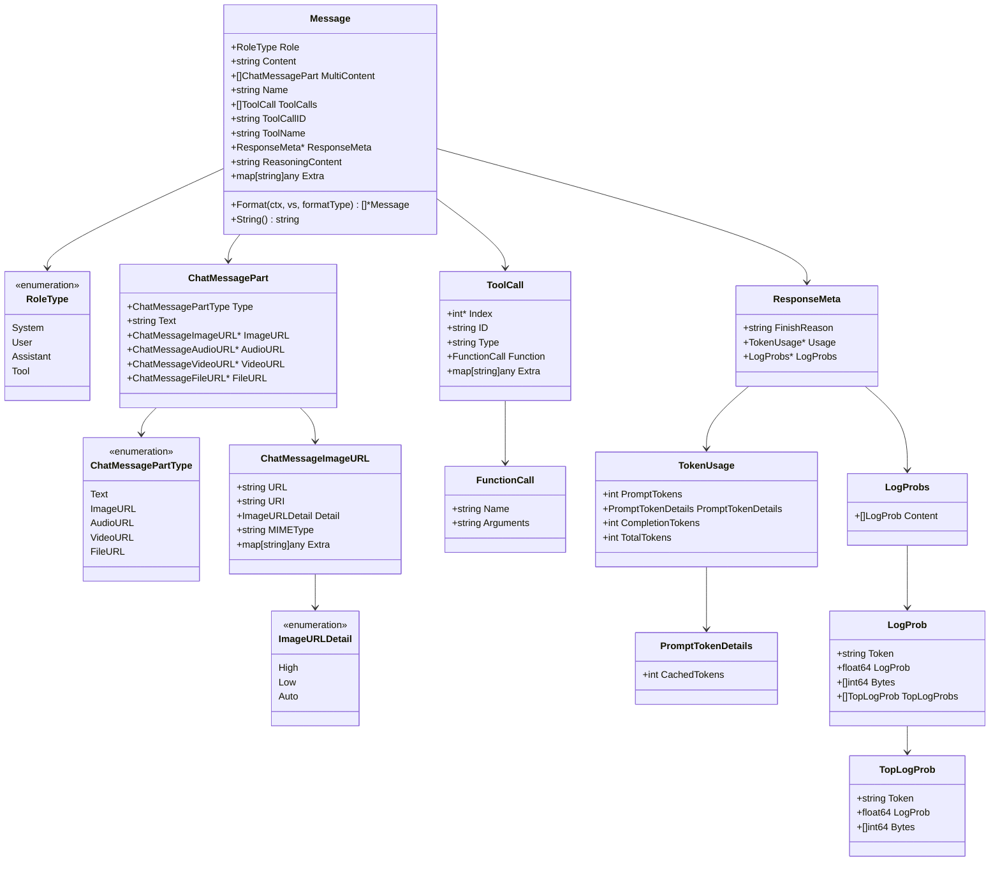
```mermaid
classDiagram
    class Message {
        +RoleType Role
        +string Content
        +[]ChatMessagePart MultiContent
        +string Name
        +[]ToolCall ToolCalls
        +string ToolCallID
        +string ToolName
        +ResponseMeta* ResponseMeta
        +string ReasoningContent
        +map[string]any Extra
        +Format(ctx, vs, formatType) []*Message
        +String() string
    }

    class RoleType {
        <<enumeration>>
        System
        User
        Assistant
        Tool
    }

    class ChatMessagePart {
        +ChatMessagePartType Type
        +string Text
        +ChatMessageImageURL* ImageURL
        +ChatMessageAudioURL* AudioURL
        +ChatMessageVideoURL* VideoURL
        +ChatMessageFileURL* FileURL
    }

    class ChatMessagePartType {
        <<enumeration>>
        Text
        ImageURL
        AudioURL
        VideoURL
        FileURL
    }

    class ChatMessageImageURL {
        +string URL
        +string URI
        +ImageURLDetail Detail
        +string MIMEType
        +map[string]any Extra
    }

    class ImageURLDetail {
        <<enumeration>>
        High
        Low
        Auto
    }

    class ToolCall {
        +int* Index
        +string ID
        +string Type
        +FunctionCall Function
        +map[string]any Extra
    }

    class FunctionCall {
        +string Name
        +string Arguments
    }

    class ResponseMeta {
        +string FinishReason
        +TokenUsage* Usage
        +LogProbs* LogProbs
    }

    class TokenUsage {
        +int PromptTokens
        +PromptTokenDetails PromptTokenDetails
        +int CompletionTokens
        +int TotalTokens
    }

    class PromptTokenDetails {
        +int CachedTokens
    }

    class LogProbs {
        +[]LogProb Content
    }

    class LogProb {
        +string Token
        +float64 LogProb
        +[]int64 Bytes
        +[]TopLogProb TopLogProbs
    }

    class TopLogProb {
        +string Token
        +float64 LogProb
        +[]int64 Bytes
    }

    Message --> RoleType
    Message --> ChatMessagePart
    Message --> ToolCall
    Message --> ResponseMeta
    
    ChatMessagePart --> ChatMessagePartType
    ChatMessagePart --> ChatMessageImageURL
    
    ChatMessageImageURL --> ImageURLDetail
    
    ToolCall --> FunctionCall
    
    ResponseMeta --> TokenUsage
    ResponseMeta --> LogProbs
    
    TokenUsage --> PromptTokenDetails
    
    LogProbs --> LogProb
    LogProb --> TopLogProb
```

### 1.2 Message 字段详解

#### 1.2.1 核心字段

| 字段名 | 类型 | 必填 | 说明 | 约束 |
|-------|------|------|------|------|
| Role | RoleType | 是 | 消息角色 | system/user/assistant/tool |
| Content | string | 否 | 文本内容 | 优先级低于 MultiContent |
| MultiContent | []ChatMessagePart | 否 | 多模态内容 | 支持文本、图片、音频等 |
| Name | string | 否 | 消息名称 | 用于区分不同的发送者 |

**字段约束与语义**：

- **Role**:
  - `system`: 系统消息，设置AI行为规则
  - `user`: 用户消息，表示用户输入
  - `assistant`: 助手消息，表示AI回复
  - `tool`: 工具消息，表示工具执行结果

- **Content vs MultiContent**:
  - 通常只使用一个
  - MultiContent 非空时优先使用 MultiContent
  - MultiContent 支持多模态内容（文本+图片等）

#### 1.2.2 工具调用字段

| 字段名 | 类型 | 必填 | 说明 | 约束 |
|-------|------|------|------|------|
| ToolCalls | []ToolCall | 否 | 工具调用列表 | 仅 assistant 消息使用 |
| ToolCallID | string | 否 | 工具调用ID | 仅 tool 消息使用，关联 ToolCall.ID |
| ToolName | string | 否 | 工具名称 | 仅 tool 消息使用 |

**字段语义**：

- **ToolCalls**: Assistant 消息中包含需要执行的工具调用
- **ToolCallID**: Tool 消息通过此字段关联到对应的 ToolCall
- **ToolName**: 明确标识哪个工具返回了结果

**使用场景**：

```go
// Assistant 消息包含工具调用
assistantMsg := &schema.Message{
    Role: schema.Assistant,
    Content: "让我查询一下天气",
    ToolCalls: []schema.ToolCall{
        {
            ID: "call-123",
            Type: "function",
            Function: schema.FunctionCall{
                Name: "get_weather",
                Arguments: `{"city":"Beijing"}`,
            },
        },
    },
}

// Tool 消息返回工具执行结果
toolMsg := &schema.Message{
    Role: schema.Tool,
    Content: "北京今天晴天，25度",
    ToolCallID: "call-123",  // 关联到 assistantMsg.ToolCalls[0].ID
    ToolName: "get_weather",
}
```

#### 1.2.3 元信息字段

| 字段名 | 类型 | 必填 | 说明 | 约束 |
|-------|------|------|------|------|
| ResponseMeta | *ResponseMeta | 否 | 响应元信息 | 包含 token 使用量、结束原因等 |
| ReasoningContent | string | 否 | 推理过程内容 | 部分模型（如 o1）返回的思考过程 |
| Extra | map[string]any | 否 | 扩展字段 | 存储模型特定的额外信息 |

**ResponseMeta 详解**：

```go
type ResponseMeta struct {
    FinishReason string       // 结束原因：stop/length/tool_calls/content_filter
    Usage        *TokenUsage  // Token 使用量统计
    LogProbs     *LogProbs    // 对数概率信息
}

type TokenUsage struct {
    PromptTokens      int                // 输入 token 数
    PromptTokenDetails PromptTokenDetails // 输入 token 详情
    CompletionTokens  int                // 输出 token 数
    TotalTokens       int                // 总 token 数
}
```

**使用示例**：

```go
// 查看 token 使用量
response, _ := chatModel.Generate(ctx, messages)
if response.ResponseMeta != nil && response.ResponseMeta.Usage != nil {
    fmt.Printf("输入 tokens: %d\n", response.ResponseMeta.Usage.PromptTokens)
    fmt.Printf("输出 tokens: %d\n", response.ResponseMeta.Usage.CompletionTokens)
    fmt.Printf("总计 tokens: %d\n", response.ResponseMeta.Usage.TotalTokens)
}

// 查看结束原因
if response.ResponseMeta != nil {
    switch response.ResponseMeta.FinishReason {
    case "stop":
        // 正常结束
    case "length":
        // 达到最大长度
    case "tool_calls":
        // 需要调用工具
    case "content_filter":
        // 被内容过滤拦截
    }
}
```

### 1.3 Message 方法详解

#### 1.3.1 Format 方法

**功能**: 使用模板变量渲染消息内容

**签名**:

```go
func (m *Message) Format(ctx context.Context, vs map[string]any, formatType FormatType) ([]*Message, error)
```

**实现要点**:

- 支持三种模板格式（FString/GoTemplate/Jinja2）
- 同时渲染 Content 和 MultiContent 中的文本
- 返回新的 Message，不修改原对象

#### 1.3.2 String 方法

**功能**: 返回消息的字符串表示

**签名**:

```go
func (m *Message) String() string
```

**输出格式**:

```
<role>: <content>
reasoning content: <reasoning_content>
tool_calls:
  <tool_call_1>
  <tool_call_2>
tool_call_id: <tool_call_id>
finish_reason: <finish_reason>
usage: <token_usage>
```

---

## 2. StreamReader/StreamWriter 数据结构

### 2.1 Stream 类图

```mermaid
classDiagram
    class StreamReader~T~ {
        -readerType typ
        -stream~T~* st
        -arrayReader~T~* ar
        -multiStreamReader~T~* msr
        -streamReaderWithConvert~T~* srw
        -childStreamReader~T~* csr
        +Recv() (T, error)
        +Close()
        +Copy(n int) []*StreamReader~T~
        +SetAutomaticClose()
    }

    class StreamWriter~T~ {
        -stream~T~* stm
        +Send(chunk T, err error) bool
        +Close()
    }

    class stream~T~ {
        -chan streamItem~T~ items
        -chan struct{} closed
        -bool automaticClose
        -*uint32 closedFlag
        +recv() (T, error)
        +send(chunk T, err error) bool
        +closeSend()
        +closeRecv()
    }

    class streamItem~T~ {
        +T chunk
        +error err
    }

    class arrayReader~T~ {
        -[]T arr
        -int index
        +recv() (T, error)
        +copy(n int) []*arrayReader~T~
    }

    class multiStreamReader~T~ {
        -[]*stream~T~ sts
        -[]reflect.SelectCase itemsCases
        -[]int nonClosed
        -[]string sourceReaderNames
        +recv() (T, error)
        +close()
    }

    class streamReaderWithConvert~T~ {
        -iStreamReader sr
        -func(any)(T, error) convert
        +recv() (T, error)
        +close()
    }

    class childStreamReader~T~ {
        -*parentStreamReader~T~ parent
        -int index
        +recv() (T, error)
        +close()
    }

    class parentStreamReader~T~ {
        -*StreamReader~T~ sr
        -[]*cpStreamElement~T~ subStreamList
        -uint32 closedNum
        +peek(idx int) (T, error)
        +close(idx int)
    }

    class cpStreamElement~T~ {
        -sync.Once once
        -*cpStreamElement~T~ next
        -streamItem~T~ item
    }

    class readerType {
        <<enumeration>>
        readerTypeStream
        readerTypeArray
        readerTypeMultiStream
        readerTypeWithConvert
        readerTypeChild
    }

    StreamReader~T~ --> readerType
    StreamReader~T~ --> stream~T~
    StreamReader~T~ --> arrayReader~T~
    StreamReader~T~ --> multiStreamReader~T~
    StreamReader~T~ --> streamReaderWithConvert~T~
    StreamReader~T~ --> childStreamReader~T~

    StreamWriter~T~ --> stream~T~
    stream~T~ --> streamItem~T~
    
    multiStreamReader~T~ --> stream~T~
    streamReaderWithConvert~T~ --> StreamReader~T~
    childStreamReader~T~ --> parentStreamReader~T~
    parentStreamReader~T~ --> StreamReader~T~
    parentStreamReader~T~ --> cpStreamElement~T~
    cpStreamElement~T~ --> streamItem~T~
```

### 2.2 StreamReader 实现类型

#### 2.2.1 stream (基础流)

**结构**:

```go
type stream[T any] struct {
    items  chan streamItem[T] // 数据通道，带缓冲
    closed chan struct{}      // 关闭信号通道
    
    automaticClose bool     // 是否启用自动关闭
    closedFlag     *uint32  // 关闭标志（仅用于自动关闭）
}

type streamItem[T any] struct {
    chunk T       // 数据块
    err   error   // 错误（可选）
}
```

**特点**:

- 基于 channel 实现
- 1 个发送者，1 个接收者
- 支持缓冲区
- 支持自动关闭（GC 时）

**内存占用**:

```
sizeof(stream[T]) =
    sizeof(chan streamItem[T]) +  // 约 24 bytes
    sizeof(chan struct{}) +        // 约 24 bytes
    sizeof(bool) +                 // 1 byte
    sizeof(*uint32)                // 8 bytes
    = 约 57 bytes + 缓冲区
    
缓冲区内存 = cap × sizeof(streamItem[T])
           = cap × (sizeof(T) + sizeof(error))
```

#### 2.2.2 arrayReader (数组读取器)

**结构**:

```go
type arrayReader[T any] struct {
    arr   []T    // 源数组
    index int    // 当前索引
}
```

**特点**:

- 无 goroutine 开销
- 内存占用小
- 适合测试和小数据量场景

**内存占用**:

```
sizeof(arrayReader[T]) =
    sizeof([]T) +   // 24 bytes (slice header)
    sizeof(int)     // 8 bytes
    = 32 bytes
```

#### 2.2.3 multiStreamReader (多流合并)

**结构**:

```go
type multiStreamReader[T any] struct {
    sts               []*stream[T]           // 源流数组
    itemsCases        []reflect.SelectCase   // 用于 reflect.Select
    nonClosed         []int                  // 未关闭的流索引
    sourceReaderNames []string               // 源流名称（可选）
}
```

**特点**:

- 使用 reflect.Select 从多个 channel 读取
- 流数量 ≤ 10 时性能好
- 流数量 > 10 时性能下降

**性能特征**:
| 流数量 | 实现方式 | 性能 |
|-------|---------|------|
| ≤ 10 | 优化的 receiveN | 好 |
| > 10 | reflect.Select | 中等 |

#### 2.2.4 streamReaderWithConvert (转换流)

**结构**:

```go
type streamReaderWithConvert[T any] struct {
    sr      iStreamReader          // 原流
    convert func(any) (T, error)   // 转换函数
}
```

**特点**:

- 懒惰求值（按需转换）
- 支持过滤（返回 ErrNoValue 跳过）
- 无额外 goroutine

#### 2.2.5 childStreamReader (子流)

**结构**:

```go
type childStreamReader[T any] struct {
    parent *parentStreamReader[T]  // 父读取器
    index  int                      // 子流索引
}

type parentStreamReader[T any] struct {
    sr            *StreamReader[T]       // 原流
    subStreamList []*cpStreamElement[T]  // 子流链表
    closedNum     uint32                 // 已关闭的子流数量
}

type cpStreamElement[T any] struct {
    once sync.Once               // 确保只读取一次
    next *cpStreamElement[T]     // 下一个元素
    item streamItem[T]           // 数据
}
```

**特点**:

- Copy 创建时使用
- 共享链表结构，不复制数据
- sync.Once 确保原流只读取一次
- 每个子流独立维护读取位置

**内存模型**:

```
原流: [chunk1] -> [chunk2] -> [chunk3] -> ...
        ↓           ↓           ↓
子流1:  idx=0       idx=1       idx=2
子流2:  idx=0       idx=1       idx=2
子流3:  idx=0       idx=1       idx=2

链表结构:
elem0 -> elem1 -> elem2 -> ...
  ↑        ↑        ↑
读取位置分别由各子流维护
```

---

## 3. ToolInfo 数据结构

### 3.1 ToolInfo 类图

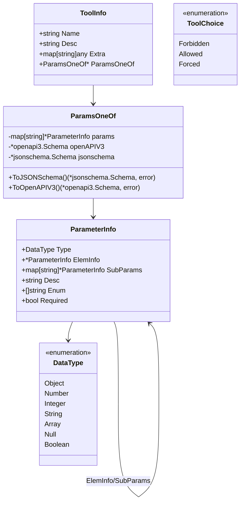
```mermaid
classDiagram
    class ToolInfo {
        +string Name
        +string Desc
        +map[string]any Extra
        +ParamsOneOf* ParamsOneOf
    }

    class ParamsOneOf {
        -map[string]*ParameterInfo params
        -*openapi3.Schema openAPIV3
        -*jsonschema.Schema jsonschema
        +ToJSONSchema() (*jsonschema.Schema, error)
        +ToOpenAPIV3() (*openapi3.Schema, error)
    }

    class ParameterInfo {
        +DataType Type
        +*ParameterInfo ElemInfo
        +map[string]*ParameterInfo SubParams
        +string Desc
        +[]string Enum
        +bool Required
    }

    class DataType {
        <<enumeration>>
        Object
        Number
        Integer
        String
        Array
        Null
        Boolean
    }

    class ToolChoice {
        <<enumeration>>
        Forbidden
        Allowed
        Forced
    }

    ToolInfo --> ParamsOneOf
    ParamsOneOf --> ParameterInfo
    ParameterInfo --> DataType
    ParameterInfo --> ParameterInfo : ElemInfo/SubParams
```

### 3.2 ToolInfo 字段详解

| 字段名 | 类型 | 必填 | 说明 | 约束 |
|-------|------|------|------|------|
| Name | string | 是 | 工具名称 | 唯一标识，建议使用 snake_case |
| Desc | string | 是 | 工具描述 | 清晰描述用途、使用场景、示例 |
| Extra | map[string]any | 否 | 扩展信息 | 存储模型特定的额外信息 |
| ParamsOneOf | *ParamsOneOf | 否 | 参数定义 | nil 表示无参数 |

### 3.3 ParameterInfo 详解

#### 3.3.1 基础类型

**String 类型**:

```go
&ParameterInfo{
    Type:     schema.String,
    Desc:     "城市名称",
    Required: true,
}
```

**Number/Integer 类型**:

```go
&ParameterInfo{
    Type:     schema.Number,
    Desc:     "温度值",
    Required: false,
}
```

**Boolean 类型**:

```go
&ParameterInfo{
    Type:     schema.Boolean,
    Desc:     "是否启用",
    Required: false,
}
```

#### 3.3.2 复合类型

**Array 类型**:

```go
&ParameterInfo{
    Type: schema.Array,
    Desc: "标签列表",
    ElemInfo: &ParameterInfo{
        Type: schema.String,
        Desc: "标签",
    },
    Required: false,
}
```

**Object 类型**:

```go
&ParameterInfo{
    Type: schema.Object,
    Desc: "用户信息",
    SubParams: map[string]*ParameterInfo{
        "name": {
            Type:     schema.String,
            Desc:     "姓名",
            Required: true,
        },
        "age": {
            Type:     schema.Integer,
            Desc:     "年龄",
            Required: false,
        },
    },
    Required: true,
}
```

#### 3.3.3 枚举类型

**Enum 约束** (仅用于 String 类型):

```go
&ParameterInfo{
    Type:     schema.String,
    Desc:     "温度单位",
    Enum:     []string{"celsius", "fahrenheit", "kelvin"},
    Required: false,
}
```

### 3.4 ParamsOneOf 详解

#### 3.4.1 三种定义方式

**方式 1: 使用 ParameterInfo（推荐）**:

```go
params := schema.NewParamsOneOfByParams(map[string]*ParameterInfo{
    "city": {
        Type:     schema.String,
        Desc:     "城市名称",
        Required: true,
    },
    "unit": {
        Type:     schema.String,
        Desc:     "温度单位",
        Enum:     []string{"celsius", "fahrenheit"},
        Required: false,
    },
})
```

**方式 2: 使用 JSONSchema**:

```go
jsonSchema := &jsonschema.Schema{
    Type: "object",
    Properties: orderedmap.New[string, *jsonschema.Schema](),
    Required: []string{"city"},
}
jsonSchema.Properties.Set("city", &jsonschema.Schema{
    Type:        "string",
    Description: "城市名称",
})

params := schema.NewParamsOneOfByJSONSchema(jsonSchema)
```

**方式 3: 使用 OpenAPIV3（已废弃）**:

```go
// 不推荐使用
openAPIV3 := &openapi3.Schema{
    Type: "object",
    Properties: map[string]*openapi3.SchemaRef{
        "city": {
            Value: &openapi3.Schema{
                Type:        "string",
                Description: "城市名称",
            },
        },
    },
    Required: []string{"city"},
}

params := schema.NewParamsOneOfByOpenAPIV3(openAPIV3)
```

#### 3.4.2 转换方法

**转换为 JSONSchema**:

```go
jsonSchema, err := params.ToJSONSchema()
if err != nil {
    // 处理错误
}
```

**转换为 OpenAPIV3（已废弃）**:

```go
openAPIV3, err := params.ToOpenAPIV3()
if err != nil {
    // 处理错误
}
```

---

## 4. Document 数据结构

### 4.1 Document 类图

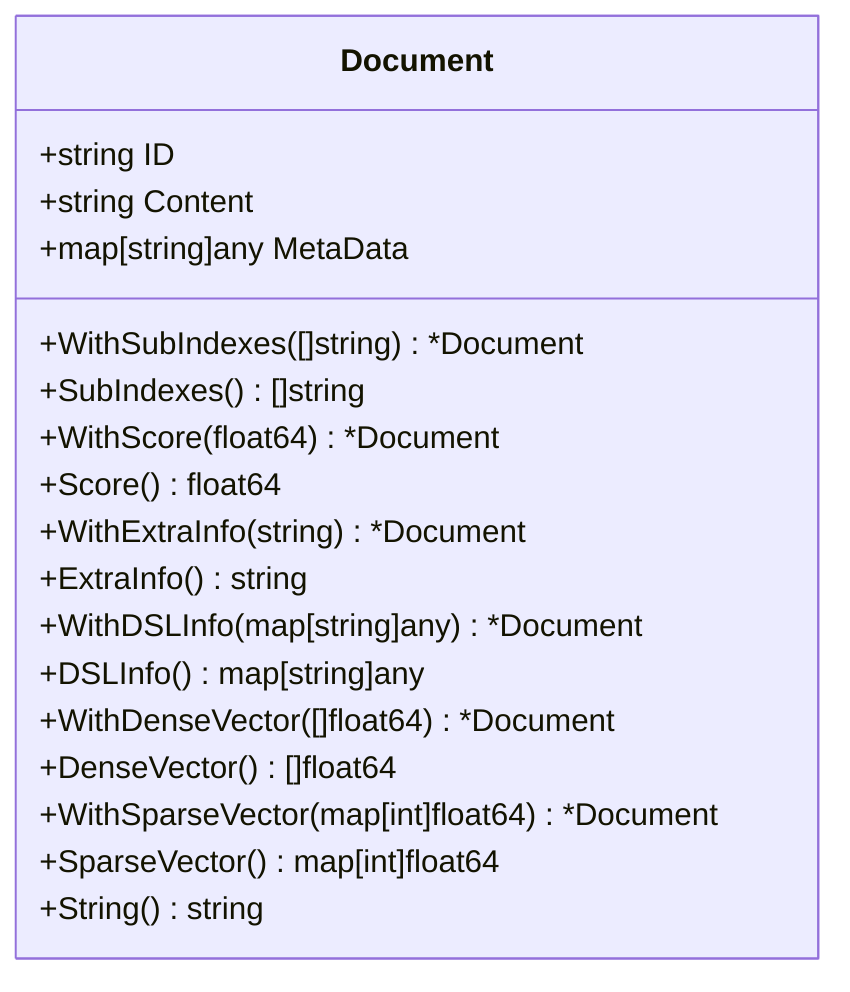
```mermaid
classDiagram
    class Document {
        +string ID
        +string Content
        +map[string]any MetaData
        +WithSubIndexes([]string) *Document
        +SubIndexes() []string
        +WithScore(float64) *Document
        +Score() float64
        +WithExtraInfo(string) *Document
        +ExtraInfo() string
        +WithDSLInfo(map[string]any) *Document
        +DSLInfo() map[string]any
        +WithDenseVector([]float64) *Document
        +DenseVector() []float64
        +WithSparseVector(map[int]float64) *Document
        +SparseVector() map[int]float64
        +String() string
    }
```

### 4.2 Document 字段详解

| 字段名 | 类型 | 必填 | 说明 | 约束 |
|-------|------|------|------|------|
| ID | string | 是 | 文档唯一标识 | 唯一 |
| Content | string | 是 | 文档内容 | 通常为文本 |
| MetaData | map[string]any | 否 | 元数据 | 存储任意扩展信息 |

### 4.3 元数据字段

Document 通过 MetaData 存储扩展信息，框架提供了便捷方法访问常用字段：

| 元数据键 | 类型 | 说明 | 设置方法 | 获取方法 |
|---------|------|------|---------|---------|
| _sub_indexes | []string | 子索引列表 | WithSubIndexes | SubIndexes |
| _score | float64 | 相关性评分 | WithScore | Score |
| _extra_info | string | 额外信息 | WithExtraInfo | ExtraInfo |
| _dsl | map[string]any | DSL 查询信息 | WithDSLInfo | DSLInfo |
| _dense_vector | []float64 | 密集向量 | WithDenseVector | DenseVector |
| _sparse_vector | map[int]float64 | 稀疏向量 | WithSparseVector | SparseVector |

### 4.4 Document 使用示例

```go
// 创建文档
doc := &schema.Document{
    ID:      "doc-001",
    Content: "Eino 是一个 Go 语言的 LLM 应用开发框架",
    MetaData: map[string]any{
        "source":      "官方文档",
        "author":      "CloudWeGo",
        "created_at":  time.Now(),
        "category":    "技术文档",
    },
}

// 设置评分（检索时）
doc.WithScore(0.95)

// 设置向量（向量检索时）
doc.WithDenseVector([]float64{0.1, 0.2, 0.3, 0.4, 0.5})

// 设置子索引
doc.WithSubIndexes([]string{"index1", "index2"})

// 读取元数据
score := doc.Score()           // 0.95
vector := doc.DenseVector()    // [0.1, 0.2, 0.3, 0.4, 0.5]
indexes := doc.SubIndexes()    // ["index1", "index2"]
```

---

## 5. 数据结构之间的关系

### 5.1 Message 与 ToolInfo 的关系

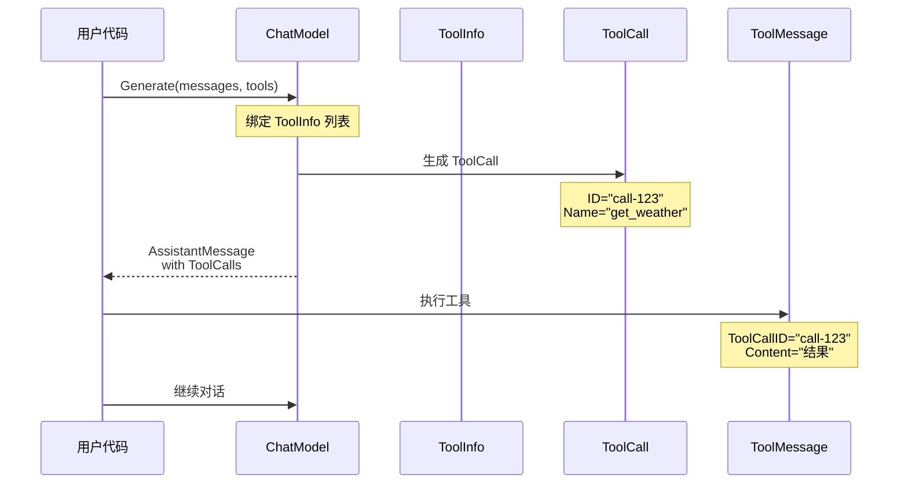
```mermaid
sequenceDiagram
    participant User as 用户代码
    participant Model as ChatModel
    participant ToolInfo as ToolInfo
    participant ToolCall as ToolCall
    participant ToolMsg as ToolMessage

    User->>Model: Generate(messages, tools)
    Note over Model: 绑定 ToolInfo 列表
    Model->>ToolCall: 生成 ToolCall
    Note over ToolCall: ID="call-123"<br/>Name="get_weather"
    Model-->>User: AssistantMessage<br/>with ToolCalls
    
    User->>ToolMsg: 执行工具
    Note over ToolMsg: ToolCallID="call-123"<br/>Content="结果"
    User->>Model: 继续对话
```

**关系说明**:

1. ToolInfo 定义工具的元信息（名称、描述、参数）
2. ChatModel 使用 ToolInfo 生成 ToolCall
3. ToolCall 包含在 AssistantMessage 中
4. ToolMessage 通过 ToolCallID 关联 ToolCall
5. ToolMessage 返回给 ChatModel 继续对话

### 5.2 Message 与 Stream 的关系

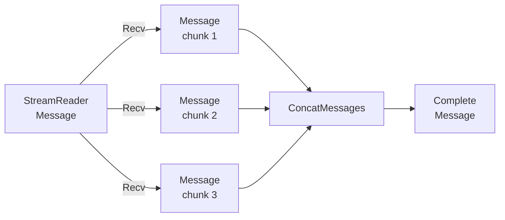
```mermaid
flowchart LR
    A[StreamReader<br/>Message] -->|Recv| B[Message<br/>chunk 1]
    A -->|Recv| C[Message<br/>chunk 2]
    A -->|Recv| D[Message<br/>chunk 3]
    
    B --> E[ConcatMessages]
    C --> E
    D --> E
    
    E --> F[Complete<br/>Message]
```

**关系说明**:

- StreamReader[*Message] 表示消息流
- 通过 Recv() 逐个接收 Message chunk
- 使用 ConcatMessages 拼接为完整 Message

### 5.3 Document 与 Message 的转换

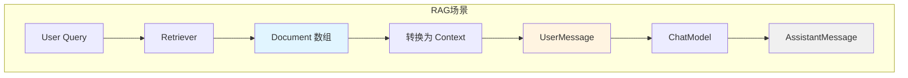
```mermaid
flowchart TB
    subgraph RAG场景
        A[User Query] --> B[Retriever]
        B --> C[Document 数组]
        C --> D[转换为 Context]
        D --> E[UserMessage]
        E --> F[ChatModel]
        F --> G[AssistantMessage]
    end
    
    style C fill:#e1f5ff
    style E fill:#fff4e1
    style G fill:#f0f0f0
```

**关系说明**:

- Document 用于存储检索结果
- 转换为 Context 字符串
- 嵌入到 UserMessage 中
- 传递给 ChatModel

---

## 6. 数据结构版本演进

### 6.1 已废弃的字段/方法

| 结构 | 字段/方法 | 废弃原因 | 替代方案 |
|------|----------|---------|---------|
| ParamsOneOf | ToOpenAPIV3() | 不推荐 OpenAPIV3 | 使用 ToJSONSchema() |
| ParamsOneOf | NewParamsOneOfByOpenAPIV3() | 同上 | 使用 NewParamsOneOfByJSONSchema() |
| ChatModel | BindTools() | 并发不安全 | 使用 WithTools() |

### 6.2 新增的字段

**Message**:

- `ReasoningContent`: 支持推理模型（如 o1）的思考过程
- `PromptTokenDetails.CachedTokens`: 支持 prompt 缓存

**ToolCall**:

- `Extra`: 存储模型特定的扩展信息

**ChatMessagePart**:

- 新增多种多模态类型（AudioURL、VideoURL、FileURL）

### 6.3 兼容性策略

**向后兼容**:

- 新增字段不影响旧代码
- 使用 JSON 序列化时忽略未知字段
- Extra 字段用于扩展，不影响核心逻辑

**迁移建议**:

```go
// 旧代码（使用 BindTools）
model.BindTools(tools)
response, _ := model.Generate(ctx, messages)

// 新代码（使用 WithTools）
modelWithTools, _ := model.WithTools(tools)
response, _ := modelWithTools.Generate(ctx, messages)
```

---

## 7. 数据结构最佳实践

### 7.1 Message 最佳实践

**创建消息**:

```go
// ✅ 推荐：使用工厂函数
msg := schema.UserMessage("Hello")

// ❌ 不推荐：手动构造
msg := &schema.Message{
    Role:    schema.User,
    Content: "Hello",
}
```

**处理多模态**:

```go
// ✅ 推荐：使用 MultiContent
msg := &schema.Message{
    Role: schema.User,
    MultiContent: []schema.ChatMessagePart{
        {Type: schema.ChatMessagePartTypeText, Text: "这是什么？"},
        {
            Type: schema.ChatMessagePartTypeImageURL,
            ImageURL: &schema.ChatMessageImageURL{
                URL: "https://example.com/image.jpg",
            },
        },
    },
}

// ❌ 不推荐：混用 Content 和 MultiContent
msg := &schema.Message{
    Role:    schema.User,
    Content: "这是什么？",  // 会被忽略
    MultiContent: []schema.ChatMessagePart{...},
}
```

### 7.2 StreamReader 最佳实践

**创建和关闭**:

```go
// ✅ 推荐：使用 defer 确保关闭
sr, sw := schema.Pipe[string](10)
defer sr.Close()
defer sw.Close()

// ❌ 不推荐：忘记关闭
sr, sw := schema.Pipe[string](10)
// 资源泄漏！
```

**复制流**:

```go
// ✅ 推荐：明确知道不再使用原流
readers := sr.Copy(3)
// sr 此时已失效

// ❌ 不推荐：Copy 后仍使用原流
readers := sr.Copy(3)
sr.Recv()  // 错误！sr 已失效
```

### 7.3 ToolInfo 最佳实践

**参数定义**:

```go
// ✅ 推荐：使用 ParameterInfo（简单直观）
params := schema.NewParamsOneOfByParams(map[string]*ParameterInfo{
    "city": {
        Type:     schema.String,
        Desc:     "城市名称，如北京、上海",
        Required: true,
    },
})

// ✅ 可选：使用 JSONSchema（复杂场景）
jsonSchema := &jsonschema.Schema{...}
params := schema.NewParamsOneOfByJSONSchema(jsonSchema)

// ❌ 不推荐：使用 OpenAPIV3（已废弃）
openAPIV3 := &openapi3.Schema{...}
params := schema.NewParamsOneOfByOpenAPIV3(openAPIV3)
```

**工具描述**:

```go
// ✅ 推荐：详细的描述和示例
tool := &schema.ToolInfo{
    Name: "get_weather",
    Desc: `获取指定城市的天气信息。

使用场景：

- 用户询问某个城市的天气
- 用户询问是否需要带伞、穿什么衣服等

示例：

- "北京今天天气怎么样？" -> 调用 get_weather(city="北京")
- "上海会下雨吗？" -> 调用 get_weather(city="上海")`,
    ParamsOneOf: params,

}

// ❌ 不推荐：模糊的描述
tool := &schema.ToolInfo{
    Name: "get_weather",
    Desc: "查天气",  // 太简单，模型难以理解
}
```

### 7.4 Document 最佳实践

**元数据管理**:

```go
// ✅ 推荐：使用辅助方法
doc.WithScore(0.95)
doc.WithDenseVector(embedding)

// ❌ 不推荐：直接操作 MetaData
doc.MetaData["_score"] = 0.95  // 容易拼错键名
```

**自定义元数据**:

```go
// ✅ 推荐：使用有意义的键名
doc.MetaData = map[string]any{
    "source":      "官方文档",
    "author":      "CloudWeGo",
    "created_at":  time.Now(),
    "category":    "技术",
    "version":     "v1.0",
}

// ❌ 不推荐：使用模糊的键名
doc.MetaData = map[string]any{
    "data1": "some value",
    "info":  "something",
}
```

---

**文档版本**: v1.0  
**最后更新**: 2024-12-19  
**适用 Eino 版本**: main 分支（最新版本）

---

## 时序图

本文档通过时序图展示 Schema 模块在典型场景下的调用流程和数据流转。

---

## 1. 消息处理时序

### 1.1 创建和格式化消息

#### 1.1.1 基本消息创建流程

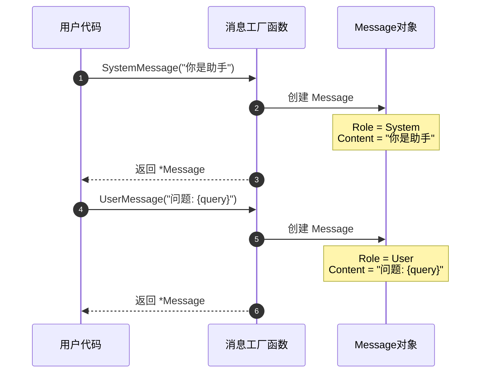
```mermaid
sequenceDiagram
    autonumber
    participant User as 用户代码
    participant Factory as 消息工厂函数
    participant Msg as Message对象

    User->>Factory: SystemMessage("你是助手")
    Factory->>Msg: 创建 Message
    Note over Msg: Role = System<br/>Content = "你是助手"
    Factory-->>User: 返回 *Message

    User->>Factory: UserMessage("问题: {query}")
    Factory->>Msg: 创建 Message
    Note over Msg: Role = User<br/>Content = "问题: {query}"
    Factory-->>User: 返回 *Message
```

**流程说明**:

1. 用户调用工厂函数（SystemMessage、UserMessage 等）
2. 工厂函数内部创建 Message 结构体
3. 设置对应的 Role 和 Content
4. 返回 Message 指针

**关键点**:

- 工厂函数不做复杂逻辑，仅创建结构体
- Content 可以包含模板变量（如 `{query}`）
- 创建的 Message 是不可变的（按惯例）

---

#### 1.1.2 消息模板渲染流程

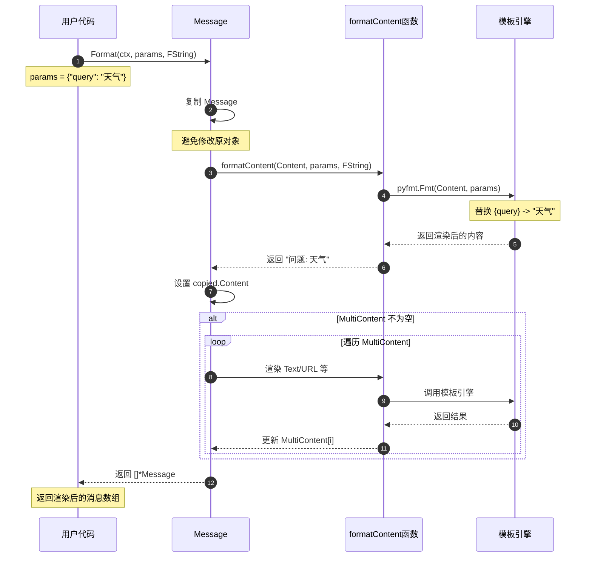
```mermaid
sequenceDiagram
    autonumber
    participant User as 用户代码
    participant Msg as Message
    participant Format as formatContent函数
    participant Engine as 模板引擎
    
    User->>Msg: Format(ctx, params, FString)
    Note over User: params = {"query": "天气"}

    Msg->>Msg: 复制 Message
    Note over Msg: 避免修改原对象

    Msg->>Format: formatContent(Content, params, FString)
    Format->>Engine: pyfmt.Fmt(Content, params)
    Note over Engine: 替换 {query} -> "天气"
    Engine-->>Format: 返回渲染后的内容
    Format-->>Msg: 返回 "问题: 天气"

    Msg->>Msg: 设置 copied.Content
    
    alt MultiContent 不为空
        loop 遍历 MultiContent
            Msg->>Format: 渲染 Text/URL 等
            Format->>Engine: 调用模板引擎
            Engine-->>Format: 返回结果
            Format-->>Msg: 更新 MultiContent[i]
        end
    end

    Msg-->>User: 返回 []*Message
    Note over User: 返回渲染后的消息数组
```

**流程说明**:

1. 用户调用 Message.Format() 传入参数和模板类型
2. Message 创建自身的副本（避免修改原对象）
3. 调用 formatContent 渲染 Content 字段
4. 根据 FormatType 选择模板引擎（pyfmt/template/gonja）
5. 模板引擎替换变量
6. 如果有 MultiContent，遍历渲染每个 Part
7. 返回渲染后的新 Message

**关键点**:

- Format 不修改原 Message
- 支持三种模板格式：FString/GoTemplate/Jinja2
- MultiContent 中的 Text 和 URL 字段都会被渲染

---

### 1.2 流式消息拼接

#### 1.2.1 接收和拼接流式消息

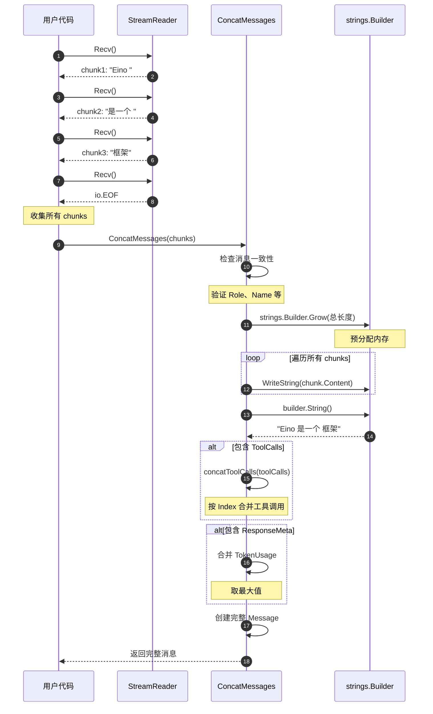
```mermaid
sequenceDiagram
    autonumber
    participant User as 用户代码
    participant Stream as StreamReader
    participant Concat as ConcatMessages
    participant Builder as strings.Builder

    User->>Stream: Recv()
    Stream-->>User: chunk1: "Eino "
    
    User->>Stream: Recv()
    Stream-->>User: chunk2: "是一个 "
    
    User->>Stream: Recv()
    Stream-->>User: chunk3: "框架"
    
    User->>Stream: Recv()
    Stream-->>User: io.EOF
    
    Note over User: 收集所有 chunks

    User->>Concat: ConcatMessages(chunks)
    
    Concat->>Concat: 检查消息一致性
    Note over Concat: 验证 Role、Name 等

    Concat->>Builder: strings.Builder.Grow(总长度)
    Note over Builder: 预分配内存

    loop 遍历所有 chunks
        Concat->>Builder: WriteString(chunk.Content)
    end

    Concat->>Builder: builder.String()
    Builder-->>Concat: "Eino 是一个 框架"

    alt 包含 ToolCalls
        Concat->>Concat: concatToolCalls(toolCalls)
        Note over Concat: 按 Index 合并工具调用
    end

    alt 包含 ResponseMeta
        Concat->>Concat: 合并 TokenUsage
        Note over Concat: 取最大值
    end

    Concat->>Concat: 创建完整 Message
    Concat-->>User: 返回完整消息
```

**流程说明**:

1. 用户循环调用 StreamReader.Recv() 接收消息块
2. 遇到 io.EOF 表示流结束
3. 调用 ConcatMessages 拼接所有块
4. 检查消息一致性（Role、Name 必须相同）
5. 使用 strings.Builder 高效拼接 Content
6. 合并 ToolCalls（按 Index 分组）
7. 合并 ResponseMeta（取最大值）
8. 返回完整的 Message

**性能优化**:

- strings.Builder.Grow() 预分配内存，避免多次重新分配
- 时间复杂度：O(n)，n 为总字符数
- 空间复杂度：O(n)

**边界条件**:

- 所有消息的 Role 必须相同
- 所有消息的 Name 必须相同（如果有）
- nil 消息会返回错误

---

#### 1.2.2 工具调用拼接流程

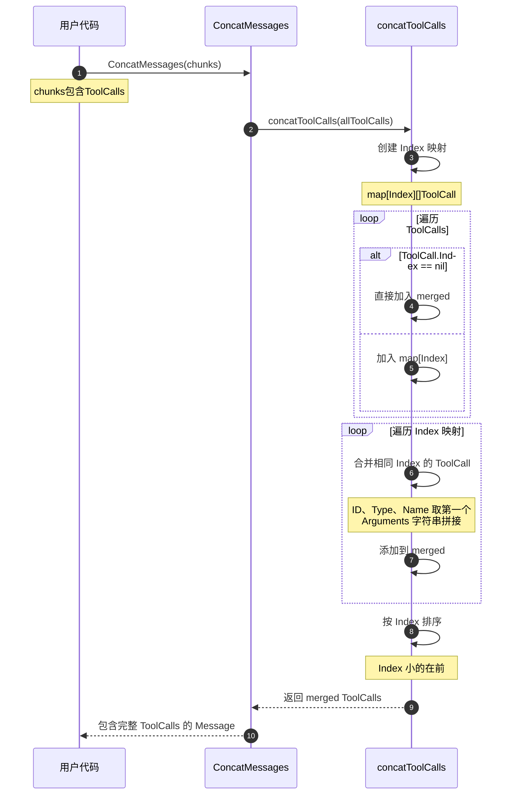
```mermaid
sequenceDiagram
    autonumber
    participant User as 用户代码
    participant Concat as ConcatMessages
    participant ToolFunc as concatToolCalls
    
    User->>Concat: ConcatMessages(chunks)
    Note over User: chunks包含ToolCalls

    Concat->>ToolFunc: concatToolCalls(allToolCalls)
    
    ToolFunc->>ToolFunc: 创建 Index 映射
    Note over ToolFunc: map[Index][]ToolCall

    loop 遍历 ToolCalls
        alt ToolCall.Index == nil
            ToolFunc->>ToolFunc: 直接加入 merged
        else
            ToolFunc->>ToolFunc: 加入 map[Index]
        end
    end

    loop 遍历 Index 映射
        ToolFunc->>ToolFunc: 合并相同 Index 的 ToolCall
        Note over ToolFunc: ID、Type、Name 取第一个<br/>Arguments 字符串拼接
        ToolFunc->>ToolFunc: 添加到 merged
    end

    ToolFunc->>ToolFunc: 按 Index 排序
    Note over ToolFunc: Index 小的在前

    ToolFunc-->>Concat: 返回 merged ToolCalls
    Concat-->>User: 包含完整 ToolCalls 的 Message
```

**流程说明**:

1. 提取所有 ToolCalls
2. 按 Index 分组（nil 的直接加入结果）
3. 相同 Index 的 ToolCall 合并：
   - ID、Type、Name 取第一个非空值
   - Arguments 字符串拼接
4. 按 Index 排序
5. 返回合并后的 ToolCalls

**关键点**:

- Index 用于流式模式下的 chunk 合并
- Arguments 是 JSON 字符串，直接拼接即可
- ID、Type、Name 应该在同一 Index 的所有 chunk 中一致

---

## 2. 流处理时序

### 2.1 创建和使用流

#### 2.1.1 Pipe 创建流

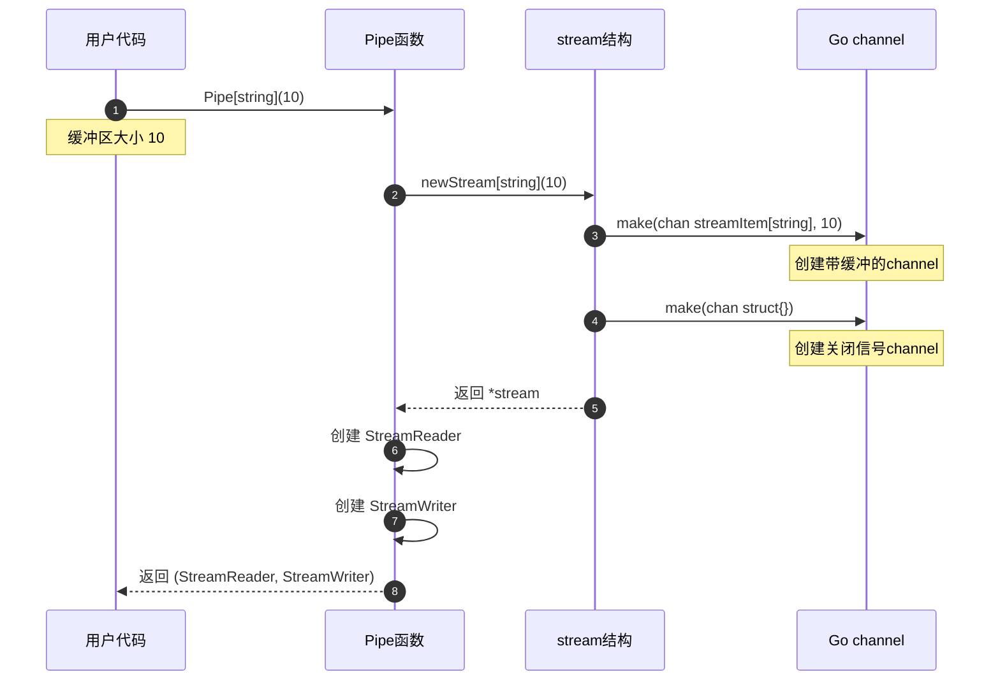
```mermaid
sequenceDiagram
    autonumber
    participant User as 用户代码
    participant Pipe as Pipe函数
    participant Stream as stream结构
    participant Channel as Go channel

    User->>Pipe: Pipe[string](10)
    Note over User: 缓冲区大小 10

    Pipe->>Stream: newStream[string](10)
    Stream->>Channel: make(chan streamItem[string], 10)
    Note over Channel: 创建带缓冲的channel

    Stream->>Channel: make(chan struct{})
    Note over Channel: 创建关闭信号channel

    Stream-->>Pipe: 返回 *stream

    Pipe->>Pipe: 创建 StreamReader
    Pipe->>Pipe: 创建 StreamWriter

    Pipe-->>User: 返回 (StreamReader, StreamWriter)
```

**流程说明**:

1. 用户调用 Pipe[T](cap) 创建流
2. 内部创建 stream 结构
3. 创建两个 channel：
   - items: 数据通道（带缓冲）
   - closed: 关闭信号通道
4. 包装为 StreamReader 和 StreamWriter
5. 返回给用户

**关键点**:

- items channel 的缓冲区大小影响性能
- closed channel 用于接收端通知发送端停止

---

#### 2.1.2 发送和接收数据

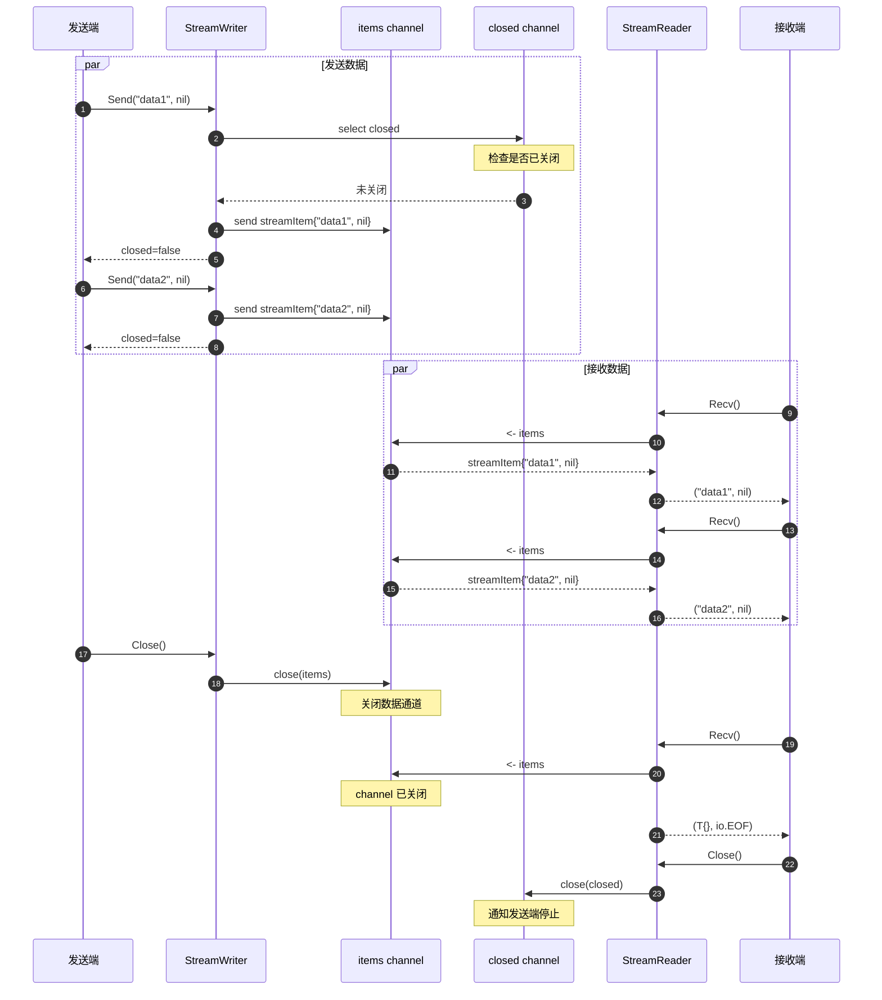
```mermaid
sequenceDiagram
    autonumber
    participant Sender as 发送端
    participant SW as StreamWriter
    participant Channel as items channel
    participant ClosedChan as closed channel
    participant SR as StreamReader
    participant Receiver as 接收端

    par 发送数据
        Sender->>SW: Send("data1", nil)
        SW->>ClosedChan: select closed
        Note over ClosedChan: 检查是否已关闭
        ClosedChan-->>SW: 未关闭
        SW->>Channel: send streamItem{"data1", nil}
        SW-->>Sender: closed=false
    
        Sender->>SW: Send("data2", nil)
        SW->>Channel: send streamItem{"data2", nil}
        SW-->>Sender: closed=false
    end

    par 接收数据
        Receiver->>SR: Recv()
        SR->>Channel: <- items
        Channel-->>SR: streamItem{"data1", nil}
        SR-->>Receiver: ("data1", nil)

        Receiver->>SR: Recv()
        SR->>Channel: <- items
        Channel-->>SR: streamItem{"data2", nil}
        SR-->>Receiver: ("data2", nil)
    end

    Sender->>SW: Close()
    SW->>Channel: close(items)
    Note over Channel: 关闭数据通道

    Receiver->>SR: Recv()
    SR->>Channel: <- items
    Note over Channel: channel 已关闭
    SR-->>Receiver: (T{}, io.EOF)

    Receiver->>SR: Close()
    SR->>ClosedChan: close(closed)
    Note over ClosedChan: 通知发送端停止
```

**流程说明**:

1. 发送端循环调用 Send()
2. Send() 先检查 closed channel（接收端是否关闭）
3. 如果未关闭，发送数据到 items channel
4. 接收端循环调用 Recv()
5. Recv() 从 items channel 读取数据
6. 发送端完成后调用 Close()，关闭 items channel
7. 接收端收到 io.EOF
8. 接收端调用 Close()，关闭 closed channel

**关键点**:

- 发送和接收可以并发进行
- 发送端必须 Close() 通知结束
- 接收端 Close() 可以提前通知发送端停止

---

### 2.2 流的复制

#### 2.2.1 Copy 创建子流

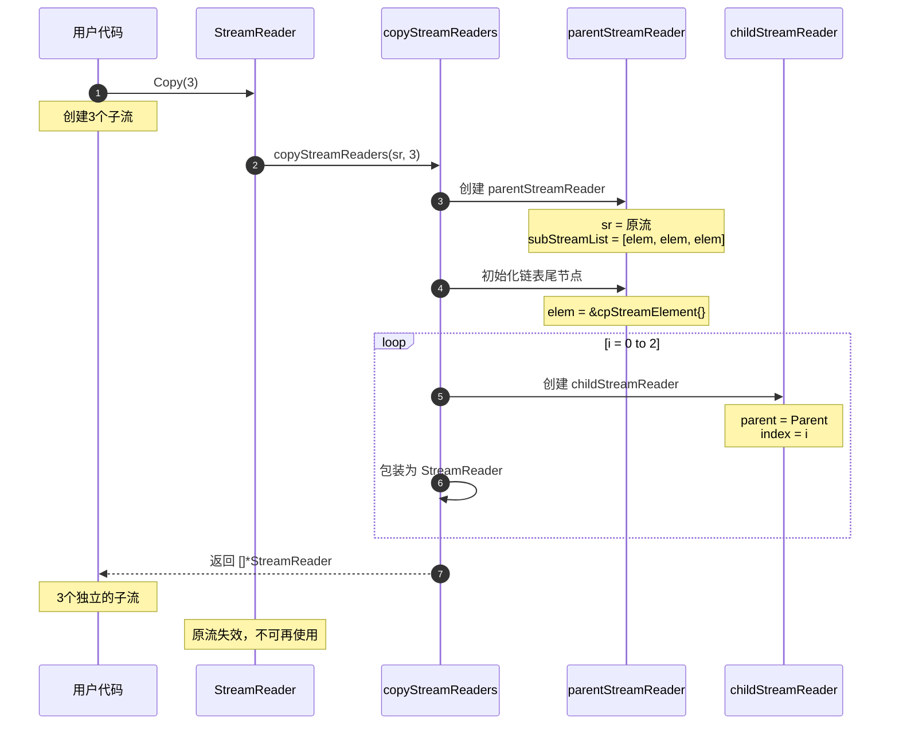
```mermaid
sequenceDiagram
    autonumber
    participant User as 用户代码
    participant SR as StreamReader
    participant Copy as copyStreamReaders
    participant Parent as parentStreamReader
    participant Child as childStreamReader

    User->>SR: Copy(3)
    Note over User: 创建3个子流

    SR->>Copy: copyStreamReaders(sr, 3)
    
    Copy->>Parent: 创建 parentStreamReader
    Note over Parent: sr = 原流<br/>subStreamList = [elem, elem, elem]

    Copy->>Parent: 初始化链表尾节点
    Note over Parent: elem = &cpStreamElement{}

    loop i = 0 to 2
        Copy->>Child: 创建 childStreamReader
        Note over Child: parent = Parent<br/>index = i
        Copy->>Copy: 包装为 StreamReader
    end

    Copy-->>User: 返回 []*StreamReader
    Note over User: 3个独立的子流

    Note over SR: 原流失效，不可再使用
```

**流程说明**:

1. 用户调用 StreamReader.Copy(n)
2. 创建 parentStreamReader 持有原流
3. 初始化 subStreamList（链表尾节点）
4. 创建 n 个 childStreamReader，每个持有：
   - parent 引用
   - 自己的 index
5. 原流失效

**内存结构**:

```
parentStreamReader
  ├─ sr: 原 StreamReader
  └─ subStreamList: [elem0, elem0, elem0]  (初始都指向同一尾节点)

3 个 childStreamReader:

  - child0: parent=Parent, index=0
  - child1: parent=Parent, index=1
  - child2: parent=Parent, index=2

```

---

#### 2.2.2 子流读取数据（懒加载）

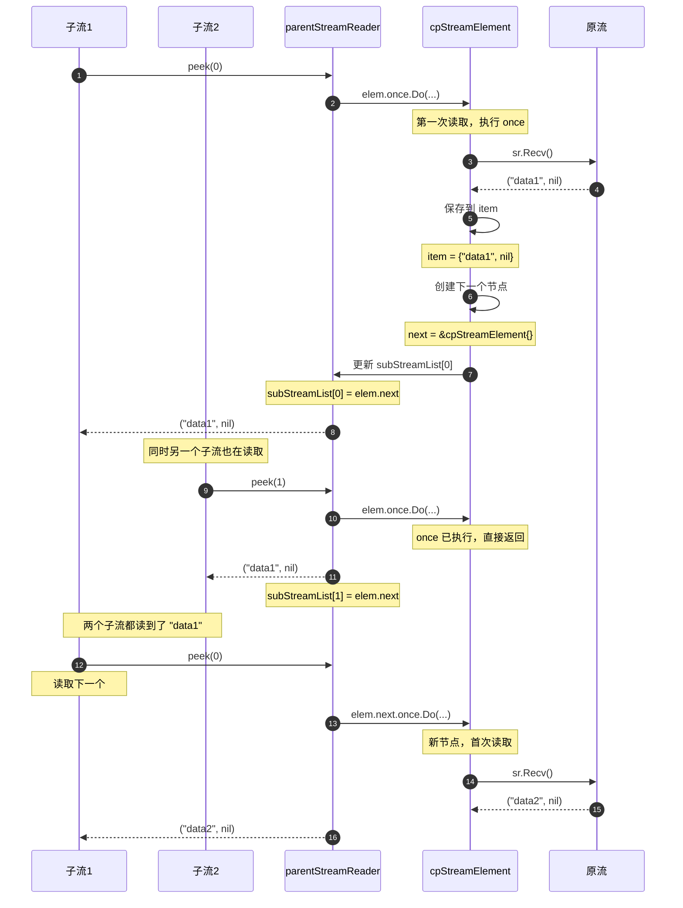
```mermaid
sequenceDiagram
    autonumber
    participant Child1 as 子流1
    participant Child2 as 子流2
    participant Parent as parentStreamReader
    participant Elem as cpStreamElement
    participant Origin as 原流

    Child1->>Parent: peek(0)
    Parent->>Elem: elem.once.Do(...)
    
    Note over Elem: 第一次读取，执行 once

    Elem->>Origin: sr.Recv()
    Origin-->>Elem: ("data1", nil)
    
    Elem->>Elem: 保存到 item
    Note over Elem: item = {"data1", nil}
    
    Elem->>Elem: 创建下一个节点
    Note over Elem: next = &cpStreamElement{}
    
    Elem->>Parent: 更新 subStreamList[0]
    Note over Parent: subStreamList[0] = elem.next

    Parent-->>Child1: ("data1", nil)

    Note over Child2: 同时另一个子流也在读取

    Child2->>Parent: peek(1)
    Parent->>Elem: elem.once.Do(...)
    Note over Elem: once 已执行，直接返回

    Parent-->>Child2: ("data1", nil)
    Note over Parent: subStreamList[1] = elem.next

    Note over Child1,Child2: 两个子流都读到了 "data1"

    Child1->>Parent: peek(0)
    Note over Child1: 读取下一个

    Parent->>Elem: elem.next.once.Do(...)
    Note over Elem: 新节点，首次读取

    Elem->>Origin: sr.Recv()
    Origin-->>Elem: ("data2", nil)

    Parent-->>Child1: ("data2", nil)
```

**流程说明**:

1. 子流调用 parent.peek(index)
2. parent 获取 subStreamList[index] 指向的节点
3. 使用 sync.Once 确保节点只从原流读取一次
4. 首次读取时：
   - 从原流 Recv()
   - 保存数据到 item
   - 创建下一个节点（next）
   - 更新 subStreamList[index] 指向 next
5. 后续子流读取同一节点时，直接返回 item

**关键点**:

- sync.Once 确保原流只读取一次
- 每个子流独立维护读取位置
- 数据通过链表共享，不复制

---

### 2.3 流的合并

#### 2.3.1 MergeStreamReaders 合并流程

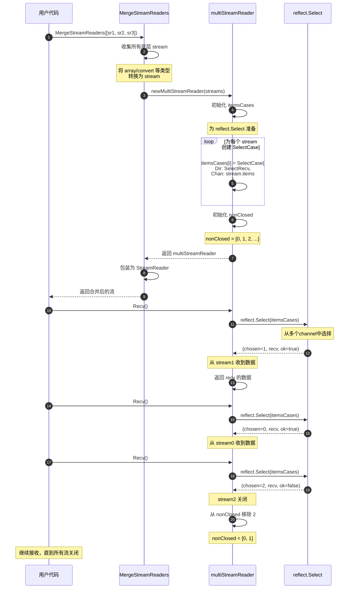
```mermaid
sequenceDiagram
    autonumber
    participant User as 用户代码
    participant Merge as MergeStreamReaders
    participant MSR as multiStreamReader
    participant Select as reflect.Select

    User->>Merge: MergeStreamReaders([sr1, sr2, sr3])
    
    Merge->>Merge: 收集所有底层 stream
    Note over Merge: 将 array/convert 等类型<br/>转换为 stream

    Merge->>MSR: newMultiStreamReader(streams)
    
    MSR->>MSR: 初始化 itemsCases
    Note over MSR: 为 reflect.Select 准备

    loop 为每个 stream 创建 SelectCase
        MSR->>MSR: itemsCases[i] = SelectCase{<br/>  Dir: SelectRecv,<br/>  Chan: stream.items<br/>}
    end

    MSR->>MSR: 初始化 nonClosed
    Note over MSR: nonClosed = [0, 1, 2, ...]

    MSR-->>Merge: 返回 multiStreamReader
    
    Merge->>Merge: 包装为 StreamReader
    Merge-->>User: 返回合并后的流

    User->>MSR: Recv()
    
    MSR->>Select: reflect.Select(itemsCases)
    Note over Select: 从多个channel中选择

    Select-->>MSR: (chosen=1, recv, ok=true)
    Note over MSR: 从 stream1 收到数据

    MSR->>MSR: 返回 recv 的数据

    User->>MSR: Recv()
    
    MSR->>Select: reflect.Select(itemsCases)
    Select-->>MSR: (chosen=0, recv, ok=true)
    Note over MSR: 从 stream0 收到数据

    User->>MSR: Recv()
    
    MSR->>Select: reflect.Select(itemsCases)
    Select-->>MSR: (chosen=2, recv, ok=false)
    Note over MSR: stream2 关闭

    MSR->>MSR: 从 nonClosed 移除 2
    Note over MSR: nonClosed = [0, 1]

    Note over User: 继续接收，直到所有流关闭
```

**流程说明**:

1. 用户传入多个 StreamReader
2. 提取所有底层 stream
3. 为每个 stream 创建 reflect.SelectCase
4. 使用 reflect.Select 从多个 channel 读取
5. 哪个 channel 有数据就返回哪个
6. 某个 channel 关闭时，从 nonClosed 列表移除
7. 所有 channel 关闭时返回 io.EOF

**性能特征**:

- 数据顺序不确定（哪个先到返回哪个）
- 流数量 ≤ 10 时使用优化版本（非 reflect）
- 流数量 > 10 时使用 reflect.Select

---

## 3. 工具调用时序

### 3.1 工具定义和调用

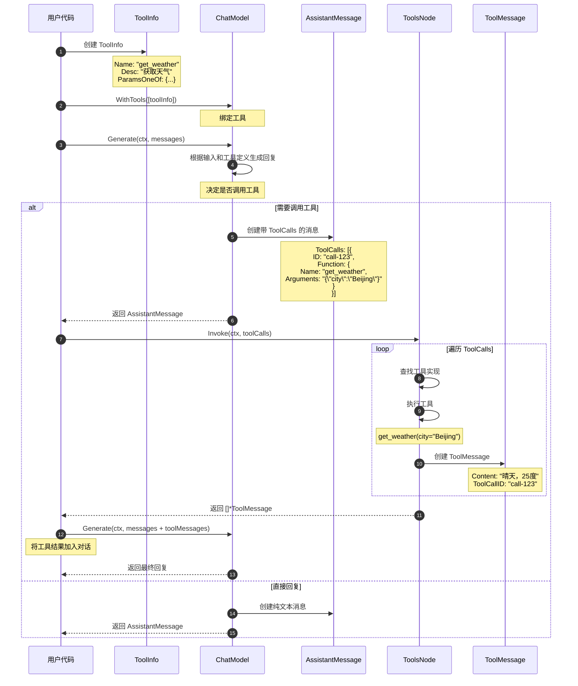
```mermaid
sequenceDiagram
    autonumber
    participant User as 用户代码
    participant ToolInfo as ToolInfo
    participant ChatModel as ChatModel
    participant AssistMsg as AssistantMessage
    participant ToolsNode as ToolsNode
    participant ToolMsg as ToolMessage

    User->>ToolInfo: 创建 ToolInfo
    Note over ToolInfo: Name: "get_weather"<br/>Desc: "获取天气"<br/>ParamsOneOf: {...}

    User->>ChatModel: WithTools([toolInfo])
    Note over ChatModel: 绑定工具

    User->>ChatModel: Generate(ctx, messages)
    
    ChatModel->>ChatModel: 根据输入和工具定义生成回复
    Note over ChatModel: 决定是否调用工具

    alt 需要调用工具
        ChatModel->>AssistMsg: 创建带 ToolCalls 的消息
        Note over AssistMsg: ToolCalls: [{<br/>  ID: "call-123",<br/>  Function: {<br/>    Name: "get_weather",<br/>    Arguments: "{\"city\":\"Beijing\"}"<br/>  }<br/>}]
        ChatModel-->>User: 返回 AssistantMessage
        
        User->>ToolsNode: Invoke(ctx, toolCalls)
        
        loop 遍历 ToolCalls
            ToolsNode->>ToolsNode: 查找工具实现
            ToolsNode->>ToolsNode: 执行工具
            Note over ToolsNode: get_weather(city="Beijing")
            ToolsNode->>ToolMsg: 创建 ToolMessage
            Note over ToolMsg: Content: "晴天，25度"<br/>ToolCallID: "call-123"
        end
        
        ToolsNode-->>User: 返回 []*ToolMessage
        
        User->>ChatModel: Generate(ctx, messages + toolMessages)
        Note over User: 将工具结果加入对话
        
        ChatModel-->>User: 返回最终回复
    else 直接回复
        ChatModel->>AssistMsg: 创建纯文本消息
        ChatModel-->>User: 返回 AssistantMessage
    end
```

**流程说明**:

1. 用户创建 ToolInfo 定义工具
2. 通过 WithTools() 绑定到 ChatModel
3. ChatModel 根据输入决定是否调用工具
4. 如果需要调用：
   - 返回包含 ToolCalls 的 AssistantMessage
   - 用户执行工具（通过 ToolsNode）
   - 创建 ToolMessage 包含执行结果
   - 将 ToolMessage 加入对话继续
5. 如果不需要调用：
   - 直接返回文本回复

**关键点**:

- ToolCallID 关联 ToolCall 和 ToolMessage
- Arguments 是 JSON 字符串格式
- 工具结果需要再次传给 ChatModel

---

## 4. 模板渲染时序

### 4.1 多模板格式渲染

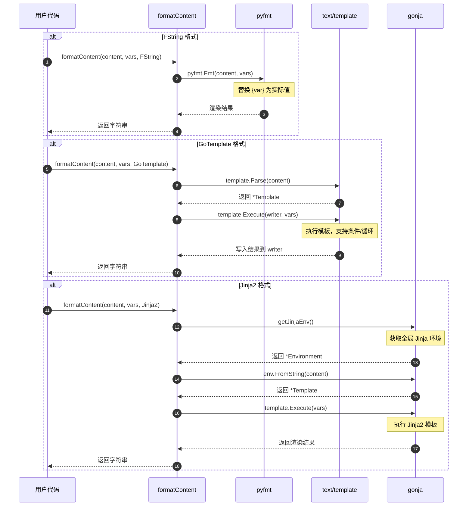
```mermaid
sequenceDiagram
    autonumber
    participant User as 用户代码
    participant Format as formatContent
    participant FString as pyfmt
    participant GoTpl as text/template
    participant Jinja as gonja

    alt FString 格式
        User->>Format: formatContent(content, vars, FString)
        Format->>FString: pyfmt.Fmt(content, vars)
        Note over FString: 替换 {var} 为实际值
        FString-->>Format: 渲染结果
        Format-->>User: 返回字符串
    end

    alt GoTemplate 格式
        User->>Format: formatContent(content, vars, GoTemplate)
        Format->>GoTpl: template.Parse(content)
        GoTpl-->>Format: 返回 *Template
        Format->>GoTpl: template.Execute(writer, vars)
        Note over GoTpl: 执行模板，支持条件/循环
        GoTpl-->>Format: 写入结果到 writer
        Format-->>User: 返回字符串
    end

    alt Jinja2 格式
        User->>Format: formatContent(content, vars, Jinja2)
        Format->>Jinja: getJinjaEnv()
        Note over Jinja: 获取全局 Jinja 环境
        Jinja-->>Format: 返回 *Environment
        Format->>Jinja: env.FromString(content)
        Jinja-->>Format: 返回 *Template
        Format->>Jinja: template.Execute(vars)
        Note over Jinja: 执行 Jinja2 模板
        Jinja-->>Format: 返回渲染结果
        Format-->>User: 返回字符串
    end
```

**流程说明**:

1. 根据 FormatType 选择模板引擎
2. FString: 使用 pyfmt 库，Python 风格
3. GoTemplate: 使用 Go 标准库
4. Jinja2: 使用 gonja 库，兼容 LangChain
5. 返回渲染后的字符串

**性能对比**:

- FString: 最快（简单替换）
- GoTemplate: 中等（需要解析和执行）
- Jinja2: 最慢（功能最强大）

---

## 5. 完整 RAG 场景时序

### 5.1 检索增强生成完整流程

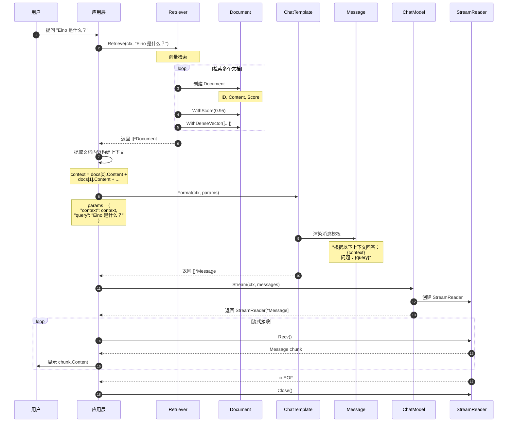
```mermaid
sequenceDiagram
    autonumber
    participant User as 用户
    participant App as 应用层
    participant Retriever as Retriever
    participant Doc as Document
    participant Template as ChatTemplate
    participant Msg as Message
    participant Model as ChatModel
    participant Stream as StreamReader

    User->>App: 提问 "Eino 是什么？"
    
    App->>Retriever: Retrieve(ctx, "Eino 是什么？")
    Note over Retriever: 向量检索
    
    loop 检索多个文档
        Retriever->>Doc: 创建 Document
        Note over Doc: ID, Content, Score
        Retriever->>Doc: WithScore(0.95)
        Retriever->>Doc: WithDenseVector([...])
    end
    
    Retriever-->>App: 返回 []*Document
    
    App->>App: 提取文档内容构建上下文
    Note over App: context = docs[0].Content +<br/>       docs[1].Content + ...
    
    App->>Template: Format(ctx, params)
    Note over App: params = {<br/>  "context": context,<br/>  "query": "Eino 是什么？"<br/>}
    
    Template->>Msg: 渲染消息模板
    Note over Msg: "根据以下上下文回答：<br/>{context}<br/>问题：{query}"
    
    Template-->>App: 返回 []*Message
    
    App->>Model: Stream(ctx, messages)
    
    Model->>Stream: 创建 StreamReader
    
    Model-->>App: 返回 StreamReader[*Message]
    
    loop 流式接收
        App->>Stream: Recv()
        Stream-->>App: Message chunk
        App->>User: 显示 chunk.Content
    end
    
    Stream-->>App: io.EOF
    
    App->>Stream: Close()
```

**流程说明**:

1. 用户提问
2. Retriever 向量检索相关文档
3. 提取文档内容构建上下文
4. 使用 ChatTemplate 渲染提示词
5. 调用 ChatModel 流式生成回复
6. 逐个接收并显示消息块
7. 关闭流

**涉及的数据结构**:

- Document: 存储检索结果
- Message: 构建对话上下文
- StreamReader[*Message]: 流式接收回复

---

**文档版本**: v1.0  
**最后更新**: 2024-12-19  
**适用 Eino 版本**: main 分支（最新版本）

---
