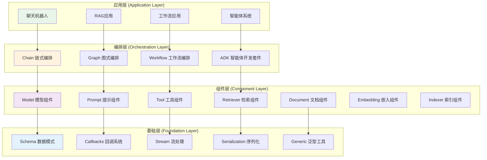
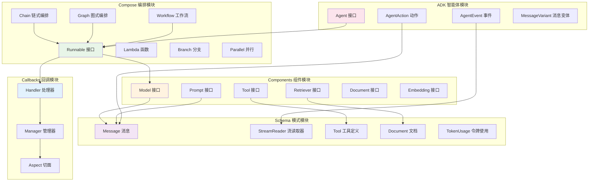
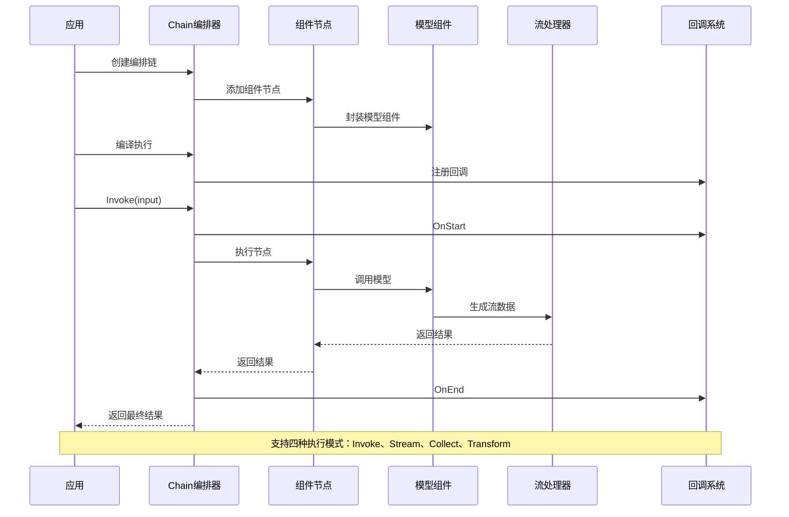
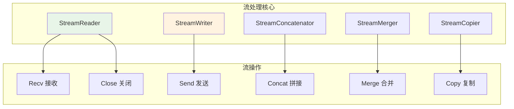
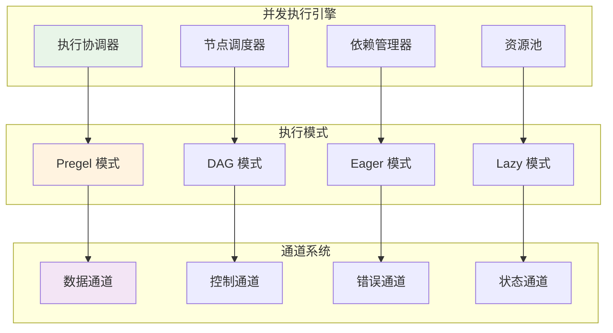

## 📖 文档概述

本文档深入分析 Eino 框架的整体架构设计，包括分层架构、模块交互关系、核心设计模式和架构图解。

## 🏗️ 整体架构概览

### 架构分层设计



### 核心架构原则

#### 1. 分层解耦
- **应用层**: 面向最终用户的具体应用实现
- **编排层**: 提供组件编排和执行引擎
- **组件层**: 提供可复用的功能组件
- **基础层**: 提供底层基础设施和工具

#### 2. 接口驱动
- 每层都定义清晰的接口契约
- 支持依赖注入和组件替换
- 便于测试和扩展

#### 3. 流式优先
- 所有层都支持流式数据处理
- 自动处理流的生命周期管理
- 提供统一的流式编程模型

## 🔄 模块交互关系

### 核心模块交互图



### 数据流向分析



## 🎯 核心设计模式

### 1. 建造者模式 (Builder Pattern)

```go
// Chain 使用建造者模式构建编排链
type Chain[I, O any] struct {
    gg *Graph[I, O]
    nodeIdx int
    preNodeKeys []string
    hasEnd bool
}

// 链式调用构建
func (c *Chain[I, O]) AppendChatModel(node model.BaseChatModel, opts ...GraphAddNodeOpt) *Chain[I, O] {
    gNode, options := toChatModelNode(node, opts...)
    c.addNode(gNode, options)
    return c // 返回自身支持链式调用
}

func (c *Chain[I, O]) AppendChatTemplate(node prompt.ChatTemplate, opts ...GraphAddNodeOpt) *Chain[I, O] {
    gNode, options := toChatTemplateNode(node, opts...)
    c.addNode(gNode, options)
    return c
}

// 最终构建
func (c *Chain[I, O]) Compile(ctx context.Context, opts ...GraphCompileOption) (Runnable[I, O], error) {
    if err := c.addEndIfNeeded(); err != nil {
        return nil, err
    }
    return c.gg.Compile(ctx, opts...)
}
```

**设计优势**:
- 提供流畅的API体验
- 支持复杂对象的分步构建
- 隐藏内部构建复杂性

### 2. 适配器模式 (Adapter Pattern)

```go
// Runnable 接口定义统一的执行模式
type Runnable[I, O any] interface {
    Invoke(ctx context.Context, input I, opts ...Option) (output O, err error)
    Stream(ctx context.Context, input I, opts ...Option) (output *schema.StreamReader[O], err error)
    Collect(ctx context.Context, input *schema.StreamReader[I], opts ...Option) (output O, err error)
    Transform(ctx context.Context, input *schema.StreamReader[I], opts ...Option) (output *schema.StreamReader[O], err error)
}

// composableRunnable 适配器实现
type composableRunnable struct {
    i invoke    // Invoke 方法适配器
    t transform // Transform 方法适配器
    
    inputType  reflect.Type
    outputType reflect.Type
    optionType reflect.Type
    
    *genericHelper
    isPassthrough bool
    meta *executorMeta
    nodeInfo *nodeInfo
}

// 自动适配不同的执行模式
func (rp *runnablePacker[I, O, TOption]) Invoke(ctx context.Context, input I, opts ...TOption) (output O, err error) {
    return rp.i(ctx, input, opts...)
}

// 如果组件只实现了 Stream，自动适配到 Invoke
func invokeByStream[I, O, TOption any](s Stream[I, O, TOption]) Invoke[I, O, TOption] {
    return func(ctx context.Context, input I, opts ...TOption) (O, error) {
        stream, err := s(ctx, input, opts...)
        if err != nil {
            return *new(O), err
        }
        defer stream.Close()
        
        return schema.ConcatStreamReader(stream)
    }
}
```

**设计优势**:
- 统一不同组件的接口
- 自动处理执行模式转换
- 简化组件开发复杂度

### 3. 观察者模式 (Observer Pattern)

```go
// 回调系统实现观察者模式
type Handler interface {
    OnStart(ctx context.Context, info *RunInfo, input any) context.Context
    OnEnd(ctx context.Context, info *RunInfo, output any) context.Context
    OnError(ctx context.Context, info *RunInfo, err error) context.Context
    OnStartWithStreamInput(ctx context.Context, info *RunInfo, input *schema.StreamReader[any]) context.Context
    OnEndWithStreamOutput(ctx context.Context, info *RunInfo, output *schema.StreamReader[any]) context.Context
}

// 回调管理器
type Manager struct {
    handlers []Handler
}

func (m *Manager) AddHandler(handler Handler) {
    m.handlers = append(m.handlers, handler)
}

// 事件通知
func (m *Manager) notifyStart(ctx context.Context, info *RunInfo, input any) context.Context {
    for _, handler := range m.handlers {
        ctx = handler.OnStart(ctx, info, input)
    }
    return ctx
}
```

**设计优势**:
- 支持松耦合的事件通知
- 便于扩展监控和调试功能
- 支持横切面关注点处理

### 4. 策略模式 (Strategy Pattern)

```go
// 不同的图执行策略
type graphRunType string

const (
    runTypePregel graphRunType = "Pregel" // 支持循环的图执行
    runTypeDAG    graphRunType = "DAG"    // 有向无环图执行
)

// 不同的通道构建策略
type chanBuilder func(dependencies []string, indirectDependencies []string, 
                     zeroValue func() any, emptyStream func() streamReader) channel

func pregelChannelBuilder(dependencies []string, indirectDependencies []string, 
                         zeroValue func() any, emptyStream func() streamReader) channel {
    // Pregel 模式的通道实现
    return &pregelChannel{
        dependencies: dependencies,
        zeroValue: zeroValue,
        emptyStream: emptyStream,
    }
}

func dagChannelBuilder(dependencies []string, indirectDependencies []string, 
                      zeroValue func() any, emptyStream func() streamReader) channel {
    // DAG 模式的通道实现
    return &dagChannel{
        dependencies: dependencies,
        indirectDependencies: indirectDependencies,
        zeroValue: zeroValue,
    }
}
```

**设计优势**:
- 支持不同的执行策略
- 便于扩展新的执行模式
- 运行时策略选择

## 🔧 关键架构组件

### 1. Runnable 核心接口

```go
// Runnable 是框架的核心抽象，定义了四种数据流模式
type Runnable[I, O any] interface {
    // ping => pong: 单输入单输出
    Invoke(ctx context.Context, input I, opts ...Option) (output O, err error)
    
    // ping => stream: 单输入流输出
    Stream(ctx context.Context, input I, opts ...Option) (output *schema.StreamReader[O], err error)
    
    // stream => pong: 流输入单输出
    Collect(ctx context.Context, input *schema.StreamReader[I], opts ...Option) (output O, err error)
    
    // stream => stream: 流输入流输出
    Transform(ctx context.Context, input *schema.StreamReader[I], opts ...Option) (output *schema.StreamReader[O], err error)
}
```

**设计理念**:
- 统一的执行接口抽象
- 支持所有可能的数据流模式
- 自动处理流式数据转换

### 2. 流处理系统



```go
// StreamReader 流读取器接口
type StreamReader[T any] interface {
    // Recv 接收下一个数据块，返回 io.EOF 表示流结束
    Recv() (T, error)
    // Close 关闭流，释放资源
    Close() error
}

// 流的自动管理
func (s *streamReader[T]) Recv() (T, error) {
    select {
    case item, ok := <-s.ch:
        if !ok {
            return *new(T), io.EOF
        }
        return item, nil
    case err := <-s.errCh:
        return *new(T), err
    case <-s.ctx.Done():
        return *new(T), s.ctx.Err()
    }
}

// 自动拼接流数据
func ConcatMessages(msgs []*Message) (*Message, error) {
    var (
        contents []string
        contentLen int
        toolCalls []ToolCall
        ret = Message{}
    )
    
    for _, msg := range msgs {
        if msg.Content != "" {
            contents = append(contents, msg.Content)
            contentLen += len(msg.Content)
        }
        if len(msg.ToolCalls) > 0 {
            toolCalls = append(toolCalls, msg.ToolCalls...)
        }
        // ... 其他字段处理
    }
    
    // 拼接内容
    if len(contents) > 0 {
        var sb strings.Builder
        sb.Grow(contentLen)
        for _, content := range contents {
            sb.WriteString(content)
        }
        ret.Content = sb.String()
    }
    
    return &ret, nil
}
```

### 3. 类型系统

```go
// 泛型辅助器，提供类型安全的转换
type genericHelper struct {
    inputType  reflect.Type
    outputType reflect.Type
    
    inputConverter  handlerPair  // 输入类型转换器
    outputConverter handlerPair  // 输出类型转换器
    
    inputFieldMappingConverter handlerPair // 字段映射转换器
}

// 类型检查和转换
func checkAssignable(from, to reflect.Type) assignableType {
    if from == to {
        return assignableTypeExact // 精确匹配
    }
    
    if from == nil || to == nil {
        return assignableTypeMay // 可能匹配，需要运行时检查
    }
    
    if from.AssignableTo(to) {
        return assignableTypeExact // 可赋值
    }
    
    // 检查接口转换
    if to.Kind() == reflect.Interface {
        if from.Implements(to) {
            return assignableTypeExact
        }
    }
    
    // 检查 any 类型
    if to == reflect.TypeOf((*any)(nil)).Elem() {
        return assignableTypeExact
    }
    
    return assignableTypeMustNot // 不匹配
}
```

## 📊 性能架构设计

### 1. 并发执行模型



```go
// 并发执行的核心结构
type runner struct {
    chanSubscribeTo map[string]*chanCall // 节点通道映射
    
    successors          map[string][]string // 后继节点
    dataPredecessors    map[string][]string // 数据依赖
    controlPredecessors map[string][]string // 控制依赖
    
    inputChannels *chanCall // 输入通道
    
    chanBuilder chanBuilder // 通道构建器
    eager       bool        // 是否急切执行
    dag         bool        // 是否DAG模式
    
    runCtx func(ctx context.Context) context.Context // 运行上下文
}

// 并发执行逻辑
func (r *runner) run(ctx context.Context, isStream bool, input any, opts ...Option) (any, error) {
    if r.runCtx != nil {
        ctx = r.runCtx(ctx)
    }
    
    // 创建执行上下文
    runCtx := &runContext{
        ctx:         ctx,
        isStream:    isStream,
        channels:    make(map[string]channel),
        completed:   make(map[string]bool),
        errors:      make(chan error, len(r.chanSubscribeTo)),
    }
    
    // 初始化通道
    for name := range r.chanSubscribeTo {
        dependencies := r.dataPredecessors[name]
        indirectDeps := r.controlPredecessors[name]
        
        runCtx.channels[name] = r.chanBuilder(dependencies, indirectDeps, 
            func() any { return reflect.Zero(r.inputType).Interface() },
            func() streamReader { return emptyStreamReader() })
    }
    
    // 启动输入处理
    go r.processInput(runCtx, input)
    
    // 并发执行节点
    var wg sync.WaitGroup
    for name, call := range r.chanSubscribeTo {
        wg.Add(1)
        go func(nodeName string, nodeCall *chanCall) {
            defer wg.Done()
            r.executeNode(runCtx, nodeName, nodeCall)
        }(name, call)
    }
    
    // 等待完成或错误
    go func() {
        wg.Wait()
        close(runCtx.errors)
    }()
    
    // 收集结果
    return r.collectResult(runCtx)
}
```

### 2. 内存管理策略

```go
// 流资源自动管理
type streamReader[T any] struct {
    ch     <-chan T
    errCh  <-chan error
    ctx    context.Context
    cancel context.CancelFunc
    
    closed    int32 // 原子操作标记
    closeOnce sync.Once
}

func (s *streamReader[T]) Close() error {
    s.closeOnce.Do(func() {
        atomic.StoreInt32(&s.closed, 1)
        if s.cancel != nil {
            s.cancel() // 取消上下文，释放资源
        }
    })
    return nil
}

// 自动关闭机制
func (s *streamReader[T]) SetAutomaticClose() {
    go func() {
        defer s.Close()
        for {
            _, err := s.Recv()
            if err == io.EOF {
                break
            }
            if err != nil {
                break
            }
        }
    }()
}
```

## 🔍 架构扩展点

### 1. 组件扩展

```go
// 自定义组件接口
type CustomComponent interface {
    // 组件标识
    GetType() string
    
    // 执行接口（至少实现一个）
    Invoke(ctx context.Context, input any) (any, error)
    Stream(ctx context.Context, input any) (*schema.StreamReader[any], error)
    Collect(ctx context.Context, input *schema.StreamReader[any]) (any, error)
    Transform(ctx context.Context, input *schema.StreamReader[any]) (*schema.StreamReader[any], error)
}

// 注册自定义组件
func RegisterComponent(name string, factory func() CustomComponent) {
    componentRegistry[name] = factory
}
```

### 2. 回调扩展

```go
// 自定义回调处理器
type CustomHandler struct {
    name string
}

func (h *CustomHandler) OnStart(ctx context.Context, info *RunInfo, input any) context.Context {
    // 自定义开始逻辑
    log.Printf("组件 %s 开始执行，输入: %v", info.ComponentName, input)
    return ctx
}

func (h *CustomHandler) OnEnd(ctx context.Context, info *RunInfo, output any) context.Context {
    // 自定义结束逻辑
    log.Printf("组件 %s 执行完成，输出: %v", info.ComponentName, output)
    return ctx
}

// 注册回调
func RegisterCallback(handler Handler) {
    callbackManager.AddHandler(handler)
}
```

### 3. 序列化扩展

```go
// 自定义序列化器
type CustomSerializer struct{}

func (s *CustomSerializer) Serialize(data any) ([]byte, error) {
    // 自定义序列化逻辑
    return json.Marshal(data)
}

func (s *CustomSerializer) Deserialize(data []byte, target any) error {
    // 自定义反序列化逻辑
    return json.Unmarshal(data, target)
}

// 注册序列化器
func RegisterSerializer(name string, serializer Serializer) {
    serializerRegistry[name] = serializer
}
```

## 📈 架构演进路线

### 当前架构 (v1.0)
- ✅ 基础编排能力
- ✅ 流式处理支持
- ✅ 类型安全保障
- ✅ 基础组件库

### 近期规划 (v1.1-v1.2)
- 🔄 性能优化
- 🔄 更多组件实现
- 🔄 可视化调试工具
- 🔄 分布式执行支持

### 长期规划 (v2.0+)
- 📋 云原生部署
- 📋 图形化编排界面
- 📋 AI辅助开发
- 📋 企业级治理功能

---

**上一篇**: [框架概述与设计理念](/posts/eino-01-framework-overview/)
**下一篇**: [核心API深度分析](/posts/eino-03-core-api-analysis/) - 深入分析Runnable接口和编排API

**更新时间**: 2024-12-19 | **文档版本**: v1.0
