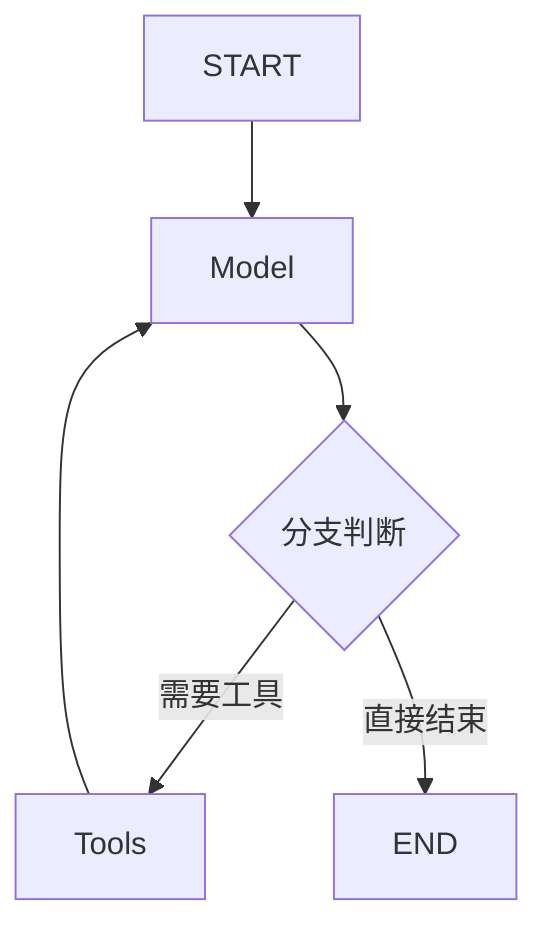
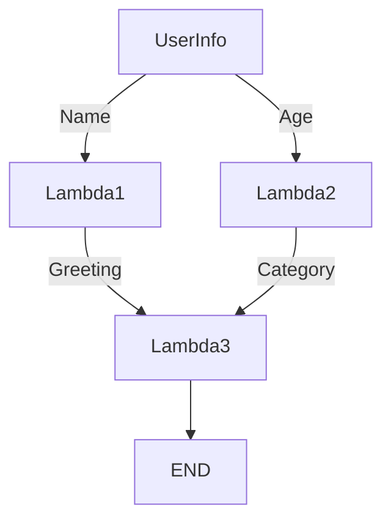
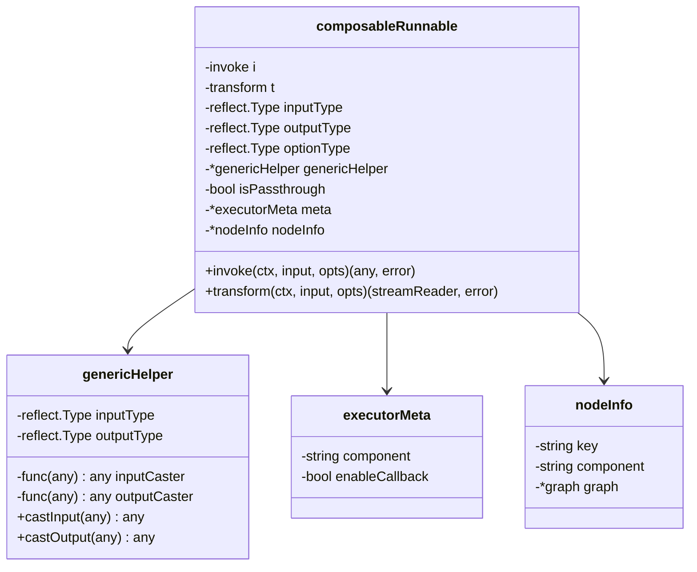
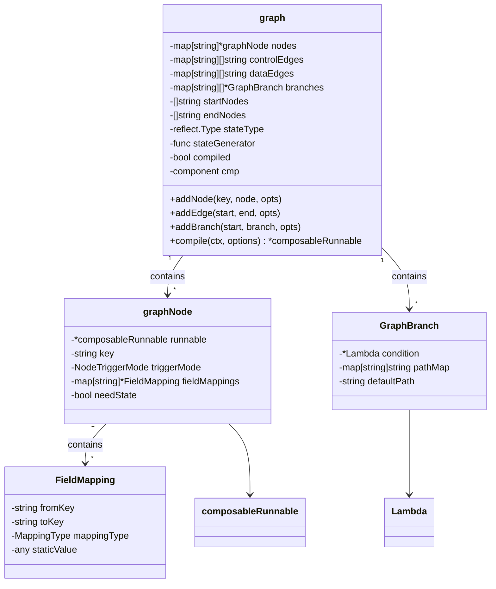
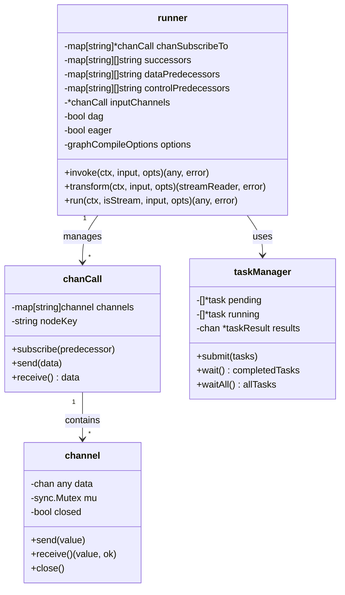
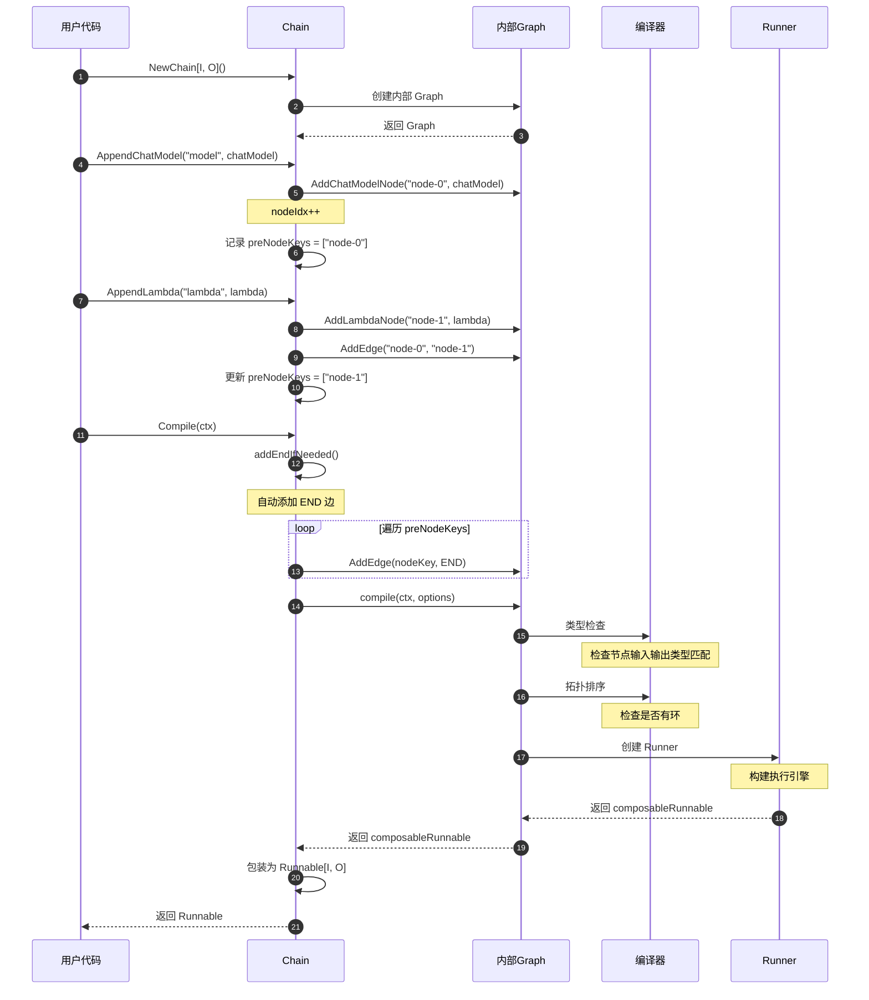
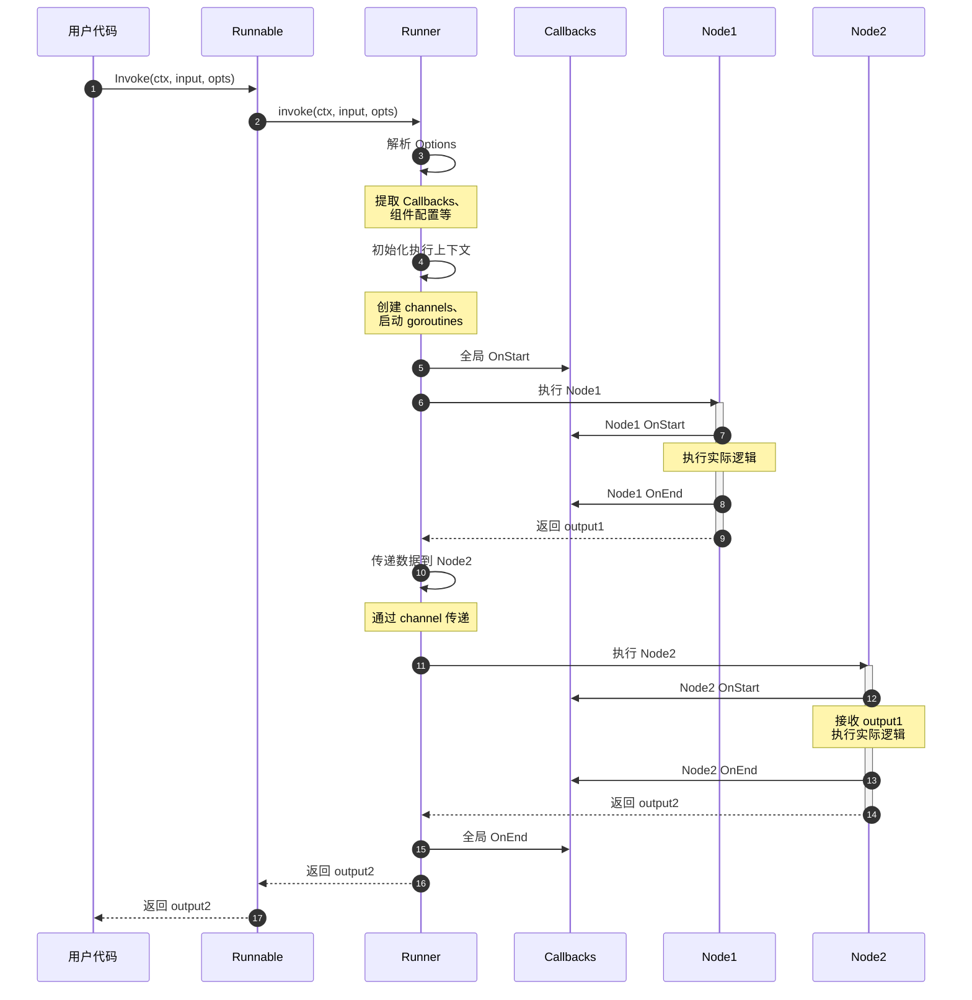
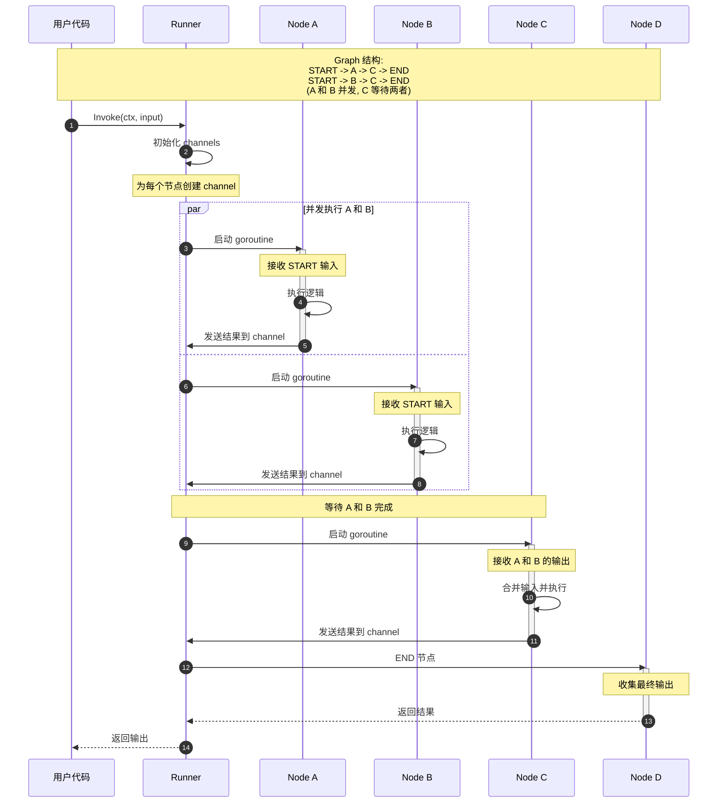
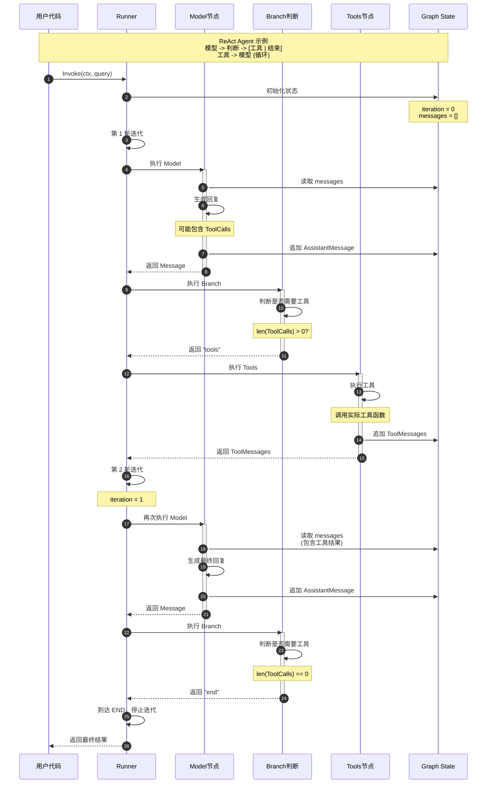
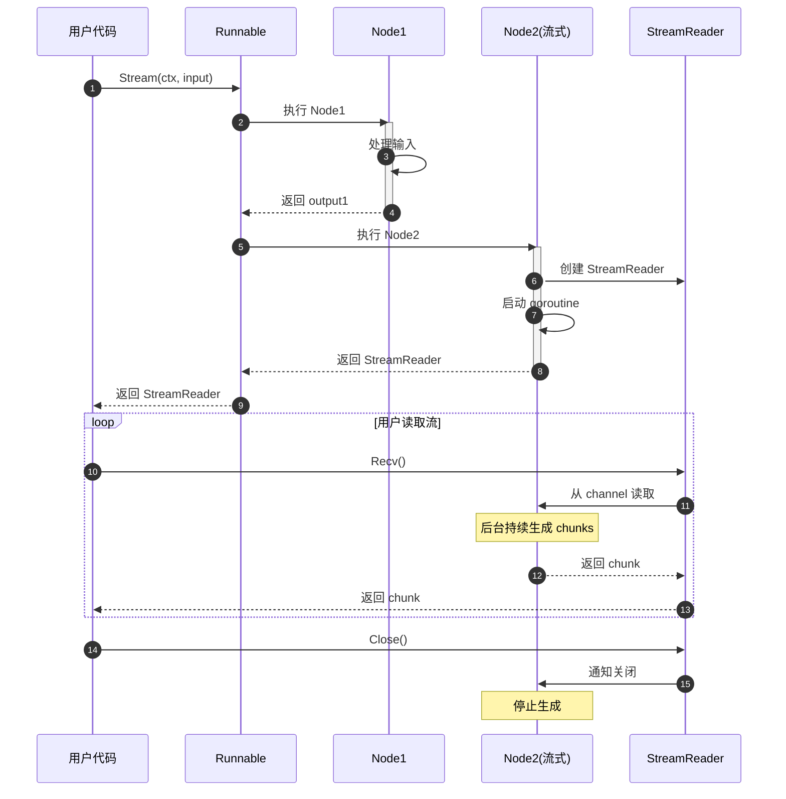

# Eino-02-Compose模块-完整文档

## 概述

Compose 模块是 Eino 框架的编排引擎核心，负责将独立的组件组合成复杂的执行流程。它提供了三种编排模式（Chain、Graph、Workflow）和统一的 Runnable 接口。

本文档包含完整的模块分析：概览、API 接口、数据结构设计和执行时序图。

---

## 1. 核心概念

### 1.1 Runnable 接口 - 统一执行抽象

```go
// Runnable 是所有可执行对象的统一接口
type Runnable[I, O any] interface {
    // Invoke: 非流输入 => 非流输出
    Invoke(ctx context.Context, input I, opts ...Option) (output O, err error)
    
    // Stream: 非流输入 => 流输出  
    Stream(ctx context.Context, input I, opts ...Option) (output *schema.StreamReader[O], err error)
    
    // Collect: 流输入 => 非流输出
    Collect(ctx context.Context, input *schema.StreamReader[I], opts ...Option) (output O, err error)
    
    // Transform: 流输入 => 流输出
    Transform(ctx context.Context, input *schema.StreamReader[I], opts ...Option) (output *schema.StreamReader[O], err error)
}
```

**四种执行模式**：

| 模式 | 输入 | 输出 | 适用场景 |
|------|-----|------|---------|
| Invoke | 普通值 | 普通值 | 标准的请求-响应模式 |
| Stream | 普通值 | 流 | 需要流式输出（如聊天）|
| Collect | 流 | 普通值 | 汇总流式输入 |
| Transform | 流 | 流 | 流式转换 |

**自动降级**：组件只需实现一种模式，其他三种会自动生成。

#### 1.1.1 Invoke 详细说明

**功能说明**: 标准的请求-响应模式，一次性输入，一次性输出。

**参数说明**:

| 参数名 | 类型 | 必填 | 说明 |
|-------|------|------|------|
| ctx | context.Context | 是 | 上下文 |
| input | I | 是 | 输入数据 |
| opts | ...Option | 否 | 可选配置 |

**返回值**:

| 类型 | 说明 |
|------|------|
| O | 输出数据 |
| error | 错误 |

**使用示例**:

```go
// 示例 1：基本用法
chain := compose.NewChain[string, string]()
chain.AppendChatTemplate("t", template)
chain.AppendChatModel("m", chatModel)

runnable, _ := chain.Compile(ctx)

// 一次性输入，一次性输出
output, err := runnable.Invoke(ctx, "你好")
if err != nil {
    log.Fatal(err)
}
fmt.Println(output)

// 示例 2：带 Callbacks
output, err := runnable.Invoke(ctx, input,
    compose.WithCallbacks(myHandler))

// 示例 3：带组件特定配置
output, err := runnable.Invoke(ctx, input,
    compose.WithChatModelOption(
        model.WithTemperature(0.7),
        model.WithMaxTokens(1000),
    ))
```

**适用场景**:

- 标准的请求-响应模式
- 不需要流式输出
- 数据量不大

#### 1.1.2 Stream 详细说明

**功能说明**: 一次性输入，流式输出，适用于需要实时展示的场景。

**参数说明**:

| 参数名 | 类型 | 必填 | 说明 |
|-------|------|------|------|
| ctx | context.Context | 是 | 上下文 |
| input | I | 是 | 输入数据 |
| opts | ...Option | 否 | 可选配置 |

**返回值**:

| 类型 | 说明 |
|------|------|
| *StreamReader[O] | 输出流读取器 |
| error | 错误 |

**使用示例**:

```go
// 示例 1：流式接收并打印
stream, err := runnable.Stream(ctx, "讲个笑话")
if err != nil {
    log.Fatal(err)
}
defer stream.Close()

for {
    chunk, err := stream.Recv()
    if err == io.EOF {
        break
    }
    if err != nil {
        log.Fatal(err)
    }
    fmt.Print(chunk)
}

// 示例 2：使用 ConcatMessageStream 拼接完整输出
stream, _ := runnable.Stream(ctx, input)
fullOutput, _ := schema.ConcatMessageStream(stream)

// 示例 3：流复制到多个处理器
stream, _ := runnable.Stream(ctx, input)
readers := stream.Copy(2)

// 一个用于显示
go func() {
    defer readers[0].Close()
    for {
        chunk, err := readers[0].Recv()
        if err == io.EOF {
            break
        }
        fmt.Print(chunk)
    }
}()

// 一个用于保存
go func() {
    defer readers[1].Close()
    var chunks []string
    for {
        chunk, err := readers[1].Recv()
        if err == io.EOF {
            break
        }
        chunks = append(chunks, chunk)
    }
    saveToFile(chunks)
}()
```

**适用场景**:

- 需要实时展示输出（如聊天）
- 输出内容较多，需要逐步展示
- 需要同时做多种处理（通过 Copy）

#### 1.1.3 Collect 详细说明

**功能说明**: 流式输入，一次性输出，将流数据汇总后处理。

**参数说明**:

| 参数名 | 类型 | 必填 | 说明 |
|-------|------|------|------|
| ctx | context.Context | 是 | 上下文 |
| input | *StreamReader[I] | 是 | 输入流 |
| opts | ...Option | 否 | 可选配置 |

**返回值**:

| 类型 | 说明 |
|------|------|
| O | 输出数据 |
| error | 错误 |

**使用示例**:

```go
// 示例 1：处理用户的流式输入
inputStream := getUserInputStream()  // 假设从某处获得流
output, err := runnable.Collect(ctx, inputStream)
if err != nil {
    log.Fatal(err)
}
fmt.Println(output)

// 示例 2：从数组创建流输入
chunks := []string{"第一段", "第二段", "第三段"}
inputStream := schema.StreamReaderFromArray(chunks)
output, _ := runnable.Collect(ctx, inputStream)

// 示例 3：管道连接
sr1, sw1 := schema.Pipe[string](10)

go func() {
    defer sw1.Close()
    for i := 0; i < 10; i++ {
        sw1.Send(fmt.Sprintf("chunk-%d", i), nil)
    }
}()

output, _ := runnable.Collect(ctx, sr1)
```

**适用场景**:

- 处理流式输入源
- 需要汇总所有输入后再处理
- 连接多个 Runnable（前一个输出流，后一个接收）

#### 1.1.4 Transform 详细说明

**功能说明**: 流式输入，流式输出，实现端到端的流式处理。

**参数说明**:

| 参数名 | 类型 | 必填 | 说明 |
|-------|------|------|------|
| ctx | context.Context | 是 | 上下文 |
| input | *StreamReader[I] | 是 | 输入流 |
| opts | ...Option | 否 | 可选配置 |

**返回值**:

| 类型 | 说明 |
|------|------|
| *StreamReader[O] | 输出流 |
| error | 错误 |

**使用示例**:

```go
// 示例 1：流式转换
inputStream := getInputStream()
outputStream, err := runnable.Transform(ctx, inputStream)
if err != nil {
    log.Fatal(err)
}
defer outputStream.Close()

for {
    chunk, err := outputStream.Recv()
    if err == io.EOF {
        break
    }
    processChunk(chunk)
}

// 示例 2：流管道
stream1, _ := runnable1.Stream(ctx, input)
stream2, _ := runnable2.Transform(ctx, stream1)
stream3, _ := runnable3.Transform(ctx, stream2)
// 链式流处理
```

**适用场景**:

- 端到端流式处理
- 连接多个流式处理单元
- 需要最小延迟

---

## 2. 三种编排模式

### 2.1 Chain - 链式编排

**特点**：简单的线性流程，只能向前推进。

#### 2.1.1 NewChain

**功能说明**: 创建一个新的 Chain。

**函数签名**:

```go
func NewChain[I, O any](opts ...NewGraphOption) *Chain[I, O]
```

**参数说明**:

| 参数名 | 类型 | 必填 | 说明 |
|-------|------|------|------|
| opts | ...NewGraphOption | 否 | 可选配置（如 WithState） |

**返回值**:

| 类型 | 说明 |
|------|------|
| *Chain[I, O] | Chain 实例 |

**使用示例**:

```go
// 示例 1：无状态 Chain
chain := compose.NewChain[string, *schema.Message]()

// 示例 2：带状态的 Chain
type MyState struct {
    Counter int
}

chain := compose.NewChain[string, string](
    compose.WithState(func(ctx context.Context) *MyState {
        return &MyState{Counter: 0}
    }),
)
```

#### 2.1.2 Chain 添加节点方法

##### AppendChatModel

**功能说明**: 添加 ChatModel 节点。

**函数签名**:

```go
func (c *Chain[I, O]) AppendChatModel(node model.BaseChatModel, opts ...GraphAddNodeOpt) *Chain[I, O]
```

**使用示例**:

```go
chain := compose.NewChain[string, *schema.Message]()

chatModel, _ := openai.NewChatModel(ctx, config)

chain.AppendChatModel(chatModel)

// 带配置
chain.AppendChatModel(chatModel,
    compose.WithNodeKey("my_model"))  // Chain 专用：指定节点 key
```

##### AppendChatTemplate

**功能说明**: 添加 ChatTemplate 节点。

**使用示例**:

```go
template := prompt.FromMessages(
    schema.SystemMessage("你是一个助手"),
    schema.UserMessage("{query}"),
)

chain.AppendChatTemplate(template)
```

##### AppendLambda

**功能说明**: 添加 Lambda 节点（自定义处理函数）。

**使用示例**:

```go
// 示例 1：简单转换
convertLambda := compose.InvokableLambda(
    func(ctx context.Context, docs []*schema.Document) (string, error) {
        var context strings.Builder
        for _, doc := range docs {
            context.WriteString(doc.Content)
        }
        return context.String(), nil
    })

chain.AppendLambda(convertLambda)

// 示例 2：流式 Lambda
streamLambda := compose.StreamableLambda(
    func(ctx context.Context, input string) (*schema.StreamReader[string], error) {
        sr, sw := schema.Pipe[string](10)
        go func() {
            defer sw.Close()
            words := strings.Fields(input)
            for _, word := range words {
                sw.Send(word, nil)
            }
        }()
        return sr, nil
    })

chain.AppendLambda(streamLambda)
```

#### 2.1.3 Chain 分支和并行

##### AppendBranch

**功能说明**: 添加条件分支节点。

**使用示例**:

```go
chain := compose.NewChain[string, string]()

// 添加前置节点
chain.AppendLambda(prepareLambda)

// 添加分支
chain.AppendBranch(
    // 分支 1：处理短文本
    compose.NewChainBranch(
        func(ctx context.Context, input string) (bool, error) {
            return len(input) < 100, nil
        },
        shortTextChain,  // 短文本处理链
    ),
    // 分支 2：处理长文本
    compose.NewChainBranch(
        func(ctx context.Context, input string) (bool, error) {
            return len(input) >= 100, nil
        },
        longTextChain,  // 长文本处理链
    ),
).End()  // 结束分支

// 继续添加后续节点
chain.AppendLambda(finalizeLambda)
```

**分支规则**:

- 顺序评估所有分支条件
- 执行第一个条件为 true 的分支
- 如果所有条件都为 false，返回错误

##### AppendParallel

**功能说明**: 添加并行执行节点。

**使用示例**:

```go
chain := compose.NewChain[string, map[string]any]()

// 添加并行节点
chain.AppendParallel(
    // 并行分支 1：查询数据库
    compose.NewParallelBranch(dbQueryChain, "db_result"),
    
    // 并行分支 2：调用外部 API
    compose.NewParallelBranch(apiCallChain, "api_result"),
    
    // 并行分支 3：读取缓存
    compose.NewParallelBranch(cacheReadChain, "cache_result"),
).End()  // 等待所有分支完成

// 输出是 map: {
//   "db_result": ...,
//   "api_result": ...,
//   "cache_result": ...
// }

// 继续处理
chain.AppendLambda(mergeLambda)
```

**并行规则**:

- 所有分支同时开始执行
- 等待所有分支完成
- 结果合并为 map[string]any
- 任一分支失败，整体失败

#### 2.1.4 Chain 编译

**功能说明**: 编译 Chain 为可执行的 Runnable。

**函数签名**:

```go
func (c *Chain[I, O]) Compile(ctx context.Context, opts ...GraphCompileOption) (Runnable[I, O], error)
```

**编译选项**:

```go
// WithMaxRunSteps: 设置最大运行步数（Pregel 模式）
compose.WithMaxRunSteps(10)

// WithRunTimeout: 设置运行超时
compose.WithRunTimeout(30 * time.Second)
```

**使用示例**:

```go
// 示例 1：基本编译
chain := compose.NewChain[string, string]()
// ... 添加节点
runnable, err := chain.Compile(ctx)
if err != nil {
    log.Fatal(err)
}

// 示例 2：带编译选项
runnable, err := chain.Compile(ctx,
    compose.WithMaxRunSteps(10),
    compose.WithRunTimeout(30*time.Second),
)

// 示例 3：缓存编译结果
var runnableCache sync.Map

func getOrCompileChain(key string) (Runnable[I, O], error) {
    if r, ok := runnableCache.Load(key); ok {
        return r.(Runnable[I, O]), nil
    }
    
    chain := buildChain()
    runnable, err := chain.Compile(ctx)
    if err != nil {
        return nil, err
    }
    
    runnableCache.Store(key, runnable)
    return runnable, nil
}
```

**架构图**：


**适用场景**：

- 简单的顺序流程
- 不需要分支和循环
- 快速原型开发

---

### 2.2 Graph - 图式编排

**特点**：支持分支、循环、并发，功能最强大。

#### 2.2.1 NewGraph

**功能说明**: 创建一个新的 Graph。

**函数签名**:

```go
func NewGraph[I, O any](opts ...NewGraphOption) *Graph[I, O]
```

**可选配置**:

```go
// WithState: 启用状态管理
compose.WithState(func(ctx context.Context) *MyState {
    return &MyState{}
})
```

**使用示例**:

```go
// 示例 1：无状态 Graph
graph := compose.NewGraph[Input, Output]()

// 示例 2：带状态的 Graph
type AgentState struct {
    Messages     []*schema.Message
    ToolResults  []string
    Iteration    int
}

graph := compose.NewGraph[string, string](
    compose.WithState(func(ctx context.Context) *AgentState {
        return &AgentState{
            Messages:  []*schema.Message{},
            Iteration: 0,
        }
    }),
)
```

#### 2.2.2 Graph 添加节点方法

Graph 的添加节点方法与 Chain 类似，但返回 error 而非 *Graph：

```go
// AddChatModelNode 添加 ChatModel 节点
func (g *Graph[I, O]) AddChatModelNode(key string, node model.BaseChatModel, opts ...GraphAddNodeOpt) error

// AddChatTemplateNode 添加 ChatTemplate 节点
func (g *Graph[I, O]) AddChatTemplateNode(key string, node prompt.ChatTemplate, opts ...GraphAddNodeOpt) error

// AddToolsNode 添加 ToolsNode 节点
func (g *Graph[I, O]) AddToolsNode(key string, node *ToolsNode, opts ...GraphAddNodeOpt) error

// AddRetrieverNode 添加 Retriever 节点
func (g *Graph[I, O]) AddRetrieverNode(key string, node retriever.Retriever, opts ...GraphAddNodeOpt) error

// AddLambdaNode 添加 Lambda 节点
func (g *Graph[I, O]) AddLambdaNode(key string, lambda *Lambda, opts ...GraphAddNodeOpt) error

// AddGraphNode 添加嵌套 Graph
func (g *Graph[I, O]) AddGraphNode(key string, graph AnyGraph, opts ...GraphAddNodeOpt) error

// AddPassthroughNode 添加透传节点（不做处理）
func (g *Graph[I, O]) AddPassthroughNode(key string, opts ...GraphAddNodeOpt) error
```

**使用示例**:

```go
graph := compose.NewGraph[Input, Output]()

// 添加各种节点
err := graph.AddChatModelNode("model", chatModel)
if err != nil {
    log.Fatal(err)
}

err = graph.AddToolsNode("tools", toolsNode)
if err != nil {
    log.Fatal(err)
}

// Lambda 节点
lambda := compose.InvokableLambda(func(ctx context.Context, input string) (string, error) {
    return processInput(input), nil
})
err = graph.AddLambdaNode("processor", lambda)
```

#### 2.2.3 Graph 连接节点

##### AddEdge

**功能说明**: 添加边，连接两个节点。

**函数签名**:

```go
func (g *Graph[I, O]) AddEdge(startNode, endNode string, opts ...GraphAddEdgeOpt) error
```

**参数说明**:

| 参数名 | 类型 | 必填 | 说明 |
|-------|------|------|------|
| startNode | string | 是 | 起始节点 key（可以是 START） |
| endNode | string | 是 | 结束节点 key（可以是 END） |
| opts | ...GraphAddEdgeOpt | 否 | 边配置 |

**边配置选项**:

```go
// 数据边（默认）：传递数据和执行控制
compose.DataEdge()

// 控制边：只传递执行控制，不传递数据
compose.ControlEdge()

// 字段映射：指定字段如何映射
compose.MapFields("SourceField", "TargetField")
```

**使用示例**:

```go
graph := compose.NewGraph[string, string]()

// 添加节点
graph.AddLambdaNode("node1", lambda1)
graph.AddLambdaNode("node2", lambda2)
graph.AddLambdaNode("node3", lambda3)

// 示例 1：简单的边
graph.AddEdge(START, "node1")
graph.AddEdge("node1", "node2")
graph.AddEdge("node2", END)

// 示例 2：控制边（不传递数据）
graph.AddEdge("node1", "node2", compose.ControlEdge())

// 示例 3：字段映射
graph.AddEdge("node1", "node2",
    compose.MapFields("Output", "Input"))

// 示例 4：循环边
graph.AddEdge("tools", "model")  // 工具结果回到模型
```

**关键概念**:

- **START**: 特殊节点，表示 Graph 的输入
- **END**: 特殊节点，表示 Graph 的输出
- **循环边**: 允许数据流回到之前的节点（仅 Pregel 模式）

##### AddBranch

**功能说明**: 添加分支，根据条件路由到不同节点。

**函数签名**:

```go
func (g *Graph[I, O]) AddBranch(startNode string, branch *GraphBranch, opts ...GraphAddEdgeOpt) error
```

**GraphBranch 创建**:

```go
// NewGraphBranch 创建分支
func NewGraphBranch(
    condition *Lambda,           // 条件判断函数，返回目标节点 key
    pathMap map[string]string,   // 路由映射：条件返回值 -> 目标节点
) *GraphBranch
```

**使用示例**:

```go
graph := compose.NewGraph[Input, Output]()

// 添加节点
graph.AddChatModelNode("model", chatModel)
graph.AddToolsNode("tools", toolsNode)

// 创建分支条件
branchLambda := compose.InvokableLambda(
    func(ctx context.Context, msg *schema.Message) (string, error) {
        if len(msg.ToolCalls) > 0 {
            return "need_tools", nil
        }
        if msg.Content == "" {
            return "error", nil
        }
        return "done", nil
    })

// 添加分支
branch := compose.NewGraphBranch(
    branchLambda,
    map[string]string{
        "need_tools": "tools",  // 需要工具 -> tools 节点
        "done":       END,       // 完成 -> 结束
        "error":      "error_handler",  // 错误 -> 错误处理节点
    },
)

graph.AddBranch("model", branch)
graph.AddEdge("tools", "model")  // 工具完成后回到模型
```

**分支规则**:

- 条件 Lambda 必须返回 string（目标节点 key）
- pathMap 中必须包含所有可能的返回值
- 如果返回值不在 pathMap 中，会报错

#### 2.2.4 Graph 状态管理

##### AddPreHandler

**功能说明**: 添加节点前置处理器，在节点执行前调用。

**使用示例**:

```go
type MyState struct {
    Counter int
}

graph := compose.NewGraph[string, string](
    compose.WithState(func(ctx context.Context) *MyState {
        return &MyState{Counter: 0}
    }),
)

// 添加前置处理器：读取状态
graph.AddPreHandler("node1",
    compose.StatePreHandler(func(ctx context.Context, state *MyState) context.Context {
        log.Printf("当前计数: %d", state.Counter)
        return ctx
    }),
)
```

##### AddPostHandler

**功能说明**: 添加节点后置处理器，在节点执行后调用。

**使用示例**:

```go
// 添加后置处理器：更新状态
graph.AddPostHandler("node1",
    compose.StatePostHandler(func(ctx context.Context, state *MyState, output any) {
        state.Counter++
        log.Printf("节点执行完成，计数: %d", state.Counter)
    }),
)
```

#### 2.2.5 Graph 编译

**函数签名**:

```go
func (g *Graph[I, O]) Compile(ctx context.Context, opts ...GraphCompileOption) (Runnable[I, O], error)
```

**编译选项**:

```go
// WithMaxRunSteps: 最大迭代次数（Pregel 模式必须设置）
compose.WithMaxRunSteps(10)

// WithRunTimeout: 运行超时
compose.WithRunTimeout(30 * time.Second)

// WithPregelMode: 使用 Pregel 模式（支持循环）
compose.WithPregelMode()

// WithDAGMode: 使用 DAG 模式（不支持循环，性能更好）
compose.WithDAGMode()
```

**使用示例**:

```go
// 示例 1：DAG 模式（默认）
graph := compose.NewGraph[Input, Output]()
// ... 添加节点和边（无循环）
runnable, err := graph.Compile(ctx)

// 示例 2：Pregel 模式（支持循环）
graph := compose.NewGraph[Input, Output]()
// ... 添加节点和边（包含循环）
runnable, err := graph.Compile(ctx,
    compose.WithPregelMode(),
    compose.WithMaxRunSteps(10),  // 必须设置
)

// 示例 3：带超时
runnable, err := graph.Compile(ctx,
    compose.WithRunTimeout(30*time.Second),
)
```

**示例**：

```go
graph := compose.NewGraph[Input, Output]()

// 添加节点
graph.AddChatModelNode("model", chatModel)
graph.AddToolsNode("tools", toolsNode)
graph.AddLambdaNode("converter", converterLambda)

// 添加边
graph.AddEdge(START, "model")

// 添加分支（条件路由）
graph.AddBranch("model", compose.NewGraphBranch(
    branchLambda,
    map[string]string{
        "tools": "tools",    // 有工具调用，走工具节点
        "end":   END,         // 无工具调用，直接结束
    },
))

graph.AddEdge("tools", "model")  // 循环边：工具结果回到模型

// 编译
runnable, _ := graph.Compile(ctx)
```

**架构图**：



**两种执行模式**：

1. **DAG 模式**（NodeTriggerMode.AllPredecessor）：
   - 所有前驱节点完成才执行
   - 支持并发
   - 不支持循环

2. **Pregel 模式**（NodeTriggerMode.AnyPredecessor）：
   - 任一前驱节点完成即可执行
   - 支持循环
   - 迭代执行，设置最大迭代次数

**适用场景**：

- 需要条件分支
- 需要循环（如 ReAct Agent）
- 需要节点并发执行

---

### 2.3 Workflow - 工作流编排

**特点**：支持字段级别的数据映射，无循环。

#### 2.3.1 NewWorkflow

**功能说明**: 创建一个新的 Workflow。

**函数签名**:

```go
func NewWorkflow[I, O any](opts ...NewGraphOption) *Workflow[I, O]
```

**使用示例**:

```go
// 创建 Workflow
wf := compose.NewWorkflow[UserInfo, Report]()

// 带状态
type WorkflowState struct {
    IntermediateResults map[string]any
}

wf := compose.NewWorkflow[Input, Output](
    compose.WithState(func(ctx context.Context) *WorkflowState {
        return &WorkflowState{
            IntermediateResults: make(map[string]any),
        }
    }),
)
```

#### 2.3.2 Workflow 添加节点

Workflow 的添加节点方法返回 *WorkflowNode，支持链式调用：

```go
// AddChatModelNode 添加 ChatModel 节点
func (wf *Workflow[I, O]) AddChatModelNode(key string, node model.BaseChatModel, opts ...GraphAddNodeOpt) *WorkflowNode

// AddLambdaNode 添加 Lambda 节点
func (wf *Workflow[I, O]) AddLambdaNode(key string, lambda *Lambda, opts ...GraphAddNodeOpt) *WorkflowNode

// ... 其他节点类型类似
```

#### 2.3.3 Workflow 依赖和数据映射

##### AddInput

**功能说明**: 声明节点的输入依赖和字段映射。

**函数签名**:

```go
func (wn *WorkflowNode) AddInput(fromNodeKey string, mappings ...*FieldMapping) *WorkflowNode
```

**参数说明**:

| 参数名 | 类型 | 必填 | 说明 |
|-------|------|------|------|
| fromNodeKey | string | 是 | 依赖的节点 key（可以是 START） |
| mappings | ...*FieldMapping | 否 | 字段映射规则 |

**FieldMapping 创建**:

```go
// MapFields: 映射字段
compose.MapFields("SourceField", "TargetField")

// MapKey: 映射 map 的 key
compose.MapKey("source_key", "TargetField")

// StaticValue: 设置静态值
compose.StaticValue("TargetField", value)
```

**使用示例**:

```go
type UserInfo struct {
    Name string
    Age  int
}

wf := compose.NewWorkflow[UserInfo, string]()

// 节点 1：处理姓名
wf.AddLambdaNode("greet", greetLambda).
    AddInput(START, compose.MapFields("Name", "Name"))
// UserInfo.Name -> greetLambda 的 Name 参数

// 节点 2：处理年龄
wf.AddLambdaNode("category", categoryLambda).
    AddInput(START, compose.MapFields("Age", "Age"))
// UserInfo.Age -> categoryLambda 的 Age 参数

// 节点 3：合并结果
wf.AddLambdaNode("merge", mergeLambda).
    AddInput("greet", compose.MapFields("Greeting", "Greeting")).
    AddInput("category", compose.MapFields("Category", "Category"))
// greetLambda.Greeting -> mergeLambda.Greeting
// categoryLambda.Category -> mergeLambda.Category

// 输出
wf.End().AddInput("merge")
```

##### 复杂映射示例

```go
wf := compose.NewWorkflow[Input, Output]()

// 示例 1：从 START 映射多个字段
wf.AddLambdaNode("node1", lambda1).
    AddInput(START,
        compose.MapFields("Field1", "Param1"),
        compose.MapFields("Field2", "Param2"),
    )

// 示例 2：从不同节点映射
wf.AddLambdaNode("node3", lambda3).
    AddInput("node1", compose.MapFields("Output1", "Input1")).
    AddInput("node2", compose.MapFields("Output2", "Input2"))

// 示例 3：使用静态值
wf.AddLambdaNode("node4", lambda4).
    AddInput("node3", compose.MapFields("Data", "Data")).
    AddInput(START, compose.StaticValue("Config", myConfig))

// 示例 4：从 map 中取值
wf.AddLambdaNode("node5", lambda5).
    AddInput("parallel_node", compose.MapKey("result_a", "InputA"))
// parallel_node 输出 map，取其中 "result_a" 的值
```

#### 2.3.4 Workflow 编译

```go
func (wf *Workflow[I, O]) Compile(ctx context.Context, opts ...GraphCompileOption) (Runnable[I, O], error)
```

**使用示例**:

```go
wf := compose.NewWorkflow[Input, Output]()

// 添加节点和依赖
// ...

// 编译
runnable, err := wf.Compile(ctx)
if err != nil {
    log.Fatal(err)
}

// 执行
output, err := runnable.Invoke(ctx, input)
```

**示例**：

```go
wf := compose.NewWorkflow[UserInfo, *schema.Message]()

// 添加节点并声明依赖
wf.AddLambdaNode("lambda1", lambda1).
    AddInput(START, compose.MapFields("Name", "Name"))  // 字段映射

wf.AddLambdaNode("lambda2", lambda2).
    AddInput(START, compose.MapFields("Age", "Age"))

wf.AddLambdaNode("lambda3", lambda3).
    AddInput("lambda1", compose.MapFields("Greeting", "Greeting")).
    AddInput("lambda2", compose.MapFields("Category", "Category"))

wf.End().AddInput("lambda3")

// 编译
runnable, _ := wf.Compile(ctx)
```

**架构图**：



**适用场景**：

- 需要灵活的字段映射
- 数据结构转换
- 并行处理不同字段

---

## 3. 核心机制

### 3.1 类型系统

**编译时类型检查**：

```go
// 类型匹配
chain.AppendChatTemplate("t", chatTemplate)  // 输出: []*Message
chain.AppendChatModel("m", chatModel)        // 输入: []*Message ✅

// 类型不匹配会在 Compile 时报错
chain.AppendLambda("bad", func(ctx context.Context, input string) (int, error) {
    return 0, nil
})  // 输入应该是 []*Message，但是 string ❌
```

**自动类型转换**：

- 流 ↔ 非流自动转换
- 通过 Runnable 四种模式实现

### 3.2 流处理机制

**自动拼接**：

```go
// ChatModel 输出流式 Message
// ToolsNode 需要完整 Message
// Graph 自动拼接流
graph.AddChatModelNode("model", model)  // 输出: StreamReader[*Message]
graph.AddToolsNode("tools", tools)      // 输入: *Message（自动拼接）
graph.AddEdge("model", "tools")
```

**自动复制**：

```go
// 一个输出连接到多个节点
graph.AddEdge("model", "node1")
graph.AddEdge("model", "node2")
// Graph 自动复制流，node1 和 node2 各自独立读取
```

### 3.3 回调注入

**自动注入**：

```go
// 组件未实现回调时，Graph 自动注入
graph.AddChatModelNode("model", chatModel)

// 执行时传入回调
runnable.Invoke(ctx, input, compose.WithCallbacks(handler))

// 框架自动在 model 执行前后调用回调
```

**三种注入级别**：

1. **全局回调**：所有节点
2. **组件类型回调**：所有 ChatModel 节点
3. **节点回调**：特定节点

### 3.4 Option 传递

**三种传递方式**：

```go
// 1. 全局 Option（所有节点）
runnable.Invoke(ctx, input,
    compose.WithCallbacks(handler))

// 2. 组件类型 Option（所有 ChatModel）
runnable.Invoke(ctx, input,
    compose.WithChatModelOption(
        model.WithTemperature(0.7),
    ))

// 3. 节点 Option（指定节点）
runnable.Invoke(ctx, input,
    compose.WithCallbacks(handler).DesignateNode("node1"))
```

### 3.5 状态管理

**Graph 状态**：

```go
type MyState struct {
    Messages []*schema.Message
    Context  string
}

// 创建带状态的 Graph
graph := compose.NewGraph[Input, Output](
    compose.WithState(func(ctx context.Context) *MyState {
        return &MyState{Messages: []*schema.Message{}}
    }),
)

// 读写状态
graph.AddPreHandler("node1",
    compose.StatePreHandler(func(ctx context.Context, state *MyState) context.Context {
        // 读取状态
        messages := state.Messages
        return ctx
    }))

graph.AddPostHandler("node1",
    compose.StatePostHandler(func(ctx context.Context, state *MyState, output any) {
        // 写入状态（线程安全）
        state.Messages = append(state.Messages, output.(*schema.Message))
    }))
```

**线程安全**：

- State 读写通过锁保证线程安全
- 多个节点可并发访问

---

## 4. Lambda 节点详细 API

### 4.1 InvokableLambda

**功能说明**: 创建支持 Invoke 模式的 Lambda。

**函数签名**:

```go
func InvokableLambda[I, O, TOption any](
    invoke Invoke[I, O, TOption],
) *Lambda
```

**Invoke 函数签名**:

```go
type Invoke[I, O, TOption any] func(ctx context.Context, input I, opts ...TOption) (O, error)
```

**使用示例**:

```go
// 示例 1：简单转换
toLowerLambda := compose.InvokableLambda(
    func(ctx context.Context, input string) (string, error) {
        return strings.ToLower(input), nil
    })

// 示例 2：复杂处理
processLambda := compose.InvokableLambda(
    func(ctx context.Context, docs []*schema.Document) (map[string]any, error) {
        var content strings.Builder
        for _, doc := range docs {
            content.WriteString(doc.Content)
            content.WriteString("\n\n")
        }
        
        return map[string]any{
            "context": content.String(),
            "count":   len(docs),
        }, nil
    })

// 示例 3：带 Option
type MyOption struct {
    Verbose bool
}

withOptionLambda := compose.InvokableLambda(
    func(ctx context.Context, input string, opts ...MyOption) (string, error) {
        verbose := false
        if len(opts) > 0 {
            verbose = opts[0].Verbose
        }
        
        if verbose {
            log.Printf("处理: %s", input)
        }
        
        return process(input), nil
    })
```

### 4.2 StreamableLambda

**功能说明**: 创建支持 Stream 模式的 Lambda。

**函数签名**:

```go
func StreamableLambda[I, O, TOption any](
    stream Stream[I, O, TOption],
) *Lambda
```

**Stream 函数签名**:

```go
type Stream[I, O, TOption any] func(ctx context.Context, input I, opts ...TOption) (*schema.StreamReader[O], error)
```

**使用示例**:

```go
// 示例 1：逐词输出
wordStreamLambda := compose.StreamableLambda(
    func(ctx context.Context, input string) (*schema.StreamReader[string], error) {
        sr, sw := schema.Pipe[string](10)
        
        go func() {
            defer sw.Close()
            words := strings.Fields(input)
            for _, word := range words {
                if sw.Send(word, nil) {
                    return  // 接收端已关闭
                }
                time.Sleep(100 * time.Millisecond)  // 模拟延迟
            }
        }()
        
        return sr, nil
    })

// 示例 2：批处理流
batchStreamLambda := compose.StreamableLambda(
    func(ctx context.Context, items []Item) (*schema.StreamReader[Result], error) {
        sr, sw := schema.Pipe[Result](10)
        
        go func() {
            defer sw.Close()
            for _, item := range items {
                result, err := processItem(item)
                if err != nil {
                    sw.Send(Result{}, err)
                    return
                }
                if sw.Send(result, nil) {
                    return
                }
            }
        }()
        
        return sr, nil
    })
```

### 4.3 CollectableLambda

**功能说明**: 创建支持 Collect 模式的 Lambda。

**函数签名**:

```go
func CollectableLambda[I, O, TOption any](
    collect Collect[I, O, TOption],
) *Lambda
```

**使用示例**:

```go
// 汇总流输入
collectLambda := compose.CollectableLambda(
    func(ctx context.Context, input *schema.StreamReader[string]) (string, error) {
        defer input.Close()
        
        var builder strings.Builder
        for {
            chunk, err := input.Recv()
            if err == io.EOF {
                break
            }
            if err != nil {
                return "", err
            }
            builder.WriteString(chunk)
        }
        
        return builder.String(), nil
    })
```

### 4.4 TransformableLambda

**功能说明**: 创建支持 Transform 模式的 Lambda。

**函数签名**:

```go
func TransformableLambda[I, O, TOption any](
    transform Transform[I, O, TOption],
) *Lambda
```

**使用示例**:

```go
// 流式转换
transformLambda := compose.TransformableLambda(
    func(ctx context.Context, input *schema.StreamReader[string]) (*schema.StreamReader[string], error) {
        return schema.StreamReaderWithConvert(input, func(s string) (string, error) {
            return strings.ToUpper(s), nil
        }), nil
    })
```

### 4.5 Lambda 用途

1. **自定义处理逻辑**
2. **数据转换**
3. **条件判断（Branch）**
4. **状态更新**
5. **快速原型**

---

## 5. Option API

### 5.1 全局 Option

```go
// WithCallbacks: 设置回调处理器
compose.WithCallbacks(handler)

// WithRunTimeout: 设置运行超时
compose.WithRunTimeout(30 * time.Second)
```

### 5.2 组件类型 Option

```go
// WithChatModelOption: 为所有 ChatModel 节点设置 Option
compose.WithChatModelOption(
    model.WithTemperature(0.7),
    model.WithMaxTokens(1000),
)

// WithRetrieverOption: 为所有 Retriever 节点设置 Option
compose.WithRetrieverOption(
    retriever.WithTopK(5),
)
```

### 5.3 节点 Option

```go
// DesignateNode: 指定 Option 只应用于某个节点
compose.WithCallbacks(handler).DesignateNode("model")
compose.WithChatModelOption(opt).DesignateNode("specific_model")
```

---

## 6. 实战案例

### 6.1 案例 1：简单的 RAG 应用

```go
// 1. 创建 Chain
chain := compose.NewChain[map[string]any, *schema.Message]()

// 2. 添加检索节点
retriever := myRetriever  // 实现 retriever.Retriever
chain.AppendRetriever("retriever", retriever)

// 3. 添加转换节点（提取文档内容）
extractLambda := compose.InvokableLambda(
    func(ctx context.Context, docs []*schema.Document) (map[string]any, error) {
        var context strings.Builder
        for _, doc := range docs {
            context.WriteString(doc.Content)
            context.WriteString("\n\n")
        }
        return map[string]any{"context": context.String()}, nil
    })
chain.AppendLambda("extract", extractLambda)

// 4. 添加模板节点
template := prompt.FromMessages(
    schema.SystemMessage("根据以下上下文回答问题"),
    schema.UserMessage("上下文：{context}\n\n问题：{query}"),
)
chain.AppendChatTemplate("template", template)

// 5. 添加模型节点
chain.AppendChatModel("model", chatModel)

// 6. 编译并使用
runnable, _ := chain.Compile(ctx)
result, _ := runnable.Invoke(ctx, map[string]any{
    "query": "Eino 是什么？",
})
```

### 6.2 案例 2：带工具调用的 Agent

```go
// 1. 创建 Graph
graph := compose.NewGraph[map[string]any, *schema.Message]()

// 2. 添加模板节点
graph.AddChatTemplateNode("template", template)

// 3. 添加模型节点（绑定工具）
modelWithTools, _ := chatModel.WithTools([]*schema.ToolInfo{weatherTool, calcTool})
graph.AddChatModelNode("model", modelWithTools)

// 4. 添加工具节点
toolsNode := compose.NewToolsNode()
toolsNode.RegisterTool(weatherTool, weatherFunc)
toolsNode.RegisterTool(calcTool, calcFunc)
graph.AddToolsNode("tools", toolsNode)

// 5. 添加分支判断
branchLambda := compose.InvokableLambda(
    func(ctx context.Context, msg *schema.Message) (string, error) {
        if len(msg.ToolCalls) > 0 {
            return "tools", nil
        }
        return "end", nil
    })

graph.AddBranch("model", compose.NewGraphBranch(
    branchLambda,
    map[string]string{
        "tools": "tools",
        "end":   compose.END,
    },
))

// 6. 添加边
graph.AddEdge(START, "template")
graph.AddEdge("template", "model")
graph.AddEdge("tools", "model")  // 循环边

// 7. 编译
runnable, _ := graph.Compile(ctx,
    compose.WithMaxRunSteps(10))  // 最多迭代 10 次
```

---

## 7. 核心数据结构

### 7.1 composableRunnable - 可组合执行单元

```go
// composableRunnable 是所有可执行对象的包装器
type composableRunnable struct {
    // 两个核心执行函数
    i invoke      // Invoke 和 Collect 执行函数
    t transform   // Stream 和 Transform 执行函数
    
    // 类型信息
    inputType  reflect.Type  // 输入类型
    outputType reflect.Type  // 输出类型
    optionType reflect.Type  // Option 类型
    
    // 泛型辅助
    *genericHelper
    
    // 标志
    isPassthrough bool  // 是否是透传节点
    
    // 元信息
    meta *executorMeta
    
    // 节点信息（仅在 Graph 中使用）
    nodeInfo *nodeInfo
}

// invoke 函数签名
type invoke func(ctx context.Context, input any, opts ...any) (output any, err error)

// transform 函数签名
type transform func(ctx context.Context, input streamReader, opts ...any) (output streamReader, err error)
```

#### UML 类图



#### 字段详解

##### 核心执行函数

| 字段 | 类型 | 说明 |
|-----|------|------|
| i | invoke | Invoke 和 Collect 模式的执行函数 |
| t | transform | Stream 和 Transform 模式的执行函数 |

**设计理念**：

- 只需实现两个核心函数，其他模式可以自动转换
- `i` 处理非流到非流的转换
- `t` 处理流到流的转换

### 7.2 Graph 核心数据结构

```go
type graph struct {
    // 节点和边
    nodes        map[string]*graphNode       // 所有节点
    controlEdges map[string][]string         // 控制边（不传数据）
    dataEdges    map[string][]string         // 数据边（传递数据）
    branches     map[string][]*GraphBranch   // 分支
    
    // 起始和结束节点
    startNodes []string  // 起始节点列表
    endNodes   []string  // 结束节点列表
    
    // 字段映射相关
    toValidateMap map[string][]struct {
        endNode  string
        mappings []*FieldMapping
    }
    fieldMappingRecords map[string][]*FieldMapping
    
    // 状态管理
    stateType      reflect.Type              // State 类型
    stateGenerator func(ctx context.Context) any  // State 生成器
    
    // 类型信息
    expectedInputType  reflect.Type
    expectedOutputType reflect.Type
    *genericHelper
    
    // 编译状态
    buildError error  // 构建时的错误
    compiled   bool   // 是否已编译
    
    // 组件类型
    cmp component
    
    // 配置选项
    newOpts []NewGraphOption
    
    // Handlers
    handlerOnEdges   map[string]map[string][]handlerPair  // 边上的处理器
    handlerPreNode   map[string][]handlerPair             // 节点前置处理器
    handlerPreBranch map[string][][]handlerPair           // 分支前置处理器
}
```

#### Graph UML 类图



### 7.3 runner - 执行引擎

```go
type runner struct {
    // Channel 管理
    chanSubscribeTo map[string]*chanCall  // 节点订阅的 channels
    
    // 依赖关系
    successors          map[string][]string  // 后继节点
    dataPredecessors    map[string][]string  // 数据前驱
    controlPredecessors map[string][]string  // 控制前驱
    
    // 输入 channels
    inputChannels *chanCall
    
    // 执行策略
    chanBuilder chanBuilder  // Channel 构建器
    eager       bool         // 是否立即执行
    dag         bool         // 是否是 DAG 模式
    
    // 上下文包装
    runCtx func(ctx context.Context) context.Context
    
    // 编译选项
    options graphCompileOptions
    
    // 类型信息
    inputType  reflect.Type
    outputType reflect.Type
    *genericHelper
    
    // 运行时检查
    runtimeCheckEdges    map[string]map[string]bool
    runtimeCheckBranches map[string][]bool
    
    // Handlers
    edgeHandlerManager      *edgeHandlerManager
    preNodeHandlerManager   *preNodeHandlerManager
    preBranchHandlerManager *preBranchHandlerManager
    
    // Checkpoint 和 Interrupt
    checkPointer         *checkPointer
    interruptBeforeNodes []string
    interruptAfterNodes  []string
    
    // FanIn 合并配置
    mergeConfigs map[string]FanInMergeConfig
}
```

#### Runner UML 类图



**Channel 机制**：

- 每个节点都有自己的输入 channels
- 前驱节点发送数据到后继节点的 channel
- 使用 Go channel 实现异步通信

**执行策略**：

| 特性 | DAG 模式 | Pregel 模式 |
|-----|---------|------------|
| 循环 | ❌ 不支持 | ✅ 支持 |
| 并发 | ✅ 自动并发 | ⚠️ 串行迭代 |
| 最大步数 | ❌ 不需要 | ✅ 必须设置 |
| 适用场景 | 静态工作流 | Agent、循环流程 |

---

## 8. 执行时序图

### 8.1 Chain 编译和执行时序

#### Chain 编译流程



#### Chain Invoke 执行流程



### 8.2 Graph DAG 并发执行时序



### 8.3 Pregel 迭代执行流程



### 8.4 流式执行时序



---

## 9. 性能特征

### 9.1 编译开销

- 编译时进行类型检查和拓扑排序
- 编译结果可以缓存复用
- 建议：编译一次，多次执行

### 9.2 执行性能

**Chain**：

- 顺序执行，无并发开销
- 性能最好

**Graph DAG**：

- 自动并发执行无依赖节点
- 性能取决于并发度

**Graph Pregel**：

- 迭代执行
- 性能取决于迭代次数

### 9.3 内存占用

- 流的复制会创建链表结构
- State 在所有节点间共享
- 建议：控制 State 大小

---

## 10. 最佳实践

### 10.1 选择编排模式

```text
简单顺序流程 → Chain
需要分支/循环 → Graph
需要字段映射 → Workflow
```

### 10.2 类型设计

```go
// ✅ 推荐：使用具体类型
type MyInput struct {
    Query   string
    Context string
}

type MyOutput struct {
    Answer string
    Source []string
}

graph := compose.NewGraph[MyInput, MyOutput]()

// ❌ 避免：过度使用 any
graph := compose.NewGraph[any, any]()  // 失去类型安全
```

### 10.3 节点粒度

```go
// ✅ 推荐：适中的节点粒度
graph.AddLambdaNode("preprocess", preprocessLambda)  // 预处理
graph.AddChatModelNode("model", chatModel)           // 模型推理
graph.AddLambdaNode("postprocess", postprocessLambda) // 后处理

// ❌ 避免：节点过于细粒度
graph.AddLambdaNode("trim", trimLambda)
graph.AddLambdaNode("lowercase", lowerLambda)
graph.AddLambdaNode("remove_punctuation", removePuncLambda)
// 这些应该合并为一个 preprocess 节点
```

### 10.4 Lambda 节点使用

- 用于快速原型和测试
- 生产环境建议封装为正式组件
- 注意错误处理

### 10.5 状态管理

```go
// ✅ 推荐：精简的 State
type AgentState struct {
    Messages  []*schema.Message  // 必要的对话历史
    Iteration int                 // 迭代计数
}

// ❌ 避免：臃肿的 State
type AgentState struct {
    Messages        []*schema.Message
    AllIntermediateResults []any  // 不必要
    DebugInfo              map[string]any  // 不必要
    PerformanceMetrics     []Metric  // 应该用 Callbacks
}
```

- 只在必要时使用 State
- State 结构体设计要精简
- 注意并发安全

### 10.6 回调使用

- 开发时使用 Callbacks 调试
- 生产环境用于监控和追踪
- 避免在 Callbacks 中执行耗时操作

### 10.7 性能优化建议

**编译优化**：

- 复用 Runnable，不要每次都编译
- 使用编译缓存

**内存优化**：

- 控制 State 大小
- 合理设置 channel 缓冲区

**并发优化**：

- 优先使用 DAG 模式获得自动并发
- 合理设计节点依赖关系

---

**文档版本**: v1.0  
**最后更新**: 2024-12-19
