# eino-02-compose模块

## API接口

本文档详细描述 Compose 模块对外提供的所有 API，包括 Runnable 接口、三种编排模式（Chain、Graph、Workflow）的使用方法和核心 API。

---

## 1. Runnable 接口

### 1.1 Runnable 核心接口

**接口定义**:

```go
type Runnable[I, O any] interface {
    // Invoke: 非流输入 => 非流输出
    Invoke(ctx context.Context, input I, opts ...Option) (output O, err error)
    
    // Stream: 非流输入 => 流输出
    Stream(ctx context.Context, input I, opts ...Option) (output *schema.StreamReader[O], err error)
    
    // Collect: 流输入 => 非流输出
    Collect(ctx context.Context, input *schema.StreamReader[I], opts ...Option) (output O, err error)
    
    // Transform: 流输入 => 流输出
    Transform(ctx context.Context, input *schema.StreamReader[I], opts ...Option) (output *schema.StreamReader[O], err error)
}
```

#### 1.1.1 Invoke

**功能说明**: 标准的请求-响应模式，一次性输入，一次性输出。

**参数说明**:

| 参数名 | 类型 | 必填 | 说明 |
|-------|------|------|------|
| ctx | context.Context | 是 | 上下文 |
| input | I | 是 | 输入数据 |
| opts | ...Option | 否 | 可选配置 |

**返回值**:

| 类型 | 说明 |
|------|------|
| O | 输出数据 |
| error | 错误 |

**使用示例**:

```go
// 示例 1：基本用法
chain := compose.NewChain[string, string]()
chain.AppendChatTemplate("t", template)
chain.AppendChatModel("m", chatModel)

runnable, _ := chain.Compile(ctx)

// 一次性输入，一次性输出
output, err := runnable.Invoke(ctx, "你好")
if err != nil {
    log.Fatal(err)
}
fmt.Println(output)

// 示例 2：带 Callbacks
output, err := runnable.Invoke(ctx, input,
    compose.WithCallbacks(myHandler))

// 示例 3：带组件特定配置
output, err := runnable.Invoke(ctx, input,
    compose.WithChatModelOption(
        model.WithTemperature(0.7),
        model.WithMaxTokens(1000),
    ))
```

**适用场景**:

- 标准的请求-响应模式
- 不需要流式输出
- 数据量不大

---

#### 1.1.2 Stream

**功能说明**: 一次性输入，流式输出，适用于需要实时展示的场景。

**参数说明**:

| 参数名 | 类型 | 必填 | 说明 |
|-------|------|------|------|
| ctx | context.Context | 是 | 上下文 |
| input | I | 是 | 输入数据 |
| opts | ...Option | 否 | 可选配置 |

**返回值**:

| 类型 | 说明 |
|------|------|
| *StreamReader[O] | 输出流读取器 |
| error | 错误 |

**使用示例**:

```go
// 示例 1：流式接收并打印
stream, err := runnable.Stream(ctx, "讲个笑话")
if err != nil {
    log.Fatal(err)
}
defer stream.Close()

for {
    chunk, err := stream.Recv()
    if err == io.EOF {
        break
    }
    if err != nil {
        log.Fatal(err)
    }
    fmt.Print(chunk)
}

// 示例 2：使用 ConcatMessageStream 拼接完整输出
stream, _ := runnable.Stream(ctx, input)
fullOutput, _ := schema.ConcatMessageStream(stream)

// 示例 3：流复制到多个处理器
stream, _ := runnable.Stream(ctx, input)
readers := stream.Copy(2)

// 一个用于显示
go func() {
    defer readers[0].Close()
    for {
        chunk, err := readers[0].Recv()
        if err == io.EOF {
            break
        }
        fmt.Print(chunk)
    }
}()

// 一个用于保存
go func() {
    defer readers[1].Close()
    var chunks []string
    for {
        chunk, err := readers[1].Recv()
        if err == io.EOF {
            break
        }
        chunks = append(chunks, chunk)
    }
    saveToFile(chunks)
}()
```

**适用场景**:

- 需要实时展示输出（如聊天）
- 输出内容较多，需要逐步展示
- 需要同时做多种处理（通过 Copy）

---

#### 1.1.3 Collect

**功能说明**: 流式输入，一次性输出，将流数据汇总后处理。

**参数说明**:

| 参数名 | 类型 | 必填 | 说明 |
|-------|------|------|------|
| ctx | context.Context | 是 | 上下文 |
| input | *StreamReader[I] | 是 | 输入流 |
| opts | ...Option | 否 | 可选配置 |

**返回值**:

| 类型 | 说明 |
|------|------|
| O | 输出数据 |
| error | 错误 |

**使用示例**:

```go
// 示例 1：处理用户的流式输入
inputStream := getUserInputStream()  // 假设从某处获得流
output, err := runnable.Collect(ctx, inputStream)
if err != nil {
    log.Fatal(err)
}
fmt.Println(output)

// 示例 2：从数组创建流输入
chunks := []string{"第一段", "第二段", "第三段"}
inputStream := schema.StreamReaderFromArray(chunks)
output, _ := runnable.Collect(ctx, inputStream)

// 示例 3：管道连接
sr1, sw1 := schema.Pipe[string](10)

go func() {
    defer sw1.Close()
    for i := 0; i < 10; i++ {
        sw1.Send(fmt.Sprintf("chunk-%d", i), nil)
    }
}()

output, _ := runnable.Collect(ctx, sr1)
```

**适用场景**:

- 处理流式输入源
- 需要汇总所有输入后再处理
- 连接多个 Runnable（前一个输出流，后一个接收）

---

#### 1.1.4 Transform

**功能说明**: 流式输入，流式输出，实现端到端的流式处理。

**参数说明**:

| 参数名 | 类型 | 必填 | 说明 |
|-------|------|------|------|
| ctx | context.Context | 是 | 上下文 |
| input | *StreamReader[I] | 是 | 输入流 |
| opts | ...Option | 否 | 可选配置 |

**返回值**:

| 类型 | 说明 |
|------|------|
| *StreamReader[O] | 输出流 |
| error | 错误 |

**使用示例**:

```go
// 示例 1：流式转换
inputStream := getInputStream()
outputStream, err := runnable.Transform(ctx, inputStream)
if err != nil {
    log.Fatal(err)
}
defer outputStream.Close()

for {
    chunk, err := outputStream.Recv()
    if err == io.EOF {
        break
    }
    processChunk(chunk)
}

// 示例 2：流管道
stream1, _ := runnable1.Stream(ctx, input)
stream2, _ := runnable2.Transform(ctx, stream1)
stream3, _ := runnable3.Transform(ctx, stream2)
// 链式流处理
```

**适用场景**:

- 端到端流式处理
- 连接多个流式处理单元
- 需要最小延迟

---

## 2. Chain API

### 2.1 NewChain

**功能说明**: 创建一个新的 Chain。

**函数签名**:

```go
func NewChain[I, O any](opts ...NewGraphOption) *Chain[I, O]
```

**参数说明**:

| 参数名 | 类型 | 必填 | 说明 |
|-------|------|------|------|
| opts | ...NewGraphOption | 否 | 可选配置（如 WithState） |

**返回值**:

| 类型 | 说明 |
|------|------|
| *Chain[I, O] | Chain 实例 |

**使用示例**:

```go
// 示例 1：无状态 Chain
chain := compose.NewChain[string, *schema.Message]()

// 示例 2：带状态的 Chain
type MyState struct {
    Counter int
}

chain := compose.NewChain[string, string](
    compose.WithState(func(ctx context.Context) *MyState {
        return &MyState{Counter: 0}
    }),
)
```

---

### 2.2 Chain 添加节点方法

#### 2.2.1 AppendChatModel

**功能说明**: 添加 ChatModel 节点。

**函数签名**:

```go
func (c *Chain[I, O]) AppendChatModel(node model.BaseChatModel, opts ...GraphAddNodeOpt) *Chain[I, O]
```

**参数说明**:

| 参数名 | 类型 | 必填 | 说明 |
|-------|------|------|------|
| node | model.BaseChatModel | 是 | ChatModel 实例 |
| opts | ...GraphAddNodeOpt | 否 | 节点配置 |

**使用示例**:

```go
chain := compose.NewChain[string, *schema.Message]()

chatModel, _ := openai.NewChatModel(ctx, config)

chain.AppendChatModel(chatModel)

// 带配置
chain.AppendChatModel(chatModel,
    compose.WithNodeKey("my_model"))  // Chain 专用：指定节点 key
```

#### 2.2.2 AppendChatTemplate

**功能说明**: 添加 ChatTemplate 节点。

**函数签名**:

```go
func (c *Chain[I, O]) AppendChatTemplate(node prompt.ChatTemplate, opts ...GraphAddNodeOpt) *Chain[I, O]
```

**使用示例**:

```go
template := prompt.FromMessages(
    schema.SystemMessage("你是一个助手"),
    schema.UserMessage("{query}"),
)

chain.AppendChatTemplate(template)
```

#### 2.2.3 AppendToolsNode

**功能说明**: 添加 ToolsNode 节点。

**函数签名**:

```go
func (c *Chain[I, O]) AppendToolsNode(node *ToolsNode, opts ...GraphAddNodeOpt) *Chain[I, O]
```

**使用示例**:

```go
toolsNode := compose.NewToolsNode()
toolsNode.RegisterTool(weatherTool, weatherFunc)

chain.AppendToolsNode(toolsNode)
```

#### 2.2.4 AppendRetriever

**功能说明**: 添加 Retriever 节点。

**函数签名**:

```go
func (c *Chain[I, O]) AppendRetriever(node retriever.Retriever, opts ...GraphAddNodeOpt) *Chain[I, O]
```

**使用示例**:

```go
myRetriever, _ := createRetriever()
chain.AppendRetriever(myRetriever)
```

#### 2.2.5 AppendLambda

**功能说明**: 添加 Lambda 节点（自定义处理函数）。

**函数签名**:

```go
func (c *Chain[I, O]) AppendLambda(lambda *Lambda, opts ...GraphAddNodeOpt) *Chain[I, O]
```

**使用示例**:

```go
// 示例 1：简单转换
convertLambda := compose.InvokableLambda(
    func(ctx context.Context, docs []*schema.Document) (string, error) {
        var context strings.Builder
        for _, doc := range docs {
            context.WriteString(doc.Content)
        }
        return context.String(), nil
    })

chain.AppendLambda(convertLambda)

// 示例 2：流式 Lambda
streamLambda := compose.StreamableLambda(
    func(ctx context.Context, input string) (*schema.StreamReader[string], error) {
        sr, sw := schema.Pipe[string](10)
        go func() {
            defer sw.Close()
            words := strings.Fields(input)
            for _, word := range words {
                sw.Send(word, nil)
            }
        }()
        return sr, nil
    })

chain.AppendLambda(streamLambda)
```

#### 2.2.6 AppendGraph

**功能说明**: 添加嵌套的 Graph/Chain。

**函数签名**:

```go
func (c *Chain[I, O]) AppendGraph(graph AnyGraph, opts ...GraphAddNodeOpt) *Chain[I, O]
```

**使用示例**:

```go
// 创建子 Chain
subChain := compose.NewChain[string, string]()
subChain.AppendLambda(lambda1)
subChain.AppendLambda(lambda2)

// 嵌入主 Chain
mainChain := compose.NewChain[map[string]any, string]()
mainChain.AppendLambda(prepareLambda)
mainChain.AppendGraph(subChain)  // 嵌套
mainChain.AppendLambda(finalizeLambda)
```

---

### 2.3 Chain 分支和并行

#### 2.3.1 AppendBranch

**功能说明**: 添加条件分支节点。

**函数签名**:

```go
func (c *Chain[I, O]) AppendBranch(branches ...*ChainBranch) *ChainBranchBuilder[I, O]
```

**使用示例**:

```go
chain := compose.NewChain[string, string]()

// 添加前置节点
chain.AppendLambda(prepareLambda)

// 添加分支
chain.AppendBranch(
    // 分支 1：处理短文本
    compose.NewChainBranch(
        func(ctx context.Context, input string) (bool, error) {
            return len(input) < 100, nil
        },
        shortTextChain,  // 短文本处理链
    ),
    // 分支 2：处理长文本
    compose.NewChainBranch(
        func(ctx context.Context, input string) (bool, error) {
            return len(input) >= 100, nil
        },
        longTextChain,  // 长文本处理链
    ),
).End()  // 结束分支

// 继续添加后续节点
chain.AppendLambda(finalizeLambda)
```

**分支规则**:

- 顺序评估所有分支条件
- 执行第一个条件为 true 的分支
- 如果所有条件都为 false，返回错误

#### 2.3.2 AppendParallel

**功能说明**: 添加并行执行节点。

**函数签名**:

```go
func (c *Chain[I, O]) AppendParallel(branches ...*ParallelBranch) *ParallelBuilder[I, O]
```

**使用示例**:

```go
chain := compose.NewChain[string, map[string]any]()

// 添加并行节点
chain.AppendParallel(
    // 并行分支 1：查询数据库
    compose.NewParallelBranch(dbQueryChain, "db_result"),
    
    // 并行分支 2：调用外部 API
    compose.NewParallelBranch(apiCallChain, "api_result"),
    
    // 并行分支 3：读取缓存
    compose.NewParallelBranch(cacheReadChain, "cache_result"),
).End()  // 等待所有分支完成

// 输出是 map: {
//   "db_result": ...,
//   "api_result": ...,
//   "cache_result": ...
// }

// 继续处理
chain.AppendLambda(mergeLambda)
```

**并行规则**:

- 所有分支同时开始执行
- 等待所有分支完成
- 结果合并为 map[string]any
- 任一分支失败，整体失败

---

### 2.4 Chain 编译

#### 2.4.1 Compile

**功能说明**: 编译 Chain 为可执行的 Runnable。

**函数签名**:

```go
func (c *Chain[I, O]) Compile(ctx context.Context, opts ...GraphCompileOption) (Runnable[I, O], error)
```

**参数说明**:

| 参数名 | 类型 | 必填 | 说明 |
|-------|------|------|------|
| ctx | context.Context | 是 | 上下文 |
| opts | ...GraphCompileOption | 否 | 编译选项 |

**编译选项**:

```go
// WithMaxRunSteps: 设置最大运行步数（Pregel 模式）
compose.WithMaxRunSteps(10)

// WithRunTimeout: 设置运行超时
compose.WithRunTimeout(30 * time.Second)
```

**使用示例**:

```go
// 示例 1：基本编译
chain := compose.NewChain[string, string]()
// ... 添加节点
runnable, err := chain.Compile(ctx)
if err != nil {
    log.Fatal(err)
}

// 示例 2：带编译选项
runnable, err := chain.Compile(ctx,
    compose.WithMaxRunSteps(10),
    compose.WithRunTimeout(30*time.Second),
)

// 示例 3：缓存编译结果
var runnableCache sync.Map

func getOrCompileChain(key string) (Runnable[I, O], error) {
    if r, ok := runnableCache.Load(key); ok {
        return r.(Runnable[I, O]), nil
    }
    
    chain := buildChain()
    runnable, err := chain.Compile(ctx)
    if err != nil {
        return nil, err
    }
    
    runnableCache.Store(key, runnable)
    return runnable, nil
}
```

---

## 3. Graph API

### 3.1 NewGraph

**功能说明**: 创建一个新的 Graph。

**函数签名**:

```go
func NewGraph[I, O any](opts ...NewGraphOption) *Graph[I, O]
```

**可选配置**:

```go
// WithState: 启用状态管理
compose.WithState(func(ctx context.Context) *MyState {
    return &MyState{}
})
```

**使用示例**:

```go
// 示例 1：无状态 Graph
graph := compose.NewGraph[Input, Output]()

// 示例 2：带状态的 Graph
type AgentState struct {
    Messages     []*schema.Message
    ToolResults  []string
    Iteration    int
}

graph := compose.NewGraph[string, string](
    compose.WithState(func(ctx context.Context) *AgentState {
        return &AgentState{
            Messages:  []*schema.Message{},
            Iteration: 0,
        }
    }),
)
```

---

### 3.2 Graph 添加节点方法

Graph 的添加节点方法与 Chain 类似，但返回 error 而非 *Graph：

```go
// AddChatModelNode 添加 ChatModel 节点
func (g *Graph[I, O]) AddChatModelNode(key string, node model.BaseChatModel, opts ...GraphAddNodeOpt) error

// AddChatTemplateNode 添加 ChatTemplate 节点
func (g *Graph[I, O]) AddChatTemplateNode(key string, node prompt.ChatTemplate, opts ...GraphAddNodeOpt) error

// AddToolsNode 添加 ToolsNode 节点
func (g *Graph[I, O]) AddToolsNode(key string, node *ToolsNode, opts ...GraphAddNodeOpt) error

// AddRetrieverNode 添加 Retriever 节点
func (g *Graph[I, O]) AddRetrieverNode(key string, node retriever.Retriever, opts ...GraphAddNodeOpt) error

// AddLambdaNode 添加 Lambda 节点
func (g *Graph[I, O]) AddLambdaNode(key string, lambda *Lambda, opts ...GraphAddNodeOpt) error

// AddGraphNode 添加嵌套 Graph
func (g *Graph[I, O]) AddGraphNode(key string, graph AnyGraph, opts ...GraphAddNodeOpt) error

// AddPassthroughNode 添加透传节点（不做处理）
func (g *Graph[I, O]) AddPassthroughNode(key string, opts ...GraphAddNodeOpt) error
```

**使用示例**:

```go
graph := compose.NewGraph[Input, Output]()

// 添加各种节点
err := graph.AddChatModelNode("model", chatModel)
if err != nil {
    log.Fatal(err)
}

err = graph.AddToolsNode("tools", toolsNode)
if err != nil {
    log.Fatal(err)
}

// Lambda 节点
lambda := compose.InvokableLambda(func(ctx context.Context, input string) (string, error) {
    return processInput(input), nil
})
err = graph.AddLambdaNode("processor", lambda)
```

---

### 3.3 Graph 连接节点

#### 3.3.1 AddEdge

**功能说明**: 添加边，连接两个节点。

**函数签名**:

```go
func (g *Graph[I, O]) AddEdge(startNode, endNode string, opts ...GraphAddEdgeOpt) error
```

**参数说明**:

| 参数名 | 类型 | 必填 | 说明 |
|-------|------|------|------|
| startNode | string | 是 | 起始节点 key（可以是 START） |
| endNode | string | 是 | 结束节点 key（可以是 END） |
| opts | ...GraphAddEdgeOpt | 否 | 边配置 |

**边配置选项**:

```go
// 数据边（默认）：传递数据和执行控制
compose.DataEdge()

// 控制边：只传递执行控制，不传递数据
compose.ControlEdge()

// 字段映射：指定字段如何映射
compose.MapFields("SourceField", "TargetField")
```

**使用示例**:

```go
graph := compose.NewGraph[string, string]()

// 添加节点
graph.AddLambdaNode("node1", lambda1)
graph.AddLambdaNode("node2", lambda2)
graph.AddLambdaNode("node3", lambda3)

// 示例 1：简单的边
graph.AddEdge(START, "node1")
graph.AddEdge("node1", "node2")
graph.AddEdge("node2", END)

// 示例 2：控制边（不传递数据）
graph.AddEdge("node1", "node2", compose.ControlEdge())

// 示例 3：字段映射
graph.AddEdge("node1", "node2",
    compose.MapFields("Output", "Input"))

// 示例 4：循环边
graph.AddEdge("tools", "model")  // 工具结果回到模型
```

**关键概念**:

- **START**: 特殊节点，表示 Graph 的输入
- **END**: 特殊节点，表示 Graph 的输出
- **循环边**: 允许数据流回到之前的节点（仅 Pregel 模式）

---

#### 3.3.2 AddBranch

**功能说明**: 添加分支，根据条件路由到不同节点。

**函数签名**:

```go
func (g *Graph[I, O]) AddBranch(startNode string, branch *GraphBranch, opts ...GraphAddEdgeOpt) error
```

**参数说明**:

| 参数名 | 类型 | 必填 | 说明 |
|-------|------|------|------|
| startNode | string | 是 | 分支起始节点 |
| branch | *GraphBranch | 是 | 分支定义 |
| opts | ...GraphAddEdgeOpt | 否 | 边配置 |

**GraphBranch 创建**:

```go
// NewGraphBranch 创建分支
func NewGraphBranch(
    condition *Lambda,           // 条件判断函数，返回目标节点 key
    pathMap map[string]string,   // 路由映射：条件返回值 -> 目标节点
) *GraphBranch
```

**使用示例**:

```go
graph := compose.NewGraph[Input, Output]()

// 添加节点
graph.AddChatModelNode("model", chatModel)
graph.AddToolsNode("tools", toolsNode)

// 创建分支条件
branchLambda := compose.InvokableLambda(
    func(ctx context.Context, msg *schema.Message) (string, error) {
        if len(msg.ToolCalls) > 0 {
            return "need_tools", nil
        }
        if msg.Content == "" {
            return "error", nil
        }
        return "done", nil
    })

// 添加分支
branch := compose.NewGraphBranch(
    branchLambda,
    map[string]string{
        "need_tools": "tools",  // 需要工具 -> tools 节点
        "done":       END,       // 完成 -> 结束
        "error":      "error_handler",  // 错误 -> 错误处理节点
    },
)

graph.AddBranch("model", branch)
graph.AddEdge("tools", "model")  // 工具完成后回到模型
```

**分支规则**:

- 条件 Lambda 必须返回 string（目标节点 key）
- pathMap 中必须包含所有可能的返回值
- 如果返回值不在 pathMap 中，会报错

---

### 3.4 Graph 状态管理

#### 3.4.1 AddPreHandler

**功能说明**: 添加节点前置处理器，在节点执行前调用。

**函数签名**:

```go
func (g *Graph[I, O]) AddPreHandler(nodeKey string, handler any, opts ...GraphAddNodeOpt) error
```

**使用示例**:

```go
type MyState struct {
    Counter int
}

graph := compose.NewGraph[string, string](
    compose.WithState(func(ctx context.Context) *MyState {
        return &MyState{Counter: 0}
    }),
)

// 添加前置处理器：读取状态
graph.AddPreHandler("node1",
    compose.StatePreHandler(func(ctx context.Context, state *MyState) context.Context {
        log.Printf("当前计数: %d", state.Counter)
        return ctx
    }),
)
```

#### 3.4.2 AddPostHandler

**功能说明**: 添加节点后置处理器，在节点执行后调用。

**函数签名**:

```go
func (g *Graph[I, O]) AddPostHandler(nodeKey string, handler any, opts ...GraphAddNodeOpt) error
```

**使用示例**:

```go
// 添加后置处理器：更新状态
graph.AddPostHandler("node1",
    compose.StatePostHandler(func(ctx context.Context, state *MyState, output any) {
        state.Counter++
        log.Printf("节点执行完成，计数: %d", state.Counter)
    }),
)
```

---

### 3.5 Graph 编译

#### 3.5.1 Compile

**功能说明**: 编译 Graph 为可执行的 Runnable。

**函数签名**:

```go
func (g *Graph[I, O]) Compile(ctx context.Context, opts ...GraphCompileOption) (Runnable[I, O], error)
```

**编译选项**:

```go
// WithMaxRunSteps: 最大迭代次数（Pregel 模式必须设置）
compose.WithMaxRunSteps(10)

// WithRunTimeout: 运行超时
compose.WithRunTimeout(30 * time.Second)

// WithPregelMode: 使用 Pregel 模式（支持循环）
compose.WithPregelMode()

// WithDAGMode: 使用 DAG 模式（不支持循环，性能更好）
compose.WithDAGMode()
```

**使用示例**:

```go
// 示例 1：DAG 模式（默认）
graph := compose.NewGraph[Input, Output]()
// ... 添加节点和边（无循环）
runnable, err := graph.Compile(ctx)

// 示例 2：Pregel 模式（支持循环）
graph := compose.NewGraph[Input, Output]()
// ... 添加节点和边（包含循环）
runnable, err := graph.Compile(ctx,
    compose.WithPregelMode(),
    compose.WithMaxRunSteps(10),  // 必须设置
)

// 示例 3：带超时
runnable, err := graph.Compile(ctx,
    compose.WithRunTimeout(30*time.Second),
)
```

---

## 4. Workflow API

### 4.1 NewWorkflow

**功能说明**: 创建一个新的 Workflow。

**函数签名**:

```go
func NewWorkflow[I, O any](opts ...NewGraphOption) *Workflow[I, O]
```

**使用示例**:

```go
// 创建 Workflow
wf := compose.NewWorkflow[UserInfo, Report]()

// 带状态
type WorkflowState struct {
    IntermediateResults map[string]any
}

wf := compose.NewWorkflow[Input, Output](
    compose.WithState(func(ctx context.Context) *WorkflowState {
        return &WorkflowState{
            IntermediateResults: make(map[string]any),
        }
    }),
)
```

---

### 4.2 Workflow 添加节点

Workflow 的添加节点方法返回 *WorkflowNode，支持链式调用：

```go
// AddChatModelNode 添加 ChatModel 节点
func (wf *Workflow[I, O]) AddChatModelNode(key string, node model.BaseChatModel, opts ...GraphAddNodeOpt) *WorkflowNode

// AddLambdaNode 添加 Lambda 节点
func (wf *Workflow[I, O]) AddLambdaNode(key string, lambda *Lambda, opts ...GraphAddNodeOpt) *WorkflowNode

// ... 其他节点类型类似
```

---

### 4.3 Workflow 依赖和数据映射

#### 4.3.1 AddInput

**功能说明**: 声明节点的输入依赖和字段映射。

**函数签名**:

```go
func (wn *WorkflowNode) AddInput(fromNodeKey string, mappings ...*FieldMapping) *WorkflowNode
```

**参数说明**:

| 参数名 | 类型 | 必填 | 说明 |
|-------|------|------|------|
| fromNodeKey | string | 是 | 依赖的节点 key（可以是 START） |
| mappings | ...*FieldMapping | 否 | 字段映射规则 |

**FieldMapping 创建**:

```go
// MapFields: 映射字段
compose.MapFields("SourceField", "TargetField")

// MapKey: 映射 map 的 key
compose.MapKey("source_key", "TargetField")

// StaticValue: 设置静态值
compose.StaticValue("TargetField", value)
```

**使用示例**:

```go
type UserInfo struct {
    Name string
    Age  int
}

wf := compose.NewWorkflow[UserInfo, string]()

// 节点 1：处理姓名
wf.AddLambdaNode("greet", greetLambda).
    AddInput(START, compose.MapFields("Name", "Name"))
// UserInfo.Name -> greetLambda 的 Name 参数

// 节点 2：处理年龄
wf.AddLambdaNode("category", categoryLambda).
    AddInput(START, compose.MapFields("Age", "Age"))
// UserInfo.Age -> categoryLambda 的 Age 参数

// 节点 3：合并结果
wf.AddLambdaNode("merge", mergeLambda).
    AddInput("greet", compose.MapFields("Greeting", "Greeting")).
    AddInput("category", compose.MapFields("Category", "Category"))
// greetLambda.Greeting -> mergeLambda.Greeting
// categoryLambda.Category -> mergeLambda.Category

// 输出
wf.End().AddInput("merge")
```

#### 4.3.2 复杂映射示例

```go
wf := compose.NewWorkflow[Input, Output]()

// 示例 1：从 START 映射多个字段
wf.AddLambdaNode("node1", lambda1).
    AddInput(START,
        compose.MapFields("Field1", "Param1"),
        compose.MapFields("Field2", "Param2"),
    )

// 示例 2：从不同节点映射
wf.AddLambdaNode("node3", lambda3).
    AddInput("node1", compose.MapFields("Output1", "Input1")).
    AddInput("node2", compose.MapFields("Output2", "Input2"))

// 示例 3：使用静态值
wf.AddLambdaNode("node4", lambda4).
    AddInput("node3", compose.MapFields("Data", "Data")).
    AddInput(START, compose.StaticValue("Config", myConfig))

// 示例 4：从 map 中取值
wf.AddLambdaNode("node5", lambda5).
    AddInput("parallel_node", compose.MapKey("result_a", "InputA"))
// parallel_node 输出 map，取其中 "result_a" 的值
```

---

### 4.4 Workflow 编译

```go
func (wf *Workflow[I, O]) Compile(ctx context.Context, opts ...GraphCompileOption) (Runnable[I, O], error)
```

**使用示例**:

```go
wf := compose.NewWorkflow[Input, Output]()

// 添加节点和依赖
// ...

// 编译
runnable, err := wf.Compile(ctx)
if err != nil {
    log.Fatal(err)
}

// 执行
output, err := runnable.Invoke(ctx, input)
```

---

## 5. Lambda API

### 5.1 InvokableLambda

**功能说明**: 创建支持 Invoke 模式的 Lambda。

**函数签名**:

```go
func InvokableLambda[I, O, TOption any](
    invoke Invoke[I, O, TOption],
) *Lambda
```

**Invoke 函数签名**:

```go
type Invoke[I, O, TOption any] func(ctx context.Context, input I, opts ...TOption) (O, error)
```

**使用示例**:

```go
// 示例 1：简单转换
toLowerLambda := compose.InvokableLambda(
    func(ctx context.Context, input string) (string, error) {
        return strings.ToLower(input), nil
    })

// 示例 2：复杂处理
processLambda := compose.InvokableLambda(
    func(ctx context.Context, docs []*schema.Document) (map[string]any, error) {
        var content strings.Builder
        for _, doc := range docs {
            content.WriteString(doc.Content)
            content.WriteString("\n\n")
        }
        
        return map[string]any{
            "context": content.String(),
            "count":   len(docs),
        }, nil
    })

// 示例 3：带 Option
type MyOption struct {
    Verbose bool
}

withOptionLambda := compose.InvokableLambda(
    func(ctx context.Context, input string, opts ...MyOption) (string, error) {
        verbose := false
        if len(opts) > 0 {
            verbose = opts[0].Verbose
        }
        
        if verbose {
            log.Printf("处理: %s", input)
        }
        
        return process(input), nil
    })
```

---

### 5.2 StreamableLambda

**功能说明**: 创建支持 Stream 模式的 Lambda。

**函数签名**:

```go
func StreamableLambda[I, O, TOption any](
    stream Stream[I, O, TOption],
) *Lambda
```

**Stream 函数签名**:

```go
type Stream[I, O, TOption any] func(ctx context.Context, input I, opts ...TOption) (*schema.StreamReader[O], error)
```

**使用示例**:

```go
// 示例 1：逐词输出
wordStreamLambda := compose.StreamableLambda(
    func(ctx context.Context, input string) (*schema.StreamReader[string], error) {
        sr, sw := schema.Pipe[string](10)
        
        go func() {
            defer sw.Close()
            words := strings.Fields(input)
            for _, word := range words {
                if sw.Send(word, nil) {
                    return  // 接收端已关闭
                }
                time.Sleep(100 * time.Millisecond)  // 模拟延迟
            }
        }()
        
        return sr, nil
    })

// 示例 2：批处理流
batchStreamLambda := compose.StreamableLambda(
    func(ctx context.Context, items []Item) (*schema.StreamReader[Result], error) {
        sr, sw := schema.Pipe[Result](10)
        
        go func() {
            defer sw.Close()
            for _, item := range items {
                result, err := processItem(item)
                if err != nil {
                    sw.Send(Result{}, err)
                    return
                }
                if sw.Send(result, nil) {
                    return
                }
            }
        }()
        
        return sr, nil
    })
```

---

### 5.3 CollectableLambda

**功能说明**: 创建支持 Collect 模式的 Lambda。

**函数签名**:

```go
func CollectableLambda[I, O, TOption any](
    collect Collect[I, O, TOption],
) *Lambda
```

**使用示例**:

```go
// 汇总流输入
collectLambda := compose.CollectableLambda(
    func(ctx context.Context, input *schema.StreamReader[string]) (string, error) {
        defer input.Close()
        
        var builder strings.Builder
        for {
            chunk, err := input.Recv()
            if err == io.EOF {
                break
            }
            if err != nil {
                return "", err
            }
            builder.WriteString(chunk)
        }
        
        return builder.String(), nil
    })
```

---

### 5.4 TransformableLambda

**功能说明**: 创建支持 Transform 模式的 Lambda。

**函数签名**:

```go
func TransformableLambda[I, O, TOption any](
    transform Transform[I, O, TOption],
) *Lambda
```

**使用示例**:

```go
// 流式转换
transformLambda := compose.TransformableLambda(
    func(ctx context.Context, input *schema.StreamReader[string]) (*schema.StreamReader[string], error) {
        return schema.StreamReaderWithConvert(input, func(s string) (string, error) {
            return strings.ToUpper(s), nil
        }), nil
    })
```

---

## 6. Option API

### 6.1 全局 Option

```go
// WithCallbacks: 设置回调处理器
compose.WithCallbacks(handler)

// WithRunTimeout: 设置运行超时
compose.WithRunTimeout(30 * time.Second)
```

### 6.2 组件类型 Option

```go
// WithChatModelOption: 为所有 ChatModel 节点设置 Option
compose.WithChatModelOption(
    model.WithTemperature(0.7),
    model.WithMaxTokens(1000),
)

// WithRetrieverOption: 为所有 Retriever 节点设置 Option
compose.WithRetrieverOption(
    retriever.WithTopK(5),
)
```

### 6.3 节点 Option

```go
// DesignateNode: 指定 Option 只应用于某个节点
compose.WithCallbacks(handler).DesignateNode("model")
compose.WithChatModelOption(opt).DesignateNode("specific_model")
```

---

**文档版本**: v1.0  
**最后更新**: 2024-12-19  
**适用 Eino 版本**: main 分支（最新版本）

---

## 数据结构

本文档详细描述 Compose 模块的核心数据结构，包括 Runnable、Graph、Chain、Workflow 等关键结构的设计和实现。

---

## 1. composableRunnable - 可组合执行单元

### 1.1 结构定义

```go
// composableRunnable 是所有可执行对象的包装器
type composableRunnable struct {
    // 两个核心执行函数
    i invoke      // Invoke 和 Collect 执行函数
    t transform   // Stream 和 Transform 执行函数
    
    // 类型信息
    inputType  reflect.Type  // 输入类型
    outputType reflect.Type  // 输出类型
    optionType reflect.Type  // Option 类型
    
    // 泛型辅助
    *genericHelper
    
    // 标志
    isPassthrough bool  // 是否是透传节点
    
    // 元信息
    meta *executorMeta
    
    // 节点信息（仅在 Graph 中使用）
    nodeInfo *nodeInfo
}

// invoke 函数签名
type invoke func(ctx context.Context, input any, opts ...any) (output any, err error)

// transform 函数签名
type transform func(ctx context.Context, input streamReader, opts ...any) (output streamReader, err error)
```

### 1.2 UML 类图

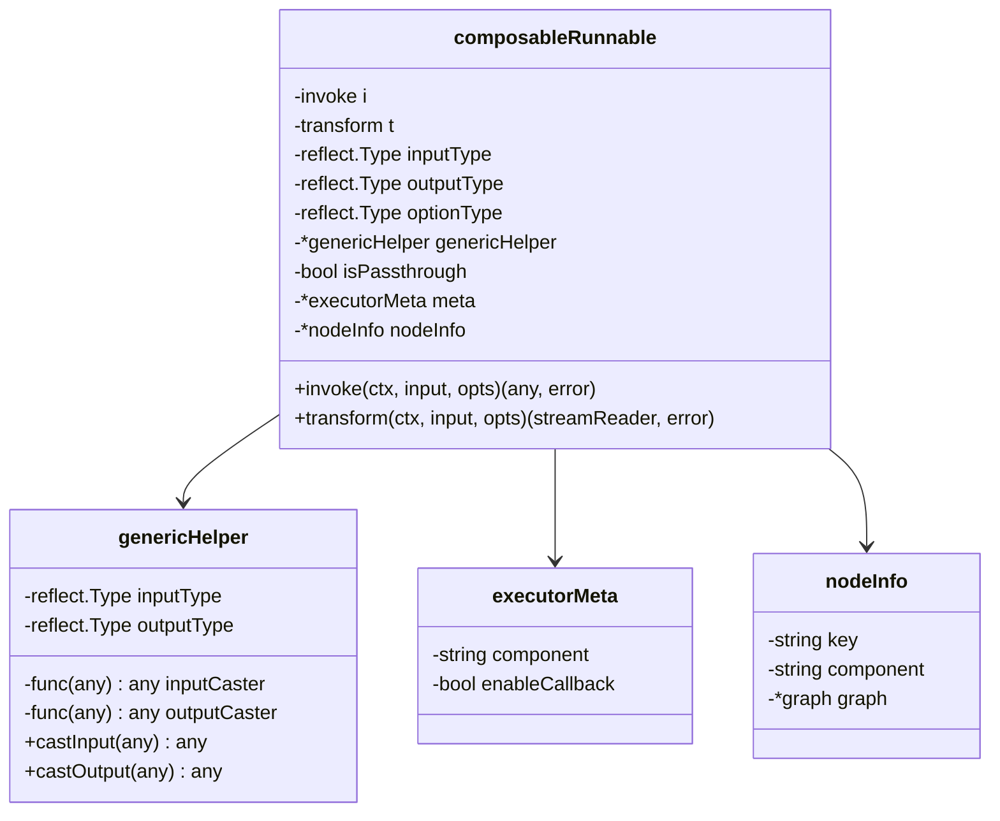
```mermaid
classDiagram
    class composableRunnable {
        -invoke i
        -transform t
        -reflect.Type inputType
        -reflect.Type outputType
        -reflect.Type optionType
        -*genericHelper genericHelper
        -bool isPassthrough
        -*executorMeta meta
        -*nodeInfo nodeInfo
        +invoke(ctx, input, opts) (any, error)
        +transform(ctx, input, opts) (streamReader, error)
    }
    
    class genericHelper {
        -func(any) any inputCaster
        -func(any) any outputCaster
        -reflect.Type inputType
        -reflect.Type outputType
        +castInput(any) any
        +castOutput(any) any
    }
    
    class executorMeta {
        -string component
        -bool enableCallback
    }
    
    class nodeInfo {
        -string key
        -string component
        -*graph graph
    }
    
    composableRunnable --> genericHelper
    composableRunnable --> executorMeta
    composableRunnable --> nodeInfo
```

### 1.3 字段详解

#### 核心执行函数

| 字段 | 类型 | 说明 |
|-----|------|------|
| i | invoke | Invoke 和 Collect 模式的执行函数 |
| t | transform | Stream 和 Transform 模式的执行函数 |

**设计理念**：

- 只需实现两个核心函数，其他模式可以自动转换
- `i` 处理非流到非流的转换
- `t` 处理流到流的转换

#### 类型信息

| 字段 | 类型 | 说明 |
|-----|------|------|
| inputType | reflect.Type | 输入数据的类型 |
| outputType | reflect.Type | 输出数据的类型 |
| optionType | reflect.Type | Option 参数的类型 |

**用途**：

- 编译时进行类型检查
- 运行时类型转换和验证
- 错误信息生成

#### 特殊标志

| 字段 | 类型 | 说明 |
|-----|------|------|
| isPassthrough | bool | 是否是透传节点（不做处理，直接传递） |

---

## 2. Graph 核心数据结构

### 2.1 graph 结构

```go
type graph struct {
    // 节点和边
    nodes        map[string]*graphNode       // 所有节点
    controlEdges map[string][]string         // 控制边（不传数据）
    dataEdges    map[string][]string         // 数据边（传递数据）
    branches     map[string][]*GraphBranch   // 分支
    
    // 起始和结束节点
    startNodes []string  // 起始节点列表
    endNodes   []string  // 结束节点列表
    
    // 字段映射相关
    toValidateMap map[string][]struct {
        endNode  string
        mappings []*FieldMapping
    }
    fieldMappingRecords map[string][]*FieldMapping
    
    // 状态管理
    stateType      reflect.Type              // State 类型
    stateGenerator func(ctx context.Context) any  // State 生成器
    
    // 类型信息
    expectedInputType  reflect.Type
    expectedOutputType reflect.Type
    *genericHelper
    
    // 编译状态
    buildError error  // 构建时的错误
    compiled   bool   // 是否已编译
    
    // 组件类型
    cmp component
    
    // 配置选项
    newOpts []NewGraphOption
    
    // Handlers
    handlerOnEdges   map[string]map[string][]handlerPair  // 边上的处理器
    handlerPreNode   map[string][]handlerPair             // 节点前置处理器
    handlerPreBranch map[string][][]handlerPair           // 分支前置处理器
}
```

### 2.2 Graph UML 类图

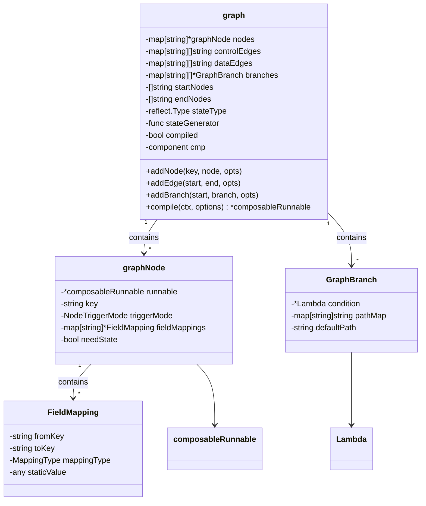
```mermaid
classDiagram
    class graph {
        -map[string]*graphNode nodes
        -map[string][]string controlEdges
        -map[string][]string dataEdges
        -map[string][]*GraphBranch branches
        -[]string startNodes
        -[]string endNodes
        -reflect.Type stateType
        -func stateGenerator
        -bool compiled
        -component cmp
        +addNode(key, node, opts)
        +addEdge(start, end, opts)
        +addBranch(start, branch, opts)
        +compile(ctx, options) *composableRunnable
    }
    
    class graphNode {
        -*composableRunnable runnable
        -string key
        -NodeTriggerMode triggerMode
        -map[string]*FieldMapping fieldMappings
        -bool needState
    }
    
    class GraphBranch {
        -*Lambda condition
        -map[string]string pathMap
        -string defaultPath
    }
    
    class FieldMapping {
        -string fromKey
        -string toKey
        -MappingType mappingType
        -any staticValue
    }
    
    graph "1" --> "*" graphNode : contains
    graph "1" --> "*" GraphBranch : contains
    graphNode "1" --> "*" FieldMapping : contains
    graphNode --> composableRunnable
    GraphBranch --> Lambda
```

### 2.3 核心字段详解

#### 节点和边

| 字段 | 类型 | 说明 | 用途 |
|-----|------|------|------|
| nodes | map[string]*graphNode | 所有节点 | key -> 节点映射 |
| controlEdges | map[string][]string | 控制边 | 控制执行顺序，不传数据 |
| dataEdges | map[string][]string | 数据边 | 传递数据和控制执行 |
| branches | map[string][]*GraphBranch | 分支 | 条件路由 |

**边的类型**：

- **数据边（Data Edge）**: 默认类型，传递数据和控制
- **控制边（Control Edge）**: 只控制执行顺序，不传数据

#### 状态管理

| 字段 | 类型 | 说明 |
|-----|------|------|
| stateType | reflect.Type | State 结构体类型 |
| stateGenerator | func(ctx) any | State 初始化函数 |

**使用场景**：

- Agent 场景：维护对话历史
- 工作流场景：跨节点共享上下文

---

## 3. graphNode - Graph 节点

### 3.1 结构定义

```go
type graphNode struct {
    // 核心执行单元
    runnable *composableRunnable
    
    // 节点标识
    key string
    
    // 触发模式
    triggerMode NodeTriggerMode
    
    // 字段映射
    fieldMappings map[string]*FieldMapping
    
    // 状态标志
    needState bool
    
    // 元信息
    component string
}

// NodeTriggerMode 节点触发模式
type NodeTriggerMode int

const (
    // AnyPredecessor 任一前驱完成即触发（用于 Pregel 模式）
    AnyPredecessor NodeTriggerMode = iota
    
    // AllPredecessor 所有前驱完成才触发（用于 DAG 模式）
    AllPredecessor
)
```

### 3.2 字段说明

| 字段 | 类型 | 说明 |
|-----|------|------|
| runnable | *composableRunnable | 实际执行单元 |
| key | string | 节点唯一标识 |
| triggerMode | NodeTriggerMode | 触发模式（任一/所有前驱） |
| fieldMappings | map[string]*FieldMapping | 输入字段映射 |
| needState | bool | 是否需要访问 State |

---

## 4. runner - 执行引擎

### 4.1 结构定义

```go
type runner struct {
    // Channel 管理
    chanSubscribeTo map[string]*chanCall  // 节点订阅的 channels
    
    // 依赖关系
    successors          map[string][]string  // 后继节点
    dataPredecessors    map[string][]string  // 数据前驱
    controlPredecessors map[string][]string  // 控制前驱
    
    // 输入 channels
    inputChannels *chanCall
    
    // 执行策略
    chanBuilder chanBuilder  // Channel 构建器
    eager       bool         // 是否立即执行
    dag         bool         // 是否是 DAG 模式
    
    // 上下文包装
    runCtx func(ctx context.Context) context.Context
    
    // 编译选项
    options graphCompileOptions
    
    // 类型信息
    inputType  reflect.Type
    outputType reflect.Type
    *genericHelper
    
    // 运行时检查
    runtimeCheckEdges    map[string]map[string]bool
    runtimeCheckBranches map[string][]bool
    
    // Handlers
    edgeHandlerManager      *edgeHandlerManager
    preNodeHandlerManager   *preNodeHandlerManager
    preBranchHandlerManager *preBranchHandlerManager
    
    // Checkpoint 和 Interrupt
    checkPointer         *checkPointer
    interruptBeforeNodes []string
    interruptAfterNodes  []string
    
    // FanIn 合并配置
    mergeConfigs map[string]FanInMergeConfig
}
```

### 4.2 Runner UML 类图

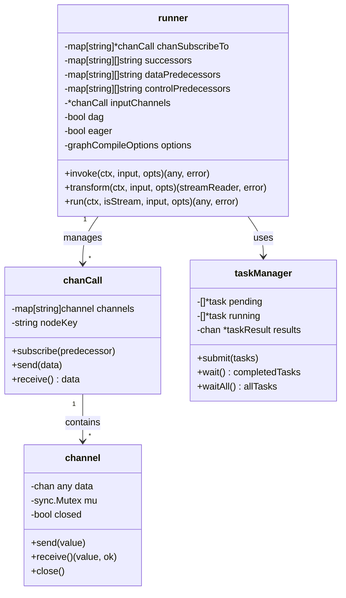
```mermaid
classDiagram
    class runner {
        -map[string]*chanCall chanSubscribeTo
        -map[string][]string successors
        -map[string][]string dataPredecessors
        -map[string][]string controlPredecessors
        -*chanCall inputChannels
        -bool dag
        -bool eager
        -graphCompileOptions options
        +invoke(ctx, input, opts) (any, error)
        +transform(ctx, input, opts) (streamReader, error)
        +run(ctx, isStream, input, opts) (any, error)
    }
    
    class chanCall {
        -map[string]channel channels
        -string nodeKey
        +subscribe(predecessor)
        +send(data)
        +receive() data
    }
    
    class channel {
        -chan any data
        -sync.Mutex mu
        -bool closed
        +send(value)
        +receive() (value, ok)
        +close()
    }
    
    class taskManager {
        -[]*task pending
        -[]*task running
        -chan *taskResult results
        +submit(tasks)
        +wait() completedTasks
        +waitAll() allTasks
    }
    
    runner "1" --> "*" chanCall : manages
    chanCall "1" --> "*" channel : contains
    runner --> taskManager : uses
```

### 4.3 关键字段详解

#### Channel 管理

| 字段 | 类型 | 说明 |
|-----|------|------|
| chanSubscribeTo | map[string]*chanCall | 每个节点订阅的输入 channels |
| inputChannels | *chanCall | Graph 的输入 channels |

**Channel 机制**：

- 每个节点都有自己的输入 channels
- 前驱节点发送数据到后继节点的 channel
- 使用 Go channel 实现异步通信

#### 依赖关系

| 字段 | 类型 | 说明 |
|-----|------|------|
| successors | map[string][]string | 后继节点列表 |
| dataPredecessors | map[string][]string | 数据前驱列表 |
| controlPredecessors | map[string][]string | 控制前驱列表 |

**用途**：

- 拓扑排序
- 并发调度
- 依赖检查

#### 执行策略

| 字段 | 类型 | 说明 |
|-----|------|------|
| dag | bool | 是否是 DAG 模式 |
| eager | bool | 是否立即执行（vs 懒惰执行） |

**模式差异**：

| 特性 | DAG 模式 | Pregel 模式 |
|-----|---------|------------|
| 循环 | ❌ 不支持 | ✅ 支持 |
| 并发 | ✅ 自动并发 | ⚠️ 串行迭代 |
| 最大步数 | ❌ 不需要 | ✅ 必须设置 |
| 适用场景 | 静态工作流 | Agent、循环流程 |

---

## 5. Chain 数据结构

### 5.1 结构定义

```go
type Chain[I, O any] struct {
    // 内部使用 Graph
    gg *Graph[I, O]
    
    // 构建状态
    err error
    
    // 节点管理
    nodeIdx     int       // 节点计数器
    preNodeKeys []string  // 上一批节点的 keys
    
    // 标志
    hasEnd bool  // 是否已添加 END 边
}
```

### 5.2 Chain vs Graph

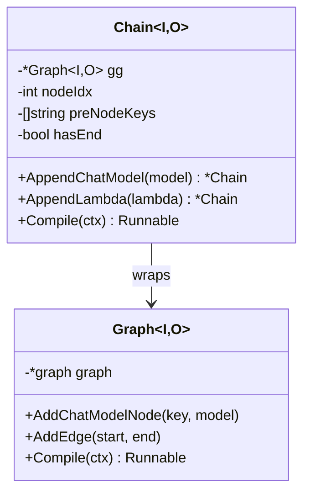
```mermaid
classDiagram
    class Chain~I,O~ {
        -*Graph~I,O~ gg
        -int nodeIdx
        -[]string preNodeKeys
        -bool hasEnd
        +AppendChatModel(model) *Chain
        +AppendLambda(lambda) *Chain
        +Compile(ctx) Runnable
    }
    
    class Graph~I,O~ {
        -*graph graph
        +AddChatModelNode(key, model)
        +AddEdge(start, end)
        +Compile(ctx) Runnable
    }
    
    Chain --> Graph : wraps
```

**Chain 的本质**：

- Chain 是 Graph 的语法糖
- 内部完全委托给 Graph
- 自动维护节点顺序和边

**关系**：

```
Chain.AppendXXX()
    ↓
Graph.AddXXXNode()
    ↓
Graph.AddEdge(preNode, newNode)
    ↓
更新 preNodeKeys
```

---

## 6. Workflow 数据结构

### 6.1 结构定义

```go
type Workflow[I, O any] struct {
    // 内部 Graph
    g *graph
    
    // Workflow 特有
    workflowNodes    map[string]*WorkflowNode
    workflowBranches []*WorkflowBranch
    dependencies     map[string]map[string]dependencyType
}

type WorkflowNode struct {
    g                *graph
    key              string
    addInputs        []func() error  // 延迟执行的输入添加函数
    staticValues     map[string]any
    dependencySetter func(fromNodeKey string, typ dependencyType)
    mappedFieldPath  map[string]any
}

// 依赖类型
type dependencyType int

const (
    normalDependency     dependencyType = iota  // 普通依赖（数据+控制）
    noDirectDependency                          // 无直接依赖（仅控制）
    branchDependency                            // 分支依赖
)
```

### 6.2 Workflow UML 类图

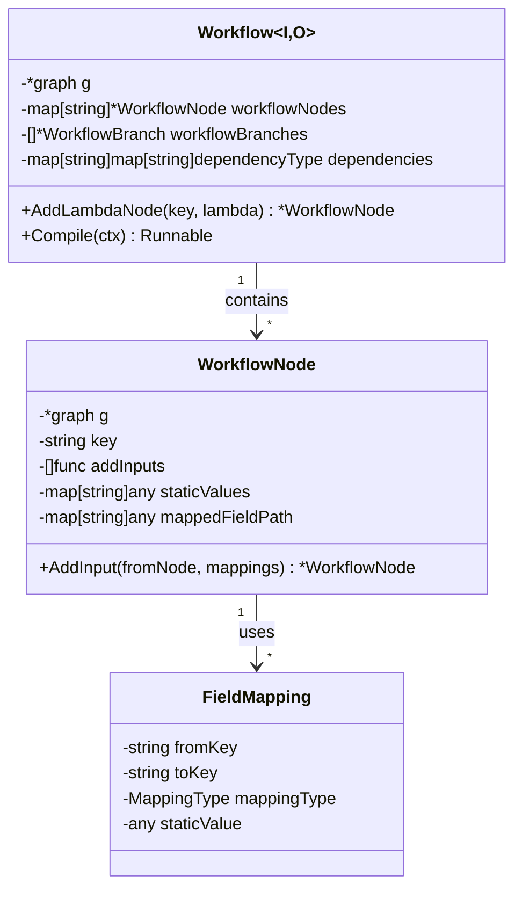
```mermaid
classDiagram
    class Workflow~I,O~ {
        -*graph g
        -map[string]*WorkflowNode workflowNodes
        -[]*WorkflowBranch workflowBranches
        -map[string]map[string]dependencyType dependencies
        +AddLambdaNode(key, lambda) *WorkflowNode
        +Compile(ctx) Runnable
    }
    
    class WorkflowNode {
        -*graph g
        -string key
        -[]func addInputs
        -map[string]any staticValues
        -map[string]any mappedFieldPath
        +AddInput(fromNode, mappings) *WorkflowNode
    }
    
    class FieldMapping {
        -string fromKey
        -string toKey
        -MappingType mappingType
        -any staticValue
    }
    
    Workflow "1" --> "*" WorkflowNode : contains
    WorkflowNode "1" --> "*" FieldMapping : uses
```

### 6.3 Workflow 特点

| 特性 | Graph | Workflow |
|-----|-------|----------|
| 边的定义 | 显式 AddEdge | 隐式（通过 AddInput 声明依赖） |
| 数据传递 | 整个输出 | 字段级映射 |
| 并发 | 自动 | 自动（基于依赖） |
| 循环 | 支持（Pregel） | ❌ 不支持 |

---

## 7. Lambda 数据结构

### 7.1 Lambda 定义

```go
type Lambda struct {
    // 内部是 composableRunnable
    runnable *composableRunnable
}

// 四种 Lambda 函数类型

// Invoke 类型
type Invoke[I, O, TOption any] func(
    ctx context.Context,
    input I,
    opts ...TOption,
) (O, error)

// Stream 类型
type Stream[I, O, TOption any] func(
    ctx context.Context,
    input I,
    opts ...TOption,
) (*schema.StreamReader[O], error)

// Collect 类型
type Collect[I, O, TOption any] func(
    ctx context.Context,
    input *schema.StreamReader[I],
    opts ...TOption,
) (O, error)

// Transform 类型
type Transform[I, O, TOption any] func(
    ctx context.Context,
    input *schema.StreamReader[I],
    opts ...TOption,
) (*schema.StreamReader[O], error)
```

### 7.2 Lambda 类型关系

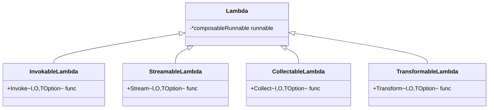
```mermaid
classDiagram
    class Lambda {
        -*composableRunnable runnable
    }
    
    class InvokableLambda {
        +Invoke~I,O,TOption~ func
    }
    
    class StreamableLambda {
        +Stream~I,O,TOption~ func
    }
    
    class CollectableLambda {
        +Collect~I,O,TOption~ func
    }
    
    class TransformableLambda {
        +Transform~I,O,TOption~ func
    }
    
    Lambda <|-- InvokableLambda
    Lambda <|-- StreamableLambda
    Lambda <|-- CollectableLambda
    Lambda <|-- TransformableLambda
```

---

## 8. Option 数据结构

### 8.1 Option 结构

```go
// Option 核心结构
type Option struct {
    // Callbacks
    handlers []callbacks.Handler
    
    // 组件类型 Option
    chatModelOptions   []model.Option
    retrieverOptions   []retriever.Option
    // ... 其他组件类型
    
    // 节点指定
    designatedNodeKeys []string
    
    // Graph 运行配置
    maxRunSteps int
    runTimeout  time.Duration
    
    // CheckPoint
    checkPointID         *string
    writeToCheckPointID  *string
    stateModifier        StateModifier
    forceNewRun          bool
}
```

### 8.2 Option 传递机制

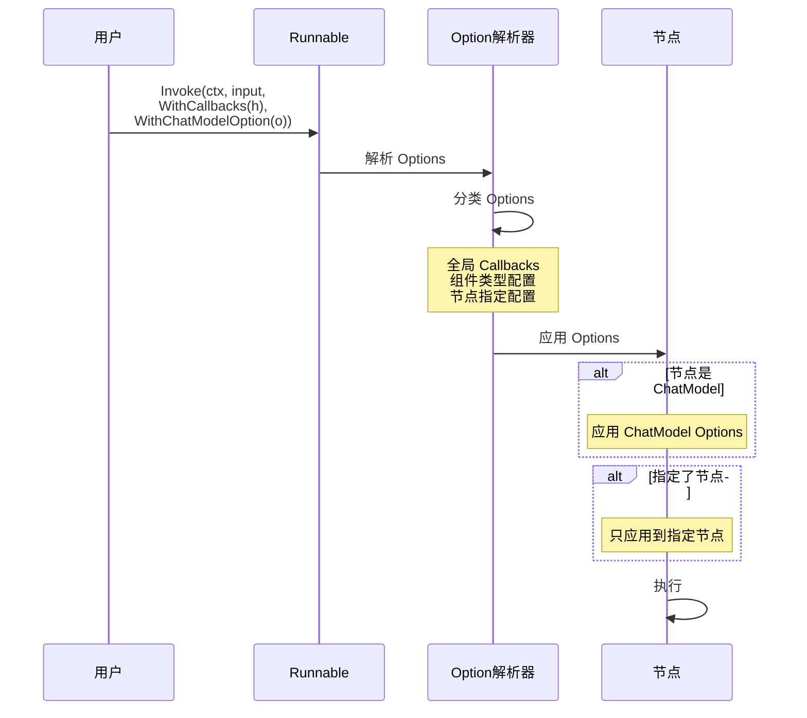
```mermaid
sequenceDiagram
    participant User as 用户
    participant Runnable as Runnable
    participant OptParser as Option解析器
    participant Node as 节点

    User->>Runnable: Invoke(ctx, input,<br/>WithCallbacks(h),<br/>WithChatModelOption(o))
    
    Runnable->>OptParser: 解析 Options
    
    OptParser->>OptParser: 分类 Options
    Note over OptParser: 全局 Callbacks<br/>组件类型配置<br/>节点指定配置
    
    OptParser->>Node: 应用 Options
    
    alt 节点是 ChatModel
        Note over Node: 应用 ChatModel Options
    end
    
    alt 指定了节点
        Note over Node: 只应用到指定节点
    end
    
    Node->>Node: 执行
```

---

## 9. 类型系统

### 9.1 泛型辅助

```go
type genericHelper struct {
    inputCaster  func(any) any
    outputCaster func(any) any
    inputType    reflect.Type
    outputType   reflect.Type
}

func newGenericHelper[I, O any]() *genericHelper {
    return &genericHelper{
        inputCaster:  castInput[I],
        outputCaster: castOutput[O],
        inputType:    generic.TypeOf[I](),
        outputType:   generic.TypeOf[O](),
    }
}
```

### 9.2 类型检查流程

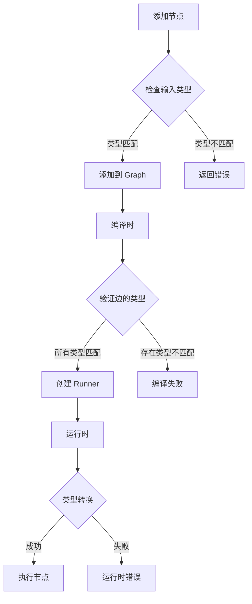
```mermaid
flowchart TB
    A[添加节点] --> B{检查输入类型}
    B -->|类型匹配| C[添加到 Graph]
    B -->|类型不匹配| D[返回错误]
    
    C --> E[编译时]
    E --> F{验证边的类型}
    F -->|所有类型匹配| G[创建 Runner]
    F -->|存在类型不匹配| H[编译失败]
    
    G --> I[运行时]
    I --> J{类型转换}
    J -->|成功| K[执行节点]
    J -->|失败| L[运行时错误]
```

**类型检查时机**：

1. **添加节点时**：检查基本类型兼容性
2. **编译时**：检查所有边的类型匹配
3. **运行时**：进行实际类型转换

---

## 10. 并发管理数据结构

### 10.1 task 和 taskManager

```go
type task struct {
    nodeKey string
    call    *chanCall
    output  any
    
    // 状态
    submitted bool
    completed bool
    canceled  bool
}

type taskManager struct {
    // 任务队列
    pending []*task
    running map[string]*task
    
    // 结果通道
    results chan *taskResult
    
    // 执行器
    executor func(*task) (*taskResult, error)
    
    // 控制
    cancel context.CancelFunc
    wg     sync.WaitGroup
}

type taskResult struct {
    task   *task
    output any
    err    error
}
```

### 10.2 并发执行流程

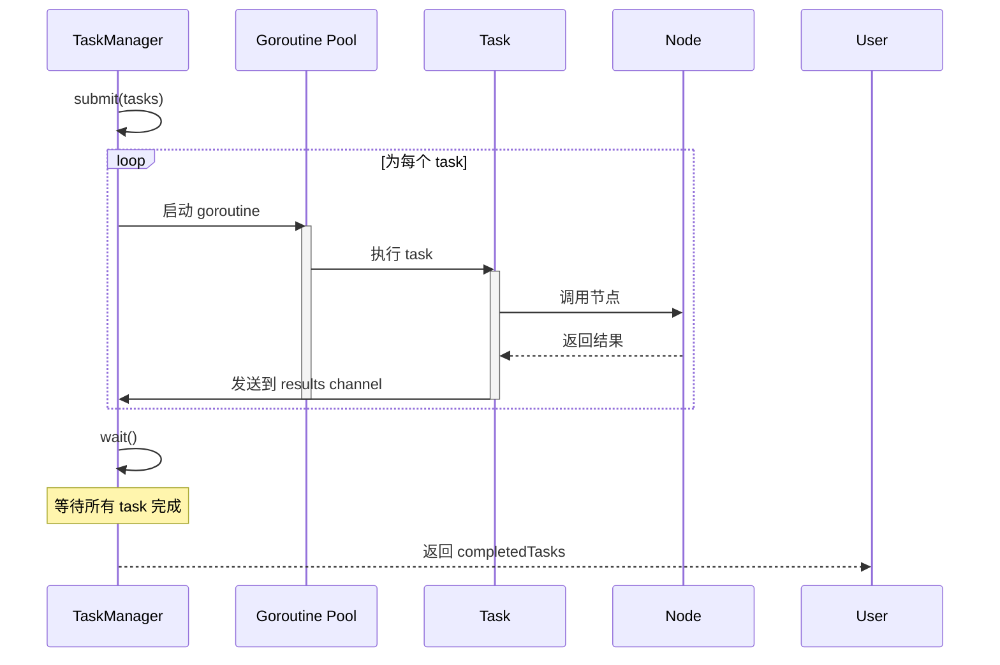
```mermaid
sequenceDiagram
    participant TM as TaskManager
    participant Pool as Goroutine Pool
    participant Task as Task
    participant Node as Node
    
    TM->>TM: submit(tasks)
    
    loop 为每个 task
        TM->>Pool: 启动 goroutine
        activate Pool
        
        Pool->>Task: 执行 task
        activate Task
        
        Task->>Node: 调用节点
        Node-->>Task: 返回结果
        
        Task->>TM: 发送到 results channel
        deactivate Task
        
        deactivate Pool
    end
    
    TM->>TM: wait()
    Note over TM: 等待所有 task 完成
    
    TM-->>User: 返回 completedTasks
```

---

## 11. 状态管理数据结构

### 11.1 State 结构

```go
// State 是用户定义的结构体
type MyState struct {
    Messages  []*schema.Message
    Context   string
    Iteration int
    // ... 用户自定义字段
}

// State 访问器
type stateAccessor struct {
    state any           // 实际 State 对象
    mu    sync.RWMutex  // 读写锁
}

func (sa *stateAccessor) read(fn func(state any)) {
    sa.mu.RLock()
    defer sa.mu.RUnlock()
    fn(sa.state)
}

func (sa *stateAccessor) write(fn func(state any)) {
    sa.mu.Lock()
    defer sa.mu.Unlock()
    fn(sa.state)
}
```

### 11.2 State 访问模式

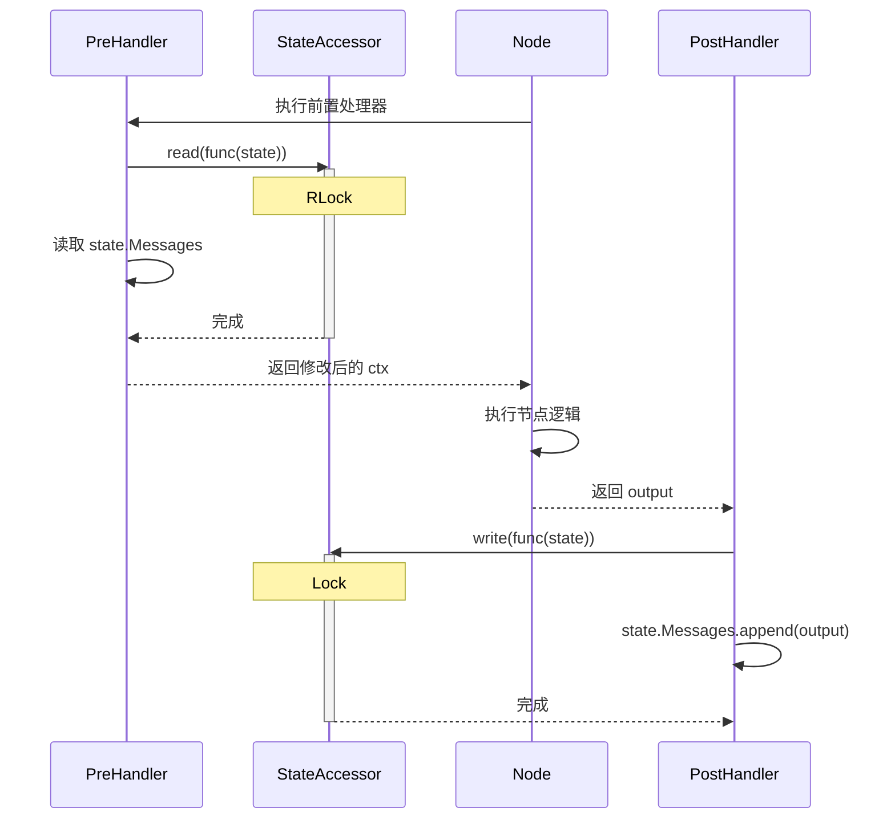
```mermaid
sequenceDiagram
    participant Pre as PreHandler
    participant SA as StateAccessor
    participant Node as Node
    participant Post as PostHandler
    
    Node->>Pre: 执行前置处理器
    
    Pre->>SA: read(func(state))
    activate SA
    Note over SA: RLock
    Pre->>Pre: 读取 state.Messages
    SA-->>Pre: 完成
    deactivate SA
    
    Pre-->>Node: 返回修改后的 ctx
    
    Node->>Node: 执行节点逻辑
    Node-->>Post: 返回 output
    
    Post->>SA: write(func(state))
    activate SA
    Note over SA: Lock
    Post->>Post: state.Messages.append(output)
    SA-->>Post: 完成
    deactivate SA
```

**线程安全**：

- 使用 `sync.RWMutex` 保护 State
- 读操作使用 `RLock`（可并发）
- 写操作使用 `Lock`（互斥）

---

## 12. 数据结构设计模式

### 12.1 组合模式（Composite）

```
Runnable
  ├── Graph (实现 Runnable)
  ├── Chain (实现 Runnable，内部包含 Graph)
  └── Lambda (实现 Runnable)

Graph 可以包含:
  ├── ChatModel 节点
  ├── Lambda 节点
  └── 嵌套的 Graph 节点
```

**优势**：

- 统一接口（Runnable）
- 可以任意嵌套组合
- 递归处理

### 12.2 建造者模式（Builder）

```go
// Chain 使用建造者模式
chain := compose.NewChain[I, O]().
    AppendChatModel(model).
    AppendLambda(lambda).
    AppendToolsNode(tools)

runnable, _ := chain.Compile(ctx)
```

**优势**：

- 链式调用，代码清晰
- 延迟编译，提前发现错误
- 配置集中

### 12.3 策略模式（Strategy）

```go
// 不同的执行模式
type runMode interface {
    run(ctx, input) (output, error)
}

type dagMode struct { /* DAG 执行策略 */ }
type pregelMode struct { /* Pregel 执行策略 */ }

// runner 根据 dag 标志选择策略
if r.dag {
    return r.runDAG(ctx, input)
} else {
    return r.runPrege(ctx, input)
}
```

---

## 13. 内存占用分析

### 13.1 各结构体大小估算

| 结构 | 主要字段 | 估算大小 |
|-----|---------|---------|
| composableRunnable | 2个函数 + 3个Type + 指针 | ~100 bytes |
| graph | 多个map + slice | ~500 bytes + 节点数×指针大小 |
| graphNode | runnable指针 + map | ~150 bytes |
| runner | 多个map + channels | ~1KB + 节点数×channel大小 |
| channel | Go channel | ~100 bytes（取决于缓冲区） |

### 13.2 Graph 内存占用

```
总内存 ≈ graph基础大小 + 节点数×节点大小 + 边数×边大小 + channel内存

示例（10个节点，15条边）:
  graph:     500 bytes
  + 节点:    10 × 150 = 1.5 KB
  + runner:  1 KB
  + channel: 10 × 100 = 1 KB
  ≈ 4 KB
```

**优化建议**：

- 复用 Runnable，不要每次都编译
- 控制 State 大小
- 合理设置 channel 缓冲区

---

## 14. 最佳实践

### 14.1 类型设计

```go
// ✅ 推荐：使用具体类型
type MyInput struct {
    Query   string
    Context string
}

type MyOutput struct {
    Answer string
    Source []string
}

graph := compose.NewGraph[MyInput, MyOutput]()

// ❌ 避免：过度使用 any
graph := compose.NewGraph[any, any]()  // 失去类型安全
```

### 14.2 节点粒度

```go
// ✅ 推荐：适中的节点粒度
graph.AddLambdaNode("preprocess", preprocessLambda)  // 预处理
graph.AddChatModelNode("model", chatModel)           // 模型推理
graph.AddLambdaNode("postprocess", postprocessLambda) // 后处理

// ❌ 避免：节点过于细粒度
graph.AddLambdaNode("trim", trimLambda)
graph.AddLambdaNode("lowercase", lowerLambda)
graph.AddLambdaNode("remove_punctuation", removePuncLambda)
// 这些应该合并为一个 preprocess 节点
```

### 14.3 State 设计

```go
// ✅ 推荐：精简的 State
type AgentState struct {
    Messages  []*schema.Message  // 必要的对话历史
    Iteration int                 // 迭代计数
}

// ❌ 避免：臃肿的 State
type AgentState struct {
    Messages        []*schema.Message
    AllIntermediateResults []any  // 不必要
    DebugInfo              map[string]any  // 不必要
    PerformanceMetrics     []Metric  // 应该用 Callbacks
}
```

---

**文档版本**: v1.0  
**最后更新**: 2024-12-19  
**适用 Eino 版本**: main 分支（最新版本）

---

## 时序图

本文档通过时序图展示 Compose 模块在典型场景下的编译和执行流程。

---

## 1. Chain 编译和执行时序

### 1.1 Chain 编译流程

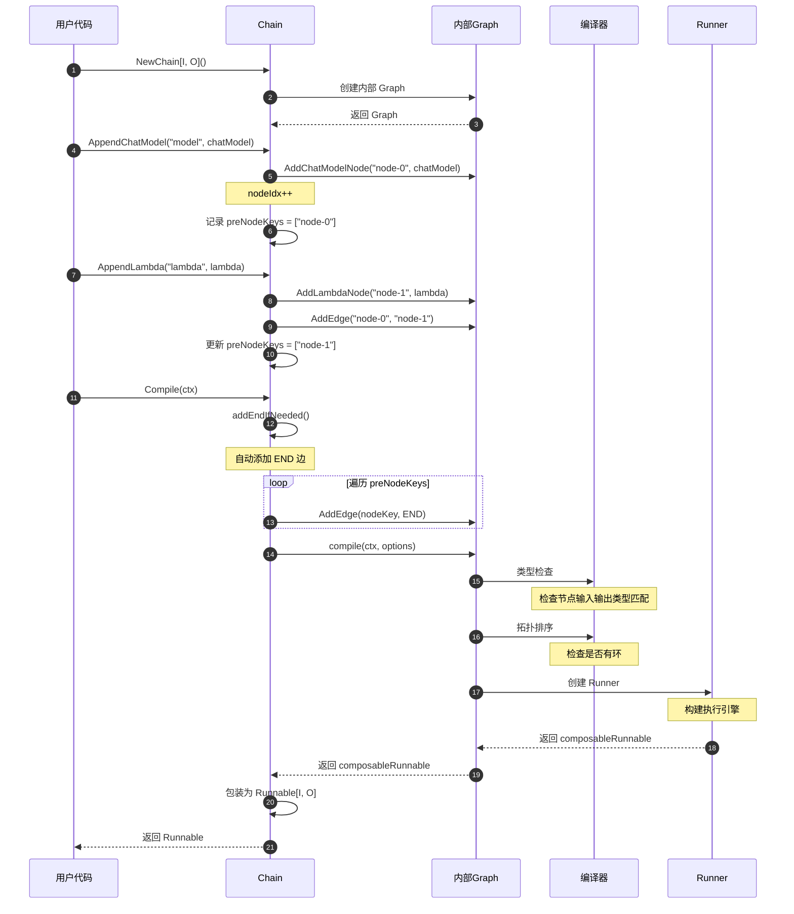
```mermaid
sequenceDiagram
    autonumber
    participant User as 用户代码
    participant Chain as Chain
    participant Graph as 内部Graph
    participant Compiler as 编译器
    participant Runner as Runner

    User->>Chain: NewChain[I, O]()
    Chain->>Graph: 创建内部 Graph
    Graph-->>Chain: 返回 Graph

    User->>Chain: AppendChatModel("model", chatModel)
    Chain->>Graph: AddChatModelNode("node-0", chatModel)
    Note over Chain: nodeIdx++
    Chain->>Chain: 记录 preNodeKeys = ["node-0"]

    User->>Chain: AppendLambda("lambda", lambda)
    Chain->>Graph: AddLambdaNode("node-1", lambda)
    Chain->>Graph: AddEdge("node-0", "node-1")
    Chain->>Chain: 更新 preNodeKeys = ["node-1"]

    User->>Chain: Compile(ctx)
    
    Chain->>Chain: addEndIfNeeded()
    Note over Chain: 自动添加 END 边
    
    loop 遍历 preNodeKeys
        Chain->>Graph: AddEdge(nodeKey, END)
    end

    Chain->>Graph: compile(ctx, options)
    
    Graph->>Compiler: 类型检查
    Note over Compiler: 检查节点输入输出类型匹配
    
    Graph->>Compiler: 拓扑排序
    Note over Compiler: 检查是否有环
    
    Graph->>Runner: 创建 Runner
    Note over Runner: 构建执行引擎
    
    Runner-->>Graph: 返回 composableRunnable
    Graph-->>Chain: 返回 composableRunnable
    
    Chain->>Chain: 包装为 Runnable[I, O]
    Chain-->>User: 返回 Runnable
```

**流程说明**:

1. 创建 Chain 时内部创建 Graph
2. 每次 Append 操作添加节点和边
3. Chain 自动维护 preNodeKeys（上一批节点）
4. Compile 时自动添加到 END 的边
5. 调用 Graph 的 compile 方法
6. 进行类型检查和拓扑排序
7. 创建 Runner 执行引擎
8. 返回可执行的 Runnable

**关键点**:

- Chain 是 Graph 的语法糖，内部委托给 Graph
- 自动维护节点顺序，无需手动添加边
- 编译时进行静态类型检查

---

### 1.2 Chain Invoke 执行流程

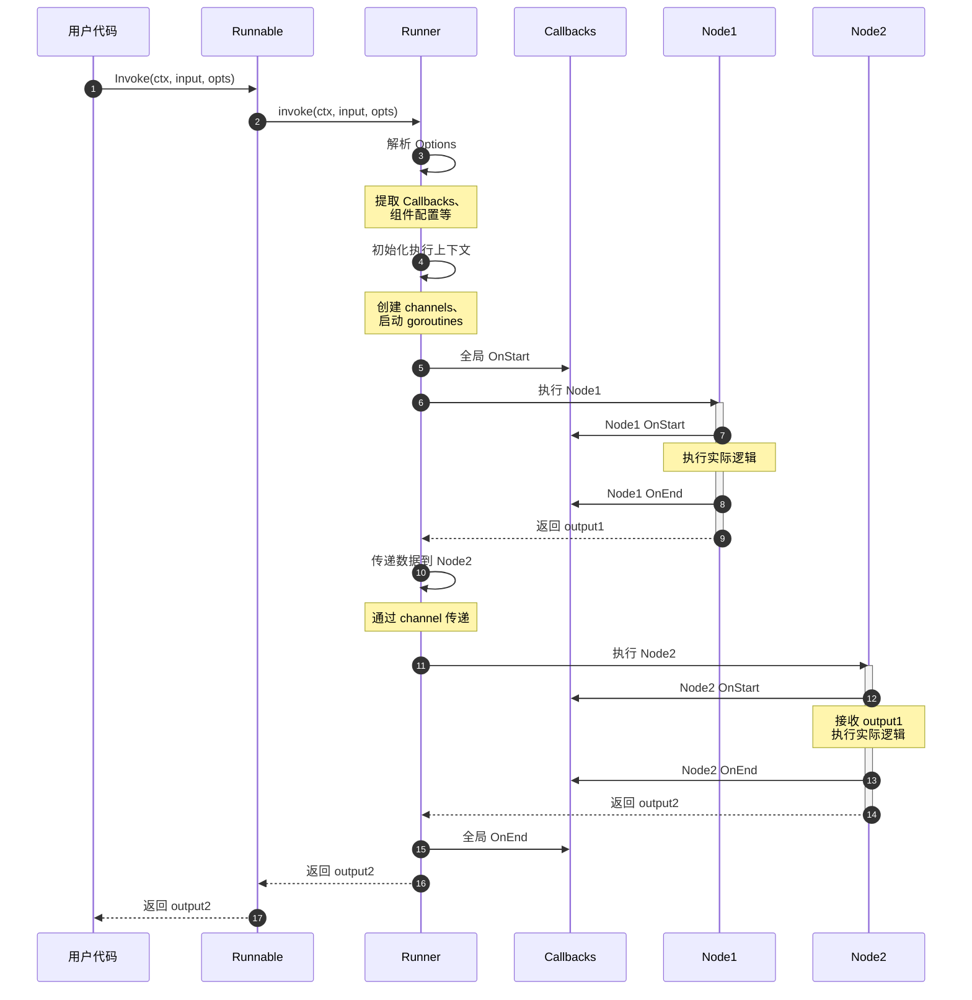
```mermaid
sequenceDiagram
    autonumber
    participant User as 用户代码
    participant Runnable as Runnable
    participant Runner as Runner
    participant CB as Callbacks
    participant Node1 as Node1
    participant Node2 as Node2

    User->>Runnable: Invoke(ctx, input, opts)
    
    Runnable->>Runner: invoke(ctx, input, opts)
    
    Runner->>Runner: 解析 Options
    Note over Runner: 提取 Callbacks、<br/>组件配置等
    
    Runner->>Runner: 初始化执行上下文
    Note over Runner: 创建 channels、<br/>启动 goroutines
    
    Runner->>CB: 全局 OnStart
    
    Runner->>Node1: 执行 Node1
    activate Node1
    
    Node1->>CB: Node1 OnStart
    Note over Node1: 执行实际逻辑
    Node1->>CB: Node1 OnEnd
    Node1-->>Runner: 返回 output1
    deactivate Node1
    
    Runner->>Runner: 传递数据到 Node2
    Note over Runner: 通过 channel 传递
    
    Runner->>Node2: 执行 Node2
    activate Node2
    
    Node2->>CB: Node2 OnStart
    Note over Node2: 接收 output1<br/>执行实际逻辑
    Node2->>CB: Node2 OnEnd
    Node2-->>Runner: 返回 output2
    deactivate Node2
    
    Runner->>CB: 全局 OnEnd
    Runner-->>Runnable: 返回 output2
    Runnable-->>User: 返回 output2
```

**流程说明**:

1. 用户调用 Runnable.Invoke
2. Runner 解析 Options（Callbacks、配置等）
3. 初始化执行上下文（channels、goroutines）
4. 触发全局 OnStart 回调
5. 顺序执行各个节点
6. 每个节点执行前后触发回调
7. 通过 channel 在节点间传递数据
8. 最后返回输出并触发全局 OnEnd

**性能特点**:

- Chain 是顺序执行，无并发
- 节点间通过 channel 传递数据
- Callbacks 不阻塞主流程

---

## 2. Graph DAG 模式执行时序

### 2.1 Graph 编译流程（DAG 模式）

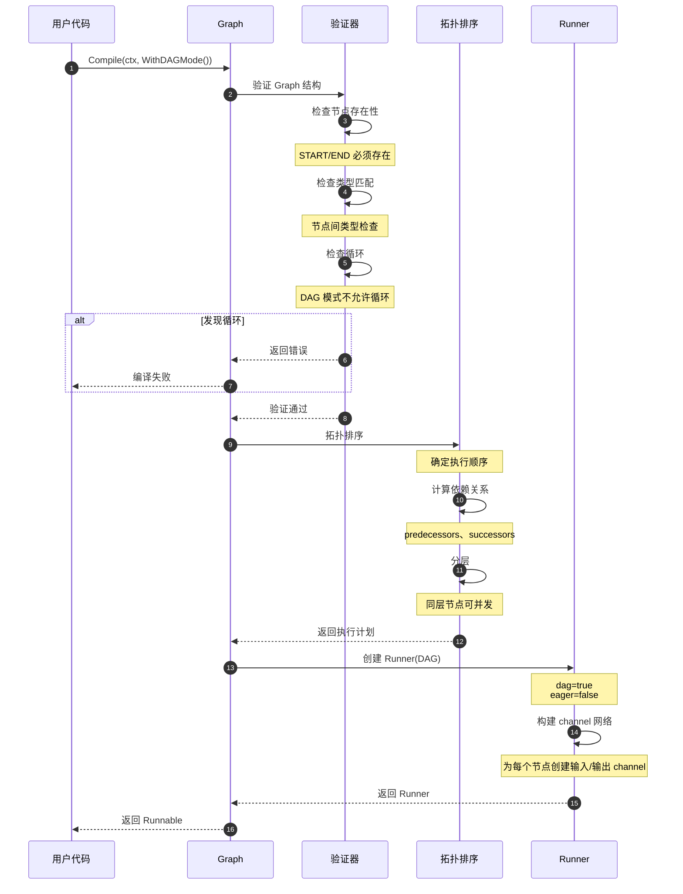
```mermaid
sequenceDiagram
    autonumber
    participant User as 用户代码
    participant Graph as Graph
    participant Validator as 验证器
    participant TopoSort as 拓扑排序
    participant Runner as Runner

    User->>Graph: Compile(ctx, WithDAGMode())
    
    Graph->>Validator: 验证 Graph 结构
    
    Validator->>Validator: 检查节点存在性
    Note over Validator: START/END 必须存在
    
    Validator->>Validator: 检查类型匹配
    Note over Validator: 节点间类型检查
    
    Validator->>Validator: 检查循环
    Note over Validator: DAG 模式不允许循环
    
    alt 发现循环
        Validator-->>Graph: 返回错误
        Graph-->>User: 编译失败
    end
    
    Validator-->>Graph: 验证通过
    
    Graph->>TopoSort: 拓扑排序
    Note over TopoSort: 确定执行顺序
    
    TopoSort->>TopoSort: 计算依赖关系
    Note over TopoSort: predecessors、successors
    
    TopoSort->>TopoSort: 分层
    Note over TopoSort: 同层节点可并发
    
    TopoSort-->>Graph: 返回执行计划
    
    Graph->>Runner: 创建 Runner(DAG)
    Note over Runner: dag=true<br/>eager=false
    
    Runner->>Runner: 构建 channel 网络
    Note over Runner: 为每个节点创建输入/输出 channel
    
    Runner-->>Graph: 返回 Runner
    Graph-->>User: 返回 Runnable
```

**DAG 模式特点**:

- 不允许循环
- 自动并发执行无依赖节点
- 使用拓扑排序确定执行顺序
- 通过 channel 网络传递数据

---

### 2.2 Graph DAG 并发执行时序

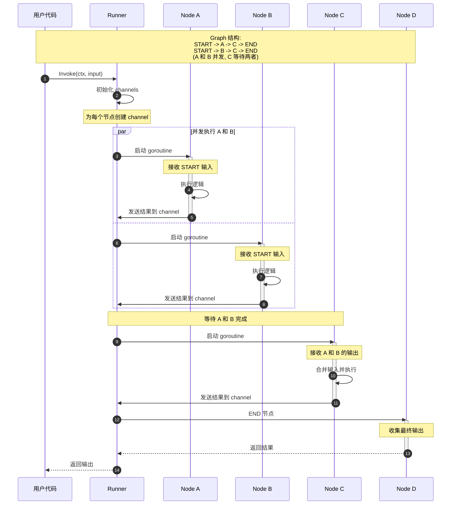
```mermaid
sequenceDiagram
    autonumber
    participant User as 用户代码
    participant Runner as Runner
    participant NodeA as Node A
    participant NodeB as Node B
    participant NodeC as Node C
    participant NodeD as Node D

    Note over User,NodeD: Graph 结构:<br/>START -> A -> C -> END<br/>START -> B -> C -> END<br/>(A 和 B 并发, C 等待两者)

    User->>Runner: Invoke(ctx, input)
    
    Runner->>Runner: 初始化 channels
    Note over Runner: 为每个节点创建 channel
    
    par 并发执行 A 和 B
        Runner->>NodeA: 启动 goroutine
        activate NodeA
        Note over NodeA: 接收 START 输入
        NodeA->>NodeA: 执行逻辑
        NodeA->>Runner: 发送结果到 channel
        deactivate NodeA
    and
        Runner->>NodeB: 启动 goroutine
        activate NodeB
        Note over NodeB: 接收 START 输入
        NodeB->>NodeB: 执行逻辑
        NodeB->>Runner: 发送结果到 channel
        deactivate NodeB
    end
    
    Note over Runner,NodeC: 等待 A 和 B 完成
    
    Runner->>NodeC: 启动 goroutine
    activate NodeC
    Note over NodeC: 接收 A 和 B 的输出
    NodeC->>NodeC: 合并输入并执行
    NodeC->>Runner: 发送结果到 channel
    deactivate NodeC
    
    Runner->>NodeD: END 节点
    activate NodeD
    Note over NodeD: 收集最终输出
    NodeD-->>Runner: 返回结果
    deactivate NodeD
    
    Runner-->>User: 返回输出
```

**并发特点**:

1. 无依赖的节点自动并发执行
2. 有依赖的节点等待所有前驱完成
3. 使用 channel 进行节点间通信
4. goroutine 数量等于节点数量

**性能优势**:

- 最大化并发度
- 减少总体执行时间
- 自动资源管理

---

## 3. Graph Pregel 模式执行时序

### 3.1 Pregel 迭代执行流程

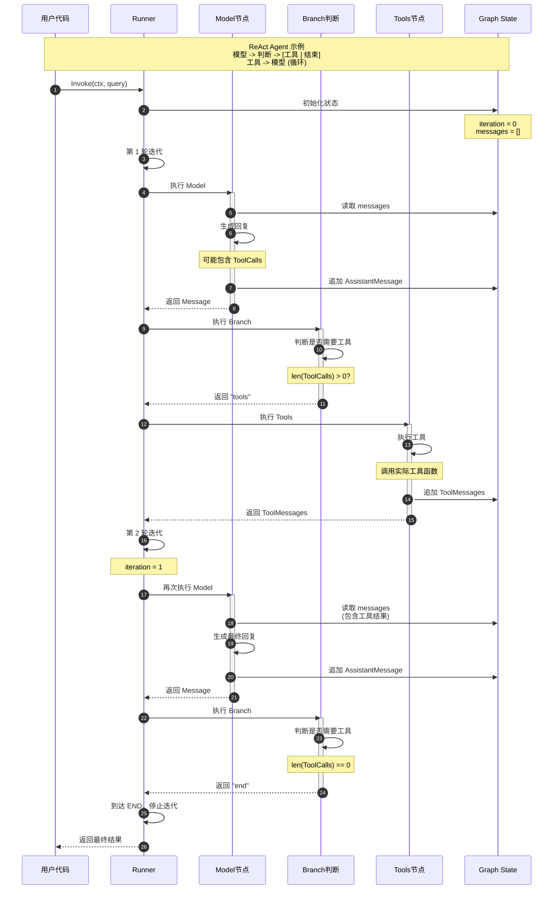
```mermaid
sequenceDiagram
    autonumber
    participant User as 用户代码
    participant Runner as Runner
    participant Model as Model节点
    participant Branch as Branch判断
    participant Tools as Tools节点
    participant State as Graph State

    Note over User,State: ReAct Agent 示例<br/>模型 -> 判断 -> [工具 | 结束]<br/>工具 -> 模型 (循环)

    User->>Runner: Invoke(ctx, query)
    
    Runner->>State: 初始化状态
    Note over State: iteration = 0<br/>messages = []
    
    Runner->>Runner: 第 1 轮迭代
    
    Runner->>Model: 执行 Model
    activate Model
    Model->>State: 读取 messages
    Model->>Model: 生成回复
    Note over Model: 可能包含 ToolCalls
    Model->>State: 追加 AssistantMessage
    Model-->>Runner: 返回 Message
    deactivate Model
    
    Runner->>Branch: 执行 Branch
    activate Branch
    Branch->>Branch: 判断是否需要工具
    Note over Branch: len(ToolCalls) > 0?
    Branch-->>Runner: 返回 "tools"
    deactivate Branch
    
    Runner->>Tools: 执行 Tools
    activate Tools
    Tools->>Tools: 执行工具
    Note over Tools: 调用实际工具函数
    Tools->>State: 追加 ToolMessages
    Tools-->>Runner: 返回 ToolMessages
    deactivate Tools
    
    Runner->>Runner: 第 2 轮迭代
    Note over Runner: iteration = 1
    
    Runner->>Model: 再次执行 Model
    activate Model
    Model->>State: 读取 messages<br/>(包含工具结果)
    Model->>Model: 生成最终回复
    Model->>State: 追加 AssistantMessage
    Model-->>Runner: 返回 Message
    deactivate Model
    
    Runner->>Branch: 执行 Branch
    activate Branch
    Branch->>Branch: 判断是否需要工具
    Note over Branch: len(ToolCalls) == 0
    Branch-->>Runner: 返回 "end"
    deactivate Branch
    
    Runner->>Runner: 到达 END，停止迭代
    Runner-->>User: 返回最终结果
```

**Pregel 模式特点**:

1. 支持循环边
2. 迭代执行，每轮可以经过多个节点
3. 必须设置 MaxRunSteps 防止无限循环
4. 适合 Agent、工作流等场景

**迭代控制**:

- 达到 MaxRunSteps 时强制停止
- 到达 END 节点时停止
- 发生错误时停止

---

### 3.2 Pregel 最大迭代次数保护

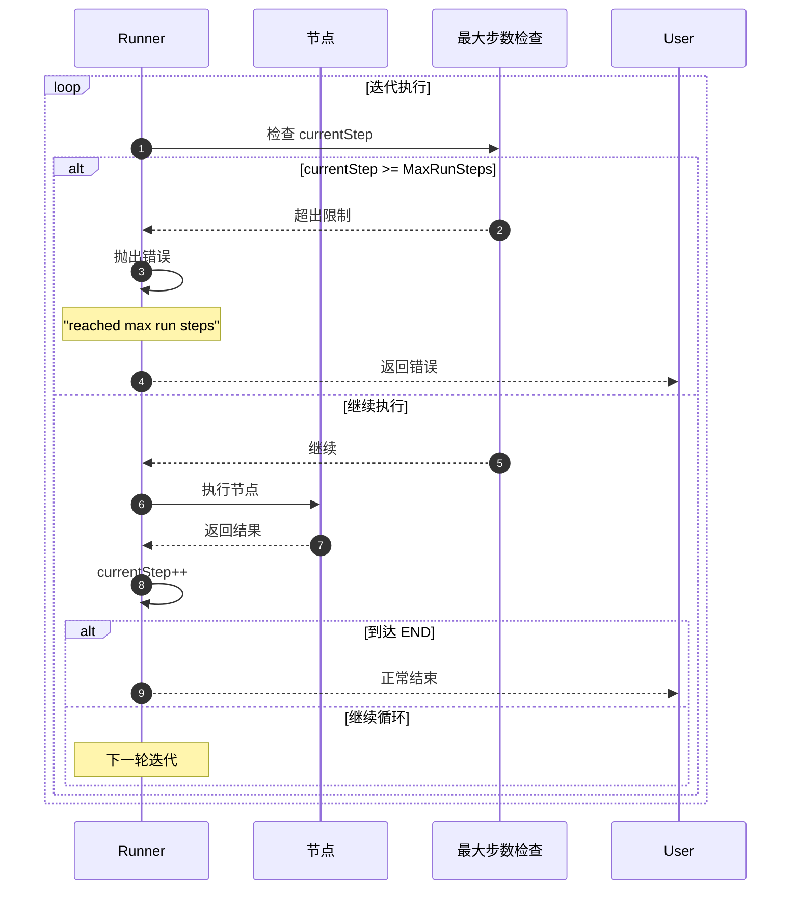
```mermaid
sequenceDiagram
    autonumber
    participant Runner as Runner
    participant Node as 节点
    participant MaxSteps as 最大步数检查

    loop 迭代执行
        Runner->>MaxSteps: 检查 currentStep
        
        alt currentStep >= MaxRunSteps
            MaxSteps-->>Runner: 超出限制
            Runner->>Runner: 抛出错误
            Note over Runner: "reached max run steps"
            Runner-->>User: 返回错误
        else 继续执行
            MaxSteps-->>Runner: 继续
            
            Runner->>Node: 执行节点
            Node-->>Runner: 返回结果
            
            Runner->>Runner: currentStep++
            
            alt 到达 END
                Runner-->>User: 正常结束
            else 继续循环
                Note over Runner: 下一轮迭代
            end
        end
    end
```

**保护机制**:

- 每轮迭代递增计数器
- 达到上限时返回错误
- 避免无限循环导致资源耗尽

---

## 4. Workflow 执行时序

### 4.1 Workflow 依赖解析和执行

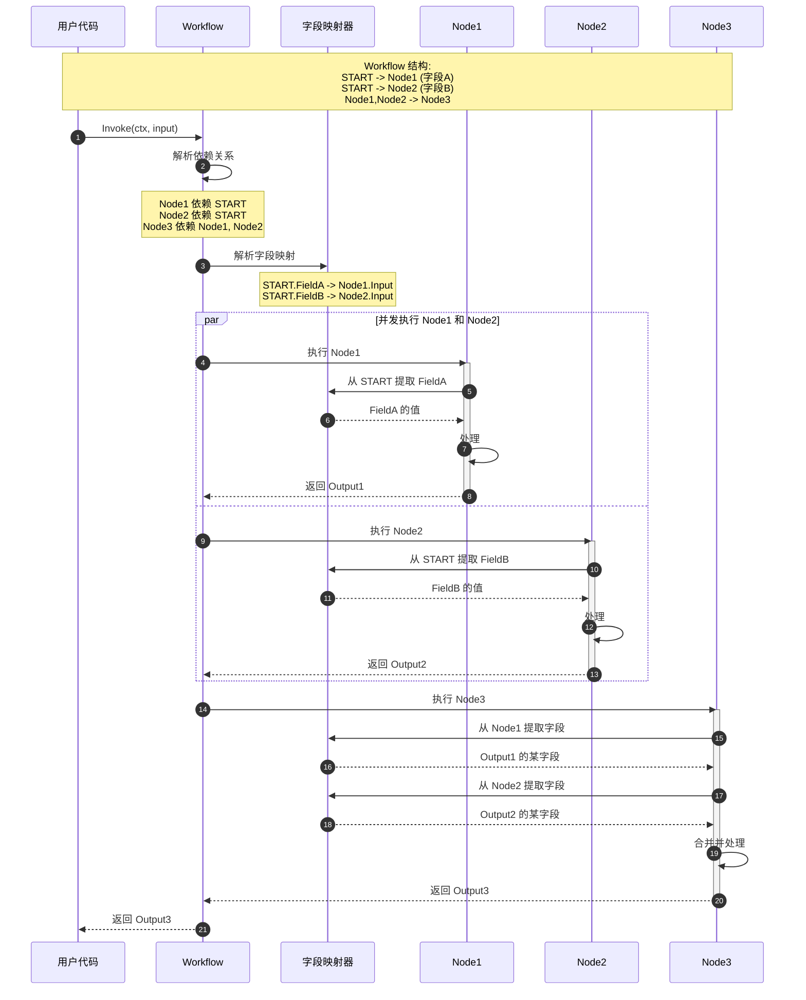
```mermaid
sequenceDiagram
    autonumber
    participant User as 用户代码
    participant WF as Workflow
    participant FieldMap as 字段映射器
    participant Node1 as Node1
    participant Node2 as Node2
    participant Node3 as Node3

    Note over User,Node3: Workflow 结构:<br/>START -> Node1 (字段A)<br/>START -> Node2 (字段B)<br/>Node1,Node2 -> Node3

    User->>WF: Invoke(ctx, input)
    
    WF->>WF: 解析依赖关系
    Note over WF: Node1 依赖 START<br/>Node2 依赖 START<br/>Node3 依赖 Node1, Node2
    
    WF->>FieldMap: 解析字段映射
    Note over FieldMap: START.FieldA -> Node1.Input<br/>START.FieldB -> Node2.Input
    
    par 并发执行 Node1 和 Node2
        WF->>Node1: 执行 Node1
        activate Node1
        Node1->>FieldMap: 从 START 提取 FieldA
        FieldMap-->>Node1: FieldA 的值
        Node1->>Node1: 处理
        Node1-->>WF: 返回 Output1
        deactivate Node1
    and
        WF->>Node2: 执行 Node2
        activate Node2
        Node2->>FieldMap: 从 START 提取 FieldB
        FieldMap-->>Node2: FieldB 的值
        Node2->>Node2: 处理
        Node2-->>WF: 返回 Output2
        deactivate Node2
    end
    
    WF->>Node3: 执行 Node3
    activate Node3
    Node3->>FieldMap: 从 Node1 提取字段
    FieldMap-->>Node3: Output1 的某字段
    Node3->>FieldMap: 从 Node2 提取字段
    FieldMap-->>Node3: Output2 的某字段
    Node3->>Node3: 合并并处理
    Node3-->>WF: 返回 Output3
    deactivate Node3
    
    WF-->>User: 返回 Output3
```

**Workflow 特点**:

1. 显式声明依赖关系
2. 支持字段级数据映射
3. 自动并发执行无依赖节点
4. 不支持循环

**字段映射**:

- MapFields: 字段到字段映射
- MapKey: Map 的 key 映射
- StaticValue: 静态值注入

---

## 5. 分支执行时序

### 5.1 Graph 分支路由

```mermaid
sequenceDiagram
    autonumber
    participant Runner as Runner
    participant Source as 源节点
    participant Branch as 分支Lambda
    participant Target1 as 目标节点1
    participant Target2 as 目标节点2
    participant END as END节点

    Runner->>Source: 执行源节点
    Source-->>Runner: 返回 output
    
    Runner->>Branch: 执行分支判断
    Branch->>Branch: 判断逻辑
    Note over Branch: 根据 output 决定路由
    
    alt 条件1满足
        Branch-->>Runner: 返回 "target1"
        Runner->>Target1: 路由到 Target1
        activate Target1
        Target1->>Target1: 处理
        Target1-->>Runner: 返回结果
        deactivate Target1
    else 条件2满足
        Branch-->>Runner: 返回 "target2"
        Runner->>Target2: 路由到 Target2
        activate Target2
        Target2->>Target2: 处理
        Target2-->>Runner: 返回结果
        deactivate Target2
    else 其他
        Branch-->>Runner: 返回 "end"
        Runner->>END: 直接结束
    end
    
    Runner-->>User: 返回最终结果
```

**分支规则**:

- Branch Lambda 返回字符串（目标节点 key）
- pathMap 定义了返回值到节点的映射
- 必须覆盖所有可能的返回值

---

## 6. 流式执行时序

### 6.1 Stream 模式执行

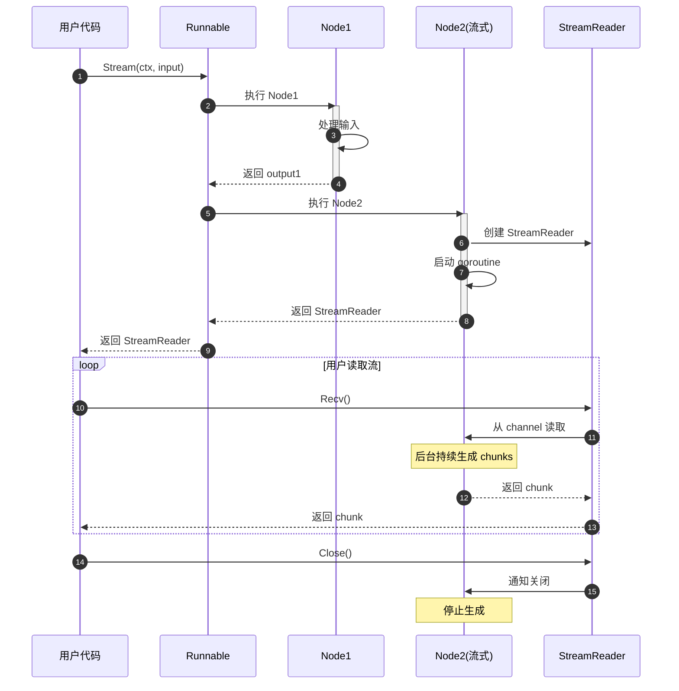
```mermaid
sequenceDiagram
    autonumber
    participant User as 用户代码
    participant Runnable as Runnable
    participant Node1 as Node1
    participant Node2 as Node2(流式)
    participant SR as StreamReader

    User->>Runnable: Stream(ctx, input)
    
    Runnable->>Node1: 执行 Node1
    activate Node1
    Node1->>Node1: 处理输入
    Node1-->>Runnable: 返回 output1
    deactivate Node1
    
    Runnable->>Node2: 执行 Node2
    activate Node2
    Node2->>SR: 创建 StreamReader
    Node2->>Node2: 启动 goroutine
    
    Node2-->>Runnable: 返回 StreamReader
    deactivate Node2
    
    Runnable-->>User: 返回 StreamReader
    
    loop 用户读取流
        User->>SR: Recv()
        
        SR->>Node2: 从 channel 读取
        Note over Node2: 后台持续生成 chunks
        Node2-->>SR: 返回 chunk
        
        SR-->>User: 返回 chunk
    end
    
    User->>SR: Close()
    SR->>Node2: 通知关闭
    Note over Node2: 停止生成
```

**流式特点**:

- 支持逐块输出
- 后台 goroutine 持续生成数据
- 通过 channel 实现异步传输

---

### 6.2 流的自动拼接和复制

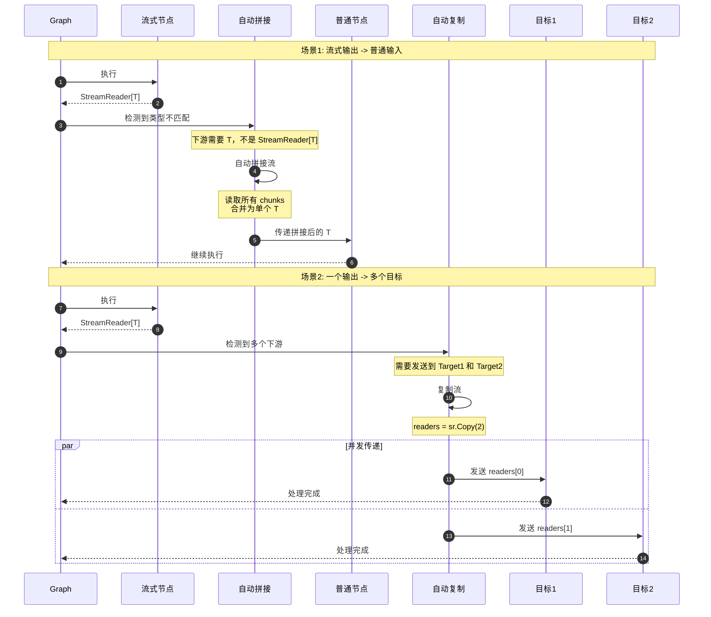
```mermaid
sequenceDiagram
    autonumber
    participant Graph as Graph
    participant StreamNode as 流式节点
    participant AutoConcat as 自动拼接
    participant NormalNode as 普通节点
    participant AutoCopy as 自动复制
    participant Target1 as 目标1
    participant Target2 as 目标2

    Note over Graph,Target2: 场景1: 流式输出 -> 普通输入

    Graph->>StreamNode: 执行
    StreamNode-->>Graph: StreamReader[T]
    
    Graph->>AutoConcat: 检测到类型不匹配
    Note over AutoConcat: 下游需要 T，不是 StreamReader[T]
    
    AutoConcat->>AutoConcat: 自动拼接流
    Note over AutoConcat: 读取所有 chunks<br/>合并为单个 T
    
    AutoConcat->>NormalNode: 传递拼接后的 T
    NormalNode-->>Graph: 继续执行
    
    Note over Graph,Target2: 场景2: 一个输出 -> 多个目标

    Graph->>StreamNode: 执行
    StreamNode-->>Graph: StreamReader[T]
    
    Graph->>AutoCopy: 检测到多个下游
    Note over AutoCopy: 需要发送到 Target1 和 Target2
    
    AutoCopy->>AutoCopy: 复制流
    Note over AutoCopy: readers = sr.Copy(2)
    
    par 并发传递
        AutoCopy->>Target1: 发送 readers[0]
        Target1-->>Graph: 处理完成
    and
        AutoCopy->>Target2: 发送 readers[1]
        Target2-->>Graph: 处理完成
    end
```

**自动处理**:

- **自动拼接**: 流输出连接普通输入时
- **自动复制**: 一个输出连接多个目标时
- 完全透明，用户无需关心

---

## 7. Callbacks 执行时序

### 7.1 完整的 Callbacks 调用流程

```mermaid
sequenceDiagram
    autonumber
    participant User as 用户代码
    participant Runner as Runner
    participant GlobalCB as 全局Callbacks
    participant NodeCB as 节点Callbacks
    participant Node as 节点

    User->>Runner: Invoke(ctx, input, WithCallbacks(...))
    
    Runner->>Runner: 收集 Callbacks
    Note over Runner: 全局 + 组件类型 + 节点
    
    Runner->>GlobalCB: OnStart(全局)
    GlobalCB-->>Runner: 修改后的 ctx
    
    Runner->>Node: 准备执行节点
    
    Runner->>NodeCB: OnStart(节点)
    NodeCB-->>Runner: 修改后的 ctx
    
    Runner->>Node: 执行节点
    activate Node
    
    alt 执行成功
        Node-->>Runner: 返回 output
        deactivate Node
        
        Runner->>NodeCB: OnEnd(节点)
        NodeCB-->>Runner: ctx
        
        Runner->>GlobalCB: OnEnd(全局)
        GlobalCB-->>Runner: ctx
        
    else 执行失败
        Node-->>Runner: 返回 error
        deactivate Node
        
        Runner->>NodeCB: OnError(节点)
        NodeCB-->>Runner: ctx
        
        Runner->>GlobalCB: OnError(全局)
        GlobalCB-->>Runner: ctx
        
        Runner-->>User: 返回 error
    end
    
    Runner-->>User: 返回 output
```

**Callbacks 顺序**:

1. 全局 OnStart
2. 节点 OnStart
3. 执行节点
4. 节点 OnEnd/OnError
5. 全局 OnEnd/OnError

---

## 8. 状态管理时序

### 8.1 Graph State 读写流程

```mermaid
sequenceDiagram
    autonumber
    participant Runner as Runner
    participant State as State对象
    participant PreHandler as 前置处理器
    participant Node as 节点
    participant PostHandler as 后置处理器

    Runner->>State: 初始化状态
    Note over State: stateGenerator(ctx)
    
    Runner->>PreHandler: 执行前置处理器
    PreHandler->>State: 读取状态（加锁）
    Note over State: 读取 state.Messages等
    PreHandler->>PreHandler: 修改 ctx
    PreHandler-->>Runner: 返回 ctx
    
    Runner->>Node: 执行节点（使用修改后的 ctx）
    Node-->>Runner: 返回 output
    
    Runner->>PostHandler: 执行后置处理器
    PostHandler->>State: 写入状态（加锁）
    Note over State: state.Messages.append(output)
    PostHandler-->>Runner: 完成
    
    Note over Runner,PostHandler: 下一个节点继续这个流程
```

**状态管理特点**:

- State 在所有节点间共享
- 读写通过锁保证线程安全
- PreHandler 读取状态，PostHandler 写入状态
- 适合需要保持上下文的场景（如 Agent）

---

## 9. 错误处理时序

### 9.1 节点错误传播

```mermaid
sequenceDiagram
    autonumber
    participant Runner as Runner
    participant Node1 as Node1
    participant Node2 as Node2
    participant ErrorHandler as 错误处理
    participant User as 用户

    Runner->>Node1: 执行 Node1
    activate Node1
    Node1->>Node1: 处理失败
    Node1-->>Runner: 返回 error
    deactivate Node1
    
    Runner->>ErrorHandler: 触发 OnError
    ErrorHandler->>ErrorHandler: 记录错误
    ErrorHandler->>ErrorHandler: 发送告警（可选）
    ErrorHandler-->>Runner: 返回
    
    Runner->>Runner: 停止执行
    Note over Runner: 不再执行后续节点
    
    Runner->>Runner: 清理资源
    Note over Runner: 关闭 channels、<br/>取消 goroutines
    
    Runner-->>User: 返回 error
```

**错误处理**:

- 任一节点失败，停止整个执行
- 触发 OnError 回调
- 自动清理资源
- 错误信息传播给用户

---

## 10. 性能优化时序示例

### 10.1 并发执行优化

```mermaid
sequenceDiagram
    autonumber
    participant User as 用户
    participant Graph as Graph(DAG模式)
    participant A as 独立节点A
    participant B as 独立节点B
    participant C as 独立节点C
    participant D as 汇总节点D

    Note over User,D: 优化前: 顺序执行 A->B->C->D<br/>优化后: 并发执行 (A,B,C) -> D

    User->>Graph: Invoke(ctx, input)
    
    par 并发执行 A, B, C
        Graph->>A: 启动 A
        activate A
        Note over A: 耗时 1s
        A-->>Graph: 返回结果A
        deactivate A
    and
        Graph->>B: 启动 B
        activate B
        Note over B: 耗时 1s
        B-->>Graph: 返回结果B
        deactivate B
    and
        Graph->>C: 启动 C
        activate C
        Note over C: 耗时 1s
        C-->>Graph: 返回结果C
        deactivate C
    end
    
    Note over Graph: 总耗时: ~1s (并发)<br/>vs 3s (顺序)
    
    Graph->>D: 执行 D
    activate D
    D->>D: 合并 A, B, C 的结果
    D-->>Graph: 返回最终结果
    deactivate D
    
    Graph-->>User: 返回结果
```

**性能提升**:

- 顺序执行: 1s + 1s + 1s + 处理时间 = 3s+
- 并发执行: max(1s, 1s, 1s) + 处理时间 = 1s+
- 提升 3 倍性能

---

**文档版本**: v1.0  
**最后更新**: 2024-12-19  
**适用 Eino 版本**: main 分支（最新版本）

---
