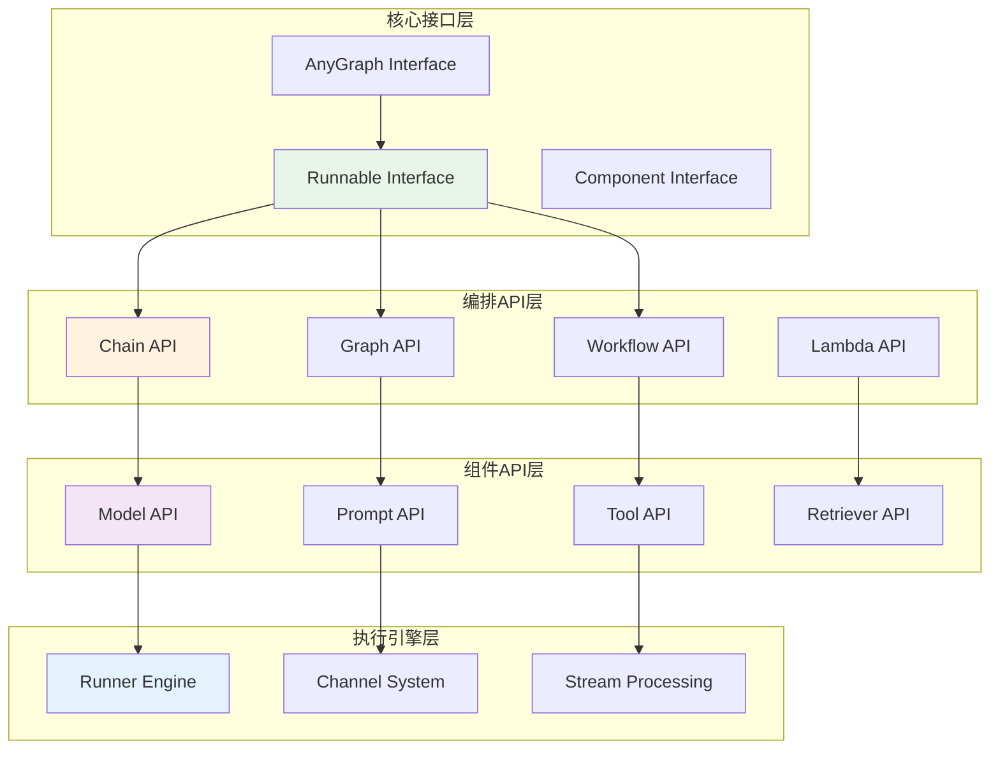
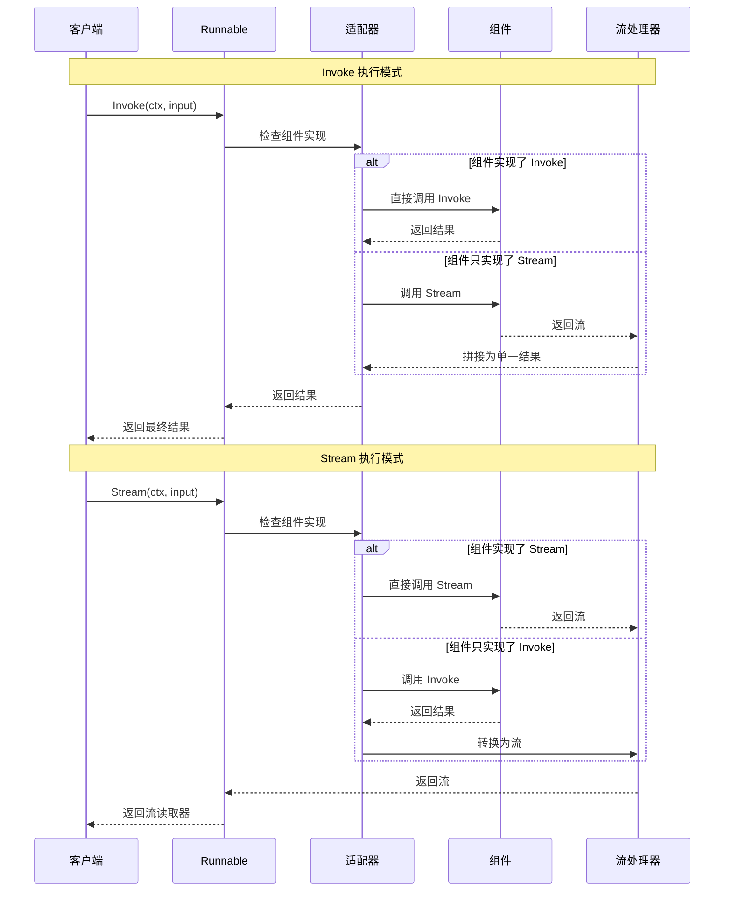

## 📖 文档概述

本文档深入分析 Eino 框架的核心API，包括 Runnable 接口、编排API、Lambda函数、以及各种执行模式的详细实现和调用链路。

## 🎯 核心API概览

### API层次结构



## 🔧 Runnable 核心接口详解

### 接口定义与设计理念

```go
// Runnable 是框架的核心抽象，定义了四种数据流模式
// 支持自动降级兼容，组件只需实现一种或多种方法即可
type Runnable[I, O any] interface {
    // Invoke: 单输入 => 单输出 (ping => pong)
    // 最基础的执行模式，适用于简单的请求-响应场景
    Invoke(ctx context.Context, input I, opts ...Option) (output O, err error)
    
    // Stream: 单输入 => 流输出 (ping => stream)
    // 适用于需要实时输出的场景，如聊天对话、长文本生成
    Stream(ctx context.Context, input I, opts ...Option) (output *schema.StreamReader[O], err error)
    
    // Collect: 流输入 => 单输出 (stream => pong)
    // 适用于需要处理流式输入并产生最终结果的场景
    Collect(ctx context.Context, input *schema.StreamReader[I], opts ...Option) (output O, err error)
    
    // Transform: 流输入 => 流输出 (stream => stream)
    // 适用于流式数据转换场景，如实时数据处理管道
    Transform(ctx context.Context, input *schema.StreamReader[I], opts ...Option) (output *schema.StreamReader[O], err error)
}
```

### 自动适配机制

```go
// composableRunnable 实现自动适配不同执行模式
type composableRunnable struct {
    i invoke    // Invoke 方法适配器
    t transform // Transform 方法适配器
    
    inputType  reflect.Type  // 输入类型
    outputType reflect.Type  // 输出类型
    optionType reflect.Type  // 选项类型
    
    *genericHelper           // 泛型辅助器
    isPassthrough bool       // 是否为透传节点
    meta *executorMeta       // 执行器元数据
    nodeInfo *nodeInfo       // 节点信息
}

// 自动适配：如果组件只实现了 Stream，自动适配到 Invoke
func invokeByStream[I, O, TOption any](s Stream[I, O, TOption]) Invoke[I, O, TOption] {
    return func(ctx context.Context, input I, opts ...TOption) (O, error) {
        // 调用 Stream 方法获取流
        stream, err := s(ctx, input, opts...)
        if err != nil {
            return *new(O), err
        }
        defer stream.Close()
        
        // 自动拼接流数据为单一结果
        return schema.ConcatStreamReader(stream)
    }
}

// 自动适配：如果组件只实现了 Invoke，自动适配到 Stream
func streamByInvoke[I, O, TOption any](i Invoke[I, O, TOption]) Stream[I, O, TOption] {
    return func(ctx context.Context, input I, opts ...TOption) (*schema.StreamReader[O], error) {
        // 调用 Invoke 方法获取结果
        result, err := i(ctx, input, opts...)
        if err != nil {
            return nil, err
        }
        
        // 将单一结果转换为流
        return schema.StreamReaderFromArray([]O{result}), nil
    }
}

// 自动适配：Transform 到 Collect
func collectByTransform[I, O, TOption any](t Transform[I, O, TOption]) Collect[I, O, TOption] {
    return func(ctx context.Context, input *schema.StreamReader[I], opts ...TOption) (O, error) {
        // 调用 Transform 获取输出流
        outputStream, err := t(ctx, input, opts...)
        if err != nil {
            return *new(O), err
        }
        defer outputStream.Close()
        
        // 拼接输出流为单一结果
        return schema.ConcatStreamReader(outputStream)
    }
}
```

### 执行时序图



## 🔗 Chain 链式编排API

### Chain 核心结构

```go
// Chain 是组件的链式编排，支持顺序、并行、分支执行
type Chain[I, O any] struct {
    err error           // 构建过程中的错误
    gg *Graph[I, O]     // 底层图结构
    nodeIdx int         // 节点索引计数器
    preNodeKeys []string // 前置节点键列表
    hasEnd bool         // 是否已添加结束节点
}

// 创建新的链式编排
func NewChain[I, O any](opts ...NewGraphOption) *Chain[I, O] {
    ch := &Chain[I, O]{
        gg: NewGraph[I, O](opts...),
    }
    ch.gg.cmp = ComponentOfChain
    return ch
}
```

### 链式API方法详解

#### 1. AppendChatModel - 添加聊天模型

```go
// AppendChatModel 添加聊天模型节点到链中
// 参数:
//   - node: 实现 model.BaseChatModel 接口的聊天模型
//   - opts: 节点配置选项
// 返回: 链实例，支持链式调用
func (c *Chain[I, O]) AppendChatModel(node model.BaseChatModel, opts ...GraphAddNodeOpt) *Chain[I, O] {
    // 将聊天模型转换为图节点
    gNode, options := toChatModelNode(node, opts...)
    // 添加节点到链中
    c.addNode(gNode, options)
    return c
}

// toChatModelNode 将聊天模型转换为图节点
func toChatModelNode(node model.BaseChatModel, opts ...GraphAddNodeOpt) (*graphNode, *graphAddNodeOpts) {
    options := getGraphAddNodeOpts(opts...)
    
    // 创建可组合的可执行对象
    cr := runnableLambda(
        // Invoke 实现
        func(ctx context.Context, messages []*schema.Message, opts ...model.Option) (*schema.Message, error) {
            return node.Generate(ctx, messages, opts...)
        },
        // Stream 实现
        func(ctx context.Context, messages []*schema.Message, opts ...model.Option) (*schema.StreamReader[*schema.Message], error) {
            return node.Stream(ctx, messages, opts...)
        },
        nil, nil, // Collect 和 Transform 为 nil，将自动适配
        true, // 启用回调
    )
    
    // 设置执行器元数据
    cr.meta = &executorMeta{
        component:                  ComponentOfChatModel,
        isComponentCallbackEnabled: false,
        componentImplType:          getComponentImplType(node),
    }
    
    return &graphNode{
        cr:       cr,
        instance: node,
        opts:     options,
    }, options
}
```

#### 2. AppendChatTemplate - 添加聊天模板

```go
// AppendChatTemplate 添加聊天模板节点到链中
func (c *Chain[I, O]) AppendChatTemplate(node prompt.ChatTemplate, opts ...GraphAddNodeOpt) *Chain[I, O] {
    gNode, options := toChatTemplateNode(node, opts...)
    c.addNode(gNode, options)
    return c
}

// toChatTemplateNode 实现细节
func toChatTemplateNode(node prompt.ChatTemplate, opts ...GraphAddNodeOpt) (*graphNode, *graphAddNodeOpts) {
    options := getGraphAddNodeOpts(opts...)
    
    cr := runnableLambda(
        // Invoke 实现：格式化模板
        func(ctx context.Context, input map[string]any, opts ...prompt.Option) ([]*schema.Message, error) {
            return node.Format(ctx, input, opts...)
        },
        // Stream 实现：将格式化结果转换为流
        func(ctx context.Context, input map[string]any, opts ...prompt.Option) (*schema.StreamReader[[]*schema.Message], error) {
            messages, err := node.Format(ctx, input, opts...)
            if err != nil {
                return nil, err
            }
            return schema.StreamReaderFromArray([][]*schema.Message{messages}), nil
        },
        nil, nil,
        true,
    )
    
    cr.meta = &executorMeta{
        component:                  ComponentOfChatTemplate,
        isComponentCallbackEnabled: false,
        componentImplType:          getComponentImplType(node),
    }
    
    return &graphNode{
        cr:       cr,
        instance: node,
        opts:     options,
    }, options
}
```

#### 3. AppendLambda - 添加自定义Lambda函数

```go
// AppendLambda 添加Lambda节点到链中
// Lambda 是用户自定义逻辑的包装器
func (c *Chain[I, O]) AppendLambda(node *Lambda, opts ...GraphAddNodeOpt) *Chain[I, O] {
    gNode, options := toLambdaNode(node, opts...)
    c.addNode(gNode, options)
    return c
}

// toLambdaNode 实现
func toLambdaNode(node *Lambda, opts ...GraphAddNodeOpt) (*graphNode, *graphAddNodeOpts) {
    options := getGraphAddNodeOpts(opts...)
    
    return &graphNode{
        cr:       node.executor, // 直接使用 Lambda 的执行器
        instance: node,
        opts:     options,
    }, options
}
```

### 并行和分支支持

#### 1. AppendParallel - 添加并行节点

```go
// AppendParallel 添加并行结构到链中
// 多个节点将并发执行，结果合并后传递给下一个节点
func (c *Chain[I, O]) AppendParallel(p *Parallel) *Chain[I, O] {
    if p == nil {
        c.reportError(fmt.Errorf("append parallel invalid, parallel is nil"))
        return c
    }
    
    if len(p.nodes) <= 1 {
        c.reportError(fmt.Errorf("append parallel invalid, not enough nodes, count = %d", len(p.nodes)))
        return c
    }
    
    // 确定起始节点
    var startNode string
    if len(c.preNodeKeys) == 0 {
        startNode = START
    } else if len(c.preNodeKeys) == 1 {
        startNode = c.preNodeKeys[0]
    } else {
        c.reportError(fmt.Errorf("append parallel invalid, multiple previous nodes: %v", c.preNodeKeys))
        return c
    }
    
    // 为每个并行节点创建边
    prefix := c.nextNodeKey()
    var nodeKeys []string
    
    for i, node := range p.nodes {
        nodeKey := fmt.Sprintf("%s_parallel_%d", prefix, i)
        
        // 添加节点到图中
        if err := c.gg.addNode(nodeKey, node.First, node.Second); err != nil {
            c.reportError(fmt.Errorf("add parallel node failed: %w", err))
            return c
        }
        
        // 添加从起始节点到并行节点的边
        if err := c.gg.AddEdge(startNode, nodeKey); err != nil {
            c.reportError(fmt.Errorf("add parallel edge failed: %w", err))
            return c
        }
        
        nodeKeys = append(nodeKeys, nodeKey)
    }
    
    // 更新前置节点列表
    c.preNodeKeys = nodeKeys
    return c
}
```

#### 2. AppendBranch - 添加条件分支

```go
// AppendBranch 添加条件分支到链中
// 根据条件函数的返回值选择执行路径
func (c *Chain[I, O]) AppendBranch(b *ChainBranch) *Chain[I, O] {
    if b == nil {
        c.reportError(fmt.Errorf("append branch invalid, branch is nil"))
        return c
    }
    
    // 验证分支配置
    if len(b.key2BranchNode) <= 1 {
        c.reportError(fmt.Errorf("append branch invalid, need at least 2 branches"))
        return c
    }
    
    // 确定起始节点
    var startNode string
    if len(c.preNodeKeys) == 1 {
        startNode = c.preNodeKeys[0]
    } else {
        c.reportError(fmt.Errorf("append branch invalid, multiple previous nodes: %v", c.preNodeKeys))
        return c
    }
    
    // 为每个分支创建节点
    prefix := c.nextNodeKey()
    key2NodeKey := make(map[string]string)
    
    for key, node := range b.key2BranchNode {
        nodeKey := fmt.Sprintf("%s_branch_%s", prefix, key)
        
        if err := c.gg.addNode(nodeKey, node.First, node.Second); err != nil {
            c.reportError(fmt.Errorf("add branch node failed: %w", err))
            return c
        }
        
        key2NodeKey[key] = nodeKey
    }
    
    // 创建分支逻辑
    gBranch := *b.internalBranch
    gBranch.invoke = func(ctx context.Context, in any) ([]string, error) {
        ends, err := b.internalBranch.invoke(ctx, in)
        if err != nil {
            return nil, err
        }
        
        // 将分支键转换为节点键
        nodeKeyEnds := make([]string, 0, len(ends))
        for _, end := range ends {
            if nodeKey, ok := key2NodeKey[end]; ok {
                nodeKeyEnds = append(nodeKeyEnds, nodeKey)
            } else {
                return nil, fmt.Errorf("branch returns unknown end node: %s", end)
            }
        }
        
        return nodeKeyEnds, nil
    }
    
    // 添加分支到图中
    if err := c.gg.AddBranch(startNode, &gBranch); err != nil {
        c.reportError(fmt.Errorf("chain append branch failed: %w", err))
        return c
    }
    
    // 更新前置节点列表
    c.preNodeKeys = gmap.Values(key2NodeKey)
    return c
}
```

### 编译和执行

```go
// Compile 编译链为可执行的 Runnable
func (c *Chain[I, O]) Compile(ctx context.Context, opts ...GraphCompileOption) (Runnable[I, O], error) {
    // 添加结束节点（如果需要）
    if err := c.addEndIfNeeded(); err != nil {
        return nil, err
    }
    
    // 委托给底层图进行编译
    return c.gg.Compile(ctx, opts...)
}

// addEndIfNeeded 添加结束边
func (c *Chain[I, O]) addEndIfNeeded() error {
    if c.hasEnd {
        return nil
    }
    
    if c.err != nil {
        return c.err
    }
    
    if len(c.preNodeKeys) == 0 {
        return fmt.Errorf("no nodes in chain")
    }
    
    // 为所有前置节点添加到 END 的边
    for _, nodeKey := range c.preNodeKeys {
        if err := c.gg.AddEdge(nodeKey, END); err != nil {
            return err
        }
    }
    
    c.hasEnd = true
    return nil
}
```

## 📊 Graph 图式编排API

### Graph 核心结构

```go
// graph 是图式编排的核心结构
type graph struct {
    nodes        map[string]*graphNode     // 节点映射
    controlEdges map[string][]string      // 控制边（执行依赖）
    dataEdges    map[string][]string      // 数据边（数据流）
    branches     map[string][]*GraphBranch // 分支映射
    startNodes   []string                 // 起始节点
    endNodes     []string                 // 结束节点
    
    stateType      reflect.Type           // 状态类型
    stateGenerator func(ctx context.Context) any // 状态生成器
    
    expectedInputType, expectedOutputType reflect.Type // 期望的输入输出类型
    
    *genericHelper                        // 泛型辅助器
    
    fieldMappingRecords map[string][]*FieldMapping // 字段映射记录
    buildError error                     // 构建错误
    cmp component                        // 组件类型
    compiled bool                        // 是否已编译
    
    // 处理器映射
    handlerOnEdges   map[string]map[string][]handlerPair // 边处理器
    handlerPreNode   map[string][]handlerPair            // 节点前处理器
    handlerPreBranch map[string][][]handlerPair          // 分支前处理器
}
```

### Graph API方法详解

#### 1. AddChatModelNode - 添加聊天模型节点

```go
// AddChatModelNode 添加聊天模型节点到图中
func (g *graph) AddChatModelNode(key string, node model.BaseChatModel, opts ...GraphAddNodeOpt) error {
    gNode, options := toChatModelNode(node, opts...)
    return g.addNode(key, gNode, options)
}

// addNode 添加节点的核心逻辑
func (g *graph) addNode(key string, node *graphNode, options *graphAddNodeOpts) error {
    if g.buildError != nil {
        return g.buildError
    }
    
    if g.compiled {
        return ErrGraphCompiled
    }
    
    // 检查节点键是否为保留字
    if key == END || key == START {
        return fmt.Errorf("node '%s' is reserved", key)
    }
    
    // 检查节点是否已存在
    if _, ok := g.nodes[key]; ok {
        return fmt.Errorf("node '%s' already exists", key)
    }
    
    // 检查状态需求
    if options.needState && g.stateGenerator == nil {
        return fmt.Errorf("node '%s' needs state but graph state is not enabled", key)
    }
    
    // 验证处理器类型
    if options.processor != nil {
        if err := g.validateProcessor(key, node, options.processor); err != nil {
            return err
        }
    }
    
    g.nodes[key] = node
    return nil
}
```

#### 2. AddEdge - 添加边

```go
// AddEdge 添加数据和控制边
func (g *graph) AddEdge(startNode, endNode string) error {
    return g.addEdgeWithMappings(startNode, endNode, false, false)
}

// AddEdgeWithMapping 添加带字段映射的边
func (g *graph) AddEdgeWithMapping(startNode, endNode string, mappings ...*FieldMapping) error {
    return g.addEdgeWithMappings(startNode, endNode, false, false, mappings...)
}

// addEdgeWithMappings 添加边的核心实现
func (g *graph) addEdgeWithMappings(startNode, endNode string, noControl bool, noData bool, mappings ...*FieldMapping) error {
    if g.buildError != nil {
        return g.buildError
    }
    
    if g.compiled {
        return ErrGraphCompiled
    }
    
    // 验证边的有效性
    if startNode == END {
        return errors.New("END cannot be a start node")
    }
    if endNode == START {
        return errors.New("START cannot be an end node")
    }
    
    // 检查节点是否存在
    if _, ok := g.nodes[startNode]; !ok && startNode != START {
        return fmt.Errorf("start node '%s' not found", startNode)
    }
    if _, ok := g.nodes[endNode]; !ok && endNode != END {
        return fmt.Errorf("end node '%s' not found", endNode)
    }
    
    // 添加控制边
    if !noControl {
        g.controlEdges[startNode] = append(g.controlEdges[startNode], endNode)
        if startNode == START {
            g.startNodes = append(g.startNodes, endNode)
        }
        if endNode == END {
            g.endNodes = append(g.endNodes, startNode)
        }
    }
    
    // 添加数据边
    if !noData {
        g.addToValidateMap(startNode, endNode, mappings)
        if err := g.updateToValidateMap(); err != nil {
            return err
        }
        g.dataEdges[startNode] = append(g.dataEdges[startNode], endNode)
    }
    
    return nil
}
```

#### 3. AddBranch - 添加分支

```go
// AddBranch 添加分支到图中
func (g *graph) AddBranch(startNode string, branch *GraphBranch) error {
    return g.addBranch(startNode, branch, false)
}

// addBranch 分支添加的核心实现
func (g *graph) addBranch(startNode string, branch *GraphBranch, skipData bool) error {
    if g.buildError != nil {
        return g.buildError
    }
    
    if g.compiled {
        return ErrGraphCompiled
    }
    
    // 验证起始节点
    if startNode == END {
        return errors.New("END cannot be a start node")
    }
    
    if _, ok := g.nodes[startNode]; !ok && startNode != START {
        return fmt.Errorf("branch start node '%s' not found", startNode)
    }
    
    // 初始化分支处理器
    if _, ok := g.handlerPreBranch[startNode]; !ok {
        g.handlerPreBranch[startNode] = [][]handlerPair{}
    }
    branch.idx = len(g.handlerPreBranch[startNode])
    
    // 更新透传节点类型
    if startNode != START && g.nodes[startNode].executorMeta.component == ComponentOfPassthrough {
        g.nodes[startNode].cr.inputType = branch.inputType
        g.nodes[startNode].cr.outputType = branch.inputType
        g.nodes[startNode].cr.genericHelper = branch.genericHelper.forPredecessorPassthrough()
    }
    
    // 检查分支条件类型
    result := checkAssignable(g.getNodeOutputType(startNode), branch.inputType)
    if result == assignableTypeMustNot {
        return fmt.Errorf("branch input type mismatch")
    } else if result == assignableTypeMay {
        g.handlerPreBranch[startNode] = append(g.handlerPreBranch[startNode], []handlerPair{branch.inputConverter})
    } else {
        g.handlerPreBranch[startNode] = append(g.handlerPreBranch[startNode], []handlerPair{})
    }
    
    // 处理分支结束节点
    if !skipData {
        for endNode := range branch.endNodes {
            if _, ok := g.nodes[endNode]; !ok && endNode != END {
                return fmt.Errorf("branch end node '%s' not found", endNode)
            }
            
            g.addToValidateMap(startNode, endNode, nil)
            if err := g.updateToValidateMap(); err != nil {
                return err
            }
            
            if startNode == START {
                g.startNodes = append(g.startNodes, endNode)
            }
            if endNode == END {
                g.endNodes = append(g.endNodes, startNode)
            }
        }
    }
    
    g.branches[startNode] = append(g.branches[startNode], branch)
    return nil
}
```

### 图编译过程

```go
// compile 编译图为可执行的 Runnable
func (g *graph) compile(ctx context.Context, opt *graphCompileOptions) (*composableRunnable, error) {
    if g.buildError != nil {
        return nil, g.buildError
    }
    
    // 确定运行类型
    runType := runTypePregel
    cb := pregelChannelBuilder
    
    if isChain(g.cmp) || isWorkflow(g.cmp) {
        if opt != nil && opt.nodeTriggerMode != "" {
            return nil, fmt.Errorf("%s doesn't support node trigger mode", g.cmp)
        }
    }
    
    if (opt != nil && opt.nodeTriggerMode == AllPredecessor) || isWorkflow(g.cmp) {
        runType = runTypeDAG
        cb = dagChannelBuilder
    }
    
    // 确定执行模式
    eager := false
    if isWorkflow(g.cmp) || runType == runTypeDAG {
        eager = true
    }
    if opt != nil && opt.eagerDisabled {
        eager = false
    }
    
    // 验证图结构
    if len(g.startNodes) == 0 {
        return nil, errors.New("no start nodes")
    }
    if len(g.endNodes) == 0 {
        return nil, errors.New("no end nodes")
    }
    
    // 编译子图
    key2SubGraphs := g.beforeChildGraphsCompile(opt)
    chanSubscribeTo := make(map[string]*chanCall)
    
    for name, node := range g.nodes {
        node.beforeChildGraphCompile(name, key2SubGraphs)
        
        // 编译节点
        r, err := node.compileIfNeeded(ctx)
        if err != nil {
            return nil, err
        }
        
        // 创建通道调用
        chCall := &chanCall{
            action:   r,
            writeTo:  g.dataEdges[name],
            controls: g.controlEdges[name],
            
            preProcessor:  node.nodeInfo.preProcessor,
            postProcessor: node.nodeInfo.postProcessor,
        }
        
        // 处理分支
        branches := g.branches[name]
        if len(branches) > 0 {
            chCall.writeToBranches = append(chCall.writeToBranches, branches...)
        }
        
        chanSubscribeTo[name] = chCall
    }
    
    // 构建依赖关系
    dataPredecessors := make(map[string][]string)
    controlPredecessors := make(map[string][]string)
    
    for start, ends := range g.controlEdges {
        for _, end := range ends {
            controlPredecessors[end] = append(controlPredecessors[end], start)
        }
    }
    
    for start, ends := range g.dataEdges {
        for _, end := range ends {
            dataPredecessors[end] = append(dataPredecessors[end], start)
        }
    }
    
    // 创建运行器
    r := &runner{
        chanSubscribeTo:     chanSubscribeTo,
        controlPredecessors: controlPredecessors,
        dataPredecessors:    dataPredecessors,
        
        inputChannels: &chanCall{
            writeTo:         g.dataEdges[START],
            controls:        g.controlEdges[START],
            writeToBranches: g.branches[START],
        },
        
        eager:       eager,
        chanBuilder: cb,
        
        inputType:     g.inputType(),
        outputType:    g.outputType(),
        genericHelper: g.genericHelper,
        
        preBranchHandlerManager: &preBranchHandlerManager{h: g.handlerPreBranch},
        preNodeHandlerManager:   &preNodeHandlerManager{h: g.handlerPreNode},
        edgeHandlerManager:      &edgeHandlerManager{h: g.handlerOnEdges},
    }
    
    // 构建后继关系
    successors := make(map[string][]string)
    for ch := range r.chanSubscribeTo {
        successors[ch] = getSuccessors(r.chanSubscribeTo[ch])
    }
    r.successors = successors
    
    // 设置状态管理
    if g.stateGenerator != nil {
        r.runCtx = func(ctx context.Context) context.Context {
            return context.WithValue(ctx, stateKey{}, &internalState{
                state: g.stateGenerator(ctx),
            })
        }
    }
    
    // DAG 验证
    if runType == runTypeDAG {
        if err := validateDAG(r.chanSubscribeTo, controlPredecessors); err != nil {
            return nil, err
        }
        r.dag = true
    }
    
    g.compiled = true
    g.onCompileFinish(ctx, opt, key2SubGraphs)
    
    return r.toComposableRunnable(), nil
}
```

## 🔧 Lambda 函数API

### Lambda 类型定义

```go
// Lambda 函数的四种类型定义
type Invoke[I, O, TOption any] func(ctx context.Context, input I, opts ...TOption) (output O, err error)
type Stream[I, O, TOption any] func(ctx context.Context, input I, opts ...TOption) (output *schema.StreamReader[O], err error)
type Collect[I, O, TOption any] func(ctx context.Context, input *schema.StreamReader[I], opts ...TOption) (output O, err error)
type Transform[I, O, TOption any] func(ctx context.Context, input *schema.StreamReader[I], opts ...TOption) (output *schema.StreamReader[O], err error)

// Lambda 包装器
type Lambda struct {
    executor *composableRunnable // 执行器
}
```

### Lambda 创建函数

#### 1. InvokableLambda - 创建可调用Lambda

```go
// InvokableLambda 创建只支持 Invoke 的 Lambda
func InvokableLambda[I, O any](i InvokeWOOpt[I, O], opts ...LambdaOpt) *Lambda {
    // 包装为带选项的函数
    f := func(ctx context.Context, input I, opts_ ...unreachableOption) (output O, err error) {
        return i(ctx, input)
    }
    
    return anyLambda(f, nil, nil, nil, opts...)
}

// 使用示例
func ExampleInvokableLambda() {
    // 创建字符串处理 Lambda
    processor := compose.InvokableLambda(func(ctx context.Context, input string) (string, error) {
        return strings.ToUpper(input), nil
    })
    
    // 添加到链中
    chain := compose.NewChain[string, string]().
        AppendLambda("processor", processor)
    
    runnable, err := chain.Compile(context.Background())
    if err != nil {
        log.Fatal(err)
    }
    
    result, err := runnable.Invoke(context.Background(), "hello world")
    if err != nil {
        log.Fatal(err)
    }
    
    fmt.Println(result) // 输出: HELLO WORLD
}
```

#### 2. StreamableLambda - 创建流式Lambda

```go
// StreamableLambda 创建支持流式输出的 Lambda
func StreamableLambda[I, O any](s StreamWOOpt[I, O], opts ...LambdaOpt) *Lambda {
    f := func(ctx context.Context, input I, opts_ ...unreachableOption) (*schema.StreamReader[O], err error) {
        return s(ctx, input)
    }
    
    return anyLambda(nil, f, nil, nil, opts...)
}

// 使用示例
func ExampleStreamableLambda() {
    // 创建流式文本生成 Lambda
    generator := compose.StreamableLambda(func(ctx context.Context, input string) (*schema.StreamReader[string], error) {
        words := strings.Fields(input)
        
        // 创建流式输出
        sr, sw := schema.Pipe[string](len(words))
        
        go func() {
            defer sw.Close()
            for _, word := range words {
                if err := sw.Send(word, nil); err != nil {
                    return
                }
                time.Sleep(100 * time.Millisecond) // 模拟延迟
            }
        }()
        
        return sr, nil
    })
    
    chain := compose.NewChain[string, string]().
        AppendLambda("generator", generator)
    
    runnable, err := chain.Compile(context.Background())
    if err != nil {
        log.Fatal(err)
    }
    
    // 流式执行
    stream, err := runnable.Stream(context.Background(), "hello world from eino")
    if err != nil {
        log.Fatal(err)
    }
    defer stream.Close()
    
    for {
        word, err := stream.Recv()
        if err == io.EOF {
            break
        }
        if err != nil {
            log.Fatal(err)
        }
        fmt.Printf("Word: %s\n", word)
    }
}
```

#### 3. AnyLambda - 创建多功能Lambda

```go
// AnyLambda 创建支持多种执行模式的 Lambda
func AnyLambda[I, O, TOption any](
    i Invoke[I, O, TOption], 
    s Stream[I, O, TOption],
    c Collect[I, O, TOption], 
    t Transform[I, O, TOption], 
    opts ...LambdaOpt) (*Lambda, error) {
    
    if i == nil && s == nil && c == nil && t == nil {
        return nil, fmt.Errorf("at least one lambda type must be provided")
    }
    
    return anyLambda(i, s, c, t, opts...), nil
}

// 使用示例
func ExampleAnyLambda() {
    // 创建支持多种模式的文本处理 Lambda
    lambda, err := compose.AnyLambda(
        // Invoke 实现
        func(ctx context.Context, input string, opts ...string) (string, error) {
            result := strings.ToUpper(input)
            for _, opt := range opts {
                result = strings.ReplaceAll(result, " ", opt)
            }
            return result, nil
        },
        // Stream 实现
        func(ctx context.Context, input string, opts ...string) (*schema.StreamReader[string], error) {
            words := strings.Fields(strings.ToUpper(input))
            return schema.StreamReaderFromArray(words), nil
        },
        // Collect 实现
        func(ctx context.Context, input *schema.StreamReader[string], opts ...string) (string, error) {
            var words []string
            for {
                word, err := input.Recv()
                if err == io.EOF {
                    break
                }
                if err != nil {
                    return "", err
                }
                words = append(words, word)
            }
            return strings.Join(words, " "), nil
        },
        // Transform 实现
        func(ctx context.Context, input *schema.StreamReader[string], opts ...string) (*schema.StreamReader[string], error) {
            return schema.StreamReaderWithConvert(input, func(s string) (string, error) {
                return strings.ToUpper(s), nil
            }), nil
        },
    )
    
    if err != nil {
        log.Fatal(err)
    }
    
    // 可以使用任何执行模式
    chain := compose.NewChain[string, string]().
        AppendLambda("processor", lambda)
    
    runnable, err := chain.Compile(context.Background())
    if err != nil {
        log.Fatal(err)
    }
    
    // Invoke 模式
    result, err := runnable.Invoke(context.Background(), "hello world")
    fmt.Printf("Invoke result: %s\n", result)
    
    // Stream 模式
    stream, err := runnable.Stream(context.Background(), "hello world")
    // ... 处理流数据
}
```

### 特殊Lambda函数

#### 1. MessageParser - 消息解析Lambda

```go
// MessageParser 创建消息解析 Lambda
func MessageParser[T any](p schema.MessageParser[T], opts ...LambdaOpt) *Lambda {
    i := func(ctx context.Context, input *schema.Message, opts_ ...unreachableOption) (output T, err error) {
        return p.Parse(ctx, input)
    }
    
    opts = append([]LambdaOpt{WithLambdaType("MessageParser")}, opts...)
    return anyLambda(i, nil, nil, nil, opts...)
}

// 使用示例
func ExampleMessageParser() {
    // 定义解析目标结构
    type Response struct {
        Answer string `json:"answer"`
        Score  int    `json:"score"`
    }
    
    // 创建 JSON 解析器
    parser := schema.NewMessageJSONParser[Response](&schema.MessageJSONParseConfig{
        ParseFrom: schema.MessageParseFromContent,
    })
    
    // 创建解析 Lambda
    parserLambda := compose.MessageParser(parser)
    
    // 构建处理链
    chain := compose.NewChain[*schema.Message, Response]().
        AppendChatModel(chatModel).      // 生成 JSON 响应
        AppendLambda("parser", parserLambda) // 解析为结构体
    
    runnable, err := chain.Compile(context.Background())
    if err != nil {
        log.Fatal(err)
    }
    
    // 执行并获取结构化结果
    response, err := runnable.Invoke(context.Background(), &schema.Message{
        Role:    schema.User,
        Content: "请返回一个包含答案和分数的JSON",
    })
    
    fmt.Printf("Answer: %s, Score: %d\n", response.Answer, response.Score)
}
```

#### 2. ToList - 转换为列表Lambda

```go
// ToList 创建将单个元素转换为列表的 Lambda
func ToList[I any](opts ...LambdaOpt) *Lambda {
    i := func(ctx context.Context, input I, opts_ ...unreachableOption) (output []I, err error) {
        return []I{input}, nil
    }
    
    t := func(ctx context.Context, inputS *schema.StreamReader[I], opts_ ...unreachableOption) (*schema.StreamReader[[]I], err error) {
        return schema.StreamReaderWithConvert(inputS, func(item I) ([]I, error) {
            return []I{item}, nil
        }), nil
    }
    
    return anyLambda(i, nil, nil, t, opts...)
}

// 使用示例
func ExampleToList() {
    // 创建转换 Lambda
    toListLambda := compose.ToList[*schema.Message]()
    
    // 构建链：单个消息 -> 消息列表
    chain := compose.NewChain[*schema.Message, []*schema.Message]().
        AppendLambda("toList", toListLambda)
    
    runnable, err := chain.Compile(context.Background())
    if err != nil {
        log.Fatal(err)
    }
    
    message := schema.UserMessage("Hello")
    messages, err := runnable.Invoke(context.Background(), message)
    if err != nil {
        log.Fatal(err)
    }
    
    fmt.Printf("Messages count: %d\n", len(messages)) // 输出: Messages count: 1
}
```

## 🔄 Workflow 工作流API

### Workflow 核心结构

```go
// Workflow 是图的包装器，用声明式依赖和字段映射替代 AddEdge
// 底层使用 NodeTriggerMode(AllPredecessor)，不支持循环
type Workflow[I, O any] struct {
    g                *graph                           // 底层图结构
    workflowNodes    map[string]*WorkflowNode         // 工作流节点
    workflowBranches []*WorkflowBranch                // 工作流分支
    dependencies     map[string]map[string]dependencyType // 依赖关系
}

// WorkflowNode 工作流节点
type WorkflowNode struct {
    g                *graph                    // 图引用
    key              string                    // 节点键
    addInputs        []func() error            // 输入添加函数
    staticValues     map[string]any            // 静态值
    dependencySetter func(fromNodeKey string, typ dependencyType) // 依赖设置器
    mappedFieldPath  map[string]any            // 映射字段路径
}
```

### Workflow API方法详解

#### 1. 节点添加方法

```go
// AddChatModelNode 添加聊天模型节点
func (wf *Workflow[I, O]) AddChatModelNode(key string, chatModel model.BaseChatModel, opts ...GraphAddNodeOpt) *WorkflowNode {
    _ = wf.g.AddChatModelNode(key, chatModel, opts...)
    return wf.initNode(key)
}

// AddLambdaNode 添加 Lambda 节点
func (wf *Workflow[I, O]) AddLambdaNode(key string, lambda *Lambda, opts ...GraphAddNodeOpt) *WorkflowNode {
    _ = wf.g.AddLambdaNode(key, lambda, opts...)
    return wf.initNode(key)
}

// initNode 初始化工作流节点
func (wf *Workflow[I, O]) initNode(key string) *WorkflowNode {
    n := &WorkflowNode{
        g:            wf.g,
        key:          key,
        staticValues: make(map[string]any),
        dependencySetter: func(fromNodeKey string, typ dependencyType) {
            if _, ok := wf.dependencies[key]; !ok {
                wf.dependencies[key] = make(map[string]dependencyType)
            }
            wf.dependencies[key][fromNodeKey] = typ
        },
        mappedFieldPath: make(map[string]any),
    }
    wf.workflowNodes[key] = n
    return n
}
```

#### 2. 依赖和数据流配置

```go
// AddInput 创建数据和执行依赖
// 配置数据如何从前置节点流向当前节点，并确保当前节点在前置节点完成后执行
func (n *WorkflowNode) AddInput(fromNodeKey string, inputs ...*FieldMapping) *WorkflowNode {
    return n.addDependencyRelation(fromNodeKey, inputs, &workflowAddInputOpts{})
}

// AddInputWithOptions 带选项的输入添加
func (n *WorkflowNode) AddInputWithOptions(fromNodeKey string, inputs []*FieldMapping, opts ...WorkflowAddInputOpt) *WorkflowNode {
    return n.addDependencyRelation(fromNodeKey, inputs, getAddInputOpts(opts))
}

// AddDependency 创建仅执行依赖（无数据传递）
func (n *WorkflowNode) AddDependency(fromNodeKey string) *WorkflowNode {
    return n.addDependencyRelation(fromNodeKey, nil, &workflowAddInputOpts{dependencyWithoutInput: true})
}

// SetStaticValue 设置静态值
func (n *WorkflowNode) SetStaticValue(path FieldPath, value any) *WorkflowNode {
    n.staticValues[path.join()] = value
    return n
}
```

#### 3. 依赖关系处理

```go
// addDependencyRelation 添加依赖关系的核心实现
func (n *WorkflowNode) addDependencyRelation(fromNodeKey string, inputs []*FieldMapping, options *workflowAddInputOpts) *WorkflowNode {
    // 设置字段映射的源节点
    for _, input := range inputs {
        input.fromNodeKey = fromNodeKey
    }
    
    if options.noDirectDependency {
        // 创建数据映射但不建立直接执行依赖
        n.addInputs = append(n.addInputs, func() error {
            var paths []FieldPath
            for _, input := range inputs {
                paths = append(paths, input.targetPath())
            }
            
            if err := n.checkAndAddMappedPath(paths); err != nil {
                return err
            }
            
            // noControl=true, noData=false
            if err := n.g.addEdgeWithMappings(fromNodeKey, n.key, true, false, inputs...); err != nil {
                return err
            }
            
            n.dependencySetter(fromNodeKey, noDirectDependency)
            return nil
        })
    } else if options.dependencyWithoutInput {
        // 创建执行依赖但不传递数据
        n.addInputs = append(n.addInputs, func() error {
            if len(inputs) > 0 {
                return fmt.Errorf("dependency without input should not have inputs")
            }
            
            // noControl=false, noData=true
            if err := n.g.addEdgeWithMappings(fromNodeKey, n.key, false, true); err != nil {
                return err
            }
            
            n.dependencySetter(fromNodeKey, normalDependency)
            return nil
        })
    } else {
        // 创建完整的数据和执行依赖
        n.addInputs = append(n.addInputs, func() error {
            var paths []FieldPath
            for _, input := range inputs {
                paths = append(paths, input.targetPath())
            }
            
            if err := n.checkAndAddMappedPath(paths); err != nil {
                return err
            }
            
            // noControl=false, noData=false
            if err := n.g.addEdgeWithMappings(fromNodeKey, n.key, false, false, inputs...); err != nil {
                return err
            }
            
            n.dependencySetter(fromNodeKey, normalDependency)
            return nil
        })
    }
    
    return n
}
```

### Workflow 使用示例

```go
func ExampleWorkflow() {
    ctx := context.Background()
    
    // 创建工作流
    workflow := compose.NewWorkflow[map[string]any, *schema.Message]()
    
    // 添加节点
    templateNode := workflow.AddChatTemplateNode("template", chatTemplate)
    modelNode := workflow.AddChatModelNode("model", chatModel)
    processorNode := workflow.AddLambdaNode("processor", processorLambda)
    
    // 配置数据流和依赖
    // template -> model: 传递格式化后的消息
    modelNode.AddInput("template")
    
    // model -> processor: 传递生成的消息，并添加静态配置
    processorNode.AddInput("model", compose.MapFields("content", "text")).
                  SetStaticValue(compose.FieldPath{"config", "mode"}, "production")
    
    // 结束节点
    workflow.End().AddInput("processor")
    
    // 编译工作流
    runnable, err := workflow.Compile(ctx)
    if err != nil {
        log.Fatal(err)
    }
    
    // 执行工作流
    input := map[string]any{
        "user_query": "Hello, how are you?",
        "context":    "This is a friendly conversation",
    }
    
    result, err := runnable.Invoke(ctx, input)
    if err != nil {
        log.Fatal(err)
    }
    
    fmt.Printf("Final result: %s\n", result.Content)
}
```

## 📈 执行性能分析

### 执行模式对比

| 执行模式 | 输入类型 | 输出类型 | 适用场景 | 性能特点 |
|---------|---------|---------|---------|---------|
| Invoke | 单一值 | 单一值 | 简单请求响应 | 延迟最低，内存占用小 |
| Stream | 单一值 | 流 | 实时输出 | 支持增量输出，用户体验好 |
| Collect | 流 | 单一值 | 批处理 | 内存占用随流大小增长 |
| Transform | 流 | 流 | 流式转换 | 内存占用恒定，吞吐量高 |

### 性能优化建议

#### 1. 选择合适的执行模式

```go
// ❌ 不推荐：对大量数据使用 Invoke
func BadExample() {
    largeData := generateLargeDataset() // 10GB 数据
    result, err := processor.Invoke(ctx, largeData) // 内存占用过高
}

// ✅ 推荐：对大量数据使用 Transform
func GoodExample() {
    largeDataStream := generateLargeDataStream() // 流式数据
    resultStream, err := processor.Transform(ctx, largeDataStream) // 恒定内存占用
}
```

#### 2. 合理使用并行处理

```go
// 创建并行处理结构
parallel := compose.NewParallel()
parallel.AddLambda("worker1", worker1Lambda)
parallel.AddLambda("worker2", worker2Lambda)
parallel.AddLambda("worker3", worker3Lambda)

chain := compose.NewChain[Input, Output]().
    AppendParallel(parallel).  // 并行执行
    AppendLambda("merger", mergerLambda) // 合并结果
```

#### 3. 优化流处理

```go
// 使用缓冲流提高性能
func CreateBufferedStream[T any](data []T, bufferSize int) *schema.StreamReader[T] {
    sr, sw := schema.Pipe[T](bufferSize) // 设置缓冲区大小
    
    go func() {
        defer sw.Close()
        for _, item := range data {
            if err := sw.Send(item, nil); err != nil {
                return
            }
        }
    }()
    
    return sr
}
```

---

**上一篇**: [整体架构分析](/posts/eino-02-architecture-analysis/)
**下一篇**: [Schema模块详解](/posts/eino-04-schema-module/) - 深入分析消息系统和流处理机制

**更新时间**: 2024-12-19 | **文档版本**: v1.0
