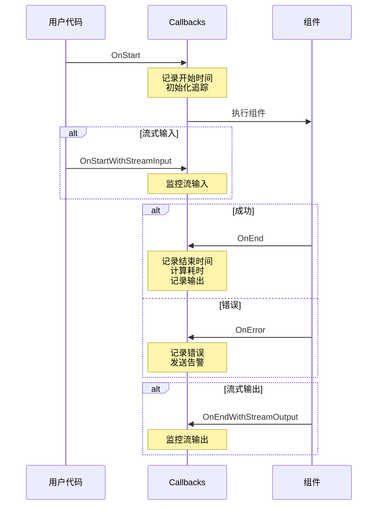

# Eino-04-Callbacks模块-概览

Callbacks 模块提供了一套强大的切面编程机制，用于监控、调试、追踪和扩展 Eino 应用的执行流程。

---

## 1. Callbacks 设计理念

### 1.1 核心概念

Callbacks 是一种非侵入式的扩展机制，允许在组件执行的关键点插入自定义逻辑，而无需修改组件本身的代码。

**关键特性**:

- **非侵入式**: 不修改组件代码
- **可组合**: 支持多个 Handler 链式调用
- **灵活配置**: 支持全局、组件类型、节点三个级别
- **性能友好**: 异步回调不阻塞主流程

---

### 1.2 回调时机



**五种回调时机**:

| 回调方法 | 触发时机 | 输入参数 | 典型用途 |
|---------|---------|---------|---------|
| OnStart | 组件开始执行前 | RunInfo, 输入数据 | 记录开始时间、初始化追踪 |
| OnEnd | 组件执行成功后 | RunInfo, 输出数据 | 记录结束时间、统计指标 |
| OnError | 组件执行失败 | RunInfo, 错误信息 | 错误记录、告警 |
| OnStartWithStreamInput | 流式输入开始前 | RunInfo, StreamReader | 监控流输入 |
| OnEndWithStreamOutput | 流式输出结束后 | RunInfo, StreamReader | 监控流输出 |

---

## 2. 核心类型

### 2.1 Handler 接口

```go
// Handler 回调处理器接口
type Handler interface {
    // OnStart 在组件开始执行前调用
    OnStart(ctx context.Context, info *RunInfo, input CallbackInput) context.Context
    
    // OnEnd 在组件执行成功后调用
    OnEnd(ctx context.Context, info *RunInfo, output CallbackOutput) context.Context
    
    // OnError 在组件执行失败时调用
    OnError(ctx context.Context, info *RunInfo, err error) context.Context
    
    // OnStartWithStreamInput 在流式输入开始前调用
    OnStartWithStreamInput(ctx context.Context, info *RunInfo, input *schema.StreamReader[CallbackInput]) context.Context
    
    // OnEndWithStreamOutput 在流式输出开始后调用
    OnEndWithStreamOutput(ctx context.Context, info *RunInfo, output *schema.StreamReader[CallbackOutput]) context.Context
}
```

### 2.2 RunInfo 结构

```go
// RunInfo 运行信息
type RunInfo struct {
    // Component 组件类型（如 "ChatModel"、"Retriever"）
    Component string
    
    // Type 回调类型（如 "OnStart"、"OnEnd"）
    Type string
    
    // NodeKey 节点 key（在 Graph 中）
    NodeKey string
    
    // RunID 运行 ID（唯一标识一次运行）
    RunID string
    
    // Timing 时间戳
    Timing CallbackTiming
}

// CallbackTiming 回调时机
type CallbackTiming int

const (
    CallbackTimingBeforeRun CallbackTiming = iota  // 执行前
    CallbackTimingAfterRun                          // 执行后
)
```

### 2.3 CallbackInput/Output

```go
// CallbackInput 输入数据（any 类型，实际类型取决于组件）
type CallbackInput = any

// CallbackOutput 输出数据（any 类型，实际类型取决于组件）
type CallbackOutput = any
```

---

## 3. Handler 构建器

### 3.1 HandlerBuilder

为了方便创建 Handler，Eino 提供了 `HandlerBuilder`：

```go
// 创建 HandlerBuilder
builder := callbacks.NewHandlerBuilder()

// 设置各种回调
builder.
    OnStartFn(func(ctx context.Context, info *RunInfo, input CallbackInput) context.Context {
        // 处理 OnStart
        return ctx
    }).
    OnEndFn(func(ctx context.Context, info *RunInfo, output CallbackOutput) context.Context {
        // 处理 OnEnd
        return ctx
    }).
    OnErrorFn(func(ctx context.Context, info *RunInfo, err error) context.Context {
        // 处理 OnError
        return ctx
    })

// 构建 Handler
handler := builder.Build()
```

### 3.2 使用示例

**示例 1：日志 Handler**

```go
loggingHandler := callbacks.NewHandlerBuilder().
    OnStartFn(func(ctx context.Context, info *RunInfo, input CallbackInput) context.Context {
        log.Printf("[%s][%s] 开始执行, 输入: %v", info.Component, info.NodeKey, input)
        return ctx
    }).
    OnEndFn(func(ctx context.Context, info *RunInfo, output CallbackOutput) context.Context {
        log.Printf("[%s][%s] 执行完成, 输出: %v", info.Component, info.NodeKey, output)
        return ctx
    }).
    OnErrorFn(func(ctx context.Context, info *RunInfo, err error) context.Context {
        log.Printf("[%s][%s] 执行失败: %v", info.Component, info.NodeKey, err)
        return ctx
    }).
    Build()
```

**示例 2：性能监控 Handler**

```go
monitorHandler := callbacks.NewHandlerBuilder().
    OnStartFn(func(ctx context.Context, info *RunInfo, input CallbackInput) context.Context {
        // 记录开始时间
        return context.WithValue(ctx, "start_time", time.Now())
    }).
    OnEndFn(func(ctx context.Context, info *RunInfo, output CallbackOutput) context.Context {
        // 计算耗时
        start := ctx.Value("start_time").(time.Now())
        duration := time.Since(start)
        
        // 记录指标
        prometheus.HistogramObserve("component_duration_seconds",
            duration.Seconds(),
            "component", info.Component,
            "node", info.NodeKey,
        )
        
        // Token 统计（针对 ChatModel）
        if info.Component == "ChatModel" {
            if msg, ok := output.(*schema.Message); ok {
                if msg.ResponseMeta != nil && msg.ResponseMeta.Usage != nil {
                    prometheus.CounterAdd("tokens_total",
                        float64(msg.ResponseMeta.Usage.TotalTokens),
                        "node", info.NodeKey,
                    )
                }
            }
        }
        
        return ctx
    }).
    Build()
```

**示例 3：分布式追踪 Handler**

```go
tracingHandler := callbacks.NewHandlerBuilder().
    OnStartFn(func(ctx context.Context, info *RunInfo, input CallbackInput) context.Context {
        // 开始 Span
        span, ctx := opentracing.StartSpanFromContext(ctx,
            fmt.Sprintf("%s.%s", info.Component, info.NodeKey),
        )
        span.SetTag("component", info.Component)
        span.SetTag("node", info.NodeKey)
        span.SetTag("run_id", info.RunID)
        
        return context.WithValue(ctx, "span", span)
    }).
    OnEndFn(func(ctx context.Context, info *RunInfo, output CallbackOutput) context.Context {
        // 结束 Span
        if span := ctx.Value("span"); span != nil {
            span.(opentracing.Span).Finish()
        }
        return ctx
    }).
    OnErrorFn(func(ctx context.Context, info *RunInfo, err error) context.Context {
        // 记录错误到 Span
        if span := ctx.Value("span"); span != nil {
            span.(opentracing.Span).SetTag("error", true)
            span.(opentracing.Span).LogKV("error", err.Error())
            span.(opentracing.Span).Finish()
        }
        return ctx
    }).
    Build()
```

---

## 4. Callbacks 注册与使用

### 4.1 全局 Callbacks

**注册全局 Handler**:

```go
// 注册全局 Handler（影响所有组件）
callbacks.AppendGlobalHandlers(loggingHandler, monitorHandler, tracingHandler)

// 全局 Handler 会自动应用到所有组件和节点
runnable.Invoke(ctx, input)  // 自动使用全局 Handler
```

### 4.2 Runnable 级别 Callbacks

**在执行时传入 Handler**:

```go
// 只在本次执行时使用
runnable.Invoke(ctx, input,
    compose.WithCallbacks(debugHandler))

// 多个 Handler
runnable.Invoke(ctx, input,
    compose.WithCallbacks(handler1, handler2, handler3))
```

### 4.3 节点级别 Callbacks

**指定 Handler 只应用于特定节点**:

```go
// 只应用于 "model" 节点
runnable.Invoke(ctx, input,
    compose.WithCallbacks(handler).DesignateNode("model"))

// 应用于多个节点
runnable.Invoke(ctx, input,
    compose.WithCallbacks(handler1).DesignateNode("node1"),
    compose.WithCallbacks(handler2).DesignateNode("node2"))
```

### 4.4 组件类型级别 Callbacks

**指定 Handler 只应用于特定类型的组件**:

```go
// 只应用于所有 ChatModel 组件
runnable.Invoke(ctx, input,
    compose.WithCallbacksForComponent("ChatModel", handler))

// 应用于多个组件类型
runnable.Invoke(ctx, input,
    compose.WithCallbacksForComponent("ChatModel", modelHandler),
    compose.WithCallbacksForComponent("Retriever", retrieverHandler))
```

---

## 5. 流式回调

### 5.1 OnStartWithStreamInput

**监控流式输入**:

```go
streamInputHandler := callbacks.NewHandlerBuilder().
    OnStartWithStreamInputFn(func(ctx context.Context, info *RunInfo, input *schema.StreamReader[CallbackInput]) context.Context {
        // 复制流以便监控
        readers := input.Copy(2)
        originalInput := readers[0]
        monitorInput := readers[1]
        
        // 在后台监控
        go func() {
            defer monitorInput.Close()
            var count int
            for {
                chunk, err := monitorInput.Recv()
                if err == io.EOF {
                    break
                }
                count++
                log.Printf("[%s] 收到输入块 %d: %v", info.NodeKey, count, chunk)
            }
        }()
        
        // 返回原始输入流
        return context.WithValue(ctx, "input_stream", originalInput)
    }).
    Build()
```

### 5.2 OnEndWithStreamOutput

**监控流式输出**:

```go
streamOutputHandler := callbacks.NewHandlerBuilder().
    OnEndWithStreamOutputFn(func(ctx context.Context, info *RunInfo, output *schema.StreamReader[CallbackOutput]) context.Context {
        // 复制流
        readers := output.Copy(2)
        originalOutput := readers[0]
        monitorOutput := readers[1]
        
        // 在后台监控和统计
        go func() {
            defer monitorOutput.Close()
            var count int
            var totalContent string
            
            for {
                chunk, err := monitorOutput.Recv()
                if err == io.EOF {
                    break
                }
                count++
                
                // 统计内容（针对 Message）
                if msg, ok := chunk.(*schema.Message); ok {
                    totalContent += msg.Content
                }
            }
            
            log.Printf("[%s] 输出完成: %d 个块, 总长度: %d",
                info.NodeKey, count, len(totalContent))
        }()
        
        // 返回原始输出流
        return context.WithValue(ctx, "output_stream", originalOutput)
    }).
    Build()
```

---

## 6. 实战案例

### 6.1 案例 1：完整的可观测性 Handler

```go
type ObservabilityHandler struct {
    logger     *log.Logger
    metrics    *prometheus.Registry
    tracer     opentracing.Tracer
}

func NewObservabilityHandler() *ObservabilityHandler {
    return &ObservabilityHandler{
        logger:  log.New(os.Stdout, "[EINO] ", log.LstdFlags),
        metrics: prometheus.NewRegistry(),
        tracer:  opentracing.GlobalTracer(),
    }
}

func (h *ObservabilityHandler) Build() callbacks.Handler {
    return callbacks.NewHandlerBuilder().
        OnStartFn(h.onStart).
        OnEndFn(h.onEnd).
        OnErrorFn(h.onError).
        Build()
}

func (h *ObservabilityHandler) onStart(ctx context.Context, info *RunInfo, input CallbackInput) context.Context {
    // 1. 日志
    h.logger.Printf("开始执行 [%s][%s]", info.Component, info.NodeKey)
    
    // 2. 追踪
    span, ctx := h.tracer.StartSpanFromContext(ctx,
        fmt.Sprintf("%s.%s", info.Component, info.NodeKey))
    span.SetTag("component", info.Component)
    span.SetTag("node", info.NodeKey)
    
    // 3. 指标：记录开始
    ctx = context.WithValue(ctx, "start_time", time.Now())
    ctx = context.WithValue(ctx, "span", span)
    
    return ctx
}

func (h *ObservabilityHandler) onEnd(ctx context.Context, info *RunInfo, output CallbackOutput) context.Context {
    // 1. 计算耗时
    start := ctx.Value("start_time").(time.Time)
    duration := time.Since(start)
    
    // 2. 日志
    h.logger.Printf("完成执行 [%s][%s] 耗时: %v",
        info.Component, info.NodeKey, duration)
    
    // 3. 指标
    componentDurationHistogram.WithLabelValues(
        info.Component, info.NodeKey,
    ).Observe(duration.Seconds())
    
    // Token 统计
    if msg, ok := output.(*schema.Message); ok {
        if msg.ResponseMeta != nil && msg.ResponseMeta.Usage != nil {
            tokensCounter.WithLabelValues(info.NodeKey).Add(
                float64(msg.ResponseMeta.Usage.TotalTokens))
        }
    }
    
    // 4. 追踪
    if span := ctx.Value("span"); span != nil {
        span.(opentracing.Span).Finish()
    }
    
    return ctx
}

func (h *ObservabilityHandler) onError(ctx context.Context, info *RunInfo, err error) context.Context {
    // 1. 日志
    h.logger.Printf("执行失败 [%s][%s]: %v",
        info.Component, info.NodeKey, err)
    
    // 2. 指标
    errorCounter.WithLabelValues(info.Component, info.NodeKey).Inc()
    
    // 3. 追踪
    if span := ctx.Value("span"); span != nil {
        span.(opentracing.Span).SetTag("error", true)
        span.(opentracing.Span).LogKV("error", err.Error())
        span.(opentracing.Span).Finish()
    }
    
    // 4. 告警（严重错误）
    if isCriticalError(err) {
        h.sendAlert(info, err)
    }
    
    return ctx
}
```

### 6.2 案例 2：成本监控 Handler

```go
costMonitorHandler := callbacks.NewHandlerBuilder().
    OnEndFn(func(ctx context.Context, info *RunInfo, output CallbackOutput) context.Context {
        // 只监控 ChatModel
        if info.Component != "ChatModel" {
            return ctx
        }
        
        msg, ok := output.(*schema.Message)
        if !ok || msg.ResponseMeta == nil || msg.ResponseMeta.Usage == nil {
            return ctx
        }
        
        usage := msg.ResponseMeta.Usage
        
        // 计算成本（示例价格）
        var cost float64
        if strings.Contains(info.NodeKey, "gpt-4") {
            // GPT-4 价格: 输入 $0.03/1K tokens, 输出 $0.06/1K tokens
            cost = float64(usage.PromptTokens)*0.03/1000 +
                   float64(usage.CompletionTokens)*0.06/1000
        } else {
            // GPT-3.5 价格: 输入 $0.0015/1K tokens, 输出 $0.002/1K tokens
            cost = float64(usage.PromptTokens)*0.0015/1000 +
                   float64(usage.CompletionTokens)*0.002/1000
        }
        
        // 记录成本
        costCounter.WithLabelValues(info.NodeKey).Add(cost)
        
        // 记录详细信息到数据库
        saveCostRecord(&CostRecord{
            Timestamp:        time.Now(),
            Node:             info.NodeKey,
            PromptTokens:     usage.PromptTokens,
            CompletionTokens: usage.CompletionTokens,
            TotalTokens:      usage.TotalTokens,
            Cost:             cost,
        })
        
        return ctx
    }).
    Build()
```

### 6.3 案例 3：调试 Handler

```go
debugHandler := callbacks.NewHandlerBuilder().
    OnStartFn(func(ctx context.Context, info *RunInfo, input CallbackInput) context.Context {
        fmt.Printf("\n========== [%s][%s] 开始执行 ==========\n",
            info.Component, info.NodeKey)
        fmt.Printf("输入类型: %T\n", input)
        
        // 详细打印输入（根据类型）
        switch v := input.(type) {
        case []*schema.Message:
            fmt.Printf("消息数量: %d\n", len(v))
            for i, msg := range v {
                fmt.Printf("消息 %d [%s]: %s\n", i+1, msg.Role, msg.Content)
            }
        case string:
            fmt.Printf("字符串输入: %s\n", v)
        case map[string]any:
            fmt.Printf("Map 输入:\n")
            for k, val := range v {
                fmt.Printf("  %s: %v\n", k, val)
            }
        default:
            fmt.Printf("输入: %+v\n", input)
        }
        
        return ctx
    }).
    OnEndFn(func(ctx context.Context, info *RunInfo, output CallbackOutput) context.Context {
        fmt.Printf("\n输出类型: %T\n", output)
        
        // 详细打印输出
        switch v := output.(type) {
        case *schema.Message:
            fmt.Printf("角色: %s\n", v.Role)
            fmt.Printf("内容: %s\n", v.Content)
            if len(v.ToolCalls) > 0 {
                fmt.Printf("工具调用数: %d\n", len(v.ToolCalls))
                for i, tc := range v.ToolCalls {
                    fmt.Printf("  工具 %d: %s(%s)\n", i+1, tc.Function.Name, tc.Function.Arguments)
                }
            }
        case []*schema.Document:
            fmt.Printf("文档数量: %d\n", len(v))
            for i, doc := range v {
                fmt.Printf("  文档 %d: %s... (score: %.2f)\n",
                    i+1, truncate(doc.Content, 50), doc.Score())
            }
        default:
            fmt.Printf("输出: %+v\n", output)
        }
        
        fmt.Printf("========== [%s][%s] 执行完成 ==========\n\n",
            info.Component, info.NodeKey)
        
        return ctx
    }).
    OnErrorFn(func(ctx context.Context, info *RunInfo, err error) context.Context {
        fmt.Printf("\n❌ [%s][%s] 执行失败: %v\n\n",
            info.Component, info.NodeKey, err)
        return ctx
    }).
    Build()
```

---

## 7. 最佳实践

### 7.1 Handler 设计原则

1. **最小化开销**: Callbacks 不应成为性能瓶颈
2. **不修改数据**: 只观察，不修改输入输出
3. **异步处理**: 耗时操作在 goroutine 中执行
4. **错误隔离**: Handler 内部错误不影响主流程

### 7.2 使用建议

1. **开发阶段**: 使用调试 Handler
2. **测试阶段**: 使用性能监控 Handler
3. **生产环境**: 使用完整的可观测性 Handler
4. **成本优化**: 使用成本监控 Handler

### 7.3 注意事项

1. **避免阻塞**: 不要在 Callbacks 中执行长时间操作
2. **Context 传递**: 可以通过 Context 在 Handler 间传递信息
3. **流复制开销**: 流式回调会复制流，注意内存占用
4. **Handler 顺序**: 全局 Handler -> 组件类型 Handler -> 节点 Handler

---

**文档版本**: v1.0  
**最后更新**: 2024-12-19  
**适用 Eino 版本**: main 分支（最新版本）
