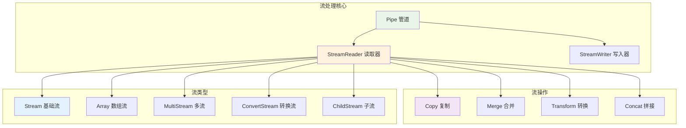
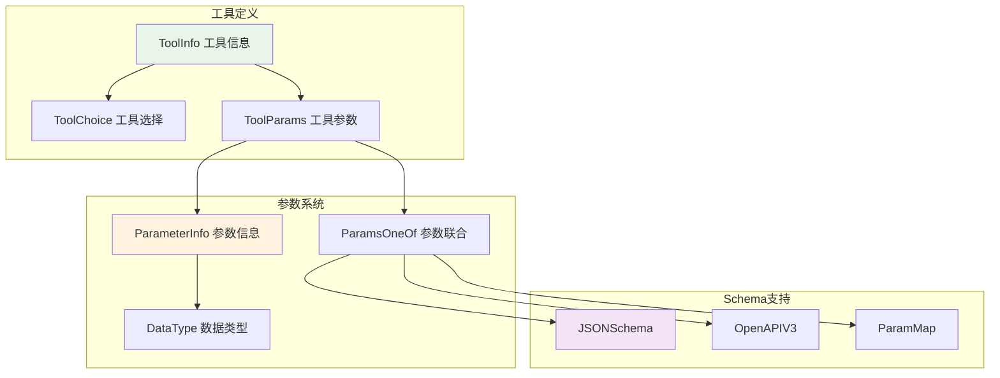

# Eino Schema模块详解

## 📖 文档概述

本文档深入分析 Eino 框架的 Schema 模块，包括消息系统、流处理机制、工具定义、文档结构等核心数据模式的设计与实现。

## 🏗️ Schema模块架构

### 模块结构图

```mermaid
graph TB
    subgraph "Schema 核心模块"
        M[Message 消息系统]
        S[Stream 流处理]
        T[Tool 工具定义]
        D[Document 文档结构]
        P[Parser 解析器]
    end
    
    subgraph "Message 子系统"
        MT[MessageTemplate 消息模板]
        MR[MessageRole 消息角色]
        MC[MessageContent 消息内容]
        MM[MessageMeta 消息元数据]
    end
    
    subgraph "Stream 子系统"
        SR[StreamReader 流读取器]
        SW[StreamWriter 流写入器]
        SC[StreamConcatenator 流拼接器]
        SM[StreamMerger 流合并器]
    end
    
    subgraph "Tool 子系统"
        TI[ToolInfo 工具信息]
        TP[ToolParams 工具参数]
        TC[ToolChoice 工具选择]
        TD[DataType 数据类型]
    end
    
    M --> MT
    M --> MR
    M --> MC
    M --> MM
    
    S --> SR
    S --> SW
    S --> SC
    S --> SM
    
    T --> TI
    T --> TP
    T --> TC
    T --> TD
    
    style M fill:#e8f5e8
    style S fill:#fff3e0
    style T fill:#f3e5f5
    style D fill:#e3f2fd
```



## 💬 Message 消息系统

### 核心数据结构

#### 1. Message 结构定义

```go
// Message 是 Eino 框架中的核心消息结构
// 支持多种角色、多媒体内容、工具调用等功能
type Message struct {
    // Role 消息角色：assistant、user、system、tool
    Role    RoleType `json:"role"`
    
    // Content 文本内容，基础的消息内容
    Content string   `json:"content"`

    // MultiContent 多媒体内容，如果不为空则优先使用此字段
    // 支持文本、图片、音频、视频、文件等多种类型
    MultiContent []ChatMessagePart `json:"multi_content,omitempty"`

    // Name 消息发送者名称，可选
    Name string `json:"name,omitempty"`

    // ToolCalls 工具调用列表，仅用于 Assistant 消息
    ToolCalls []ToolCall `json:"tool_calls,omitempty"`

    // ToolCallID 工具调用ID，仅用于 Tool 消息
    ToolCallID string `json:"tool_call_id,omitempty"`
    
    // ToolName 工具名称，仅用于 Tool 消息
    ToolName string `json:"tool_name,omitempty"`

    // ResponseMeta 响应元数据，包含完成原因、令牌使用情况等
    ResponseMeta *ResponseMeta `json:"response_meta,omitempty"`

    // ReasoningContent 模型的思考过程，用于推理内容
    ReasoningContent string `json:"reasoning_content,omitempty"`

    // Extra 自定义扩展信息，用于模型实现的定制化需求
    Extra map[string]any `json:"extra,omitempty"`
}
```

#### 2. 消息角色类型

```go
// RoleType 定义消息的角色类型
type RoleType string

const (
    // Assistant 助手角色，表示由 ChatModel 返回的消息
    Assistant RoleType = "assistant"
    
    // User 用户角色，表示用户输入的消息
    User RoleType = "user"
    
    // System 系统角色，表示系统提示消息
    System RoleType = "system"
    
    // Tool 工具角色，表示工具调用的输出结果
    Tool RoleType = "tool"
)

// 便捷的消息创建函数
func SystemMessage(content string) *Message {
    return &Message{
        Role:    System,
        Content: content,
    }
}

func UserMessage(content string) *Message {
    return &Message{
        Role:    User,
        Content: content,
    }
}

func AssistantMessage(content string, toolCalls []ToolCall) *Message {
    return &Message{
        Role:      Assistant,
        Content:   content,
        ToolCalls: toolCalls,
    }
}

func ToolMessage(content string, toolCallID string, opts ...ToolMessageOption) *Message {
    o := &toolMessageOptions{}
    for _, opt := range opts {
        opt(o)
    }
    return &Message{
        Role:       Tool,
        Content:    content,
        ToolCallID: toolCallID,
        ToolName:   o.toolName,
    }
}
```

#### 3. 多媒体内容支持

```go
// ChatMessagePart 聊天消息的组成部分
type ChatMessagePart struct {
    // Type 内容类型：text、image_url、audio_url、video_url、file_url
    Type ChatMessagePartType `json:"type,omitempty"`

    // Text 文本内容，当 Type 为 "text" 时使用
    Text string `json:"text,omitempty"`

    // ImageURL 图片URL，当 Type 为 "image_url" 时使用
    ImageURL *ChatMessageImageURL `json:"image_url,omitempty"`
    
    // AudioURL 音频URL，当 Type 为 "audio_url" 时使用
    AudioURL *ChatMessageAudioURL `json:"audio_url,omitempty"`
    
    // VideoURL 视频URL，当 Type 为 "video_url" 时使用
    VideoURL *ChatMessageVideoURL `json:"video_url,omitempty"`
    
    // FileURL 文件URL，当 Type 为 "file_url" 时使用
    FileURL *ChatMessageFileURL `json:"file_url,omitempty"`
}

// ChatMessageImageURL 图片URL结构
type ChatMessageImageURL struct {
    // URL 可以是传统URL或符合RFC-2397的内联数据URL
    URL string `json:"url,omitempty"`
    URI string `json:"uri,omitempty"`
    
    // Detail 图片质量：high、low、auto
    Detail ImageURLDetail `json:"detail,omitempty"`
    
    // MIMEType MIME类型，如 "image/png"
    MIMEType string `json:"mime_type,omitempty"`
    
    // Extra 扩展信息
    Extra map[string]any `json:"extra,omitempty"`
}
```

### 消息模板系统

#### 1. MessagesTemplate 接口

```go
// MessagesTemplate 消息模板接口
// 用于将模板渲染为消息列表
type MessagesTemplate interface {
    Format(ctx context.Context, vs map[string]any, formatType FormatType) ([]*Message, error)
}

// FormatType 格式化类型
type FormatType uint8

const (
    // FString Python风格的字符串格式化
    FString FormatType = 0
    
    // GoTemplate Go标准库的模板格式
    GoTemplate FormatType = 1
    
    // Jinja2 Jinja2模板格式
    Jinja2 FormatType = 2
)
```

#### 2. 消息模板实现

```go
// Message 实现 MessagesTemplate 接口
func (m *Message) Format(_ context.Context, vs map[string]any, formatType FormatType) ([]*Message, error) {
    // 格式化主要内容
    c, err := formatContent(m.Content, vs, formatType)
    if err != nil {
        return nil, err
    }
    
    // 创建副本并更新内容
    copied := *m
    copied.Content = c

    // 格式化多媒体内容中的文本部分
    if len(m.MultiContent) != 0 {
        copied.MultiContent = make([]ChatMessagePart, len(m.MultiContent))
        copy(copied.MultiContent, m.MultiContent)
        
        for i, mc := range copied.MultiContent {
            if len(mc.Text) > 0 {
                nmc, err := formatContent(mc.Text, vs, formatType)
                if err != nil {
                    return nil, err
                }
                copied.MultiContent[i].Text = nmc
            }
        }
    }
    
    return []*Message{&copied}, nil
}

// formatContent 根据不同格式类型格式化内容
func formatContent(content string, vs map[string]any, formatType FormatType) (string, error) {
    switch formatType {
    case FString:
        // 使用 Python 风格格式化
        return pyfmt.Fmt(content, vs)
        
    case GoTemplate:
        // 使用 Go 模板
        parsedTmpl, err := template.New("template").
            Option("missingkey=error").
            Parse(content)
        if err != nil {
            return "", err
        }
        
        sb := new(strings.Builder)
        err = parsedTmpl.Execute(sb, vs)
        if err != nil {
            return "", err
        }
        return sb.String(), nil
        
    case Jinja2:
        // 使用 Jinja2 模板
        env, err := getJinjaEnv()
        if err != nil {
            return "", err
        }
        
        tpl, err := env.FromString(content)
        if err != nil {
            return "", err
        }
        
        out, err := tpl.Execute(vs)
        if err != nil {
            return "", err
        }
        return out, nil
        
    default:
        return "", fmt.Errorf("unknown format type: %v", formatType)
    }
}
```

#### 3. MessagesPlaceholder 占位符

```go
// MessagesPlaceholder 消息占位符
// 用于在模板中引用参数中的消息列表
type messagesPlaceholder struct {
    key      string // 参数键名
    optional bool   // 是否可选
}

func MessagesPlaceholder(key string, optional bool) MessagesTemplate {
    return &messagesPlaceholder{
        key:      key,
        optional: optional,
    }
}

// Format 返回指定键的消息列表
func (p *messagesPlaceholder) Format(_ context.Context, vs map[string]any, _ FormatType) ([]*Message, error) {
    v, ok := vs[p.key]
    if !ok {
        if p.optional {
            return []*Message{}, nil
        }
        return nil, fmt.Errorf("message placeholder format: %s not found", p.key)
    }

    msgs, ok := v.([]*Message)
    if !ok {
        return nil, fmt.Errorf("only messages can be used to format message placeholder, key: %v, actual type: %v", 
            p.key, reflect.TypeOf(v))
    }

    return msgs, nil
}
```

### 消息拼接机制

#### 1. ConcatMessages 函数

```go
// ConcatMessages 拼接相同角色和名称的消息
// 用于将流式消息合并为单一消息
func ConcatMessages(msgs []*Message) (*Message, error) {
    var (
        contents            []string      // 内容片段
        contentLen          int           // 内容总长度
        reasoningContents   []string      // 推理内容片段
        reasoningContentLen int           // 推理内容总长度
        toolCalls           []ToolCall    // 工具调用列表
        ret                 = Message{}   // 结果消息
        extraList           = make([]map[string]any, 0, len(msgs)) // 扩展信息列表
    )

    for idx, msg := range msgs {
        if msg == nil {
            return nil, fmt.Errorf("unexpected nil chunk in message stream, index: %d", idx)
        }

        // 验证角色一致性
        if msg.Role != "" {
            if ret.Role == "" {
                ret.Role = msg.Role
            } else if ret.Role != msg.Role {
                return nil, fmt.Errorf("cannot concat messages with different roles: '%s' '%s'", 
                    ret.Role, msg.Role)
            }
        }

        // 验证名称一致性
        if msg.Name != "" {
            if ret.Name == "" {
                ret.Name = msg.Name
            } else if ret.Name != msg.Name {
                return nil, fmt.Errorf("cannot concat messages with different names: '%s' '%s'", 
                    ret.Name, msg.Name)
            }
        }

        // 收集内容
        if msg.Content != "" {
            contents = append(contents, msg.Content)
            contentLen += len(msg.Content)
        }
        
        // 收集推理内容
        if msg.ReasoningContent != "" {
            reasoningContents = append(reasoningContents, msg.ReasoningContent)
            reasoningContentLen += len(msg.ReasoningContent)
        }

        // 收集工具调用
        if len(msg.ToolCalls) > 0 {
            toolCalls = append(toolCalls, msg.ToolCalls...)
        }

        // 收集扩展信息
        if len(msg.Extra) > 0 {
            extraList = append(extraList, msg.Extra)
        }

        // 处理响应元数据
        if msg.ResponseMeta != nil && ret.ResponseMeta == nil {
            ret.ResponseMeta = &ResponseMeta{}
        }

        if msg.ResponseMeta != nil && ret.ResponseMeta != nil {
            // 保留最后一个有效的完成原因
            if msg.ResponseMeta.FinishReason != "" {
                ret.ResponseMeta.FinishReason = msg.ResponseMeta.FinishReason
            }

            // 合并令牌使用情况（取最大值）
            if msg.ResponseMeta.Usage != nil {
                if ret.ResponseMeta.Usage == nil {
                    ret.ResponseMeta.Usage = &TokenUsage{}
                }

                if msg.ResponseMeta.Usage.PromptTokens > ret.ResponseMeta.Usage.PromptTokens {
                    ret.ResponseMeta.Usage.PromptTokens = msg.ResponseMeta.Usage.PromptTokens
                }
                if msg.ResponseMeta.Usage.CompletionTokens > ret.ResponseMeta.Usage.CompletionTokens {
                    ret.ResponseMeta.Usage.CompletionTokens = msg.ResponseMeta.Usage.CompletionTokens
                }
                if msg.ResponseMeta.Usage.TotalTokens > ret.ResponseMeta.Usage.TotalTokens {
                    ret.ResponseMeta.Usage.TotalTokens = msg.ResponseMeta.Usage.TotalTokens
                }
            }

            // 合并日志概率
            if msg.ResponseMeta.LogProbs != nil {
                if ret.ResponseMeta.LogProbs == nil {
                    ret.ResponseMeta.LogProbs = &LogProbs{}
                }
                ret.ResponseMeta.LogProbs.Content = append(ret.ResponseMeta.LogProbs.Content, 
                    msg.ResponseMeta.LogProbs.Content...)
            }
        }
    }

    // 拼接内容
    if len(contents) > 0 {
        var sb strings.Builder
        sb.Grow(contentLen)
        for _, content := range contents {
            sb.WriteString(content)
        }
        ret.Content = sb.String()
    }

    // 拼接推理内容
    if len(reasoningContents) > 0 {
        var sb strings.Builder
        sb.Grow(reasoningContentLen)
        for _, rc := range reasoningContents {
            sb.WriteString(rc)
        }
        ret.ReasoningContent = sb.String()
    }

    // 拼接工具调用
    if len(toolCalls) > 0 {
        merged, err := concatToolCalls(toolCalls)
        if err != nil {
            return nil, err
        }
        ret.ToolCalls = merged
    }

    // 合并扩展信息
    if len(extraList) > 0 {
        extra, err := concatExtra(extraList)
        if err != nil {
            return nil, fmt.Errorf("failed to concat message's extra: %w", err)
        }
        if len(extra) > 0 {
            ret.Extra = extra
        }
    }

    return &ret, nil
}
```

#### 2. 工具调用拼接

```go
// concatToolCalls 拼接工具调用
// 处理流式工具调用的合并逻辑
func concatToolCalls(chunks []ToolCall) ([]ToolCall, error) {
    var merged []ToolCall
    m := make(map[int][]int) // 索引到块列表的映射

    // 按索引分组
    for i := range chunks {
        index := chunks[i].Index
        if index == nil {
            // 没有索引的直接添加
            merged = append(merged, chunks[i])
        } else {
            // 有索引的按索引分组
            m[*index] = append(m[*index], i)
        }
    }

    var args strings.Builder
    
    // 处理每个索引组
    for k, v := range m {
        index := k
        toolCall := ToolCall{Index: &index}
        if len(v) > 0 {
            toolCall = chunks[v[0]]
        }

        args.Reset()
        toolID, toolType, toolName := "", "", ""

        // 合并同一索引的所有块
        for _, n := range v {
            chunk := chunks[n]
            
            // 验证工具ID一致性
            if chunk.ID != "" {
                if toolID == "" {
                    toolID = chunk.ID
                } else if toolID != chunk.ID {
                    return nil, fmt.Errorf("cannot concat ToolCalls with different tool id: '%s' '%s'", 
                        toolID, chunk.ID)
                }
            }

            // 验证工具类型一致性
            if chunk.Type != "" {
                if toolType == "" {
                    toolType = chunk.Type
                } else if toolType != chunk.Type {
                    return nil, fmt.Errorf("cannot concat ToolCalls with different tool type: '%s' '%s'", 
                        toolType, chunk.Type)
                }
            }

            // 验证工具名称一致性
            if chunk.Function.Name != "" {
                if toolName == "" {
                    toolName = chunk.Function.Name
                } else if toolName != chunk.Function.Name {
                    return nil, fmt.Errorf("cannot concat ToolCalls with different tool name: '%s' '%s'", 
                        toolName, chunk.Function.Name)
                }
            }

            // 拼接参数
            if chunk.Function.Arguments != "" {
                args.WriteString(chunk.Function.Arguments)
            }
        }

        // 设置合并后的工具调用
        toolCall.ID = toolID
        toolCall.Type = toolType
        toolCall.Function.Name = toolName
        toolCall.Function.Arguments = args.String()

        merged = append(merged, toolCall)
    }

    // 按索引排序
    if len(merged) > 1 {
        sort.SliceStable(merged, func(i, j int) bool {
            iVal, jVal := merged[i].Index, merged[j].Index
            if iVal == nil && jVal == nil {
                return false
            } else if iVal == nil && jVal != nil {
                return true
            } else if iVal != nil && jVal == nil {
                return false
            }
            return *iVal < *jVal
        })
    }

    return merged, nil
}
```

## 🌊 Stream 流处理系统

### 流处理架构



### 核心流接口

#### 1. StreamReader 流读取器

```go
// StreamReader 流读取器，支持多种底层实现
type StreamReader[T any] struct {
    typ readerType // 读取器类型

    st  *stream[T]                // 基础流
    ar  *arrayReader[T]           // 数组读取器
    msr *multiStreamReader[T]     // 多流读取器
    srw *streamReaderWithConvert[T] // 转换流读取器
    csr *childStreamReader[T]     // 子流读取器
}

// Recv 接收流中的下一个数据项
// 返回 io.EOF 表示流结束
func (sr *StreamReader[T]) Recv() (T, error) {
    switch sr.typ {
    case readerTypeStream:
        return sr.st.recv()
    case readerTypeArray:
        return sr.ar.recv()
    case readerTypeMultiStream:
        return sr.msr.recv()
    case readerTypeWithConvert:
        return sr.srw.recv()
    case readerTypeChild:
        return sr.csr.recv()
    default:
        panic("impossible")
    }
}

// Close 安全关闭流读取器
// 应该只调用一次，多次调用可能无法正常工作
func (sr *StreamReader[T]) Close() {
    switch sr.typ {
    case readerTypeStream:
        sr.st.closeRecv()
    case readerTypeArray:
        // 数组读取器无需清理
    case readerTypeMultiStream:
        sr.msr.close()
    case readerTypeWithConvert:
        sr.srw.close()
    case readerTypeChild:
        sr.csr.close()
    default:
        panic("impossible")
    }
}
```

#### 2. StreamWriter 流写入器

```go
// StreamWriter 流写入器
type StreamWriter[T any] struct {
    stm *stream[T] // 底层流
}

// Send 发送数据到流中
// 返回 true 表示流已关闭
func (sw *StreamWriter[T]) Send(chunk T, err error) (closed bool) {
    return sw.stm.send(chunk, err)
}

// Close 通知接收者流发送已完成
// 接收者将从 StreamReader.Recv() 收到 io.EOF 错误
func (sw *StreamWriter[T]) Close() {
    sw.stm.closeSend()
}
```

#### 3. Pipe 管道创建

```go
// Pipe 创建指定容量的流管道
// 返回 StreamReader 和 StreamWriter 用于读写
func Pipe[T any](cap int) (*StreamReader[T], *StreamWriter[T]) {
    stm := newStream[T](cap)
    return stm.asReader(), &StreamWriter[T]{stm: stm}
}

// 使用示例
func ExamplePipe() {
    sr, sw := schema.Pipe[string](3)
    
    // 发送数据的协程
    go func() {
        defer sw.Close()
        for i := 0; i < 10; i++ {
            sw.Send(fmt.Sprintf("item_%d", i), nil)
        }
    }()

    // 接收数据
    defer sr.Close()
    for {
        chunk, err := sr.Recv()
        if err == io.EOF {
            break
        }
        if err != nil {
            log.Fatal(err)
        }
        fmt.Println(chunk)
    }
}
```

### 流操作功能

#### 1. 流复制 (Copy)

```go
// Copy 创建多个独立的流读取器副本
// 原始流在复制后将不可用
func (sr *StreamReader[T]) Copy(n int) []*StreamReader[T] {
    if n < 2 {
        return []*StreamReader[T]{sr}
    }

    if sr.typ == readerTypeArray {
        // 数组流的复制比较简单
        ret := make([]*StreamReader[T], n)
        for i, ar := range sr.ar.copy(n) {
            ret[i] = &StreamReader[T]{typ: readerTypeArray, ar: ar}
        }
        return ret
    }

    // 其他类型流的复制
    return copyStreamReaders[T](sr, n)
}

// copyStreamReaders 实现复杂流的复制逻辑
func copyStreamReaders[T any](sr *StreamReader[T], n int) []*StreamReader[T] {
    cpsr := &parentStreamReader[T]{
        sr:            sr,
        subStreamList: make([]*cpStreamElement[T], n),
        closedNum:     0,
    }

    // 初始化子流列表
    elem := &cpStreamElement[T]{}
    for i := range cpsr.subStreamList {
        cpsr.subStreamList[i] = elem
    }

    // 创建子流读取器
    ret := make([]*StreamReader[T], n)
    for i := range ret {
        ret[i] = &StreamReader[T]{
            csr: &childStreamReader[T]{
                parent: cpsr,
                index:  i,
            },
            typ: readerTypeChild,
        }
    }

    return ret
}
```

#### 2. 流合并 (Merge)

```go
// MergeStreamReaders 将多个流合并为一个
func MergeStreamReaders[T any](srs []*StreamReader[T]) *StreamReader[T] {
    if len(srs) < 1 {
        return nil
    }

    if len(srs) < 2 {
        return srs[0]
    }

    var arr []T
    var ss []*stream[T]

    // 分类处理不同类型的流
    for _, sr := range srs {
        switch sr.typ {
        case readerTypeStream:
            ss = append(ss, sr.st)
        case readerTypeArray:
            arr = append(arr, sr.ar.arr[sr.ar.index:]...)
        case readerTypeMultiStream:
            ss = append(ss, sr.msr.nonClosedStreams()...)
        case readerTypeWithConvert:
            ss = append(ss, sr.srw.toStream())
        case readerTypeChild:
            ss = append(ss, sr.csr.toStream())
        default:
            panic("impossible")
        }
    }

    // 如果只有数组数据，返回数组流
    if len(ss) == 0 {
        return &StreamReader[T]{
            typ: readerTypeArray,
            ar: &arrayReader[T]{
                arr:   arr,
                index: 0,
            },
        }
    }

    // 如果有数组数据，转换为流
    if len(arr) != 0 {
        s := arrToStream(arr)
        ss = append(ss, s)
    }

    // 返回多流读取器
    return &StreamReader[T]{
        typ: readerTypeMultiStream,
        msr: newMultiStreamReader(ss),
    }
}
```

#### 3. 命名流合并

```go
// MergeNamedStreamReaders 合并命名流，保留流名称信息
// 当源流结束时，返回包含源流名称的 SourceEOF 错误
func MergeNamedStreamReaders[T any](srs map[string]*StreamReader[T]) *StreamReader[T] {
    if len(srs) < 1 {
        return nil
    }

    ss := make([]*StreamReader[T], len(srs))
    names := make([]string, len(srs))

    i := 0
    for name, sr := range srs {
        ss[i] = sr
        names[i] = name
        i++
    }

    return InternalMergeNamedStreamReaders(ss, names)
}

// SourceEOF 表示来自特定源流的EOF错误
type SourceEOF struct {
    sourceName string
}

func (e *SourceEOF) Error() string {
    return fmt.Sprintf("EOF from source stream: %s", e.sourceName)
}

// GetSourceName 从 SourceEOF 错误中提取源流名称
func GetSourceName(err error) (string, bool) {
    var sErr *SourceEOF
    if errors.As(err, &sErr) {
        return sErr.sourceName, true
    }
    return "", false
}
```

#### 4. 流转换 (Transform)

```go
// StreamReaderWithConvert 将流转换为另一种类型的流
func StreamReaderWithConvert[T, D any](sr *StreamReader[T], convert func(T) (D, error)) *StreamReader[D] {
    c := func(a any) (D, error) {
        return convert(a.(T))
    }

    return newStreamReaderWithConvert(sr, c)
}

// streamReaderWithConvert 转换流的实现
type streamReaderWithConvert[T any] struct {
    sr      iStreamReader           // 源流
    convert func(any) (T, error)    // 转换函数
}

func (srw *streamReaderWithConvert[T]) recv() (T, error) {
    for {
        out, err := srw.sr.recvAny()
        if err != nil {
            var t T
            return t, err
        }

        t, err := srw.convert(out)
        if err == nil {
            return t, nil
        }

        // ErrNoValue 用于跳过某些值
        if !errors.Is(err, ErrNoValue) {
            return t, err
        }
    }
}

// 使用示例
func ExampleStreamConvert() {
    // 创建整数流
    intReader := schema.StreamReaderFromArray([]int{1, 2, 3, 4, 5})
    
    // 转换为字符串流
    stringReader := schema.StreamReaderWithConvert(intReader, func(i int) (string, error) {
        if i%2 == 0 {
            return fmt.Sprintf("even_%d", i), nil
        }
        return "", schema.ErrNoValue // 跳过奇数
    })

    defer stringReader.Close()
    for {
        s, err := stringReader.Recv()
        if err == io.EOF {
            break
        }
        if err != nil {
            log.Fatal(err)
        }
        fmt.Println(s) // 输出: even_2, even_4
    }
}
```

### 流生命周期管理

#### 1. 自动关闭机制

```go
// SetAutomaticClose 设置流在不再可达时自动关闭
// 不是并发安全的
func (sr *StreamReader[T]) SetAutomaticClose() {
    switch sr.typ {
    case readerTypeStream:
        if !sr.st.automaticClose {
            sr.st.automaticClose = true
            var flag uint32
            sr.st.closedFlag = &flag
            runtime.SetFinalizer(sr, func(s *StreamReader[T]) {
                s.Close()
            })
        }
    case readerTypeMultiStream:
        for _, s := range sr.msr.nonClosedStreams() {
            if !s.automaticClose {
                s.automaticClose = true
                var flag uint32
                s.closedFlag = &flag
                runtime.SetFinalizer(s, func(st *stream[T]) {
                    st.closeRecv()
                })
            }
        }
    case readerTypeChild:
        parent := sr.csr.parent.sr
        parent.SetAutomaticClose()
    case readerTypeWithConvert:
        sr.srw.sr.SetAutomaticClose()
    case readerTypeArray:
        // 数组流无需清理
    default:
    }
}
```

#### 2. 流状态管理

```go
// stream 基础流结构
type stream[T any] struct {
    items chan streamItem[T] // 数据通道
    closed chan struct{}     // 关闭信号通道
    
    automaticClose bool      // 是否自动关闭
    closedFlag     *uint32   // 关闭标志（原子操作）
}

type streamItem[T any] struct {
    chunk T     // 数据块
    err   error // 错误信息
}

func (s *stream[T]) send(chunk T, err error) (closed bool) {
    // 检查流是否已关闭
    select {
    case <-s.closed:
        return true
    default:
    }

    item := streamItem[T]{chunk, err}

    select {
    case <-s.closed:
        return true
    case s.items <- item:
        return false
    }
}

func (s *stream[T]) recv() (chunk T, err error) {
    item, ok := <-s.items
    if !ok {
        item.err = io.EOF
    }
    return item.chunk, item.err
}

func (s *stream[T]) closeRecv() {
    if s.automaticClose {
        if atomic.CompareAndSwapUint32(s.closedFlag, 0, 1) {
            close(s.closed)
        }
        return
    }
    close(s.closed)
}
```

## 🔧 Tool 工具定义系统

### 工具系统架构



### 工具信息定义

#### 1. ToolInfo 结构

```go
// ToolInfo 工具信息定义
type ToolInfo struct {
    // Name 工具的唯一名称，清楚地表达其用途
    Name string
    
    // Desc 描述如何/何时/为什么使用该工具
    // 可以提供少量示例作为描述的一部分
    Desc string
    
    // Extra 工具的额外信息
    Extra map[string]any

    // ParamsOneOf 工具接受的参数定义
    // 可以通过两种方式描述：
    //  - 使用 params: schema.NewParamsOneOfByParams(params)
    //  - 使用 openAPIV3: schema.NewParamsOneOfByOpenAPIV3(openAPIV3)
    // 如果为 nil，表示工具不需要任何输入参数
    *ParamsOneOf
}
```

#### 2. ToolChoice 工具选择策略

```go
// ToolChoice 控制模型如何调用工具
type ToolChoice string

const (
    // ToolChoiceForbidden 模型不应调用任何工具
    // 对应 OpenAI Chat Completion 中的 "none"
    ToolChoiceForbidden ToolChoice = "forbidden"

    // ToolChoiceAllowed 模型可以选择生成消息或调用一个或多个工具
    // 对应 OpenAI Chat Completion 中的 "auto"
    ToolChoiceAllowed ToolChoice = "allowed"

    // ToolChoiceForced 模型必须调用一个或多个工具
    // 对应 OpenAI Chat Completion 中的 "required"
    ToolChoiceForced ToolChoice = "forced"
)
```

### 参数定义系统

#### 1. ParameterInfo 参数信息

```go
// ParameterInfo 参数信息定义
type ParameterInfo struct {
    // Type 参数类型
    Type DataType
    
    // ElemInfo 元素类型信息，仅用于数组类型
    ElemInfo *ParameterInfo
    
    // SubParams 子参数，仅用于对象类型
    SubParams map[string]*ParameterInfo
    
    // Desc 参数描述
    Desc string
    
    // Enum 枚举值，仅用于字符串类型
    Enum []string
    
    // Required 是否必需
    Required bool
}

// DataType 数据类型定义
type DataType string

const (
    Object  DataType = "object"   // 对象类型
    Number  DataType = "number"   // 数字类型
    Integer DataType = "integer"  // 整数类型
    String  DataType = "string"   // 字符串类型
    Array   DataType = "array"    // 数组类型
    Null    DataType = "null"     // 空值类型
    Boolean DataType = "boolean"  // 布尔类型
)
```

#### 2. ParamsOneOf 参数联合类型

```go
// ParamsOneOf 参数描述的联合类型
// 用户必须指定且仅指定一种方法来描述参数
type ParamsOneOf struct {
    // params 使用 NewParamsOneOfByParams 设置
    params map[string]*ParameterInfo

    // openAPIV3 使用 NewParamsOneOfByOpenAPIV3 设置（已废弃）
    openAPIV3 *openapi3.Schema

    // jsonschema 使用 NewParamsOneOfByJSONSchema 设置
    jsonschema *jsonschema.Schema
}

// NewParamsOneOfByParams 通过参数映射创建 ParamsOneOf
func NewParamsOneOfByParams(params map[string]*ParameterInfo) *ParamsOneOf {
    return &ParamsOneOf{
        params: params,
    }
}

// NewParamsOneOfByJSONSchema 通过 JSONSchema 创建 ParamsOneOf
func NewParamsOneOfByJSONSchema(s *jsonschema.Schema) *ParamsOneOf {
    return &ParamsOneOf{
        jsonschema: s,
    }
}
```

#### 3. Schema 转换功能

```go
// ToJSONSchema 将 ParamsOneOf 转换为 JSONSchema 格式
func (p *ParamsOneOf) ToJSONSchema() (*jsonschema.Schema, error) {
    if p == nil {
        return nil, nil
    }

    if p.params != nil {
        // 从参数映射转换
        sc := &jsonschema.Schema{
            Properties: orderedmap.New[string, *jsonschema.Schema](),
            Type:       string(Object),
            Required:   make([]string, 0, len(p.params)),
        }

        for k := range p.params {
            v := p.params[k]
            sc.Properties.Set(k, paramInfoToJSONSchema(v))
            if v.Required {
                sc.Required = append(sc.Required, k)
            }
        }

        return sc, nil
    }

    if p.openAPIV3 != nil {
        // 从 OpenAPIV3 转换
        js, err := openapiV3ToJSONSchema(p.openAPIV3)
        if err != nil {
            return nil, fmt.Errorf("convert OpenAPIV3 to JSONSchema failed: %w", err)
        }
        return js, nil
    }

    return p.jsonschema, nil
}

// paramInfoToJSONSchema 将 ParameterInfo 转换为 JSONSchema
func paramInfoToJSONSchema(paramInfo *ParameterInfo) *jsonschema.Schema {
    js := &jsonschema.Schema{
        Type:        string(paramInfo.Type),
        Description: paramInfo.Desc,
    }

    // 处理枚举值
    if len(paramInfo.Enum) > 0 {
        js.Enum = make([]any, len(paramInfo.Enum))
        for i, enum := range paramInfo.Enum {
            js.Enum[i] = enum
        }
    }

    // 处理数组元素类型
    if paramInfo.ElemInfo != nil {
        js.Items = paramInfoToJSONSchema(paramInfo.ElemInfo)
    }

    // 处理对象子参数
    if len(paramInfo.SubParams) > 0 {
        required := make([]string, 0, len(paramInfo.SubParams))
        js.Properties = orderedmap.New[string, *jsonschema.Schema]()
        
        for k, v := range paramInfo.SubParams {
            item := paramInfoToJSONSchema(v)
            js.Properties.Set(k, item)
            if v.Required {
                required = append(required, k)
            }
        }

        js.Required = required
    }

    return js
}
```

### 工具使用示例

#### 1. 简单工具定义

```go
func ExampleSimpleTool() {
    // 定义天气查询工具
    weatherTool := &schema.ToolInfo{
        Name: "get_weather",
        Desc: "获取指定城市的当前天气信息",
        ParamsOneOf: schema.NewParamsOneOfByParams(map[string]*schema.ParameterInfo{
            "city": {
                Type:     schema.String,
                Desc:     "城市名称",
                Required: true,
            },
            "unit": {
                Type:     schema.String,
                Desc:     "温度单位",
                Enum:     []string{"celsius", "fahrenheit"},
                Required: false,
            },
        }),
    }

    // 转换为 JSONSchema
    jsonSchema, err := weatherTool.ParamsOneOf.ToJSONSchema()
    if err != nil {
        log.Fatal(err)
    }

    fmt.Printf("Tool Schema: %+v\n", jsonSchema)
}
```

#### 2. 复杂工具定义

```go
func ExampleComplexTool() {
    // 定义数据库查询工具
    dbQueryTool := &schema.ToolInfo{
        Name: "database_query",
        Desc: "执行数据库查询操作，支持SELECT、INSERT、UPDATE、DELETE",
        Extra: map[string]any{
            "timeout": 30,
            "retry":   3,
        },
        ParamsOneOf: schema.NewParamsOneOfByParams(map[string]*schema.ParameterInfo{
            "operation": {
                Type:     schema.String,
                Desc:     "数据库操作类型",
                Enum:     []string{"SELECT", "INSERT", "UPDATE", "DELETE"},
                Required: true,
            },
            "table": {
                Type:     schema.String,
                Desc:     "目标表名",
                Required: true,
            },
            "conditions": {
                Type: schema.Object,
                Desc: "查询条件",
                SubParams: map[string]*schema.ParameterInfo{
                    "where": {
                        Type:     schema.String,
                        Desc:     "WHERE子句",
                        Required: false,
                    },
                    "limit": {
                        Type:     schema.Integer,
                        Desc:     "结果数量限制",
                        Required: false,
                    },
                },
                Required: false,
            },
            "data": {
                Type: schema.Array,
                Desc: "要插入或更新的数据",
                ElemInfo: &schema.ParameterInfo{
                    Type: schema.Object,
                    Desc: "数据行",
                },
                Required: false,
            },
        }),
    }

    // 使用工具
    fmt.Printf("Tool: %s\n", dbQueryTool.Name)
    fmt.Printf("Description: %s\n", dbQueryTool.Desc)
}
```

## 📄 Document 文档系统

### 文档结构定义

```go
// Document 带有元数据的文本片段
type Document struct {
    // ID 文档的唯一标识符
    ID string `json:"id"`
    
    // Content 文档内容
    Content string `json:"content"`
    
    // MetaData 文档元数据，可用于存储额外信息
    MetaData map[string]any `json:"meta_data"`
}

// String 返回文档内容
func (d *Document) String() string {
    return d.Content
}
```

### 文档元数据管理

#### 1. 预定义元数据键

```go
const (
    docMetaDataKeySubIndexes   = "_sub_indexes"   // 子索引
    docMetaDataKeyScore        = "_score"         // 相关性分数
    docMetaDataKeyExtraInfo    = "_extra_info"    // 额外信息
    docMetaDataKeyDSL          = "_dsl"           // DSL查询
    docMetaDataKeyDenseVector  = "_dense_vector"  // 密集向量
    docMetaDataKeySparseVector = "_sparse_vector" // 稀疏向量
)
```

#### 2. 文档操作方法

```go
// WithSubIndexes 设置文档的子索引
func (d *Document) WithSubIndexes(indexes []string) *Document {
    if d.MetaData == nil {
        d.MetaData = make(map[string]any)
    }
    d.MetaData[docMetaDataKeySubIndexes] = indexes
    return d
}

// SubIndexes 获取文档的子索引
func (d *Document) SubIndexes() []string {
    if d.MetaData == nil {
        return nil
    }

    indexes, ok := d.MetaData[docMetaDataKeySubIndexes].([]string)
    if ok {
        return indexes
    }
    return nil
}

// WithScore 设置文档的相关性分数
func (d *Document) WithScore(score float64) *Document {
    if d.MetaData == nil {
        d.MetaData = make(map[string]any)
    }
    d.MetaData[docMetaDataKeyScore] = score
    return d
}

// Score 获取文档的相关性分数
func (d *Document) Score() float64 {
    if d.MetaData == nil {
        return 0
    }

    score, ok := d.MetaData[docMetaDataKeyScore].(float64)
    if ok {
        return score
    }
    return 0
}

// WithDenseVector 设置文档的密集向量
func (d *Document) WithDenseVector(vector []float64) *Document {
    if d.MetaData == nil {
        d.MetaData = make(map[string]any)
    }
    d.MetaData[docMetaDataKeyDenseVector] = vector
    return d
}

// DenseVector 获取文档的密集向量
func (d *Document) DenseVector() []float64 {
    if d.MetaData == nil {
        return nil
    }

    vector, ok := d.MetaData[docMetaDataKeyDenseVector].([]float64)
    if ok {
        return vector
    }
    return nil
}
```

### 文档使用示例

```go
func ExampleDocument() {
    // 创建文档
    doc := &schema.Document{
        ID:      "doc_001",
        Content: "这是一个关于人工智能的文档内容。",
        MetaData: map[string]any{
            "author":    "张三",
            "category":  "AI",
            "timestamp": time.Now(),
        },
    }

    // 设置子索引
    doc.WithSubIndexes([]string{"ai", "machine_learning", "deep_learning"})

    // 设置相关性分数
    doc.WithScore(0.95)

    // 设置向量
    doc.WithDenseVector([]float64{0.1, 0.2, 0.3, 0.4, 0.5})

    // 使用文档
    fmt.Printf("Document ID: %s\n", doc.ID)
    fmt.Printf("Content: %s\n", doc.Content)
    fmt.Printf("Sub Indexes: %v\n", doc.SubIndexes())
    fmt.Printf("Score: %.2f\n", doc.Score())
    fmt.Printf("Vector: %v\n", doc.DenseVector())
}
```

## 📊 性能优化与最佳实践

### 流处理性能优化

#### 1. 缓冲区大小选择

```go
// 根据数据量选择合适的缓冲区大小
func OptimalBufferSize(dataSize int, itemSize int) int {
    // 小数据量：使用较小缓冲区
    if dataSize < 1000 {
        return 10
    }
    
    // 中等数据量：使用中等缓冲区
    if dataSize < 100000 {
        return 100
    }
    
    // 大数据量：使用较大缓冲区
    return 1000
}

// 使用示例
func ExampleOptimalBuffer() {
    dataSize := 50000
    bufferSize := OptimalBufferSize(dataSize, 1)
    
    sr, sw := schema.Pipe[string](bufferSize)
    
    // 使用优化后的缓冲区...
}
```

#### 2. 流生命周期管理

```go
// 正确的流使用模式
func ProperStreamUsage() {
    sr, sw := schema.Pipe[string](100)
    
    // 发送协程
    go func() {
        defer sw.Close() // 确保关闭写入器
        
        for i := 0; i < 1000; i++ {
            if sw.Send(fmt.Sprintf("item_%d", i), nil) {
                break // 流已关闭，退出
            }
        }
    }()
    
    // 接收协程
    defer sr.Close() // 确保关闭读取器
    
    for {
        item, err := sr.Recv()
        if err == io.EOF {
            break
        }
        if err != nil {
            log.Printf("Error: %v", err)
            break
        }
        
        // 处理数据
        processItem(item)
    }
}

func processItem(item string) {
    // 处理逻辑
}
```

#### 3. 内存使用优化

```go
// 使用自动关闭避免内存泄漏
func MemoryOptimizedStream() {
    sr := schema.StreamReaderFromArray([]string{"a", "b", "c"})
    
    // 设置自动关闭
    sr.SetAutomaticClose()
    
    // 即使忘记调用 Close()，GC 时也会自动清理
    // 但仍建议显式调用 Close()
    defer sr.Close()
    
    // 使用流...
}
```

### 消息处理最佳实践

#### 1. 消息模板优化

```go
// 预编译模板提高性能
type TemplateCache struct {
    templates map[string]*template.Template
    mutex     sync.RWMutex
}

func (tc *TemplateCache) GetTemplate(content string) (*template.Template, error) {
    tc.mutex.RLock()
    tmpl, exists := tc.templates[content]
    tc.mutex.RUnlock()
    
    if exists {
        return tmpl, nil
    }
    
    tc.mutex.Lock()
    defer tc.mutex.Unlock()
    
    // 双重检查
    if tmpl, exists := tc.templates[content]; exists {
        return tmpl, nil
    }
    
    // 编译模板
    tmpl, err := template.New("").Parse(content)
    if err != nil {
        return nil, err
    }
    
    if tc.templates == nil {
        tc.templates = make(map[string]*template.Template)
    }
    tc.templates[content] = tmpl
    
    return tmpl, nil
}
```

#### 2. 消息拼接优化

```go
// 高效的消息拼接
func EfficientMessageConcat(msgs []*schema.Message) (*schema.Message, error) {
    if len(msgs) == 0 {
        return nil, fmt.Errorf("empty message list")
    }
    
    if len(msgs) == 1 {
        return msgs[0], nil // 单个消息直接返回
    }
    
    // 预计算总长度，减少内存分配
    var totalContentLen int
    var totalReasoningLen int
    
    for _, msg := range msgs {
        totalContentLen += len(msg.Content)
        totalReasoningLen += len(msg.ReasoningContent)
    }
    
    // 使用预分配的 Builder
    contentBuilder := strings.Builder{}
    contentBuilder.Grow(totalContentLen)
    
    reasoningBuilder := strings.Builder{}
    reasoningBuilder.Grow(totalReasoningLen)
    
    // 拼接内容
    for _, msg := range msgs {
        contentBuilder.WriteString(msg.Content)
        reasoningBuilder.WriteString(msg.ReasoningContent)
    }
    
    result := *msgs[0] // 复制第一个消息
    result.Content = contentBuilder.String()
    result.ReasoningContent = reasoningBuilder.String()
    
    return &result, nil
}
```

---

**上一篇**: [核心API深度分析](eino-03-core-api-analysis.md)
**下一篇**: [Components模块详解](eino-05-components-module.md) - 深入分析组件抽象和实现

**更新时间**: 2024-12-19 | **文档版本**: v1.0
