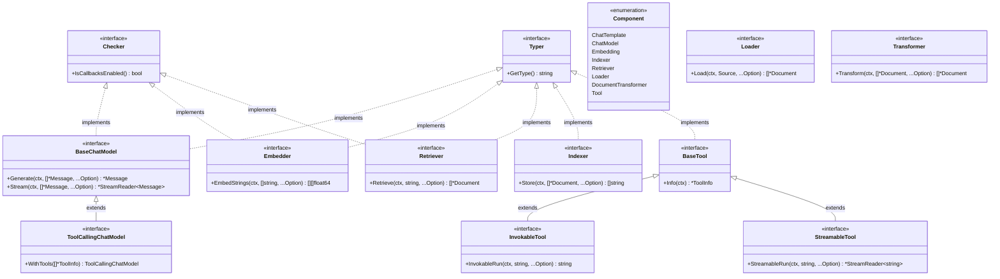

# Eino Components 模块详解

## 1. 概述

Components 模块是 Eino 框架的核心组件库，提供了构建 LLM 应用所需的各种基础组件抽象和实现。该模块采用接口驱动的设计，确保了组件的可插拔性和可扩展性，同时支持丰富的配置选项和回调机制。

Components 模块包含以下主要组件类型：
- **ChatModel**: 大语言模型组件
- **Embedding**: 文本嵌入组件  
- **Retriever**: 文档检索组件
- **Indexer**: 文档索引组件
- **Tool**: 工具调用组件
- **Document**: 文档处理组件
- **Prompt**: 提示词模板组件

## 2. 组件架构设计

### 2.1 组件类型系统



**图 2-1: Components 模块核心接口架构图**

**图介绍**:
该架构图展示了 Components 模块的核心接口设计：

- **`Typer` 接口**: 用于获取组件类型名称，支持组件的动态识别和管理
- **`Checker` 接口**: 控制组件的回调机制启用状态
- **`Component` 枚举**: 定义了框架支持的所有组件类型
- **各组件接口**: 定义了不同类型组件的核心功能，如模型生成、文档检索、工具调用等

### 2.2 组件类型定义

```go
// components/types.go

// Typer 获取组件实现的类型名称
// 如果存在 Typer，组件实例的完整名称默认为 {Typer}{Component}
// 推荐使用驼峰命名风格
type Typer interface {
	GetType() string
}

func GetType(component any) (string, bool) {
	if typer, ok := component.(Typer); ok {
		return typer.GetType(), true
	}
	return "", false
}

// Checker 告知回调切面组件实现的状态
// 当实现 Checker 接口并返回 true 时，框架将不会启动默认切面
// 相反，组件将决定回调执行位置和要注入的信息
type Checker interface {
	IsCallbacksEnabled() bool
}

func IsCallbacksEnabled(i any) bool {
	if checker, ok := i.(Checker); ok {
		return checker.IsCallbacksEnabled()
	}
	return false
}

// Component 不同类型组件的名称
type Component string

const (
	ComponentOfPrompt      Component = "ChatTemplate"
	ComponentOfChatModel   Component = "ChatModel"
	ComponentOfEmbedding   Component = "Embedding"
	ComponentOfIndexer     Component = "Indexer"
	ComponentOfRetriever   Component = "Retriever"
	ComponentOfLoader      Component = "Loader"
	ComponentOfTransformer Component = "DocumentTransformer"
	ComponentOfTool        Component = "Tool"
)
```

**功能说明**:
- **`Typer` 接口**: 允许组件提供自定义的类型标识，用于日志记录、监控和调试
- **`Checker` 接口**: 提供细粒度的回调控制，组件可以决定是否启用框架的默认回调机制
- **`Component` 常量**: 标准化的组件类型定义，确保整个框架中组件类型的一致性

## 3. 核心组件详解

### 3.1 ChatModel 组件

ChatModel 是 Eino 框架中最重要的组件之一，负责与大语言模型进行交互。

#### 3.1.1 接口定义

```go
// components/model/interface.go

// BaseChatModel 定义聊天模型的基本接口
// 提供生成完整输出和流式输出的方法
// 该接口是所有聊天模型实现的基础
type BaseChatModel interface {
	Generate(ctx context.Context, input []*schema.Message, opts ...Option) (*schema.Message, error)
	Stream(ctx context.Context, input []*schema.Message, opts ...Option) (
		*schema.StreamReader[*schema.Message], error)
}

// Deprecated: 请使用 ToolCallingChatModel 接口替代
// ToolCallingChatModel 提供了更安全的工具绑定方式，避免了 BindTools 方法可能出现的并发问题和工具覆盖问题
type ChatModel interface {
	BaseChatModel
	
	// BindTools 绑定工具到模型
	// 通常在请求 ChatModel 之前调用 BindTools
	// 注意 BindTools 和 Generate 的非原子性问题
	BindTools(tools []*schema.ToolInfo) error
}

// ToolCallingChatModel 扩展 BaseChatModel，增加工具调用能力
// 提供 WithTools 方法，返回绑定了指定工具的新实例，避免状态变更和并发问题
type ToolCallingChatModel interface {
	BaseChatModel
	
	// WithTools 返回绑定了工具的新模型实例
	WithTools(tools []*schema.ToolInfo) ToolCallingChatModel
}
```

**接口设计说明**:
- **`BaseChatModel`**: 核心接口，定义了模型的基本生成能力
- **`Generate` 方法**: 同步生成完整响应，适用于需要完整结果的场景
- **`Stream` 方法**: 异步流式生成响应，适用于实时交互场景
- **`ToolCallingChatModel`**: 推荐的工具调用接口，采用不可变设计避免并发问题

#### 3.1.2 配置选项

```go
// components/model/option.go

// Options 模型的通用选项
type Options struct {
	// Temperature 控制模型的随机性
	Temperature *float32
	// MaxTokens 最大令牌数，达到最大令牌数时模型停止生成，通常返回 "length" 结束原因
	MaxTokens *int
	// Model 模型名称
	Model *string
	// TopP 控制模型的多样性
	TopP *float32
	// Stop 停止词，控制模型的停止条件
	Stop []string
	// Tools 模型可以调用的工具列表
	Tools []*schema.ToolInfo
	// ToolChoice 控制模型调用哪个工具
	ToolChoice *schema.ToolChoice
}

// Option ChatModel 组件的调用选项
type Option struct {
	apply func(opts *Options)
	implSpecificOptFn any
}

// 常用选项构造函数
func WithTemperature(temperature float32) Option { /* ... */ }
func WithMaxTokens(maxTokens int) Option { /* ... */ }
func WithModel(model string) Option { /* ... */ }
func WithTopP(topP float32) Option { /* ... */ }
func WithStop(stop []string) Option { /* ... */ }
func WithTools(tools []*schema.ToolInfo) Option { /* ... */ }
func WithToolChoice(toolChoice schema.ToolChoice) Option { /* ... */ }
```

#### 3.1.3 回调扩展信息

```go
// components/model/callback_extra.go

// ComponentExtra 模型组件的额外信息
type ComponentExtra struct {
	// Config 模型配置
	Config *Config
	// TokenUsage 令牌使用情况
	TokenUsage *TokenUsage
}

// CallbackInput 模型回调的输入
type CallbackInput struct {
	// Messages 输入消息列表
	Messages []*schema.Message
	// Config 模型配置
	Config *Config
	// Extra 回调的额外信息
	Extra map[string]any
}

// CallbackOutput 模型回调的输出
type CallbackOutput struct {
	// Message 输出消息
	Message *schema.Message
	// TokenUsage 令牌使用情况
	TokenUsage *TokenUsage
	// Extra 回调的额外信息
	Extra map[string]any
}
```

### 3.2 Embedding 组件

Embedding 组件负责将文本转换为向量表示，是 RAG 应用的核心组件。

#### 3.2.1 接口定义

```go
// components/embedding/interface.go

// Embedder 嵌入器接口
type Embedder interface {
	EmbedStrings(ctx context.Context, texts []string, opts ...Option) ([][]float64, error)
}
```

**接口说明**:
- **`EmbedStrings` 方法**: 将文本列表转换为向量列表，支持批量处理以提高效率
- **返回值**: `[][]float64` 表示每个文本对应的向量，向量维度由具体的嵌入模型决定

#### 3.2.2 配置选项

```go
// components/embedding/option.go

// Options 嵌入的选项
type Options struct {
	// Model 嵌入的模型名称
	Model *string
}

// Option Embedder 组件的调用选项
type Option struct {
	apply func(opts *Options)
	implSpecificOptFn any
}

// WithModel 设置嵌入模型的选项
func WithModel(model string) Option {
	return Option{
		apply: func(opts *Options) {
			opts.Model = &model
		},
	}
}
```

#### 3.2.3 回调扩展信息

```go
// components/embedding/callback_extra.go

// TokenUsage 嵌入的令牌使用情况
type TokenUsage struct {
	// PromptTokens 提示令牌数
	PromptTokens int
	// CompletionTokens 完成令牌数
	CompletionTokens int
	// TotalTokens 总令牌数
	TotalTokens int
}

// Config 嵌入的配置
type Config struct {
	// Model 模型名称
	Model string
	// EncodingFormat 编码格式
	EncodingFormat string
}

// ComponentExtra 嵌入组件的额外信息
type ComponentExtra struct {
	// Config 嵌入配置
	Config *Config
	// TokenUsage 令牌使用情况
	TokenUsage *TokenUsage
}

// CallbackInput 嵌入回调的输入
type CallbackInput struct {
	// Texts 要嵌入的文本
	Texts []string
	// Config 嵌入配置
	Config *Config
	// Extra 回调的额外信息
	Extra map[string]any
}

// CallbackOutput 嵌入回调的输出
type CallbackOutput struct {
	// Embeddings 嵌入向量
	Embeddings [][]float64
	// TokenUsage 令牌使用情况
	TokenUsage *TokenUsage
	// Extra 回调的额外信息
	Extra map[string]any
}
```

### 3.3 Retriever 组件

Retriever 组件负责从知识库中检索相关文档，是 RAG 应用的关键组件。

#### 3.3.1 接口定义

```go
// components/retriever/interface.go

// Retriever 检索器接口
// 用于从数据源检索文档
//
// 使用示例:
//
//	retriever, err := redis.NewRetriever(ctx, &redis.RetrieverConfig{})
//	if err != nil {...}
//	docs, err := retriever.Retrieve(ctx, "query") // 直接使用
//	docs, err := retriever.Retrieve(ctx, "query", retriever.WithTopK(3)) // 使用选项
//
//	graph := compose.NewGraph[inputType, outputType](compose.RunTypeDAG)
//	graph.AddRetrieverNode("retriever_node_key", retriever) // 在图中使用
type Retriever interface {
	Retrieve(ctx context.Context, query string, opts ...Option) ([]*schema.Document, error)
}
```

**接口说明**:
- **`Retrieve` 方法**: 根据查询字符串检索相关文档
- **参数**: `query` 为查询文本，`opts` 为检索选项
- **返回值**: 返回相关文档列表，按相关性排序

#### 3.3.2 配置选项

```go
// components/retriever/option.go

// Options 检索器的选项
type Options struct {
	// Index 检索器的索引，不同检索器中的索引可能不同
	Index *string
	// SubIndex 检索器的子索引，不同检索器中的子索引可能不同
	SubIndex *string
	// TopK 检索器的 top k，表示要检索的文档的最大数量
	TopK *int
	// ScoreThreshold 检索器的分数阈值，例如 0.5 表示文档的分数必须大于 0.5
	ScoreThreshold *float64
	// Embedding 检索器的嵌入器，用于为检索嵌入查询
	Embedding embedding.Embedder
	// DSLInfo 检索器的 DSL 信息，用于从检索器检索文档
	// 仅限 viking
	DSLInfo map[string]interface{}
}

// 选项构造函数
func WithIndex(index string) Option { /* ... */ }
func WithSubIndex(subIndex string) Option { /* ... */ }
func WithTopK(topK int) Option { /* ... */ }
func WithScoreThreshold(threshold float64) Option { /* ... */ }
func WithEmbedding(emb embedding.Embedder) Option { /* ... */ }
func WithDSLInfo(dsl map[string]any) Option { /* ... */ }
```

**选项说明**:
- **`Index/SubIndex`**: 指定检索的索引和子索引
- **`TopK`**: 限制返回的文档数量
- **`ScoreThreshold`**: 设置相关性分数阈值
- **`Embedding`**: 指定用于查询向量化的嵌入器
- **`DSLInfo`**: 高级查询语法支持（特定实现）

#### 3.3.3 回调扩展信息

```go
// components/retriever/callback_extra.go

// ComponentExtra 检索器组件的额外信息
type ComponentExtra struct {
	// Config 检索器配置
	Config *Config
}

// CallbackInput 检索器回调的输入
type CallbackInput struct {
	// Query 查询字符串
	Query string
	// Config 检索器配置
	Config *Config
	// Extra 回调的额外信息
	Extra map[string]any
}

// CallbackOutput 检索器回调的输出
type CallbackOutput struct {
	// Documents 检索到的文档
	Documents []*schema.Document
	// Extra 回调的额外信息
	Extra map[string]any
}
```

### 3.4 Indexer 组件

Indexer 组件负责将文档存储到知识库中，与 Retriever 配合使用。

#### 3.4.1 接口定义

```go
// components/indexer/interface.go

// Indexer 索引器接口
// 用于存储文档
type Indexer interface {
	// Store 存储文档
	Store(ctx context.Context, docs []*schema.Document, opts ...Option) (ids []string, err error)
}
```

**接口说明**:
- **`Store` 方法**: 将文档列表存储到索引中
- **参数**: `docs` 为要存储的文档列表，`opts` 为存储选项
- **返回值**: 返回存储后的文档 ID 列表

#### 3.4.2 配置选项

```go
// components/indexer/option.go

// Options 索引器的选项
type Options struct {
	// SubIndexes 要索引的子索引
	SubIndexes []string
	// Embedding 嵌入组件
	Embedding embedding.Embedder
}

// WithSubIndexes 设置索引器子索引的选项
func WithSubIndexes(subIndexes []string) Option {
	return Option{
		apply: func(opts *Options) {
			opts.SubIndexes = subIndexes
		},
	}
}

// WithEmbedding 设置索引器嵌入器的选项，将文档转换为嵌入
func WithEmbedding(emb embedding.Embedder) Option {
	return Option{
		apply: func(opts *Options) {
			opts.Embedding = emb
		},
	}
}
```

### 3.5 Tool 组件

Tool 组件提供工具调用能力，支持 LLM 执行外部函数。

#### 3.5.1 接口定义

```go
// components/tool/interface.go

// BaseTool 获取 ChatModel 意图识别的工具信息
type BaseTool interface {
	Info(ctx context.Context) (*schema.ToolInfo, error)
}

// InvokableTool 用于 ChatModel 意图识别和 ToolsNode 执行的工具
type InvokableTool interface {
	BaseTool
	
	// InvokableRun 使用 JSON 格式的参数调用函数
	InvokableRun(ctx context.Context, argumentsInJSON string, opts ...Option) (string, error)
}

// StreamableTool 用于 ChatModel 意图识别和 ToolsNode 执行的流式工具
type StreamableTool interface {
	BaseTool
	
	StreamableRun(ctx context.Context, argumentsInJSON string, opts ...Option) (*schema.StreamReader[string], error)
}
```

**接口层次说明**:
- **`BaseTool`**: 基础接口，提供工具元信息
- **`InvokableTool`**: 扩展接口，支持同步工具调用
- **`StreamableTool`**: 扩展接口，支持流式工具调用

#### 3.5.2 工具实用函数

```go
// components/tool/utils/invokable_func.go

// InvokableFunc 将普通函数包装为 InvokableTool
func InvokableFunc[T, R any](
	name string,
	description string,
	fn func(context.Context, T) (R, error),
	opts ...Option,
) InvokableTool {
	return &invokableFuncTool[T, R]{
		name:        name,
		description: description,
		fn:          fn,
		options:     mergeOptions(opts...),
	}
}

type invokableFuncTool[T, R any] struct {
	name        string
	description string
	fn          func(context.Context, T) (R, error)
	options     *Options
}

func (t *invokableFuncTool[T, R]) Info(ctx context.Context) (*schema.ToolInfo, error) {
	// 通过反射生成参数 schema
	paramSchema := generateParameterSchema[T]()
	
	return &schema.ToolInfo{
		Name:        t.name,
		Desc:        t.description,
		ParamsOneOf: schema.NewParamsOneOfByParams(paramSchema),
	}, nil
}

func (t *invokableFuncTool[T, R]) InvokableRun(ctx context.Context, argumentsInJSON string, opts ...Option) (string, error) {
	// 解析 JSON 参数
	var args T
	if err := json.Unmarshal([]byte(argumentsInJSON), &args); err != nil {
		return "", fmt.Errorf("failed to unmarshal arguments: %w", err)
	}
	
	// 调用函数
	result, err := t.fn(ctx, args)
	if err != nil {
		return "", err
	}
	
	// 序列化结果
	resultJSON, err := json.Marshal(result)
	if err != nil {
		return "", fmt.Errorf("failed to marshal result: %w", err)
	}
	
	return string(resultJSON), nil
}
```

**工具包装器说明**:
- **类型安全**: 使用 Go 泛型确保参数和返回值的类型安全
- **自动 Schema 生成**: 通过反射自动生成工具参数的 JSON Schema
- **JSON 序列化**: 自动处理参数解析和结果序列化

### 3.6 Document 组件

Document 组件提供文档加载和转换能力。

#### 3.6.1 接口定义

```go
// components/document/interface.go

// Source 文档源
// 例如 https://www.bytedance.com/docx/xxxx, https://xxx.xxx.xxx/xx.pdf
// 确保 URI 可以被服务访问
type Source struct {
	URI string
}

// Loader 文档加载器
type Loader interface {
	Load(ctx context.Context, src Source, opts ...LoaderOption) ([]*schema.Document, error)
}

// Transformer 转换文档，例如分割或过滤
type Transformer interface {
	Transform(ctx context.Context, src []*schema.Document, opts ...TransformerOption) ([]*schema.Document, error)
}
```

**组件说明**:
- **`Loader`**: 从各种数据源（URL、文件等）加载文档
- **`Transformer`**: 对文档进行预处理，如分割、清理、格式转换等
- **`Source`**: 统一的文档源抽象

### 3.7 Prompt 组件

Prompt 组件提供聊天模板功能。

#### 3.7.1 接口定义

```go
// components/prompt/chat_template.go

// ChatTemplate 聊天模板接口
type ChatTemplate interface {
	// Format 格式化模板，生成消息列表
	Format(ctx context.Context, input map[string]any, opts ...Option) ([]*schema.Message, error)
}

// SimpleChatTemplate 简单聊天模板实现
type SimpleChatTemplate struct {
	template schema.MessagesTemplate
	options  *Options
}

func NewSimpleChatTemplate(template schema.MessagesTemplate, opts ...Option) *SimpleChatTemplate {
	return &SimpleChatTemplate{
		template: template,
		options:  mergeOptions(opts...),
	}
}

func (t *SimpleChatTemplate) Format(ctx context.Context, input map[string]any, opts ...Option) ([]*schema.Message, error) {
	// 合并选项
	finalOptions := mergeOptions(append([]Option{}, opts...)...)
	if finalOptions.FormatType == nil {
		finalOptions.FormatType = t.options.FormatType
	}
	
	// 格式化模板
	formatType := schema.FString // 默认格式
	if finalOptions.FormatType != nil {
		formatType = *finalOptions.FormatType
	}
	
	return t.template.Format(ctx, input, formatType)
}
```

## 4. 组件选项系统

### 4.1 选项模式设计

Eino 的组件选项系统采用函数式选项模式，提供了灵活且类型安全的配置方式：

```go
// 通用选项结构
type Option struct {
	apply func(opts *Options)           // 通用选项应用函数
	implSpecificOptFn any               // 实现特定选项函数
}

// 选项应用示例
func WithTemperature(temperature float32) Option {
	return Option{
		apply: func(opts *Options) {
			opts.Temperature = &temperature
		},
	}
}

// 实现特定选项包装
func WrapImplSpecificOptFn[T any](optFn func(*T)) Option {
	return Option{
		implSpecificOptFn: optFn,
	}
}
```

### 4.2 选项提取机制

```go
// 通用选项提取
func GetCommonOptions(base *Options, opts ...Option) *Options {
	if base == nil {
		base = &Options{}
	}
	
	for i := range opts {
		opt := opts[i]
		if opt.apply != nil {
			opt.apply(base)
		}
	}
	
	return base
}

// 实现特定选项提取
func GetImplSpecificOptions[T any](base *T, opts ...Option) *T {
	if base == nil {
		base = new(T)
	}
	
	for i := range opts {
		opt := opts[i]
		if opt.implSpecificOptFn != nil {
			optFn, ok := opt.implSpecificOptFn.(func(*T))
			if ok {
				optFn(base)
			}
		}
	}
	
	return base
}
```

**选项系统优势**:
- **类型安全**: 编译时检查选项类型
- **可扩展性**: 支持通用选项和实现特定选项
- **向后兼容**: 新增选项不影响现有代码
- **灵活配置**: 支持默认值和选项覆盖

## 5. 回调机制

### 5.1 回调系统架构


**图 5-1: 组件回调执行序列图**

### 5.2 回调扩展信息

每个组件都定义了特定的回调扩展信息结构：

```go
// 模型组件回调信息
type ModelCallbackInput struct {
	Messages []*schema.Message
	Config   *Config
	Extra    map[string]any
}

type ModelCallbackOutput struct {
	Message    *schema.Message
	TokenUsage *TokenUsage
	Extra      map[string]any
}

// 嵌入组件回调信息
type EmbeddingCallbackInput struct {
	Texts  []string
	Config *Config
	Extra  map[string]any
}

type EmbeddingCallbackOutput struct {
	Embeddings [][]float64
	TokenUsage *TokenUsage
	Extra      map[string]any
}

// 检索组件回调信息
type RetrieverCallbackInput struct {
	Query  string
	Config *Config
	Extra  map[string]any
}

type RetrieverCallbackOutput struct {
	Documents []*schema.Document
	Extra     map[string]any
}
```

## 6. 组件使用示例

### 6.1 ChatModel 使用示例

```go
package main

import (
	"context"
	"fmt"
	
	"github.com/cloudwego/eino/components/model"
	"github.com/cloudwego/eino/schema"
)

func chatModelExample(chatModel model.BaseChatModel) {
	ctx := context.Background()
	
	// 构建输入消息
	messages := []*schema.Message{
		schema.SystemMessage("你是一个有用的AI助手。"),
		schema.UserMessage("请介绍一下Go语言的特点。"),
	}
	
	// 同步调用
	response, err := chatModel.Generate(ctx, messages,
		model.WithTemperature(0.7),
		model.WithMaxTokens(1000),
	)
	if err != nil {
		panic(err)
	}
	
	fmt.Printf("AI回复: %s\n", response.Content)
	
	// 流式调用
	stream, err := chatModel.Stream(ctx, messages,
		model.WithTemperature(0.7),
	)
	if err != nil {
		panic(err)
	}
	defer stream.Close()
	
	fmt.Print("流式回复: ")
	for {
		chunk, err := stream.Recv()
		if err == io.EOF {
			break
		}
		if err != nil {
			panic(err)
		}
		fmt.Print(chunk.Content)
	}
	fmt.Println()
}

// 工具调用示例
func toolCallingExample(model model.ToolCallingChatModel) {
	ctx := context.Background()
	
	// 定义工具
	weatherTool := &schema.ToolInfo{
		Name: "get_weather",
		Desc: "获取指定城市的天气信息",
		ParamsOneOf: schema.NewParamsOneOfByParams(map[string]*schema.ParameterInfo{
			"city": {
				Type:     schema.String,
				Desc:     "城市名称",
				Required: true,
			},
		}),
	}
	
	// 绑定工具
	modelWithTools := model.WithTools([]*schema.ToolInfo{weatherTool})
	
	// 调用
	messages := []*schema.Message{
		schema.UserMessage("北京今天天气怎么样？"),
	}
	
	response, err := modelWithTools.Generate(ctx, messages)
	if err != nil {
		panic(err)
	}
	
	// 检查是否有工具调用
	if len(response.ToolCalls) > 0 {
		fmt.Printf("模型建议调用工具: %s\n", response.ToolCalls[0].Function.Name)
		fmt.Printf("参数: %s\n", response.ToolCalls[0].Function.Arguments)
	}
}
```

### 6.2 RAG 组件组合示例

```go
package main

import (
	"context"
	"fmt"
	
	"github.com/cloudwego/eino/components/embedding"
	"github.com/cloudwego/eino/components/indexer"
	"github.com/cloudwego/eino/components/retriever"
	"github.com/cloudwego/eino/schema"
)

func ragExample(
	embedder embedding.Embedder,
	indexer indexer.Indexer,
	retriever retriever.Retriever,
) {
	ctx := context.Background()
	
	// 1. 准备文档
	docs := []*schema.Document{
		{
			ID:      "doc1",
			Content: "Go语言是Google开发的编程语言，具有高效的并发处理能力。",
		},
		{
			ID:      "doc2", 
			Content: "Go语言的垃圾回收器采用三色标记算法，能够有效减少停顿时间。",
		},
	}
	
	// 2. 索引文档
	ids, err := indexer.Store(ctx, docs,
		indexer.WithEmbedding(embedder),
		indexer.WithSubIndexes([]string{"golang_docs"}),
	)
	if err != nil {
		panic(err)
	}
	fmt.Printf("文档已索引，IDs: %v\n", ids)
	
	// 3. 检索相关文档
	query := "Go语言的并发特性"
	retrievedDocs, err := retriever.Retrieve(ctx, query,
		retriever.WithTopK(2),
		retriever.WithScoreThreshold(0.7),
		retriever.WithEmbedding(embedder),
	)
	if err != nil {
		panic(err)
	}
	
	fmt.Printf("检索到 %d 个相关文档:\n", len(retrievedDocs))
	for i, doc := range retrievedDocs {
		fmt.Printf("%d. [分数: %.3f] %s\n", i+1, doc.Score(), doc.Content)
	}
}
```

### 6.3 工具组件示例

```go
package main

import (
	"context"
	"fmt"
	"time"
	
	"github.com/cloudwego/eino/components/tool"
	"github.com/cloudwego/eino/components/tool/utils"
)

// 定义工具参数结构
type WeatherRequest struct {
	City string `json:"city" description:"城市名称"`
}

type WeatherResponse struct {
	City        string  `json:"city"`
	Temperature float64 `json:"temperature"`
	Description string  `json:"description"`
}

// 实现工具函数
func getWeather(ctx context.Context, req WeatherRequest) (WeatherResponse, error) {
	// 模拟天气查询
	return WeatherResponse{
		City:        req.City,
		Temperature: 25.5,
		Description: "晴天",
	}, nil
}

func toolExample() {
	ctx := context.Background()
	
	// 创建工具
	weatherTool := utils.InvokableFunc(
		"get_weather",
		"获取指定城市的天气信息",
		getWeather,
	)
	
	// 获取工具信息
	toolInfo, err := weatherTool.Info(ctx)
	if err != nil {
		panic(err)
	}
	fmt.Printf("工具名称: %s\n", toolInfo.Name)
	fmt.Printf("工具描述: %s\n", toolInfo.Desc)
	
	// 调用工具
	args := `{"city": "北京"}`
	result, err := weatherTool.InvokableRun(ctx, args)
	if err != nil {
		panic(err)
	}
	fmt.Printf("工具结果: %s\n", result)
}

// 流式工具示例
func streamingToolExample() {
	ctx := context.Background()
	
	// 创建流式工具
	streamTool := utils.StreamableFunc(
		"stream_process",
		"流式处理文本",
		func(ctx context.Context, input string) (*schema.StreamReader[string], error) {
			sr, sw := schema.Pipe[string](10)
			
			go func() {
				defer sw.Close()
				
				words := strings.Fields(input)
				for _, word := range words {
					if sw.Send(fmt.Sprintf("处理: %s", word), nil) {
						return
					}
					time.Sleep(100 * time.Millisecond)
				}
			}()
			
			return sr, nil
		},
	)
	
	// 调用流式工具
	args := `{"text": "Hello World Go"}`
	stream, err := streamTool.StreamableRun(ctx, args)
	if err != nil {
		panic(err)
	}
	defer stream.Close()
	
	fmt.Print("流式结果: ")
	for {
		chunk, err := stream.Recv()
		if err == io.EOF {
			break
		}
		if err != nil {
			panic(err)
		}
		fmt.Printf("%s ", chunk)
	}
	fmt.Println()
}
```

## 7. 组件扩展开发

### 7.1 自定义 ChatModel 实现

```go
package custom

import (
	"context"
	"fmt"
	
	"github.com/cloudwego/eino/components/model"
	"github.com/cloudwego/eino/schema"
)

// CustomChatModel 自定义聊天模型实现
type CustomChatModel struct {
	apiKey    string
	baseURL   string
	modelName string
}

func NewCustomChatModel(apiKey, baseURL, modelName string) *CustomChatModel {
	return &CustomChatModel{
		apiKey:    apiKey,
		baseURL:   baseURL,
		modelName: modelName,
	}
}

// 实现 Typer 接口
func (m *CustomChatModel) GetType() string {
	return "Custom"
}

// 实现 Checker 接口
func (m *CustomChatModel) IsCallbacksEnabled() bool {
	return true // 启用回调
}

// 实现 BaseChatModel 接口
func (m *CustomChatModel) Generate(ctx context.Context, input []*schema.Message, opts ...model.Option) (*schema.Message, error) {
	// 解析选项
	options := model.GetCommonOptions(nil, opts...)
	
	// 构建请求
	request := m.buildRequest(input, options)
	
	// 调用 API
	response, err := m.callAPI(ctx, request)
	if err != nil {
		return nil, fmt.Errorf("API call failed: %w", err)
	}
	
	// 转换响应
	return m.convertResponse(response), nil
}

func (m *CustomChatModel) Stream(ctx context.Context, input []*schema.Message, opts ...model.Option) (*schema.StreamReader[*schema.Message], error) {
	// 解析选项
	options := model.GetCommonOptions(nil, opts...)
	
	// 创建流
	sr, sw := schema.Pipe[*schema.Message](10)
	
	go func() {
		defer sw.Close()
		
		// 构建流式请求
		request := m.buildStreamRequest(input, options)
		
		// 调用流式 API
		err := m.callStreamAPI(ctx, request, func(chunk []byte) {
			if msg := m.parseStreamChunk(chunk); msg != nil {
				if sw.Send(msg, nil) {
					return // 流已关闭
				}
			}
		})
		
		if err != nil {
			sw.Send(nil, err)
		}
	}()
	
	return sr, nil
}

// 辅助方法
func (m *CustomChatModel) buildRequest(messages []*schema.Message, options *model.Options) map[string]any {
	request := map[string]any{
		"model":    m.modelName,
		"messages": m.convertMessages(messages),
	}
	
	if options.Temperature != nil {
		request["temperature"] = *options.Temperature
	}
	if options.MaxTokens != nil {
		request["max_tokens"] = *options.MaxTokens
	}
	
	return request
}

func (m *CustomChatModel) convertMessages(messages []*schema.Message) []map[string]any {
	result := make([]map[string]any, len(messages))
	for i, msg := range messages {
		result[i] = map[string]any{
			"role":    string(msg.Role),
			"content": msg.Content,
		}
	}
	return result
}

func (m *CustomChatModel) callAPI(ctx context.Context, request map[string]any) (map[string]any, error) {
	// 实现 HTTP 调用逻辑
	// ...
	return nil, nil
}

func (m *CustomChatModel) callStreamAPI(ctx context.Context, request map[string]any, onChunk func([]byte)) error {
	// 实现流式 HTTP 调用逻辑
	// ...
	return nil
}

func (m *CustomChatModel) convertResponse(response map[string]any) *schema.Message {
	// 转换 API 响应为 schema.Message
	// ...
	return nil
}

func (m *CustomChatModel) parseStreamChunk(chunk []byte) *schema.Message {
	// 解析流式响应块
	// ...
	return nil
}
```

### 7.2 自定义 Retriever 实现

```go
package custom

import (
	"context"
	"sort"
	
	"github.com/cloudwego/eino/components/retriever"
	"github.com/cloudwego/eino/schema"
)

// MemoryRetriever 内存检索器实现
type MemoryRetriever struct {
	documents []DocumentWithVector
	embedder  embedding.Embedder
}

type DocumentWithVector struct {
	Document *schema.Document
	Vector   []float64
}

func NewMemoryRetriever(embedder embedding.Embedder) *MemoryRetriever {
	return &MemoryRetriever{
		documents: make([]DocumentWithVector, 0),
		embedder:  embedder,
	}
}

// 实现 Typer 接口
func (r *MemoryRetriever) GetType() string {
	return "Memory"
}

// 添加文档
func (r *MemoryRetriever) AddDocuments(ctx context.Context, docs []*schema.Document) error {
	// 生成文档向量
	texts := make([]string, len(docs))
	for i, doc := range docs {
		texts[i] = doc.Content
	}
	
	vectors, err := r.embedder.EmbedStrings(ctx, texts)
	if err != nil {
		return err
	}
	
	// 存储文档和向量
	for i, doc := range docs {
		r.documents = append(r.documents, DocumentWithVector{
			Document: doc,
			Vector:   vectors[i],
		})
	}
	
	return nil
}

// 实现 Retriever 接口
func (r *MemoryRetriever) Retrieve(ctx context.Context, query string, opts ...retriever.Option) ([]*schema.Document, error) {
	// 解析选项
	options := retriever.GetCommonOptions(nil, opts...)
	
	// 生成查询向量
	queryVectors, err := r.embedder.EmbedStrings(ctx, []string{query})
	if err != nil {
		return nil, err
	}
	queryVector := queryVectors[0]
	
	// 计算相似度
	type docScore struct {
		doc   *schema.Document
		score float64
	}
	
	scores := make([]docScore, 0, len(r.documents))
	for _, docVec := range r.documents {
		score := cosineSimilarity(queryVector, docVec.Vector)
		
		// 应用分数阈值
		if options.ScoreThreshold != nil && score < *options.ScoreThreshold {
			continue
		}
		
		scores = append(scores, docScore{
			doc:   docVec.Document.WithScore(score),
			score: score,
		})
	}
	
	// 按分数排序
	sort.Slice(scores, func(i, j int) bool {
		return scores[i].score > scores[j].score
	})
	
	// 应用 TopK 限制
	topK := len(scores)
	if options.TopK != nil && *options.TopK < topK {
		topK = *options.TopK
	}
	
	// 返回结果
	result := make([]*schema.Document, topK)
	for i := 0; i < topK; i++ {
		result[i] = scores[i].doc
	}
	
	return result, nil
}

// 计算余弦相似度
func cosineSimilarity(a, b []float64) float64 {
	if len(a) != len(b) {
		return 0
	}
	
	var dotProduct, normA, normB float64
	for i := range a {
		dotProduct += a[i] * b[i]
		normA += a[i] * a[i]
		normB += b[i] * b[i]
	}
	
	if normA == 0 || normB == 0 {
		return 0
	}
	
	return dotProduct / (math.Sqrt(normA) * math.Sqrt(normB))
}
```

## 8. 总结

Components 模块是 Eino 框架的核心组件库，提供了构建 LLM 应用所需的各种基础组件。其主要特点包括：

### 8.1 设计优势

1. **接口驱动**: 所有组件都基于清晰的接口定义，确保可插拔性和可测试性
2. **类型安全**: 利用 Go 泛型和接口确保编译时类型检查
3. **选项模式**: 灵活的函数式选项系统，支持通用和特定实现选项
4. **回调机制**: 完整的生命周期回调支持，便于监控和扩展
5. **流式支持**: 原生支持流式处理，适应实时交互需求

### 8.2 核心组件

- **ChatModel**: 大语言模型抽象，支持同步/异步调用和工具调用
- **Embedding**: 文本向量化组件，RAG 应用的基础
- **Retriever/Indexer**: 文档检索和索引组件，构建知识库系统
- **Tool**: 工具调用组件，扩展 LLM 能力
- **Document**: 文档处理组件，支持加载和转换
- **Prompt**: 提示词模板组件，标准化输入格式

### 8.3 扩展能力

Components 模块提供了良好的扩展机制：
- 通过实现标准接口可以轻松添加新的组件实现
- 选项系统支持组件特定的配置需求
- 回调机制允许在组件执行过程中注入自定义逻辑
- 类型系统确保扩展组件的类型安全

通过 Components 模块，开发者可以快速构建各种类型的 LLM 应用，从简单的聊天机器人到复杂的 RAG 系统，都能找到合适的组件支持。

---

**上一篇**: [Schema模块详解](eino-04-schema-module.md) | **下一篇**: [Compose模块详解](eino-06-compose-module.md)

**更新时间**: 2024-12-19 | **文档版本**: v1.0
