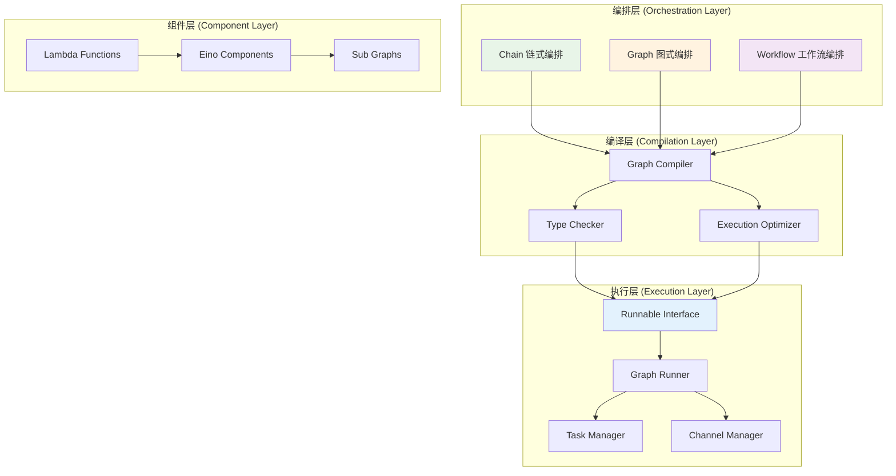
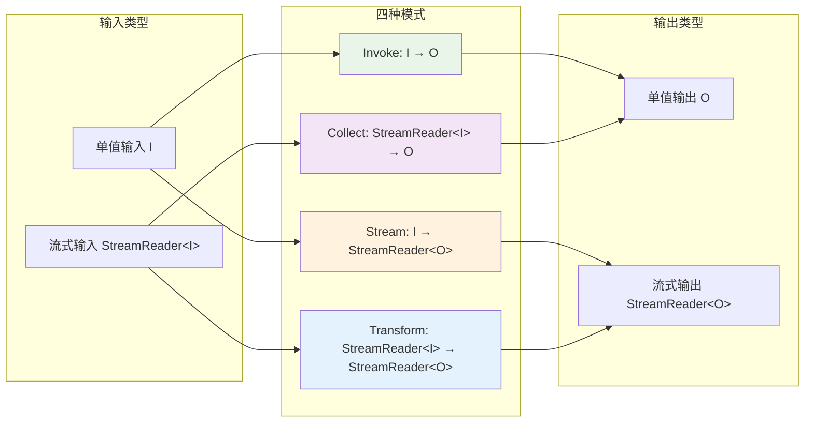
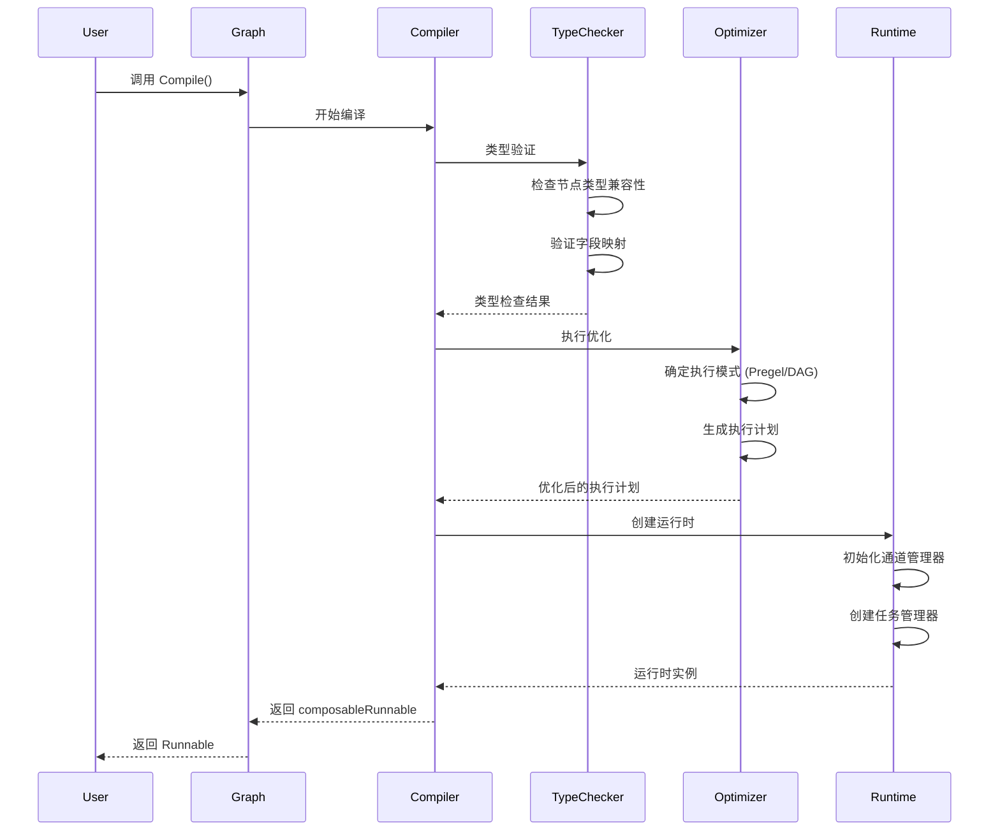

## 1. 概述

Compose 模块是 Eino 框架的编排引擎核心，负责将各种组件组合成复杂的执行流程。该模块提供了三种主要的编排模式：**Chain**（链式）、**Graph**（图式）和 **Workflow**（工作流），以及统一的 **Runnable** 接口抽象。

Compose 模块的核心设计理念是：
- **统一抽象**: 所有编排结果都编译为 `Runnable` 接口
- **类型安全**: 利用 Go 泛型确保编译时类型检查
- **灵活编排**: 支持线性、并行、分支、循环等多种执行模式
- **流式优先**: 原生支持流式数据处理
- **可扩展性**: 支持自定义 Lambda 函数和子图嵌套

## 2. 核心架构设计

### 2.1 整体架构图



**图 2-1: Compose 模块整体架构图**

**图介绍**:
该架构图展示了 Compose 模块的四层架构：

- **编排层**: 提供三种不同复杂度的编排方式，满足不同场景需求
- **编译层**: 负责将编排定义转换为可执行的运行时结构，包括类型检查和执行优化
- **执行层**: 统一的执行抽象和高效的并发执行引擎
- **组件层**: 支持各种类型的可执行单元，包括 Lambda 函数、Eino 组件和子图

### 2.2 核心类型定义

```go
// compose/types.go

type component = components.Component

// 内置组件类型
const (
	ComponentOfUnknown     component = "Unknown"
	ComponentOfGraph       component = "Graph"
	ComponentOfWorkflow    component = "Workflow"
	ComponentOfChain       component = "Chain"
	ComponentOfPassthrough component = "Passthrough"
	ComponentOfToolsNode   component = "ToolsNode"
	ComponentOfLambda      component = "Lambda"
)

// NodeTriggerMode 控制图节点的触发模式
type NodeTriggerMode string

const (
	// AnyPredecessor 当任何前驱节点完成时触发
	// 适用于 Pregel 模式，支持循环和迭代
	AnyPredecessor NodeTriggerMode = "any_predecessor"
	
	// AllPredecessor 当所有前驱节点完成时才触发
	// 适用于 DAG 模式，确保严格的依赖顺序
	AllPredecessor NodeTriggerMode = "all_predecessor"
)
```

### 2.3 统一接口抽象

```go
// compose/types_composable.go

// AnyGraph 可组合图的统一接口
// 由 Graph、Chain、Workflow 实现
type AnyGraph interface {
	getGenericHelper() *genericHelper
	compile(ctx context.Context, options *graphCompileOptions) (*composableRunnable, error)
	inputType() reflect.Type
	outputType() reflect.Type
	component() component
}
```

## 3. Runnable 接口详解

### 3.1 接口定义与设计理念

```go
// compose/runnable.go

// Runnable 是可执行对象的接口。Graph、Chain 可以编译为 Runnable。
// runnable 是 eino 的核心概念，我们对四种数据流模式做降级兼容，
// 可以自动连接只实现一种或多种方法的组件。
// 例如，如果组件只实现 Stream() 方法，你仍然可以调用 Invoke() 来将流输出转换为调用输出。
type Runnable[I, O any] interface {
	Invoke(ctx context.Context, input I, opts ...Option) (output O, err error)
	Stream(ctx context.Context, input I, opts ...Option) (output *schema.StreamReader[O], err error)
	Collect(ctx context.Context, input *schema.StreamReader[I], opts ...Option) (output O, err error)
	Transform(ctx context.Context, input *schema.StreamReader[I], opts ...Option) (output *schema.StreamReader[O], err error)
}
```

**设计理念**:
- **四种数据流模式**: 支持同步/异步、单值/流式的所有组合
- **自动适配**: 组件只需实现一种模式，框架自动提供其他模式的适配
- **类型安全**: 通过泛型确保输入输出类型的一致性
- **统一抽象**: 所有编排结果都实现相同的接口

### 3.2 数据流模式详解



**图 3-1: Runnable 四种数据流模式**

### 3.3 自动适配机制

```go
// compose/runnable.go 内部实现

// composableRunnable 是 Runnable 的具体实现
type composableRunnable struct {
	invoke    func(context.Context, any, ...Option) (any, error)
	stream    func(context.Context, any, ...Option) (*schema.StreamReader[any], error)
	collect   func(context.Context, *schema.StreamReader[any], ...Option) (any, error)
	transform func(context.Context, *schema.StreamReader[any], ...Option) (*schema.StreamReader[any], error)
	
	inputType  reflect.Type
	outputType reflect.Type
	
	genericHelper *genericHelper
	nodeInfo      *nodeInfo
	meta          *executorMeta
}

// 自动适配示例：通过 Stream 实现 Invoke
func (cr *composableRunnable) invokeByStream(ctx context.Context, input any, opts ...Option) (any, error) {
	stream, err := cr.stream(ctx, input, opts...)
	if err != nil {
		return nil, err
	}
	defer stream.Close()
	
	var result any
	for {
		chunk, err := stream.Recv()
		if err == io.EOF {
			break
		}
		if err != nil {
			return nil, err
		}
		result = chunk // 保留最后一个值
	}
	
	return result, nil
}

// 自动适配示例：通过 Invoke 实现 Stream
func (cr *composableRunnable) streamByInvoke(ctx context.Context, input any, opts ...Option) (*schema.StreamReader[any], error) {
	result, err := cr.invoke(ctx, input, opts...)
	if err != nil {
		return nil, err
	}
	
	// 将单个结果包装为只有一个元素的流
	return schema.StreamReaderFromArray([]any{result}), nil
}
```

## 4. Chain 链式编排

### 4.1 设计理念与特点

Chain 是最简单的编排模式，适用于线性顺序执行的场景：

- **线性执行**: 组件按添加顺序依次执行
- **构建器模式**: 支持链式调用，代码简洁直观
- **自动连接**: 自动处理组件间的数据流连接
- **类型推导**: 自动推导和验证组件间的类型兼容性

### 4.2 核心结构

```go
// compose/chain.go

// Chain 是组件链
// Chain 节点可以是并行/分支/序列组件
// Chain 设计为构建器模式使用（使用前应该 Compile()）
// 接口是 `Chain 风格`，可以像这样使用：`chain.AppendXX(...).AppendXX(...)`
type Chain[I, O any] struct {
	gg          *Graph[I, O]  // 内部使用 Graph 实现
	preNodeKeys []string      // 前一个节点的键列表
	err         error         // 构建过程中的错误
}

// NewChain 创建具有输入/输出类型的链
func NewChain[I, O any](opts ...NewGraphOption) *Chain[I, O] {
	ch := &Chain[I, O]{
		gg: NewGraph[I, O](opts...),
	}
	ch.gg.cmp = ComponentOfChain
	return ch
}
```

### 4.3 组件添加方法

```go
// 聊天模型组件
func (c *Chain[I, O]) AppendChatModel(node model.BaseChatModel, opts ...GraphAddNodeOpt) *Chain[I, O] {
	gNode, options := toChatModelNode(node, opts...)
	c.addNode(gNode, options)
	return c
}

// Lambda 函数组件
func (c *Chain[I, O]) AppendLambda(node *Lambda, opts ...GraphAddNodeOpt) *Chain[I, O] {
	gNode, options := toLambdaNode(node, opts...)
	c.addNode(gNode, options)
	return c
}

// 检索器组件
func (c *Chain[I, O]) AppendRetriever(node retriever.Retriever, opts ...GraphAddNodeOpt) *Chain[I, O] {
	gNode, options := toRetrieverNode(node, opts...)
	c.addNode(gNode, options)
	return c
}

// 并行结构
func (c *Chain[I, O]) AppendParallel(p *Parallel) *Chain[I, O] {
	gNode, options := toParallelNode(p)
	c.addNode(gNode, options)
	return c
}

// 分支结构
func (c *Chain[I, O]) AppendBranch(b *ChainBranch) *Chain[I, O] {
	gNode, options := toBranchNode(b)
	c.addNode(gNode, options)
	return c
}
```

### 4.4 自动连接机制

```go
// compose/chain.go

func (c *Chain[I, O]) addNode(node *graphNode, options *graphAddNodeOpts) {
	if c.err != nil {
		return
	}
	if c.gg.compiled {
		c.reportError(ErrChainCompiled)
		return
	}
	if node == nil {
		c.reportError(fmt.Errorf("chain add node invalid, node is nil"))
		return
	}
	
	// 生成节点键
	nodeKey := options.nodeOptions.nodeKey
	defaultNodeKey := c.nextNodeKey()
	if nodeKey == "" {
		nodeKey = defaultNodeKey
	}
	
	// 添加节点到底层图
	err := c.gg.addNode(nodeKey, node, options)
	if err != nil {
		c.reportError(err)
		return
	}
	
	// 自动连接前驱节点
	if len(c.preNodeKeys) == 0 {
		c.preNodeKeys = append(c.preNodeKeys, START)
	}
	for _, preNodeKey := range c.preNodeKeys {
		e := c.gg.AddEdge(preNodeKey, nodeKey)
		if e != nil {
			c.reportError(e)
			return
		}
	}
	
	// 更新前驱节点列表
	c.preNodeKeys = []string{nodeKey}
}
```

### 4.5 Chain 使用示例

```go
package main

import (
	"context"
	"fmt"
	
	"github.com/cloudwego/eino/compose"
	"github.com/cloudwego/eino/schema"
)

func chainExample() {
	ctx := context.Background()
	
	// 创建处理器 Lambda
	preprocessor := compose.InvokableLambda(func(ctx context.Context, input string) (map[string]any, error) {
		return map[string]any{
			"query": input,
			"timestamp": time.Now(),
		}, nil
	})
	
	// 创建格式化器 Lambda
	formatter := compose.InvokableLambda(func(ctx context.Context, input map[string]any) (*schema.Message, error) {
		query := input["query"].(string)
		return &schema.Message{
			Role:    schema.Assistant,
			Content: fmt.Sprintf("处理查询: %s", query),
		}, nil
	})
	
	// 构建链
	chain := compose.NewChain[string, *schema.Message]().
		AppendLambda("preprocessor", preprocessor).
		AppendLambda("formatter", formatter)
	
	// 编译
	runnable, err := chain.Compile(ctx)
	if err != nil {
		panic(err)
	}
	
	// 执行
	result, err := runnable.Invoke(ctx, "Hello Eino")
	if err != nil {
		panic(err)
	}
	
	fmt.Printf("结果: %s\n", result.Content)
}

// 并行处理示例
func parallelChainExample() {
	ctx := context.Background()
	
	// 创建并行处理器
	parallel := compose.NewParallel().
		AppendLambda("processor1", compose.InvokableLambda(func(ctx context.Context, input string) (string, error) {
			return "处理器1: " + input, nil
		})).
		AppendLambda("processor2", compose.InvokableLambda(func(ctx context.Context, input string) (string, error) {
			return "处理器2: " + input, nil
		}))
	
	// 创建合并器
	merger := compose.InvokableLambda(func(ctx context.Context, input map[string]any) (string, error) {
		results := make([]string, 0)
		for _, v := range input {
			if str, ok := v.(string); ok {
				results = append(results, str)
			}
		}
		return strings.Join(results, " | "), nil
	})
	
	// 构建链
	chain := compose.NewChain[string, string]().
		AppendParallel(parallel).
		AppendLambda("merger", merger)
	
	// 编译并执行
	runnable, err := chain.Compile(ctx)
	if err != nil {
		panic(err)
	}
	
	result, err := runnable.Invoke(ctx, "测试数据")
	if err != nil {
		panic(err)
	}
	
	fmt.Printf("并行处理结果: %s\n", result)
}
```

## 5. Graph 图式编排

### 5.1 设计理念与特点

Graph 提供了最灵活的编排能力，支持复杂的数据流和控制流：

- **任意拓扑**: 支持任意有向图结构，包括分支、合并、循环
- **双重边类型**: 区分数据流边和控制流边
- **字段映射**: 支持细粒度的数据字段映射
- **条件分支**: 支持基于条件的动态路由
- **两种执行模式**: Pregel 模式（支持循环）和 DAG 模式（严格依赖）

### 5.2 核心结构

```go
// compose/graph.go

type graph struct {
	nodes        map[string]*graphNode    // 节点映射
	dataEdges    map[string][]string      // 数据流边
	controlEdges map[string][]string      // 控制流边
	branches     map[string][]*GraphBranch // 条件分支
	
	startNodes []string  // 起始节点
	endNodes   []string  // 结束节点
	
	// 类型验证相关
	toValidateMap       map[string][]struct {
		endNode  string
		mappings []*FieldMapping
	}
	fieldMappingRecords map[string][]*FieldMapping
	
	// 编译状态
	compiled   bool
	buildError error
	
	// 类型信息
	expectedInputType  reflect.Type
	expectedOutputType reflect.Type
	genericHelper      *genericHelper
	
	// 组件类型
	cmp component
	
	// 状态管理
	stateType      reflect.Type
	stateGenerator func() any
	
	// 处理器
	handlerOnEdges   map[string]map[string][]handlerPair
	handlerPreNode   map[string][]handlerPair
	handlerPreBranch map[string][][]handlerPair
}
```

### 5.3 节点管理

```go
// 添加聊天模型节点
func (g *Graph[I, O]) AddChatModelNode(key string, node model.BaseChatModel, opts ...GraphAddNodeOpt) error {
	gNode, options := toChatModelNode(node, opts...)
	return g.g.addNode(key, gNode, options)
}

// 添加 Lambda 节点
func (g *Graph[I, O]) AddLambdaNode(key string, node *Lambda, opts ...GraphAddNodeOpt) error {
	gNode, options := toLambdaNode(node, opts...)
	return g.g.addNode(key, gNode, options)
}

// 添加子图节点
func (g *Graph[I, O]) AddGraphNode(key string, node AnyGraph, opts ...GraphAddNodeOpt) error {
	gNode, options := toGraphNode(node, opts...)
	return g.g.addNode(key, gNode, options)
}

// 添加直通节点（用于连接多个分支）
func (g *Graph[I, O]) AddPassthroughNode(key string, opts ...GraphAddNodeOpt) error {
	gNode, options := toPassthroughNode(opts...)
	return g.g.addNode(key, gNode, options)
}
```

### 5.4 边管理

```go
// 添加数据流和控制流边
func (g *Graph[I, O]) AddEdge(startNode, endNode string, mappings ...*FieldMapping) error {
	return g.g.addEdgeWithMappings(startNode, endNode, false, false, mappings...)
}

// 添加仅控制流边（不传递数据）
func (g *Graph[I, O]) AddControlEdge(startNode, endNode string) error {
	return g.g.addEdgeWithMappings(startNode, endNode, false, true)
}

// 添加仅数据流边（不控制执行顺序）
func (g *Graph[I, O]) AddDataEdge(startNode, endNode string, mappings ...*FieldMapping) error {
	return g.g.addEdgeWithMappings(startNode, endNode, true, false, mappings...)
}

// 添加条件分支
func (g *Graph[I, O]) AddBranch(startNode string, branch *GraphBranch) error {
	return g.g.addBranch(startNode, branch, false)
}
```

### 5.5 字段映射机制

```go
// compose/field_mapping.go

// FieldMapping 定义字段映射关系
type FieldMapping struct {
	from string  // 源字段路径
	to   string  // 目标字段路径
}

// FieldPath 字段路径类型
type FieldPath []string

// 创建字段映射
func NewFieldMapping(from, to string) *FieldMapping {
	return &FieldMapping{from: from, to: to}
}

// 从字段路径创建映射
func FromFieldPath(from FieldPath) *FieldMapping {
	return &FieldMapping{from: joinFieldPath(from)}
}

// 到字段路径创建映射
func ToFieldPath(to FieldPath) *FieldMapping {
	return &FieldMapping{to: joinFieldPath(to)}
}

// 字段映射应用示例
func applyFieldMappings(input map[string]any, mappings []*FieldMapping) (map[string]any, error) {
	result := make(map[string]any)
	
	for _, mapping := range mappings {
		// 从输入中提取值
		value, err := extractValue(input, mapping.from)
		if err != nil {
			return nil, err
		}
		
		// 设置到目标路径
		err = setValue(result, mapping.to, value)
		if err != nil {
			return nil, err
		}
	}
	
	return result, nil
}
```

### 5.6 条件分支

```go
// compose/branch.go

// GraphBranch 图分支定义
type GraphBranch struct {
	condition  func(ctx context.Context, input any) (string, error)  // 分支条件函数
	endNodes   map[string]bool                                       // 目标节点集合
	noDataFlow bool                                                  // 是否传递数据
}

// 创建条件分支
func NewGraphBranch(condition func(ctx context.Context, input any) (string, error)) *GraphBranch {
	return &GraphBranch{
		condition: condition,
		endNodes:  make(map[string]bool),
	}
}

// 添加分支目标
func (gb *GraphBranch) AddTarget(nodeKey string) *GraphBranch {
	gb.endNodes[nodeKey] = true
	return gb
}

// 设置不传递数据
func (gb *GraphBranch) WithNoDataFlow() *GraphBranch {
	gb.noDataFlow = true
	return gb
}

// 分支执行逻辑
func (gb *GraphBranch) execute(ctx context.Context, input any) ([]string, error) {
	target, err := gb.condition(ctx, input)
	if err != nil {
		return nil, err
	}
	
	if gb.endNodes[target] {
		return []string{target}, nil
	}
	
	return nil, fmt.Errorf("branch target %s not found", target)
}
```

### 5.7 Graph 使用示例

```go
package main

import (
	"context"
	"fmt"
	"strings"
	
	"github.com/cloudwego/eino/compose"
	"github.com/cloudwego/eino/schema"
)

func graphExample() {
	ctx := context.Background()
	
	// 创建图
	graph := compose.NewGraph[string, string]()
	
	// 添加预处理节点
	err := graph.AddLambdaNode("preprocessor", compose.InvokableLambda(func(ctx context.Context, input string) (map[string]any, error) {
		return map[string]any{
			"text": strings.ToLower(input),
			"length": len(input),
		}, nil
	}))
	if err != nil {
		panic(err)
	}
	
	// 添加条件分支
	branch := compose.NewGraphBranch(func(ctx context.Context, input any) (string, error) {
		data := input.(map[string]any)
		length := data["length"].(int)
		if length > 10 {
			return "long_processor", nil
		}
		return "short_processor", nil
	}).AddTarget("long_processor").AddTarget("short_processor")
	
	err = graph.AddBranch("preprocessor", branch)
	if err != nil {
		panic(err)
	}
	
	// 添加长文本处理器
	err = graph.AddLambdaNode("long_processor", compose.InvokableLambda(func(ctx context.Context, input map[string]any) (string, error) {
		text := input["text"].(string)
		return fmt.Sprintf("长文本处理: %s", text), nil
	}))
	if err != nil {
		panic(err)
	}
	
	// 添加短文本处理器
	err = graph.AddLambdaNode("short_processor", compose.InvokableLambda(func(ctx context.Context, input map[string]any) (string, error) {
		text := input["text"].(string)
		return fmt.Sprintf("短文本处理: %s", text), nil
	}))
	if err != nil {
		panic(err)
	}
	
	// 添加合并节点
	err = graph.AddPassthroughNode("merger")
	if err != nil {
		panic(err)
	}
	
	// 连接边
	err = graph.AddEdge("long_processor", "merger")
	if err != nil {
		panic(err)
	}
	
	err = graph.AddEdge("short_processor", "merger")
	if err != nil {
		panic(err)
	}
	
	// 编译并执行
	runnable, err := graph.Compile(ctx)
	if err != nil {
		panic(err)
	}
	
	// 测试短文本
	result1, err := runnable.Invoke(ctx, "Hello")
	if err != nil {
		panic(err)
	}
	fmt.Printf("短文本结果: %s\n", result1)
	
	// 测试长文本
	result2, err := runnable.Invoke(ctx, "This is a very long text for testing")
	if err != nil {
		panic(err)
	}
	fmt.Printf("长文本结果: %s\n", result2)
}

// 字段映射示例
func fieldMappingExample() {
	ctx := context.Background()
	
	graph := compose.NewGraph[map[string]any, map[string]any]()
	
	// 添加数据处理节点
	err := graph.AddLambdaNode("processor", compose.InvokableLambda(func(ctx context.Context, input map[string]any) (map[string]any, error) {
		name := input["user_name"].(string)
		age := input["user_age"].(int)
		
		return map[string]any{
			"processed_name": strings.ToUpper(name),
			"processed_age":  age * 2,
		}, nil
	}))
	if err != nil {
		panic(err)
	}
	
	// 添加格式化节点，使用字段映射
	err = graph.AddLambdaNode("formatter", compose.InvokableLambda(func(ctx context.Context, input map[string]any) (map[string]any, error) {
		return map[string]any{
			"result": fmt.Sprintf("Name: %s, Age: %v", input["name"], input["age"]),
		}, nil
	}))
	if err != nil {
		panic(err)
	}
	
	// 添加带字段映射的边
	err = graph.AddEdge("processor", "formatter",
		compose.NewFieldMapping("processed_name", "name"),
		compose.NewFieldMapping("processed_age", "age"),
	)
	if err != nil {
		panic(err)
	}
	
	// 编译并执行
	runnable, err := graph.Compile(ctx)
	if err != nil {
		panic(err)
	}
	
	input := map[string]any{
		"user_name": "alice",
		"user_age":  25,
	}
	
	result, err := runnable.Invoke(ctx, input)
	if err != nil {
		panic(err)
	}
	
	fmt.Printf("字段映射结果: %v\n", result)
}
```

## 6. Workflow 工作流编排

### 6.1 设计理念与特点

Workflow 是 Graph 的高级封装，提供更声明式的编排方式：

- **声明式依赖**: 通过 `AddInput` 和 `AddDependency` 声明节点关系
- **静态值注入**: 支持为节点设置静态输入值
- **DAG 模式**: 强制使用 DAG 模式，不支持循环
- **类型安全**: 编译时验证依赖关系和数据流
- **简化 API**: 相比 Graph 提供更简洁的 API

### 6.2 核心结构

```go
// compose/workflow.go

// WorkflowNode 工作流节点
type WorkflowNode struct {
	g                *graph                    // 底层图引用
	key              string                    // 节点键
	addInputs        []func() error            // 待添加的输入函数列表
	staticValues     map[string]any            // 静态值映射
	dependencySetter func(string, dependencyType) // 依赖设置器
	mappedFieldPath  map[string]any            // 映射字段路径
}

// Workflow 是 graph 的包装器，用声明依赖和字段映射替代 AddEdge
// 底层使用 NodeTriggerMode(AllPredecessor)，因此不支持循环
type Workflow[I, O any] struct {
	g                *graph                           // 底层图
	workflowNodes    map[string]*WorkflowNode         // 工作流节点映射
	workflowBranches []*WorkflowBranch               // 工作流分支
	dependencies     map[string]map[string]dependencyType // 依赖关系映射
}

// 依赖类型
type dependencyType int

const (
	normalDependency   dependencyType = iota  // 普通依赖（数据+控制）
	noDirectDependency                        // 无直接依赖（仅控制）
	branchDependency                          // 分支依赖
)
```

### 6.3 节点创建与配置

```go
// 创建聊天模型节点
func (wf *Workflow[I, O]) AddChatModelNode(key string, chatModel model.BaseChatModel, opts ...GraphAddNodeOpt) *WorkflowNode {
	_ = wf.g.AddChatModelNode(key, chatModel, opts...)
	return wf.initNode(key)
}

// 创建 Lambda 节点
func (wf *Workflow[I, O]) AddLambdaNode(key string, lambda *Lambda, opts ...GraphAddNodeOpt) *WorkflowNode {
	_ = wf.g.AddLambdaNode(key, lambda, opts...)
	return wf.initNode(key)
}

// 初始化工作流节点
func (wf *Workflow[I, O]) initNode(key string) *WorkflowNode {
	n := &WorkflowNode{
		g:            wf.g,
		key:          key,
		staticValues: make(map[string]any),
		dependencySetter: func(fromNodeKey string, typ dependencyType) {
			if _, ok := wf.dependencies[key]; !ok {
				wf.dependencies[key] = make(map[string]dependencyType)
			}
			wf.dependencies[key][fromNodeKey] = typ
		},
		mappedFieldPath: make(map[string]any),
	}
	wf.workflowNodes[key] = n
	return n
}
```

### 6.4 依赖管理

```go
// 添加输入依赖（数据流 + 控制流）
func (n *WorkflowNode) AddInput(fromNodeKey string, inputs ...*FieldMapping) *WorkflowNode {
	return n.addDependencyRelation(fromNodeKey, inputs, &workflowAddInputOpts{})
}

// 添加输入依赖（带选项）
func (n *WorkflowNode) AddInputWithOptions(fromNodeKey string, inputs []*FieldMapping, opts ...WorkflowAddInputOpt) *WorkflowNode {
	options := &workflowAddInputOpts{}
	for _, opt := range opts {
		opt(options)
	}
	return n.addDependencyRelation(fromNodeKey, inputs, options)
}

// 添加控制依赖（仅控制流）
func (n *WorkflowNode) AddDependency(fromNodeKey string) *WorkflowNode {
	return n.addDependencyRelation(fromNodeKey, nil, &workflowAddInputOpts{dependencyWithoutInput: true})
}

// 设置静态值
func (n *WorkflowNode) SetStaticValue(path FieldPath, value any) *WorkflowNode {
	pathStr := joinFieldPath(path)
	n.staticValues[pathStr] = value
	return n
}

// 内部依赖关系添加逻辑
func (n *WorkflowNode) addDependencyRelation(fromNodeKey string, inputs []*FieldMapping, opts *workflowAddInputOpts) *WorkflowNode {
	n.addInputs = append(n.addInputs, func() error {
		// 根据选项确定边类型
		noControl := opts.noDirectDependency
		noData := opts.dependencyWithoutInput || len(inputs) == 0
		
		// 添加边到底层图
		err := n.g.addEdgeWithMappings(fromNodeKey, n.key, noControl, noData, inputs...)
		if err != nil {
			return err
		}
		
		// 记录依赖类型
		if opts.noDirectDependency {
			n.dependencySetter(fromNodeKey, noDirectDependency)
		} else if opts.dependencyWithoutInput {
			n.dependencySetter(fromNodeKey, normalDependency)
		} else {
			n.dependencySetter(fromNodeKey, normalDependency)
		}
		
		// 验证和记录字段映射
		if len(inputs) > 0 {
			paths := make([]FieldPath, len(inputs))
			for i, input := range inputs {
				paths[i] = splitFieldPath(input.to)
			}
			return n.checkAndAddMappedPath(paths)
		}
		
		return nil
	})
	
	return n
}
```

### 6.5 编译过程

```go
func (wf *Workflow[I, O]) compile(ctx context.Context, options *graphCompileOptions) (*composableRunnable, error) {
	if wf.g.buildError != nil {
		return nil, wf.g.buildError
	}
	
	// 处理工作流分支
	for _, wb := range wf.workflowBranches {
		for endNode := range wb.endNodes {
			if endNode == END {
				if _, ok := wf.dependencies[END]; !ok {
					wf.dependencies[END] = make(map[string]dependencyType)
				}
				wf.dependencies[END][wb.fromNodeKey] = branchDependency
			} else {
				n := wf.workflowNodes[endNode]
				n.dependencySetter(wb.fromNodeKey, branchDependency)
			}
		}
		_ = wf.g.addBranch(wb.fromNodeKey, wb.GraphBranch, true)
	}
	
	// 应用所有输入依赖
	for _, n := range wf.workflowNodes {
		for _, addInput := range n.addInputs {
			if err := addInput(); err != nil {
				return nil, err
			}
		}
		n.addInputs = nil
	}
	
	// 处理静态值
	for _, n := range wf.workflowNodes {
		if len(n.staticValues) > 0 {
			value := make(map[string]any, len(n.staticValues))
			var paths []FieldPath
			for path, v := range n.staticValues {
				value[path] = v
				paths = append(paths, splitFieldPath(path))
			}
			
			if err := n.checkAndAddMappedPath(paths); err != nil {
				return nil, err
			}
			
			// 创建静态值注入处理器
			pair := handlerPair{
				invoke: func(in any) (any, error) {
					values := []any{in, value}
					return mergeValues(values, nil)
				},
				transform: func(in streamReader) streamReader {
					sr := schema.StreamReaderFromArray([]map[string]any{value})
					newS, err := mergeValues([]any{in, packStreamReader(sr)}, nil)
					if err != nil {
						errSR, errSW := schema.Pipe[map[string]any](1)
						errSW.Send(nil, err)
						errSW.Close()
						return packStreamReader(errSR)
					}
					return newS.(streamReader)
				},
			}
			
			// 记录字段映射
			for i := range paths {
				wf.g.fieldMappingRecords[n.key] = append(wf.g.fieldMappingRecords[n.key], ToFieldPath(paths[i]))
			}
			
			wf.g.handlerPreNode[n.key] = []handlerPair{pair}
		}
	}
	
	// 委托给底层图编译
	return wf.g.compile(ctx, options)
}
```

### 6.6 Workflow 使用示例

```go
package main

import (
	"context"
	"fmt"
	"strings"
	
	"github.com/cloudwego/eino/compose"
	"github.com/cloudwego/eino/schema"
)

func workflowExample() {
	ctx := context.Background()
	
	// 创建工作流
	workflow := compose.NewWorkflow[map[string]any, map[string]any]()
	
	// 添加数据预处理节点
	preprocessor := workflow.AddLambdaNode("preprocessor", compose.InvokableLambda(func(ctx context.Context, input map[string]any) (map[string]any, error) {
		text := input["text"].(string)
		return map[string]any{
			"cleaned_text": strings.TrimSpace(text),
			"word_count":   len(strings.Fields(text)),
		}, nil
	}))
	
	// 添加文本分析节点
	analyzer := workflow.AddLambdaNode("analyzer", compose.InvokableLambda(func(ctx context.Context, input map[string]any) (map[string]any, error) {
		text := input["text"].(string)
		wordCount := input["count"].(int)
		
		return map[string]any{
			"analysis": fmt.Sprintf("文本长度: %d 字符, 单词数: %d", len(text), wordCount),
			"category": func() string {
				if wordCount > 10 {
					return "长文本"
				}
				return "短文本"
			}(),
		}, nil
	})).
		AddInput("preprocessor",
			compose.NewFieldMapping("cleaned_text", "text"),
			compose.NewFieldMapping("word_count", "count"),
		).
		SetStaticValue(compose.FieldPath{"metadata", "version"}, "1.0")
	
	// 添加结果格式化节点
	formatter := workflow.AddLambdaNode("formatter", compose.InvokableLambda(func(ctx context.Context, input map[string]any) (map[string]any, error) {
		analysis := input["analysis"].(string)
		category := input["category"].(string)
		version := input["version"].(string)
		
		return map[string]any{
			"result": fmt.Sprintf("[%s] %s (版本: %s)", category, analysis, version),
		}, nil
	})).
		AddInput("analyzer",
			compose.NewFieldMapping("analysis", "analysis"),
			compose.NewFieldMapping("category", "category"),
			compose.NewFieldMapping("metadata.version", "version"),
		)
	
	// 设置输出节点
	workflow.End().AddInput("formatter")
	
	// 编译并执行
	runnable, err := workflow.Compile(ctx)
	if err != nil {
		panic(err)
	}
	
	input := map[string]any{
		"text": "  This is a sample text for workflow testing with multiple words  ",
	}
	
	result, err := runnable.Invoke(ctx, input)
	if err != nil {
		panic(err)
	}
	
	fmt.Printf("工作流结果: %v\n", result)
}

// 复杂依赖示例
func complexWorkflowExample() {
	ctx := context.Background()
	
	workflow := compose.NewWorkflow[string, string]()
	
	// 输入处理
	inputProcessor := workflow.AddLambdaNode("input_processor", compose.InvokableLambda(func(ctx context.Context, input string) (map[string]any, error) {
		return map[string]any{
			"original": input,
			"length":   len(input),
		}, nil
	}))
	
	// 并行处理分支 1: 文本转换
	textTransformer := workflow.AddLambdaNode("text_transformer", compose.InvokableLambda(func(ctx context.Context, input map[string]any) (map[string]any, error) {
		text := input["text"].(string)
		return map[string]any{
			"transformed": strings.ToUpper(text),
		}, nil
	})).AddInput("input_processor", compose.NewFieldMapping("original", "text"))
	
	// 并行处理分支 2: 长度分析
	lengthAnalyzer := workflow.AddLambdaNode("length_analyzer", compose.InvokableLambda(func(ctx context.Context, input map[string]any) (map[string]any, error) {
		length := input["len"].(int)
		return map[string]any{
			"analysis": fmt.Sprintf("文本长度: %d", length),
		}, nil
	})).AddInput("input_processor", compose.NewFieldMapping("length", "len"))
	
	// 结果合并（等待两个分支完成）
	merger := workflow.AddLambdaNode("merger", compose.InvokableLambda(func(ctx context.Context, input map[string]any) (string, error) {
		transformed := input["transformed_text"].(string)
		analysis := input["length_analysis"].(string)
		
		return fmt.Sprintf("%s | %s", transformed, analysis), nil
	})).
		AddInput("text_transformer", compose.NewFieldMapping("transformed", "transformed_text")).
		AddInput("length_analyzer", compose.NewFieldMapping("analysis", "length_analysis"))
	
	// 设置输出
	workflow.End().AddInput("merger")
	
	// 编译并执行
	runnable, err := workflow.Compile(ctx)
	if err != nil {
		panic(err)
	}
	
	result, err := runnable.Invoke(ctx, "hello world")
	if err != nil {
		panic(err)
	}
	
	fmt.Printf("复杂工作流结果: %s\n", result)
}
```

## 7. 编译与执行机制

### 7.1 编译过程概览



**图 7-1: 编译过程序列图**

### 7.2 类型检查机制

```go
// compose/graph.go

func (g *graph) compile(ctx context.Context, opt *graphCompileOptions) (*composableRunnable, error) {
	if g.buildError != nil {
		return nil, g.buildError
	}
	
	// 确定运行类型
	runType := runTypePregel
	cb := pregelChannelBuilder
	if isChain(g.cmp) || isWorkflow(g.cmp) {
		if opt != nil && opt.nodeTriggerMode != "" {
			return nil, errors.New(fmt.Sprintf("%s doesn't support node trigger mode option", g.cmp))
		}
	}
	if (opt != nil && opt.nodeTriggerMode == AllPredecessor) || isWorkflow(g.cmp) {
		runType = runTypeDAG
		cb = dagChannelBuilder
	}
	
	// 确定执行模式
	eager := false
	if isWorkflow(g.cmp) || runType == runTypeDAG {
		eager = true
	}
	if opt != nil && opt.eagerDisabled {
		eager = false
	}
	
	// 验证起始和结束节点
	if len(g.startNodes) == 0 {
		return nil, errors.New("start node not set")
	}
	if len(g.endNodes) == 0 {
		return nil, errors.New("end node not set")
	}
	
	// 类型推导验证
	for _, v := range g.toValidateMap {
		if len(v) > 0 {
			return nil, fmt.Errorf("some node's input or output types cannot be inferred: %v", g.toValidateMap)
		}
	}
	
	// 字段映射验证
	for key := range g.fieldMappingRecords {
		toMap := make(map[string]bool)
		for _, mapping := range g.fieldMappingRecords[key] {
			if _, ok := toMap[mapping.to]; ok {
				return nil, fmt.Errorf("duplicate mapping target field: %s of node[%s]", mapping.to, key)
			}
			toMap[mapping.to] = true
		}
		
		// 添加字段映射转换器
		g.handlerPreNode[key] = append(g.handlerPreNode[key], g.getNodeGenericHelper(key).inputFieldMappingConverter)
	}
	
	// 编译子图和组件
	key2SubGraphs := g.beforeChildGraphsCompile(opt)
	chanSubscribeTo := make(map[string]*chanCall)
	for name, node := range g.nodes {
		r, err := node.compileIfNeeded(ctx)
		if err != nil {
			return nil, err
		}
		
		chCall := &chanCall{
			action:        r,
			writeTo:       g.dataEdges[name],
			controls:      g.controlEdges[name],
			preProcessor:  node.nodeInfo.preProcessor,
			postProcessor: node.nodeInfo.postProcessor,
		}
		
		// 处理分支
		branches := g.branches[name]
		if len(branches) > 0 {
			chCall.writeToBranches = append(chCall.writeToBranches, branches...)
		}
		
		chanSubscribeTo[name] = chCall
	}
	
	// 构建前驱关系
	dataPredecessors := make(map[string][]string)
	controlPredecessors := make(map[string][]string)
	
	// ... 构建前驱关系的详细逻辑
	
	// 创建运行时
	return g.createRuntime(chanSubscribeTo, dataPredecessors, controlPredecessors, runType, eager, cb)
}
```

### 7.3 执行引擎

#### 7.3.1 任务管理器

```go
// compose/graph_manager.go

type taskManager struct {
	runWrapper func(context.Context, *composableRunnable, any, ...Option) (any, error)
	
	runningTasks map[string]*task  // 正在运行的任务
	done         chan *task        // 完成的任务通道
	num          int              // 任务计数
	needAll      bool             // 是否需要等待所有任务
	cancelCh     chan struct{}    // 取消通道
	opts         []Option         // 执行选项
}

type task struct {
	nodeKey string                // 节点键
	call    *chanCall            // 调用信息
	input   any                  // 输入数据
	output  any                  // 输出数据
	err     error                // 错误信息
	ctx     context.Context      // 上下文
	option  []Option             // 选项
}

// 执行任务
func (t *taskManager) execute(currentTask *task) {
	defer func() {
		panicInfo := recover()
		if panicInfo != nil {
			currentTask.output = nil
			currentTask.err = safe.NewPanicErr(panicInfo, debug.Stack())
		}
		t.done.Send(currentTask)
	}()
	
	// 初始化节点回调
	ctx := initNodeCallbacks(currentTask.ctx, currentTask.nodeKey, currentTask.call.action.nodeInfo, currentTask.call.action.meta, t.opts...)
	
	// 执行任务
	currentTask.output, currentTask.err = t.runWrapper(ctx, currentTask.call.action, currentTask.input, currentTask.option...)
}

// 提交任务
func (t *taskManager) submit(tasks []*task) error {
	if len(tasks) == 0 {
		return nil
	}
	
	// 预处理任务
	for i := 0; i < len(tasks); i++ {
		currentTask := tasks[i]
		err := runPreHandler(currentTask, t.runWrapper)
		if err != nil {
			currentTask.err = err
			tasks = append(tasks[:i], tasks[i+1:]...)
			i--
			t.num++
			t.done.Send(currentTask)
		}
		t.runningTasks[currentTask.nodeKey] = currentTask
	}
	
	if len(tasks) == 0 {
		return nil
	}
	
	// 同步执行优化
	var syncTask *task
	if t.num == 0 && (len(tasks) == 1 || t.needAll) && t.cancelCh == nil {
		syncTask = tasks[0]
		tasks = tasks[1:]
	}
	
	// 异步执行任务
	for _, currentTask := range tasks {
		t.num += 1
		go t.execute(currentTask)
	}
	
	// 同步执行任务
	if syncTask != nil {
		t.num += 1
		t.execute(syncTask)
	}
	
	return nil
}
```

#### 7.3.2 通道管理器

```go
// compose/graph_run.go

type runner struct {
	chanSubscribeTo     map[string]*chanCall           // 通道订阅映射
	dataPredecessors    map[string][]string            // 数据前驱
	controlPredecessors map[string][]string            // 控制前驱
	
	runType graphRunType                               // 运行类型
	eager   bool                                      // 是否急切模式
	
	channelBuilder func(*runner, map[string]FanInMergeConfig) channelManager // 通道构建器
}

// 执行调用
func (r *runner) invoke(ctx context.Context, input any, opts ...Option) (any, error) {
	// 创建通道管理器
	cm := r.channelBuilder(r, nil)
	
	// 创建任务管理器
	tm := &taskManager{
		runWrapper:   r.runWrapper,
		runningTasks: make(map[string]*task),
		done:         make(chan *task, 100),
		opts:         opts,
	}
	
	// 启动输入
	err := cm.startInput(ctx, input)
	if err != nil {
		return nil, err
	}
	
	// 执行主循环
	for {
		// 获取可执行任务
		tasks := cm.getExecutableTasks(ctx)
		if len(tasks) == 0 {
			break
		}
		
		// 提交任务执行
		err := tm.submit(tasks)
		if err != nil {
			return nil, err
		}
		
		// 等待任务完成
		completedTasks, canceled := tm.wait()
		if canceled {
			return nil, ctx.Err()
		}
		
		// 处理完成的任务
		for _, task := range completedTasks {
			err := cm.handleTaskResult(task)
			if err != nil {
				return nil, err
			}
		}
		
		// 检查是否完成
		if cm.isComplete() {
			break
		}
	}
	
	// 获取最终结果
	return cm.getFinalResult()
}
```

### 7.4 两种执行模式

#### 7.4.1 Pregel 模式

Pregel 模式支持循环和迭代，适用于需要多轮处理的场景：

```go
// Pregel 模式特点：
// 1. 支持循环边
// 2. 节点可以被多次触发
// 3. 使用 AnyPredecessor 触发模式
// 4. 适用于迭代算法和状态机

type pregelChannelManager struct {
	channels     map[string]chan any      // 节点通道
	activeNodes  map[string]bool          // 活跃节点
	iteration    int                      // 迭代轮次
	maxIteration int                      // 最大迭代次数
}

func (pcm *pregelChannelManager) getExecutableTasks(ctx context.Context) []*task {
	tasks := make([]*task, 0)
	
	for nodeKey, ch := range pcm.channels {
		select {
		case input := <-ch:
			if pcm.activeNodes[nodeKey] {
				task := &task{
					nodeKey: nodeKey,
					input:   input,
					ctx:     ctx,
				}
				tasks = append(tasks, task)
			}
		default:
			// 通道为空，跳过
		}
	}
	
	return tasks
}
```

#### 7.4.2 DAG 模式

DAG 模式确保严格的依赖顺序，不支持循环：

```go
// DAG 模式特点：
// 1. 严格的拓扑排序
// 2. 节点只能被触发一次
// 3. 使用 AllPredecessor 触发模式
// 4. 适用于数据管道和工作流

type dagChannelManager struct {
	nodeStates   map[string]nodeState     // 节点状态
	pendingData  map[string][]any         // 待处理数据
	completedSet map[string]bool          // 已完成节点集合
}

type nodeState int

const (
	nodeWaiting   nodeState = iota  // 等待前驱
	nodeReady                       // 准备执行
	nodeRunning                     // 正在执行
	nodeCompleted                   // 已完成
)

func (dcm *dagChannelManager) getExecutableTasks(ctx context.Context) []*task {
	tasks := make([]*task, 0)
	
	for nodeKey, state := range dcm.nodeStates {
		if state == nodeReady {
			// 检查所有前驱是否完成
			allPredecessorsCompleted := true
			for _, pred := range dcm.controlPredecessors[nodeKey] {
				if !dcm.completedSet[pred] {
					allPredecessorsCompleted = false
					break
				}
			}
			
			if allPredecessorsCompleted {
				// 合并所有前驱的数据
				input := dcm.mergeInputData(nodeKey)
				
				task := &task{
					nodeKey: nodeKey,
					input:   input,
					ctx:     ctx,
				}
				tasks = append(tasks, task)
				
				// 更新状态
				dcm.nodeStates[nodeKey] = nodeRunning
			}
		}
	}
	
	return tasks
}
```

## 8. Lambda 函数系统

### 8.1 Lambda 类型定义

```go
// compose/types_lambda.go

// 四种基本 Lambda 类型
type Invoke[I, O, TOption any] func(ctx context.Context, input I, opts ...TOption) (output O, err error)
type Stream[I, O, TOption any] func(ctx context.Context, input I, opts ...TOption) (output *schema.StreamReader[O], err error)
type Collect[I, O, TOption any] func(ctx context.Context, input *schema.StreamReader[I], opts ...TOption) (output O, err error)
type Transform[I, O, TOption any] func(ctx context.Context, input *schema.StreamReader[I], opts ...TOption) (output *schema.StreamReader[O], err error)

// 无选项版本
type InvokeWOOpt[I, O any] func(ctx context.Context, input I) (output O, err error)
type StreamWOOpt[I, O any] func(ctx context.Context, input I) (output *schema.StreamReader[O], err error)
type CollectWOOpt[I, O any] func(ctx context.Context, input *schema.StreamReader[I]) (output O, err error)
type TransformWOOpt[I, O any] func(ctx context.Context, input *schema.StreamReader[I]) (output *schema.StreamReader[O], err error)

// Lambda 结构体
type Lambda struct {
	invoke    any    // Invoke 函数
	stream    any    // Stream 函数
	collect   any    // Collect 函数
	transform any    // Transform 函数
	
	lambdaType string // Lambda 类型标识
}
```

### 8.2 Lambda 构造函数

```go
// 创建 Invoke Lambda
func InvokableLambda[I, O any](fn InvokeWOOpt[I, O], opts ...LambdaOption) *Lambda {
	lambda := &Lambda{
		invoke: fn,
	}
	
	for _, opt := range opts {
		opt(lambda)
	}
	
	return lambda
}

// 创建 Stream Lambda
func StreamableLambda[I, O any](fn StreamWOOpt[I, O], opts ...LambdaOption) *Lambda {
	lambda := &Lambda{
		stream: fn,
	}
	
	for _, opt := range opts {
		opt(lambda)
	}
	
	return lambda
}

// 创建 Collect Lambda
func CollectableLambda[I, O any](fn CollectWOOpt[I, O], opts ...LambdaOption) *Lambda {
	lambda := &Lambda{
		collect: fn,
	}
	
	for _, opt := range opts {
		opt(lambda)
	}
	
	return lambda
}

// 创建 Transform Lambda
func TransformableLambda[I, O any](fn TransformWOOpt[I, O], opts ...LambdaOption) *Lambda {
	lambda := &Lambda{
		transform: fn,
	}
	
	for _, opt := range opts {
		opt(lambda)
	}
	
	return lambda
}

// Lambda 选项
type LambdaOption func(*Lambda)

func WithLambdaType(lambdaType string) LambdaOption {
	return func(l *Lambda) {
		l.lambdaType = lambdaType
	}
}
```

### 8.3 Lambda 使用示例

```go
package main

import (
	"context"
	"fmt"
	"strings"
	"time"
	
	"github.com/cloudwego/eino/compose"
	"github.com/cloudwego/eino/schema"
)

func lambdaExamples() {
	ctx := context.Background()
	
	// 1. 简单数据处理 Lambda
	textProcessor := compose.InvokableLambda(func(ctx context.Context, input string) (map[string]any, error) {
		return map[string]any{
			"original":   input,
			"upper":      strings.ToUpper(input),
			"lower":      strings.ToLower(input),
			"word_count": len(strings.Fields(input)),
		}, nil
	}, compose.WithLambdaType("TextProcessor"))
	
	// 2. 流式数据生成 Lambda
	streamGenerator := compose.StreamableLambda(func(ctx context.Context, input string) (*schema.StreamReader[string], error) {
		sr, sw := schema.Pipe[string](10)
		
		go func() {
			defer sw.Close()
			
			words := strings.Fields(input)
			for i, word := range words {
				select {
				case <-ctx.Done():
					return
				default:
				}
				
				processed := fmt.Sprintf("第%d个词: %s", i+1, word)
				if sw.Send(processed, nil) {
					return // 流已关闭
				}
				
				time.Sleep(100 * time.Millisecond) // 模拟处理延迟
			}
		}()
		
		return sr, nil
	}, compose.WithLambdaType("StreamGenerator"))
	
	// 3. 流式数据收集 Lambda
	streamCollector := compose.CollectableLambda(func(ctx context.Context, input *schema.StreamReader[string]) (string, error) {
		var results []string
		
		for {
			item, err := input.Recv()
			if err == io.EOF {
				break
			}
			if err != nil {
				return "", err
			}
			
			results = append(results, item)
		}
		
		return strings.Join(results, " | "), nil
	}, compose.WithLambdaType("StreamCollector"))
	
	// 4. 流式数据转换 Lambda
	streamTransformer := compose.TransformableLambda(func(ctx context.Context, input *schema.StreamReader[string]) (*schema.StreamReader[string], error) {
		sr, sw := schema.Pipe[string](10)
		
		go func() {
			defer sw.Close()
			
			for {
				item, err := input.Recv()
				if err == io.EOF {
					break
				}
				if err != nil {
					sw.Send("", err)
					return
				}
				
				transformed := fmt.Sprintf("转换: %s", strings.ToUpper(item))
				if sw.Send(transformed, nil) {
					return
				}
			}
		}()
		
		return sr, nil
	}, compose.WithLambdaType("StreamTransformer"))
	
	// 构建处理链
	chain := compose.NewChain[string, string]().
		AppendLambda("processor", textProcessor).
		AppendLambda("generator", streamGenerator).
		AppendLambda("transformer", streamTransformer).
		AppendLambda("collector", streamCollector)
	
	// 编译并执行
	runnable, err := chain.Compile(ctx)
	if err != nil {
		panic(err)
	}
	
	result, err := runnable.Invoke(ctx, "Hello World Lambda Functions")
	if err != nil {
		panic(err)
	}
	
	fmt.Printf("Lambda 链处理结果: %s\n", result)
}

// 条件处理 Lambda
func conditionalLambdaExample() {
	ctx := context.Background()
	
	// 条件路由 Lambda
	router := compose.InvokableLambda(func(ctx context.Context, input map[string]any) (string, error) {
		text := input["text"].(string)
		length := len(text)
		
		if length > 20 {
			return "long_text_processor"
		} else if length > 10 {
			return "medium_text_processor"
		}
		return "short_text_processor"
	})
	
	// 不同长度的处理器
	longProcessor := compose.InvokableLambda(func(ctx context.Context, input map[string]any) (string, error) {
		text := input["text"].(string)
		return fmt.Sprintf("长文本处理: %s (截取前50字符)", text[:min(50, len(text))]), nil
	})
	
	mediumProcessor := compose.InvokableLambda(func(ctx context.Context, input map[string]any) (string, error) {
		text := input["text"].(string)
		return fmt.Sprintf("中等文本处理: %s", strings.ToUpper(text)), nil
	})
	
	shortProcessor := compose.InvokableLambda(func(ctx context.Context, input map[string]any) (string, error) {
		text := input["text"].(string)
		return fmt.Sprintf("短文本处理: %s", strings.Repeat(text, 2)), nil
	})
	
	// 构建图
	graph := compose.NewGraph[map[string]any, string]()
	
	// 添加节点
	graph.AddLambdaNode("router", router)
	graph.AddLambdaNode("long_text_processor", longProcessor)
	graph.AddLambdaNode("medium_text_processor", mediumProcessor)
	graph.AddLambdaNode("short_text_processor", shortProcessor)
	
	// 添加条件分支
	branch := compose.NewGraphBranch(func(ctx context.Context, input any) (string, error) {
		return input.(string), nil // 直接使用路由结果
	}).
		AddTarget("long_text_processor").
		AddTarget("medium_text_processor").
		AddTarget("short_text_processor")
	
	graph.AddBranch("router", branch)
	
	// 编译并测试
	runnable, err := graph.Compile(ctx)
	if err != nil {
		panic(err)
	}
	
	// 测试不同长度的文本
	testCases := []map[string]any{
		{"text": "短"},
		{"text": "这是一个中等长度的文本"},
		{"text": "这是一个非常长的文本，用于测试长文本处理逻辑，包含很多字符和内容"},
	}
	
	for i, testCase := range testCases {
		result, err := runnable.Invoke(ctx, testCase)
		if err != nil {
			panic(err)
		}
		fmt.Printf("测试案例 %d 结果: %s\n", i+1, result)
	}
}

func min(a, b int) int {
	if a < b {
		return a
	}
	return b
}
```

## 9. 高级特性

### 9.1 状态管理

```go
// 状态管理示例
func stateManagementExample() {
	ctx := context.Background()
	
	// 定义状态类型
	type AppState struct {
		Counter int               `json:"counter"`
		History []string          `json:"history"`
		Data    map[string]any    `json:"data"`
	}
	
	// 创建带状态的图
	graph := compose.NewGraph[string, map[string]any](
		compose.WithState(func() any {
			return &AppState{
				Counter: 0,
				History: make([]string, 0),
				Data:    make(map[string]any),
			}
		}),
	)
	
	// 状态更新 Lambda
	stateUpdater := compose.InvokableLambda(func(ctx context.Context, input map[string]any) (map[string]any, error) {
		// 获取状态
		state := compose.GetState(ctx).(*AppState)
		
		// 更新状态
		state.Counter++
		state.History = append(state.History, input["message"].(string))
		state.Data["last_update"] = time.Now()
		
		return map[string]any{
			"counter": state.Counter,
			"message": fmt.Sprintf("处理第 %d 条消息: %s", state.Counter, input["message"]),
		}, nil
	})
	
	graph.AddLambdaNode("updater", stateUpdater)
	
	// 编译并测试
	runnable, err := graph.Compile(ctx)
	if err != nil {
		panic(err)
	}
	
	// 多次调用，观察状态变化
	for i := 1; i <= 3; i++ {
		input := map[string]any{
			"message": fmt.Sprintf("消息 %d", i),
		}
		
		result, err := runnable.Invoke(ctx, input)
		if err != nil {
			panic(err)
		}
		
		fmt.Printf("调用 %d 结果: %v\n", i, result)
	}
}
```

### 9.2 错误处理与重试

```go
// 错误处理示例
func errorHandlingExample() {
	ctx := context.Background()
	
	// 可能失败的处理器
	unreliableProcessor := compose.InvokableLambda(func(ctx context.Context, input string) (string, error) {
		// 模拟随机失败
		if rand.Float32() < 0.3 {
			return "", fmt.Errorf("随机处理失败: %s", input)
		}
		
		return fmt.Sprintf("成功处理: %s", input), nil
	})
	
	// 错误恢复处理器
	errorRecovery := compose.InvokableLambda(func(ctx context.Context, input string) (string, error) {
		return fmt.Sprintf("错误恢复处理: %s", input), nil
	})
	
	// 重试包装器
	retryWrapper := func(maxRetries int, processor *compose.Lambda) *compose.Lambda {
		return compose.InvokableLambda(func(ctx context.Context, input string) (string, error) {
			var lastErr error
			
			for i := 0; i < maxRetries; i++ {
				// 编译处理器
				runnable, err := compose.NewChain[string, string]().
					AppendLambda("processor", processor).
					Compile(ctx)
				if err != nil {
					return "", err
				}
				
				// 尝试执行
				result, err := runnable.Invoke(ctx, input)
				if err == nil {
					return result, nil
				}
				
				lastErr = err
				fmt.Printf("重试 %d/%d 失败: %v\n", i+1, maxRetries, err)
				
				// 等待后重试
				time.Sleep(time.Duration(i+1) * 100 * time.Millisecond)
			}
			
			return "", fmt.Errorf("重试 %d 次后仍然失败: %w", maxRetries, lastErr)
		})
	}
	
	// 构建带重试的链
	chain := compose.NewChain[string, string]().
		AppendLambda("retry_processor", retryWrapper(3, unreliableProcessor))
	
	// 编译并测试
	runnable, err := chain.Compile(ctx)
	if err != nil {
		panic(err)
	}
	
	// 测试多次
	for i := 1; i <= 5; i++ {
		input := fmt.Sprintf("测试数据 %d", i)
		
		result, err := runnable.Invoke(ctx, input)
		if err != nil {
			fmt.Printf("最终失败 %d: %v\n", i, err)
		} else {
			fmt.Printf("成功 %d: %s\n", i, result)
		}
	}
}
```

### 9.3 性能监控

```go
// 性能监控示例
func performanceMonitoringExample() {
	ctx := context.Background()
	
	// 性能监控包装器
	monitoringWrapper := func(name string, processor *compose.Lambda) *compose.Lambda {
		return compose.InvokableLambda(func(ctx context.Context, input any) (any, error) {
			startTime := time.Now()
			
			// 编译并执行原始处理器
			runnable, err := compose.NewChain[any, any]().
				AppendLambda("processor", processor).
				Compile(ctx)
			if err != nil {
				return nil, err
			}
			
			result, err := runnable.Invoke(ctx, input)
			
			// 记录性能指标
			duration := time.Since(startTime)
			fmt.Printf("[监控] %s 执行时间: %v, 成功: %t\n", name, duration, err == nil)
			
			return result, err
		})
	}
	
	// 创建被监控的处理器
	slowProcessor := compose.InvokableLambda(func(ctx context.Context, input string) (string, error) {
		// 模拟慢处理
		time.Sleep(time.Duration(rand.Intn(500)) * time.Millisecond)
		return fmt.Sprintf("慢处理结果: %s", input), nil
	})
	
	fastProcessor := compose.InvokableLambda(func(ctx context.Context, input string) (string, error) {
		// 模拟快处理
		time.Sleep(time.Duration(rand.Intn(50)) * time.Millisecond)
		return fmt.Sprintf("快处理结果: %s", input), nil
	})
	
	// 构建监控链
	chain := compose.NewChain[string, string]().
		AppendLambda("slow_monitor", monitoringWrapper("SlowProcessor", slowProcessor)).
		AppendLambda("fast_monitor", monitoringWrapper("FastProcessor", fastProcessor))
	
	// 编译并测试
	runnable, err := chain.Compile(ctx)
	if err != nil {
		panic(err)
	}
	
	// 执行测试
	for i := 1; i <= 3; i++ {
		input := fmt.Sprintf("测试 %d", i)
		
		fmt.Printf("\n=== 执行 %d ===\n", i)
		result, err := runnable.Invoke(ctx, input)
		if err != nil {
			fmt.Printf("执行失败: %v\n", err)
		} else {
			fmt.Printf("最终结果: %s\n", result)
		}
	}
}
```

## 10. 总结

Compose 模块是 Eino 框架的编排引擎核心，提供了强大而灵活的组件编排能力。其主要特点包括：

### 10.1 设计优势

1. **统一抽象**: 通过 `Runnable` 接口统一所有编排结果，简化使用复杂度
2. **类型安全**: 利用 Go 泛型在编译时确保类型一致性和安全性
3. **多种模式**: 提供 Chain、Graph、Workflow 三种编排模式，满足不同复杂度需求
4. **流式优先**: 原生支持四种数据流模式，适应各种数据处理场景
5. **高性能执行**: 基于通道的并发执行引擎，支持 Pregel 和 DAG 两种执行模式

### 10.2 核心组件

- **Chain**: 线性编排，适用于简单的顺序处理流程
- **Graph**: 图式编排，支持复杂的分支、合并、循环逻辑
- **Workflow**: 声明式编排，强调依赖关系和字段映射的清晰表达
- **Lambda**: 自定义函数组件，提供灵活的业务逻辑扩展能力
- **Runnable**: 统一执行接口，支持四种数据流模式的自动适配

### 10.3 技术特性

- **编译优化**: 智能的类型推导、字段映射验证和执行计划优化
- **并发执行**: 基于任务管理器和通道管理器的高效并发执行
- **错误处理**: 完善的错误传播和恢复机制
- **状态管理**: 支持有状态的图执行，适用于复杂的业务场景
- **可扩展性**: 支持自定义组件、Lambda 函数和子图嵌套

通过 Compose 模块，开发者可以构建从简单的数据处理管道到复杂的多模态 AI 应用的各种编排逻辑，充分发挥 Eino 框架的编排能力。

---

**上一篇**: [Components模块详解](/posts/eino-05-components-module/) | **下一篇**: [ADK模块详解](/posts/eino-07-adk-module/)

**更新时间**: 2024-12-19 | **文档版本**: v1.0
