## 1. 概述

ADK (Agent Development Kit) 是 Eino 框架的智能体开发套件，专门用于构建和管理智能体系统。ADK 提供了完整的智能体抽象、事件驱动的执行模型、多智能体协作机制以及丰富的预构建智能体模式。

ADK 模块的核心设计理念包括：
- **事件驱动**: 基于 `AgentEvent` 的异步事件流模型
- **可组合性**: 支持智能体的嵌套和组合
- **可恢复性**: 支持智能体执行状态的保存和恢复
- **流式优先**: 原生支持流式消息处理
- **模式化**: 提供 ReAct、Plan-Execute、Supervisor 等预构建模式

## 2. 核心架构设计

### 2.1 整体架构图

```mermaid
graph TB
    subgraph "智能体接口层 (Agent Interface Layer)"
        Agent[Agent Interface]
        ResumableAgent[ResumableAgent Interface]
        OnSubAgents[OnSubAgents Interface]
    end
    
    subgraph "事件系统层 (Event System Layer)"
        AgentEvent[AgentEvent]
        AgentInput[AgentInput]
        AgentOutput[AgentOutput]
        AgentAction[AgentAction]
        MessageVariant[MessageVariant]
    end
    
    subgraph "执行引擎层 (Execution Engine Layer)"
        Runner[Agent Runner]
        AsyncIterator[AsyncIterator]
        ReactGraph[ReAct Graph]
        WorkflowAgent[Workflow Agent]
    end
    
    subgraph "预构建模式层 (Prebuilt Patterns Layer)"
        ChatModelAgent[ChatModel Agent]
        PlanExecute[Plan-Execute Agent]
        Supervisor[Supervisor Agent]
        FlowAgent[Flow Agent]
    end
    
    subgraph "工具集成层 (Tool Integration Layer)"
        ToolsConfig[Tools Configuration]
        AgentTool[Agent Tool]
        ExitTool[Exit Tool]
        TransferTool[Transfer Tool]
    end
    
    Agent --> AgentEvent
    Agent --> AgentInput
    Agent --> AgentOutput
    Agent --> AgentAction
    
    AgentEvent --> MessageVariant
    AgentOutput --> MessageVariant
    
    Runner --> AsyncIterator
    Runner --> ReactGraph
    Runner --> WorkflowAgent
    
    ChatModelAgent --> ReactGraph
    PlanExecute --> WorkflowAgent
    Supervisor --> WorkflowAgent
    FlowAgent --> WorkflowAgent
    
    ReactGraph --> ToolsConfig
    ChatModelAgent --> AgentTool
    ChatModelAgent --> ExitTool
    
    style Agent fill:#e8f5e8
    style AgentEvent fill:#fff3e0
    style Runner fill:#f3e5f5
    style ChatModelAgent fill:#e3f2fd
```



**图 2-1: ADK 模块整体架构图**

**图介绍**:
该架构图展示了 ADK 模块的五层架构：

- **智能体接口层**: 定义了智能体的核心接口，包括基础 `Agent` 接口、可恢复的 `ResumableAgent` 接口和子智能体管理的 `OnSubAgents` 接口
- **事件系统层**: 定义了智能体交互的核心数据结构，包括事件、输入、输出、动作和消息变体
- **执行引擎层**: 提供智能体的执行机制，包括运行器、异步迭代器和各种执行图
- **预构建模式层**: 提供常用的智能体模式实现，如聊天模型智能体、计划执行智能体等
- **工具集成层**: 提供工具调用和智能体间协作的支持

### 2.2 核心数据结构

```go
// adk/interface.go

// Message 和 MessageStream 类型别名
type Message = *schema.Message
type MessageStream = *schema.StreamReader[Message]

// MessageVariant 消息变体，支持流式和非流式消息
type MessageVariant struct {
	IsStreaming bool          // 是否为流式消息
	
	Message       Message     // 非流式消息
	MessageStream MessageStream // 流式消息
	
	Role     schema.RoleType  // 消息角色：Assistant 或 Tool
	ToolName string          // 工具名称（仅当 Role 为 Tool 时使用）
}

// AgentInput 智能体输入
type AgentInput struct {
	Messages        []Message  // 输入消息列表
	EnableStreaming bool       // 是否启用流式输出
}

// AgentOutput 智能体输出
type AgentOutput struct {
	MessageOutput    *MessageVariant  // 消息输出
	CustomizedOutput any              // 自定义输出
}

// AgentAction 智能体动作
type AgentAction struct {
	Exit            bool                      // 是否退出
	Interrupted     *InterruptInfo           // 中断信息
	TransferToAgent *TransferToAgentAction   // 转移到其他智能体
	CustomizedAction any                     // 自定义动作
}

// AgentEvent 智能体事件
type AgentEvent struct {
	AgentName string        // 智能体名称
	RunPath   []RunStep     // 运行路径
	Output    *AgentOutput  // 输出
	Action    *AgentAction  // 动作
	Err       error         // 错误信息
}
```

## 3. 核心接口详解

### 3.1 Agent 接口

```go
// adk/interface.go

// Agent 智能体核心接口
type Agent interface {
	// Name 返回智能体名称
	Name(ctx context.Context) string
	
	// Description 返回智能体描述
	// 帮助其他智能体确定是否将任务转移给此智能体
	Description(ctx context.Context) string
	
	// Run 运行智能体
	// AsyncIterator 中返回的 AgentEvent 必须是安全可修改的
	// 如果 AgentEvent 包含 MessageStream，MessageStream 必须是独占且安全可直接接收的
	// 注意：建议在 AsyncIterator 发出的 AgentEvent 的 MessageStream 上使用 SetAutomaticClose()，
	// 这样即使事件未被处理，MessageStream 仍然可以被关闭
	Run(ctx context.Context, input *AgentInput, options ...AgentRunOption) *AsyncIterator[*AgentEvent]
}
```

**接口设计说明**:
- **异步执行**: `Run` 方法返回 `AsyncIterator`，支持异步事件流处理
- **事件驱动**: 通过 `AgentEvent` 传递执行状态、输出和动作
- **流式支持**: 原生支持流式消息处理
- **上下文感知**: 所有方法都接受 `context.Context` 参数

### 3.2 扩展接口

```go
// OnSubAgents 子智能体管理接口
type OnSubAgents interface {
	// OnSetSubAgents 设置子智能体
	OnSetSubAgents(ctx context.Context, subAgents []Agent) error
	
	// OnSetAsSubAgent 设置为子智能体
	OnSetAsSubAgent(ctx context.Context, parent Agent) error
	
	// OnDisallowTransferToParent 禁止转移到父智能体
	OnDisallowTransferToParent(ctx context.Context) error
}

// ResumableAgent 可恢复智能体接口
type ResumableAgent interface {
	Agent
	
	// Resume 从保存的状态恢复执行
	Resume(ctx context.Context, data []byte, input *AgentInput, options ...AgentRunOption) *AsyncIterator[*AgentEvent]
}
```

### 3.3 事件处理机制

```mermaid
sequenceDiagram
    participant Client
    participant Agent
    participant AsyncIterator
    participant EventGenerator
    
    Client->>Agent: Run(ctx, input, options)
    Agent->>AsyncIterator: 创建异步迭代器
    Agent->>EventGenerator: 启动事件生成器
    Agent-->>Client: 返回 AsyncIterator
    
    loop 事件生成
        EventGenerator->>EventGenerator: 执行智能体逻辑
        EventGenerator->>AsyncIterator: Send(AgentEvent)
        
        alt 有输出
            AsyncIterator->>Client: Next() -> AgentEvent with Output
        else 有动作
            AsyncIterator->>Client: Next() -> AgentEvent with Action
        else 有错误
            AsyncIterator->>Client: Next() -> AgentEvent with Error
        end
        
        alt 退出动作
            EventGenerator->>AsyncIterator: Send(ExitEvent)
            EventGenerator->>AsyncIterator: Close()
            break
        end
    end
    
    Client->>AsyncIterator: Close()
```

**图 3-1: 智能体事件处理序列图**

## 4. ChatModel Agent 详解

### 4.1 设计理念

`ChatModelAgent` 是基于聊天模型的智能体实现，采用 ReAct (Reasoning and Acting) 模式：

- **推理与行动**: 模型可以进行推理并调用工具执行行动
- **迭代执行**: 支持多轮对话和工具调用的迭代循环
- **工具集成**: 原生支持工具调用和结果处理
- **状态管理**: 维护对话历史和执行状态

### 4.2 核心结构

```go
// adk/chatmodel.go

// ChatModelAgentConfig 聊天模型智能体配置
type ChatModelAgentConfig struct {
	// Name 智能体名称，最好在所有智能体中唯一
	Name string
	
	// Description 智能体能力描述
	// 帮助其他智能体确定是否将任务转移给此智能体
	Description string
	
	// Instruction 用作此智能体系统提示的指令
	// 可选。如果为空，将不使用系统提示
	// 支持默认 GenModelInput 中会话值的 f-string 占位符，例如：
	// "You are a helpful assistant. The current time is {Time}. The current user is {User}."
	// 这些占位符将被 "Time" 和 "User" 的会话值替换
	Instruction string
	
	// Model 聊天模型
	Model model.ToolCallingChatModel
	
	// ToolsConfig 工具配置
	ToolsConfig ToolsConfig
	
	// GenModelInput 将指令和输入消息转换为模型输入格式
	// 可选。默认为 defaultGenModelInput，它组合指令和消息
	GenModelInput GenModelInput
	
	// Exit 定义用于终止智能体进程的工具
	// 可选。如果为 nil，将不生成退出动作
	// 可以直接使用提供的 'ExitTool' 实现
	Exit tool.BaseTool
	
	// OutputKey 在会话中存储智能体响应
	// 可选。设置时，通过 AddSessionValue(ctx, outputKey, msg.Content) 存储输出
	OutputKey string
	
	// MaxIterations 定义 ChatModel 生成循环的上限
	// 如果超过此限制，智能体将以错误终止
	// 可选。默认为 20
	MaxIterations int
}

// ChatModelAgent 聊天模型智能体实现
type ChatModelAgent struct {
	name        string
	description string
	instruction string
	
	model       model.ToolCallingChatModel
	toolsConfig ToolsConfig
	
	genModelInput GenModelInput
	
	outputKey     string
	maxIterations int
	
	subAgents   []Agent
	parentAgent Agent
	
	disallowTransferToParent bool
	
	exit tool.BaseTool
	
	// 运行器
	once   sync.Once
	run    runFunc
	frozen uint32
}
```

### 4.3 ReAct 执行图

```go
// adk/react.go

// State ReAct 执行状态
type State struct {
	Messages []Message  // 消息历史
	
	ReturnDirectlyToolCallID string  // 直接返回的工具调用 ID
	
	ToolGenActions map[string]*AgentAction  // 工具生成的动作
	
	AgentName string  // 智能体名称
	
	AgentToolInterruptData map[string]*agentToolInterruptInfo  // 智能体工具中断数据
	
	RemainingIterations int  // 剩余迭代次数
}

// ReAct 图构建
func newReact(ctx context.Context, config *reactConfig) (reactGraph, error) {
	// 生成状态函数
	genState := func(ctx context.Context) *State {
		return &State{
			ToolGenActions:         map[string]*AgentAction{},
			AgentName:              config.agentName,
			AgentToolInterruptData: make(map[string]*agentToolInterruptInfo),
			RemainingIterations: func() int {
				if config.maxIterations <= 0 {
					return 20
				}
				return config.maxIterations
			}(),
		}
	}
	
	// 创建图
	g := compose.NewGraph[[]Message, Message](compose.WithGenLocalState(genState))
	
	// 获取工具信息
	toolsInfo, err := genToolInfos(ctx, config.toolsConfig)
	if err != nil {
		return nil, err
	}
	
	// 创建带工具的聊天模型
	chatModel, err := config.model.WithTools(toolsInfo)
	if err != nil {
		return nil, err
	}
	
	// 创建工具节点
	toolsNode, err := compose.NewToolNode(ctx, config.toolsConfig)
	if err != nil {
		return nil, err
	}
	
	// 添加聊天模型节点
	modelPreHandle := func(ctx context.Context, input []Message, st *State) ([]Message, error) {
		if st.RemainingIterations <= 0 {
			return nil, ErrExceedMaxIterations
		}
		st.RemainingIterations--
		
		st.Messages = append(st.Messages, input...)
		return st.Messages, nil
	}
	_ = g.AddChatModelNode("ChatModel", chatModel,
		compose.WithStatePreHandler(modelPreHandle), 
		compose.WithNodeName("ChatModel"))
	
	// 添加工具节点
	toolPreHandle := func(ctx context.Context, input Message, st *State) (Message, error) {
		if input != nil {
			st.Messages = append(st.Messages, input)
		}
		
		input = st.Messages[len(st.Messages)-1]
		// 处理直接返回的工具
		if len(config.toolsReturnDirectly) > 0 {
			for i := range input.ToolCalls {
				toolName := input.ToolCalls[i].Function.Name
				if config.toolsReturnDirectly[toolName] {
					st.ReturnDirectlyToolCallID = input.ToolCalls[i].ID
				}
			}
		}
		
		return input, nil
	}
	
	_ = g.AddToolsNode("ToolNode", toolsNode,
		compose.WithStatePreHandler(toolPreHandle), 
		compose.WithNodeName("ToolNode"))
	
	// 添加边和分支逻辑
	_ = g.AddEdge(compose.START, "ChatModel")
	
	// 工具调用检查分支
	toolCallCheck := func(ctx context.Context, sMsg MessageStream) (string, error) {
		// 检查是否有工具调用
		// 如果有，转到工具节点；否则结束
	}
	
	// 添加条件分支
	// ...
	
	return g, nil
}
```

### 4.4 ChatModel Agent 使用示例

```go
package main

import (
	"context"
	"fmt"
	
	"github.com/cloudwego/eino/adk"
	"github.com/cloudwego/eino/components/model"
	"github.com/cloudwego/eino/components/tool"
	"github.com/cloudwego/eino/schema"
)

func chatModelAgentExample() {
	ctx := context.Background()
	
	// 创建聊天模型（这里使用模拟实现）
	chatModel := &MockChatModel{}
	
	// 定义工具
	weatherTool := &WeatherTool{}
	calculatorTool := &CalculatorTool{}
	
	// 创建智能体配置
	config := &adk.ChatModelAgentConfig{
		Name:        "AssistantAgent",
		Description: "A helpful assistant that can check weather and do calculations",
		Instruction: "You are a helpful assistant. Use the available tools to help users with their requests.",
		Model:       chatModel,
		ToolsConfig: adk.ToolsConfig{
			Tools: []tool.BaseTool{weatherTool, calculatorTool},
		},
		MaxIterations: 10,
	}
	
	// 创建智能体
	agent, err := adk.NewChatModelAgent(ctx, config)
	if err != nil {
		panic(err)
	}
	
	// 准备输入
	input := &adk.AgentInput{
		Messages: []adk.Message{
			schema.UserMessage("What's the weather like in Beijing? Also, what's 15 * 23?"),
		},
		EnableStreaming: false,
	}
	
	// 运行智能体
	iterator := agent.Run(ctx, input)
	defer iterator.Close()
	
	// 处理事件
	for {
		event, ok := iterator.Next()
		if !ok {
			break
		}
		
		if event.Err != nil {
			fmt.Printf("错误: %v\n", event.Err)
			break
		}
		
		if event.Output != nil && event.Output.MessageOutput != nil {
			message, err := event.Output.MessageOutput.GetMessage()
			if err != nil {
				fmt.Printf("获取消息失败: %v\n", err)
				continue
			}
			
			fmt.Printf("智能体输出: %s\n", message.Content)
		}
		
		if event.Action != nil {
			if event.Action.Exit {
				fmt.Println("智能体退出")
				break
			}
			
			if event.Action.TransferToAgent != nil {
				fmt.Printf("转移到智能体: %s\n", event.Action.TransferToAgent.DestAgentName)
			}
		}
	}
}

// 模拟天气工具
type WeatherTool struct{}

func (w *WeatherTool) Info(ctx context.Context) (*schema.ToolInfo, error) {
	return &schema.ToolInfo{
		Name: "get_weather",
		Desc: "Get current weather information for a city",
		ParamsOneOf: schema.NewParamsOneOfByParams(map[string]*schema.ParameterInfo{
			"city": {
				Type:     schema.String,
				Desc:     "City name",
				Required: true,
			},
		}),
	}, nil
}

func (w *WeatherTool) InvokableRun(ctx context.Context, argumentsInJSON string, opts ...tool.Option) (string, error) {
	// 解析参数并返回天气信息
	return `{"city": "Beijing", "temperature": "22°C", "condition": "Sunny"}`, nil
}

// 模拟计算器工具
type CalculatorTool struct{}

func (c *CalculatorTool) Info(ctx context.Context) (*schema.ToolInfo, error) {
	return &schema.ToolInfo{
		Name: "calculator",
		Desc: "Perform basic mathematical calculations",
		ParamsOneOf: schema.NewParamsOneOfByParams(map[string]*schema.ParameterInfo{
			"expression": {
				Type:     schema.String,
				Desc:     "Mathematical expression to evaluate",
				Required: true,
			},
		}),
	}, nil
}

func (c *CalculatorTool) InvokableRun(ctx context.Context, argumentsInJSON string, opts ...tool.Option) (string, error) {
	// 解析表达式并返回计算结果
	return "345", nil
}
```

## 5. 多智能体协作

### 5.1 Agent Runner

```go
// adk/runner.go

// Runner 智能体运行器，支持多智能体协作
type Runner struct {
	agents map[string]Agent  // 智能体映射
	
	enableStreaming bool     // 是否启用流式输出
	maxIterations   int      // 最大迭代次数
	
	// 会话管理
	sessionValues map[string]any
}

// RunnerConfig 运行器配置
type RunnerConfig struct {
	// Agents 智能体列表
	Agents []Agent
	
	// EnableStreaming 是否启用流式输出
	EnableStreaming bool
	
	// MaxIterations 最大迭代次数
	MaxIterations int
	
	// InitialSessionValues 初始会话值
	InitialSessionValues map[string]any
}

// NewRunner 创建新的智能体运行器
func NewRunner(ctx context.Context, config *RunnerConfig) (*Runner, error) {
	runner := &Runner{
		agents:          make(map[string]Agent),
		enableStreaming: config.EnableStreaming,
		maxIterations:   config.MaxIterations,
		sessionValues:   make(map[string]any),
	}
	
	// 复制初始会话值
	for k, v := range config.InitialSessionValues {
		runner.sessionValues[k] = v
	}
	
	// 注册智能体
	for _, agent := range config.Agents {
		name := agent.Name(ctx)
		if _, exists := runner.agents[name]; exists {
			return nil, fmt.Errorf("duplicate agent name: %s", name)
		}
		runner.agents[name] = agent
	}
	
	// 设置智能体关系
	for _, agent := range config.Agents {
		if subAgentManager, ok := agent.(OnSubAgents); ok {
			var subAgents []Agent
			for _, subAgent := range config.Agents {
				if subAgent != agent {
					subAgents = append(subAgents, subAgent)
				}
			}
			
			err := subAgentManager.OnSetSubAgents(ctx, subAgents)
			if err != nil {
				return nil, fmt.Errorf("failed to set sub agents for %s: %w", agent.Name(ctx), err)
			}
		}
	}
	
	return runner, nil
}

// Run 运行智能体
func (r *Runner) Run(ctx context.Context, startAgentName string, input *AgentInput) *AsyncIterator[*AgentEvent] {
	iterator, generator := NewAsyncIteratorPair[*AgentEvent]()
	
	go func() {
		defer generator.Close()
		
		currentAgentName := startAgentName
		currentInput := input
		iterations := 0
		
		for iterations < r.maxIterations {
			iterations++
			
			// 获取当前智能体
			agent, exists := r.agents[currentAgentName]
			if !exists {
				generator.Send(&AgentEvent{
					AgentName: currentAgentName,
					Err:       fmt.Errorf("agent not found: %s", currentAgentName),
				})
				return
			}
			
			// 运行智能体
			agentIterator := agent.Run(ctx, currentInput)
			
			var lastEvent *AgentEvent
			for {
				event, ok := agentIterator.Next()
				if !ok {
					break
				}
				
				// 设置智能体名称和运行路径
				event.AgentName = currentAgentName
				event.RunPath = append(event.RunPath, RunStep{agentName: currentAgentName})
				
				generator.Send(event)
				lastEvent = event
				
				// 检查是否有错误
				if event.Err != nil {
					agentIterator.Close()
					return
				}
			}
			
			agentIterator.Close()
			
			// 检查最后事件的动作
			if lastEvent == nil {
				return
			}
			
			if lastEvent.Action == nil {
				return
			}
			
			if lastEvent.Action.Exit {
				return
			}
			
			if lastEvent.Action.TransferToAgent != nil {
				// 转移到其他智能体
				currentAgentName = lastEvent.Action.TransferToAgent.DestAgentName
				
				// 准备新的输入
				if lastEvent.Output != nil && lastEvent.Output.MessageOutput != nil {
					message, err := lastEvent.Output.MessageOutput.GetMessage()
					if err != nil {
						generator.Send(&AgentEvent{
							AgentName: currentAgentName,
							Err:       fmt.Errorf("failed to get message for transfer: %w", err),
						})
						return
					}
					
					currentInput = &AgentInput{
						Messages:        append(currentInput.Messages, message),
						EnableStreaming: r.enableStreaming,
					}
				}
				
				continue
			}
			
			// 没有更多动作，结束
			return
		}
		
		// 超过最大迭代次数
		generator.Send(&AgentEvent{
			AgentName: currentAgentName,
			Err:       fmt.Errorf("exceeded maximum iterations: %d", r.maxIterations),
		})
	}()
	
	return iterator
}
```

### 5.2 多智能体协作示例

```go
package main

import (
	"context"
	"fmt"
	
	"github.com/cloudwego/eino/adk"
	"github.com/cloudwego/eino/schema"
)

func multiAgentExample() {
	ctx := context.Background()
	
	// 创建专门的智能体
	
	// 1. 路由智能体 - 决定任务分配
	routerAgent, err := adk.NewChatModelAgent(ctx, &adk.ChatModelAgentConfig{
		Name:        "Router",
		Description: "Routes tasks to appropriate specialist agents",
		Instruction: `You are a router agent. Based on the user's request, decide which specialist agent should handle it:
- For weather questions, transfer to WeatherAgent
- For math calculations, transfer to MathAgent  
- For general questions, handle yourself
Use the transfer_to_agent tool to route tasks.`,
		Model: &MockChatModel{},
		ToolsConfig: adk.ToolsConfig{
			Tools: []tool.BaseTool{
				&TransferTool{},
			},
		},
	})
	if err != nil {
		panic(err)
	}
	
	// 2. 天气智能体
	weatherAgent, err := adk.NewChatModelAgent(ctx, &adk.ChatModelAgentConfig{
		Name:        "WeatherAgent",
		Description: "Provides weather information for any location",
		Instruction: "You are a weather specialist. Use the weather tool to provide accurate weather information.",
		Model:       &MockChatModel{},
		ToolsConfig: adk.ToolsConfig{
			Tools: []tool.BaseTool{
				&WeatherTool{},
				&ExitTool{},
			},
		},
	})
	if err != nil {
		panic(err)
	}
	
	// 3. 数学智能体
	mathAgent, err := adk.NewChatModelAgent(ctx, &adk.ChatModelAgentConfig{
		Name:        "MathAgent", 
		Description: "Performs mathematical calculations and solves math problems",
		Instruction: "You are a math specialist. Use the calculator tool to solve mathematical problems accurately.",
		Model:       &MockChatModel{},
		ToolsConfig: adk.ToolsConfig{
			Tools: []tool.BaseTool{
				&CalculatorTool{},
				&ExitTool{},
			},
		},
	})
	if err != nil {
		panic(err)
	}
	
	// 创建运行器
	runner, err := adk.NewRunner(ctx, &adk.RunnerConfig{
		Agents: []adk.Agent{routerAgent, weatherAgent, mathAgent},
		EnableStreaming: false,
		MaxIterations:   20,
		InitialSessionValues: map[string]any{
			"user_id": "user123",
			"session_id": "session456",
		},
	})
	if err != nil {
		panic(err)
	}
	
	// 测试多智能体协作
	testCases := []string{
		"What's the weather like in Tokyo?",
		"Calculate 156 * 789 + 234",
		"What's the capital of France?",
	}
	
	for i, query := range testCases {
		fmt.Printf("\n=== 测试案例 %d: %s ===\n", i+1, query)
		
		input := &adk.AgentInput{
			Messages: []adk.Message{
				schema.UserMessage(query),
			},
			EnableStreaming: false,
		}
		
		// 从路由智能体开始
		iterator := runner.Run(ctx, "Router", input)
		defer iterator.Close()
		
		// 处理事件流
		for {
			event, ok := iterator.Next()
			if !ok {
				break
			}
			
			if event.Err != nil {
				fmt.Printf("错误 [%s]: %v\n", event.AgentName, event.Err)
				break
			}
			
			if event.Output != nil && event.Output.MessageOutput != nil {
				message, err := event.Output.MessageOutput.GetMessage()
				if err != nil {
					fmt.Printf("获取消息失败 [%s]: %v\n", event.AgentName, err)
					continue
				}
				
				fmt.Printf("输出 [%s]: %s\n", event.AgentName, message.Content)
			}
			
			if event.Action != nil {
				if event.Action.Exit {
					fmt.Printf("智能体 [%s] 退出\n", event.AgentName)
					break
				}
				
				if event.Action.TransferToAgent != nil {
					fmt.Printf("转移: [%s] -> [%s]\n", 
						event.AgentName, 
						event.Action.TransferToAgent.DestAgentName)
				}
			}
		}
	}
}

// 转移工具
type TransferTool struct{}

func (t *TransferTool) Info(ctx context.Context) (*schema.ToolInfo, error) {
	return &schema.ToolInfo{
		Name: "transfer_to_agent",
		Desc: "Transfer the task to a specialist agent",
		ParamsOneOf: schema.NewParamsOneOfByParams(map[string]*schema.ParameterInfo{
			"agent_name": {
				Type:     schema.String,
				Desc:     "Name of the agent to transfer to (WeatherAgent, MathAgent)",
				Required: true,
			},
			"reason": {
				Type:     schema.String,
				Desc:     "Reason for the transfer",
				Required: false,
			},
		}),
	}, nil
}

func (t *TransferTool) InvokableRun(ctx context.Context, argumentsInJSON string, opts ...tool.Option) (string, error) {
	// 解析参数
	var params struct {
		AgentName string `json:"agent_name"`
		Reason    string `json:"reason"`
	}
	
	err := json.Unmarshal([]byte(argumentsInJSON), &params)
	if err != nil {
		return "", err
	}
	
	// 生成转移动作
	action := adk.NewTransferToAgentAction(params.AgentName)
	
	// 通过上下文发送动作（这里简化处理）
	return fmt.Sprintf("Transferring to %s: %s", params.AgentName, params.Reason), nil
}

// 退出工具
type ExitTool struct{}

func (e *ExitTool) Info(ctx context.Context) (*schema.ToolInfo, error) {
	return &schema.ToolInfo{
		Name: "exit",
		Desc: "Exit the agent execution",
		ParamsOneOf: schema.NewParamsOneOfByParams(map[string]*schema.ParameterInfo{
			"message": {
				Type:     schema.String,
				Desc:     "Final message before exit",
				Required: false,
			},
		}),
	}, nil
}

func (e *ExitTool) InvokableRun(ctx context.Context, argumentsInJSON string, opts ...tool.Option) (string, error) {
	// 生成退出动作
	action := adk.NewExitAction()
	
	// 通过上下文发送动作（这里简化处理）
	return "Task completed successfully", nil
}
```

## 6. 预构建智能体模式

### 6.1 Plan-Execute 模式

Plan-Execute 模式将复杂任务分解为计划、执行、重新计划的循环：

```go
// adk/prebuilt/planexecute/plan_execute.go

// Config Plan-Execute 智能体配置
type Config struct {
	// Planner 生成计划的智能体
	Planner adk.Agent
	
	// Executor 执行计划的智能体
	Executor adk.Agent
	
	// Replanner 重新规划的智能体
	Replanner adk.Agent
	
	// MaxIterations 执行-重新规划的最大循环次数
	MaxIterations int
}

// New 创建新的 Plan-Execute 智能体
// Plan-Execute 模式分为三个阶段：
// 1. 规划：生成具有明确可操作步骤的结构化计划
// 2. 执行：执行计划的第一步
// 3. 重新规划：评估进度，完成任务或修订计划
// 这种方法通过迭代改进实现复杂问题解决
func New(ctx context.Context, cfg *Config) (adk.Agent, error) {
	if cfg.Planner == nil {
		return nil, errors.New("planner is required")
	}
	if cfg.Executor == nil {
		return nil, errors.New("executor is required")
	}
	if cfg.Replanner == nil {
		return nil, errors.New("replanner is required")
	}
	
	maxIterations := cfg.MaxIterations
	if maxIterations <= 0 {
		maxIterations = 10
	}
	
	return &planExecuteAgent{
		planner:       cfg.Planner,
		executor:      cfg.Executor,
		replanner:     cfg.Replanner,
		maxIterations: maxIterations,
	}, nil
}

type planExecuteAgent struct {
	planner       adk.Agent
	executor      adk.Agent
	replanner     adk.Agent
	maxIterations int
}

func (a *planExecuteAgent) Name(ctx context.Context) string {
	return "PlanExecuteAgent"
}

func (a *planExecuteAgent) Description(ctx context.Context) string {
	return "An agent that breaks down complex tasks into planning, execution, and replanning phases"
}

func (a *planExecuteAgent) Run(ctx context.Context, input *adk.AgentInput, options ...adk.AgentRunOption) *adk.AsyncIterator[*adk.AgentEvent] {
	iterator, generator := adk.NewAsyncIteratorPair[*adk.AgentEvent]()
	
	go func() {
		defer generator.Close()
		
		// 阶段 1: 规划
		planIterator := a.planner.Run(ctx, input, options...)
		plan, err := a.collectAgentOutput(planIterator)
		if err != nil {
			generator.Send(&adk.AgentEvent{
				AgentName: a.Name(ctx),
				Err:       fmt.Errorf("planning failed: %w", err),
			})
			return
		}
		
		generator.Send(&adk.AgentEvent{
			AgentName: a.Name(ctx),
			Output: &adk.AgentOutput{
				MessageOutput: &adk.MessageVariant{
					Message: schema.AssistantMessage(fmt.Sprintf("Plan created: %s", plan)),
				},
			},
		})
		
		// 阶段 2 & 3: 执行和重新规划循环
		currentPlan := plan
		for i := 0; i < a.maxIterations; i++ {
			// 执行当前计划
			executeInput := &adk.AgentInput{
				Messages: []adk.Message{
					schema.UserMessage(fmt.Sprintf("Execute this plan: %s", currentPlan)),
				},
				EnableStreaming: input.EnableStreaming,
			}
			
			executeIterator := a.executor.Run(ctx, executeInput, options...)
			executeResult, err := a.collectAgentOutput(executeIterator)
			if err != nil {
				generator.Send(&adk.AgentEvent{
					AgentName: a.Name(ctx),
					Err:       fmt.Errorf("execution failed: %w", err),
				})
				return
			}
			
			generator.Send(&adk.AgentEvent{
				AgentName: a.Name(ctx),
				Output: &adk.AgentOutput{
					MessageOutput: &adk.MessageVariant{
						Message: schema.AssistantMessage(fmt.Sprintf("Execution result: %s", executeResult)),
					},
				},
			})
			
			// 重新规划
			replanInput := &adk.AgentInput{
				Messages: []adk.Message{
					schema.UserMessage(fmt.Sprintf("Original plan: %s\nExecution result: %s\nShould we continue or are we done?", currentPlan, executeResult)),
				},
				EnableStreaming: input.EnableStreaming,
			}
			
			replanIterator := a.replanner.Run(ctx, replanInput, options...)
			replanResult, err := a.collectAgentOutput(replanIterator)
			if err != nil {
				generator.Send(&adk.AgentEvent{
					AgentName: a.Name(ctx),
					Err:       fmt.Errorf("replanning failed: %w", err),
				})
				return
			}
			
			// 检查是否完成
			if strings.Contains(strings.ToLower(replanResult), "done") || 
			   strings.Contains(strings.ToLower(replanResult), "complete") {
				generator.Send(&adk.AgentEvent{
					AgentName: a.Name(ctx),
					Output: &adk.AgentOutput{
						MessageOutput: &adk.MessageVariant{
							Message: schema.AssistantMessage("Task completed successfully"),
						},
					},
					Action: adk.NewExitAction(),
				})
				return
			}
			
			// 更新计划
			currentPlan = replanResult
		}
		
		// 超过最大迭代次数
		generator.Send(&adk.AgentEvent{
			AgentName: a.Name(ctx),
			Err:       fmt.Errorf("exceeded maximum iterations: %d", a.maxIterations),
		})
	}()
	
	return iterator
}

func (a *planExecuteAgent) collectAgentOutput(iterator *adk.AsyncIterator[*adk.AgentEvent]) (string, error) {
	defer iterator.Close()
	
	var outputs []string
	for {
		event, ok := iterator.Next()
		if !ok {
			break
		}
		
		if event.Err != nil {
			return "", event.Err
		}
		
		if event.Output != nil && event.Output.MessageOutput != nil {
			message, err := event.Output.MessageOutput.GetMessage()
			if err != nil {
				return "", err
			}
			outputs = append(outputs, message.Content)
		}
		
		if event.Action != nil && event.Action.Exit {
			break
		}
	}
	
	return strings.Join(outputs, "\n"), nil
}
```

### 6.2 Supervisor 模式

Supervisor 模式实现智能体的监督和协调：

```go
// adk/prebuilt/supervisor/supervisor.go

// SupervisorConfig 监督者配置
type SupervisorConfig struct {
	// Name 监督者名称
	Name string
	
	// Description 监督者描述
	Description string
	
	// Model 用于决策的聊天模型
	Model model.ToolCallingChatModel
	
	// Workers 工作智能体列表
	Workers []adk.Agent
	
	// SystemPrompt 系统提示
	SystemPrompt string
	
	// MaxIterations 最大迭代次数
	MaxIterations int
}

// NewSupervisor 创建新的监督者智能体
func NewSupervisor(ctx context.Context, config *SupervisorConfig) (adk.Agent, error) {
	if len(config.Workers) == 0 {
		return nil, errors.New("at least one worker is required")
	}
	
	// 创建工作智能体选择工具
	workerTools := make([]tool.BaseTool, 0, len(config.Workers))
	for _, worker := range config.Workers {
		workerTool := &WorkerTool{
			workerName: worker.Name(ctx),
			description: worker.Description(ctx),
		}
		workerTools = append(workerTools, workerTool)
	}
	
	// 添加完成工具
	finishTool := &FinishTool{}
	workerTools = append(workerTools, finishTool)
	
	// 创建监督者智能体
	supervisorAgent, err := adk.NewChatModelAgent(ctx, &adk.ChatModelAgentConfig{
		Name:        config.Name,
		Description: config.Description,
		Instruction: config.SystemPrompt,
		Model:       config.Model,
		ToolsConfig: adk.ToolsConfig{
			Tools: workerTools,
		},
		MaxIterations: config.MaxIterations,
	})
	if err != nil {
		return nil, err
	}
	
	return &supervisor{
		agent:   supervisorAgent,
		workers: make(map[string]adk.Agent),
	}, nil
}

type supervisor struct {
	agent   adk.Agent
	workers map[string]adk.Agent
}

func (s *supervisor) Name(ctx context.Context) string {
	return s.agent.Name(ctx)
}

func (s *supervisor) Description(ctx context.Context) string {
	return s.agent.Description(ctx)
}

func (s *supervisor) Run(ctx context.Context, input *adk.AgentInput, options ...adk.AgentRunOption) *adk.AsyncIterator[*adk.AgentEvent] {
	// 委托给内部智能体，但拦截工具调用来协调工作智能体
	return s.agent.Run(ctx, input, options...)
}

// WorkerTool 工作智能体选择工具
type WorkerTool struct {
	workerName  string
	description string
}

func (w *WorkerTool) Info(ctx context.Context) (*schema.ToolInfo, error) {
	return &schema.ToolInfo{
		Name: fmt.Sprintf("delegate_to_%s", w.workerName),
		Desc: fmt.Sprintf("Delegate task to %s: %s", w.workerName, w.description),
		ParamsOneOf: schema.NewParamsOneOfByParams(map[string]*schema.ParameterInfo{
			"task": {
				Type:     schema.String,
				Desc:     "Task description to delegate",
				Required: true,
			},
		}),
	}, nil
}

func (w *WorkerTool) InvokableRun(ctx context.Context, argumentsInJSON string, opts ...tool.Option) (string, error) {
	// 这里会触发对相应工作智能体的调用
	return fmt.Sprintf("Delegated task to %s", w.workerName), nil
}

// FinishTool 完成工具
type FinishTool struct{}

func (f *FinishTool) Info(ctx context.Context) (*schema.ToolInfo, error) {
	return &schema.ToolInfo{
		Name: "finish",
		Desc: "Finish the task with final response",
		ParamsOneOf: schema.NewParamsOneOfByParams(map[string]*schema.ParameterInfo{
			"response": {
				Type:     schema.String,
				Desc:     "Final response to the user",
				Required: true,
			},
		}),
	}, nil
}

func (f *FinishTool) InvokableRun(ctx context.Context, argumentsInJSON string, opts ...tool.Option) (string, error) {
	// 这里会触发退出动作
	return "Task completed", nil
}
```

## 7. 工作流智能体

### 7.1 工作流模式

```go
// adk/workflow.go

// 工作流智能体模式
type workflowAgentMode int

const (
	workflowAgentModeUnknown workflowAgentMode = iota
	workflowAgentModeSequential  // 顺序执行
	workflowAgentModeLoop        // 循环执行
	workflowAgentModeParallel    // 并行执行
)

// workflowAgent 工作流智能体
type workflowAgent struct {
	name        string
	description string
	subAgents   []*flowAgent
	
	mode workflowAgentMode
	
	maxIterations int
}

func (a *workflowAgent) Name(_ context.Context) string {
	return a.name
}

func (a *workflowAgent) Description(_ context.Context) string {
	return a.description
}

func (a *workflowAgent) Run(ctx context.Context, input *adk.AgentInput, options ...adk.AgentRunOption) *adk.AsyncIterator[*adk.AgentEvent] {
	iterator, generator := adk.NewAsyncIteratorPair[*adk.AgentEvent]()
	
	go func() {
		defer generator.Close()
		
		switch a.mode {
		case workflowAgentModeSequential:
			a.runSequential(ctx, input, generator, options...)
		case workflowAgentModeLoop:
			a.runLoop(ctx, input, generator, options...)
		case workflowAgentModeParallel:
			a.runParallel(ctx, input, generator, options...)
		default:
			generator.Send(&adk.AgentEvent{
				AgentName: a.name,
				Err:       fmt.Errorf("unknown workflow mode: %v", a.mode),
			})
		}
	}()
	
	return iterator
}

// 顺序执行模式
func (a *workflowAgent) runSequential(ctx context.Context, input *adk.AgentInput, generator *adk.AsyncGenerator[*adk.AgentEvent], options ...adk.AgentRunOption) {
	currentInput := input
	
	for _, flowAgent := range a.subAgents {
		// 运行当前智能体
		agentIterator := flowAgent.agent.Run(ctx, currentInput, options...)
		
		var lastOutput *adk.AgentOutput
		for {
			event, ok := agentIterator.Next()
			if !ok {
				break
			}
			
			// 转发事件
			event.AgentName = a.name
			generator.Send(event)
			
			if event.Err != nil {
				agentIterator.Close()
				return
			}
			
			if event.Output != nil {
				lastOutput = event.Output
			}
			
			if event.Action != nil && event.Action.Exit {
				agentIterator.Close()
				return
			}
		}
		
		agentIterator.Close()
		
		// 准备下一个智能体的输入
		if lastOutput != nil && lastOutput.MessageOutput != nil {
			message, err := lastOutput.MessageOutput.GetMessage()
			if err != nil {
				generator.Send(&adk.AgentEvent{
					AgentName: a.name,
					Err:       fmt.Errorf("failed to get message for next agent: %w", err),
				})
				return
			}
			
			currentInput = &adk.AgentInput{
				Messages:        append(currentInput.Messages, message),
				EnableStreaming: input.EnableStreaming,
			}
		}
	}
	
	// 发送完成事件
	generator.Send(&adk.AgentEvent{
		AgentName: a.name,
		Output: &adk.AgentOutput{
			MessageOutput: &adk.MessageVariant{
				Message: schema.AssistantMessage("Workflow completed successfully"),
			},
		},
		Action: adk.NewExitAction(),
	})
}

// 并行执行模式
func (a *workflowAgent) runParallel(ctx context.Context, input *adk.AgentInput, generator *adk.AsyncGenerator[*adk.AgentEvent], options ...adk.AgentRunOption) {
	var wg sync.WaitGroup
	resultCh := make(chan *adk.AgentEvent, len(a.subAgents))
	
	// 启动所有子智能体
	for _, flowAgent := range a.subAgents {
		wg.Add(1)
		go func(agent *flowAgent) {
			defer wg.Done()
			
			agentIterator := agent.agent.Run(ctx, input, options...)
			defer agentIterator.Close()
			
			for {
				event, ok := agentIterator.Next()
				if !ok {
					break
				}
				
				// 转发事件
				event.AgentName = a.name
				resultCh <- event
				
				if event.Action != nil && event.Action.Exit {
					break
				}
			}
		}(flowAgent)
	}
	
	// 等待所有智能体完成
	go func() {
		wg.Wait()
		close(resultCh)
	}()
	
	// 收集结果
	var outputs []string
	for event := range resultCh {
		generator.Send(event)
		
		if event.Err != nil {
			return
		}
		
		if event.Output != nil && event.Output.MessageOutput != nil {
			message, err := event.Output.MessageOutput.GetMessage()
			if err == nil {
				outputs = append(outputs, message.Content)
			}
		}
	}
	
	// 发送合并结果
	generator.Send(&adk.AgentEvent{
		AgentName: a.name,
		Output: &adk.AgentOutput{
			MessageOutput: &adk.MessageVariant{
				Message: schema.AssistantMessage(fmt.Sprintf("Parallel execution completed. Results: %s", strings.Join(outputs, "; "))),
			},
		},
		Action: adk.NewExitAction(),
	})
}
```

## 8. 异步迭代器

### 8.1 AsyncIterator 设计

```go
// adk/utils.go

// AsyncIterator 异步迭代器，用于处理智能体事件流
type AsyncIterator[T any] struct {
	ch     chan T
	closed bool
	mu     sync.RWMutex
}

// AsyncGenerator 异步生成器，用于发送事件
type AsyncGenerator[T any] struct {
	ch     chan T
	closed bool
	mu     sync.RWMutex
}

// NewAsyncIteratorPair 创建异步迭代器对
func NewAsyncIteratorPair[T any]() (*AsyncIterator[T], *AsyncGenerator[T]) {
	ch := make(chan T, 100) // 缓冲通道
	
	iterator := &AsyncIterator[T]{
		ch: ch,
	}
	
	generator := &AsyncGenerator[T]{
		ch: ch,
	}
	
	return iterator, generator
}

// Next 获取下一个事件
func (ai *AsyncIterator[T]) Next() (T, bool) {
	ai.mu.RLock()
	defer ai.mu.RUnlock()
	
	if ai.closed {
		var zero T
		return zero, false
	}
	
	select {
	case item, ok := <-ai.ch:
		return item, ok
	}
}

// Close 关闭迭代器
func (ai *AsyncIterator[T]) Close() {
	ai.mu.Lock()
	defer ai.mu.Unlock()
	
	if !ai.closed {
		ai.closed = true
		// 注意：不关闭通道，因为生成器可能还在使用
	}
}

// Send 发送事件
func (ag *AsyncGenerator[T]) Send(item T) {
	ag.mu.RLock()
	defer ag.mu.RUnlock()
	
	if ag.closed {
		return
	}
	
	select {
	case ag.ch <- item:
	default:
		// 通道已满，丢弃事件（或者可以选择阻塞）
	}
}

// Close 关闭生成器
func (ag *AsyncGenerator[T]) Close() {
	ag.mu.Lock()
	defer ag.mu.Unlock()
	
	if !ag.closed {
		ag.closed = true
		close(ag.ch)
	}
}
```

### 8.2 事件流处理示例

```go
package main

import (
	"context"
	"fmt"
	"time"
	
	"github.com/cloudwego/eino/adk"
	"github.com/cloudwego/eino/schema"
)

func eventStreamExample() {
	ctx := context.Background()
	
	// 创建模拟智能体
	agent := &MockStreamingAgent{
		name: "StreamingAgent",
		events: []*adk.AgentEvent{
			{
				AgentName: "StreamingAgent",
				Output: &adk.AgentOutput{
					MessageOutput: &adk.MessageVariant{
						Message: schema.AssistantMessage("开始处理任务..."),
					},
				},
			},
			{
				AgentName: "StreamingAgent",
				Output: &adk.AgentOutput{
					MessageOutput: &adk.MessageVariant{
						Message: schema.AssistantMessage("正在分析输入..."),
					},
				},
			},
			{
				AgentName: "StreamingAgent",
				Output: &adk.AgentOutput{
					MessageOutput: &adk.MessageVariant{
						Message: schema.AssistantMessage("生成响应..."),
					},
				},
			},
			{
				AgentName: "StreamingAgent",
				Output: &adk.AgentOutput{
					MessageOutput: &adk.MessageVariant{
						Message: schema.AssistantMessage("任务完成！"),
					},
				},
				Action: adk.NewExitAction(),
			},
		},
	}
	
	// 运行智能体
	input := &adk.AgentInput{
		Messages: []adk.Message{
			schema.UserMessage("请处理这个复杂任务"),
		},
		EnableStreaming: true,
	}
	
	iterator := agent.Run(ctx, input)
	defer iterator.Close()
	
	fmt.Println("=== 智能体事件流 ===")
	
	// 处理事件流
	eventCount := 0
	for {
		event, ok := iterator.Next()
		if !ok {
			break
		}
		
		eventCount++
		fmt.Printf("事件 %d:\n", eventCount)
		
		if event.Err != nil {
			fmt.Printf("  错误: %v\n", event.Err)
			break
		}
		
		if event.Output != nil && event.Output.MessageOutput != nil {
			message, err := event.Output.MessageOutput.GetMessage()
			if err != nil {
				fmt.Printf("  获取消息失败: %v\n", err)
				continue
			}
			
			fmt.Printf("  输出: %s\n", message.Content)
		}
		
		if event.Action != nil {
			if event.Action.Exit {
				fmt.Printf("  动作: 退出\n")
				break
			}
			
			if event.Action.TransferToAgent != nil {
				fmt.Printf("  动作: 转移到 %s\n", event.Action.TransferToAgent.DestAgentName)
			}
		}
		
		fmt.Println()
	}
	
	fmt.Printf("总共处理了 %d 个事件\n", eventCount)
}

// 模拟流式智能体
type MockStreamingAgent struct {
	name   string
	events []*adk.AgentEvent
}

func (m *MockStreamingAgent) Name(ctx context.Context) string {
	return m.name
}

func (m *MockStreamingAgent) Description(ctx context.Context) string {
	return "A mock streaming agent for demonstration"
}

func (m *MockStreamingAgent) Run(ctx context.Context, input *adk.AgentInput, options ...adk.AgentRunOption) *adk.AsyncIterator[*adk.AgentEvent] {
	iterator, generator := adk.NewAsyncIteratorPair[*adk.AgentEvent]()
	
	go func() {
		defer generator.Close()
		
		for i, event := range m.events {
			// 模拟处理延迟
			time.Sleep(500 * time.Millisecond)
			
			// 复制事件以确保安全
			eventCopy := *event
			eventCopy.RunPath = []adk.RunStep{{agentName: m.name}}
			
			generator.Send(&eventCopy)
			
			// 如果是退出事件，停止发送
			if event.Action != nil && event.Action.Exit {
				break
			}
		}
	}()
	
	return iterator
}
```

## 9. 状态管理与恢复

### 9.1 可恢复智能体

```go
// 可恢复智能体示例
type ResumableChatAgent struct {
	*adk.ChatModelAgent
	
	// 状态序列化
	stateSerializer StateSerializer
}

type StateSerializer interface {
	Serialize(state any) ([]byte, error)
	Deserialize(data []byte, state any) error
}

// 实现 ResumableAgent 接口
func (r *ResumableChatAgent) Resume(ctx context.Context, data []byte, input *adk.AgentInput, options ...adk.AgentRunOption) *adk.AsyncIterator[*adk.AgentEvent] {
	iterator, generator := adk.NewAsyncIteratorPair[*adk.AgentEvent]()
	
	go func() {
		defer generator.Close()
		
		// 反序列化状态
		var state adk.State
		err := r.stateSerializer.Deserialize(data, &state)
		if err != nil {
			generator.Send(&adk.AgentEvent{
				AgentName: r.Name(ctx),
				Err:       fmt.Errorf("failed to deserialize state: %w", err),
			})
			return
		}
		
		// 使用恢复的状态继续执行
		// 这里需要根据具体实现来恢复执行上下文
		
		// 继续正常执行流程
		normalIterator := r.ChatModelAgent.Run(ctx, input, options...)
		defer normalIterator.Close()
		
		for {
			event, ok := normalIterator.Next()
			if !ok {
				break
			}
			
			generator.Send(event)
			
			if event.Action != nil && event.Action.Exit {
				break
			}
		}
	}()
	
	return iterator
}

// 状态保存示例
func saveAgentState(ctx context.Context, agent adk.Agent, state any) ([]byte, error) {
	if resumableAgent, ok := agent.(*ResumableChatAgent); ok {
		return resumableAgent.stateSerializer.Serialize(state)
	}
	
	return nil, fmt.Errorf("agent does not support state serialization")
}

// 状态恢复示例
func resumeAgentFromState(ctx context.Context, agent adk.Agent, data []byte, input *adk.AgentInput) *adk.AsyncIterator[*adk.AgentEvent] {
	if resumableAgent, ok := agent.(adk.ResumableAgent); ok {
		return resumableAgent.Resume(ctx, data, input)
	}
	
	// 如果不支持恢复，正常运行
	return agent.Run(ctx, input)
}
```

## 10. 最佳实践与使用建议

### 10.1 智能体设计原则

1. **单一职责**: 每个智能体应该专注于特定的任务领域
2. **清晰接口**: 提供明确的名称和描述，便于其他智能体理解
3. **错误处理**: 妥善处理各种异常情况，提供有意义的错误信息
4. **资源管理**: 正确关闭流和迭代器，避免资源泄露
5. **状态隔离**: 避免智能体间的状态耦合，保持独立性

### 10.2 性能优化建议

1. **异步处理**: 充分利用异步迭代器的并发能力
2. **流式输出**: 对于长时间运行的任务，使用流式输出提供实时反馈
3. **缓存机制**: 对重复的计算结果进行缓存
4. **资源池化**: 对于频繁创建的对象使用对象池
5. **监控指标**: 添加适当的监控和日志记录

### 10.3 调试与测试

```go
// 智能体测试示例
func TestChatModelAgent(t *testing.T) {
	ctx := context.Background()
	
	// 创建模拟模型
	mockModel := &MockChatModel{
		responses: []*schema.Message{
			schema.AssistantMessage("Hello! How can I help you?"),
		},
	}
	
	// 创建智能体
	agent, err := adk.NewChatModelAgent(ctx, &adk.ChatModelAgentConfig{
		Name:        "TestAgent",
		Description: "A test agent",
		Model:       mockModel,
		ToolsConfig: adk.ToolsConfig{},
	})
	assert.NoError(t, err)
	
	// 测试运行
	input := &adk.AgentInput{
		Messages: []adk.Message{
			schema.UserMessage("Hello"),
		},
	}
	
	iterator := agent.Run(ctx, input)
	defer iterator.Close()
	
	// 验证输出
	event, ok := iterator.Next()
	assert.True(t, ok)
	assert.NoError(t, event.Err)
	assert.NotNil(t, event.Output)
	
	message, err := event.Output.MessageOutput.GetMessage()
	assert.NoError(t, err)
	assert.Equal(t, "Hello! How can I help you?", message.Content)
}

// 多智能体集成测试
func TestMultiAgentCollaboration(t *testing.T) {
	ctx := context.Background()
	
	// 创建多个智能体
	agents := []adk.Agent{
		createMockAgent("Agent1", "Handles type A tasks"),
		createMockAgent("Agent2", "Handles type B tasks"),
		createMockAgent("Router", "Routes tasks to appropriate agents"),
	}
	
	// 创建运行器
	runner, err := adk.NewRunner(ctx, &adk.RunnerConfig{
		Agents:        agents,
		MaxIterations: 10,
	})
	assert.NoError(t, err)
	
	// 测试协作
	input := &adk.AgentInput{
		Messages: []adk.Message{
			schema.UserMessage("Process this complex task"),
		},
	}
	
	iterator := runner.Run(ctx, "Router", input)
	defer iterator.Close()
	
	// 验证事件流
	eventCount := 0
	for {
		event, ok := iterator.Next()
		if !ok {
			break
		}
		
		eventCount++
		assert.NoError(t, event.Err)
		
		if event.Action != nil && event.Action.Exit {
			break
		}
	}
	
	assert.Greater(t, eventCount, 0)
}
```

## 11. 总结

ADK (Agent Development Kit) 模块是 Eino 框架的智能体开发核心，提供了完整的智能体构建和管理能力。其主要特点包括：

### 11.1 设计优势

1. **事件驱动架构**: 基于 `AgentEvent` 的异步事件流模型，支持复杂的智能体交互
2. **可组合性**: 支持智能体的嵌套、组合和协作，构建复杂的多智能体系统
3. **流式优先**: 原生支持流式消息处理，适应实时交互需求
4. **模式化设计**: 提供 ReAct、Plan-Execute、Supervisor 等预构建模式
5. **可恢复性**: 支持智能体执行状态的保存和恢复

### 11.2 核心组件

- **Agent 接口**: 定义智能体的基本能力和交互协议
- **事件系统**: 通过 `AgentEvent`、`AgentInput`、`AgentOutput`、`AgentAction` 实现丰富的交互
- **AsyncIterator**: 异步迭代器支持事件流的高效处理
- **ChatModelAgent**: 基于聊天模型的 ReAct 模式智能体
- **多智能体协作**: 通过 Runner 和转移机制实现智能体间的协作

### 11.3 应用场景

- **对话系统**: 构建具有工具调用能力的智能对话助手
- **任务自动化**: 通过多智能体协作完成复杂的自动化任务
- **决策支持**: 使用 Plan-Execute 模式进行复杂问题的分解和解决
- **工作流编排**: 通过工作流智能体实现业务流程的自动化
- **监督系统**: 使用 Supervisor 模式协调和管理多个专业智能体

通过 ADK 模块，开发者可以构建从简单的单智能体应用到复杂的多智能体协作系统，充分发挥 Eino 框架在智能体开发方面的强大能力。

---

**上一篇**: [Compose模块详解](/posts/eino-06-compose-module/) | **下一篇**: [Callbacks模块详解](/posts/eino-08-callbacks-module/)

**更新时间**: 2024-12-19 | **文档版本**: v1.0
