## 1. 概述

Callbacks 模块是 Eino 框架的回调系统，提供了在组件执行的不同阶段注入自定义逻辑的能力。该模块特别适用于实现治理功能，如日志记录、监控、指标收集、性能分析和错误处理等横切关注点。

Callbacks 模块的核心设计理念包括：
- **切面编程**: 通过回调机制实现横切关注点的分离
- **生命周期管理**: 在组件执行的各个阶段提供钩子
- **类型安全**: 为不同组件类型提供类型安全的回调接口
- **灵活配置**: 支持全局和局部回调处理器的配置
- **流式支持**: 原生支持流式输入输出的回调处理

## 2. 核心架构设计

### 2.1 整体架构图

```mermaid
graph TB
    subgraph "回调接口层 (Callback Interface Layer)"
        Handler[Handler Interface]
        TimingChecker[TimingChecker Interface]
        RunInfo[RunInfo Structure]
    end
    
    subgraph "回调时机层 (Callback Timing Layer)"
        OnStart[OnStart]
        OnEnd[OnEnd]
        OnError[OnError]
        OnStartWithStreamInput[OnStartWithStreamInput]
        OnEndWithStreamOutput[OnEndWithStreamOutput]
    end
    
    subgraph "构建器层 (Builder Layer)"
        HandlerBuilder[HandlerBuilder]
        HandlerHelper[HandlerHelper]
        ComponentHandlers[Component-Specific Handlers]
    end
    
    subgraph "管理层 (Management Layer)"
        GlobalHandlers[Global Handlers]
        LocalHandlers[Local Handlers]
        CallbackManager[Callback Manager]
    end
    
    subgraph "组件集成层 (Component Integration Layer)"
        ModelCallbacks[Model Callbacks]
        EmbeddingCallbacks[Embedding Callbacks]
        RetrieverCallbacks[Retriever Callbacks]
        ToolCallbacks[Tool Callbacks]
        GraphCallbacks[Graph Callbacks]
    end
    
    Handler --> OnStart
    Handler --> OnEnd
    Handler --> OnError
    Handler --> OnStartWithStreamInput
    Handler --> OnEndWithStreamOutput
    
    HandlerBuilder --> Handler
    HandlerHelper --> Handler
    ComponentHandlers --> Handler
    
    GlobalHandlers --> CallbackManager
    LocalHandlers --> CallbackManager
    CallbackManager --> ModelCallbacks
    CallbackManager --> EmbeddingCallbacks
    CallbackManager --> RetrieverCallbacks
    CallbackManager --> ToolCallbacks
    CallbackManager --> GraphCallbacks
    
    TimingChecker --> Handler
    RunInfo --> Handler
    
    style Handler fill:#e8f5e8
    style OnStart fill:#fff3e0
    style HandlerBuilder fill:#f3e5f5
    style CallbackManager fill:#e3f2fd
```



**图 2-1: Callbacks 模块整体架构图**

**图介绍**:
该架构图展示了 Callbacks 模块的五层架构：

- **回调接口层**: 定义了回调处理器的核心接口和运行时信息结构
- **回调时机层**: 定义了组件执行生命周期中的五个关键时机
- **构建器层**: 提供了多种方式来构建回调处理器，包括通用构建器和组件特定构建器
- **管理层**: 负责回调处理器的注册、管理和执行调度
- **组件集成层**: 为各种组件类型提供具体的回调集成实现

### 2.2 核心接口定义

```go
// callbacks/interface.go

// RunInfo 包含正在运行的组件信息
type RunInfo struct {
	ComponentType string            // 组件类型
	ComponentName string            // 组件名称
	NodeKey       string            // 节点键
	Extra         map[string]any    // 额外信息
}

// CallbackInput 回调输入
// 输入类型由组件定义
// 使用类型断言或转换函数将输入转换为正确的类型
type CallbackInput interface{}

// CallbackOutput 回调输出
type CallbackOutput interface{}

// Handler 回调处理器接口
type Handler interface {
	OnStart(ctx context.Context, info *RunInfo, input CallbackInput) context.Context
	OnEnd(ctx context.Context, info *RunInfo, output CallbackOutput) context.Context
	OnError(ctx context.Context, info *RunInfo, err error) context.Context
	OnStartWithStreamInput(ctx context.Context, info *RunInfo, input *schema.StreamReader[CallbackInput]) context.Context
	OnEndWithStreamOutput(ctx context.Context, info *RunInfo, output *schema.StreamReader[CallbackOutput]) context.Context
}

// TimingChecker 检查处理器是否需要特定回调时机
// 建议回调处理器实现此接口，但不是强制的
// 如果使用 HandlerHelper 或 HandlerBuilder 创建回调处理器，则自动实现此接口
type TimingChecker interface {
	NeedTiming(timing CallbackTiming) bool
}

// CallbackTiming 回调时机枚举
type CallbackTiming int

const (
	TimingOnStart CallbackTiming = iota                // 组件开始执行
	TimingOnEnd                                        // 组件执行结束
	TimingOnError                                      // 组件执行出错
	TimingOnStartWithStreamInput                       // 组件开始执行（流式输入）
	TimingOnEndWithStreamOutput                        // 组件执行结束（流式输出）
)
```

## 3. 回调处理器构建

### 3.1 HandlerBuilder 方式

`HandlerBuilder` 提供了一种通用的方式来构建回调处理器：

```go
// callbacks/handler_builder.go

// HandlerBuilder 回调处理器构建器
type HandlerBuilder struct {
	onStartFn                func(ctx context.Context, info *RunInfo, input CallbackInput) context.Context
	onEndFn                  func(ctx context.Context, info *RunInfo, output CallbackOutput) context.Context
	onErrorFn                func(ctx context.Context, info *RunInfo, err error) context.Context
	onStartWithStreamInputFn func(ctx context.Context, info *RunInfo, input *schema.StreamReader[CallbackInput]) context.Context
	onEndWithStreamOutputFn  func(ctx context.Context, info *RunInfo, output *schema.StreamReader[CallbackOutput]) context.Context
}

// NewHandlerBuilder 创建新的处理器构建器
func NewHandlerBuilder() *HandlerBuilder {
	return &HandlerBuilder{}
}

// OnStart 设置开始执行回调
func (hb *HandlerBuilder) OnStart(fn func(ctx context.Context, info *RunInfo, input CallbackInput) context.Context) *HandlerBuilder {
	hb.onStartFn = fn
	return hb
}

// OnEnd 设置执行结束回调
func (hb *HandlerBuilder) OnEnd(fn func(ctx context.Context, info *RunInfo, output CallbackOutput) context.Context) *HandlerBuilder {
	hb.onEndFn = fn
	return hb
}

// OnError 设置执行错误回调
func (hb *HandlerBuilder) OnError(fn func(ctx context.Context, info *RunInfo, err error) context.Context) *HandlerBuilder {
	hb.onErrorFn = fn
	return hb
}

// OnStartWithStreamInput 设置流式输入开始回调
func (hb *HandlerBuilder) OnStartWithStreamInput(fn func(ctx context.Context, info *RunInfo, input *schema.StreamReader[CallbackInput]) context.Context) *HandlerBuilder {
	hb.onStartWithStreamInputFn = fn
	return hb
}

// OnEndWithStreamOutput 设置流式输出结束回调
func (hb *HandlerBuilder) OnEndWithStreamOutput(fn func(ctx context.Context, info *RunInfo, output *schema.StreamReader[CallbackOutput]) context.Context) *HandlerBuilder {
	hb.onEndWithStreamOutputFn = fn
	return hb
}

// Build 构建回调处理器
func (hb *HandlerBuilder) Build() Handler {
	return &handlerImpl{
		HandlerBuilder: *hb,
	}
}

// handlerImpl 处理器实现
type handlerImpl struct {
	HandlerBuilder
}

func (hi *handlerImpl) OnStart(ctx context.Context, info *RunInfo, input CallbackInput) context.Context {
	if hi.onStartFn != nil {
		return hi.onStartFn(ctx, info, input)
	}
	return ctx
}

func (hi *handlerImpl) OnEnd(ctx context.Context, info *RunInfo, output CallbackOutput) context.Context {
	if hi.onEndFn != nil {
		return hi.onEndFn(ctx, info, output)
	}
	return ctx
}

func (hi *handlerImpl) OnError(ctx context.Context, info *RunInfo, err error) context.Context {
	if hi.onErrorFn != nil {
		return hi.onErrorFn(ctx, info, err)
	}
	return ctx
}

func (hi *handlerImpl) OnStartWithStreamInput(ctx context.Context, info *RunInfo, input *schema.StreamReader[CallbackInput]) context.Context {
	if hi.onStartWithStreamInputFn != nil {
		return hi.onStartWithStreamInputFn(ctx, info, input)
	}
	return ctx
}

func (hi *handlerImpl) OnEndWithStreamOutput(ctx context.Context, info *RunInfo, output *schema.StreamReader[CallbackOutput]) context.Context {
	if hi.onEndWithStreamOutputFn != nil {
		return hi.onEndWithStreamOutputFn(ctx, info, output)
	}
	return ctx
}

// 实现 TimingChecker 接口
func (hi *handlerImpl) NeedTiming(timing CallbackTiming) bool {
	switch timing {
	case TimingOnStart:
		return hi.onStartFn != nil
	case TimingOnEnd:
		return hi.onEndFn != nil
	case TimingOnError:
		return hi.onErrorFn != nil
	case TimingOnStartWithStreamInput:
		return hi.onStartWithStreamInputFn != nil
	case TimingOnEndWithStreamOutput:
		return hi.onEndWithStreamOutputFn != nil
	default:
		return false
	}
}
```

### 3.2 HandlerBuilder 使用示例

```go
package main

import (
	"context"
	"fmt"
	"log"
	"time"
	
	"github.com/cloudwego/eino/callbacks"
	"github.com/cloudwego/eino/components/model"
	"github.com/cloudwego/eino/compose"
	"github.com/cloudwego/eino/schema"
)

func handlerBuilderExample() {
	// 创建通用回调处理器
	handler := callbacks.NewHandlerBuilder().
		OnStart(func(ctx context.Context, info *callbacks.RunInfo, input callbacks.CallbackInput) context.Context {
			log.Printf("[%s] 组件开始执行: %s", info.ComponentType, info.ComponentName)
			
			// 根据组件类型处理不同的输入
			switch info.ComponentType {
			case "ChatModel":
				if modelInput := model.ConvCallbackInput(input); modelInput != nil {
					log.Printf("模型输入消息数: %d", len(modelInput.Messages))
				}
			case "Embedding":
				if embeddingInput := embedding.ConvCallbackInput(input); embeddingInput != nil {
					log.Printf("嵌入输入文本数: %d", len(embeddingInput.Texts))
				}
			}
			
			// 在上下文中存储开始时间
			return context.WithValue(ctx, "start_time", time.Now())
		}).
		OnEnd(func(ctx context.Context, info *callbacks.RunInfo, output callbacks.CallbackOutput) context.Context {
			// 计算执行时间
			if startTime, ok := ctx.Value("start_time").(time.Time); ok {
				duration := time.Since(startTime)
				log.Printf("[%s] 组件执行完成: %s, 耗时: %v", info.ComponentType, info.ComponentName, duration)
			}
			
			// 根据组件类型处理不同的输出
			switch info.ComponentType {
			case "ChatModel":
				if modelOutput := model.ConvCallbackOutput(output); modelOutput != nil {
					log.Printf("模型输出内容长度: %d", len(modelOutput.Message.Content))
					if modelOutput.TokenUsage != nil {
						log.Printf("Token使用: 输入=%d, 输出=%d, 总计=%d",
							modelOutput.TokenUsage.PromptTokens,
							modelOutput.TokenUsage.CompletionTokens,
							modelOutput.TokenUsage.TotalTokens)
					}
				}
			}
			
			return ctx
		}).
		OnError(func(ctx context.Context, info *callbacks.RunInfo, err error) context.Context {
			log.Printf("[%s] 组件执行错误: %s, 错误: %v", info.ComponentType, info.ComponentName, err)
			
			// 记录错误指标
			recordErrorMetric(info.ComponentType, info.ComponentName, err)
			
			return ctx
		}).
		OnStartWithStreamInput(func(ctx context.Context, info *callbacks.RunInfo, input *schema.StreamReader[callbacks.CallbackInput]) context.Context {
			log.Printf("[%s] 组件开始流式输入处理: %s", info.ComponentType, info.ComponentName)
			return ctx
		}).
		OnEndWithStreamOutput(func(ctx context.Context, info *callbacks.RunInfo, output *schema.StreamReader[callbacks.CallbackOutput]) context.Context {
			log.Printf("[%s] 组件流式输出完成: %s", info.ComponentType, info.ComponentName)
			return ctx
		}).
		Build()
	
	// 使用处理器
	useCallbackHandler(handler)
}

func recordErrorMetric(componentType, componentName string, err error) {
	// 实现错误指标记录逻辑
	fmt.Printf("记录错误指标: %s.%s -> %v\n", componentType, componentName, err)
}

func useCallbackHandler(handler callbacks.Handler) {
	ctx := context.Background()
	
	// 创建模拟聊天模型
	chatModel := &MockChatModel{}
	
	// 创建链并使用回调
	chain := compose.NewChain[[]schema.Message, *schema.Message]().
		AppendChatModel("chat_model", chatModel)
	
	runnable, err := chain.Compile(ctx)
	if err != nil {
		panic(err)
	}
	
	// 执行时使用回调
	input := []*schema.Message{
		schema.UserMessage("Hello, how are you?"),
	}
	
	result, err := runnable.Invoke(ctx, input, compose.WithCallbacks(handler))
	if err != nil {
		log.Printf("执行失败: %v", err)
	} else {
		log.Printf("执行结果: %s", result.Content)
	}
}
```

### 3.3 组件特定回调处理器

每个组件类型都可以定义自己的回调处理器结构，提供类型安全的回调接口：

```go
// 模型组件回调处理器示例
type ModelCallbackHandler struct {
	OnStart func(ctx context.Context, info *callbacks.RunInfo, input *model.CallbackInput) context.Context
	OnEnd   func(ctx context.Context, info *callbacks.RunInfo, output *model.CallbackOutput) context.Context
	OnError func(ctx context.Context, info *callbacks.RunInfo, err error) context.Context
}

// 实现 Handler 接口
func (mch *ModelCallbackHandler) OnStart(ctx context.Context, info *callbacks.RunInfo, input callbacks.CallbackInput) context.Context {
	if mch.OnStart != nil {
		if modelInput := model.ConvCallbackInput(input); modelInput != nil {
			return mch.OnStart(ctx, info, modelInput)
		}
	}
	return ctx
}

func (mch *ModelCallbackHandler) OnEnd(ctx context.Context, info *callbacks.RunInfo, output callbacks.CallbackOutput) context.Context {
	if mch.OnEnd != nil {
		if modelOutput := model.ConvCallbackOutput(output); modelOutput != nil {
			return mch.OnEnd(ctx, info, modelOutput)
		}
	}
	return ctx
}

func (mch *ModelCallbackHandler) OnError(ctx context.Context, info *callbacks.RunInfo, err error) context.Context {
	if mch.OnError != nil {
		return mch.OnError(ctx, info, err)
	}
	return ctx
}

// 其他方法使用默认实现
func (mch *ModelCallbackHandler) OnStartWithStreamInput(ctx context.Context, info *callbacks.RunInfo, input *schema.StreamReader[callbacks.CallbackInput]) context.Context {
	return ctx
}

func (mch *ModelCallbackHandler) OnEndWithStreamOutput(ctx context.Context, info *callbacks.RunInfo, output *schema.StreamReader[callbacks.CallbackOutput]) context.Context {
	return ctx
}

// 实现 TimingChecker 接口
func (mch *ModelCallbackHandler) NeedTiming(timing callbacks.CallbackTiming) bool {
	switch timing {
	case callbacks.TimingOnStart:
		return mch.OnStart != nil
	case callbacks.TimingOnEnd:
		return mch.OnEnd != nil
	case callbacks.TimingOnError:
		return mch.OnError != nil
	default:
		return false
	}
}
```

## 4. 回调注入机制

### 4.1 切面注入

Callbacks 模块提供了便捷的切面注入函数，允许组件开发者在关键点注入回调：

```go
// callbacks/aspect_inject.go

// OnStart 为特定上下文调用 OnStart 逻辑，确保在进程开始时
// 以相反顺序（相对于添加顺序）执行所有注册的处理器
func OnStart[T any](ctx context.Context, input T) context.Context {
	ctx, _ = callbacks.On(ctx, input, callbacks.OnStartHandle[T], TimingOnStart, true)
	return ctx
}

// OnEnd 为特定上下文调用 OnEnd 逻辑，允许在进程结束时进行适当的清理和最终化
// 处理器以正常顺序（相对于添加顺序）执行
func OnEnd[T any](ctx context.Context, output T) context.Context {
	ctx, _ = callbacks.On(ctx, output, callbacks.OnEndHandle[T], TimingOnEnd, false)
	return ctx
}

// OnError 为特定上下文调用 OnError 逻辑
func OnError(ctx context.Context, err error) context.Context {
	ctx, _ = callbacks.On(ctx, err, callbacks.OnErrorHandle, TimingOnError, false)
	return ctx
}

// OnStartWithStreamInput 为流式输入调用 OnStart 逻辑
func OnStartWithStreamInput[T any](ctx context.Context, input *schema.StreamReader[T]) context.Context {
	ctx, _ = callbacks.On(ctx, input, callbacks.OnStartWithStreamInputHandle[T], TimingOnStartWithStreamInput, true)
	return ctx
}

// OnEndWithStreamOutput 为流式输出调用 OnEnd 逻辑
func OnEndWithStreamOutput[T any](ctx context.Context, output *schema.StreamReader[T]) context.Context {
	ctx, _ = callbacks.On(ctx, output, callbacks.OnEndWithStreamOutputHandle[T], TimingOnEndWithStreamOutput, false)
	return ctx
}
```

### 4.2 组件中的回调使用示例

```go
// 组件开发者如何在自定义组件中使用回调
type CustomChatModel struct {
	baseModel model.BaseChatModel
}

func (c *CustomChatModel) Generate(ctx context.Context, input []*schema.Message, opts ...model.Option) (resp *schema.Message, err error) {
	// 错误处理
	defer func() {
		if err != nil {
			callbacks.OnError(ctx, err)
		}
	}()
	
	// 开始回调
	ctx = callbacks.OnStart(ctx, &model.CallbackInput{
		Messages: input,
		Config:   extractConfig(opts...),
		Extra:    nil,
	})
	
	// 执行实际逻辑
	resp, err = c.baseModel.Generate(ctx, input, opts...)
	if err != nil {
		return nil, err
	}
	
	// 结束回调
	ctx = callbacks.OnEnd(ctx, &model.CallbackOutput{
		Message:    resp,
		TokenUsage: extractTokenUsage(resp),
		Extra:      nil,
	})
	
	return resp, nil
}

func (c *CustomChatModel) Stream(ctx context.Context, input []*schema.Message, opts ...model.Option) (*schema.StreamReader[*schema.Message], error) {
	// 流式输入开始回调
	inputStream := schema.StreamReaderFromArray([]*model.CallbackInput{
		{
			Messages: input,
			Config:   extractConfig(opts...),
			Extra:    nil,
		},
	})
	ctx = callbacks.OnStartWithStreamInput(ctx, inputStream)
	
	// 执行流式生成
	outputStream, err := c.baseModel.Stream(ctx, input, opts...)
	if err != nil {
		callbacks.OnError(ctx, err)
		return nil, err
	}
	
	// 包装输出流以添加结束回调
	wrappedStream := wrapStreamWithCallback(ctx, outputStream)
	
	return wrappedStream, nil
}

func wrapStreamWithCallback(ctx context.Context, originalStream *schema.StreamReader[*schema.Message]) *schema.StreamReader[*schema.Message] {
	sr, sw := schema.Pipe[*schema.Message](10)
	
	go func() {
		defer sw.Close()
		defer func() {
			// 流式输出结束回调
			outputCallbackStream := schema.StreamReaderFromArray([]*model.CallbackOutput{
				{
					Message: nil, // 流式输出没有单个消息
					Extra:   map[string]any{"stream_completed": true},
				},
			})
			callbacks.OnEndWithStreamOutput(ctx, outputCallbackStream)
		}()
		
		for {
			msg, err := originalStream.Recv()
			if err == io.EOF {
				break
			}
			if err != nil {
				callbacks.OnError(ctx, err)
				sw.Send(nil, err)
				return
			}
			
			if sw.Send(msg, nil) {
				return // 流已关闭
			}
		}
	}()
	
	return sr
}
```

## 5. 全局与局部回调管理

### 5.1 全局回调处理器

```go
// 全局回调处理器管理
var globalHandlers []callbacks.Handler

// AppendGlobalHandlers 添加全局回调处理器
// 全局回调处理器将在所有节点的用户特定处理器之前执行
// 注意：此函数不是线程安全的，应仅在进程初始化期间调用
func AppendGlobalHandlers(handlers ...callbacks.Handler) {
	globalHandlers = append(globalHandlers, handlers...)
}

// 全局回调处理器示例
func setupGlobalCallbacks() {
	// 性能监控处理器
	performanceHandler := callbacks.NewHandlerBuilder().
		OnStart(func(ctx context.Context, info *callbacks.RunInfo, input callbacks.CallbackInput) context.Context {
			// 记录开始时间
			return context.WithValue(ctx, "perf_start_time", time.Now())
		}).
		OnEnd(func(ctx context.Context, info *callbacks.RunInfo, output callbacks.CallbackOutput) context.Context {
			// 记录性能指标
			if startTime, ok := ctx.Value("perf_start_time").(time.Time); ok {
				duration := time.Since(startTime)
				recordPerformanceMetric(info.ComponentType, info.ComponentName, duration)
			}
			return ctx
		}).
		Build()
	
	// 日志处理器
	loggingHandler := callbacks.NewHandlerBuilder().
		OnStart(func(ctx context.Context, info *callbacks.RunInfo, input callbacks.CallbackInput) context.Context {
			log.Printf("开始执行组件: %s.%s", info.ComponentType, info.ComponentName)
			return ctx
		}).
		OnEnd(func(ctx context.Context, info *callbacks.RunInfo, output callbacks.CallbackOutput) context.Context {
			log.Printf("完成执行组件: %s.%s", info.ComponentType, info.ComponentName)
			return ctx
		}).
		OnError(func(ctx context.Context, info *callbacks.RunInfo, err error) context.Context {
			log.Printf("组件执行错误: %s.%s, 错误: %v", info.ComponentType, info.ComponentName, err)
			return ctx
		}).
		Build()
	
	// 错误统计处理器
	errorStatsHandler := callbacks.NewHandlerBuilder().
		OnError(func(ctx context.Context, info *callbacks.RunInfo, err error) context.Context {
			incrementErrorCounter(info.ComponentType, info.ComponentName, err)
			return ctx
		}).
		Build()
	
	// 添加全局处理器
	callbacks.AppendGlobalHandlers(performanceHandler, loggingHandler, errorStatsHandler)
}

func recordPerformanceMetric(componentType, componentName string, duration time.Duration) {
	// 实现性能指标记录
	fmt.Printf("性能指标: %s.%s 执行时间 %v\n", componentType, componentName, duration)
}

func incrementErrorCounter(componentType, componentName string, err error) {
	// 实现错误计数
	fmt.Printf("错误统计: %s.%s 错误计数 +1, 错误类型: %T\n", componentType, componentName, err)
}
```

### 5.2 局部回调处理器

```go
// 局部回调处理器示例
func localCallbackExample() {
	ctx := context.Background()
	
	// 创建特定于任务的回调处理器
	taskSpecificHandler := callbacks.NewHandlerBuilder().
		OnStart(func(ctx context.Context, info *callbacks.RunInfo, input callbacks.CallbackInput) context.Context {
			// 任务特定的开始逻辑
			log.Printf("任务开始: %s", info.NodeKey)
			return context.WithValue(ctx, "task_id", generateTaskID())
		}).
		OnEnd(func(ctx context.Context, info *callbacks.RunInfo, output callbacks.CallbackOutput) context.Context {
			// 任务特定的结束逻辑
			if taskID, ok := ctx.Value("task_id").(string); ok {
				log.Printf("任务完成: %s, 任务ID: %s", info.NodeKey, taskID)
			}
			return ctx
		}).
		Build()
	
	// 创建调试回调处理器
	debugHandler := callbacks.NewHandlerBuilder().
		OnStart(func(ctx context.Context, info *callbacks.RunInfo, input callbacks.CallbackInput) context.Context {
			log.Printf("DEBUG: 输入数据: %+v", input)
			return ctx
		}).
		OnEnd(func(ctx context.Context, info *callbacks.RunInfo, output callbacks.CallbackOutput) context.Context {
			log.Printf("DEBUG: 输出数据: %+v", output)
			return ctx
		}).
		Build()
	
	// 创建链
	chain := compose.NewChain[string, string]().
		AppendLambda("processor", compose.InvokableLambda(func(ctx context.Context, input string) (string, error) {
			return "processed: " + input, nil
		}))
	
	runnable, err := chain.Compile(ctx)
	if err != nil {
		panic(err)
	}
	
	// 使用局部回调处理器
	result, err := runnable.Invoke(ctx, "test input", 
		compose.WithCallbacks(taskSpecificHandler, debugHandler))
	if err != nil {
		log.Printf("执行失败: %v", err)
	} else {
		log.Printf("执行结果: %s", result)
	}
}

func generateTaskID() string {
	return fmt.Sprintf("task_%d", time.Now().UnixNano())
}
```

## 6. 流式回调处理

### 6.1 流式输入回调

```go
// 流式输入回调处理示例
func streamInputCallbackExample() {
	handler := callbacks.NewHandlerBuilder().
		OnStartWithStreamInput(func(ctx context.Context, info *callbacks.RunInfo, input *schema.StreamReader[callbacks.CallbackInput]) context.Context {
			log.Printf("开始处理流式输入: %s.%s", info.ComponentType, info.ComponentName)
			
			// 在后台监控输入流
			go func() {
				defer input.Close()
				
				itemCount := 0
				for {
					item, err := input.Recv()
					if err == io.EOF {
						break
					}
					if err != nil {
						log.Printf("流式输入错误: %v", err)
						break
					}
					
					itemCount++
					log.Printf("接收到输入项 %d: %T", itemCount, item)
				}
				
				log.Printf("流式输入完成，总计 %d 项", itemCount)
			}()
			
			return ctx
		}).
		Build()
	
	// 使用流式输入回调
	useStreamInputCallback(handler)
}

func useStreamInputCallback(handler callbacks.Handler) {
	ctx := context.Background()
	
	// 创建流式处理链
	chain := compose.NewChain[*schema.StreamReader[string], string]().
		AppendLambda("stream_collector", compose.CollectableLambda(func(ctx context.Context, input *schema.StreamReader[string]) (string, error) {
			var items []string
			for {
				item, err := input.Recv()
				if err == io.EOF {
					break
				}
				if err != nil {
					return "", err
				}
				items = append(items, item)
			}
			return strings.Join(items, ", "), nil
		}))
	
	runnable, err := chain.Compile(ctx)
	if err != nil {
		panic(err)
	}
	
	// 创建输入流
	inputStream := schema.StreamReaderFromArray([]string{"item1", "item2", "item3"})
	
	// 执行时使用回调
	result, err := runnable.Collect(ctx, inputStream, compose.WithCallbacks(handler))
	if err != nil {
		log.Printf("执行失败: %v", err)
	} else {
		log.Printf("收集结果: %s", result)
	}
}
```

### 6.2 流式输出回调

```go
// 流式输出回调处理示例
func streamOutputCallbackExample() {
	handler := callbacks.NewHandlerBuilder().
		OnEndWithStreamOutput(func(ctx context.Context, info *callbacks.RunInfo, output *schema.StreamReader[callbacks.CallbackOutput]) context.Context {
			log.Printf("开始处理流式输出: %s.%s", info.ComponentType, info.ComponentName)
			
			// 在后台监控输出流
			go func() {
				defer output.Close()
				
				itemCount := 0
				for {
					item, err := output.Recv()
					if err == io.EOF {
						break
					}
					if err != nil {
						log.Printf("流式输出错误: %v", err)
						break
					}
					
					itemCount++
					log.Printf("输出项 %d: %T", itemCount, item)
				}
				
				log.Printf("流式输出完成，总计 %d 项", itemCount)
			}()
			
			return ctx
		}).
		Build()
	
	// 使用流式输出回调
	useStreamOutputCallback(handler)
}

func useStreamOutputCallback(handler callbacks.Handler) {
	ctx := context.Background()
	
	// 创建流式生成链
	chain := compose.NewChain[string, *schema.StreamReader[string]]().
		AppendLambda("stream_generator", compose.StreamableLambda(func(ctx context.Context, input string) (*schema.StreamReader[string], error) {
			sr, sw := schema.Pipe[string](10)
			
			go func() {
				defer sw.Close()
				
				words := strings.Fields(input)
				for i, word := range words {
					processed := fmt.Sprintf("item_%d_%s", i+1, word)
					if sw.Send(processed, nil) {
						return
					}
					time.Sleep(100 * time.Millisecond)
				}
			}()
			
			return sr, nil
		}))
	
	runnable, err := chain.Compile(ctx)
	if err != nil {
		panic(err)
	}
	
	// 执行时使用回调
	outputStream, err := runnable.Stream(ctx, "hello world test", compose.WithCallbacks(handler))
	if err != nil {
		log.Printf("执行失败: %v", err)
		return
	}
	defer outputStream.Close()
	
	// 消费输出流
	for {
		item, err := outputStream.Recv()
		if err == io.EOF {
			break
		}
		if err != nil {
			log.Printf("接收错误: %v", err)
			break
		}
		
		log.Printf("接收到输出: %s", item)
	}
}
```

## 7. 高级回调模式

### 7.1 条件回调

```go
// 条件回调处理器
type ConditionalHandler struct {
	condition func(ctx context.Context, info *callbacks.RunInfo) bool
	handler   callbacks.Handler
}

func NewConditionalHandler(condition func(ctx context.Context, info *callbacks.RunInfo) bool, handler callbacks.Handler) *ConditionalHandler {
	return &ConditionalHandler{
		condition: condition,
		handler:   handler,
	}
}

func (ch *ConditionalHandler) OnStart(ctx context.Context, info *callbacks.RunInfo, input callbacks.CallbackInput) context.Context {
	if ch.condition(ctx, info) {
		return ch.handler.OnStart(ctx, info, input)
	}
	return ctx
}

func (ch *ConditionalHandler) OnEnd(ctx context.Context, info *callbacks.RunInfo, output callbacks.CallbackOutput) context.Context {
	if ch.condition(ctx, info) {
		return ch.handler.OnEnd(ctx, info, output)
	}
	return ctx
}

func (ch *ConditionalHandler) OnError(ctx context.Context, info *callbacks.RunInfo, err error) context.Context {
	if ch.condition(ctx, info) {
		return ch.handler.OnError(ctx, info, err)
	}
	return ctx
}

func (ch *ConditionalHandler) OnStartWithStreamInput(ctx context.Context, info *callbacks.RunInfo, input *schema.StreamReader[callbacks.CallbackInput]) context.Context {
	if ch.condition(ctx, info) {
		return ch.handler.OnStartWithStreamInput(ctx, info, input)
	}
	return ctx
}

func (ch *ConditionalHandler) OnEndWithStreamOutput(ctx context.Context, info *callbacks.RunInfo, output *schema.StreamReader[callbacks.CallbackOutput]) context.Context {
	if ch.condition(ctx, info) {
		return ch.handler.OnEndWithStreamOutput(ctx, info, output)
	}
	return ctx
}

func (ch *ConditionalHandler) NeedTiming(timing callbacks.CallbackTiming) bool {
	if checker, ok := ch.handler.(callbacks.TimingChecker); ok {
		return checker.NeedTiming(timing)
	}
	return true // 保守估计
}

// 条件回调使用示例
func conditionalCallbackExample() {
	// 只对模型组件生效的回调
	modelOnlyHandler := NewConditionalHandler(
		func(ctx context.Context, info *callbacks.RunInfo) bool {
			return info.ComponentType == "ChatModel"
		},
		callbacks.NewHandlerBuilder().
			OnStart(func(ctx context.Context, info *callbacks.RunInfo, input callbacks.CallbackInput) context.Context {
				log.Printf("模型组件开始执行: %s", info.ComponentName)
				return ctx
			}).
			Build(),
	)
	
	// 只在调试模式下生效的回调
	debugModeHandler := NewConditionalHandler(
		func(ctx context.Context, info *callbacks.RunInfo) bool {
			return ctx.Value("debug_mode") == true
		},
		callbacks.NewHandlerBuilder().
			OnStart(func(ctx context.Context, info *callbacks.RunInfo, input callbacks.CallbackInput) context.Context {
				log.Printf("DEBUG: 组件 %s 开始执行，输入: %+v", info.ComponentName, input)
				return ctx
			}).
			OnEnd(func(ctx context.Context, info *callbacks.RunInfo, output callbacks.CallbackOutput) context.Context {
				log.Printf("DEBUG: 组件 %s 执行完成，输出: %+v", info.ComponentName, output)
				return ctx
			}).
			Build(),
	)
	
	// 使用条件回调
	ctx := context.WithValue(context.Background(), "debug_mode", true)
	
	// ... 使用 modelOnlyHandler 和 debugModeHandler
}
```

### 7.2 回调链

```go
// 回调链处理器
type ChainHandler struct {
	handlers []callbacks.Handler
}

func NewChainHandler(handlers ...callbacks.Handler) *ChainHandler {
	return &ChainHandler{handlers: handlers}
}

func (ch *ChainHandler) OnStart(ctx context.Context, info *callbacks.RunInfo, input callbacks.CallbackInput) context.Context {
	for i := len(ch.handlers) - 1; i >= 0; i-- { // 反向执行
		ctx = ch.handlers[i].OnStart(ctx, info, input)
	}
	return ctx
}

func (ch *ChainHandler) OnEnd(ctx context.Context, info *callbacks.RunInfo, output callbacks.CallbackOutput) context.Context {
	for _, handler := range ch.handlers { // 正向执行
		ctx = handler.OnEnd(ctx, info, output)
	}
	return ctx
}

func (ch *ChainHandler) OnError(ctx context.Context, info *callbacks.RunInfo, err error) context.Context {
	for _, handler := range ch.handlers {
		ctx = handler.OnError(ctx, info, err)
	}
	return ctx
}

func (ch *ChainHandler) OnStartWithStreamInput(ctx context.Context, info *callbacks.RunInfo, input *schema.StreamReader[callbacks.CallbackInput]) context.Context {
	for i := len(ch.handlers) - 1; i >= 0; i-- {
		ctx = ch.handlers[i].OnStartWithStreamInput(ctx, info, input)
	}
	return ctx
}

func (ch *ChainHandler) OnEndWithStreamOutput(ctx context.Context, info *callbacks.RunInfo, output *schema.StreamReader[callbacks.CallbackOutput]) context.Context {
	for _, handler := range ch.handlers {
		ctx = handler.OnEndWithStreamOutput(ctx, info, output)
	}
	return ctx
}

func (ch *ChainHandler) NeedTiming(timing callbacks.CallbackTiming) bool {
	for _, handler := range ch.handlers {
		if checker, ok := handler.(callbacks.TimingChecker); ok {
			if checker.NeedTiming(timing) {
				return true
			}
		} else {
			return true // 如果任何处理器没有实现 TimingChecker，保守估计
		}
	}
	return false
}

// 回调链使用示例
func chainHandlerExample() {
	// 创建多个处理器
	loggingHandler := callbacks.NewHandlerBuilder().
		OnStart(func(ctx context.Context, info *callbacks.RunInfo, input callbacks.CallbackInput) context.Context {
			log.Printf("LOG: 开始执行 %s", info.ComponentName)
			return ctx
		}).
		OnEnd(func(ctx context.Context, info *callbacks.RunInfo, output callbacks.CallbackOutput) context.Context {
			log.Printf("LOG: 完成执行 %s", info.ComponentName)
			return ctx
		}).
		Build()
	
	metricsHandler := callbacks.NewHandlerBuilder().
		OnStart(func(ctx context.Context, info *callbacks.RunInfo, input callbacks.CallbackInput) context.Context {
			// 记录开始指标
			recordStartMetric(info.ComponentType, info.ComponentName)
			return ctx
		}).
		OnEnd(func(ctx context.Context, info *callbacks.RunInfo, output callbacks.CallbackOutput) context.Context {
			// 记录结束指标
			recordEndMetric(info.ComponentType, info.ComponentName)
			return ctx
		}).
		Build()
	
	tracingHandler := callbacks.NewHandlerBuilder().
		OnStart(func(ctx context.Context, info *callbacks.RunInfo, input callbacks.CallbackInput) context.Context {
			// 开始追踪
			return startTracing(ctx, info.ComponentName)
		}).
		OnEnd(func(ctx context.Context, info *callbacks.RunInfo, output callbacks.CallbackOutput) context.Context {
			// 结束追踪
			return endTracing(ctx, info.ComponentName)
		}).
		Build()
	
	// 创建回调链
	chainHandler := NewChainHandler(loggingHandler, metricsHandler, tracingHandler)
	
	// 使用回调链
	// ... 在组件执行中使用 chainHandler
}

func recordStartMetric(componentType, componentName string) {
	fmt.Printf("METRIC: %s.%s started\n", componentType, componentName)
}

func recordEndMetric(componentType, componentName string) {
	fmt.Printf("METRIC: %s.%s completed\n", componentType, componentName)
}

func startTracing(ctx context.Context, componentName string) context.Context {
	traceID := fmt.Sprintf("trace_%s_%d", componentName, time.Now().UnixNano())
	fmt.Printf("TRACE: Started %s\n", traceID)
	return context.WithValue(ctx, "trace_id", traceID)
}

func endTracing(ctx context.Context, componentName string) context.Context {
	if traceID, ok := ctx.Value("trace_id").(string); ok {
		fmt.Printf("TRACE: Ended %s\n", traceID)
	}
	return ctx
}
```

### 7.3 异步回调

```go
// 异步回调处理器
type AsyncHandler struct {
	handler callbacks.Handler
	workers int
	queue   chan func()
}

func NewAsyncHandler(handler callbacks.Handler, workers int) *AsyncHandler {
	ah := &AsyncHandler{
		handler: handler,
		workers: workers,
		queue:   make(chan func(), 1000),
	}
	
	// 启动工作协程
	for i := 0; i < workers; i++ {
		go ah.worker()
	}
	
	return ah
}

func (ah *AsyncHandler) worker() {
	for task := range ah.queue {
		task()
	}
}

func (ah *AsyncHandler) OnStart(ctx context.Context, info *callbacks.RunInfo, input callbacks.CallbackInput) context.Context {
	// 同步执行关键逻辑
	if ah.isCritical(callbacks.TimingOnStart) {
		return ah.handler.OnStart(ctx, info, input)
	}
	
	// 异步执行非关键逻辑
	select {
	case ah.queue <- func() {
		ah.handler.OnStart(ctx, info, input)
	}:
	default:
		// 队列满，丢弃任务
		log.Printf("警告: 异步回调队列已满，丢弃 OnStart 任务")
	}
	
	return ctx
}

func (ah *AsyncHandler) OnEnd(ctx context.Context, info *callbacks.RunInfo, output callbacks.CallbackOutput) context.Context {
	// 同步执行关键逻辑
	if ah.isCritical(callbacks.TimingOnEnd) {
		return ah.handler.OnEnd(ctx, info, output)
	}
	
	// 异步执行非关键逻辑
	select {
	case ah.queue <- func() {
		ah.handler.OnEnd(ctx, info, output)
	}:
	default:
		log.Printf("警告: 异步回调队列已满，丢弃 OnEnd 任务")
	}
	
	return ctx
}

func (ah *AsyncHandler) OnError(ctx context.Context, info *callbacks.RunInfo, err error) context.Context {
	// 错误处理通常是关键的，同步执行
	return ah.handler.OnError(ctx, info, err)
}

func (ah *AsyncHandler) OnStartWithStreamInput(ctx context.Context, info *callbacks.RunInfo, input *schema.StreamReader[callbacks.CallbackInput]) context.Context {
	return ah.handler.OnStartWithStreamInput(ctx, info, input)
}

func (ah *AsyncHandler) OnEndWithStreamOutput(ctx context.Context, info *callbacks.RunInfo, output *schema.StreamReader[callbacks.CallbackOutput]) context.Context {
	return ah.handler.OnEndWithStreamOutput(ctx, info, output)
}

func (ah *AsyncHandler) isCritical(timing callbacks.CallbackTiming) bool {
	// 定义哪些回调时机是关键的，需要同步执行
	switch timing {
	case callbacks.TimingOnError:
		return true
	case callbacks.TimingOnStart:
		return false // 开始回调通常不关键
	case callbacks.TimingOnEnd:
		return false // 结束回调通常不关键
	default:
		return true // 保守估计
	}
}

func (ah *AsyncHandler) NeedTiming(timing callbacks.CallbackTiming) bool {
	if checker, ok := ah.handler.(callbacks.TimingChecker); ok {
		return checker.NeedTiming(timing)
	}
	return true
}

func (ah *AsyncHandler) Close() {
	close(ah.queue)
}

// 异步回调使用示例
func asyncCallbackExample() {
	// 创建基础处理器
	baseHandler := callbacks.NewHandlerBuilder().
		OnStart(func(ctx context.Context, info *callbacks.RunInfo, input callbacks.CallbackInput) context.Context {
			// 模拟耗时的日志记录
			time.Sleep(50 * time.Millisecond)
			log.Printf("详细日志: 组件 %s 开始执行", info.ComponentName)
			return ctx
		}).
		OnEnd(func(ctx context.Context, info *callbacks.RunInfo, output callbacks.CallbackOutput) context.Context {
			// 模拟耗时的指标记录
			time.Sleep(30 * time.Millisecond)
			log.Printf("详细指标: 组件 %s 执行完成", info.ComponentName)
			return ctx
		}).
		OnError(func(ctx context.Context, info *callbacks.RunInfo, err error) context.Context {
			// 错误处理保持同步
			log.Printf("错误: 组件 %s 执行失败: %v", info.ComponentName, err)
			return ctx
		}).
		Build()
	
	// 创建异步处理器
	asyncHandler := NewAsyncHandler(baseHandler, 3) // 3个工作协程
	defer asyncHandler.Close()
	
	// 使用异步回调
	// ... 在组件执行中使用 asyncHandler
}
```

## 8. 监控与指标收集

### 8.1 性能监控回调

```go
// 性能监控回调处理器
type PerformanceMonitorHandler struct {
	metrics map[string]*ComponentMetrics
	mu      sync.RWMutex
}

type ComponentMetrics struct {
	CallCount     int64
	TotalDuration time.Duration
	ErrorCount    int64
	LastError     error
	LastErrorTime time.Time
}

func NewPerformanceMonitorHandler() *PerformanceMonitorHandler {
	return &PerformanceMonitorHandler{
		metrics: make(map[string]*ComponentMetrics),
	}
}

func (pmh *PerformanceMonitorHandler) OnStart(ctx context.Context, info *callbacks.RunInfo, input callbacks.CallbackInput) context.Context {
	// 记录开始时间
	return context.WithValue(ctx, "perf_start_time", time.Now())
}

func (pmh *PerformanceMonitorHandler) OnEnd(ctx context.Context, info *callbacks.RunInfo, output callbacks.CallbackOutput) context.Context {
	// 计算执行时间
	if startTime, ok := ctx.Value("perf_start_time").(time.Time); ok {
		duration := time.Since(startTime)
		pmh.recordMetrics(info.ComponentType, info.ComponentName, duration, nil)
	}
	return ctx
}

func (pmh *PerformanceMonitorHandler) OnError(ctx context.Context, info *callbacks.RunInfo, err error) context.Context {
	// 记录错误
	pmh.recordMetrics(info.ComponentType, info.ComponentName, 0, err)
	return ctx
}

func (pmh *PerformanceMonitorHandler) OnStartWithStreamInput(ctx context.Context, info *callbacks.RunInfo, input *schema.StreamReader[callbacks.CallbackInput]) context.Context {
	return context.WithValue(ctx, "perf_start_time", time.Now())
}

func (pmh *PerformanceMonitorHandler) OnEndWithStreamOutput(ctx context.Context, info *callbacks.RunInfo, output *schema.StreamReader[callbacks.CallbackOutput]) context.Context {
	if startTime, ok := ctx.Value("perf_start_time").(time.Time); ok {
		duration := time.Since(startTime)
		pmh.recordMetrics(info.ComponentType, info.ComponentName, duration, nil)
	}
	return ctx
}

func (pmh *PerformanceMonitorHandler) recordMetrics(componentType, componentName string, duration time.Duration, err error) {
	key := fmt.Sprintf("%s.%s", componentType, componentName)
	
	pmh.mu.Lock()
	defer pmh.mu.Unlock()
	
	metrics, exists := pmh.metrics[key]
	if !exists {
		metrics = &ComponentMetrics{}
		pmh.metrics[key] = metrics
	}
	
	metrics.CallCount++
	if duration > 0 {
		metrics.TotalDuration += duration
	}
	
	if err != nil {
		metrics.ErrorCount++
		metrics.LastError = err
		metrics.LastErrorTime = time.Now()
	}
}

func (pmh *PerformanceMonitorHandler) GetMetrics() map[string]*ComponentMetrics {
	pmh.mu.RLock()
	defer pmh.mu.RUnlock()
	
	result := make(map[string]*ComponentMetrics)
	for k, v := range pmh.metrics {
		result[k] = &ComponentMetrics{
			CallCount:     v.CallCount,
			TotalDuration: v.TotalDuration,
			ErrorCount:    v.ErrorCount,
			LastError:     v.LastError,
			LastErrorTime: v.LastErrorTime,
		}
	}
	
	return result
}

func (pmh *PerformanceMonitorHandler) PrintReport() {
	metrics := pmh.GetMetrics()
	
	fmt.Println("=== 性能监控报告 ===")
	for component, metric := range metrics {
		avgDuration := time.Duration(0)
		if metric.CallCount > 0 {
			avgDuration = metric.TotalDuration / time.Duration(metric.CallCount)
		}
		
		fmt.Printf("组件: %s\n", component)
		fmt.Printf("  调用次数: %d\n", metric.CallCount)
		fmt.Printf("  总耗时: %v\n", metric.TotalDuration)
		fmt.Printf("  平均耗时: %v\n", avgDuration)
		fmt.Printf("  错误次数: %d\n", metric.ErrorCount)
		
		if metric.ErrorCount > 0 {
			fmt.Printf("  最后错误: %v (%v)\n", metric.LastError, metric.LastErrorTime.Format("2006-01-02 15:04:05"))
		}
		
		fmt.Println()
	}
}

func (pmh *PerformanceMonitorHandler) NeedTiming(timing callbacks.CallbackTiming) bool {
	switch timing {
	case callbacks.TimingOnStart, callbacks.TimingOnEnd, callbacks.TimingOnError:
		return true
	case callbacks.TimingOnStartWithStreamInput, callbacks.TimingOnEndWithStreamOutput:
		return true
	default:
		return false
	}
}
```

### 8.2 使用性能监控

```go
func performanceMonitoringExample() {
	// 创建性能监控处理器
	perfMonitor := NewPerformanceMonitorHandler()
	
	// 添加到全局处理器
	callbacks.AppendGlobalHandlers(perfMonitor)
	
	// 创建测试链
	ctx := context.Background()
	
	chain := compose.NewChain[string, string]().
		AppendLambda("fast_processor", compose.InvokableLambda(func(ctx context.Context, input string) (string, error) {
			time.Sleep(10 * time.Millisecond) // 模拟快速处理
			return "fast: " + input, nil
		})).
		AppendLambda("slow_processor", compose.InvokableLambda(func(ctx context.Context, input string) (string, error) {
			time.Sleep(100 * time.Millisecond) // 模拟慢速处理
			return "slow: " + input, nil
		})).
		AppendLambda("error_processor", compose.InvokableLambda(func(ctx context.Context, input string) (string, error) {
			if strings.Contains(input, "error") {
				return "", fmt.Errorf("模拟错误: %s", input)
			}
			return "ok: " + input, nil
		}))
	
	runnable, err := chain.Compile(ctx)
	if err != nil {
		panic(err)
	}
	
	// 执行多次测试
	testInputs := []string{
		"test1",
		"test2",
		"error_case",
		"test3",
		"another_error",
		"test4",
	}
	
	for _, input := range testInputs {
		result, err := runnable.Invoke(ctx, input)
		if err != nil {
			log.Printf("执行失败: %v", err)
		} else {
			log.Printf("执行成功: %s", result)
		}
	}
	
	// 打印性能报告
	perfMonitor.PrintReport()
}
```

## 9. 最佳实践与使用建议

### 9.1 回调设计原则

1. **轻量级**: 回调处理器应该尽可能轻量，避免阻塞主要执行流程
2. **幂等性**: 回调处理器应该是幂等的，多次调用不应产生副作用
3. **错误隔离**: 回调处理器中的错误不应影响主要业务逻辑
4. **资源管理**: 正确管理回调中使用的资源，避免泄露
5. **性能考虑**: 对于性能敏感的场景，考虑使用异步回调

### 9.2 常见使用模式

```go
// 1. 日志记录模式
func createLoggingHandler() callbacks.Handler {
	return callbacks.NewHandlerBuilder().
		OnStart(func(ctx context.Context, info *callbacks.RunInfo, input callbacks.CallbackInput) context.Context {
			log.Printf("[%s] 开始执行: %s", info.ComponentType, info.ComponentName)
			return ctx
		}).
		OnEnd(func(ctx context.Context, info *callbacks.RunInfo, output callbacks.CallbackOutput) context.Context {
			log.Printf("[%s] 执行完成: %s", info.ComponentType, info.ComponentName)
			return ctx
		}).
		OnError(func(ctx context.Context, info *callbacks.RunInfo, err error) context.Context {
			log.Printf("[%s] 执行错误: %s, 错误: %v", info.ComponentType, info.ComponentName, err)
			return ctx
		}).
		Build()
}

// 2. 指标收集模式
func createMetricsHandler(metricsCollector MetricsCollector) callbacks.Handler {
	return callbacks.NewHandlerBuilder().
		OnStart(func(ctx context.Context, info *callbacks.RunInfo, input callbacks.CallbackInput) context.Context {
			metricsCollector.IncrementCounter(fmt.Sprintf("%s.%s.calls", info.ComponentType, info.ComponentName))
			return context.WithValue(ctx, "metrics_start_time", time.Now())
		}).
		OnEnd(func(ctx context.Context, info *callbacks.RunInfo, output callbacks.CallbackOutput) context.Context {
			if startTime, ok := ctx.Value("metrics_start_time").(time.Time); ok {
				duration := time.Since(startTime)
				metricsCollector.RecordDuration(fmt.Sprintf("%s.%s.duration", info.ComponentType, info.ComponentName), duration)
			}
			return ctx
		}).
		OnError(func(ctx context.Context, info *callbacks.RunInfo, err error) context.Context {
			metricsCollector.IncrementCounter(fmt.Sprintf("%s.%s.errors", info.ComponentType, info.ComponentName))
			return ctx
		}).
		Build()
}

// 3. 追踪模式
func createTracingHandler() callbacks.Handler {
	return callbacks.NewHandlerBuilder().
		OnStart(func(ctx context.Context, info *callbacks.RunInfo, input callbacks.CallbackInput) context.Context {
			span := startSpan(ctx, fmt.Sprintf("%s.%s", info.ComponentType, info.ComponentName))
			return context.WithValue(ctx, "tracing_span", span)
		}).
		OnEnd(func(ctx context.Context, info *callbacks.RunInfo, output callbacks.CallbackOutput) context.Context {
			if span, ok := ctx.Value("tracing_span").(Span); ok {
				span.SetStatus(StatusOK)
				span.End()
			}
			return ctx
		}).
		OnError(func(ctx context.Context, info *callbacks.RunInfo, err error) context.Context {
			if span, ok := ctx.Value("tracing_span").(Span); ok {
				span.SetStatus(StatusError)
				span.RecordError(err)
				span.End()
			}
			return ctx
		}).
		Build()
}

// 4. 缓存模式
func createCacheHandler(cache Cache) callbacks.Handler {
	return callbacks.NewHandlerBuilder().
		OnStart(func(ctx context.Context, info *callbacks.RunInfo, input callbacks.CallbackInput) context.Context {
			// 尝试从缓存获取结果
			cacheKey := generateCacheKey(info, input)
			if cachedResult, found := cache.Get(cacheKey); found {
				return context.WithValue(ctx, "cached_result", cachedResult)
			}
			return context.WithValue(ctx, "cache_key", cacheKey)
		}).
		OnEnd(func(ctx context.Context, info *callbacks.RunInfo, output callbacks.CallbackOutput) context.Context {
			// 将结果存入缓存
			if cacheKey, ok := ctx.Value("cache_key").(string); ok {
				cache.Set(cacheKey, output, 5*time.Minute)
			}
			return ctx
		}).
		Build()
}

// 辅助接口定义
type MetricsCollector interface {
	IncrementCounter(name string)
	RecordDuration(name string, duration time.Duration)
}

type Span interface {
	SetStatus(status Status)
	RecordError(err error)
	End()
}

type Status int

const (
	StatusOK Status = iota
	StatusError
)

type Cache interface {
	Get(key string) (interface{}, bool)
	Set(key string, value interface{}, ttl time.Duration)
}

func startSpan(ctx context.Context, name string) Span {
	// 实现追踪 span 创建逻辑
	return &mockSpan{name: name}
}

func generateCacheKey(info *callbacks.RunInfo, input callbacks.CallbackInput) string {
	// 实现缓存键生成逻辑
	return fmt.Sprintf("%s.%s.%x", info.ComponentType, info.ComponentName, hash(input))
}

func hash(input interface{}) uint64 {
	// 实现输入哈希逻辑
	return 0
}

// 模拟实现
type mockSpan struct {
	name string
}

func (s *mockSpan) SetStatus(status Status) {}
func (s *mockSpan) RecordError(err error)   {}
func (s *mockSpan) End()                    {}
```

### 9.3 性能优化建议

1. **使用 TimingChecker**: 实现 `TimingChecker` 接口以避免不必要的回调调用
2. **异步处理**: 对于非关键路径的回调，考虑使用异步处理
3. **批量操作**: 对于指标收集等操作，考虑批量处理以减少开销
4. **条件回调**: 使用条件回调避免在不需要时执行昂贵的操作
5. **资源池化**: 对于频繁创建的对象，使用对象池减少 GC 压力

## 10. 总结

Callbacks 模块是 Eino 框架的重要组成部分，提供了强大的横切关注点处理能力。其主要特点包括：

### 10.1 设计优势

1. **切面编程**: 通过回调机制实现关注点分离，保持业务逻辑的纯净性
2. **生命周期完整**: 覆盖组件执行的所有关键时机，提供全面的监控能力
3. **类型安全**: 为不同组件类型提供类型安全的回调接口
4. **灵活配置**: 支持全局和局部回调处理器，满足不同场景需求
5. **流式支持**: 原生支持流式输入输出的回调处理

### 10.2 核心功能

- **HandlerBuilder**: 通用的回调处理器构建器，支持所有回调时机
- **组件特定处理器**: 为各种组件类型提供类型安全的回调接口
- **全局处理器管理**: 支持全局回调处理器的注册和管理
- **切面注入**: 便捷的切面注入函数，简化组件开发者的使用
- **高级模式**: 支持条件回调、回调链、异步回调等高级使用模式

### 10.3 应用场景

- **监控与指标**: 收集组件执行的性能指标和业务指标
- **日志记录**: 统一的日志记录和审计追踪
- **错误处理**: 集中的错误处理和告警机制
- **缓存管理**: 透明的缓存层实现
- **追踪分析**: 分布式追踪和性能分析
- **治理功能**: 限流、熔断、重试等治理功能的实现

通过 Callbacks 模块，开发者可以在不修改业务逻辑的情况下，为 Eino 应用添加丰富的治理和监控功能，大大提升了系统的可观测性和可维护性。

---

**上一篇**: [ADK模块详解](/posts/eino-07-adk-module/) | **下一篇**: [关键数据结构与继承关系](/posts/eino-09-data-structures/)

**更新时间**: 2024-12-19 | **文档版本**: v1.0
