## 📖 文档概述

本文档详细分析 Eino 框架中的关键数据结构、类型关系、继承层次和设计模式，通过 UML 图和代码分析帮助开发者深入理解框架的数据模型设计。

## 🏗️ 核心数据结构概览

### 整体数据结构关系图

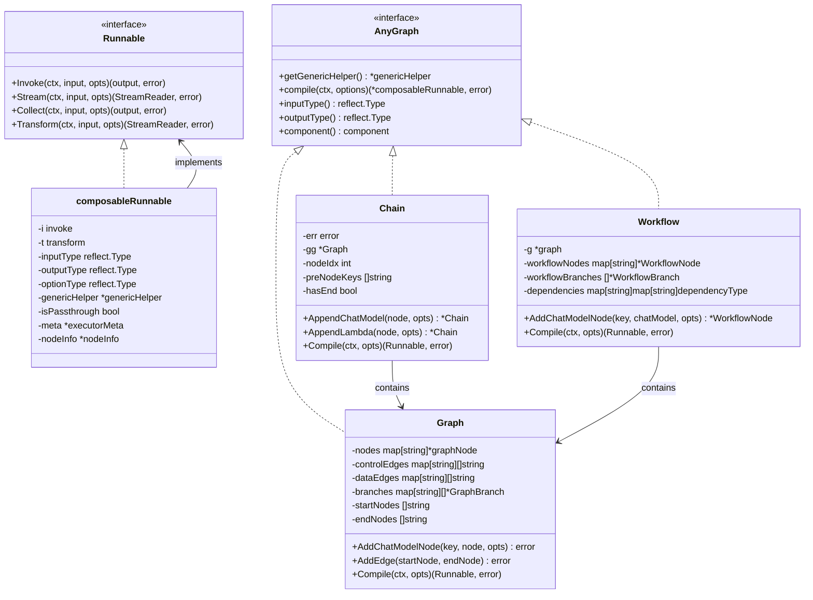

## 💬 Message 数据结构体系

### Message 核心结构

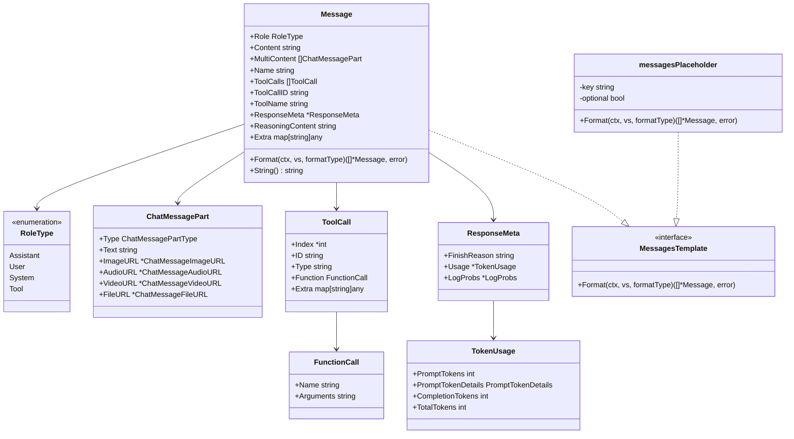

### Message 多媒体内容结构

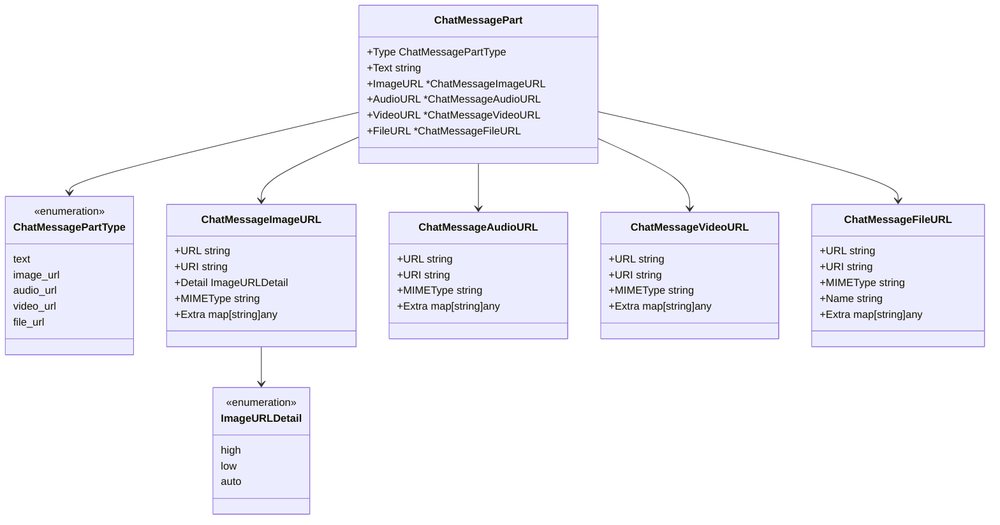

## 🌊 Stream 流处理结构体系

### StreamReader 核心架构

```mermaid
classDiagram
    class StreamReader~T~ {
        -typ readerType
        -st *stream~T~
        -ar *arrayReader~T~
        -msr *multiStreamReader~T~
        -srw *streamReaderWithConvert~T~
        -csr *childStreamReader~T~
        +Recv() (T, error)
        +Close()
        +Copy(n int) []*StreamReader~T~
        +SetAutomaticClose()
    }
    
    class StreamWriter~T~ {
        -stm *stream~T~
        +Send(chunk T, err error) bool
        +Close()
    }
    
    class stream~T~ {
        -items chan streamItem~T~
        -closed chan struct{}
        -automaticClose bool
        -closedFlag *uint32
        +recv() (T, error)
        +send(chunk T, err error) bool
        +closeSend()
        +closeRecv()
    }
    
    class streamItem~T~ {
        +chunk T
        +err error
    }
    
    class arrayReader~T~ {
        -arr []T
        -index int
        +recv() (T, error)
        +copy(n int) []*arrayReader~T~
    }
    
    class multiStreamReader~T~ {
        -sts []*stream~T~
        -itemsCases []reflect.SelectCase
        -nonClosed []int
        -sourceReaderNames []string
        +recv() (T, error)
        +close()
    }
    
    class streamReaderWithConvert~T~ {
        -sr iStreamReader
        -convert func(any) (T, error)
        +recv() (T, error)
        +close()
    }
    
    class childStreamReader~T~ {
        -parent *parentStreamReader~T~
        -index int
        +recv() (T, error)
        +close()
    }
    
    class readerType {
        <<enumeration>>
        readerTypeStream
        readerTypeArray
        readerTypeMultiStream
        readerTypeWithConvert
        readerTypeChild
    }
    
    StreamReader --> readerType
    StreamReader --> stream
    StreamReader --> arrayReader
    StreamReader --> multiStreamReader
    StreamReader --> streamReaderWithConvert
    StreamReader --> childStreamReader
    StreamWriter --> stream
    stream --> streamItem
    multiStreamReader --> stream
```

### 流复制和合并机制

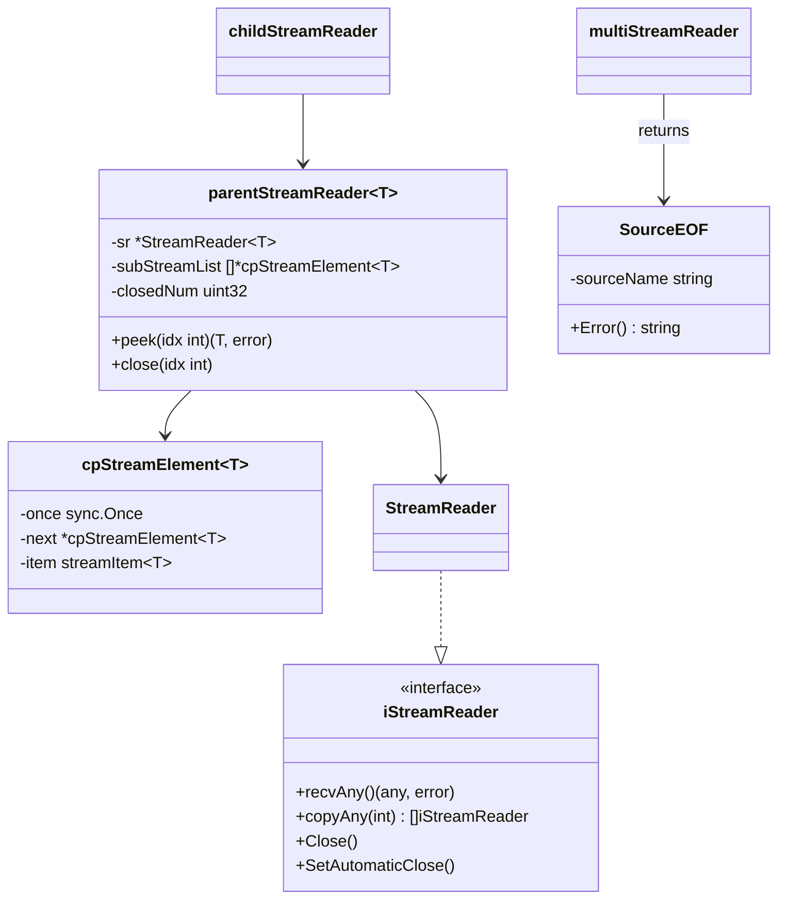

## 🔧 Tool 工具定义结构

### Tool 参数系统

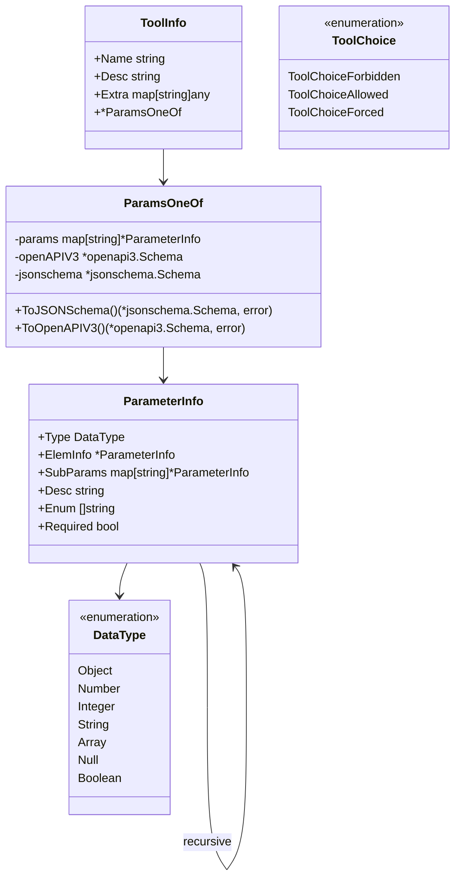

## 📄 Document 文档结构

### Document 核心结构

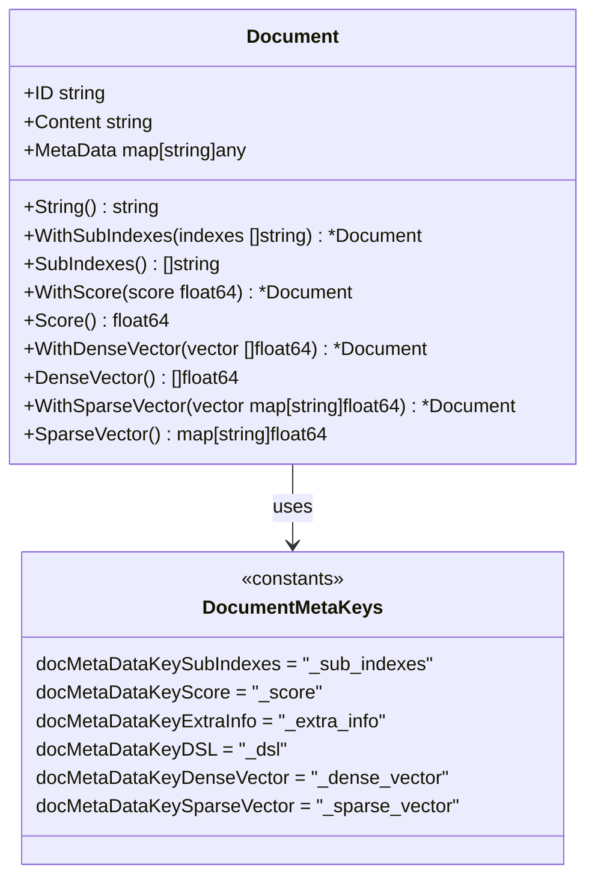

## 🔄 Compose 编排结构体系

### Graph 节点系统

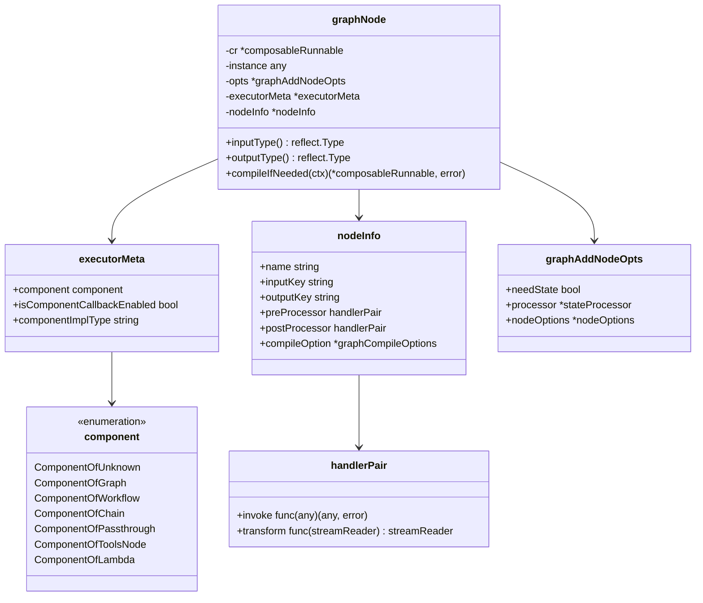

### Branch 分支系统

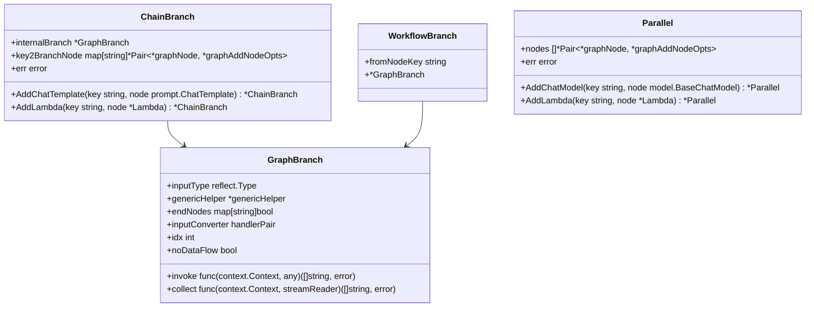

### Lambda 函数系统

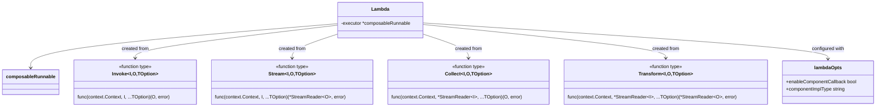

## 🔄 Workflow 工作流结构

### WorkflowNode 节点系统

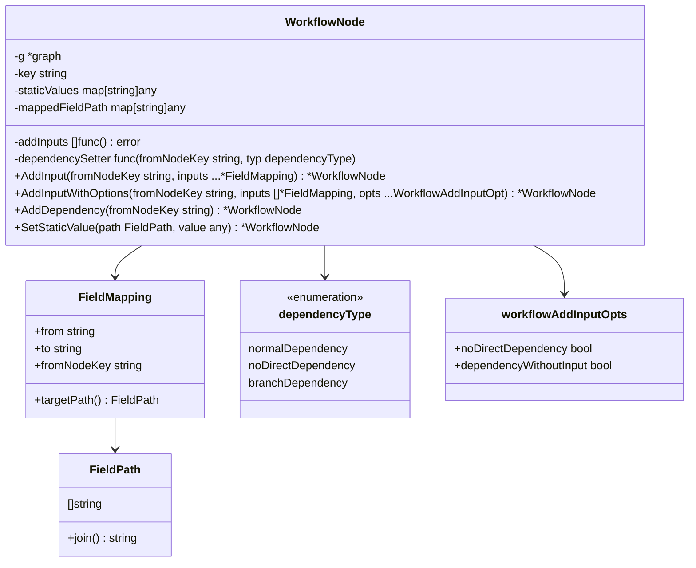

## 🎯 ADK 智能体结构

### Agent 核心系统

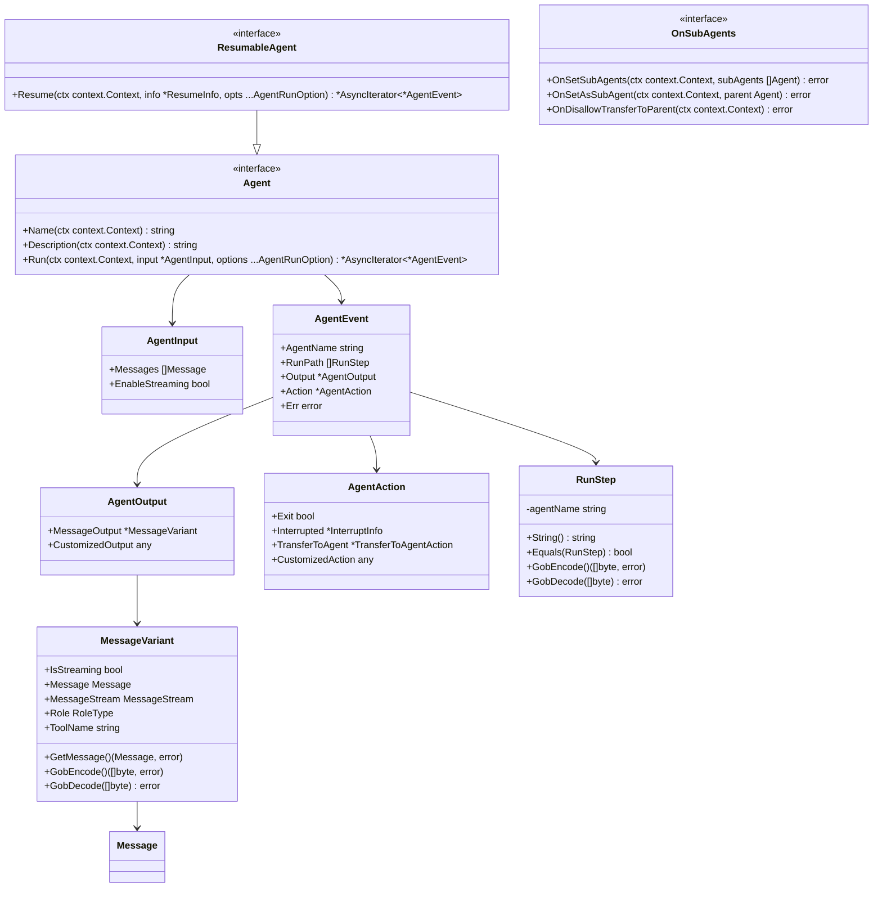

## 🔧 Callbacks 回调系统

### Handler 处理器结构

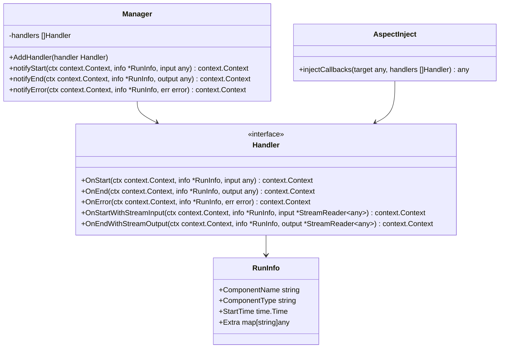

## 🔍 泛型系统与类型安全

### genericHelper 类型辅助

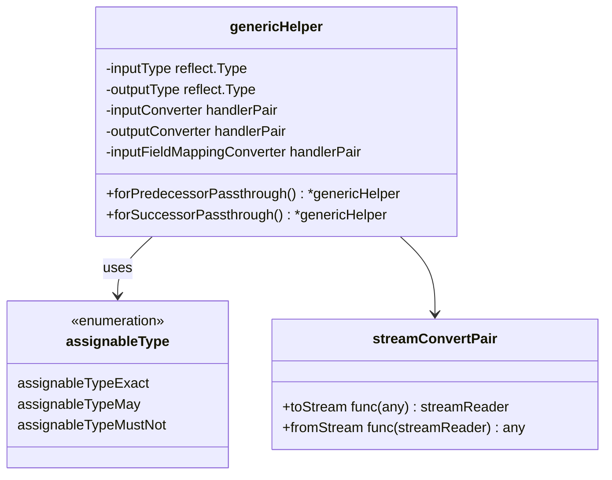

## 📊 数据结构设计模式分析

### 1. 适配器模式 (Adapter Pattern)

```go
// composableRunnable 作为适配器，统一不同组件的接口
type composableRunnable struct {
    i invoke    // Invoke 方法适配器
    t transform // Transform 方法适配器
    
    inputType  reflect.Type
    outputType reflect.Type
    
    // 自动适配不同执行模式
    // 如果组件只实现 Stream，自动适配到 Invoke
    // 如果组件只实现 Invoke，自动适配到 Stream
}

// 设计优势：
// 1. 统一接口：所有组件都通过相同接口访问
// 2. 自动转换：支持四种执行模式的自动转换
// 3. 类型安全：编译时类型检查
```

### 2. 建造者模式 (Builder Pattern)

```go
// Chain 使用建造者模式构建复杂的执行链
type Chain[I, O any] struct {
    gg *Graph[I, O]
    nodeIdx int
    preNodeKeys []string
    hasEnd bool
}

// 链式调用构建
func (c *Chain[I, O]) AppendChatModel(node model.BaseChatModel) *Chain[I, O] {
    // 添加节点逻辑
    return c // 返回自身支持链式调用
}

// 设计优势：
// 1. 流畅API：支持链式调用
// 2. 分步构建：复杂对象的分步构建
// 3. 灵活配置：支持可选参数和配置
```

### 3. 策略模式 (Strategy Pattern)

```go
// StreamReader 使用策略模式支持不同的读取策略
type StreamReader[T any] struct {
    typ readerType // 策略类型
    
    st  *stream[T]                // 基础流策略
    ar  *arrayReader[T]           // 数组策略
    msr *multiStreamReader[T]     // 多流策略
    srw *streamReaderWithConvert[T] // 转换策略
    csr *childStreamReader[T]     // 子流策略
}

func (sr *StreamReader[T]) Recv() (T, error) {
    switch sr.typ {
    case readerTypeStream:
        return sr.st.recv()
    case readerTypeArray:
        return sr.ar.recv()
    // ... 其他策略
    }
}

// 设计优势：
// 1. 策略切换：运行时选择不同策略
// 2. 扩展性：易于添加新的读取策略
// 3. 封装变化：将不同算法封装在策略中
```

### 4. 观察者模式 (Observer Pattern)

```go
// 回调系统实现观察者模式
type Manager struct {
    handlers []Handler // 观察者列表
}

func (m *Manager) notifyStart(ctx context.Context, info *RunInfo, input any) context.Context {
    for _, handler := range m.handlers {
        ctx = handler.OnStart(ctx, info, input) // 通知所有观察者
    }
    return ctx
}

// 设计优势：
// 1. 松耦合：主题和观察者松耦合
// 2. 动态关系：运行时添加/删除观察者
// 3. 广播通信：一对多的通信机制
```

### 5. 组合模式 (Composite Pattern)

```go
// Graph 使用组合模式构建复杂的执行图
type graph struct {
    nodes        map[string]*graphNode     // 叶子节点
    controlEdges map[string][]string      // 节点关系
    dataEdges    map[string][]string      // 数据流关系
    branches     map[string][]*GraphBranch // 分支节点
}

// graphNode 可以是简单组件或复杂的子图
type graphNode struct {
    cr       *composableRunnable // 可以是任何可执行对象
    instance any                 // 实际组件实例
}

// 设计优势：
// 1. 统一接口：叶子和组合对象统一处理
// 2. 递归结构：支持任意深度的嵌套
// 3. 透明性：客户端无需区分简单和复杂对象
```

## 🔧 类型系统设计原则

### 1. 类型安全保障

```go
// 利用 Go 泛型实现编译时类型检查
type Runnable[I, O any] interface {
    Invoke(ctx context.Context, input I, opts ...Option) (output O, err error)
    // ... 其他方法
}

// 类型检查函数
func checkAssignable(from, to reflect.Type) assignableType {
    if from == to {
        return assignableTypeExact
    }
    if from.AssignableTo(to) {
        return assignableTypeExact
    }
    // 需要运行时检查
    return assignableTypeMay
}
```

### 2. 零值友好设计

```go
// 所有结构都支持零值初始化
type Message struct {
    Role    RoleType `json:"role"`
    Content string   `json:"content"`
    // 其他字段都是可选的，零值有意义
}

// 零值创建函数
func SystemMessage(content string) *Message {
    return &Message{
        Role:    System,
        Content: content,
        // 其他字段使用零值
    }
}
```

### 3. 接口隔离原则

```go
// 小而专一的接口
type MessagesTemplate interface {
    Format(ctx context.Context, vs map[string]any, formatType FormatType) ([]*Message, error)
}

type Agent interface {
    Name(ctx context.Context) string
    Description(ctx context.Context) string
    Run(ctx context.Context, input *AgentInput, options ...AgentRunOption) *AsyncIterator[*AgentEvent]
}

// 可选功能通过独立接口提供
type OnSubAgents interface {
    OnSetSubAgents(ctx context.Context, subAgents []Agent) error
    OnSetAsSubAgent(ctx context.Context, parent Agent) error
    OnDisallowTransferToParent(ctx context.Context) error
}
```

## 📈 性能优化的数据结构设计

### 1. 内存池化

```go
// stream 使用通道池化减少内存分配
type stream[T any] struct {
    items chan streamItem[T] // 预分配的通道
    closed chan struct{}     // 复用的关闭信号
}

// 对象复用
func newStream[T any](cap int) *stream[T] {
    return &stream[T]{
        items:  make(chan streamItem[T], cap), // 预分配容量
        closed: make(chan struct{}),
    }
}
```

### 2. 延迟初始化

```go
// 延迟初始化减少内存占用
type Document struct {
    ID       string
    Content  string
    MetaData map[string]any // 只在需要时初始化
}

func (d *Document) WithScore(score float64) *Document {
    if d.MetaData == nil {
        d.MetaData = make(map[string]any) // 延迟初始化
    }
    d.MetaData[docMetaDataKeyScore] = score
    return d
}
```

### 3. 写时复制 (Copy-on-Write)

```go
// Message 格式化时使用写时复制
func (m *Message) Format(ctx context.Context, vs map[string]any, formatType FormatType) ([]*Message, error) {
    // 只在需要修改时才复制
    copied := *m
    
    // 只复制需要修改的字段
    if len(m.MultiContent) != 0 {
        copied.MultiContent = make([]ChatMessagePart, len(m.MultiContent))
        copy(copied.MultiContent, m.MultiContent)
    }
    
    return []*Message{&copied}, nil
}
```

## 🎯 最佳实践总结

### 1. 数据结构设计原则

- **单一职责**：每个结构只负责一个明确的功能
- **开闭原则**：对扩展开放，对修改关闭
- **接口隔离**：使用小而专一的接口
- **依赖倒置**：依赖抽象而非具体实现

### 2. 性能优化策略

- **内存预分配**：预估容量，减少动态分配
- **对象复用**：使用对象池减少GC压力
- **延迟初始化**：只在需要时创建对象
- **写时复制**：共享不可变数据，需要时才复制

### 3. 类型安全保障

- **泛型约束**：使用泛型提供编译时类型检查
- **接口设计**：通过接口定义清晰的契约
- **零值友好**：确保零值是有意义的
- **错误处理**：明确的错误类型和处理策略

---

**上一篇**: [Callbacks模块详解](/posts/eino-08-callbacks-module/)
**下一篇**: [实战经验与最佳实践](/posts/eino-10-best-practices/) - 性能优化和生产实践指南

**更新时间**: 2024-12-19 | **文档版本**: v1.0
