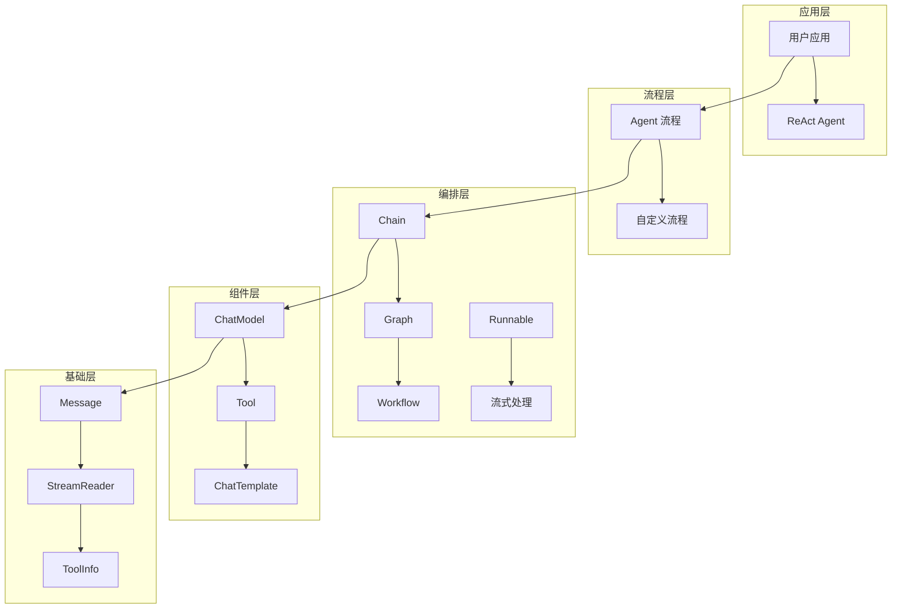

# Eino 框架源码深度解析文档

## 📚 文档概览

本文档集合提供了 Eino 框架的全面深度分析，从基础使用到架构设计，从 API 参考到模块实现，帮助开发者全面理解和掌握 Eino 框架。

## 项目基本信息

**Eino**（发音类似 "I know"）是 CloudWeGo 开源的 Go 语言 LLM 应用开发框架，旨在成为终极的大语言模型应用开发框架。项目强调简洁性、可扩展性、可靠性与有效性，更符合 Go 语言编程惯例。

| 项目属性 | 值 |
|---------|---|
| 项目名称 | Eino |
| 开发语言 | Go 1.18+ |
| 许可证 | Apache-2.0 |
| 仓库地址 | github.com/cloudwego/eino |
| 主要依赖 | sonic, kin-openapi, uuid, gonja |

### 核心设计理念

- **组件化架构**：将常见的构建模块封装为组件抽象，每个组件都有明确的输入输出类型
- **强大编排**：通过 Graph、Chain、Workflow 三种编排方式实现复杂的业务逻辑
- **流式处理**：完整支持流式数据处理，自动处理流的拼接、合并、复制等操作
- **类型安全**：编译时类型检查，确保组件间的类型匹配
- **切面机制**：支持横切面关注点，如日志、追踪、指标等

### 核心模块结构

| 模块名 | 路径 | 职责 | 关键文件 |
|-------|------|------|---------|
| **components** | `/components/` | 组件抽象与接口定义 | `types.go`, `*/interface.go` |
| **compose** | `/compose/` | 编排框架核心 | `graph.go`, `chain.go`, `workflow.go`, `runnable.go` |
| **schema** | `/schema/` | 数据结构与类型定义 | `message.go`, `document.go`, `tool.go`, `stream.go` |
| **adk** | `/adk/` | Agent 开发工具包 | `interface.go`, `chatmodel.go`, `workflow.go`, `flow.go` |
| **flow** | `/flow/` | 预构建流程与 Agent | `agent/react/`, `agent/multiagent/` |
| **callbacks** | `/callbacks/` | 回调与切面机制 | `interface.go`, `handler_builder.go` |

## 📖 文档结构

### 1. [框架使用手册](./eino-framework-manual.md)
**目标读者**: 初学者和应用开发者  
**内容概要**:
- 框架概述与设计理念
- 核心组件详解（Schema、Components、Compose、ADK）
- 编排方式对比（Chain、Graph、Workflow）
- 流式处理机制
- ReAct Agent 实现
- 回调机制使用
- 最佳实践与性能优化

### 2. [架构深度分析](./architecture-analysis.md)
**目标读者**: 架构师和高级开发者  
**内容概要**:
- 分层架构设计
- 核心模块交互图
- 执行流程时序图
- 关键数据结构分析
- 执行模式深度分析（Pregel vs DAG）
- 状态管理机制
- 类型系统与泛型
- 错误处理与恢复
- 性能优化策略

### 3. [模块详细分析](./modules-detailed-analysis.md)
**目标读者**: 框架贡献者和深度用户  
**内容概要**:
- Schema 模块：消息系统、流处理、工具信息
- Components 模块：ChatModel、Tool、ChatTemplate 等组件
- Compose 模块：Graph、Chain、Workflow 编排引擎
- Callbacks 模块：回调系统实现
- ADK 模块：代理开发套件
- 模块间交互与设计模式

### 4. [API 参考手册](./api-reference.md)
**目标读者**: 所有开发者  
**内容概要**:
- 核心 API 概览
- Schema 模块 API
- Components 模块 API
- Compose 模块 API
- ADK 模块 API
- Callbacks 模块 API
- 选项系统 API
- 错误处理 API
- 完整示例代码

## 🎯 阅读建议

### 按角色阅读
- **初学者**: 建议按顺序阅读 `框架使用手册` → `API 参考手册`
- **有经验开发者**: 可直接阅读 `架构深度分析` → `API 参考手册`
- **框架贡献者**: 重点阅读 `模块详细分析` → `架构深度分析`

### 按需求阅读
- **快速上手**: 阅读 `框架使用手册` 的前 3 章
- **深入理解**: 完整阅读 `架构深度分析`
- **API 查询**: 使用 `API 参考手册` 作为速查手册
- **源码贡献**: 重点研读 `模块详细分析`

## 🔍 核心概念速查

### 关键术语
- **Runnable**: 所有可执行对象的核心接口，支持四种执行模式
- **Graph**: 图式编排，支持复杂的有向图结构和分支逻辑
- **Chain**: 链式编排，简单的顺序执行模式
- **Workflow**: 工作流编排，支持字段级数据映射
- **StreamReader**: 流式数据处理的核心抽象
- **Agent**: 智能代理接口，ADK 模块的核心

### 核心接口
```go
// 可执行对象接口
type Runnable[I, O any] interface {
    Invoke(ctx, I, ...Option) (O, error)
    Stream(ctx, I, ...Option) (*StreamReader[O], error)
    Collect(ctx, *StreamReader[I], ...Option) (O, error)
    Transform(ctx, *StreamReader[I], ...Option) (*StreamReader[O], error)
}

// 聊天模型接口
type BaseChatModel interface {
    Generate(ctx, []*Message, ...Option) (*Message, error)
    Stream(ctx, []*Message, ...Option) (*StreamReader[*Message], error)
}

// 工具接口
type InvokableTool interface {
    Info(ctx) (*ToolInfo, error)
    InvokableRun(ctx, string, ...Option) (string, error)
}

// 代理接口
type Agent interface {
    Name(ctx) string
    Description(ctx) string
    Run(ctx, *AgentInput, ...AgentRunOption) *AsyncIterator[*AgentEvent]
}
```

## 🏗️ 架构概览



## 🚀 快速开始示例

### 简单链式调用
```go
chain := compose.NewChain[map[string]any, *schema.Message]().
    AppendChatTemplate(template).
    AppendChatModel(model).
    Compile(ctx)

result, err := chain.Invoke(ctx, map[string]any{"query": "Hello"})
```

### 图式编排
```go
graph := compose.NewGraph[map[string]any, *schema.Message]()
graph.AddChatModelNode("model", model)
graph.AddToolsNode("tools", toolsNode)
graph.AddBranch("model", branch)

runnable, err := graph.Compile(ctx)
result, err := runnable.Invoke(ctx, input)
```

### ReAct Agent
```go
agent, err := react.NewAgent(ctx, &react.AgentConfig{
    ToolCallingModel: model,
    ToolsConfig: compose.ToolsNodeConfig{
        Tools: []tool.InvokableTool{weatherTool},
    },
})

response, err := agent.Generate(ctx, messages)
```

## 📊 性能特性

### 并发处理
- **节点级并发**: 独立节点可并行执行
- **工具并发**: 多个工具调用可并行处理
- **流水线处理**: 流式数据的管道处理

### 内存优化
- **流式处理**: 避免大数据集的内存占用
- **延迟加载**: 按需加载组件和数据
- **资源池化**: 复用昂贵的资源对象

### 类型安全
- **编译时检查**: 泛型确保类型安全
- **运行时验证**: 动态类型检查
- **自动转换**: 流式和非流式间的自动转换

## 🔧 扩展机制

### 组件扩展
- 实现相应的组件接口
- 支持自定义回调处理
- 类型安全的泛型设计

### 编排扩展
- 自定义 Lambda 函数
- 复杂分支逻辑
- 状态管理和字段映射

### 回调扩展
- 五种回调时机
- 全局和节点级回调
- 自定义处理器实现

## 🤝 贡献指南

### 代码贡献
1. 阅读 `模块详细分析` 了解内部实现
2. 遵循现有的设计模式和接口规范
3. 确保类型安全和向后兼容
4. 添加完整的测试用例

### 文档贡献
1. 保持文档与代码同步
2. 提供清晰的示例代码
3. 包含必要的架构图和时序图
4. 遵循统一的文档格式

## 📞 获取帮助

### 学习资源
- [官方文档](https://www.cloudwego.io/zh/docs/eino/)
- [示例仓库](https://github.com/cloudwego/eino-examples)
- [扩展组件](https://github.com/cloudwego/eino-ext)

### 社区支持
- [GitHub Issues](https://github.com/cloudwego/eino/issues)
- [飞书用户群](https://www.feishu.cn/)

### 技术支持
- 查阅 `API 参考手册` 获取详细接口说明
- 参考 `架构深度分析` 理解设计原理
- 通过 `模块详细分析` 了解实现细节

---

**注意**: 本文档基于 Eino 框架的当前版本编写，随着框架的演进，部分内容可能会有所变化。建议结合最新的官方文档和源码进行学习。
