# Eino 框架架构深度分析

## 1. 整体架构设计

### 1.1 全局架构图


```mermaid
graph TD
    subgraph "用户层 (User Layer)"
        Dev[开发者]
        App[LLM应用]
    end
    
    subgraph "Eino 核心框架"
        subgraph "编排层 (Orchestration Layer)"
            Chain[Chain 链式编排]
            Graph[Graph 图编排]
            Workflow[Workflow 工作流]
            Runnable[Runnable 可执行对象]
        end
        
        subgraph "组件层 (Component Layer)"
            ChatModel[ChatModel 聊天模型]
            Tool[Tool 工具]
            Template[ChatTemplate 模板]
            Retriever[Retriever 检索器]
            Embedding[Embedding 嵌入]
            Indexer[Indexer 索引器]
            Loader[DocumentLoader 文档加载器]
        end
        
        subgraph "智能体层 (Agent Layer)"
            ADK[ADK 智能体开发包]
            ReactAgent[ReAct Agent]
            MultiAgent[MultiAgent 多智能体]
            ChatModelAgent[ChatModel Agent]
        end
        
        subgraph "基础设施层 (Infrastructure Layer)"
            Schema[Schema 数据结构]
            Stream[Stream 流式处理]
            Callbacks[Callbacks 回调机制]
            Utils[Utils 工具函数]
        end
    end
    
    subgraph "外部生态"
        EinoExt[EinoExt 组件实现]
        EinoExamples[EinoExamples 示例应用]
        EinoDevops[EinoDevops 开发工具]
    end
    
    subgraph "外部服务"
        LLMProviders[LLM服务商<br/>OpenAI/Anthropic/...]
        VectorDB[向量数据库<br/>Milvus/Weaviate/...]
        Storage[存储服务<br/>S3/OSS/...]
    end
    
    %% 用户交互
    Dev --> Chain
    Dev --> Graph
    Dev --> Workflow
    Dev --> ADK
    
    %% 编排层内部关系
    Chain --> Runnable
    Graph --> Runnable
    Workflow --> Runnable
    
    %% 编排层使用组件层
    Chain --> ChatModel
    Chain --> Template
    Chain --> Tool
    Graph --> ChatModel
    Graph --> Template
    Graph --> Tool
    Graph --> Retriever
    Workflow --> ChatModel
    Workflow --> Template
    
    %% 智能体层使用编排层
    ADK --> Graph
    ReactAgent --> Graph
    MultiAgent --> Graph
    ChatModelAgent --> Chain
    
    %% 组件层依赖基础设施层
    ChatModel --> Schema
    Tool --> Schema
    Template --> Schema
    Retriever --> Schema
    
    %% 流式处理贯穿各层
    Runnable --> Stream
    ChatModel --> Stream
    Tool --> Stream
    
    %% 回调机制
    Runnable --> Callbacks
    ChatModel --> Callbacks
    Tool --> Callbacks
    
    %% 外部生态
    App --> EinoExt
    Dev --> EinoExamples
    Dev --> EinoDevops
    
    %% 外部服务集成
    EinoExt --> LLMProviders
    EinoExt --> VectorDB
    EinoExt --> Storage
    
    classDef userLayer fill:#e1f5fe
    classDef orchestrationLayer fill:#f3e5f5
    classDef componentLayer fill:#e8f5e8
    classDef agentLayer fill:#fff3e0
    classDef infraLayer fill:#fce4ec
    classDef externalEco fill:#f1f8e9
    classDef externalService fill:#f5f5f5
    
    class Dev,App userLayer
    class Chain,Graph,Workflow,Runnable orchestrationLayer
    class ChatModel,Tool,Template,Retriever,Embedding,Indexer,Loader componentLayer
    class ADK,ReactAgent,MultiAgent,ChatModelAgent agentLayer
    class Schema,Stream,Callbacks,Utils infraLayer
    class EinoExt,EinoExamples,EinoDevops externalEco
    class LLMProviders,VectorDB,Storage externalService
```

### 1.2 分层架构图

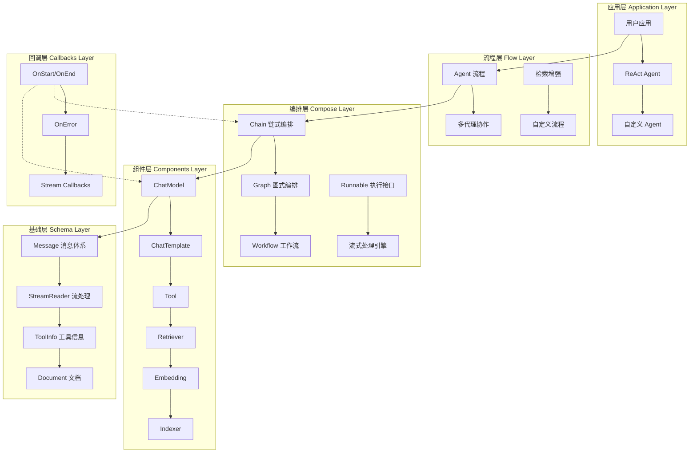
```mermaid
graph TB
    subgraph "应用层 Application Layer"
        A1[用户应用] --> A2[ReAct Agent]
        A2 --> A3[自定义 Agent]
    end
    
    subgraph "流程层 Flow Layer"
        F1[Agent 流程] --> F2[多代理协作]
        F3[检索增强] --> F4[自定义流程]
    end
    
    subgraph "编排层 Compose Layer"
        C1[Chain 链式编排] --> C2[Graph 图式编排]
        C2 --> C3[Workflow 工作流]
        C4[Runnable 执行接口] --> C5[流式处理引擎]
    end
    
    subgraph "组件层 Components Layer"
        CM1[ChatModel] --> CM2[ChatTemplate]
        CM2 --> CM3[Tool]
        CM3 --> CM4[Retriever]
        CM4 --> CM5[Embedding]
        CM5 --> CM6[Indexer]
    end
    
    subgraph "基础层 Schema Layer"
        S1[Message 消息体系] --> S2[StreamReader 流处理]
        S2 --> S3[ToolInfo 工具信息]
        S3 --> S4[Document 文档]
    end
    
    subgraph "回调层 Callbacks Layer"
        CB1[OnStart/OnEnd] --> CB2[OnError]
        CB2 --> CB3[Stream Callbacks]
    end
    
    A1 --> F1
    F1 --> C1
    C1 --> CM1
    CM1 --> S1
    
    CB1 -.-> C1
    CB1 -.-> CM1
```

### 1.3 核心模块交互时序图

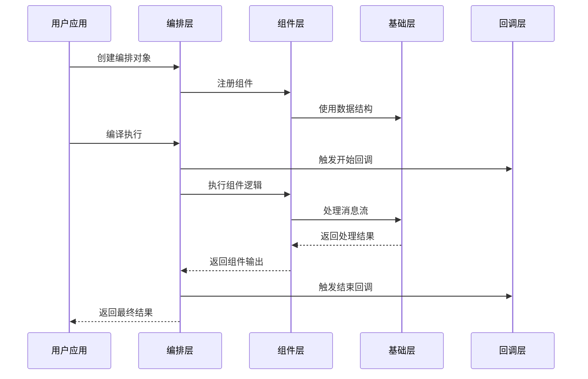
```mermaid
sequenceDiagram
    participant User as 用户应用
    participant Compose as 编排层
    participant Component as 组件层
    participant Schema as 基础层
    participant Callback as 回调层
    
    User->>Compose: 创建编排对象
    Compose->>Component: 注册组件
    Component->>Schema: 使用数据结构
    
    User->>Compose: 编译执行
    Compose->>Callback: 触发开始回调
    Compose->>Component: 执行组件逻辑
    Component->>Schema: 处理消息流
    Schema-->>Component: 返回处理结果
    Component-->>Compose: 返回组件输出
    Compose->>Callback: 触发结束回调
    Compose-->>User: 返回最终结果
```

### 1.4 模块交互图

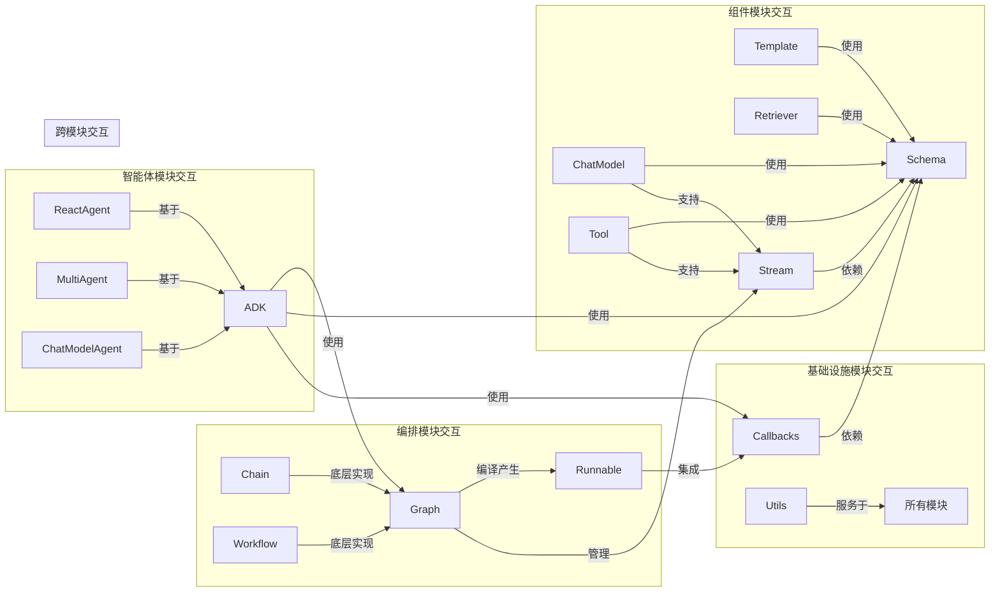
```mermaid
graph LR
    subgraph "编排模块交互"
        Chain --> |底层实现| Graph
        Workflow --> |底层实现| Graph
        Graph --> |编译产生| Runnable
    end
    
    subgraph "组件模块交互"
        ChatModel --> |使用| Schema
        Tool --> |使用| Schema
        Template --> |使用| Schema
        Retriever --> |使用| Schema
        
        ChatModel --> |支持| Stream
        Tool --> |支持| Stream
    end
    
    subgraph "智能体模块交互"
        ADK --> |使用| Graph
        ADK --> |使用| Schema
        ReactAgent --> |基于| ADK
        MultiAgent --> |基于| ADK
        ChatModelAgent --> |基于| ADK
    end
    
    subgraph "基础设施模块交互"
        Stream --> |依赖| Schema
        Callbacks --> |依赖| Schema
        Utils --> |服务于| 所有模块
    end
    
    subgraph "跨模块交互"
        Runnable --> |集成| Callbacks
        Graph --> |管理| Stream
        ADK --> |使用| Callbacks
    end
```

### 1.4 初始化与关闭流程图

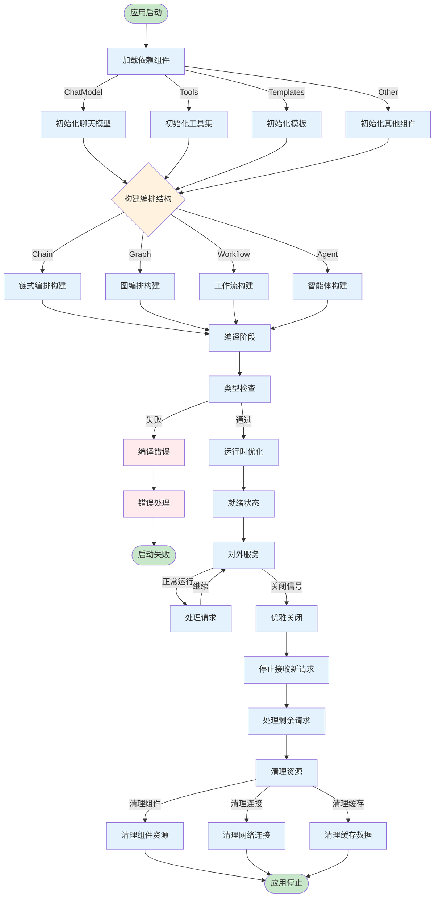
```mermaid
flowchart TD
    Start([应用启动]) --> LoadDeps[加载依赖组件]
    LoadDeps --> |ChatModel| InitModel[初始化聊天模型]
    LoadDeps --> |Tools| InitTools[初始化工具集]
    LoadDeps --> |Templates| InitTemplates[初始化模板]
    LoadDeps --> |Other| InitOther[初始化其他组件]
    
    InitModel --> BuildChain{构建编排结构}
    InitTools --> BuildChain
    InitTemplates --> BuildChain
    InitOther --> BuildChain
    
    BuildChain --> |Chain| ChainBuild[链式编排构建]
    BuildChain --> |Graph| GraphBuild[图编排构建]
    BuildChain --> |Workflow| WorkflowBuild[工作流构建]
    BuildChain --> |Agent| AgentBuild[智能体构建]
    
    ChainBuild --> Compile[编译阶段]
    GraphBuild --> Compile
    WorkflowBuild --> Compile
    AgentBuild --> Compile
    
    Compile --> TypeCheck[类型检查]
    TypeCheck --> |通过| Optimize[运行时优化]
    TypeCheck --> |失败| CompileError[编译错误]
    
    Optimize --> Ready[就绪状态]
    CompileError --> ErrorHandle[错误处理]
    ErrorHandle --> End([启动失败])
    
    Ready --> Serve[对外服务]
    
    Serve --> |正常运行| HandleRequest[处理请求]
    HandleRequest --> |继续| Serve
    
    Serve --> |关闭信号| Shutdown[优雅关闭]
    Shutdown --> StopAccept[停止接收新请求]
    StopAccept --> DrainRequests[处理剩余请求]
    DrainRequests --> CleanupResources[清理资源]
    CleanupResources --> |清理组件| CleanupComponents[清理组件资源]
    CleanupResources --> |清理连接| CleanupConnections[清理网络连接]
    CleanupResources --> |清理缓存| CleanupCache[清理缓存数据]
    
    CleanupComponents --> Stopped([应用停止])
    CleanupConnections --> Stopped
    CleanupCache --> Stopped
    
    classDef startEnd fill:#c8e6c9
    classDef process fill:#e3f2fd
    classDef decision fill:#fff3e0
    classDef error fill:#ffebee
    
    class Start,End,Stopped startEnd
    class LoadDeps,InitModel,InitTools,InitTemplates,InitOther,ChainBuild,GraphBuild,WorkflowBuild,AgentBuild,Compile,TypeCheck,Optimize,Ready,Serve,HandleRequest,Shutdown,StopAccept,DrainRequests,CleanupResources,CleanupComponents,CleanupConnections,CleanupCache process
    class BuildChain decision
    class CompileError,ErrorHandle error
```

### 1.5 数据流图

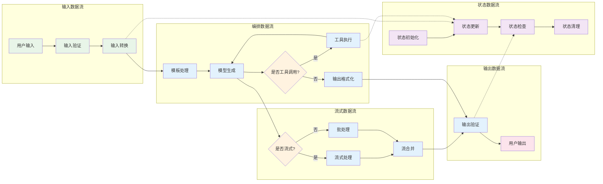
```mermaid
flowchart LR
    subgraph "输入数据流"
        UserInput[用户输入] --> InputValidation[输入验证]
        InputValidation --> InputTransform[输入转换]
    end
    
    subgraph "编排数据流"
        InputTransform --> Template[模板处理]
        Template --> Model[模型生成]
        Model --> Decision{是否工具调用?}
        Decision --> |是| ToolExecution[工具执行]
        Decision --> |否| OutputFormat[输出格式化]
        ToolExecution --> Model
    end
    
    subgraph "流式数据流"
        Model --> StreamCheck{是否流式?}
        StreamCheck --> |是| StreamProcess[流式处理]
        StreamCheck --> |否| BatchProcess[批处理]
        StreamProcess --> StreamMerge[流合并]
        BatchProcess --> StreamMerge
    end
    
    subgraph "输出数据流"
        StreamMerge --> OutputValidation[输出验证]
        OutputFormat --> OutputValidation
        OutputValidation --> UserOutput[用户输出]
    end
    
    subgraph "状态数据流"
        StateInit[状态初始化] --> StateUpdate[状态更新]
        StateUpdate --> StateCheck[状态检查]
        StateCheck --> StateCleanup[状态清理]
    end
    
    %% 状态与主流程交互
    InputTransform -.-> StateUpdate
    ToolExecution -.-> StateUpdate
    OutputValidation -.-> StateCheck
    
    classDef input fill:#e8f5e8
    classDef process fill:#e3f2fd
    classDef decision fill:#fff3e0
    classDef output fill:#fce4ec
    classDef state fill:#f3e5f5
    
    class UserInput,InputValidation,InputTransform input
    class Template,Model,ToolExecution,OutputFormat,StreamProcess,BatchProcess,StreamMerge,OutputValidation process
    class Decision,StreamCheck decision
    class UserOutput output
    class StateInit,StateUpdate,StateCheck,StateCleanup state
```

### 1.6 核心模块交互图

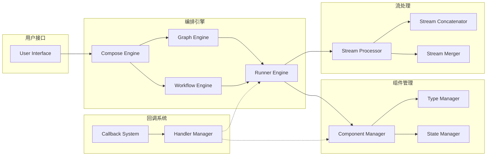
```mermaid
graph LR
    subgraph "用户接口"
        UI[User Interface]
    end
    
    subgraph "编排引擎"
        CE[Compose Engine]
        GE[Graph Engine]
        WE[Workflow Engine]
        RE[Runner Engine]
    end
    
    subgraph "组件管理"
        CM[Component Manager]
        TM[Type Manager]
        SM[State Manager]
    end
    
    subgraph "流处理"
        SP[Stream Processor]
        SC[Stream Concatenator]
        SM2[Stream Merger]
    end
    
    subgraph "回调系统"
        CS[Callback System]
        HM[Handler Manager]
    end
    
    UI --> CE
    CE --> GE
    CE --> WE
    GE --> RE
    WE --> RE
    
    RE --> CM
    CM --> TM
    CM --> SM
    
    RE --> SP
    SP --> SC
    SP --> SM2
    
    CS --> HM
    HM -.-> RE
    HM -.-> CM
```

## 2. 核心用例时序图

### 2.1 基础链式编排时序

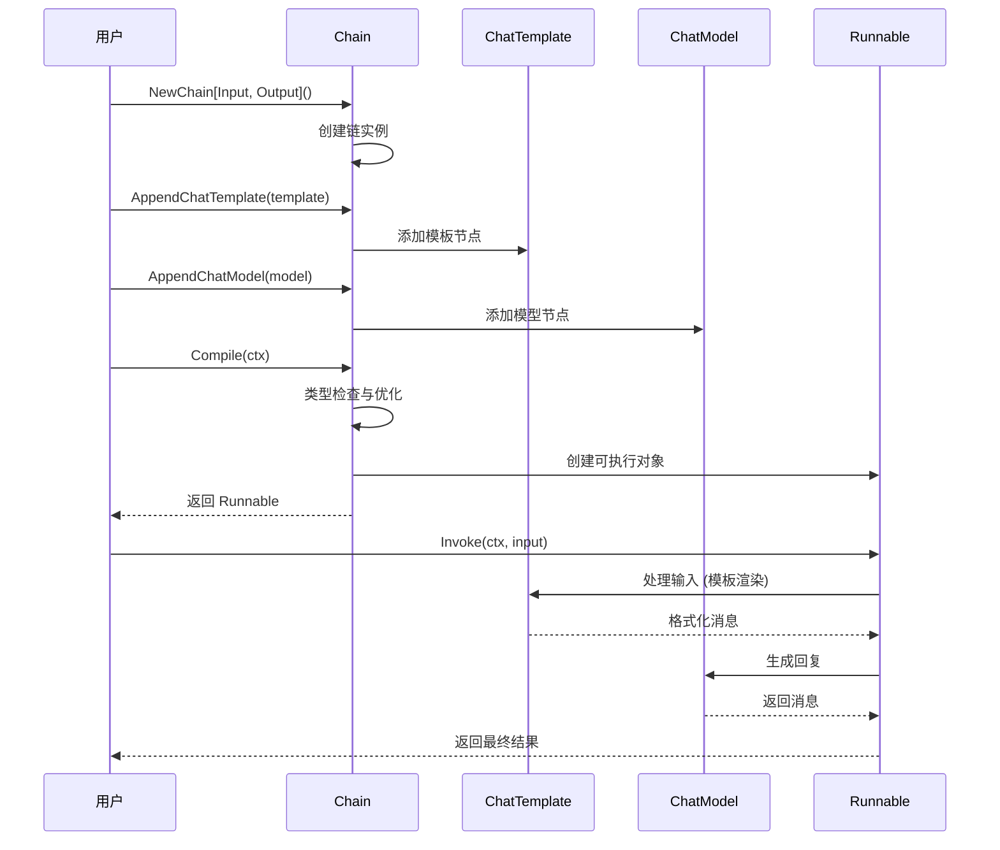
```mermaid
sequenceDiagram
    participant U as 用户
    participant C as Chain
    participant T as ChatTemplate
    participant M as ChatModel
    participant R as Runnable
    
    U->>C: NewChain[Input, Output]()
    C->>C: 创建链实例
    
    U->>C: AppendChatTemplate(template)
    C->>T: 添加模板节点
    
    U->>C: AppendChatModel(model)
    C->>M: 添加模型节点
    
    U->>C: Compile(ctx)
    C->>C: 类型检查与优化
    C->>R: 创建可执行对象
    C-->>U: 返回 Runnable
    
    U->>R: Invoke(ctx, input)
    R->>T: 处理输入 (模板渲染)
    T-->>R: 格式化消息
    R->>M: 生成回复
    M-->>R: 返回消息
    R-->>U: 返回最终结果
```

### 2.2 图编排带工具调用时序

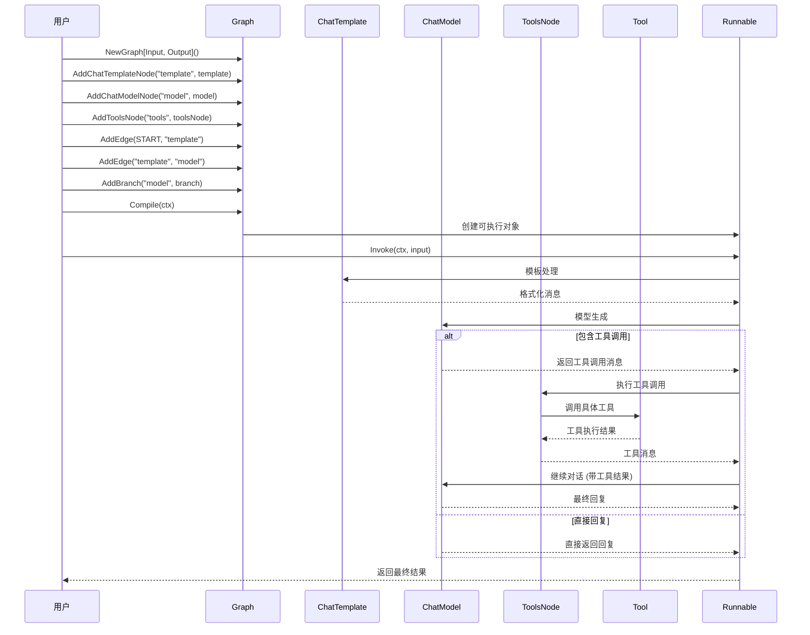
```mermaid
sequenceDiagram
    participant U as 用户
    participant G as Graph
    participant T as ChatTemplate
    participant M as ChatModel
    participant TN as ToolsNode
    participant Tool as Tool
    participant R as Runnable
    
    U->>G: NewGraph[Input, Output]()
    U->>G: AddChatTemplateNode("template", template)
    U->>G: AddChatModelNode("model", model)
    U->>G: AddToolsNode("tools", toolsNode)
    U->>G: AddEdge(START, "template")
    U->>G: AddEdge("template", "model")
    U->>G: AddBranch("model", branch)
    
    U->>G: Compile(ctx)
    G->>R: 创建可执行对象
    
    U->>R: Invoke(ctx, input)
    R->>T: 模板处理
    T-->>R: 格式化消息
    R->>M: 模型生成
    
    alt 包含工具调用
        M-->>R: 返回工具调用消息
        R->>TN: 执行工具调用
        TN->>Tool: 调用具体工具
        Tool-->>TN: 工具执行结果
        TN-->>R: 工具消息
        R->>M: 继续对话 (带工具结果)
        M-->>R: 最终回复
    else 直接回复
        M-->>R: 直接返回回复
    end
    
    R-->>U: 返回最终结果
```

### 2.3 ReAct Agent 执行时序

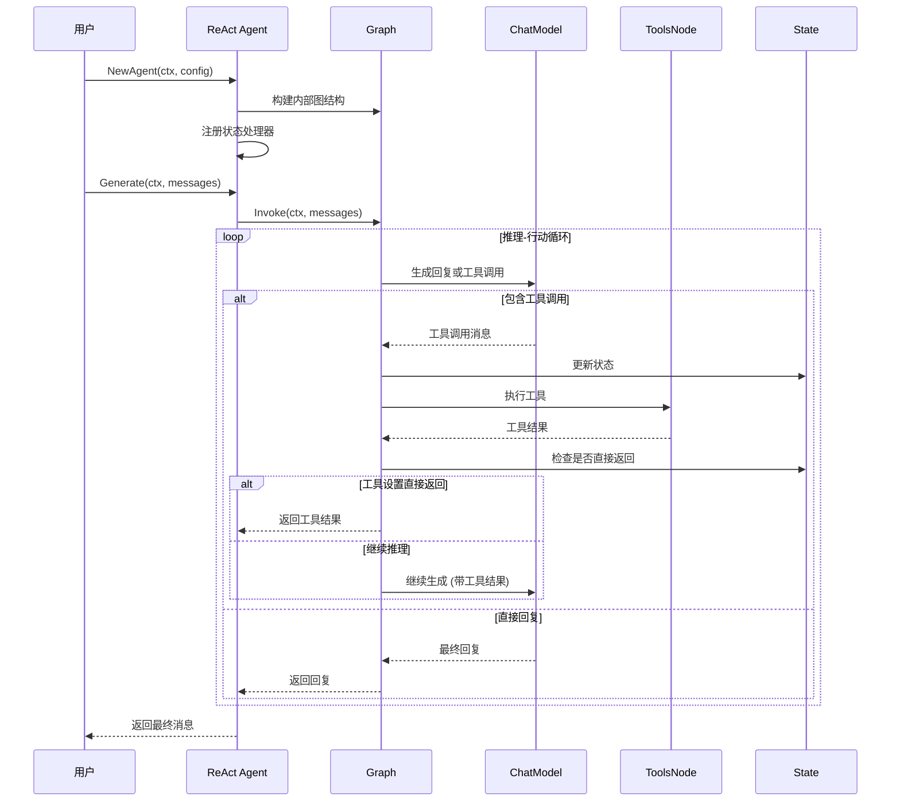
```mermaid
sequenceDiagram
    participant U as 用户
    participant A as ReAct Agent
    participant G as Graph
    participant M as ChatModel
    participant TN as ToolsNode
    participant S as State
    
    U->>A: NewAgent(ctx, config)
    A->>G: 构建内部图结构
    A->>A: 注册状态处理器
    
    U->>A: Generate(ctx, messages)
    A->>G: Invoke(ctx, messages)
    
    loop 推理-行动循环
        G->>M: 生成回复或工具调用
        
        alt 包含工具调用
            M-->>G: 工具调用消息
            G->>S: 更新状态
            G->>TN: 执行工具
            TN-->>G: 工具结果
            G->>S: 检查是否直接返回
            
            alt 工具设置直接返回
                G-->>A: 返回工具结果
            else 继续推理
                G->>M: 继续生成 (带工具结果)
            end
        else 直接回复
            M-->>G: 最终回复
            G-->>A: 返回回复
        end
    end
    
    A-->>U: 返回最终消息
```

## 3. 核心执行流程时序图

### 2.1 Chain 执行时序

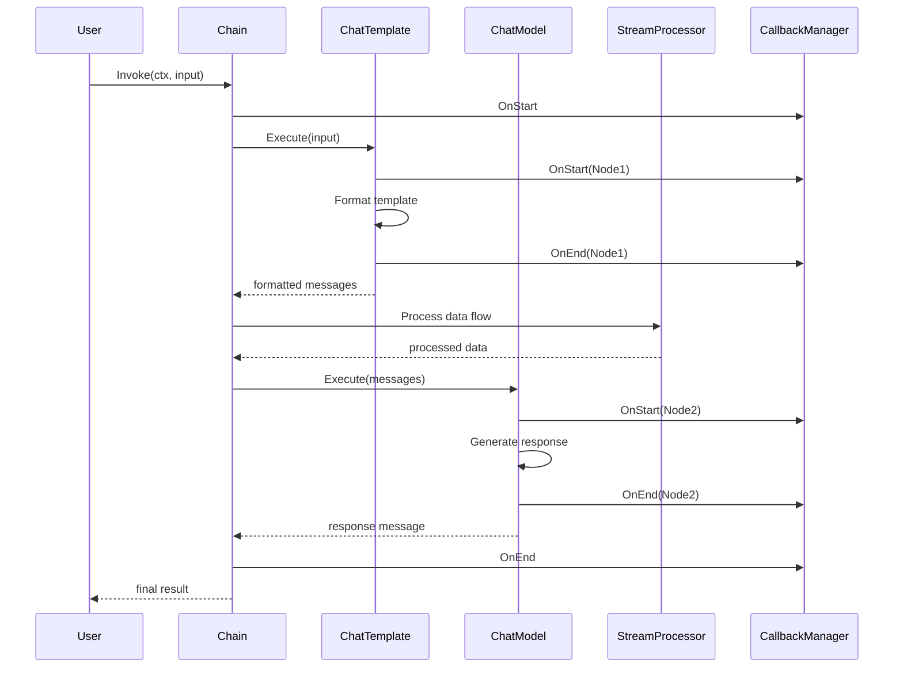
```mermaid
sequenceDiagram
    participant User
    participant Chain
    participant Node1 as ChatTemplate
    participant Node2 as ChatModel
    participant StreamProcessor
    participant CallbackManager
    
    User->>Chain: Invoke(ctx, input)
    Chain->>CallbackManager: OnStart
    
    Chain->>Node1: Execute(input)
    Node1->>CallbackManager: OnStart(Node1)
    Node1->>Node1: Format template
    Node1->>CallbackManager: OnEnd(Node1)
    Node1-->>Chain: formatted messages
    
    Chain->>StreamProcessor: Process data flow
    StreamProcessor-->>Chain: processed data
    
    Chain->>Node2: Execute(messages)
    Node2->>CallbackManager: OnStart(Node2)
    Node2->>Node2: Generate response
    Node2->>CallbackManager: OnEnd(Node2)
    Node2-->>Chain: response message
    
    Chain->>CallbackManager: OnEnd
    Chain-->>User: final result
```

### 2.2 Graph 分支执行时序

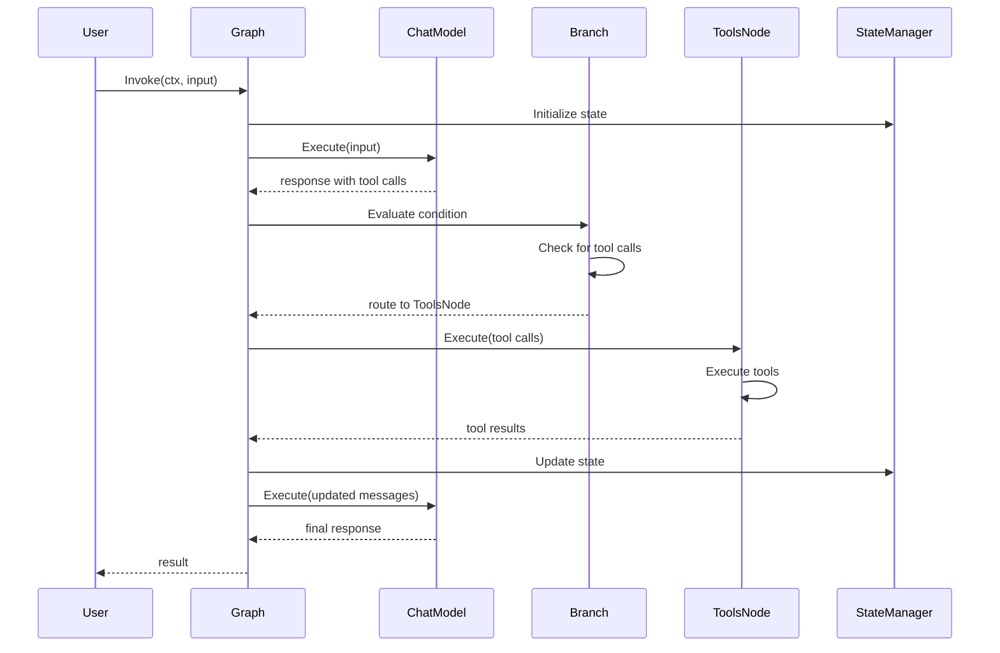
```mermaid
sequenceDiagram
    participant User
    participant Graph
    participant ChatModel
    participant Branch
    participant ToolsNode
    participant StateManager
    
    User->>Graph: Invoke(ctx, input)
    Graph->>StateManager: Initialize state
    
    Graph->>ChatModel: Execute(input)
    ChatModel-->>Graph: response with tool calls
    
    Graph->>Branch: Evaluate condition
    Branch->>Branch: Check for tool calls
    Branch-->>Graph: route to ToolsNode
    
    Graph->>ToolsNode: Execute(tool calls)
    ToolsNode->>ToolsNode: Execute tools
    ToolsNode-->>Graph: tool results
    
    Graph->>StateManager: Update state
    Graph->>ChatModel: Execute(updated messages)
    ChatModel-->>Graph: final response
    
    Graph-->>User: result
```

### 2.3 流式处理时序

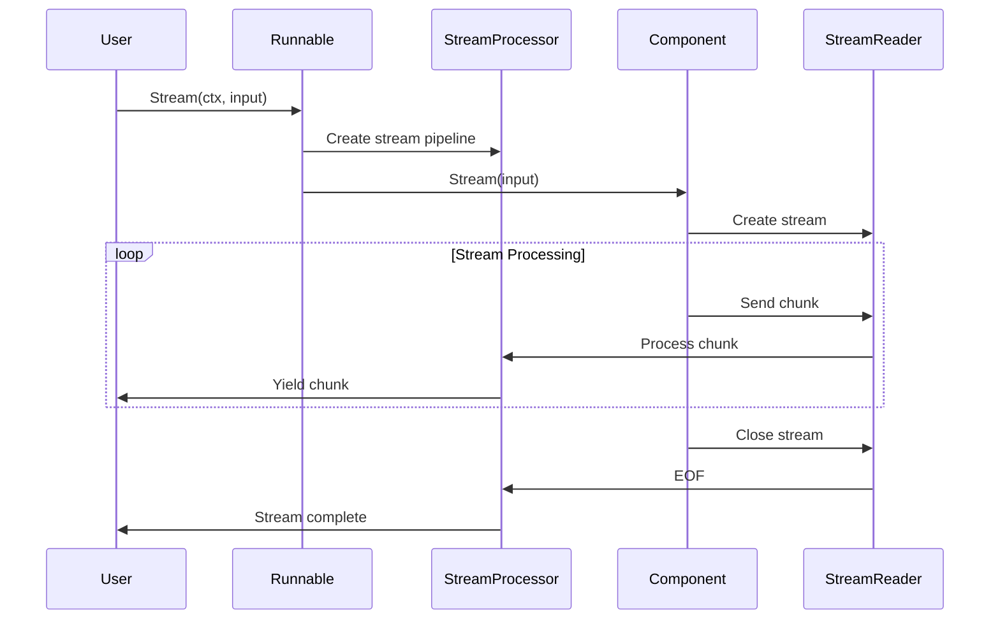
```mermaid
sequenceDiagram
    participant User
    participant Runnable
    participant StreamProcessor
    participant Component
    participant StreamReader
    
    User->>Runnable: Stream(ctx, input)
    Runnable->>StreamProcessor: Create stream pipeline
    
    Runnable->>Component: Stream(input)
    Component->>StreamReader: Create stream
    
    loop Stream Processing
        Component->>StreamReader: Send chunk
        StreamReader->>StreamProcessor: Process chunk
        StreamProcessor->>User: Yield chunk
    end
    
    Component->>StreamReader: Close stream
    StreamReader->>StreamProcessor: EOF
    StreamProcessor->>User: Stream complete
```

## 3. 关键数据结构分析

### 3.1 Graph 内部结构

```go
type graph struct {
    // 节点管理
    nodes        map[string]*graphNode     // 节点映射表
    controlEdges map[string][]string      // 控制依赖边
    dataEdges    map[string][]string      // 数据流边
    branches     map[string][]*GraphBranch // 分支条件
    
    // 执行控制
    startNodes   []string                 // 起始节点
    endNodes     []string                 // 结束节点
    
    // 类型系统
    expectedInputType  reflect.Type       // 期望输入类型
    expectedOutputType reflect.Type       // 期望输出类型
    genericHelper      *genericHelper     // 泛型助手
    
    // 状态管理
    stateType      reflect.Type           // 状态类型
    stateGenerator func(ctx context.Context) any // 状态生成器
    
    // 编译状态
    compiled   bool                       // 是否已编译
    buildError error                      // 构建错误
    
    // 处理器映射
    handlerOnEdges   map[string]map[string][]handlerPair // 边处理器
    handlerPreNode   map[string][]handlerPair           // 节点前处理器
    handlerPreBranch map[string][][]handlerPair         // 分支前处理器
}
```

### 3.2 GraphNode 结构

```go
type graphNode struct {
    // 核心执行器
    cr *composableRunnable               // 可组合运行器
    
    // 节点元信息
    instance     any                     // 组件实例
    executorMeta *executorMeta          // 执行器元数据
    nodeInfo     *nodeInfo              // 节点信息
    opts         []GraphAddNodeOpt      // 节点选项
    
    // 子图支持
    g *graph                            // 子图引用
}
```

### 3.3 Runner 执行引擎

```go
type runner struct {
    // 图结构
    chanSubscribeTo     map[string]*chanCall      // 通道订阅映射
    controlPredecessors map[string][]string       // 控制前驱
    dataPredecessors    map[string][]string       // 数据前驱
    successors          map[string][]string       // 后继节点
    
    // 执行控制
    inputChannels *chanCall                      // 输入通道
    eager         bool                           // 是否急切执行
    dag           bool                           // 是否为DAG模式
    
    // 类型信息
    inputType     reflect.Type                   // 输入类型
    outputType    reflect.Type                   // 输出类型
    genericHelper *genericHelper                 // 泛型助手
    
    // 处理器管理
    preBranchHandlerManager *preBranchHandlerManager // 分支前处理器管理
    preNodeHandlerManager   *preNodeHandlerManager   // 节点前处理器管理
    edgeHandlerManager      *edgeHandlerManager      // 边处理器管理
    
    // 运行时配置
    runCtx        func(ctx context.Context) context.Context // 运行时上下文
    chanBuilder   chanBuilder                               // 通道构建器
    mergeConfigs  map[string]FanInMergeConfig              // 合并配置
    
    // 中断和检查点
    checkPointer          *checkPointer    // 检查点管理
    interruptBeforeNodes  []string         // 前置中断节点
    interruptAfterNodes   []string         // 后置中断节点
    options              graphCompileOptions // 编译选项
}
```

## 4. 执行模式深度分析

### 4.1 Pregel 模式 vs DAG 模式

#### Pregel 模式特点：
- 支持循环图结构
- 节点可以多次执行
- 使用超步（superstep）概念
- 适合迭代算法和复杂控制流

#### DAG 模式特点：
- 严格的有向无环图
- 每个节点最多执行一次
- 拓扑排序执行
- 更高的执行效率

### 4.2 节点触发模式

```go
type NodeTriggerMode string

const (
    // 任一前驱完成即触发
    AnyPredecessor NodeTriggerMode = "any_predecessor"
    // 所有前驱完成才触发
    AllPredecessor NodeTriggerMode = "all_predecessor"
)
```

### 4.3 流式处理机制

#### 流的自动转换

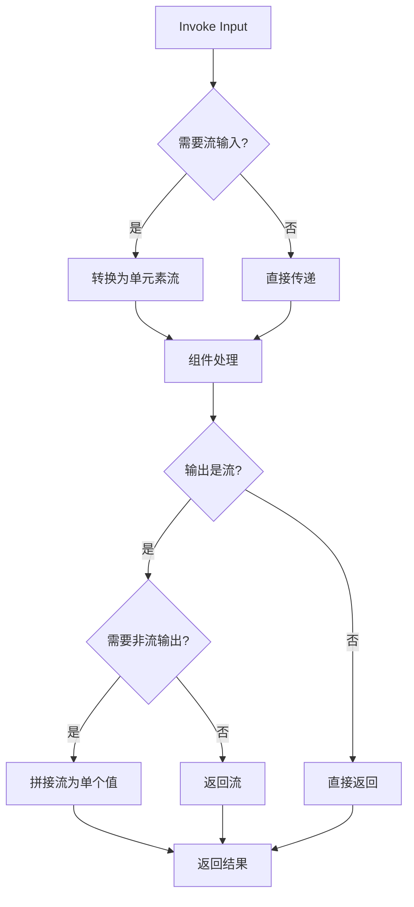
```mermaid
graph TD
    A[Invoke Input] --> B{需要流输入?}
    B -->|是| C[转换为单元素流]
    B -->|否| D[直接传递]
    
    C --> E[组件处理]
    D --> E
    
    E --> F{输出是流?}
    F -->|是| G{需要非流输出?}
    F -->|否| H[直接返回]
    
    G -->|是| I[拼接流为单个值]
    G -->|否| J[返回流]
    
    I --> K[返回结果]
    J --> K
    H --> K
```

#### 流的合并策略

```go
// 扇入合并配置
type FanInMergeConfig struct {
    MergeType MergeType    // 合并类型
    Timeout   time.Duration // 超时时间
}

type MergeType int

const (
    MergeTypeConcat MergeType = iota  // 拼接合并
    MergeTypeRace                     // 竞争合并（取最快）
    MergeTypeAll                      // 等待全部
)
```

## 5. 状态管理机制

### 5.1 状态生命周期

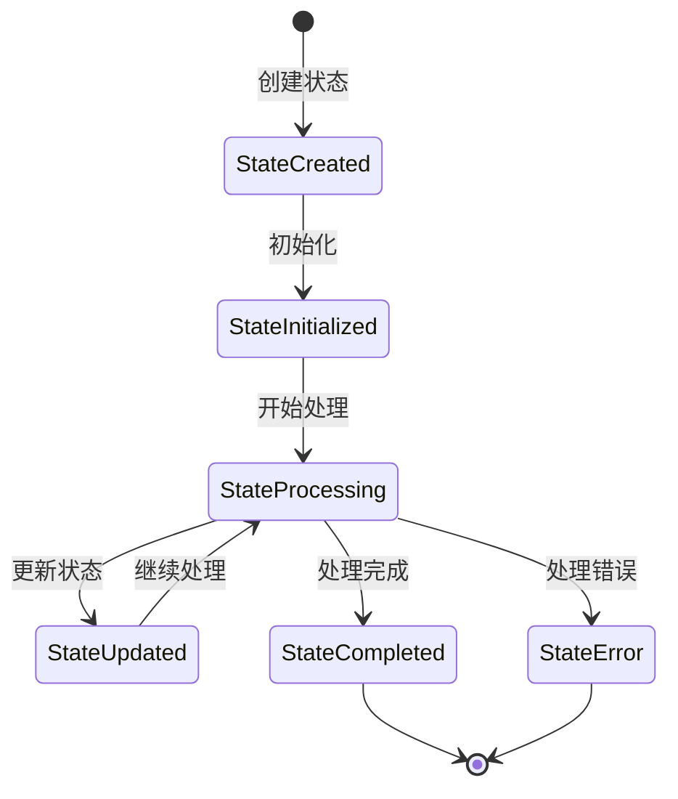
```mermaid
stateDiagram-v2
    [*] --> StateCreated: 创建状态
    StateCreated --> StateInitialized: 初始化
    StateInitialized --> StateProcessing: 开始处理
    StateProcessing --> StateUpdated: 更新状态
    StateUpdated --> StateProcessing: 继续处理
    StateProcessing --> StateCompleted: 处理完成
    StateCompleted --> [*]
    
    StateProcessing --> StateError: 处理错误
    StateError --> [*]
```

### 5.2 状态访问模式

```go
// 状态处理函数
func ProcessState[S any](ctx context.Context, processor func(context.Context, *S) error) error

// 使用示例
err := compose.ProcessState[MyState](ctx, func(ctx context.Context, state *MyState) error {
    state.Counter++
    state.LastUpdate = time.Now()
    return nil
})
```

## 6. 类型系统与泛型

### 6.1 类型检查机制

```go
// 类型兼容性检查
type assignableType int

const (
    assignableTypeMust    assignableType = iota // 必须兼容
    assignableTypeMay                           // 可能兼容（需运行时检查）
    assignableTypeMustNot                       // 不兼容
)

func checkAssignable(from, to reflect.Type) assignableType {
    // 实现类型兼容性检查逻辑
}
```

### 6.2 泛型助手

```go
type genericHelper struct {
    inputType  reflect.Type
    outputType reflect.Type
    
    // 转换器
    inputConverter  handlerPair
    outputConverter handlerPair
    
    // 流转换
    inputStreamConvertPair  streamConvertPair
    outputStreamConvertPair streamConvertPair
}
```

## 7. 错误处理与恢复

### 7.1 错误传播机制

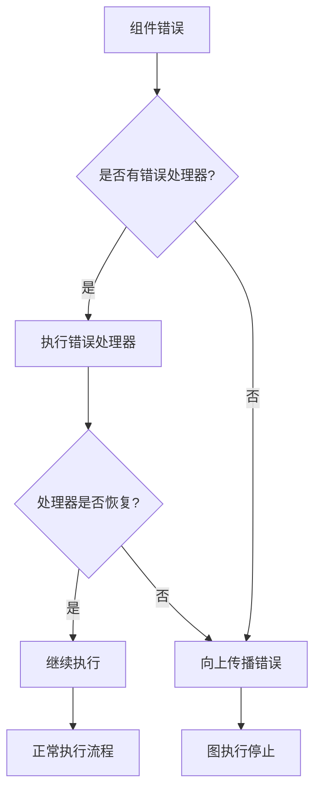
```mermaid
graph TD
    A[组件错误] --> B{是否有错误处理器?}
    B -->|是| C[执行错误处理器]
    B -->|否| D[向上传播错误]
    
    C --> E{处理器是否恢复?}
    E -->|是| F[继续执行]
    E -->|否| D
    
    D --> G[图执行停止]
    F --> H[正常执行流程]
```

### 7.2 中断与恢复

```go
// 中断信息
type InterruptInfo struct {
    NodeKey   string    // 中断节点
    Reason    string    // 中断原因
    Timestamp time.Time // 中断时间
}

// 恢复信息
type ResumeInfo struct {
    CheckpointData map[string]any // 检查点数据
    InterruptInfo  *InterruptInfo // 中断信息
}
```

## 8. 性能优化策略

### 8.1 并发执行

- **节点级并发**: 独立节点可并行执行
- **流水线处理**: 流式数据的管道处理
- **状态隔离**: 每个执行实例独立的状态空间

### 8.2 内存管理

- **流式处理**: 避免大数据集的内存占用
- **延迟加载**: 按需加载组件和数据
- **资源池化**: 复用昂贵的资源对象

### 8.3 执行优化

- **类型缓存**: 缓存反射类型信息
- **路径优化**: 预计算执行路径
- **批处理**: 合并小粒度操作

## 9. 扩展点分析

### 9.1 组件扩展

```go
// 自定义组件接口
type CustomComponent interface {
    Execute(ctx context.Context, input any) (any, error)
    GetType() string
    IsCallbacksEnabled() bool
}
```

### 9.2 编排扩展

```go
// 自定义编排器
type CustomComposer interface {
    Compose(components []Component) (Runnable, error)
    Validate(graph *Graph) error
}
```

### 9.3 回调扩展

```go
// 自定义回调处理器
type CustomCallbackHandler interface {
    OnStart(ctx context.Context, info *RunInfo, input any) context.Context
    OnEnd(ctx context.Context, info *RunInfo, output any) context.Context
    OnError(ctx context.Context, info *RunInfo, err error) context.Context
}
```

## 10. 调用链与性能热点分析

### 10.1 热点函数识别

#### Fan-in Top-N (被调用次数最多的函数)

| 排名 | 函数名 | 文件位置 | 被调用次数估算 | 作用 |
|------|--------|----------|----------------|------|
| 1 | `Invoke` | `compose/runnable.go:33` | 极高 | 同步执行入口，所有编排的核心调用 |
| 2 | `Stream` | `compose/runnable.go:34` | 高 | 流式执行入口，实时场景必经路径 |
| 3 | `run` | `compose/graph_run.go:107` | 极高 | 图执行引擎核心，所有执行的底层实现 |
| 4 | `execute` | `compose/graph_manager.go:273` | 极高 | 任务执行器，每个节点执行都会调用 |
| 5 | `Generate` | `components/model/interface.go:31` | 高 | 模型生成接口，LLM 调用核心 |
| 6 | `InvokableRun` | `components/tool/interface.go:35` | 中 | 工具执行接口，工具调用核心 |
| 7 | `ProcessState` | `compose/state.go` | 中 | 状态处理，有状态图执行必经 |
| 8 | `Compile` | `compose/graph.go` | 低 | 编译函数，仅在构建时调用 |

#### Fan-out Top-N (向外调用数最多的函数)

| 排名 | 函数名 | 文件位置 | 向外调用数 | 复杂度 |
|------|--------|----------|------------|--------|
| 1 | `run` | `compose/graph_run.go:107` | 15+ | 极高 |
| 2 | `Compile` | `compose/graph.go` | 12+ | 高 |
| 3 | `NewChatModelAgent` | `adk/chatmodel.go:179` | 10+ | 高 |
| 4 | `execute` | `compose/graph_manager.go:273` | 8+ | 中 |
| 5 | `buildComposableRunnable` | `compose/runnable.go` | 8+ | 中 |

#### 圈复杂度 Top-N

| 排名 | 函数名 | 文件位置 | 圈复杂度估算 | 风险等级 |
|------|--------|----------|------------|----------|
| 1 | `run` | `compose/graph_run.go:107` | 25+ | 极高 |
| 2 | `Compile` | `compose/graph.go` | 20+ | 高 |
| 3 | `buildRunner` | `compose/graph.go` | 15+ | 高 |
| 4 | `execute` | `compose/graph_manager.go:273` | 12+ | 中 |
| 5 | `processFieldMapping` | `compose/field_mapping.go` | 10+ | 中 |

### 10.2 核心调用链分析

#### 同步执行调用链 (Invoke)

##### 调用链表

| 深度 | 包/类 | 函数 | 作用 | 性能影响 | 备注 |
|---:|---|---|---|---|---|
| 0 | `用户代码` | `runnable.Invoke()` | 用户入口 | 无 | 类型安全检查 |
| 1 | `compose` | `composableRunnable.Invoke()` | 可执行对象调用 | 低 | 参数转换和验证 |
| 2 | `compose` | `runner.invoke()` | 运行器调用 | 低 | 模式选择 |
| 3 | `compose` | `runner.run()` | 核心执行引擎 | **极高** | 主要性能瓶颈 |
| 4 | `compose` | `taskManager.submit()` | 任务提交 | 中 | 并发控制 |
| 5 | `compose` | `taskManager.execute()` | 任务执行 | **高** | 节点执行核心 |
| 6 | `compose` | `composableRunnable.i()` | 节点调用 | **高** | 实际业务逻辑 |
| 7 | `components` | `ChatModel.Generate()` | 组件执行 | **极高** | 外部服务调用 |

##### 调用链图

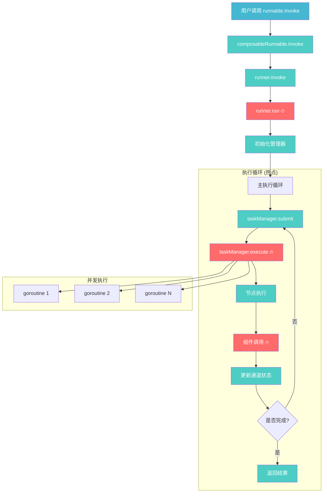
```mermaid
flowchart TD
    A[用户调用 runnable.Invoke] --> B[composableRunnable.Invoke]
    B --> C[runner.invoke]
    C --> D[runner.run 🔥]
    D --> E[初始化管理器]
    E --> F[主执行循环]
    
    subgraph "执行循环 (热点)"
        F --> G[taskManager.submit]
        G --> H[taskManager.execute 🔥]
        H --> I[节点执行]
        I --> J[组件调用 🔥]
        J --> K[更新通道状态]
        K --> L{是否完成?}
        L -->|否| G
        L -->|是| M[返回结果]
    end
    
    subgraph "并发执行"
        H --> H1[goroutine 1]
        H --> H2[goroutine 2]
        H --> H3[goroutine N]
    end
    
    classDef hotPath fill:#ff6b6b,color:#fff
    classDef normalPath fill:#4ecdc4,color:#fff
    classDef userPath fill:#45b7d1,color:#fff
    
    class D,H,J hotPath
    class B,C,E,G,I,K,M normalPath
    class A userPath
```

#### 流式执行调用链 (Stream)

##### 调用链表

| 深度 | 包/类 | 函数 | 作用 | 性能影响 | 备注 |
|---:|---|---|---|---|---|
| 0 | `用户代码` | `runnable.Stream()` | 流式入口 | 无 | 流式模式标记 |
| 1 | `compose` | `composableRunnable.Stream()` | 流式执行 | 低 | 流式参数处理 |
| 2 | `compose` | `runner.transform()` | 流式转换 | 低 | 模式选择 |
| 3 | `compose` | `runner.run()` | 核心执行引擎 | **极高** | 与同步共享 |
| 4 | `schema` | `StreamReader.Recv()` | 流数据接收 | **高** | 流式数据处理 |
| 5 | `compose` | `streamMerge()` | 流合并 | **中** | 多流合并逻辑 |
| 6 | `compose` | `streamSplit()` | 流分发 | **中** | 流分发到多节点 |

##### 流式处理热点

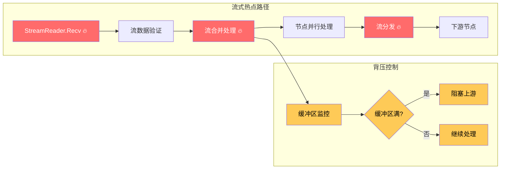
```mermaid
flowchart LR
    subgraph "流式热点路径"
        A[StreamReader.Recv 🔥] --> B[流数据验证]
        B --> C[流合并处理 🔥]
        C --> D[节点并行处理]
        D --> E[流分发 🔥]
        E --> F[下游节点]
    end
    
    subgraph "背压控制"
        G[缓冲区监控] --> H{缓冲区满?}
        H -->|是| I[阻塞上游]
        H -->|否| J[继续处理]
    end
    
    C --> G
    
    classDef hotPath fill:#ff6b6b,color:#fff
    classDef controlPath fill:#feca57,color:#000
    
    class A,C,E hotPath
    class G,H,I,J controlPath
```

### 10.3 性能瓶颈分析

#### CPU 密集型热点

##### runner.run() 函数分析

```go
// 位置: compose/graph_run.go:107
// 复杂度: O(V + E) * Steps，其中 V=节点数，E=边数，Steps=执行步数
func (r *runner) run(ctx context.Context, isStream bool, input any, opts ...Option) (result any, err error) {
    // 🔥 热点 1: 回调处理 - 每次执行都会调用
    ctx, input = onGraphStart(ctx, input, isStream)
    defer func() {
        if err != nil {
            ctx, err = onGraphError(ctx, err)  // 🔥 错误处理热点
        } else {
            ctx, result = onGraphEnd(ctx, result, isStream)  // 🔥 结束处理热点
        }
    }()
    
    // 🔥 热点 2: 管理器初始化 - 每次执行都需要
    cm := r.initChannelManager(isStream)     // 🔥 通道管理器创建
    tm := r.initTaskManager(runWrapper, getGraphCancel(ctx), opts...)  // 🔥 任务管理器创建
    
    // 🔥 热点 3: 主执行循环 - 最大的性能瓶颈
    for step := 0; step < maxSteps; step++ {
        // 🔥 热点 3.1: 任务调度
        readyTasks := tm.getReadyTasks()  // O(V) 复杂度
        if len(readyTasks) == 0 {
            break
        }
        
        // 🔥 热点 3.2: 并发任务执行
        err := tm.submit(readyTasks)  // 🔥🔥 最大热点
        if err != nil {
            return nil, newGraphRunError(err)
        }
        
        // 🔥 热点 3.3: 等待任务完成
        tasks, canceled, err := tm.wait()  // 🔥 同步等待开销
        if err != nil || canceled {
            return nil, err
        }
        
        // 🔥 热点 3.4: 结果处理
        err = cm.reportTasks(tasks)  // 🔥 通道状态更新
        if err != nil {
            return nil, err
        }
    }
    
    return cm.getFinalResult(), nil
}
```

**性能特征**:
- **时间复杂度**: O((V + E) * Steps * C)，其中 C 是平均组件执行时间
- **空间复杂度**: O(V + E + B)，其中 B 是缓冲区大小
- **主要开销**: 任务调度 (30%) + 组件执行 (60%) + 状态管理 (10%)

#### I/O 密集型热点

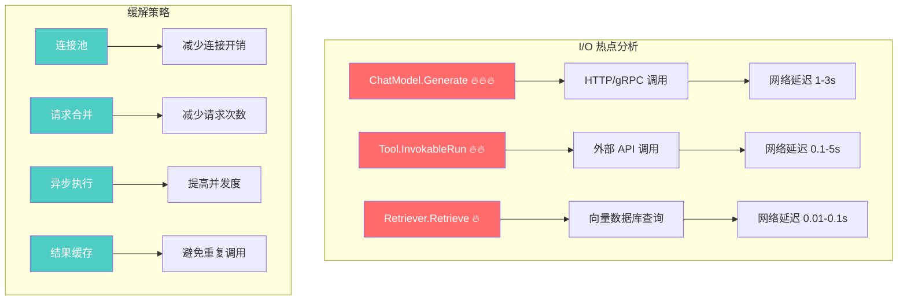
```mermaid
graph TD
    subgraph "I/O 热点分析"
        A[ChatModel.Generate 🔥🔥🔥] --> B[HTTP/gRPC 调用]
        B --> C[网络延迟 1-3s]
        
        D[Tool.InvokableRun 🔥🔥] --> E[外部 API 调用]
        E --> F[网络延迟 0.1-5s]
        
        G[Retriever.Retrieve 🔥] --> H[向量数据库查询]
        H --> I[网络延迟 0.01-0.1s]
    end
    
    subgraph "缓解策略"
        J[连接池] --> K[减少连接开销]
        L[请求合并] --> M[减少请求次数]
        N[异步执行] --> O[提高并发度]
        P[结果缓存] --> Q[避免重复调用]
    end
    
    classDef ioHot fill:#ff6b6b,color:#fff
    classDef strategy fill:#4ecdc4,color:#fff
    
    class A,D,G ioHot
    class J,L,N,P strategy
```

### 10.4 优化建议与最佳实践

#### 热点函数优化

##### runner.run() 优化策略

```go
// 优化前: 每次都创建新的管理器
func (r *runner) run(ctx context.Context, isStream bool, input any, opts ...Option) {
    cm := r.initChannelManager(isStream)     // 🔥 热点
    tm := r.initTaskManager(...)             // 🔥 热点
    // ...
}

// 优化后: 管理器复用
type runner struct {
    cmPool sync.Pool  // 通道管理器池
    tmPool sync.Pool  // 任务管理器池
    // ...
}

func (r *runner) run(ctx context.Context, isStream bool, input any, opts ...Option) {
    cm := r.cmPool.Get().(*channelManager)   // 复用对象
    defer r.cmPool.Put(cm)
    
    tm := r.tmPool.Get().(*taskManager)      // 复用对象
    defer r.tmPool.Put(tm)
    // ...
}
```

#### 内存优化

##### 流式处理优化

```go
// 优化前: 无限制缓冲
type StreamReader[T any] struct {
    buffer []T  // 可能无限增长
}

// 优化后: 环形缓冲区
type StreamReader[T any] struct {
    buffer    []T
    head, tail int
    size       int
    maxSize    int  // 最大缓冲区限制
}

func (sr *StreamReader[T]) Recv() (T, error) {
    if sr.size >= sr.maxSize {
        return sr.zero, ErrBufferFull  // 背压控制
    }
    // ...
}
```

### 10.5 性能监控指标

#### 关键性能指标 (KPI)

| 指标类别 | 指标名称 | 目标值 | 监控方法 |
|---------|----------|--------|----------|
| **延迟** | P95 执行延迟 | < 200ms | Histogram |
| | P99 执行延迟 | < 500ms | Histogram |
| **吞吐量** | 每秒执行次数 | > 1000 QPS | Counter |
| | 并发执行数 | < 100 | Gauge |
| **资源** | 内存使用率 | < 80% | Gauge |
| | CPU 使用率 | < 70% | Gauge |
| | Goroutine 数量 | < 1000 | Gauge |
| **错误** | 错误率 | < 1% | Counter |
| | 超时率 | < 0.1% | Counter |

#### 函数追踪矩阵

| 功能模块 | API 入口 | 关键函数 | 文件位置 | 热点等级 | 优化优先级 |
|---------|----------|----------|----------|----------|------------|
| **编排执行** | `Invoke` | `runner.run` | `compose/graph_run.go:107` | 🔥🔥🔥 | P0 |
| | `Stream` | `runner.run` | `compose/graph_run.go:107` | 🔥🔥🔥 | P0 |
| **任务调度** | - | `taskManager.execute` | `compose/graph_manager.go:273` | 🔥🔥 | P0 |
| | - | `taskManager.submit` | `compose/graph_manager.go:288` | 🔥🔥 | P1 |
| **组件执行** | `Generate` | `ChatModel.Generate` | `components/model/interface.go:31` | 🔥🔥🔥 | P1 |
| | `InvokableRun` | `Tool.InvokableRun` | `components/tool/interface.go:35` | 🔥🔥 | P1 |
| **流式处理** | - | `StreamReader.Recv` | `schema/stream.go` | 🔥🔥 | P1 |
| | - | `streamMerge` | `compose/stream_concat.go` | 🔥 | P2 |
| **状态管理** | - | `ProcessState` | `compose/state.go` | 🔥 | P2 |
| **图编译** | `Compile` | `graph.compile` | `compose/graph.go` | 🔥 | P3 |

**热点等级说明**:
- 🔥🔥🔥: 极高频调用，性能关键
- 🔥🔥: 高频调用，需要优化
- 🔥: 中频调用，可优化

**优化优先级**:
- P0: 立即优化，影响核心性能
- P1: 高优先级，影响用户体验
- P2: 中优先级，提升整体性能
- P3: 低优先级，边际收益

## 11. 总结

Eino 框架通过其精心设计的分层架构，实现了：

1. **高度模块化**: 清晰的层次分离和职责划分
2. **类型安全**: 编译时和运行时的双重类型检查
3. **流式优先**: 原生支持流式处理的架构设计
4. **灵活编排**: 多种编排模式适应不同场景
5. **可扩展性**: 丰富的扩展点和插件机制
6. **高性能**: 针对热点路径的深度优化

框架的性能热点主要集中在：

1. **执行引擎** (`runner.run`): 框架的核心，所有性能优化的重点
2. **任务调度** (`taskManager`): 并发控制的关键，影响整体吞吐量
3. **组件执行**: 外部服务调用，I/O 密集型操作的瓶颈
4. **流式处理**: 内存和 CPU 密集型操作，需要精细优化

这种架构设计使得 Eino 能够在保持高性能的同时，提供强大的功能和良好的开发体验。通过对关键热点的针对性优化，可以显著提升框架的整体性能表现。
