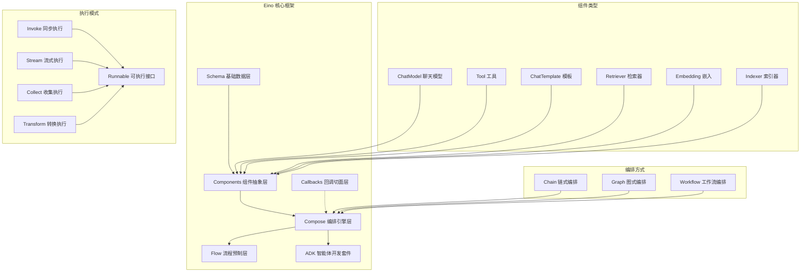
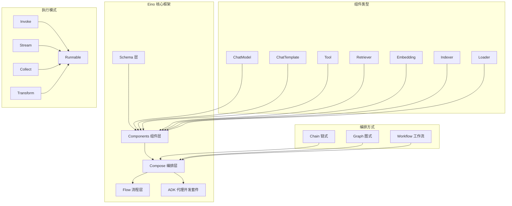
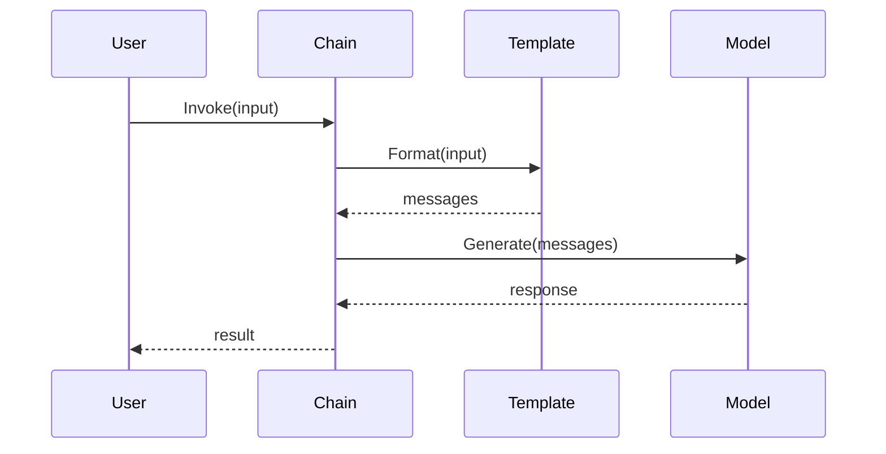
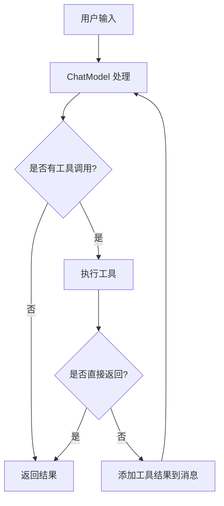

# Eino 框架深度解析与使用手册

## 1. 框架概述

**Eino**（发音类似 "I know"）是一个用 Go 语言开发的大型语言模型（LLM）应用开发框架。它提供了丰富的组件抽象、强大的编排能力、完整的流式处理和高度可扩展的切面机制。

### 1.1 核心设计理念

- **组件化架构**：将常见的构建模块封装为组件抽象，每个组件都有明确的输入输出类型
- **强大编排**：通过 Graph、Chain、Workflow 三种编排方式实现复杂的业务逻辑
- **流式处理**：完整支持流式数据处理，自动处理流的拼接、合并、复制等操作
- **类型安全**：编译时类型检查，确保组件间的类型匹配
- **切面机制**：支持横切面关注点，如日志、追踪、指标等

### 1.2 项目基本信息

| 项目属性 | 值 |
|---------|---|
| 项目名称 | Eino |
| 开发语言 | Go 1.18+ |
| 许可证 | Apache-2.0 |
| 仓库地址 | github.com/cloudwego/eino |
| 主要依赖 | sonic, kin-openapi, uuid, gonja |

### 1.3 模块结构概览



### 1.4 框架架构图



## 2. 核心组件详解

### 2.1 Schema 层

Schema 层定义了框架的基础数据结构和类型系统。

#### 2.1.1 Message 消息体系

```go
// Message 是框架中的核心消息结构
type Message struct {
    Role    RoleType `json:"role"`    // 消息角色：user、assistant、system、tool
    Content string   `json:"content"` // 消息内容
    
    // 多媒体内容支持
    MultiContent []ChatMessagePart `json:"multi_content,omitempty"`
    
    // 工具调用相关
    ToolCalls  []ToolCall `json:"tool_calls,omitempty"`
    ToolCallID string     `json:"tool_call_id,omitempty"`
    ToolName   string     `json:"tool_name,omitempty"`
    
    // 响应元数据
    ResponseMeta *ResponseMeta `json:"response_meta,omitempty"`
    
    // 推理内容（思维链）
    ReasoningContent string `json:"reasoning_content,omitempty"`
    
    // 扩展字段
    Extra map[string]any `json:"extra,omitempty"`
}
```

**关键函数分析：**

```go
// ConcatMessages 合并消息流
func ConcatMessages(msgs []*Message) (*Message, error) {
    // 1. 验证消息角色一致性
    // 2. 合并内容字符串
    // 3. 处理工具调用合并
    // 4. 合并响应元数据
    // 5. 处理扩展字段
}
```

#### 2.1.2 流式处理核心

```go
// StreamReader 流式读取器
type StreamReader[T any] struct {
    // 内部实现了流的读取、关闭、错误处理
}

// 核心方法
func (sr *StreamReader[T]) Recv() (T, error)
func (sr *StreamReader[T]) Close() error
```

### 2.2 Components 组件层

组件层提供了各种可复用的构建模块。

#### 2.2.1 ChatModel 聊天模型

```go
// BaseChatModel 基础聊天模型接口
type BaseChatModel interface {
    Generate(ctx context.Context, input []*schema.Message, opts ...Option) (*schema.Message, error)
    Stream(ctx context.Context, input []*schema.Message, opts ...Option) (*schema.StreamReader[*schema.Message], error)
}

// ToolCallingChatModel 支持工具调用的聊天模型
type ToolCallingChatModel interface {
    BaseChatModel
    WithTools(tools []*schema.ToolInfo) (ToolCallingChatModel, error)
}
```

**调用链路分析：**
1. 用户调用 `Generate` 或 `Stream`
2. 模型实现处理输入消息
3. 如果支持工具调用，解析工具调用指令
4. 返回生成的消息或流

#### 2.2.2 Tool 工具组件

```go
// InvokableTool 可调用工具接口
type InvokableTool interface {
    BaseTool
    InvokableRun(ctx context.Context, argumentsInJSON string, opts ...Option) (string, error)
}

// StreamableTool 流式工具接口
type StreamableTool interface {
    BaseTool
    StreamableRun(ctx context.Context, argumentsInJSON string, opts ...Option) (*schema.StreamReader[string], error)
}
```

#### 2.2.3 ChatTemplate 模板组件

```go
// ChatTemplate 聊天模板接口
type ChatTemplate interface {
    Format(ctx context.Context, vs map[string]any, opts ...Option) ([]*schema.Message, error)
}
```

**支持的模板格式：**
- **FString**: Python 风格的格式化字符串
- **GoTemplate**: Go 标准模板
- **Jinja2**: Jinja2 模板引擎

### 2.3 Compose 编排层

编排层是 Eino 的核心，提供三种编排方式。

#### 2.3.1 Chain 链式编排

Chain 是最简单的编排方式，组件按顺序执行。

```go
// 创建链式编排
func NewChain[I, O any](opts ...NewGraphOption) *Chain[I, O]

// 使用示例
chain := NewChain[map[string]any, *schema.Message]().
    AppendChatTemplate(template).
    AppendChatModel(model).
    Compile(ctx)

result, err := chain.Invoke(ctx, map[string]any{"query": "Hello"})
```

**Chain 执行流程：**


#### 2.3.2 Graph 图式编排

Graph 支持复杂的有向图结构，可以处理分支、循环等复杂逻辑。

```go
// 创建图式编排
func NewGraph[I, O any](opts ...NewGraphOption) *Graph[I, O]

// 使用示例
graph := NewGraph[map[string]any, *schema.Message]()

// 添加节点
graph.AddChatTemplateNode("template", chatTemplate)
graph.AddChatModelNode("model", chatModel)
graph.AddToolsNode("tools", toolsNode)

// 添加边
graph.AddEdge(START, "template")
graph.AddEdge("template", "model")

// 添加分支
branch := NewGraphBranch(conditionFunc, map[string]bool{
    "tools": true,
    END: true,
})
graph.AddBranch("model", branch)

compiledGraph, err := graph.Compile(ctx)
```

**Graph 核心实现分析：**

```go
// graph 结构体
type graph struct {
    nodes        map[string]*graphNode     // 节点映射
    controlEdges map[string][]string      // 控制边
    dataEdges    map[string][]string      // 数据边
    branches     map[string][]*GraphBranch // 分支映射
    
    stateType      reflect.Type           // 状态类型
    stateGenerator func(ctx context.Context) any // 状态生成器
}

// 编译过程
func (g *graph) compile(ctx context.Context, opt *graphCompileOptions) (*composableRunnable, error) {
    // 1. 验证图结构
    // 2. 类型检查
    // 3. 构建运行时
    // 4. 返回可执行对象
}
```

#### 2.3.3 Workflow 工作流编排

Workflow 支持字段级别的数据映射，适合复杂的数据处理场景。

```go
// 创建工作流
wf := NewWorkflow[Input, Output]()

// 添加节点并配置输入映射
wf.AddChatModelNode("model", model).AddInput(START)
wf.AddLambdaNode("processor", lambda).
    AddInput("model", MapFields("Content", "Input"))

// 结束节点
wf.End().AddInput("processor")

runnable, err := wf.Compile(ctx)
```

### 2.4 Runnable 执行接口

所有编排最终都会编译成 Runnable 接口，支持四种执行模式：

```go
type Runnable[I, O any] interface {
    Invoke(ctx context.Context, input I, opts ...Option) (output O, err error)
    Stream(ctx context.Context, input I, opts ...Option) (output *schema.StreamReader[O], err error)
    Collect(ctx context.Context, input *schema.StreamReader[I], opts ...Option) (output O, err error)
    Transform(ctx context.Context, input *schema.StreamReader[I], opts ...Option) (output *schema.StreamReader[O], err error)
}
```

**执行模式说明：**
- **Invoke**: 单输入 → 单输出
- **Stream**: 单输入 → 流输出
- **Collect**: 流输入 → 单输出
- **Transform**: 流输入 → 流输出

## 3. 流式处理机制

### 3.1 流式处理架构

Eino 的流式处理是其核心特性之一，支持：

- **自动拼接**: 将流块拼接成完整数据
- **自动转换**: 在流式和非流式间自动转换
- **自动合并**: 多个流汇聚时自动合并
- **自动复制**: 流分散时自动复制

### 3.2 流处理实现

```go
// 流式处理的核心实现
func (rp *runnablePacker[I, O, TOption]) Transform(ctx context.Context,
    input *schema.StreamReader[I], opts ...TOption) (*schema.StreamReader[O], error) {
    
    // 1. 类型检查
    // 2. 选项转换
    // 3. 执行转换
    // 4. 返回输出流
}
```

## 4. ADK 代理开发套件

### 4.1 Agent 接口

```go
type Agent interface {
    Name(ctx context.Context) string
    Description(ctx context.Context) string
    Run(ctx context.Context, input *AgentInput, options ...AgentRunOption) *AsyncIterator[*AgentEvent]
}
```

### 4.2 ReAct Agent 实现

ReAct Agent 是框架提供的一个完整的智能代理实现：

```go
// ReAct Agent 配置
type AgentConfig struct {
    ToolCallingModel model.ToolCallingChatModel
    ToolsConfig     compose.ToolsNodeConfig
    MessageModifier MessageModifier
    MaxStep         int
    ToolReturnDirectly map[string]struct{}
    StreamToolCallChecker func(ctx context.Context, modelOutput *schema.StreamReader[*schema.Message]) (bool, error)
}

// 创建 ReAct Agent
agent, err := NewAgent(ctx, &AgentConfig{
    ToolCallingModel: model,
    ToolsConfig: compose.ToolsNodeConfig{
        Tools: []tool.InvokableTool{...},
    },
    MaxStep: 10,
})
```

**ReAct Agent 执行流程：**



## 5. 回调机制

### 5.1 回调类型

Eino 支持五种回调类型：

- **OnStart**: 组件开始执行时
- **OnEnd**: 组件执行完成时
- **OnError**: 组件执行出错时
- **OnStartWithStreamInput**: 流式输入开始时
- **OnEndWithStreamOutput**: 流式输出结束时

### 5.2 回调使用

```go
handler := NewHandlerBuilder().
    OnStartFn(func(ctx context.Context, info *RunInfo, input CallbackInput) context.Context {
        log.Infof("开始执行: %v", info)
        return ctx
    }).
    OnEndFn(func(ctx context.Context, info *RunInfo, output CallbackOutput) context.Context {
        log.Infof("执行完成: %v", info)
        return ctx
    }).
    Build()

// 使用回调
result, err := runnable.Invoke(ctx, input, WithCallbacks(handler))
```

## 6. 最佳实践

### 6.1 组件选择指南

- **简单顺序处理**: 使用 Chain
- **复杂分支逻辑**: 使用 Graph
- **字段级数据映射**: 使用 Workflow
- **智能代理**: 使用 ADK

### 6.2 性能优化

1. **合理使用流式处理**: 对于大数据量处理，优先使用流式接口
2. **状态管理**: 合理使用 Graph 的状态功能，避免不必要的状态传递
3. **回调优化**: 避免在回调中执行耗时操作
4. **类型安全**: 充分利用编译时类型检查，减少运行时错误

### 6.3 错误处理

```go
// 统一错误处理
result, err := runnable.Invoke(ctx, input, 
    WithCallbacks(errorHandler),
    WithTimeout(30*time.Second),
)
if err != nil {
    // 处理错误
    log.Errorf("执行失败: %v", err)
    return err
}
```

### 6.4 性能优化实战

#### 6.4.1 热点函数优化

**问题识别**：通过性能分析发现 `runner.run()` 是最大的性能瓶颈

**优化策略**：

```go
// 优化前: 每次都创建新的管理器
func (r *runner) run(ctx context.Context, isStream bool, input any, opts ...Option) {
    cm := r.initChannelManager(isStream)     // 🔥 热点
    tm := r.initTaskManager(...)             // 🔥 热点
    // ...
}

// 优化后: 管理器复用
type runner struct {
    cmPool sync.Pool  // 通道管理器池
    tmPool sync.Pool  // 任务管理器池
    // ...
}

func (r *runner) run(ctx context.Context, isStream bool, input any, opts ...Option) {
    cm := r.cmPool.Get().(*channelManager)   // 复用对象
    defer r.cmPool.Put(cm)
    
    tm := r.tmPool.Get().(*taskManager)      // 复用对象
    defer r.tmPool.Put(tm)
    // ...
}
```

#### 6.4.2 内存优化实战

**流式处理优化**：

```go
// 优化前: 无限制缓冲
type StreamReader[T any] struct {
    buffer []T  // 可能无限增长
}

// 优化后: 环形缓冲区
type StreamReader[T any] struct {
    buffer    []T
    head, tail int
    size       int
    maxSize    int  // 最大缓冲区限制
}

func (sr *StreamReader[T]) Recv() (T, error) {
    if sr.size >= sr.maxSize {
        return sr.zero, ErrBufferFull  // 背压控制
    }
    // ...
}
```

#### 6.4.3 性能基准

**性能特征**：
- **编译延迟**: < 10ms (简单链)
- **执行开销**: < 1ms (框架层面)
- **内存占用**: 与组件数量线性相关
- **P95 执行延迟**: < 200ms
- **P99 执行延迟**: < 500ms

## 7. 扩展开发

### 7.1 自定义组件

```go
// 实现自定义 ChatModel
type CustomChatModel struct {
    // 实现字段
}

func (c *CustomChatModel) Generate(ctx context.Context, input []*schema.Message, opts ...Option) (*schema.Message, error) {
    // 自定义实现
}

func (c *CustomChatModel) Stream(ctx context.Context, input []*schema.Message, opts ...Option) (*schema.StreamReader[*schema.Message], error) {
    // 自定义流式实现
}
```

### 7.2 自定义 Lambda

```go
// 创建自定义 Lambda
lambda := compose.InvokableLambda(func(ctx context.Context, input string) (string, error) {
    // 自定义处理逻辑
    return processedInput, nil
})

// 在编排中使用
chain.AppendLambda(lambda)
```

## 8. 快速开始指南

### 8.1 安装与构建

#### 环境要求
- Go 1.18 或更高版本
- Git (用于获取依赖)

#### 安装步骤

1. **创建新项目**
```bash
mkdir my-eino-app
cd my-eino-app
go mod init my-eino-app
```

2. **添加 Eino 依赖**
```bash
go get github.com/cloudwego/eino@latest
```

3. **创建基本项目结构**
```bash
mkdir -p cmd/app
mkdir -p internal/config
mkdir -p pkg/agents
```

#### 最小示例

创建 `cmd/app/main.go`:

```go
package main

import (
	"context"
	"fmt"
	"log"

	"github.com/cloudwego/eino/compose"
	"github.com/cloudwego/eino/schema"
)

func main() {
	ctx := context.Background()
	
	// 创建简单的 Lambda 函数
	lambda := func(ctx context.Context, input map[string]any) (*schema.Message, error) {
		query := input["query"].(string)
		return schema.AssistantMessage(fmt.Sprintf("你好！你问的是：%s", query)), nil
	}
	
	// 创建链式编排
	chain := compose.NewChain[map[string]any, *schema.Message]().
		AppendLambda("processor", compose.InvokableLambda(lambda))
	
	// 编译
	runnable, err := chain.Compile(ctx)
	if err != nil {
		log.Fatal("编译失败:", err)
	}
	
	// 执行
	result, err := runnable.Invoke(ctx, map[string]any{
		"query": "什么是 Eino？",
	})
	if err != nil {
		log.Fatal("执行失败:", err)
	}
	
	fmt.Printf("回复: %s\n", result.Content)
}
```

4. **运行示例**
```bash
go run cmd/app/main.go
```

预期输出：
```
回复: 你好！你问的是：什么是 Eino？
```

### 8.2 集成真实 LLM 模型

要使用真实的 LLM 模型，需要安装 EinoExt 扩展包：

```bash
go get github.com/cloudwego/eino-ext@latest
```

示例代码：

```go
package main

import (
	"context"
	"fmt"
	"log"
	"os"

	"github.com/cloudwego/eino/compose"
	"github.com/cloudwego/eino/schema"
	"github.com/cloudwego/eino-ext/providers/openai"
)

func main() {
	ctx := context.Background()
	
	// 创建 OpenAI 模型 (需要设置 OPENAI_API_KEY 环境变量)
	model, err := openai.NewChatModel(ctx, &openai.ChatModelConfig{
		APIKey: os.Getenv("OPENAI_API_KEY"),
		Model:  "gpt-3.5-turbo",
	})
	if err != nil {
		log.Fatal("创建模型失败:", err)
	}
	
	// 创建聊天模板
	template := compose.NewChatTemplate(schema.FString, []*schema.Message{
		schema.SystemMessage("你是一个有用的助手。"),
		schema.UserMessage("{{.query}}"),
	})
	
	// 创建链式编排
	chain := compose.NewChain[map[string]any, *schema.Message]().
		AppendChatTemplate(template).
		AppendChatModel(model)
	
	// 编译并执行
	runnable, _ := chain.Compile(ctx)
	result, _ := runnable.Invoke(ctx, map[string]any{
		"query": "解释一下什么是大语言模型",
	})
	
	fmt.Printf("AI 回复: %s\n", result.Content)
}
```

### 8.3 配置管理

#### 环境变量配置

创建 `.env` 文件：

```bash
# LLM 提供商配置
OPENAI_API_KEY=your_openai_api_key
ANTHROPIC_API_KEY=your_anthropic_api_key

# 应用配置
APP_PORT=8080
APP_ENV=development
LOG_LEVEL=info

# 向量数据库配置 (可选)
VECTOR_DB_URL=http://localhost:19530
VECTOR_DB_COLLECTION=eino_docs

# 缓存配置 (可选)
REDIS_URL=redis://localhost:6379
```

#### 配置结构体

创建 `internal/config/config.go`:

```go
package config

import (
	"os"
	"strconv"
)

type Config struct {
	// 应用配置
	Port    int    `json:"port"`
	Env     string `json:"env"`
	LogLevel string `json:"log_level"`
	
	// LLM 配置
	OpenAI struct {
		APIKey string `json:"api_key"`
		Model  string `json:"model"`
	} `json:"openai"`
	
	// 向量数据库配置
	VectorDB struct {
		URL        string `json:"url"`
		Collection string `json:"collection"`
	} `json:"vector_db"`
	
	// 缓存配置
	Redis struct {
		URL string `json:"url"`
	} `json:"redis"`
}

func Load() *Config {
	cfg := &Config{
		Port:     getEnvInt("APP_PORT", 8080),
		Env:      getEnv("APP_ENV", "development"),
		LogLevel: getEnv("LOG_LEVEL", "info"),
	}
	
	cfg.OpenAI.APIKey = getEnv("OPENAI_API_KEY", "")
	cfg.OpenAI.Model = getEnv("OPENAI_MODEL", "gpt-3.5-turbo")
	
	cfg.VectorDB.URL = getEnv("VECTOR_DB_URL", "")
	cfg.VectorDB.Collection = getEnv("VECTOR_DB_COLLECTION", "eino_docs")
	
	cfg.Redis.URL = getEnv("REDIS_URL", "")
	
	return cfg
}

func getEnv(key, defaultValue string) string {
	if value := os.Getenv(key); value != "" {
		return value
	}
	return defaultValue
}

func getEnvInt(key string, defaultValue int) int {
	if value := os.Getenv(key); value != "" {
		if intValue, err := strconv.Atoi(value); err == nil {
			return intValue
		}
	}
	return defaultValue
}
```

### 8.4 部署指南

#### Docker 部署

创建 `Dockerfile`:

```dockerfile
# 构建阶段
FROM golang:1.21-alpine AS builder

WORKDIR /app
COPY go.mod go.sum ./
RUN go mod download

COPY . .
RUN CGO_ENABLED=0 GOOS=linux go build -o main cmd/app/main.go

# 运行阶段
FROM alpine:latest

RUN apk --no-cache add ca-certificates
WORKDIR /root/

COPY --from=builder /app/main .
COPY --from=builder /app/.env .

EXPOSE 8080

CMD ["./main"]
```

创建 `docker-compose.yml`:

```yaml
version: '3.8'

services:
  eino-app:
    build: .
    ports:
      - "8080:8080"
    environment:
      - APP_ENV=production
      - OPENAI_API_KEY=${OPENAI_API_KEY}
    depends_on:
      - redis
      - milvus
    networks:
      - eino-network

  redis:
    image: redis:7-alpine
    ports:
      - "6379:6379"
    networks:
      - eino-network

  milvus:
    image: milvusdb/milvus:latest
    ports:
      - "19530:19530"
    environment:
      - ETCD_ENDPOINTS=etcd:2379
      - MINIO_ADDRESS=minio:9000
    depends_on:
      - etcd
      - minio
    networks:
      - eino-network

  etcd:
    image: quay.io/coreos/etcd:latest
    networks:
      - eino-network

  minio:
    image: minio/minio:latest
    networks:
      - eino-network

networks:
  eino-network:
    driver: bridge
```

## 9. 总结

Eino 框架通过其组件化架构、强大的编排能力和完整的流式处理机制，为 LLM 应用开发提供了一个强大而灵活的基础。其类型安全的设计和丰富的扩展机制使得开发者可以快速构建复杂的 AI 应用。

关键优势：
- **类型安全**: 编译时类型检查
- **流式处理**: 完整的流式数据处理支持
- **组件化**: 丰富的可复用组件
- **编排灵活**: 三种编排方式适应不同场景
- **扩展性强**: 易于扩展和自定义

通过合理使用这些特性，开发者可以构建出高性能、可维护的 LLM 应用。
