# Eino 框架模块详细分析

## 1. Schema 模块 - 基础数据结构层

### 1.1 模块架构图

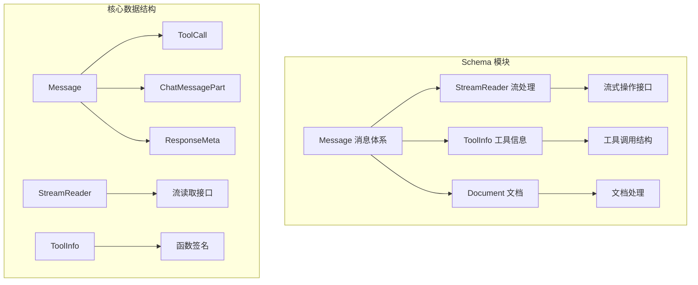
```mermaid
graph TB
    subgraph "Schema 模块"
        A[Message 消息体系] --> B[StreamReader 流处理]
        A --> C[ToolInfo 工具信息]
        A --> D[Document 文档]
        B --> E[流式操作接口]
        C --> F[工具调用结构]
        D --> G[文档处理]
    end
    
    subgraph "核心数据结构"
        H[Message] --> I[ToolCall]
        H --> J[ChatMessagePart]
        H --> K[ResponseMeta]
        L[StreamReader] --> M[流读取接口]
        N[ToolInfo] --> O[函数签名]
    end
```

### 1.2 核心接口与实现

#### 1.2.1 Message 消息系统

**接口定义：**
```go
// Message 是框架中的核心消息结构
type Message struct {
    Role    RoleType `json:"role"`    // 消息角色
    Content string   `json:"content"` // 消息内容
    
    // 多媒体内容支持
    MultiContent []ChatMessagePart `json:"multi_content,omitempty"`
    
    // 工具调用相关
    ToolCalls  []ToolCall `json:"tool_calls,omitempty"`
    ToolCallID string     `json:"tool_call_id,omitempty"`
    ToolName   string     `json:"tool_name,omitempty"`
    
    // 响应元数据
    ResponseMeta *ResponseMeta `json:"response_meta,omitempty"`
    
    // 推理内容（思维链）
    ReasoningContent string `json:"reasoning_content,omitempty"`
    
    // 扩展字段
    Extra map[string]any `json:"extra,omitempty"`
}
```

**关键函数实现：**

```go
// ConcatMessages 合并消息流 - 核心流处理函数
func ConcatMessages(msgs []*Message) (*Message, error) {
    var (
        contents            []string
        contentLen          int
        reasoningContents   []string
        reasoningContentLen int
        toolCalls           []ToolCall
        ret                 = Message{}
        extraList           = make([]map[string]any, 0, len(msgs))
    )

    // 1. 验证消息一致性
    for idx, msg := range msgs {
        if msg == nil {
            return nil, fmt.Errorf("unexpected nil chunk in message stream, index: %d", idx)
        }

        // 验证角色一致性
        if msg.Role != "" {
            if ret.Role == "" {
                ret.Role = msg.Role
            } else if ret.Role != msg.Role {
                return nil, fmt.Errorf("cannot concat messages with different roles: '%s' '%s'", ret.Role, msg.Role)
            }
        }
        
        // 收集内容
        if msg.Content != "" {
            contents = append(contents, msg.Content)
            contentLen += len(msg.Content)
        }
        
        // 收集工具调用
        if len(msg.ToolCalls) > 0 {
            toolCalls = append(toolCalls, msg.ToolCalls...)
        }
    }

    // 2. 合并内容
    if len(contents) > 0 {
        var sb strings.Builder
        sb.Grow(contentLen)
        for _, content := range contents {
            sb.WriteString(content)
        }
        ret.Content = sb.String()
    }

    // 3. 合并工具调用
    if len(toolCalls) > 0 {
        merged, err := concatToolCalls(toolCalls)
        if err != nil {
            return nil, err
        }
        ret.ToolCalls = merged
    }

    return &ret, nil
}
```

#### 1.2.2 StreamReader 流处理系统

**接口定义：**
```go
// StreamReader 流式读取器
type StreamReader[T any] struct {
    // 内部通道和状态管理
    ch     <-chan streamFrame[T]
    closed bool
    mu     sync.Mutex
}

// 核心方法
func (sr *StreamReader[T]) Recv() (T, error)
func (sr *StreamReader[T]) Close() error
```

**关键实现分析：**

```go
// Recv 接收下一个流元素
func (sr *StreamReader[T]) Recv() (T, error) {
    sr.mu.Lock()
    defer sr.mu.Unlock()
    
    if sr.closed {
        var zero T
        return zero, io.EOF
    }
    
    frame, ok := <-sr.ch
    if !ok {
        sr.closed = true
        var zero T
        return zero, io.EOF
    }
    
    if frame.err != nil {
        return frame.data, frame.err
    }
    
    return frame.data, nil
}

// StreamReaderFromArray 从数组创建流读取器
func StreamReaderFromArray[T any](items []T) *StreamReader[T] {
    ch := make(chan streamFrame[T], len(items))
    
    for _, item := range items {
        ch <- streamFrame[T]{data: item}
    }
    close(ch)
    
    return &StreamReader[T]{ch: ch}
}
```

### 1.3 模块时序图

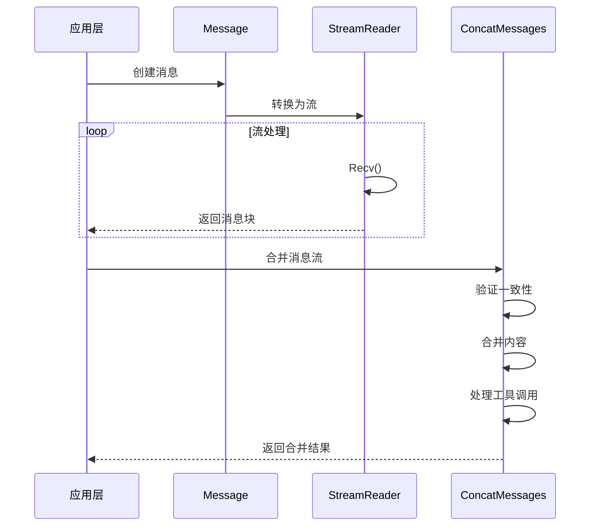
```mermaid
sequenceDiagram
    participant App as 应用层
    participant Msg as Message
    participant Stream as StreamReader
    participant Concat as ConcatMessages
    
    App->>Msg: 创建消息
    Msg->>Stream: 转换为流
    
    loop 流处理
        Stream->>Stream: Recv()
        Stream-->>App: 返回消息块
    end
    
    App->>Concat: 合并消息流
    Concat->>Concat: 验证一致性
    Concat->>Concat: 合并内容
    Concat->>Concat: 处理工具调用
    Concat-->>App: 返回合并结果
```

## 2. Components 模块 - 组件抽象层

### 2.1 模块架构图

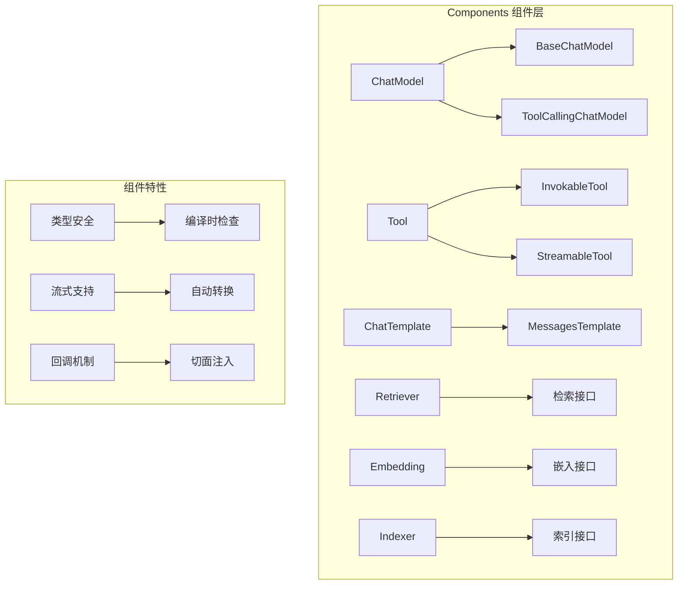
```mermaid
graph TB
    subgraph "Components 组件层"
        A[ChatModel] --> B[BaseChatModel]
        A --> C[ToolCallingChatModel]
        D[Tool] --> E[InvokableTool]
        D --> F[StreamableTool]
        G[ChatTemplate] --> H[MessagesTemplate]
        I[Retriever] --> J[检索接口]
        K[Embedding] --> L[嵌入接口]
        M[Indexer] --> N[索引接口]
    end
    
    subgraph "组件特性"
        O[类型安全] --> P[编译时检查]
        Q[流式支持] --> R[自动转换]
        S[回调机制] --> T[切面注入]
    end
```

### 2.2 ChatModel 组件详解

#### 2.2.1 接口定义

```go
// BaseChatModel 基础聊天模型接口
type BaseChatModel interface {
    Generate(ctx context.Context, input []*schema.Message, opts ...Option) (*schema.Message, error)
    Stream(ctx context.Context, input []*schema.Message, opts ...Option) (*schema.StreamReader[*schema.Message], error)
}

// ToolCallingChatModel 支持工具调用的聊天模型
type ToolCallingChatModel interface {
    BaseChatModel
    WithTools(tools []*schema.ToolInfo) (ToolCallingChatModel, error)
}
```

#### 2.2.2 调用链路分析

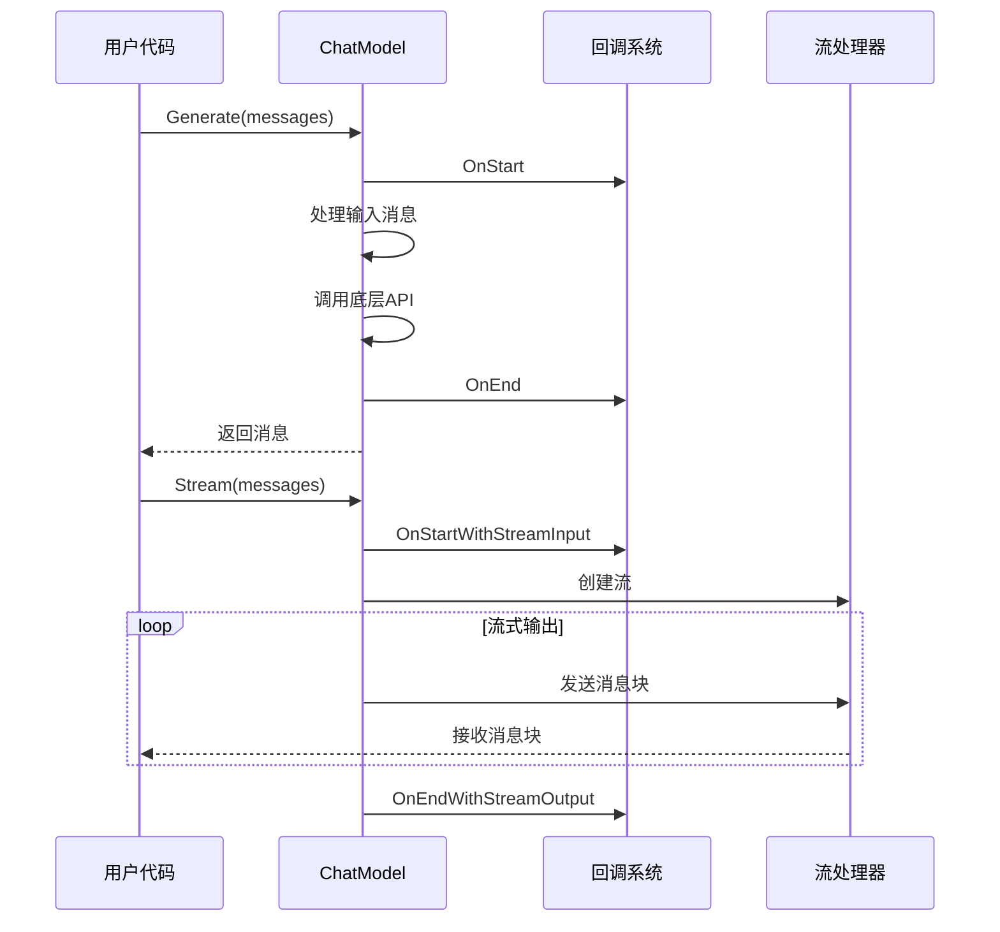
```mermaid
sequenceDiagram
    participant User as 用户代码
    participant Model as ChatModel
    participant Callback as 回调系统
    participant Stream as 流处理器
    
    User->>Model: Generate(messages)
    Model->>Callback: OnStart
    Model->>Model: 处理输入消息
    Model->>Model: 调用底层API
    Model->>Callback: OnEnd
    Model-->>User: 返回消息
    
    User->>Model: Stream(messages)
    Model->>Callback: OnStartWithStreamInput
    Model->>Stream: 创建流
    
    loop 流式输出
        Model->>Stream: 发送消息块
        Stream-->>User: 接收消息块
    end
    
    Model->>Callback: OnEndWithStreamOutput
```

### 2.3 Tool 组件详解

#### 2.3.1 接口定义与实现

```go
// InvokableTool 可调用工具接口
type InvokableTool interface {
    BaseTool
    InvokableRun(ctx context.Context, argumentsInJSON string, opts ...Option) (string, error)
}

// StreamableTool 流式工具接口  
type StreamableTool interface {
    BaseTool
    StreamableRun(ctx context.Context, argumentsInJSON string, opts ...Option) (*schema.StreamReader[string], error)
}
```

#### 2.3.2 工具执行流程

```go
// 工具执行的核心逻辑
func (tn *ToolsNode) Invoke(ctx context.Context, input *schema.Message, opts ...ToolsNodeOption) ([]*schema.Message, error) {
    // 1. 解析工具调用
    tasks, err := tn.genToolCallTasks(ctx, tn.tuple, input, opt.executedTools, false)
    if err != nil {
        return nil, err
    }

    // 2. 执行工具（并行或串行）
    if tn.executeSequentially {
        sequentialRunToolCall(ctx, runToolCallTaskByInvoke, tasks, opt.ToolOptions...)
    } else {
        parallelRunToolCall(ctx, runToolCallTaskByInvoke, tasks, opt.ToolOptions...)
    }

    // 3. 收集结果
    output := make([]*schema.Message, len(tasks))
    for i, task := range tasks {
        if task.err != nil {
            return nil, fmt.Errorf("tool execution failed: %w", task.err)
        }
        output[i] = schema.ToolMessage(task.output, task.callID, schema.WithToolName(task.name))
    }

    return output, nil
}
```

### 2.4 ChatTemplate 组件详解

#### 2.4.1 模板系统架构

```go
// ChatTemplate 聊天模板接口
type ChatTemplate interface {
    Format(ctx context.Context, vs map[string]any, opts ...Option) ([]*schema.Message, error)
}

// 支持的模板格式
type FormatType uint8

const (
    FString    FormatType = 0  // Python 风格格式化
    GoTemplate FormatType = 1  // Go 标准模板
    Jinja2     FormatType = 2  // Jinja2 模板
)
```

#### 2.4.2 模板处理流程

```go
// formatContent 格式化内容的核心函数
func formatContent(content string, vs map[string]any, formatType FormatType) (string, error) {
    switch formatType {
    case FString:
        return pyfmt.Fmt(content, vs)
    case GoTemplate:
        parsedTmpl, err := template.New("template").
            Option("missingkey=error").
            Parse(content)
        if err != nil {
            return "", err
        }
        sb := new(strings.Builder)
        err = parsedTmpl.Execute(sb, vs)
        return sb.String(), err
    case Jinja2:
        env, err := getJinjaEnv()
        if err != nil {
            return "", err
        }
        tpl, err := env.FromString(content)
        if err != nil {
            return "", err
        }
        return tpl.Execute(vs)
    default:
        return "", fmt.Errorf("unknown format type: %v", formatType)
    }
}
```

## 3. Compose 模块 - 编排框架核心

### 3.1 职责与边界

#### 负责
- **编排能力**: 提供 Chain、Graph、Workflow 三种编排模式
- **类型安全**: 编译时和运行时的类型检查与转换
- **流式处理**: 自动处理流的合并、分发、转换
- **执行引擎**: 提供高性能的图执行引擎
- **状态管理**: 支持有状态的图执行
- **回调机制**: 集成切面编程能力

#### 不负责
- **具体组件实现**: 不实现具体的 LLM、工具等组件
- **网络通信**: 不处理外部服务调用
- **持久化**: 不负责数据持久化存储
- **业务逻辑**: 不包含特定领域的业务逻辑

#### 依赖
- **Schema**: 数据结构定义 (`schema` 包)
- **Components**: 组件接口定义 (`components` 包)
- **Internal**: 内部工具函数 (`internal` 包)
- **Callbacks**: 回调机制 (`callbacks` 包)

#### 数据契约
- **输入**: 泛型类型 I，支持任意类型
- **输出**: 泛型类型 O，支持任意类型
- **流式**: `*schema.StreamReader[T]` 流式数据
- **选项**: `Option` 类型的配置选项

### 3.2 模块架构图

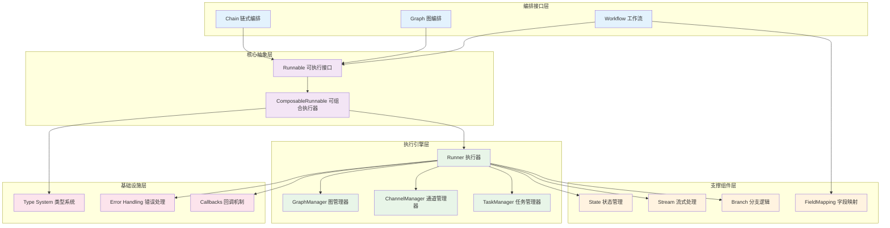
```mermaid
graph TD
    subgraph "编排接口层"
        Chain[Chain 链式编排]
        Graph[Graph 图编排]
        Workflow[Workflow 工作流]
    end
    
    subgraph "核心抽象层"
        Runnable[Runnable 可执行接口]
        ComposableRunnable[ComposableRunnable 可组合执行器]
    end
    
    subgraph "执行引擎层"
        Runner[Runner 执行器]
        GraphManager[GraphManager 图管理器]
        ChannelManager[ChannelManager 通道管理器]
        TaskManager[TaskManager 任务管理器]
    end
    
    subgraph "支撑组件层"
        State[State 状态管理]
        Stream[Stream 流式处理]
        Branch[Branch 分支逻辑]
        FieldMapping[FieldMapping 字段映射]
    end
    
    subgraph "基础设施层"
        TypeSystem[Type System 类型系统]
        ErrorHandling[Error Handling 错误处理]
        Callbacks[Callbacks 回调机制]
    end
    
    %% 编排接口层关系
    Chain --> Runnable
    Graph --> Runnable
    Workflow --> Runnable
    
    %% 核心抽象层关系
    Runnable --> ComposableRunnable
    ComposableRunnable --> Runner
    
    %% 执行引擎层关系
    Runner --> GraphManager
    Runner --> ChannelManager
    Runner --> TaskManager
    
    %% 支撑组件层关系
    Runner --> State
    Runner --> Stream
    Runner --> Branch
    Workflow --> FieldMapping
    
    %% 基础设施层关系
    ComposableRunnable --> TypeSystem
    Runner --> ErrorHandling
    Runner --> Callbacks
    
    classDef interface fill:#e3f2fd
    classDef core fill:#f3e5f5
    classDef engine fill:#e8f5e8
    classDef support fill:#fff3e0
    classDef infra fill:#fce4ec
    
    class Chain,Graph,Workflow interface
    class Runnable,ComposableRunnable core
    class Runner,GraphManager,ChannelManager,TaskManager engine
    class State,Stream,Branch,FieldMapping support
    class TypeSystem,ErrorHandling,Callbacks infra
```

### 3.3 主要时序

#### 编译时序图

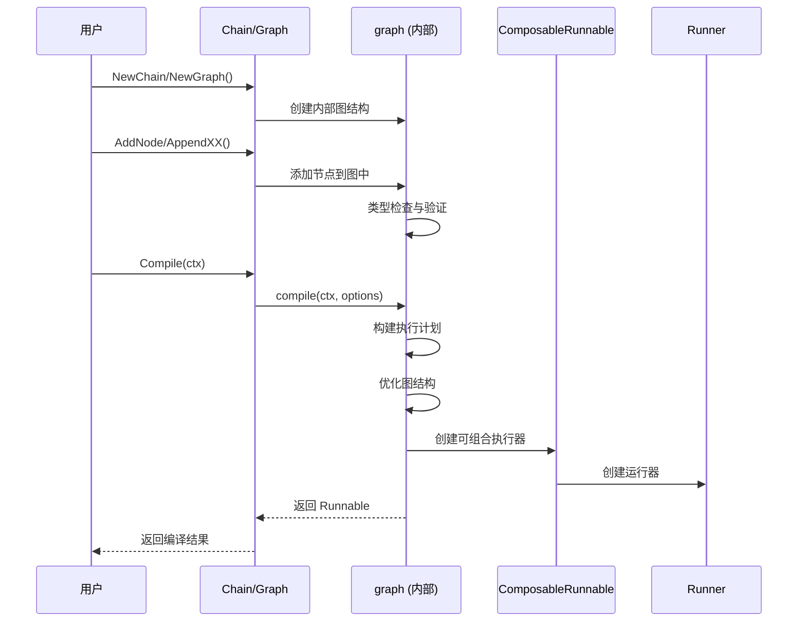
```mermaid
sequenceDiagram
    participant U as 用户
    participant C as Chain/Graph
    participant G as graph (内部)
    participant CR as ComposableRunnable
    participant R as Runner
    
    U->>C: NewChain/NewGraph()
    C->>G: 创建内部图结构
    
    U->>C: AddNode/AppendXX()
    C->>G: 添加节点到图中
    G->>G: 类型检查与验证
    
    U->>C: Compile(ctx)
    C->>G: compile(ctx, options)
    G->>G: 构建执行计划
    G->>G: 优化图结构
    G->>CR: 创建可组合执行器
    CR->>R: 创建运行器
    G-->>C: 返回 Runnable
    C-->>U: 返回编译结果
```

#### 执行时序图

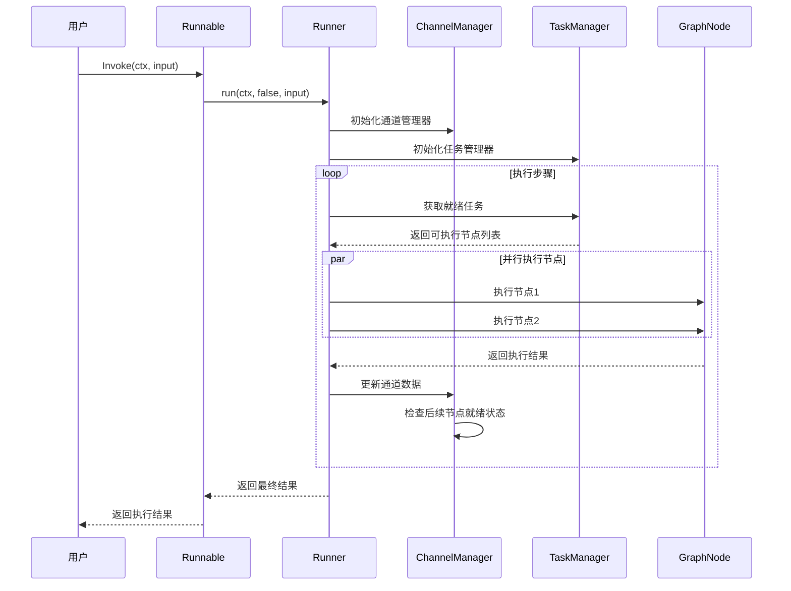
```mermaid
sequenceDiagram
    participant U as 用户
    participant R as Runnable
    participant Runner as Runner
    participant CM as ChannelManager
    participant TM as TaskManager
    participant Node as GraphNode
    
    U->>R: Invoke(ctx, input)
    R->>Runner: run(ctx, false, input)
    Runner->>CM: 初始化通道管理器
    Runner->>TM: 初始化任务管理器
    
    loop 执行步骤
        Runner->>TM: 获取就绪任务
        TM-->>Runner: 返回可执行节点列表
        
        par 并行执行节点
            Runner->>Node: 执行节点1
            Runner->>Node: 执行节点2
        end
        
        Node-->>Runner: 返回执行结果
        Runner->>CM: 更新通道数据
        CM->>CM: 检查后续节点就绪状态
    end
    
    Runner-->>R: 返回最终结果
    R-->>U: 返回执行结果
```

### 3.4 提供的接口

#### 对外接口 (Public API)

| 接口类型 | 方法 | 参数 | 返回值 | 说明 |
|---------|------|------|--------|------|
| **Chain** | `NewChain[I,O]` | `opts ...NewGraphOption` | `*Chain[I,O]` | 创建链式编排 |
| | `AppendChatModel` | `model, opts` | `*Chain[I,O]` | 添加聊天模型 |
| | `AppendChatTemplate` | `template, opts` | `*Chain[I,O]` | 添加聊天模板 |
| | `Compile` | `ctx, opts` | `Runnable[I,O], error` | 编译为可执行对象 |
| **Graph** | `NewGraph[I,O]` | `opts ...NewGraphOption` | `*Graph[I,O]` | 创建图编排 |
| | `AddChatModelNode` | `key, model, opts` | `error` | 添加聊天模型节点 |
| | `AddEdge` | `from, to, opts` | `error` | 添加边 |
| | `AddBranch` | `from, branch, opts` | `error` | 添加分支 |
| | `Compile` | `ctx, opts` | `Runnable[I,O], error` | 编译为可执行对象 |
| **Workflow** | `NewWorkflow[I,O]` | `opts ...NewGraphOption` | `*Workflow[I,O]` | 创建工作流 |
| | `AddChatModelNode` | `key, model, opts` | `*WorkflowNode` | 添加聊天模型节点 |
| | `End` | - | `*WorkflowNode` | 设置结束节点 |
| **Runnable** | `Invoke` | `ctx, input, opts` | `output, error` | 同步执行 |
| | `Stream` | `ctx, input, opts` | `*StreamReader[O], error` | 流式执行 |
| | `Collect` | `ctx, input, opts` | `output, error` | 收集流式输入 |
| | `Transform` | `ctx, input, opts` | `*StreamReader[O], error` | 流式转换 |

#### 对内接口 (Internal API)

| 接口类型 | 方法 | 说明 | 文件位置 |
|---------|------|------|----------|
| **composableRunnable** | `i invoke` | 同步执行函数 | `runnable.go:47` |
| | `t transform` | 流式转换函数 | `runnable.go:48` |
| **runner** | `run` | 核心执行逻辑 | `graph_run.go:107` |
| **channel** | `reportValues` | 报告执行结果 | `graph_manager.go:30` |
| | `get` | 获取通道数据 | `graph_manager.go:33` |

### 3.5 入口函数清单

| 入口函数 | 文件/行号 | 签名 | 说明 |
|---------|----------|------|------|
| `NewChain` | `chain.go:37` | `func NewChain[I, O any](opts ...NewGraphOption) *Chain[I, O]` | 创建链式编排 |
| `NewGraph` | `generic_graph.go:68` | `func NewGraph[I, O any](opts ...NewGraphOption) *Graph[I, O]` | 创建图编排 |
| `NewWorkflow` | `workflow.go:61` | `func NewWorkflow[I, O any](opts ...NewGraphOption) *Workflow[I, O]` | 创建工作流 |
| `NewToolNode` | `tool_node.go:119` | `func NewToolNode(ctx context.Context, conf *ToolsNodeConfig) (*ToolsNode, error)` | 创建工具节点 |

### 3.6 关键路径与关键函数

#### 关键路径图

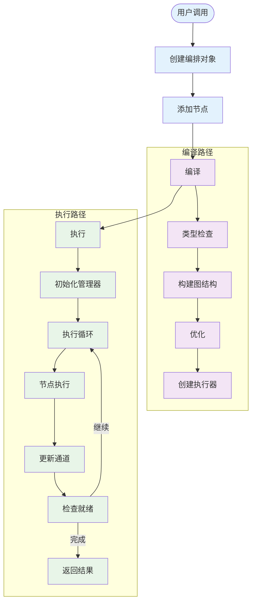
```mermaid
flowchart TD
    Start([用户调用]) --> Create[创建编排对象]
    Create --> AddNodes[添加节点]
    AddNodes --> Compile[编译]
    Compile --> Execute[执行]
    
    subgraph "编译路径"
        Compile --> TypeCheck[类型检查]
        TypeCheck --> BuildGraph[构建图结构]
        BuildGraph --> Optimize[优化]
        Optimize --> CreateRunner[创建执行器]
    end
    
    subgraph "执行路径"
        Execute --> InitManagers[初始化管理器]
        InitManagers --> RunLoop[执行循环]
        RunLoop --> NodeExec[节点执行]
        NodeExec --> UpdateChannels[更新通道]
        UpdateChannels --> CheckReady[检查就绪]
        CheckReady --> |继续| RunLoop
        CheckReady --> |完成| Return[返回结果]
    end
    
    classDef userAction fill:#e3f2fd
    classDef compilePhase fill:#f3e5f5
    classDef executePhase fill:#e8f5e8
    
    class Start,Create,AddNodes userAction
    class Compile,TypeCheck,BuildGraph,Optimize,CreateRunner compilePhase
    class Execute,InitManagers,RunLoop,NodeExec,UpdateChannels,CheckReady,Return executePhase
```

### 3.7 Graph 图式编排详解

#### 3.2.1 Graph 核心结构

```go
type graph struct {
    // 节点管理
    nodes        map[string]*graphNode     // 节点映射表
    controlEdges map[string][]string      // 控制依赖边
    dataEdges    map[string][]string      // 数据流边
    branches     map[string][]*GraphBranch // 分支条件
    
    // 执行控制
    startNodes   []string                 // 起始节点
    endNodes     []string                 // 结束节点
    
    // 类型系统
    expectedInputType  reflect.Type       // 期望输入类型
    expectedOutputType reflect.Type       // 期望输出类型
    
    // 状态管理
    stateType      reflect.Type           // 状态类型
    stateGenerator func(ctx context.Context) any // 状态生成器
}
```

#### 3.2.2 Graph 编译过程

```go
func (g *graph) compile(ctx context.Context, opt *graphCompileOptions) (*composableRunnable, error) {
    // 1. 验证图结构
    if len(g.startNodes) == 0 {
        return nil, errors.New("start node not set")
    }
    if len(g.endNodes) == 0 {
        return nil, errors.New("end node not set")
    }

    // 2. 类型检查 - 确保节点间类型兼容
    for startNode, endNodes := range g.toValidateMap {
        for _, endNodeInfo := range endNodes {
            startType := g.getNodeOutputType(startNode)
            endType := g.getNodeInputType(endNodeInfo.endNode)
            
            result := checkAssignable(startType, endType)
            if result == assignableTypeMustNot {
                return nil, fmt.Errorf("type mismatch: %s -> %s", startType, endType)
            }
        }
    }

    // 3. 构建执行器
    runner := &runner{
        chanSubscribeTo:     chanSubscribeTo,
        controlPredecessors: controlPredecessors,
        dataPredecessors:    dataPredecessors,
        inputChannels:       inputChannels,
        // ... 其他配置
    }

    // 4. 返回可执行对象
    return runner.toComposableRunnable(), nil
}
```

#### 3.2.3 Graph 执行时序

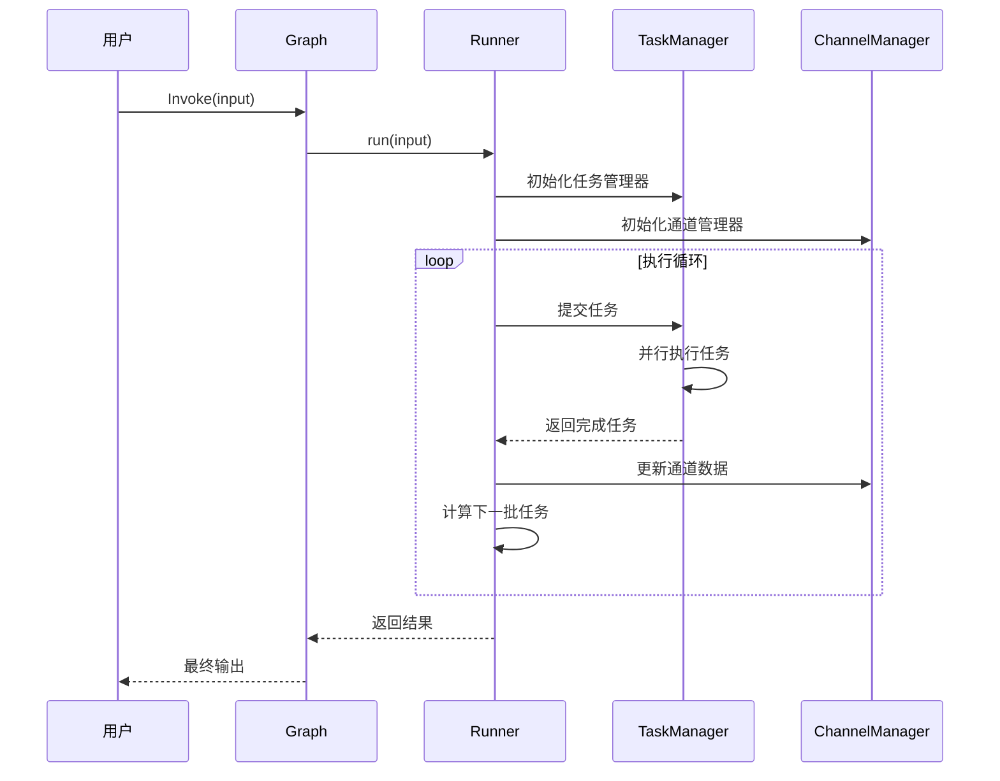
```mermaid
sequenceDiagram
    participant User as 用户
    participant Graph as Graph
    participant Runner as Runner
    participant TaskMgr as TaskManager
    participant ChanMgr as ChannelManager
    
    User->>Graph: Invoke(input)
    Graph->>Runner: run(input)
    Runner->>TaskMgr: 初始化任务管理器
    Runner->>ChanMgr: 初始化通道管理器
    
    loop 执行循环
        Runner->>TaskMgr: 提交任务
        TaskMgr->>TaskMgr: 并行执行任务
        TaskMgr-->>Runner: 返回完成任务
        Runner->>ChanMgr: 更新通道数据
        Runner->>Runner: 计算下一批任务
    end
    
    Runner-->>Graph: 返回结果
    Graph-->>User: 最终输出
```

### 3.3 Runner 执行引擎详解

#### 3.3.1 Runner 核心结构

```go
type runner struct {
    // 图结构
    chanSubscribeTo     map[string]*chanCall      // 通道订阅映射
    controlPredecessors map[string][]string       // 控制前驱
    dataPredecessors    map[string][]string       // 数据前驱
    
    // 执行控制
    eager         bool                           // 是否急切执行
    dag           bool                           // 是否为DAG模式
    
    // 处理器管理
    edgeHandlerManager      *edgeHandlerManager      // 边处理器
    preNodeHandlerManager   *preNodeHandlerManager   // 节点前处理器
    preBranchHandlerManager *preBranchHandlerManager // 分支前处理器
}
```

#### 3.3.2 Runner 执行主循环

```go
func (r *runner) run(ctx context.Context, isStream bool, input any, opts ...Option) (result any, err error) {
    // 初始化管理器
    cm := r.initChannelManager(isStream)
    tm := r.initTaskManager(runWrapper, getGraphCancel(ctx), opts...)
    
    // 计算初始任务
    nextTasks, result, isEnd, err := r.calculateNextTasks(ctx, []*task{{
        nodeKey: START,
        call:    r.inputChannels,
        output:  input,
    }}, isStream, cm, optMap)
    
    if isEnd {
        return result, nil
    }

    // 主执行循环
    for step := 0; ; step++ {
        // 检查上下文取消
        select {
        case <-ctx.Done():
            return nil, newGraphRunError(ctx.Err())
        default:
        }
        
        // 提交任务
        err = tm.submit(nextTasks)
        if err != nil {
            return nil, newGraphRunError(err)
        }

        // 等待任务完成
        completedTasks, canceled, canceledTasks := tm.wait()
        
        // 处理中断
        if canceled {
            return nil, r.handleInterrupt(ctx, ...)
        }

        // 计算下一批任务
        nextTasks, result, isEnd, err = r.calculateNextTasks(ctx, completedTasks, isStream, cm, optMap)
        if err != nil {
            return nil, newGraphRunError(err)
        }
        
        if isEnd {
            return result, nil
        }
    }
}
```

### 3.4 Chain 链式编排详解

#### 3.4.1 Chain 结构与实现

```go
type Chain[I, O any] struct {
    gg *Graph[I, O]  // 底层使用 Graph 实现
    
    nodeIdx     int      // 节点索引
    preNodeKeys []string // 前置节点键
    hasEnd      bool     // 是否已添加结束边
}

// AppendChatModel 添加聊天模型节点
func (c *Chain[I, O]) AppendChatModel(node model.BaseChatModel, opts ...GraphAddNodeOpt) *Chain[I, O] {
    gNode, options := toChatModelNode(node, opts...)
    c.addNode(gNode, options)
    return c
}

// addNode 添加节点的核心逻辑
func (c *Chain[I, O]) addNode(node *graphNode, options *graphAddNodeOpts) {
    nodeKey := c.nextNodeKey()
    
    // 添加节点到底层图
    err := c.gg.addNode(nodeKey, node, options)
    if err != nil {
        c.reportError(err)
        return
    }

    // 连接前置节点
    if len(c.preNodeKeys) == 0 {
        c.preNodeKeys = append(c.preNodeKeys, START)
    }

    for _, preNodeKey := range c.preNodeKeys {
        err := c.gg.AddEdge(preNodeKey, nodeKey)
        if err != nil {
            c.reportError(err)
            return
        }
    }

    c.preNodeKeys = []string{nodeKey}
}
```

### 3.5 Workflow 工作流编排详解

#### 3.5.1 Workflow 核心特性

```go
type Workflow[I, O any] struct {
    g                *graph                    // 底层图
    workflowNodes    map[string]*WorkflowNode  // 工作流节点
    dependencies     map[string]map[string]dependencyType // 依赖关系
}

type WorkflowNode struct {
    key              string                    // 节点键
    addInputs        []func() error           // 输入添加函数
    staticValues     map[string]any           // 静态值
    mappedFieldPath  map[string]any           // 字段映射路径
}
```

#### 3.5.2 字段映射机制

```go
// AddInput 添加输入映射
func (n *WorkflowNode) AddInput(fromNodeKey string, inputs ...*FieldMapping) *WorkflowNode {
    return n.addDependencyRelation(fromNodeKey, inputs, &workflowAddInputOpts{})
}

// 字段映射的核心实现
func fieldMap(mappings []*FieldMapping, isStream bool, uncheckedSourcePaths []FieldPath) func(any) (any, error) {
    return func(input any) (any, error) {
        result := make(map[string]any)
        
        for _, mapping := range mappings {
            // 从源路径提取值
            sourceValue, err := extractValueByPath(input, mapping.from)
            if err != nil {
                return nil, err
            }
            
            // 设置到目标路径
            err = setValueByPath(result, mapping.to, sourceValue)
            if err != nil {
                return nil, err
            }
        }
        
        return result, nil
    }
}
```

## 4. Callbacks 模块 - 回调系统

### 4.1 回调系统架构

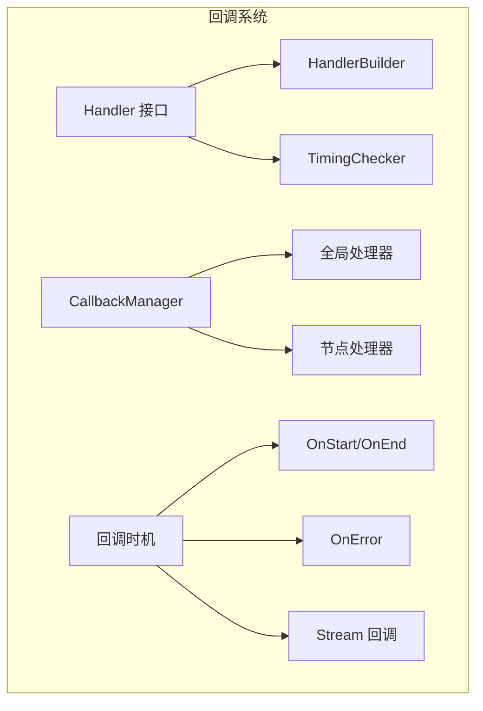
```mermaid
graph TB
    subgraph "回调系统"
        A[Handler 接口] --> B[HandlerBuilder]
        A --> C[TimingChecker]
        D[CallbackManager] --> E[全局处理器]
        D --> F[节点处理器]
        G[回调时机] --> H[OnStart/OnEnd]
        G --> I[OnError]
        G --> J[Stream 回调]
    end
```

### 4.2 回调接口定义

```go
// Handler 回调处理器接口
type Handler interface {
    OnStart(ctx context.Context, info *RunInfo, input CallbackInput) context.Context
    OnEnd(ctx context.Context, info *RunInfo, output CallbackOutput) context.Context
    OnError(ctx context.Context, info *RunInfo, err error) context.Context
    OnStartWithStreamInput(ctx context.Context, info *RunInfo, input CallbackInput) context.Context
    OnEndWithStreamOutput(ctx context.Context, info *RunInfo, output CallbackOutput) context.Context
}

// TimingChecker 时机检查器
type TimingChecker interface {
    NeedTiming(timing CallbackTiming) bool
}
```

### 4.3 回调执行流程

```go
// 回调执行的核心逻辑
func executeWithCallbacks[I, O any](
    ctx context.Context,
    executor func(context.Context, I) (O, error),
    input I,
    handlers []Handler,
) (O, error) {
    // 1. 执行 OnStart 回调
    for _, handler := range handlers {
        if checker, ok := handler.(TimingChecker); ok {
            if !checker.NeedTiming(TimingOnStart) {
                continue
            }
        }
        ctx = handler.OnStart(ctx, runInfo, input)
    }

    // 2. 执行主逻辑
    output, err := executor(ctx, input)

    // 3. 执行回调
    if err != nil {
        // 错误回调
        for _, handler := range handlers {
            ctx = handler.OnError(ctx, runInfo, err)
        }
    } else {
        // 成功回调
        for _, handler := range handlers {
            ctx = handler.OnEnd(ctx, runInfo, output)
        }
    }

    return output, err
}
```

## 5. ADK 模块 - Agent 开发工具包

### 5.1 职责与边界

#### 负责
- **Agent 抽象**: 定义统一的智能体接口和生命周期
- **智能体实现**: 提供 ChatModel Agent、ReAct Agent 等基础实现
- **多智能体协调**: 支持智能体间的转移和协作
- **状态管理**: 管理智能体运行时状态和会话信息
- **中断恢复**: 支持智能体执行的中断和恢复机制
- **工具集成**: 将智能体包装为可调用的工具

#### 不负责
- **具体模型实现**: 不实现具体的 LLM 模型
- **工具具体实现**: 不实现具体的工具逻辑
- **网络通信**: 不处理外部服务调用
- **UI 交互**: 不处理用户界面逻辑

#### 依赖
- **Compose**: 编排框架 (`compose` 包)
- **Components**: 组件接口 (`components/model`, `components/tool`)
- **Schema**: 数据结构 (`schema` 包)
- **Callbacks**: 回调机制 (`callbacks` 包)

#### 数据契约
- **输入**: `AgentInput` (消息列表 + 流式标志)
- **输出**: `AgentEvent` (智能体事件流)
- **状态**: `State` (运行时状态信息)
- **动作**: `AgentAction` (智能体动作指令)

### 5.2 ADK 架构图


```mermaid
graph TD
    subgraph "智能体接口层"
        Agent[Agent 智能体接口]
        Runner[Runner 运行器]
        ResumableAgent[ResumableAgent 可恢复智能体]
    end
    
    subgraph "智能体实现层"
        ChatModelAgent[ChatModelAgent 聊天模型智能体]
        FlowAgent[FlowAgent 流程智能体]
        WorkflowAgent[WorkflowAgent 工作流智能体]
        ReactAgent[ReactAgent ReAct智能体]
    end
    
    subgraph "协调机制层"
        SubAgentManager[SubAgent Manager 子智能体管理]
        TransferMechanism[Transfer Mechanism 转移机制]
        HistoryRewriter[History Rewriter 历史重写]
    end
    
    subgraph "状态管理层"
        State[State 状态管理]
        SessionValues[Session Values 会话值]
        CheckPointStore[CheckPoint Store 检查点存储]
        InterruptInfo[Interrupt Info 中断信息]
    end
    
    subgraph "工具集成层"
        AgentTool[Agent Tool 智能体工具]
        ToolsConfig[Tools Config 工具配置]
        ExitTool[Exit Tool 退出工具]
    end
    
    subgraph "异步处理层"
        AsyncIterator[AsyncIterator 异步迭代器]
        AsyncGenerator[AsyncGenerator 异步生成器]
        EventStream[Event Stream 事件流]
    end
    
    %% 接口层关系
    Agent --> ChatModelAgent
    Agent --> FlowAgent
    Runner --> Agent
    ResumableAgent --> Agent
    
    %% 实现层关系
    FlowAgent --> WorkflowAgent
    FlowAgent --> ReactAgent
    ChatModelAgent --> State
    
    %% 协调机制关系
    FlowAgent --> SubAgentManager
    FlowAgent --> TransferMechanism
    FlowAgent --> HistoryRewriter
    
    %% 状态管理关系
    Runner --> CheckPointStore
    Agent --> SessionValues
    ResumableAgent --> InterruptInfo
    
    %% 工具集成关系
    ChatModelAgent --> ToolsConfig
    AgentTool --> Agent
    
    %% 异步处理关系
    Runner --> AsyncIterator
    Agent --> AsyncGenerator
    AsyncIterator --> EventStream
    
    classDef interface fill:#e3f2fd
    classDef implementation fill:#f3e5f5
    classDef coordination fill:#e8f5e8
    classDef state fill:#fff3e0
    classDef tool fill:#fce4ec
    classDef async fill:#f1f8e9
    
    class Agent,Runner,ResumableAgent interface
    class ChatModelAgent,FlowAgent,WorkflowAgent,ReactAgent implementation
    class SubAgentManager,TransferMechanism,HistoryRewriter coordination
    class State,SessionValues,CheckPointStore,InterruptInfo state
    class AgentTool,ToolsConfig,ExitTool tool
    class AsyncIterator,AsyncGenerator,EventStream async
```

### 5.3 主要时序

#### ChatModel Agent 执行时序

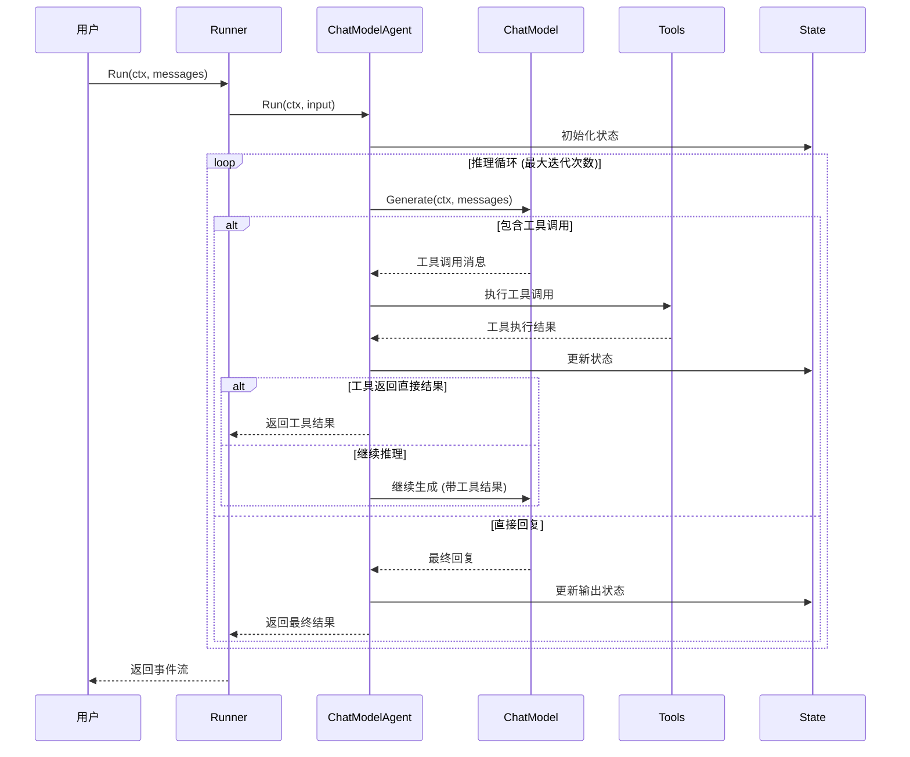
```mermaid
sequenceDiagram
    participant U as 用户
    participant R as Runner
    participant CMA as ChatModelAgent
    participant M as ChatModel
    participant T as Tools
    participant S as State
    
    U->>R: Run(ctx, messages)
    R->>CMA: Run(ctx, input)
    CMA->>S: 初始化状态
    
    loop 推理循环 (最大迭代次数)
        CMA->>M: Generate(ctx, messages)
        
        alt 包含工具调用
            M-->>CMA: 工具调用消息
            CMA->>T: 执行工具调用
            T-->>CMA: 工具执行结果
            CMA->>S: 更新状态
            
            alt 工具返回直接结果
                CMA-->>R: 返回工具结果
            else 继续推理
                CMA->>M: 继续生成 (带工具结果)
            end
        else 直接回复
            M-->>CMA: 最终回复
            CMA->>S: 更新输出状态
            CMA-->>R: 返回最终结果
        end
    end
    
    R-->>U: 返回事件流
```

#### 多智能体转移时序

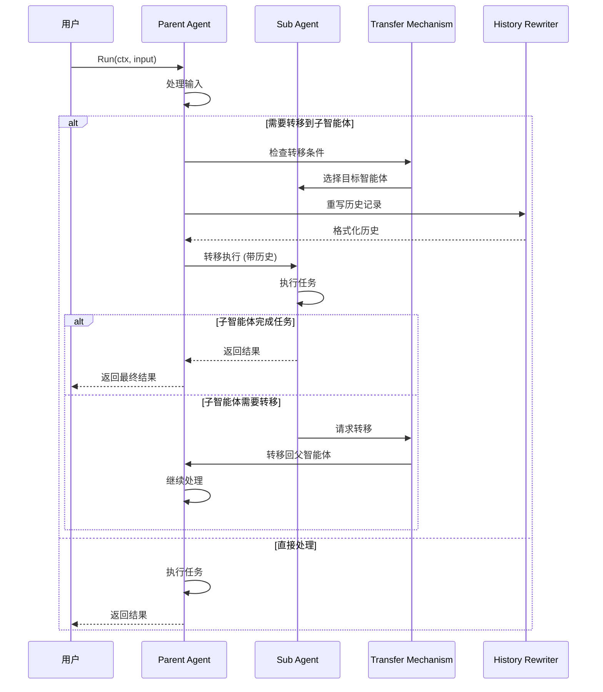
```mermaid
sequenceDiagram
    participant U as 用户
    participant PA as Parent Agent
    participant SA as Sub Agent
    participant TM as Transfer Mechanism
    participant HR as History Rewriter
    
    U->>PA: Run(ctx, input)
    PA->>PA: 处理输入
    
    alt 需要转移到子智能体
        PA->>TM: 检查转移条件
        TM->>SA: 选择目标智能体
        PA->>HR: 重写历史记录
        HR-->>PA: 格式化历史
        PA->>SA: 转移执行 (带历史)
        
        SA->>SA: 执行任务
        
        alt 子智能体完成任务
            SA-->>PA: 返回结果
            PA-->>U: 返回最终结果
        else 子智能体需要转移
            SA->>TM: 请求转移
            TM->>PA: 转移回父智能体
            PA->>PA: 继续处理
        end
    else 直接处理
        PA->>PA: 执行任务
        PA-->>U: 返回结果
    end
```

#### 中断恢复时序

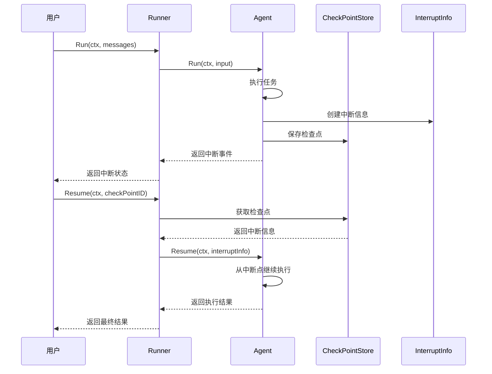
```mermaid
sequenceDiagram
    participant U as 用户
    participant R as Runner
    participant A as Agent
    participant CS as CheckPointStore
    participant II as InterruptInfo
    
    %% 正常执行阶段
    U->>R: Run(ctx, messages)
    R->>A: Run(ctx, input)
    A->>A: 执行任务
    
    %% 中断发生
    A->>II: 创建中断信息
    A->>CS: 保存检查点
    A-->>R: 返回中断事件
    R-->>U: 返回中断状态
    
    %% 恢复执行
    U->>R: Resume(ctx, checkPointID)
    R->>CS: 获取检查点
    CS-->>R: 返回中断信息
    R->>A: Resume(ctx, interruptInfo)
    A->>A: 从中断点继续执行
    A-->>R: 返回执行结果
    R-->>U: 返回最终结果
```

### 5.4 提供的接口

#### 对外接口 (Public API)

| 接口类型 | 方法 | 参数 | 返回值 | 说明 |
|---------|------|------|--------|------|
| **Agent** | `Name` | `ctx` | `string` | 获取智能体名称 |
| | `Description` | `ctx` | `string` | 获取智能体描述 |
| | `Run` | `ctx, input, opts` | `*AsyncIterator[*AgentEvent]` | 运行智能体 |
| **Runner** | `NewRunner` | `ctx, config` | `*Runner` | 创建运行器 |
| | `Run` | `ctx, messages, opts` | `*AsyncIterator[*AgentEvent]` | 运行智能体 |
| | `Query` | `ctx, query, opts` | `*AsyncIterator[*AgentEvent]` | 查询智能体 |
| | `Resume` | `ctx, checkPointID, opts` | `*AsyncIterator[*AgentEvent], error` | 恢复执行 |
| **ChatModelAgent** | `NewChatModelAgent` | `ctx, config` | `*ChatModelAgent, error` | 创建聊天模型智能体 |
| **AgentTool** | `NewAgentTool` | `ctx, agent, opts` | `tool.BaseTool` | 将智能体包装为工具 |

#### 对内接口 (Internal API)

| 接口类型 | 方法 | 说明 | 文件位置 |
|---------|------|------|----------|
| **flowAgent** | `deepCopy` | 深拷贝智能体 | `flow.go:51` |
| **runFunc** | - | 智能体运行函数类型 | `chatmodel.go:175` |
| **State** | 状态管理 | 运行时状态结构 | `react.go:31` |

### 5.5 入口函数清单

| 入口函数 | 文件/行号 | 签名 | 说明 |
|---------|----------|------|------|
| `NewRunner` | `runner.go:42` | `func NewRunner(_ context.Context, conf RunnerConfig) *Runner` | 创建运行器 |
| `NewChatModelAgent` | `chatmodel.go:179` | `func NewChatModelAgent(_ context.Context, config *ChatModelAgentConfig) (*ChatModelAgent, error)` | 创建聊天模型智能体 |
| `NewAgentTool` | `agent_tool.go:234` | `func NewAgentTool(_ context.Context, agent Agent, options ...AgentToolOption) tool.BaseTool` | 创建智能体工具 |
| `SetSubAgents` | `flow.go:67` | `func SetSubAgents(ctx context.Context, agent Agent, subAgents []Agent) (Agent, error)` | 设置子智能体 |

### 5.6 关键路径与关键函数

#### 关键路径图

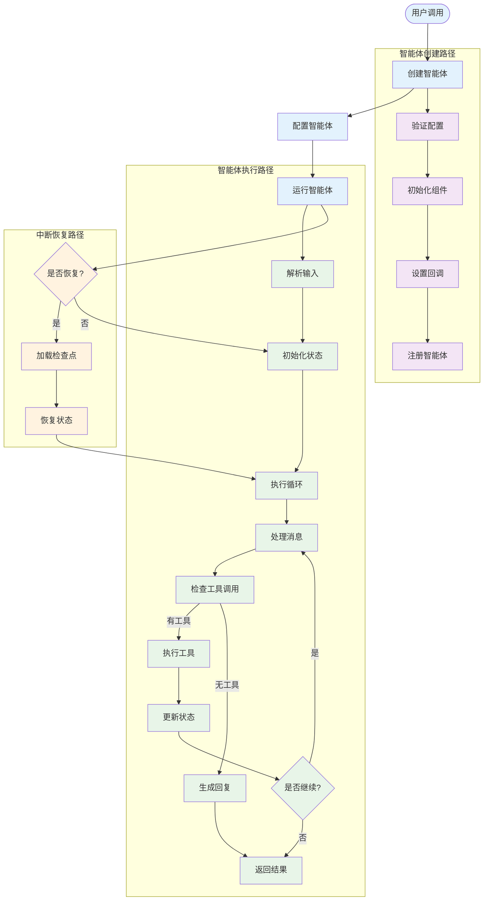
```mermaid
flowchart TD
    Start([用户调用]) --> CreateAgent[创建智能体]
    CreateAgent --> ConfigAgent[配置智能体]
    ConfigAgent --> RunAgent[运行智能体]

    subgraph "智能体创建路径"
        CreateAgent --> ValidateConfig[验证配置]
        ValidateConfig --> InitComponents[初始化组件]
        InitComponents --> SetupCallbacks[设置回调]
        SetupCallbacks --> RegisterAgent[注册智能体]
    end

    subgraph "智能体执行路径"
        RunAgent --> ParseInput[解析输入]
        ParseInput --> InitState[初始化状态]
        InitState --> ExecuteLoop[执行循环]
        ExecuteLoop --> ProcessMessage[处理消息]
        ProcessMessage --> CheckTools[检查工具调用]
        CheckTools --> |有工具| ExecuteTools[执行工具]
        CheckTools --> |无工具| GenerateResponse[生成回复]
        ExecuteTools --> UpdateState[更新状态]
        UpdateState --> CheckContinue{是否继续?}
        CheckContinue --> |是| ProcessMessage
        CheckContinue --> |否| Return[返回结果]
        GenerateResponse --> Return
    end

    subgraph "中断恢复路径"
        RunAgent --> CheckResume{是否恢复?}
        CheckResume --> |是| LoadCheckpoint[加载检查点]
        CheckResume --> |否| InitState
        LoadCheckpoint --> RestoreState[恢复状态]
        RestoreState --> ExecuteLoop
    end

    classDef userAction fill:#e3f2fd
    classDef createPhase fill:#f3e5f5
    classDef executePhase fill:#e8f5e8
    classDef resumePhase fill:#fff3e0

    class Start,CreateAgent,ConfigAgent,RunAgent userAction
    class ValidateConfig,InitComponents,SetupCallbacks,RegisterAgent createPhase
    class ParseInput,InitState,ExecuteLoop,ProcessMessage,CheckTools,ExecuteTools,GenerateResponse,UpdateState,CheckContinue,Return executePhase
    class CheckResume,LoadCheckpoint,RestoreState resumePhase
```

#### 关键函数分析

##### NewChatModelAgent - 创建聊天模型智能体

```go
// NewChatModelAgent creates a new ChatModelAgent with the given configuration.
// 创建聊天模型智能体，支持工具调用和流式处理
func NewChatModelAgent(_ context.Context, config *ChatModelAgentConfig) (*ChatModelAgent, error) {
    // 验证配置
    if config.Model == nil {
        return nil, errors.New("model is required")
    }

    // 创建智能体实例
    agent := &ChatModelAgent{
        config: config,
        model:  config.Model,
        tools:  config.Tools,
    }

    // 设置默认配置
    if agent.config.MaxIterations == 0 {
        agent.config.MaxIterations = 10
    }

    return agent, nil
}
```

**设计目的**: 提供简单易用的聊天模型智能体创建接口，支持工具调用。

**调用链关键路径**:
| 深度 | 包/类 | 函数 | 作用 | 备注 |
|---:|---|---|---|---|
| 0 | `adk` | `NewChatModelAgent` | 创建智能体 | 配置验证 |
| 1 | `adk` | `validateConfig` | 验证配置 | 参数检查 |
| 2 | `adk` | `initializeTools` | 初始化工具 | 工具注册 |

##### Run - 智能体运行

```go
// Run executes the agent with the given input and returns an async iterator of events.
// 运行智能体，返回异步事件流
func (a *ChatModelAgent) Run(ctx context.Context, input *AgentInput, opts ...Option) *AsyncIterator[*AgentEvent] {
    // 创建异步生成器
    generator := NewAsyncGenerator[*AgentEvent]()

    // 启动执行协程
    go func() {
        defer generator.Close()

        // 初始化状态
        state := &State{
            Messages:    input.Messages,
            Iterations:  0,
            MaxIterations: a.config.MaxIterations,
        }

        // 执行循环
        for state.Iterations < state.MaxIterations {
            // 生成回复
            response, err := a.model.Generate(ctx, state.Messages)
            if err != nil {
                generator.SendError(err)
                return
            }

            // 检查工具调用
            if hasToolCalls(response) {
                // 执行工具
                toolResults, err := a.executeTools(ctx, response.ToolCalls)
                if err != nil {
                    generator.SendError(err)
                    return
                }

                // 更新消息历史
                state.Messages = append(state.Messages, response)
                state.Messages = append(state.Messages, toolResults...)
                state.Iterations++

                // 发送工具执行事件
                generator.Send(&AgentEvent{
                    Type: EventTypeToolExecution,
                    Data: toolResults,
                })
            } else {
                // 发送最终回复事件
                generator.Send(&AgentEvent{
                    Type: EventTypeResponse,
                    Data: response,
                })
                return
            }
        }
    }()

    return generator.Iterator()
}
```

##### AsyncIterator - 异步迭代器

```go
// AsyncIterator provides async iteration over agent events.
// 异步迭代器，用于处理智能体事件流
type AsyncIterator[T any] struct {
    ch     chan iteratorItem[T]
    closed bool
    mu     sync.RWMutex
}

// Next returns the next item or error from the iterator.
// 获取下一个事件项
func (it *AsyncIterator[T]) Next() (T, error) {
    item, ok := <-it.ch
    if !ok {
        var zero T
        return zero, io.EOF
    }

    if item.err != nil {
        var zero T
        return zero, item.err
    }

    return item.value, nil
}
```

**设计目的**: 提供异步事件流处理能力，支持非阻塞的智能体交互。

### 5.7 并发与 I/O

#### 并发模型
- **协程池**: 使用 goroutine 处理异步执行
- **通道通信**: 通过 channel 进行事件传递
- **锁机制**: 使用 sync.RWMutex 保护共享状态

#### I/O 处理
- **流式输出**: 支持实时事件流输出
- **非阻塞调用**: 异步处理模型调用和工具执行
- **超时控制**: 通过 Context 控制执行超时

### 5.8 错误处理

#### 错误类型
- **配置错误**: 智能体配置不正确
- **模型错误**: LLM 模型调用失败
- **工具错误**: 工具执行异常
- **状态错误**: 智能体状态异常

#### 错误处理策略
```go
// 错误包装和传播
func (a *ChatModelAgent) handleError(err error, context string) error {
    return fmt.Errorf("ChatModelAgent %s: %w", context, err)
}

// 错误恢复机制
func (a *ChatModelAgent) recoverFromError(ctx context.Context, err error) (*AgentEvent, error) {
    // 记录错误
    log.Error("Agent execution error", "error", err)

    // 尝试恢复
    if isRecoverableError(err) {
        return &AgentEvent{
            Type: EventTypeError,
            Data: err.Error(),
        }, nil
    }

    return nil, err
}
```

### 5.9 配置与安全

#### 配置管理
```go
type ChatModelAgentConfig struct {
    Model         model.BaseChatModel  // 聊天模型
    Tools         []tool.BaseTool      // 工具列表
    MaxIterations int                  // 最大迭代次数
    Temperature   float64              // 生成温度
    SystemPrompt  string               // 系统提示
}
```

#### 安全考虑
- **工具权限控制**: 限制工具访问权限
- **输入验证**: 验证用户输入安全性
- **输出过滤**: 过滤敏感信息输出
- **资源限制**: 限制执行时间和资源使用

### 5.10 可观测性

#### 日志记录
```go
// 结构化日志
log.Info("Agent started", 
    "agent_name", agent.Name(ctx),
    "input_length", len(input.Messages),
    "max_iterations", config.MaxIterations)

log.Debug("Tool execution", 
    "tool_name", tool.Name(),
    "execution_time", duration,
    "success", err == nil)
```

#### 指标监控
- **执行延迟**: 智能体响应时间
- **成功率**: 任务完成成功率
- **工具使用**: 工具调用频次和成功率
- **资源使用**: CPU、内存使用情况

#### 链路追踪
```go
// OpenTelemetry 集成
func (a *ChatModelAgent) Run(ctx context.Context, input *AgentInput) {
    ctx, span := tracer.Start(ctx, "agent.run")
    defer span.End()

    span.SetAttributes(
        attribute.String("agent.name", a.Name(ctx)),
        attribute.Int("input.message_count", len(input.Messages)),
    )
    
    // 执行逻辑...
}
```

### 5.11 性能优化

#### 性能特性
- **并发执行**: 支持多个智能体并发运行
- **流式处理**: 实时输出减少延迟
- **缓存机制**: 缓存模型调用结果
- **连接池**: 复用网络连接

#### 性能预算
- **启动延迟**: < 100ms
- **响应延迟**: < 2s (简单查询)
- **吞吐量**: > 100 QPS (并发场景)
- **内存使用**: < 100MB (单智能体)

### 5.12 Agent 接口定义

```go
type Agent interface {
    Name(ctx context.Context) string
    Description(ctx context.Context) string
    Run(ctx context.Context, input *AgentInput, options ...AgentRunOption) *AsyncIterator[*AgentEvent]
}

type AgentInput struct {
    Messages        []Message
    EnableStreaming bool
}

type AgentEvent struct {
    AgentName string
    RunPath   []RunStep
    Output    *AgentOutput
    Action    *AgentAction
    Err       error
}
```

### 5.3 ReAct Agent 实现详解

#### 5.3.1 ReAct Agent 结构

```go
type Agent struct {
    runnable         compose.Runnable[[]*schema.Message, *schema.Message]
    graph            *compose.Graph[[]*schema.Message, *schema.Message]
    graphAddNodeOpts []compose.GraphAddNodeOpt
}

type state struct {
    Messages                 []*schema.Message
    ReturnDirectlyToolCallID string
}
```

#### 5.3.2 ReAct Agent 构建过程

```go
func NewAgent(ctx context.Context, config *AgentConfig) (*Agent, error) {
    // 1. 准备组件
    chatModel, err := agent.ChatModelWithTools(config.Model, config.ToolCallingModel, toolInfos)
    if err != nil {
        return nil, err
    }

    toolsNode, err := compose.NewToolNode(ctx, &config.ToolsConfig)
    if err != nil {
        return nil, err
    }

    // 2. 构建图
    graph := compose.NewGraph[[]*schema.Message, *schema.Message](
        compose.WithGenLocalState(func(ctx context.Context) *state {
            return &state{Messages: make([]*schema.Message, 0, config.MaxStep+1)}
        }))

    // 3. 添加模型节点
    modelPreHandle := func(ctx context.Context, input []*schema.Message, state *state) ([]*schema.Message, error) {
        state.Messages = append(state.Messages, input...)
        if config.MessageModifier != nil {
            return config.MessageModifier(ctx, state.Messages), nil
        }
        return state.Messages, nil
    }

    err = graph.AddChatModelNode(nodeKeyModel, chatModel, 
        compose.WithStatePreHandler(modelPreHandle))
    if err != nil {
        return nil, err
    }

    // 4. 添加工具节点
    toolsNodePreHandle := func(ctx context.Context, input *schema.Message, state *state) (*schema.Message, error) {
        if input != nil {
            state.Messages = append(state.Messages, input)
            state.ReturnDirectlyToolCallID = getReturnDirectlyToolCallID(input, config.ToolReturnDirectly)
        }
        return input, nil
    }

    err = graph.AddToolsNode(nodeKeyTools, toolsNode, 
        compose.WithStatePreHandler(toolsNodePreHandle))
    if err != nil {
        return nil, err
    }

    // 5. 添加分支逻辑
    modelPostBranchCondition := func(ctx context.Context, sr *schema.StreamReader[*schema.Message]) (string, error) {
        isToolCall, err := config.StreamToolCallChecker(ctx, sr)
        if err != nil {
            return "", err
        }
        if isToolCall {
            return nodeKeyTools, nil
        }
        return compose.END, nil
    }

    err = graph.AddBranch(nodeKeyModel, compose.NewStreamGraphBranch(
        modelPostBranchCondition, 
        map[string]bool{nodeKeyTools: true, compose.END: true}))
    if err != nil {
        return nil, err
    }

    // 6. 编译图
    runnable, err := graph.Compile(ctx, compileOpts...)
    if err != nil {
        return nil, err
    }

    return &Agent{
        runnable: runnable,
        graph:    graph,
    }, nil
}
```

#### 5.3.3 ReAct Agent 执行流程

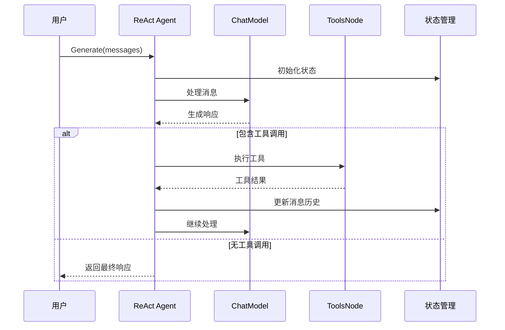
```mermaid
sequenceDiagram
    participant User as 用户
    participant Agent as ReAct Agent
    participant Model as ChatModel
    participant Tools as ToolsNode
    participant State as 状态管理
    
    User->>Agent: Generate(messages)
    Agent->>State: 初始化状态
    Agent->>Model: 处理消息
    Model-->>Agent: 生成响应
    
    alt 包含工具调用
        Agent->>Tools: 执行工具
        Tools-->>Agent: 工具结果
        Agent->>State: 更新消息历史
        Agent->>Model: 继续处理
    else 无工具调用
        Agent-->>User: 返回最终响应
    end
```

## 6. 模块间交互总结

### 6.1 数据流向图

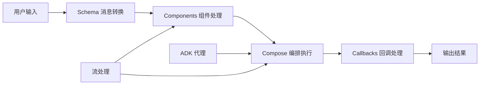
```mermaid
graph LR
    A[用户输入] --> B[Schema 消息转换]
    B --> C[Components 组件处理]
    C --> D[Compose 编排执行]
    D --> E[Callbacks 回调处理]
    E --> F[输出结果]
    
    G[ADK 代理] --> D
    H[流处理] --> C
    H --> D
```

### 6.2 关键设计模式

1. **策略模式**: 不同的编排方式（Chain、Graph、Workflow）
2. **观察者模式**: 回调系统的实现
3. **建造者模式**: HandlerBuilder、ChainBuilder 等
4. **适配器模式**: 不同组件接口的统一
5. **模板方法模式**: Runnable 的四种执行模式

### 6.3 性能优化要点

1. **并发执行**: 图节点的并行处理
2. **流式处理**: 减少内存占用
3. **类型缓存**: 反射类型信息的缓存
4. **资源池化**: 昂贵资源的复用
5. **延迟加载**: 按需初始化组件

通过这种模块化的设计，Eino 框架实现了高度的可扩展性和可维护性，同时保持了良好的性能表现。
