# Elasticsearch 源码深度剖析文档

## 目录
1. [框架使用手册](#框架使用手册)
2. [整体架构分析](#整体架构分析)
3. [REST API 深入分析](#rest-api-深入分析)
4. [搜索模块分析](#搜索模块分析)
5. [索引模块分析](#索引模块分析)
6. [集群管理模块分析](#集群管理模块分析)
7. [批量操作模块分析](#批量操作模块分析)
8. [关键数据结构与继承关系](#关键数据结构与继承关系)
9. [实战经验总结](#实战经验总结)

---

## 框架使用手册

### 1.1 Elasticsearch 概述

Elasticsearch 是一个基于 Apache Lucene 构建的分布式搜索和分析引擎，具有以下核心特性：

- **分布式架构**：支持水平扩展，自动分片和副本管理
- **实时搜索**：近实时的文档索引和搜索能力
- **RESTful API**：通过 HTTP REST API 提供所有功能
- **多种数据类型**：支持结构化、非结构化和时间序列数据
- **强大的查询DSL**：支持复杂的查询、聚合和分析

### 1.2 核心概念

#### 1.2.1 基础概念
- **Index（索引）**：类似于数据库中的数据库，是文档的集合
- **Document（文档）**：基本的信息单元，以JSON格式存储
- **Field（字段）**：文档中的键值对
- **Mapping（映射）**：定义文档及其字段的存储和索引方式
- **Shard（分片）**：索引的水平分割单元
- **Replica（副本）**：分片的副本，提供高可用性

#### 1.2.2 集群概念
- **Cluster（集群）**：一个或多个节点的集合
- **Node（节点）**：集群中的单个服务器
- **Master Node（主节点）**：负责集群级别的操作
- **Data Node（数据节点）**：存储数据并执行搜索操作

### 1.3 快速开始

#### 1.3.1 基本操作示例

```bash
# 创建索引
PUT /my-index
{
  "mappings": {
    "properties": {
      "title": { "type": "text" },
      "content": { "type": "text" },
      "timestamp": { "type": "date" }
    }
  }
}

# 索引文档
POST /my-index/_doc/1
{
  "title": "Elasticsearch Guide",
  "content": "This is a comprehensive guide to Elasticsearch",
  "timestamp": "2024-01-01T00:00:00Z"
}

# 搜索文档
GET /my-index/_search
{
  "query": {
    "match": {
      "title": "Elasticsearch"
    }
  }
}
```

---

## 整体架构分析

### 2.1 系统架构图

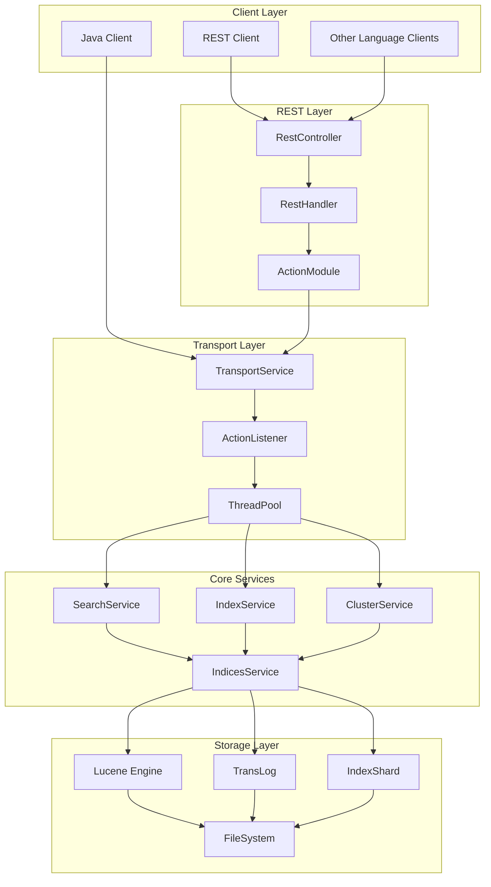

### 2.2 模块间交互时序图

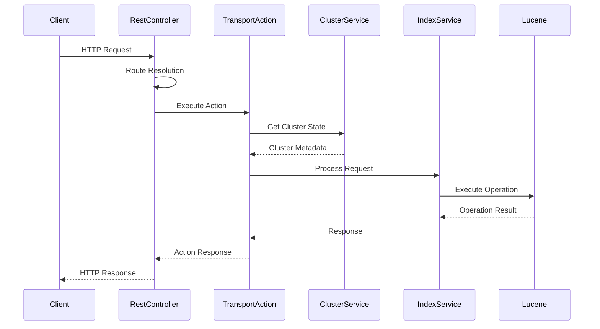

### 2.3 核心组件说明

#### 2.3.1 REST 层组件
- **RestController**: HTTP请求的中央调度器
- **RestHandler**: 具体的REST端点处理器
- **ActionModule**: 注册所有REST处理器的模块

#### 2.3.2 传输层组件
- **TransportService**: 节点间通信服务
- **ActionListener**: 异步操作回调机制
- **ThreadPool**: 线程池管理

#### 2.3.3 核心服务组件
- **SearchService**: 搜索操作核心服务
- **IndexService**: 索引操作核心服务
- **ClusterService**: 集群状态管理服务
- **IndicesService**: 索引生命周期管理

---

## REST API 深入分析

### 3.1 REST API 架构

Elasticsearch 的 REST API 是系统对外的主要接口，采用分层架构设计：

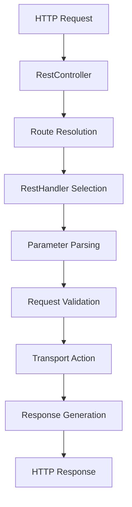

### 3.2 核心入口函数分析

#### 3.2.1 RestController 类

**文件位置**: `server/src/main/java/org/elasticsearch/rest/RestController.java`

**核心功能**: HTTP请求的中央调度器，负责路由解析和处理器分发

```java
public class RestController implements HttpServerTransport.Dispatcher {

    // 路径树，用于快速路由匹配
    private final PathTrie<MethodHandlers> handlers = new PathTrie<>(RestUtils.REST_DECODER);

    // 请求拦截器
    private final RestInterceptor interceptor;

    // 节点客户端
    private final NodeClient client;

    /**
     * 核心请求分发方法
     * 功能：接收HTTP请求，解析路径，找到对应的处理器并执行
     */
    @Override
    public void dispatchRequest(RestRequest request, RestChannel channel, ThreadContext threadContext) {
        // 添加Elasticsearch产品标识头
        threadContext.addResponseHeader(ELASTIC_PRODUCT_HTTP_HEADER, ELASTIC_PRODUCT_HTTP_HEADER_VALUE);
        try {
            // 尝试所有可能的处理器
            tryAllHandlers(request, channel, threadContext);
        } catch (Exception e) {
            try {
                sendFailure(channel, e);
            } catch (Exception inner) {
                inner.addSuppressed(e);
                logger.error(() -> "failed to send failure response for uri [" + request.uri() + "]", inner);
            }
        }
    }

    /**
     * 注册REST处理器
     * 功能：将REST端点与处理器关联
     */
    public void registerHandler(final RestHandler handler) {
        handler.routes().forEach(route -> registerHandler(route, handler));
    }
}
```

**关键特性**:
- 使用 PathTrie 进行高效的路径匹配
- 支持多版本API路由
- 内置请求拦截和错误处理机制
- 线程安全的请求处理

#### 3.2.2 ActionModule 类

**文件位置**: `server/src/main/java/org/elasticsearch/action/ActionModule.java`

**核心功能**: 注册所有REST处理器和Transport动作

```java
public class ActionModule extends AbstractModule {

    /**
     * 初始化REST处理器
     * 功能：注册所有内置的REST API端点
     */
    private void initRestHandlers(Consumer<RestHandler> registerHandler) {
        // 索引操作相关API
        registerHandler.accept(new RestIndexAction(clusterService, projectIdResolver));
        registerHandler.accept(new RestGetAction());
        registerHandler.accept(new RestDeleteAction());
        registerHandler.accept(new RestUpdateAction());

        // 搜索操作相关API
        registerHandler.accept(new RestSearchAction(restController.getSearchUsageHolder(),
                                                   clusterSupportsFeature, settings));
        registerHandler.accept(new RestMultiSearchAction(settings,
                                                        restController.getSearchUsageHolder(),
                                                        clusterSupportsFeature));

        // 批量操作API
        registerHandler.accept(new RestBulkAction(settings, clusterSettings, bulkService));

        // 集群管理API
        registerHandler.accept(new RestClusterHealthAction());
        registerHandler.accept(new RestClusterStateAction());

        // 索引管理API
        registerHandler.accept(new RestCreateIndexAction());
        registerHandler.accept(new RestDeleteIndexAction());
        registerHandler.accept(new RestGetMappingAction());
        registerHandler.accept(new RestPutMappingAction());
    }
}
```

### 3.3 主要 API 端点分析

#### 3.3.1 搜索 API

**REST处理器**: `RestSearchAction`
**Transport动作**: `TransportSearchAction`
**支持的端点**:
- `GET /_search`
- `POST /_search`
- `GET /{index}/_search`
- `POST /{index}/_search`

**调用链路**:
```
RestSearchAction.prepareRequest()
→ parseSearchRequest()
→ TransportSearchAction.execute()
→ SearchService.executeQueryPhase()
→ Lucene查询执行
```

#### 3.3.2 索引 API

**REST处理器**: `RestIndexAction`
**Transport动作**: `TransportIndexAction`
**支持的端点**:
- `PUT /{index}/_doc/{id}`
- `POST /{index}/_doc`
- `PUT /{index}/_create/{id}`

**调用链路**:
```
RestIndexAction.prepareRequest()
→ IndexRequest构建
→ TransportIndexAction.execute()
→ IndexService.index()
→ Lucene文档索引
```

#### 3.3.3 批量操作 API

**REST处理器**: `RestBulkAction`
**Transport动作**: `TransportBulkAction`
**支持的端点**:
- `POST /_bulk`
- `PUT /_bulk`
- `POST /{index}/_bulk`

**调用链路**:
```
RestBulkAction.prepareRequest()
→ BulkRequest解析
→ TransportBulkAction.execute()
→ BulkOperation.executeBulkShardRequests()
→ 分片级批量处理
```

---

## 搜索模块分析

### 4.1 搜索模块架构

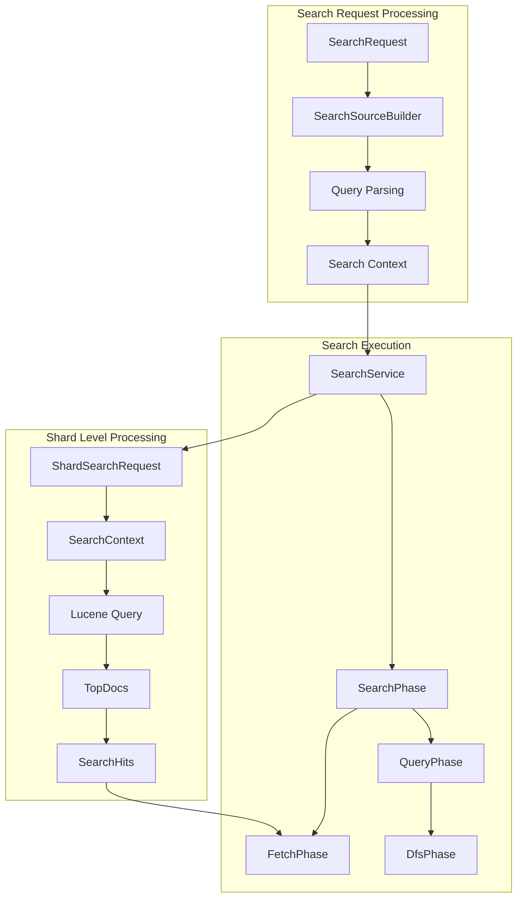

### 4.2 核心搜索类分析

#### 4.2.1 SearchRequest 类

**文件位置**: `server/src/main/java/org/elasticsearch/action/search/SearchRequest.java`

```java
public class SearchRequest extends LegacyActionRequest implements IndicesRequest.Replaceable, Rewriteable<SearchRequest> {

    // 搜索类型：QUERY_THEN_FETCH 或 DFS_QUERY_THEN_FETCH
    private SearchType searchType = SearchType.DEFAULT;

    // 目标索引
    private String[] indices = Strings.EMPTY_ARRAY;

    // 路由参数
    private String routing;

    // 搜索偏好设置
    private String preference;

    // 搜索源构建器
    private SearchSourceBuilder source;

    // 请求缓存设置
    private Boolean requestCache;

    // 是否允许部分搜索结果
    private Boolean allowPartialSearchResults;

    // 滚动搜索保持时间
    private TimeValue scrollKeepAlive;

    // 批量reduce大小
    private int batchedReduceSize = DEFAULT_BATCHED_REDUCE_SIZE;

    // 最大并发分片请求数
    private int maxConcurrentShardRequests = 0;

    /**
     * 设置搜索源
     */
    public SearchRequest source(SearchSourceBuilder sourceBuilder) {
        this.source = sourceBuilder;
        return this;
    }

    /**
     * 设置目标索引
     */
    public SearchRequest indices(String... indices) {
        this.indices = indices;
        return this;
    }
}
```

#### 4.2.2 TransportSearchAction 类

**文件位置**: `server/src/main/java/org/elasticsearch/action/search/TransportSearchAction.java`

```java
public class TransportSearchAction extends HandledTransportAction<SearchRequest, SearchResponse> {

    /**
     * 执行搜索请求的核心方法
     */
    private void executeRequest(
        SearchTask task,
        SearchRequest original,
        ActionListener<SearchResponse> originalListener,
        Function<ActionListener<SearchResponse>, SearchPhaseProvider> searchPhaseProvider,
        boolean collectSearchTelemetry
    ) {
        // 创建时间提供器
        final long relativeStartNanos = System.nanoTime();
        final SearchTimeProvider timeProvider = new SearchTimeProvider(
            original.getOrCreateAbsoluteStartMillis(),
            relativeStartNanos,
            System::nanoTime
        );

        // 获取集群状态
        final ClusterState clusterState = clusterService.state();
        clusterState.blocks().globalBlockedRaiseException(projectResolver.getProjectId(), ClusterBlockLevel.READ);

        // 解析目标索引
        ProjectState projectState = projectResolver.getProjectState(clusterState);
        final ResolvedIndices resolvedIndices;
        if (original.pointInTimeBuilder() != null) {
            // 使用Point in Time解析
            resolvedIndices = ResolvedIndices.resolveWithPIT(
                original.pointInTimeBuilder(),
                original.indicesOptions(),
                projectState.metadata(),
                namedWriteableRegistry
            );
        } else {
            // 常规索引解析
            resolvedIndices = ResolvedIndices.resolveWithIndicesRequest(
                original,
                projectState.metadata(),
                indexNameExpressionResolver,
                remoteClusterService,
                timeProvider.absoluteStartMillis()
            );
            frozenIndexCheck(resolvedIndices);
        }

        // 执行搜索阶段
        executeSearch(task, timeProvider, original, originalListener,
                     clusterState, resolvedIndices, searchPhaseProvider,
                     collectSearchTelemetry);
    }
}
```

#### 4.2.3 SearchService 类

**文件位置**: `server/src/main/java/org/elasticsearch/search/SearchService.java`

```java
public class SearchService extends AbstractLifecycleComponent implements IndexEventListener {

    /**
     * 执行查询阶段
     */
    public void executeQueryPhase(ShardSearchRequest request, SearchShardTask task, ActionListener<SearchPhaseResult> listener) {
        final IndexService indexService = indicesService.indexServiceSafe(request.shardId().getIndex());
        final IndexShard indexShard = indexService.getShard(request.shardId().getId());

        // 创建搜索上下文
        final SearchContext searchContext = createSearchContext(request, indexShard, task);

        try {
            // 执行查询
            queryPhase.execute(searchContext);

            // 返回查询结果
            if (searchContext.queryResult().hasHits()) {
                listener.onResponse(searchContext.queryResult());
            } else {
                listener.onResponse(new QuerySearchResult());
            }
        } catch (Exception e) {
            listener.onFailure(e);
        } finally {
            // 清理搜索上下文
            cleanupSearchContext(searchContext);
        }
    }

    /**
     * 执行获取阶段
     */
    public void executeFetchPhase(ShardFetchRequest request, SearchShardTask task, ActionListener<FetchSearchResult> listener) {
        final SearchContext searchContext = findSearchContext(request.contextId());

        try {
            // 执行文档获取
            fetchPhase.execute(searchContext);
            listener.onResponse(searchContext.fetchResult());
        } catch (Exception e) {
            listener.onFailure(e);
        }
    }
}
```

### 4.3 搜索执行时序图

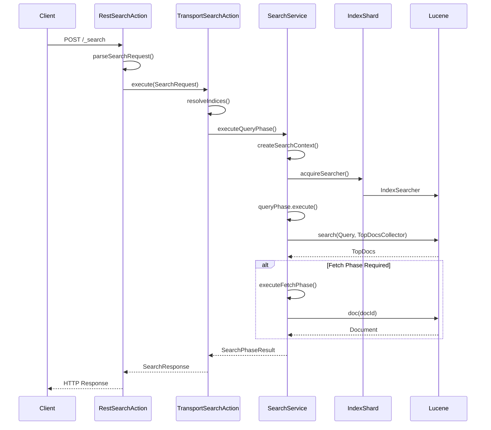

### 4.4 搜索类型说明

#### 4.4.1 QUERY_THEN_FETCH
- **阶段1**: Query Phase - 在所有分片上执行查询，返回文档ID和评分
- **阶段2**: Fetch Phase - 根据全局排序结果获取实际文档内容
- **优点**: 准确的全局排序，网络传输量小
- **缺点**: 需要两个网络往返

#### 4.4.2 DFS_QUERY_THEN_FETCH
- **阶段1**: DFS Phase - 收集分布式词频统计信息
- **阶段2**: Query Phase - 使用全局词频执行查询
- **阶段3**: Fetch Phase - 获取文档内容
- **优点**: 更准确的TF-IDF评分
- **缺点**: 额外的网络开销

---

## 索引模块分析

### 5.1 索引模块架构

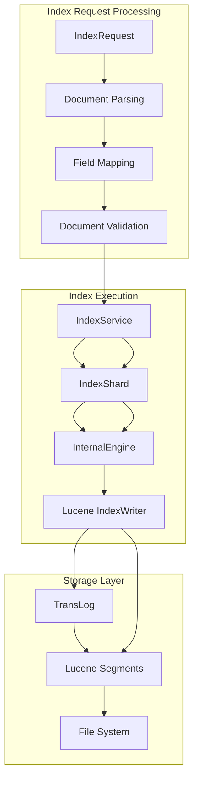

### 5.2 核心索引类分析

#### 5.2.1 IndexRequest 类

**文件位置**: `server/src/main/java/org/elasticsearch/action/index/IndexRequest.java`

```java
public class IndexRequest extends ReplicatedWriteRequest<IndexRequest> implements DocWriteRequest<IndexRequest>, CompositeIndicesRequest {

    // 文档ID
    private String id;

    // 路由参数
    private String routing;

    // 索引源数据
    private final IndexSource indexSource;

    // 操作类型：INDEX 或 CREATE
    private OpType opType = OpType.INDEX;

    // 版本控制
    private long version = Versions.MATCH_ANY;
    private VersionType versionType = VersionType.INTERNAL;

    // 管道处理
    private String pipeline;
    private String finalPipeline;

    /**
     * 设置文档源数据
     */
    public IndexRequest source(Map<String, ?> source, XContentType contentType) throws ElasticsearchGenerationException {
        try {
            XContentBuilder builder = XContentFactory.contentBuilder(contentType);
            builder.map(source);
            return source(builder);
        } catch (IOException e) {
            throw new ElasticsearchGenerationException("Failed to generate [" + source + "]", e);
        }
    }

    /**
     * 设置文档ID
     */
    public IndexRequest id(String id) {
        this.id = id;
        return this;
    }

    /**
     * 设置操作类型
     */
    public IndexRequest opType(OpType opType) {
        this.opType = opType;
        return this;
    }
}
```

#### 5.2.2 TransportIndexAction 类

**文件位置**: `server/src/main/java/org/elasticsearch/action/index/TransportIndexAction.java`

```java
public class TransportIndexAction extends TransportReplicationAction<IndexRequest, IndexRequest, IndexResponse> {

    /**
     * 在主分片上执行索引操作
     */
    @Override
    protected WritePrimaryResult<IndexRequest, IndexResponse> shardOperationOnPrimary(
        IndexRequest request, IndexShard primary, ActionListener<WritePrimaryResult<IndexRequest, IndexResponse>> listener) {

        try {
            // 执行索引操作
            final Engine.IndexResult result = primary.applyIndexOperationOnPrimary(
                request.version(),
                request.versionType(),
                new SourceToParse(
                    request.index(),
                    request.id(),
                    request.source(),
                    request.getContentType(),
                    request.routing()
                ),
                request.getIfSeqNo(),
                request.getIfPrimaryTerm(),
                request.getAutoGeneratedTimestamp(),
                request.isRetry()
            );

            // 创建响应
            final IndexResponse response = new IndexResponse(
                primary.shardId(),
                request.id(),
                result.getSeqNo(),
                result.getTerm(),
                result.getVersion(),
                result.isCreated()
            );

            return new WritePrimaryResult<>(request, response, result.getResultType(), null, primary);

        } catch (Exception e) {
            return new WritePrimaryResult<>(request, e, primary);
        }
    }

    /**
     * 在副本分片上执行索引操作
     */
    @Override
    protected WriteReplicaResult shardOperationOnReplica(IndexRequest request, IndexShard replica) {
        try {
            final Engine.IndexResult result = replica.applyIndexOperationOnReplica(
                request.getSeqNo(),
                request.getPrimaryTerm(),
                request.version(),
                request.getAutoGeneratedTimestamp(),
                request.isRetry(),
                new SourceToParse(
                    request.index(),
                    request.id(),
                    request.source(),
                    request.getContentType(),
                    request.routing()
                )
            );

            return new WriteReplicaResult(request, result.getResultType(), null, replica, logger);

        } catch (Exception e) {
            return new WriteReplicaResult(request, e, replica, logger);
        }
    }
}
```

#### 5.2.3 IndexService 类

**文件位置**: `server/src/main/java/org/elasticsearch/index/IndexService.java`

```java
public class IndexService extends AbstractIndexComponent implements IndicesClusterStateService.AllocatedIndex<IndexShard> {

    // 索引设置
    private final IndexSettings indexSettings;

    // 分析器注册表
    private final IndexAnalyzers indexAnalyzers;

    // 映射服务
    private final MapperService mapperService;

    // 相似度服务
    private final SimilarityService similarityService;

    // 分片映射
    private volatile Map<Integer, IndexShard> shards = emptyMap();

    /**
     * 创建新的索引分片
     */
    public synchronized IndexShard createShard(
        final ShardRouting routing,
        final PeerRecoveryTargetService recoveryTargetService,
        final PeerRecoveryTargetService.RecoveryListener recoveryListener,
        final RepositoriesService repositoriesService,
        final Consumer<IndexShard.ShardFailure> onShardFailure,
        final Consumer<ShardId> globalCheckpointSyncer,
        final RetentionLeaseSyncer retentionLeaseSyncer,
        final DiscoveryNode targetNode,
        final DiscoveryNode sourceNode,
        final long primaryTerm,
        final IndexEventListener... listeners
    ) throws IOException {

        // 创建分片实例
        final IndexShard indexShard = new IndexShard(
            routing,
            this.indexSettings,
            indexPath,
            store,
            indexSortSupplier,
            indexCache,
            mapperService,
            similarityService,
            engineFactory,
            indexEventListener,
            queryShardContext,
            globalCheckpointSyncer,
            retentionLeaseSyncer,
            primaryTerm,
            Arrays.asList(listeners)
        );

        // 注册分片
        shards = Maps.copyMapWithAddedEntry(shards, shardId, indexShard);

        return indexShard;
    }

    /**
     * 获取映射服务
     */
    public MapperService mapperService() {
        return mapperService;
    }
}
```

### 5.3 索引执行时序图

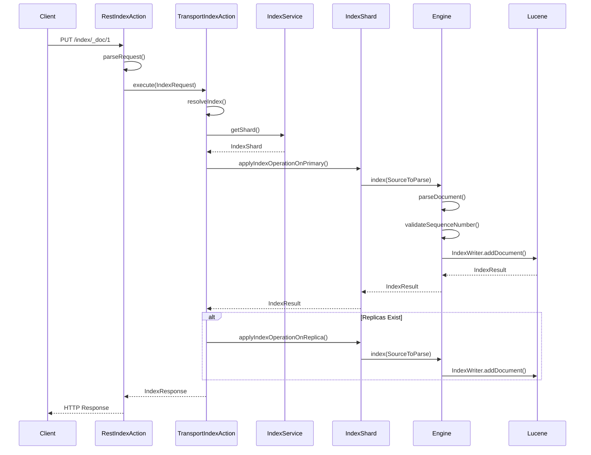

### 5.4 文档处理流程

#### 5.4.1 文档解析
1. **源数据解析**: 将JSON/XML等格式转换为内部表示
2. **字段映射**: 根据mapping定义处理各个字段
3. **类型转换**: 执行必要的数据类型转换
4. **验证检查**: 验证文档结构和字段值

#### 5.4.2 索引写入
1. **序列号分配**: 为操作分配全局唯一的序列号
2. **版本控制**: 处理文档版本冲突
3. **Lucene写入**: 调用Lucene IndexWriter写入文档
4. **TransLog记录**: 记录操作到事务日志

---

## 集群管理模块分析

### 6.1 集群管理架构

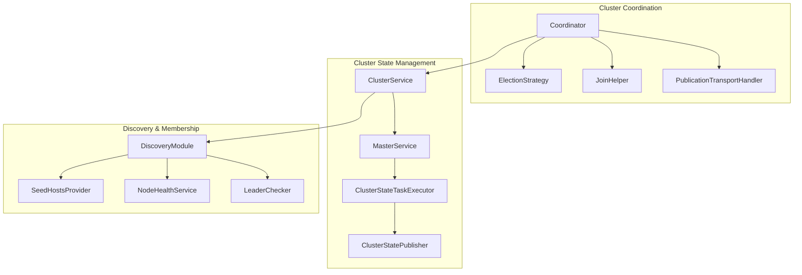

### 6.2 核心集群类分析

#### 6.2.1 Coordinator 类

**文件位置**: `server/src/main/java/org/elasticsearch/cluster/coordination/Coordinator.java`

```java
public class Coordinator extends AbstractLifecycleComponent implements ClusterStatePublisher {

    // 选举策略
    private final ElectionStrategy electionStrategy;

    // 传输服务
    private final TransportService transportService;

    // 主服务
    private final MasterService masterService;

    // 分配服务
    private final AllocationService allocationService;

    // 加入助手
    private final JoinHelper joinHelper;

    // 协调状态
    private final SetOnce<CoordinationState> coordinationState = new SetOnce<>();

    /**
     * 启动协调器
     */
    @Override
    protected void doStart() {
        synchronized (mutex) {
            // 初始化协调状态
            coordinationState.set(new CoordinationState(
                settings,
                localNode,
                persistedStateSupplier.get(),
                electionStrategy,
                nodeHealthService
            ));

            // 启动预投票收集器
            preVoteCollector.start();

            // 启动领导者检查器
            leaderChecker.start();

            // 启动跟随者检查器
            followersChecker.start();

            // 开始选举过程
            becomeCandidate("coordinator started");
        }
    }

    /**
     * 发布集群状态
     */
    @Override
    public void publish(ClusterStatePublicationEvent clusterStatePublicationEvent,
                       ActionListener<Void> publishListener,
                       AckListener ackListener) {

        final ClusterState clusterState = clusterStatePublicationEvent.getNewState();

        // 验证发布权限
        assert Thread.holdsLock(mutex) : "Coordinator mutex not held";
        assert mode == Mode.LEADER : "not currently leading";

        // 创建发布请求
        final PublishRequest publishRequest = coordinationState.get().handleClientValue(clusterState);

        // 执行发布
        publicationHandler.publish(
            publishRequest,
            wrapWithMutex(publishListener),
            wrapWithMutex(ackListener)
        );
    }

    /**
     * 处理加入请求
     */
    public void handleJoinRequest(JoinRequest joinRequest, ActionListener<Void> listener) {
        synchronized (mutex) {
            if (mode == Mode.LEADER) {
                // 作为领导者处理加入请求
                joinHelper.handleJoinRequest(joinRequest, listener);
            } else {
                // 非领导者拒绝加入请求
                listener.onFailure(new CoordinationStateRejectedException("not the leader"));
            }
        }
    }
}
```

#### 6.2.2 ClusterService 类

**文件位置**: `server/src/main/java/org/elasticsearch/cluster/service/ClusterService.java`

```java
public class ClusterService extends AbstractLifecycleComponent {

    // 集群设置
    private final ClusterSettings clusterSettings;

    // 主服务
    private final MasterService masterService;

    // 集群应用服务
    private final ClusterApplierService clusterApplierService;

    // 当前集群状态
    private volatile ClusterState clusterState;

    /**
     * 获取当前集群状态
     */
    public ClusterState state() {
        return this.clusterState;
    }

    /**
     * 创建任务队列
     */
    public <T> MasterServiceTaskQueue<T> createTaskQueue(
        String name,
        Priority priority,
        ClusterStateTaskExecutor<T> executor
    ) {
        return masterService.createTaskQueue(name, priority, executor);
    }

    /**
     * 提交集群状态任务
     */
    public <T> void submitStateUpdateTask(
        String source,
        T task,
        ClusterStateTaskConfig config,
        ClusterStateTaskExecutor<T> executor,
        ClusterStateTaskListener listener
    ) {
        masterService.submitStateUpdateTask(source, task, config, executor, listener);
    }

    /**
     * 添加集群状态监听器
     */
    public void addListener(ClusterStateListener listener) {
        clusterApplierService.addListener(listener);
    }

    /**
     * 添加集群状态应用器
     */
    public void addStateApplier(ClusterStateApplier applier) {
        clusterApplierService.addStateApplier(applier);
    }
}
```

#### 6.2.3 ClusterState 类

**文件位置**: `server/src/main/java/org/elasticsearch/cluster/ClusterState.java`

```java
public class ClusterState implements ChunkedToXContent, Diffable<ClusterState> {

    // 集群名称
    private final String clusterName;

    // 状态版本
    private final long version;

    // 状态UUID
    private final String stateUUID;

    // 节点信息
    private final DiscoveryNodes nodes;

    // 元数据
    private final Metadata metadata;

    // 路由表
    private final RoutingTable routingTable;

    // 集群块
    private final ClusterBlocks blocks;

    /**
     * 构建器模式创建集群状态
     */
    public static Builder builder(ClusterState state) {
        return new Builder(state);
    }

    /**
     * 获取主节点
     */
    public DiscoveryNode getMasterNode() {
        return nodes.getMasterNode();
    }

    /**
     * 检查是否有主节点
     */
    public boolean hasMasterNode() {
        return nodes.getMasterNodeId() != null;
    }

    /**
     * 获取索引元数据
     */
    public IndexMetadata getIndexMetadata(String index) {
        return metadata.index(index);
    }

    /**
     * 集群状态构建器
     */
    public static class Builder {
        private String clusterName;
        private long version = 0;
        private String uuid = UNKNOWN_UUID;
        private DiscoveryNodes.Builder nodesBuilder;
        private Metadata.Builder metadataBuilder;
        private RoutingTable.Builder routingTableBuilder;
        private ClusterBlocks.Builder blocksBuilder;

        public Builder nodes(DiscoveryNodes.Builder nodesBuilder) {
            this.nodesBuilder = nodesBuilder;
            return this;
        }

        public Builder metadata(Metadata.Builder metadataBuilder) {
            this.metadataBuilder = metadataBuilder;
            return this;
        }

        public ClusterState build() {
            return new ClusterState(
                clusterName,
                version,
                uuid,
                nodesBuilder.build(),
                metadataBuilder.build(),
                routingTableBuilder.build(),
                blocksBuilder.build()
            );
        }
    }
}
```

### 6.3 集群协调时序图

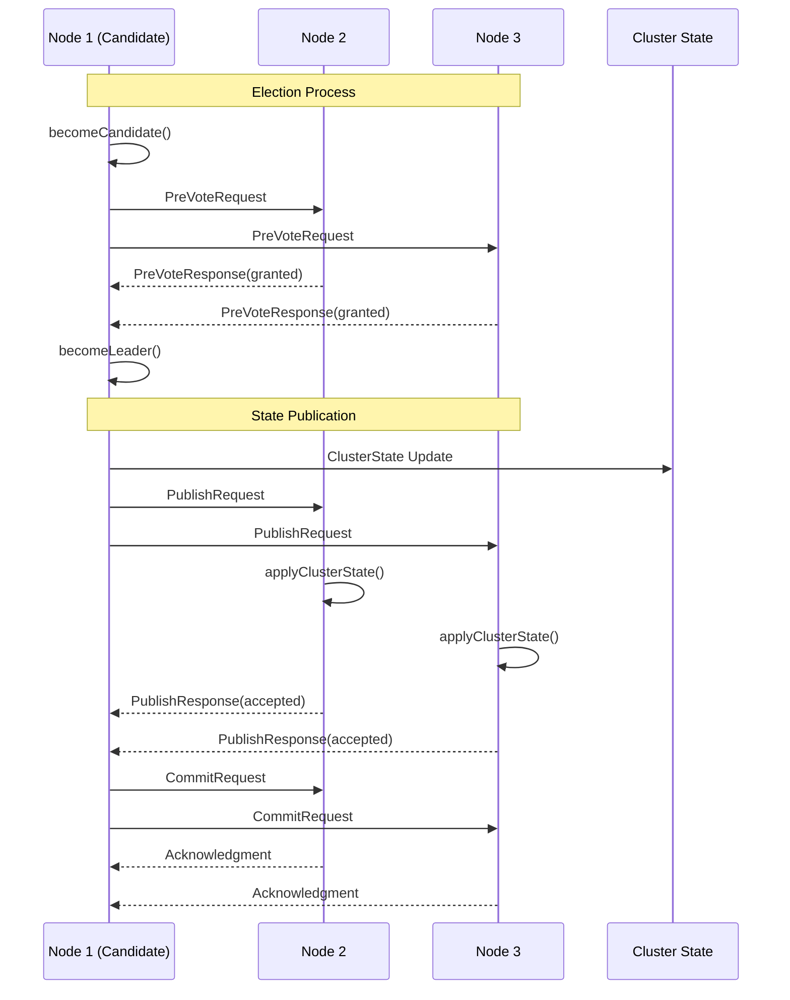

### 6.4 主节点选举机制

#### 6.4.1 选举策略
- **默认策略**: 基于节点ID的字典序选择
- **预投票阶段**: 避免网络分区导致的无效选举
- **多数派原则**: 需要超过半数的主节点候选者同意

#### 6.4.2 故障检测
- **领导者检查**: 定期检查主节点健康状态
- **跟随者检查**: 主节点检查其他节点状态
- **网络分区处理**: 自动处理脑裂情况

---

## 批量操作模块分析

### 7.1 批量操作架构

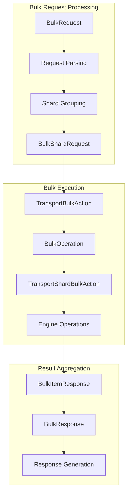

### 7.2 核心批量操作类分析

#### 7.2.1 BulkRequest 类

**文件位置**: `server/src/main/java/org/elasticsearch/action/bulk/BulkRequest.java`

```java
public class BulkRequest extends LegacyActionRequest
    implements CompositeIndicesRequest, WriteRequest<BulkRequest>, Accountable, RawIndexingDataTransportRequest {

    // 请求列表
    private final List<DocWriteRequest<?>> requests = new ArrayList<>();

    // 涉及的索引集合
    private Set<String> indices = emptySet();

    // 估算的请求大小
    private long sizeInBytes = 0;

    // 全局参数
    private String globalPipeline;
    private String globalRouting;
    private String globalIndex;

    /**
     * 添加索引请求
     */
    public BulkRequest add(IndexRequest request) {
        return internalAdd(request);
    }

    BulkRequest internalAdd(IndexRequest request) {
        Objects.requireNonNull(request, "'request' must not be null");
        applyGlobalMandatoryParameters(request);

        requests.add(request);
        // 计算请求大小
        sizeInBytes += request.indexSource().byteLength() + REQUEST_OVERHEAD;
        indices.add(request.index());
        return this;
    }

    /**
     * 添加更新请求
     */
    public BulkRequest add(UpdateRequest request) {
        return internalAdd(request);
    }

    BulkRequest internalAdd(UpdateRequest request) {
        Objects.requireNonNull(request, "'request' must not be null");
        applyGlobalMandatoryParameters(request);

        requests.add(request);
        if (request.doc() != null) {
            sizeInBytes += request.doc().indexSource().byteLength();
        }
        if (request.upsertRequest() != null) {
            sizeInBytes += request.upsertRequest().indexSource().byteLength();
        }
        if (request.script() != null) {
            sizeInBytes += request.script().getIdOrCode().length() * 2;
        }
        indices.add(request.index());
        return this;
    }

    /**
     * 添加删除请求
     */
    public BulkRequest add(DeleteRequest request) {
        Objects.requireNonNull(request, "'request' must not be null");
        applyGlobalMandatoryParameters(request);

        requests.add(request);
        sizeInBytes += REQUEST_OVERHEAD;
        indices.add(request.index());
        return this;
    }

    /**
     * 获取请求数量
     */
    public int numberOfActions() {
        return requests.size();
    }

    /**
     * 获取估算大小
     */
    public long estimatedSizeInBytes() {
        return sizeInBytes;
    }
}
```

#### 7.2.2 TransportBulkAction 类

**文件位置**: `server/src/main/java/org/elasticsearch/action/bulk/TransportBulkAction.java`

```java
public class TransportBulkAction extends HandledTransportAction<BulkRequest, BulkResponse> {

    /**
     * 执行批量操作
     */
    @Override
    protected void doExecute(Task task, BulkRequest bulkRequest, ActionListener<BulkResponse> listener) {
        final long startTime = relativeTime();
        final AtomicArray<BulkItemResponse> responses = new AtomicArray<>(bulkRequest.numberOfActions());

        // 创建批量操作实例
        BulkOperation bulkOperation = new BulkOperation(
            task,
            bulkRequest,
            listener,
            responses,
            startTime,
            clusterService,
            ingestService,
            executorService,
            relativeTimeProvider
        );

        // 执行批量操作
        bulkOperation.execute();
    }
}
```

#### 7.2.3 BulkOperation 类

**文件位置**: `server/src/main/java/org/elasticsearch/action/bulk/BulkOperation.java`

```java
public class BulkOperation {

    private final Task task;
    private final BulkRequest bulkRequest;
    private final ActionListener<BulkResponse> listener;
    private final AtomicArray<BulkItemResponse> responses;

    /**
     * 执行批量操作
     */
    public void execute() {
        final ClusterState clusterState = clusterService.state();

        // 检查集群块
        if (addFailureIfIndexIsUnavailable(clusterState)) {
            return;
        }

        // 解析和验证请求
        final Map<String, List<BulkItemRequest>> requestsByIndex = new HashMap<>();
        for (int i = 0; i < bulkRequest.numberOfActions(); i++) {
            DocWriteRequest<?> docWriteRequest = bulkRequest.requests().get(i);

            // 解析索引名称
            String indexName = docWriteRequest.index();

            // 验证请求
            BulkItemRequest bulkItemRequest = new BulkItemRequest(i, docWriteRequest);
            requestsByIndex.computeIfAbsent(indexName, k -> new ArrayList<>()).add(bulkItemRequest);
        }

        // 按分片分组请求
        final Map<ShardId, List<BulkItemRequest>> requestsByShard = groupRequestsByShard(requestsByIndex, clusterState);

        // 执行分片级批量操作
        executeBulkShardRequests(requestsByShard, clusterState);
    }

    /**
     * 按分片分组请求
     */
    private Map<ShardId, List<BulkItemRequest>> groupRequestsByShard(
        Map<String, List<BulkItemRequest>> requestsByIndex,
        ClusterState clusterState
    ) {
        final Map<ShardId, List<BulkItemRequest>> requestsByShard = new HashMap<>();

        for (Map.Entry<String, List<BulkItemRequest>> entry : requestsByIndex.entrySet()) {
            String indexName = entry.getKey();
            List<BulkItemRequest> requests = entry.getValue();

            IndexMetadata indexMetadata = clusterState.metadata().index(indexName);
            if (indexMetadata == null) {
                continue;
            }

            for (BulkItemRequest request : requests) {
                // 计算分片ID
                ShardId shardId = clusterService.operationRouting().indexShards(
                    clusterState,
                    indexName,
                    request.request().id(),
                    request.request().routing()
                ).shardId();

                requestsByShard.computeIfAbsent(shardId, k -> new ArrayList<>()).add(request);
            }
        }

        return requestsByShard;
    }

    /**
     * 执行分片级批量请求
     */
    private void executeBulkShardRequests(
        Map<ShardId, List<BulkItemRequest>> requestsByShard,
        ClusterState clusterState
    ) {
        ProjectMetadata project = projectResolver.getProjectMetadata(clusterState);
        try (RefCountingRunnable bulkItemRequestCompleteRefCount = new RefCountingRunnable(onRequestsCompleted)) {
            for (Map.Entry<ShardId, List<BulkItemRequest>> entry : requestsByShard.entrySet()) {
                final ShardId shardId = entry.getKey();
                final List<BulkItemRequest> requests = entry.getValue();

                // 创建分片批量请求
                BulkShardRequest bulkShardRequest = new BulkShardRequest(
                    shardId,
                    bulkRequest.getRefreshPolicy(),
                    requests.toArray(new BulkItemRequest[0]),
                    bulkRequest.isSimulated()
                );

                // 设置推理字段映射
                var indexMetadata = project.index(shardId.getIndexName());
                if (indexMetadata != null && indexMetadata.getInferenceFields().isEmpty() == false) {
                    bulkShardRequest.setInferenceFieldMap(indexMetadata.getInferenceFields());
                }

                // 执行分片请求
                executeBulkShardRequest(bulkShardRequest, project.id(), bulkItemRequestCompleteRefCount.acquire());
            }
        }
    }
}
```

### 7.3 批量操作执行时序图

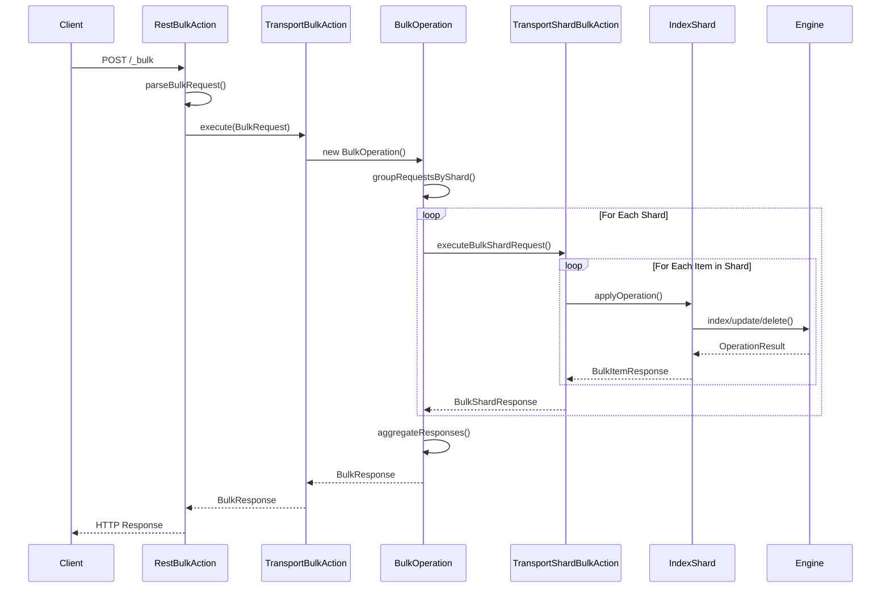

### 7.4 批量操作优化策略

#### 7.4.1 请求分组
- **按索引分组**: 将请求按目标索引分组
- **按分片分组**: 进一步按分片ID分组
- **并行执行**: 不同分片的请求可以并行处理

#### 7.4.2 错误处理
- **部分失败**: 单个操作失败不影响其他操作
- **错误聚合**: 收集所有错误信息返回给客户端
- **重试机制**: 对可重试的错误进行自动重试

#### 7.4.3 性能优化
- **批量大小控制**: 限制单个批量请求的大小
- **内存管理**: 及时释放不需要的内存
- **背压控制**: 防止过多的并发请求

---

## 关键数据结构与继承关系

### 8.1 核心接口继承关系

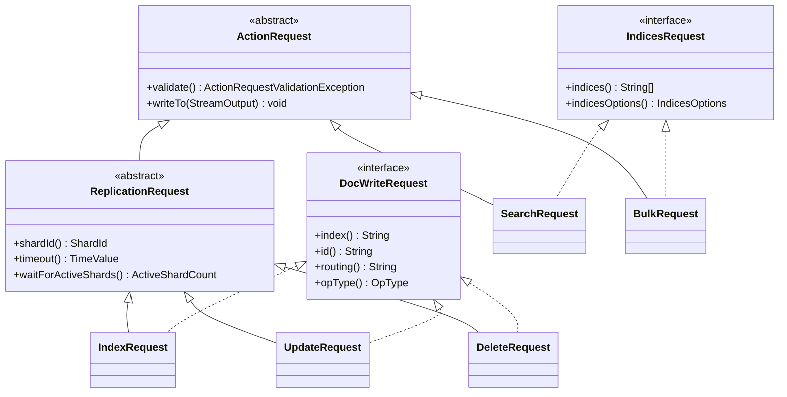

### 8.2 响应类继承关系

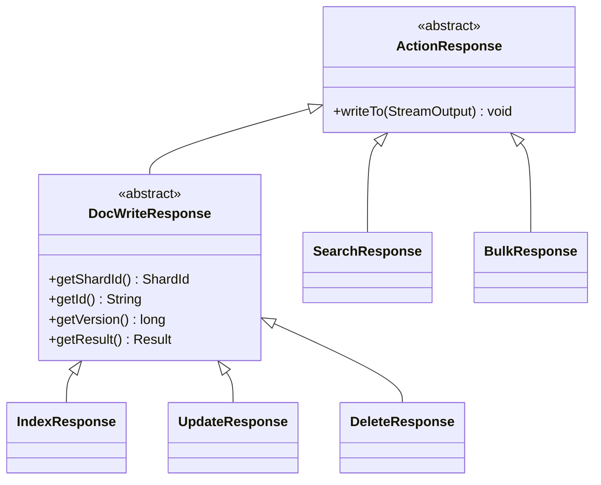

### 8.3 集群状态相关类

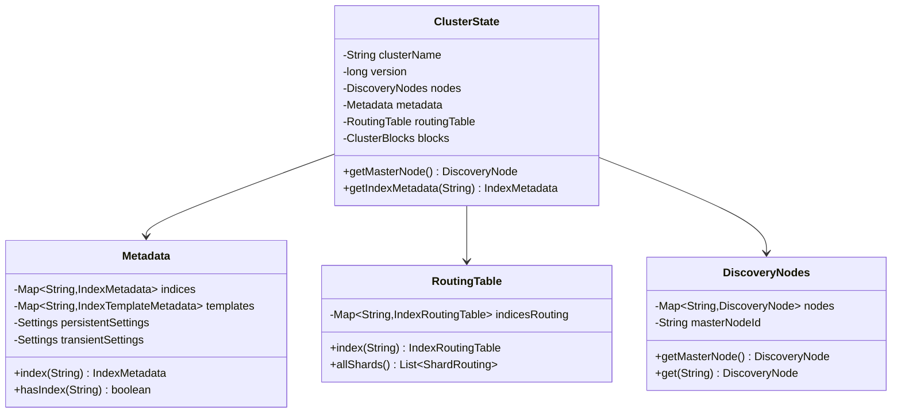

### 8.4 搜索相关类结构

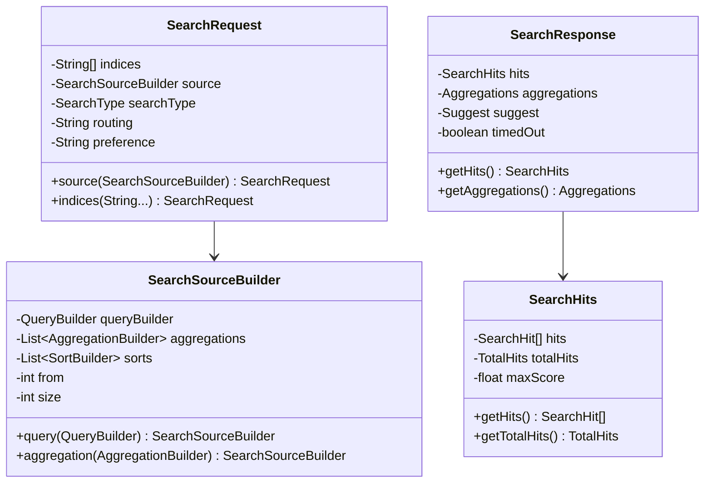

### 8.5 索引相关类结构

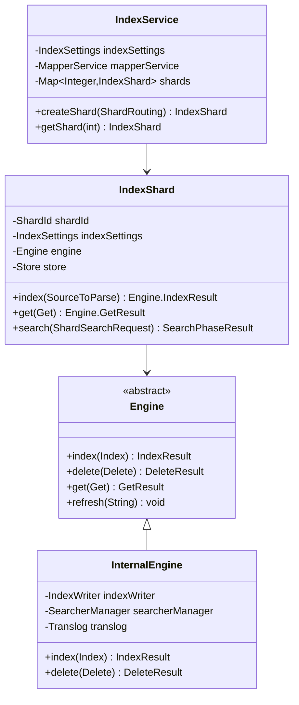

---

## 实战经验总结

### 9.1 性能优化实践

#### 9.1.1 索引优化
1. **批量索引**: 使用bulk API而非单个文档索引
   ```java
   BulkRequestBuilder bulkRequest = client.prepareBulk();
   for (Document doc : documents) {
       bulkRequest.add(client.prepareIndex("index", "type")
           .setSource(doc.toJson(), XContentType.JSON));
   }
   BulkResponse bulkResponse = bulkRequest.get();
   ```

2. **分片策略**: 合理设置分片数量
   - 单个分片大小控制在20-50GB
   - 分片数量 = 节点数 × 1-3倍
   - 避免过多小分片

3. **映射优化**:
   ```json
   {
     "mappings": {
       "properties": {
         "title": {
           "type": "text",
           "analyzer": "standard",
           "store": false
         },
         "timestamp": {
           "type": "date",
           "format": "yyyy-MM-dd HH:mm:ss"
         }
       }
     }
   }
   ```

#### 9.1.2 搜索优化
1. **查询优化**:
   ```java
   SearchRequest searchRequest = new SearchRequest("index");
   SearchSourceBuilder sourceBuilder = new SearchSourceBuilder();

   // 使用过滤器而非查询（可缓存）
   BoolQueryBuilder boolQuery = QueryBuilders.boolQuery()
       .filter(QueryBuilders.termQuery("status", "published"))
       .must(QueryBuilders.matchQuery("title", "elasticsearch"));

   sourceBuilder.query(boolQuery);
   sourceBuilder.size(10);
   sourceBuilder.timeout(TimeValue.timeValueSeconds(30));
   ```

2. **聚合优化**:
   ```java
   // 使用composite聚合处理大量桶
   CompositeAggregationBuilder composite = AggregationBuilders
       .composite("my_composite")
       .sources(Arrays.asList(
           new TermsValuesSourceBuilder("category").field("category.keyword"),
           new DateHistogramValuesSourceBuilder("date").field("timestamp")
               .calendarInterval(DateHistogramInterval.DAY)
       ))
       .size(1000);
   ```

#### 9.1.3 集群优化
1. **节点配置**:
   ```yaml
   # elasticsearch.yml
   node.name: node-1
   node.roles: [master, data, ingest]

   # JVM设置
   -Xms4g
   -Xmx4g
   -XX:+UseG1GC
   ```

2. **分片分配**:
   ```json
   PUT /_cluster/settings
   {
     "persistent": {
       "cluster.routing.allocation.total_shards_per_node": 1000,
       "cluster.routing.allocation.cluster_concurrent_rebalance": 2,
       "cluster.routing.allocation.node_concurrent_recoveries": 2
     }
   }
   ```

### 9.2 常见问题解决

#### 9.2.1 内存问题
1. **堆内存溢出**:
   - 检查查询复杂度
   - 调整聚合桶大小限制
   - 使用scroll而非深度分页

2. **字段数据缓存**:
   ```json
   PUT /index/_settings
   {
     "index.fielddata.cache.size": "20%"
   }
   ```

#### 9.2.2 性能问题
1. **慢查询分析**:
   ```json
   PUT /_cluster/settings
   {
     "persistent": {
       "logger.org.elasticsearch.index.search.slowlog.query": "DEBUG",
       "logger.org.elasticsearch.index.search.slowlog.fetch": "DEBUG"
     }
   }
   ```

2. **热点分片**:
   - 使用自定义路由分散负载
   - 调整分片分配策略
   - 增加副本数量

#### 9.2.3 集群稳定性
1. **脑裂预防**:
   ```yaml
   discovery.zen.minimum_master_nodes: 2  # (master_nodes / 2) + 1
   ```

2. **监控指标**:
   - 集群健康状态
   - 节点CPU和内存使用率
   - 索引和搜索延迟
   - 队列大小和拒绝率

### 9.3 开发最佳实践

#### 9.3.1 客户端使用
1. **连接池配置**:
   ```java
   RestHighLevelClient client = new RestHighLevelClient(
       RestClient.builder(
           new HttpHost("localhost", 9200, "http")
       ).setRequestConfigCallback(
           requestConfigBuilder -> requestConfigBuilder
               .setConnectTimeout(5000)
               .setSocketTimeout(60000)
       ).setHttpClientConfigCallback(
           httpClientBuilder -> httpClientBuilder
               .setMaxConnTotal(100)
               .setMaxConnPerRoute(10)
       )
   );
   ```

2. **异步操作**:
   ```java
   client.indexAsync(indexRequest, RequestOptions.DEFAULT,
       new ActionListener<IndexResponse>() {
           @Override
           public void onResponse(IndexResponse indexResponse) {
               // 处理成功响应
           }

           @Override
           public void onFailure(Exception e) {
               // 处理失败
           }
       });
   ```

#### 9.3.2 错误处理
1. **重试机制**:
   ```java
   public class ElasticsearchRetryTemplate {
       private static final int MAX_RETRIES = 3;

       public <T> T executeWithRetry(Supplier<T> operation) {
           Exception lastException = null;
           for (int i = 0; i < MAX_RETRIES; i++) {
               try {
                   return operation.get();
               } catch (ElasticsearchException e) {
                   lastException = e;
                   if (isRetryable(e)) {
                       sleep(calculateBackoff(i));
                       continue;
                   }
                   throw e;
               }
           }
           throw new RuntimeException("Max retries exceeded", lastException);
       }
   }
   ```

2. **版本冲突处理**:
   ```java
   IndexRequest request = new IndexRequest("index")
       .id("1")
       .source(jsonMap)
       .setIfSeqNo(seqNo)
       .setIfPrimaryTerm(primaryTerm);

   try {
       IndexResponse response = client.index(request, RequestOptions.DEFAULT);
   } catch (VersionConflictEngineException e) {
       // 处理版本冲突，重新获取文档并重试
   }
   ```

#### 9.3.3 监控和调试
1. **自定义指标**:
   ```java
   @Component
   public class ElasticsearchMetrics {
       private final MeterRegistry meterRegistry;
       private final Counter indexCounter;
       private final Timer searchTimer;

       public ElasticsearchMetrics(MeterRegistry meterRegistry) {
           this.meterRegistry = meterRegistry;
           this.indexCounter = Counter.builder("elasticsearch.index.count")
               .register(meterRegistry);
           this.searchTimer = Timer.builder("elasticsearch.search.duration")
               .register(meterRegistry);
       }
   }
   ```

2. **日志配置**:
   ```xml
   <logger name="org.elasticsearch.client" level="DEBUG"/>
   <logger name="org.elasticsearch.action" level="INFO"/>
   <logger name="org.elasticsearch.cluster" level="WARN"/>
   ```

---

## 总结

本文档深入分析了 Elasticsearch 的源码架构，涵盖了从 REST API 到底层存储的完整技术栈。通过详细的代码分析、架构图和时序图，展示了 Elasticsearch 如何处理搜索、索引、集群管理等核心功能。

### 关键收获

1. **模块化设计**: Elasticsearch 采用高度模块化的架构，各模块职责清晰，便于扩展和维护

2. **异步处理**: 大量使用 ActionListener 和回调机制，提供高并发处理能力

3. **分布式协调**: 通过 Raft 算法实现集群协调，保证数据一致性和高可用性

4. **性能优化**: 在多个层面进行优化，包括请求路由、批量处理、缓存机制等

5. **容错设计**: 完善的错误处理和恢复机制，确保系统稳定性

通过学习 Elasticsearch 源码，可以深入理解分布式搜索引擎的设计原理，为构建高性能、高可用的搜索系统提供宝贵经验。
