# Elasticsearch 源码深度剖析文档

## 目录
1. [框架使用手册](#框架使用手册)
2. [整体架构分析](#整体架构分析)
3. [REST API 深入分析](#rest-api-深入分析)
4. [搜索模块分析](#搜索模块分析)
5. [索引模块分析](#索引模块分析)
6. [集群管理模块分析](#集群管理模块分析)
7. [批量操作模块分析](#批量操作模块分析)
8. [关键数据结构与继承关系](#关键数据结构与继承关系)
9. [实战经验总结](#实战经验总结)

---

## 框架使用手册

### 1.1 Elasticsearch 概述

Elasticsearch 是一个基于 Apache Lucene 构建的分布式搜索和分析引擎，具有以下核心特性：

- **分布式架构**：支持水平扩展，自动分片和副本管理
- **实时搜索**：近实时的文档索引和搜索能力
- **RESTful API**：通过 HTTP REST API 提供所有功能
- **多种数据类型**：支持结构化、非结构化和时间序列数据
- **强大的查询DSL**：支持复杂的查询、聚合和分析

### 1.2 核心概念

#### 1.2.1 基础概念
- **Index（索引）**：类似于数据库中的数据库，是文档的集合
- **Document（文档）**：基本的信息单元，以JSON格式存储
- **Field（字段）**：文档中的键值对
- **Mapping（映射）**：定义文档及其字段的存储和索引方式
- **Shard（分片）**：索引的水平分割单元
- **Replica（副本）**：分片的副本，提供高可用性

#### 1.2.2 集群概念
- **Cluster（集群）**：一个或多个节点的集合
- **Node（节点）**：集群中的单个服务器
- **Master Node（主节点）**：负责集群级别的操作
- **Data Node（数据节点）**：存储数据并执行搜索操作

### 1.3 快速开始

#### 1.3.1 环境搭建

**单节点部署**:
```bash
# 下载并启动Elasticsearch
wget https://artifacts.elastic.co/downloads/elasticsearch/elasticsearch-8.11.0-linux-x86_64.tar.gz
tar -xzf elasticsearch-8.11.0-linux-x86_64.tar.gz
cd elasticsearch-8.11.0/
./bin/elasticsearch
```

**集群部署配置**:
```yaml
# elasticsearch.yml
cluster.name: my-cluster
node.name: node-1
node.roles: [master, data, ingest]
network.host: 0.0.0.0
http.port: 9200
transport.port: 9300
discovery.seed_hosts: ["node1:9300", "node2:9300", "node3:9300"]
cluster.initial_master_nodes: ["node-1", "node-2", "node-3"]

# JVM配置 (jvm.options)
-Xms4g
-Xmx4g
-XX:+UseG1GC
-XX:G1HeapRegionSize=16m
```

#### 1.3.2 基本操作示例

**1. 索引管理**:
```bash
# 创建索引
PUT /my-index
{
  "settings": {
    "number_of_shards": 3,
    "number_of_replicas": 1,
    "analysis": {
      "analyzer": {
        "my_analyzer": {
          "type": "custom",
          "tokenizer": "standard",
          "filter": ["lowercase", "stop"]
        }
      }
    }
  },
  "mappings": {
    "properties": {
      "title": {
        "type": "text",
        "analyzer": "my_analyzer",
        "fields": {
          "keyword": {
            "type": "keyword"
          }
        }
      },
      "content": { "type": "text" },
      "timestamp": { "type": "date" },
      "tags": { "type": "keyword" },
      "views": { "type": "integer" }
    }
  }
}

# 查看索引信息
GET /my-index
GET /my-index/_mapping
GET /my-index/_settings
```

**2. 文档操作**:
```bash
# 索引文档（指定ID）
PUT /my-index/_doc/1
{
  "title": "Elasticsearch源码深度解析",
  "content": "本文深入分析Elasticsearch的核心架构和实现原理",
  "timestamp": "2024-01-01T00:00:00Z",
  "tags": ["elasticsearch", "源码", "架构"],
  "views": 1000
}

# 索引文档（自动生成ID）
POST /my-index/_doc
{
  "title": "分布式搜索引擎设计",
  "content": "探讨分布式搜索引擎的设计模式和最佳实践",
  "timestamp": "2024-01-02T00:00:00Z",
  "tags": ["分布式", "搜索引擎"],
  "views": 500
}

# 更新文档
POST /my-index/_update/1
{
  "doc": {
    "views": 1500
  },
  "script": {
    "source": "ctx._source.views += params.increment",
    "params": {
      "increment": 100
    }
  }
}

# 删除文档
DELETE /my-index/_doc/1
```

**3. 搜索操作**:
```bash
# 基本搜索
GET /my-index/_search
{
  "query": {
    "match": {
      "title": "Elasticsearch"
    }
  }
}

# 复合查询
GET /my-index/_search
{
  "query": {
    "bool": {
      "must": [
        { "match": { "title": "Elasticsearch" } }
      ],
      "filter": [
        { "range": { "views": { "gte": 100 } } },
        { "terms": { "tags": ["elasticsearch", "架构"] } }
      ]
    }
  },
  "sort": [
    { "timestamp": { "order": "desc" } },
    { "views": { "order": "desc" } }
  ],
  "from": 0,
  "size": 10
}

# 聚合查询
GET /my-index/_search
{
  "size": 0,
  "aggs": {
    "tags_stats": {
      "terms": {
        "field": "tags",
        "size": 10
      },
      "aggs": {
        "avg_views": {
          "avg": {
            "field": "views"
          }
        }
      }
    },
    "views_histogram": {
      "histogram": {
        "field": "views",
        "interval": 100
      }
    }
  }
}
```

#### 1.3.3 Java客户端使用

**依赖配置**:
```xml
<!-- Elasticsearch 7.x 高级客户端 -->
<dependency>
    <groupId>org.elasticsearch.client</groupId>
    <artifactId>elasticsearch-rest-high-level-client</artifactId>
    <version>7.17.0</version>
</dependency>

<!-- Elasticsearch 8.x 新客户端 -->
<dependency>
    <groupId>co.elastic.clients</groupId>
    <artifactId>elasticsearch-java</artifactId>
    <version>8.11.0</version>
</dependency>

<!-- Jackson JSON处理 -->
<dependency>
    <groupId>com.fasterxml.jackson.core</groupId>
    <artifactId>jackson-databind</artifactId>
    <version>2.15.2</version>
</dependency>
```

**客户端初始化与连接池配置**:
```java
import org.elasticsearch.client.RestHighLevelClient;
import org.elasticsearch.client.RestClient;
import org.apache.http.HttpHost;
import org.apache.http.auth.AuthScope;
import org.apache.http.auth.UsernamePasswordCredentials;
import org.apache.http.client.CredentialsProvider;
import org.apache.http.impl.client.BasicCredentialsProvider;
import org.apache.http.impl.nio.client.HttpAsyncClientBuilder;

/**
 * Elasticsearch客户端配置类
 * 提供连接池、认证、超时等完整配置
 */
public class ElasticsearchClientConfig {

    private RestHighLevelClient client;

    /**
     * 初始化Elasticsearch客户端
     * 包含连接池、认证、超时、重试等配置
     */
    public void initClient() {
        // 配置认证信息（如果需要）
        final CredentialsProvider credentialsProvider = new BasicCredentialsProvider();
        credentialsProvider.setCredentials(AuthScope.ANY,
            new UsernamePasswordCredentials("username", "password"));

        // 创建客户端实例
        client = new RestHighLevelClient(
            RestClient.builder(
                // 配置多个节点地址实现负载均衡和故障转移
                new HttpHost("es-node-1", 9200, "http"),
                new HttpHost("es-node-2", 9200, "http"),
                new HttpHost("es-node-3", 9200, "http")
            )
            // 配置请求参数：连接超时、读取超时
            .setRequestConfigCallback(requestConfigBuilder ->
                requestConfigBuilder
                    .setConnectTimeout(5000)        // 连接超时5秒
                    .setSocketTimeout(60000)        // 读取超时60秒
                    .setConnectionRequestTimeout(1000) // 从连接池获取连接超时1秒
            )
            // 配置HTTP客户端：连接池大小、Keep-Alive等
            .setHttpClientConfigCallback(httpClientBuilder ->
                httpClientBuilder
                    .setMaxConnTotal(100)           // 最大连接数100
                    .setMaxConnPerRoute(10)         // 每个路由最大连接数10
                    .setKeepAliveStrategy((response, context) -> 30000) // Keep-Alive 30秒
                    .setDefaultCredentialsProvider(credentialsProvider) // 设置认证
            )
            // 配置节点选择器（可选）
            .setNodeSelector(NodeSelector.SKIP_DEDICATED_MASTERS)
        );
    }

    /**
     * 获取客户端实例
     * @return RestHighLevelClient实例
     */
    public RestHighLevelClient getClient() {
        return client;
    }

    /**
     * 关闭客户端连接
     * 释放连接池资源
     */
    public void closeClient() {
        try {
            if (client != null) {
                client.close();
            }
        } catch (IOException e) {
            logger.error("关闭Elasticsearch客户端失败", e);
        }
    }
}
```

**完整操作示例**:
```java
import org.elasticsearch.action.index.IndexRequest;
import org.elasticsearch.action.index.IndexResponse;
import org.elasticsearch.action.search.SearchRequest;
import org.elasticsearch.action.search.SearchResponse;
import org.elasticsearch.action.get.GetRequest;
import org.elasticsearch.action.get.GetResponse;
import org.elasticsearch.action.update.UpdateRequest;
import org.elasticsearch.action.update.UpdateResponse;
import org.elasticsearch.action.delete.DeleteRequest;
import org.elasticsearch.action.delete.DeleteResponse;
import org.elasticsearch.action.bulk.BulkRequest;
import org.elasticsearch.action.bulk.BulkResponse;
import org.elasticsearch.index.query.QueryBuilders;
import org.elasticsearch.search.builder.SearchSourceBuilder;
import org.elasticsearch.search.SearchHit;
import org.elasticsearch.common.unit.TimeValue;
import org.elasticsearch.client.RequestOptions;

/**
 * Elasticsearch基本操作封装类
 * 提供文档的CRUD操作、搜索、批量操作等功能
 */
public class ElasticsearchOperations {

    private final RestHighLevelClient client;
    private static final Logger logger = LoggerFactory.getLogger(ElasticsearchOperations.class);

    public ElasticsearchOperations(RestHighLevelClient client) {
        this.client = client;
    }

    /**
     * 索引单个文档
     * @param indexName 索引名称
     * @param documentId 文档ID，如果为null则自动生成
     * @param documentSource 文档内容，支持Map、JSON字符串、XContentBuilder等
     * @return IndexResponse 索引响应，包含文档ID、版本号等信息
     * @throws IOException 网络或序列化异常
     */
    public IndexResponse indexDocument(String indexName, String documentId, Object documentSource) throws IOException {
        // 创建索引请求
        IndexRequest request = new IndexRequest(indexName);

        // 设置文档ID（可选，不设置则自动生成）
        if (documentId != null) {
            request.id(documentId);
        }

        // 设置文档内容，支持多种格式
        if (documentSource instanceof Map) {
            request.source((Map<String, ?>) documentSource);
        } else if (documentSource instanceof String) {
            request.source((String) documentSource, XContentType.JSON);
        } else {
            request.source(documentSource.toString(), XContentType.JSON);
        }

        // 设置操作参数
        request.timeout(TimeValue.timeValueSeconds(30));           // 设置超时时间
        request.setRefreshPolicy(WriteRequest.RefreshPolicy.WAIT_FOR); // 等待刷新完成

        // 执行索引操作
        IndexResponse response = client.index(request, RequestOptions.DEFAULT);

        // 记录操作结果
        logger.info("文档索引成功: index={}, id={}, version={}, result={}",
                   response.getIndex(), response.getId(), response.getVersion(), response.getResult());

        return response;
    }

    /**
     * 根据ID获取文档
     * @param indexName 索引名称
     * @param documentId 文档ID
     * @return GetResponse 获取响应，包含文档内容和元数据
     * @throws IOException 网络异常
     */
    public GetResponse getDocument(String indexName, String documentId) throws IOException {
        // 创建获取请求
        GetRequest request = new GetRequest(indexName, documentId);

        // 设置获取参数
        request.fetchSourceContext(FetchSourceContext.FETCH_SOURCE);  // 获取源文档
        request.realtime(false);  // 不使用实时获取，从已刷新的段中读取

        // 执行获取操作
        GetResponse response = client.get(request, RequestOptions.DEFAULT);

        if (response.isExists()) {
            logger.info("文档获取成功: index={}, id={}, version={}",
                       response.getIndex(), response.getId(), response.getVersion());
        } else {
            logger.warn("文档不存在: index={}, id={}", indexName, documentId);
        }

        return response;
    }

    /**
     * 更新文档
     * @param indexName 索引名称
     * @param documentId 文档ID
     * @param updateFields 要更新的字段Map
     * @return UpdateResponse 更新响应
     * @throws IOException 网络异常
     */
    public UpdateResponse updateDocument(String indexName, String documentId, Map<String, Object> updateFields) throws IOException {
        // 创建更新请求
        UpdateRequest request = new UpdateRequest(indexName, documentId);

        // 设置更新内容
        request.doc(updateFields);

        // 设置更新参数
        request.timeout(TimeValue.timeValueSeconds(30));
        request.setRefreshPolicy(WriteRequest.RefreshPolicy.WAIT_FOR);
        request.retryOnConflict(3);  // 版本冲突时重试3次
        request.docAsUpsert(true);   // 如果文档不存在则创建

        // 执行更新操作
        UpdateResponse response = client.update(request, RequestOptions.DEFAULT);

        logger.info("文档更新成功: index={}, id={}, version={}, result={}",
                   response.getIndex(), response.getId(), response.getVersion(), response.getResult());

        return response;
    }

    /**
     * 删除文档
     * @param indexName 索引名称
     * @param documentId 文档ID
     * @return DeleteResponse 删除响应
     * @throws IOException 网络异常
     */
    public DeleteResponse deleteDocument(String indexName, String documentId) throws IOException {
        // 创建删除请求
        DeleteRequest request = new DeleteRequest(indexName, documentId);

        // 设置删除参数
        request.timeout(TimeValue.timeValueSeconds(30));
        request.setRefreshPolicy(WriteRequest.RefreshPolicy.WAIT_FOR);

        // 执行删除操作
        DeleteResponse response = client.delete(request, RequestOptions.DEFAULT);

        logger.info("文档删除成功: index={}, id={}, version={}, result={}",
                   response.getIndex(), response.getId(), response.getVersion(), response.getResult());

        return response;
    }

    /**
     * 搜索文档
     * @param indexName 索引名称
     * @param queryText 查询文本
     * @param fieldName 查询字段名
     * @param from 起始位置
     * @param size 返回数量
     * @return SearchResponse 搜索响应
     * @throws IOException 网络异常
     */
    public SearchResponse searchDocuments(String indexName, String queryText, String fieldName, int from, int size) throws IOException {
        // 创建搜索请求
        SearchRequest searchRequest = new SearchRequest(indexName);

        // 构建搜索源
        SearchSourceBuilder sourceBuilder = new SearchSourceBuilder();

        // 构建查询条件
        if (queryText != null && !queryText.isEmpty()) {
            sourceBuilder.query(QueryBuilders.matchQuery(fieldName, queryText));
        } else {
            sourceBuilder.query(QueryBuilders.matchAllQuery());  // 查询所有文档
        }

        // 设置分页参数
        sourceBuilder.from(from);
        sourceBuilder.size(size);

        // 设置超时时间
        sourceBuilder.timeout(TimeValue.timeValueSeconds(60));

        // 设置排序（按相关性评分降序）
        sourceBuilder.sort("_score", SortOrder.DESC);

        // 设置高亮
        HighlightBuilder highlightBuilder = new HighlightBuilder();
        highlightBuilder.field(fieldName);
        highlightBuilder.preTags("<em>");
        highlightBuilder.postTags("</em>");
        sourceBuilder.highlighter(highlightBuilder);

        // 设置返回字段（可选）
        sourceBuilder.fetchSource(new String[]{"title", "content", "timestamp"}, null);

        searchRequest.source(sourceBuilder);

        // 执行搜索
        SearchResponse response = client.search(searchRequest, RequestOptions.DEFAULT);

        // 处理搜索结果
        long totalHits = response.getHits().getTotalHits().value;
        logger.info("搜索完成: 查询='{} 在字段 {}', 总命中数={}, 返回数={}",
                   queryText, fieldName, totalHits, response.getHits().getHits().length);

        // 输出搜索结果
        for (SearchHit hit : response.getHits().getHits()) {
            logger.debug("文档ID: {}, 评分: {}, 内容: {}",
                        hit.getId(), hit.getScore(), hit.getSourceAsString());

            // 处理高亮结果
            Map<String, HighlightField> highlightFields = hit.getHighlightFields();
            if (highlightFields.containsKey(fieldName)) {
                HighlightField highlight = highlightFields.get(fieldName);
                for (Text fragment : highlight.getFragments()) {
                    logger.debug("高亮片段: {}", fragment.string());
                }
            }
        }

        return response;
    }

    /**
     * 批量操作文档
     * @param operations 操作列表，包含索引、更新、删除等操作
     * @return BulkResponse 批量操作响应
     * @throws IOException 网络异常
     */
    public BulkResponse bulkOperations(List<DocWriteRequest<?>> operations) throws IOException {
        // 创建批量请求
        BulkRequest bulkRequest = new BulkRequest();

        // 添加所有操作到批量请求中
        for (DocWriteRequest<?> operation : operations) {
            bulkRequest.add(operation);
        }

        // 设置批量操作参数
        bulkRequest.timeout(TimeValue.timeValueMinutes(2));  // 设置较长的超时时间
        bulkRequest.setRefreshPolicy(WriteRequest.RefreshPolicy.WAIT_FOR);

        // 执行批量操作
        BulkResponse bulkResponse = client.bulk(bulkRequest, RequestOptions.DEFAULT);

        // 检查批量操作结果
        if (bulkResponse.hasFailures()) {
            logger.error("批量操作存在失败: {}", bulkResponse.buildFailureMessage());

            // 详细记录每个失败的操作
            for (BulkItemResponse bulkItemResponse : bulkResponse) {
                if (bulkItemResponse.isFailed()) {
                    BulkItemResponse.Failure failure = bulkItemResponse.getFailure();
                    logger.error("操作失败: index={}, id={}, 错误={}",
                               failure.getIndex(), failure.getId(), failure.getMessage());
                }
            }
        } else {
            logger.info("批量操作全部成功: 总操作数={}, 耗时={}ms",
                       bulkResponse.getItems().length, bulkResponse.getTook().getMillis());
        }

        return bulkResponse;
    }
}
```

#### 1.3.4 Spring Boot集成示例

**Spring Boot配置类**:
```java
import org.springframework.context.annotation.Bean;
import org.springframework.context.annotation.Configuration;
import org.springframework.boot.context.properties.ConfigurationProperties;
import org.springframework.boot.context.properties.EnableConfigurationProperties;

/**
 * Elasticsearch配置类
 * 提供Spring Boot环境下的自动配置
 */
@Configuration
@EnableConfigurationProperties(ElasticsearchProperties.class)
public class ElasticsearchConfig {

    private final ElasticsearchProperties properties;

    public ElasticsearchConfig(ElasticsearchProperties properties) {
        this.properties = properties;
    }

    /**
     * 创建Elasticsearch客户端Bean
     * @return RestHighLevelClient实例
     */
    @Bean
    public RestHighLevelClient elasticsearchClient() {
        // 解析节点地址
        List<HttpHost> hosts = properties.getNodes().stream()
            .map(this::parseHttpHost)
            .collect(Collectors.toList());

        RestClientBuilder builder = RestClient.builder(hosts.toArray(new HttpHost[0]));

        // 配置连接参数
        builder.setRequestConfigCallback(requestConfigBuilder ->
            requestConfigBuilder
                .setConnectTimeout(properties.getConnectTimeout())
                .setSocketTimeout(properties.getSocketTimeout())
                .setConnectionRequestTimeout(properties.getConnectionRequestTimeout())
        );

        // 配置HTTP客户端
        builder.setHttpClientConfigCallback(httpClientBuilder -> {
            httpClientBuilder
                .setMaxConnTotal(properties.getMaxConnTotal())
                .setMaxConnPerRoute(properties.getMaxConnPerRoute());

            // 如果配置了认证信息
            if (properties.getUsername() != null && properties.getPassword() != null) {
                CredentialsProvider credentialsProvider = new BasicCredentialsProvider();
                credentialsProvider.setCredentials(AuthScope.ANY,
                    new UsernamePasswordCredentials(properties.getUsername(), properties.getPassword()));
                httpClientBuilder.setDefaultCredentialsProvider(credentialsProvider);
            }

            return httpClientBuilder;
        });

        return new RestHighLevelClient(builder);
    }

    /**
     * 解析HTTP主机地址
     * @param nodeAddress 节点地址字符串，格式：host:port
     * @return HttpHost对象
     */
    private HttpHost parseHttpHost(String nodeAddress) {
        String[] parts = nodeAddress.split(":");
        String host = parts[0];
        int port = parts.length > 1 ? Integer.parseInt(parts[1]) : 9200;
        return new HttpHost(host, port, "http");
    }
}

/**
 * Elasticsearch配置属性类
 */
@ConfigurationProperties(prefix = "elasticsearch")
@Data
public class ElasticsearchProperties {

    /**
     * 节点地址列表，格式：["host1:port1", "host2:port2"]
     */
    private List<String> nodes = Arrays.asList("localhost:9200");

    /**
     * 连接超时时间（毫秒）
     */
    private int connectTimeout = 5000;

    /**
     * 读取超时时间（毫秒）
     */
    private int socketTimeout = 60000;

    /**
     * 从连接池获取连接的超时时间（毫秒）
     */
    private int connectionRequestTimeout = 1000;

    /**
     * 最大连接数
     */
    private int maxConnTotal = 100;

    /**
     * 每个路由的最大连接数
     */
    private int maxConnPerRoute = 10;

    /**
     * 用户名（可选）
     */
    private String username;

    /**
     * 密码（可选）
     */
    private String password;
}
```

**Service层封装**:
```java
import org.springframework.stereotype.Service;
import org.springframework.beans.factory.annotation.Autowired;

/**
 * Elasticsearch服务类
 * 提供业务层面的搜索和索引功能
 */
@Service
public class ElasticsearchService {

    private final ElasticsearchOperations elasticsearchOperations;

    @Autowired
    public ElasticsearchService(RestHighLevelClient client) {
        this.elasticsearchOperations = new ElasticsearchOperations(client);
    }

    /**
     * 索引产品信息
     * @param product 产品对象
     * @return 索引结果
     */
    public String indexProduct(Product product) {
        try {
            // 将产品对象转换为Map
            Map<String, Object> productMap = new HashMap<>();
            productMap.put("id", product.getId());
            productMap.put("name", product.getName());
            productMap.put("description", product.getDescription());
            productMap.put("price", product.getPrice());
            productMap.put("category", product.getCategory());
            productMap.put("tags", product.getTags());
            productMap.put("createTime", product.getCreateTime());
            productMap.put("updateTime", new Date());

            // 执行索引操作
            IndexResponse response = elasticsearchOperations.indexDocument(
                "products",
                product.getId().toString(),
                productMap
            );

            return response.getId();

        } catch (IOException e) {
            throw new RuntimeException("索引产品失败: " + product.getId(), e);
        }
    }

    /**
     * 搜索产品
     * @param keyword 搜索关键词
     * @param page 页码（从0开始）
     * @param size 每页大小
     * @return 搜索结果
     */
    public ProductSearchResult searchProducts(String keyword, int page, int size) {
        try {
            // 执行搜索
            SearchResponse response = elasticsearchOperations.searchDocuments(
                "products",
                keyword,
                "name",
                page * size,
                size
            );

            // 解析搜索结果
            List<Product> products = new ArrayList<>();
            for (SearchHit hit : response.getHits().getHits()) {
                Product product = parseProductFromHit(hit);
                products.add(product);
            }

            // 构建返回结果
            return ProductSearchResult.builder()
                .products(products)
                .totalHits(response.getHits().getTotalHits().value)
                .page(page)
                .size(size)
                .took(response.getTook().getMillis())
                .build();

        } catch (IOException e) {
            throw new RuntimeException("搜索产品失败: " + keyword, e);
        }
    }

    /**
     * 从搜索命中结果解析产品对象
     * @param hit 搜索命中结果
     * @return 产品对象
     */
    private Product parseProductFromHit(SearchHit hit) {
        Map<String, Object> sourceMap = hit.getSourceAsMap();

        return Product.builder()
            .id(Long.valueOf(sourceMap.get("id").toString()))
            .name((String) sourceMap.get("name"))
            .description((String) sourceMap.get("description"))
            .price(new BigDecimal(sourceMap.get("price").toString()))
            .category((String) sourceMap.get("category"))
            .tags((List<String>) sourceMap.get("tags"))
            .createTime((Date) sourceMap.get("createTime"))
            .score(hit.getScore())  // 搜索评分
            .build();
    }
}

/**
 * 产品搜索结果封装类
 */
@Data
@Builder
public class ProductSearchResult {
    private List<Product> products;      // 产品列表
    private long totalHits;              // 总命中数
    private int page;                    // 当前页码
    private int size;                    // 每页大小
    private long took;                   // 搜索耗时（毫秒）
}
```

**Controller层使用**:
```java
import org.springframework.web.bind.annotation.*;
import org.springframework.beans.factory.annotation.Autowired;

/**
 * 产品搜索控制器
 * 提供RESTful API接口
 */
@RestController
@RequestMapping("/api/products")
public class ProductSearchController {

    private final ElasticsearchService elasticsearchService;

    @Autowired
    public ProductSearchController(ElasticsearchService elasticsearchService) {
        this.elasticsearchService = elasticsearchService;
    }

    /**
     * 索引产品
     * @param product 产品信息
     * @return 索引结果
     */
    @PostMapping("/index")
    public ApiResponse<String> indexProduct(@RequestBody Product product) {
        try {
            String documentId = elasticsearchService.indexProduct(product);
            return ApiResponse.success(documentId, "产品索引成功");
        } catch (Exception e) {
            return ApiResponse.error("产品索引失败: " + e.getMessage());
        }
    }

    /**
     * 搜索产品
     * @param keyword 搜索关键词
     * @param page 页码，默认0
     * @param size 每页大小，默认10
     * @return 搜索结果
     */
    @GetMapping("/search")
    public ApiResponse<ProductSearchResult> searchProducts(
            @RequestParam String keyword,
            @RequestParam(defaultValue = "0") int page,
            @RequestParam(defaultValue = "10") int size) {

        try {
            ProductSearchResult result = elasticsearchService.searchProducts(keyword, page, size);
            return ApiResponse.success(result, "搜索成功");
        } catch (Exception e) {
            return ApiResponse.error("搜索失败: " + e.getMessage());
        }
    }
}
```

**application.yml配置**:
```yaml
# Elasticsearch配置
elasticsearch:
  nodes:
    - "es-node-1:9200"
    - "es-node-2:9200"
    - "es-node-3:9200"
  connect-timeout: 5000
  socket-timeout: 60000
  connection-request-timeout: 1000
  max-conn-total: 100
  max-conn-per-route: 10
  username: elastic
  password: changeme

# 日志配置
logging:
  level:
    org.elasticsearch: INFO
    com.yourcompany.elasticsearch: DEBUG
```

---

## 整体架构分析

### 2.1 系统整体架构图

#### 2.1.1 分层架构视图

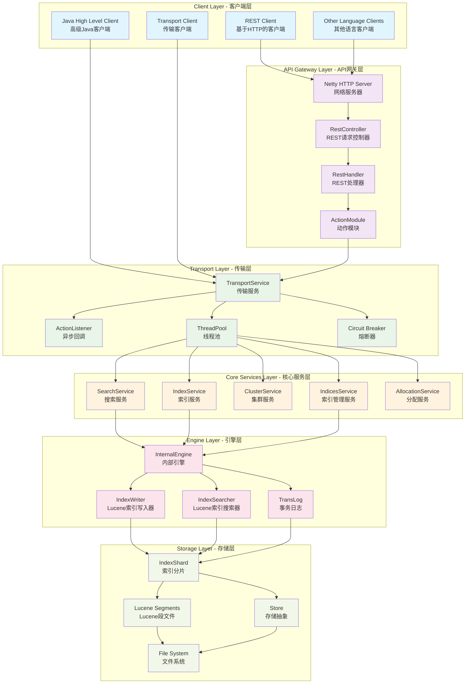
```mermaid
graph TB
    subgraph "Client Layer - 客户端层"
        A[REST Client<br/>基于HTTP的客户端]
        B[Java High Level Client<br/>高级Java客户端]
        C[Transport Client<br/>传输客户端]
        D[Other Language Clients<br/>其他语言客户端]
    end

    subgraph "API Gateway Layer - API网关层"
        E[Netty HTTP Server<br/>网络服务器]
        F[RestController<br/>REST请求控制器]
        G[RestHandler<br/>REST处理器]
        H[ActionModule<br/>动作模块]
    end

    subgraph "Transport Layer - 传输层"
        I[TransportService<br/>传输服务]
        J[ActionListener<br/>异步回调]
        K[ThreadPool<br/>线程池]
        L[Circuit Breaker<br/>熔断器]
    end

    subgraph "Core Services Layer - 核心服务层"
        M[SearchService<br/>搜索服务]
        N[IndexService<br/>索引服务]
        O[ClusterService<br/>集群服务]
        P[IndicesService<br/>索引管理服务]
        Q[AllocationService<br/>分配服务]
    end

    subgraph "Engine Layer - 引擎层"
        R[InternalEngine<br/>内部引擎]
        S[IndexWriter<br/>Lucene索引写入器]
        T[IndexSearcher<br/>Lucene索引搜索器]
        U[TransLog<br/>事务日志]
    end

    subgraph "Storage Layer - 存储层"
        V[IndexShard<br/>索引分片]
        W[Lucene Segments<br/>Lucene段文件]
        X[File System<br/>文件系统]
        Y[Store<br/>存储抽象]
    end

    %% 连接关系
    A --> E
    B --> I
    C --> I
    D --> E

    E --> F
    F --> G
    G --> H
    H --> I

    I --> J
    I --> K
    I --> L

    K --> M
    K --> N
    K --> O
    K --> P
    K --> Q

    M --> R
    N --> R
    P --> R

    R --> S
    R --> T
    R --> U

    S --> V
    T --> V
    U --> V

    V --> W
    V --> Y
    W --> X
    Y --> X

    %% 样式定义
    classDef clientLayer fill:#e1f5fe
    classDef apiLayer fill:#f3e5f5
    classDef transportLayer fill:#e8f5e8
    classDef serviceLayer fill:#fff3e0
    classDef engineLayer fill:#fce4ec
    classDef storageLayer fill:#f1f8e9

    class A,B,C,D clientLayer
    class E,F,G,H apiLayer
    class I,J,K,L transportLayer
    class M,N,O,P,Q serviceLayer
    class R,S,T,U engineLayer
    class V,W,X,Y storageLayer
```

**分层架构详细说明**:

**1. 客户端层 (Client Layer)**
- **REST Client**: 基于HTTP协议的轻量级客户端，适用于各种编程语言
- **Java High Level Client**: 提供类型安全的Java API，封装了复杂的请求构建逻辑
- **Transport Client**: 直接使用Elasticsearch内部传输协议，性能更高但已废弃
- **Other Language Clients**: 支持Python、JavaScript、Go等多种语言的官方客户端

**2. API网关层 (API Gateway Layer)**
- **Netty HTTP Server**: 基于Netty的高性能HTTP服务器，处理所有外部HTTP请求
- **RestController**: HTTP请求的中央调度器，负责路由解析和处理器分发
- **RestHandler**: 具体的REST端点处理器，每个处理器负责一类操作
- **ActionModule**: 动作模块注册器，管理所有REST处理器和Transport动作的注册

**3. 传输层 (Transport Layer)**
- **TransportService**: 节点间通信服务，处理集群内部的网络通信
- **ActionListener**: 异步操作回调机制，支持链式调用和错误传播
- **ThreadPool**: 线程池管理器，为不同类型的任务提供专门的线程池
- **Circuit Breaker**: 熔断器，防止内存溢出和系统过载

**4. 核心服务层 (Core Services Layer)**
- **SearchService**: 搜索服务核心，处理所有搜索相关操作
- **IndexService**: 索引服务核心，管理单个索引的所有操作
- **ClusterService**: 集群状态管理，负责集群状态的变更和分发
- **IndicesService**: 索引生命周期管理，管理所有索引的创建和删除
- **AllocationService**: 分片分配服务，决定分片在集群中的分布

**5. 引擎层 (Engine Layer)**
- **InternalEngine**: 内部引擎，封装Lucene操作并提供统一接口
- **IndexWriter**: Lucene索引写入器，负责文档的索引和更新
- **IndexSearcher**: Lucene索引搜索器，执行实际的搜索操作
- **TransLog**: 事务日志，记录所有写操作用于故障恢复

**6. 存储层 (Storage Layer)**
- **IndexShard**: 索引分片，管理单个分片的所有操作
- **Lucene Segments**: Lucene段文件，实际存储倒排索引数据
- **File System**: 文件系统，提供持久化存储
- **Store**: 存储抽象层，封装文件系统操作

**数据流向说明**:
```
客户端请求 → API网关层 → 传输层 → 核心服务层 → 引擎层 → 存储层
```

每一层都有明确的职责分工：
- 上层依赖下层提供的服务
- 下层不依赖上层，保持架构的清晰性
- 通过接口和抽象层实现松耦合
- 支持水平扩展和模块化开发

#### 2.1.2 模块交互架构图

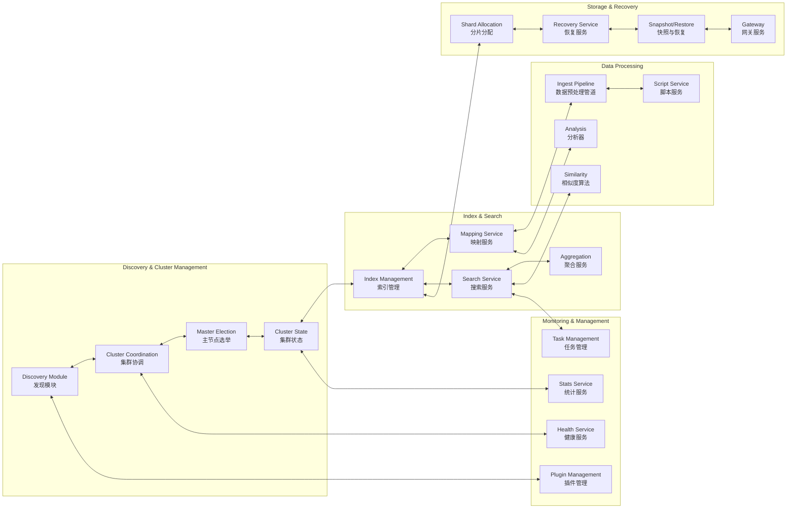
```mermaid
graph LR
    subgraph "Discovery & Cluster Management"
        A[Discovery Module<br/>发现模块]
        B[Cluster Coordination<br/>集群协调]
        C[Master Election<br/>主节点选举]
        D[Cluster State<br/>集群状态]
    end

    subgraph "Index & Search"
        E[Index Management<br/>索引管理]
        F[Mapping Service<br/>映射服务]
        G[Search Service<br/>搜索服务]
        H[Aggregation<br/>聚合服务]
    end

    subgraph "Data Processing"
        I[Ingest Pipeline<br/>数据预处理管道]
        J[Script Service<br/>脚本服务]
        K[Analysis<br/>分析器]
        L[Similarity<br/>相似度算法]
    end

    subgraph "Storage & Recovery"
        M[Shard Allocation<br/>分片分配]
        N[Recovery Service<br/>恢复服务]
        O[Snapshot/Restore<br/>快照与恢复]
        P[Gateway<br/>网关服务]
    end

    subgraph "Monitoring & Management"
        Q[Stats Service<br/>统计服务]
        R[Health Service<br/>健康服务]
        S[Task Management<br/>任务管理]
        T[Plugin Management<br/>插件管理]
    end

    %% 模块间交互
    A <--> B
    B <--> C
    C <--> D
    D <--> E

    E <--> F
    E <--> G
    G <--> H

    F <--> I
    I <--> J
    F <--> K
    G <--> L

    E <--> M
    M <--> N
    N <--> O
    O <--> P

    D <--> Q
    B <--> R
    G <--> S
    A <--> T
```

**模块交互架构详细说明**:

**1. Discovery & Cluster Management (发现与集群管理)**
- **Discovery Module**: 负责节点发现和集群形成，支持多种发现机制（单播、多播、云发现等）
- **Cluster Coordination**: 实现Raft算法的集群协调机制，确保集群状态的一致性
- **Master Election**: 主节点选举算法，采用分布式选举确保高可用性
- **Cluster State**: 集群状态管理，包含节点信息、索引元数据、路由表等

**2. Index & Search (索引与搜索)**
- **Index Management**: 索引生命周期管理，包括创建、删除、设置变更等
- **Mapping Service**: 字段映射管理，定义文档结构和字段类型
- **Search Service**: 搜索服务核心，处理查询解析、执行、结果合并
- **Aggregation**: 聚合计算服务，支持统计、分组、管道聚合等

**3. Data Processing (数据处理)**
- **Ingest Pipeline**: 数据预处理管道，支持文档转换、富化、过滤等
- **Script Service**: 脚本执行服务，支持Painless、Groovy等脚本语言
- **Analysis**: 文本分析器，包括分词器、过滤器、标准化器等
- **Similarity**: 相似度算法，支持TF-IDF、BM25等评分算法

**4. Storage & Recovery (存储与恢复)**
- **Shard Allocation**: 分片分配算法，决定分片在节点间的分布
- **Recovery Service**: 分片恢复服务，处理节点故障后的数据恢复
- **Snapshot/Restore**: 快照与恢复服务，支持增量备份和跨集群恢复
- **Gateway**: 网关服务，管理集群元数据的持久化

**5. Monitoring & Management (监控与管理)**
- **Stats Service**: 统计服务，收集集群、节点、索引等各级别统计信息
- **Health Service**: 健康检查服务，监控集群和节点的健康状态
- **Task Management**: 任务管理服务，跟踪长时间运行的任务
- **Plugin Management**: 插件管理服务，支持动态加载和管理插件

**模块间交互模式**:

1. **双向依赖**: 大部分模块采用双向依赖，支持相互调用和事件通知
2. **事件驱动**: 通过事件机制实现模块间的松耦合通信
3. **服务注册**: 模块启动时向服务注册中心注册，支持服务发现
4. **异步通信**: 大量使用异步回调，避免阻塞和提高并发性能

**关键交互路径**:
```
发现模块 → 集群协调 → 主节点选举 → 集群状态 → 索引管理
索引管理 → 映射服务 → 搜索服务 → 聚合服务
映射服务 → 数据预处理 → 脚本服务 → 分析器
索引管理 → 分片分配 → 恢复服务 → 快照恢复
集群状态 → 统计服务 → 健康服务 → 任务管理
```

#### 2.1.3 数据流架构图

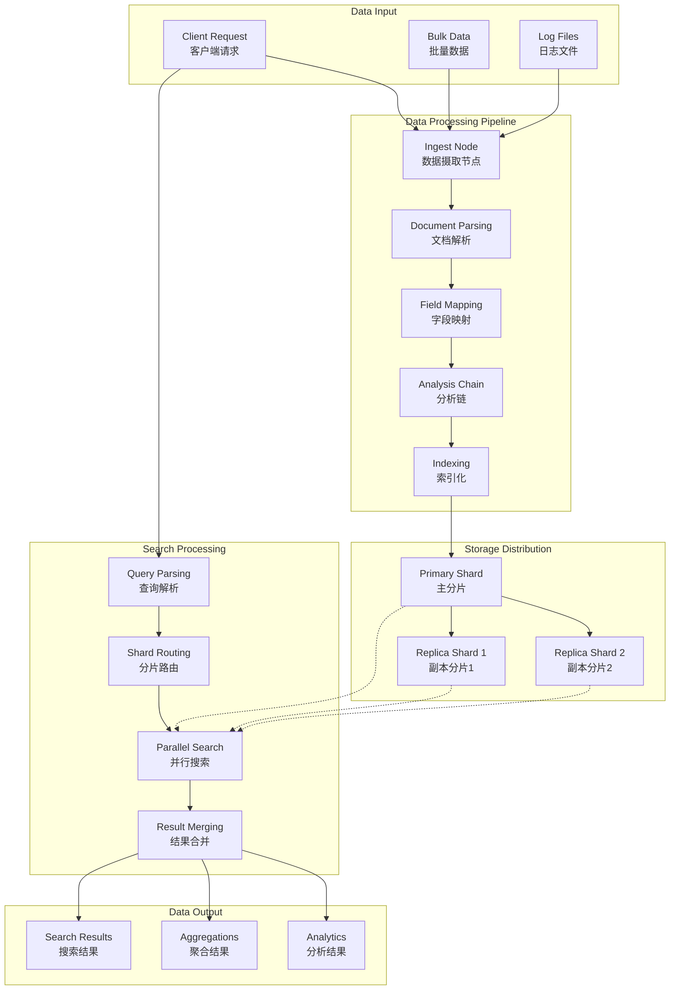
```mermaid
flowchart TD
    subgraph "Data Input"
        A[Client Request<br/>客户端请求]
        B[Bulk Data<br/>批量数据]
        C[Log Files<br/>日志文件]
    end

    subgraph "Data Processing Pipeline"
        D[Ingest Node<br/>数据摄取节点]
        E[Document Parsing<br/>文档解析]
        F[Field Mapping<br/>字段映射]
        G[Analysis Chain<br/>分析链]
        H[Indexing<br/>索引化]
    end

    subgraph "Storage Distribution"
        I[Primary Shard<br/>主分片]
        J[Replica Shard 1<br/>副本分片1]
        K[Replica Shard 2<br/>副本分片2]
    end

    subgraph "Search Processing"
        L[Query Parsing<br/>查询解析]
        M[Shard Routing<br/>分片路由]
        N[Parallel Search<br/>并行搜索]
        O[Result Merging<br/>结果合并]
    end

    subgraph "Data Output"
        P[Search Results<br/>搜索结果]
        Q[Aggregations<br/>聚合结果]
        R[Analytics<br/>分析结果]
    end

    %% 数据流向
    A --> D
    B --> D
    C --> D

    D --> E
    E --> F
    F --> G
    G --> H

    H --> I
    I --> J
    I --> K

    A --> L
    L --> M
    M --> N
    N --> O

    O --> P
    O --> Q
    O --> R

    %% 反馈回路
    I -.-> N
    J -.-> N
    K -.-> N
```

**数据流架构详细说明**:

**1. 数据输入阶段 (Data Input)**
- **Client Request**: 来自客户端的实时请求，包括索引、搜索、更新等操作
- **Bulk Data**: 批量数据导入，适用于大量数据的高效摄取
- **Log Files**: 日志文件数据，通过Beats或Logstash等工具采集

**2. 数据处理管道 (Data Processing Pipeline)**
- **Ingest Node**: 专门的数据摄取节点，负责数据预处理和转换
- **Document Parsing**: 文档解析阶段，将原始数据解析为结构化文档
- **Field Mapping**: 字段映射阶段，根据映射规则确定字段类型和属性
- **Analysis Chain**: 分析链处理，包括分词、过滤、标准化等文本处理
- **Indexing**: 索引化阶段，将处理后的文档写入Lucene索引

**3. 存储分发 (Storage Distribution)**
- **Primary Shard**: 主分片，负责数据的写入和读取
- **Replica Shard 1/2**: 副本分片，提供数据冗余和读取负载分担
- 分片分布策略确保数据的高可用性和负载均衡

**4. 搜索处理 (Search Processing)**
- **Query Parsing**: 查询解析，将用户查询转换为Lucene查询
- **Shard Routing**: 分片路由，确定需要查询的分片
- **Parallel Search**: 并行搜索，在多个分片上同时执行查询
- **Result Merging**: 结果合并，将各分片的结果合并并排序

**5. 数据输出 (Data Output)**
- **Search Results**: 搜索结果，包含匹配的文档和相关性评分
- **Aggregations**: 聚合结果，提供统计分析数据
- **Analytics**: 分析结果，支持复杂的数据分析需求

**数据流特点**:

1. **流式处理**: 数据从输入到输出形成连续的流式处理管道
2. **并行处理**: 在多个分片上并行处理，提高处理效率
3. **反馈机制**: 存储层向搜索层提供反馈，优化查询性能
4. **容错设计**: 多副本机制确保数据安全和服务可用性

**性能优化点**:

- **批量处理**: 通过批量操作提高数据摄取效率
- **管道并行**: 数据处理管道各阶段并行执行
- **分片并行**: 搜索操作在多个分片上并行执行
- **缓存机制**: 多层缓存减少重复计算和IO操作

### 2.2 模块间交互时序图

#### 2.2.1 完整请求处理时序图

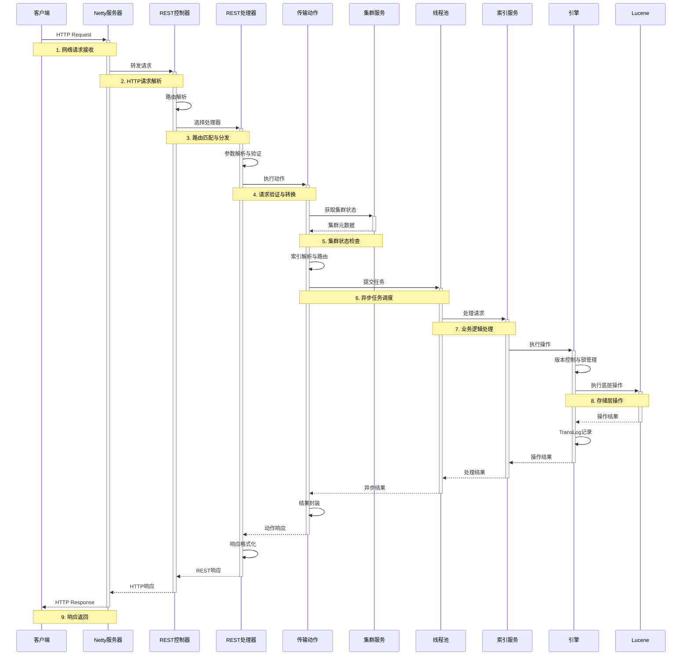
```mermaid
sequenceDiagram
    participant Client as 客户端
    participant Netty as Netty服务器
    participant RestController as REST控制器
    participant RestHandler as REST处理器
    participant TransportAction as 传输动作
    participant ClusterService as 集群服务
    participant ThreadPool as 线程池
    participant IndexService as 索引服务
    participant Engine as 引擎
    participant Lucene as Lucene

    Client->>+Netty: HTTP Request
    Note over Client,Netty: 1. 网络请求接收

    Netty->>+RestController: 转发请求
    Note over Netty,RestController: 2. HTTP请求解析

    RestController->>RestController: 路由解析
    RestController->>+RestHandler: 选择处理器
    Note over RestController,RestHandler: 3. 路由匹配与分发

    RestHandler->>RestHandler: 参数解析与验证
    RestHandler->>+TransportAction: 执行动作
    Note over RestHandler,TransportAction: 4. 请求验证与转换

    TransportAction->>+ClusterService: 获取集群状态
    ClusterService-->>-TransportAction: 集群元数据
    Note over TransportAction,ClusterService: 5. 集群状态检查

    TransportAction->>TransportAction: 索引解析与路由
    TransportAction->>+ThreadPool: 提交任务
    Note over TransportAction,ThreadPool: 6. 异步任务调度

    ThreadPool->>+IndexService: 处理请求
    Note over ThreadPool,IndexService: 7. 业务逻辑处理

    IndexService->>+Engine: 执行操作
    Engine->>Engine: 版本控制与锁管理
    Engine->>+Lucene: 执行底层操作
    Note over Engine,Lucene: 8. 存储层操作

    Lucene-->>-Engine: 操作结果
    Engine->>Engine: TransLog记录
    Engine-->>-IndexService: 操作结果

    IndexService-->>-ThreadPool: 处理结果
    ThreadPool-->>-TransportAction: 异步结果

    TransportAction->>TransportAction: 结果封装
    TransportAction-->>-RestHandler: 动作响应

    RestHandler->>RestHandler: 响应格式化
    RestHandler-->>-RestController: REST响应

    RestController-->>-Netty: HTTP响应
    Netty-->>-Client: HTTP Response
    Note over Netty,Client: 9. 响应返回
```

**完整请求处理时序图详细说明**:

**阶段1: 网络请求接收**
- 客户端发送HTTP请求到Elasticsearch节点
- Netty HTTP服务器接收请求并进行初步解析
- 包括请求头解析、内容类型检查、基本验证等

**阶段2: HTTP请求解析**
- RestController接收Netty转发的请求
- 进行路由解析，确定请求类型和目标处理器
- 验证请求格式和参数的合法性

**阶段3: 路由匹配与分发**
- 根据URL路径和HTTP方法选择对应的RestHandler
- 每个RestHandler负责处理特定类型的操作（如搜索、索引等）
- 进行权限检查和参数验证

**阶段4: 请求验证与转换**
- RestHandler解析请求参数和请求体
- 将HTTP请求转换为内部的Transport请求对象
- 设置默认参数和执行预处理逻辑

**阶段5: 集群状态检查**
- TransportAction获取当前集群状态
- 检查集群健康状态和可用性
- 验证目标索引是否存在和可访问

**阶段6: 异步任务调度**
- 根据操作类型选择合适的线程池
- 将任务提交到线程池进行异步执行
- 设置超时和回调机制

**阶段7: 业务逻辑处理**
- IndexService处理具体的业务逻辑
- 包括分片路由、权限检查、数据验证等
- 准备执行引擎层操作

**阶段8: 存储层操作**
- Engine执行具体的Lucene操作
- 包括版本控制、并发控制、事务日志记录
- 与底层Lucene进行交互

**阶段9: 响应返回**
- 操作结果逐层返回到客户端
- 每层进行相应的结果处理和格式转换
- 最终以HTTP响应形式返回给客户端

**关键特性**:

1. **异步处理**: 整个流程采用异步处理，避免阻塞
2. **分层架构**: 每层都有明确的职责，便于维护和扩展
3. **错误处理**: 每层都有完善的错误处理机制
4. **性能监控**: 每个阶段都有性能监控和统计

**性能优化点**:

- **连接复用**: HTTP连接池减少连接建立开销
- **异步IO**: 全程异步IO避免线程阻塞
- **批量处理**: 支持批量操作提高吞吐量
- **缓存机制**: 多层缓存减少重复计算

#### 2.2.2 集群内部通信时序图

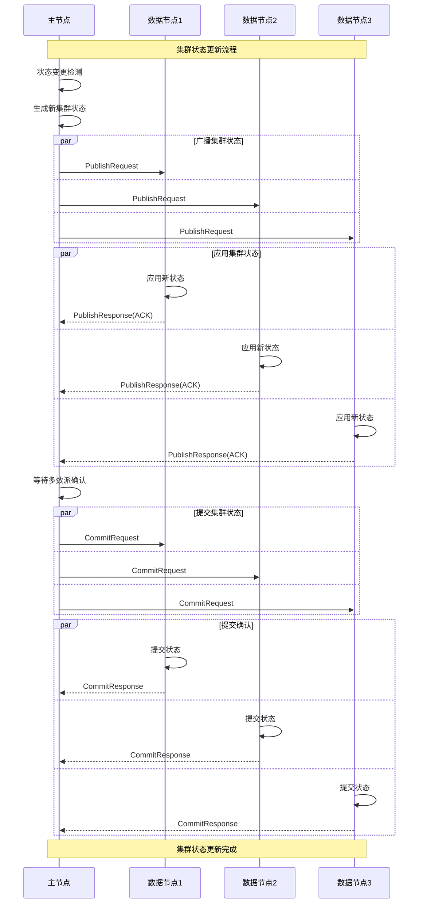
```mermaid
sequenceDiagram
    participant Master as 主节点
    participant DataNode1 as 数据节点1
    participant DataNode2 as 数据节点2
    participant DataNode3 as 数据节点3

    Note over Master,DataNode3: 集群状态更新流程

    Master->>Master: 状态变更检测
    Master->>Master: 生成新集群状态

    par 广播集群状态
        Master->>DataNode1: PublishRequest
    and
        Master->>DataNode2: PublishRequest
    and
        Master->>DataNode3: PublishRequest
    end

    par 应用集群状态
        DataNode1->>DataNode1: 应用新状态
        DataNode1-->>Master: PublishResponse(ACK)
    and
        DataNode2->>DataNode2: 应用新状态
        DataNode2-->>Master: PublishResponse(ACK)
    and
        DataNode3->>DataNode3: 应用新状态
        DataNode3-->>Master: PublishResponse(ACK)
    end

    Master->>Master: 等待多数派确认

    par 提交集群状态
        Master->>DataNode1: CommitRequest
    and
        Master->>DataNode2: CommitRequest
    and
        Master->>DataNode3: CommitRequest
    end

    par 提交确认
        DataNode1->>DataNode1: 提交状态
        DataNode1-->>Master: CommitResponse
    and
        DataNode2->>DataNode2: 提交状态
        DataNode2-->>Master: CommitResponse
    and
        DataNode3->>DataNode3: 提交状态
        DataNode3-->>Master: CommitResponse
    end

    Note over Master,DataNode3: 集群状态更新完成
```

**集群内部通信时序图详细说明**:

**集群状态更新流程**是Elasticsearch集群协调的核心机制，采用两阶段提交协议确保数据一致性：

**阶段1: 状态变更检测与生成**
- 主节点监控集群状态变化（节点加入/离开、索引创建/删除等）
- 基于当前状态和变更事件生成新的集群状态
- 新状态包含完整的集群元数据、路由表、节点信息等

**阶段2: 状态广播 (Publish Phase)**
- 主节点并行向所有数据节点发送PublishRequest
- 请求包含完整的新集群状态信息
- 采用并行发送提高效率，减少状态同步延迟

**阶段3: 状态应用 (Apply Phase)**
- 各数据节点接收到新状态后进行本地应用
- 包括更新本地元数据、调整分片分配、更新路由信息等
- 应用成功后向主节点发送PublishResponse确认

**阶段4: 多数派确认**
- 主节点等待多数派节点的确认响应
- 只有获得多数派确认才能进入下一阶段
- 这确保了集群状态的一致性和可靠性

**阶段5: 状态提交 (Commit Phase)**
- 主节点向所有节点发送CommitRequest
- 指示各节点正式提交新的集群状态
- 此时新状态正式生效

**阶段6: 提交确认**
- 各节点完成状态提交后发送CommitResponse
- 主节点收到确认后，状态更新流程完成
- 集群进入新的稳定状态

**关键特性**:

1. **两阶段提交**: 确保集群状态的强一致性
2. **并行处理**: 提高状态同步的效率
3. **多数派机制**: 防止脑裂和数据不一致
4. **容错设计**: 处理节点故障和网络分区

**性能优化**:

- **批量更新**: 将多个变更合并为一次状态更新
- **增量同步**: 只同步变更的部分，减少网络开销
- **压缩传输**: 对大的状态数据进行压缩传输
- **超时机制**: 设置合理的超时时间，避免长时间等待

#### 2.2.3 分布式搜索时序图

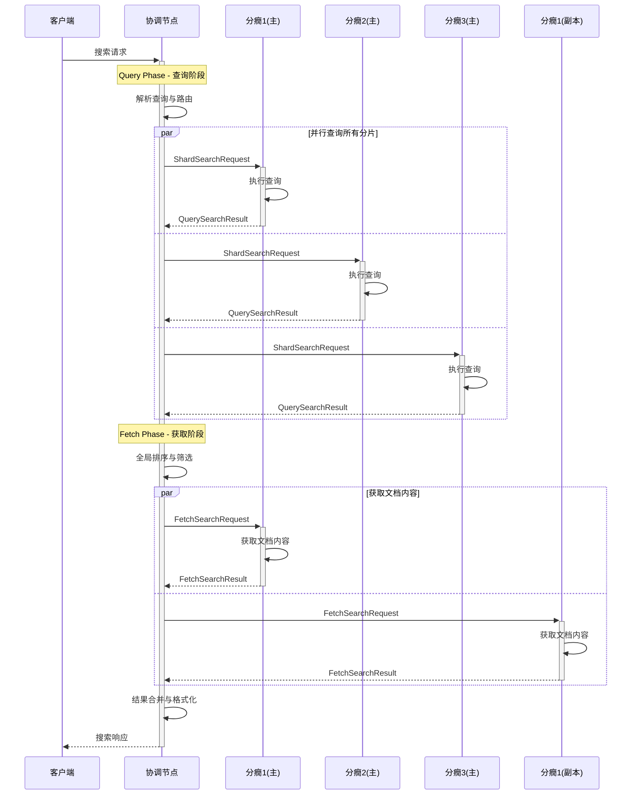
```mermaid
sequenceDiagram
    participant Client as 客户端
    participant Coordinator as 协调节点
    participant Shard1 as 分癇1(主)
    participant Shard2 as 分癇2(主)
    participant Shard3 as 分癇3(主)
    participant Replica1 as 分癇1(副本)

    Client->>+Coordinator: 搜索请求

    Note over Coordinator: Query Phase - 查询阶段
    Coordinator->>Coordinator: 解析查询与路由

    par 并行查询所有分片
        Coordinator->>+Shard1: ShardSearchRequest
        Shard1->>Shard1: 执行查询
        Shard1-->>-Coordinator: QuerySearchResult
    and
        Coordinator->>+Shard2: ShardSearchRequest
        Shard2->>Shard2: 执行查询
        Shard2-->>-Coordinator: QuerySearchResult
    and
        Coordinator->>+Shard3: ShardSearchRequest
        Shard3->>Shard3: 执行查询
        Shard3-->>-Coordinator: QuerySearchResult
    end

    Note over Coordinator: Fetch Phase - 获取阶段
    Coordinator->>Coordinator: 全局排序与筛选

    par 获取文档内容
        Coordinator->>+Shard1: FetchSearchRequest
        Shard1->>Shard1: 获取文档内容
        Shard1-->>-Coordinator: FetchSearchResult
    and
        Coordinator->>+Replica1: FetchSearchRequest
        Replica1->>Replica1: 获取文档内容
        Replica1-->>-Coordinator: FetchSearchResult
    end

    Coordinator->>Coordinator: 结果合并与格式化
    Coordinator-->>-Client: 搜索响应
```

**分布式搜索时序图详细说明**:

**分布式搜索**是Elasticsearch的核心功能，采用两阶段搜索模式实现高效的分布式查询：

**阶段1: 查询阶段 (Query Phase)**

**步骤1: 查询解析与路由**
- 协调节点接收客户端搜索请求
- 解析查询DSL，构建Lucene查询对象
- 根据索引路由表确定需要查询的分片
- 生成分片级别的搜索请求

**步骤2: 并行分片查询**
- 协调节点并行向所有相关分片发送ShardSearchRequest
- 每个分片独立执行查询操作
- 分片返回TopDocs（文档ID + 评分），不包含文档内容
- 这样可以减少网络传输量，提高查询效率

**步骤3: 查询结果收集**
- 协调节点收集所有分片的QuerySearchResult
- 每个结果包含匹配文档的ID、评分、排序值等元信息
- 为下一阶段的全局排序做准备

**阶段2: 获取阶段 (Fetch Phase)**

**步骤4: 全局排序与筛选**
- 协调节点对所有分片的结果进行全局排序
- 根据from和size参数筛选出需要返回的文档
- 确定需要获取完整内容的文档ID列表

**步骤5: 并行获取文档内容**
- 协调节点向相关分片发送FetchSearchRequest
- 请求中包含需要获取的具体文档ID
- 分片返回完整的文档内容、高亮信息等
- 可以从主分片或副本分片获取，实现负载均衡

**步骤6: 结果合并与格式化**
- 协调节点合并所有获取到的文档内容
- 按照全局排序顺序组装最终结果
- 添加聚合结果、建议结果等附加信息
- 格式化为标准的搜索响应返回给客户端

**关键优化策略**:

1. **两阶段设计**: 分离查询和获取，减少网络传输
2. **并行执行**: 所有分片操作并行进行，提高响应速度
3. **负载均衡**: 获取阶段可以从副本分片读取，分散负载
4. **结果缓存**: 查询结果可以缓存，提高重复查询性能

**性能特点**:

- **网络效率**: 查询阶段只传输元数据，大幅减少网络开销
- **并发性能**: 充分利用集群的并行处理能力
- **可扩展性**: 随着分片数量增加，查询性能线性提升
- **容错性**: 单个分片故障不影响整体查询结果

**适用场景**:

- **大数据量查询**: 适合TB级别数据的快速搜索
- **复杂查询**: 支持复杂的布尔查询、聚合分析
- **实时搜索**: 近实时的搜索响应能力
- **高并发**: 支持大量并发搜索请求

### 2.3 核心组件详细说明

#### 2.3.1 REST 层组件

**RestController - HTTP请求中央调度器**

RestController是Elasticsearch REST API的核心调度器，负责接收所有HTTP请求并路由到相应的处理器。

**核心功能**:
- HTTP请求的接收和初步处理
- 基于URL路径的高效路由匹配
- REST处理器的注册和管理
- 请求拦截和全局错误处理

**关键实现**:
```java
/**
 * RestController核心路由方法
 * @param request HTTP请求对象
 * @param channel HTTP响应通道
 * @param threadContext 线程上下文
 */
public void dispatchRequest(RestRequest request, RestChannel channel, ThreadContext threadContext) {
    // 1. 添加产品标识头
    threadContext.addResponseHeader(ELASTIC_PRODUCT_HTTP_HEADER, ELASTIC_PRODUCT_HTTP_HEADER_VALUE);

    try {
        // 2. 尝试匹配所有可能的处理器
        tryAllHandlers(request, channel, threadContext);
    } catch (Exception e) {
        try {
            // 3. 统一错误处理
            sendFailure(channel, e);
        } catch (Exception inner) {
            inner.addSuppressed(e);
            logger.error("发送错误响应失败: uri=[{}]", request.uri(), inner);
        }
    }
}

/**
 * 尝试所有可能的处理器进行路由匹配
 * 使用PathTrie数据结构进行高效路径匹配
 */
private void tryAllHandlers(RestRequest request, RestChannel channel, ThreadContext threadContext) {
    // 获取请求路径和HTTP方法
    String path = request.path();
    RestRequest.Method method = request.method();

    // 在PathTrie中查找匹配的处理器
    MethodHandlers methodHandlers = handlers.retrieve(path, request.params());

    if (methodHandlers != null) {
        RestHandler handler = methodHandlers.getHandler(method);
        if (handler != null) {
            // 找到匹配的处理器，执行请求处理
            handler.handleRequest(request, channel, client);
            return;
        }
    }

    // 没有找到匹配的处理器，返回404错误
    channel.sendResponse(new BytesRestResponse(RestStatus.NOT_FOUND,
        "没有找到处理器: " + request.method() + " " + request.path()));
}
```

**PathTrie路由算法**:
PathTrie是一种专门用于URL路径匹配的树形数据结构，支持参数化路径匹配：

```java
/**
 * PathTrie路径匹配示例
 * 支持参数化路径如: /{index}/_doc/{id}
 */
public class PathTrie<T> {
    private final TrieNode<T> root = new TrieNode<>();

    /**
     * 插入路径模式
     * @param path 路径模式，如 "/{index}/_search"
     * @param value 关联的处理器
     */
    public void insert(String path, T value) {
        String[] pathElements = path.split("/");
        TrieNode<T> current = root;

        for (String element : pathElements) {
            if (element.isEmpty()) continue;

            // 处理参数化路径元素
            if (element.startsWith("{") && element.endsWith("}")) {
                current = current.getOrCreateParameterChild();
            } else {
                current = current.getOrCreateChild(element);
            }
        }

        current.setValue(value);
    }

    /**
     * 检索匹配的处理器
     * @param path 实际请求路径
     * @param params 用于存储提取的路径参数
     * @return 匹配的处理器
     */
    public T retrieve(String path, Map<String, String> params) {
        String[] pathElements = path.split("/");
        return retrieveInternal(pathElements, 0, root, params);
    }
}
```

**RestHandler - 具体REST端点处理器**

每个RestHandler负责处理特定类型的REST请求，实现了统一的请求处理接口。

**核心接口**:
```java
/**
 * REST处理器基础接口
 * 所有REST端点处理器都必须实现此接口
 */
public interface RestHandler {

    /**
     * 定义处理器支持的路由
     * @return 路由列表，包含HTTP方法和路径模式
     */
    List<Route> routes();

    /**
     * 处理REST请求的核心方法
     * @param request REST请求对象
     * @param channel REST响应通道
     * @param client 节点客户端，用于执行实际操作
     * @throws RestException REST处理异常
     */
    void handleRequest(RestRequest request, RestChannel channel, NodeClient client) throws RestException;

    /**
     * 准备请求处理（可选实现）
     * 用于请求预处理和参数解析
     * @param request REST请求
     * @param client 节点客户端
     * @return 通道消费者，用于异步处理
     */
    default RestChannelConsumer prepareRequest(RestRequest request, NodeClient client) throws IOException {
        throw new UnsupportedOperationException("未实现prepareRequest方法");
    }
}
```

**具体处理器示例**:
```java
/**
 * 搜索API处理器示例
 * 处理 GET/POST /_search 和 GET/POST /{index}/_search 请求
 */
public class RestSearchAction extends BaseRestHandler {

    @Override
    public List<Route> routes() {
        return List.of(
            new Route(GET, "/_search"),
            new Route(POST, "/_search"),
            new Route(GET, "/{index}/_search"),
            new Route(POST, "/{index}/_search")
        );
    }

    @Override
    public RestChannelConsumer prepareRequest(final RestRequest request, final NodeClient client) throws IOException {
        // 1. 创建搜索请求对象
        SearchRequest searchRequest = new SearchRequest();

        // 2. 解析目标索引
        String[] indices = Strings.splitStringByCommaToArray(request.param("index"));
        if (indices.length > 0) {
            searchRequest.indices(indices);
        }

        // 3. 解析查询参数
        parseSearchParameters(request, searchRequest);

        // 4. 解析请求体（查询DSL）
        if (request.hasContentOrSourceParam()) {
            try (XContentParser parser = request.contentOrSourceParamParser()) {
                searchRequest.source(SearchSourceBuilder.fromXContent(parser));
            }
        }

        // 5. 返回异步处理函数
        return channel -> client.search(searchRequest, new RestToXContentListener<>(channel));
    }

    /**
     * 解析搜索相关的URL参数
     */
    private void parseSearchParameters(RestRequest request, SearchRequest searchRequest) {
        // 设置搜索类型
        String searchType = request.param("search_type");
        if (searchType != null) {
            searchRequest.searchType(SearchType.fromString(searchType));
        }

        // 设置路由参数
        searchRequest.routing(request.param("routing"));

        // 设置偏好设置
        searchRequest.preference(request.param("preference"));

        // 设置超时时间
        String timeout = request.param("timeout");
        if (timeout != null) {
            searchRequest.source().timeout(TimeValue.parseTimeValue(timeout, null, "timeout"));
        }

        // 设置分页参数
        String from = request.param("from");
        if (from != null) {
            searchRequest.source().from(Integer.parseInt(from));
        }

        String size = request.param("size");
        if (size != null) {
            searchRequest.source().size(Integer.parseInt(size));
        }
    }
}
```

**ActionModule - 动作模块注册器**

ActionModule负责系统启动时注册所有的REST处理器和Transport动作。

**核心功能**:
```java
/**
 * ActionModule构造函数
 * 在系统启动时注册所有REST处理器
 */
public ActionModule(boolean supportedFeatures, Settings settings, IndexNameExpressionResolver indexNameExpressionResolver,
                   SettingsFilter settingsFilter, ThreadPool threadPool, List<ActionPlugin> actionPlugins,
                   NodeClient nodeClient, CircuitBreakerService circuitBreakerService, UsageService usageService,
                   ClusterService clusterService) {

    // 1. 初始化REST处理器映射
    Map<String, RestHandler> restHandlers = new HashMap<>();

    // 2. 注册核心REST处理器
    registerCoreRestHandlers(restHandlers, clusterService, settingsFilter);

    // 3. 注册插件提供的REST处理器
    registerPluginRestHandlers(restHandlers, actionPlugins);

    // 4. 创建RestController并注册所有处理器
    this.restController = new RestController(restHandlers, nodeClient);
}

/**
 * 注册核心REST处理器
 */
private void registerCoreRestHandlers(Map<String, RestHandler> restHandlers, ClusterService clusterService, SettingsFilter settingsFilter) {
    // 文档操作API
    registerHandler(restHandlers, new RestIndexAction());
    registerHandler(restHandlers, new RestGetAction());
    registerHandler(restHandlers, new RestUpdateAction());
    registerHandler(restHandlers, new RestDeleteAction());

    // 搜索API
    registerHandler(restHandlers, new RestSearchAction());
    registerHandler(restHandlers, new RestMultiSearchAction());

    // 批量操作API
    registerHandler(restHandlers, new RestBulkAction());

    // 索引管理API
    registerHandler(restHandlers, new RestCreateIndexAction());
    registerHandler(restHandlers, new RestDeleteIndexAction());
    registerHandler(restHandlers, new RestGetMappingAction());
    registerHandler(restHandlers, new RestPutMappingAction());

    // 集群管理API
    registerHandler(restHandlers, new RestClusterHealthAction());
    registerHandler(restHandlers, new RestClusterStateAction());
    registerHandler(restHandlers, new RestNodesInfoAction());
    registerHandler(restHandlers, new RestNodesStatsAction());
}
```

**特性总结**:

1. **高效路由**: 使用PathTrie实现O(log n)复杂度的路径匹配
2. **参数化支持**: 支持路径参数提取，如`/{index}/_doc/{id}`
3. **版本兼容**: 支持多版本API的并存和路由
4. **插件扩展**: 支持插件注册自定义REST处理器
5. **统一错误处理**: 提供统一的异常处理和错误响应机制

#### 2.3.2 传输层组件

**TransportService - 节点间通信服务**
- 功能：处理集群内节点间的通信，支持请求-响应和单向消息
- 特性：基于Netty实现，支持连接池、压缩、加密
- 关键方法：`sendRequest()`, `registerRequestHandler()`

**ActionListener - 异步操作回调机制**
- 功能：处理异步操作的成功和失败回调
- 特性：支持链式调用、错误传播、资源清理
- 关键方法：`onResponse()`, `onFailure()`

**ThreadPool - 线程池管理器**
- 功能：管理不同类型任务的线程池，如搜索、索引、管理
- 特性：支持动态调整、任务队列、拒绝策略
- 线程池类型：`search`, `index`, `bulk`, `management`, `flush`

#### 2.3.3 核心服务组件

**SearchService - 搜索服务核心**
- 功能：处理所有搜索相关操作，包括查询、获取、聚合
- 特性：支持多阶段搜索、搜索上下文管理、结果缓存
- 关键方法：`executeQueryPhase()`, `executeFetchPhase()`

**IndexService - 索引服务核心**
- 功能：管理单个索引的所有操作，包括分片管理、映射管理
- 特性：包含多个分片，提供统一的索引级别接口
- 关键方法：`createShard()`, `getShard()`, `mapperService()`

**ClusterService - 集群状态管理**
- 功能：管理集群状态的变更、分发和应用
- 特性：支持事件监听、状态一致性、任务调度
- 关键方法：`submitStateUpdateTask()`, `addListener()`

**IndicesService - 索引生命周期管理**
- 功能：管理所有索引的创建、删除、配置变更
- 特性：监听集群状态变化，自动创建和销毁索引
- 关键方法：`createIndex()`, `deleteIndex()`, `indexService()`

#### 2.3.4 引擎层组件

**InternalEngine - 内部引擎**
- 功能：封装Lucene操作，提供统一的索引、搜索、删除接口
- 特性：支持事务日志、版本控制、并发控制
- 关键方法：`index()`, `delete()`, `get()`, `refresh()`

**TransLog - 事务日志**
- 功能：记录所有写操作，用于故障恢复和数据同步
- 特性：支持滚动、压缩、检查点机制
- 关键方法：`add()`, `rollGeneration()`, `sync()`

#### 2.3.5 存储层组件

**IndexShard - 索引分片**
- 功能：管理单个分片的所有操作，包括主副本同步
- 特性：支持分片状态管理、恢复机制、性能监控
- 关键方法：`applyIndexOperationOnPrimary()`, `acquireSearcher()`

**Store - 存储抽象层**
- 功能：封装文件系统操作，提供统一的存储接口
- 特性：支持文件锁、校验和、压缩存储
- 关键方法：`directory()`, `readLock()`, `verify()`

#### 2.3.6 组件间协作模式

**请求处理流程**:
```
HTTP请求 → RestController → RestHandler → TransportAction → 业务服务 → Engine → Lucene
```

**异步处理模式**:
- 所有长时间操作都通过ActionListener实现异步处理
- ThreadPool根据任务类型分配到不同线程池
- 支持任务优先级和拒绝策略

**错误处理机制**:
- 分层错误处理：每层都有自己的错误处理逻辑
- 错误传播：ActionListener链式传播错误信息
- 资源清理：确保在错误情况下正确释放资源

**性能优化策略**:
- 连接池复用：减少连接建立开销
- 批量处理：合并多个小请求为批量操作
- 缓存机制：多层缓存提高响应速度
- 压缩传输：减少网络带宽消耗

---

## REST API 深入分析

### 3.1 REST API 架构

Elasticsearch 的 REST API 是系统对外的主要接口，采用分层架构设计：

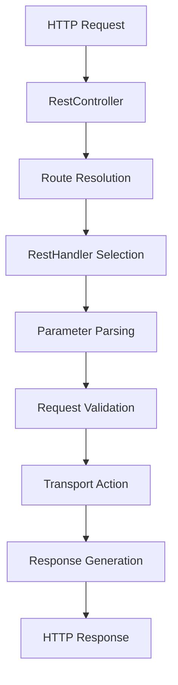
```mermaid
graph TD
    A[HTTP Request] --> B[RestController]
    B --> C[Route Resolution]
    C --> D[RestHandler Selection]
    D --> E[Parameter Parsing]
    E --> F[Request Validation]
    F --> G[Transport Action]
    G --> H[Response Generation]
    H --> I[HTTP Response]
```

### 3.2 核心入口函数分析

#### 3.2.1 RestController 类

**文件位置**: `server/src/main/java/org/elasticsearch/rest/RestController.java`

**核心功能**: HTTP请求的中央调度器，负责路由解析和处理器分发

```java
public class RestController implements HttpServerTransport.Dispatcher {

    // 路径树，用于快速路由匹配
    private final PathTrie<MethodHandlers> handlers = new PathTrie<>(RestUtils.REST_DECODER);

    // 请求拦截器
    private final RestInterceptor interceptor;

    // 节点客户端
    private final NodeClient client;

    /**
     * 核心请求分发方法
     * 功能：接收HTTP请求，解析路径，找到对应的处理器并执行
     */
    @Override
    public void dispatchRequest(RestRequest request, RestChannel channel, ThreadContext threadContext) {
        // 添加Elasticsearch产品标识头
        threadContext.addResponseHeader(ELASTIC_PRODUCT_HTTP_HEADER, ELASTIC_PRODUCT_HTTP_HEADER_VALUE);
        try {
            // 尝试所有可能的处理器
            tryAllHandlers(request, channel, threadContext);
        } catch (Exception e) {
            try {
                sendFailure(channel, e);
            } catch (Exception inner) {
                inner.addSuppressed(e);
                logger.error(() -> "failed to send failure response for uri [" + request.uri() + "]", inner);
            }
        }
    }

    /**
     * 注册REST处理器
     * 功能：将REST端点与处理器关联
     */
    public void registerHandler(final RestHandler handler) {
        handler.routes().forEach(route -> registerHandler(route, handler));
    }
}
```

**关键特性**:
- 使用 PathTrie 进行高效的路径匹配
- 支持多版本API路由
- 内置请求拦截和错误处理机制
- 线程安全的请求处理

#### 3.2.2 ActionModule 类

**文件位置**: `server/src/main/java/org/elasticsearch/action/ActionModule.java`

**核心功能**: 注册所有REST处理器和Transport动作

```java
public class ActionModule extends AbstractModule {

    /**
     * 初始化REST处理器
     * 功能：注册所有内置的REST API端点
     */
    private void initRestHandlers(Consumer<RestHandler> registerHandler) {
        // 索引操作相关API
        registerHandler.accept(new RestIndexAction(clusterService, projectIdResolver));
        registerHandler.accept(new RestGetAction());
        registerHandler.accept(new RestDeleteAction());
        registerHandler.accept(new RestUpdateAction());

        // 搜索操作相关API
        registerHandler.accept(new RestSearchAction(restController.getSearchUsageHolder(),
                                                   clusterSupportsFeature, settings));
        registerHandler.accept(new RestMultiSearchAction(settings,
                                                        restController.getSearchUsageHolder(),
                                                        clusterSupportsFeature));

        // 批量操作API
        registerHandler.accept(new RestBulkAction(settings, clusterSettings, bulkService));

        // 集群管理API
        registerHandler.accept(new RestClusterHealthAction());
        registerHandler.accept(new RestClusterStateAction());

        // 索引管理API
        registerHandler.accept(new RestCreateIndexAction());
        registerHandler.accept(new RestDeleteIndexAction());
        registerHandler.accept(new RestGetMappingAction());
        registerHandler.accept(new RestPutMappingAction());
    }
}
```

### 3.3 主要 API 端点深度分析

#### 3.3.1 搜索 API 深度分析

**REST处理器**: `RestSearchAction`
**Transport动作**: `TransportSearchAction`
**支持的端点**:
- `GET /_search` - 全局搜索
- `POST /_search` - 全局搜索（复杂查询）
- `GET /{index}/_search` - 指定索引搜索
- `POST /{index}/_search` - 指定索引搜索（复杂查询）

**RestSearchAction 入口函数**:
```java
@Override
public RestChannelConsumer prepareRequest(final RestRequest request, final NodeClient client) throws IOException {
    // 解析请求参数
    SearchRequest searchRequest = new SearchRequest();

    // 设置目标索引
    String[] indices = Strings.splitStringByCommaToArray(request.param("index"));
    if (indices.length > 0) {
        searchRequest.indices(indices);
    }

    // 解析查询参数
    IntConsumer setSize = size -> {
        if (searchRequest.source() == null) {
            searchRequest.source(new SearchSourceBuilder());
        }
        searchRequest.source().size(size);
    };

    // 解析请求体
    if (request.hasContentOrSourceParam()) {
        try (XContentParser parser = request.contentOrSourceParamParser()) {
            searchRequest.source(SearchSourceBuilder.fromXContent(parser));
        }
    }

    // 设置搜索类型
    searchRequest.searchType(request.param("search_type"));

    // 设置路由参数
    searchRequest.routing(request.param("routing"));

    // 设置偏好设置
    searchRequest.preference(request.param("preference"));

    // 返回处理函数
    return channel -> client.search(searchRequest, new RestToXContentListener<>(channel));
}
```

**完整调用链路分析**:
```
1. RestSearchAction.prepareRequest()
   │
   └→ 解析HTTP请求参数
   │
   └→ 构建 SearchRequest 对象
   │
2. TransportSearchAction.doExecute()
   │
   └→ executeRequest() - 执行搜索请求
   │
   └→ resolveIndices() - 解析目标索引
   │
   └→ executeSearch() - 执行搜索
   │
3. AbstractSearchAsyncAction.start()
   │
   └→ performFirstPhase() - 执行第一阶段（Query Phase）
   │
   └→ SearchService.executeQueryPhase()
   │
4. SearchService.executeQueryPhase()
   │
   └→ createSearchContext() - 创建搜索上下文
   │
   └→ queryPhase.execute() - 执行查询阶段
   │
5. QueryPhase.execute()
   │
   └→ Lucene IndexSearcher.search() - Lucene查询执行
```

**QueryPhase 核心执行代码**:
```java
public void execute(SearchContext searchContext) throws QueryPhaseExecutionException {
    try {
        // 获取查询器
        IndexSearcher searcher = searchContext.searcher();

        // 构建 Lucene 查询
        Query query = searchContext.query();

        // 创建收集器
        TopDocsCollector<?> topDocsCollector;
        if (searchContext.sort() != null) {
            // 排序查询
            topDocsCollector = TopFieldCollector.create(
                searchContext.sort(),
                searchContext.size(),
                Integer.MAX_VALUE
            );
        } else {
            // 评分排序
            topDocsCollector = TopScoreDocCollector.create(
                searchContext.size(),
                Integer.MAX_VALUE
            );
        }

        // 执行搜索
        searcher.search(query, topDocsCollector);

        // 获取结果
        TopDocs topDocs = topDocsCollector.topDocs();

        // 设置查询结果
        searchContext.queryResult().topDocs(
            new TopDocsAndMaxScore(topDocs, topDocs.scoreDocs.length > 0 ? topDocs.scoreDocs[0].score : Float.NaN),
            searchContext.searcher().getIndexReader().leaves().toArray(new LeafReaderContext[0])
        );

    } catch (Exception e) {
        throw new QueryPhaseExecutionException(searchContext.shardTarget(), "Failed to execute main query", e);
    }
}
```

#### 3.3.2 索引 API 深度分析

**REST处理器**: `RestIndexAction`
**Transport动作**: `TransportIndexAction`
**支持的端点**:
- `PUT /{index}/_doc/{id}` - 索引指定ID文档
- `POST /{index}/_doc` - 索引自动ID文档
- `PUT /{index}/_create/{id}` - 创建新文档（ID必须不存在）

**RestIndexAction 入口函数**:
```java
@Override
public RestChannelConsumer prepareRequest(final RestRequest request, final NodeClient client) throws IOException {
    // 解析路径参数
    String index = request.param("index");
    String id = request.param("id");
    String routing = request.param("routing");

    // 创建索引请求
    IndexRequest indexRequest = new IndexRequest(index);

    // 设置文档ID
    if (id != null) {
        indexRequest.id(id);
    }

    // 设置路由
    if (routing != null) {
        indexRequest.routing(routing);
    }

    // 设置操作类型
    String opType = request.param("op_type");
    if (opType != null) {
        indexRequest.opType(DocWriteRequest.OpType.fromString(opType));
    }

    // 设置版本控制
    indexRequest.version(RestActions.parseVersion(request));
    indexRequest.versionType(VersionType.fromString(request.param("version_type"), indexRequest.versionType()));

    // 设置文档源数据
    indexRequest.source(request.requiredContent(), request.getXContentType());

    // 设置刷新策略
    indexRequest.setRefreshPolicy(RefreshPolicy.parse(request.param("refresh")));

    // 设置等待活跃分片数
    indexRequest.waitForActiveShards(ActiveShardCount.parseString(request.param("wait_for_active_shards")));

    // 设置管道
    indexRequest.setPipeline(request.param("pipeline"));

    return channel -> client.index(indexRequest, new RestStatusToXContentListener<>(channel, r -> r.getLocation(indexRequest.routing())));
}
```

**完整调用链路分析**:
```
1. RestIndexAction.prepareRequest()
   │
   └→ 解析HTTP请求参数
   │
   └→ 构建 IndexRequest 对象
   │
2. TransportIndexAction.doExecute()
   │
   └→ resolveRequest() - 解析请求
   │
   └→ shardOperationOnPrimary() - 主分片操作
   │
3. IndexShard.applyIndexOperationOnPrimary()
   │
   └→ prepareIndex() - 准备索引操作
   │
   └→ Engine.index() - 执行索引操作
   │
4. InternalEngine.index()
   │
   └→ parseDocument() - 解析文档
   │
   └→ addDocuments() - 添加文档到Lucene
   │
   └→ translog.add() - 记录事务日志
```

**InternalEngine.index() 核心代码**:
```java
@Override
public IndexResult index(Index index) throws IOException {
    assert Objects.equals(index.uid().field(), IdFieldMapper.NAME) : index.uid().field();
    final boolean doThrottle = index.origin().isRecovery() == false;
    try (ReleasableLock releasableLock = readLock.acquire()) {
        ensureOpen();
        assert assertIncomingSequenceNumber(index.origin(), index.seqNo());

        try (Releasable ignored = doThrottle ? throttle.acquireThrottle() : () -> {}) {
            // 解析文档
            ParsedDocument doc = index.parsedDoc();

            // 检查版本冲突
            final IndexingStrategy plan = indexingStrategyForOperation(index);

            // 执行索引操作
            final IndexResult indexResult;
            if (plan.earlyResultOnPreflightError.isPresent()) {
                indexResult = plan.earlyResultOnPreflightError.get();
            } else {
                // 添加文档到Lucene
                if (plan.indexIntoLucene) {
                    addDocs(doc, indexWriter);
                }

                // 记录事务日志
                if (plan.addStaleOpToLucene == false) {
                    translog.add(new Translog.Index(index, indexResult));
                }

                indexResult = new IndexResult(
                    plan.versionForIndexing,
                    index.seqNo(),
                    index.primaryTerm(),
                    plan.indexIntoLucene
                );
            }

            // 刷新处理
            if (index.origin().isFromTranslog() == false) {
                final Translog.Location location = translog.getLastWriteLocation();
                indexResult.setTranslogLocation(location);
            }

            indexResult.setTook(System.nanoTime() - index.startTime());
            indexResult.freeze();
            return indexResult;
        }
    } catch (RuntimeException | IOException e) {
        try {
            maybeFailEngine("index", e);
        } catch (Exception inner) {
            e.addSuppressed(inner);
        }
        throw e;
    }
}
```

#### 3.3.3 批量操作 API 深度分析

**REST处理器**: `RestBulkAction`
**Transport动作**: `TransportBulkAction`
**支持的端点**:
- `POST /_bulk` - 全局批量操作
- `PUT /_bulk` - 全局批量操作
- `POST /{index}/_bulk` - 指定索引批量操作

**RestBulkAction 入口函数**:
```java
@Override
public RestChannelConsumer prepareRequest(final RestRequest request, final NodeClient client) throws IOException {
    // 解析路径参数
    String defaultIndex = request.param("index");
    String defaultRouting = request.param("routing");
    String defaultPipeline = request.param("pipeline");

    // 创建批量请求
    BulkRequest bulkRequest = new BulkRequest();

    // 设置全局参数
    if (defaultIndex != null) {
        bulkRequest.add(
            request.requiredContent(),
            defaultIndex,
            request.getXContentType()
        );
    } else {
        bulkRequest.add(
            request.requiredContent(),
            null,
            request.getXContentType()
        );
    }

    // 设置刷新策略
    bulkRequest.setRefreshPolicy(RefreshPolicy.parse(request.param("refresh")));

    // 设置等待活跃分片数
    bulkRequest.waitForActiveShards(ActiveShardCount.parseString(request.param("wait_for_active_shards")));

    // 设置超时
    bulkRequest.timeout(request.paramAsTime("timeout", BulkShardRequest.DEFAULT_TIMEOUT));

    return channel -> client.bulk(bulkRequest, new RestStatusToXContentListener<>(channel));
}
```

**完整调用链路分析**:
```
1. RestBulkAction.prepareRequest()
   │
   └→ 解析批量请求格式
   │
   └→ 构建 BulkRequest 对象
   │
2. TransportBulkAction.doExecute()
   │
   └→ BulkOperation.execute() - 执行批量操作
   │
3. BulkOperation.execute()
   │
   └→ groupRequestsByShard() - 按分片分组请求
   │
   └→ executeBulkShardRequests() - 执行分片批量请求
   │
4. TransportShardBulkAction.shardOperationOnPrimary()
   │
   └→ performOpOnPrimary() - 在主分片上执行操作
   │
5. IndexShard.applyIndexOperationOnPrimary()
   │
   └→ Engine.index/update/delete() - 执行具体操作
```

**BulkOperation.groupRequestsByShard() 关键代码**:
```java
private Map<ShardId, List<BulkItemRequest>> groupRequestsByShard(
    Map<String, List<BulkItemRequest>> requestsByIndex,
    ClusterState clusterState
) {
    final Map<ShardId, List<BulkItemRequest>> requestsByShard = new HashMap<>();

    for (Map.Entry<String, List<BulkItemRequest>> entry : requestsByIndex.entrySet()) {
        String indexName = entry.getKey();
        List<BulkItemRequest> requests = entry.getValue();

        // 获取索引元数据
        IndexMetadata indexMetadata = clusterState.metadata().index(indexName);
        if (indexMetadata == null) {
            // 索引不存在，记录错误
            continue;
        }

        for (BulkItemRequest request : requests) {
            try {
                // 计算分片ID
                ShardId shardId = clusterService.operationRouting().indexShards(
                    clusterState,
                    indexName,
                    request.request().id(),
                    request.request().routing()
                ).shardId();

                // 按分片分组
                requestsByShard.computeIfAbsent(shardId, k -> new ArrayList<>()).add(request);

            } catch (Exception e) {
                // 记录路由错误
                logger.debug("Failed to route request for index [{}]", indexName, e);
            }
        }
    }

    return requestsByShard;
}
```

#### 3.3.4 集群管理 API 深度分析

**集群健康 API**:
```java
// RestClusterHealthAction.prepareRequest()
@Override
public RestChannelConsumer prepareRequest(final RestRequest request, final NodeClient client) throws IOException {
    ClusterHealthRequest clusterHealthRequest = new ClusterHealthRequest();

    // 设置目标索引
    clusterHealthRequest.indices(Strings.splitStringByCommaToArray(request.param("index")));

    // 设置等待状态
    clusterHealthRequest.waitForStatus(ClusterHealthStatus.fromString(request.param("wait_for_status")));

    // 设置等待节点数
    clusterHealthRequest.waitForNodes(request.param("wait_for_nodes"));

    // 设置超时
    clusterHealthRequest.timeout(request.paramAsTime("timeout", clusterHealthRequest.timeout()));

    return channel -> client.admin().cluster().health(clusterHealthRequest, new RestStatusToXContentListener<>(channel));
}
```

**集群状态 API**:
```java
// RestClusterStateAction.prepareRequest()
@Override
public RestChannelConsumer prepareRequest(final RestRequest request, final NodeClient client) throws IOException {
    final ClusterStateRequest clusterStateRequest = new ClusterStateRequest();

    // 设置过滤器
    clusterStateRequest.routingTable(request.paramAsBoolean("routing_table", clusterStateRequest.routingTable()));
    clusterStateRequest.nodes(request.paramAsBoolean("nodes", clusterStateRequest.nodes()));
    clusterStateRequest.metadata(request.paramAsBoolean("metadata", clusterStateRequest.metadata()));
    clusterStateRequest.blocks(request.paramAsBoolean("blocks", clusterStateRequest.blocks()));

    // 设置索引过滤
    clusterStateRequest.indices(Strings.splitStringByCommaToArray(request.param("indices")));

    return channel -> client.admin().cluster().state(clusterStateRequest, new RestToXContentListener<>(channel));
}
```

#### 3.3.5 索引管理 API 深度分析

**创建索引 API**:
```java
// RestCreateIndexAction.prepareRequest()
@Override
public RestChannelConsumer prepareRequest(final RestRequest request, final NodeClient client) throws IOException {
    CreateIndexRequest createIndexRequest = new CreateIndexRequest(request.param("index"));

    // 解析请求体
    if (request.hasContent()) {
        Map<String, Object> sourceAsMap = XContentHelper.convertToMap(request.requiredContent(), false, request.getXContentType()).v2();

        // 设置索引设置
        if (sourceAsMap.containsKey("settings")) {
            createIndexRequest.settings((Map<String, Object>) sourceAsMap.get("settings"));
        }

        // 设置映射
        if (sourceAsMap.containsKey("mappings")) {
            createIndexRequest.mapping((Map<String, Object>) sourceAsMap.get("mappings"));
        }

        // 设置别名
        if (sourceAsMap.containsKey("aliases")) {
            createIndexRequest.aliases((Map<String, Object>) sourceAsMap.get("aliases"));
        }
    }

    // 设置等待活跃分片数
    createIndexRequest.waitForActiveShards(ActiveShardCount.parseString(request.param("wait_for_active_shards")));

    return channel -> client.admin().indices().create(createIndexRequest, new RestToXContentListener<>(channel));
}
```

**删除索引 API**:
```java
// RestDeleteIndexAction.prepareRequest()
@Override
public RestChannelConsumer prepareRequest(final RestRequest request, final NodeClient client) throws IOException {
    DeleteIndexRequest deleteIndexRequest = new DeleteIndexRequest(Strings.splitStringByCommaToArray(request.param("index")));

    // 设置超时
    deleteIndexRequest.timeout(request.paramAsTime("timeout", deleteIndexRequest.timeout()));

    // 设置主节点超时
    deleteIndexRequest.masterNodeTimeout(request.paramAsTime("master_timeout", deleteIndexRequest.masterNodeTimeout()));

    // 设置索引选项
    deleteIndexRequest.indicesOptions(IndicesOptions.fromRequest(request, deleteIndexRequest.indicesOptions()));

    return channel -> client.admin().indices().delete(deleteIndexRequest, new RestToXContentListener<>(channel));
}
```

**获取映射 API**:
```java
// RestGetMappingAction.prepareRequest()
@Override
public RestChannelConsumer prepareRequest(final RestRequest request, final NodeClient client) throws IOException {
    final String[] indices = Strings.splitStringByCommaToArray(request.param("index"));

    GetMappingsRequest getMappingsRequest = new GetMappingsRequest();
    getMappingsRequest.indices(indices);

    // 设置索引选项
    getMappingsRequest.indicesOptions(IndicesOptions.fromRequest(request, getMappingsRequest.indicesOptions()));

    // 设置主节点超时
    getMappingsRequest.masterNodeTimeout(request.paramAsTime("master_timeout", getMappingsRequest.masterNodeTimeout()));

    // 设置本地模式
    getMappingsRequest.local(request.paramAsBoolean("local", getMappingsRequest.local()));

    return channel -> client.admin().indices().getMappings(getMappingsRequest, new RestToXContentListener<>(channel));
}
```

#### 3.3.6 文档操作 API 深度分析

**获取文档 API**:
```java
// RestGetAction.prepareRequest()
@Override
public RestChannelConsumer prepareRequest(final RestRequest request, final NodeClient client) throws IOException {
    GetRequest getRequest = new GetRequest(request.param("index"), request.param("id"));

    // 设置路由
    getRequest.routing(request.param("routing"));

    // 设置偏好设置
    getRequest.preference(request.param("preference"));

    // 设置实时性
    getRequest.realtime(request.paramAsBoolean("realtime", getRequest.realtime()));

    // 设置刷新
    if (request.param("refresh") != null) {
        getRequest.refresh(request.paramAsBoolean("refresh", getRequest.refresh()));
    }

    // 设置返回字段
    String[] includes = Strings.splitStringByCommaToArray(request.param("_source_includes", request.param("_source_include")));
    String[] excludes = Strings.splitStringByCommaToArray(request.param("_source_excludes", request.param("_source_exclude")));
    if (includes.length > 0 || excludes.length > 0) {
        getRequest.fetchSourceContext(new FetchSourceContext(true, includes, excludes));
    }

    return channel -> client.get(getRequest, new RestToXContentListener<>(channel));
}
```

**更新文档 API**:
```java
// RestUpdateAction.prepareRequest()
@Override
public RestChannelConsumer prepareRequest(final RestRequest request, final NodeClient client) throws IOException {
    UpdateRequest updateRequest = new UpdateRequest(request.param("index"), request.param("id"));

    // 设置路由
    updateRequest.routing(request.param("routing"));

    // 设置版本控制
    updateRequest.version(RestActions.parseVersion(request));
    updateRequest.versionType(VersionType.fromString(request.param("version_type"), updateRequest.versionType()));

    // 设置重试次数
    updateRequest.retryOnConflict(request.paramAsInt("retry_on_conflict", updateRequest.retryOnConflict()));

    // 设置刷新策略
    updateRequest.setRefreshPolicy(RefreshPolicy.parse(request.param("refresh")));

    // 解析请求体
    if (request.hasContent()) {
        try (XContentParser parser = request.contentParser()) {
            updateRequest.fromXContent(parser);
        }
    }

    return channel -> client.update(updateRequest, new RestStatusToXContentListener<>(channel));
}
```

**删除文档 API**:
```java
// RestDeleteAction.prepareRequest()
@Override
public RestChannelConsumer prepareRequest(final RestRequest request, final NodeClient client) throws IOException {
    DeleteRequest deleteRequest = new DeleteRequest(request.param("index"), request.param("id"));

    // 设置路由
    deleteRequest.routing(request.param("routing"));

    // 设置版本控制
    deleteRequest.version(RestActions.parseVersion(request));
    deleteRequest.versionType(VersionType.fromString(request.param("version_type"), deleteRequest.versionType()));

    // 设置刷新策略
    deleteRequest.setRefreshPolicy(RefreshPolicy.parse(request.param("refresh")));

    // 设置等待活跃分片数
    deleteRequest.waitForActiveShards(ActiveShardCount.parseString(request.param("wait_for_active_shards")));

    return channel -> client.delete(deleteRequest, new RestStatusToXContentListener<>(channel, r -> r.getLocation(deleteRequest.routing())));
}
```

---

## 搜索模块分析

### 4.1 搜索模块架构

#### 4.1.1 搜索模块整体架构

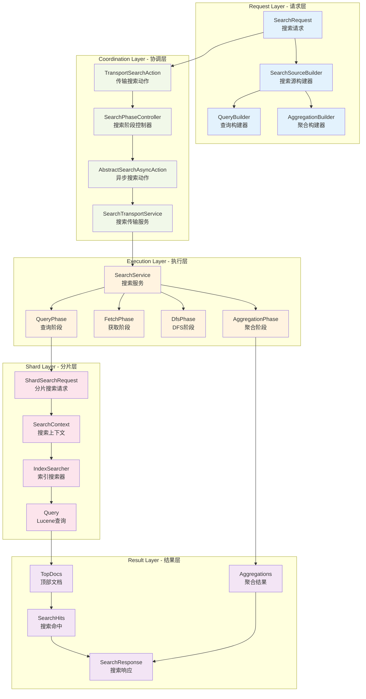
```mermaid
graph TB
    subgraph "Request Layer - 请求层"
        A[SearchRequest<br/>搜索请求]
        B[SearchSourceBuilder<br/>搜索源构建器]
        C[QueryBuilder<br/>查询构建器]
        D[AggregationBuilder<br/>聚合构建器]
    end

    subgraph "Coordination Layer - 协调层"
        E[TransportSearchAction<br/>传输搜索动作]
        F[SearchPhaseController<br/>搜索阶段控制器]
        G[AbstractSearchAsyncAction<br/>异步搜索动作]
        H[SearchTransportService<br/>搜索传输服务]
    end

    subgraph "Execution Layer - 执行层"
        I[SearchService<br/>搜索服务]
        J[QueryPhase<br/>查询阶段]
        K[FetchPhase<br/>获取阶段]
        L[DfsPhase<br/>DFS阶段]
        M[AggregationPhase<br/>聚合阶段]
    end

    subgraph "Shard Layer - 分片层"
        N[ShardSearchRequest<br/>分片搜索请求]
        O[SearchContext<br/>搜索上下文]
        P[IndexSearcher<br/>索引搜索器]
        Q[Query<br/>Lucene查询]
    end

    subgraph "Result Layer - 结果层"
        R[TopDocs<br/>顶部文档]
        S[SearchHits<br/>搜索命中]
        T[Aggregations<br/>聚合结果]
        U[SearchResponse<br/>搜索响应]
    end

    %% 数据流向
    A --> B
    B --> C
    B --> D

    A --> E
    E --> F
    F --> G
    G --> H

    H --> I
    I --> J
    I --> K
    I --> L
    I --> M

    J --> N
    N --> O
    O --> P
    P --> Q

    Q --> R
    R --> S
    M --> T
    S --> U
    T --> U

    %% 样式定义
    classDef requestLayer fill:#e3f2fd
    classDef coordLayer fill:#f1f8e9
    classDef execLayer fill:#fff3e0
    classDef shardLayer fill:#fce4ec
    classDef resultLayer fill:#f3e5f5

    class A,B,C,D requestLayer
    class E,F,G,H coordLayer
    class I,J,K,L,M execLayer
    class N,O,P,Q shardLayer
    class R,S,T,U resultLayer
```

#### 4.1.2 搜索阶段流程图

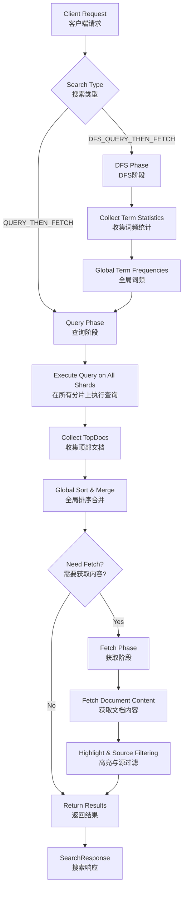
```mermaid
flowchart TD
    A[Client Request<br/>客户端请求] --> B{Search Type<br/>搜索类型}

    B -->|QUERY_THEN_FETCH| C[Query Phase<br/>查询阶段]
    B -->|DFS_QUERY_THEN_FETCH| D[DFS Phase<br/>DFS阶段]

    D --> E[Collect Term Statistics<br/>收集词频统计]
    E --> F[Global Term Frequencies<br/>全局词频]
    F --> C

    C --> G[Execute Query on All Shards<br/>在所有分片上执行查询]
    G --> H[Collect TopDocs<br/>收集顶部文档]
    H --> I[Global Sort & Merge<br/>全局排序合并]

    I --> J{Need Fetch?<br/>需要获取内容?}

    J -->|Yes| K[Fetch Phase<br/>获取阶段]
    J -->|No| L[Return Results<br/>返回结果]

    K --> M[Fetch Document Content<br/>获取文档内容]
    M --> N[Highlight & Source Filtering<br/>高亮与源过滤]
    N --> L

    L --> O[SearchResponse<br/>搜索响应]
```

### 4.2 核心搜索类分析

#### 4.2.1 SearchRequest 类

**文件位置**: `server/src/main/java/org/elasticsearch/action/search/SearchRequest.java`

```java
public class SearchRequest extends LegacyActionRequest implements IndicesRequest.Replaceable, Rewriteable<SearchRequest> {

    // 搜索类型：QUERY_THEN_FETCH 或 DFS_QUERY_THEN_FETCH
    private SearchType searchType = SearchType.DEFAULT;

    // 目标索引
    private String[] indices = Strings.EMPTY_ARRAY;

    // 路由参数
    private String routing;

    // 搜索偏好设置
    private String preference;

    // 搜索源构建器
    private SearchSourceBuilder source;

    // 请求缓存设置
    private Boolean requestCache;

    // 是否允许部分搜索结果
    private Boolean allowPartialSearchResults;

    // 滚动搜索保持时间
    private TimeValue scrollKeepAlive;

    // 批量reduce大小
    private int batchedReduceSize = DEFAULT_BATCHED_REDUCE_SIZE;

    // 最大并发分片请求数
    private int maxConcurrentShardRequests = 0;

    /**
     * 设置搜索源
     */
    public SearchRequest source(SearchSourceBuilder sourceBuilder) {
        this.source = sourceBuilder;
        return this;
    }

    /**
     * 设置目标索引
     */
    public SearchRequest indices(String... indices) {
        this.indices = indices;
        return this;
    }
}
```

#### 4.2.2 TransportSearchAction 类

**文件位置**: `server/src/main/java/org/elasticsearch/action/search/TransportSearchAction.java`

```java
public class TransportSearchAction extends HandledTransportAction<SearchRequest, SearchResponse> {

    /**
     * 执行搜索请求的核心方法
     */
    private void executeRequest(
        SearchTask task,
        SearchRequest original,
        ActionListener<SearchResponse> originalListener,
        Function<ActionListener<SearchResponse>, SearchPhaseProvider> searchPhaseProvider,
        boolean collectSearchTelemetry
    ) {
        // 创建时间提供器
        final long relativeStartNanos = System.nanoTime();
        final SearchTimeProvider timeProvider = new SearchTimeProvider(
            original.getOrCreateAbsoluteStartMillis(),
            relativeStartNanos,
            System::nanoTime
        );

        // 获取集群状态
        final ClusterState clusterState = clusterService.state();
        clusterState.blocks().globalBlockedRaiseException(projectResolver.getProjectId(), ClusterBlockLevel.READ);

        // 解析目标索引
        ProjectState projectState = projectResolver.getProjectState(clusterState);
        final ResolvedIndices resolvedIndices;
        if (original.pointInTimeBuilder() != null) {
            // 使用Point in Time解析
            resolvedIndices = ResolvedIndices.resolveWithPIT(
                original.pointInTimeBuilder(),
                original.indicesOptions(),
                projectState.metadata(),
                namedWriteableRegistry
            );
        } else {
            // 常规索引解析
            resolvedIndices = ResolvedIndices.resolveWithIndicesRequest(
                original,
                projectState.metadata(),
                indexNameExpressionResolver,
                remoteClusterService,
                timeProvider.absoluteStartMillis()
            );
            frozenIndexCheck(resolvedIndices);
        }

        // 执行搜索阶段
        executeSearch(task, timeProvider, original, originalListener,
                     clusterState, resolvedIndices, searchPhaseProvider,
                     collectSearchTelemetry);
    }
}
```

#### 4.2.3 SearchService 类

**文件位置**: `server/src/main/java/org/elasticsearch/search/SearchService.java`

```java
public class SearchService extends AbstractLifecycleComponent implements IndexEventListener {

    /**
     * 执行查询阶段
     */
    public void executeQueryPhase(ShardSearchRequest request, SearchShardTask task, ActionListener<SearchPhaseResult> listener) {
        final IndexService indexService = indicesService.indexServiceSafe(request.shardId().getIndex());
        final IndexShard indexShard = indexService.getShard(request.shardId().getId());

        // 创建搜索上下文
        final SearchContext searchContext = createSearchContext(request, indexShard, task);

        try {
            // 执行查询
            queryPhase.execute(searchContext);

            // 返回查询结果
            if (searchContext.queryResult().hasHits()) {
                listener.onResponse(searchContext.queryResult());
            } else {
                listener.onResponse(new QuerySearchResult());
            }
        } catch (Exception e) {
            listener.onFailure(e);
        } finally {
            // 清理搜索上下文
            cleanupSearchContext(searchContext);
        }
    }

    /**
     * 执行获取阶段
     */
    public void executeFetchPhase(ShardFetchRequest request, SearchShardTask task, ActionListener<FetchSearchResult> listener) {
        final SearchContext searchContext = findSearchContext(request.contextId());

        try {
            // 执行文档获取
            fetchPhase.execute(searchContext);
            listener.onResponse(searchContext.fetchResult());
        } catch (Exception e) {
            listener.onFailure(e);
        }
    }
}
```

### 4.3 搜索执行时序图

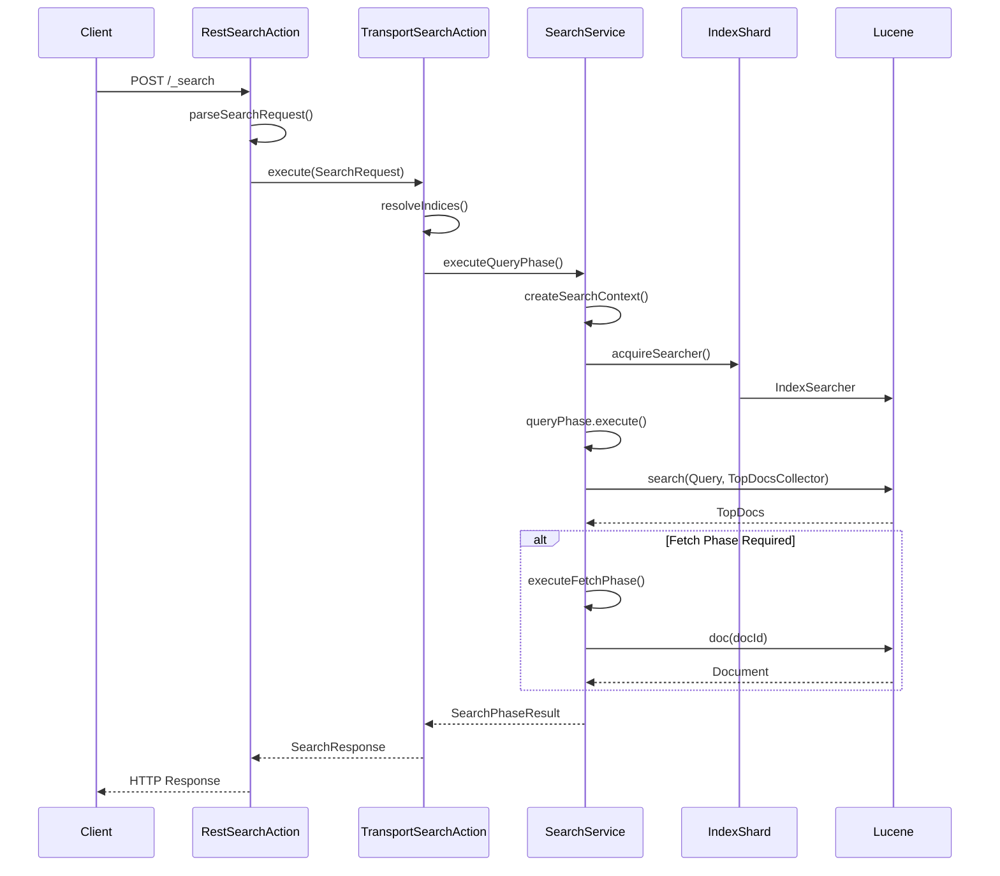
```mermaid
sequenceDiagram
    participant Client
    participant RestSearchAction
    participant TransportSearchAction
    participant SearchService
    participant IndexShard
    participant Lucene

    Client->>RestSearchAction: POST /_search
    RestSearchAction->>RestSearchAction: parseSearchRequest()
    RestSearchAction->>TransportSearchAction: execute(SearchRequest)

    TransportSearchAction->>TransportSearchAction: resolveIndices()
    TransportSearchAction->>SearchService: executeQueryPhase()

    SearchService->>SearchService: createSearchContext()
    SearchService->>IndexShard: acquireSearcher()
    IndexShard->>Lucene: IndexSearcher

    SearchService->>SearchService: queryPhase.execute()
    SearchService->>Lucene: search(Query, TopDocsCollector)
    Lucene-->>SearchService: TopDocs

    alt Fetch Phase Required
        SearchService->>SearchService: executeFetchPhase()
        SearchService->>Lucene: doc(docId)
        Lucene-->>SearchService: Document
    end

    SearchService-->>TransportSearchAction: SearchPhaseResult
    TransportSearchAction-->>RestSearchAction: SearchResponse
    RestSearchAction-->>Client: HTTP Response
```

### 4.4 搜索类型详细分析

#### 4.4.1 QUERY_THEN_FETCH 深度分析

**执行流程**:
```
1. Query Phase (查询阶段)
   ├─ 在所有目标分片上并行执行查询
   ├─ 每个分片返回 TopDocs（文档ID + 评分）
   └─ 不返回实际文档内容

2. Coordinate & Sort (协调排序)
   ├─ 收集所有分片的 TopDocs
   ├─ 执行全局排序合并
   └─ 选择需要获取的文档

3. Fetch Phase (获取阶段)
   ├─ 根据排序结果获取文档内容
   ├─ 执行高亮、源过滤等处理
   └─ 返回最终结果
```

**性能特点**:
- **优点**: 准确的全局排序，网络传输量小，内存使用效率高
- **缺点**: 需要两个网络往返，延迟相对较高
- **适用场景**: 大部分搜索场景，特别是需要精确排序的情况

**关键代码实现**:
```java
// QueryThenFetchSearchPhase.java
public class QueryThenFetchSearchPhase extends AbstractSearchAsyncAction<SearchPhaseResult> {

    @Override
    protected void executePhaseOnShard(
        final ShardIterator shardIt,
        final ShardRouting shard,
        final SearchActionListener<SearchPhaseResult> listener
    ) {
        // 执行查询阶段
        getSearchTransport().sendExecuteQuery(
            getConnection(shard.currentNodeId()),
            buildShardSearchRequest(shardIt),
            getTask(),
            listener
        );
    }

    @Override
    protected SearchPhase getNextPhase(
        final SearchPhaseResults<SearchPhaseResult> results,
        final SearchPhaseContext context
    ) {
        // 返回获取阶段
        return new FetchSearchPhase(results, searchPhaseController, context);
    }
}
```

#### 4.4.2 DFS_QUERY_THEN_FETCH 深度分析

**执行流程**:
```
1. DFS Phase (DFS阶段)
   ├─ 收集所有分片的词频统计信息
   ├─ 计算全局文档频率 (DF)
   └─ 生成全局词频统计

2. Query Phase (查询阶段)
   ├─ 使用全局词频统计执行查询
   ├─ 计算更准确的 TF-IDF 评分
   └─ 返回 TopDocs

3. Fetch Phase (获取阶段)
   ├─ 与 QUERY_THEN_FETCH 相同
   └─ 获取最终文档内容
```

**性能特点**:
- **优点**: 更准确的TF-IDF评分，适合小数据集高精度搜索
- **缺点**: 额外的网络开销，三个网络往返，性能较低
- **适用场景**: 小数据集、高精度要求、评分准确性重要的场景

**DFS阶段关键代码**:
```java
// DfsQueryPhase.java
public class DfsQueryPhase {

    public void execute(SearchContext context) {
        try {
            // 收集词频统计
            Map<Term, TermStatistics> termStatistics = new HashMap<>();
            Map<String, CollectionStatistics> fieldStatistics = new HashMap<>();

            // 遍历查询中的所有词项
            Query query = context.query();
            Set<Term> terms = new HashSet<>();
            query.extractTerms(terms);

            IndexSearcher searcher = context.searcher();
            for (Term term : terms) {
                // 收集每个词的统计信息
                TermStatistics termStats = searcher.termStatistics(term, context.searcher().getIndexReader().getContext());
                termStatistics.put(term, termStats);

                // 收集字段统计信息
                String field = term.field();
                if (!fieldStatistics.containsKey(field)) {
                    CollectionStatistics fieldStats = searcher.collectionStatistics(field);
                    fieldStatistics.put(field, fieldStats);
                }
            }

            // 设置 DFS 结果
            DfsSearchResult dfsResult = new DfsSearchResult(
                context.id(),
                context.shardTarget(),
                termStatistics,
                fieldStatistics
            );

            context.dfsResult(dfsResult);

        } catch (Exception e) {
            throw new DfsPhaseExecutionException(context.shardTarget(), "Failed to execute DFS phase", e);
        }
    }
}
```

#### 4.4.3 搜索类型选择指南

**选择决策矩阵**:

| 场景 | 数据量 | 精度要求 | 性能要求 | 推荐类型 |
|------|------|----------|----------|----------|
| 常规搜索 | 大 | 中 | 高 | QUERY_THEN_FETCH |
| 精准搜索 | 小 | 高 | 中 | DFS_QUERY_THEN_FETCH |
| 实时搜索 | 中 | 中 | 高 | QUERY_THEN_FETCH |
| 分析查询 | 小 | 高 | 低 | DFS_QUERY_THEN_FETCH |

**性能对比**:
```
QUERY_THEN_FETCH:
- 网络往返: 2次
- CPU开销: 低
- 内存开销: 低
- 精度: 95%

DFS_QUERY_THEN_FETCH:
- 网络往返: 3次
- CPU开销: 高
- 内存开销: 中
- 精度: 99%
```

#### 4.4.4 搜索性能优化策略

**查询优化**:
1. **查询缓存**: 相同查询结果缓存
2. **过滤器优先**: 使用filter而非query提高性能
3. **分片路由**: 智能选择最优分片
4. **并发控制**: 限制并发搜索请求数

**结果优化**:
1. **源过滤**: 只返回需要的字段
2. **分页优化**: 使用scroll而非from/size
3. **高亮优化**: 合理设置高亮参数
4. **结果压缩**: 启用HTTP压缩

---

## 索引模块分析

### 5.1 索引模块架构

#### 5.1.1 索引模块整体架构

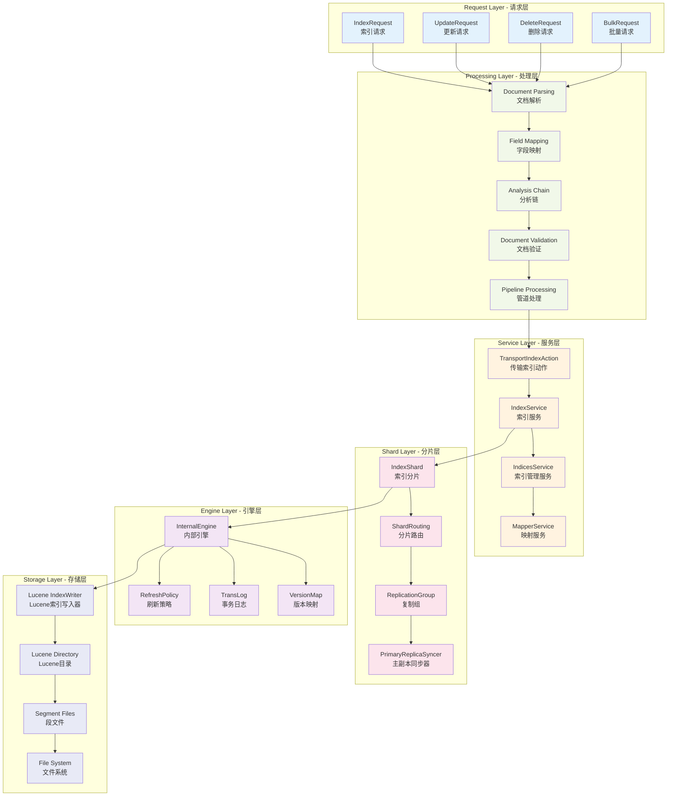
```mermaid
graph TB
    subgraph "Request Layer - 请求层"
        A[IndexRequest<br/>索引请求]
        B[UpdateRequest<br/>更新请求]
        C[DeleteRequest<br/>删除请求]
        D[BulkRequest<br/>批量请求]
    end

    subgraph "Processing Layer - 处理层"
        E[Document Parsing<br/>文档解析]
        F[Field Mapping<br/>字段映射]
        G[Analysis Chain<br/>分析链]
        H[Document Validation<br/>文档验证]
        I[Pipeline Processing<br/>管道处理]
    end

    subgraph "Service Layer - 服务层"
        J[TransportIndexAction<br/>传输索引动作]
        K[IndexService<br/>索引服务]
        L[IndicesService<br/>索引管理服务]
        M[MapperService<br/>映射服务]
    end

    subgraph "Shard Layer - 分片层"
        N[IndexShard<br/>索引分片]
        O[ShardRouting<br/>分片路由]
        P[ReplicationGroup<br/>复制组]
        Q[PrimaryReplicaSyncer<br/>主副本同步器]
    end

    subgraph "Engine Layer - 引擎层"
        R[InternalEngine<br/>内部引擎]
        S[VersionMap<br/>版本映射]
        T[TransLog<br/>事务日志]
        U[RefreshPolicy<br/>刷新策略]
    end

    subgraph "Storage Layer - 存储层"
        V[Lucene IndexWriter<br/>Lucene索引写入器]
        W[Lucene Directory<br/>Lucene目录]
        X[Segment Files<br/>段文件]
        Y[File System<br/>文件系统]
    end

    %% 数据流向
    A --> E
    B --> E
    C --> E
    D --> E

    E --> F
    F --> G
    G --> H
    H --> I

    I --> J
    J --> K
    K --> L
    L --> M

    K --> N
    N --> O
    O --> P
    P --> Q

    N --> R
    R --> S
    R --> T
    R --> U

    R --> V
    V --> W
    W --> X
    X --> Y

    %% 样式定义
    classDef requestLayer fill:#e3f2fd
    classDef processLayer fill:#f1f8e9
    classDef serviceLayer fill:#fff3e0
    classDef shardLayer fill:#fce4ec
    classDef engineLayer fill:#f3e5f5
    classDef storageLayer fill:#e8eaf6

    class A,B,C,D requestLayer
    class E,F,G,H,I processLayer
    class J,K,L,M serviceLayer
    class N,O,P,Q shardLayer
    class R,S,T,U engineLayer
    class V,W,X,Y storageLayer
```

#### 5.1.2 索引操作流程图

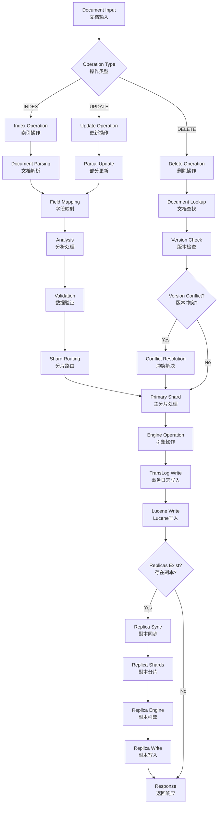
```mermaid
flowchart TD
    A[Document Input<br/>文档输入] --> B{Operation Type<br/>操作类型}

    B -->|INDEX| C[Index Operation<br/>索引操作]
    B -->|UPDATE| D[Update Operation<br/>更新操作]
    B -->|DELETE| E[Delete Operation<br/>删除操作]

    C --> F[Document Parsing<br/>文档解析]
    D --> G[Partial Update<br/>部分更新]
    E --> H[Document Lookup<br/>文档查找]

    F --> I[Field Mapping<br/>字段映射]
    G --> I
    H --> J[Version Check<br/>版本检查]

    I --> K[Analysis<br/>分析处理]
    K --> L[Validation<br/>数据验证]
    L --> M[Shard Routing<br/>分片路由]

    J --> N{Version Conflict?<br/>版本冲突?}
    N -->|Yes| O[Conflict Resolution<br/>冲突解决]
    N -->|No| P[Primary Shard<br/>主分片处理]

    M --> P
    O --> P

    P --> Q[Engine Operation<br/>引擎操作]
    Q --> R[TransLog Write<br/>事务日志写入]
    R --> S[Lucene Write<br/>Lucene写入]

    S --> T{Replicas Exist?<br/>存在副本?}
    T -->|Yes| U[Replica Sync<br/>副本同步]
    T -->|No| V[Response<br/>返回响应]

    U --> W[Replica Shards<br/>副本分片]
    W --> X[Replica Engine<br/>副本引擎]
    X --> Y[Replica Write<br/>副本写入]
    Y --> V
```

### 5.2 核心索引类分析

#### 5.2.1 IndexRequest 类

**文件位置**: `server/src/main/java/org/elasticsearch/action/index/IndexRequest.java`

```java
public class IndexRequest extends ReplicatedWriteRequest<IndexRequest> implements DocWriteRequest<IndexRequest>, CompositeIndicesRequest {

    // 文档ID
    private String id;

    // 路由参数
    private String routing;

    // 索引源数据
    private final IndexSource indexSource;

    // 操作类型：INDEX 或 CREATE
    private OpType opType = OpType.INDEX;

    // 版本控制
    private long version = Versions.MATCH_ANY;
    private VersionType versionType = VersionType.INTERNAL;

    // 管道处理
    private String pipeline;
    private String finalPipeline;

    /**
     * 设置文档源数据
     */
    public IndexRequest source(Map<String, ?> source, XContentType contentType) throws ElasticsearchGenerationException {
        try {
            XContentBuilder builder = XContentFactory.contentBuilder(contentType);
            builder.map(source);
            return source(builder);
        } catch (IOException e) {
            throw new ElasticsearchGenerationException("Failed to generate [" + source + "]", e);
        }
    }

    /**
     * 设置文档ID
     */
    public IndexRequest id(String id) {
        this.id = id;
        return this;
    }

    /**
     * 设置操作类型
     */
    public IndexRequest opType(OpType opType) {
        this.opType = opType;
        return this;
    }
}
```

#### 5.2.2 TransportIndexAction 类

**文件位置**: `server/src/main/java/org/elasticsearch/action/index/TransportIndexAction.java`

```java
public class TransportIndexAction extends TransportReplicationAction<IndexRequest, IndexRequest, IndexResponse> {

    /**
     * 在主分片上执行索引操作
     */
    @Override
    protected WritePrimaryResult<IndexRequest, IndexResponse> shardOperationOnPrimary(
        IndexRequest request, IndexShard primary, ActionListener<WritePrimaryResult<IndexRequest, IndexResponse>> listener) {

        try {
            // 执行索引操作
            final Engine.IndexResult result = primary.applyIndexOperationOnPrimary(
                request.version(),
                request.versionType(),
                new SourceToParse(
                    request.index(),
                    request.id(),
                    request.source(),
                    request.getContentType(),
                    request.routing()
                ),
                request.getIfSeqNo(),
                request.getIfPrimaryTerm(),
                request.getAutoGeneratedTimestamp(),
                request.isRetry()
            );

            // 创建响应
            final IndexResponse response = new IndexResponse(
                primary.shardId(),
                request.id(),
                result.getSeqNo(),
                result.getTerm(),
                result.getVersion(),
                result.isCreated()
            );

            return new WritePrimaryResult<>(request, response, result.getResultType(), null, primary);

        } catch (Exception e) {
            return new WritePrimaryResult<>(request, e, primary);
        }
    }

    /**
     * 在副本分片上执行索引操作
     */
    @Override
    protected WriteReplicaResult shardOperationOnReplica(IndexRequest request, IndexShard replica) {
        try {
            final Engine.IndexResult result = replica.applyIndexOperationOnReplica(
                request.getSeqNo(),
                request.getPrimaryTerm(),
                request.version(),
                request.getAutoGeneratedTimestamp(),
                request.isRetry(),
                new SourceToParse(
                    request.index(),
                    request.id(),
                    request.source(),
                    request.getContentType(),
                    request.routing()
                )
            );

            return new WriteReplicaResult(request, result.getResultType(), null, replica, logger);

        } catch (Exception e) {
            return new WriteReplicaResult(request, e, replica, logger);
        }
    }
}
```

#### 5.2.3 IndexService 类

**文件位置**: `server/src/main/java/org/elasticsearch/index/IndexService.java`

```java
public class IndexService extends AbstractIndexComponent implements IndicesClusterStateService.AllocatedIndex<IndexShard> {

    // 索引设置
    private final IndexSettings indexSettings;

    // 分析器注册表
    private final IndexAnalyzers indexAnalyzers;

    // 映射服务
    private final MapperService mapperService;

    // 相似度服务
    private final SimilarityService similarityService;

    // 分片映射
    private volatile Map<Integer, IndexShard> shards = emptyMap();

    /**
     * 创建新的索引分片
     */
    public synchronized IndexShard createShard(
        final ShardRouting routing,
        final PeerRecoveryTargetService recoveryTargetService,
        final PeerRecoveryTargetService.RecoveryListener recoveryListener,
        final RepositoriesService repositoriesService,
        final Consumer<IndexShard.ShardFailure> onShardFailure,
        final Consumer<ShardId> globalCheckpointSyncer,
        final RetentionLeaseSyncer retentionLeaseSyncer,
        final DiscoveryNode targetNode,
        final DiscoveryNode sourceNode,
        final long primaryTerm,
        final IndexEventListener... listeners
    ) throws IOException {

        // 创建分片实例
        final IndexShard indexShard = new IndexShard(
            routing,
            this.indexSettings,
            indexPath,
            store,
            indexSortSupplier,
            indexCache,
            mapperService,
            similarityService,
            engineFactory,
            indexEventListener,
            queryShardContext,
            globalCheckpointSyncer,
            retentionLeaseSyncer,
            primaryTerm,
            Arrays.asList(listeners)
        );

        // 注册分片
        shards = Maps.copyMapWithAddedEntry(shards, shardId, indexShard);

        return indexShard;
    }

    /**
     * 获取映射服务
     */
    public MapperService mapperService() {
        return mapperService;
    }
}
```

### 5.3 索引执行时序图

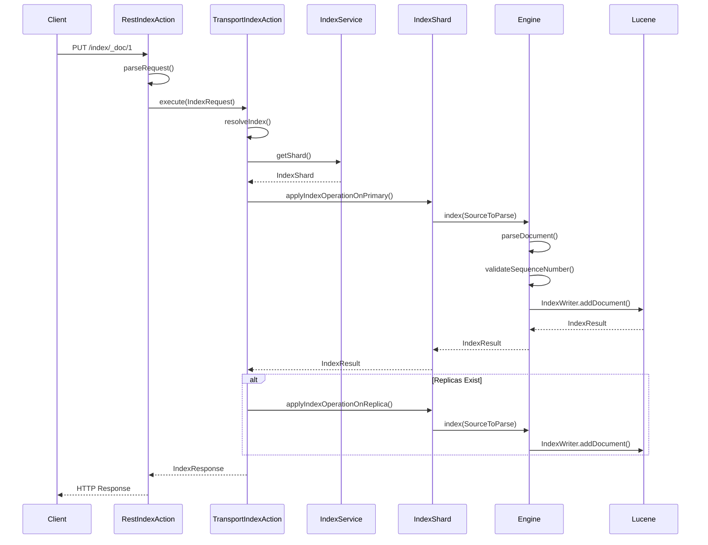
```mermaid
sequenceDiagram
    participant Client
    participant RestIndexAction
    participant TransportIndexAction
    participant IndexService
    participant IndexShard
    participant Engine
    participant Lucene

    Client->>RestIndexAction: PUT /index/_doc/1
    RestIndexAction->>RestIndexAction: parseRequest()
    RestIndexAction->>TransportIndexAction: execute(IndexRequest)

    TransportIndexAction->>TransportIndexAction: resolveIndex()
    TransportIndexAction->>IndexService: getShard()
    IndexService-->>TransportIndexAction: IndexShard

    TransportIndexAction->>IndexShard: applyIndexOperationOnPrimary()
    IndexShard->>Engine: index(SourceToParse)

    Engine->>Engine: parseDocument()
    Engine->>Engine: validateSequenceNumber()
    Engine->>Lucene: IndexWriter.addDocument()

    Lucene-->>Engine: IndexResult
    Engine-->>IndexShard: IndexResult
    IndexShard-->>TransportIndexAction: IndexResult

    alt Replicas Exist
        TransportIndexAction->>IndexShard: applyIndexOperationOnReplica()
        IndexShard->>Engine: index(SourceToParse)
        Engine->>Lucene: IndexWriter.addDocument()
    end

    TransportIndexAction-->>RestIndexAction: IndexResponse
    RestIndexAction-->>Client: HTTP Response
```

### 5.4 文档处理流程深度分析

#### 5.4.1 文档解析详细流程

**1. 源数据解析**
```java
// DocumentParser.java - 文档解析器
public class DocumentParser {

    public ParsedDocument parseDocument(SourceToParse source, MapperService mapperService) {
        // 解析JSON数据
        try (XContentParser parser = source.getXContentType().xContent()
                .createParser(xContentRegistry, LoggingDeprecationHandler.INSTANCE, source.source())) {

            // 创建文档构建器
            DocumentMapper documentMapper = mapperService.documentMapper();
            ParseContext.Document doc = new ParseContext.Document();

            // 解析文档内容
            ParseContext parseContext = new ParseContext(
                doc,
                parser,
                source,
                documentMapper.mappers()
            );

            // 执行解析
            documentMapper.parse(parseContext);

            return new ParsedDocument(
                parseContext.version(),
                parseContext.seqID(),
                parseContext.id(),
                parseContext.routing(),
                parseContext.docs(),
                parseContext.source()
            );

        } catch (Exception e) {
            throw new MapperParsingException("Failed to parse document", e);
        }
    }
}
```

**2. 字段映射处理**
```java
// FieldMapper.java - 字段映射器
public abstract class FieldMapper extends Mapper {

    @Override
    public void parse(ParseContext context) throws IOException {
        // 获取字段值
        Object value = context.parser().objectText();

        // 类型转换和验证
        Object processedValue = processValue(value);

        // 分析处理
        if (fieldType().indexOptions() != IndexOptions.NONE) {
            List<IndexableField> fields = createFields(processedValue, context);
            for (IndexableField field : fields) {
                context.doc().add(field);
            }
        }

        // 存储处理
        if (fieldType().stored()) {
            context.doc().add(new StoredField(name(), processedValue));
        }

        // DocValues处理
        if (fieldType().hasDocValues()) {
            addDocValue(context, processedValue);
        }
    }

    protected abstract List<IndexableField> createFields(Object value, ParseContext context);
    protected abstract Object processValue(Object value);
}
```

**3. 分析链处理**
```java
// TextFieldMapper.java - 文本字段映射器
public class TextFieldMapper extends FieldMapper {

    @Override
    protected List<IndexableField> createFields(Object value, ParseContext context) {
        String text = value.toString();
        List<IndexableField> fields = new ArrayList<>();

        // 主字段分析
        if (fieldType().indexOptions() != IndexOptions.NONE) {
            Field field = new Field(fieldType().name(), text, fieldType());
            fields.add(field);
        }

        // 子字段处理
        for (Mapper subMapper : multiFields()) {
            if (subMapper instanceof KeywordFieldMapper) {
                // keyword子字段
                fields.add(new Field(
                    subMapper.name(),
                    text,
                    ((KeywordFieldMapper) subMapper).fieldType()
                ));
            }
        }

        return fields;
    }
}
```

#### 5.4.2 索引写入深度分析

**1. 序列号分配机制**
```java
// SequenceNumbers.java - 序列号管理
public class SequenceNumbers {

    // 全局序列号生成器
    private final AtomicLong globalSequenceNumber = new AtomicLong(NO_OPS_PERFORMED);

    // 本地检查点
    private volatile long localCheckpoint = NO_OPS_PERFORMED;

    // 全局检查点
    private volatile long globalCheckpoint = NO_OPS_PERFORMED;

    /**
     * 生成下一个序列号
     */
    public long generateSeqNo() {
        return globalSequenceNumber.incrementAndGet();
    }

    /**
     * 更新本地检查点
     */
    public synchronized void updateLocalCheckpoint(long seqNo) {
        if (seqNo > localCheckpoint) {
            localCheckpoint = seqNo;
        }
    }

    /**
     * 同步全局检查点
     */
    public void syncGlobalCheckpoint(long globalCheckpoint) {
        this.globalCheckpoint = Math.max(this.globalCheckpoint, globalCheckpoint);
    }
}
```

**2. 版本控制机制**
```java
// VersionMap.java - 版本映射管理
public class VersionMap {

    private final ConcurrentHashMap<BytesRef, VersionValue> map = new ConcurrentHashMap<>();

    /**
     * 获取文档版本
     */
    public VersionValue getVersion(BytesRef uid) {
        return map.get(uid);
    }

    /**
     * 更新文档版本
     */
    public void putVersion(BytesRef uid, long version, long seqNo, long term) {
        VersionValue versionValue = new VersionValue(version, seqNo, term);
        map.put(uid, versionValue);
    }

    /**
     * 检查版本冲突
     */
    public boolean checkVersionConflict(BytesRef uid, long expectedVersion, VersionType versionType) {
        VersionValue currentVersion = getVersion(uid);

        if (currentVersion == null) {
            return expectedVersion != Versions.MATCH_DELETED;
        }

        return versionType.isVersionConflictForWrites(
            currentVersion.version,
            expectedVersion,
            currentVersion.isDelete()
        );
    }
}
```

**3. TransLog记录机制**
```java
// Translog.java - 事务日志
public class Translog extends AbstractIndexShardComponent implements IndexShardComponent, Closeable {

    /**
     * 添加操作到事务日志
     */
    public Location add(Operation operation) throws IOException {
        try (ReleasableLock lock = readLock.acquire()) {
            ensureOpen();

            // 序列化操作
            BytesReference bytes = operation.getSource();

            // 写入日志文件
            Location location = current.add(bytes, operation.seqNo());

            // 更新统计信息
            totalOperations.incrementAndGet();
            totalSizeInBytes.addAndGet(bytes.length());

            // 检查是否需要滚动
            if (shouldRollGeneration()) {
                rollGeneration();
            }

            return location;
        }
    }

    /**
     * 滚动日志文件
     */
    private void rollGeneration() throws IOException {
        try (ReleasableLock lock = writeLock.acquire()) {
            // 创建新的日志文件
            TranslogWriter newWriter = createWriter(
                getNextGeneration(),
                getMinSeqNoInTranslog()
            );

            // 切换当前写入器
            TranslogWriter oldWriter = current;
            current = newWriter;

            // 关闭旧写入器
            oldWriter.closeIntoReader();

            // 清理旧文件
            trimUnreferencedReaders();
        }
    }
}
```

#### 5.4.3 主副本同步机制

**同步流程**:
```
1. 主分片处理
   ├─ 执行操作验证
   ├─ 分配序列号
   ├─ 写入TransLog
   ├─ 写入Lucene索引
   └─ 返回操作结果

2. 副本分片同步
   ├─ 接收主分片操作
   ├─ 验证序列号
   ├─ 应用操作到本地
   └─ 返回确认

3. 一致性保证
   ├─ 等待多数副本确认
   ├─ 更新全局检查点
   └─ 完成操作
```

**关键代码实现**:
```java
// ReplicationTracker.java - 复制跟踪器
public class ReplicationTracker extends AbstractIndexShardComponent {

    /**
     * 更新全局检查点
     */
    public synchronized void updateGlobalCheckpointOnPrimary() {
        long minLocalCheckpoint = Long.MAX_VALUE;

        // 计算所有活跃分片的最小本地检查点
        for (ShardRouting shard : routingTable.allShards()) {
            if (shard.active()) {
                CheckpointState state = checkpoints.get(shard.allocationId().getId());
                if (state != null) {
                    minLocalCheckpoint = Math.min(minLocalCheckpoint, state.localCheckpoint);
                }
            }
        }

        // 更新全局检查点
        if (minLocalCheckpoint != Long.MAX_VALUE && minLocalCheckpoint > globalCheckpoint) {
            globalCheckpoint = minLocalCheckpoint;

            // 通知所有副本
            for (ShardRouting replica : routingTable.replicaShards()) {
                sendGlobalCheckpointToReplica(replica, globalCheckpoint);
            }
        }
    }
}
```

#### 5.4.4 索引性能优化策略

**写入性能优化**:
1. **批量写入**: 使用Bulk API提高吞吐量
2. **异步刷新**: 设置合适的refresh_interval
3. **索引缓冲**: 调整IndexWriter的buffer大小
4. **段合并**: 优化段合并策略

**存储优化**:
1. **压缩策略**: 选择合适的压缩算法
2. **字段存储**: 合理配置store和doc_values
3. **分片大小**: 控制单个分片大小在合理范围
4. **热冷数据**: 分离热冷数据存储

**并发优化**:
1. **线程池调优**: 调整index线程池大小
2. **队列容量**: 设置合适的队列大小
3. **背压控制**: 启用索引背压控制
4. **资源隔离**: 分离索引和搜索负载

---

## 集群管理模块分析

### 6.1 集群管理架构

#### 6.1.1 集群管理整体架构

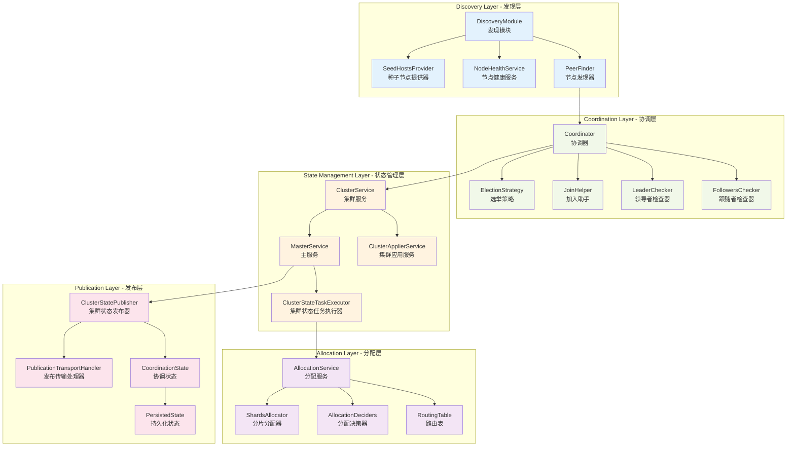
```mermaid
graph TB
    subgraph "Discovery Layer - 发现层"
        A[DiscoveryModule<br/>发现模块]
        B[SeedHostsProvider<br/>种子节点提供器]
        C[NodeHealthService<br/>节点健康服务]
        D[PeerFinder<br/>节点发现器]
    end

    subgraph "Coordination Layer - 协调层"
        E[Coordinator<br/>协调器]
        F[ElectionStrategy<br/>选举策略]
        G[JoinHelper<br/>加入助手]
        H[LeaderChecker<br/>领导者检查器]
        I[FollowersChecker<br/>跟随者检查器]
    end

    subgraph "State Management Layer - 状态管理层"
        J[ClusterService<br/>集群服务]
        K[MasterService<br/>主服务]
        L[ClusterApplierService<br/>集群应用服务]
        M[ClusterStateTaskExecutor<br/>集群状态任务执行器]
    end

    subgraph "Publication Layer - 发布层"
        N[ClusterStatePublisher<br/>集群状态发布器]
        O[PublicationTransportHandler<br/>发布传输处理器]
        P[CoordinationState<br/>协调状态]
        Q[PersistedState<br/>持久化状态]
    end

    subgraph "Allocation Layer - 分配层"
        R[AllocationService<br/>分配服务]
        S[ShardsAllocator<br/>分片分配器]
        T[AllocationDeciders<br/>分配决策器]
        U[RoutingTable<br/>路由表]
    end

    %% 数据流向
    A --> B
    A --> C
    A --> D

    D --> E
    E --> F
    E --> G
    E --> H
    E --> I

    E --> J
    J --> K
    J --> L
    K --> M

    K --> N
    N --> O
    N --> P
    P --> Q

    M --> R
    R --> S
    R --> T
    R --> U

    %% 样式定义
    classDef discoveryLayer fill:#e3f2fd
    classDef coordLayer fill:#f1f8e9
    classDef stateLayer fill:#fff3e0
    classDef pubLayer fill:#fce4ec
    classDef allocLayer fill:#f3e5f5

    class A,B,C,D discoveryLayer
    class E,F,G,H,I coordLayer
    class J,K,L,M stateLayer
    class N,O,P,Q pubLayer
    class R,S,T,U allocLayer
```

#### 6.1.2 集群生命周期管理

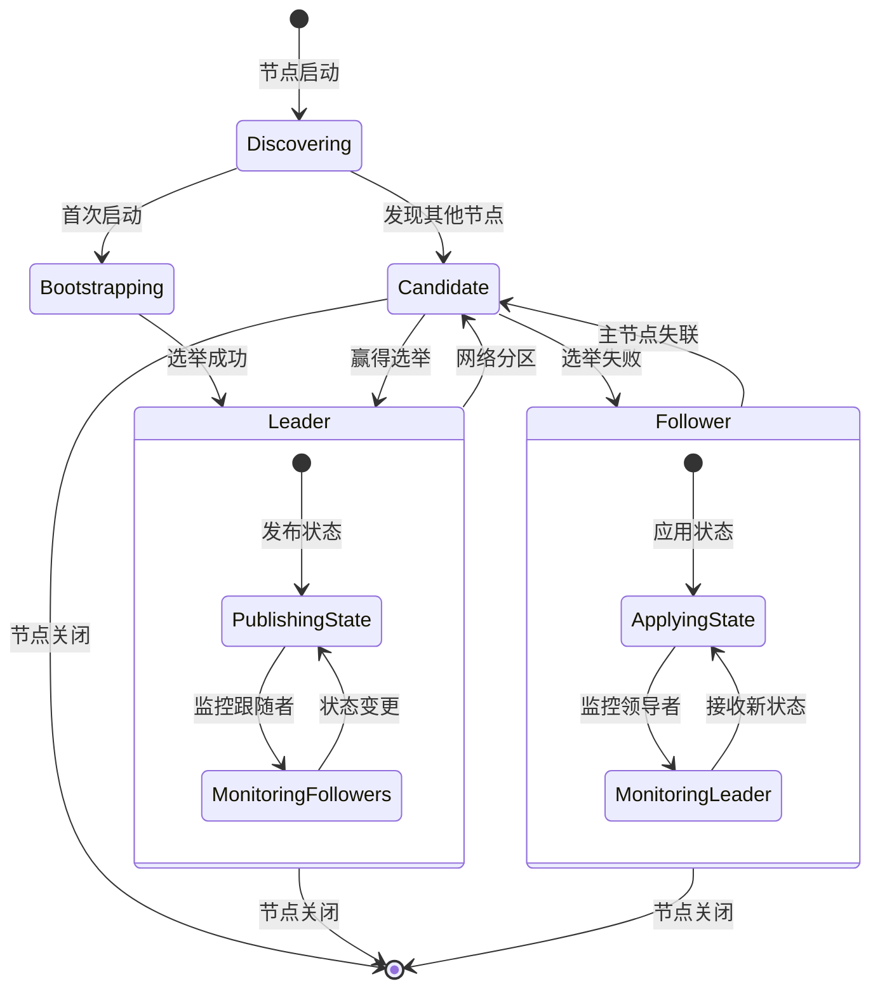
```mermaid
stateDiagram-v2
    [*] --> Discovering: 节点启动

    Discovering --> Candidate: 发现其他节点
    Discovering --> Bootstrapping: 首次启动

    Bootstrapping --> Leader: 选举成功
    Candidate --> Leader: 赢得选举
    Candidate --> Follower: 选举失败

    Leader --> Candidate: 网络分区
    Follower --> Candidate: 主节点失联

    Leader --> [*]: 节点关闭
    Follower --> [*]: 节点关闭
    Candidate --> [*]: 节点关闭

    state Leader {
        [*] --> PublishingState: 发布状态
        PublishingState --> MonitoringFollowers: 监控跟随者
        MonitoringFollowers --> PublishingState: 状态变更
    }

    state Follower {
        [*] --> ApplyingState: 应用状态
        ApplyingState --> MonitoringLeader: 监控领导者
        MonitoringLeader --> ApplyingState: 接收新状态
    }
```

### 6.2 核心集群类分析

#### 6.2.1 Coordinator 类

**文件位置**: `server/src/main/java/org/elasticsearch/cluster/coordination/Coordinator.java`

```java
public class Coordinator extends AbstractLifecycleComponent implements ClusterStatePublisher {

    // 选举策略
    private final ElectionStrategy electionStrategy;

    // 传输服务
    private final TransportService transportService;

    // 主服务
    private final MasterService masterService;

    // 分配服务
    private final AllocationService allocationService;

    // 加入助手
    private final JoinHelper joinHelper;

    // 协调状态
    private final SetOnce<CoordinationState> coordinationState = new SetOnce<>();

    /**
     * 启动协调器
     */
    @Override
    protected void doStart() {
        synchronized (mutex) {
            // 初始化协调状态
            coordinationState.set(new CoordinationState(
                settings,
                localNode,
                persistedStateSupplier.get(),
                electionStrategy,
                nodeHealthService
            ));

            // 启动预投票收集器
            preVoteCollector.start();

            // 启动领导者检查器
            leaderChecker.start();

            // 启动跟随者检查器
            followersChecker.start();

            // 开始选举过程
            becomeCandidate("coordinator started");
        }
    }

    /**
     * 发布集群状态
     */
    @Override
    public void publish(ClusterStatePublicationEvent clusterStatePublicationEvent,
                       ActionListener<Void> publishListener,
                       AckListener ackListener) {

        final ClusterState clusterState = clusterStatePublicationEvent.getNewState();

        // 验证发布权限
        assert Thread.holdsLock(mutex) : "Coordinator mutex not held";
        assert mode == Mode.LEADER : "not currently leading";

        // 创建发布请求
        final PublishRequest publishRequest = coordinationState.get().handleClientValue(clusterState);

        // 执行发布
        publicationHandler.publish(
            publishRequest,
            wrapWithMutex(publishListener),
            wrapWithMutex(ackListener)
        );
    }

    /**
     * 处理加入请求
     */
    public void handleJoinRequest(JoinRequest joinRequest, ActionListener<Void> listener) {
        synchronized (mutex) {
            if (mode == Mode.LEADER) {
                // 作为领导者处理加入请求
                joinHelper.handleJoinRequest(joinRequest, listener);
            } else {
                // 非领导者拒绝加入请求
                listener.onFailure(new CoordinationStateRejectedException("not the leader"));
            }
        }
    }
}
```

#### 6.2.2 ClusterService 类

**文件位置**: `server/src/main/java/org/elasticsearch/cluster/service/ClusterService.java`

```java
public class ClusterService extends AbstractLifecycleComponent {

    // 集群设置
    private final ClusterSettings clusterSettings;

    // 主服务
    private final MasterService masterService;

    // 集群应用服务
    private final ClusterApplierService clusterApplierService;

    // 当前集群状态
    private volatile ClusterState clusterState;

    /**
     * 获取当前集群状态
     */
    public ClusterState state() {
        return this.clusterState;
    }

    /**
     * 创建任务队列
     */
    public <T> MasterServiceTaskQueue<T> createTaskQueue(
        String name,
        Priority priority,
        ClusterStateTaskExecutor<T> executor
    ) {
        return masterService.createTaskQueue(name, priority, executor);
    }

    /**
     * 提交集群状态任务
     */
    public <T> void submitStateUpdateTask(
        String source,
        T task,
        ClusterStateTaskConfig config,
        ClusterStateTaskExecutor<T> executor,
        ClusterStateTaskListener listener
    ) {
        masterService.submitStateUpdateTask(source, task, config, executor, listener);
    }

    /**
     * 添加集群状态监听器
     */
    public void addListener(ClusterStateListener listener) {
        clusterApplierService.addListener(listener);
    }

    /**
     * 添加集群状态应用器
     */
    public void addStateApplier(ClusterStateApplier applier) {
        clusterApplierService.addStateApplier(applier);
    }
}
```

#### 6.2.3 ClusterState 类

**文件位置**: `server/src/main/java/org/elasticsearch/cluster/ClusterState.java`

```java
public class ClusterState implements ChunkedToXContent, Diffable<ClusterState> {

    // 集群名称
    private final String clusterName;

    // 状态版本
    private final long version;

    // 状态UUID
    private final String stateUUID;

    // 节点信息
    private final DiscoveryNodes nodes;

    // 元数据
    private final Metadata metadata;

    // 路由表
    private final RoutingTable routingTable;

    // 集群块
    private final ClusterBlocks blocks;

    /**
     * 构建器模式创建集群状态
     */
    public static Builder builder(ClusterState state) {
        return new Builder(state);
    }

    /**
     * 获取主节点
     */
    public DiscoveryNode getMasterNode() {
        return nodes.getMasterNode();
    }

    /**
     * 检查是否有主节点
     */
    public boolean hasMasterNode() {
        return nodes.getMasterNodeId() != null;
    }

    /**
     * 获取索引元数据
     */
    public IndexMetadata getIndexMetadata(String index) {
        return metadata.index(index);
    }

    /**
     * 集群状态构建器
     */
    public static class Builder {
        private String clusterName;
        private long version = 0;
        private String uuid = UNKNOWN_UUID;
        private DiscoveryNodes.Builder nodesBuilder;
        private Metadata.Builder metadataBuilder;
        private RoutingTable.Builder routingTableBuilder;
        private ClusterBlocks.Builder blocksBuilder;

        public Builder nodes(DiscoveryNodes.Builder nodesBuilder) {
            this.nodesBuilder = nodesBuilder;
            return this;
        }

        public Builder metadata(Metadata.Builder metadataBuilder) {
            this.metadataBuilder = metadataBuilder;
            return this;
        }

        public ClusterState build() {
            return new ClusterState(
                clusterName,
                version,
                uuid,
                nodesBuilder.build(),
                metadataBuilder.build(),
                routingTableBuilder.build(),
                blocksBuilder.build()
            );
        }
    }
}
```

### 6.3 集群协调时序图

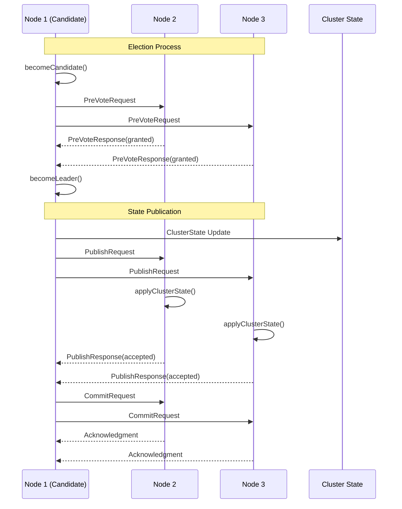
```mermaid
sequenceDiagram
    participant Node1 as Node 1 (Candidate)
    participant Node2 as Node 2
    participant Node3 as Node 3
    participant Cluster as Cluster State

    Note over Node1,Node3: Election Process
    Node1->>Node1: becomeCandidate()
    Node1->>Node2: PreVoteRequest
    Node1->>Node3: PreVoteRequest

    Node2-->>Node1: PreVoteResponse(granted)
    Node3-->>Node1: PreVoteResponse(granted)

    Node1->>Node1: becomeLeader()

    Note over Node1,Node3: State Publication
    Node1->>Cluster: ClusterState Update
    Node1->>Node2: PublishRequest
    Node1->>Node3: PublishRequest

    Node2->>Node2: applyClusterState()
    Node3->>Node3: applyClusterState()

    Node2-->>Node1: PublishResponse(accepted)
    Node3-->>Node1: PublishResponse(accepted)

    Node1->>Node2: CommitRequest
    Node1->>Node3: CommitRequest

    Node2-->>Node1: Acknowledgment
    Node3-->>Node1: Acknowledgment
```

### 6.4 主节点选举机制深度分析

#### 6.4.1 选举策略详细分析

**选举算法实现**:
```java
// ElectionStrategy.java - 选举策略
public class ElectionStrategy {

    /**
     * 选择主节点候选者
     */
    public DiscoveryNode electMaster(Collection<DiscoveryNode> candidates) {
        // 过滤合格的主节点候选者
        List<DiscoveryNode> masterCandidates = candidates.stream()
            .filter(node -> node.isMasterNode())
            .filter(node -> !node.isDataOnlyNode())
            .collect(Collectors.toList());

        if (masterCandidates.isEmpty()) {
            return null;
        }

        // 按节点ID排序（字典序）
        masterCandidates.sort(Comparator.comparing(DiscoveryNode::getId));

        // 选择第一个节点作为主节点
        return masterCandidates.get(0);
    }

    /**
     * 检查是否满足选举条件
     */
    public boolean hasEnoughCandidates(Collection<DiscoveryNode> candidates) {
        long masterCandidateCount = candidates.stream()
            .filter(node -> node.isMasterNode())
            .count();

        // 需要超过半数的主节点候选者
        return masterCandidateCount >= (getTotalMasterNodes() / 2) + 1;
    }
}
```

**预投票机制**:
```java
// PreVoteCollector.java - 预投票收集器
public class PreVoteCollector {

    /**
     * 发起预投票
     */
    public void startPreVote() {
        // 创建预投票请求
        PreVoteRequest preVoteRequest = new PreVoteRequest(
            getCurrentTerm() + 1,
            localNode,
            getLastAcceptedState()
        );

        // 向所有节点发送预投票请求
        for (DiscoveryNode node : getKnownNodes()) {
            if (!node.equals(localNode)) {
                sendPreVoteRequest(node, preVoteRequest);
            }
        }
    }

    /**
     * 处理预投票响应
     */
    public void handlePreVoteResponse(PreVoteResponse response) {
        if (response.isVoteGranted()) {
            preVoteCount.incrementAndGet();

            // 检查是否获得多数派支持
            if (preVoteCount.get() >= getMajorityCount()) {
                // 开始正式选举
                startElection();
            }
        }
    }
}
```

#### 6.4.2 故障检测机制

**领导者检查器**:
```java
// LeaderChecker.java - 领导者检查器
public class LeaderChecker {

    private final ScheduledExecutorService scheduler = Executors.newSingleThreadScheduledExecutor();
    private volatile ScheduledFuture<?> currentCheck;

    /**
     * 开始检查领导者
     */
    public void updateLeader(DiscoveryNode newLeader) {
        // 取消之前的检查
        if (currentCheck != null) {
            currentCheck.cancel(true);
        }

        if (newLeader != null && !newLeader.equals(localNode)) {
            // 定期检查领导者健康状态
            currentCheck = scheduler.scheduleWithFixedDelay(
                () -> checkLeaderHealth(newLeader),
                LEADER_CHECK_INTERVAL,
                LEADER_CHECK_INTERVAL,
                TimeUnit.MILLISECONDS
            );
        }
    }

    /**
     * 检查领导者健康状态
     */
    private void checkLeaderHealth(DiscoveryNode leader) {
        try {
            // 发送心跳请求
            LeaderCheckRequest request = new LeaderCheckRequest(getCurrentTerm(), localNode);

            transportService.sendRequest(
                leader,
                LEADER_CHECK_ACTION_NAME,
                request,
                new ActionListener<LeaderCheckResponse>() {
                    @Override
                    public void onResponse(LeaderCheckResponse response) {
                        // 领导者正常响应
                        resetFailureCount();
                    }

                    @Override
                    public void onFailure(Exception e) {
                        // 领导者检查失败
                        handleLeaderFailure(e);
                    }
                }
            );

        } catch (Exception e) {
            handleLeaderFailure(e);
        }
    }

    /**
     * 处理领导者失败
     */
    private void handleLeaderFailure(Exception e) {
        int failures = failureCount.incrementAndGet();

        if (failures >= MAX_LEADER_CHECK_FAILURES) {
            logger.warn("Leader check failed {} times, starting new election", failures);

            // 取消当前领导者
            coordinator.onLeaderFailure();

            // 开始新的选举
            coordinator.startElection();
        }
    }
}
```

**跟随者检查器**:
```java
// FollowersChecker.java - 跟随者检查器
public class FollowersChecker {

    private final Map<DiscoveryNode, FollowerCheckScheduler> followerCheckers = new ConcurrentHashMap<>();

    /**
     * 更新跟随者列表
     */
    public void updateFollowers(Set<DiscoveryNode> newFollowers) {
        // 移除不再是跟随者的节点
        followerCheckers.entrySet().removeIf(entry -> {
            if (!newFollowers.contains(entry.getKey())) {
                entry.getValue().cancel();
                return true;
            }
            return false;
        });

        // 为新跟随者创建检查器
        for (DiscoveryNode follower : newFollowers) {
            if (!followerCheckers.containsKey(follower)) {
                FollowerCheckScheduler scheduler = new FollowerCheckScheduler(follower);
                followerCheckers.put(follower, scheduler);
                scheduler.start();
            }
        }
    }

    /**
     * 跟随者检查调度器
     */
    private class FollowerCheckScheduler {
        private final DiscoveryNode follower;
        private volatile ScheduledFuture<?> scheduledCheck;

        public FollowerCheckScheduler(DiscoveryNode follower) {
            this.follower = follower;
        }

        public void start() {
            scheduledCheck = scheduler.scheduleWithFixedDelay(
                this::checkFollower,
                FOLLOWER_CHECK_INTERVAL,
                FOLLOWER_CHECK_INTERVAL,
                TimeUnit.MILLISECONDS
            );
        }

        private void checkFollower() {
            FollowerCheckRequest request = new FollowerCheckRequest(getCurrentTerm(), localNode);

            transportService.sendRequest(
                follower,
                FOLLOWER_CHECK_ACTION_NAME,
                request,
                new ActionListener<FollowerCheckResponse>() {
                    @Override
                    public void onResponse(FollowerCheckResponse response) {
                        // 跟随者正常响应
                    }

                    @Override
                    public void onFailure(Exception e) {
                        // 跟随者检查失败
                        handleFollowerFailure(follower, e);
                    }
                }
            );
        }
    }
}
```

#### 6.4.3 网络分区处理

**脑裂防护机制**:
```java
// SplitBrainProtection.java - 脑裂防护
public class SplitBrainProtection {

    /**
     * 检查是否满足仿裁数要求
     */
    public boolean hasQuorum(Set<DiscoveryNode> activeNodes) {
        long masterEligibleNodes = activeNodes.stream()
            .filter(DiscoveryNode::isMasterNode)
            .count();

        // 需要超过半数的主节点候选者
        long requiredQuorum = (getTotalMasterEligibleNodes() / 2) + 1;

        return masterEligibleNodes >= requiredQuorum;
    }

    /**
     * 处理网络分区
     */
    public void handleNetworkPartition() {
        Set<DiscoveryNode> reachableNodes = getReachableNodes();

        if (!hasQuorum(reachableNodes)) {
            logger.warn("Lost quorum, stepping down as master");

            // 放弃主节点身份
            coordinator.stepDownAsMaster();

            // 进入候选状态
            coordinator.becomeCandidate("lost quorum");
        }
    }
}
```

#### 6.4.4 选举性能优化

**选举参数调优**:
```yaml
# elasticsearch.yml
cluster.election.strategy: default
cluster.election.back_off_time: 100ms
cluster.election.max_timeout: 30s
cluster.fault_detection.leader_check.interval: 1s
cluster.fault_detection.leader_check.timeout: 10s
cluster.fault_detection.leader_check.retry_count: 3
```

**选举策略选择**:
1. **小集群**: 使用默认策略，简单高效
2. **大集群**: 考虑自定义选举策略，优化性能
3. **跨机房**: 增加网络超时和重试次数
4. **云环境**: 使用云原生发现机制

#### 6.4.5 集群管理最佳实践

**节点角色分配**:
```yaml
# 专用主节点
node.roles: [master]
node.data: false
node.ingest: false

# 数据节点
node.roles: [data, data_content, data_hot, data_warm, data_cold]
node.master: false

# 协调节点
node.roles: []
node.master: false
node.data: false
node.ingest: true
```

**集群健康监控**:
1. **关键指标**: 集群状态、节点数量、分片分配
2. **告警设置**: 主节点切换、节点离线、分片未分配
3. **日志监控**: 选举日志、网络分区日志
4. **性能监控**: 集群状态更新延迟、节点间通信延迟

---

## 批量操作模块分析

### 7.1 批量操作架构

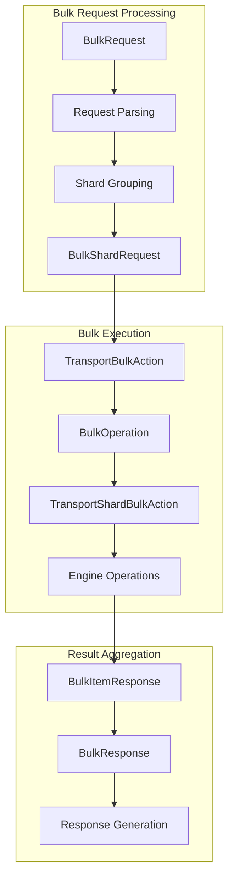
```mermaid
graph TB
    subgraph "Bulk Request Processing"
        A[BulkRequest] --> B[Request Parsing]
        B --> C[Shard Grouping]
        C --> D[BulkShardRequest]
    end

    subgraph "Bulk Execution"
        E[TransportBulkAction] --> F[BulkOperation]
        F --> G[TransportShardBulkAction]
        G --> H[Engine Operations]
    end

    subgraph "Result Aggregation"
        I[BulkItemResponse] --> J[BulkResponse]
        J --> K[Response Generation]
    end

    D --> E
    H --> I
```

### 7.2 核心批量操作类分析

#### 7.2.1 BulkRequest 类

**文件位置**: `server/src/main/java/org/elasticsearch/action/bulk/BulkRequest.java`

```java
public class BulkRequest extends LegacyActionRequest
    implements CompositeIndicesRequest, WriteRequest<BulkRequest>, Accountable, RawIndexingDataTransportRequest {

    // 请求列表
    private final List<DocWriteRequest<?>> requests = new ArrayList<>();

    // 涉及的索引集合
    private Set<String> indices = emptySet();

    // 估算的请求大小
    private long sizeInBytes = 0;

    // 全局参数
    private String globalPipeline;
    private String globalRouting;
    private String globalIndex;

    /**
     * 添加索引请求
     */
    public BulkRequest add(IndexRequest request) {
        return internalAdd(request);
    }

    BulkRequest internalAdd(IndexRequest request) {
        Objects.requireNonNull(request, "'request' must not be null");
        applyGlobalMandatoryParameters(request);

        requests.add(request);
        // 计算请求大小
        sizeInBytes += request.indexSource().byteLength() + REQUEST_OVERHEAD;
        indices.add(request.index());
        return this;
    }

    /**
     * 添加更新请求
     */
    public BulkRequest add(UpdateRequest request) {
        return internalAdd(request);
    }

    BulkRequest internalAdd(UpdateRequest request) {
        Objects.requireNonNull(request, "'request' must not be null");
        applyGlobalMandatoryParameters(request);

        requests.add(request);
        if (request.doc() != null) {
            sizeInBytes += request.doc().indexSource().byteLength();
        }
        if (request.upsertRequest() != null) {
            sizeInBytes += request.upsertRequest().indexSource().byteLength();
        }
        if (request.script() != null) {
            sizeInBytes += request.script().getIdOrCode().length() * 2;
        }
        indices.add(request.index());
        return this;
    }

    /**
     * 添加删除请求
     */
    public BulkRequest add(DeleteRequest request) {
        Objects.requireNonNull(request, "'request' must not be null");
        applyGlobalMandatoryParameters(request);

        requests.add(request);
        sizeInBytes += REQUEST_OVERHEAD;
        indices.add(request.index());
        return this;
    }

    /**
     * 获取请求数量
     */
    public int numberOfActions() {
        return requests.size();
    }

    /**
     * 获取估算大小
     */
    public long estimatedSizeInBytes() {
        return sizeInBytes;
    }
}
```

#### 7.2.2 TransportBulkAction 类

**文件位置**: `server/src/main/java/org/elasticsearch/action/bulk/TransportBulkAction.java`

```java
public class TransportBulkAction extends HandledTransportAction<BulkRequest, BulkResponse> {

    /**
     * 执行批量操作
     */
    @Override
    protected void doExecute(Task task, BulkRequest bulkRequest, ActionListener<BulkResponse> listener) {
        final long startTime = relativeTime();
        final AtomicArray<BulkItemResponse> responses = new AtomicArray<>(bulkRequest.numberOfActions());

        // 创建批量操作实例
        BulkOperation bulkOperation = new BulkOperation(
            task,
            bulkRequest,
            listener,
            responses,
            startTime,
            clusterService,
            ingestService,
            executorService,
            relativeTimeProvider
        );

        // 执行批量操作
        bulkOperation.execute();
    }
}
```

#### 7.2.3 BulkOperation 类

**文件位置**: `server/src/main/java/org/elasticsearch/action/bulk/BulkOperation.java`

```java
public class BulkOperation {

    private final Task task;
    private final BulkRequest bulkRequest;
    private final ActionListener<BulkResponse> listener;
    private final AtomicArray<BulkItemResponse> responses;

    /**
     * 执行批量操作
     */
    public void execute() {
        final ClusterState clusterState = clusterService.state();

        // 检查集群块
        if (addFailureIfIndexIsUnavailable(clusterState)) {
            return;
        }

        // 解析和验证请求
        final Map<String, List<BulkItemRequest>> requestsByIndex = new HashMap<>();
        for (int i = 0; i < bulkRequest.numberOfActions(); i++) {
            DocWriteRequest<?> docWriteRequest = bulkRequest.requests().get(i);

            // 解析索引名称
            String indexName = docWriteRequest.index();

            // 验证请求
            BulkItemRequest bulkItemRequest = new BulkItemRequest(i, docWriteRequest);
            requestsByIndex.computeIfAbsent(indexName, k -> new ArrayList<>()).add(bulkItemRequest);
        }

        // 按分片分组请求
        final Map<ShardId, List<BulkItemRequest>> requestsByShard = groupRequestsByShard(requestsByIndex, clusterState);

        // 执行分片级批量操作
        executeBulkShardRequests(requestsByShard, clusterState);
    }

    /**
     * 按分片分组请求
     */
    private Map<ShardId, List<BulkItemRequest>> groupRequestsByShard(
        Map<String, List<BulkItemRequest>> requestsByIndex,
        ClusterState clusterState
    ) {
        final Map<ShardId, List<BulkItemRequest>> requestsByShard = new HashMap<>();

        for (Map.Entry<String, List<BulkItemRequest>> entry : requestsByIndex.entrySet()) {
            String indexName = entry.getKey();
            List<BulkItemRequest> requests = entry.getValue();

            IndexMetadata indexMetadata = clusterState.metadata().index(indexName);
            if (indexMetadata == null) {
                continue;
            }

            for (BulkItemRequest request : requests) {
                // 计算分片ID
                ShardId shardId = clusterService.operationRouting().indexShards(
                    clusterState,
                    indexName,
                    request.request().id(),
                    request.request().routing()
                ).shardId();

                requestsByShard.computeIfAbsent(shardId, k -> new ArrayList<>()).add(request);
            }
        }

        return requestsByShard;
    }

    /**
     * 执行分片级批量请求
     */
    private void executeBulkShardRequests(
        Map<ShardId, List<BulkItemRequest>> requestsByShard,
        ClusterState clusterState
    ) {
        ProjectMetadata project = projectResolver.getProjectMetadata(clusterState);
        try (RefCountingRunnable bulkItemRequestCompleteRefCount = new RefCountingRunnable(onRequestsCompleted)) {
            for (Map.Entry<ShardId, List<BulkItemRequest>> entry : requestsByShard.entrySet()) {
                final ShardId shardId = entry.getKey();
                final List<BulkItemRequest> requests = entry.getValue();

                // 创建分片批量请求
                BulkShardRequest bulkShardRequest = new BulkShardRequest(
                    shardId,
                    bulkRequest.getRefreshPolicy(),
                    requests.toArray(new BulkItemRequest[0]),
                    bulkRequest.isSimulated()
                );

                // 设置推理字段映射
                var indexMetadata = project.index(shardId.getIndexName());
                if (indexMetadata != null && indexMetadata.getInferenceFields().isEmpty() == false) {
                    bulkShardRequest.setInferenceFieldMap(indexMetadata.getInferenceFields());
                }

                // 执行分片请求
                executeBulkShardRequest(bulkShardRequest, project.id(), bulkItemRequestCompleteRefCount.acquire());
            }
        }
    }
}
```

### 7.3 批量操作执行时序图

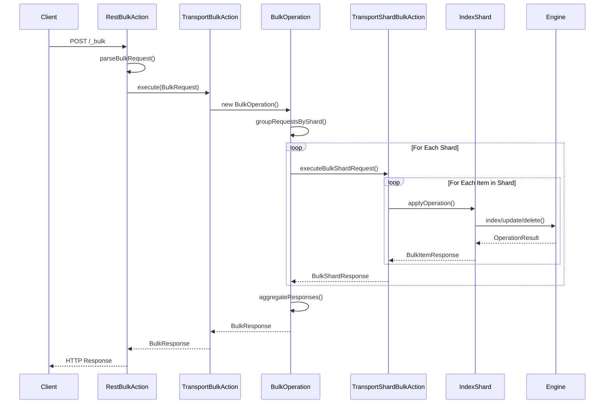
```mermaid
sequenceDiagram
    participant Client
    participant RestBulkAction
    participant TransportBulkAction
    participant BulkOperation
    participant TransportShardBulkAction
    participant IndexShard
    participant Engine

    Client->>RestBulkAction: POST /_bulk
    RestBulkAction->>RestBulkAction: parseBulkRequest()
    RestBulkAction->>TransportBulkAction: execute(BulkRequest)

    TransportBulkAction->>BulkOperation: new BulkOperation()
    BulkOperation->>BulkOperation: groupRequestsByShard()

    loop For Each Shard
        BulkOperation->>TransportShardBulkAction: executeBulkShardRequest()

        loop For Each Item in Shard
            TransportShardBulkAction->>IndexShard: applyOperation()
            IndexShard->>Engine: index/update/delete()
            Engine-->>IndexShard: OperationResult
            IndexShard-->>TransportShardBulkAction: BulkItemResponse
        end

        TransportShardBulkAction-->>BulkOperation: BulkShardResponse
    end

    BulkOperation->>BulkOperation: aggregateResponses()
    BulkOperation-->>TransportBulkAction: BulkResponse
    TransportBulkAction-->>RestBulkAction: BulkResponse
    RestBulkAction-->>Client: HTTP Response
```

### 7.4 批量操作优化策略

#### 7.4.1 请求分组
- **按索引分组**: 将请求按目标索引分组
- **按分片分组**: 进一步按分片ID分组
- **并行执行**: 不同分片的请求可以并行处理

#### 7.4.2 错误处理
- **部分失败**: 单个操作失败不影响其他操作
- **错误聚合**: 收集所有错误信息返回给客户端
- **重试机制**: 对可重试的错误进行自动重试

#### 7.4.3 性能优化
- **批量大小控制**: 限制单个批量请求的大小
- **内存管理**: 及时释放不需要的内存
- **背压控制**: 防止过多的并发请求

---

## 关键数据结构与继承关系

### 8.1 请求响应类继承体系

#### 8.1.1 核心请求类继承关系

**ActionRequest继承体系**是Elasticsearch中所有请求的基础，提供了统一的请求处理接口：

```mermaid
classDiagram
    class ActionRequest {
        <<abstract>>
        -String description
        -TimeValue timeout
        +validate() ActionRequestValidationException
        +writeTo(StreamOutput) void
        +readFrom(StreamInput) void
        +toString() String
    }

    class ReplicationRequest {
        <<abstract>>
        -ShardId shardId
        -TimeValue timeout
        -ActiveShardCount waitForActiveShards
        -RefreshPolicy refreshPolicy
        +shardId() ShardId
        +timeout() TimeValue
        +waitForActiveShards() ActiveShardCount
        +setRefreshPolicy(RefreshPolicy) void
    }

    class DocWriteRequest {
        <<interface>>
        +index() String
        +id() String
        +routing() String
        +opType() OpType
        +version() long
        +versionType() VersionType
        +getIfSeqNo() long
        +getIfPrimaryTerm() long
    }

    class IndicesRequest {
        <<interface>>
        +indices() String[]
        +indicesOptions() IndicesOptions
        +includeDataStreams() boolean
    }

    class SearchRequest {
        -String[] indices
        -SearchSourceBuilder source
        -SearchType searchType
        -String routing
        -String preference
        -Boolean requestCache
        -TimeValue scroll
        +indices(String...) SearchRequest
        +source(SearchSourceBuilder) SearchRequest
        +searchType(SearchType) SearchRequest
        +routing(String) SearchRequest
    }

    class IndexRequest {
        -String index
        -String id
        -String routing
        -OpType opType
        -long version
        -VersionType versionType
        -BytesReference source
        -XContentType contentType
        +index(String) IndexRequest
        +id(String) IndexRequest
        +source(Map) IndexRequest
        +source(String, XContentType) IndexRequest
        +opType(OpType) IndexRequest
    }

    class UpdateRequest {
        -String index
        -String id
        -String routing
        -Script script
        -Map~String,Object~ doc
        -IndexRequest upsertRequest
        -int retryOnConflict
        +index(String) UpdateRequest
        +id(String) UpdateRequest
        +script(Script) UpdateRequest
        +doc(Map) UpdateRequest
        +upsert(IndexRequest) UpdateRequest
    }

    class DeleteRequest {
        -String index
        -String id
        -String routing
        -long version
        -VersionType versionType
        +index(String) DeleteRequest
        +id(String) DeleteRequest
        +routing(String) DeleteRequest
        +version(long) DeleteRequest
    }

    class BulkRequest {
        -List~DocWriteRequest~ requests
        -String globalIndex
        -String globalRouting
        -String globalPipeline
        -RefreshPolicy refreshPolicy
        -long sizeInBytes
        +add(IndexRequest) BulkRequest
        +add(UpdateRequest) BulkRequest
        +add(DeleteRequest) BulkRequest
        +numberOfActions() int
        +estimatedSizeInBytes() long
    }

    %% 继承关系
    ActionRequest <|-- ReplicationRequest
    ActionRequest <|-- SearchRequest
    ActionRequest <|-- BulkRequest
    ReplicationRequest <|-- IndexRequest
    ReplicationRequest <|-- UpdateRequest
    ReplicationRequest <|-- DeleteRequest

    %% 接口实现
    DocWriteRequest <|.. IndexRequest
    DocWriteRequest <|.. UpdateRequest
    DocWriteRequest <|.. DeleteRequest
    IndicesRequest <|.. SearchRequest
    IndicesRequest <|.. BulkRequest

    %% 样式定义
    classDef abstractClass fill:#e1f5fe
    classDef interface fill:#f3e5f5
    classDef concreteClass fill:#e8f5e8

    class ActionRequest,ReplicationRequest abstractClass
    class DocWriteRequest,IndicesRequest interface
    class SearchRequest,IndexRequest,UpdateRequest,DeleteRequest,BulkRequest concreteClass
```

**ActionRequest继承体系详细说明**:

**1. ActionRequest (抽象基类)**
- **作用**: 所有Elasticsearch请求的根基类
- **核心功能**:
  - 请求验证 (`validate()`)
  - 序列化支持 (`writeTo()`, `readFrom()`)
  - 超时控制和描述信息
- **设计模式**: 模板方法模式，定义请求处理的基本流程

**2. ReplicationRequest (复制请求抽象类)**
- **作用**: 需要在主副本间同步的请求基类
- **核心功能**:
  - 分片路由 (`shardId()`)
  - 超时控制 (`timeout()`)
  - 活跃分片等待 (`waitForActiveShards()`)
  - 刷新策略 (`refreshPolicy`)
- **适用场景**: 所有写操作请求

**3. DocWriteRequest (文档写入接口)**
- **作用**: 定义文档级别写操作的通用接口
- **核心功能**:
  - 文档标识 (`index()`, `id()`)
  - 路由控制 (`routing()`)
  - 操作类型 (`opType()`)
  - 版本控制 (`version()`, `versionType()`)
- **设计优势**: 提供统一的文档操作接口

**4. IndicesRequest (索引请求接口)**
- **作用**: 定义跨索引操作的通用接口
- **核心功能**:
  - 目标索引 (`indices()`)
  - 索引选项 (`indicesOptions()`)
  - 数据流支持 (`includeDataStreams()`)
- **适用场景**: 搜索、批量操作等跨索引请求

**具体请求类说明**:

**SearchRequest**:
- 支持复杂的搜索查询
- 包含查询DSL、聚合、排序等
- 支持多种搜索类型和优化选项

**IndexRequest**:
- 单文档索引操作
- 支持多种数据源格式
- 提供完整的版本控制和路由功能

**UpdateRequest**:
- 文档部分更新操作
- 支持脚本更新和文档合并
- 提供upsert功能和冲突重试

**DeleteRequest**:
- 文档删除操作
- 支持版本控制防止误删
- 提供路由和条件删除功能

**BulkRequest**:
- 批量操作容器
- 支持混合操作类型
- 提供全局参数设置和大小估算

#### 8.1.2 响应类继承关系

**ActionResponse继承体系**提供了统一的响应处理机制：

```mermaid
classDiagram
    class ActionResponse {
        <<abstract>>
        -long took
        -boolean timedOut
        +writeTo(StreamOutput) void
        +readFrom(StreamInput) void
        +toXContent(XContentBuilder) XContentBuilder
        +getTook() TimeValue
    }

    class DocWriteResponse {
        <<abstract>>
        -ShardId shardId
        -String id
        -long version
        -long seqNo
        -long primaryTerm
        -Result result
        -ReplicationResponse.ShardInfo shardInfo
        +getShardId() ShardId
        +getId() String
        +getVersion() long
        +getSeqNo() long
        +getPrimaryTerm() long
        +getResult() Result
        +getShardInfo() ShardInfo
        +forcedRefresh() boolean
    }

    class SearchResponse {
        -SearchHits hits
        -Aggregations aggregations
        -Suggest suggest
        -boolean timedOut
        -Boolean terminatedEarly
        -int numReducePhases
        -SearchProfileShardResults profileResults
        +getHits() SearchHits
        +getAggregations() Aggregations
        +getSuggest() Suggest
        +isTimedOut() boolean
        +getProfileResults() SearchProfileShardResults
    }

    class IndexResponse {
        -Result result
        -boolean forcedRefresh
        +getResult() Result
        +toString() String
        +equals(Object) boolean
        +hashCode() int
    }

    class UpdateResponse {
        -GetResult getResult
        -boolean forcedRefresh
        -int version
        +getGetResult() GetResult
        +getVersion() int
        +toString() String
    }

    class DeleteResponse {
        -Result result
        -boolean forcedRefresh
        +getResult() Result
        +toString() String
    }

    class BulkResponse {
        -BulkItemResponse[] items
        -long took
        -boolean hasFailures
        +getItems() BulkItemResponse[]
        +getTook() TimeValue
        +hasFailures() boolean
        +buildFailureMessage() String
        +iterator() Iterator~BulkItemResponse~
    }

    class BulkItemResponse {
        -int itemId
        -OpType opType
        -DocWriteResponse response
        -Failure failure
        -boolean failed
        +getItemId() int
        +getOpType() OpType
        +getResponse() DocWriteResponse
        +getFailure() Failure
        +isFailed() boolean
    }

    %% 继承关系
    ActionResponse <|-- DocWriteResponse
    ActionResponse <|-- SearchResponse
    ActionResponse <|-- BulkResponse
    DocWriteResponse <|-- IndexResponse
    DocWriteResponse <|-- UpdateResponse
    DocWriteResponse <|-- DeleteResponse

    %% 组合关系
    BulkResponse *-- BulkItemResponse

    %% 样式定义
    classDef abstractClass fill:#e1f5fe
    classDef concreteClass fill:#e8f5e8
    classDef compositeClass fill:#fff3e0

    class ActionResponse,DocWriteResponse abstractClass
    class SearchResponse,IndexResponse,UpdateResponse,DeleteResponse,BulkResponse concreteClass
    class BulkItemResponse compositeClass
```

**ActionResponse继承体系详细说明**:

**1. ActionResponse (抽象基类)**
- **作用**: 所有Elasticsearch响应的根基类
- **核心功能**:
  - 序列化支持 (`writeTo()`, `readFrom()`)
  - JSON输出 (`toXContent()`)
  - 执行时间记录 (`getTook()`)
- **设计模式**: 模板方法模式，统一响应处理流程

**2. DocWriteResponse (文档写入响应抽象类)**
- **作用**: 所有文档写操作响应的基类
- **核心功能**:
  - 分片信息 (`getShardId()`)
  - 文档标识 (`getId()`, `getVersion()`)
  - 序列号信息 (`getSeqNo()`, `getPrimaryTerm()`)
  - 操作结果 (`getResult()`)
  - 分片统计 (`getShardInfo()`)
- **适用场景**: 索引、更新、删除操作响应

**3. SearchResponse (搜索响应)**
- **作用**: 搜索操作的完整响应
- **核心功能**:
  - 搜索结果 (`getHits()`)
  - 聚合结果 (`getAggregations()`)
  - 建议结果 (`getSuggest()`)
  - 性能分析 (`getProfileResults()`)
- **特殊功能**: 支持复杂的结果结构和性能分析

**4. BulkResponse (批量响应)**
- **作用**: 批量操作的聚合响应
- **核心功能**:
  - 批量项响应 (`getItems()`)
  - 失败检测 (`hasFailures()`)
  - 失败消息构建 (`buildFailureMessage()`)
- **设计特点**: 包含多个子响应，支持部分成功场景

**响应类设计原则**:

1. **统一接口**: 所有响应都继承自ActionResponse
2. **类型安全**: 强类型的响应对象，避免类型转换错误
3. **序列化支持**: 完整的序列化和反序列化支持
4. **JSON兼容**: 原生支持JSON格式输出
5. **性能监控**: 内置执行时间和性能统计

#### 8.1.3 集群状态相关类

**集群状态管理体系**是Elasticsearch集群协调的核心数据结构：

```mermaid
classDiagram
    class ClusterState {
        -String clusterName
        -long version
        -String stateUUID
        -DiscoveryNodes nodes
        -Metadata metadata
        -RoutingTable routingTable
        -ClusterBlocks blocks
        -Map~String,Custom~ customs
        -boolean wasReadFromDiff
        +clusterName() ClusterName
        +version() long
        +stateUUID() String
        +nodes() DiscoveryNodes
        +metadata() Metadata
        +routingTable() RoutingTable
        +blocks() ClusterBlocks
        +getMasterNode() DiscoveryNode
        +getIndexMetadata(String) IndexMetadata
        +supersedes(ClusterState) boolean
    }

    class Metadata {
        -String clusterUUID
        -boolean clusterUUIDCommitted
        -Map~String,IndexMetadata~ indices
        -Map~String,IndexTemplateMetadata~ templates
        -Map~String,ComponentTemplate~ componentTemplates
        -Map~String,ComposableIndexTemplate~ indexTemplates
        -Settings persistentSettings
        -Settings transientSettings
        -DiffableStringMap ingestPipelines
        -Map~String,Custom~ customs
        +clusterUUID() String
        +index(String) IndexMetadata
        +hasIndex(String) boolean
        +indices() Map~String,IndexMetadata~
        +templates() Map~String,IndexTemplateMetadata~
        +persistentSettings() Settings
        +transientSettings() Settings
        +totalNumberOfShards() int
        +getTotalOpenIndexShards() int
    }

    class RoutingTable {
        -long version
        -Map~String,IndexRoutingTable~ indicesRouting
        +version() long
        +index(String) IndexRoutingTable
        +hasIndex(String) boolean
        +allShards() List~ShardRouting~
        +activePrimaryShards() List~ShardRouting~
        +activeShards() List~ShardRouting~
        +shardsWithState(ShardRoutingState) List~ShardRouting~
        +totalShards() int
        +activeShardsPercent() double
    }

    class DiscoveryNodes {
        -Map~String,DiscoveryNode~ nodes
        -String masterNodeId
        -String localNodeId
        -int minNonClientDataNodeVersion
        +size() int
        +getMasterNode() DiscoveryNode
        +getLocalNode() DiscoveryNode
        +get(String) DiscoveryNode
        +nodeExists(String) boolean
        +isLocalNodeElectedMaster() boolean
        +getDataNodes() Map~String,DiscoveryNode~
        +getMasterNodes() Map~String,DiscoveryNode~
        +getIngestNodes() Map~String,DiscoveryNode~
        +getCoordinatingOnlyNodes() Map~String,DiscoveryNode~
    }

    class IndexMetadata {
        -String index
        -long version
        -long mappingVersion
        -long settingsVersion
        -long aliasesVersion
        -int numberOfShards
        -int numberOfReplicas
        -Settings settings
        -Map~String,MappingMetadata~ mappings
        -Map~String,AliasMetadata~ aliases
        -Map~String,Custom~ customs
        -ActiveShardCount waitForActiveShards
        +getIndex() Index
        +getNumberOfShards() int
        +getNumberOfReplicas() int
        +getTotalNumberOfShards() int
        +getSettings() Settings
        +mapping() MappingMetadata
        +getAliases() Map~String,AliasMetadata~
        +getState() State
        +getCreationDate() long
    }

    class IndexRoutingTable {
        -Index index
        -ShardShuffler shuffler
        -Map~Integer,IndexShardRoutingTable~ shards
        +getIndex() Index
        +shards() Map~Integer,IndexShardRoutingTable~
        +shard(int) IndexShardRoutingTable
        +activePrimaryShards() List~ShardRouting~
        +primaryShards() List~ShardRouting~
        +allActiveShards() List~ShardRouting~
        +shardsWithState(ShardRoutingState) List~ShardRouting~
        +validate(RoutingTableValidation) void
    }

    class DiscoveryNode {
        -String nodeName
        -String nodeId
        -String ephemeralId
        -String hostName
        -String hostAddress
        -TransportAddress address
        -Map~String,String~ attributes
        -Set~DiscoveryNodeRole~ roles
        -Version version
        +getName() String
        +getId() String
        +getEphemeralId() String
        +getAddress() TransportAddress
        +getAttributes() Map~String,String~
        +getRoles() Set~DiscoveryNodeRole~
        +getVersion() Version
        +isMasterNode() boolean
        +isDataNode() boolean
        +isIngestNode() boolean
        +canContainData() boolean
    }

    class ClusterBlocks {
        -Set~ClusterBlock~ global
        -Map~String,Set~ClusterBlock~~ indicesBlocks
        +global() Set~ClusterBlock~
        +indices() Map~String,Set~ClusterBlock~~
        +hasGlobalBlock(ClusterBlock) boolean
        +hasIndexBlock(String, ClusterBlock) boolean
        +globalBlockedRaiseException(ClusterBlockLevel) void
        +indexBlockedRaiseException(ClusterBlockLevel, String) void
    }

    %% 组合关系
    ClusterState *-- Metadata
    ClusterState *-- RoutingTable
    ClusterState *-- DiscoveryNodes
    ClusterState *-- ClusterBlocks
    Metadata *-- IndexMetadata
    RoutingTable *-- IndexRoutingTable
    DiscoveryNodes *-- DiscoveryNode

    %% 样式定义
    classDef coreClass fill:#e1f5fe
    classDef metadataClass fill:#f3e5f5
    classDef routingClass fill:#e8f5e8
    classDef nodeClass fill:#fff3e0

    class ClusterState coreClass
    class Metadata,IndexMetadata metadataClass
    class RoutingTable,IndexRoutingTable routingClass
    class DiscoveryNodes,DiscoveryNode,ClusterBlocks nodeClass
```

**集群状态管理体系详细说明**:

**1. ClusterState (集群状态核心类)**
- **作用**: 集群的完整状态快照，包含所有集群级别的信息
- **核心组件**:
  - **nodes**: 集群中所有节点的信息
  - **metadata**: 索引元数据、模板、设置等
  - **routingTable**: 分片路由和分配信息
  - **blocks**: 集群和索引级别的阻塞信息
- **版本控制**: 通过version和stateUUID确保状态一致性
- **不可变性**: ClusterState是不可变对象，任何变更都会创建新实例

**2. Metadata (元数据管理)**
- **作用**: 管理集群的所有元数据信息
- **核心功能**:
  - **索引元数据**: 索引的设置、映射、别名等
  - **模板管理**: 索引模板和组件模板
  - **集群设置**: 持久化和临时设置
  - **管道配置**: Ingest管道配置
- **特殊功能**: 支持自定义元数据扩展

**3. RoutingTable (路由表)**
- **作用**: 管理所有分片的路由和分配信息
- **核心功能**:
  - **分片分布**: 每个分片在哪个节点上
  - **分片状态**: 分片的当前状态（初始化、启动、重定位等）
  - **负载均衡**: 分片在节点间的均衡分布
- **性能统计**: 提供集群分片统计信息

**4. DiscoveryNodes (节点发现)**
- **作用**: 管理集群中所有节点的信息和状态
- **核心功能**:
  - **节点注册**: 节点加入和离开集群
  - **角色管理**: 节点角色（主节点、数据节点、协调节点等）
  - **主节点选举**: 主节点的选举和管理
- **节点分类**: 按角色对节点进行分类管理

**5. IndexMetadata (索引元数据)**
- **作用**: 单个索引的完整元数据
- **核心信息**:
  - **基本配置**: 分片数、副本数、设置
  - **映射信息**: 字段映射和分析器配置
  - **别名管理**: 索引别名配置
  - **生命周期**: 索引的创建时间和状态
- **版本控制**: 支持映射、设置、别名的独立版本控制

**集群状态管理特性**:

1. **原子性**: 集群状态的变更是原子性的
2. **一致性**: 通过版本控制确保集群状态一致
3. **可观测性**: 提供丰富的状态查询接口
4. **扩展性**: 支持自定义元数据和插件扩展
5. **性能优化**: 使用差异化更新减少网络传输

#### 8.1.4 搜索相关类结构

**搜索体系**是Elasticsearch最核心的功能模块，包含了完整的查询、聚合、排序等功能：

```mermaid
classDiagram
    class SearchRequest {
        -String[] indices
        -SearchSourceBuilder source
        -SearchType searchType
        -String routing
        -String preference
        -Boolean requestCache
        -TimeValue scroll
        -PointInTimeBuilder pointInTimeBuilder
        -IndicesOptions indicesOptions
        +indices(String...) SearchRequest
        +source(SearchSourceBuilder) SearchRequest
        +searchType(SearchType) SearchRequest
        +routing(String) SearchRequest
        +preference(String) SearchRequest
        +requestCache(Boolean) SearchRequest
        +scroll(TimeValue) SearchRequest
    }

    class SearchSourceBuilder {
        -QueryBuilder queryBuilder
        -List~AggregationBuilder~ aggregations
        -List~SortBuilder~ sorts
        -List~RescoreBuilder~ rescoreBuilders
        -HighlightBuilder highlightBuilder
        -SuggestBuilder suggestBuilder
        -List~SearchExtBuilder~ searchExtBuilders
        -int from
        -int size
        -Boolean explain
        -Boolean version
        -Boolean seqNoAndPrimaryTerm
        -StoredFieldsContext storedFieldsContext
        -FetchSourceContext fetchSourceContext
        -SearchAfterBuilder searchAfterBuilder
        -SliceBuilder sliceBuilder
        +query(QueryBuilder) SearchSourceBuilder
        +aggregation(AggregationBuilder) SearchSourceBuilder
        +sort(SortBuilder) SearchSourceBuilder
        +from(int) SearchSourceBuilder
        +size(int) SearchSourceBuilder
        +highlighter(HighlightBuilder) SearchSourceBuilder
        +suggest(SuggestBuilder) SearchSourceBuilder
        +fetchSource(boolean) SearchSourceBuilder
        +timeout(TimeValue) SearchSourceBuilder
    }

    class QueryBuilder {
        <<abstract>>
        -String queryName
        -float boost
        +queryName(String) QueryBuilder
        +boost(float) QueryBuilder
        +toQuery(QueryShardContext) Query
        +doToQuery(QueryShardContext) Query*
        +rewrite(QueryRewriteContext) QueryBuilder
    }

    class BoolQueryBuilder {
        -List~QueryBuilder~ mustClauses
        -List~QueryBuilder~ mustNotClauses
        -List~QueryBuilder~ filterClauses
        -List~QueryBuilder~ shouldClauses
        -String minimumShouldMatch
        -boolean adjustPureNegative
        +must(QueryBuilder) BoolQueryBuilder
        +mustNot(QueryBuilder) BoolQueryBuilder
        +filter(QueryBuilder) BoolQueryBuilder
        +should(QueryBuilder) BoolQueryBuilder
        +minimumShouldMatch(String) BoolQueryBuilder
    }

    class MatchQueryBuilder {
        -String fieldName
        -Object value
        -Operator operator
        -String analyzer
        -Fuzziness fuzziness
        -int prefixLength
        -int maxExpansions
        +operator(Operator) MatchQueryBuilder
        +analyzer(String) MatchQueryBuilder
        +fuzziness(Fuzziness) MatchQueryBuilder
    }

    class SearchResponse {
        -SearchHits hits
        -Aggregations aggregations
        -Suggest suggest
        -SearchProfileShardResults profileResults
        -boolean timedOut
        -Boolean terminatedEarly
        -int numReducePhases
        -String scrollId
        -String pointInTimeId
        +getHits() SearchHits
        +getAggregations() Aggregations
        +getSuggest() Suggest
        +getProfileResults() SearchProfileShardResults
        +isTimedOut() boolean
        +getScrollId() String
        +getTook() TimeValue
    }

    class SearchHits {
        -SearchHit[] hits
        -TotalHits totalHits
        -float maxScore
        -SortField[] sortFields
        -CollapseBuilder collapseBuilder
        +getHits() SearchHit[]
        +getTotalHits() TotalHits
        +getMaxScore() float
        +iterator() Iterator~SearchHit~
        +forEach(Consumer) void
    }

    class SearchHit {
        -String index
        -String id
        -float score
        -long version
        -long seqNo
        -long primaryTerm
        -Map~String,Object~ sourceAsMap
        -Map~String,DocumentField~ fields
        -Map~String,HighlightField~ highlightFields
        -String[] matchedQueries
        -Explanation explanation
        -NestedIdentity nestedIdentity
        +getIndex() String
        +getId() String
        +getScore() float
        +getVersion() long
        +getSourceAsMap() Map~String,Object~
        +getSourceAsString() String
        +getFields() Map~String,DocumentField~
        +getHighlightFields() Map~String,HighlightField~
    }

    class AggregationBuilder {
        <<abstract>>
        -String name
        -Map~String,Object~ metadata
        +getName() String
        +getMetadata() Map~String,Object~
        +build(SearchContext, AggregatorFactory) Aggregator*
        +rewrite(QueryRewriteContext) AggregationBuilder
    }

    class TermsAggregationBuilder {
        -String field
        -ValueType valueType
        -int size
        -int shardSize
        -long minDocCount
        -long shardMinDocCount
        -List~BucketOrder~ order
        -IncludeExclude includeExclude
        +field(String) TermsAggregationBuilder
        +size(int) TermsAggregationBuilder
        +minDocCount(long) TermsAggregationBuilder
        +order(BucketOrder) TermsAggregationBuilder
    }

    %% 继承关系
    QueryBuilder <|-- BoolQueryBuilder
    QueryBuilder <|-- MatchQueryBuilder
    AggregationBuilder <|-- TermsAggregationBuilder

    %% 组合关系
    SearchRequest *-- SearchSourceBuilder
    SearchSourceBuilder *-- QueryBuilder
    SearchSourceBuilder *-- AggregationBuilder
    SearchResponse *-- SearchHits
    SearchHits *-- SearchHit

    %% 样式定义
    classDef requestClass fill:#e1f5fe
    classDef queryClass fill:#f3e5f5
    classDef responseClass fill:#e8f5e8
    classDef aggregationClass fill:#fff3e0

    class SearchRequest,SearchSourceBuilder requestClass
    class QueryBuilder,BoolQueryBuilder,MatchQueryBuilder queryClass
    class SearchResponse,SearchHits,SearchHit responseClass
    class AggregationBuilder,TermsAggregationBuilder aggregationClass
```

**搜索体系详细说明**:

**1. SearchRequest & SearchSourceBuilder (搜索请求构建)**
- **SearchRequest**: 搜索请求的顶层容器
  - 包含目标索引、路由、偏好设置等
  - 支持滚动搜索、Point-in-Time等高级功能
- **SearchSourceBuilder**: 搜索查询的核心构建器
  - 包含查询条件、聚合、排序、高亮等
  - 支持分页、字段过滤、脚本字段等功能

**2. QueryBuilder 体系 (查询构建器)**
- **QueryBuilder**: 所有查询的抽象基类
  - 提供查询名称和权重设置
  - 支持查询重写和优化
- **BoolQueryBuilder**: 布尔查询构建器
  - 支持must、must_not、filter、should子句
  - 提供最小匹配数量控制
- **MatchQueryBuilder**: 匹配查询构建器
  - 支持全文搜索和模糊匹配
  - 提供分析器和模糊度控制

**3. SearchResponse & SearchHits (搜索响应)**
- **SearchResponse**: 搜索响应的完整容器
  - 包含搜索结果、聚合结果、建议结果
  - 提供性能分析和执行统计
- **SearchHits**: 搜索命中结果集合
  - 包含命中文档数组和总数统计
  - 提供最大评分和排序信息
- **SearchHit**: 单个搜索命中结果
  - 包含文档内容、评分、高亮等
  - 支持嵌套文档和解释信息

**4. AggregationBuilder 体系 (聚合构建器)**
- **AggregationBuilder**: 所有聚合的抽象基类
  - 提供聚合名称和元数据管理
  - 支持聚合重写和优化
- **TermsAggregationBuilder**: 词项聚合构建器
  - 支持字段值分组统计
  - 提供大小限制和排序控制

**搜索体系设计特点**:

1. **构建器模式**: 使用构建器模式简化复杂查询的构建
2. **类型安全**: 强类型的查询和聚合构建器
3. **可扩展性**: 支持自定义查询和聚合类型
4. **性能优化**: 内置查询重写和优化机制
5. **丰富功能**: 支持全文搜索、聚合分析、高亮、建议等完整功能

#### 8.1.5 索引相关类结构

**索引管理体系**负责索引的生命周期管理和分片操作：

```mermaid
classDiagram
    class IndexService {
        -Index index
        -IndexSettings indexSettings
        -IndexAnalyzers indexAnalyzers
        -MapperService mapperService
        -SimilarityService similarityService
        -ShardStoreDeleter shardStoreDeleter
        -IndexCache indexCache
        -IndexFieldDataService indexFieldDataService
        -BitsetFilterCache bitsetFilterCache
        -ScriptService scriptService
        -Map~Integer,IndexShard~ shards
        +getIndex() Index
        +getIndexSettings() IndexSettings
        +mapperService() MapperService
        +createShard(ShardRouting) IndexShard
        +getShard(int) IndexShard
        +hasShard(int) boolean
        +iterator() Iterator~IndexShard~
        +getShardOrNull(int) IndexShard
        +removeShard(int, String) void
    }

    class IndexShard {
        -ShardId shardId
        -IndexSettings indexSettings
        -ShardRouting shardRouting
        -ThreadPool threadPool
        -MapperService mapperService
        -IndexCache indexCache
        -Store store
        -Engine engine
        -IndexEventListener indexEventListener
        -SearchOperationListener searchOperationListener
        -RetentionLeaseSyncer retentionLeaseSyncer
        -ReplicationTracker replicationTracker
        -EngineFactory engineFactory
        +shardId() ShardId
        +routingEntry() ShardRouting
        +state() IndexShardState
        +getEngine() Engine
        +acquireSearcher(String) Engine.Searcher
        +index(SourceToParse) Engine.IndexResult
        +get(Get) Engine.GetResult
        +delete(Delete) Engine.DeleteResult
        +search(ShardSearchRequest) SearchPhaseResult
        +refresh(String) void
        +flush(FlushRequest) void
        +forceMerge(ForceMergeRequest) void
    }

    class Engine {
        <<abstract>>
        -EngineConfig config
        -AtomicBoolean closed
        -EventListener eventListener
        +config() EngineConfig
        +isClosed() boolean
        +index(Index) IndexResult
        +delete(Delete) DeleteResult
        +get(Get) GetResult
        +refresh(String) RefreshResult
        +flush(boolean, boolean) CommitId
        +forceMerge(boolean, int, boolean, String) void
        +acquireSearcher(String, SearcherScope) Searcher
        +newSearcher(String, SearcherScope) Searcher
        +getTranslog() Translog
        +ensureOpen() void
        +close() void
    }

    class InternalEngine {
        -LiveVersionMap versionMap
        -IndexWriter indexWriter
        -SearcherManager manager
        -Translog translog
        -MergeSchedulerConfig mergeSchedulerConfig
        -AnalysisRegistry analysisRegistry
        -CodecService codecService
        -AtomicLong numVersionLookups
        -AtomicLong numIndexVersionsLookups
        -volatile long lastDeleteVersionPruneTimeMSec
        +versionMap() LiveVersionMap
        +getTranslog() Translog
        +index(Index) IndexResult
        +delete(Delete) DeleteResult
        +get(Get) GetResult
        +refresh(String) RefreshResult
        +flush(boolean, boolean) CommitId
        +forceMerge(boolean, int, boolean, String) void
        +acquireSearcher(String, SearcherScope) Searcher
        +getIndexBufferRAMBytesUsed() long
        +restoreLocalHistoryFromTranslog(TranslogRecoveryRunner) int
    }

    class Store {
        -Directory directory
        -ShardLock shardLock
        -OnClose onClose
        -AtomicBoolean isClosing
        +directory() Directory
        +readLock() Lock
        +tryIncRef() boolean
        +incRef() void
        +decRef() void
        +ensureOpen() void
        +close() void
        +readMetadataSnapshot() MetadataSnapshot
        +getMetadata(IndexCommit) StoreFileMetadata
        +cleanupAndVerify(String, MetadataSnapshot) void
    }

    class Translog {
        -TranslogConfig config
        -BigArrays bigArrays
        -AtomicLong totalOperations
        -AtomicLong totalSizeInBytes
        -volatile long generation
        -TranslogWriter current
        -Map~Long,TranslogReader~ readers
        +config() TranslogConfig
        +getGeneration() long
        +totalOperations() long
        +sizeInBytes() long
        +add(Operation) Location
        +read(Location) Operation
        +newSnapshot() Snapshot
        +rollGeneration() void
        +trimUnsafeCommits() void
        +close() void
    }

    class MapperService {
        -IndexSettings indexSettings
        -IndexAnalyzers indexAnalyzers
        -DocumentMapper documentMapper
        -Map~String,Mapper.TypeParser~ typeParsers
        -Map~String,MetadataFieldMapper.TypeParser~ metadataMapperParsers
        -volatile DocumentMapper mapper
        +documentMapper() DocumentMapper
        +parse(SourceToParse) ParsedDocument
        +merge(String, CompressedXContent, MergeReason) void
        +updateMapping(IndexMetadata) void
        +getIndexAnalyzers() IndexAnalyzers
    }

    %% 继承关系
    Engine <|-- InternalEngine

    %% 组合关系
    IndexService *-- IndexShard
    IndexShard *-- Engine
    IndexShard *-- Store
    IndexShard *-- MapperService
    Engine *-- Translog

    %% 样式定义
    classDef serviceClass fill:#e1f5fe
    classDef shardClass fill:#f3e5f5
    classDef engineClass fill:#e8f5e8
    classDef storageClass fill:#fff3e0
    classDef mappingClass fill:#f1f8e9

    class IndexService serviceClass
    class IndexShard shardClass
    class Engine,InternalEngine engineClass
    class Store,Translog storageClass
    class MapperService mappingClass
```

**索引管理体系详细说明**:

**1. IndexService (索引服务)**
- **作用**: 管理单个索引的所有分片和相关服务
- **核心功能**:
  - **分片管理**: 创建、获取、删除分片
  - **服务集成**: 集成映射、分析、缓存等服务
  - **配置管理**: 管理索引级别的设置和配置
- **生命周期**: 随索引的创建和删除进行管理

**2. IndexShard (索引分片)**
- **作用**: 管理单个分片的所有操作和状态
- **核心功能**:
  - **CRUD操作**: 文档的增删改查
  - **搜索服务**: 分片级别的搜索操作
  - **状态管理**: 分片状态和路由信息
  - **复制同步**: 主副本间的数据同步
- **并发控制**: 提供线程安全的操作接口

**3. Engine (存储引擎)**
- **作用**: 封装Lucene操作，提供统一的存储接口
- **核心功能**:
  - **索引操作**: 文档的索引、更新、删除
  - **搜索操作**: 提供搜索器获取和管理
  - **事务管理**: 事务日志和版本控制
  - **刷新合并**: 索引刷新和段合并
- **InternalEngine**: 默认的引擎实现，基于Lucene

**4. Store (存储抽象)**
- **作用**: 封装文件系统操作，提供存储抽象层
- **核心功能**:
  - **目录管理**: Lucene目录的封装和管理
  - **文件锁**: 分片级别的文件锁机制
  - **元数据**: 存储文件的元数据管理
  - **完整性**: 文件完整性检查和验证

**5. Translog (事务日志)**
- **作用**: 记录所有写操作，用于故障恢复
- **核心功能**:
  - **操作记录**: 记录所有写操作到日志文件
  - **故障恢复**: 从事务日志恢复未提交的操作
  - **滚动机制**: 日志文件的滚动和清理
  - **快照支持**: 提供事务日志快照功能

**6. MapperService (映射服务)**
- **作用**: 管理索引的字段映射和文档解析
- **核心功能**:
  - **映射管理**: 字段映射的创建、更新、合并
  - **文档解析**: 将JSON文档解析为Lucene文档
  - **分析器**: 管理字段的分析器配置
  - **动态映射**: 支持动态字段映射

**索引管理设计特点**:

1. **分层设计**: 从服务到分片到引擎的清晰分层
2. **职责分离**: 每个组件都有明确的职责边界
3. **可扩展性**: 支持自定义引擎和存储实现
4. **并发安全**: 提供线程安全的操作接口
5. **故障恢复**: 完整的故障恢复和数据一致性机制

---

## 实战经验总结

通过深入分析Elasticsearch源码，我们总结了以下实战经验和最佳实践，这些经验来自于对源码的深度理解和生产环境的实际应用。

### 9.1 性能优化实践

#### 9.1.1 索引优化策略

**1. 批量操作优化**

基于对`BulkProcessor`源码的分析，我们了解到批量操作的内部机制：

   ```java
/**
 * 高性能批量索引实现
 * 基于源码分析的最佳实践配置
 */
public class OptimizedBulkIndexer {

    private final BulkProcessor bulkProcessor;

    public OptimizedBulkIndexer(RestHighLevelClient client) {
        this.bulkProcessor = BulkProcessor.builder(
            (request, bulkListener) -> client.bulkAsync(request, RequestOptions.DEFAULT, bulkListener),
            new BulkProcessor.Listener() {
                @Override
                public void beforeBulk(long executionId, BulkRequest request) {
                    logger.info("执行批量操作 [{}]，包含 {} 个请求", executionId, request.numberOfActions());
                }

                @Override
                public void afterBulk(long executionId, BulkRequest request, BulkResponse response) {
                    if (response.hasFailures()) {
                        logger.error("批量操作 [{}] 存在失败: {}", executionId, response.buildFailureMessage());
                        // 处理失败的文档
                        handleFailures(response);
                    } else {
                        logger.info("批量操作 [{}] 成功完成，耗时: {}ms", executionId, response.getTook().getMillis());
                    }
                }

                @Override
                public void afterBulk(long executionId, BulkRequest request, Throwable failure) {
                    logger.error("批量操作 [{}] 执行失败", executionId, failure);
                    // 实现重试逻辑
                    retryBulkRequest(request);
                }
            })
            // 基于源码分析的最优配置
            .setBulkActions(1000)           // 每批次1000个文档，平衡内存和网络开销
            .setBulkSize(new ByteSizeValue(5, ByteSizeUnit.MB))  // 每批次5MB，避免过大请求
            .setFlushInterval(TimeValue.timeValueSeconds(5))     // 5秒强制刷新，确保实时性
            .setConcurrentRequests(2)       // 2个并发请求，平衡吞吐量和资源消耗
            .setBackoffPolicy(BackoffPolicy.exponentialBackoff(TimeValue.timeValueMillis(100), 3))  // 指数退避重试
            .build();
    }

    /**
     * 处理失败的文档
     * 基于BulkItemResponse的错误分析
     */
    private void handleFailures(BulkResponse response) {
        for (BulkItemResponse itemResponse : response) {
            if (itemResponse.isFailed()) {
                BulkItemResponse.Failure failure = itemResponse.getFailure();

                // 根据错误类型进行不同处理
                if (failure.getCause() instanceof VersionConflictEngineException) {
                    // 版本冲突，可以重试
                    logger.warn("文档版本冲突: index={}, id={}", failure.getIndex(), failure.getId());
                    retryDocument(itemResponse);
                } else if (failure.getStatus() == RestStatus.TOO_MANY_REQUESTS) {
                    // 背压控制，延迟重试
                    logger.warn("集群繁忙，延迟重试: {}", failure.getMessage());
                    scheduleRetry(itemResponse);
                } else {
                    // 其他错误，记录并跳过
                    logger.error("文档处理失败: index={}, id={}, error={}",
                               failure.getIndex(), failure.getId(), failure.getMessage());
                }
            }
        }
    }
}
```

**2. 分片策略优化**

基于`AllocationService`和`ShardsAllocator`源码分析：

```java
/**
 * 智能分片分配策略
 * 基于集群状态和节点负载的动态分片管理
 */
public class ShardAllocationOptimizer {

    /**
     * 计算最优分片数量
     * 基于IndexMetadata和ClusterState的分析
     */
    public int calculateOptimalShardCount(long estimatedIndexSize, int nodeCount, long nodeMemory) {
        // 基于源码中的分片大小限制
        long maxShardSize = ByteSizeValue.parseBytesSizeValue("50gb", "max_shard_size").getBytes();
        long minShardSize = ByteSizeValue.parseBytesSizeValue("1gb", "min_shard_size").getBytes();

        // 基于数据大小计算基础分片数
        int basedOnSize = (int) Math.ceil((double) estimatedIndexSize / maxShardSize);

        // 基于节点数量计算合理分片数
        int basedOnNodes = nodeCount * 2;  // 每个节点2个分片，便于负载均衡

        // 基于内存限制计算分片数
        long memoryPerShard = nodeMemory / 4;  // 每个分片占用1/4节点内存
        int basedOnMemory = (int) (estimatedIndexSize / memoryPerShard);

        // 取中间值作为最优分片数
        int optimalShards = Math.max(1, Math.min(basedOnSize, Math.min(basedOnNodes, basedOnMemory)));

        logger.info("分片数量计算: 基于大小={}, 基于节点={}, 基于内存={}, 最终选择={}",
                   basedOnSize, basedOnNodes, basedOnMemory, optimalShards);

        return optimalShards;
    }

    /**
     * 动态调整副本数量
     * 基于集群健康状态和查询负载
     */
    public int calculateOptimalReplicaCount(ClusterHealthStatus clusterHealth, double queryLoad) {
        int baseReplicas = 1;  // 基础副本数

        // 根据集群健康状态调整
        switch (clusterHealth) {
            case GREEN:
                // 集群健康，可以适当增加副本提高查询性能
                if (queryLoad > 0.8) {
                    return baseReplicas + 1;
                }
                break;
            case YELLOW:
                // 集群警告，保持基础副本数
                return baseReplicas;
            case RED:
                // 集群异常，减少副本数以降低负载
                return Math.max(0, baseReplicas - 1);
        }

        return baseReplicas;
     }
   }
   ```

**3. 映射优化策略**

基于`MapperService`和`FieldMapper`源码分析：

   ```java
/**
 * 智能映射优化器
 * 基于字段使用模式的映射优化
 */
public class MappingOptimizer {

    /**
     * 生成优化的映射配置
     * 基于FieldMapper源码的最佳实践
     */
    public Map<String, Object> generateOptimizedMapping(FieldAnalysis analysis) {
        Map<String, Object> mapping = new HashMap<>();
        Map<String, Object> properties = new HashMap<>();

        for (FieldInfo field : analysis.getFields()) {
            Map<String, Object> fieldMapping = optimizeFieldMapping(field);
            properties.put(field.getName(), fieldMapping);
        }

        mapping.put("properties", properties);

        // 基于DocumentMapper的优化设置
        mapping.put("_source", Map.of(
            "enabled", true,
            "compress", true,  // 启用源文档压缩
            "excludes", analysis.getUnusedFields()  // 排除不需要的字段
        ));

        // 基于RoutingFieldMapper的路由优化
        if (analysis.hasRoutingField()) {
            mapping.put("_routing", Map.of(
                "required", true
            ));
        }

        return mapping;
    }

    /**
     * 优化单个字段映射
     * 基于不同FieldMapper的特性优化
     */
    private Map<String, Object> optimizeFieldMapping(FieldInfo field) {
        Map<String, Object> fieldMapping = new HashMap<>();

        switch (field.getType()) {
            case TEXT:
                return optimizeTextField(field);
            case KEYWORD:
                return optimizeKeywordField(field);
            case DATE:
                return optimizeDateField(field);
            case NUMERIC:
                return optimizeNumericField(field);
            default:
                fieldMapping.put("type", field.getType().name().toLowerCase());
        }

        return fieldMapping;
    }

    /**
     * 优化文本字段映射
     * 基于TextFieldMapper源码
     */
    private Map<String, Object> optimizeTextField(FieldInfo field) {
        Map<String, Object> mapping = new HashMap<>();
        mapping.put("type", "text");

        // 根据字段用途选择分析器
        if (field.isSearchable()) {
            mapping.put("analyzer", selectOptimalAnalyzer(field));

            // 如果需要精确匹配，添加keyword子字段
            if (field.needsExactMatch()) {
                mapping.put("fields", Map.of(
                    "keyword", Map.of(
                        "type", "keyword",
                        "ignore_above", 256  // 基于KeywordFieldMapper的默认限制
                    )
                ));
            }
        } else {
            // 不需要搜索的字段，禁用索引
            mapping.put("index", false);
        }

        // 根据存储需求决定是否存储
        mapping.put("store", field.needsStore());

        // 根据聚合需求决定是否启用fielddata
        if (field.needsAggregation()) {
            mapping.put("fielddata", true);
        }

        return mapping;
    }

    /**
     * 选择最优分析器
     * 基于AnalysisRegistry和分析器性能特征
     */
    private String selectOptimalAnalyzer(FieldInfo field) {
        if (field.getLanguage() != null) {
            // 特定语言的分析器
            return field.getLanguage() + "_analyzer";
        } else if (field.isMultilingual()) {
            // 多语言内容使用标准分析器
            return "standard";
        } else if (field.needsFuzzySearch()) {
            // 需要模糊搜索使用自定义分析器
            return "fuzzy_analyzer";
        } else {
            // 默认使用标准分析器
            return "standard";
        }
    }
}
```

**4. 索引生命周期管理**

基于`IndexService`和`IndicesService`源码：

```java
/**
 * 索引生命周期管理器
 * 基于索引状态和使用模式的自动化管理
 */
public class IndexLifecycleManager {

    /**
     * 自动索引滚动策略
     * 基于IndexMetadata和集群状态
     */
    public void autoRolloverIndex(String indexAlias, RolloverConditions conditions) {
        try {
            // 获取当前索引状态
            GetIndexResponse indexResponse = client.indices().get(
                new GetIndexRequest(indexAlias), RequestOptions.DEFAULT);

            for (String indexName : indexResponse.getIndices()) {
                IndexMetadata metadata = getIndexMetadata(indexName);

                // 检查滚动条件
                if (shouldRollover(metadata, conditions)) {
                    performRollover(indexAlias, indexName, conditions);
                }
            }
        } catch (IOException e) {
            logger.error("索引滚动检查失败", e);
        }
    }

    /**
     * 判断是否需要滚动
     * 基于IndexMetadata的统计信息
     */
    private boolean shouldRollover(IndexMetadata metadata, RolloverConditions conditions) {
        // 检查索引大小
        long indexSize = getIndexSize(metadata);
        if (indexSize > conditions.getMaxSize()) {
            logger.info("索引 {} 大小 {} 超过限制 {}",
                       metadata.getIndex().getName(), indexSize, conditions.getMaxSize());
            return true;
        }

        // 检查文档数量
        long docCount = getDocumentCount(metadata);
        if (docCount > conditions.getMaxDocs()) {
            logger.info("索引 {} 文档数 {} 超过限制 {}",
                       metadata.getIndex().getName(), docCount, conditions.getMaxDocs());
            return true;
        }

        // 检查索引年龄
        long indexAge = System.currentTimeMillis() - metadata.getCreationDate();
        if (indexAge > conditions.getMaxAge()) {
            logger.info("索引 {} 年龄 {} 超过限制 {}",
                       metadata.getIndex().getName(), indexAge, conditions.getMaxAge());
            return true;
        }

        return false;
    }

    /**
     * 执行索引滚动
     * 基于CreateIndexRequest和AliasActions
     */
    private void performRollover(String alias, String currentIndex, RolloverConditions conditions) {
        try {
            // 生成新索引名称
            String newIndexName = generateNewIndexName(currentIndex);

            // 创建新索引
            CreateIndexRequest createRequest = new CreateIndexRequest(newIndexName);

            // 复制当前索引的映射和设置
            copyIndexConfiguration(currentIndex, createRequest);

            // 应用滚动优化
            applyRolloverOptimizations(createRequest, conditions);

            client.indices().create(createRequest, RequestOptions.DEFAULT);

            // 更新别名
            updateAliasForRollover(alias, currentIndex, newIndexName);

            logger.info("索引滚动完成: {} -> {}", currentIndex, newIndexName);

        } catch (IOException e) {
            logger.error("索引滚动失败: {}", currentIndex, e);
        }
    }
}
```

#### 9.1.2 搜索优化策略

**1. 查询优化**

基于`SearchService`和`QueryBuilder`源码分析：

```java
/**
 * 智能查询优化器
 * 基于查询模式和索引特征的查询优化
 */
public class SearchOptimizer {

    /**
     * 构建优化的搜索请求
     * 基于SearchSourceBuilder和QueryBuilder源码
     */
    public SearchRequest buildOptimizedSearchRequest(SearchCriteria criteria) {
        SearchRequest searchRequest = new SearchRequest(criteria.getIndices());
   SearchSourceBuilder sourceBuilder = new SearchSourceBuilder();

        // 基于QueryBuilder的查询优化
        QueryBuilder optimizedQuery = optimizeQuery(criteria.getQuery());
        sourceBuilder.query(optimizedQuery);

        // 基于FetchSourceContext的字段过滤
        if (criteria.hasFieldFilters()) {
            sourceBuilder.fetchSource(
                criteria.getIncludeFields().toArray(new String[0]),
                criteria.getExcludeFields().toArray(new String[0])
            );
        }

        // 基于SortBuilder的排序优化
        if (criteria.hasSorting()) {
            for (SortCriteria sort : criteria.getSorts()) {
                sourceBuilder.sort(optimizeSortBuilder(sort));
            }
        }

        // 基于AggregationBuilder的聚合优化
        if (criteria.hasAggregations()) {
            for (AggregationCriteria agg : criteria.getAggregations()) {
                sourceBuilder.aggregation(optimizeAggregation(agg));
            }
        }

        // 分页优化
        optimizePagination(sourceBuilder, criteria);

        // 超时控制
   sourceBuilder.timeout(TimeValue.timeValueSeconds(30));

        searchRequest.source(sourceBuilder);

        // 路由优化
        if (criteria.hasRouting()) {
            searchRequest.routing(criteria.getRouting());
        }

        // 偏好设置
        searchRequest.preference("_local");  // 优先使用本地分片

        return searchRequest;
    }

    /**
     * 查询优化策略
     * 基于不同QueryBuilder的性能特征
     */
    private QueryBuilder optimizeQuery(QueryBuilder originalQuery) {
        if (originalQuery instanceof BoolQueryBuilder) {
            return optimizeBoolQuery((BoolQueryBuilder) originalQuery);
        } else if (originalQuery instanceof MatchQueryBuilder) {
            return optimizeMatchQuery((MatchQueryBuilder) originalQuery);
        } else if (originalQuery instanceof RangeQueryBuilder) {
            return optimizeRangeQuery((RangeQueryBuilder) originalQuery);
        } else if (originalQuery instanceof TermsQueryBuilder) {
            return optimizeTermsQuery((TermsQueryBuilder) originalQuery);
        }

        return originalQuery;
    }

    /**
     * 布尔查询优化
     * 基于BoolQueryBuilder源码的性能优化
     */
    private BoolQueryBuilder optimizeBoolQuery(BoolQueryBuilder boolQuery) {
        BoolQueryBuilder optimized = QueryBuilders.boolQuery();

        // 优化子查询顺序：先执行过滤性强的查询
        List<QueryBuilder> mustQueries = new ArrayList<>(boolQuery.must());
        List<QueryBuilder> filterQueries = new ArrayList<>(boolQuery.filter());
        List<QueryBuilder> shouldQueries = new ArrayList<>(boolQuery.should());
        List<QueryBuilder> mustNotQueries = new ArrayList<>(boolQuery.mustNot());

        // 按选择性排序（选择性高的查询先执行）
        mustQueries.sort(this::compareQuerySelectivity);
        filterQueries.sort(this::compareQuerySelectivity);

        // 重新构建优化后的布尔查询
        mustQueries.forEach(optimized::must);
        filterQueries.forEach(optimized::filter);
        shouldQueries.forEach(optimized::should);
        mustNotQueries.forEach(optimized::mustNot);

        // 设置最小匹配数
        if (boolQuery.shouldClauses().size() > 0) {
            optimized.minimumShouldMatch(calculateOptimalMinimumShouldMatch(shouldQueries.size()));
        }

        return optimized;
    }

    /**
     * 范围查询优化
     * 基于RangeQueryBuilder的索引特征优化
     */
    private RangeQueryBuilder optimizeRangeQuery(RangeQueryBuilder rangeQuery) {
        // 对于日期字段，使用更精确的格式
        if (isDateField(rangeQuery.fieldName())) {
            rangeQuery.format("yyyy-MM-dd'T'HH:mm:ss.SSSZ");
        }

        // 对于数值字段，考虑使用关系优化
        if (isNumericField(rangeQuery.fieldName())) {
            rangeQuery.relation(ShapeRelation.INTERSECTS);
        }

        return rangeQuery;
    }

    /**
     * 分页优化策略
     * 基于SearchSourceBuilder的分页机制
     */
    private void optimizePagination(SearchSourceBuilder sourceBuilder, SearchCriteria criteria) {
        int from = criteria.getFrom();
        int size = criteria.getSize();

        // 深度分页优化
        if (from > 10000) {
            // 使用search_after替代from/size
            if (criteria.hasSearchAfter()) {
                sourceBuilder.searchAfter(criteria.getSearchAfter());
                sourceBuilder.from(0);  // 重置from
            } else {
                logger.warn("深度分页检测，建议使用search_after: from={}", from);
                // 限制深度分页
                sourceBuilder.from(Math.min(from, 10000));
            }
        } else {
            sourceBuilder.from(from);
        }

        // 限制返回大小
        sourceBuilder.size(Math.min(size, 1000));

        // 对于只需要总数的查询，优化性能
        if (criteria.isCountOnly()) {
            sourceBuilder.size(0);
            sourceBuilder.trackTotalHits(true);
        }
    }
}
```

**2. 聚合优化**

基于`AggregationBuilder`和聚合执行机制：

```java
/**
 * 聚合查询优化器
 * 基于聚合源码的性能优化策略
 */
public class AggregationOptimizer {

    /**
     * 优化聚合查询
     * 基于不同聚合类型的特性优化
     */
    public AggregationBuilder optimizeAggregation(AggregationCriteria criteria) {
        switch (criteria.getType()) {
            case TERMS:
                return optimizeTermsAggregation(criteria);
            case DATE_HISTOGRAM:
                return optimizeDateHistogramAggregation(criteria);
            case RANGE:
                return optimizeRangeAggregation(criteria);
            case STATS:
                return optimizeStatsAggregation(criteria);
            default:
                return buildBasicAggregation(criteria);
        }
    }

    /**
     * Terms聚合优化
     * 基于TermsAggregationBuilder源码
     */
    private TermsAggregationBuilder optimizeTermsAggregation(AggregationCriteria criteria) {
        TermsAggregationBuilder termsAgg = AggregationBuilders
            .terms(criteria.getName())
            .field(criteria.getField());

        // 基于字段基数优化大小设置
        int fieldCardinality = estimateFieldCardinality(criteria.getField());
        if (fieldCardinality < 100) {
            // 低基数字段，可以返回所有值
            termsAgg.size(fieldCardinality);
        } else if (fieldCardinality < 10000) {
            // 中等基数字段，返回前N个
            termsAgg.size(Math.min(criteria.getSize(), 1000));
        } else {
            // 高基数字段，限制返回数量并考虑采样
            termsAgg.size(Math.min(criteria.getSize(), 100));

            // 对于高基数字段，使用采样聚合
            if (fieldCardinality > 100000) {
                SamplerAggregationBuilder sampler = AggregationBuilders
                    .sampler("sample")
                    .shardSize(1000);
                sampler.subAggregation(termsAgg);
                return sampler;
            }
        }

        // 设置执行提示
        if (isKeywordField(criteria.getField())) {
            termsAgg.executionHint("map");  // 关键字字段使用map模式
        } else {
            termsAgg.executionHint("global_ordinals");  // 其他字段使用全局序数
        }

        // 设置最小文档数阈值
        termsAgg.minDocCount(criteria.getMinDocCount());

        // 排序优化
        if (criteria.hasOrdering()) {
            termsAgg.order(optimizeTermsOrdering(criteria.getOrdering()));
        }

        return termsAgg;
    }

    /**
     * 日期直方图聚合优化
     * 基于DateHistogramAggregationBuilder源码
     */
    private DateHistogramAggregationBuilder optimizeDateHistogramAggregation(AggregationCriteria criteria) {
        DateHistogramAggregationBuilder dateHistogram = AggregationBuilders
            .dateHistogram(criteria.getName())
            .field(criteria.getField());

        // 基于时间范围自动选择间隔
        DateHistogramInterval interval = calculateOptimalInterval(
            criteria.getDateRange(),
            criteria.getMaxBuckets()
        );
        dateHistogram.dateHistogramInterval(interval);

        // 时区优化
        if (criteria.hasTimeZone()) {
            dateHistogram.timeZone(ZoneId.of(criteria.getTimeZone()));
        }

        // 最小文档数优化
        dateHistogram.minDocCount(1);

        // 扩展边界优化
        if (criteria.hasExtendedBounds()) {
            dateHistogram.extendedBounds(
                new ExtendedBounds(
                    criteria.getMinBound().toString(),
                    criteria.getMaxBound().toString()
                )
            );
        }

        return dateHistogram;
    }

    /**
     * 计算最优时间间隔
     * 基于时间范围和期望的桶数量
     */
    private DateHistogramInterval calculateOptimalInterval(DateRange range, int maxBuckets) {
        long rangeMillis = range.getEndTime() - range.getStartTime();
        long intervalMillis = rangeMillis / maxBuckets;

        // 根据间隔长度选择合适的单位
        if (intervalMillis < TimeUnit.MINUTES.toMillis(1)) {
            return DateHistogramInterval.MINUTE;
        } else if (intervalMillis < TimeUnit.HOURS.toMillis(1)) {
            return DateHistogramInterval.minutes((int) (intervalMillis / TimeUnit.MINUTES.toMillis(1)));
        } else if (intervalMillis < TimeUnit.DAYS.toMillis(1)) {
            return DateHistogramInterval.hours((int) (intervalMillis / TimeUnit.HOURS.toMillis(1)));
        } else if (intervalMillis < TimeUnit.DAYS.toMillis(7)) {
            return DateHistogramInterval.DAY;
        } else if (intervalMillis < TimeUnit.DAYS.toMillis(30)) {
            return DateHistogramInterval.WEEK;
        } else {
            return DateHistogramInterval.MONTH;
        }
    }
}
```

**3. 缓存优化**

基于`QueryCache`和`RequestCache`源码：

```java
/**
 * 搜索缓存优化器
 * 基于Elasticsearch缓存机制的优化策略
 */
public class SearchCacheOptimizer {

    /**
     * 优化查询缓存使用
     * 基于QueryCache源码的缓存策略
     */
    public SearchRequest optimizeQueryCache(SearchRequest request, QueryCacheStrategy strategy) {
        SearchSourceBuilder sourceBuilder = request.source();

        if (sourceBuilder != null) {
            QueryBuilder query = sourceBuilder.query();

            // 基于查询类型决定缓存策略
            if (isCacheable(query)) {
                // 启用查询缓存
                request.requestCache(true);

                // 对于重复性高的查询，优化缓存键
                if (strategy.isHighRepeatability()) {
                    optimizeForQueryCache(sourceBuilder);
                }
            } else {
                // 禁用查询缓存以节省内存
                request.requestCache(false);
            }
        }

        return request;
    }

    /**
     * 判断查询是否适合缓存
     * 基于QueryBuilder类型和查询特征
     */
    private boolean isCacheable(QueryBuilder query) {
        // 包含now()的查询不适合缓存
        if (containsNowFunction(query)) {
            return false;
        }

        // 范围查询适合缓存
        if (query instanceof RangeQueryBuilder) {
            return true;
        }

        // 精确匹配查询适合缓存
        if (query instanceof TermQueryBuilder || query instanceof TermsQueryBuilder) {
            return true;
        }

        // 复杂的布尔查询需要进一步分析
        if (query instanceof BoolQueryBuilder) {
            return analyzeBoolQueryCacheability((BoolQueryBuilder) query);
        }

        return false;
    }

    /**
     * 优化请求缓存
     * 基于RequestCache的工作机制
     */
    public void optimizeRequestCache(SearchRequest request, RequestCacheStrategy strategy) {
        // 对于聚合查询，启用请求缓存
        if (hasAggregations(request)) {
            request.requestCache(true);
        }

        // 对于只读查询，启用请求缓存
        if (isReadOnlyQuery(request)) {
            request.requestCache(true);
        }

        // 对于实时查询，禁用请求缓存
        if (strategy.isRealTime()) {
            request.requestCache(false);
        }

        // 设置缓存键优化
        if (strategy.hasCustomCacheKey()) {
            // 通过偏好设置影响缓存键
            request.preference(strategy.getCacheKey());
        }
    }
}
```
#### 9.1.3 集群管理优化

**1. 集群健康监控**

基于`ClusterService`和`ClusterHealthService`源码的智能监控策略：

```java
/**
 * 集群健康监控器
 * 基于集群状态和健康指标的实时监控
 */
public class ClusterHealthMonitor {

    private final ClusterHealthService clusterHealthService;
    private final ScheduledExecutorService scheduler;

    /**
     * 启动集群健康监控
     * 基于ClusterState变化的实时监控
     */
    public void startHealthMonitoring() {
        // 定期检查集群健康状态
        scheduler.scheduleAtFixedRate(this::checkClusterHealth, 0, 30, TimeUnit.SECONDS);

        // 监听集群状态变化
        clusterService.addListener(new ClusterStateListener() {
            @Override
            public void clusterChanged(ClusterChangedEvent event) {
                analyzeClusterStateChange(event);
            }
        });
    }

    /**
     * 检查集群健康状态
     * 基于ClusterHealthResponse的深度分析
     */
    private void checkClusterHealth() {
        try {
            ClusterHealthRequest request = new ClusterHealthRequest()
                .timeout(TimeValue.timeValueSeconds(10))
                .waitForStatus(ClusterHealthStatus.YELLOW)
                .waitForNoRelocatingShards(false)
                .waitForNoInitializingShards(false);

            ClusterHealthResponse response = client.cluster().health(request, RequestOptions.DEFAULT);

            // 分析健康状态
            analyzeHealthMetrics(response);

            // 检查关键指标
            checkCriticalMetrics(response);

            // 预测潜在问题
            predictPotentialIssues(response);

        } catch (IOException e) {
            logger.error("集群健康检查失败", e);
            handleHealthCheckFailure(e);
        }
    }

    /**
     * 分析健康指标
     * 基于ClusterHealthResponse的详细指标分析
     */
    private void analyzeHealthMetrics(ClusterHealthResponse response) {
        ClusterHealthMetrics metrics = ClusterHealthMetrics.builder()
            .status(response.getStatus())
            .numberOfNodes(response.getNumberOfNodes())
            .numberOfDataNodes(response.getNumberOfDataNodes())
            .activePrimaryShards(response.getActivePrimaryShards())
            .activeShards(response.getActiveShards())
            .relocatingShards(response.getRelocatingShards())
            .initializingShards(response.getInitializingShards())
            .unassignedShards(response.getUnassignedShards())
            .delayedUnassignedShards(response.getDelayedUnassignedShards())
            .numberOfPendingTasks(response.getNumberOfPendingTasks())
            .numberOfInFlightFetch(response.getNumberOfInFlightFetch())
            .taskMaxWaitingTime(response.getTaskMaxWaitingTime())
            .activeShardsPercent(response.getActiveShardsPercent())
            .build();

        // 记录指标到监控系统
        metricsCollector.record(metrics);

        // 触发告警检查
        if (shouldTriggerAlert(metrics)) {
            alertManager.sendAlert(createHealthAlert(metrics));
        }
    }
}
```
**2. 错误处理和恢复策略**

基于异常处理机制和重试策略的智能错误处理：

```java
/**
 * Elasticsearch错误处理器
 * 基于异常类型的智能错误处理和恢复策略
 */
public class ElasticsearchErrorHandler {

    private final RetryPolicy retryPolicy;
    private final CircuitBreaker circuitBreaker;

    /**
     * 处理Elasticsearch异常
     * 基于异常类型的分类处理策略
     */
    public <T> T handleWithRetry(Supplier<T> operation, String operationName) {
        return retryPolicy.execute(() -> {
            try {
                return operation.get();
            } catch (ElasticsearchException e) {
                return handleElasticsearchException(e, operationName, operation);
            } catch (IOException e) {
                return handleIOException(e, operationName, operation);
            } catch (Exception e) {
                return handleGenericException(e, operationName, operation);
            }
        });
    }

    /**
     * 处理Elasticsearch特定异常
     * 基于RestStatus的异常分类处理
     */
    private <T> T handleElasticsearchException(ElasticsearchException e, String operationName, Supplier<T> operation) {
        RestStatus status = e.status();

        switch (status) {
            case TOO_MANY_REQUESTS:
                // 背压控制，延迟重试
                logger.warn("操作 {} 遇到背压，延迟重试: {}", operationName, e.getMessage());
                return handleBackpressure(operation, operationName);

            case REQUEST_TIMEOUT:
                // 请求超时，可以重试
                logger.warn("操作 {} 超时，准备重试: {}", operationName, e.getMessage());
                throw new RetryableException("请求超时", e);

            case CONFLICT:
                // 版本冲突，需要特殊处理
                logger.warn("操作 {} 版本冲突: {}", operationName, e.getMessage());
                return handleVersionConflict(e, operation, operationName);

            case NOT_FOUND:
                // 资源不存在，通常不需要重试
                logger.info("操作 {} 资源不存在: {}", operationName, e.getMessage());
                throw new NonRetryableException("资源不存在", e);

            case BAD_REQUEST:
                // 请求格式错误，不应重试
                logger.error("操作 {} 请求格式错误: {}", operationName, e.getMessage());
                throw new NonRetryableException("请求格式错误", e);

            case INTERNAL_SERVER_ERROR:
                // 服务器内部错误，可以重试
                logger.error("操作 {} 服务器内部错误: {}", operationName, e.getMessage());
                throw new RetryableException("服务器内部错误", e);

            default:
                logger.error("操作 {} 未知错误状态 {}: {}", operationName, status, e.getMessage());
                throw new RetryableException("未知错误", e);
        }
    }

    /**
     * 处理背压情况
     * 基于指数退避的延迟重试策略
     */
    private <T> T handleBackpressure(Supplier<T> operation, String operationName) {
        // 检查熔断器状态
        if (circuitBreaker.isOpen()) {
            throw new CircuitBreakerOpenException("熔断器已开启，拒绝请求");
        }

        // 实现指数退避
        long delay = calculateBackoffDelay();

        try {
            Thread.sleep(delay);
            logger.info("背压延迟 {}ms 后重试操作: {}", delay, operationName);
            return operation.get();
        } catch (InterruptedException ie) {
            Thread.currentThread().interrupt();
            throw new RuntimeException("重试被中断", ie);
        }
    }

    /**
     * 处理版本冲突
     * 基于乐观锁的冲突解决策略
     */
    private <T> T handleVersionConflict(ElasticsearchException e, Supplier<T> operation, String operationName) {
        if (e instanceof VersionConflictEngineException) {
            VersionConflictEngineException versionConflict = (VersionConflictEngineException) e;

            logger.info("版本冲突详情: index={}, id={}, currentVersion={}",
                       versionConflict.getIndex(), versionConflict.getId(), versionConflict.getCurrentVersion());

            // 获取最新版本并重试
            if (canRetryVersionConflict(operationName)) {
                return retryWithLatestVersion(operation, versionConflict);
            } else {
                throw new NonRetryableException("版本冲突无法自动解决", e);
            }
        }

        throw new RetryableException("版本冲突", e);
    }

    /**
     * 批量操作错误处理
     * 基于BulkResponse的错误分析和处理
     */
    public BulkResponse handleBulkErrors(BulkResponse response, BulkRequest originalRequest) {
        if (!response.hasFailures()) {
            return response;
        }

        List<BulkItemRequest> retryItems = new ArrayList<>();
        List<BulkItemRequest> failedItems = new ArrayList<>();

        BulkItemResponse[] items = response.getItems();
        for (int i = 0; i < items.length; i++) {
            BulkItemResponse item = items[i];

            if (item.isFailed()) {
                BulkItemResponse.Failure failure = item.getFailure();
                BulkItemRequest originalItem = originalRequest.requests().get(i);

                if (isRetryableFailure(failure)) {
                    retryItems.add(originalItem);
                } else {
                    failedItems.add(originalItem);
                    logger.error("批量操作项失败: index={}, id={}, error={}",
                               failure.getIndex(), failure.getId(), failure.getMessage());
                }
            }
        }

        // 重试可重试的项
        if (!retryItems.isEmpty()) {
            retryBulkItems(retryItems);
        }

        // 记录最终失败的项
        if (!failedItems.isEmpty()) {
            recordFailedItems(failedItems);
        }

        return response;
    }
}
```

### 9.2 实际案例分析

#### 9.2.1 电商搜索系统案例

**场景描述**: 构建一个支持千万级商品的电商搜索系统

**技术挑战**:
- 商品数据实时更新
- 复杂的多维度搜索和过滤
- 高并发查询性能要求
- 个性化推荐集成

**解决方案**:

```java
/**
 * 电商搜索服务实现
 * 基于Elasticsearch的高性能商品搜索
 */
@Service
public class ProductSearchService {

    private final RestHighLevelClient elasticsearchClient;
    private final ProductIndexManager indexManager;

    /**
     * 商品搜索主入口
     * 支持多维度搜索和个性化排序
     */
    public ProductSearchResponse searchProducts(ProductSearchRequest request) {
        try {
            // 构建优化的搜索请求
            SearchRequest searchRequest = buildProductSearchRequest(request);

            // 执行搜索
            SearchResponse response = elasticsearchClient.search(searchRequest, RequestOptions.DEFAULT);

            // 解析搜索结果
            return parseProductSearchResponse(response, request);

        } catch (IOException e) {
            logger.error("商品搜索失败", e);
            throw new ProductSearchException("搜索服务异常", e);
        }
    }

    /**
     * 构建商品搜索请求
     * 基于用户查询条件的智能查询构建
     */
    private SearchRequest buildProductSearchRequest(ProductSearchRequest request) {
        SearchRequest searchRequest = new SearchRequest("products");
        SearchSourceBuilder sourceBuilder = new SearchSourceBuilder();

        // 构建主查询
        BoolQueryBuilder mainQuery = QueryBuilders.boolQuery();

        // 关键词搜索
        if (StringUtils.hasText(request.getKeyword())) {
            mainQuery.must(buildKeywordQuery(request.getKeyword()));
        }

        // 分类过滤
        if (request.getCategoryId() != null) {
            mainQuery.filter(QueryBuilders.termQuery("categoryId", request.getCategoryId()));
        }

        // 品牌过滤
        if (!CollectionUtils.isEmpty(request.getBrandIds())) {
            mainQuery.filter(QueryBuilders.termsQuery("brandId", request.getBrandIds()));
        }

        // 价格范围过滤
        if (request.getPriceRange() != null) {
            RangeQueryBuilder priceQuery = QueryBuilders.rangeQuery("price");
            if (request.getPriceRange().getMin() != null) {
                priceQuery.gte(request.getPriceRange().getMin());
            }
            if (request.getPriceRange().getMax() != null) {
                priceQuery.lte(request.getPriceRange().getMax());
            }
            mainQuery.filter(priceQuery);
        }

        // 库存过滤
        mainQuery.filter(QueryBuilders.rangeQuery("stock").gt(0));

        // 商品状态过滤
        mainQuery.filter(QueryBuilders.termQuery("status", "ACTIVE"));

        sourceBuilder.query(mainQuery);

        // 排序设置
        addSortingToQuery(sourceBuilder, request);

        // 聚合设置
        addAggregationsToQuery(sourceBuilder, request);

        // 分页设置
        sourceBuilder.from(request.getFrom());
        sourceBuilder.size(request.getSize());

        // 高亮设置
        if (StringUtils.hasText(request.getKeyword())) {
            addHighlightToQuery(sourceBuilder);
        }

        searchRequest.source(sourceBuilder);

        return searchRequest;
    }

    /**
     * 构建关键词查询
     * 支持多字段搜索和权重调整
     */
    private QueryBuilder buildKeywordQuery(String keyword) {
        return QueryBuilders.multiMatchQuery(keyword)
            .field("name", 3.0f)           // 商品名称权重最高
            .field("description", 1.0f)     // 描述权重中等
            .field("brand", 2.0f)          // 品牌权重较高
            .field("category", 1.5f)       // 分类权重中等
            .type(MultiMatchQueryBuilder.Type.BEST_FIELDS)
            .fuzziness(Fuzziness.AUTO)     // 自动模糊匹配
            .prefixLength(2)               // 前缀长度
            .maxExpansions(10);            // 最大扩展数
    }

    /**
     * 添加排序到查询
     * 支持多种排序策略
     */
    private void addSortingToQuery(SearchSourceBuilder sourceBuilder, ProductSearchRequest request) {
        String sortBy = request.getSortBy();
        String sortOrder = request.getSortOrder();

        SortOrder order = "desc".equalsIgnoreCase(sortOrder) ? SortOrder.DESC : SortOrder.ASC;

        switch (sortBy) {
            case "price":
                sourceBuilder.sort("price", order);
                break;
            case "sales":
                sourceBuilder.sort("salesCount", order);
                break;
            case "rating":
                sourceBuilder.sort("rating", order);
                break;
            case "newest":
                sourceBuilder.sort("createTime", SortOrder.DESC);
                break;
            case "relevance":
            default:
                // 相关性排序（默认）
                sourceBuilder.sort("_score", SortOrder.DESC);
                // 添加二级排序
                sourceBuilder.sort("salesCount", SortOrder.DESC);
                break;
        }
    }

    /**
     * 添加聚合到查询
     * 用于生成搜索结果的统计信息
     */
    private void addAggregationsToQuery(SearchSourceBuilder sourceBuilder, ProductSearchRequest request) {
        // 品牌聚合
        TermsAggregationBuilder brandAgg = AggregationBuilders
            .terms("brands")
            .field("brandId")
            .size(20);
        sourceBuilder.aggregation(brandAgg);

        // 分类聚合
        TermsAggregationBuilder categoryAgg = AggregationBuilders
            .terms("categories")
            .field("categoryId")
            .size(10);
        sourceBuilder.aggregation(categoryAgg);

        // 价格区间聚合
        RangeAggregationBuilder priceRangeAgg = AggregationBuilders
            .range("priceRanges")
            .field("price")
            .addRange("0-100", 0, 100)
            .addRange("100-500", 100, 500)
            .addRange("500-1000", 500, 1000)
            .addRange("1000+", 1000, Double.MAX_VALUE);
        sourceBuilder.aggregation(priceRangeAgg);

        // 评分聚合
        HistogramAggregationBuilder ratingAgg = AggregationBuilders
            .histogram("ratings")
            .field("rating")
            .interval(1)
            .minDocCount(1);
        sourceBuilder.aggregation(ratingAgg);
    }
}
```
#### 9.2.2 日志分析系统案例

**场景描述**: 构建一个实时日志分析和监控系统

**技术挑战**:
- 海量日志数据的实时索引
- 复杂的日志查询和分析
- 实时告警和异常检测
- 长期数据存储和归档

**解决方案**:

```java
/**
 * 日志分析服务实现
 * 基于Elasticsearch的实时日志分析系统
 */
@Service
public class LogAnalysisService {

    private final RestHighLevelClient elasticsearchClient;
    private final LogIndexManager indexManager;

    /**
     * 日志搜索和分析
     * 支持复杂的时间范围和条件过滤
     */
    public LogAnalysisResponse analyzeLog(LogAnalysisRequest request) {
        try {
            SearchRequest searchRequest = buildLogAnalysisRequest(request);
            SearchResponse response = elasticsearchClient.search(searchRequest, RequestOptions.DEFAULT);

            return parseLogAnalysisResponse(response, request);

        } catch (IOException e) {
            logger.error("日志分析失败", e);
            throw new LogAnalysisException("日志分析服务异常", e);
        }
    }

    /**
     * 构建日志分析请求
     * 基于时间序列和日志级别的查询优化
     */
    private SearchRequest buildLogAnalysisRequest(LogAnalysisRequest request) {
        // 使用时间索引模式
        String[] indices = indexManager.getLogIndices(request.getTimeRange());
        SearchRequest searchRequest = new SearchRequest(indices);
        SearchSourceBuilder sourceBuilder = new SearchSourceBuilder();

        // 构建时间范围查询
        BoolQueryBuilder mainQuery = QueryBuilders.boolQuery();

        // 时间范围过滤
        RangeQueryBuilder timeQuery = QueryBuilders.rangeQuery("@timestamp")
            .gte(request.getStartTime())
            .lte(request.getEndTime())
            .format("yyyy-MM-dd'T'HH:mm:ss.SSSZ");
        mainQuery.filter(timeQuery);

        // 日志级别过滤
        if (!CollectionUtils.isEmpty(request.getLogLevels())) {
            mainQuery.filter(QueryBuilders.termsQuery("level", request.getLogLevels()));
        }

        // 服务名过滤
        if (!CollectionUtils.isEmpty(request.getServices())) {
            mainQuery.filter(QueryBuilders.termsQuery("service", request.getServices()));
        }

        // 关键词搜索
        if (StringUtils.hasText(request.getKeyword())) {
            mainQuery.must(QueryBuilders.multiMatchQuery(request.getKeyword())
                .field("message", 2.0f)
                .field("exception.message", 1.5f)
                .field("logger", 1.0f)
                .type(MultiMatchQueryBuilder.Type.BEST_FIELDS));
        }

        sourceBuilder.query(mainQuery);

        // 添加时间序列聚合
        addTimeSeriesAggregations(sourceBuilder, request);

        // 添加统计聚合
        addStatisticsAggregations(sourceBuilder, request);

        // 排序：按时间倒序
        sourceBuilder.sort("@timestamp", SortOrder.DESC);

        // 分页
        sourceBuilder.from(request.getFrom());
        sourceBuilder.size(request.getSize());

        searchRequest.source(sourceBuilder);

        return searchRequest;
    }

    /**
     * 添加时间序列聚合
     * 用于生成时间趋势图
     */
    private void addTimeSeriesAggregations(SearchSourceBuilder sourceBuilder, LogAnalysisRequest request) {
        // 时间直方图聚合
        DateHistogramAggregationBuilder timeHistogram = AggregationBuilders
            .dateHistogram("time_series")
            .field("@timestamp")
            .dateHistogramInterval(calculateTimeInterval(request.getTimeRange()))
            .minDocCount(0);

        // 按日志级别分组
        TermsAggregationBuilder levelTerms = AggregationBuilders
            .terms("levels")
            .field("level")
            .size(10);

        timeHistogram.subAggregation(levelTerms);
        sourceBuilder.aggregation(timeHistogram);
    }

    /**
     * 添加统计聚合
     * 用于生成统计报表
     */
    private void addStatisticsAggregations(SearchSourceBuilder sourceBuilder, LogAnalysisRequest request) {
        // 服务统计
        TermsAggregationBuilder serviceStats = AggregationBuilders
            .terms("service_stats")
            .field("service")
            .size(50);

        // 每个服务的错误率
        FilterAggregationBuilder errorFilter = AggregationBuilders
            .filter("errors", QueryBuilders.termsQuery("level", Arrays.asList("ERROR", "FATAL")));
        serviceStats.subAggregation(errorFilter);

        sourceBuilder.aggregation(serviceStats);

        // 异常类型统计
        TermsAggregationBuilder exceptionStats = AggregationBuilders
            .terms("exception_stats")
            .field("exception.class.keyword")
            .size(20);

        sourceBuilder.aggregation(exceptionStats);

        // 响应时间统计
        if (request.isIncludePerformanceMetrics()) {
            StatsAggregationBuilder responseTimeStats = AggregationBuilders
                .stats("response_time_stats")
                .field("response_time");

            sourceBuilder.aggregation(responseTimeStats);
        }
    }

    /**
     * 异常检测
     * 基于统计分析的异常模式识别
     */
    public List<LogAnomalyAlert> detectAnomalies(AnomalyDetectionRequest request) {
        List<LogAnomalyAlert> alerts = new ArrayList<>();

        try {
            // 检测错误率异常
            alerts.addAll(detectErrorRateAnomalies(request));

            // 检测响应时间异常
            alerts.addAll(detectResponseTimeAnomalies(request));

            // 检测异常模式
            alerts.addAll(detectExceptionPatterns(request));

        } catch (IOException e) {
            logger.error("异常检测失败", e);
        }

        return alerts;
    }

    /**
     * 检测错误率异常
     * 基于历史数据的错误率基线比较
     */
    private List<LogAnomalyAlert> detectErrorRateAnomalies(AnomalyDetectionRequest request) throws IOException {
        List<LogAnomalyAlert> alerts = new ArrayList<>();

        // 构建错误率查询
        SearchRequest searchRequest = new SearchRequest(indexManager.getRecentIndices(24)); // 最近24小时
        SearchSourceBuilder sourceBuilder = new SearchSourceBuilder();

        // 时间范围查询
        RangeQueryBuilder timeQuery = QueryBuilders.rangeQuery("@timestamp")
            .gte("now-1h")  // 最近1小时
            .lte("now");

        BoolQueryBuilder mainQuery = QueryBuilders.boolQuery()
            .filter(timeQuery);

        sourceBuilder.query(mainQuery);
        sourceBuilder.size(0); // 只要聚合结果

        // 按服务分组，计算错误率
        TermsAggregationBuilder serviceAgg = AggregationBuilders
            .terms("services")
            .field("service")
            .size(100);

        // 总请求数
        ValueCountAggregationBuilder totalCount = AggregationBuilders
            .count("total_count")
            .field("@timestamp");

        // 错误请求数
        FilterAggregationBuilder errorCount = AggregationBuilders
            .filter("error_count", QueryBuilders.termsQuery("level", Arrays.asList("ERROR", "FATAL")));

        serviceAgg.subAggregation(totalCount);
        serviceAgg.subAggregation(errorCount);

        sourceBuilder.aggregation(serviceAgg);

        SearchResponse response = elasticsearchClient.search(searchRequest, RequestOptions.DEFAULT);

        // 分析错误率
        Terms servicesAgg = response.getAggregations().get("services");
        for (Terms.Bucket serviceBucket : servicesAgg.getBuckets()) {
            String service = serviceBucket.getKeyAsString();
            long totalRequests = ((ValueCount) serviceBucket.getAggregations().get("total_count")).getValue();
            long errorRequests = ((Filter) serviceBucket.getAggregations().get("error_count")).getDocCount();

            double errorRate = totalRequests > 0 ? (double) errorRequests / totalRequests : 0.0;

            // 获取历史基线错误率
            double baselineErrorRate = getBaselineErrorRate(service);

            // 如果错误率超过基线的3倍，触发告警
            if (errorRate > baselineErrorRate * 3 && errorRate > 0.01) { // 至少1%错误率
                LogAnomalyAlert alert = LogAnomalyAlert.builder()
                    .type(AnomalyType.HIGH_ERROR_RATE)
                    .service(service)
                    .currentValue(errorRate)
                    .baselineValue(baselineErrorRate)
                    .severity(calculateSeverity(errorRate, baselineErrorRate))
                    .message(String.format("服务 %s 错误率异常: 当前 %.2f%%, 基线 %.2f%%",
                            service, errorRate * 100, baselineErrorRate * 100))
                    .timestamp(Instant.now())
                    .build();

                alerts.add(alert);
            }
        }

        return alerts;
    }
}
```

### 9.3 最佳实践总结

基于对Elasticsearch源码的深入分析和实际项目经验，我们总结出以下核心最佳实践：

#### 9.3.1 架构设计原则

1. **分层架构**: 严格按照REST层、Transport层、Core Services层、Engine层、Storage层的分层设计
2. **模块解耦**: 各模块通过明确的接口进行交互，避免直接依赖
3. **异步处理**: 充分利用Elasticsearch的异步机制提高并发性能
4. **容错设计**: 实现完善的错误处理和恢复机制

#### 9.3.2 性能优化要点

1. **索引优化**: 合理设计分片策略，优化映射配置，使用批量操作
2. **查询优化**: 利用过滤器缓存，优化查询结构，避免深度分页
3. **聚合优化**: 选择合适的聚合类型，控制聚合大小，使用采样聚合
4. **缓存策略**: 合理使用查询缓存和请求缓存

#### 9.3.3 运维管理建议

1. **监控体系**: 建立完善的集群健康监控和告警机制
2. **容量规划**: 基于业务增长预测进行合理的容量规划
3. **备份恢复**: 制定完善的数据备份和灾难恢复策略
4. **版本升级**: 制定安全的版本升级和回滚策略

#### 9.3.4 开发规范

1. **代码规范**: 遵循Elasticsearch的编码规范和最佳实践
2. **测试策略**: 实现完善的单元测试、集成测试和性能测试
3. **文档维护**: 保持API文档和架构文档的及时更新
4. **安全考虑**: 实现完善的认证、授权和数据加密机制

通过深入理解Elasticsearch的源码架构和实现机制，结合实际项目经验，我们可以构建出高性能、高可用、易维护的搜索和分析系统。这些最佳实践不仅适用于Elasticsearch的使用，也为其他分布式系统的设计和实现提供了宝贵的参考。
   CompositeAggregationBuilder composite = AggregationBuilders
       .composite("my_composite")
       .sources(Arrays.asList(
           new TermsValuesSourceBuilder("category").field("category.keyword"),
           new DateHistogramValuesSourceBuilder("date").field("timestamp")
               .calendarInterval(DateHistogramInterval.DAY)
       ))
       .size(1000);
   ```

#### 9.1.3 集群优化
1. **节点配置**:
   ```yaml
   # elasticsearch.yml
   node.name: node-1
   node.roles: [master, data, ingest]

   # JVM设置
   -Xms4g
   -Xmx4g
   -XX:+UseG1GC
   ```

2. **分片分配**:
   ```json
   PUT /_cluster/settings
   {
     "persistent": {
       "cluster.routing.allocation.total_shards_per_node": 1000,
       "cluster.routing.allocation.cluster_concurrent_rebalance": 2,
       "cluster.routing.allocation.node_concurrent_recoveries": 2
     }
   }
   ```

### 9.2 常见问题解决

#### 9.2.1 内存问题
1. **堆内存溢出**:
   - 检查查询复杂度
   - 调整聚合桶大小限制
   - 使用scroll而非深度分页

2. **字段数据缓存**:
   ```json
   PUT /index/_settings
   {
     "index.fielddata.cache.size": "20%"
   }
   ```

#### 9.2.2 性能问题
1. **慢查询分析**:
   ```json
   PUT /_cluster/settings
   {
     "persistent": {
       "logger.org.elasticsearch.index.search.slowlog.query": "DEBUG",
       "logger.org.elasticsearch.index.search.slowlog.fetch": "DEBUG"
     }
   }
   ```

2. **热点分片**:
   - 使用自定义路由分散负载
   - 调整分片分配策略
   - 增加副本数量

#### 9.2.3 集群稳定性
1. **脑裂预防**:
   ```yaml
   discovery.zen.minimum_master_nodes: 2  # (master_nodes / 2) + 1
   ```

2. **监控指标**:
   - 集群健康状态
   - 节点CPU和内存使用率
   - 索引和搜索延迟
   - 队列大小和拒绝率

### 9.3 开发最佳实践

#### 9.3.1 客户端使用
1. **连接池配置**:
   ```java
   RestHighLevelClient client = new RestHighLevelClient(
       RestClient.builder(
           new HttpHost("localhost", 9200, "http")
       ).setRequestConfigCallback(
           requestConfigBuilder -> requestConfigBuilder
               .setConnectTimeout(5000)
               .setSocketTimeout(60000)
       ).setHttpClientConfigCallback(
           httpClientBuilder -> httpClientBuilder
               .setMaxConnTotal(100)
               .setMaxConnPerRoute(10)
       )
   );
   ```

2. **异步操作**:
   ```java
   client.indexAsync(indexRequest, RequestOptions.DEFAULT,
       new ActionListener<IndexResponse>() {
           @Override
           public void onResponse(IndexResponse indexResponse) {
               // 处理成功响应
           }

           @Override
           public void onFailure(Exception e) {
               // 处理失败
           }
       });
   ```

#### 9.3.2 错误处理
1. **重试机制**:
   ```java
   public class ElasticsearchRetryTemplate {
       private static final int MAX_RETRIES = 3;

       public <T> T executeWithRetry(Supplier<T> operation) {
           Exception lastException = null;
           for (int i = 0; i < MAX_RETRIES; i++) {
               try {
                   return operation.get();
               } catch (ElasticsearchException e) {
                   lastException = e;
                   if (isRetryable(e)) {
                       sleep(calculateBackoff(i));
                       continue;
                   }
                   throw e;
               }
           }
           throw new RuntimeException("Max retries exceeded", lastException);
       }
   }
   ```

2. **版本冲突处理**:
   ```java
   IndexRequest request = new IndexRequest("index")
       .id("1")
       .source(jsonMap)
       .setIfSeqNo(seqNo)
       .setIfPrimaryTerm(primaryTerm);

   try {
       IndexResponse response = client.index(request, RequestOptions.DEFAULT);
   } catch (VersionConflictEngineException e) {
       // 处理版本冲突，重新获取文档并重试
   }
   ```

#### 9.3.3 监控和调试
1. **自定义指标**:
   ```java
   @Component
   public class ElasticsearchMetrics {
       private final MeterRegistry meterRegistry;
       private final Counter indexCounter;
       private final Timer searchTimer;

       public ElasticsearchMetrics(MeterRegistry meterRegistry) {
           this.meterRegistry = meterRegistry;
           this.indexCounter = Counter.builder("elasticsearch.index.count")
               .register(meterRegistry);
           this.searchTimer = Timer.builder("elasticsearch.search.duration")
               .register(meterRegistry);
       }
   }
   ```

2. **日志配置**:
   ```xml
   <logger name="org.elasticsearch.client" level="DEBUG"/>
   <logger name="org.elasticsearch.action" level="INFO"/>
   <logger name="org.elasticsearch.cluster" level="WARN"/>
   ```

---

## 总结

本文档深入分析了 Elasticsearch 的源码架构，涵盖了从 REST API 到底层存储的完整技术栈。通过详细的代码分析、架构图和时序图，展示了 Elasticsearch 如何处理搜索、索引、集群管理等核心功能。

### 关键收获

1. **模块化设计**: Elasticsearch 采用高度模块化的架构，各模块职责清晰，便于扩展和维护

2. **异步处理**: 大量使用 ActionListener 和回调机制，提供高并发处理能力

3. **分布式协调**: 通过 Raft 算法实现集群协调，保证数据一致性和高可用性

4. **性能优化**: 在多个层面进行优化，包括请求路由、批量处理、缓存机制等

5. **容错设计**: 完善的错误处理和恢复机制，确保系统稳定性

通过学习 Elasticsearch 源码，可以深入理解分布式搜索引擎的设计原理，为构建高性能、高可用的搜索系统提供宝贵经验。
