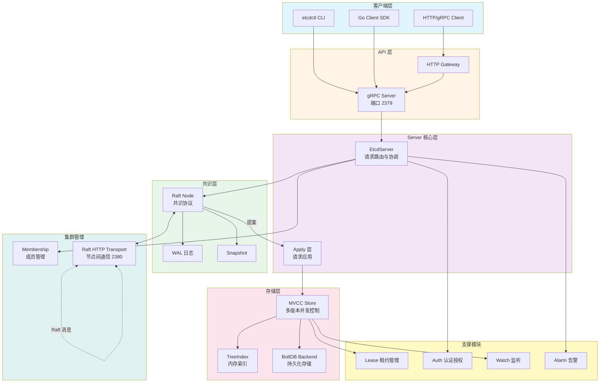
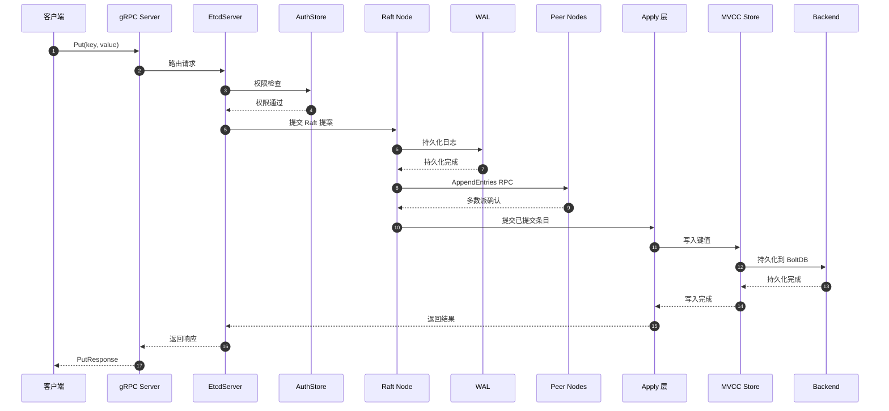
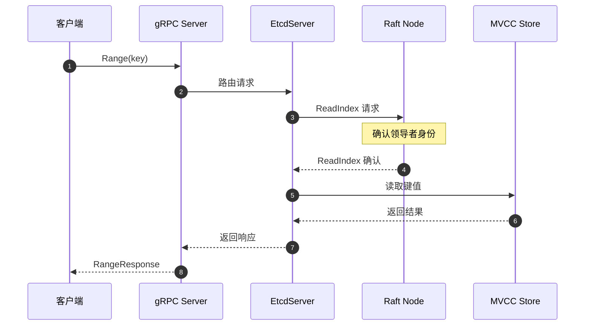
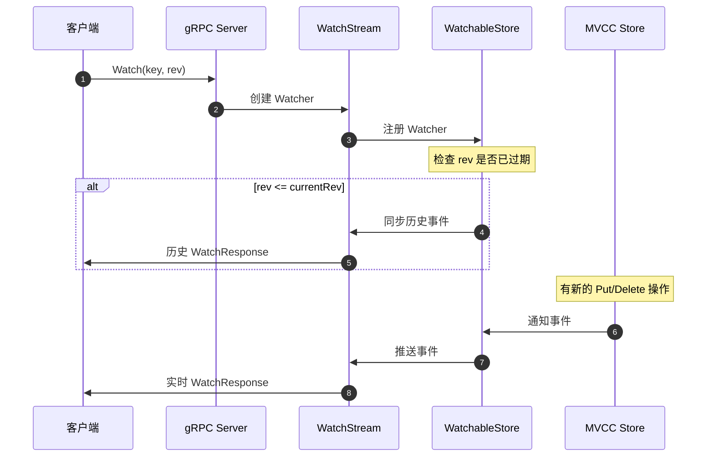
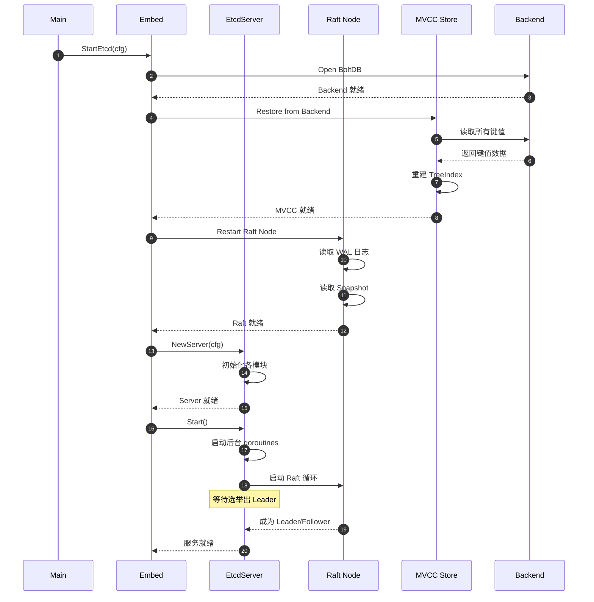
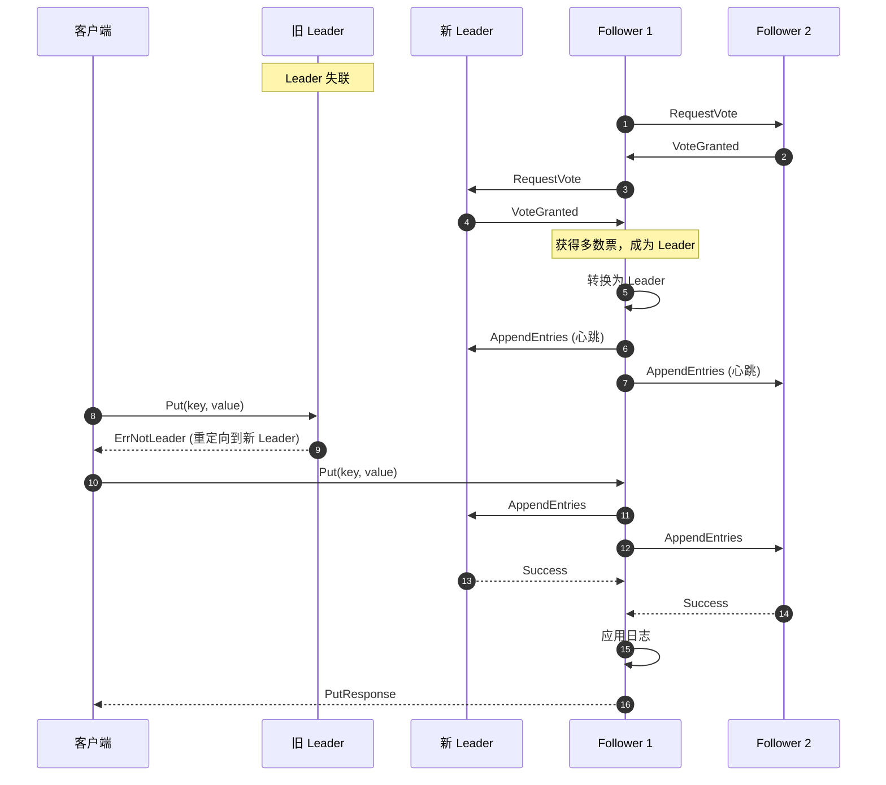
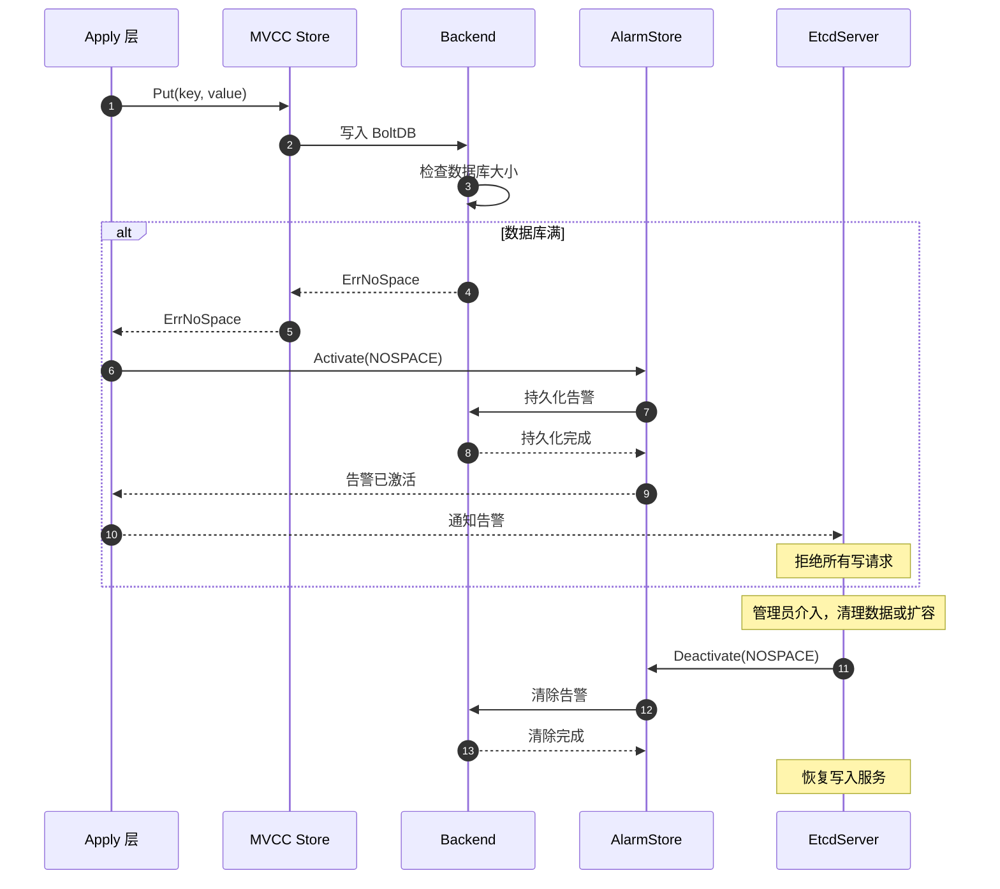

# etcd-00-总览

## 0. 摘要

### 项目目标与问题域

etcd 是一个分布式、可靠的键值存储系统，用于存储分布式系统中最关键的数据。其核心目标包括：

- **强一致性保证**：基于 Raft 共识协议实现分布式一致性
- **高可用性**：支持集群部署，自动故障转移
- **数据可靠性**：所有数据持久化存储，支持快照和增量备份
- **简单易用的 API**：提供 gRPC 和 HTTP/JSON API
- **Watch 机制**：支持实时监听键值变化

### 核心能力边界

**支持的功能**：
- 键值存储的 CRUD 操作
- 事务（Transaction）操作
- Watch 监听机制
- 租约（Lease）管理
- 用户认证与权限控制
- 集群成员管理
- 数据版本管理（MVCC）

**非目标**：
- 大规模数据存储（适合存储配置数据，不适合大数据场景）
- 高吞吐量写入（受限于 Raft 共识协议）
- 复杂查询（不支持 SQL 或复杂的查询语言）

### 运行环境与部署形态

- **语言**：Go 1.21+
- **依赖**：bbolt（持久化存储）、Raft 共识库
- **部署形态**：
  - **集群模式**：3/5/7 节点集群（推荐奇数节点）
  - **单节点模式**：开发测试环境
- **通信协议**：
  - 客户端通信：gRPC（默认端口 2379）
  - 节点间通信：HTTP（默认端口 2380）

---

## 1. 整体架构图



### 架构说明

#### 分层职责

1. **客户端层**
   - 提供多种客户端接入方式（CLI、SDK、HTTP）
   - 负责请求序列化和响应反序列化
   - 实现连接池、重试、负载均衡等客户端逻辑

2. **API 层**
   - gRPC Server 处理客户端请求，提供 6 大服务（KV、Watch、Lease、Cluster、Auth、Maintenance）
   - HTTP Gateway 提供 RESTful API（通过 grpc-gateway 自动生成）
   - 请求认证和权限校验

3. **Server 核心层**
   - EtcdServer 作为请求路由中心，协调各模块工作
   - 区分读请求（直接查询 MVCC）和写请求（通过 Raft 共识）
   - Apply 层负责将已提交的 Raft 日志应用到状态机

4. **共识层**
   - Raft Node 实现 Raft 共识算法，保证集群一致性
   - WAL（Write-Ahead Log）持久化 Raft 日志
   - Snapshot 用于日志压缩和快速恢复

5. **存储层**
   - MVCC Store 实现多版本并发控制
   - TreeIndex 维护键到版本的内存索引（B-Tree）
   - BoltDB Backend 提供持久化存储（B+树）

6. **支撑模块**
   - Lease 管理键的租约，支持自动过期
   - Auth 提供用户认证和 RBAC 权限控制
   - Watch 实现键值变化的实时监听
   - Alarm 监控集群健康状态（空间不足、数据损坏）

7. **集群管理**
   - Membership 管理集群成员信息
   - Raft HTTP Transport 处理节点间 Raft 消息传输

#### 数据流与控制流

**写请求流程**：
1. 客户端 → gRPC Server
2. gRPC Server → EtcdServer （认证、权限检查）
3. EtcdServer → Raft Node （提交提案）
4. Raft Node → WAL （持久化日志）
5. Raft Node → 其他节点（复制日志）
6. 领导者收到多数派确认 → Apply 层
7. Apply 层 → MVCC Store（应用到状态机）
8. MVCC Store → Backend（持久化）
9. 返回结果给客户端

**读请求流程**：
- **线性化读**（默认）：需要等待 Raft 确认当前节点仍是领导者
- **串行化读**：直接从本地 MVCC 读取（可能读到旧数据）

#### 跨进程/线程通信

- **gRPC 通信**：客户端与服务器之间
- **HTTP 通信**：节点间 Raft 消息传输
- **Channel 通信**：Go routine 之间传递消息（apply channel、watch channel）
- **共享内存**：TreeIndex、MVCC Store 在同一进程内共享

#### 高可用与扩展性

- **高可用**：通过 Raft 实现，容忍 (N-1)/2 个节点故障
- **状态管理**：每个节点维护完整状态副本
- **扩展性限制**：
  - 写入受限于 Raft 共识开销
  - 推荐集群规模 3-7 节点
  - 单个键值大小推荐 < 1.5MB

---

## 2. 全局时序图

### 2.1 写请求主流程



**关键点说明**：

1. **入口与认证**：客户端通过 gRPC 发起请求，经过 AuthStore 权限检查
2. **幂等性**：Raft 日志使用单调递增的 index，保证幂等性
3. **回退策略**：
   - Raft 提案失败：返回错误，客户端重试
   - WAL 写入失败：节点 panic，需要恢复
   - 多数派未确认：超时返回错误
4. **重试点**：客户端在收到错误后可重试，EtcdServer 会去重
5. **超时设置**：
   - 客户端超时：默认 5 秒
   - Raft 选举超时：1 秒
   - 心跳超时：100ms
6. **资源上界**：
   - 单次请求大小：1.5MB
   - 并发请求数：受限于 gRPC 连接数

### 2.2 读请求主流程（线性化读）



**说明**：
- 线性化读需要通过 ReadIndex 确认领导者身份
- 串行化读（Serializable=true）直接从本地读取，无需 ReadIndex

### 2.3 Watch 监听流程



---

## 3. 模块边界与交互图

### 3.1 模块清单

| 序号 | 模块名称 | 目录路径 | 主要职责 | 对外 API |
|------|---------|---------|---------|---------|
| 01 | API 层 | `api/etcdserverpb` | Protocol Buffers 定义 | gRPC 服务定义 |
| 02 | EtcdServer | `server/etcdserver` | 核心协调逻辑 | Server 接口 |
| 03 | MVCC 存储 | `server/storage/mvcc` | 多版本存储引擎 | KV、TxnRead、TxnWrite |
| 04 | Lease 租约 | `server/lease` | 租约管理 | Lessor 接口 |
| 05 | Auth 认证 | `server/auth` | 用户认证授权 | AuthStore 接口 |
| 06 | Raft 共识 | 外部依赖 `go.etcd.io/raft` | Raft 协议实现 | Node 接口 |
| 07 | Backend 存储 | `server/storage/backend` | BoltDB 封装 | Backend 接口 |
| 08 | Watch 监听 | `server/storage/mvcc` | 键值变化监听 | WatchableKV 接口 |
| 09 | Membership | `server/etcdserver/api/membership` | 集群成员管理 | RaftCluster 接口 |
| 10 | Client SDK | `client/v3` | Go 客户端库 | Client API |

### 3.2 模块交互矩阵

| 调用方 ↓ \ 被调方 → | EtcdServer | MVCC | Lease | Auth | Raft | Backend | Watch |
|-------------------|-----------|------|-------|------|------|---------|-------|
| **gRPC Server** | 同步调用 | - | - | - | - | - | - |
| **EtcdServer** | - | 同步调用 | 同步调用 | 同步调用 | 同步调用 | - | - |
| **Apply 层** | - | 同步调用 | 同步调用 | 同步调用 | - | - | - |
| **MVCC** | - | - | 同步调用 | - | - | 同步调用 | 异步通知 |
| **Lease** | - | 同步调用 | - | - | - | 同步调用 | - |
| **Auth** | - | - | - | - | - | 同步调用 | - |
| **Watch** | - | 同步调用 | - | - | - | - | - |

**交互说明**：
- **同步调用**：直接函数调用，阻塞等待返回
- **异步通知**：通过 Channel 或回调机制
- **错误语义**：统一使用 error 返回，错误码在 gRPC 层映射为标准错误
- **一致性要求**：所有写操作通过 Raft 保证强一致性

---

## 4. 关键设计与权衡

### 4.1 一致性模型

**强一致性（Linearizability）**：
- **实现方式**：基于 Raft 共识协议
- **保证**：所有读写操作看起来像是原子地、按某个顺序发生
- **代价**：写入延迟高（需要多数派确认），读取需要 ReadIndex 确认

**最终一致性（Serializable）**：
- **实现方式**：直接从本地 MVCC 读取
- **保证**：可能读到旧数据，但保证单调性（不会回退）
- **优势**：读取延迟低，吞吐量高

### 4.2 事务与并发控制

**MVCC（Multi-Version Concurrency Control）**：
- 每次修改产生新版本（Revision）
- 使用 `{Main, Sub}` 表示版本：
  - `Main`：全局单调递增的事务 ID
  - `Sub`：同一事务内的子版本
- 支持快照隔离（Snapshot Isolation）

**事务（Transaction）**：
- 基于 Compare-And-Set (CAS) 语义
- 支持条件判断（Compare）+ 成功/失败分支（Success/Failure）
- 事务内禁止多次修改同一个键

**锁与并发**：
- **写锁**：通过 Raft 序列化写操作，天然互斥
- **读写锁**：MVCC Store 使用 `sync.RWMutex`
- **无锁读**：串行化读无需加锁

### 4.3 性能关键路径

**写入路径（P99 延迟）**：
1. gRPC 处理：< 1ms
2. Raft 提案 + WAL 写入：10-50ms（取决于磁盘）
3. 多数派网络往返：5-20ms
4. Apply 应用：< 1ms
5. BoltDB 提交：5-10ms

**总延迟**：约 20-80ms

**读取路径（P99 延迟）**：
- 线性化读：10-30ms（需要 ReadIndex）
- 串行化读：< 1ms

**内存峰值**：
- TreeIndex：约占键数量 * 100 字节
- WatchableStore：每个 Watcher 约 1KB
- BoltDB mmap：取决于数据库大小

**I/O 热点**：
- WAL 顺序写（每次写请求）
- BoltDB B+树更新（批量提交）
- Snapshot 文件（定期）

### 4.4 可观测性

**关键指标**：
- `etcd_server_proposals_committed_total`：已提交提案数
- `etcd_server_proposals_failed_total`：失败提案数
- `etcd_disk_wal_fsync_duration_seconds`：WAL fsync 延迟
- `etcd_disk_backend_commit_duration_seconds`：Backend 提交延迟
- `etcd_mvcc_db_total_size_in_bytes`：数据库大小
- `etcd_network_peer_round_trip_time_seconds`：节点间 RTT

**分布式追踪**：
- 支持 OpenTelemetry
- 可追踪完整请求链路

### 4.5 配置项

**关键配置**：
- `--data-dir`：数据目录
- `--listen-client-urls`：客户端监听地址（默认 http://localhost:2379）
- `--listen-peer-urls`：节点间通信地址（默认 http://localhost:2380）
- `--initial-cluster`：初始集群配置
- `--initial-cluster-state`：集群状态（new/existing）
- `--snapshot-count`：快照触发阈值（默认 10000 条日志）
- `--quota-backend-bytes`：后端数据库配额（默认 2GB）
- `--max-request-bytes`：单次请求最大大小（默认 1.5MB）
- `--heartbeat-interval`：心跳间隔（默认 100ms）
- `--election-timeout`：选举超时（默认 1000ms）

---

## 5. 典型使用示例与最佳实践

### 5.1 示例 1：基本 Put/Get 操作

```go
package main

import (
    "context"
    "log"
    "time"
    
    clientv3 "go.etcd.io/etcd/client/v3"
)

func main() {
    cli, err := clientv3.New(clientv3.Config{
        Endpoints:   []string{"localhost:2379"},
        DialTimeout: 5 * time.Second,
    })
    if err != nil {
        log.Fatal(err)
    }
    defer cli.Close()

    ctx, cancel := context.WithTimeout(context.Background(), 5*time.Second)
    defer cancel()

    // Put 操作
    _, err = cli.Put(ctx, "/config/app/db_host", "192.168.1.100")
    if err != nil {
        log.Fatal(err)
    }

    // Get 操作
    resp, err := cli.Get(ctx, "/config/app/db_host")
    if err != nil {
        log.Fatal(err)
    }
    for _, ev := range resp.Kvs {
        log.Printf("Key: %s, Value: %s, Revision: %d", ev.Key, ev.Value, ev.ModRevision)
    }
}
```

**适用场景**：配置存储、服务发现

### 5.2 示例 2：分布式锁

```go
package main

import (
    "context"
    "log"
    "time"
    
    clientv3 "go.etcd.io/etcd/client/v3"
    "go.etcd.io/etcd/client/v3/concurrency"
)

func main() {
    cli, _ := clientv3.New(clientv3.Config{
        Endpoints:   []string{"localhost:2379"},
        DialTimeout: 5 * time.Second,
    })
    defer cli.Close()

    // 创建 Session（自动续租）
    session, _ := concurrency.NewSession(cli, concurrency.WithTTL(10))
    defer session.Close()

    // 创建互斥锁
    mutex := concurrency.NewMutex(session, "/my-lock/")

    // 加锁
    ctx, cancel := context.WithTimeout(context.Background(), 5*time.Second)
    defer cancel()

    if err := mutex.Lock(ctx); err != nil {
        log.Fatal(err)
    }
    log.Println("获取锁成功")

    // 执行业务逻辑
    time.Sleep(2 * time.Second)

    // 释放锁
    if err := mutex.Unlock(context.Background()); err != nil {
        log.Fatal(err)
    }
    log.Println("释放锁成功")
}
```

**适用场景**：分布式互斥、Leader 选举

### 5.3 示例 3：Watch 监听

```go
package main

import (
    "context"
    "log"
    
    clientv3 "go.etcd.io/etcd/client/v3"
)

func main() {
    cli, _ := clientv3.New(clientv3.Config{
        Endpoints: []string{"localhost:2379"},
    })
    defer cli.Close()

    // Watch 指定前缀
    watchChan := cli.Watch(context.Background(), "/config/app/", clientv3.WithPrefix())

    for watchResp := range watchChan {
        for _, event := range watchResp.Events {
            log.Printf("Event Type: %s, Key: %s, Value: %s, Revision: %d",
                event.Type, event.Kv.Key, event.Kv.Value, event.Kv.ModRevision)
        }
    }
}
```

**适用场景**：配置热更新、事件监听

### 5.4 最佳实践

**部署架构**：
- 生产环境使用 3 或 5 节点集群
- 跨机房部署需考虑网络延迟
- 使用 SSD 存储 WAL 和数据目录

**性能优化**：
- 批量操作使用 Txn
- 读多写少场景使用串行化读
- 控制单个键值大小 < 1MB
- 定期压缩历史版本（Compact）

**故障排查**：
- 检查磁盘 I/O 延迟（WAL fsync）
- 检查网络延迟（节点间 RTT）
- 监控数据库大小是否接近配额
- 查看 Raft 日志确认同步状态

**容量规划**：
- 每秒写入 < 10000 次
- 键值总数 < 100 万
- 数据库大小 < 8GB
- Watch 数量 < 10000

---

## 6. 系统级时序图

### 6.1 场景 1：冷启动



**说明**：
- 冷启动需要从 BoltDB 恢复完整状态
- Raft 从 WAL 和 Snapshot 恢复日志
- 启动后需要等待选举完成才能提供服务

### 6.2 场景 2：Leader 切换



**说明**：
- Leader 失联后，Follower 发起选举
- 新 Leader 选出后，旧请求会被拒绝
- 客户端需要重定向到新 Leader

### 6.3 场景 3：数据库满触发告警



**说明**：
- 数据库达到配额后触发 NOSPACE 告警
- 所有写请求被拒绝，保护集群稳定性
- 需要管理员清理数据或调整配额

---

## 7. 文档索引

### 模块详细文档

- [etcd-01-EtcdServer-概览.md](./etcd-01-EtcdServer-概览.md)
- [etcd-01-EtcdServer-API.md](./etcd-01-EtcdServer-API.md)
- [etcd-01-EtcdServer-数据结构.md](./etcd-01-EtcdServer-数据结构.md)
- [etcd-01-EtcdServer-时序图.md](./etcd-01-EtcdServer-时序图.md)

- [etcd-02-MVCC-概览.md](./etcd-02-MVCC-概览.md)
- [etcd-02-MVCC-API.md](./etcd-02-MVCC-API.md)
- [etcd-02-MVCC-数据结构.md](./etcd-02-MVCC-数据结构.md)
- [etcd-02-MVCC-时序图.md](./etcd-02-MVCC-时序图.md)

- [etcd-03-Lease-概览.md](./etcd-03-Lease-概览.md)
- [etcd-03-Lease-API.md](./etcd-03-Lease-API.md)
- [etcd-03-Lease-数据结构.md](./etcd-03-Lease-数据结构.md)
- [etcd-03-Lease-时序图.md](./etcd-03-Lease-时序图.md)

- [etcd-04-Auth-概览.md](./etcd-04-Auth-概览.md)
- [etcd-04-Auth-API.md](./etcd-04-Auth-API.md)
- [etcd-04-Auth-数据结构.md](./etcd-04-Auth-数据结构.md)
- [etcd-04-Auth-时序图.md](./etcd-04-Auth-时序图.md)

- [etcd-05-Watch-概览.md](./etcd-05-Watch-概览.md)
- [etcd-05-Watch-API.md](./etcd-05-Watch-API.md)
- [etcd-05-Watch-数据结构.md](./etcd-05-Watch-数据结构.md)
- [etcd-05-Watch-时序图.md](./etcd-05-Watch-时序图.md)

- [etcd-06-Raft-概览.md](./etcd-06-Raft-概览.md)
- [etcd-07-Client-概览.md](./etcd-07-Client-概览.md)

### 参考文档

- [etcd-参考-源码剖析要点补充.md](./etcd-参考-源码剖析要点补充.md)
- [README.md](./README.md)


---

## etcd 核心链路与生产实践

### 线性一致读链路（Range/ReadIndex）

- **一致性策略**：
  - `linearizable`（默认）：发起 ReadIndex 心跳仲裁，确保本地读取不落后于集群多数派提交点，牺牲少量延迟换取线性一致性。
  - `serializable`：本地读，无需跨节点心跳，延迟低但可能读到旧值（主从切换场景）。

- **聚合优化**：`linearizableReadLoop` 协程聚合多个线性读请求，批量触发一次 ReadIndex，减少心跳风暴。

- **ReadIndex 机制**：
  - Leader 检查 `raft.committed > raft.applied`，等待 apply 追平后返回 `readIndex`。
  - Follower 向 Leader 发送 `MsgReadIndex`，Leader 确认自身为 Leader 后返回。
  - 心跳确认：Leader 发送心跳广播，收到多数派响应后确认读索引有效。

- **MVCC 读取**：根据 `readIndex` 确定读取视图版本，从 `treeIndex` 查找键的版本历史，再从 BoltDB 读取实际数据。

### 写入全链路（Put）

- **入队前置检查**：
  - **背压保护**：`commitIndex - appliedIndex` 超限即拒绝，避免磁盘慢导致内存被未应用的 Entry 撑爆。
  - **大小限制**：超过 `MaxRequestBytes` 直接拒绝，防止大 value 拖垮复制、WAL、快照。

- **Raft 提案与追加**：
  - Leader 收到 `MsgProp` 后追加到本地 Raft Log，发送 `MsgApp` 到 Follower。
  - Follower 追加日志后返回 `MsgAppResp`，Leader 收到多数派响应后推进 `committedIndex`。

- **WAL 持久化**：日志先写入 WAL 再追加到内存 Raft Log，通过 `fdatasync` 确保持久化。

- **Apply 应用**：
  - 定期检查 `committedIndex > appliedIndex`，批量应用已提交的 Entry。
  - 调用 `MVCC.Put` 写入数据，生成新版本号，更新 `treeIndex` 索引。
  - 触发 Watch 事件派发，通知相关 Watcher。

- **Backend 提交**：MVCC 操作在 BoltDB 事务中执行，定期批量提交减少 fsync 开销。

### Watch 机制

- **双循环模型**：
  - `recvLoop`：处理客户端上行请求（创建/取消/进度请求）。
  - `sendLoop`：下发变更事件和控制回应，控制面（`ctrlStream`）与数据面（`watchStream.Chan`）分离。

- **创建与取消**：
  - 创建时指定 `StartRevision`（默认为当前 `wsrev + 1`），若低于压缩点返回 `ErrCompacted`。
  - 取消时清理 watcher 的进度、碎片、prevKV 跟踪。

- **事件派发**：
  - MVCC Apply 后将事件写入 `watchableStore` 的通知通道。
  - `syncWatchersLoop` 定期将事件批量推送到匹配的 Watcher。
  - 历史事件补偿：对 `StartRevision` 低于当前版本的 Watcher，从 BoltDB 扫描历史版本补发。

- **进度通知**：定期发送 `ProgressNotify` 防止客户端超时，携带当前集群 revision。

- **碎片控制**：单个 Watcher 积压事件过多时拆分成多个 `WatchResponse`，设置 `Fragment: true`。

### gRPC API 调用链路

- **KV 服务**：
  - `Range`：经过 Auth 校验、配额检查、读写控制、MVCC 读取、结果限制。
  - `Put`：经过 Auth 校验、Raft 提案、WAL 持久化、MVCC 写入、Watch 触发、Backend 提交。
  - `Txn`：支持多个操作的原子执行，If-Then-Else 语义，所有操作在同一 MVCC 事务中。

- **Lease 服务**：
  - `LeaseGrant`：创建租约并设置 TTL，返回租约 ID。
  - `LeaseKeepAlive`：客户端发送心跳续约，服务端返回剩余 TTL。
  - `LeaseRevoke`：删除租约及其关联的所有键。

- **Watch 服务**：双向流式 RPC，一个连接可承载多个 Watch，支持历史事件补偿和进度通知。

- **Cluster 服务**：成员管理（添加/删除/更新/列出/提升），通过 Raft 配置变更实现。

- **Auth 服务**：用户/角色管理、权限授予/撤销、JWT Token 认证。

- **Maintenance 服务**：告警管理、状态查询、碎片整理、快照、Leader 迁移。

### 生产部署最佳实践

- **集群规模**：推荐奇数节点（3/5/7），Raft 需要多数派确认，偶数节点无法提供更好的容错性。

- **硬件配置**：
  - 小型集群（< 1000 客户端）：2-4 核 CPU，8GB 内存，SSD 50GB+。
  - 中型集群（1000-5000 客户端）：4-8 核 CPU，16GB 内存，SSD 100GB+。
  - **磁盘要求**：SSD 必备，WAL 和数据目录分离，磁盘 IOPS 直接影响写入延迟。

- **配额与限流**：
  - 设置合理的 `quota-backend-bytes`（默认 2GB），达到配额后触发 NOSPACE 告警拒绝写入。
  - 客户端请求大小限制 `max-request-bytes`（默认 1.5MB）。
  - 单个事务操作数限制 `max-txn-ops`（默认 128）。

- **快照与压缩**：
  - 定期自动快照（`snapshot-count: 10000`），减少 WAL 恢复时间。
  - 定期自动压缩（`auto-compaction-retention`），清理历史版本，防止数据库无限膨胀。
  - 压缩后触发碎片整理（`Defragment`），回收物理空间。

- **网络调优**：
  - 节点间 RTT < 10ms 为宜，跨区域部署需评估网络延迟对写入的影响。
  - 心跳间隔（`heartbeat-interval: 100ms`）和选举超时（`election-timeout: 1000ms`）根据网络条件调整。
  - 启用 gRPC 连接复用和 HTTP/2 流控。

- **监控告警**：
  - **关键指标**：Leader 变更频率、Raft Proposal 失败率、Apply 延迟、磁盘 fsync 延迟、Backend 提交延迟、Watch 事件积压。
  - **告警阈值**：磁盘 fsync > 25ms、Backend 提交 > 100ms、Apply 滞后 > 1000、NOSPACE 告警。
  - **Metrics 端点**：`/metrics` 导出 Prometheus 格式指标。

### 性能优化要点

- **读优化**：
  - 非强一致场景使用 `serializable` 读，避免 ReadIndex 开销。
  - 客户端缓存热点数据，减少请求频率。
  - 使用 Range 的 `limit` 和 `keys_only` 减少数据传输。

- **写优化**：
  - 批量写入：使用 Txn 合并多个 Put 操作。
  - 调整 Backend 批量间隔（`backend-batch-interval`）和批量限制（`backend-batch-limit`），平衡延迟和吞吐。
  - 避免大 value 写入，单个键值建议 < 1MB。

- **Watch 优化**：
  - 精准过滤：使用前缀匹配减少不必要的事件推送。
  - 避免 Watch 大量键或频繁创建/取消 Watch。
  - 客户端及时消费事件，避免服务端积压触发碎片分片。

- **存储优化**：
  - 定期压缩历史版本（保留策略：时间窗口或版本数）。
  - 定期碎片整理回收空间（需要在业务低峰期执行）。
  - 独立 WAL 目录到高性能磁盘。

### 故障排查关键点

- **脑裂检测**：检查 Leader 选举日志，确认网络分区恢复后旧 Leader 自动降级。

- **慢查询定位**：通过 Metrics 分析 MVCC Range 延迟、BoltDB Tx 延迟、Raft Apply 延迟，定位瓶颈层。

- **数据不一致**：使用 `HashKV` 比对各节点数据哈希，`Snapshot` + 恢复修复不一致节点。

- **NOSPACE 恢复**：清理历史数据（Compact + Defragment）或扩容配额（调整 `quota-backend-bytes` 需重启）。

- **Leader 频繁切换**：检查网络延迟、磁盘 IO 延迟、节点负载，调整心跳和选举超时参数。

