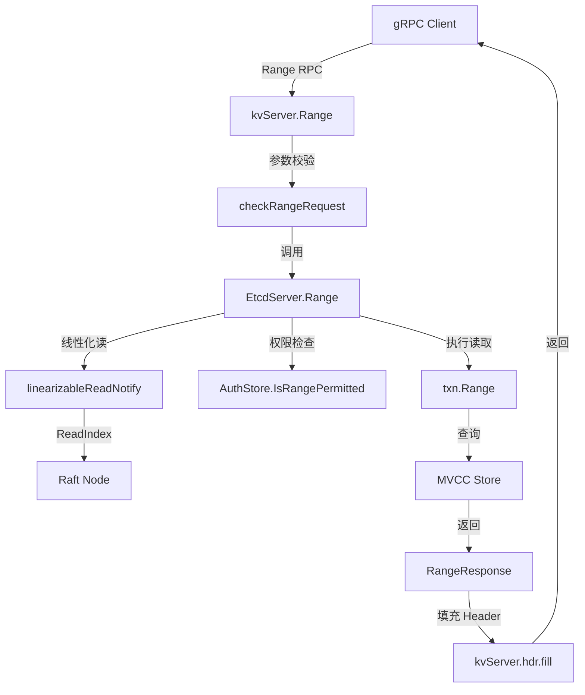

# etcd-01-EtcdServer

## 模块概览

## 模块定位

EtcdServer 是 etcd 的核心协调层，负责：

- 接收并路由客户端请求
- 协调 Raft 共识、存储、认证等各模块
- 管理集群成员与配置
- 提供线性化读写保证
- 处理 Raft 消息与日志应用

**源码路径**：`server/etcdserver/`

---

## 职责边界

### 输入
- **客户端请求**：通过 gRPC 发起的 KV、Watch、Lease、Auth、Cluster、Maintenance 操作
- **Raft 消息**：其他节点发送的 Raft 协议消息（AppendEntries、RequestVote 等）
- **内部事件**：Lease 过期、Compaction 触发、成员变更等

### 输出
- **客户端响应**：操作结果（成功/失败）及返回数据
- **Raft 消息**：发送给其他节点的 Raft 消息
- **状态变更**：通过 Apply 层更新 MVCC、Lease、Auth 等模块状态

### 上下游依赖

**上游**（调用 EtcdServer）：

- gRPC Server（`api/v3rpc`）
- HTTP Gateway

**下游**（EtcdServer 调用）：

- Raft Node（共识层）
- MVCC Store（存储层）
- Lease Lessor（租约管理）
- Auth Store（认证授权）
- Membership RaftCluster（成员管理）

---

## 生命周期

### 初始化阶段（NewServer）

```go
func NewServer(cfg config.ServerConfig) (srv *EtcdServer, err error) {
    // 1. 引导启动（bootstrap）：加载或初始化集群配置
    b, err := bootstrap(cfg)
    
    // 2. 创建 EtcdServer 实例
    srv = &EtcdServer{
        Cfg:       cfg,
        lg:        cfg.Logger,
        memberID:  b.cluster.nodeID,
        cluster:   b.cluster.cl,
        // ... 初始化字段
    }
    
    // 3. 初始化 Backend（BoltDB）
    srv.be = b.storage.backend.be
    
    // 4. 初始化 Lessor（租约管理）
    srv.lessor = lease.NewLessor(srv.Logger(), srv.be, srv.cluster, ...)
    
    // 5. 初始化 MVCC Store
    srv.kv = mvcc.New(srv.Logger(), srv.be, srv.lessor, mvccStoreConfig)
    
    // 6. 初始化 AuthStore（认证授权）
    srv.authStore = auth.NewAuthStore(srv.Logger(), ...)
    
    // 7. 初始化 Compactor（自动压缩）
    srv.compactor, _ = v3compactor.New(cfg.Logger(), ...)
    
    // 8. 初始化 Raft Transport（节点间通信）
    tr := &rafthttp.Transport{...}
    tr.Start()
    srv.r.transport = tr
    
    return srv, nil
}
```

**关键步骤**：

1. **Bootstrap**：首次启动时初始化集群配置，重启时从磁盘恢复
2. **Backend 恢复**：从 BoltDB 恢复持久化数据
3. **Lessor 恢复**：恢复所有租约信息
4. **MVCC 恢复**：从 Backend 重建 TreeIndex 内存索引
5. **Raft 初始化**：加载 WAL 和 Snapshot，恢复 Raft 状态

### 启动阶段（Start）

```go
func (s *EtcdServer) Start() {
    s.start()  // 启动核心 run 循环
    
    // 启动后台 goroutines
    s.GoAttach(func() { s.adjustTicks() })                // 调整选举 tick
    s.GoAttach(func() { s.publishV3(s.Cfg.ReqTimeout()) }) // 发布成员信息
    s.GoAttach(s.purgeFile)                               // 清理过期文件
    s.GoAttach(func() { monitorFileDescriptor(...) })     // 监控文件描述符
    s.GoAttach(s.monitorClusterVersions)                  // 监控集群版本
    s.GoAttach(s.monitorStorageVersion)                   // 监控存储版本
    s.GoAttach(s.linearizableReadLoop)                    // 线性化读循环
    s.GoAttach(s.monitorKVHash)                           // 监控数据一致性
    s.GoAttach(s.monitorCompactHash)                      // 监控压缩 hash
    s.GoAttach(s.monitorDowngrade)                        // 监控降级状态
}
```

**核心 goroutines**：

- **run**：主循环，接收 Raft Ready 并应用日志
- **linearizableReadLoop**：处理线性化读请求
- **monitorKVHash**：定期检查数据一致性
- **purgeFile**：定期清理过期的 WAL 和 Snapshot 文件

### 运行阶段（run）

```go
func (s *EtcdServer) run() {
    // 初始化调度器
    sched := schedule.NewFIFOScheduler(lg)
    
    // 启动 Raft Node
    s.r.start(rh)
    
    // 主循环
    for {
        select {
        case ap := <-s.r.apply():
            // 应用已提交的 Raft 日志
            f := schedule.NewJob("server_applyAll",
                func(ctx) { s.applyAll(&ep, &ap) })
            sched.Schedule(f)
            
        case leases := <-expiredLeaseC:
            // 吊销过期的租约
            s.revokeExpiredLeases(leases)
            
        case err := <-s.errorc:
            // 致命错误，停止服务
            return
            
        case <-s.stop:
            // 正常停止
            return
        }
    }
}
```

**主循环职责**：

1. **应用 Raft 日志**：从 `s.r.apply()` 接收已提交的日志条目
2. **吊销过期租约**：接收 Lessor 发送的过期租约列表
3. **错误处理**：接收致命错误并终止服务
4. **优雅停止**：接收停止信号并清理资源

### 停止阶段（Stop）

```go
func (s *EtcdServer) Stop() {
    // 1. 尝试转移 Leader（如果是 Leader）
    s.TryTransferLeadershipOnShutdown()
    
    // 2. 硬停止
    s.HardStop()
}

func (s *EtcdServer) HardStop() {
    // 1. 发送停止信号
    s.stop <- struct{}{}
    
    // 2. 等待所有 goroutines 退出
    <-s.done
}
```

**停止流程**：

1. **Leader 转移**：如果当前节点是 Leader，尝试将领导权转移给其他节点
2. **停止主循环**：关闭 `s.stop` channel
3. **等待 goroutines**：等待所有后台任务完成
4. **清理资源**：关闭 Raft、MVCC、Lessor 等模块

---

## 模块级架构图


### 架构说明

**1. 外部接口层**

- **gRPC Server**：处理客户端 gRPC 请求
- **HTTP Handler**：处理 HTTP/REST 请求
- **Peer Raft Messages**：接收其他节点的 Raft 消息

**2. EtcdServer 核心层**

- **请求路由**：区分读/写请求，进行认证与权限检查
- **Raft 提案**：将写请求封装为 Raft 提案
- **Apply 循环**：从 Raft 接收已提交日志并应用
- **线性化读循环**：处理需要强一致性保证的读请求

**3. Raft 层**

- **Raft Node**：实现 Raft 共识协议
- **WAL**：持久化 Raft 日志
- **Transport**：节点间通信

**4. Apply 层**

- **UberApplier**：统一的日志应用器
- **Apply KV/Lease/Auth**：分别应用不同类型的操作

**5. 存储与支撑层**

- **MVCC Store**：多版本存储引擎
- **Lessor**：租约管理器
- **AuthStore**：认证授权存储
- **Membership**：集群成员管理

---

## 边界条件与约束

### 扩展点
- **自定义认证**：通过 TokenProvider 支持不同认证方式（JWT、Simple）
- **Hooks**：Backend 提供 TxPostLockHook，可在事务提交后执行回调
- **Compaction 策略**：支持周期性（periodic）和修订版本（revision）两种压缩策略

### 状态持有位置
- **EtcdServer**：
  - `appliedIndex`：已应用的 Raft 日志索引（内存，原子变量）
  - `committedIndex`：已提交的 Raft 日志索引（内存，原子变量）
  - `lead`：当前 Leader ID（内存，原子变量）
  - `cluster`：集群成员信息（内存 + BoltDB）
- **Raft Node**：
  - Raft 状态（Term、VoteFor、日志等）存储在 WAL
- **MVCC Store**：
  - 键值数据存储在 BoltDB
  - TreeIndex 内存索引

### 资源占用要点
- **内存**：
  - TreeIndex：约 100 字节/键
  - Raft 日志缓存：受 `SnapshotCount` 限制（默认 10000 条）
  - Apply 等待队列：未应用的 Raft 日志
- **磁盘**：
  - WAL：顺序写，约 100-200 MB（取决于 `SnapshotCount`）
  - BoltDB：随机写，大小取决于数据量
- **网络**：
  - Raft 消息：心跳（100ms 间隔）+ 日志复制
  - 客户端响应

---

## 核心算法与流程

### 1. 写请求处理流程

**目的**：保证所有写操作通过 Raft 共识，确保强一致性

**输入**：客户端请求（PutRequest、DeleteRangeRequest、TxnRequest 等）

**输出**：操作结果（成功/失败）

**复杂度**：

- 时间复杂度：O(1) 本地处理 + O(N) 网络往返（N 为节点数）
- 空间复杂度：O(M)，M 为请求大小

**核心代码**：

```go
// processInternalRaftRequestOnce 处理单次写请求
func (s *EtcdServer) processInternalRaftRequestOnce(
    ctx context.Context,
    r pb.InternalRaftRequest,
) (*apply.Result, error) {
    // 1. 检查 appliedIndex 和 committedIndex 差距
    //    防止 Apply 慢导致内存堆积
    ai := s.getAppliedIndex()
    ci := s.getCommittedIndex()
    if ci > ai+maxGapBetweenApplyAndCommitIndex {
        return nil, errors.ErrTooManyRequests
    }

    // 2. 分配唯一请求 ID
    r.Header = &pb.RequestHeader{
        ID: s.reqIDGen.Next(),
    }

    // 3. 添加认证信息
    authInfo, err := s.AuthInfoFromCtx(ctx)
    if authInfo != nil {
        r.Header.Username = authInfo.Username
        r.Header.AuthRevision = authInfo.Revision
    }

    // 4. 序列化请求
    data, err := r.Marshal()
    if len(data) > int(s.Cfg.MaxRequestBytes) {
        return nil, errors.ErrRequestTooLarge
    }

    // 5. 注册等待通道（用于接收 Apply 结果）
    id := r.Header.ID
    ch := s.w.Register(id)

    // 6. 提交 Raft 提案
    cctx, cancel := context.WithTimeout(ctx, s.Cfg.ReqTimeout())
    defer cancel()
    
    err = s.r.Propose(cctx, data)
    if err != nil {
        s.w.Trigger(id, nil)  // 清理等待通道
        return nil, err
    }

    // 7. 等待 Apply 结果
    select {
    case x := <-ch:
        return x.(*apply.Result), nil
    case <-cctx.Done():
        return nil, s.parseProposeCtxErr(cctx.Err(), start)
    case <-s.stopping:
        return nil, errors.ErrStopped
    }
}
```

**关键设计**：

1. **流控机制**：通过检查 `appliedIndex` 和 `committedIndex` 差距防止内存爆炸
2. **请求 ID**：每个请求分配唯一 ID，用于匹配 Apply 结果
3. **等待机制**：使用 `wait.Wait` 实现请求-响应匹配
4. **超时处理**：设置提案超时（默认 5 秒）

### 2. 线性化读流程

**目的**：保证读取到最新已提交的数据

**输入**：RangeRequest（Serializable=false）

**输出**：最新的键值数据

**核心代码**：

```go
// linearizableReadNotify 确保线性化读
func (s *EtcdServer) linearizableReadNotify(ctx context.Context) error {
    // 1. 检查当前节点是否是 Leader
    s.readMu.RLock()
    nc := s.readNotifier
    s.readMu.RUnlock()

    // 2. 发起 ReadIndex 请求
    //    Raft 会确认当前节点仍是 Leader，并返回当前已提交的 index
    s.readwaitc <- struct{}{}
    select {
    case <-nc.c:
        // ReadIndex 确认完成
        return nc.err
    case <-ctx.Done():
        return ctx.Err()
    case <-s.stopping:
        return errors.ErrStopped
    }
}

// linearizableReadLoop 后台循环处理 ReadIndex
func (s *EtcdServer) linearizableReadLoop() {
    for {
        // 1. 等待读请求
        select {
        case <-s.readwaitc:
        case <-s.stopping:
            return
        }

        // 2. 批量收集读请求（100ms 窗口）
        nextnr := newNotifier()
        s.readMu.Lock()
        nr := s.readNotifier
        s.readNotifier = nextnr
        s.readMu.Unlock()

        // 3. 发起 ReadIndex
        cctx, cancel := context.WithTimeout(context.Background(),
            s.Cfg.ReqTimeout())
        
        // 等待 appliedIndex >= ReadIndex
        if ai := s.getAppliedIndex(); ai < s.r.Index() {
            select {
            case <-s.applyWait.Wait(s.r.Index()):
            case <-cctx.Done():
                cancel()
                nr.notify(cctx.Err())
                continue
            }
        }
        
        cancel()
        nr.notify(nil)  // 通知所有等待的读请求
    }
}
```

**关键设计**：

1. **批量优化**：将 100ms 内的读请求合并为一次 ReadIndex
2. **Wait 机制**：等待 `appliedIndex` 追上 `ReadIndex`
3. **Leader 确认**：通过 Raft 的 ReadIndex 确认 Leader 身份

### 3. Apply 日志流程

**目的**：将已提交的 Raft 日志应用到状态机

**输入**：Raft Ready（包含已提交的日志条目）

**输出**：更新 MVCC、Lessor、AuthStore 等模块状态

**核心代码**：

```go
// applyAll 应用所有已提交的日志
func (s *EtcdServer) applyAll(ep *etcdProgress, apply *toApply) {
    // 1. 应用 Snapshot（如果有）
    s.applySnapshot(ep, apply)
    
    // 2. 应用日志条目
    s.applyEntries(ep, apply)
    
    // 3. 验证 Backend 一致性
    backend.VerifyBackendConsistency(s.Backend(), s.Logger(), true, ...)
    
    // 4. 更新 Prometheus 指标
    proposalsApplied.Set(float64(ep.appliedi))
    
    // 5. 触发等待的请求
    s.applyWait.Trigger(ep.appliedi)
    
    // 6. 等待 Raft 完成磁盘写入
    <-apply.notifyc
    
    // 7. 触发 Snapshot（如果需要）
    s.snapshotIfNeededAndCompactRaftLog(ep)
}

// applyEntries 应用日志条目
func (s *EtcdServer) applyEntries(ep *etcdProgress, apply *toApply) {
    for i := range apply.entries {
        e := apply.entries[i]
        
        shouldApplyV3 := membership.ApplyBoth
        if e.Index <= s.consistIndex.ConsistentIndex() {
            shouldApplyV3 = membership.ApplyV2storeOnly
        }
        
        switch e.Type {
        case raftpb.EntryNormal:
            // 应用普通日志
            s.applyEntryNormal(&e, shouldApplyV3)
            s.setAppliedIndex(e.Index)
            
        case raftpb.EntryConfChange:
            // 应用配置变更
            var cc raftpb.ConfChange
            pbutil.MustUnmarshal(&cc, e.Data)
            removedSelf, err := s.applyConfChange(cc, confState, shouldApplyV3)
            s.setAppliedIndex(e.Index)
            s.w.Trigger(cc.ID, &confChangeResponse{...})
        }
    }
}

// applyEntryNormal 应用普通日志
func (s *EtcdServer) applyEntryNormal(e *raftpb.Entry, shouldApplyV3 bool) {
    // 1. 空日志（no-op）：Leader 确认
    if len(e.Data) == 0 {
        s.firstCommitInTerm.Notify()
        if s.isLeader() {
            s.lessor.Promote(s.Cfg.ElectionTimeout())
        }
        return
    }
    
    // 2. 应用请求
    ar, id := apply.Apply(s.lg, e, s.uberApply, s.w, shouldApplyV3)
    
    // 3. 检查空间配额
    if errors.Is(ar.Err, errors.ErrNoSpace) {
        // 触发 NOSPACE 告警
        s.GoAttach(func() {
            a := &pb.AlarmRequest{
                MemberID: uint64(s.MemberID()),
                Action:   pb.AlarmRequest_ACTIVATE,
                Alarm:    pb.AlarmType_NOSPACE,
            }
            s.raftRequest(s.ctx, pb.InternalRaftRequest{Alarm: a})
            s.w.Trigger(id, ar)
        })
        return
    }
    
    // 4. 触发等待的请求
    s.w.Trigger(id, ar)
}
```

**关键设计**：

1. **Snapshot 优先**：先应用 Snapshot，再应用增量日志
2. **一致性验证**：每次 Apply 后验证 Backend 数据一致性
3. **等待唤醒**：通过 `wait.Wait` 唤醒等待的客户端请求
4. **空间保护**：检测到空间不足时触发告警，拒绝写入

---

## 配置与可观测

### 关键配置项

| 配置项 | 默认值 | 说明 | 影响 |
|--------|--------|------|------|
| `--snapshot-count` | 10000 | 触发 Snapshot 的日志条数 | 过小：频繁 Snapshot，性能下降<br>过大：内存占用高，恢复慢 |
| `--quota-backend-bytes` | 2GB | Backend 数据库配额 | 达到配额触发 NOSPACE 告警 |
| `--max-request-bytes` | 1.5MB | 单次请求最大大小 | 限制客户端请求体大小 |
| `--heartbeat-interval` | 100ms | Raft 心跳间隔 | 影响 Leader 检测速度 |
| `--election-timeout` | 1000ms | Raft 选举超时 | 影响 Leader 切换速度 |
| `--max-txn-ops` | 128 | 事务最大操作数 | 限制单个事务复杂度 |
| `--max-concurrent-streams` | math.MaxUint32 | gRPC 最大并发流数 | 限制并发连接数 |

### 关键监控指标

**Raft 相关**：

- `etcd_server_proposals_committed_total`：已提交提案总数（计数器）
- `etcd_server_proposals_failed_total`：失败提案总数（计数器）
- `etcd_server_proposals_pending`：待处理提案数（仪表盘）
- `etcd_server_leader_changes_seen_total`：Leader 切换次数（计数器）

**Apply 相关**：

- `etcd_server_proposals_applied_total`：已应用提案总数（计数器）
- `etcd_server_apply_duration_seconds`：Apply 延迟（直方图）

**磁盘相关**：

- `etcd_disk_wal_fsync_duration_seconds`：WAL fsync 延迟（直方图）
- `etcd_disk_backend_commit_duration_seconds`：Backend 提交延迟（直方图）

**数据库相关**：

- `etcd_mvcc_db_total_size_in_bytes`：数据库总大小（仪表盘）
- `etcd_mvcc_db_total_size_in_use_in_bytes`：使用中的大小（仪表盘）

**网络相关**：

- `etcd_network_peer_sent_bytes_total`：发送给 Peer 的字节数（计数器）
- `etcd_network_peer_received_bytes_total`：从 Peer 接收的字节数（计数器）
- `etcd_network_peer_round_trip_time_seconds`：Peer RTT（直方图）

### 观测指标含义与阈值建议

| 指标 | 正常范围 | 告警阈值 | 说明 |
|------|----------|----------|------|
| `proposals_pending` | < 10 | > 100 | 待处理提案堆积，可能是 Apply 慢 |
| `wal_fsync_duration` | < 10ms | > 50ms | WAL 写入慢，检查磁盘性能 |
| `backend_commit_duration` | < 100ms | > 500ms | BoltDB 提交慢，检查磁盘 |
| `db_total_size` | < 80% 配额 | > 95% 配额 | 接近配额，需要压缩或扩容 |
| `leader_changes` | < 1/小时 | > 3/小时 | Leader 频繁切换，检查网络 |

---

## 最佳实践

### 1. 部署建议
- **节点数量**：生产环境推荐 3 或 5 节点（容忍 1 或 2 个节点故障）
- **硬件要求**：
  - CPU：4 核以上
  - 内存：8GB 以上
  - 磁盘：SSD（WAL 和数据目录）
  - 网络：低延迟（< 10ms RTT）

### 2. 性能调优
- **批量写入**：使用 Txn 批量操作，减少 Raft 提案次数
- **串行化读**：读多写少场景使用 `Serializable=true`
- **调整 Snapshot 触发点**：根据内存和恢复时间权衡 `--snapshot-count`
- **定期压缩**：配置自动压缩（`--auto-compaction-mode=periodic`）

### 3. 故障排查
- **慢请求**：检查 `apply_duration` 和 `wal_fsync_duration`
- **Leader 切换**：检查网络延迟和节点健康状态
- **数据库满**：检查 `db_total_size`，执行 Compaction 或 Defragment
- **Apply 慢**：检查 `proposals_pending`，可能是大事务或慢查询

### 4. 容量规划
- **写入速率**：< 10000 次/秒（受限于 Raft 共识开销）
- **键数量**：< 100 万（TreeIndex 内存占用）
- **数据库大小**：< 8GB（BoltDB 性能限制）
- **Watch 数量**：< 10000（内存占用）

---

**文档版本**：v1.0  
**适用 etcd 版本**：v3.5+  
**生成时间**：2025-01-04

---

## API接口

本文档详细描述 EtcdServer 模块对外提供的所有 API，包括请求/响应结构体、入口函数、调用链、时序图和异常处理。

---

## API 概览

EtcdServer 通过 RaftKV、Lessor、Authable、Cluster 等接口对外提供服务，主要包括：

| API 类别 | 接口名称 | 说明 |
|---------|---------|------|
| **KV 操作** | Range, Put, DeleteRange, Txn, Compact | 键值存储的 CRUD 和事务操作 |
| **Lease 操作** | LeaseGrant, LeaseRevoke, LeaseRenew, LeaseTimeToLive, LeaseLeases | 租约管理 |
| **Auth 操作** | AuthEnable, AuthDisable, Authenticate, UserAdd, RoleAdd, ... | 认证授权管理 |
| **Cluster 操作** | MemberAdd, MemberRemove, MemberUpdate, MemberList, MemberPromote | 集群成员管理 |
| **Maintenance 操作** | Alarm, Status, Defragment, Hash, HashKV, Snapshot, MoveLeader | 集群维护 |

---

## 一、KV 操作 API

### 1.1 Range - 读取键值

#### 基本信息
- **名称**：`Range`
- **协议/方法**：gRPC `etcdserverpb.KV/Range` 或 HTTP POST `/v3/kv/range`
- **幂等性**：是（只读操作）

#### 请求结构体

```go
// RangeRequest 读取请求
type RangeRequest struct {
    // key 是范围的起始键
    Key []byte
    
    // range_end 是范围的结束键（不包含）
    // 如果 range_end 是 '\0'，则读取所有 >= key 的键
    // 如果 range_end 是 key+1，则读取所有以 key 为前缀的键
    RangeEnd []byte
    
    // limit 限制返回的键数量，0 表示无限制
    Limit int64
    
    // revision 指定读取的版本，<= 0 表示读取最新版本
    Revision int64
    
    // sort_order 指定排序顺序
    SortOrder RangeRequest_SortOrder  // NONE, ASCEND, DESCEND
    
    // sort_target 指定排序字段
    SortTarget RangeRequest_SortTarget  // KEY, VERSION, CREATE, MOD, VALUE
    
    // serializable 为 true 时使用本地读，不保证线性化
    Serializable bool
    
    // keys_only 为 true 时只返回键，不返回值
    KeysOnly bool
    
    // count_only 为 true 时只返回计数，不返回键值对
    CountOnly bool
    
    // min_mod_revision 过滤 mod_revision < 此值的键
    MinModRevision int64
    
    // max_mod_revision 过滤 mod_revision > 此值的键
    MaxModRevision int64
    
    // min_create_revision 过滤 create_revision < 此值的键
    MinCreateRevision int64
    
    // max_create_revision 过滤 create_revision > 此值的键
    MaxCreateRevision int64
}
```

**字段表**：

| 字段 | 类型 | 必填 | 默认 | 约束 | 说明 |
|-----|------|-----|------|------|------|
| Key | []byte | 是 | - | 非空 | 范围起始键 |
| RangeEnd | []byte | 否 | nil | - | 范围结束键，nil 表示单键查询 |
| Limit | int64 | 否 | 0 | >= 0 | 返回数量限制 |
| Revision | int64 | 否 | 0 | - | 指定版本，0 表示最新 |
| SortOrder | enum | 否 | NONE | - | 排序顺序 |
| SortTarget | enum | 否 | KEY | - | 排序字段 |
| Serializable | bool | 否 | false | - | 是否串行化读 |
| KeysOnly | bool | 否 | false | - | 只返回键 |
| CountOnly | bool | 否 | false | - | 只返回计数 |
| MinModRevision | int64 | 否 | 0 | >= 0 | 最小修改版本过滤 |
| MaxModRevision | int64 | 否 | 0 | >= 0 | 最大修改版本过滤 |

#### 响应结构体

```go
// RangeResponse 读取响应
type RangeResponse struct {
    Header *ResponseHeader
    
    // kvs 是匹配的键值对列表
    Kvs []*mvccpb.KeyValue
    
    // more 指示是否还有更多数据（受 Limit 限制）
    More bool
    
    // count 是范围内的键总数（不受 Limit 影响）
    Count int64
}

// ResponseHeader 响应头（所有响应共用）
type ResponseHeader struct {
    ClusterId uint64    // 集群 ID
    MemberId  uint64    // 成员 ID
    Revision  int64     // 操作时的 revision
    RaftTerm  uint64    // 操作时的 Raft Term
}
```

**字段表**：

| 字段 | 类型 | 必填 | 说明 |
|-----|------|-----|------|
| Header | *ResponseHeader | 是 | 响应头 |
| Kvs | []*KeyValue | 是 | 键值对列表（可能为空） |
| More | bool | 是 | 是否还有更多数据 |
| Count | int64 | 是 | 范围内总键数 |

#### 入口函数与核心代码

```go
// Range 处理读取请求
func (s *EtcdServer) Range(ctx context.Context, r *pb.RangeRequest) (*pb.RangeResponse, error) {
    // 1. 创建追踪上下文
    ctx, trace := traceutil.EnsureTrace(ctx, s.Logger(), "range")
    
    // 2. 线性化读：需要确认 Leader 身份
    if !r.Serializable {
        err := s.linearizableReadNotify(ctx)
        trace.Step("agreement among raft nodes before linearized reading")
        if err != nil {
            return nil, err
        }
    }
    
    // 3. 权限检查
    chk := func(ai *auth.AuthInfo) error {
        return s.authStore.IsRangePermitted(ai, r.Key, r.RangeEnd)
    }
    
    // 4. 执行读取
    var resp *pb.RangeResponse
    var err error
    get := func() {
        resp, _, err = txn.Range(ctx, s.Logger(), s.KV(), r)
    }
    
    // 5. 序列化执行（带权限检查）
    if serr := s.doSerialize(ctx, chk, get); serr != nil {
        return nil, serr
    }
    
    return resp, err
}
```

#### 调用链与上层函数



**上层适配代码**：

```go
// kvServer.Range - gRPC 适配层
func (s *kvServer) Range(ctx context.Context, r *pb.RangeRequest) (*pb.RangeResponse, error) {
    // 1. 参数校验
    if err := checkRangeRequest(r); err != nil {
        return nil, err
    }
    
    // 2. 调用 EtcdServer.Range
    resp, err := s.kv.Range(ctx, r)
    if err != nil {
        return nil, togRPCError(err)  // 转换为 gRPC 错误
    }
    
    // 3. 填充 Header（ClusterId、MemberId）
    s.hdr.fill(resp.Header)
    return resp, nil
}

// checkRangeRequest - 参数校验
func checkRangeRequest(r *pb.RangeRequest) error {
    if len(r.Key) == 0 {
        return rpctypes.ErrGRPCEmptyKey
    }
    
    if _, ok := pb.RangeRequest_SortOrder_name[int32(r.SortOrder)]; !ok {
        return rpctypes.ErrGRPCInvalidSortOption
    }
    
    return nil
}
```

#### 时序图


#### 异常处理与回退

**错误语义**：

- `ErrGRPCEmptyKey`：键为空
- `ErrGRPCCompacted`：请求的 revision 已被压缩
- `ErrGRPCFutureRev`：请求的 revision 是未来版本
- `ErrGRPCPermissionDenied`：权限不足
- `ErrGRPCTimeout`：超时

**补偿策略**：

- 读操作无需补偿，客户端可直接重试
- 线性化读失败时，可降级为串行化读

#### 性能要点

- **高频路径**：直接从 MVCC TreeIndex 查询，无磁盘 I/O（内存索引）
- **缓存**：TreeIndex 是内存 B-Tree，O(log N) 查询
- **批量查询**：使用 `Limit` 分页，避免一次性返回大量数据
- **优化建议**：
  - 读多写少场景使用 `Serializable=true`
  - 使用 `KeysOnly=true` 减少网络传输
  - 使用 `CountOnly=true` 只获取计数

---

### 1.2 Put - 写入键值

#### 基本信息
- **名称**：`Put`
- **协议/方法**：gRPC `etcdserverpb.KV/Put` 或 HTTP POST `/v3/kv/put`
- **幂等性**：否（重复 Put 会产生新版本）

#### 请求结构体

```go
// PutRequest 写入请求
type PutRequest struct {
    // key 是要写入的键
    Key []byte
    
    // value 是要写入的值
    Value []byte
    
    // lease 是关联的租约 ID，0 表示无租约
    Lease int64
    
    // prev_kv 为 true 时返回修改前的键值对
    PrevKv bool
    
    // ignore_value 为 true 时保持现有值不变（仅更新租约）
    IgnoreValue bool
    
    // ignore_lease 为 true 时保持现有租约不变
    IgnoreLease bool
}
```

**字段表**：

| 字段 | 类型 | 必填 | 默认 | 约束 | 说明 |
|-----|------|-----|------|------|------|
| Key | []byte | 是 | - | 非空 | 要写入的键 |
| Value | []byte | 是 | - | - | 要写入的值 |
| Lease | int64 | 否 | 0 | >= 0 | 关联的租约 ID |
| PrevKv | bool | 否 | false | - | 是否返回旧值 |
| IgnoreValue | bool | 否 | false | - | 是否忽略值更新 |
| IgnoreLease | bool | 否 | false | - | 是否忽略租约更新 |

#### 响应结构体

```go
// PutResponse 写入响应
type PutResponse struct {
    Header *ResponseHeader
    
    // prev_kv 是修改前的键值对（如果 PrevKv=true）
    PrevKv *mvccpb.KeyValue
}
```

#### 入口函数与核心代码

```go
// Put 处理写入请求
func (s *EtcdServer) Put(ctx context.Context, r *pb.PutRequest) (*pb.PutResponse, error) {
    // 1. 创建追踪
    ctx, span := traceutil.Tracer.Start(ctx, "put")
    defer span.End()
    
    // 2. 通过 Raft 提交（写操作必须经过 Raft 共识）
    ctx = context.WithValue(ctx, traceutil.StartTimeKey{}, time.Now())
    resp, err := s.raftRequest(ctx, pb.InternalRaftRequest{Put: r})
    if err != nil {
        return nil, err
    }
    
    return resp.(*pb.PutResponse), nil
}

// raftRequest 提交 Raft 请求（所有写操作的入口）
func (s *EtcdServer) raftRequest(ctx context.Context, r pb.InternalRaftRequest) (proto.Message, error) {
    return s.raftRequestOnce(ctx, r)
}

// raftRequestOnce 提交单次 Raft 请求
func (s *EtcdServer) raftRequestOnce(ctx context.Context, r pb.InternalRaftRequest) (proto.Message, error) {
    result, err := s.processInternalRaftRequestOnce(ctx, r)
    if err != nil {
        return nil, err
    }
    if result.Err != nil {
        return nil, result.Err
    }
    return result.Resp, nil
}
```

#### 调用链


#### 时序图


#### 异常处理与回退

**错误语义**：

- `ErrGRPCEmptyKey`：键为空
- `ErrGRPCLeaseNotFound`：租约不存在
- `ErrGRPCNoSpace`：数据库配额已满
- `ErrGRPCPermissionDenied`：权限不足
- `ErrGRPCRequestTooLarge`：请求体过大

**补偿策略**：

- 写入失败后客户端可重试，但会产生新版本
- `ErrGRPCNoSpace` 时需要管理员清理数据或扩容

#### 性能要点

- **写入路径**：Raft 提案 → WAL fsync → 多数派复制 → Apply → BoltDB 提交
- **限流点**：通过 `maxGapBetweenApplyAndCommitIndex` 防止 Apply 慢导致内存堆积
- **优化建议**：
  - 批量写入使用 Txn
  - 避免频繁更新同一个键
  - 使用 SSD 存储 WAL 目录

---

### 1.3 DeleteRange - 删除键值

#### 基本信息
- **名称**：`DeleteRange`
- **协议/方法**：gRPC `etcdserverpb.KV/DeleteRange` 或 HTTP POST `/v3/kv/deleterange`
- **幂等性**：是（删除不存在的键不会报错）

#### 请求结构体

```go
// DeleteRangeRequest 删除请求
type DeleteRangeRequest struct {
    // key 是要删除的范围起始键
    Key []byte
    
    // range_end 是范围结束键（不包含）
    // 如果为空，则只删除 key
    // 如果是 '\0'，则删除所有 >= key 的键
    RangeEnd []byte
    
    // prev_kv 为 true 时返回删除的键值对
    PrevKv bool
}
```

#### 响应结构体

```go
// DeleteRangeResponse 删除响应
type DeleteRangeResponse struct {
    Header *ResponseHeader
    
    // deleted 是删除的键数量
    Deleted int64
    
    // prev_kvs 是删除的键值对列表（如果 PrevKv=true）
    PrevKvs []*mvccpb.KeyValue
}
```

#### 入口函数

```go
// DeleteRange 处理删除请求
func (s *EtcdServer) DeleteRange(ctx context.Context, r *pb.DeleteRangeRequest) (*pb.DeleteRangeResponse, error) {
    ctx, span := traceutil.Tracer.Start(ctx, "delete_range")
    defer span.End()
    
    // 通过 Raft 提交
    resp, err := s.raftRequest(ctx, pb.InternalRaftRequest{DeleteRange: r})
    if err != nil {
        return nil, err
    }
    
    return resp.(*pb.DeleteRangeResponse), nil
}
```

**调用链与 Put 类似，都通过 Raft 提交。**

---

### 1.4 Txn - 事务

#### 基本信息
- **名称**：`Txn`
- **协议/方法**：gRPC `etcdserverpb.KV/Txn` 或 HTTP POST `/v3/kv/txn`
- **幂等性**：取决于事务内容（读事务幂等，写事务不幂等）

#### 请求结构体

```go
// TxnRequest 事务请求（基于 Google Paxos 的 MultiOp 设计）
type TxnRequest struct {
    // compare 是条件判断列表（AND 关系）
    Compare []*Compare
    
    // success 是条件为真时执行的操作列表
    Success []*RequestOp
    
    // failure 是条件为假时执行的操作列表
    Failure []*RequestOp
}

// Compare 条件判断
type Compare struct {
    Result CompareResult  // EQUAL, GREATER, LESS, NOT_EQUAL
    Target CompareTarget  // VERSION, CREATE, MOD, VALUE, LEASE
    Key    []byte
    
    // 判断目标值（根据 Target 选择一个）
    Version        int64   // 版本号
    CreateRevision int64   // 创建版本
    ModRevision    int64   // 修改版本
    Value          []byte  // 值
    Lease          int64   // 租约
    
    RangeEnd       []byte  // 范围结束键
}

// RequestOp 操作（Range、Put、DeleteRange、Txn 之一）
type RequestOp struct {
    Request oneof {
        RequestRange       *RangeRequest
        RequestPut         *PutRequest
        RequestDeleteRange *DeleteRangeRequest
        RequestTxn         *TxnRequest  // 嵌套事务
    }
}
```

#### 响应结构体

```go
// TxnResponse 事务响应
type TxnResponse struct {
    Header    *ResponseHeader
    
    // succeeded 指示条件判断结果
    Succeeded bool
    
    // responses 是操作结果列表（对应 Success 或 Failure）
    Responses []*ResponseOp
}

// ResponseOp 操作结果
type ResponseOp struct {
    Response oneof {
        ResponseRange       *RangeResponse
        ResponsePut         *PutResponse
        ResponseDeleteRange *DeleteRangeResponse
        ResponseTxn         *TxnResponse
    }
}
```

#### 入口函数与核心代码

```go
// Txn 处理事务请求
func (s *EtcdServer) Txn(ctx context.Context, r *pb.TxnRequest) (*pb.TxnResponse, error) {
    // 1. 判断是否为只读事务
    readOnly := txn.IsTxnReadonly(r)
    
    ctx, span := traceutil.Tracer.Start(ctx, "txn",
        trace.WithAttributes(attribute.Bool("read_only", readOnly)))
    defer span.End()
    
    if readOnly {
        // 2. 只读事务：直接从 MVCC 读取
        if !txn.IsTxnSerializable(r) {
            // 线性化读
            err := s.linearizableReadNotify(ctx)
            if err != nil {
                return nil, err
            }
        }
        
        // 3. 权限检查
        var resp *pb.TxnResponse
        var err error
        chk := func(ai *auth.AuthInfo) error {
            return txn.CheckTxnAuth(s.authStore, ai, r)
        }
        
        get := func() {
            resp, _, err = txn.Txn(ctx, s.Logger(), r, false, s.KV(), s.lessor)
        }
        
        if serr := s.doSerialize(ctx, chk, get); serr != nil {
            return nil, serr
        }
        
        return resp, err
    }
    
    // 4. 写事务：通过 Raft 提交
    resp, err := s.raftRequest(ctx, pb.InternalRaftRequest{Txn: r})
    if err != nil {
        return nil, err
    }
    
    return resp.(*pb.TxnResponse), nil
}
```

#### 事务执行逻辑

```go
// Txn 执行事务（在 Apply 层调用）
func Txn(ctx context.Context, lg *zap.Logger, rt *pb.TxnRequest,
    txnModeWriteWithSharedBuffer bool, kv mvcc.WatchableKV,
    lessor lease.Lessor) (*pb.TxnResponse, int, error) {
    
    // 1. 开启 MVCC 事务
    txn := kv.Read(traceutil.TODO())
    defer txn.End()
    
    // 2. 评估条件判断
    ok := true
    for _, c := range rt.Compare {
        if !applyCompare(txn, c) {
            ok = false
            break
        }
    }
    
    // 3. 根据条件选择执行分支
    var reqs []*pb.RequestOp
    if ok {
        reqs = rt.Success
    } else {
        reqs = rt.Failure
    }
    
    // 4. 执行操作
    resps := make([]*pb.ResponseOp, len(reqs))
    txnCount := 0
    
    for i, req := range reqs {
        switch tv := req.Request.(type) {
        case *pb.RequestOp_RequestRange:
            resp, err := executeRange(ctx, lg, txn, tv.RequestRange)
            resps[i] = &pb.ResponseOp{
                Response: &pb.ResponseOp_ResponseRange{ResponseRange: resp},
            }
            
        case *pb.RequestOp_RequestPut:
            prevKV, _ := getPrevKV(trace, txn, tv.RequestPut)
            resp := put(ctx, txn, tv.RequestPut, prevKV)
            resps[i] = &pb.ResponseOp{
                Response: &pb.ResponseOp_ResponsePut{ResponsePut: resp},
            }
            
        case *pb.RequestOp_RequestDeleteRange:
            resp, _ := deleteRange(ctx, txn, tv.RequestDeleteRange)
            resps[i] = &pb.ResponseOp{
                Response: &pb.ResponseOp_ResponseDeleteRange{ResponseDeleteRange: resp},
            }
            
        case *pb.RequestOp_RequestTxn:
            // 嵌套事务
            resp := executeTxn(ctx, lg, txn, tv.RequestTxn, txnPath, resps[i])
            txnCount += resp.TxnCount
        }
    }
    
    // 5. 返回结果
    return &pb.TxnResponse{
        Succeeded: ok,
        Responses: resps,
    }, txnCount, nil
}
```

#### 时序图


#### 异常处理与回退

**错误语义**：

- `ErrGRPCDuplicateKey`：事务内多次修改同一个键
- `ErrGRPCTooManyOps`：操作数超过 `MaxTxnOps` 限制
- `ErrGRPCPermissionDenied`：权限不足

**事务语义**：

- 事务是原子的：要么全部成功，要么全部失败
- 条件判断和操作执行在同一个 MVCC 快照下进行

#### 性能要点

- **只读事务**：直接从 MVCC 读取，性能高
- **写事务**：需要经过 Raft 共识，性能受限
- **优化建议**：
  - 控制事务内操作数 < 128（默认限制）
  - 避免嵌套事务
  - 使用只读事务查询多个键

---

### 1.5 Compact - 压缩历史版本

#### 基本信息
- **名称**：`Compact`
- **协议/方法**：gRPC `etcdserverpb.KV/Compact` 或 HTTP POST `/v3/kv/compaction`
- **幂等性**：是（重复压缩到同一版本不会报错）

#### 请求结构体

```go
// CompactionRequest 压缩请求
type CompactionRequest struct {
    // revision 是要压缩到的版本（包含）
    // 所有 <= revision 的历史版本将被删除
    Revision int64
    
    // physical 为 true 时物理删除数据（同步压缩）
    // 为 false 时只标记删除（异步压缩）
    Physical bool
}
```

#### 响应结构体

```go
// CompactionResponse 压缩响应
type CompactionResponse struct {
    Header *ResponseHeader
}
```

#### 入口函数

```go
// Compact 处理压缩请求
func (s *EtcdServer) Compact(ctx context.Context, r *pb.CompactionRequest) (*pb.CompactionResponse, error) {
    ctx, span := traceutil.Tracer.Start(ctx, "compact")
    defer span.End()
    
    // 通过 Raft 提交
    result, err := s.processInternalRaftRequestOnce(ctx, pb.InternalRaftRequest{Compaction: r})
    
    if r.Physical && result != nil && result.Physc != nil {
        // 等待物理压缩完成
        <-result.Physc
        
        // 强制提交 Backend
        s.bemu.RLock()
        s.be.ForceCommit()
        s.bemu.RUnlock()
    }
    
    if err != nil {
        return nil, err
    }
    
    resp := result.Resp.(*pb.CompactionResponse)
    resp.Header.Revision = s.kv.Rev()
    
    return resp, nil
}
```

**说明**：

- 压缩会删除历史版本，释放存储空间
- `Physical=true` 时会阻塞直到物理删除完成
- 定期压缩是维护 etcd 性能的关键操作

---

## 二、Lease 操作 API

### 2.1 LeaseGrant - 创建租约

#### 基本信息
- **名称**：`LeaseGrant`
- **协议/方法**：gRPC `etcdserverpb.Lease/LeaseGrant` 或 HTTP POST `/v3/lease/grant`
- **幂等性**：否（重复创建相同 ID 的租约会失败）

#### 请求结构体

```go
// LeaseGrantRequest 创建租约请求
type LeaseGrantRequest struct {
    // TTL 是租约的生存时间（秒）
    TTL int64
    
    // ID 是指定的租约 ID，0 表示由服务器分配
    ID int64
}
```

#### 响应结构体

```go
// LeaseGrantResponse 创建租约响应
type LeaseGrantResponse struct {
    Header *ResponseHeader
    
    // ID 是分配的租约 ID
    ID int64
    
    // TTL 是实际的租约生存时间（可能与请求不同）
    TTL int64
    
    // error 是错误信息（已废弃，使用 gRPC 错误）
    Error string
}
```

#### 入口函数

```go
// LeaseGrant 创建租约
func (s *EtcdServer) LeaseGrant(ctx context.Context, r *pb.LeaseGrantRequest) (*pb.LeaseGrantResponse, error) {
    // 1. 如果未指定 ID，自动生成
    for r.ID == int64(lease.NoLease) {
        r.ID = int64(s.reqIDGen.Next() & ((1 << 63) - 1))
    }
    
    ctx, span := traceutil.Tracer.Start(ctx, "lease_grant")
    defer span.End()
    
    // 2. 通过 Raft 提交
    resp, err := s.raftRequest(ctx, pb.InternalRaftRequest{LeaseGrant: r})
    if err != nil {
        return nil, err
    }
    
    return resp.(*pb.LeaseGrantResponse), nil
}
```

---

### 2.2 LeaseRevoke - 吊销租约

#### 基本信息
- **名称**：`LeaseRevoke`
- **协议/方法**：gRPC `etcdserverpb.Lease/LeaseRevoke` 或 HTTP POST `/v3/lease/revoke`
- **幂等性**：是（重复吊销同一租约不会报错）

#### 请求结构体

```go
// LeaseRevokeRequest 吊销租约请求
type LeaseRevokeRequest struct {
    // ID 是要吊销的租约 ID
    ID int64
}
```

#### 响应结构体

```go
// LeaseRevokeResponse 吊销租约响应
type LeaseRevokeResponse struct {
    Header *ResponseHeader
}
```

**说明**：

- 吊销租约会自动删除所有关联的键
- 吊销操作通过 Raft 提交，保证一致性

---

### 2.3 LeaseRenew - 续约

#### 基本信息
- **名称**：`LeaseRenew`（内部接口，客户端使用 LeaseKeepAlive 流式 RPC）
- **协议/方法**：gRPC `etcdserverpb.Lease/LeaseKeepAlive`（双向流）
- **幂等性**：是

#### 请求/响应结构体

```go
// LeaseKeepAliveRequest 续约请求（流式）
type LeaseKeepAliveRequest struct {
    // ID 是要续约的租约 ID
    ID int64
}

// LeaseKeepAliveResponse 续约响应（流式）
type LeaseKeepAliveResponse struct {
    Header *ResponseHeader
    
    // ID 是租约 ID
    ID int64
    
    // TTL 是续约后的剩余时间
    TTL int64
}
```

#### 入口函数

```go
// LeaseRenew 续约（仅 Leader 执行）
func (s *EtcdServer) LeaseRenew(ctx context.Context, id lease.LeaseID) (int64, error) {
    // 1. 等待 appliedIndex 追上 committedIndex
    if err := s.waitAppliedIndex(); err != nil {
        return 0, err
    }
    
    // 2. 调用 Lessor.Renew
    ttl, err := s.lessor.Renew(id)
    if err != nil {
        return 0, err
    }
    
    return ttl, nil
}
```

**说明**：

- 续约是本地操作，不经过 Raft
- 只有 Leader 节点可以续约
- 客户端应该保持心跳续约，避免租约过期

---

## 三、Auth 操作 API（简述）

### 3.1 AuthEnable - 启用认证

```go
type AuthEnableRequest struct {}
type AuthEnableResponse struct { Header *ResponseHeader }
```

**功能**：启用认证系统，之后所有请求需要认证。

---

### 3.2 Authenticate - 用户认证

```go
type AuthenticateRequest struct {
    Name     string  // 用户名
    Password string  // 密码
}

type AuthenticateResponse struct {
    Header *ResponseHeader
    Token  string  // 认证令牌
}
```

**功能**：用户登录，获取 Token 用于后续请求。

---

### 3.3 UserAdd - 添加用户

```go
type AuthUserAddRequest struct {
    Name     string  // 用户名
    Password string  // 密码
    Options  *UserAddOptions
}
```

**功能**：创建新用户。

---

### 3.4 RoleAdd - 添加角色

```go
type AuthRoleAddRequest struct {
    Name string  // 角色名
}
```

**功能**：创建新角色。

---

### 3.5 RoleGrantPermission - 授予权限

```go
type AuthRoleGrantPermissionRequest struct {
    Name string         // 角色名
    Perm *Permission    // 权限
}

type Permission struct {
    PermType authpb.Permission_Type  // READ, WRITE, READWRITE
    Key      []byte
    RangeEnd []byte
}
```

**功能**：为角色授予键范围的读/写权限。

---

## 四、Cluster 操作 API（简述）

### 4.1 MemberAdd - 添加成员

```go
type MemberAddRequest struct {
    PeerURLs  []string  // 成员的 Peer URL
    IsLearner bool      // 是否为 Learner 节点
}

type MemberAddResponse struct {
    Header  *ResponseHeader
    Member  *Member
    Members []*Member  // 添加后的所有成员
}
```

---

### 4.2 MemberRemove - 删除成员

```go
type MemberRemoveRequest struct {
    ID uint64  // 要删除的成员 ID
}
```

---

### 4.3 MemberPromote - 提升 Learner

```go
type MemberPromoteRequest struct {
    ID uint64  // 要提升的 Learner ID
}
```

**功能**：将 Learner 节点提升为 Voting 节点。

---

## 五、Maintenance 操作 API（简述）

### 5.1 Alarm - 告警管理

```go
type AlarmRequest struct {
    Action   AlarmAction  // GET, ACTIVATE, DEACTIVATE
    MemberID uint64
    Alarm    AlarmType    // NONE, NOSPACE, CORRUPT
}
```

---

### 5.2 Status - 节点状态

```go
type StatusRequest struct {}

type StatusResponse struct {
    Header       *ResponseHeader
    Version      string
    DbSize       int64
    Leader       uint64
    RaftIndex    uint64
    RaftTerm     uint64
    RaftAppliedIndex uint64
    Errors       []string
    DbSizeInUse  int64
    IsLearner    bool
}
```

---

### 5.3 Defragment - 碎片整理

```go
type DefragmentRequest struct {}
```

**功能**：碎片整理 BoltDB，释放磁盘空间。

---

### 5.4 Snapshot - 快照

```go
type SnapshotRequest struct {}

type SnapshotResponse struct {  // 流式响应
    Header         *ResponseHeader
    RemainingBytes uint64
    Blob           []byte
}
```

**功能**：导出数据库快照（流式传输）。

---

## 六、实践建议

### 1. 批量操作使用 Txn

```go
txn := clientv3.NewKV(cli).Txn(ctx)
txn.If(clientv3.Compare(...)).Then(
    clientv3.OpPut("/key1", "val1"),
    clientv3.OpPut("/key2", "val2"),
    clientv3.OpDelete("/key3"),
)
txn.Commit()
```

### 2. 串行化读提升性能

```go
cli.Get(ctx, "/key", clientv3.WithSerializable())
```

### 3. 租约自动续约

```go
leaseResp, _ := cli.Grant(ctx, 10)
ch, _ := cli.KeepAlive(ctx, leaseResp.ID)
for ka := range ch {
    // 自动续约
}
```

### 4. 事务实现分布式锁

```go
txn.If(clientv3.Compare(clientv3.CreateRevision("/lock"), "=", 0)).
    Then(clientv3.OpPut("/lock", "holder")).
    Else(clientv3.OpGet("/lock"))
```

---

**文档版本**：v1.0  
**适用 etcd 版本**：v3.5+  
**生成时间**：2025-01-04

---

## 数据结构

本文档详细描述 EtcdServer 模块的核心数据结构，包括服务器实例、配置、状态管理等关键数据结构的字段语义、关系和演进。

---

## 一、核心数据结构 UML

```mermaid
classDiagram
    class EtcdServer {
        +Cfg ServerConfig
        +lg *zap.Logger
        +readMu sync.RWMutex
        +r raftNode
        +be backend.Backend
        +kv mvcc.WatchableKV
        +lessor lease.Lessor
        +authStore auth.AuthStore
        +cluster *membership.RaftCluster
        +w wait.Wait
        +reqIDGen *idutil.Generator
        +uberApply apply.UberApplier
        +Start()
        +Stop()
        +Range()
        +Put()
        +ProcessraftMessage()
    }

    class ServerConfig {
        +Name string
        +InitialPeerURLsMap types.URLsMap
        +DataDir string
        +SnapshotCount uint64
        +MaxRequestBytes uint
        +MaxTxnOps uint
        +QuotaBackendBytes int64
        +Logger *zap.Logger
        +ElectionTimeout time.Duration
        +HeartbeatInterval time.Duration
    }

    class raftNode {
        +lg *zap.Logger
        +raftNodeConfig
        +node raft.Node
        +storage *raft.MemoryStorage
        +raftStorage *etcdserver.RaftStorage
        +transport rafthttp.Transporter
        +start()
        +apply() chan toApply
        +Propose()
        +Step()
    }

    class toApply {
        +entries []raftpb.Entry
        +snapshot raftpb.Snapshot
        +notifyc chan struct{}
    }

    class RaftCluster {
        +lg *zap.Logger
        +cid types.ID
        +nodeID types.ID
        +members map[types.ID]*Member
        +removed map[types.ID]bool
        +be backend.Backend
        +AddMember()
        +RemoveMember()
        +UpdateMember()
    }

    class Member {
        +ID types.ID
        +Name string
        +PeerURLs []string
        +ClientURLs []string
        +IsLearner bool
    }

    class UberApplier {
        +as auth.AuthStore
        +s *EtcdServer
        +Apply()
        +applyKV()
        +applyLease()
        +applyAuth()
    }

    EtcdServer --> ServerConfig : 配置
    EtcdServer --> raftNode : Raft 节点
    EtcdServer --> RaftCluster : 成员管理
    EtcdServer --> UberApplier : 日志应用
    raftNode --> toApply : 生成
    RaftCluster --> Member : 管理
```

---

## 二、EtcdServer 结构体

### 2.1 定义

```go
// EtcdServer 是 etcd 服务器的核心实现
type EtcdServer struct {
    // ============== 配置与日志 ==============
    Cfg config.ServerConfig  // 服务器配置
    lg  *zap.Logger          // 日志器
    
    // ============== Raft 相关 ==============
    r raftNode  // Raft 节点封装
    
    // readMu 保护 readNotifier，用于线性化读
    readMu       sync.RWMutex
    readNotifier *notifier
    readwaitc    chan struct{}
    
    // 已应用和已提交的日志索引（原子访问）
    appliedIndex  atomic.Uint64
    committedIndex atomic.Uint64
    
    // 当前 Term 和 Leader ID（原子访问）
    term atomic.Uint64
    lead atomic.Uint64
    
    // ============== 存储相关 ==============
    // bemu 保护 Backend 实例切换（applySnapshot 时）
    bemu sync.RWMutex
    be   backend.Backend  // BoltDB 后端
    
    // kv 是 MVCC 存储引擎
    kv mvcc.WatchableKV
    
    // lessor 是租约管理器
    lessor lease.Lessor
    
    // authStore 是认证授权存储
    authStore auth.AuthStore
    
    // alarmStore 管理告警状态
    alarmStore *v3alarm.AlarmStore
    
    // ============== 集群成员管理 ==============
    cluster *membership.RaftCluster
    
    // ============== Apply 相关 ==============
    // uberApply 是统一的日志应用器
    uberApply apply.UberApplier
    
    // applyWait 用于等待日志应用完成
    applyWait wait.WaitTime
    
    // w 用于等待 Raft 提案的响应
    w wait.Wait
    
    // reqIDGen 生成唯一请求 ID
    reqIDGen *idutil.Generator
    
    // consistIndex 跟踪一致性索引
    consistIndex cindex.ConsistentIndexer
    
    // ============== 后台任务 ==============
    // compactor 自动压缩器
    compactor v3compactor.Compactor
    
    // Snapshot 相关
    snapshotter  *snap.Snapshotter
    snapshotMu   sync.RWMutex
    snapshot     *raftpb.Snapshot
    appliedIndex uint64
    snapshotted  uint64
    
    // ============== 停止与同步 ==============
    stopping chan struct{}  // 停止信号
    done     chan struct{}  // 已停止信号
    stop     chan struct{}  // 主循环停止
    
    goAttach sync.WaitGroup  // 等待所有 goroutines
    
    // ============== 监控与统计 ==============
    stats  *stats.ServerStats
    lstats *stats.LeaderStats
    
    // ============== 降级与版本 ==============
    cluster          *membership.RaftCluster
    clusterVersionMu sync.RWMutex
    cv               *semver.Version  // 集群版本
    
    // ============== 其他 ==============
    // linearizableReadLoop 的通知器
    firstCommitInTerm *notifier
    
    // Raft 日志压缩
    compactRaftLogMu  sync.RWMutex
    compactRaftLogDur time.Duration
}
```

### 2.2 字段详解

#### 配置与日志

| 字段 | 类型 | 说明 | 生命周期 |
|------|------|------|----------|
| `Cfg` | `ServerConfig` | 服务器配置，包含集群信息、数据目录、超时等 | 初始化时设置，运行时只读 |
| `lg` | `*zap.Logger` | 结构化日志器 | 初始化时设置，全局使用 |

#### Raft 相关

| 字段 | 类型 | 说明 | 访问方式 |
|------|------|------|----------|
| `r` | `raftNode` | Raft 节点封装，包含 `raft.Node`、`MemoryStorage`、`Transport` 等 | 通过方法访问 |
| `readMu` | `sync.RWMutex` | 保护 `readNotifier`，用于线性化读 | 读写锁 |
| `readNotifier` | `*notifier` | 当前 ReadIndex 请求的通知器 | 受 `readMu` 保护 |
| `appliedIndex` | `atomic.Uint64` | 已应用到状态机的日志索引 | 原子访问 |
| `committedIndex` | `atomic.Uint64` | Raft 已提交的日志索引 | 原子访问 |
| `term` | `atomic.Uint64` | 当前 Raft Term | 原子访问 |
| `lead` | `atomic.Uint64` | 当前 Leader ID | 原子访问 |

#### 存储相关

| 字段 | 类型 | 说明 | 持久化 |
|------|------|------|--------|
| `be` | `backend.Backend` | BoltDB 后端，存储键值数据 | 持久化到磁盘 |
| `kv` | `mvcc.WatchableKV` | MVCC 存储引擎，支持多版本和 Watch | 部分内存（TreeIndex），部分磁盘（BoltDB） |
| `lessor` | `lease.Lessor` | 租约管理器 | 持久化到 BoltDB |
| `authStore` | `auth.AuthStore` | 认证授权存储 | 持久化到 BoltDB |
| `alarmStore` | `*v3alarm.AlarmStore` | 告警状态存储 | 持久化到 BoltDB |

#### Apply 相关

| 字段 | 类型 | 说明 | 作用 |
|------|------|------|------|
| `uberApply` | `apply.UberApplier` | 统一的日志应用器，封装 KV、Lease、Auth 的 Apply 逻辑 | 将 Raft 日志应用到状态机 |
| `applyWait` | `wait.WaitTime` | 等待日志应用到指定 index | 用于线性化读 |
| `w` | `wait.Wait` | 等待 Raft 提案的响应 | 匹配请求和响应 |
| `reqIDGen` | `*idutil.Generator` | 生成唯一请求 ID | 分配请求 ID |
| `consistIndex` | `cindex.ConsistentIndexer` | 跟踪一致性索引 | 确保 Backend 和 MVCC 一致性 |

#### 同步原语

| 字段 | 类型 | 说明 |
|------|------|------|
| `stopping` | `chan struct{}` | 停止信号（调用 `Stop` 时关闭） |
| `done` | `chan struct{}` | 已停止信号（所有 goroutines 退出后关闭） |
| `stop` | `chan struct{}` | 主循环停止信号 |
| `goAttach` | `sync.WaitGroup` | 等待所有后台 goroutines |

### 2.3 关键方法

#### 生命周期方法

```go
// NewServer 创建 EtcdServer 实例
func NewServer(cfg config.ServerConfig) (*EtcdServer, error)

// Start 启动服务器
func (s *EtcdServer) Start()

// Stop 停止服务器（尝试转移 Leader）
func (s *EtcdServer) Stop()

// HardStop 强制停止服务器
func (s *EtcdServer) HardStop()
```

#### 状态访问方法

```go
// getAppliedIndex 获取已应用索引
func (s *EtcdServer) getAppliedIndex() uint64

// getCommittedIndex 获取已提交索引
func (s *EtcdServer) getCommittedIndex() uint64

// Lead 获取当前 Leader ID
func (s *EtcdServer) Lead() uint64

// IsLeader 判断是否是 Leader
func (s *EtcdServer) IsLeader() bool
```

#### Raft 方法

```go
// Process 处理 Raft 消息
func (s *EtcdServer) Process(ctx context.Context, m raftpb.Message) error

// ReportUnreachable 报告节点不可达
func (s *EtcdServer) ReportUnreachable(id uint64)

// ReportSnapshot 报告 Snapshot 发送结果
func (s *EtcdServer) ReportSnapshot(id uint64, status raft.SnapshotStatus)
```

---

## 三、ServerConfig 结构体

### 3.1 定义

```go
// ServerConfig 服务器配置
type ServerConfig struct {
    // ============== 基本信息 ==============
    Name   string        // 节点名称
    Logger *zap.Logger   // 日志器
    
    // ============== 集群配置 ==============
    // InitialPeerURLsMap 是初始集群配置（节点名 -> Peer URLs）
    InitialPeerURLsMap types.URLsMap
    
    // InitialClusterToken 是集群令牌，用于防止跨集群通信
    InitialClusterToken string
    
    // PeerURLs 是当前节点的 Peer URLs
    PeerURLs types.URLs
    
    // ListenPeerURLs 是当前节点监听 Peer 请求的 URLs
    ListenPeerURLs types.URLs
    
    // ClientURLs 是当前节点对外提供服务的 URLs
    ClientURLs types.URLs
    
    // ListenClientURLs 是当前节点监听客户端请求的 URLs
    ListenClientURLs types.URLs
    
    // ListenClientHttpURLs 是用于 HTTP(S) 客户端的监听 URLs
    ListenClientHttpURLs types.URLs
    
    // ============== 存储配置 ==============
    // DataDir 是数据目录
    DataDir string
    
    // WALDir 是 WAL 目录（如果为空，使用 DataDir/member/wal）
    WALDir string
    
    // SnapshotCount 是触发 Snapshot 的日志条数
    SnapshotCount uint64
    
    // SnapshotCatchUpEntries 是 Snapshot 后保留的日志条数
    SnapshotCatchUpEntries uint64
    
    // QuotaBackendBytes 是 Backend 数据库配额（字节）
    QuotaBackendBytes int64
    
    // BackendBatchInterval 是 Backend 批量提交间隔
    BackendBatchInterval time.Duration
    
    // BackendBatchLimit 是 Backend 批量提交条数限制
    BackendBatchLimit int
    
    // BackendFreelistType 是 BoltDB Freelist 类型（map/array）
    BackendFreelistType backend.FreelistType
    
    // ============== Raft 配置 ==============
    // ElectionTicks 是选举超时（Tick 数）
    ElectionTicks int
    
    // HeartbeatMs 是心跳间隔（毫秒）
    HeartbeatMs uint
    
    // ============== 限流配置 ==============
    // MaxRequestBytes 是单次请求最大字节数
    MaxRequestBytes uint
    
    // MaxTxnOps 是事务最大操作数
    MaxTxnOps uint
    
    // MaxConcurrentStreams 是 gRPC 最大并发流数
    MaxConcurrentStreams uint32
    
    // ============== 超时配置 ==============
    // ReqTimeout 是请求超时
    ReqTimeout func() time.Duration
    
    // WarningApplyDuration 是慢 Apply 告警阈值
    WarningApplyDuration time.Duration
    
    // ============== 特性开关 ==============
    // StrictReconfigCheck 是否严格检查成员变更
    StrictReconfigCheck bool
    
    // EnableV2 是否启用 V2 API
    EnableV2 bool
    
    // ExperimentalInitialCorruptCheck 是否在启动时检查数据损坏
    ExperimentalInitialCorruptCheck bool
    
    // ExperimentalEnableDistributedTracing 是否启用分布式追踪
    ExperimentalEnableDistributedTracing bool
    
    // ============== 压缩配置 ==============
    // AutoCompactionMode 是自动压缩模式（periodic/revision）
    AutoCompactionMode string
    
    // AutoCompactionRetention 是自动压缩保留时间/版本
    AutoCompactionRetention string
    
    // ============== TLS 配置 ==============
    // PeerTLSInfo 是 Peer 通信的 TLS 配置
    PeerTLSInfo transport.TLSInfo
    
    // ClientTLSInfo 是客户端通信的 TLS 配置
    ClientTLSInfo transport.TLSInfo
    
    // ============== 认证配置 ==============
    // InitialCorruptCheck 是否启用启动时损坏检查
    InitialCorruptCheck bool
    
    // BcryptCost 是 bcrypt 密码哈希的成本因子
    BcryptCost int
    
    // ============== 监控配置 ==============
    // Metrics 是监控指标模式（basic/extensive）
    Metrics string
    
    // ServerFeatureGate 是服务端特性开关
    ServerFeatureGate featuregate.FeatureGate
}
```

### 3.2 字段分类

#### 集群拓扑

| 字段 | 类型 | 默认值 | 说明 |
|------|------|--------|------|
| `Name` | `string` | - | 节点名称（必须唯一） |
| `InitialPeerURLsMap` | `types.URLsMap` | - | 初始集群配置 |
| `InitialClusterToken` | `string` | `"etcd-cluster"` | 集群令牌 |
| `PeerURLs` | `types.URLs` | - | 当前节点 Peer URLs |
| `ClientURLs` | `types.URLs` | - | 当前节点客户端 URLs |

#### 存储与快照

| 字段 | 类型 | 默认值 | 说明 |
|------|------|--------|------|
| `DataDir` | `string` | - | 数据目录（必须指定） |
| `SnapshotCount` | `uint64` | `10000` | 触发 Snapshot 的日志条数 |
| `QuotaBackendBytes` | `int64` | `2GB` | Backend 配额 |
| `BackendBatchInterval` | `time.Duration` | `100ms` | 批量提交间隔 |

#### Raft 协议

| 字段 | 类型 | 默认值 | 说明 |
|------|------|--------|------|
| `ElectionTicks` | `int` | `10` | 选举超时（心跳 Tick 数） |
| `HeartbeatMs` | `uint` | `100` | 心跳间隔（毫秒） |

---

## 四、raftNode 结构体

### 4.1 定义

```go
// raftNode 封装 Raft 节点
type raftNode struct {
    lg *zap.Logger
    
    // raftNodeConfig 是初始化配置
    raftNodeConfig
    
    // 原始 Raft 节点（来自 raft 库）
    node raft.Node
    
    // storage 是 Raft 内存存储
    storage *raft.MemoryStorage
    
    // raftStorage 是持久化存储（WAL + Snapshot）
    raftStorage *raft.Storage
    
    // transport 是节点间通信
    transport rafthttp.Transporter
    
    // 控制通道
    stopc     chan struct{}  // 停止信号
    httpstopc chan struct{}  // HTTP 停止信号
    done      chan struct{}  // 完成信号
    
    // apply 通道
    applyc chan toApply
    
    // Snapshot 状态
    snapi          uint64
    snapshotterMu  sync.Mutex
    snapshotter    *snap.Snapshotter
    
    // 性能统计
    inflightSnapshots int64
}

// raftNodeConfig 初始化配置
type raftNodeConfig struct {
    lg          *zap.Logger
    isIDRemoved func(id uint64) bool
    raft.Node
    raftStorage *raft.Storage
    storage     Storage
    heartbeat   time.Duration
    transport   rafthttp.Transporter
}

// toApply 待应用的 Raft 数据
type toApply struct {
    // entries 是待应用的日志条目
    entries []raftpb.Entry
    
    // snapshot 是待应用的快照
    snapshot raftpb.Snapshot
    
    // notifyc 用于通知 Raft 可以推进
    notifyc chan struct{}
}
```

### 4.2 关键方法

```go
// start 启动 Raft 节点
func (r *raftNode) start(rh *raftReadyHandler)

// apply 返回待应用的数据通道
func (r *raftNode) apply() <-chan toApply

// Propose 提交提案
func (r *raftNode) Propose(ctx context.Context, data []byte) error

// Step 处理 Raft 消息
func (r *raftNode) Step(ctx context.Context, m raftpb.Message) error

// Ready 获取 Raft Ready 通道
func (r *raftNode) Ready() <-chan raft.Ready

// Advance 通知 Raft 推进
func (r *raftNode) Advance()
```

---

## 五、RaftCluster 结构体

### 5.1 定义

```go
// RaftCluster 管理集群成员
type RaftCluster struct {
    lg *zap.Logger
    
    // cid 是集群 ID
    cid types.ID
    
    // nodeID 是当前节点 ID
    nodeID types.ID
    
    // members 是成员映射（ID -> Member）
    members map[types.ID]*Member
    
    // removed 记录已删除的成员
    removed map[types.ID]bool
    
    // be 是持久化后端
    be backend.Backend
    
    // 保护 members 和 removed
    sync.Mutex
}

// Member 集群成员
type Member struct {
    // ID 是成员 ID
    ID types.ID
    
    // RaftAttributes 是 Raft 相关属性
    RaftAttributes
    
    // Attributes 是其他属性
    Attributes
}

// RaftAttributes Raft 属性
type RaftAttributes struct {
    // PeerURLs 是 Peer 通信 URLs
    PeerURLs []string
    
    // IsLearner 是否是 Learner 节点
    IsLearner bool
}

// Attributes 成员属性
type Attributes struct {
    // Name 是成员名称
    Name string
    
    // ClientURLs 是客户端访问 URLs
    ClientURLs []string
}
```

### 5.2 关键方法

```go
// AddMember 添加成员
func (c *RaftCluster) AddMember(m *Member) error

// RemoveMember 删除成员
func (c *RaftCluster) RemoveMember(id uint64) error

// UpdateMember 更新成员信息
func (c *RaftCluster) UpdateMember(m *Member) error

// IsIDRemoved 判断成员是否已删除
func (c *RaftCluster) IsIDRemoved(id types.ID) bool

// Members 获取所有成员
func (c *RaftCluster) Members() []*Member

// Member 获取指定成员
func (c *RaftCluster) Member(id types.ID) *Member
```

---

## 六、UberApplier 结构体

### 6.1 定义

```go
// UberApplier 统一的日志应用器
type UberApplier interface {
    Apply(r *pb.InternalRaftRequest, shouldApplyV3 membership.ShouldApplyV3) *Result
}

// uberApplier 实现
type uberApplier struct {
    s  *EtcdServer
    as auth.AuthStore
}

// Result 应用结果
type Result struct {
    Resp proto.Message      // 响应
    Err  error               // 错误
    Physc <-chan struct{}   // 物理压缩完成通道
    Trace *traceutil.Trace  // 追踪信息
}
```

### 6.2 关键方法

```go
// Apply 应用 Raft 日志
func (a *uberApplier) Apply(r *pb.InternalRaftRequest, shouldApplyV3 membership.ShouldApplyV3) *Result

// 内部方法（根据请求类型分发）
func (a *uberApplier) applyKV(r *pb.InternalRaftRequest) *Result
func (a *uberApplier) applyLease(r *pb.InternalRaftRequest) *Result
func (a *uberApplier) applyAuth(r *pb.InternalRaftRequest) *Result
func (a *uberApplier) applyCluster(r *pb.InternalRaftRequest) *Result
```

---

## 七、字段映射关系

### 7.1 配置到实例


### 7.2 持久化映射


---

## 八、版本演进

### 8.1 字段废弃

| 字段 | 废弃版本 | 替代方案 |
|------|----------|----------|
| `v2store` | v3.5 | 使用 V3 API 和 MVCC Store |
| `ErrorC` | v3.4 | 使用 `errorc` 内部通道 |

### 8.2 字段新增

| 字段 | 新增版本 | 说明 |
|------|----------|------|
| `ServerFeatureGate` | v3.5 | 特性开关机制 |
| `ExperimentalEnableDistributedTracing` | v3.5 | OpenTelemetry 追踪 |
| `BackendFreelistType` | v3.4 | BoltDB Freelist 优化 |

---

## 九、序列化策略

### 9.1 Protobuf 序列化

etcd 使用 Protocol Buffers 序列化 Raft 日志和 API 请求/响应：

```go
// InternalRaftRequest 是 Raft 日志的 payload
type InternalRaftRequest struct {
    Header *RequestHeader
    
    // 操作类型（oneof）
    Range       *RangeRequest
    Put         *PutRequest
    DeleteRange *DeleteRangeRequest
    Txn         *TxnRequest
    Compaction  *CompactionRequest
    LeaseGrant  *LeaseGrantRequest
    // ...
}

// 序列化
data, err := r.Marshal()

// 反序列化
var r pb.InternalRaftRequest
err := r.Unmarshal(data)
```

### 9.2 Backend 序列化

BoltDB 存储键值对：

```go
// Key: revision 编码（Main + Sub）
// Value: mvccpb.KeyValue 的 protobuf 序列化
key := backend.NewRevBytes()
revToBytes(revision, key)

kv := &mvccpb.KeyValue{
    Key:   key,
    Value: value,
    // ...
}
value, _ := kv.Marshal()
```

---

## 十、最佳实践

### 1. 配置调优

```go
cfg := config.ServerConfig{
    // 生产环境建议配置
    SnapshotCount:       10000,  // 平衡内存和恢复速度
    QuotaBackendBytes:   8 * 1024 * 1024 * 1024,  // 8GB
    MaxRequestBytes:     1.5 * 1024 * 1024,  // 1.5MB
    MaxTxnOps:           128,
    ElectionTicks:       10,
    HeartbeatMs:         100,
    BackendBatchInterval: 100 * time.Millisecond,
    BackendBatchLimit:    10000,
}
```

### 2. 监控关键字段

```go
// 监控 appliedIndex 和 committedIndex 差距
gap := s.getCommittedIndex() - s.getAppliedIndex()
if gap > maxGapBetweenApplyAndCommitIndex {
    // 告警：Apply 慢
}

// 监控 Leader 稳定性
currentLead := s.Lead()
// 如果频繁变化，检查网络或负载
```

### 3. 数据结构访问

```go
// 原子访问
appliedIndex := s.getAppliedIndex()
committedIndex := s.getCommittedIndex()

// 锁保护
s.readMu.RLock()
notifier := s.readNotifier
s.readMu.RUnlock()

// Backend 切换保护
s.bemu.RLock()
defer s.bemu.RUnlock()
s.be.ForceCommit()
```

---

**文档版本**：v1.0  
**适用 etcd 版本**：v3.5+  
**生成时间**：2025-01-04

---

## 时序图

本文档展示 EtcdServer 模块的核心操作时序图，详细说明请求处理流程、Raft 共识过程、日志应用等关键场景。

---

## 一、写请求完整时序（Put 操作）

### 1.1 时序图


### 1.2 时序说明

#### 第一阶段：客户端请求（~1ms）
1. **参数校验**：检查键是否为空、值大小是否超限
2. **gRPC 拦截器**：记录 metrics、trace、认证
3. **进入 EtcdServer**：开始处理写请求

#### 第二阶段：Raft 提案（~1-5ms）
1. **流控检查**：防止 Apply 慢导致内存堆积
2. **认证信息**：从 Context 提取用户信息
3. **序列化请求**：Marshal 为 Protobuf
4. **注册等待**：使用 `wait.Wait` 机制等待 Apply 结果
5. **提交 Raft 提案**：调用 `raft.Node.Propose()`

#### 第三阶段：Raft 共识（~5-20ms）
1. **本地持久化**：Leader 先写 WAL（fsync 约 1-10ms）
2. **并行复制**：同时发送 AppendEntries 给所有 Followers
3. **Followers 处理**：追加日志 + fsync WAL
4. **多数派确认**：Leader 收到 >= (N/2)+1 个确认
5. **更新 committedIndex**：标记日志已提交

#### 第四阶段：Apply 到状态机（~2-10ms）
1. **Apply 循环**：EtcdServer 主循环接收 Raft Ready
2. **权限检查**：通过 `authApplierV3` 检查写权限
3. **MVCC 写入**：更新内存索引（TreeIndex）+ 写 BoltDB
4. **BoltDB 批量提交**：100ms 窗口或 10000 次操作后提交

#### 第五阶段：返回客户端（~1ms）
1. **唤醒等待**：通过 `wait.Trigger()` 唤醒等待通道
2. **填充 Header**：添加 ClusterId、Revision、RaftTerm
3. **返回响应**：gRPC 响应返回客户端

### 1.3 性能关键路径

| 阶段 | 耗时 | 优化建议 |
|------|------|----------|
| **WAL fsync** | 1-10ms | 使用 SSD，避免与其他 I/O 竞争 |
| **网络复制** | 1-10ms | 降低网络延迟（< 1ms RTT 为佳） |
| **BoltDB 提交** | 2-10ms | 调整 BackendBatchInterval |
| **Apply 处理** | 1-5ms | 避免大事务，控制 MaxTxnOps |

---

## 二、线性化读时序（Range 操作）

### 2.1 时序图


### 2.2 时序说明

#### 线性化读保证

1. **ReadIndex 机制**：
   - Leader 记录当前 `committedIndex` 作为 `ReadIndex`
   - 向多数派 Followers 发送心跳，确认 Leader 身份
   - 等待 `appliedIndex >= ReadIndex`
   - 此时读取的数据保证是最新已提交的

2. **批量优化**：
   - `linearizableReadLoop` 在 100ms 窗口内批量处理读请求
   - 多个读请求共享一次 ReadIndex 确认

3. **等待 Apply**：
   - 如果 `appliedIndex < ReadIndex`，等待 Apply 循环追上
   - 通过 `applyWait.Wait()` 实现高效等待

### 2.3 串行化读对比


**串行化读特点**：

- **性能高**：无需 ReadIndex，直接读取本地状态
- **一致性弱**：可能读到过时数据（Follower 上）
- **适用场景**：读多写少、对一致性要求不严格

---

## 三、Raft 日志应用时序（Apply 循环）

### 3.1 时序图


### 3.2 Apply 流程说明

#### 1. 调度与并发控制

```go
// FIFO Scheduler 保证 Apply 顺序
sched := schedule.NewFIFOScheduler()

// 每个 Apply 任务串行执行
f := schedule.NewJob("applyAll", func(ctx) {
    s.applyAll(&ep, &ap)
})
sched.Schedule(f)
```

**设计考虑**：

- **串行 Apply**：保证日志顺序应用
- **FIFO 调度**：防止 Apply 任务堆积
- **异步执行**：不阻塞 Raft 主循环

#### 2. Snapshot 应用

```go
func (s *EtcdServer) applySnapshot(ep *etcdProgress, apply *toApply) {
    // 1. 验证 Snapshot 版本
    if apply.snapshot.Metadata.Index <= ep.appliedi {
        return  // 已经应用过
    }
    
    // 2. 关闭旧 Backend
    s.bemu.Lock()
    s.kv.Close()
    s.be.Close()
    
    // 3. 恢复新 Backend（从 Snapshot 文件）
    newbe := backend.NewBackend(s.Cfg.BackendPath(), ...)
    s.be = newbe
    
    // 4. 恢复各模块状态
    s.lessor.Recover(newbe)
    s.authStore.Recover(newbe)
    
    // 5. 重建 MVCC Store
    s.kv = mvcc.New(s.Logger(), newbe, s.lessor, ...)
    s.bemu.Unlock()
    
    // 6. 更新 appliedIndex
    ep.appliedi = apply.snapshot.Metadata.Index
}
```

**Snapshot 触发条件**：

- `appliedIndex - snapshotIndex >= SnapshotCount`（默认 10000）
- 或手动触发

#### 3. Entry 应用

```go
func (s *EtcdServer) applyEntryNormal(e *raftpb.Entry, shouldApplyV3 membership.ShouldApplyV3) {
    // 1. 空日志（Leader 确认）
    if len(e.Data) == 0 {
        s.firstCommitInTerm.Notify()
        if s.isLeader() {
            s.lessor.Promote(s.Cfg.ElectionTimeout())
        }
        return
    }
    
    // 2. 应用请求
    ar, id := apply.Apply(s.lg, e, s.uberApply, s.w, shouldApplyV3)
    
    // 3. 检查空间配额
    if errors.Is(ar.Err, errors.ErrNoSpace) {
        // 触发 NOSPACE 告警
        s.raftRequest(s.ctx, pb.InternalRaftRequest{
            Alarm: &pb.AlarmRequest{
                Action: pb.AlarmRequest_ACTIVATE,
                Alarm:  pb.AlarmType_NOSPACE,
            },
        })
    }
    
    // 4. 触发等待的请求
    s.w.Trigger(id, ar)
}
```

**空日志用途**：

- **Leader 确认**：新 Leader 当选后提交空日志确认身份
- **Lease Promote**：Leader 获取租约续约权限

### 3.3 Apply 性能指标

| 指标 | 正常范围 | 告警阈值 | 优化建议 |
|------|----------|----------|----------|
| `apply_duration` | < 10ms | > 100ms | 减少事务复杂度，检查磁盘 |
| `backend_commit_duration` | < 100ms | > 500ms | 调整 BackendBatchInterval |
| `proposals_pending` | < 10 | > 100 | Apply 慢，检查瓶颈 |

---

## 四、成员变更时序（MemberAdd）

### 4.1 时序图


### 4.2 成员变更说明

#### Raft 配置变更（Joint Consensus）

etcd v3 使用 Raft 的 Joint Consensus 机制安全地变更成员：

1. **C_old**：旧配置（当前成员集合）
2. **C_old,new**：联合配置（包含新旧成员）
3. **C_new**：新配置（变更后的成员集合）

**变更流程**：

```
C_old → C_old,new → C_new
```

**安全性保证**：

- 在联合配置阶段，决策需要 C_old 和 C_new 的**双重多数派**
- 避免脑裂风险

#### Learner 模式

新节点先以 **Learner** 身份加入：

- **接收日志**：复制 Raft 日志但不参与投票
- **追赶进度**：等待日志追上 Leader
- **提升为 Voter**：调用 `MemberPromote`

**优点**：

- 避免新节点拖慢共识
- 减少集群可用性影响

---

## 五、租约过期与吊销时序

### 5.1 时序图


### 5.2 租约管理说明

#### 租约生命周期

1. **创建**：`LeaseGrant(TTL)` → 生成唯一 LeaseID
2. **绑定**：`Put(key, value, lease=LeaseID)` → 键绑定到租约
3. **续约**：`LeaseKeepAlive` → 刷新 TTL
4. **过期**：TTL 到期 → 自动吊销
5. **手动吊销**：`LeaseRevoke` → 立即吊销

#### 过期检测

```go
// Lessor.runLoop
func (le *lessor) runLoop() {
    for {
        select {
        case <-ticker.C:
            // 检查过期租约
            expired := le.findExpiredLeases()
            if len(expired) > 0 {
                le.expiredC <- expired
            }
        }
    }
}
```

**检测周期**：500ms（可配置）

#### 级联删除

租约吊销时，所有绑定的键会被自动删除：

```go
func (le *lessor) Revoke(id LeaseID) error {
    l := le.leaseMap[id]
    
    // 删除所有关联的键
    for key := range l.itemSet {
        le.kv.DeleteRange(&pb.DeleteRangeRequest{Key: key})
    }
    
    // 移除租约
    delete(le.leaseMap, id)
    return nil
}
```

---

## 六、冷启动恢复时序

### 6.1 时序图


### 6.2 恢复流程说明

#### 1. 加载 Snapshot

```go
snapshot, err := snapshotter.Load()
// snapshot.Metadata.Index 是 Snapshot 时的日志索引
```

**Snapshot 内容**：

- **Backend 数据**：完整的 BoltDB 文件
- **元数据**：集群配置、成员信息

#### 2. 重放 WAL

```go
ents, st, err := wal.ReadAll()
// ents: snapshotIndex 之后的所有日志
// st: Raft HardState (Term, Vote, Commit)
```

**WAL 作用**：

- 恢复 Snapshot 之后的增量日志
- 恢复 Raft 状态（Term、VoteFor、Commit）

#### 3. 重建内存索引

```go
// MVCC TreeIndex
kv := mvcc.New(backend, lessor)
// 遍历 Backend 所有键，重建 B-Tree 索引
```

**内存索引**：

- **TreeIndex**：所有键的版本信息（创建/修改版本）
- **leaseMap**：租约 ID → 绑定的键列表

#### 4. Raft 恢复

```go
raft.RestoreNode(c, ents, nil, snapshot)
```

**恢复内容**：

- **日志**：appliedIndex 到 committedIndex 的日志
- **状态**：Term、VoteFor、Commit
- **成员配置**：集群成员列表

### 6.3 恢复时间估算

| 阶段 | 耗时 | 影响因素 |
|------|------|----------|
| 加载 Snapshot | ~100ms | Snapshot 文件大小 |
| 重放 WAL | ~500ms | SnapshotCount（默认 10000 条日志） |
| 重建 TreeIndex | ~1-5s | 键数量（100 万键约 3-5 秒） |
| Raft 初始化 | ~100ms | - |
| **总计** | **~2-10s** | 数据量和硬件性能 |

---

## 七、最佳实践

### 1. 写请求优化

```go
// 批量写入使用 Txn
txn := clientv3.NewKV(cli).Txn(ctx)
txn.Then(
    clientv3.OpPut("/key1", "val1"),
    clientv3.OpPut("/key2", "val2"),
    clientv3.OpPut("/key3", "val3"),
)
txn.Commit()
```

**优点**：

- 单次 Raft 提案处理多个操作
- 减少网络往返和 WAL fsync 次数

### 2. 读请求优化

```go
// 读多写少场景使用串行化读
resp, err := cli.Get(ctx, "/key", clientv3.WithSerializable())
```

**权衡**：

- **线性化读**：强一致性，性能~10ms
- **串行化读**：最终一致性，性能~1ms

### 3. 租约续约

```go
// 自动续约
leaseResp, _ := cli.Grant(ctx, 10)
ch, _ := cli.KeepAlive(ctx, leaseResp.ID)

go func() {
    for ka := range ch {
        log.Printf("Lease renewed: TTL=%d", ka.TTL)
    }
}()
```

**注意事项**：

- 设置合理的 TTL（10-60 秒）
- 监控 KeepAlive 响应
- 处理续约失败情况

### 4. 监控关键指标

```promql
# Apply 延迟
histogram_quantile(0.99, rate(etcd_server_apply_duration_seconds_bucket[5m]))

# WAL fsync 延迟
histogram_quantile(0.99, rate(etcd_disk_wal_fsync_duration_seconds_bucket[5m]))

# Pending 提案数
etcd_server_proposals_pending
```

---

**文档版本**：v1.0  
**适用 etcd 版本**：v3.5+  
**生成时间**：2025-01-04

---
