# etcd-02-MVCC

## 模块概览

## 模块定位

MVCC (Multi-Version Concurrency Control) 是 etcd 的多版本并发控制存储引擎，负责：

- 提供多版本键值存储能力
- 支持历史版本查询
- 实现快照隔离（Snapshot Isolation）
- 提供 Watch 变更通知机制
- 管理键值的生命周期（创建、更新、删除）

**源码路径**：`server/storage/mvcc/`

---

## 核心概念

### 1. Revision（版本号）

**定义**：

```go
type Revision struct {
    Main int64  // 主版本号（全局单调递增）
    Sub  int64  // 子版本号（事务内递增）
}
```

**语义**：

- **Main**：每次事务提交时递增，反映全局事件顺序
- **Sub**：同一事务内的操作按顺序编号（从 0 开始）
- **组合唯一性**：`(Main, Sub)` 唯一标识一个键值版本

**示例**：

```
Txn 1: Put(key1, val1) → Revision(1, 0)
Txn 2: Put(key2, val2), Put(key3, val3) → Revision(2, 0), Revision(2, 1)
Txn 3: Put(key1, val4) → Revision(3, 0)
```

### 2. Generation（代）

**定义**：一个键从创建到删除的生命周期称为一代。

**特性**：

- 每个键至少有一代
- 删除（Tombstone）结束当前代，开启新的空代
- 多代记录键的完整历史

**示例**：

```
操作序列：
  put(key, v1) @1.0   → Generation 0: [1.0]
  put(key, v2) @2.0   → Generation 0: [1.0, 2.0]
  delete(key) @3.0    → Generation 0: [1.0, 2.0, 3.0(tombstone)]
                        Generation 1: [] (空)
  put(key, v3) @4.0   → Generation 1: [4.0]
  delete(key) @5.0    → Generation 1: [4.0, 5.0(tombstone)]
                        Generation 2: [] (空)

keyIndex:
  key: "key"
  modified: 5.0
  generations:

    - Gen 2: []
    - Gen 1: [4.0, 5.0(t)]
    - Gen 0: [1.0, 2.0, 3.0(t)]

```

### 3. TreeIndex（内存索引）

**定义**：基于 B-Tree 的内存索引，存储键到 Revision 的映射。

**作用**：

- 快速查找键的所有版本
- 支持范围查询
- 加速读取操作（无需扫描 Backend）

**数据结构**：

```go
type treeIndex struct {
    tree *btree.BTreeG[*keyIndex]  // B-Tree，度数 32
}

type keyIndex struct {
    key         []byte        // 键
    modified    Revision      // 最后修改版本
    generations []generation  // 历史代列表
}

type generation struct {
    created Revision    // 创建版本
    ver     int64       // 版本号（同一代内递增）
    revs    []Revision  // 版本列表
}
```

### 4. Backend（持久化存储）

**定义**：基于 BoltDB 的持久化存储。

**Bucket 结构**：

```
key bucket:
  Key Format: <Revision.Main><Revision.Sub>
  Value Format: protobuf(KeyValue)
  
KeyValue {
  key         []byte
  value       []byte
  create_revision int64
  mod_revision    int64
  version         int64
  lease           int64
}
```

**存储策略**：

- 键按 Revision 排序存储（非按 key 排序）
- 支持高效的版本范围查询
- 一次性写入（Append-Only），压缩时删除旧版本

---

## 整体架构图

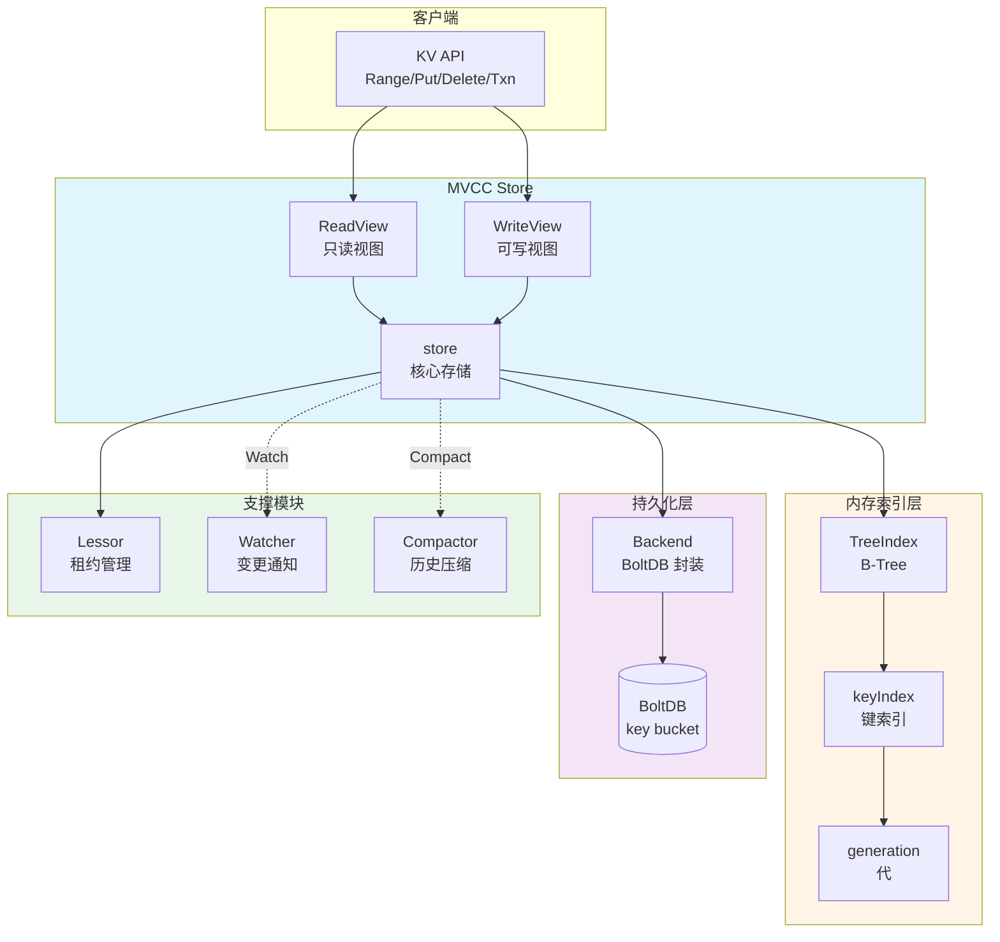

### 架构说明

#### 1. 客户端接口层
- **KV API**：Range、Put、DeleteRange、Txn、Compact
- 通过 EtcdServer 调用 MVCC Store

#### 2. MVCC 核心层
- **ReadView**：只读视图，提供 Read 事务
- **WriteView**：可写视图，提供 Write 事务
- **store**：核心存储引擎，协调索引和持久化

#### 3. 内存索引层
- **TreeIndex**：全局 B-Tree 索引（度数 32）
- **keyIndex**：单键的版本索引
- **generation**：单键的生命周期管理

#### 4. 持久化层
- **Backend**：封装 BoltDB，提供事务接口
- **BoltDB**：key bucket 存储所有键值版本

#### 5. 支撑模块
- **Lessor**：管理租约，自动删除过期键
- **Watcher**：监听键变更，推送事件
- **Compactor**：定期压缩历史版本

---

## 职责边界

### 输入
- **写操作**：Put、Delete、Txn（来自 Apply 层）
- **读操作**：Range、Count（来自客户端）
- **管理操作**：Compact、Hash、Snapshot

### 输出
- **读响应**：键值对、版本信息、计数
- **写响应**：操作结果、前值（PrevKV）
- **Watch 事件**：键变更通知
- **错误**：ErrCompacted、ErrFutureRev

### 上下游依赖

**上游**（调用 MVCC）：

- EtcdServer Apply 层（写操作）
- EtcdServer 请求处理（读操作）

**下游**（MVCC 调用）：

- Backend（BoltDB 持久化）
- Lessor（租约管理）
- Watcher（事件通知）

---

## 生命周期

### 初始化阶段（NewStore）

```go
func NewStore(lg *zap.Logger, b backend.Backend, le lease.Lessor, cfg StoreConfig) *store {
    // 1. 创建 TreeIndex（空）
    s.kvindex = newTreeIndex(lg)
    
    // 2. 初始化状态
    s.currentRev = 1
    s.compactMainRev = -1
    
    // 3. 创建 ReadView/WriteView
    s.ReadView = &readView{s}
    s.WriteView = &writeView{s}
    
    // 4. 创建 key bucket
    tx := s.b.BatchTx()
    tx.UnsafeCreateBucket(schema.Key)
    
    // 5. 从 Backend 恢复
    if err := s.restore(); err != nil {
        panic("failed to recover store from backend")
    }
    
    return s
}
```

**关键步骤**：

1. **创建内存索引**：空 TreeIndex
2. **初始化版本号**：currentRev = 1
3. **创建视图**：ReadView 和 WriteView
4. **初始化 Backend**：创建 key bucket
5. **恢复状态**：从 BoltDB 重建 TreeIndex

### 恢复阶段（restore）

```go
func (s *store) restore() error {
    // 1. 读取所有键值对（按 Revision 排序）
    tx := s.b.ReadTx()
    tx.Lock()
    
    keys, vals := tx.UnsafeRange(schema.Key, min, max, 0)
    
    // 2. 重建 TreeIndex
    for i, key := range keys {
        var kv mvccpb.KeyValue
        kv.Unmarshal(vals[i])
        
        rev := bytesToRev(key)
        
        // 更新索引
        if isTombstone {
            s.kvindex.Tombstone(kv.Key, rev)
        } else {
            s.kvindex.Restore(kv.Key, rev, kv.Version)
        }
        
        // 更新 currentRev
        s.currentRev = rev.Main
    }
    
    tx.Unlock()
    
    return nil
}
```

**恢复流程**：

1. **扫描 Backend**：遍历所有键值对
2. **解析 Revision**：从 BoltDB Key 提取 Revision
3. **重建索引**：根据键值对重建 TreeIndex
4. **恢复版本号**：设置 currentRev

**时间复杂度**：O(N)，N 为键值对总数（包括历史版本）

### 运行阶段（Read/Write）

#### 读事务

```go
// Read 开启只读事务
func (rv *readView) Read(trace *traceutil.Trace) TxnRead {
    s := rv.store
    s.mu.RLock()
    
    // 读取当前 Revision
    s.revMu.RLock()
    currentRev := s.currentRev
    s.revMu.RUnlock()
    
    return &storeTxnRead{
        s:  s,
        tx: s.b.ReadTx(),
        firstRev: s.compactMainRev,
        rev: currentRev,
        trace: trace,
    }
}
```

#### 写事务

```go
// Write 开启写事务
func (wv *writeView) Write(trace *traceutil.Trace) TxnWrite {
    s := wv.store
    s.mu.Lock()
    
    tx := s.b.BatchTx()
    tx.LockInsideApply()
    
    // 递增 Revision
    s.revMu.Lock()
    s.currentRev++
    currentRev := s.currentRev
    s.revMu.Unlock()
    
    return &storeTxnWrite{
        storeTxnRead: storeTxnRead{
            s:  s,
            tx: tx,
            firstRev: s.compactMainRev,
            rev: currentRev,
            trace: trace,
        },
        beginRev: currentRev,
    }
}
```

### 停止阶段（Close）

```go
func (s *store) Close() error {
    close(s.stopc)
    s.fifoSched.Stop()
    return nil
}
```

---

## 核心数据结构

### store 结构体

```go
type store struct {
    ReadView
    WriteView
    
    cfg StoreConfig
    
    mu sync.RWMutex  // 保护索引和事务
    
    b       backend.Backend  // BoltDB 后端
    kvindex index            // TreeIndex
    
    le lease.Lessor  // 租约管理器
    
    revMu sync.RWMutex  // 保护版本号
    currentRev     int64  // 当前最大版本
    compactMainRev int64  // 已压缩的最大版本
    
    fifoSched schedule.Scheduler  // 调度器
    
    stopc chan struct{}  // 停止信号
    
    lg     *zap.Logger
    hashes HashStorage  // Hash 存储
}
```

### Revision 结构体

```go
type Revision struct {
    Main int64  // 主版本号（全局）
    Sub  int64  // 子版本号（事务内）
}

func (a Revision) GreaterThan(b Revision) bool {
    if a.Main > b.Main {
        return true
    }
    if a.Main < b.Main {
        return false
    }
    return a.Sub > b.Sub
}
```

### keyIndex 结构体

```go
type keyIndex struct {
    key         []byte
    modified    Revision
    generations []generation
}

type generation struct {
    created Revision    // 创建版本
    ver     int64       // 版本号
    revs    []Revision  // 版本列表
}
```

---

## 关键算法与流程

### 1. Put 操作

**目的**：写入或更新键值

**输入**：key, value, lease

**输出**：Revision, PrevKV

**流程**：

```go
func (tw *storeTxnWrite) Put(key, value []byte, lease lease.LeaseID) {
    // 1. 分配 Sub Revision
    rev := Revision{Main: tw.beginRev, Sub: tw.changes}
    tw.changes++
    
    // 2. 更新 TreeIndex
    tw.s.kvindex.Put(key, rev)
    
    // 3. 序列化 KeyValue
    kv := mvccpb.KeyValue{
        Key:            key,
        Value:          value,
        CreateRevision: createRev,
        ModRevision:    rev.Main,
        Version:        ver,
        Lease:          int64(lease),
    }
    
    // 4. 写入 Backend
    d, _ := kv.Marshal()
    tw.tx.UnsafePut(schema.Key, revToBytes(rev), d)
    
    // 5. 关联租约
    if lease != lease.NoLease {
        tw.s.le.Attach(lease, []lease.LeaseItem{{Key: string(key)}})
    }
}
```

**关键设计**：

- **Revision 分配**：Main 为事务版本，Sub 递增
- **先更新索引**：失败可快速回滚
- **后写 Backend**：持久化保证数据安全
- **租约绑定**：支持自动过期

### 2. Range 操作

**目的**：读取键值（支持版本查询）

**输入**：key, end, limit, rev

**输出**：[]KeyValue

**流程**：

```go
func (tr *storeTxnRead) Range(key, end []byte, limit int64, rangeRev int64) ([]mvccpb.KeyValue, int, error) {
    // 1. 确定查询版本
    if rangeRev <= 0 {
        rangeRev = tr.s.currentRev
    }
    
    if rangeRev < tr.s.compactMainRev {
        return nil, 0, ErrCompacted
    }
    
    // 2. 从 TreeIndex 查询
    keys, revs := tr.s.kvindex.Range(key, end, rangeRev)
    
    if len(keys) == 0 {
        return nil, 0, nil
    }
    
    // 3. 从 Backend 读取
    kvs := make([]mvccpb.KeyValue, len(keys))
    for i, key := range keys {
        rev := revs[i]
        _, vs := tr.tx.UnsafeRange(schema.Key, revToBytes(rev), nil, 1)
        
        if len(vs) == 0 {
            continue
        }
        
        kvs[i].Unmarshal(vs[0])
    }
    
    return kvs, len(kvs), nil
}
```

**查询策略**：

- **索引查找**：TreeIndex 返回 Revision 列表
- **Backend 读取**：按 Revision 读取具体值
- **版本隔离**：只返回 <= rangeRev 的版本

### 3. Compact 操作

**目的**：压缩历史版本，释放空间

**输入**：compactRev

**输出**：删除的 Revision 集合

**流程**：

```go
func (s *store) Compact(rev int64) (<-chan struct{}, error) {
    // 1. 验证压缩版本
    if rev <= s.compactMainRev {
        return nil, ErrCompacted
    }
    
    if rev > s.currentRev {
        return nil, ErrFutureRev
    }
    
    // 2. 从 TreeIndex 获取待删除 Revisions
    keep := s.kvindex.Compact(rev)
    
    // 3. 批量删除 Backend 数据
    ch := make(chan struct{})
    go func() {
        defer close(ch)
        
        // 批量删除（每批 1000 个）
        for r := range keep {
            tx.UnsafeDelete(schema.Key, revToBytes(r))
            
            if deleteCount%1000 == 0 {
                tx.Commit()
                time.Sleep(10 * time.Millisecond)
                tx = s.b.BatchTx()
            }
        }
        
        tx.Commit()
    }()
    
    // 4. 更新 compactMainRev
    s.compactMainRev = rev
    
    return ch, nil
}
```

**压缩策略**：

- **保留最新版本**：每个键保留 > compactRev 的最新版本
- **批量删除**：避免长时间持有锁
- **异步压缩**：不阻塞读写操作

---

## 边界条件与约束

### 扩展点
- **自定义索引**：实现 `index` 接口替换 TreeIndex
- **Backend 替换**：实现 `Backend` 接口替换 BoltDB
- **Compaction 策略**：periodic（周期）、revision（版本）

### 状态持有位置
- **TreeIndex**：内存（需恢复时重建）
- **currentRev / compactMainRev**：内存 + Backend meta bucket
- **KeyValue 数据**：BoltDB key bucket

### 资源占用要点
- **内存**：
  - TreeIndex：~100 字节/键
  - 历史版本索引：~20 字节/版本
- **磁盘**：
  - KeyValue：~100 字节 + key size + value size
  - 历史版本累积（需定期压缩）
- **CPU**：
  - Range：O(log N) TreeIndex 查询
  - Compact：O(M)，M 为待删除版本数

---

## 配置与可观测

### 关键配置项

| 配置项 | 默认值 | 说明 | 影响 |
|--------|--------|------|------|
| `CompactionBatchLimit` | 1000 | 压缩批量大小 | 过小：压缩慢<br>过大：锁持有时间长 |
| `CompactionSleepInterval` | 10ms | 批量间隔 | 压缩对读写的影响 |
| `SnapshotCount` | 10000 | 触发 Snapshot 的日志数 | 恢复时间 vs 内存占用 |

### 关键监控指标

**存储相关**：

- `etcd_mvcc_db_total_size_in_bytes`：数据库总大小
- `etcd_mvcc_db_total_size_in_use_in_bytes`：实际使用大小
- `etcd_debugging_mvcc_keys_total`：键总数（不包括历史版本）
- `etcd_debugging_mvcc_db_compaction_keys_total`：已压缩键数

**性能相关**：

- `etcd_mvcc_range_total`：Range 操作总数
- `etcd_mvcc_put_total`：Put 操作总数
- `etcd_mvcc_delete_total`：Delete 操作总数
- `etcd_mvcc_txn_total`：事务总数

**版本相关**：

- `etcd_debugging_mvcc_current_revision`：当前最大 Revision
- `etcd_debugging_mvcc_compact_revision`：已压缩 Revision

---

## 最佳实践

### 1. 合理设置压缩策略

```bash
# 周期压缩（保留 1 小时历史）
etcd --auto-compaction-mode=periodic --auto-compaction-retention=1h

# 版本压缩（保留 10000 个版本）
etcd --auto-compaction-mode=revision --auto-compaction-retention=10000
```

### 2. 定期碎片整理

```bash
# 压缩后执行 Defragment 回收空间
etcdctl defrag --endpoints=http://localhost:2379
```

### 3. 控制历史版本数量

```go
// 避免频繁更新同一键
// 使用租约自动过期

// 定期压缩
etcdctl compact $(etcdctl endpoint status --write-out="json" | jq '.[0].Status.header.revision - 10000')
```

### 4. 监控数据库大小

```promql
# 数据库使用率
(etcd_mvcc_db_total_size_in_use_in_bytes / etcd_mvcc_db_total_size_in_bytes) * 100

# 告警：使用率 > 80% 或总大小 > 7GB
```

---

**文档版本**：v1.0  
**适用 etcd 版本**：v3.5+  
**生成时间**：2025-01-04

---

## API接口

本文档详细描述 MVCC 模块对外提供的所有 API，包括事务接口、读写操作、压缩等核心功能。

---

## API 概览

MVCC 通过 `KV` 接口对外提供服务，主要包括：

| API 类别 | 接口名称 | 说明 |
|---------|---------|------|
| **事务管理** | Read, Write | 开启只读/可写事务 |
| **读操作** | Range | 范围查询（支持历史版本） |
| **写操作** | Put, DeleteRange | 插入、删除键值 |
| **压缩** | Compact | 压缩历史版本 |
| **提交** | Commit, End | 提交事务 |
| **哈希** | Hash, HashByRev | 计算数据一致性哈希 |

---

## 一、事务 API

### 1.1 Read - 开启只读事务

#### 基本信息
- **名称**：`Read`
- **接口**：`KV.Read(mode ReadTxMode, trace *traceutil.Trace) TxnRead`
- **幂等性**：是（只读事务）

#### 请求参数

```go
type ReadTxMode uint32

const (
    // ConcurrentReadTxMode 使用独立的 ReadTx（并发读）
    ConcurrentReadTxMode = ReadTxMode(1)
    
    // SharedBufReadTxMode 使用共享的 BatchTx（写事务中读）
    SharedBufReadTxMode = ReadTxMode(2)
)
```

**参数表**：

| 参数 | 类型 | 说明 |
|------|------|------|
| `mode` | `ReadTxMode` | 读事务模式 |
| `trace` | `*traceutil.Trace` | 追踪上下文（可选） |

#### 返回值

```go
type TxnRead interface {
    ReadView
    End()  // 结束事务
}

type ReadView interface {
    FirstRev() int64  // 已压缩的最小 Revision
    Rev() int64       // 事务开启时的 Revision
    Range(ctx context.Context, key, end []byte, ro RangeOptions) (*RangeResult, error)
}
```

#### 核心实现

```go
func (s *store) Read(mode ReadTxMode, trace *traceutil.Trace) TxnRead {
    // 1. 加读锁
    s.mu.RLock()
    s.revMu.RLock()
    
    // 2. 根据模式选择 ReadTx
    var tx backend.ReadTx
    if mode == ConcurrentReadTxMode {
        // 并发读：复制读缓冲区
        tx = s.b.ConcurrentReadTx()
    } else {
        // 共享缓冲区读
        tx = s.b.ReadTx()
    }
    
    // 3. 锁定 ReadTx（no-op for ConcurrentReadTx）
    tx.RLock()
    
    // 4. 快照当前版本号
    firstRev := s.compactMainRev
    rev := s.currentRev
    s.revMu.RUnlock()
    
    // 5. 创建事务对象
    return &storeTxnRead{
        storeTxnCommon{s, tx, firstRev, rev, trace},
        tx,
    }
}
```

#### 使用示例

```go
// 并发读事务（推荐）
txn := kv.Read(ConcurrentReadTxMode, nil)
defer txn.End()

result, err := txn.Range(ctx, key, end, RangeOptions{Limit: 10})
```

#### 性能要点

- **ConcurrentReadTxMode**：适合高并发读，不阻塞写事务，但有内存复制开销
- **SharedBufReadTxMode**：适合写事务中读取，避免缓冲区复制，但可能阻塞其他读

---

### 1.2 Write - 开启写事务

#### 基本信息
- **名称**：`Write`
- **接口**：`KV.Write(trace *traceutil.Trace) TxnWrite`
- **幂等性**：否（修改状态）

#### 返回值

```go
type TxnWrite interface {
    TxnRead
    WriteView
    Changes() []mvccpb.KeyValue  // 获取事务中的所有变更
}

type WriteView interface {
    Put(key, value []byte, lease lease.LeaseID) int64
    DeleteRange(key, end []byte) (n, rev int64)
}
```

#### 核心实现

```go
func (s *store) Write(trace *traceutil.Trace) TxnWrite {
    // 1. 加读锁（允许多个写事务并发）
    s.mu.RLock()
    
    // 2. 获取 BatchTx 并锁定
    tx := s.b.BatchTx()
    tx.LockInsideApply()
    
    // 3. 创建写事务对象
    tw := &storeTxnWrite{
        storeTxnCommon: storeTxnCommon{
            s:        s,
            tx:       tx,
            firstRev: 0,
            rev:      0,
            trace:    trace,
        },
        tx:       tx,
        beginRev: s.currentRev,
        changes:  make([]mvccpb.KeyValue, 0, 4),
    }
    
    return tw
}
```

#### End 提交逻辑

```go
func (tw *storeTxnWrite) End() {
    // 1. 如果有变更，递增 currentRev
    if len(tw.changes) != 0 {
        tw.s.revMu.Lock()
        tw.s.currentRev++
    }
    
    // 2. 解锁 BatchTx（触发批量提交）
    tw.tx.Unlock()
    
    // 3. 释放版本号锁
    if len(tw.changes) != 0 {
        tw.s.revMu.Unlock()
    }
    
    // 4. 释放 store 锁
    tw.s.mu.RUnlock()
}
```

#### 使用示例

```go
// 写事务
txn := kv.Write(nil)
defer txn.End()

// 执行多个操作
txn.Put([]byte("key1"), []byte("value1"), lease.NoLease)
txn.Put([]byte("key2"), []byte("value2"), lease.NoLease)
txn.DeleteRange([]byte("key3"), nil)

// 获取变更
changes := txn.Changes()
```

---

## 二、读操作 API

### 2.1 Range - 范围查询

#### 基本信息
- **名称**：`Range`
- **接口**：`TxnRead.Range(ctx, key, end, RangeOptions) (*RangeResult, error)`
- **幂等性**：是（只读）

#### 请求参数

```go
type RangeOptions struct {
    Limit int64  // 返回数量限制
    Rev   int64  // 查询版本（<= 0 表示当前版本）
    Count bool   // 是否只返回计数
}
```

**参数表**：

| 参数 | 类型 | 必填 | 说明 |
|------|------|-----|------|
| `key` | `[]byte` | 是 | 起始键 |
| `end` | `[]byte` | 否 | 结束键（nil 表示单键查询，空表示 >= key） |
| `ro.Limit` | `int64` | 否 | 数量限制（0 表示无限制） |
| `ro.Rev` | `int64` | 否 | 查询版本（<= 0 表示当前） |
| `ro.Count` | `bool` | 否 | 只返回计数 |

#### 响应结构

```go
type RangeResult struct {
    KVs   []mvccpb.KeyValue  // 键值对列表
    Rev   int64              // 当前 Revision
    Count int                // 总计数
}

type KeyValue struct {
    Key            []byte
    Value          []byte
    CreateRevision int64  // 创建版本
    ModRevision    int64  // 修改版本
    Version        int64  // 版本号（同一键递增）
    Lease          int64  // 租约 ID
}
```

#### 核心实现

```go
func (tr *storeTxnRead) Range(ctx context.Context, key, end []byte, ro RangeOptions) (*RangeResult, error) {
    // 1. 确定查询版本
    rangeRev := ro.Rev
    if rangeRev <= 0 {
        rangeRev = tr.s.currentRev
    }
    
    // 2. 验证版本范围
    if rangeRev < tr.firstRev {
        return nil, ErrCompacted
    }
    if rangeRev > tr.s.currentRev {
        return nil, ErrFutureRev
    }
    
    // 3. 从 TreeIndex 查询
    keys, revs := tr.s.kvindex.Range(key, end, rangeRev)
    
    if len(keys) == 0 {
        return &RangeResult{KVs: nil, Rev: curRev, Count: 0}, nil
    }
    
    // 4. 限制返回数量
    if ro.Limit > 0 && ro.Limit < int64(len(keys)) {
        keys = keys[:ro.Limit]
        revs = revs[:ro.Limit]
    }
    
    // 5. 从 Backend 读取键值
    kvs := make([]mvccpb.KeyValue, len(keys))
    for i, key := range keys {
        rev := revs[i]
        _, vs := tr.tx.UnsafeRange(
            schema.Key,
            revToBytes(rev),
            nil,
            1,
        )
        
        if len(vs) != 0 {
            kvs[i].Unmarshal(vs[0])
        }
    }
    
    return &RangeResult{
        KVs:   kvs,
        Rev:   curRev,
        Count: len(keys),
    }, nil
}
```

#### 时序图

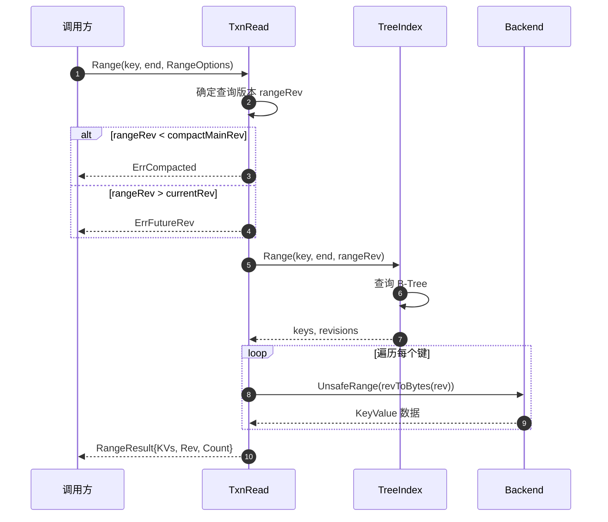

#### 查询模式

**1. 单键查询**：

```go
result, _ := txn.Range(ctx, []byte("key"), nil, RangeOptions{})
// 只查询 "key"
```

**2. 范围查询**：

```go
result, _ := txn.Range(ctx, []byte("key1"), []byte("key3"), RangeOptions{})
// 查询 [key1, key3)
```

**3. 前缀查询**：

```go
result, _ := txn.Range(ctx, []byte("prefix"), []byte("prefix\x00"), RangeOptions{})
// 查询所有以 "prefix" 开头的键
```

**4. 历史版本查询**：

```go
result, _ := txn.Range(ctx, []byte("key"), nil, RangeOptions{Rev: 100})
// 查询版本 100 时的键值
```

---

## 三、写操作 API

### 3.1 Put - 插入或更新键值

#### 基本信息
- **名称**：`Put`
- **接口**：`TxnWrite.Put(key, value []byte, lease LeaseID) int64`
- **幂等性**：否（每次生成新版本）

#### 请求参数

| 参数 | 类型 | 必填 | 说明 |
|------|------|-----|------|
| `key` | `[]byte` | 是 | 键 |
| `value` | `[]byte` | 是 | 值 |
| `lease` | `LeaseID` | 否 | 租约 ID（NoLease 表示无租约） |

#### 返回值

- **int64**：操作后的 Revision（`beginRev + 1`）

#### 核心实现

```go
func (tw *storeTxnWrite) Put(key, value []byte, lease lease.LeaseID) int64 {
    tw.put(key, value, lease)
    return tw.beginRev + 1
}

func (tw *storeTxnWrite) put(key, value []byte, leaseID lease.LeaseID) {
    // 1. 分配 Sub Revision
    rev := Revision{
        Main: tw.beginRev + 1,
        Sub:  int64(len(tw.changes)),
    }
    
    // 2. 从 TreeIndex 获取旧版本信息
    oldLease := lease.NoLease
    c := tw.s.kvindex.Get(key, rev.Main)
    if c != nil {
        oldLease = c.Lease
    }
    
    // 3. 更新 TreeIndex
    tw.s.kvindex.Put(key, rev)
    
    // 4. 构造 KeyValue
    kv := mvccpb.KeyValue{
        Key:            key,
        Value:          value,
        CreateRevision: c.CreateRevision,
        ModRevision:    rev.Main,
        Version:        c.Version + 1,
        Lease:          int64(leaseID),
    }
    
    // 5. 写入 Backend
    d, _ := kv.Marshal()
    tw.tx.UnsafePut(schema.Key, revToBytes(rev), d)
    
    // 6. 记录变更
    tw.changes = append(tw.changes, kv)
    
    // 7. 更新租约关联
    if oldLease != lease.NoLease && oldLease != leaseID {
        tw.s.le.Detach(oldLease, []lease.LeaseItem{{Key: string(key)}})
    }
    
    if leaseID != lease.NoLease {
        tw.s.le.Attach(leaseID, []lease.LeaseItem{{Key: string(key)}})
    }
}
```

#### 时序图

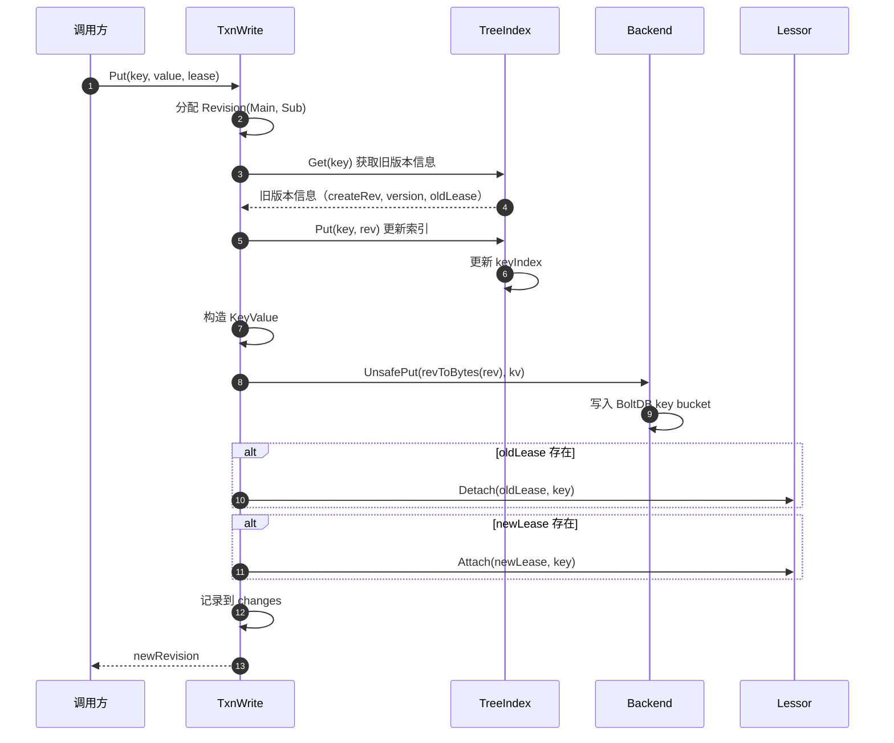

---

### 3.2 DeleteRange - 删除键范围

#### 基本信息
- **名称**：`DeleteRange`
- **接口**：`TxnWrite.DeleteRange(key, end []byte) (n, rev int64)`
- **幂等性**：是（删除不存在的键不会报错）

#### 请求参数

| 参数 | 类型 | 必填 | 说明 |
|------|------|-----|------|
| `key` | `[]byte` | 是 | 起始键 |
| `end` | `[]byte` | 否 | 结束键（nil 表示单键） |

#### 返回值

- **n**：删除的键数量
- **rev**：操作后的 Revision

#### 核心实现

```go
func (tw *storeTxnWrite) DeleteRange(key, end []byte) (int64, int64) {
    if n := tw.deleteRange(key, end); n != 0 || len(tw.changes) > 0 {
        return n, tw.beginRev + 1
    }
    return 0, tw.beginRev
}

func (tw *storeTxnWrite) deleteRange(key, end []byte) int64 {
    // 1. 从 TreeIndex 查询待删除的键
    keys, _ := tw.s.kvindex.Range(key, end, tw.beginRev+1)
    
    if len(keys) == 0 {
        return 0
    }
    
    // 2. 遍历删除
    for _, key := range keys {
        // 分配 Revision
        rev := Revision{
            Main: tw.beginRev + 1,
            Sub:  int64(len(tw.changes)),
        }
        
        // 更新 TreeIndex（Tombstone）
        tw.s.kvindex.Tombstone(key, rev)
        
        // 构造 Tombstone KeyValue
        kv := mvccpb.KeyValue{
            Key:         key,
            ModRevision: rev.Main,
        }
        
        // 写入 Backend
        d, _ := kv.Marshal()
        tw.tx.UnsafePut(schema.Key, revToBytes(rev), d)
        
        // 记录变更
        tw.changes = append(tw.changes, kv)
        
        // 解除租约关联
        if item, ok := tw.s.le.Lookup(leaseID); ok {
            tw.s.le.Detach(leaseID, []lease.LeaseItem{{Key: string(key)}})
        }
    }
    
    return int64(len(keys))
}
```

---

## 四、压缩 API

### 4.1 Compact - 压缩历史版本

#### 基本信息
- **名称**：`Compact`
- **接口**：`KV.Compact(trace *traceutil.Trace, rev int64) (<-chan struct{}, error)`
- **幂等性**：是（重复压缩到同一版本安全）

#### 请求参数

| 参数 | 类型 | 说明 |
|------|------|------|
| `rev` | `int64` | 压缩到的版本（包含） |
| `trace` | `*traceutil.Trace` | 追踪上下文 |

#### 返回值

- **<-chan struct{}**：压缩完成通道
- **error**：错误（ErrCompacted / ErrFutureRev）

#### 核心实现

```go
func (s *store) Compact(trace *traceutil.Trace, rev int64) (<-chan struct{}, error) {
    // 1. 验证压缩版本
    s.revMu.RLock()
    if rev <= s.compactMainRev {
        s.revMu.RUnlock()
        return nil, ErrCompacted
    }
    
    if rev > s.currentRev {
        s.revMu.RUnlock()
        return nil, ErrFutureRev
    }
    s.revMu.RUnlock()
    
    // 2. 从 TreeIndex 获取待删除的 Revisions
    s.mu.Lock()
    keep := s.kvindex.Compact(rev)
    s.mu.Unlock()
    
    // 3. 异步删除 Backend 数据
    ch := make(chan struct{})
    go s.scheduleCompaction(rev, keep, ch)
    
    return ch, nil
}

func (s *store) scheduleCompaction(rev int64, keep map[Revision]struct{}, ch chan struct{}) {
    defer close(ch)
    
    tx := s.b.BatchTx()
    
    // 批量删除
    deleteCount := 0
    for r := range keep {
        tx.UnsafeDelete(schema.Key, revToBytes(r))
        deleteCount++
        
        // 每 1000 个提交一次
        if deleteCount%s.cfg.CompactionBatchLimit == 0 {
            tx.Commit()
            time.Sleep(s.cfg.CompactionSleepInterval)
            tx = s.b.BatchTx()
        }
    }
    
    tx.Commit()
    
    // 更新 compactMainRev
    s.revMu.Lock()
    s.compactMainRev = rev
    s.revMu.Unlock()
}
```

#### 压缩策略

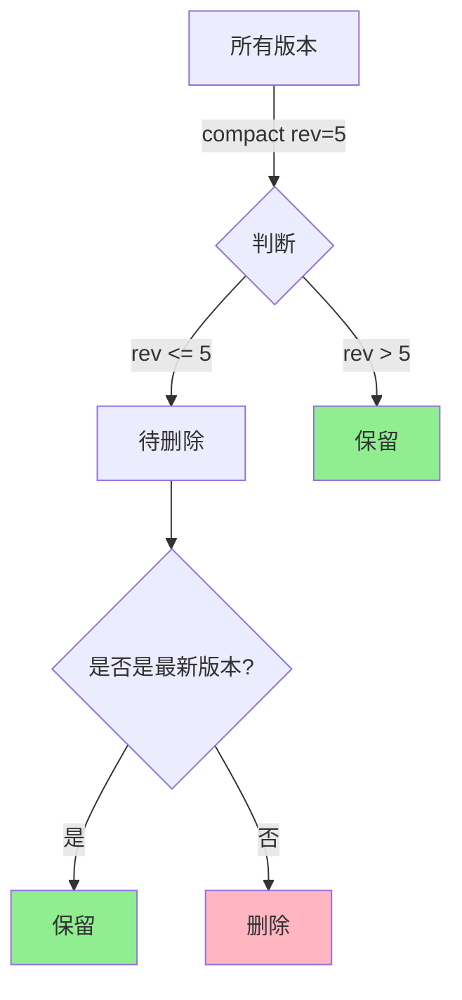

---

## 五、其他 API

### 5.1 Commit - 提交事务

```go
func (s *store) Commit() {
    s.b.ForceCommit()
}
```

**说明**：强制提交所有未提交的事务到 BoltDB。

### 5.2 Hash - 计算数据哈希

```go
func (s *store) Hash() (hash uint32, revision int64, err error)
```

**用途**：计算当前数据的哈希值，用于数据一致性校验。

### 5.3 HashByRev - 计算指定版本的哈希

```go
func (s *store) HashByRev(rev int64) (KeyValueHash, int64, error)
```

**用途**：计算指定 Revision 的哈希值，用于历史一致性校验。

---

## 六、最佳实践

### 1. 事务模式选择

```go
// 只读场景：使用 ConcurrentReadTxMode
txn := kv.Read(ConcurrentReadTxMode, nil)
defer txn.End()

// 写事务中读取：使用 SharedBufReadTxMode
txn := kv.Write(nil)
defer txn.End()
```

### 2. 批量写入

```go
txn := kv.Write(nil)
defer txn.End()

for _, item := range items {
    txn.Put(item.Key, item.Value, lease.NoLease)
}

// 一次性提交所有变更
```

### 3. 历史版本查询

```go
// 查询 5 分钟前的数据
rev := getCurrentRev() - estimateRevsPer5Min()
result, _ := txn.Range(ctx, key, nil, RangeOptions{Rev: rev})
```

### 4. 定期压缩

```bash
# 保留最近 1 小时的历史
etcdctl compact --physical \
  $(etcdctl endpoint status --write-out=json | jq '.[0].Status.header.revision - 36000')
```

---

**文档版本**：v1.0  
**适用 etcd 版本**：v3.5+  
**生成时间**：2025-01-04

---

## 数据结构

本文档详细描述 MVCC 模块的核心数据结构，包括存储引擎、索引、版本管理等关键组件。

---

## 一、核心数据结构 UML

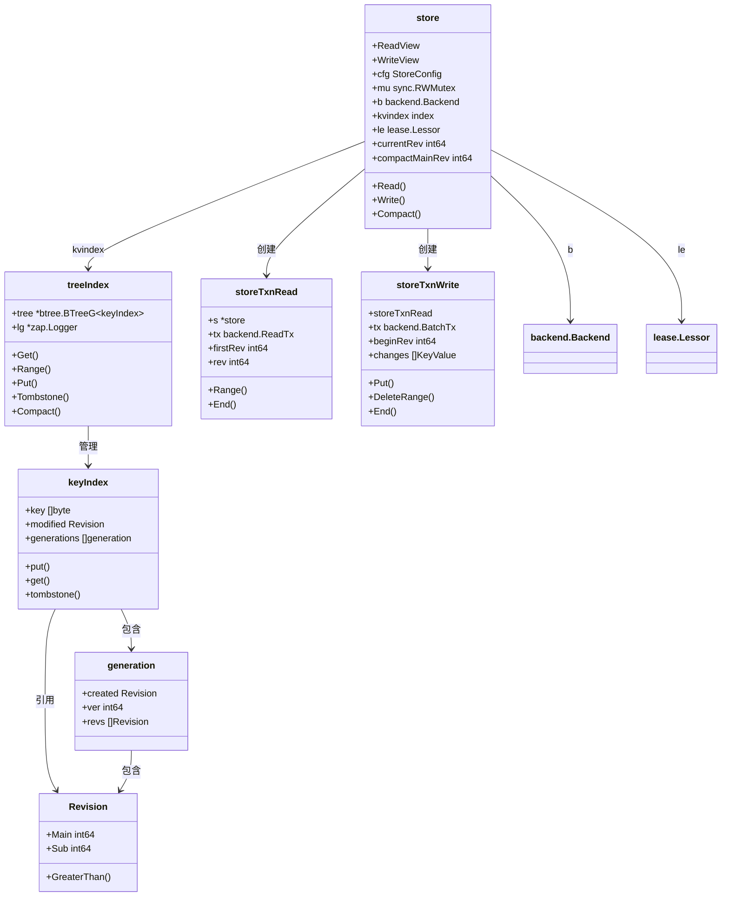

---

## 二、store 结构体

### 2.1 定义

```go
type store struct {
    ReadView   // 只读视图接口
    WriteView  // 可写视图接口
    
    cfg StoreConfig
    
    // mu 保护 kvindex 和事务
    mu sync.RWMutex
    
    b       backend.Backend  // BoltDB 后端
    kvindex index            // TreeIndex 内存索引
    
    le lease.Lessor  // 租约管理器
    
    // revMu 保护版本号
    revMu sync.RWMutex
    currentRev     int64  // 当前最大 Revision
    compactMainRev int64  // 已压缩的 Revision
    
    fifoSched schedule.Scheduler  // FIFO 调度器
    
    stopc chan struct{}  // 停止信号
    
    lg     *zap.Logger
    hashes HashStorage  // Hash 存储
}
```

### 2.2 字段详解

| 字段 | 类型 | 说明 | 访问方式 |
|------|------|------|----------|
| `mu` | `sync.RWMutex` | 保护 kvindex 和事务创建 | 读事务加 RLock，写事务也加 RLock（并发写） |
| `b` | `backend.Backend` | BoltDB 后端，持久化存储 | 通过事务访问 |
| `kvindex` | `index` | TreeIndex 内存索引 | 受 mu 保护 |
| `le` | `lease.Lessor` | 租约管理器 | 更新租约关联 |
| `revMu` | `sync.RWMutex` | 保护版本号 | 原子更新 Revision |
| `currentRev` | `int64` | 当前最大 Revision（全局递增） | 受 revMu 保护 |
| `compactMainRev` | `int64` | 已压缩的最小 Revision | 受 revMu 保护 |
| `fifoSched` | `Scheduler` | 压缩任务调度器 | 串行执行压缩 |
| `hashes` | `HashStorage` | 存储数据哈希 | 用于一致性检查 |

### 2.3 StoreConfig

```go
type StoreConfig struct {
    CompactionBatchLimit    int           // 压缩批量大小（默认 1000）
    CompactionSleepInterval time.Duration // 批量间隔（默认 10ms）
}
```

---

## 三、Revision 结构体

### 3.1 定义

```go
type Revision struct {
    Main int64  // 主版本号（全局事务号）
    Sub  int64  // 子版本号（事务内操作序号）
}
```

### 3.2 编码格式

```go
// BoltDB Key 格式：8 字节 Main + 8 字节 Sub（大端序）
func revToBytes(rev Revision) []byte {
    bytes := make([]byte, 16)
    binary.BigEndian.PutUint64(bytes, uint64(rev.Main))
    binary.BigEndian.PutUint64(bytes[8:], uint64(rev.Sub))
    return bytes
}
```

### 3.3 比较逻辑

```go
func (a Revision) GreaterThan(b Revision) bool {
    if a.Main > b.Main {
        return true
    }
    if a.Main < b.Main {
        return false
    }
    return a.Sub > b.Sub
}
```

**排序规则**：Main 优先，Sub 次之（字典序）

---

## 四、TreeIndex 结构体

### 4.1 定义

```go
type treeIndex struct {
    sync.RWMutex
    tree *btree.BTreeG[*keyIndex]  // B-Tree，度数 32
    lg   *zap.Logger
}
```

**特性**：

- **并发安全**：RWMutex 保护
- **有序索引**：B-Tree 按 key 排序
- **高效查询**：O(log N) 复杂度

### 4.2 关键方法

```go
// Put 插入或更新键
func (ti *treeIndex) Put(key []byte, rev Revision) {
    keyi := &keyIndex{key: key}
    
    ti.Lock()
    defer ti.Unlock()
    
    okeyi, ok := ti.tree.Get(keyi)
    if !ok {
        keyi.put(ti.lg, rev.Main, rev.Sub)
        ti.tree.ReplaceOrInsert(keyi)
        return
    }
    okeyi.put(ti.lg, rev.Main, rev.Sub)
}

// Get 获取键的版本信息
func (ti *treeIndex) Get(key []byte, atRev int64) (modified, created Revision, ver int64, err error) {
    ti.RLock()
    defer ti.RUnlock()
    
    keyi := &keyIndex{key: key}
    if keyi = ti.keyIndex(keyi); keyi == nil {
        return Revision{}, Revision{}, 0, ErrRevisionNotFound
    }
    
    return keyi.get(ti.lg, atRev)
}

// Range 范围查询
func (ti *treeIndex) Range(key, end []byte, atRev int64) ([][]byte, []Revision) {
    ti.RLock()
    defer ti.RUnlock()
    
    var keys [][]byte
    var revs []Revision
    
    ti.unsafeVisit(key, end, func(ki *keyIndex) bool {
        rev, _, _, err := ki.get(ti.lg, atRev)
        if err != nil {
            return true
        }
        keys = append(keys, ki.key)
        revs = append(revs, rev)
        return true
    })
    
    return keys, revs
}
```

---

## 五、keyIndex 结构体

### 5.1 定义

```go
type keyIndex struct {
    key         []byte        // 键
    modified    Revision      // 最后修改版本
    generations []generation  // 代列表（逆序：最新代在前）
}
```

**生命周期示例**：

```
操作序列：
  put(key, v1) @1.0   → Gen 0: {created:1.0, revs:[1.0]}
  put(key, v2) @2.0   → Gen 0: {created:1.0, revs:[1.0,2.0]}
  delete(key) @3.0    → Gen 0: {created:1.0, revs:[1.0,2.0,3.0(t)]}
                        Gen 1: {} (空代)
  put(key, v3) @4.0   → Gen 1: {created:4.0, revs:[4.0]}

keyIndex:
  key: "key"
  modified: 4.0
  generations:

    - Gen 1: {created:4.0, ver:1, revs:[4.0]}
    - Gen 0: {created:1.0, ver:3, revs:[1.0,2.0,3.0(tombstone)]}

```

### 5.2 generation 结构体

```go
type generation struct {
    created Revision    // 创建版本
    ver     int64       // 版本号（同一代内递增）
    revs    []Revision  // 版本列表
}

func (g *generation) isEmpty() bool {
    return g == nil || len(g.revs) == 0
}
```

### 5.3 关键方法

#### put - 插入版本

```go
func (ki *keyIndex) put(lg *zap.Logger, main int64, sub int64) {
    rev := Revision{Main: main, Sub: sub}
    
    if len(ki.generations) == 0 {
        ki.generations = append(ki.generations, generation{})
    }
    
    g := &ki.generations[len(ki.generations)-1]
    if len(g.revs) == 0 {
        // 新键
        keysGauge.Inc()
        g.created = rev
    }
    
    g.revs = append(g.revs, rev)
    g.ver++
    ki.modified = rev
}
```

#### tombstone - 标记删除

```go
func (ki *keyIndex) tombstone(lg *zap.Logger, main int64, sub int64) error {
    if ki.isEmpty() {
        return ErrRevisionNotFound
    }
    
    if ki.generations[len(ki.generations)-1].isEmpty() {
        return ErrRevisionNotFound
    }
    
    // 追加 tombstone 版本
    ki.put(lg, main, sub)
    
    // 创建新的空代
    ki.generations = append(ki.generations, generation{})
    keysGauge.Dec()
    
    return nil
}
```

#### get - 获取版本

```go
func (ki *keyIndex) get(lg *zap.Logger, atRev int64) (modified, created Revision, ver int64, err error) {
    if ki.isEmpty() {
        return Revision{}, Revision{}, 0, ErrRevisionNotFound
    }
    
    // 从最新代开始查找
    for _, g := range ki.generations {
        if g.isEmpty() {
            continue
        }
        
        // 查找 <= atRev 的最新版本
        for i := len(g.revs) - 1; i >= 0; i-- {
            if g.revs[i].Main <= atRev {
                return g.revs[i], g.created, g.ver - int64(len(g.revs)-i-1), nil
            }
        }
    }
    
    return Revision{}, Revision{}, 0, ErrRevisionNotFound
}
```

---

## 六、事务结构体

### 6.1 storeTxnRead

```go
type storeTxnRead struct {
    storeTxnCommon
    tx backend.ReadTx  // 只读事务
}

type storeTxnCommon struct {
    s  *store
    tx backend.UnsafeReader
    
    firstRev int64  // 已压缩的最小 Revision
    rev      int64  // 事务快照的 Revision
    
    trace *traceutil.Trace
}
```

**生命周期**：

1. **创建**：`store.Read()` 加锁并快照版本号
2. **使用**：`Range()` 查询数据
3. **结束**：`End()` 释放锁

### 6.2 storeTxnWrite

```go
type storeTxnWrite struct {
    storeTxnCommon
    tx backend.BatchTx  // 批量写事务
    
    beginRev int64            // 事务开始时的 Revision
    changes  []mvccpb.KeyValue  // 事务内的变更列表
}
```

**特性**：

- **Sub Revision 分配**：changes 数组索引即为 Sub
- **批量提交**：End() 时一次性提交到 BoltDB
- **版本号更新**：有变更时递增 currentRev

---

## 七、Backend 存储格式

### 7.1 Key Bucket 结构

```
Bucket: "key"

Entry:
  Key:   <Revision.Main><Revision.Sub> (16 字节，大端序)
  Value: protobuf(mvccpb.KeyValue)
```

### 7.2 KeyValue Protobuf

```protobuf
message KeyValue {
    bytes key = 1;
    int64 create_revision = 2;
    int64 mod_revision = 3;
    int64 version = 4;
    bytes value = 5;
    int64 lease = 6;
}
```

**字段映射**：

| 字段 | 类型 | 说明 |
|------|------|------|
| `key` | `[]byte` | 键 |
| `create_revision` | `int64` | 创建版本（首次 Put 的 Revision.Main） |
| `mod_revision` | `int64` | 修改版本（当前 Revision.Main） |
| `version` | `int64` | 版本号（同一键的递增计数器） |
| `value` | `[]byte` | 值 |
| `lease` | `int64` | 租约 ID |

### 7.3 存储示例

```
操作序列：
  Put(key=foo, value=bar) @Revision(1,0)
  Put(key=foo, value=baz) @Revision(2,0)

Backend 存储：
  Key: [0x00,0x00,0x00,0x00,0x00,0x00,0x00,0x01, 0x00,0x00,0x00,0x00,0x00,0x00,0x00,0x00]
  Value: {key:foo, create_revision:1, mod_revision:1, version:1, value:bar}
  
  Key: [0x00,0x00,0x00,0x00,0x00,0x00,0x00,0x02, 0x00,0x00,0x00,0x00,0x00,0x00,0x00,0x00]
  Value: {key:foo, create_revision:1, mod_revision:2, version:2, value:baz}
```

---

## 八、内存占用估算

### 8.1 TreeIndex

```
单个 keyIndex 内存占用：

  - key:         len(key) 字节
  - modified:    16 字节（Revision）
  - generations: 约 40 字节/代
    - created:   16 字节
    - ver:       8 字节
    - revs:      16 字节/版本

估算：100 字节/键（无历史版本）
```

### 8.2 Backend

```
单个 KeyValue 磁盘占用：

  - Key:         16 字节（Revision）
  - Value:       约 50 字节（protobuf 开销）+ len(key) + len(value)

估算：100 字节 + len(key) + len(value)
```

### 8.3 容量规划

| 场景 | 键数量 | 历史版本 | 内存占用 | 磁盘占用 |
|------|--------|----------|----------|----------|
| 小型集群 | 10K | 5 | ~10 MB | ~50 MB |
| 中型集群 | 100K | 10 | ~100 MB | ~1 GB |
| 大型集群 | 1M | 5 | ~1 GB | ~10 GB |

---

## 九、最佳实践

### 1. 控制键数量

```go
// 避免过多键
// 推荐：< 100 万键

// 使用前缀合并
// /app1/config/key1 → /app/app1/key1
```

### 2. 定期压缩

```bash
# 自动压缩（保留 1 小时）
etcd --auto-compaction-mode=periodic --auto-compaction-retention=1h

# 手动压缩
etcdctl compact $(etcdctl endpoint status | jq '.Status.header.revision - 10000')
```

### 3. 监控内存使用

```promql
# TreeIndex 内存占用估算
etcd_debugging_mvcc_keys_total * 100  # 字节

# 告警：> 500 MB
```

---

**文档版本**：v1.0  
**适用 etcd 版本**：v3.5+  
**生成时间**：2025-01-04

---

## 时序图

本文档展示 MVCC 模块的核心操作时序图，详细说明读写事务、压缩、恢复等关键场景。

---

## 一、Put 操作完整时序

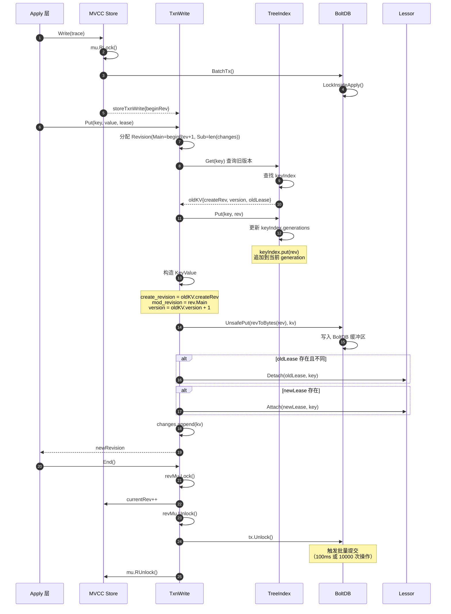

### 时序说明

**阶段一：开启写事务（1-6）**

1. Apply 层调用 `Store.Write()`
2. 加读锁 `mu.RLock()`（允许并发写）
3. 获取 `BatchTx` 并加锁
4. 创建 `storeTxnWrite` 对象，快照 `beginRev`

**阶段二：执行 Put 操作（7-19）**

1. 分配 Revision：`Main = beginRev + 1`, `Sub = len(changes)`
2. 从 TreeIndex 查询旧版本信息（create_revision, version, lease）
3. 更新 TreeIndex：追加 Revision 到 keyIndex 的当前 generation
4. 构造 KeyValue：继承 create_revision，递增 version
5. 写入 Backend：序列化后写入 BoltDB 缓冲区
6. 更新租约关联：解绑旧租约，绑定新租约
7. 记录变更到 `changes` 数组

**阶段三：提交事务（20-26）**

1. 调用 `End()`
2. 加锁 `revMu`，递增 `currentRev`
3. 解锁 `BatchTx`，触发批量提交（异步）
4. 释放所有锁

---

## 二、Range 操作完整时序

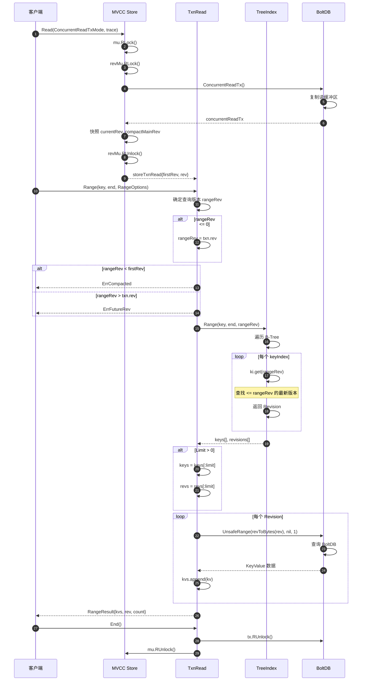

### 关键设计

**1. 版本快照**：

- 事务开启时快照 `currentRev`
- 保证事务期间读取到一致的数据

**2. 两阶段查询**：

- **阶段一**：TreeIndex 返回 Revision 列表（O(log N)）
- **阶段二**：Backend 按 Revision 读取值（O(M)，M 为结果数）

**3. 并发优化**：

- `ConcurrentReadTxMode`：复制读缓冲区，不阻塞写事务
- `SharedBufReadTxMode`：共享缓冲区，适合写事务中读取

---

## 三、Delete 操作时序

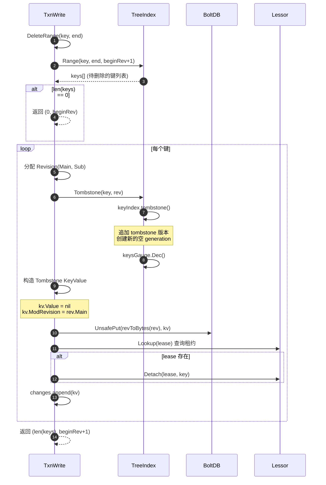

### Tombstone 机制

**目的**：标记删除而非物理删除，保留历史版本

**效果**：

1. 在当前 generation 追加 tombstone 版本
2. 创建新的空 generation
3. 递减 `keysGauge`（当前键数）
4. 写入 Backend（Value 为空）

---

## 四、Compact 操作时序

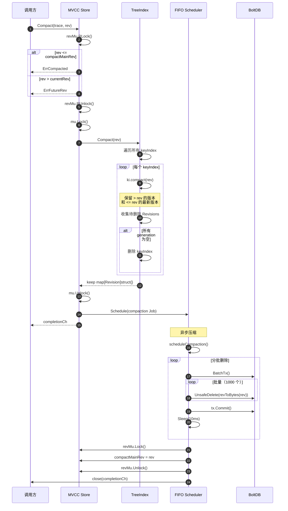

### 压缩策略

**TreeIndex 压缩**：

```
keyIndex compact(rev=5):
  Before:
    Gen 1: [4.0, 5.0(t)]
    Gen 0: [1.0, 2.0, 3.0, 4.0(t)]
  
  After:
    Gen 1: [5.0(t)]
    Gen 0: [4.0(t)]  // 保留 <= 5 的最新版本
```

**Backend 压缩**：

- 批量删除（每批 1000 个）
- 批量间隔 10ms，避免长时间持锁
- 异步执行，不阻塞读写

---

## 五、恢复时序（restore）

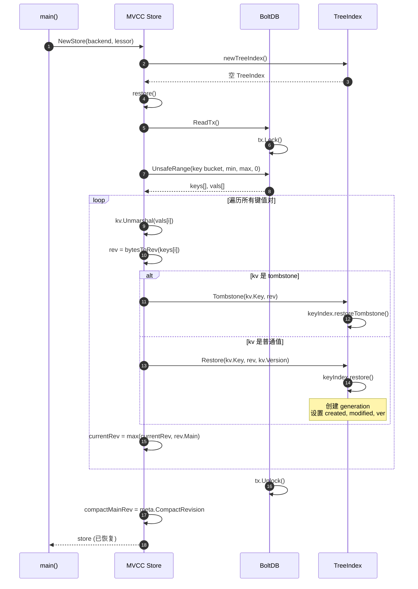

### 恢复流程

**1. 扫描 Backend**：

- 按 Revision 顺序遍历所有键值对
- O(N) 时间复杂度，N 为所有版本数

**2. 重建 TreeIndex**：

- 根据 KeyValue 的 create_revision、mod_revision、version 重建 keyIndex
- 区分 tombstone 和普通值

**3. 恢复版本号**：

- `currentRev` = 最大 Revision.Main
- `compactMainRev` = 从 meta bucket 读取

**时间估算**：

- 100 万个版本约 3-5 秒（取决于磁盘速度）

---

## 六、Watch 触发时序

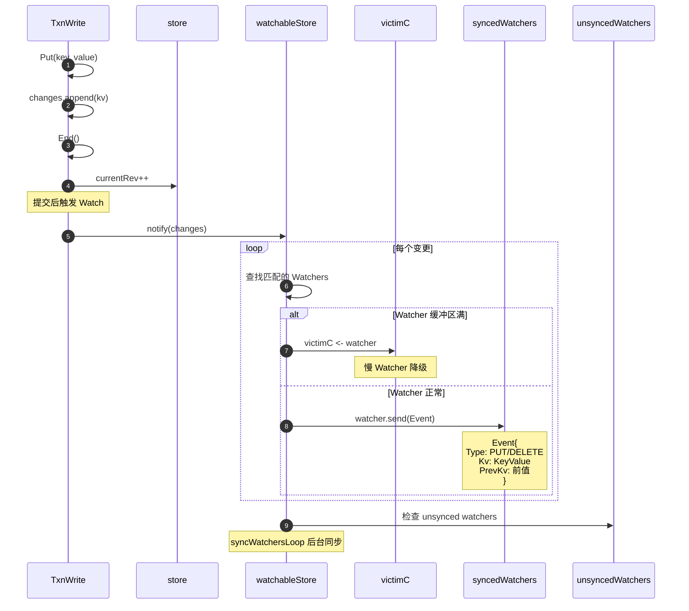

---

## 七、性能分析

### 操作复杂度

| 操作 | TreeIndex | Backend | 总计 |
|------|-----------|---------|------|
| Put | O(log N) | O(1) | O(log N) |
| Range | O(log N + M) | O(M) | O(log N + M) |
| Delete | O(log N + M) | O(M) | O(log N + M) |
| Compact | O(N) | O(K) | O(N + K) |

**说明**：

- N：键总数
- M：查询结果数
- K：待删除版本数

### 性能瓶颈

**1. TreeIndex**：

- B-Tree 查询：O(log N)
- 内存占用：100 字节/键

**2. Backend**：

- BoltDB 读取：O(M)，M 个随机读
- 批量提交：100ms 延迟

**3. 压缩**：

- 全量扫描：O(N)
- 批量删除：限流避免阻塞

---

## 八、最佳实践

### 1. 事务模式选择

```go
// 只读密集型
txn := kv.Read(ConcurrentReadTxMode, nil)

// 写事务中读取
txn := kv.Write(nil)
// 自动使用 SharedBufReadTxMode
```

### 2. 批量操作

```go
txn := kv.Write(nil)
defer txn.End()

for _, item := range items {
    txn.Put(item.Key, item.Value, lease.NoLease)
}
// 一次事务提交多个变更
```

### 3. 压缩策略

```bash
# 自动压缩
etcd --auto-compaction-mode=periodic --auto-compaction-retention=1h

# 性能调优
--auto-compaction-batch-limit=1000
--auto-compaction-sleep-interval=10ms
```

---

**文档版本**：v1.0  
**适用 etcd 版本**：v3.5+  
**生成时间**：2025-01-04

---
