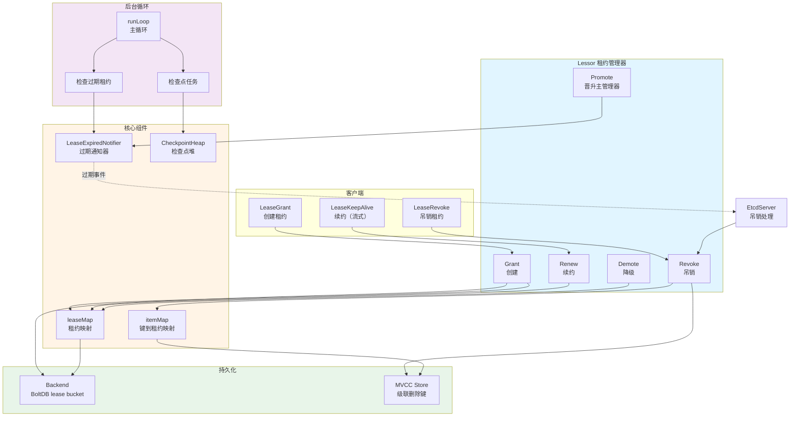
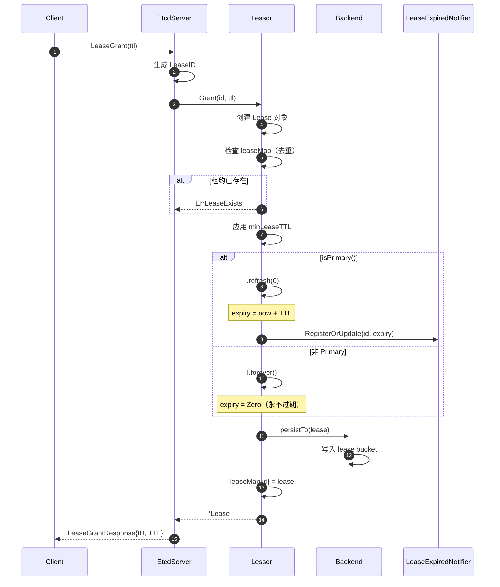
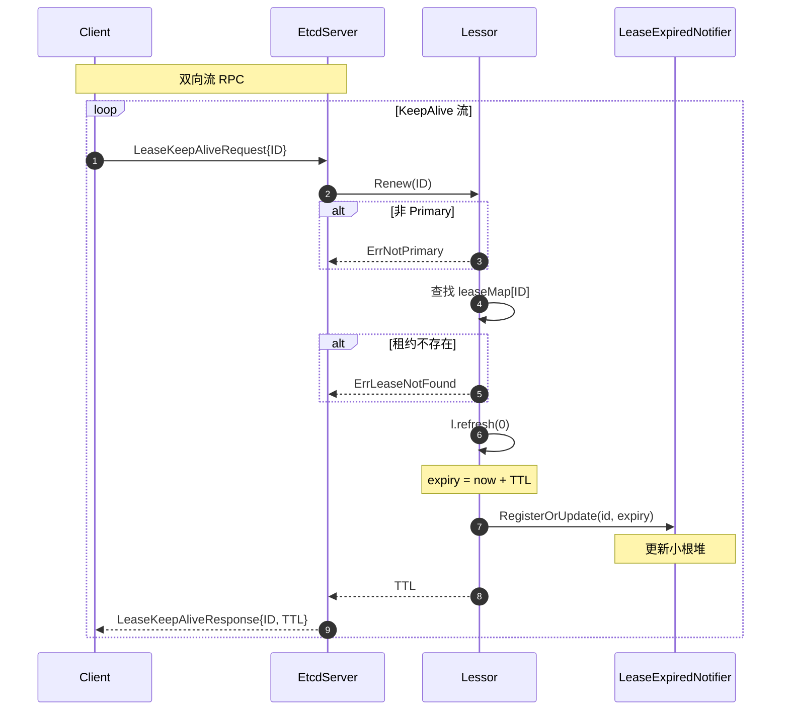
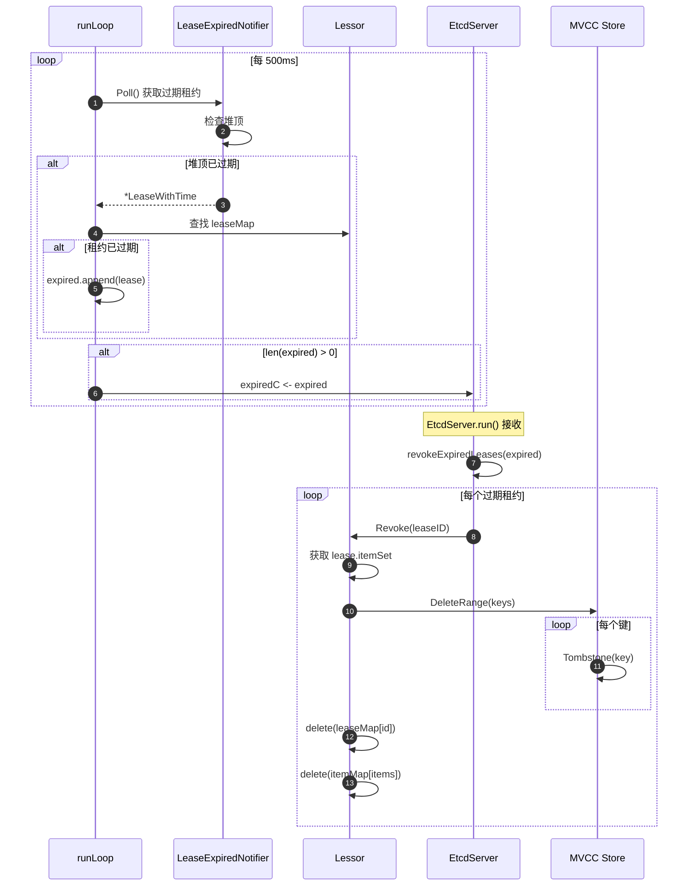
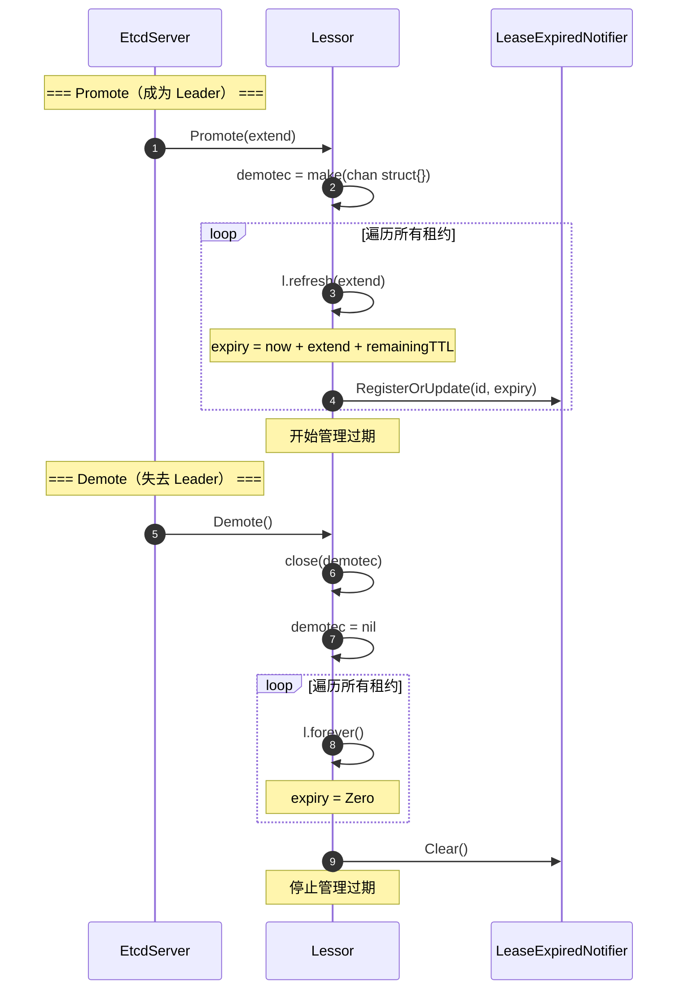
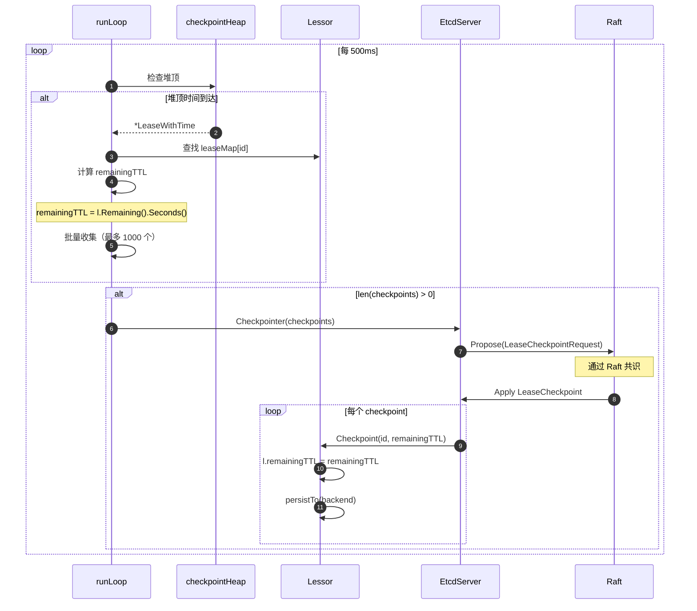

# etcd-03-Lease

## 模块概览

## 模块定位

Lease（租约）模块是 etcd 的自动过期管理系统，负责：

- 提供基于 TTL 的键值自动过期机制
- 管理租约的生命周期（创建、续约、过期、吊销）
- 支持多个键绑定到同一租约
- 实现 Leader 选举后的租约状态恢复
- 提供租约检查点（Checkpoint）机制

**源码路径**：`server/lease/`

---

## 核心概念

### 1. Lease（租约）

**定义**：一个具有过期时间的逻辑对象，可以关联多个键。

```go
type Lease struct {
    ID           LeaseID   // 租约 ID（全局唯一）
    ttl          int64     // 初始 TTL（秒）
    remainingTTL int64     // 剩余 TTL（秒，Checkpoint 用）
    expiry       time.Time // 过期时间
    itemSet      map[LeaseItem]struct{}  // 关联的键集合
}
```

**特性**：

- **TTL**：Time To Live，租约的生存时间（秒）
- **过期时间**：`expiry = now + TTL`
- **续约**：刷新过期时间，延长租约生命周期
- **级联删除**：租约过期时，所有关联的键自动删除

### 2. LeaseID

**定义**：租约的全局唯一标识符。

```go
type LeaseID int64

const NoLease = LeaseID(0)  // 表示无租约
```

**分配策略**：

- 客户端指定：`LeaseGrant(id, ttl)`
- 服务端生成：使用 `reqIDGen.Next()`（64 位单调递增）

### 3. Primary Lessor（主租约管理器）

**定义**：集群中的 Leader 节点拥有主租约管理器权限。

**职责**：

- **管理过期**：检测并吊销过期租约
- **处理续约**：接受客户端续约请求
- **Checkpoint**：定期持久化剩余 TTL

**非 Primary 节点**：

- 租约设置为 `forever`（永不过期）
- 等待成为 Leader 后 Promote

### 4. Lease Checkpoint（租约检查点）

**目的**：在 Leader 切换时保留租约的剩余 TTL。

**机制**：

- 定期（默认 5 分钟）将剩余 TTL 持久化到 Raft 日志
- Leader 切换后，新 Leader 根据 Checkpoint 恢复租约过期时间
- 避免租约在 Leader 切换后立即过期

---

## 整体架构图



### 架构说明

#### 1. 客户端接口层
- **LeaseGrant**：创建租约（指定 TTL）
- **LeaseKeepAlive**：持续续约（gRPC 双向流）
- **LeaseRevoke**：手动吊销租约

#### 2. Lessor 核心层
- **Grant**：创建租约，分配 ID，设置过期时间
- **Renew**：续约，刷新过期时间
- **Revoke**：吊销租约，删除关联的键
- **Promote**：成为 Primary，开始管理过期
- **Demote**：降级，停止管理过期

#### 3. 核心组件层
- **leaseMap**：`LeaseID → *Lease` 映射
- **itemMap**：`LeaseItem → LeaseID` 反向映射（快速查找键的租约）
- **LeaseExpiredNotifier**：基于小根堆的过期检测器
- **CheckpointHeap**：需要 Checkpoint 的租约优先队列

#### 4. 后台循环层
- **runLoop**：主循环，每 500ms 检查一次
  - 检查过期租约
  - 执行 Checkpoint 任务
- **ExpireCheck**：从 Notifier 获取过期租约，发送到 `expiredC`
- **CPCheck**：定期持久化剩余 TTL

#### 5. 持久化层
- **Backend**：持久化租约元数据（ID、TTL、RemainingTTL）
- **MVCC Store**：删除租约关联的键（级联删除）

---

## 职责边界

### 输入
- **创建租约**：LeaseGrant(id, ttl)
- **续约请求**：LeaseRenew(id)
- **吊销请求**：LeaseRevoke(id)
- **绑定键**：Attach(id, items)
- **解绑键**：Detach(id, items)

### 输出
- **过期事件**：`expiredC` channel，发送给 EtcdServer
- **租约信息**：Lookup(id) → *Lease
- **键的租约**：GetLease(item) → LeaseID

### 上下游依赖

**上游**（调用 Lessor）：

- EtcdServer Apply 层（Grant、Revoke）
- EtcdServer gRPC 层（Renew、TimeToLive）
- MVCC Store（Attach、Detach）

**下游**（Lessor 调用）：

- MVCC Store（通过 RangeDeleter 删除键）
- Backend（持久化租约）
- EtcdServer（通过 Checkpointer 提交检查点）

---

## 生命周期

### 初始化阶段（NewLessor）

```go
func NewLessor(lg *zap.Logger, b backend.Backend, cluster cluster, cfg LessorConfig) *lessor {
    // 1. 创建 Lessor 实例
    l := &lessor{
        leaseMap:             make(map[LeaseID]*Lease),
        itemMap:              make(map[LeaseItem]LeaseID),
        leaseExpiredNotifier: newLeaseExpiredNotifier(),
        leaseCheckpointHeap:  make(LeaseQueue, 0),
        b:                    b,
        minLeaseTTL:          cfg.MinLeaseTTL,
        checkpointInterval:   cfg.CheckpointInterval,  // 默认 5 分钟
        expiredC:             make(chan []*Lease, 16),
        stopC:                make(chan struct{}),
        doneC:                make(chan struct{}),
    }
    
    // 2. 从 Backend 恢复租约
    l.initAndRecover()
    
    // 3. 启动后台循环
    go l.runLoop()
    
    return l
}
```

**关键步骤**：

1. 初始化核心数据结构（leaseMap、itemMap、Notifier、Heap）
2. 从 BoltDB 恢复租约元数据
3. 启动 `runLoop` 后台循环

### 恢复阶段（initAndRecover）

```go
func (le *lessor) initAndRecover() {
    tx := le.b.BatchTx()
    tx.LockOutsideApply()
    
    // 1. 从 lease bucket 读取所有租约
    _, vs := tx.UnsafeRange(schema.Lease, int64ToBytes(0), int64ToBytes(math.MaxInt64), 0)
    
    // 2. 反序列化并恢复到内存
    for _, v := range vs {
        var lpb leasepb.Lease
        lpb.Unmarshal(v)
        
        l := NewLease(LeaseID(lpb.ID), lpb.TTL)
        l.remainingTTL = lpb.RemainingTTL
        
        // 非 Primary：设置为永不过期
        if !le.isPrimary() {
            l.forever()
        } else {
            l.refresh(0)
        }
        
        le.leaseMap[l.ID] = l
    }
    
    tx.Unlock()
    
    // 3. 从 MVCC 恢复键绑定
    if le.rd != nil {
        le.rd()  // 遍历所有键，重建 itemMap
    }
}
```

**恢复内容**：

- **租约元数据**：ID、TTL、RemainingTTL（从 Backend）
- **键绑定关系**：遍历 MVCC 所有键，根据 Lease 字段重建 itemMap

### 运行阶段（runLoop）

```go
func (le *lessor) runLoop() {
    defer close(le.doneC)
    
    for {
        select {
        case <-time.After(500 * time.Millisecond):
            // 检查过期租约
            expired := le.findExpiredLeases()
            if len(expired) > 0 {
                le.expiredC <- expired
            }
            
            // 执行 Checkpoint
            le.checkpointScheduledLeases()
            
        case <-le.stopC:
            return
        }
    }
}
```

**主循环职责**：

1. **检查过期**：每 500ms 查询 `leaseExpiredNotifier`
2. **发送过期事件**：通过 `expiredC` 通知 EtcdServer
3. **Checkpoint**：定期持久化剩余 TTL

### Promote/Demote（Leader 切换）

#### Promote - 成为 Primary

```go
func (le *lessor) Promote(extend time.Duration) {
    le.mu.Lock()
    defer le.mu.Unlock()
    
    le.demotec = make(chan struct{})
    
    // 刷新所有租约的过期时间
    for _, l := range le.leaseMap {
        l.refresh(extend)  // expiry = now + extend + remainingTTL
        
        // 注册到过期通知器
        item := &LeaseWithTime{id: l.ID, time: l.expiry}
        le.leaseExpiredNotifier.RegisterOrUpdate(item)
    }
}
```

**Promote 时机**：节点成为 Raft Leader

**Promote 操作**：

1. 打开 `demotec` channel（标记为 Primary）
2. 刷新所有租约过期时间（加上 `extend`，通常为选举超时）
3. 注册到过期通知器，开始检测过期

#### Demote - 降级

```go
func (le *lessor) Demote() {
    le.mu.Lock()
    defer le.mu.Unlock()
    
    if le.demotec == nil {
        return
    }
    
    close(le.demotec)
    le.demotec = nil
    
    // 设置所有租约为永不过期
    for _, l := range le.leaseMap {
        l.forever()
    }
    
    // 清空过期通知器
    le.leaseExpiredNotifier.Clear()
    le.leaseCheckpointHeap = make(LeaseQueue, 0)
}
```

**Demote 时机**：节点失去 Raft Leader 身份

**Demote 操作**：

1. 关闭 `demotec` channel（标记为非 Primary）
2. 所有租约设置为永不过期
3. 清空过期通知器和检查点堆

### 停止阶段（Stop）

```go
func (le *lessor) Stop() {
    close(le.stopC)
    <-le.doneC  // 等待 runLoop 退出
}
```

---

## 核心数据结构

### lessor 结构体

```go
type lessor struct {
    mu sync.RWMutex
    
    demotec chan struct{}  // 非 nil 表示 Primary
    
    leaseMap             map[LeaseID]*Lease     // 租约映射
    leaseExpiredNotifier *LeaseExpiredNotifier  // 过期通知器
    leaseCheckpointHeap  LeaseQueue             // 检查点堆
    itemMap              map[LeaseItem]LeaseID  // 键到租约映射
    
    rd RangeDeleter  // 删除键的回调
    cp Checkpointer  // Checkpoint 的回调
    
    b backend.Backend  // 持久化后端
    
    minLeaseTTL         int64  // 最小 TTL（默认 5 秒）
    leaseRevokeRate     int    // 吊销速率限制（默认 1000/秒）
    checkpointInterval  time.Duration  // Checkpoint 间隔（默认 5 分钟）
    
    expiredC chan []*Lease  // 过期租约通道
    stopC    chan struct{}  // 停止信号
    doneC    chan struct{}  // 完成信号
}
```

### Lease 结构体

```go
type Lease struct {
    ID           LeaseID
    ttl          int64     // 初始 TTL（秒）
    remainingTTL int64     // 剩余 TTL（Checkpoint 用）
    
    expiryMu sync.RWMutex
    expiry   time.Time  // 过期时间（Zero 表示永不过期）
    
    mu      sync.RWMutex
    itemSet map[LeaseItem]struct{}  // 关联的键集合
    
    revokec chan struct{}  // 吊销信号
}
```

### LeaseExpiredNotifier（过期通知器）

**实现**：基于小根堆（`container/heap`）

```go
type LeaseExpiredNotifier struct {
    m     sync.RWMutex
    queue LeaseQueue  // 小根堆（按 expiry 排序）
}

type LeaseWithTime struct {
    id   LeaseID
    time time.Time  // 过期时间
}
```

**核心方法**：

```go
// RegisterOrUpdate 注册或更新租约
func (lem *LeaseExpiredNotifier) RegisterOrUpdate(item *LeaseWithTime)

// Poll 获取已过期的租约
func (lem *LeaseExpiredNotifier) Poll() *LeaseWithTime
```

---

## 核心算法与流程

### 1. 过期检测算法

**目的**：高效检测过期租约

**数据结构**：小根堆（按过期时间排序）

**算法**：

```go
func (le *lessor) findExpiredLeases() []*Lease {
    le.mu.RLock()
    defer le.mu.RUnlock()
    
    if !le.isPrimary() {
        return nil
    }
    
    // 从小根堆中提取所有过期租约
    var expired []*Lease
    for {
        item := le.leaseExpiredNotifier.Poll()
        if item == nil || item.time.After(time.Now()) {
            break
        }
        
        l := le.leaseMap[item.id]
        if l != nil && l.expired() {
            expired = append(expired, l)
        }
    }
    
    return expired
}
```

**时间复杂度**：O(K log N)，K 为过期租约数，N 为总租约数

### 2. Checkpoint 机制

**目的**：持久化剩余 TTL，避免 Leader 切换后租约立即过期

**触发条件**：

- 定期触发：每 5 分钟
- 租约续约后：调度下次 Checkpoint

**算法**：

```go
func (le *lessor) checkpointScheduledLeases() {
    le.mu.RLock()
    
    // 从堆中取出需要 Checkpoint 的租约
    var cps []LeaseCheckpoint
    for le.leaseCheckpointHeap.Len() > 0 {
        item := heap.Pop(&le.leaseCheckpointHeap).(*LeaseWithTime)
        
        if item.time.After(time.Now()) {
            heap.Push(&le.leaseCheckpointHeap, item)
            break
        }
        
        l := le.leaseMap[item.id]
        if l != nil {
            cps = append(cps, LeaseCheckpoint{
                ID:           l.ID,
                RemainingTTL: int64(l.Remaining().Seconds()),
            })
        }
        
        if len(cps) >= maxLeaseCheckpointBatchSize {
            break
        }
    }
    le.mu.RUnlock()
    
    // 通过 Raft 提交 Checkpoint
    if len(cps) > 0 {
        le.cp(context.Background(), &pb.LeaseCheckpointRequest{Checkpoints: cps})
    }
}
```

---

## 配置与可观测

### 关键配置项

| 配置项 | 默认值 | 说明 |
|--------|--------|------|
| `MinLeaseTTL` | 5 秒 | 最小租约 TTL |
| `CheckpointInterval` | 5 分钟 | Checkpoint 间隔 |
| `ExpiredLeasesRetryInterval` | 3 秒 | 过期重试间隔 |
| `leaseRevokeRate` | 1000/秒 | 吊销速率限制 |

### 关键监控指标

- `etcd_debugging_lease_granted_total`：已创建租约总数
- `etcd_debugging_lease_revoked_total`：已吊销租约总数
- `etcd_debugging_lease_renewed_total`：已续约总数
- `etcd_debugging_lease_ttl_total`：租约 TTL 分布

---

## 最佳实践

### 1. 合理设置 TTL

```bash
# 推荐：10-60 秒
etcdctl lease grant 30

# 避免：过短的 TTL（增加续约开销）
etcdctl lease grant 1  # 不推荐
```

### 2. 使用 KeepAlive 自动续约

```go
leaseResp, _ := cli.Grant(ctx, 10)
ch, _ := cli.KeepAlive(ctx, leaseResp.ID)

go func() {
    for ka := range ch {
        log.Printf("KeepAlive: TTL=%d", ka.TTL)
    }
}()
```

### 3. 监控租约数量

```promql
# 当前租约数
etcd_debugging_lease_granted_total - etcd_debugging_lease_revoked_total

# 告警：> 10000
```

---

**文档版本**：v1.0  
**适用 etcd 版本**：v3.5+  
**生成时间**：2025-01-04

---

## API接口

## API 概览

| API 类别 | 接口名称 | 说明 |
|---------|---------|------|
| **租约管理** | Grant, Revoke | 创建、吊销租约 |
| **续约** | Renew | 刷新租约过期时间 |
| **绑定** | Attach, Detach | 键与租约的绑定/解绑 |
| **查询** | Lookup, Leases, GetLease | 查询租约信息 |
| **生命周期** | Promote, Demote | Primary 晋升/降级 |
| **Checkpoint** | Checkpoint | 持久化剩余 TTL |

---

## 一、租约管理 API

### 1.1 Grant - 创建租约

#### 接口定义

```go
func (le *lessor) Grant(id LeaseID, ttl int64) (*Lease, error)
```

#### 参数

| 参数 | 类型 | 说明 |
|------|------|------|
| `id` | `LeaseID` | 租约 ID（0 表示自动分配） |
| `ttl` | `int64` | 生存时间（秒） |

#### 返回值

- **\*Lease**：创建的租约对象
- **error**：错误（ErrLeaseExists / ErrLeaseTTLTooLarge）

#### 核心实现

```go
func (le *lessor) Grant(id LeaseID, ttl int64) (*Lease, error) {
    // 1. 验证参数
    if id == NoLease {
        return nil, ErrLeaseNotFound
    }
    if ttl > MaxLeaseTTL {
        return nil, ErrLeaseTTLTooLarge
    }
    
    // 2. 创建 Lease 对象
    l := NewLease(id, ttl)
    
    le.mu.Lock()
    defer le.mu.Unlock()
    
    // 3. 检查重复
    if _, ok := le.leaseMap[id]; ok {
        return nil, ErrLeaseExists
    }
    
    // 4. 应用最小 TTL
    if l.ttl < le.minLeaseTTL {
        l.ttl = le.minLeaseTTL
    }
    
    // 5. 设置过期时间
    if le.isPrimary() {
        l.refresh(0)  // expiry = now + TTL
    } else {
        l.forever()   // expiry = Zero（永不过期）
    }
    
    // 6. 持久化
    le.leaseMap[id] = l
    l.persistTo(le.b)
    
    // 7. 注册过期通知（仅 Primary）
    if le.isPrimary() {
        item := &LeaseWithTime{id: l.ID, time: l.expiry}
        le.leaseExpiredNotifier.RegisterOrUpdate(item)
        le.scheduleCheckpointIfNeeded(l)
    }
    
    return l, nil
}
```

---

### 1.2 Revoke - 吊销租约

#### 接口定义

```go
func (le *lessor) Revoke(id LeaseID) error
```

#### 核心实现

```go
func (le *lessor) Revoke(id LeaseID) error {
    le.mu.Lock()
    
    l := le.leaseMap[id]
    if l == nil {
        le.mu.Unlock()
        return ErrLeaseNotFound
    }
    
    // 1. 删除租约
    delete(le.leaseMap, id)
    
    // 2. 删除键绑定
    for item := range l.itemSet {
        delete(le.itemMap, item)
    }
    
    le.mu.Unlock()
    
    // 3. 级联删除键
    if le.rd != nil {
        txn := le.rd()
        for item := range l.itemSet {
            txn.DeleteRange([]byte(item.Key), nil)
        }
        txn.End()
    }
    
    // 4. 从 Backend 删除
    le.b.BatchTx().UnsafeDelete(schema.Lease, int64ToBytes(int64(id)))
    
    return nil
}
```

---

## 二、续约 API

### 2.1 Renew - 续约

#### 接口定义

```go
func (le *lessor) Renew(id LeaseID) (int64, error)
```

#### 返回值

- **int64**：续约后的 TTL（秒）
- **error**：错误

#### 核心实现

```go
func (le *lessor) Renew(id LeaseID) (int64, error) {
    le.mu.Lock()
    defer le.mu.Unlock()
    
    if !le.isPrimary() {
        return -1, ErrNotPrimary
    }
    
    l := le.leaseMap[id]
    if l == nil {
        return -1, ErrLeaseNotFound
    }
    
    // 刷新过期时间
    l.refresh(0)
    
    // 更新过期通知器
    item := &LeaseWithTime{id: l.ID, time: l.expiry}
    le.leaseExpiredNotifier.RegisterOrUpdate(item)
    
    // 调度 Checkpoint
    le.scheduleCheckpointIfNeeded(l)
    
    return l.ttl, nil
}
```

---

## 三、绑定 API

### 3.1 Attach - 绑定键

#### 接口定义

```go
func (le *lessor) Attach(id LeaseID, items []LeaseItem) error
```

#### 核心实现

```go
func (le *lessor) Attach(id LeaseID, items []LeaseItem) error {
    le.mu.Lock()
    defer le.mu.Unlock()
    
    l := le.leaseMap[id]
    if l == nil {
        return ErrLeaseNotFound
    }
    
    for _, item := range items {
        l.itemSet[item] = struct{}{}
        le.itemMap[item] = id
    }
    
    return nil
}
```

### 3.2 Detach - 解绑键

```go
func (le *lessor) Detach(id LeaseID, items []LeaseItem) error {
    le.mu.Lock()
    defer le.mu.Unlock()
    
    l := le.leaseMap[id]
    if l == nil {
        return ErrLeaseNotFound
    }
    
    for _, item := range items {
        delete(l.itemSet, item)
        delete(le.itemMap, item)
    }
    
    return nil
}
```

---

## 四、Checkpoint API

### 4.1 Checkpoint - 持久化剩余 TTL

#### 接口定义

```go
func (le *lessor) Checkpoint(id LeaseID, remainingTTL int64) error
```

#### 核心实现

```go
func (le *lessor) Checkpoint(id LeaseID, remainingTTL int64) error {
    le.mu.Lock()
    defer le.mu.Unlock()
    
    l := le.leaseMap[id]
    if l == nil {
        return ErrLeaseNotFound
    }
    
    // 更新 remainingTTL
    l.remainingTTL = remainingTTL
    
    // 持久化
    l.persistTo(le.b)
    
    return nil
}
```

---

## 五、最佳实践

### 1. 租约复用

```go
// 多个键使用同一租约
leaseResp, _ := cli.Grant(ctx, 30)

cli.Put(ctx, "key1", "value1", clientv3.WithLease(leaseResp.ID))
cli.Put(ctx, "key2", "value2", clientv3.WithLease(leaseResp.ID))
cli.Put(ctx, "key3", "value3", clientv3.WithLease(leaseResp.ID))
```

### 2. 自动续约

```go
ch, _ := cli.KeepAlive(ctx, leaseResp.ID)
for ka := range ch {
    // 自动续约
}
```

---

**文档版本**：v1.0  
**生成时间**：2025-01-04

---

## 数据结构

## UML 类图

```mermaid
classDiagram
    class lessor {
        +mu sync.RWMutex
        +demotec chan struct{}
        +leaseMap map~LeaseID~*Lease
        +itemMap map~LeaseItem~LeaseID
        +leaseExpiredNotifier *LeaseExpiredNotifier
        +leaseCheckpointHeap LeaseQueue
        +Grant()
        +Revoke()
        +Renew()
        +Promote()
        +Demote()
    }

    class Lease {
        +ID LeaseID
        +ttl int64
        +remainingTTL int64
        +expiry time.Time
        +itemSet map~LeaseItem~struct{}
        +refresh()
        +forever()
        +expired()
    }

    class LeaseExpiredNotifier {
        +m sync.RWMutex
        +queue LeaseQueue
        +RegisterOrUpdate()
        +Poll()
    }

    class LeaseQueue {
        <<heap>>
        +Len()
        +Less()
        +Swap()
        +Push()
        +Pop()
    }

    lessor --> Lease : 管理
    lessor --> LeaseExpiredNotifier : 使用
    lessor --> LeaseQueue : checkpointHeap
    LeaseExpiredNotifier --> LeaseQueue : 小根堆
```

---

## lessor 结构体

```go
type lessor struct {
    mu sync.RWMutex
    demotec chan struct{}
    leaseMap map[LeaseID]*Lease
    leaseExpiredNotifier *LeaseExpiredNotifier
    leaseCheckpointHeap LeaseQueue
    itemMap map[LeaseItem]LeaseID
    rd RangeDeleter
    cp Checkpointer
    b backend.Backend
    minLeaseTTL int64
    leaseRevokeRate int
    expiredC chan []*Lease
    stopC chan struct{}
    doneC chan struct{}
    lg *zap.Logger
    checkpointInterval time.Duration
    expiredLeaseRetryInterval time.Duration
    checkpointPersist bool
    cluster cluster
}
```

---

## Lease 结构体

```go
type Lease struct {
    ID LeaseID
    ttl int64
    remainingTTL int64
    expiryMu sync.RWMutex
    expiry time.Time
    mu sync.RWMutex
    itemSet map[LeaseItem]struct{}
    revokec chan struct{}
}
```

---

## LeaseExpiredNotifier

```go
type LeaseExpiredNotifier struct {
    m sync.RWMutex
    queue LeaseQueue
}

type LeaseWithTime struct {
    id LeaseID
    time time.Time
}

// 小根堆实现
type LeaseQueue []*LeaseWithTime

func (pq LeaseQueue) Len() int { return len(pq) }
func (pq LeaseQueue) Less(i, j int) bool {
    return pq[i].time.Before(pq[j].time)
}
func (pq LeaseQueue) Swap(i, j int) { pq[i], pq[j] = pq[j], pq[i] }
```

---

**文档版本**：v1.0  
**生成时间**：2025-01-04

---

## 时序图

## 一、LeaseGrant 创建租约



---

## 二、LeaseKeepAlive 续约



---

## 三、租约过期与吊销



---

## 四、Promote/Demote（Leader 切换）



---

## 五、Checkpoint 机制



---

**文档版本**：v1.0  
**生成时间**：2025-01-04

---
