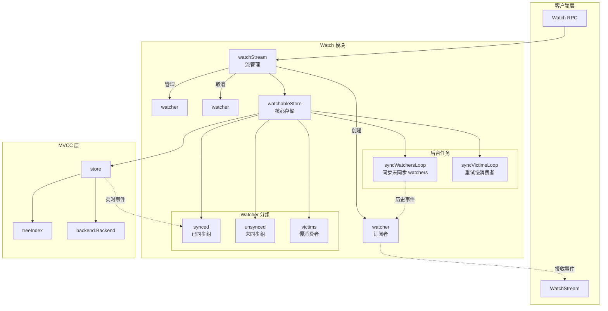
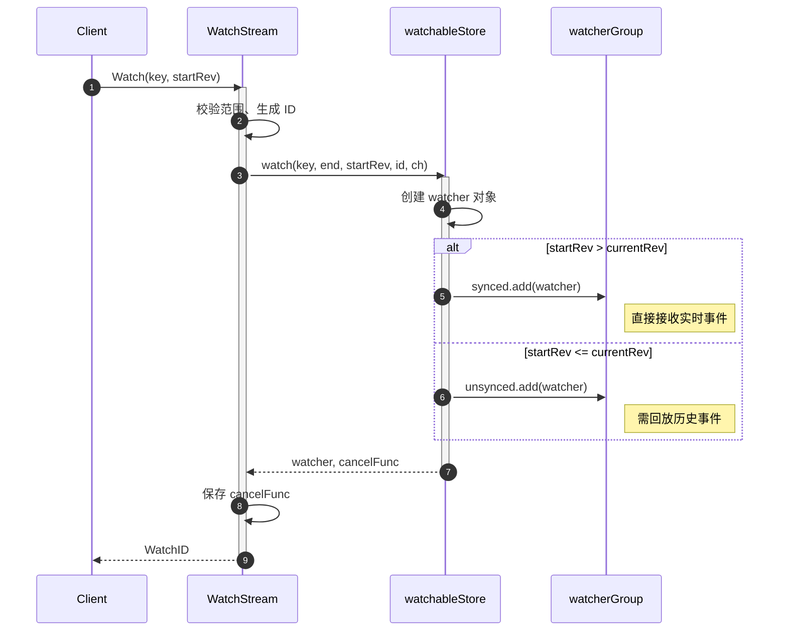
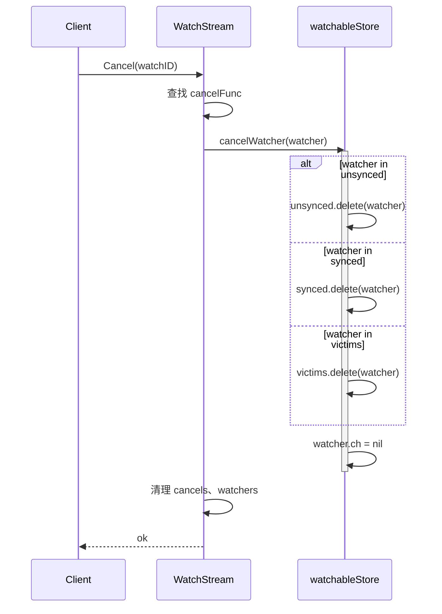
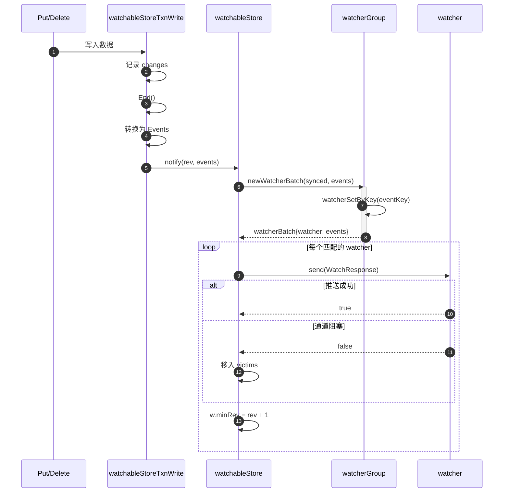
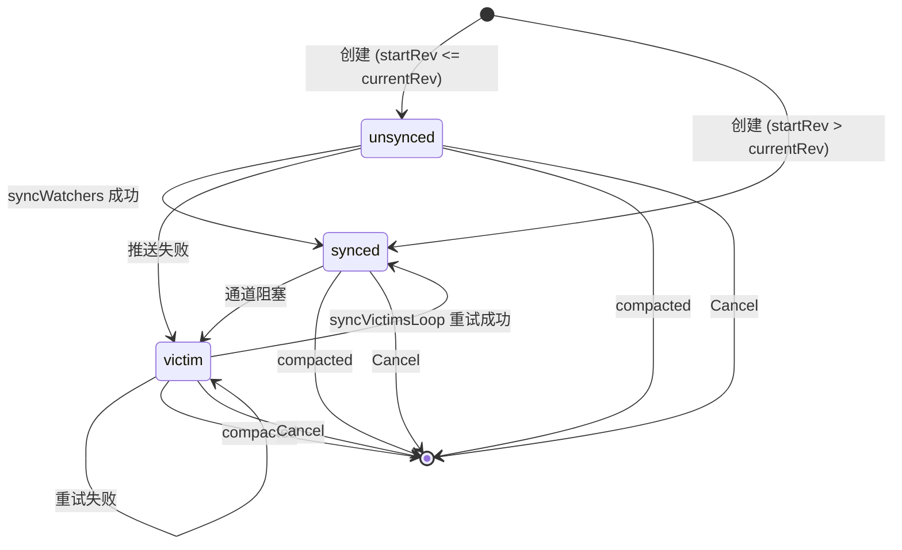
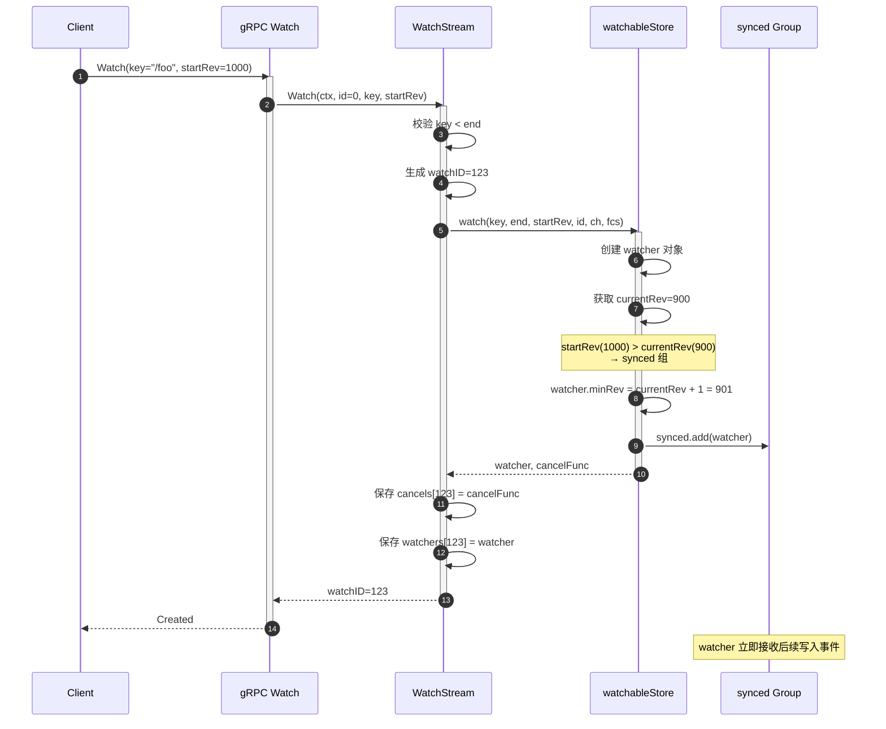
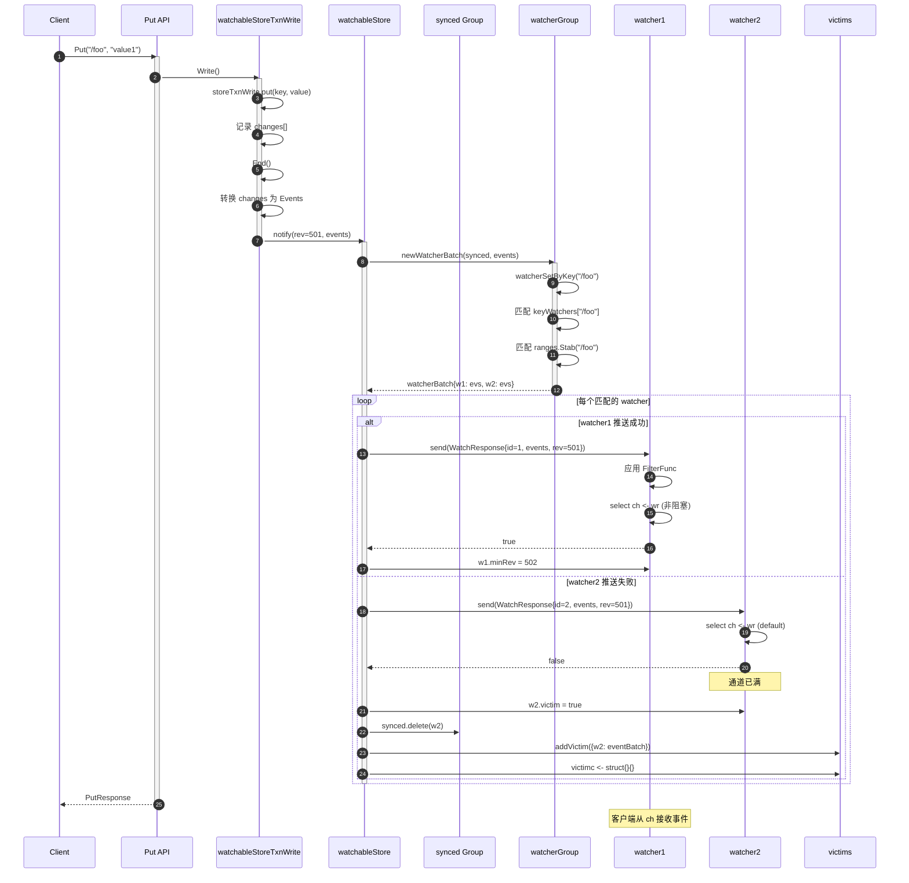
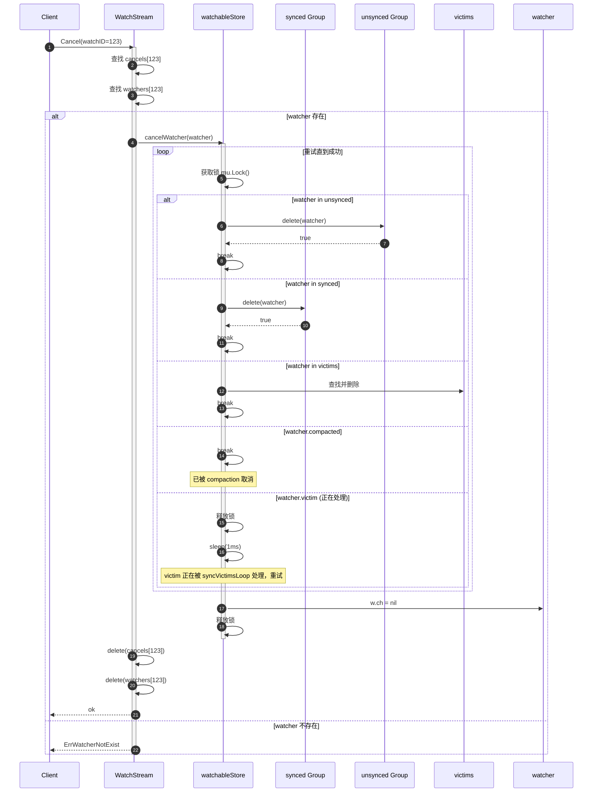

# etcd-04-Watch

## 模块概览

## 摘要

Watch 模块是 etcd 实现分布式事件监听的核心机制，允许客户端订阅 KV 数据变化并实时接收事件通知。该模块基于 MVCC 存储层实现，支持历史版本回溯、范围监听、事件过滤等功能，是 etcd 构建分布式协调能力的基石。

**模块职责**

- 管理客户端的 Watch 订阅请求
- 维护 Watcher 生命周期（创建、同步、取消）
- 将 MVCC 数据变更事件分发给订阅的 Watchers
- 处理慢速消费者（Victim 机制）
- 支持历史事件回放与实时事件推送

**运行环境**

- 位置：`server/storage/mvcc`
- 依赖：MVCC 存储、Backend、事件过滤器
- 并发模型：异步事件分发 + 双 Goroutine（syncWatchersLoop、syncVictimsLoop）

---

## 1. 模块架构图



**图解与要点**

1. **组件职责**
   - `watchableStore`：Watch 模块核心，继承 MVCC `store`，增加 Watch 能力
   - `watchStream`：管理单个客户端连接的 Watch 流，统一事件分发通道
   - `watcher`：单个 Watch 订阅实例，记录 key 范围、起始版本、事件过滤器
   - `watcherGroup`：Watcher 集合，按 key 分组优化事件匹配

2. **数据流**
   - **订阅流程**：Client → WatchStream → watchableStore → 加入 synced/unsynced 组
   - **事件流程**：MVCC 写入 → notify() → 匹配 synced 组 → 推送到 watcher.ch → 客户端接收
   - **历史回放**：unsynced watcher → syncWatchersLoop → 从 backend 读取历史事件 → 同步后转入 synced

3. **Watcher 状态机**

```
   创建 → unsynced（需回放历史）
             ↓ syncWatchersLoop
         synced（实时接收）
             ↓ 慢消费
         victim（缓冲阻塞）
             ↓ syncVictimsLoop
         恢复 → synced 或 取消
```

4. **并发控制**
   - `watchableStore.mu`：保护 watcher 分组（synced/unsynced/victims）
   - `store.revMu`：保护 currentRev，避免与 MVCC 锁冲突
   - 锁顺序：`store.mu` → `watchableStore.mu`（防止死锁）

5. **性能优化**
   - **批量同步**：`maxWatchersPerSync=512`，限制每次同步 watcher 数量
   - **事件缓冲**：`chanBufLen=128`，watcher 通道缓冲减少阻塞
   - **Victim 隔离**：慢消费者移出 synced 组，避免影响正常 watchers
   - **IntervalTree**：范围 watch 使用区间树快速匹配事件

---

## 2. 核心组件

### 2.1 watchableStore

```go
type watchableStore struct {
    *store  // 继承 MVCC store

    mu sync.RWMutex
    
    victims []watcherBatch  // 慢消费者批次
    victimc chan struct{}   // 通知 victim 处理

    unsynced watcherGroup   // 需要回放历史事件的 watchers
    synced   watcherGroup   // 已同步，接收实时事件

    stopc chan struct{}
    wg    sync.WaitGroup
}
```

**关键方法**

- `New()`：创建 watchableStore，启动 syncWatchersLoop 和 syncVictimsLoop
- `watch()`：注册新 watcher，根据 startRev 决定放入 synced/unsynced
- `notify()`：MVCC 写入后调用，将事件推送给匹配的 synced watchers
- `syncWatchersLoop()`：后台循环，同步 unsynced watchers 的历史事件
- `syncVictimsLoop()`：后台循环，重试 victim watchers 的事件推送

### 2.2 watcher

```go
type watcher struct {
    key []byte        // 监听 key
    end []byte        // 范围结束，nil 表示单 key
    
    victim    bool    // 是否因慢消费被标记
    compacted bool    // 是否因 compaction 取消
    restore   bool    // 是否从 leader 快照恢复

    startRev int64    // 起始 revision
    minRev   int64    // 下次接收的最小 revision
    id       WatchID  // 唯一标识

    fcs []FilterFunc  // 事件过滤器
    ch  chan<- WatchResponse  // 事件推送通道
}
```

**状态字段**

- `startRev`：客户端请求的起始版本，用于历史回放
- `minRev`：已推送事件的最大版本+1，防止重复推送
- `victim`：标记慢消费者，移出 synced 组
- `compacted`：监听的 revision 已被压缩，watcher 取消

### 2.3 watcherGroup

```go
type watcherGroup struct {
    keyWatchers watcherSetByKey      // 单 key watchers
    ranges      adt.IntervalTree      // 范围 watchers（区间树）
    watchers    watcherSet            // 所有 watchers
}
```

**设计要点**

- **单 key 优化**：`keyWatchers` 使用 map，O(1) 查找
- **范围查询**：`ranges` 使用区间树，O(log N + k) 匹配重叠区间
- **事件匹配**：`watcherSetByKey()` 合并单 key 和范围 watchers

---

## 3. 核心算法

### 3.1 创建 Watcher

```go
func (s *watchableStore) watch(key, end []byte, startRev int64, id WatchID,
    ch chan<- WatchResponse, fcs ...FilterFunc) (*watcher, cancelFunc) {
    
    wa := &watcher{
        key: key, end: end, startRev: startRev, minRev: startRev,
        id: id, ch: ch, fcs: fcs,
    }

    s.mu.Lock()
    s.revMu.RLock()
    
    // 判断是否需要历史回放
    synced := startRev > s.store.currentRev || startRev == 0
    if synced {
        wa.minRev = s.store.currentRev + 1
        if startRev > wa.minRev {
            wa.minRev = startRev
        }
        s.synced.add(wa)
    } else {
        s.unsynced.add(wa)  // 需要回放历史
    }
    
    s.revMu.RUnlock()
    s.mu.Unlock()

    return wa, func() { s.cancelWatcher(wa) }
}
```

**逻辑说明**

1. **同步判断**：`startRev > currentRev` 或 `startRev == 0`，直接进入 synced
2. **历史回放**：`startRev <= currentRev`，进入 unsynced，等待 syncWatchersLoop 处理
3. **minRev 维护**：确保不重复推送事件

### 3.2 事件通知（实时）

```go
func (s *watchableStore) notify(rev int64, evs []mvccpb.Event) {
    victim := make(watcherBatch)
    
    for w, eb := range newWatcherBatch(&s.synced, evs) {
        if w.send(WatchResponse{WatchID: w.id, Events: eb.evs, Revision: rev}) {
            // 推送成功
        } else {
            // 通道阻塞，标记为 victim
            w.victim = true
            victim[w] = eb
            s.synced.delete(w)
        }
        w.minRev = rev + 1
    }
    
    s.addVictim(victim)
}
```

**流程**

1. `newWatcherBatch()` 匹配事件到 synced watchers
2. 非阻塞推送到 `w.ch`
3. 推送失败的 watcher 移入 victims 组，等待 syncVictimsLoop 重试

### 3.3 同步未同步 Watchers

```go
func (s *watchableStore) syncWatchersLoop() {
    defer s.wg.Done()
    
    ticker := time.NewTicker(100 * time.Millisecond)
    defer ticker.Stop()
    
    for {
        select {
        case <-ticker.C:
            s.mu.Lock()
            s.syncWatchers()  // 批量同步
            s.mu.Unlock()
        case <-s.stopc:
            return
        }
    }
}

func (s *watchableStore) syncWatchers() int {
    s.revMu.RLock()
    curRev := s.store.currentRev
    compactRev := s.store.compactMainRev
    s.revMu.RUnlock()
    
    wg, minRev := s.unsynced.choose(maxWatchersPerSync, curRev, compactRev)
    
    // 从 backend 读取 [minRev, curRev] 的事件
    tx := s.store.b.ReadTx()
    revs, vs := tx.UnsafeRange(schema.Key, minRev, curRev+1, 0)
    evs := kvsToEvents(revs, vs)
    
    // 推送给各 watcher
    wb := newWatcherBatch(wg, evs)
    for w, eb := range wb {
        if w.send(...) {
            s.unsynced.delete(w)
            s.synced.add(w)  // 转为 synced
        }
    }
    
    return s.unsynced.size()
}
```

**要点**

- 每 100ms 触发一次
- 批量处理 `maxWatchersPerSync` 个 watchers
- 从 backend 读取历史事件，推送并转入 synced

### 3.4 Victim 重试

```go
func (s *watchableStore) syncVictimsLoop() {
    defer s.wg.Done()
    
    for {
        select {
        case <-s.victimc:
            s.mu.Lock()
            victims := s.victims
            s.victims = nil
            s.mu.Unlock()
            
            for _, victim := range victims {
                for w, eb := range victim {
                    if w.send(WatchResponse{...}) {
                        w.victim = false
                        s.synced.add(w)
                    } else {
                        s.addVictim(watcherBatch{w: eb})
                    }
                }
            }
        case <-s.stopc:
            return
        }
    }
}
```

**机制**

- 非阻塞重试，推送成功则恢复到 synced
- 仍失败则重新加入 victims

---

## 4. 生命周期

### 4.1 初始化

```go
func New(lg *zap.Logger, b backend.Backend, le lease.Lessor, cfg StoreConfig) WatchableKV {
    s := newWatchableStore(lg, b, le, cfg)
    s.wg.Add(2)
    go s.syncWatchersLoop()
    go s.syncVictimsLoop()
    return s
}
```

### 4.2 运行时

- **客户端订阅**：`WatchStream.Watch()` → `watchableStore.watch()` → 加入 watcher 组
- **MVCC 写入**：`Put/Delete` → `notify()` → 推送事件
- **后台同步**：syncWatchersLoop 处理 unsynced，syncVictimsLoop 处理 victims

### 4.3 关闭

```go
func (s *watchableStore) Close() error {
    close(s.stopc)  // 通知后台 goroutines 退出
    s.wg.Wait()
    return s.store.Close()
}
```

---

## 5. 配置参数

| 参数 | 默认值 | 说明 |
|------|--------|------|
| `chanBufLen` | 128 | Watcher 通道缓冲大小 |
| `maxWatchersPerSync` | 512 | 每次批量同步的 watcher 数量 |
| `watchResyncPeriod` | 100ms | 同步 unsynced watchers 的间隔 |
| `watchBatchMaxRevs` | 1000 | 单批次最大 revision 数 |

**调优建议**

- **高并发订阅**：增大 `maxWatchersPerSync`，减少同步延迟
- **大量历史事件**：调整 `watchBatchMaxRevs`，避免单次推送过多事件
- **慢消费者**：监控 `slowWatcherGauge`，优化客户端处理速度

---

## 6. 监控指标

- `etcd_mvcc_watcher_total`：当前 watcher 总数
- `etcd_mvcc_slow_watcher_total`：慢消费者（unsynced + victim）数量
- `etcd_mvcc_watch_stream_total`：活跃 WatchStream 数量
- `etcd_mvcc_pending_events_total`：待推送事件数

---

## 7. 最佳实践

1. **避免大范围 Watch**：范围越大，事件匹配开销越高
2. **使用事件过滤器**：减少客户端接收的无关事件
3. **及时取消 Watch**：避免资源泄漏
4. **监控慢消费者**：及时发现客户端处理瓶颈
5. **Compaction 策略**：定期压缩避免 watcher 历史回放过多事件

---

## 8. 与其他模块的交互

- **MVCC**：继承 `store`，在 `Put/Delete` 后调用 `notify()`
- **Lease**：Lease 过期时触发 key 删除事件
- **gRPC**：`server/etcdserver/api/v3rpc/watch.go` 封装为 gRPC Watch 服务
- **Client**：`client/v3` 提供客户端 Watch API

---

## API接口

## 摘要

本文档详细说明 Watch 模块的内部 API，包括 WatchStream 接口、watchableStore 核心方法、watcher 生命周期管理等。每个 API 包含请求/响应结构、核心实现代码、调用链路和时序图。

---

## 1. WatchStream 接口

### 1.1 Watch - 创建 Watcher

#### 基本信息
- 名称：`WatchStream.Watch`
- 方法签名：`Watch(ctx context.Context, id WatchID, key, end []byte, startRev int64, fcs ...FilterFunc) (WatchID, error)`
- 功能：在 WatchStream 上创建一个新的 watcher，订阅指定 key 或范围的变更

#### 请求参数

```go
type WatchRequest struct {
    ctx      context.Context  // 取消上下文
    id       WatchID          // 客户端指定 ID，0 表示自动生成
    key      []byte           // 监听 key
    end      []byte           // 范围结束（空表示单 key）
    startRev int64            // 起始 revision，0 表示从当前开始
    fcs      []FilterFunc     // 事件过滤器
}
```

**字段表**

| 字段 | 类型 | 必填 | 约束 | 说明 |
|------|------|:----:|------|------|
| ctx | context.Context | 是 | - | 用于取消 watch |
| id | WatchID | 否 | ≥0，0=自动生成 | watcher 唯一标识 |
| key | []byte | 是 | 非空 | 监听的 key |
| end | []byte | 否 | 空或 > key | 范围 watch 的结束 key |
| startRev | int64 | 否 | ≥0 | 起始版本，0=从当前 |
| fcs | []FilterFunc | 否 | - | 事件过滤器函数 |

#### 响应结构

```go
type WatchResponse struct {
    watchID WatchID  // 返回的 watcher ID
    error   error    // 错误（如范围非法）
}
```

#### 核心实现

```go
// 位置：server/storage/mvcc/watcher.go
func (ws *watchStream) Watch(ctx context.Context, id WatchID, key, end []byte,
    startRev int64, fcs ...FilterFunc) (WatchID, error) {
    
    // 校验范围合法性
    if len(end) != 0 && bytes.Compare(key, end) != -1 {
        return -1, ErrEmptyWatcherRange
    }

    ws.mu.Lock()
    defer ws.mu.Unlock()
    
    if ws.closed {
        return -1, ErrEmptyWatcherRange
    }

    // 自动生成 ID
    if id == clientv3.AutoWatchID {
        for ws.watchers[ws.nextID] != nil {
            ws.nextID++
        }
        id = ws.nextID
        ws.nextID++
    } else if _, ok := ws.watchers[id]; ok {
        return -1, ErrWatcherDuplicateID
    }

    // 调用 watchableStore.watch 创建 watcher
    w, c := ws.watchable.watch(key, end, startRev, id, ws.ch, fcs...)

    ws.cancels[id] = c
    ws.watchers[id] = w
    return id, nil
}
```

**逻辑说明**

1. 校验 key 范围（key < end）
2. 自动分配或使用指定 ID
3. 调用 `watchableStore.watch()` 创建底层 watcher
4. 保存 cancelFunc 用于取消

#### 调用链

```
client.Watch()
  → watchGrpcStream.run()
    → WatchStream.Watch()
      → watchableStore.watch()
        → watcher 创建并加入 synced/unsynced 组
```

#### 时序图



**说明**

- 步骤 5-8：根据 startRev 决定放入 synced 或 unsynced 组
- synced：立即接收后续写入事件
- unsynced：先由 syncWatchersLoop 回放历史事件

---

### 1.2 Cancel - 取消 Watcher

#### 基本信息
- 名称：`WatchStream.Cancel`
- 方法签名：`Cancel(id WatchID) error`
- 功能：取消指定的 watcher

#### 核心实现

```go
func (ws *watchStream) Cancel(id WatchID) error {
    ws.mu.Lock()
    cancel, ok := ws.cancels[id]
    w := ws.watchers[id]
    ok = ok && !ws.closed
    ws.mu.Unlock()

    if !ok {
        return ErrWatcherNotExist
    }
    
    cancel()  // 调用 cancelFunc

    ws.mu.Lock()
    if ww := ws.watchers[id]; ww == w {
        delete(ws.cancels, id)
        delete(ws.watchers, id)
    }
    ws.mu.Unlock()

    return nil
}
```

**逻辑**

1. 检查 watcher 是否存在
2. 调用 `cancelFunc` 从 watcherGroup 移除
3. 清理 WatchStream 的内部映射

#### 时序图



---

### 1.3 Chan - 获取事件通道

#### 基本信息
- 方法：`Chan() <-chan WatchResponse`
- 功能：返回接收 WatchResponse 的只读通道

```go
func (ws *watchStream) Chan() <-chan WatchResponse {
    return ws.ch
}
```

**说明**

- 所有 watcher 共享同一个通道
- 客户端从该通道接收事件

---

### 1.4 RequestProgress - 请求进度通知

#### 基本信息
- 方法：`RequestProgress(id WatchID)`
- 功能：主动请求 watcher 的同步进度

```go
func (ws *watchStream) RequestProgress(id WatchID) {
    ws.mu.Lock()
    w, ok := ws.watchers[id]
    ws.mu.Unlock()
    
    if !ok {
        return
    }
    
    ws.watchable.progress(w)
}

// watchableStore.progress
func (s *watchableStore) progress(w *watcher) {
    s.mu.RLock()
    defer s.mu.RUnlock()

    if _, ok := s.synced.watchers[w]; !ok {
        return  // 仅 synced watcher 响应
    }
    
    rev := s.rev()
    if rev >= w.startRev {
        w.send(WatchResponse{WatchID: w.id, Revision: rev})
    }
}
```

**语义**

- 仅对 synced watcher 有效
- 返回当前 KV 的 revision，不含事件
- 用于客户端检查 watcher 是否落后

---

## 2. watchableStore 核心方法

### 2.1 watch - 创建 Watcher

#### 核心代码

```go
// 位置：server/storage/mvcc/watchable_store.go
func (s *watchableStore) watch(key, end []byte, startRev int64, id WatchID,
    ch chan<- WatchResponse, fcs ...FilterFunc) (*watcher, cancelFunc) {
    
    wa := &watcher{
        key:      key,
        end:      end,
        startRev: startRev,
        minRev:   startRev,
        id:       id,
        ch:       ch,
        fcs:      fcs,
    }

    s.mu.Lock()
    s.revMu.RLock()
    
    synced := startRev > s.store.currentRev || startRev == 0
    if synced {
        wa.minRev = s.store.currentRev + 1
        if startRev > wa.minRev {
            wa.minRev = startRev
        }
        s.synced.add(wa)
    } else {
        s.unsynced.add(wa)
    }
    
    s.revMu.RUnlock()
    s.mu.Unlock()

    watcherGauge.Inc()
    return wa, func() { s.cancelWatcher(wa) }
}
```

**决策逻辑**

```
if startRev == 0 或 startRev > currentRev:
    → synced 组（实时监听）
    minRev = currentRev + 1
else:
    → unsynced 组（需回放历史）
    minRev = startRev
```

---

### 2.2 notify - 推送实时事件

#### 核心代码

```go
// 位置：server/storage/mvcc/watchable_store.go
func (s *watchableStore) notify(rev int64, evs []mvccpb.Event) {
    victim := make(watcherBatch)
    
    // 匹配 synced watchers
    for w, eb := range newWatcherBatch(&s.synced, evs) {
        if eb.revs != 1 {
            panic("unexpected multiple revisions")
        }
        
        // 非阻塞推送
        if w.send(WatchResponse{
            WatchID:  w.id,
            Events:   eb.evs,
            Revision: rev,
        }) {
            pendingEventsGauge.Add(float64(len(eb.evs)))
        } else {
            // 推送失败，标记为 victim
            w.victim = true
            victim[w] = eb
            s.synced.delete(w)
            slowWatcherGauge.Inc()
        }
        
        w.minRev = rev + 1
    }
    
    s.addVictim(victim)
}
```

**调用时机**

```go
// server/storage/mvcc/watchable_store_txn.go
func (tw *watchableStoreTxnWrite) End() {
    changes := tw.changes
    
    if len(changes) != 0 {
        rev := tw.s.store.currentRev
        evs := make([]mvccpb.Event, len(changes))
        
        // 转换为 Event
        for i, change := range changes {
            evs[i] = mvccpb.Event{
                Type: change.typ,
                Kv:   &change.kv,
            }
        }
        
        tw.s.notify(rev, evs)  // 推送给 watchers
    }
    
    tw.TxnWrite.End()
}
```

#### 时序图



**说明**

- 步骤 6-8：通过 watcherGroup.watcherSetByKey() 匹配事件
- 步骤 10：非阻塞 send，失败则标记为 victim
- 步骤 14：更新 minRev 防止重复推送

---

### 2.3 syncWatchers - 同步未同步 Watchers

#### 核心代码

```go
// 位置：server/storage/mvcc/watchable_store.go
func (s *watchableStore) syncWatchers() int {
    s.mu.Lock()
    defer s.mu.Unlock()

    s.revMu.RLock()
    curRev := s.store.currentRev
    compactRev := s.store.compactMainRev
    s.revMu.RUnlock()

    // 选择一批 watchers
    wg, minRev := s.unsynced.choose(maxWatchersPerSync, curRev, compactRev)

    // 从 backend 读取历史事件
    tx := s.store.b.ReadTx()
    tx.RLock()
    revs, vs := tx.UnsafeRange(schema.Key,
        RevToBytes(revision{main: minRev}),
        RevToBytes(revision{main: curRev + 1}),
        0)
    tx.RUnlock()

    evs := kvsToEvents(s.store.lg, revs, vs)

    // 匹配并推送
    wb := newWatcherBatch(wg, evs)
    for w, eb := range wb {
        if w.send(WatchResponse{
            WatchID:  w.id,
            Events:   eb.evs,
            Revision: curRev,
        }) {
            // 推送成功，转入 synced
            s.unsynced.delete(w)
            s.synced.add(w)
        } else {
            // 推送失败，标记为 victim
            w.victim = true
            s.addVictim(watcherBatch{w: eb})
        }
    }

    return s.unsynced.size()
}
```

**批量限制**

```go
func (wg *watcherGroup) choose(maxWatchers int, curRev, compactRev int64) (*watcherGroup, int64) {
    if len(wg.watchers) < maxWatchers {
        return wg, wg.chooseAll(curRev, compactRev)
    }
    
    ret := newWatcherGroup()
    for w := range wg.watchers {
        if maxWatchers <= 0 {
            break
        }
        maxWatchers--
        ret.add(w)
    }
    return &ret, ret.chooseAll(curRev, compactRev)
}
```

#### 时序图

```mermaid
sequenceDiagram
    autonumber
    participant Loop as syncWatchersLoop
    participant Store as watchableStore
    participant WG as watcherGroup
    participant Backend as backend
    participant W as watcher

    Loop->>Store: syncWatchers()
    activate Store
    
    Store->>WG: unsynced.choose(512, curRev, compactRev)
    WG-->>Store: watcherGroup, minRev
    
    Store->>Backend: ReadTx().UnsafeRange([minRev, curRev])
    Backend-->>Store: revs, values
    
    Store->>Store: kvsToEvents(revs, values)
    Store->>WG: newWatcherBatch(wg, events)
    WG-->>Store: watcherBatch
    
    loop 每个 watcher
        Store->>W: send(WatchResponse{events})
        alt 推送成功
            W-->>Store: true
            Store->>Store: unsynced.delete(w)
            Store->>Store: synced.add(w)
        else 推送失败
            W-->>Store: false
            Store->>Store: 移入 victims
        end
    end
    
    Store-->>Loop: unsynced 剩余数量
    deactivate Store
```

**性能要点**

- 每次最多处理 512 个 watchers
- 单次事务读取 [minRev, curRev] 的所有变更
- 批量推送减少锁竞争

---

### 2.4 syncVictimsLoop - 重试慢消费者

#### 核心代码

```go
func (s *watchableStore) syncVictimsLoop() {
    defer s.wg.Done()

    for {
        select {
        case <-s.victimc:
            s.mu.Lock()
            victims := s.victims
            s.victims = nil
            s.mu.Unlock()

            for _, victim := range victims {
                for w, eb := range victim {
                    if w.send(WatchResponse{
                        WatchID:  w.id,
                        Events:   eb.evs,
                        Revision: s.rev(),
                    }) {
                        w.victim = false
                        s.mu.Lock()
                        s.synced.add(w)
                        s.mu.Unlock()
                        slowWatcherGauge.Dec()
                    } else {
                        s.addVictim(watcherBatch{w: eb})
                    }
                }
            }
        case <-s.stopc:
            return
        }
    }
}
```

**机制**

- 通过 `victimc` 通道触发（非阻塞）
- 重试所有 victim watchers
- 成功则恢复到 synced，失败则重新加入 victims

---

## 3. 事件过滤器

### 3.1 FilterFunc

```go
type FilterFunc func(e mvccpb.Event) bool
```

**常见过滤器**

- **NoDelete**：过滤删除事件
- **NoPut**：过滤写入事件

### 3.2 应用点

```go
func (w *watcher) send(wr WatchResponse) bool {
    // 应用过滤器
    if len(w.fcs) != 0 {
        ne := make([]mvccpb.Event, 0, len(wr.Events))
        for _, ev := range wr.Events {
            filtered := false
            for _, filter := range w.fcs {
                if filter(ev) {
                    filtered = true
                    break
                }
            }
            if !filtered {
                ne = append(ne, ev)
            }
        }
        wr.Events = ne
    }

    // 非阻塞发送
    select {
    case w.ch <- wr:
        return true
    default:
        return false
    }
}
```

---

## 4. 异常与边界

### 4.1 Compaction 导致 Watcher 取消

```go
func (wg *watcherGroup) chooseAll(curRev, compactRev int64) int64 {
    minRev := int64(math.MaxInt64)
    
    for w := range wg.watchers {
        if w.minRev < compactRev {
            // 需要的版本已被压缩
            select {
            case w.ch <- WatchResponse{
                WatchID:         w.id,
                CompactRevision: compactRev,
            }:
                w.compacted = true
                wg.delete(w)
            default:
                // 下次重试
            }
            continue
        }
        // ...
    }
    return minRev
}
```

**客户端处理**

- 收到 `CompactRevision` 非零的响应
- 需要用更大的 startRev 重新创建 watcher

### 4.2 Watcher 数量限制

- 无硬性限制，取决于内存
- 监控 `etcd_mvcc_watcher_total` 指标
- 大量 watchers 会影响 notify 性能

---

## 5. 性能最佳实践

1. **避免频繁创建/取消**：复用 WatchStream
2. **合理设置 startRev**：避免回放大量历史事件
3. **及时消费事件**：防止成为 victim
4. **使用事件过滤器**：减少网络传输
5. **监控慢消费者指标**：`etcd_mvcc_slow_watcher_total`

---

## 数据结构

## 摘要

本文档详细描述 Watch 模块的核心数据结构，包括 `watchableStore`、`watcher`、`watcherGroup`、`watchStream` 等，通过 UML 类图和详细字段说明帮助理解其设计与实现。

---

## 1. 核心数据结构 UML

```mermaid
classDiagram
    class watchableStore {
        +store* store
        +mu sync.RWMutex
        +victims []watcherBatch
        +victimc chan struct{}
        +unsynced watcherGroup
        +synced watcherGroup
        +stopc chan struct{}
        +wg sync.WaitGroup
        
        +watch(key, end, startRev, id, ch, fcs) (*watcher, cancelFunc)
        +notify(rev, evs) void
        +syncWatchers() int
        +syncWatchersLoop() void
        +syncVictimsLoop() void
        +Close() error
    }

    class store {
        +currentRev int64
        +compactMainRev int64
        +kvindex index
        +b backend.Backend
        +le lease.Lessor
    }

    class watcher {
        +key []byte
        +end []byte
        +victim bool
        +compacted bool
        +restore bool
        +startRev int64
        +minRev int64
        +id WatchID
        +fcs []FilterFunc
        +ch chan~WatchResponse~
        
        +send(WatchResponse) bool
    }

    class watcherGroup {
        +keyWatchers watcherSetByKey
        +ranges IntervalTree
        +watchers watcherSet
        
        +add(watcher) void
        +delete(watcher) bool
        +contains(key) bool
        +size() int
        +choose(maxWatchers, curRev, compactRev) (*watcherGroup, int64)
        +watcherSetByKey(key) watcherSet
    }

    class watchStream {
        +watchable watchable
        +ch chan WatchResponse
        +mu sync.Mutex
        +nextID WatchID
        +closed bool
        +cancels map~WatchID~cancelFunc
        +watchers map~WatchID~*watcher
        
        +Watch(ctx, id, key, end, startRev, fcs) (WatchID, error)
        +Cancel(id) error
        +Chan() ~-chan WatchResponse~
        +Close() void
    }

    class watcherBatch {
        <<map[*watcher]*eventBatch>>
    }

    class eventBatch {
        +evs []Event
        +revs int
        +moreRev int64
        
        +add(Event) void
    }

    class WatchResponse {
        +WatchID WatchID
        +Events []Event
        +Revision int64
        +CompactRevision int64
    }

    watchableStore --> store : 继承
    watchableStore --> watcherGroup : 管理
    watchableStore --> watcherBatch : victims
    watcherGroup --> watcher : 包含
    watchStream --> watchableStore : 使用
    watchStream --> watcher : 管理
    watcher --> WatchResponse : 接收
    watcherBatch --> eventBatch : 值
```

---

## 2. watchableStore

### 2.1 结构定义

```go
// 位置：server/storage/mvcc/watchable_store.go
type watchableStore struct {
    *store  // 继承 MVCC store

    mu sync.RWMutex

    victims []watcherBatch  // 慢消费者批次
    victimc chan struct{}   // 通知 victim 处理

    unsynced watcherGroup   // 需要同步的 watchers
    synced   watcherGroup   // 已同步的 watchers

    stopc chan struct{}
    wg    sync.WaitGroup
}
```

### 2.2 字段说明

| 字段 | 类型 | 说明 |
|------|------|------|
| `store` | `*store` | 继承 MVCC store，复用存储能力 |
| `mu` | `sync.RWMutex` | 保护 watcher 分组和 victims，锁顺序在 store.mu 之后 |
| `victims` | `[]watcherBatch` | 慢消费者（通道阻塞）的 watcher 及待推送事件 |
| `victimc` | `chan struct{}` | 非阻塞通知通道，触发 syncVictimsLoop |
| `unsynced` | `watcherGroup` | 需要回放历史事件的 watchers (startRev <= currentRev) |
| `synced` | `watcherGroup` | 已同步的 watchers，接收实时事件 |
| `stopc` | `chan struct{}` | 关闭信号，通知后台 goroutines 退出 |
| `wg` | `sync.WaitGroup` | 等待后台 goroutines 结束 |

### 2.3 生命周期

```go
// 初始化
func newWatchableStore(lg *zap.Logger, b backend.Backend, le lease.Lessor, cfg StoreConfig) *watchableStore {
    s := &watchableStore{
        store:    NewStore(lg, b, le, cfg),
        victimc:  make(chan struct{}, 1),
        unsynced: newWatcherGroup(),
        synced:   newWatcherGroup(),
        stopc:    make(chan struct{}),
    }
    s.store.ReadView = &readView{s}
    s.store.WriteView = &writeView{s}
    return s
}

// 启动
func New(lg *zap.Logger, b backend.Backend, le lease.Lessor, cfg StoreConfig) WatchableKV {
    s := newWatchableStore(lg, b, le, cfg)
    s.wg.Add(2)
    go s.syncWatchersLoop()
    go s.syncVictimsLoop()
    return s
}

// 关闭
func (s *watchableStore) Close() error {
    close(s.stopc)
    s.wg.Wait()
    return s.store.Close()
}
```

### 2.4 内存占用估算

- **基础**：继承 store（~数百 MB，取决于 key 数量）
- **watchers**：每个 watcher ~200 bytes (key + end + 元数据)
- **victims**：峰值取决于慢消费者数量和事件缓存
- **示例**：10,000 watchers ≈ 2MB（不含事件缓存）

---

## 3. watcher

### 3.1 结构定义

```go
// 位置：server/storage/mvcc/watchable_store.go
type watcher struct {
    key []byte
    end []byte

    victim    bool
    compacted bool
    restore   bool

    startRev int64
    minRev   int64
    id       WatchID

    fcs []FilterFunc
    ch  chan<- WatchResponse
}
```

### 3.2 字段说明

| 字段 | 类型 | 说明 |
|------|------|------|
| `key` | `[]byte` | 监听的 key，单 key 或范围起点 |
| `end` | `[]byte` | 范围结束 key，nil 表示单 key，0x00 表示前缀 |
| `victim` | `bool` | 是否因通道阻塞被标记为慢消费者 |
| `compacted` | `bool` | 是否因 compaction 取消（需要的 revision 已被压缩） |
| `restore` | `bool` | 是否从 leader 快照恢复（从 synced 转为 unsynced） |
| `startRev` | `int64` | 客户端请求的起始 revision，用于历史回放 |
| `minRev` | `int64` | 下次接收事件的最小 revision（已推送的最大 rev + 1） |
| `id` | `WatchID` | watcher 唯一标识，在 WatchStream 内唯一 |
| `fcs` | `[]FilterFunc` | 事件过滤器，过滤不需要的事件类型（如 NoPut/NoDelete） |
| `ch` | `chan<- WatchResponse` | 事件推送通道（只写端），与 WatchStream 共享 |

### 3.3 状态转换



### 3.4 关键方法

```go
func (w *watcher) send(wr WatchResponse) bool {
    // 应用过滤器
    if len(w.fcs) != 0 {
        ne := make([]mvccpb.Event, 0, len(wr.Events))
        for _, ev := range wr.Events {
            filtered := false
            for _, filter := range w.fcs {
                if filter(ev) {
                    filtered = true
                    break
                }
            }
            if !filtered {
                ne = append(ne, ev)
            }
        }
        wr.Events = ne
    }

    // 非阻塞发送
    select {
    case w.ch <- wr:
        return true
    default:
        return false  // 通道已满，标记为 victim
    }
}
```

---

## 4. watcherGroup

### 4.1 结构定义

```go
// 位置：server/storage/mvcc/watcher_group.go
type watcherGroup struct {
    keyWatchers watcherSetByKey  // 单 key watchers
    ranges      adt.IntervalTree  // 范围 watchers
    watchers    watcherSet        // 所有 watchers
}

type watcherSet map[*watcher]struct{}
type watcherSetByKey map[string]watcherSet
```

### 4.2 字段说明

| 字段 | 类型 | 说明 |
|------|------|------|
| `keyWatchers` | `watcherSetByKey` | map[key → watcherSet]，优化单 key 查找，O(1) |
| `ranges` | `adt.IntervalTree` | 区间树，存储范围 watchers，O(log N + k) 匹配 |
| `watchers` | `watcherSet` | 所有 watchers 的集合，用于遍历 |

### 4.3 数据结构选择

**单 key vs 范围 watch**

```
单 key:  keyWatchers["/foo"] = {w1, w2, w3}
                                    ↓ O(1) 查找
范围:    ranges: ["/a", "/z") → {w4, w5}
                    ↓ O(log N + k) 区间匹配
```

**IntervalTree**

- 节点：`[start, end)` → watcherSet
- 查询：`Stab(key)` 返回所有包含 key 的区间
- 插入/删除：O(log N)

### 4.4 关键方法

#### add - 添加 Watcher

```go
func (wg *watcherGroup) add(wa *watcher) {
    wg.watchers.add(wa)
    
    if wa.end == nil {
        // 单 key
        wg.keyWatchers.add(wa)
        return
    }

    // 范围 watch
    ivl := adt.NewStringAffineInterval(string(wa.key), string(wa.end))
    if iv := wg.ranges.Find(ivl); iv != nil {
        // 区间已存在
        iv.Val.(watcherSet).add(wa)
        return
    }

    // 新区间
    ws := make(watcherSet)
    ws.add(wa)
    wg.ranges.Insert(ivl, ws)
}
```

#### watcherSetByKey - 匹配事件

```go
func (wg *watcherGroup) watcherSetByKey(key string) watcherSet {
    wkeys := wg.keyWatchers[key]
    wranges := wg.ranges.Stab(adt.NewStringAffinePoint(key))

    // 零拷贝优化
    switch {
    case len(wranges) == 0:
        return wkeys  // 仅单 key
    case len(wranges) == 0 && len(wkeys) == 0:
        return nil
    case len(wranges) == 1 && len(wkeys) == 0:
        return wranges[0].Val.(watcherSet)
    }

    // 合并
    ret := make(watcherSet)
    ret.union(wkeys)
    for _, item := range wranges {
        ret.union(item.Val.(watcherSet))
    }
    return ret
}
```

---

## 5. watchStream

### 5.1 结构定义

```go
// 位置：server/storage/mvcc/watcher.go
type watchStream struct {
    watchable watchable
    ch        chan WatchResponse

    mu       sync.Mutex
    nextID   WatchID
    closed   bool
    cancels  map[WatchID]cancelFunc
    watchers map[WatchID]*watcher
}
```

### 5.2 字段说明

| 字段 | 类型 | 说明 |
|------|------|------|
| `watchable` | `watchable` | 指向 watchableStore，调用其 watch() 方法 |
| `ch` | `chan WatchResponse` | 事件通道，所有 watcher 共享，缓冲大小 128 |
| `mu` | `sync.Mutex` | 保护内部映射和状态 |
| `nextID` | `WatchID` | 下一个自动生成的 watcher ID |
| `closed` | `bool` | WatchStream 是否已关闭 |
| `cancels` | `map[WatchID]cancelFunc` | watcher ID → 取消函数 |
| `watchers` | `map[WatchID]*watcher` | watcher ID → watcher 对象 |

### 5.3 设计要点

**共享通道设计**

```
Client 1 WatchStream
  ├─ watcher1 (id=1) ─┐
  ├─ watcher2 (id=2) ─┼─→ ch (chan WatchResponse)
  └─ watcher3 (id=3) ─┘
      ↓
  client.Watch() 读取 ch，按 WatchID 分发
```

**优势**

- 减少 goroutine 数量（一个 stream 一个接收 goroutine）
- 简化事件推送逻辑
- 客户端负责按 WatchID 分发

---

## 6. 辅助数据结构

### 6.1 watcherBatch

```go
type watcherBatch map[*watcher]*eventBatch
```

**用途**

- 批量处理 watcher 和事件的映射
- 在 notify、syncWatchers、victims 处理中使用

### 6.2 eventBatch

```go
type eventBatch struct {
    evs     []mvccpb.Event  // 事件列表
    revs    int             // 唯一 revision 数量
    moreRev int64           // 超出批次的首个 revision
}
```

**字段说明**

- `revs`：限制单批次 revision 数量（默认 1000）
- `moreRev`：标记有更多事件，需要分批推送

```go
func (eb *eventBatch) add(ev mvccpb.Event) {
    if eb.revs > watchBatchMaxRevs {
        return  // 批次已满
    }

    if len(eb.evs) == 0 {
        eb.revs = 1
        eb.evs = append(eb.evs, ev)
        return
    }

    ebRev := eb.evs[len(eb.evs)-1].Kv.ModRevision
    evRev := ev.Kv.ModRevision
    if evRev > ebRev {
        eb.revs++
        if eb.revs > watchBatchMaxRevs {
            eb.moreRev = evRev
            return
        }
    }

    eb.evs = append(eb.evs, ev)
}
```

### 6.3 WatchResponse

```go
type WatchResponse struct {
    WatchID         WatchID
    Events          []mvccpb.Event
    Revision        int64
    CompactRevision int64
}
```

**字段说明**

- `WatchID`：标识哪个 watcher 的响应
- `Events`：变更事件列表
- `Revision`：当前 KV 的 revision
- `CompactRevision`：非零表示 watcher 因 compaction 取消

---

## 7. 数据持久化

### 7.1 Watcher 不持久化

- **watcher 本身不持久化**，仅存在于内存
- 节点重启后，客户端需要重新创建 watch
- Leader 切换后，follower 的 watchers 失效

### 7.2 事件来源

- **实时事件**：从 MVCC 写入操作的 `changes` 生成
- **历史事件**：从 backend (BoltDB) 的 `key` bucket 读取

---

## 8. 内存占用分析

### 8.1 单 watcher

```
watcher 结构体：

  - key/end:       ~64 bytes (平均)
  - startRev/minRev/id: 24 bytes
  - fcs:           8 bytes (指针)
  - ch:            8 bytes (指针)
  - 其他字段:      4 bytes
  ------------------------
  总计: ~108 bytes

```

### 8.2 watcherGroup

```
10,000 watchers:

  - watchers map:  ~10,000 * 16 bytes = 160 KB
  - keyWatchers:   ~10,000 * 8 bytes = 80 KB (假设不重复)
  - ranges:        取决于范围 watch 数量，~数 KB
  - watcher 对象: ~10,000 * 108 bytes = 1.08 MB
  ------------------------
  总计: ~1.5 MB

```

### 8.3 事件缓存

```
单个 WatchResponse:

  - Event:  ~200 bytes/event (key + value + metadata)
  - 通道缓冲 128: ~25 KB

1000 个 WatchStream:

  - 通道缓存: ~25 MB

```

---

## 9. 最佳实践

1. **限制 watcher 数量**
   - 监控 `etcd_mvcc_watcher_total`
   - 单节点建议 < 100,000 watchers

2. **避免大范围 watch**
   - 范围越大，IntervalTree 匹配开销越高
   - 优先使用单 key 或小范围

3. **及时消费事件**
   - 避免成为 victim（慢消费者）
   - 监控 `etcd_mvcc_slow_watcher_total`

4. **合理设置 startRev**
   - 避免回放大量历史事件
   - 定期 compact 减少历史数据

5. **使用事件过滤器**
   - 减少不必要的事件传输
   - 客户端侧过滤也可降低网络负载

---

## 时序图

## 摘要

本文档通过详细时序图展示 Watch 模块的关键操作流程，包括 Watch 创建、实时事件推送、历史事件同步、慢消费者处理、Compaction 影响等场景。

---

## 1. Watch 创建流程

### 1.1 同步 Watch（startRev > currentRev）



**说明**

- 步骤 9-10：判断 startRev > currentRev，无需历史回放
- 步骤 12：设置 minRev = currentRev + 1，从下一个版本开始接收
- 步骤 13：加入 synced 组，立即生效

---

### 1.2 异步 Watch（startRev <= currentRev）

```mermaid
sequenceDiagram
    autonumber
    participant C as Client
    participant G as gRPC Watch
    participant WS as WatchStream
    participant Store as watchableStore
    participant UnsyncG as unsynced Group
    participant Loop as syncWatchersLoop

    C->>G: Watch(key="/bar", startRev=100)
    activate G
    
    G->>WS: Watch(ctx, id=0, key, startRev)
    activate WS
    
    WS->>Store: watch(key, end, startRev, id, ch, fcs)
    activate Store
    
    Store->>Store: 创建 watcher 对象
    Store->>Store: 获取 currentRev=500
    
    Note over Store: startRev(100) <= currentRev(500)<br/>→ unsynced 组
    
    Store->>Store: watcher.minRev = startRev = 100
    Store->>UnsyncG: unsynced.add(watcher)
    
    Store-->>WS: watcher, cancelFunc
    deactivate Store
    
    WS-->>G: watchID=124
    deactivate WS
    G-->>C: Created
    deactivate G
    
    Note over Loop: 后台每 100ms 触发

    Loop->>Store: syncWatchers()
    activate Store
    
    Store->>UnsyncG: unsynced.choose(512, 500, 50)
    UnsyncG-->>Store: watcherGroup, minRev=100
    
    Store->>Store: backend.ReadTx().UnsafeRange([100, 501))
    Store->>Store: kvsToEvents(revs, values)
    Store->>Store: newWatcherBatch(wg, events)
    
    loop 每个 watcher
        Store->>WS: watcher.send(WatchResponse{events})
        alt 推送成功
            Store->>UnsyncG: unsynced.delete(watcher)
            Store->>Store: synced.add(watcher)
            Note over Store: watcher 转为 synced
        else 推送失败
            Store->>Store: addVictim(watcher)
            Note over Store: 标记为 victim
        end
    end
    
    deactivate Store
    
    Note over WS: 客户端通过 ch 接收历史事件
```

**说明**

- 步骤 9-10：startRev <= currentRev，需要历史回放
- 步骤 12：加入 unsynced 组，等待后台同步
- 步骤 18-27：syncWatchersLoop 从 backend 读取 [100, 500] 的事件并推送
- 步骤 28：推送成功后转入 synced 组

---

## 2. 实时事件推送流程



**说明**

- 步骤 8：watchableStoreTxnWrite.End() 触发 notify
- 步骤 11-15：通过 watcherGroup 匹配事件到 watchers
- 步骤 17-20：推送成功，更新 minRev
- 步骤 21-27：推送失败（通道阻塞），标记为 victim

---

## 3. 慢消费者处理流程

```mermaid
sequenceDiagram
    autonumber
    participant Store as watchableStore
    participant Loop as syncVictimsLoop
    participant Victims as victims
    participant W as victim watcher
    participant SyncG as synced Group

    Note over Victims: notify() 添加 victim 后触发

    Victims->>Loop: victimc <- struct{}{}
    
    Loop->>Loop: <-victimc (触发)
    activate Loop
    
    Loop->>Store: 获取 victims
    Store-->>Loop: []watcherBatch
    Loop->>Store: victims = nil (清空)
    
    loop 每个 victim batch
        loop 每个 watcher
            Loop->>W: send(WatchResponse{events})
            activate W
            
            W->>W: 应用 FilterFunc
            W->>W: select ch <- wr (非阻塞)
            
            alt 推送成功
                W-->>Loop: true
                deactivate W
                
                Loop->>W: w.victim = false
                Loop->>Store: 获取锁
                Loop->>SyncG: synced.add(w)
                Loop->>Store: 释放锁
                
                Note over W: 恢复为 synced watcher
                
            else 推送仍失败
                W-->>Loop: false
                deactivate W
                
                Loop->>Victims: addVictim({w: eventBatch})
                
                Note over W: 重新加入 victims，下次重试
            end
        end
    end
    
    deactivate Loop
    
    Note over Loop: 等待下次 victimc 触发
```

**说明**

- 步骤 1：notify() 或 syncWatchers() 推送失败时触发
- 步骤 7-20：遍历所有 victim watchers，非阻塞重试
- 步骤 13-17：推送成功，恢复到 synced 组
- 步骤 19-20：仍失败，重新加入 victims

**机制特点**

- 非周期触发，由 victimc 通道驱动
- 无限重试直到成功或 watcher 取消
- 避免慢消费者阻塞整个 notify 流程

---

## 4. 历史事件同步流程（详细）

```mermaid
sequenceDiagram
    autonumber
    participant Loop as syncWatchersLoop
    participant Store as watchableStore
    participant UnsyncG as unsynced Group
    participant Backend as backend.Backend
    participant W1 as watcher1
    participant W2 as watcher2
    participant SyncG as synced Group
    participant Victims as victims

    Note over Loop: 每 100ms 触发一次

    Loop->>Loop: <-ticker.C
    activate Loop
    
    Loop->>Store: 获取锁 mu.Lock()
    Loop->>Store: syncWatchers()
    activate Store
    
    Store->>Store: 获取 currentRev=1000, compactRev=50
    
    Store->>UnsyncG: choose(maxWatchersPerSync=512, 1000, 50)
    activate UnsyncG
    
    UnsyncG->>UnsyncG: 选择最多 512 个 watchers
    
    loop 每个 watcher
        alt watcher.minRev < compactRev
            UnsyncG->>UnsyncG: 尝试发送 CompactRevision 响应
            UnsyncG->>UnsyncG: 标记 w.compacted = true
            UnsyncG->>UnsyncG: delete(watcher)
            Note over UnsyncG: 需要的版本已被压缩
        else watcher.minRev >= compactRev
            UnsyncG->>UnsyncG: 计算 minRev（所有 watcher 的最小值）
        end
    end
    
    UnsyncG-->>Store: selectedWatcherGroup, minRev=100
    deactivate UnsyncG
    
    Store->>Backend: ReadTx().Lock()
    Store->>Backend: UnsafeRange(schema.Key, [100, 1001))
    Backend-->>Store: revs[], values[]
    Store->>Backend: ReadTx().Unlock()
    
    Store->>Store: kvsToEvents(revs, values)
    Note over Store: 转换为 []Event
    
    Store->>Store: newWatcherBatch(wg, events)
    activate Store
    
    loop 每个事件
        Store->>Store: watcherSetByKey(event.Key)
        Note over Store: 匹配 keyWatchers + ranges
        
        loop 每个匹配的 watcher
            alt event.ModRevision >= watcher.minRev
                Store->>Store: watcherBatch[w].add(event)
            end
        end
    end
    
    deactivate Store
    
    loop 每个 watcher 的事件批次
        alt 事件数 <= watchBatchMaxRevs
            Store->>W1: send(WatchResponse{events, rev=1000})
            activate W1
            W1->>W1: select ch <- wr
            
            alt 推送成功
                W1-->>Store: true
                deactivate W1
                
                Store->>UnsyncG: unsynced.delete(w1)
                Store->>SyncG: synced.add(w1)
                Store->>W1: w1.minRev = 1001
                
                Note over W1: 转为 synced，接收实时事件
                
            else 推送失败
                W1-->>Store: false
                deactivate W1
                
                Store->>W1: w1.victim = true
                Store->>Victims: addVictim({w1: eventBatch})
                
                Note over W1: 标记为 victim，等待重试
            end
            
        else 事件数 > watchBatchMaxRevs
            Store->>W2: send(WatchResponse{部分 events, rev=moreRev})
            Store->>W2: w2.minRev = moreRev
            Note over W2: 保留在 unsynced，下次继续
        end
    end
    
    Store-->>Loop: unsynced 剩余数量
    deactivate Store
    
    Loop->>Store: 释放锁 mu.Unlock()
    deactivate Loop
```

**说明**

- 步骤 6-15：选择 512 个 watchers，处理 compacted 情况
- 步骤 17-20：从 backend 批量读取 [minRev, currentRev] 的事件
- 步骤 22-31：匹配事件到 watchers，构建 watcherBatch
- 步骤 33-54：推送事件并转移 watcher 状态
- 步骤 37-43：推送成功，转入 synced
- 步骤 45-49：推送失败，转入 victims
- 步骤 51-54：事件过多，分批推送

---

## 5. Compaction 导致 Watcher 取消

```mermaid
sequenceDiagram
    autonumber
    participant Admin as Admin API
    participant Store as watchableStore
    participant Backend as backend
    participant Loop as syncWatchersLoop
    participant UnsyncG as unsynced Group
    participant W as watcher
    participant C as Client

    Admin->>Store: Compact(targetRev=500)
    activate Store
    
    Store->>Backend: compact(targetRev)
    Backend->>Backend: 删除 < 500 的 key 版本
    Backend-->>Store: ok
    
    Store->>Store: compactMainRev = 500
    deactivate Store
    
    Note over Loop: 下次 syncWatchers 触发

    Loop->>Store: syncWatchers()
    activate Store
    
    Store->>UnsyncG: choose(512, 1000, 500)
    activate UnsyncG
    
    loop 每个 unsynced watcher
        alt watcher.minRev < compactRev
            UnsyncG->>W: send(WatchResponse{CompactRevision=500})
            activate W
            
            W->>W: select ch <- wr
            
            alt 推送成功
                W-->>UnsyncG: true
                deactivate W
                
                UnsyncG->>W: w.compacted = true
                UnsyncG->>UnsyncG: delete(watcher)
                
            else 推送失败
                W-->>UnsyncG: false
                deactivate W
                
                Note over W: 下次重试
            end
        end
    end
    
    deactivate UnsyncG
    deactivate Store
    
    Note over C: 客户端接收 CompactRevision 响应

    C->>C: 检查 wr.CompactRevision != 0
    C->>C: 重新创建 watch，startRev=500
```

**说明**

- 步骤 3-5：Compact 操作更新 compactMainRev
- 步骤 11-24：syncWatchers 检查 watcher.minRev < compactRev
- 步骤 13：推送 CompactRevision 响应，通知客户端
- 步骤 17-18：标记 compacted 并删除 watcher
- 步骤 27-29：客户端检测到 CompactRevision，需要重新订阅

---

## 6. Watch 取消流程



**说明**

- 步骤 6-26：尝试从 unsynced/synced/victims 中删除 watcher
- 步骤 24-26：如果 watcher 正在被 syncVictimsLoop 处理，重试
- 步骤 28：设置 ch = nil，标记已取消
- 步骤 30-31：清理 WatchStream 内部映射

---

## 7. 性能分析

### 7.1 实时事件推送延迟

```
Put/Delete 操作
  ↓ < 1ms
notify() 匹配 watchers
  ↓ O(log N + k)，N=watcher 数量，k=匹配数
send(WatchResponse)
  ↓ 非阻塞，< 100μs
客户端接收
  ↓ 网络延迟 + 反序列化
总延迟: 通常 < 5ms
```

### 7.2 历史事件同步延迟

```
watcher 创建 (startRev < currentRev)
  ↓
加入 unsynced 组
  ↓ 等待最多 100ms (syncWatchersLoop 周期)
backend 读取 [startRev, currentRev]
  ↓ O(N)，N = 事件数量
匹配并推送
  ↓ O(N * log M)，M = watcher 数量
客户端接收
总延迟: 100ms ~ 数秒（取决于事件数量）
```

### 7.3 慢消费者恢复延迟

```
watcher 被标记为 victim
  ↓
等待 victimc 触发
  ↓ 立即（非阻塞通知）
syncVictimsLoop 重试
  ↓ 非阻塞 send
成功 → 恢复 synced
失败 → 重新加入 victims
总延迟: < 1ms ~ 无限（取决于客户端消费速度）
```

---

## 8. 最佳实践

1. **及时消费事件**
   - 避免成为 victim，影响实时性
   - 监控 `etcd_mvcc_slow_watcher_total`

2. **合理设置 startRev**
   - 避免回放大量历史事件
   - 考虑使用 Compact 后的 revision

3. **使用事件过滤器**
   - 减少不必要的事件传输
   - 在 watcher 侧过滤，减少网络开销

4. **监控 Compaction**
   - 定期 compact 减少历史数据
   - 避免 watcher 因 compaction 频繁重建

5. **优化客户端**
   - 使用 WatchStream 复用连接
   - 批量处理事件，减少逐个处理开销

---
