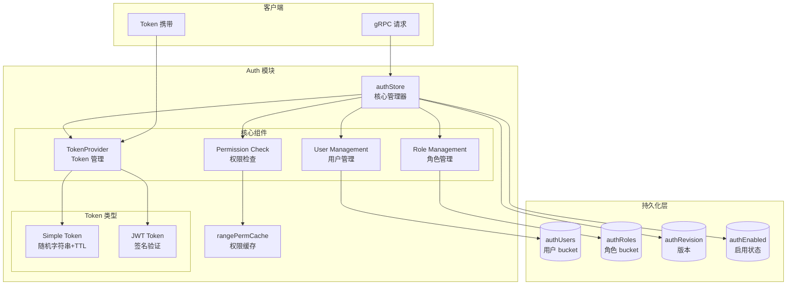
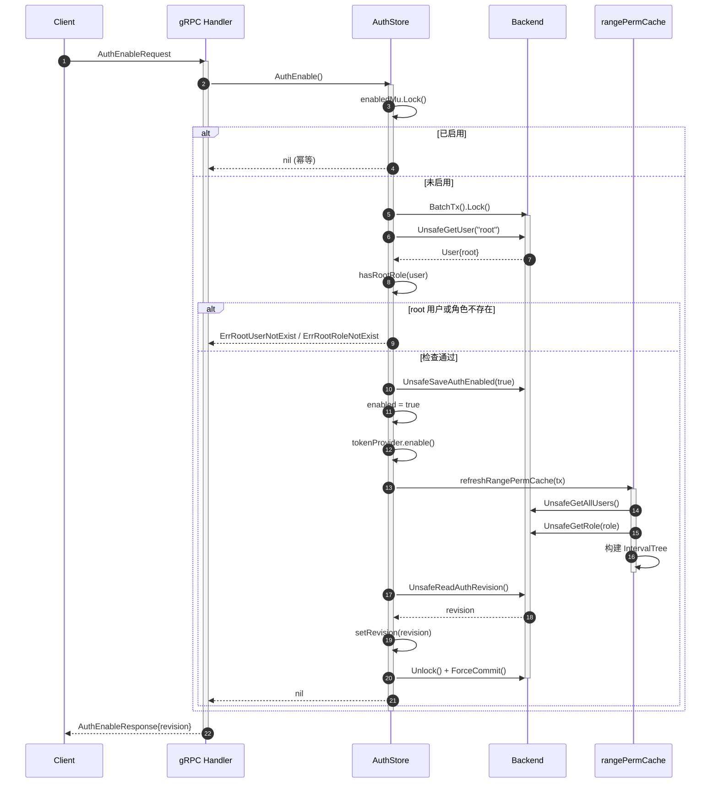
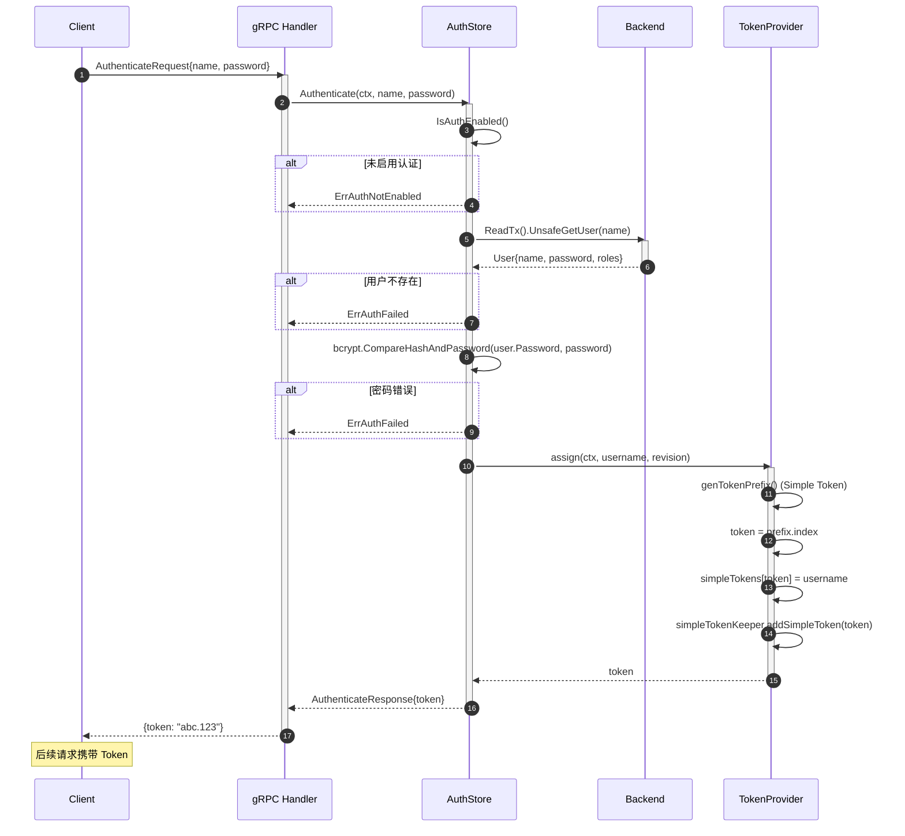
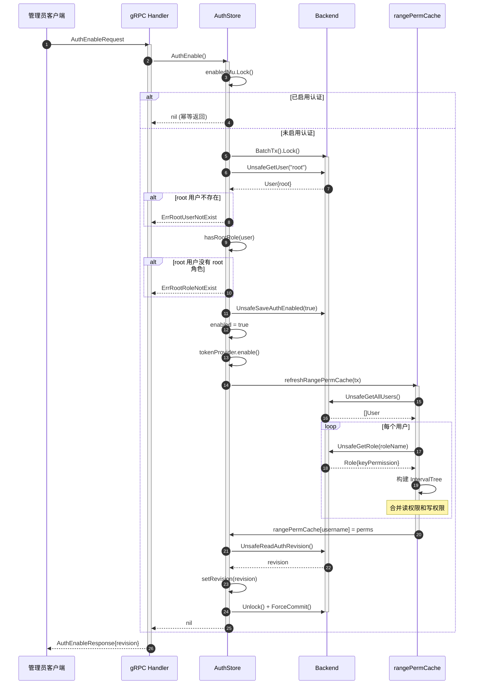
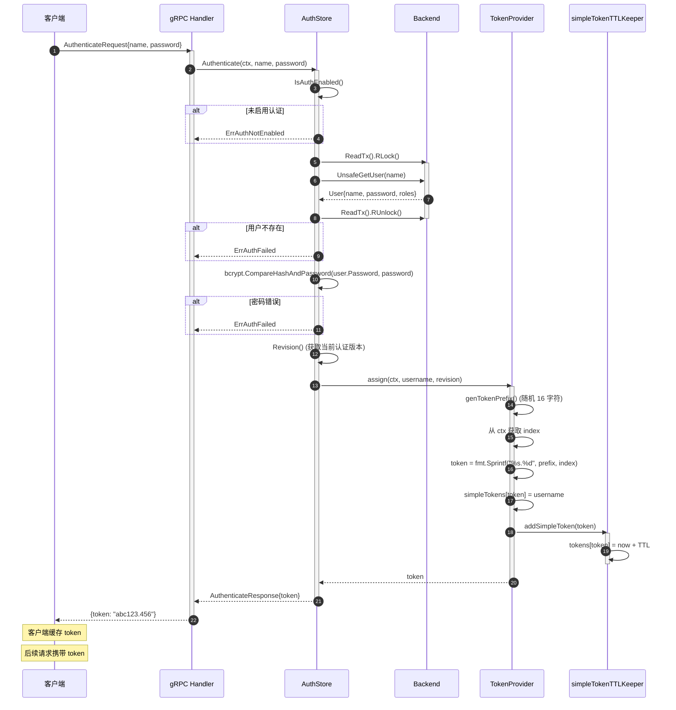
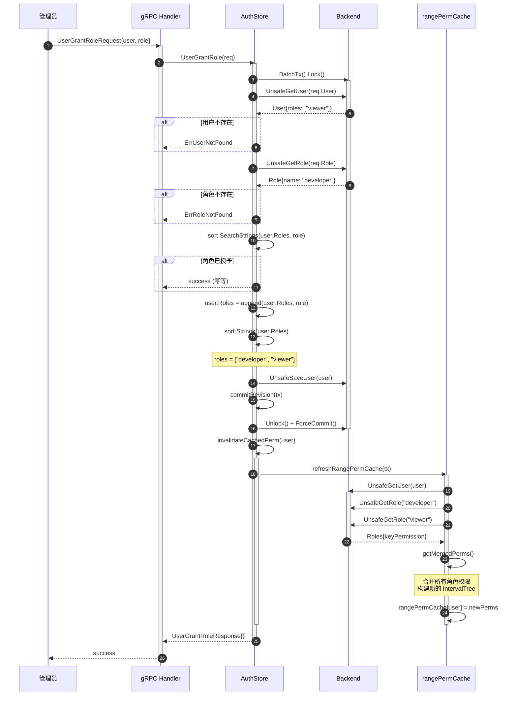
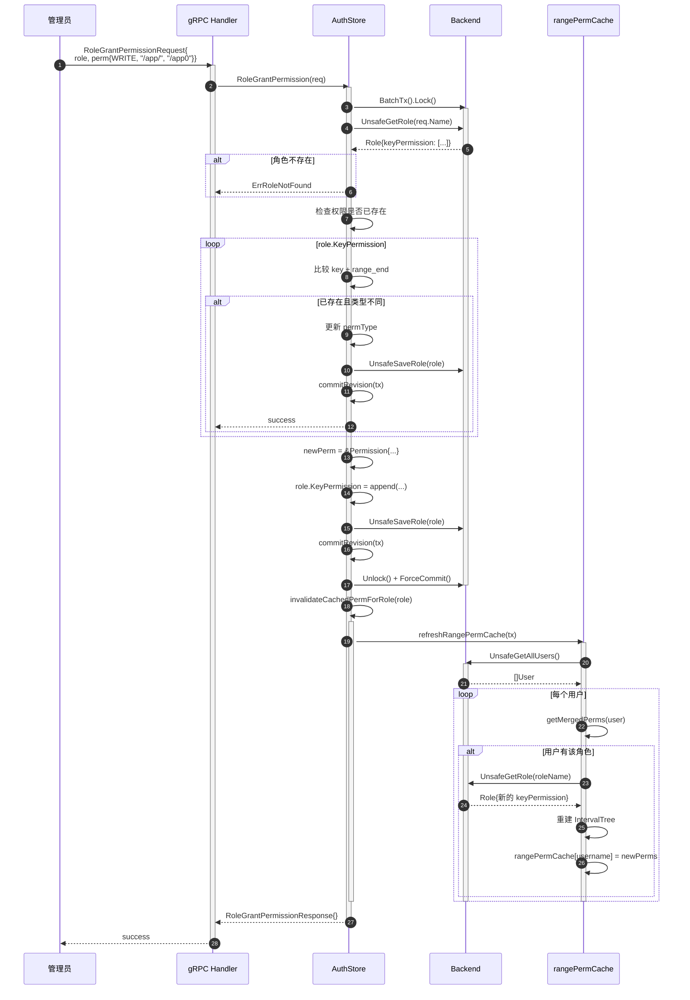
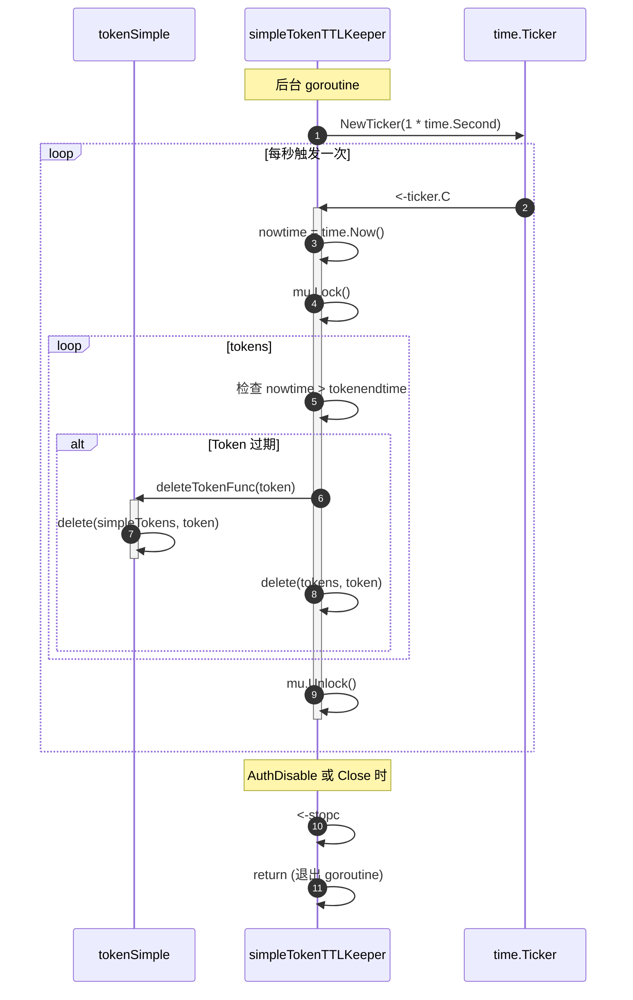
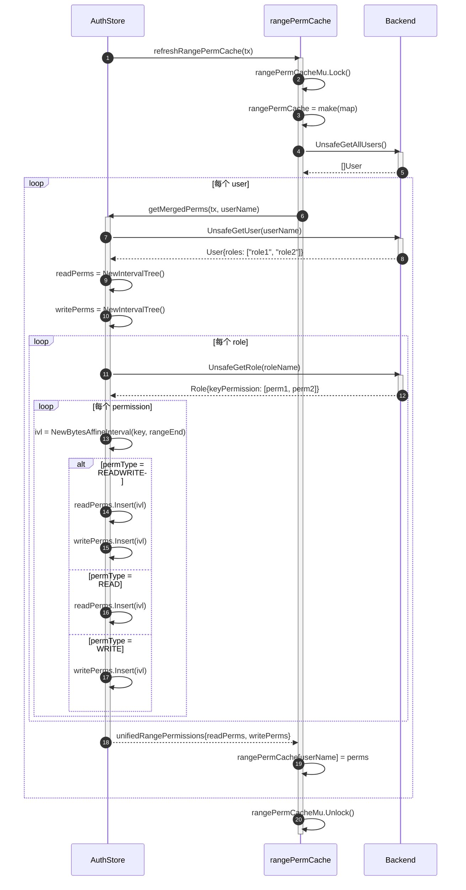
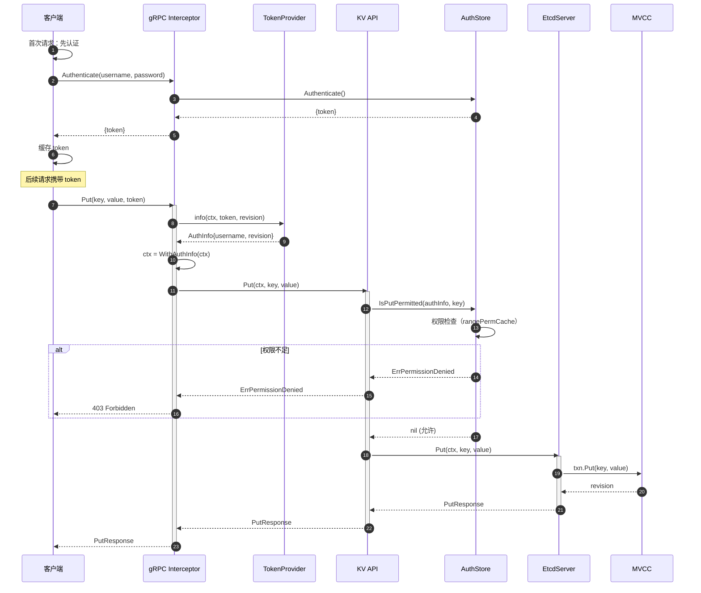

# etcd-05-Auth

## 模块概览

## 摘要

Auth 模块是 etcd 的认证授权系统，提供基于角色的访问控制（RBAC）机制。该模块管理用户（User）、角色（Role）、权限（Permission）之间的关系，支持细粒度的 key 级别权限控制，并提供 Token 机制用于身份验证。

**模块职责**

- 用户认证（基于用户名/密码或 TLS 证书）
- 角色管理与权限授予
- KV 操作权限检查（Read/Write）
- Token 生成与验证（Simple Token / JWT）
- 权限缓存优化

**运行环境**

- 位置：`server/auth`
- 依赖：Backend（持久化）、区间树（权限匹配）、bcrypt（密码哈希）
- 并发模型：读写锁保护，权限缓存分离锁

---

## 1. 模块架构图



**图解与要点**

1. **三层模型**
   - **用户层**：用户账号、密码（bcrypt哈希）、关联角色列表
   - **角色层**：角色名称、权限列表
   - **权限层**：key 范围 + 权限类型（READ/WRITE/READWRITE）

2. **权限模型**

```
   User --多对多--> Role --一对多--> Permission
   
   示例：
   user1 --→ role1 --→ perm1: ["/foo/", "/foo0") READ
              └----→ perm2: ["/bar", "/bar") WRITE
         --→ role2 --→ perm3: ["\x00", "\x00") READWRITE（所有 key）
```

3. **权限检查流程**

```
   客户端请求
     ↓ 携带 Token
   TokenProvider 验证
     ↓ 返回 AuthInfo{Username, Revision}
   authStore 检查权限
     ↓ 查 rangePermCache[username]
   IntervalTree 匹配 key 范围
     ↓ 返回 permit/deny
```

4. **并发控制**
   - `enabledMu`：保护 `enabled` 标志位（AuthEnable/AuthDisable）
   - `rangePermCacheMu`：保护权限缓存（读多写少，读写锁）
   - Backend BatchTx/ReadTx：持久化操作锁

---

## 2. 核心数据结构

### 2.1 User

```go
// api/authpb/auth.proto
message User {
    bytes name = 1;
    bytes password = 2;
    repeated string roles = 3;
    UserAddOptions options = 4;
}

message UserAddOptions {
    bool no_password = 1;
}
```

**字段说明**

- `name`：用户名（唯一）
- `password`：bcrypt 哈希后的密码
- `roles`：用户关联的角色列表（排序，支持二分查找）
- `no_password`：无密码用户（例如 TLS 证书认证）

### 2.2 Role

```go
message Role {
    bytes name = 1;
    repeated Permission keyPermission = 2;
}
```

### 2.3 Permission

```go
message Permission {
    enum Type {
        READ = 0;
        WRITE = 1;
        READWRITE = 2;
    }
    Type permType = 1;
    bytes key = 2;
    bytes range_end = 3;
}
```

**范围表示**

- **单 key**：`key="/foo", range_end=""`
- **范围**：`key="/foo/", range_end="/foo0"`（`["/foo/", "/foo0")`）
- **全部 key**：`key="\x00", range_end="\x00"`

### 2.4 authStore

```go
// server/auth/store.go
type authStore struct {
    revision uint64  // 认证配置版本

    lg        *zap.Logger
    be        AuthBackend
    enabled   bool
    enabledMu sync.RWMutex

    rangePermCache   map[string]*unifiedRangePermissions
    rangePermCacheMu sync.RWMutex

    tokenProvider TokenProvider
    bcryptCost    int  // bcrypt 哈希强度
}

type unifiedRangePermissions struct {
    readPerms  adt.IntervalTree  // 读权限区间树
    writePerms adt.IntervalTree  // 写权限区间树
}
```

---

## 3. 核心算法

### 3.1 AuthEnable - 启用认证

```go
func (as *authStore) AuthEnable() error {
    as.enabledMu.Lock()
    defer as.enabledMu.Unlock()
    
    if as.enabled {
        return nil
    }
    
    tx := as.be.BatchTx()
    tx.Lock()
    defer tx.Unlock()
    defer as.be.ForceCommit()

    // 检查 root 用户和角色是否存在
    u := tx.UnsafeGetUser(rootUser)
    if u == nil {
        return ErrRootUserNotExist
    }
    if !hasRootRole(u) {
        return ErrRootRoleNotExist
    }

    tx.UnsafeSaveAuthEnabled(true)
    as.enabled = true
    as.tokenProvider.enable()

    // 刷新权限缓存
    as.refreshRangePermCache(tx)
    as.setRevision(tx.UnsafeReadAuthRevision())

    return nil
}
```

**前置条件**

- 必须存在 `root` 用户
- root 用户必须拥有 `root` 角色
- root 角色拥有全局 READWRITE 权限

### 3.2 Authenticate - 用户认证

```go
func (as *authStore) Authenticate(ctx context.Context, username, password string) (*pb.AuthenticateResponse, error) {
    if !as.IsAuthEnabled() {
        return nil, ErrAuthNotEnabled
    }

    tx := as.be.ReadTx()
    tx.RLock()
    defer tx.RUnlock()

    user := tx.UnsafeGetUser(username)
    if user == nil {
        return nil, ErrAuthFailed
    }

    // 检查密码
    if user.Options != nil && user.Options.NoPassword {
        return nil, ErrNoPasswordUser
    }
    if err := bcrypt.CompareHashAndPassword(user.Password, []byte(password)); err != nil {
        return nil, ErrAuthFailed
    }

    // 生成 Token
    token, err := as.tokenProvider.assign(ctx, username, as.Revision())
    if err != nil {
        return nil, err
    }

    return &pb.AuthenticateResponse{Token: token}, nil
}
```

**流程**

1. 从 backend 读取用户信息
2. 使用 bcrypt 验证密码
3. 调用 TokenProvider 生成 Token
4. 返回 Token 给客户端

### 3.3 权限检查

```go
func (as *authStore) isOpPermitted(userName string, revision uint64,
    key, rangeEnd []byte, permTyp authpb.Permission_Type) error {
    
    if !as.IsAuthEnabled() {
        return nil
    }
    
    if revision == 0 {
        return ErrUserEmpty
    }
    
    // 检查 revision
    rev := as.Revision()
    if revision < rev {
        return ErrAuthOldRevision
    }

    tx := as.be.ReadTx()
    tx.RLock()
    defer tx.RUnlock()

    user := tx.UnsafeGetUser(userName)
    if user == nil {
        return ErrPermissionDenied
    }

    // root 角色拥有所有权限
    if hasRootRole(user) {
        return nil
    }

    // 查缓存并匹配权限
    if as.isRangeOpPermitted(userName, key, rangeEnd, permTyp) {
        return nil
    }

    return ErrPermissionDenied
}
```

**区间匹配**

```go
func (as *authStore) isRangeOpPermitted(userName string, key, rangeEnd []byte,
    permtyp authpb.Permission_Type) bool {
    
    as.rangePermCacheMu.RLock()
    defer as.rangePermCacheMu.RUnlock()

    rangePerm, ok := as.rangePermCache[userName]
    if !ok {
        return false
    }

    if len(rangeEnd) == 0 {
        // 单 key 点查询
        pt := adt.NewBytesAffinePoint(key)
        if permtyp == authpb.READ {
            return rangePerm.readPerms.Intersects(pt)
        } else {
            return rangePerm.writePerms.Intersects(pt)
        }
    }

    // 范围查询
    ivl := adt.NewBytesAffineInterval(key, rangeEnd)
    if permtyp == authpb.READ {
        return rangePerm.readPerms.Contains(ivl)
    } else {
        return rangePerm.writePerms.Contains(ivl)
    }
}
```

**复杂度**

- 单 key：O(log N)，N 为权限数量
- 范围：O(log N + k)，k 为重叠区间数

### 3.4 权限缓存刷新

```go
func (as *authStore) refreshRangePermCache(tx UnsafeAuthReader) {
    as.rangePermCacheMu.Lock()
    defer as.rangePermCacheMu.Unlock()

    as.rangePermCache = make(map[string]*unifiedRangePermissions)

    users := tx.UnsafeGetAllUsers()
    for _, user := range users {
        userName := string(user.Name)
        perms := getMergedPerms(tx, userName)
        as.rangePermCache[userName] = perms
    }
}

func getMergedPerms(tx UnsafeAuthReader, userName string) *unifiedRangePermissions {
    user := tx.UnsafeGetUser(userName)
    readPerms := adt.NewIntervalTree()
    writePerms := adt.NewIntervalTree()

    for _, roleName := range user.Roles {
        role := tx.UnsafeGetRole(roleName)
        for _, perm := range role.KeyPermission {
            ivl := adt.NewBytesAffineInterval(perm.Key, perm.RangeEnd)
            switch perm.PermType {
            case authpb.READWRITE:
                readPerms.Insert(ivl, struct{}{})
                writePerms.Insert(ivl, struct{}{})
            case authpb.READ:
                readPerms.Insert(ivl, struct{}{})
            case authpb.WRITE:
                writePerms.Insert(ivl, struct{}{})
            }
        }
    }

    return &unifiedRangePermissions{
        readPerms: readPerms, writePerms: writePerms,
    }
}
```

**触发时机**

- AuthEnable
- UserGrantRole / UserRevokeRole
- RoleGrantPermission / RoleRevokePermission
- Recover（节点启动）

---

## 4. Token 机制

### 4.1 Simple Token

```go
type tokenSimple struct {
    simpleTokens   map[string]string  // token → username
    simpleTokenKeeper *simpleTokenTTLKeeper
    simpleTokenTTL time.Duration  // 默认 300s
}

type simpleTokenTTLKeeper struct {
    tokens          map[string]time.Time  // token → 过期时间
    deleteTokenFunc func(string)
}
```

**生成与验证**

```go
// 生成：prefix.index
func (t *tokenSimple) assign(ctx context.Context, username string, rev uint64) (string, error) {
    index := ctx.Value(AuthenticateParamIndex{}).(uint64)
    simpleTokenPrefix := ctx.Value(AuthenticateParamSimpleTokenPrefix{}).(string)
    token := fmt.Sprintf("%s.%d", simpleTokenPrefix, index)
    
    t.simpleTokens[token] = username
    t.simpleTokenKeeper.addSimpleToken(token)
    return token, nil
}

// 验证
func (t *tokenSimple) info(ctx context.Context, token string, revision uint64) (*AuthInfo, bool) {
    if !t.isValidSimpleToken(ctx, token) {
        return nil, false
    }
    username, ok := t.simpleTokens[token]
    if ok {
        t.simpleTokenKeeper.resetSimpleToken(token)  // 刷新 TTL
    }
    return &AuthInfo{Username: username, Revision: revision}, ok
}
```

**TTL 管理**

```go
func (tm *simpleTokenTTLKeeper) run() {
    ticker := time.NewTicker(1 * time.Second)
    for {
        select {
        case <-ticker.C:
            nowtime := time.Now()
            for t, tokenendtime := range tm.tokens {
                if nowtime.After(tokenendtime) {
                    tm.deleteTokenFunc(t)
                    delete(tm.tokens, t)
                }
            }
        case <-tm.stopc:
            return
        }
    }
}
```

### 4.2 JWT Token

- 使用 RS256/ES256 签名
- Payload 包含 username、revision、expiry
- 无需服务端状态，验证签名即可

---

## 5. 生命周期

### 5.1 初始化

```go
func NewAuthStore(lg *zap.Logger, be AuthBackend, tp TokenProvider, bcryptCost int) AuthStore {
    be.CreateAuthBuckets()  // 创建 backend buckets
    
    tx := be.BatchTx()
    tx.Lock()
    enabled := tx.UnsafeReadAuthEnabled()
    
    as := &authStore{
        revision:       tx.UnsafeReadAuthRevision(),
        be:             be,
        enabled:        enabled,
        rangePermCache: make(map[string]*unifiedRangePermissions),
        tokenProvider:  tp,
        bcryptCost:     bcryptCost,
    }
    
    if enabled {
        as.tokenProvider.enable()
    }
    
    as.refreshRangePermCache(tx)
    tx.Unlock()
    be.ForceCommit()
    
    return as
}
```

### 5.2 运行时

- **认证请求**：Authenticate → 生成 Token
- **权限检查**：每个 KV 操作前检查权限
- **配置变更**：用户/角色/权限变更后刷新缓存

### 5.3 关闭

```go
func (as *authStore) Close() error {
    as.tokenProvider.disable()
    return nil
}
```

---

## 6. 配置参数

| 参数 | 默认值 | 说明 |
|------|--------|------|
| `--auth-token` | `simple` | Token 类型（simple/jwt） |
| `--auth-token-ttl` | 300s | Simple Token TTL |
| `--bcrypt-cost` | 10 | bcrypt 哈希强度（4-31） |

---

## 7. 监控指标

- `etcd_auth_revision`：认证配置版本号
- `etcd_debugging_auth_revision`：调试用版本号

---

## 8. 最佳实践

1. **启用认证前准备**
   - 创建 root 用户和角色
   - 配置必要的用户和权限
   - 测试权限配置正确性

2. **权限设计**
   - 最小权限原则
   - 使用角色管理权限，避免直接授予用户
   - 合理划分 key 范围

3. **Token 选择**
   - 测试环境：Simple Token（无状态验证较快）
   - 生产环境：JWT（分布式友好，无需同步）

4. **密码管理**
   - 定期更换密码
   - 使用足够复杂的密码
   - 考虑集成外部认证（LDAP、OAuth）

5. **性能优化**
   - 权限缓存减少 backend 读取
   - 避免过于复杂的权限规则
   - 监控权限检查延迟

---

## 9. 与其他模块交互

- **EtcdServer**：集成 authStore，拦截 KV 请求进行权限检查
- **gRPC Interceptor**：提取 Token，调用 TokenProvider 验证
- **Backend**：持久化用户、角色、权限数据
- **MVCC**：权限检查通过后才执行 KV 操作

---

## API接口

## 摘要

本文档详细说明 Auth 模块的对外 API，包括认证管理、用户管理、角色管理、权限管理等接口，每个 API 包含请求/响应结构、核心实现代码、调用链路和时序图。

---

## 1. 认证管理 API

### 1.1 AuthEnable - 启用认证

#### 基本信息
- 名称：`AuthEnable`
- 协议与方法：gRPC `Auth.AuthEnable`，HTTP `POST /v3/auth/enable`
- 幂等性：是（重复启用返回成功）

#### 请求结构

```go
message AuthEnableRequest {
}
```

#### 响应结构

```go
message AuthEnableResponse {
    ResponseHeader header = 1;
}
```

#### 核心实现

```go
// server/auth/store.go
func (as *authStore) AuthEnable() error {
    as.enabledMu.Lock()
    defer as.enabledMu.Unlock()
    
    if as.enabled {
        as.lg.Info("authentication is already enabled")
        return nil
    }
    
    tx := as.be.BatchTx()
    tx.Lock()
    defer func() {
        tx.Unlock()
        as.be.ForceCommit()
    }()

    // 检查 root 用户和角色
    u := tx.UnsafeGetUser(rootUser)
    if u == nil {
        return ErrRootUserNotExist
    }
    if !hasRootRole(u) {
        return ErrRootRoleNotExist
    }

    tx.UnsafeSaveAuthEnabled(true)
    as.enabled = true
    as.tokenProvider.enable()

    // 刷新权限缓存
    as.refreshRangePermCache(tx)
    as.setRevision(tx.UnsafeReadAuthRevision())

    return nil
}
```

#### 调用链

```go
// server/etcdserver/api/v3rpc/auth.go
func (as *authServer) AuthEnable(ctx context.Context, r *pb.AuthEnableRequest) (*pb.AuthEnableResponse, error) {
    resp := &pb.AuthEnableResponse{Header: &pb.ResponseHeader{}}
    
    if err := as.server.AuthStore().AuthEnable(); err != nil {
        return nil, togRPCError(err)
    }
    
    resp.Header.Revision = as.server.AuthStore().Revision()
    return resp, nil
}
```

#### 时序图



**前置条件**

- 必须先创建 root 用户（`UserAdd root`）
- 必须先创建 root 角色并赋予全局权限
- root 用户必须关联 root 角色

---

### 1.2 AuthDisable - 禁用认证

#### 核心实现

```go
func (as *authStore) AuthDisable() {
    as.enabledMu.Lock()
    defer as.enabledMu.Unlock()
    
    if !as.enabled {
        return
    }
    
    tx := as.be.BatchTx()
    tx.Lock()
    tx.UnsafeSaveAuthEnabled(false)
    as.commitRevision(tx)
    tx.Unlock()
    
    as.be.ForceCommit()
    as.enabled = false
    as.tokenProvider.disable()
}
```

**说明**

- 禁用认证后，所有请求不再检查权限
- Token 失效
- 用户、角色、权限数据保留

---

### 1.3 Authenticate - 用户认证

#### 请求结构

```go
message AuthenticateRequest {
    string name = 1;
    string password = 2;
}
```

**字段表**

| 字段 | 类型 | 必填 | 说明 |
|------|------|:----:|------|
| name | string | 是 | 用户名 |
| password | string | 是 | 密码（明文） |

#### 响应结构

```go
message AuthenticateResponse {
    ResponseHeader header = 1;
    string token = 2;
}
```

#### 核心实现

```go
func (as *authStore) Authenticate(ctx context.Context, username, password string) (*pb.AuthenticateResponse, error) {
    if !as.IsAuthEnabled() {
        return nil, ErrAuthNotEnabled
    }

    tx := as.be.ReadTx()
    tx.RLock()
    defer tx.RUnlock()

    user := tx.UnsafeGetUser(username)
    if user == nil {
        return nil, ErrAuthFailed
    }

    if user.Options != nil && user.Options.NoPassword {
        return nil, ErrNoPasswordUser
    }

    // 验证密码
    if err := bcrypt.CompareHashAndPassword(user.Password, []byte(password)); err != nil {
        return nil, ErrAuthFailed
    }

    // 生成 Token
    token, err := as.tokenProvider.assign(ctx, username, as.Revision())
    if err != nil {
        return nil, err
    }

    return &pb.AuthenticateResponse{Token: token}, nil
}
```

#### 时序图



**安全要点**

- 密码使用 bcrypt 哈希存储
- 认证失败返回统一错误，避免泄露用户存在性
- Token 有过期时间（Simple Token 默认 300s）

---

## 2. 用户管理 API

### 2.1 UserAdd - 添加用户

#### 请求结构

```go
message AuthUserAddRequest {
    string name = 1;
    string password = 2;
    UserAddOptions options = 3;
}

message UserAddOptions {
    bool no_password = 1;
}
```

**字段表**

| 字段 | 类型 | 必填 | 说明 |
|------|------|:----:|------|
| name | string | 是 | 用户名（唯一） |
| password | string | 否 | 密码（no_password=true 时可为空） |
| options.no_password | bool | 否 | 无密码用户（TLS 证书认证） |

#### 核心实现

```go
func (as *authStore) UserAdd(r *pb.AuthUserAddRequest) (*pb.AuthUserAddResponse, error) {
    if len(r.Name) == 0 {
        return nil, ErrUserEmpty
    }

    var hashed []byte
    var err error
    
    if r.Options == nil || !r.Options.NoPassword {
        hashed, err = bcrypt.GenerateFromPassword([]byte(r.Password), as.bcryptCost)
        if err != nil {
            return nil, err
        }
    }

    tx := as.be.BatchTx()
    tx.Lock()
    defer tx.Unlock()

    user := tx.UnsafeGetUser(r.Name)
    if user != nil {
        return nil, ErrUserAlreadyExist
    }

    newUser := &authpb.User{
        Name:     []byte(r.Name),
        Password: hashed,
        Options:  r.Options,
    }

    tx.UnsafeSaveUser(newUser)
    as.commitRevision(tx)
    as.be.ForceCommit()

    return &pb.AuthUserAddResponse{}, nil
}
```

---

### 2.2 UserGrantRole - 授予角色

#### 请求结构

```go
message AuthUserGrantRoleRequest {
    string user = 1;
    string role = 2;
}
```

#### 核心实现

```go
func (as *authStore) UserGrantRole(r *pb.AuthUserGrantRoleRequest) (*pb.AuthUserGrantRoleResponse, error) {
    tx := as.be.BatchTx()
    tx.Lock()
    defer tx.Unlock()

    user := tx.UnsafeGetUser(r.User)
    if user == nil {
        return nil, ErrUserNotFound
    }

    role := tx.UnsafeGetRole(r.Role)
    if role == nil {
        return nil, ErrRoleNotFound
    }

    // 检查是否已授予
    idx := sort.SearchStrings(user.Roles, r.Role)
    if idx < len(user.Roles) && user.Roles[idx] == r.Role {
        return &pb.AuthUserGrantRoleResponse{}, nil
    }

    // 插入角色（保持排序）
    user.Roles = append(user.Roles, r.Role)
    sort.Strings(user.Roles)

    tx.UnsafeSaveUser(user)
    as.commitRevision(tx)
    as.be.ForceCommit()

    // 刷新权限缓存
    as.invalidateCachedPerm(r.User)

    return &pb.AuthUserGrantRoleResponse{}, nil
}
```

**说明**

- 角色列表保持排序，支持二分查找
- 操作后需要刷新该用户的权限缓存

---

### 2.3 UserRevokeRole - 撤销角色

**核心实现**类似 UserGrantRole，从 `user.Roles` 中移除角色。

---

## 3. 角色管理 API

### 3.1 RoleAdd - 添加角色

#### 请求结构

```go
message AuthRoleAddRequest {
    string name = 1;
}
```

#### 核心实现

```go
func (as *authStore) RoleAdd(r *pb.AuthRoleAddRequest) (*pb.AuthRoleAddResponse, error) {
    if len(r.Name) == 0 {
        return nil, ErrRoleEmpty
    }

    tx := as.be.BatchTx()
    tx.Lock()
    defer tx.Unlock()

    role := tx.UnsafeGetRole(r.Name)
    if role != nil {
        return nil, ErrRoleAlreadyExist
    }

    newRole := &authpb.Role{
        Name: []byte(r.Name),
    }

    tx.UnsafeSaveRole(newRole)
    as.commitRevision(tx)
    as.be.ForceCommit()

    return &pb.AuthRoleAddResponse{}, nil
}
```

---

### 3.2 RoleGrantPermission - 授予权限

#### 请求结构

```go
message AuthRoleGrantPermissionRequest {
    string name = 1;
    Permission perm = 2;
}

message Permission {
    enum Type {
        READ = 0;
        WRITE = 1;
        READWRITE = 2;
    }
    Type permType = 1;
    bytes key = 2;
    bytes range_end = 3;
}
```

**字段表**

| 字段 | 类型 | 必填 | 说明 |
|------|------|:----:|------|
| name | string | 是 | 角色名 |
| perm.permType | Type | 是 | 权限类型 |
| perm.key | bytes | 是 | key 或范围起点 |
| perm.range_end | bytes | 否 | 范围终点（空=单key） |

#### 核心实现

```go
func (as *authStore) RoleGrantPermission(r *pb.AuthRoleGrantPermissionRequest) (*pb.AuthRoleGrantPermissionResponse, error) {
    tx := as.be.BatchTx()
    tx.Lock()
    defer tx.Unlock()

    role := tx.UnsafeGetRole(r.Name)
    if role == nil {
        return nil, ErrRoleNotFound
    }

    // 检查权限是否已存在
    for _, perm := range role.KeyPermission {
        if bytes.Equal(perm.Key, r.Perm.Key) && bytes.Equal(perm.RangeEnd, r.Perm.RangeEnd) {
            if perm.PermType != r.Perm.PermType {
                perm.PermType = r.Perm.PermType
            }
            tx.UnsafeSaveRole(role)
            as.commitRevision(tx)
            as.be.ForceCommit()
            return &pb.AuthRoleGrantPermissionResponse{}, nil
        }
    }

    // 添加新权限
    newPerm := &authpb.Permission{
        PermType: r.Perm.PermType,
        Key:      r.Perm.Key,
        RangeEnd: r.Perm.RangeEnd,
    }
    role.KeyPermission = append(role.KeyPermission, newPerm)

    tx.UnsafeSaveRole(role)
    as.commitRevision(tx)
    as.be.ForceCommit()

    // 刷新所有拥有该角色的用户的权限缓存
    as.invalidateCachedPermForRole(r.Name)

    return &pb.AuthRoleGrantPermissionResponse{}, nil
}
```

---

## 4. 权限检查 API（内部）

### 4.1 IsPutPermitted

```go
func (as *authStore) IsPutPermitted(authInfo *AuthInfo, key []byte) error {
    return as.isOpPermitted(authInfo.Username, authInfo.Revision, key, nil, authpb.WRITE)
}
```

### 4.2 IsRangePermitted

```go
func (as *authStore) IsRangePermitted(authInfo *AuthInfo, key, rangeEnd []byte) error {
    return as.isOpPermitted(authInfo.Username, authInfo.Revision, key, rangeEnd, authpb.READ)
}
```

### 4.3 IsDeleteRangePermitted

```go
func (as *authStore) IsDeleteRangePermitted(authInfo *AuthInfo, key, rangeEnd []byte) error {
    return as.isOpPermitted(authInfo.Username, authInfo.Revision, key, rangeEnd, authpb.WRITE)
}
```

### 4.4 IsAdminPermitted

```go
func (as *authStore) IsAdminPermitted(authInfo *AuthInfo) error {
    if !as.IsAuthEnabled() {
        return nil
    }
    if authInfo == nil || authInfo.Username == "" {
        return ErrUserEmpty
    }

    tx := as.be.ReadTx()
    tx.RLock()
    defer tx.RUnlock()
    
    u := tx.UnsafeGetUser(authInfo.Username)
    if u == nil {
        return ErrUserNotFound
    }

    if !hasRootRole(u) {
        return ErrPermissionDenied
    }

    return nil
}
```

**调用时机**

- Put/DeleteRange → `IsPutPermitted` / `IsDeleteRangePermitted`
- Range → `IsRangePermitted`
- Auth 管理 API → `IsAdminPermitted`

---

## 5. Token 管理 API（内部）

### 5.1 AuthInfoFromCtx - 从上下文提取认证信息

```go
func (as *authStore) AuthInfoFromCtx(ctx context.Context) (*AuthInfo, error) {
    md, ok := metadata.FromIncomingContext(ctx)
    if !ok {
        return nil, nil
    }

    tokens := md["token"]
    if len(tokens) < 1 {
        return nil, nil
    }

    token := tokens[0]
    authInfo, uok := as.tokenProvider.info(ctx, token, as.Revision())
    if !uok {
        return nil, ErrInvalidAuthToken
    }

    return authInfo, nil
}
```

### 5.2 WithRoot - 生成 root 上下文

```go
func (as *authStore) WithRoot(ctx context.Context) context.Context {
    // 生成特殊 Token，绕过权限检查
    token := fmt.Sprintf("%s.%d", rootTokenPrefix, as.Revision())
    md := metadata.Pairs("token", token)
    return metadata.NewOutgoingContext(ctx, md)
}
```

**用途**

- 内部操作需要 root 权限时使用
- 例如：AuthEnable 后的初始化操作

---

## 6. 异常与边界

### 6.1 常见错误

| 错误 | 说明 | HTTP 状态码 |
|------|------|-------------|
| ErrAuthNotEnabled | 认证未启用 | 401 |
| ErrAuthFailed | 认证失败（用户名或密码错误） | 401 |
| ErrPermissionDenied | 权限不足 | 403 |
| ErrUserEmpty | 用户名为空 | 400 |
| ErrUserNotFound | 用户不存在 | 404 |
| ErrUserAlreadyExist | 用户已存在 | 409 |
| ErrRoleNotFound | 角色不存在 | 404 |
| ErrAuthOldRevision | 请求的 revision 过期 | 412 |

### 6.2 Revision 不一致

**场景**

- 客户端缓存的 AuthInfo.Revision 小于服务端 authStore.Revision
- 权限配置变更后，旧 Token 中的 revision 过期

**处理**

```go
if revision < rev {
    return ErrAuthOldRevision
}
```

**客户端行为**

- 收到 ErrAuthOldRevision 后重新 Authenticate
- 使用新 Token 重试请求

---

## 7. 性能优化

### 7.1 权限缓存

```go
type unifiedRangePermissions struct {
    readPerms  adt.IntervalTree
    writePerms adt.IntervalTree
}
```

**命中率**

- 热点 key 权限检查：O(log N) → O(1)（缓存命中）
- 缓存刷新：仅在权限配置变更时触发

### 7.2 批量操作

**建议**

- 批量添加用户/角色后，统一刷新权限缓存
- 使用 Txn API 批量授予权限

---

## 8. 最佳实践

1. **启用认证前**
   - 确保 root 用户和角色已创建
   - 测试权限配置正确性

2. **Token 管理**
   - 客户端缓存 Token，避免频繁认证
   - 监控 Token 过期，提前刷新

3. **权限设计**
   - 使用角色管理权限，避免直接授予用户
   - 最小权限原则
   - 合理划分 key 范围

4. **性能监控**
   - 监控权限检查延迟
   - 监控权限缓存命中率
   - 监控认证请求频率

5. **安全加固**
   - 生产环境使用 JWT Token
   - 启用 TLS 加密
   - 定期审计用户和权限

---

## 数据结构

## 摘要

本文档详细描述 Auth 模块的核心数据结构，包括 `authStore`、`User`、`Role`、`Permission`、`TokenProvider` 等，通过 UML 类图和详细字段说明帮助理解其设计与实现。

---

## 1. 核心数据结构 UML

```mermaid
classDiagram
    class authStore {
        +revision uint64
        +lg *zap.Logger
        +be AuthBackend
        +enabled bool
        +enabledMu sync.RWMutex
        +rangePermCache map~string~*unifiedRangePermissions
        +rangePermCacheMu sync.RWMutex
        +tokenProvider TokenProvider
        +bcryptCost int
        
        +AuthEnable() error
        +AuthDisable() void
        +Authenticate(ctx, username, password) (*AuthenticateResponse, error)
        +UserAdd(req) (*AuthUserAddResponse, error)
        +RoleAdd(req) (*AuthRoleAddResponse, error)
        +RoleGrantPermission(req) (*AuthRoleGrantPermissionResponse, error)
        +isOpPermitted(username, revision, key, rangeEnd, permTyp) error
        +refreshRangePermCache(tx) void
    }

    class User {
        +name []byte
        +password []byte
        +roles []string
        +options *UserAddOptions
    }

    class Role {
        +name []byte
        +keyPermission []*Permission
    }

    class Permission {
        +permType Type
        +key []byte
        +range_end []byte
    }

    class unifiedRangePermissions {
        +readPerms IntervalTree
        +writePerms IntervalTree
    }

    class TokenProvider {
        <<interface>>
        +info(ctx, token, revision) (*AuthInfo, bool)
        +assign(ctx, username, revision) (string, error)
        +enable() void
        +disable() void
        +invalidateUser(username) void
        +genTokenPrefix() (string, error)
    }

    class tokenSimple {
        +lg *zap.Logger
        +simpleTokens map~string~string
        +simpleTokenKeeper *simpleTokenTTLKeeper
        +simpleTokenTTL time.Duration
        
        +info(ctx, token, revision) (*AuthInfo, bool)
        +assign(ctx, username, revision) (string, error)
    }

    class simpleTokenTTLKeeper {
        +tokens map~string~time.Time
        +donec chan struct{}
        +stopc chan struct{}
        +deleteTokenFunc func(string)
        +mu *sync.Mutex
        +simpleTokenTTL time.Duration
        
        +run() void
        +addSimpleToken(token) void
        +resetSimpleToken(token) void
    }

    class AuthInfo {
        +Username string
        +Revision uint64
    }

    authStore --> User : 管理
    authStore --> Role : 管理
    authStore --> unifiedRangePermissions : 缓存
    authStore --> TokenProvider : 使用
    User --> Role : roles[]
    Role --> Permission : keyPermission[]
    TokenProvider <|.. tokenSimple : 实现
    tokenSimple --> simpleTokenTTLKeeper : 使用
    TokenProvider ..> AuthInfo : 返回
```

---

## 2. authStore

### 2.1 结构定义

```go
// server/auth/store.go
type authStore struct {
    revision uint64  // 认证配置版本（原子操作）

    lg        *zap.Logger
    be        AuthBackend
    enabled   bool
    enabledMu sync.RWMutex

    rangePermCache   map[string]*unifiedRangePermissions
    rangePermCacheMu sync.RWMutex

    tokenProvider TokenProvider
    bcryptCost    int
}
```

### 2.2 字段说明

| 字段 | 类型 | 说明 |
|------|------|------|
| `revision` | `uint64` | 认证配置版本号，每次用户/角色/权限变更时递增（原子操作） |
| `lg` | `*zap.Logger` | 日志器 |
| `be` | `AuthBackend` | 持久化层接口，操作 backend buckets |
| `enabled` | `bool` | 认证是否启用 |
| `enabledMu` | `sync.RWMutex` | 保护 `enabled` 字段，读多写少 |
| `rangePermCache` | `map[string]*unifiedRangePermissions` | 用户 → 合并后的权限区间树，加速权限检查 |
| `rangePermCacheMu` | `sync.RWMutex` | 保护权限缓存，独立于 backend 锁 |
| `tokenProvider` | `TokenProvider` | Token 生成与验证接口（Simple/JWT） |
| `bcryptCost` | `int` | bcrypt 哈希强度（4-31，默认 10） |

### 2.3 Revision 管理

```go
func (as *authStore) Revision() uint64 {
    return atomic.LoadUint64(&as.revision)
}

func (as *authStore) setRevision(rev uint64) {
    atomic.StoreUint64(&as.revision, rev)
}

func (as *authStore) commitRevision(tx UnsafeAuthWriter) {
    atomic.AddUint64(&as.revision, 1)
    tx.UnsafeSaveAuthRevision(as.revision)
}
```

**用途**

- 客户端携带 revision，服务端检查是否过期
- 权限变更后递增，强制客户端重新认证

---

## 3. User

### 3.1 Protobuf 定义

```go
// api/authpb/auth.proto
message User {
    bytes name = 1;
    bytes password = 2;
    repeated string roles = 3;
    UserAddOptions options = 4;
}

message UserAddOptions {
    bool no_password = 1;
}
```

### 3.2 字段说明

| 字段 | 类型 | 说明 |
|------|------|------|
| `name` | `[]byte` | 用户名（唯一），backend key 为 `authUsers/<name>` |
| `password` | `[]byte` | bcrypt 哈希后的密码（60 字节） |
| `roles` | `[]string` | 用户关联的角色列表，**排序存储**（支持二分查找） |
| `options.no_password` | `bool` | 无密码用户（用于 TLS 证书认证） |

### 3.3 持久化

**Backend Bucket**

- Bucket 名：`authUsers`
- Key 格式：用户名（原始字节）
- Value 格式：protobuf 序列化的 `User` 消息

**操作示例**

```go
tx := be.BatchTx()
tx.Lock()
user := tx.UnsafeGetUser("alice")
// user.Name = []byte("alice")
// user.Password = []byte("$2a$10$...")
// user.Roles = []string{"developer", "viewer"}
tx.Unlock()
```

### 3.4 角色列表排序

```go
// UserGrantRole 中保持排序
user.Roles = append(user.Roles, r.Role)
sort.Strings(user.Roles)

// 检查用户是否有 root 角色
func hasRootRole(u *authpb.User) bool {
    idx := sort.SearchStrings(u.Roles, rootRole)
    return idx != len(u.Roles) && u.Roles[idx] == rootRole
}
```

---

## 4. Role

### 4.1 Protobuf 定义

```go
message Role {
    bytes name = 1;
    repeated Permission keyPermission = 2;
}
```

### 4.2 字段说明

| 字段 | 类型 | 说明 |
|------|------|------|
| `name` | `[]byte` | 角色名（唯一），backend key 为 `authRoles/<name>` |
| `keyPermission` | `[]*Permission` | 角色拥有的权限列表 |

### 4.3 持久化

**Backend Bucket**

- Bucket 名：`authRoles`
- Key 格式：角色名
- Value 格式：protobuf 序列化的 `Role` 消息

**示例角色**

```go
role := &Role{
    Name: []byte("developer"),
    KeyPermission: []*Permission{
        {PermType: READ, Key: []byte("/app/"), RangeEnd: []byte("/app0")},
        {PermType: WRITE, Key: []byte("/app/"), RangeEnd: []byte("/app0")},
    },
}
```

---

## 5. Permission

### 5.1 Protobuf 定义

```go
message Permission {
    enum Type {
        READ = 0;
        WRITE = 1;
        READWRITE = 2;
    }
    Type permType = 1;
    bytes key = 2;
    bytes range_end = 3;
}
```

### 5.2 字段说明

| 字段 | 类型 | 说明 |
|------|------|------|
| `permType` | `Type` | 权限类型：READ(0) / WRITE(1) / READWRITE(2) |
| `key` | `[]byte` | 单 key 或范围起点 |
| `range_end` | `[]byte` | 范围终点，`nil` 或 `[]` 表示单 key |

### 5.3 范围表示

**单 key**

```go
{Key: []byte("/foo"), RangeEnd: nil}
```

**范围（前缀）**

```go
// 所有以 "/app/" 开头的 key
{Key: []byte("/app/"), RangeEnd: []byte("/app0")}
```

**全部 key**

```go
{Key: []byte{0x00}, RangeEnd: []byte{0x00}}
```

**说明**

- `RangeEnd` 为 `[]byte{0x00}` 表示开放式结束（所有 >= Key 的 key）
- 区间树将其转换为 `[]byte{}`（最大元素）

---

## 6. unifiedRangePermissions

### 6.1 结构定义

```go
// server/auth/range_perm_cache.go
type unifiedRangePermissions struct {
    readPerms  adt.IntervalTree
    writePerms adt.IntervalTree
}
```

### 6.2 字段说明

| 字段 | 类型 | 说明 |
|------|------|------|
| `readPerms` | `adt.IntervalTree` | 读权限区间树 |
| `writePerms` | `adt.IntervalTree` | 写权限区间树 |

### 6.3 构建过程

```go
func getMergedPerms(tx UnsafeAuthReader, userName string) *unifiedRangePermissions {
    user := tx.UnsafeGetUser(userName)
    readPerms := adt.NewIntervalTree()
    writePerms := adt.NewIntervalTree()

    for _, roleName := range user.Roles {
        role := tx.UnsafeGetRole(roleName)
        for _, perm := range role.KeyPermission {
            ivl := adt.NewBytesAffineInterval(perm.Key, perm.RangeEnd)
            switch perm.PermType {
            case authpb.READWRITE:
                readPerms.Insert(ivl, struct{}{})
                writePerms.Insert(ivl, struct{}{})
            case authpb.READ:
                readPerms.Insert(ivl, struct{}{})
            case authpb.WRITE:
                writePerms.Insert(ivl, struct{}{})
            }
        }
    }

    return &unifiedRangePermissions{
        readPerms: readPerms, writePerms: writePerms,
    }
}
```

**说明**

- 合并用户所有角色的权限
- 使用区间树加速范围匹配，O(log N + k)

### 6.4 权限匹配

**单 key 匹配**

```go
func checkKeyPoint(lg *zap.Logger, cachedPerms *unifiedRangePermissions,
    key []byte, permtyp authpb.Permission_Type) bool {
    
    pt := adt.NewBytesAffinePoint(key)
    switch permtyp {
    case authpb.READ:
        return cachedPerms.readPerms.Intersects(pt)
    case authpb.WRITE:
        return cachedPerms.writePerms.Intersects(pt)
    }
    return false
}
```

**范围匹配**

```go
func checkKeyInterval(lg *zap.Logger, cachedPerms *unifiedRangePermissions,
    key, rangeEnd []byte, permtyp authpb.Permission_Type) bool {
    
    ivl := adt.NewBytesAffineInterval(key, rangeEnd)
    switch permtyp {
    case authpb.READ:
        return cachedPerms.readPerms.Contains(ivl)
    case authpb.WRITE:
        return cachedPerms.writePerms.Contains(ivl)
    }
    return false
}
```

---

## 7. TokenProvider

### 7.1 接口定义

```go
// server/auth/store.go
type TokenProvider interface {
    info(ctx context.Context, token string, revision uint64) (*AuthInfo, bool)
    assign(ctx context.Context, username string, revision uint64) (string, error)
    enable()
    disable()
    invalidateUser(string)
    genTokenPrefix() (string, error)
}
```

### 7.2 tokenSimple

```go
// server/auth/simple_token.go
type tokenSimple struct {
    lg                *zap.Logger
    indexWaiter       func(uint64) <-chan struct{}
    simpleTokenKeeper *simpleTokenTTLKeeper
    simpleTokensMu    sync.Mutex
    simpleTokens      map[string]string  // token → username
    simpleTokenTTL    time.Duration
}
```

**字段说明**

| 字段 | 类型 | 说明 |
|------|------|------|
| `simpleTokens` | `map[string]string` | token → username 映射 |
| `simpleTokenKeeper` | `*simpleTokenTTLKeeper` | TTL 管理器，后台 goroutine 清理过期 token |
| `simpleTokenTTL` | `time.Duration` | Token 有效期，默认 300s |
| `indexWaiter` | `func(uint64) <-chan struct{}` | 等待 Raft 索引应用（确保配置生效） |

### 7.3 simpleTokenTTLKeeper

```go
type simpleTokenTTLKeeper struct {
    tokens          map[string]time.Time  // token → 过期时间
    donec           chan struct{}
    stopc           chan struct{}
    deleteTokenFunc func(string)
    mu              *sync.Mutex
    simpleTokenTTL  time.Duration
}
```

**后台清理**

```go
func (tm *simpleTokenTTLKeeper) run() {
    ticker := time.NewTicker(1 * time.Second)
    defer ticker.Stop()
    
    for {
        select {
        case <-ticker.C:
            nowtime := time.Now()
            tm.mu.Lock()
            for t, tokenendtime := range tm.tokens {
                if nowtime.After(tokenendtime) {
                    tm.deleteTokenFunc(t)
                    delete(tm.tokens, t)
                }
            }
            tm.mu.Unlock()
        case <-tm.stopc:
            return
        }
    }
}
```

### 7.4 Token 格式

**Simple Token**

```
格式：<prefix>.<index>
示例：abc123def.456
```

- `prefix`：16 字符随机字符串（`a-zA-Z`）
- `index`：Raft apply 索引

---

## 8. AuthInfo

### 8.1 结构定义

```go
type AuthInfo struct {
    Username string
    Revision uint64
}
```

### 8.2 字段说明

| 字段 | 类型 | 说明 |
|------|------|------|
| `Username` | `string` | 用户名 |
| `Revision` | `uint64` | 认证时的 authStore revision，用于检查配置是否过期 |

### 8.3 从上下文提取

```go
func (as *authStore) AuthInfoFromCtx(ctx context.Context) (*AuthInfo, error) {
    md, ok := metadata.FromIncomingContext(ctx)
    if !ok {
        return nil, nil
    }

    tokens := md["token"]
    if len(tokens) < 1 {
        return nil, nil
    }

    authInfo, uok := as.tokenProvider.info(ctx, tokens[0], as.Revision())
    if !uok {
        return nil, ErrInvalidAuthToken
    }

    return authInfo, nil
}
```

---

## 9. 持久化格式

### 9.1 Backend Buckets

| Bucket | Key | Value | 说明 |
|--------|-----|-------|------|
| `authUsers` | 用户名 | `authpb.User` protobuf | 用户数据 |
| `authRoles` | 角色名 | `authpb.Role` protobuf | 角色数据 |
| `auth` | `"authRevision"` | `uint64` (8 字节) | 认证配置版本号 |
| `auth` | `"authEnabled"` | `bool` (1 字节) | 认证是否启用 |

### 9.2 Bucket 创建

```go
func (be *backend) CreateAuthBuckets() {
    tx := be.BatchTx()
    tx.Lock()
    defer tx.Unlock()
    
    tx.UnsafeCreateBucket(authUsersBucketName)
    tx.UnsafeCreateBucket(authRolesBucketName)
    tx.UnsafeCreateBucket(authBucketName)
}
```

---

## 10. 内存占用分析

### 10.1 authStore

```
基础结构：

  - authStore:         ~200 bytes
  - rangePermCache:    ~8 bytes/user (map 指针)
  - tokenProvider:     ~8 bytes

单个 unifiedRangePermissions：

  - 两个 IntervalTree: ~数 KB（取决于权限数量）

示例（100 用户，平均 5 个权限）：

  - rangePermCache:    ~100 * 5KB = 500 KB

```

### 10.2 User/Role

```
单个 User：

  - name:      ~20 bytes
  - password:  60 bytes (bcrypt 哈希)
  - roles:     ~8 bytes/role (slice元素)
  总计: ~100 bytes/user

单个 Role：

  - name:            ~20 bytes
  - keyPermission:   ~64 bytes/permission
  总计: ~数百 bytes/role

100 用户 + 20 角色：

  - Users:  ~10 KB
  - Roles:  ~5 KB

```

---

## 11. 最佳实践

1. **权限缓存管理**
   - 权限变更批量操作后统一刷新缓存
   - 避免频繁刷新（每次变更都刷新）

2. **Token 选择**
   - Simple Token：测试环境，实现简单
   - JWT Token：生产环境，分布式友好

3. **Revision 检查**
   - 客户端缓存 AuthInfo.Revision
   - 收到 ErrAuthOldRevision 后重新认证

4. **内存优化**
   - 限制用户/角色数量
   - 避免过多细粒度权限

5. **持久化性能**
   - 批量操作减少 ForceCommit 次数
   - 监控 backend 写入延迟

---

## 时序图

## 摘要

本文档通过详细时序图展示 Auth 模块的关键操作流程，包括启用认证、用户认证、权限检查、用户管理、角色管理等场景。

---

## 1. AuthEnable - 启用认证流程



**要点**

- 步骤 8-11：检查 root 用户和角色是否存在
- 步骤 16-25：构建所有用户的权限缓存
- 步骤 27-28：更新 authStore revision

---

## 2. Authenticate - 用户认证流程



**要点**

- 步骤 10-14：从 backend 读取用户信息
- 步骤 18-20：使用 bcrypt 验证密码
- 步骤 24-34：生成 Simple Token 并记录 TTL

---

## 3. 权限检查流程（KV 操作前）

```mermaid
sequenceDiagram
    autonumber
    participant C as 客户端
    participant Inter as gRPC Interceptor
    participant TP as TokenProvider
    participant KV as KV Handler
    participant AS as AuthStore
    participant Cache as rangePermCache

    C->>Inter: Put(key="/app/foo", value, token)
    activate Inter
    
    Inter->>Inter: 从 metadata 提取 token
    
    Inter->>TP: info(ctx, token, revision)
    activate TP
    
    TP->>TP: isValidSimpleToken(token)
    TP->>TP: simpleTokens[token] → username
    TP->>TP: resetSimpleToken(token) (刷新 TTL)
    
    TP-->>Inter: AuthInfo{username, revision}
    deactivate TP
    
    Inter->>Inter: ctx = context.WithValue(ctx, AuthInfo)
    Inter->>KV: Put(ctx, key, value)
    activate KV
    
    KV->>AS: IsPutPermitted(authInfo, key)
    activate AS
    
    AS->>AS: isOpPermitted(username, revision, key, nil, WRITE)
    
    AS->>AS: IsAuthEnabled()
    alt 未启用认证
        AS-->>KV: nil (允许)
    end
    
    AS->>AS: revision 检查
    alt revision < as.Revision()
        AS-->>KV: ErrAuthOldRevision
        KV-->>Inter: ErrAuthOldRevision
        Inter-->>C: 401 (需要重新认证)
    end
    
    AS->>AS: isRangeOpPermitted(username, key, nil, WRITE)
    activate AS
    
    AS->>Cache: rangePermCacheMu.RLock()
    AS->>Cache: rangePermCache[username]
    Cache-->>AS: unifiedRangePermissions
    
    AS->>AS: checkKeyPoint(perms, key, WRITE)
    activate AS
    
    AS->>AS: pt = NewBytesAffinePoint(key)
    AS->>AS: writePerms.Intersects(pt)
    
    alt 权限匹配成功
        AS-->>AS: true
        deactivate AS
        AS-->>AS: true
        deactivate AS
        AS-->>KV: nil (允许)
    else 权限不足
        AS-->>AS: false
        deactivate AS
        AS-->>AS: false
        deactivate AS
        AS-->>KV: ErrPermissionDenied
        deactivate AS
        
        KV-->>Inter: ErrPermissionDenied
        Inter-->>C: 403 Forbidden
    end
    
    KV->>KV: 执行 Put 操作
    KV-->>Inter: PutResponse
    deactivate KV
    
    Inter-->>C: PutResponse
    deactivate Inter
```

**要点**

- 步骤 3-8：TokenProvider 验证 token，返回 AuthInfo
- 步骤 13-23：权限检查，包括 revision 和权限匹配
- 步骤 25-36：使用 rangePermCache 和 IntervalTree 快速匹配权限

---

## 4. UserGrantRole - 授予角色流程



**要点**

- 步骤 12-14：检查用户和角色是否存在
- 步骤 18-20：角色列表保持排序
- 步骤 26-39：刷新用户的权限缓存

---

## 5. RoleGrantPermission - 授予权限流程



**要点**

- 步骤 9-13：检查权限是否已存在
- 步骤 24-39：刷新所有拥有该角色的用户的权限缓存

---

## 6. Token TTL 管理流程



**要点**

- 每秒扫描一次过期 token
- 过期 token 从 `simpleTokens` 和 `tokens` 中删除
- 客户端需要在 Token 过期前重新认证

---

## 7. 权限缓存刷新流程



**触发时机**

- AuthEnable
- UserGrantRole / UserRevokeRole
- RoleGrantPermission / RoleRevokePermission
- Recover（节点启动）

**复杂度**

- O(U * R * P * log N)
  - U：用户数
  - R：平均每用户角色数
  - P：平均每角色权限数
  - N：区间树节点数

---

## 8. 完整请求流程（带认证）



**要点**

- 客户端缓存 Token，避免频繁认证
- gRPC Interceptor 统一拦截并验证 Token
- 权限检查在业务逻辑前完成
- Token 过期或 revision 过期时需要重新认证

---

## 9. 性能分析

### 9.1 认证延迟

```
Authenticate 操作：

  - bcrypt 验证: ~50-100ms（取决于 cost）
  - Backend 读取: ~1ms
  - Token 生成: < 1ms

总延迟: ~60-110ms
```

### 9.2 权限检查延迟

```
IsPutPermitted 操作：

  - Token 验证: < 1ms（map 查找）
  - 权限缓存查找: < 1ms（map 查找）
  - IntervalTree 匹配: ~0.1ms（O(log N)）

总延迟: < 2ms
```

### 9.3 权限缓存刷新延迟

```
refreshRangePermCache 操作：

  - Backend 读取用户: ~1ms * U
  - Backend 读取角色: ~1ms * R * U
  - 构建 IntervalTree: ~数 ms

总延迟: ~10-100ms（取决于用户和角色数量）
```

---

## 10. 最佳实践

1. **Token 管理**
   - 客户端缓存 Token，避免频繁认证
   - 监控 Token 过期时间，提前刷新
   - 使用连接池复用 Token

2. **权限设计**
   - 避免过多细粒度权限
   - 使用角色管理权限
   - 最小权限原则

3. **性能优化**
   - 批量操作后统一刷新权限缓存
   - 降低 bcrypt cost（测试环境）
   - 监控权限检查延迟

4. **安全加固**
   - 生产环境使用 JWT Token
   - 启用 TLS 加密
   - 定期审计用户和权限

---
