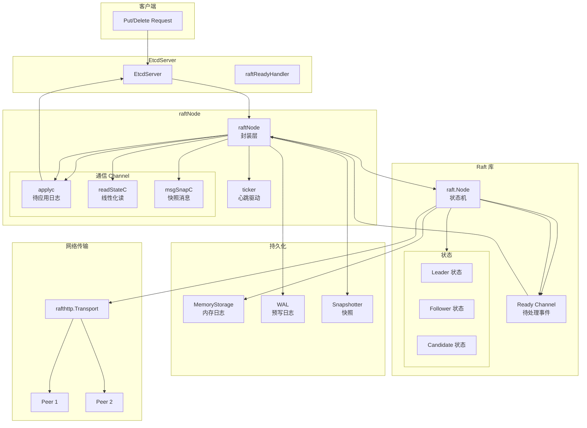
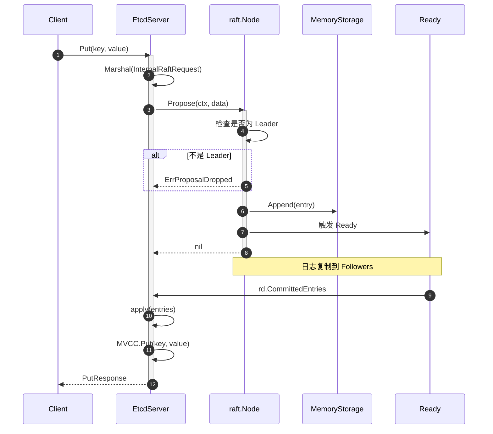
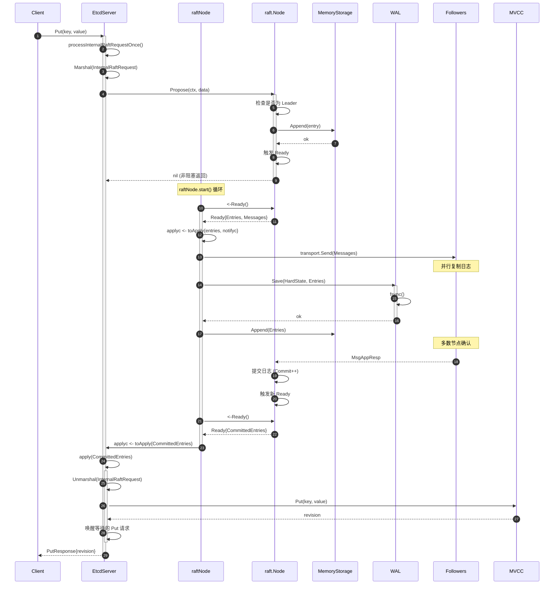
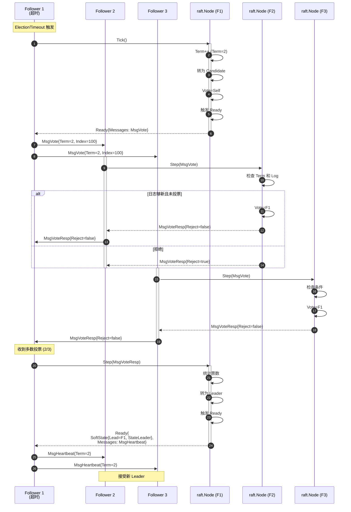
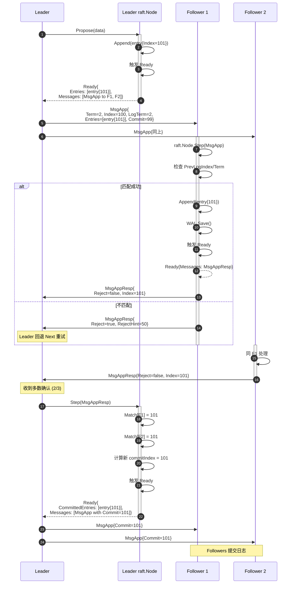
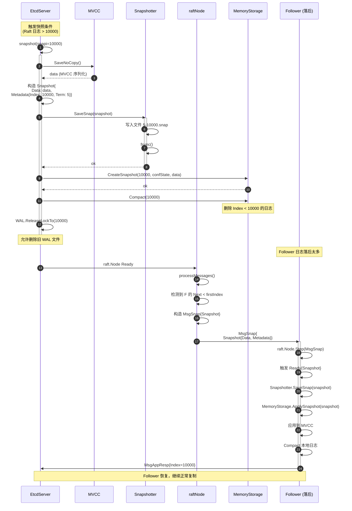
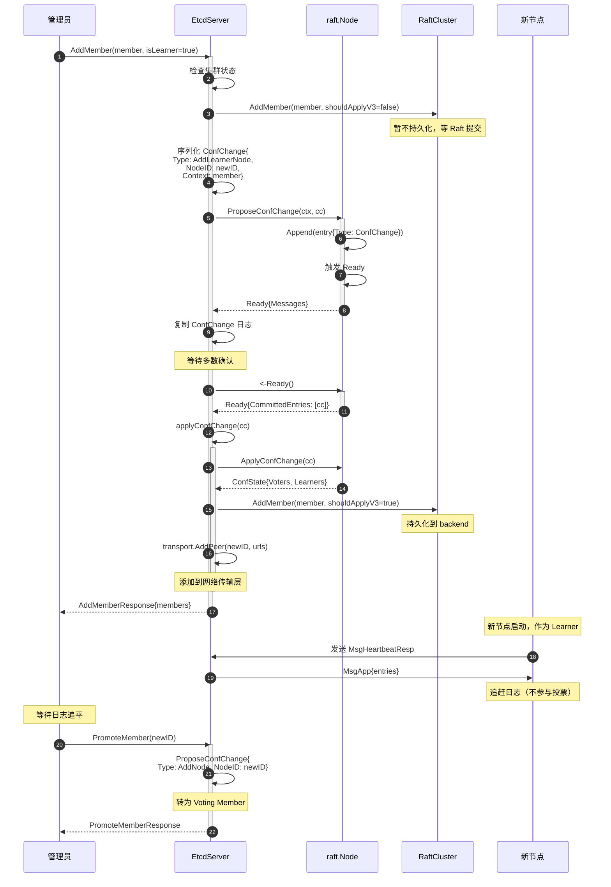
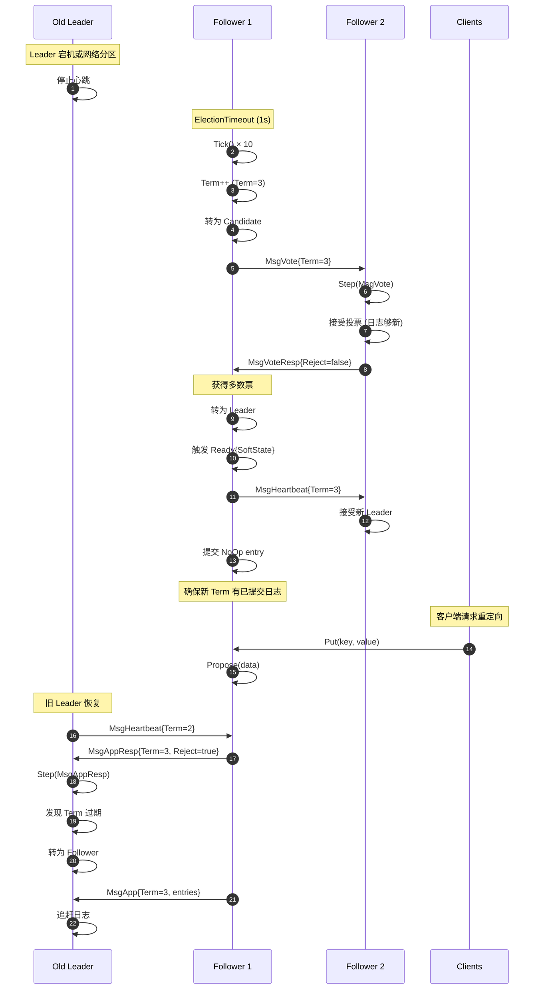

# etcd-06-Raft

## 模块概览

## 摘要

Raft 模块是 etcd 实现分布式一致性的核心，提供 Leader 选举、日志复制、成员变更等功能。etcd 使用独立的 `raft` 库（`go.etcd.io/raft/v3`），并通过 `raftNode` 封装集成到 EtcdServer 中。该模块确保集群中所有节点对操作顺序达成一致，是 etcd 高可用性的基石。

**模块职责**

- Leader 选举与心跳维护
- 日志提议（Propose）与复制
- 日志应用（Apply）到状态机
- 成员变更（AddMember、RemoveMember）
- 快照（Snapshot）与日志压缩
- 网络传输（rafthttp）

**运行环境**

- 位置：`server/etcdserver/raft.go` + `raft` 库
- 依赖：WAL（持久化日志）、Snapshot、rafthttp（网络传输）
- 并发模型：单 goroutine 驱动 Raft 状态机，通过 channel 通信

---

## 1. Raft 协议基础

### 1.1 核心概念

**角色**

- **Leader**：处理所有客户端请求，复制日志到 Followers
- **Follower**：被动接收日志，响应 Leader 和 Candidate 的 RPC
- **Candidate**：选举期间的临时角色，发起投票请求

**日志复制**

```
客户端请求 → Leader Propose
  ↓
Leader 复制日志到 Followers
  ↓
过半节点确认（Quorum）
  ↓
Leader 提交（Commit）日志
  ↓
各节点应用（Apply）到状态机
```

**Term（任期）**

- 逻辑时钟，单调递增
- Leader 选举时递增
- 用于检测过期信息

---

## 2. etcd 中的 Raft 架构



**图解与要点**

1. **三层架构**
   - **EtcdServer**：业务层，处理客户端请求，调用 Raft
   - **raftNode**：封装层，驱动 Raft 状态机，处理 Ready 事件
   - **raft.Node**：Raft 库核心，实现共识协议

2. **事件驱动**

```
   ticker.C → raftNode.tick() → raft.Node.Tick()
   Ready() → raftNode 处理 → 持久化 + 应用 + 网络发送
   Propose() → raft.Node → Ready() → 复制 → Commit → Apply
```

3. **关键通道**
   - `applyc`：已提交日志，等待应用到 MVCC
   - `readStateC`：线性化读的 ReadIndex
   - `msgSnapC`：快照消息

---

## 3. 核心组件

### 3.1 raftNode

```go
// server/etcdserver/raft.go
type raftNode struct {
    lg *zap.Logger

    tickMu       *sync.RWMutex
    latestTickTs time.Time
    raftNodeConfig

    msgSnapC   chan raftpb.Message
    applyc     chan toApply
    readStateC chan raft.ReadState

    ticker  *time.Ticker
    td      *contention.TimeoutDetector
    stopped chan struct{}
    done    chan struct{}
}

type raftNodeConfig struct {
    isIDRemoved func(id uint64) bool
    raft.Node
    raftStorage *raft.MemoryStorage
    storage     serverstorage.Storage
    heartbeat   time.Duration
    transport   rafthttp.Transporter
}
```

**职责**

- 驱动 Raft 状态机（tick、处理 Ready）
- 持久化日志和快照
- 网络消息收发
- 将已提交日志传递给 EtcdServer

### 3.2 raft.Node

```go
// raft 库接口
type Node interface {
    Tick()
    Propose(ctx context.Context, data []byte) error
    ProposeConfChange(ctx context.Context, cc raftpb.ConfChangeV2) error
    Step(ctx context.Context, msg raftpb.Message) error
    Ready() <-chan Ready
    Advance()
    ApplyConfChange(cc raftpb.ConfChangeV2) *raftpb.ConfState
    Status() Status
    // ...
}
```

**说明**

- `Tick()`：驱动选举和心跳超时
- `Propose()`：提议新日志条目
- `Step()`：处理收到的 Raft 消息
- `Ready()`：获取待处理的事件（日志、快照、消息）
- `Advance()`：确认 Ready 已处理完毕

### 3.3 Ready

```go
type Ready struct {
    SoftState         *SoftState
    pb.HardState
    ReadStates        []ReadState
    Entries           []pb.Entry
    Snapshot          pb.Snapshot
    CommittedEntries  []pb.Entry
    Messages          []pb.Message
    MustSync          bool
}
```

**字段说明**

- `SoftState`：Leader ID、节点状态（易失）
- `HardState`：Term、Vote、Commit（需持久化）
- `Entries`：未持久化的日志条目
- `CommittedEntries`：已提交待应用的日志
- `Snapshot`：待保存的快照
- `Messages`：待发送的网络消息

---

## 4. 核心流程

### 4.1 Raft 状态机驱动循环

```go
// server/etcdserver/raft.go
func (r *raftNode) start(rh *raftReadyHandler) {
    go func() {
        islead := false
        for {
            select {
            case <-r.ticker.C:
                r.tick()  // 驱动选举/心跳超时
            
            case rd := <-r.Ready():
                // 处理 SoftState（Leader 变更）
                if rd.SoftState != nil {
                    islead = rd.RaftState == raft.StateLeader
                    rh.updateLead(rd.SoftState.Lead)
                }

                // 处理 ReadState（线性化读）
                if len(rd.ReadStates) != 0 {
                    r.readStateC <- rd.ReadStates[len(rd.ReadStates)-1]
                }

                // 发送待应用日志到 applyc
                ap := toApply{
                    entries:  rd.CommittedEntries,
                    snapshot: rd.Snapshot,
                    notifyc:  make(chan struct{}, 1),
                }
                r.applyc <- ap

                // Leader 先发送消息（管道化）
                if islead {
                    r.transport.Send(r.processMessages(rd.Messages))
                }

                // 持久化快照
                if !raft.IsEmptySnap(rd.Snapshot) {
                    r.storage.SaveSnap(rd.Snapshot)
                    r.raftStorage.ApplySnapshot(rd.Snapshot)
                }

                // 持久化 WAL
                r.storage.Save(rd.HardState, rd.Entries)

                // Follower 发送消息
                if !islead {
                    r.transport.Send(r.processMessages(rd.Messages))
                }

                // 应用快照到状态机
                if !raft.IsEmptySnap(rd.Snapshot) {
                    r.raftStorage.ApplySnapshot(rd.Snapshot)
                }

                // 追加日志到内存
                r.raftStorage.Append(rd.Entries)

                // 等待应用完成
                <-ap.notifyc

                // 通知 Raft 库已处理完毕
                r.Advance()

            case <-r.stopped:
                return
            }
        }
    }()
}
```

**关键步骤**

1. **Tick**：每 100ms 触发一次，驱动超时检查
2. **Ready**：Raft 库产生待处理事件
3. **持久化**：WAL + Snapshot（先持久化再应用）
4. **网络发送**：Leader 并行发送，Follower 串行发送
5. **应用**：等待 EtcdServer 应用到 MVCC
6. **Advance**：确认处理完成

### 4.2 Propose 写请求

```go
// EtcdServer.processInternalRaftRequestOnce
func (s *EtcdServer) processInternalRaftRequestOnce(ctx context.Context, r pb.InternalRaftRequest) (*apply2.Result, error) {
    data, err := r.Marshal()
    if err != nil {
        return nil, err
    }

    // 提议到 Raft
    if err := s.r.Propose(ctx, data); err != nil {
        return nil, err
    }

    // 等待应用完成
    return s.w.Wait(r.ID)
}
```

**流程**

```
Put 请求
  ↓ 序列化
Propose(data) → raft.Node
  ↓
Ready → CommittedEntries
  ↓
applyc → EtcdServer.apply
  ↓
MVCC.Put
  ↓
返回结果给客户端
```

---

## 5. Leader 选举

### 5.1 选举触发

**场景**

- 集群启动时
- Follower 心跳超时（ElectionTimeout）
- Leader 主动 Step Down

**超时机制**

```go
// 配置
ElectionTick    = 10  // 10 * 100ms = 1s
HeartbeatTick   = 1   // 1 * 100ms = 100ms
```

**随机化**

- ElectionTimeout 在 [ElectionTick, 2*ElectionTick) 范围内随机
- 避免多个节点同时发起选举（split vote）

### 5.2 PreVote 机制

**作用**

- 避免网络分区节点频繁发起选举，扰乱集群
- Candidate 先发起 PreVote，获得多数同意后再真正选举

**流程**

```
Follower 超时
  ↓
发送 PreVote 请求
  ↓ 多数节点响应
真正发起 Vote 请求
  ↓ 多数节点投票
成为 Leader
```

---

## 6. 日志压缩与快照

### 6.1 Compact

```go
// EtcdServer.Compact
func (s *EtcdServer) Compact(ctx context.Context, r *pb.CompactionRequest) (*pb.CompactionResponse, error) {
    // MVCC Compact
    s.kv.Compact(r.Revision)
    
    // Raft Compact（异步）
    s.r.Compact(r.Revision)
    
    return &pb.CompactionResponse{}, nil
}
```

**作用**

- 删除指定 Revision 之前的历史版本
- 减少存储空间
- 加快恢复速度

### 6.2 Snapshot

**触发条件**

- Raft 日志条目达到阈值（默认 10000）
- 主动触发（Defragment 后）

**流程**

```
EtcdServer.snapshot()
  ↓ 序列化 MVCC 状态
Snapshotter.SaveSnap(snap)
  ↓ 保存到磁盘
raft.Node.Compact(index)
  ↓ 删除旧日志
WAL.ReleaseLockTo(index)
```

---

## 7. 成员变更

### 7.1 单步变更 vs 联合共识

**单步变更**（etcd 默认）

- 一次只添加/删除一个节点
- 避免出现两个多数派（majority）

**联合共识**（Raft 论文）

- 先进入联合状态（C_old,new）
- 再切换到新配置（C_new）

### 7.2 Learner 机制

**Learner**

- 非投票成员，接收日志但不参与选举和提交
- 用于新节点追赶日志（Catch-up）

**流程**

```
AddMember(isLearner=true)
  ↓ 新节点作为 Learner
等待日志追赶
  ↓ 日志接近 Leader
PromoteMember
  ↓ 转为 Voting Member
```

---

## 8. 网络传输

### 8.1 rafthttp.Transport

```go
type Transport interface {
    Start() error
    Handler() http.Handler
    Send(m []raftpb.Message)
    AddPeer(id types.ID, us []string)
    RemovePeer(id types.ID)
    // ...
}
```

**特点**

- HTTP/2 Stream 长连接
- Pipeline（管道化）发送
- 消息优先级（MsgApp、MsgSnap、MsgHeartbeat）

### 8.2 Stream 类型

| Stream | 用途 | 特点 |
|--------|------|------|
| streamTypeMsgAppV2 | 日志复制（MsgApp） | 高吞吐，批量发送 |
| streamTypeMessage | 心跳、投票等 | 低延迟，单条发送 |

---

## 9. 配置参数

| 参数 | 默认值 | 说明 |
|------|--------|------|
| `--heartbeat-interval` | 100ms | 心跳间隔 |
| `--election-timeout` | 1000ms | 选举超时（10 * heartbeat） |
| `--snapshot-count` | 10000 | 触发快照的日志条目数 |
| `--max-snapshots` | 5 | 保留的快照数量 |
| `--max-wals` | 5 | 保留的 WAL 文件数量 |

---

## 10. 监控指标

- `etcd_server_has_leader`：是否有 Leader（0/1）
- `etcd_server_leader_changes_seen_total`：Leader 变更次数
- `etcd_server_proposals_committed_total`：已提交提议数
- `etcd_server_proposals_applied_total`：已应用提议数
- `etcd_server_proposals_pending`：待处理提议数
- `etcd_server_proposals_failed_total`：失败提议数

---

## 11. 最佳实践

1. **集群规模**
   - 推荐 3/5/7 节点（奇数）
   - 容忍 (N-1)/2 节点故障

2. **网络延迟**
   - 同机房部署，RTT < 10ms
   - 跨区域需调整超时参数

3. **日志管理**
   - 定期 Compact 释放空间
   - 监控 WAL 大小

4. **成员变更**
   - 一次只变更一个节点
   - 使用 Learner 缓冲新节点

5. **故障恢复**
   - 保留足够快照和 WAL
   - 定期备份数据目录

---

## 12. 与其他模块交互

- **EtcdServer**：提交请求到 Raft，应用已提交日志
- **MVCC**：Apply 日志时写入 KV 数据
- **WAL**：持久化 Raft 日志和状态
- **Snapshotter**：保存和加载快照
- **rafthttp**：网络传输 Raft 消息

---

## API接口

## 摘要

本文档详细说明 Raft 模块的核心 API，包括日志提议、配置变更、状态查询等接口，涵盖 raft.Node 接口和 raftNode 封装层的关键方法。

---

## 1. 日志提议 API

### 1.1 Propose - 提议普通日志

#### 接口定义

```go
// raft 库接口
func (n *node) Propose(ctx context.Context, data []byte) error
```

#### 参数说明

| 参数 | 类型 | 说明 |
|------|------|------|
| ctx | context.Context | 取消上下文 |
| data | []byte | 日志数据（序列化的 InternalRaftRequest） |

#### 核心实现

```go
// raft/node.go
func (n *node) Propose(ctx context.Context, data []byte) error {
    return n.stepWait(ctx, raftpb.Message{
        Type: raftpb.MsgProp,
        Entries: []raftpb.Entry{
            {Data: data},
        },
    })
}
```

#### 调用链

```go
// EtcdServer → raftNode → raft.Node
func (s *EtcdServer) processInternalRaftRequestOnce(ctx context.Context, r pb.InternalRaftRequest) (*apply2.Result, error) {
    data, _ := r.Marshal()
    
    // 调用 raft.Node.Propose
    if err := s.r.Propose(ctx, data); err != nil {
        return nil, err
    }
    
    // 等待应用完成
    return s.w.Wait(r.ID)
}
```

#### 时序图



**说明**

- 只有 Leader 可以 Propose
- 非 Leader 返回 `ErrProposalDropped`
- Propose 成功不代表提交，需等待 Ready.CommittedEntries

---

### 1.2 ProposeConfChange - 提议配置变更

#### 接口定义

```go
func (n *node) ProposeConfChange(ctx context.Context, cc raftpb.ConfChangeV2) error
```

#### 配置变更类型

```go
// raftpb.ConfChangeV2
type ConfChangeV2 struct {
    Transition    ConfChangeTransition  // Auto/Explicit
    Changes       []ConfChangeSingle    // 变更列表
    Context       []byte                // 额外上下文
}

type ConfChangeSingle struct {
    Type   ConfChangeType  // AddNode/RemoveNode/AddLearnerNode/...
    NodeID uint64
}
```

#### 核心实现

```go
// EtcdServer.AddMember
func (s *EtcdServer) AddMember(ctx context.Context, memb membership.Member) ([]*membership.Member, error) {
    cc := raftpb.ConfChange{
        Type:    raftpb.ConfChangeAddNode,
        NodeID:  uint64(memb.ID),
        Context: b,
    }
    
    return s.configure(ctx, cc)
}

func (s *EtcdServer) configure(ctx context.Context, cc raftpb.ConfChange) ([]*membership.Member, error) {
    cc.ID = s.reqIDGen.Next()
    
    // 提议配置变更
    if err := s.r.ProposeConfChange(ctx, cc); err != nil {
        return nil, err
    }
    
    // 等待应用
    select {
    case <-ctx.Done():
        return nil, ctx.Err()
    case resp := <-s.w.Wait(cc.ID):
        return resp.(*confChangeResponse).membs, resp.Err()
    }
}
```

---

## 2. 消息处理 API

### 2.1 Step - 处理 Raft 消息

#### 接口定义

```go
func (n *node) Step(ctx context.Context, m raftpb.Message) error
```

#### 消息类型

| 类型 | 说明 |
|------|------|
| MsgApp | 日志复制（Leader → Follower） |
| MsgAppResp | 日志复制响应 |
| MsgVote | 投票请求 |
| MsgVoteResp | 投票响应 |
| MsgHeartbeat | 心跳 |
| MsgHeartbeatResp | 心跳响应 |
| MsgSnap | 快照消息 |

#### 调用链

```go
// rafthttp.Peer 接收消息 → EtcdServer.Process → raft.Node.Step
func (s *EtcdServer) Process(ctx context.Context, m raftpb.Message) error {
    if s.cluster.IsIDRemoved(types.ID(m.From)) {
        return httptypes.NewHTTPError(http.StatusForbidden, "rejected message from removed member")
    }
    
    return s.r.Step(ctx, m)
}
```

---

## 3. 状态驱动 API

### 3.1 Tick - 驱动超时

#### 接口定义

```go
func (n *node) Tick()
```

#### 核心实现

```go
// raftNode.tick
func (r *raftNode) tick() {
    r.tickMu.Lock()
    r.Tick()  // 调用 raft.Node.Tick()
    r.latestTickTs = time.Now()
    r.tickMu.Unlock()
}

// raftNode.start 中定时调用
for {
    select {
    case <-r.ticker.C:  // 每 100ms 触发
        r.tick()
    // ...
    }
}
```

**作用**

- 驱动选举超时（ElectionTimeout）
- 驱动心跳超时（HeartbeatTimeout）
- 检查 Leader lease

---

### 3.2 Ready - 获取待处理事件

#### 接口定义

```go
func (n *node) Ready() <-chan Ready
```

#### Ready 结构

```go
type Ready struct {
    SoftState         *SoftState         // Leader 变更
    pb.HardState                         // Term、Vote、Commit
    ReadStates        []ReadState        // 线性化读
    Entries           []pb.Entry         // 待持久化日志
    Snapshot          pb.Snapshot        // 待保存快照
    CommittedEntries  []pb.Entry         // 已提交待应用
    Messages          []pb.Message       // 待发送消息
    MustSync          bool               // 是否必须 fsync
}
```

#### 处理流程

```go
func (r *raftNode) start(rh *raftReadyHandler) {
    go func() {
        for {
            select {
            case rd := <-r.Ready():
                // 1. 处理 SoftState（Leader 变更）
                if rd.SoftState != nil {
                    rh.updateLead(rd.SoftState.Lead)
                }
                
                // 2. 发送待应用日志
                r.applyc <- toApply{
                    entries:  rd.CommittedEntries,
                    snapshot: rd.Snapshot,
                }
                
                // 3. 发送网络消息
                r.transport.Send(rd.Messages)
                
                // 4. 持久化
                r.storage.Save(rd.HardState, rd.Entries)
                
                // 5. 追加到内存
                r.raftStorage.Append(rd.Entries)
                
                // 6. 通知处理完成
                r.Advance()
            }
        }
    }()
}
```

---

### 3.3 Advance - 确认 Ready 已处理

#### 接口定义

```go
func (n *node) Advance()
```

**说明**

- 必须在处理完 Ready 后调用
- 通知 Raft 库可以生成下一个 Ready
- 如果不调用，Ready() channel 会阻塞

---

## 4. 配置变更应用 API

### 4.1 ApplyConfChange - 应用配置变更

#### 接口定义

```go
func (n *node) ApplyConfChange(cc raftpb.ConfChangeV2) *raftpb.ConfState
```

#### 调用时机

```go
// EtcdServer.applyConfChange
func (s *EtcdServer) applyConfChange(cc raftpb.ConfChange, confState *raftpb.ConfState, shouldApplyV3 membership.ShouldApplyV3) (bool, error) {
    // 应用到 Raft
    *confState = *s.r.ApplyConfChange(cc)
    
    // 应用到 cluster
    switch cc.Type {
    case raftpb.ConfChangeAddNode:
        s.cluster.AddMember(&m, shouldApplyV3)
    case raftpb.ConfChangeRemoveNode:
        s.cluster.RemoveMember(types.ID(cc.NodeID), shouldApplyV3)
    // ...
    }
    
    return true, nil
}
```

---

## 5. 状态查询 API

### 5.1 Status - 获取 Raft 状态

#### 接口定义

```go
func (n *node) Status() Status

type Status struct {
    ID                uint64
    pb.HardState
    SoftState
    Applied           uint64
    Progress          map[uint64]tracker.Progress
    LeadTransferee    uint64
}
```

#### 使用示例

```go
// 检查节点状态
status := s.r.Status()
if status.Lead == raft.None {
    return errors.New("no leader")
}

// 检查日志复制进度
for id, pr := range status.Progress {
    log.Printf("Node %d: Match=%d, Next=%d", id, pr.Match, pr.Next)
}
```

---

### 5.2 ReadIndex - 线性化读

#### 接口定义

```go
func (n *node) ReadIndex(ctx context.Context, rctx []byte) error
```

#### 核心实现

```go
// EtcdServer.LinearizableReadNotify
func (s *EtcdServer) LinearizableReadNotify(ctx context.Context) (*apply2.RequestInfo, error) {
    reqID := s.reqIDGen.Next()
    
    // 请求 ReadIndex
    if err := s.r.ReadIndex(ctx, idutil.Uint64ToBytes(reqID)); err != nil {
        return nil, err
    }
    
    // 等待 readStateC
    select {
    case rs := <-s.r.readStateC:
        return &apply2.RequestInfo{
            ID:            reqID,
            ReadIndexResp: rs,
        }, nil
    case <-ctx.Done():
        return nil, ctx.Err()
    }
}
```

---

## 6. 日志压缩 API

### 6.1 Compact - 压缩 Raft 日志

```go
// raftNode
func (r *raftNode) compact(index uint64) {
    r.raftStorage.Compact(index)
}

// EtcdServer.snapshot
func (s *EtcdServer) snapshot(snapi uint64, confState raftpb.ConfState) {
    d, err := s.store.SaveNoCopy()
    
    snap := raftpb.Snapshot{
        Data: d,
        Metadata: raftpb.SnapshotMetadata{
            Index:     snapi,
            Term:      term,
            ConfState: confState,
        },
    }
    
    s.r.storage.SaveSnap(snap)
    s.r.raftStorage.CreateSnapshot(snapi, &confState, d)
    s.r.raftStorage.Compact(snapi)
}
```

---

## 7. 异常与边界

| 错误 | 说明 | 处理 |
|------|------|------|
| ErrProposalDropped | 非 Leader 提议 | 客户端重定向到 Leader |
| ErrStopped | 节点已停止 | 返回错误 |
| ErrSnapshotTemporarilyUnavailable | 快照临时不可用 | 重试 |
| ErrCompacted | 日志已压缩 | 发送快照 |

---

## 8. 性能优化

1. **批量 Propose**
   - 客户端批量发送请求
   - Raft 批量复制日志

2. **Pipeline 发送**
   - rafthttp 支持管道化
   - 减少 RTT 影响

3. **并行持久化**
   - Leader 并行发送和持久化
   - Follower 串行处理

4. **ReadIndex 优化**
   - 避免日志复制，只确认 Leader lease
   - 线性化读性能提升

---

## 9. 最佳实践

1. **Propose 超时设置**
   - 根据网络延迟调整
   - 建议 > 2 * RTT + 持久化时间

2. **配置变更**
   - 一次只变更一个节点
   - 使用 Learner 缓冲新节点

3. **日志压缩**
   - 定期触发 Compact
   - 避免 WAL 过大

4. **监控关键指标**
   - `proposals_pending`：待处理提议数
   - `proposals_failed_total`：失败提议数
   - `leader_changes_seen_total`：Leader 变更次数

---

## 数据结构

## 摘要

本文档详细描述 Raft 模块的核心数据结构，包括 raftNode、raft.Node、Entry、Snapshot、HardState、SoftState 等，通过 UML 类图和详细字段说明帮助理解其设计与实现。

---

## 1. 核心数据结构 UML

```mermaid
classDiagram
    class raftNode {
        +lg *zap.Logger
        +tickMu *sync.RWMutex
        +latestTickTs time.Time
        +raftNodeConfig
        +msgSnapC chan Message
        +applyc chan toApply
        +readStateC chan ReadState
        +ticker *time.Ticker
        +stopped chan struct{}
        +done chan struct{}
        
        +tick() void
        +start(rh) void
        +Propose(ctx, data) error
        +Process(ctx, m) error
    }

    class raftNodeConfig {
        +isIDRemoved func(uint64) bool
        +Node raft.Node
        +raftStorage *MemoryStorage
        +storage Storage
        +heartbeat time.Duration
        +transport Transporter
    }

    class Node {
        <<interface>>
        +Tick() void
        +Propose(ctx, data) error
        +ProposeConfChange(ctx, cc) error
        +Step(ctx, m) error
        +Ready() ~-chan Ready~
        +Advance() void
        +ApplyConfChange(cc) *ConfState
        +Status() Status
        +ReadIndex(ctx, rctx) error
    }

    class Ready {
        +SoftState *SoftState
        +HardState HardState
        +ReadStates []ReadState
        +Entries []Entry
        +Snapshot Snapshot
        +CommittedEntries []Entry
        +Messages []Message
        +MustSync bool
    }

    class Entry {
        +Term uint64
        +Index uint64
        +Type EntryType
        +Data []byte
    }

    class Snapshot {
        +Data []byte
        +Metadata SnapshotMetadata
    }

    class HardState {
        +Term uint64
        +Vote uint64
        +Commit uint64
    }

    class SoftState {
        +Lead uint64
        +RaftState StateType
    }

    raftNode --> raftNodeConfig
    raftNode --> Node : 使用
    raftNode --> Ready : 处理
    Node --> Ready : 生成
    Ready --> Entry : 包含
    Ready --> Snapshot : 包含
    Ready --> HardState : 包含
    Ready --> SoftState : 包含
```

---

## 2. raftNode

### 2.1 结构定义

```go
// server/etcdserver/raft.go
type raftNode struct {
    lg *zap.Logger

    tickMu       *sync.RWMutex
    latestTickTs time.Time
    raftNodeConfig

    msgSnapC   chan raftpb.Message
    applyc     chan toApply
    readStateC chan raft.ReadState

    ticker  *time.Ticker
    td      *contention.TimeoutDetector
    stopped chan struct{}
    done    chan struct{}
}
```

### 2.2 字段说明

| 字段 | 类型 | 说明 |
|------|------|------|
| `tickMu` | `*sync.RWMutex` | 保护 Tick 操作和时间戳 |
| `latestTickTs` | `time.Time` | 最新 Tick 时间戳 |
| `msgSnapC` | `chan Message` | 快照消息通道（缓冲=maxInFlightMsgSnap） |
| `applyc` | `chan toApply` | 待应用日志通道（无缓冲） |
| `readStateC` | `chan ReadState` | 线性化读 ReadState 通道 |
| `ticker` | `*time.Ticker` | 心跳定时器（默认 100ms） |
| `td` | `*TimeoutDetector` | 心跳超时检测器 |
| `stopped` | `chan struct{}` | 停止信号 |
| `done` | `chan struct{}` | 完成信号 |

---

## 3. raftNodeConfig

### 3.1 结构定义

```go
type raftNodeConfig struct {
    lg *zap.Logger

    isIDRemoved func(id uint64) bool
    raft.Node
    raftStorage *raft.MemoryStorage
    storage     serverstorage.Storage
    heartbeat   time.Duration
    transport   rafthttp.Transporter
}
```

### 3.2 字段说明

| 字段 | 类型 | 说明 |
|------|------|------|
| `isIDRemoved` | `func(uint64) bool` | 检查节点是否已从集群移除 |
| `Node` | `raft.Node` | Raft 库核心接口（嵌入） |
| `raftStorage` | `*raft.MemoryStorage` | 内存日志存储 |
| `storage` | `serverstorage.Storage` | WAL + Snapshot 封装 |
| `heartbeat` | `time.Duration` | 心跳间隔 |
| `transport` | `rafthttp.Transporter` | 网络传输层 |

---

## 4. Ready

### 4.1 结构定义

```go
// raft/node.go
type Ready struct {
    *SoftState
    pb.HardState
    ReadStates        []ReadState
    Entries           []pb.Entry
    Snapshot          pb.Snapshot
    CommittedEntries  []pb.Entry
    Messages          []pb.Message
    MustSync          bool
}
```

### 4.2 字段说明

| 字段 | 类型 | 说明 |
|------|------|------|
| `SoftState` | `*SoftState` | Leader ID、节点状态（易失，可选） |
| `HardState` | `HardState` | Term、Vote、Commit（需持久化） |
| `ReadStates` | `[]ReadState` | 线性化读状态 |
| `Entries` | `[]Entry` | 待持久化的日志条目 |
| `Snapshot` | `Snapshot` | 待保存的快照 |
| `CommittedEntries` | `[]Entry` | 已提交待应用的日志 |
| `Messages` | `[]Message` | 待发送的网络消息 |
| `MustSync` | `bool` | 是否必须 fsync（重要变更） |

### 4.3 处理顺序

```

1. 检查 SoftState（Leader 变更）
2. 发送 CommittedEntries 到 applyc
3. Leader 发送 Messages（并行）
4. 持久化 Snapshot
5. 持久化 HardState + Entries（fsync）
6. Follower 发送 Messages（串行）
7. 应用 Snapshot 到 MemoryStorage
8. 追加 Entries 到 MemoryStorage
9. 等待应用完成
10. Advance()

```

---

## 5. Entry

### 5.1 结构定义

```go
// raftpb/raft.proto
message Entry {
    uint64 Term  = 2;
    uint64 Index = 3;
    EntryType Type = 1;
    bytes Data     = 4;
}

enum EntryType {
    EntryNormal       = 0;
    EntryConfChange   = 1;
    EntryConfChangeV2 = 2;
}
```

### 5.2 字段说明

| 字段 | 类型 | 说明 |
|------|------|------|
| `Term` | `uint64` | 日志条目所属 Term |
| `Index` | `uint64` | 日志索引（单调递增） |
| `Type` | `EntryType` | 条目类型（Normal/ConfChange） |
| `Data` | `[]byte` | 日志数据（序列化的 InternalRaftRequest 或 ConfChange） |

### 5.3 持久化

**WAL 格式**

```
Entry → protobuf 序列化 → WAL Record
```

**内存格式**

```go
type MemoryStorage struct {
    ents []pb.Entry  // 日志条目数组
    // ...
}
```

---

## 6. Snapshot

### 6.1 结构定义

```go
message Snapshot {
    bytes Data                 = 1;
    SnapshotMetadata Metadata = 2;
}

message SnapshotMetadata {
    ConfState ConfState = 1;
    uint64 Index             = 2;
    uint64 Term              = 3;
}
```

### 6.2 字段说明

| 字段 | 类型 | 说明 |
|------|------|------|
| `Data` | `[]byte` | 快照数据（序列化的 MVCC 状态） |
| `Metadata.Index` | `uint64` | 快照对应的日志索引 |
| `Metadata.Term` | `uint64` | 快照对应的 Term |
| `Metadata.ConfState` | `ConfState` | 快照时的集群配置 |

### 6.3 存储格式

**文件名**

```
<snap-dir>/<term>-<index>.snap
```

**内容**

- Header：CRC + Size
- Body：protobuf 序列化的 Snapshot

---

## 7. HardState

### 7.1 结构定义

```go
message HardState {
    uint64 term   = 1;
    uint64 vote   = 2;
    uint64 commit = 3;
}
```

### 7.2 字段说明

| 字段 | 类型 | 说明 |
|------|------|------|
| `term` | `uint64` | 当前 Term |
| `vote` | `uint64` | 当前 Term 的投票对象（NodeID） |
| `commit` | `uint64` | 已提交的最大日志索引 |

**持久化**

- 存储在 WAL 的 stateType 记录中
- 每次变更都需要 fsync

---

## 8. SoftState

### 8.1 结构定义

```go
type SoftState struct {
    Lead      uint64
    RaftState StateType
}

type StateType uint64

const (
    StateFollower  StateType = iota
    StateCandidate
    StateLeader
    StatePreCandidate
)
```

### 8.2 字段说明

| 字段 | 类型 | 说明 |
|------|------|------|
| `Lead` | `uint64` | 当前 Leader 的 NodeID（raft.None 表示无） |
| `RaftState` | `StateType` | 当前节点状态 |

**特点**

- 易失状态（不持久化）
- 可通过日志和配置重建

---

## 9. Message

### 9.1 结构定义

```go
message Message {
    MessageType Type = 1;
    uint64 To        = 2;
    uint64 From      = 3;
    uint64 Term      = 4;
    uint64 LogTerm   = 5;
    uint64 Index     = 6;
    repeated Entry Entries = 7;
    uint64 Commit    = 8;
    Snapshot Snapshot = 9;
    bool Reject      = 10;
    uint64 RejectHint = 11;
    bytes Context    = 12;
}
```

### 9.2 消息类型

| 类型 | 说明 | 方向 |
|------|------|------|
| MsgApp | 日志复制 | Leader → Follower |
| MsgAppResp | 日志复制响应 | Follower → Leader |
| MsgVote | 投票请求 | Candidate → All |
| MsgVoteResp | 投票响应 | All → Candidate |
| MsgHeartbeat | 心跳 | Leader → Follower |
| MsgHeartbeatResp | 心跳响应 | Follower → Leader |
| MsgSnap | 快照传输 | Leader → Follower |
| MsgProp | 客户端提议 | 内部 |

---

## 10. toApply

### 10.1 结构定义

```go
// server/etcdserver/raft.go
type toApply struct {
    entries  []raftpb.Entry
    snapshot raftpb.Snapshot
    notifyc chan struct{}
    raftAdvancedC <-chan struct{}
}
```

### 10.2 字段说明

| 字段 | 类型 | 说明 |
|------|------|------|
| `entries` | `[]Entry` | 已提交待应用的日志 |
| `snapshot` | `Snapshot` | 待应用的快照 |
| `notifyc` | `chan struct{}` | 应用完成通知（raftNode → EtcdServer） |
| `raftAdvancedC` | `<-chan struct{}` | Raft Advance 完成通知 |

**流程**

```
raftNode → applyc → EtcdServer.apply
  ↓
应用到 MVCC
  ↓
close(notifyc)
  ↓
raftNode 继续处理下一个 Ready
```

---

## 11. MemoryStorage

### 11.1 结构定义

```go
// raft/storage.go
type MemoryStorage struct {
    sync.Mutex
    hardState pb.HardState
    snapshot  pb.Snapshot
    ents      []pb.Entry
}
```

### 11.2 关键方法

```go
// 获取日志范围
func (ms *MemoryStorage) Entries(lo, hi, maxSize uint64) ([]pb.Entry, error)

// 追加日志
func (ms *MemoryStorage) Append(entries []pb.Entry) error

// 应用快照
func (ms *MemoryStorage) ApplySnapshot(snap pb.Snapshot) error

// 压缩日志
func (ms *MemoryStorage) Compact(compactIndex uint64) error
```

**内存布局**

```
ents: [dummy] [index=1] [index=2] ... [index=N]
                  ↑                       ↑
              snapshot.Index           lastIndex
```

---

## 12. Config

### 12.1 结构定义

```go
// raft/raft.go
type Config struct {
    ID                        uint64
    ElectionTick              int
    HeartbeatTick             int
    Storage                   Storage
    Applied                   uint64
    MaxSizePerMsg             uint64
    MaxInflightMsgs           int
    CheckQuorum               bool
    PreVote                   bool
    Logger                    Logger
    DisableProposalForwarding bool
}
```

### 12.2 字段说明

| 字段 | 默认值 | 说明 |
|------|--------|------|
| `ID` | - | 节点 ID（必填） |
| `ElectionTick` | 10 | 选举超时（tick 数） |
| `HeartbeatTick` | 1 | 心跳间隔（tick 数） |
| `MaxSizePerMsg` | 1MB | 单条消息最大大小 |
| `MaxInflightMsgs` | 512 | 最大在途消息数 |
| `CheckQuorum` | true | Leader 检查 Quorum |
| `PreVote` | false | 启用 PreVote 避免干扰 |

---

## 13. 持久化格式

### 13.1 WAL Record

```go
type Record struct {
    Type uint64
    Crc  uint32
    Data []byte
}
```

**类型**

- `metadataType`：元数据（NodeID、ClusterID）
- `entryType`：日志条目
- `stateType`：HardState
- `crcType`：CRC 校验
- `snapshotType`：快照元数据

### 13.2 Snapshot 文件

```
<snap-dir>/
  ├── 1-100.snap     # term=1, index=100
  ├── 2-500.snap     # term=2, index=500
  └── 3-1000.snap    # term=3, index=1000
```

---

## 14. 内存占用分析

### 14.1 raftNode

```
raftNode:

  - 基础结构: ~200 bytes
  - ticker: ~48 bytes
  - channels: ~数百 bytes

MemoryStorage (10000 条日志):

  - ents: ~10000 * 200 bytes = 2 MB
  - snapshot: ~数 MB（取决于 MVCC 大小）

```

### 14.2 Ready

```
单个 Ready (100 条日志):

  - Entries: ~100 * 200 bytes = 20 KB
  - CommittedEntries: ~20 KB
  - Messages: ~数 KB
  总计: ~50 KB

```

---

## 15. 最佳实践

1. **日志管理**
   - 定期 Compact 避免内存过大
   - 监控 MemoryStorage 大小

2. **快照策略**
   - 触发阈值：10000 条日志
   - 保留数量：5 个快照 + 5 个 WAL

3. **消息优化**
   - 批量发送减少 RTT
   - 控制 MaxInflightMsgs 避免拥塞

4. **监控指标**
   - `raft_log_size`：日志大小
   - `raft_snapshot_count`：快照数量
   - `raft_inflight_messages`：在途消息数

---

## 时序图

## 摘要

本文档通过详细时序图展示 Raft 模块的关键操作流程，包括写请求流程、Leader 选举、日志复制、成员变更、快照创建等场景。

---

## 1. 写请求完整流程



**要点**

- 步骤 6-9：Propose 非阻塞返回，日志追加到 MemoryStorage
- 步骤 14-17：Leader 并行发送消息和持久化 WAL
- 步骤 22-26：多数确认后提交，推送到 applyc
- 步骤 29-33：EtcdServer 应用到 MVCC，返回客户端

---

## 2. Leader 选举流程



**要点**

- 步骤 4-8：Follower 超时，转为 Candidate，Term++，发起投票
- 步骤 11-15：其他节点检查 Term 和日志，决定是否投票
- 步骤 21-26：获得多数票后转为 Leader，发送心跳

---

## 3. 日志复制流程



**要点**

- 步骤 6-7：Leader 发送 MsgApp 并行复制
- 步骤 10-17：Follower 检查 PrevLogIndex/Term，追加日志
- 步骤 22-28：Leader 收到多数确认，更新 commitIndex
- 步骤 30-31：Leader 通知 Followers 更新 Commit

---

## 4. 快照创建与发送流程



**要点**

- 步骤 4-13：创建快照并持久化
- 步骤 14-15：Compact Raft 日志，释放空间
- 步骤 21-24：检测到 Follower 落后，发送快照
- 步骤 27-32：Follower 应用快照，恢复到最新状态

---

## 5. AddMember 成员变更流程



**要点**

- 步骤 6-9：提议 ConfChange，序列化成员信息
- 步骤 14-21：ConfChange 提交后，应用到 Raft 和 Cluster
- 步骤 26-29：新节点作为 Learner 追赶日志
- 步骤 32-35：Promote 为 Voting Member

---

## 6. Leader 切换流程



**要点**

- 步骤 3-11：Follower 超时，发起选举，获得多数票
- 步骤 12-15：新 Leader 发送心跳，确立地位
- 步骤 16-17：提交 NoOp entry（Raft 论文建议）
- 步骤 22-27：旧 Leader 恢复，发现 Term 过期，转为 Follower

---

## 7. 性能分析

### 7.1 写请求延迟

```
Put 请求延迟组成：

  - Propose: < 1ms（内存追加）
  - 网络 RTT: ~10ms（局域网）
  - WAL fsync: ~5ms（SSD）
  - 多数确认: ~网络RTT
  - Apply: ~2ms（MVCC 写入）
  

总延迟: ~20-30ms
```

### 7.2 Leader 选举延迟

```
选举延迟：

  - ElectionTimeout: 1000ms（随机化）
  - 投票 RTT: ~10ms
  - 新 Leader 心跳: ~100ms
  

总延迟: ~1.1s - 2.1s
```

### 7.3 快照创建延迟

```
快照创建：

  - MVCC 序列化: ~100ms（1GB 数据）
  - 写文件: ~50ms
  - Compact: ~10ms
  

总延迟: ~200ms
```

---

## 8. 最佳实践

1. **Propose 超时**
   - 设置合理超时（> 2 * RTT + fsync）
   - 监控 `proposals_pending`

2. **Leader 选举**
   - 调整 ElectionTimeout 适应网络延迟
   - 使用 PreVote 避免干扰

3. **日志复制**
   - 监控 Follower Match 进度
   - 及时触发快照避免落后过多

4. **成员变更**
   - 使用 Learner 缓冲新节点
   - 一次只变更一个节点

5. **监控关键指标**
   - `proposals_committed_total`
   - `leader_changes_seen_total`
   - `proposals_failed_total`

---
