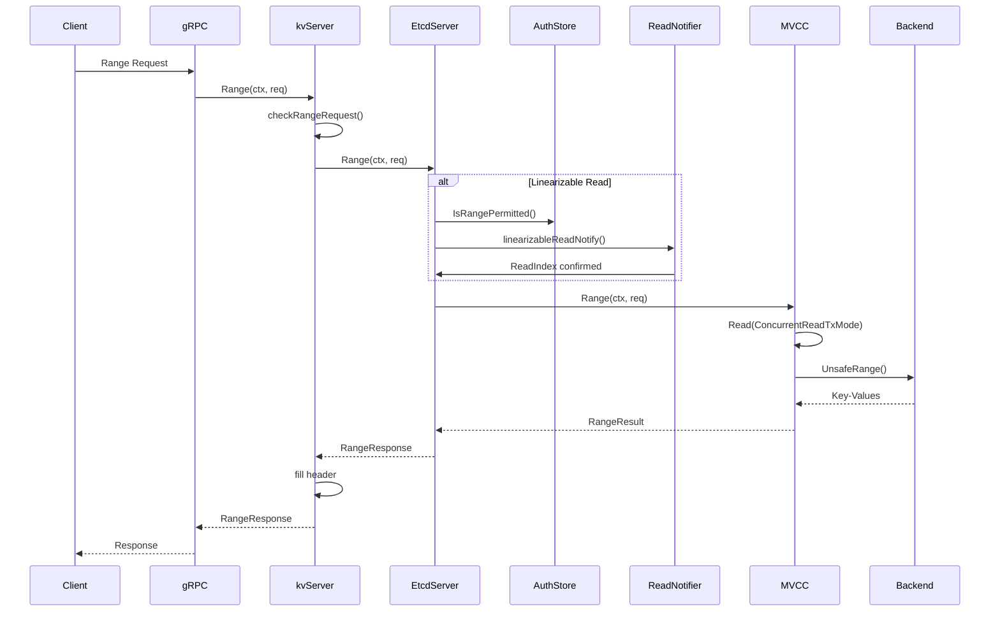
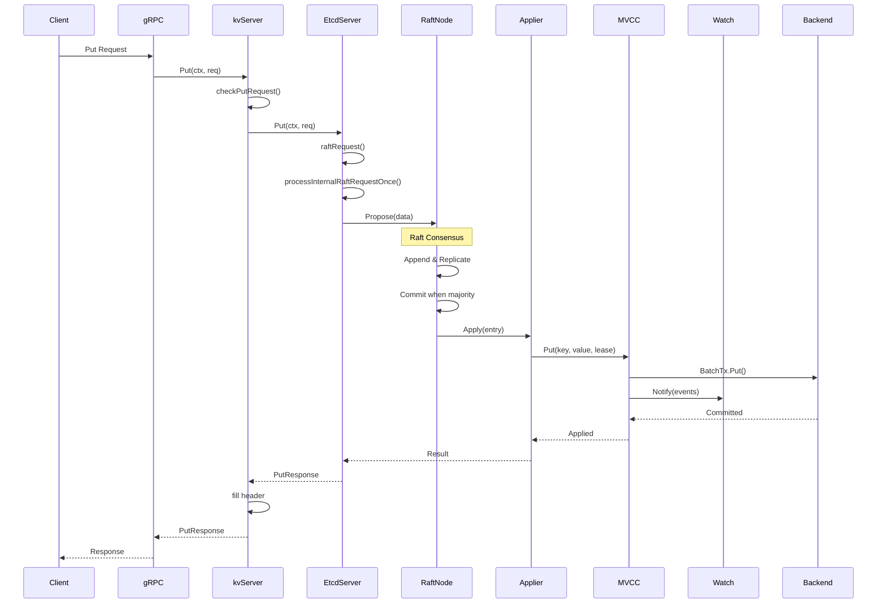
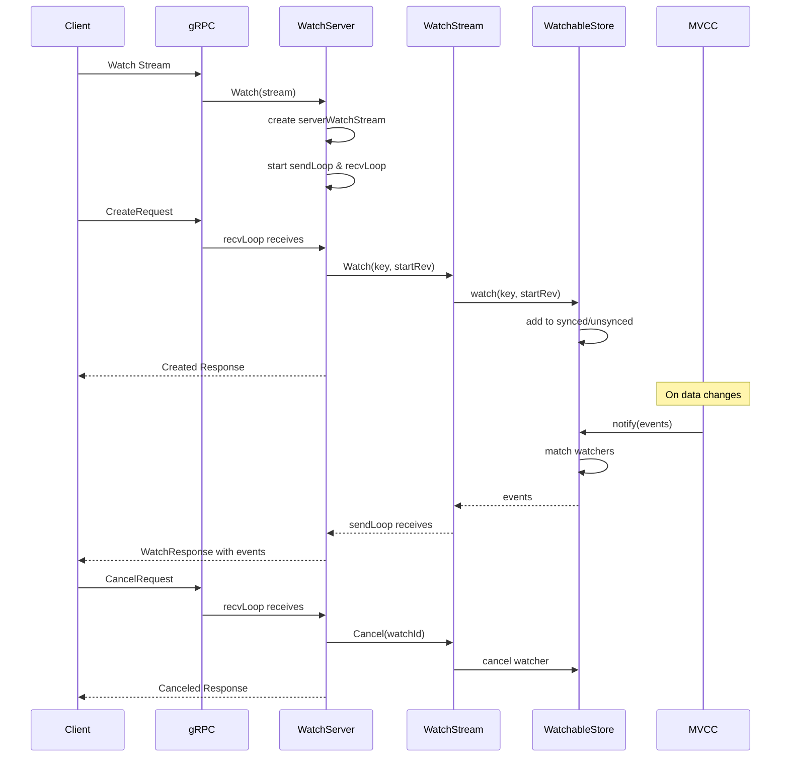

# etcd 对外 API 深入分析与调用链路

etcd 通过 gRPC 对外提供服务，主要包含 KV、Watch、Lease、Cluster、Auth、Maintenance 等服务。本文将深入分析每个 API 的实现细节和完整调用链路。

## 1. gRPC 服务概览

### 1.1 服务定义

etcd 在 `api/etcdserverpb/rpc.proto` 中定义了以下 gRPC 服务：

```protobuf
// KV 服务 - 键值操作
service KV {
  rpc Range(RangeRequest) returns (RangeResponse);
  rpc Put(PutRequest) returns (PutResponse);
  rpc DeleteRange(DeleteRangeRequest) returns (DeleteRangeResponse);
  rpc Txn(TxnRequest) returns (TxnResponse);
  rpc Compact(CompactionRequest) returns (CompactionResponse);
}

// Watch 服务 - 监听变化
service Watch {
  rpc Watch(stream WatchRequest) returns (stream WatchResponse);
}

// Lease 服务 - 租约管理
service Lease {
  rpc LeaseGrant(LeaseGrantRequest) returns (LeaseGrantResponse);
  rpc LeaseRevoke(LeaseRevokeRequest) returns (LeaseRevokeResponse);
  rpc LeaseKeepAlive(stream LeaseKeepAliveRequest) returns (stream LeaseKeepAliveResponse);
  rpc LeaseTimeToLive(LeaseTimeToLiveRequest) returns (LeaseTimeToLiveResponse);
  rpc LeaseLeases(LeaseLeasesRequest) returns (LeaseLeasesResponse);
}

// Cluster 服务 - 集群管理
service Cluster {
  rpc MemberAdd(MemberAddRequest) returns (MemberAddResponse);
  rpc MemberRemove(MemberRemoveRequest) returns (MemberRemoveResponse);
  rpc MemberUpdate(MemberUpdateRequest) returns (MemberUpdateResponse);
  rpc MemberList(MemberListRequest) returns (MemberListResponse);
  rpc MemberPromote(MemberPromoteRequest) returns (MemberPromoteResponse);
}

// Auth 服务 - 认证授权
service Auth {
  rpc AuthEnable(AuthEnableRequest) returns (AuthEnableResponse);
  rpc AuthDisable(AuthDisableRequest) returns (AuthDisableResponse);
  rpc Authenticate(AuthenticateRequest) returns (AuthenticateResponse);
  rpc UserAdd(AuthUserAddRequest) returns (AuthUserAddResponse);
  rpc UserDelete(AuthUserDeleteRequest) returns (AuthUserDeleteResponse);
  rpc RoleAdd(AuthRoleAddRequest) returns (AuthRoleAddResponse);
  rpc RoleDelete(AuthRoleDeleteRequest) returns (AuthRoleDeleteResponse);
}

// Maintenance 服务 - 维护操作
service Maintenance {
  rpc Alarm(AlarmRequest) returns (AlarmResponse);
  rpc Status(StatusRequest) returns (StatusResponse);
  rpc Defragment(DefragmentRequest) returns (DefragmentResponse);
  rpc Hash(HashRequest) returns (HashResponse);
  rpc HashKV(HashKVRequest) returns (HashKVResponse);
  rpc Snapshot(SnapshotRequest) returns (stream SnapshotResponse);
  rpc MoveLeader(MoveLeaderRequest) returns (MoveLeaderResponse);
}
```

### 1.2 gRPC 服务器初始化

```go
// server/etcdserver/api/v3rpc/grpc.go
func Server(s *etcdserver.EtcdServer, tls *tls.Config, interceptor grpc.UnaryServerInterceptor, gopts ...grpc.ServerOption) *grpc.Server {
    var opts []grpc.ServerOption
    opts = append(opts, grpc.CustomCodec(&codec{}))
    
    // TLS 配置
    if tls != nil {
        opts = append(opts, grpc.Creds(credentials.NewTransportCredential(tls)))
    }

    // 监控指标
    serverMetrics := grpc_prometheus.NewServerMetrics()
    prometheus.Register(serverMetrics)

    // 拦截器链
    chainUnaryInterceptors := []grpc.UnaryServerInterceptor{
        newLogUnaryInterceptor(s),      // 日志拦截器
        newUnaryInterceptor(s),         // 业务拦截器
        serverMetrics.UnaryServerInterceptor(), // 指标拦截器
    }
    
    chainStreamInterceptors := []grpc.StreamServerInterceptor{
        newStreamInterceptor(s),        // 流拦截器
        serverMetrics.StreamServerInterceptor(),
    }

    opts = append(opts, grpc.ChainUnaryInterceptor(chainUnaryInterceptors...))
    opts = append(opts, grpc.ChainStreamInterceptor(chainStreamInterceptors...))

    // 消息大小限制
    opts = append(opts, grpc.MaxRecvMsgSize(int(s.Cfg.MaxRequestBytesWithOverhead())))
    opts = append(opts, grpc.MaxSendMsgSize(maxSendBytes))
    opts = append(opts, grpc.MaxConcurrentStreams(s.Cfg.MaxConcurrentStreams))

    grpcServer := grpc.NewServer(append(opts, gopts...)...)

    // 注册服务
    pb.RegisterKVServer(grpcServer, NewQuotaKVServer(s))
    pb.RegisterWatchServer(grpcServer, NewWatchServer(s))
    pb.RegisterLeaseServer(grpcServer, NewQuotaLeaseServer(s))
    pb.RegisterClusterServer(grpcServer, NewClusterServer(s))
    pb.RegisterAuthServer(grpcServer, NewAuthServer(s))
    pb.RegisterMaintenanceServer(grpcServer, NewMaintenanceServer(s))

    return grpcServer
}
```

## 2. KV 服务详细分析

### 2.1 Range API - 读取键值

#### API 入口函数

```go
// server/etcdserver/api/v3rpc/key.go
func (s *kvServer) Range(ctx context.Context, r *pb.RangeRequest) (*pb.RangeResponse, error) {
    // 1. 请求验证
    if err := checkRangeRequest(r); err != nil {
        return nil, err
    }

    // 2. 调用 EtcdServer.Range
    resp, err := s.kv.Range(ctx, r)
    if err != nil {
        return nil, togRPCError(err)
    }

    // 3. 填充响应头
    s.hdr.fill(resp.Header)
    return resp, nil
}

// 请求验证函数
func checkRangeRequest(r *pb.RangeRequest) error {
    if len(r.Key) == 0 {
        return rpctypes.ErrGRPCEmptyKey
    }
    if _, ok := pb.RangeRequest_SortOrder_name[int32(r.SortOrder)]; !ok {
        return rpctypes.ErrGRPCInvalidSortOption
    }
    if _, ok := pb.RangeRequest_SortTarget_name[int32(r.SortTarget)]; !ok {
        return rpctypes.ErrGRPCInvalidSortOption
    }
    return nil
}
```

#### EtcdServer 层处理

```go
// server/etcdserver/v3_server.go
func (s *EtcdServer) Range(ctx context.Context, r *pb.RangeRequest) (*pb.RangeResponse, error) {
    var span trace.Span
    ctx, span = traceutil.Tracer.Start(ctx, "range", trace.WithAttributes(
        attribute.String("range_begin", string(r.GetKey())),
        attribute.String("range_end", string(r.GetRangeEnd())),
    ))
    defer span.End()

    var resp *pb.RangeResponse
    var err error
    
    // 检查一致性要求
    chk := func(ai *auth.AuthInfo) error {
        return s.authStore.IsRangePermitted(ai, r.Key, r.RangeEnd)
    }

    get := func() { 
        resp, err = s.applyV3Base.Range(ctx, nil, r) 
    }
    
    // 根据一致性级别选择处理方式
    if serr := s.doSerialize(ctx, chk, get); serr != nil {
        err = serr
        return nil, err
    }
    return resp, err
}
```

#### 一致性处理逻辑

```go
// server/etcdserver/v3_server.go
func (s *EtcdServer) doSerialize(ctx context.Context, chk func(*auth.AuthInfo) error, get func()) (err error) {
    // 检查是否需要线性一致性读
    if r.Serializable {
        // 串行化读：直接从本地读取
        get()
        return nil
    }

    // 线性一致性读：需要通过 ReadIndex
    return s.linearizableReadNotify(ctx)
}

// 线性一致性读通知
func (s *EtcdServer) linearizableReadNotify(ctx context.Context) error {
    s.readMu.RLock()
    nc := s.readNotifier
    s.readMu.RUnlock()

    // 发送读通知
    select {
    case s.readwaitc <- struct{}{}:
    default:
    }

    // 等待读索引确认
    select {
    case <-nc.c:
        return nc.err
    case <-ctx.Done():
        return ctx.Err()
    case <-s.done:
        return ErrStopped
    }
}
```

#### MVCC 层执行

```go
// server/etcdserver/txn/range.go
func Range(ctx context.Context, lg *zap.Logger, kv mvcc.KV, r *pb.RangeRequest) (*pb.RangeResponse, *traceutil.Trace, error) {
    trace := traceutil.New("range",
        traceutil.Field{Key: "range_begin", Value: string(r.Key)},
        traceutil.Field{Key: "range_end", Value: string(r.RangeEnd)},
    )

    // 创建读事务
    txnRead := kv.Read(mvcc.ConcurrentReadTxMode, trace)
    defer txnRead.End()

    return executeRange(ctx, lg, txnRead, r)
}

func executeRange(ctx context.Context, lg *zap.Logger, txnRead mvcc.TxnRead, r *pb.RangeRequest) (*pb.RangeResponse, *traceutil.Trace, error) {
    trace := traceutil.Get(ctx)

    // 构建范围选项
    ro := mvcc.RangeOptions{
        Limit: r.Limit,
        Rev:   r.Revision,
        Count: r.CountOnly,
    }

    // 执行范围查询
    rr, err := txnRead.Range(ctx, r.Key, mkGteRange(r.RangeEnd), ro)
    if err != nil {
        return nil, trace, err
    }

    // 构建响应
    resp := &pb.RangeResponse{
        Header: &pb.ResponseHeader{
            Revision: rr.Rev,
        },
        Count: int64(rr.Count),
        More:  rr.Count > len(rr.KVs),
    }

    // 填充键值对
    if !r.CountOnly {
        resp.Kvs = make([]*mvccpb.KeyValue, len(rr.KVs))
        for i := range rr.KVs {
            resp.Kvs[i] = &rr.KVs[i]
        }
    }

    return resp, trace, nil
}
```

### 2.2 Put API - 写入键值

#### API 入口函数

```go
// server/etcdserver/api/v3rpc/key.go
func (s *kvServer) Put(ctx context.Context, r *pb.PutRequest) (*pb.PutResponse, error) {
    // 1. 请求验证
    if err := checkPutRequest(r); err != nil {
        return nil, err
    }

    // 2. 调用 EtcdServer.Put
    resp, err := s.kv.Put(ctx, r)
    if err != nil {
        return nil, togRPCError(err)
    }

    // 3. 填充响应头
    s.hdr.fill(resp.Header)
    return resp, nil
}

// 请求验证函数
func checkPutRequest(r *pb.PutRequest) error {
    if len(r.Key) == 0 {
        return rpctypes.ErrGRPCEmptyKey
    }
    if r.IgnoreValue && len(r.Value) != 0 {
        return rpctypes.ErrGRPCValueProvided
    }
    if r.IgnoreLease && r.Lease != 0 {
        return rpctypes.ErrGRPCLeaseProvided
    }
    return nil
}
```

#### EtcdServer 层处理

```go
// server/etcdserver/v3_server.go
func (s *EtcdServer) Put(ctx context.Context, r *pb.PutRequest) (*pb.PutResponse, error) {
    var span trace.Span
    ctx, span = traceutil.Tracer.Start(ctx, "put", trace.WithAttributes(
        attribute.String("key", string(r.GetKey())),
    ))
    defer span.End()

    ctx = context.WithValue(ctx, traceutil.StartTimeKey{}, time.Now())
    
    // 通过 Raft 提案处理写请求
    resp, err := s.raftRequest(ctx, pb.InternalRaftRequest{Put: r})
    if err != nil {
        return nil, err
    }
    return resp.(*pb.PutResponse), nil
}
```

#### Raft 提案处理

```go
// server/etcdserver/server.go
func (s *EtcdServer) raftRequest(ctx context.Context, r pb.InternalRaftRequest) (proto.Message, error) {
    return s.raftRequestOnce(ctx, r)
}

func (s *EtcdServer) raftRequestOnce(ctx context.Context, r pb.InternalRaftRequest) (proto.Message, error) {
    result, err := s.processInternalRaftRequestOnce(ctx, r)
    if err != nil {
        return nil, err
    }
    if result.Err != nil {
        return nil, result.Err
    }
    return result.Resp, nil
}

func (s *EtcdServer) processInternalRaftRequestOnce(ctx context.Context, r pb.InternalRaftRequest) (*apply.Result, error) {
    // 1. 检查背压
    ai := s.getAppliedIndex()
    ci := s.getCommittedIndex()
    if ci > ai+maxGapBetweenApplyAndCommitIndex {
        return nil, errors.ErrTooManyRequests
    }

    // 2. 生成请求 ID
    r.Header = &pb.RequestHeader{ID: s.reqIDGen.Next()}

    // 3. 序列化请求
    data, err := r.Marshal()
    if err != nil {
        return nil, err
    }
    
    // 4. 检查请求大小
    if len(data) > int(s.Cfg.MaxRequestBytes) {
        return nil, errors.ErrRequestTooLarge
    }

    // 5. 注册等待通道
    id := r.ID
    if id == 0 {
        id = r.Header.ID
    }
    ch := s.w.Register(id)

    // 6. 提交 Raft 提案
    cctx, cancel := context.WithTimeout(ctx, s.Cfg.ReqTimeout())
    defer cancel()

    start := time.Now()
    err = s.r.Propose(cctx, data)
    if err != nil {
        proposalsFailed.Inc()
        s.w.Trigger(id, nil) // GC wait
        return nil, err
    }
    proposalsPending.Inc()

    defer proposalsPending.Dec()

    // 7. 等待应用结果
    select {
    case x := <-ch:
        return x.(*apply.Result), nil
    case <-cctx.Done():
        proposalsFailed.Inc()
        s.w.Trigger(id, nil) // GC wait
        return nil, s.parseProposeCtxErr(cctx.Err(), start)
    case <-s.stopping:
        return nil, ErrStopped
    }
}
```

#### Apply 层执行

```go
// server/etcdserver/apply/apply.go
func (a *applierV3backend) Put(p *pb.PutRequest) (resp *pb.PutResponse, trace *traceutil.Trace, err error) {
    return mvcctxn.Put(context.TODO(), a.options.Logger, a.options.Lessor, a.options.KV, p)
}
```

#### MVCC 层执行

```go
// server/etcdserver/txn/put.go
func Put(ctx context.Context, lg *zap.Logger, lessor lease.Lessor, kv mvcc.KV, p *pb.PutRequest) (*pb.PutResponse, *traceutil.Trace, error) {
    trace := traceutil.New("put",
        traceutil.Field{Key: "key", Value: string(p.Key)},
        traceutil.Field{Key: "req_size", Value: p.Size()},
    )

    val, leaseID := p.Value, lease.LeaseID(p.Lease)
    if leaseID != lease.NoLease {
        if l := lessor.Lookup(leaseID); l == nil {
            return nil, trace, lease.ErrLeaseNotFound
        }
    }

    // 创建写事务
    txn := kv.Write(trace)
    defer txn.End()

    var rr *mvcc.RangeResult
    var err error
    
    // 如果需要返回前一个值
    if p.PrevKv {
        rr, err = txn.Range(ctx, p.Key, nil, mvcc.RangeOptions{})
        if err != nil {
            return nil, trace, err
        }
    }

    // 执行 Put 操作
    rev := txn.Put(p.Key, val, leaseID)

    // 构建响应
    resp := &pb.PutResponse{Header: &pb.ResponseHeader{Revision: rev}}
    if p.PrevKv && rr != nil && len(rr.KVs) != 0 {
        resp.PrevKv = &rr.KVs[0]
    }

    return resp, trace, nil
}
```

### 2.3 DeleteRange API - 删除键值

#### API 入口函数

```go
// server/etcdserver/api/v3rpc/key.go
func (s *kvServer) DeleteRange(ctx context.Context, r *pb.DeleteRangeRequest) (*pb.DeleteRangeResponse, error) {
    // 1. 请求验证
    if err := checkDeleteRequest(r); err != nil {
        return nil, err
    }

    // 2. 调用 EtcdServer.DeleteRange
    resp, err := s.kv.DeleteRange(ctx, r)
    if err != nil {
        return nil, togRPCError(err)
    }

    // 3. 填充响应头
    s.hdr.fill(resp.Header)
    return resp, nil
}
```

#### MVCC 层执行

```go
// server/etcdserver/txn/delete.go
func DeleteRange(ctx context.Context, lg *zap.Logger, kv mvcc.KV, dr *pb.DeleteRangeRequest) (*pb.DeleteRangeResponse, *traceutil.Trace, error) {
    trace := traceutil.New("delete_range",
        traceutil.Field{Key: "range_begin", Value: string(dr.Key)},
        traceutil.Field{Key: "range_end", Value: string(dr.RangeEnd)},
    )

    // 创建写事务
    txn := kv.Write(trace)
    defer txn.End()

    // 执行删除操作
    resp, err := deleteRange(ctx, txn, dr)
    if err != nil {
        return nil, trace, err
    }

    return resp, trace, nil
}

func deleteRange(ctx context.Context, txn mvcc.TxnWrite, dr *pb.DeleteRangeRequest) (*pb.DeleteRangeResponse, error) {
    var rr *mvcc.RangeResult
    var err error

    // 如果需要返回被删除的键值对
    if dr.PrevKv {
        rr, err = txn.Range(ctx, dr.Key, mkGteRange(dr.RangeEnd), mvcc.RangeOptions{})
        if err != nil {
            return nil, err
        }
    }

    // 执行删除
    n, rev := txn.DeleteRange(dr.Key, mkGteRange(dr.RangeEnd))

    // 构建响应
    resp := &pb.DeleteRangeResponse{
        Header: &pb.ResponseHeader{Revision: rev},
        Deleted: n,
    }

    if dr.PrevKv && rr != nil {
        resp.PrevKvs = make([]*mvccpb.KeyValue, len(rr.KVs))
        for i := range rr.KVs {
            resp.PrevKvs[i] = &rr.KVs[i]
        }
    }

    return resp, nil
}
```

### 2.4 Txn API - 事务操作

#### API 入口函数

```go
// server/etcdserver/api/v3rpc/key.go
func (s *kvServer) Txn(ctx context.Context, r *pb.TxnRequest) (*pb.TxnResponse, error) {
    // 1. 请求验证
    if err := checkTxnRequest(r, int(s.maxTxnOps)); err != nil {
        return nil, err
    }
    
    // 2. 检查操作重叠
    if _, _, err := checkIntervals(r.Success); err != nil {
        return nil, err
    }
    if _, _, err := checkIntervals(r.Failure); err != nil {
        return nil, err
    }

    // 3. 调用 EtcdServer.Txn
    resp, err := s.kv.Txn(ctx, r)
    if err != nil {
        return nil, togRPCError(err)
    }

    // 4. 填充响应头
    s.hdr.fill(resp.Header)
    return resp, nil
}
```

#### MVCC 层执行

```go
// server/etcdserver/txn/txn.go
func Txn(ctx context.Context, lg *zap.Logger, rt *pb.TxnRequest, txnModeWriteWithSharedBuffer bool, kv mvcc.KV, lessor lease.Lessor) (*pb.TxnResponse, *traceutil.Trace, error) {
    trace := traceutil.New("txn")

    isWrite := !isReadonlyTxnRequest(rt)
    
    var txn mvcc.TxnWrite
    if isWrite {
        if txnModeWriteWithSharedBuffer {
            txn = kv.Write(trace)
        } else {
            txn = kv.WriteWithoutBuffer(trace)
        }
    } else {
        txn = kv.Read(mvcc.ConcurrentReadTxMode, trace)
    }
    defer txn.End()

    // 执行事务
    txnResp, _ := newTxnResp(rt, len(rt.Success), len(rt.Failure))

    // 评估比较条件
    txnPath := compareToPath(txn, rt)
    
    // 执行对应的操作序列
    if _, err := executeTxn(ctx, lg, txn, rt, txnPath, txnResp); err != nil {
        return nil, trace, err
    }

    rev := txn.Rev()
    if len(txnResp.Responses) != 0 {
        txnResp.Header.Revision = rev
    }

    return txnResp, trace, nil
}

// 执行事务操作
func executeTxn(ctx context.Context, lg *zap.Logger, txnWrite mvcc.TxnWrite, rt *pb.TxnRequest, txnPath []bool, tresp *pb.TxnResponse) (txns int, err error) {
    reqs := rt.Success
    if !txnPath[0] {
        reqs = rt.Failure
    }

    for i, req := range reqs {
        respi := tresp.Responses[i].Response
        switch tv := req.Request.(type) {
        case *pb.RequestOp_RequestRange:
            resp, err := executeRange(ctx, lg, txnWrite, tv.RequestRange)
            if err != nil {
                return 0, fmt.Errorf("applyTxn: failed Range: %w", err)
            }
            respi.(*pb.ResponseOp_ResponseRange).ResponseRange = resp
            
        case *pb.RequestOp_RequestPut:
            prevKV, err := getPrevKV(trace, txnWrite, tv.RequestPut)
            if err != nil {
                return 0, fmt.Errorf("applyTxn: failed to get prevKV on put: %w", err)
            }
            resp := put(ctx, txnWrite, tv.RequestPut, prevKV)
            respi.(*pb.ResponseOp_ResponsePut).ResponsePut = resp
            
        case *pb.RequestOp_RequestDeleteRange:
            resp, err := deleteRange(ctx, txnWrite, tv.RequestDeleteRange)
            if err != nil {
                return 0, fmt.Errorf("applyTxn: failed DeleteRange: %w", err)
            }
            respi.(*pb.ResponseOp_ResponseDeleteRange).ResponseDeleteRange = resp
            
        case *pb.RequestOp_RequestTxn:
            resp, _, err := Txn(ctx, lg, tv.RequestTxn, true, txnWrite, nil)
            if err != nil {
                return 0, fmt.Errorf("applyTxn: failed Txn: %w", err)
            }
            respi.(*pb.ResponseOp_ResponseTxn).ResponseTxn = resp
            txns++
        }
    }
    return txns, nil
}
```

## 3. Watch 服务详细分析

### 3.1 Watch API - 监听变化

#### API 入口函数

```go
// server/etcdserver/api/v3rpc/watch.go
func (ws *watchServer) Watch(stream pb.Watch_WatchServer) error {
    sws := serverWatchStream{
        sg:         ws.sg,
        watchable:  ws.watchable,
        gRPCStream: stream,
        watchStream: ws.watchable.NewWatchStream(),
        ctrlStream: make(chan *pb.WatchResponse, ctrlStreamBufLen),
        progress:   make(map[mvcc.WatchID]bool),
        prevKV:     make(map[mvcc.WatchID]bool),
        fragment:   make(map[mvcc.WatchID]bool),
        closec:     make(chan struct{}),
    }

    sws.wg.Add(1)
    go func() {
        sws.sendLoop()
        sws.wg.Done()
    }()

    errc := make(chan error, 1)
    go func() {
        if rerr := sws.recvLoop(); rerr != nil {
            if isClientCtxErr(stream.Context().Err(), rerr) {
                sws.lg.Debug("failed to receive watch request from gRPC stream", zap.Error(rerr))
            } else {
                sws.lg.Warn("failed to receive watch request from gRPC stream", zap.Error(rerr))
                streamFailures.WithLabelValues("receive", "watch").Inc()
            }
            errc <- rerr
        }
    }()

    select {
    case err := <-errc:
        close(sws.closec)
    case <-stream.Context().Done():
        close(sws.closec)
    }

    sws.wg.Wait()
    return nil
}
```

#### 接收循环处理

```go
// server/etcdserver/api/v3rpc/watch.go
func (sws *serverWatchStream) recvLoop() error {
    for {
        req, err := sws.gRPCStream.Recv()
        if err == io.EOF {
            return nil
        }
        if err != nil {
            return err
        }

        switch uv := req.RequestUnion.(type) {
        case *pb.WatchRequest_CreateRequest:
            if uv.CreateRequest == nil {
                break
            }

            creq := uv.CreateRequest
            if len(creq.Key) == 0 {
                // 空键错误处理
                sws.ctrlStream <- &pb.WatchResponse{
                    Header:   sws.newResponseHeader(sws.watchStream.Rev()),
                    WatchId:  creq.WatchId,
                    Canceled: true,
                    CancelReason: "etcdserver: no key given",
                }
                continue
            }

            // 创建 watcher
            filters := FiltersFromRequest(creq)
            wsrev := sws.watchStream.Rev()
            rev := creq.StartRevision
            if rev == 0 {
                rev = wsrev + 1
            }

            id, err := sws.watchStream.Watch(mvcc.WatchID(creq.WatchId), creq.Key, creq.RangeEnd, rev, filters...)
            if err == nil {
                sws.mu.Lock()
                if creq.ProgressNotify {
                    sws.progress[id] = true
                }
                if creq.PrevKv {
                    sws.prevKV[id] = true
                }
                if creq.Fragment {
                    sws.fragment[id] = true
                }
                sws.mu.Unlock()
            }

            // 发送创建响应
            wr := &pb.WatchResponse{
                Header:   sws.newResponseHeader(wsrev),
                WatchId:  int64(id),
                Created:  true,
                Canceled: err != nil,
            }

            select {
            case sws.ctrlStream <- wr:
            case <-sws.closec:
                return nil
            }

        case *pb.WatchRequest_CancelRequest:
            if uv.CancelRequest != nil {
                id := uv.CancelRequest.WatchId
                err := sws.watchStream.Cancel(mvcc.WatchID(id))
                if err == nil {
                    sws.ctrlStream <- &pb.WatchResponse{
                        Header:   sws.newResponseHeader(sws.watchStream.Rev()),
                        WatchId:  id,
                        Canceled: true,
                    }
                    sws.mu.Lock()
                    delete(sws.progress, mvcc.WatchID(id))
                    delete(sws.prevKV, mvcc.WatchID(id))
                    delete(sws.fragment, mvcc.WatchID(id))
                    sws.mu.Unlock()
                }
            }

        case *pb.WatchRequest_ProgressRequest:
            if uv.ProgressRequest != nil {
                sws.ctrlStream <- &pb.WatchResponse{
                    Header:  sws.newResponseHeader(sws.watchStream.Rev()),
                    WatchId: -1, // response is not associated with any WatchId
                }
            }
        default:
            continue
        }
    }
}
```

#### 发送循环处理

```go
// server/etcdserver/api/v3rpc/watch.go
func (sws *serverWatchStream) sendLoop() {
    // watch ids that are currently active
    ids := make(map[mvcc.WatchID]struct{})
    // watch responses pending on a watch id creation message
    pending := make(map[mvcc.WatchID][]*pb.WatchResponse)

    interval := GetProgressReportInterval()
    progressTicker := time.NewTicker(interval)

    defer func() {
        progressTicker.Stop()
        // drain the chan to clean up pending goroutines
        for ws := range sws.watchStream.Chan() {
            mvcc.ReportEventReceived(len(ws.Events))
        }
        for _, wrs := range pending {
            for _, wr := range wrs {
                mvcc.ReportEventReceived(len(wr.Events))
            }
        }
    }()

    for {
        select {
        case wresp, ok := <-sws.watchStream.Chan():
            if !ok {
                return
            }

            // 处理 watch 事件
            mvcc.ReportEventReceived(len(wresp.Events))

            if _, hasId := ids[wresp.WatchID]; !hasId {
                // buffer if id not yet announced
                wrs := append(pending[wresp.WatchID], sws.createWatchResponse(wresp, sws.prevKV[wresp.WatchID]))
                pending[wresp.WatchID] = wrs
                continue
            }

            wr := sws.createWatchResponse(wresp, sws.prevKV[wresp.WatchID])
            if sws.fragment[wresp.WatchID] {
                sws.sendFragments(wr)
            } else {
                sws.gRPCStream.Send(wr)
            }

        case c, ok := <-sws.ctrlStream:
            if !ok {
                return
            }

            if c.Created {
                // 标记 watch 已创建
                ids[mvcc.WatchID(c.WatchId)] = struct{}{}
                // 发送缓存的响应
                wrs, ok := pending[mvcc.WatchID(c.WatchId)]
                if ok {
                    delete(pending, mvcc.WatchID(c.WatchId))
                    for _, wr := range wrs {
                        sws.gRPCStream.Send(wr)
                    }
                }
            } else if c.Canceled {
                delete(ids, mvcc.WatchID(c.WatchId))
                delete(pending, mvcc.WatchID(c.WatchId))
            }

            sws.gRPCStream.Send(c)

        case <-progressTicker.C:
            sws.sendProgressNotify()

        case <-sws.closec:
            return
        }
    }
}
```

## 4. 调用链路时序图

### 4.1 Range 调用链路



### 4.2 Put 调用链路



### 4.3 Watch 调用链路



## 5. 关键数据结构

### 5.1 请求响应结构

```go
// RangeRequest 范围查询请求
type RangeRequest struct {
    Key               []byte   // 查询的键
    RangeEnd          []byte   // 范围结束键
    Limit             int64    // 返回数量限制
    Revision          int64    // 指定版本号
    SortOrder         SortOrder // 排序方式
    SortTarget        SortTarget // 排序目标
    Serializable      bool     // 是否串行化读
    KeysOnly          bool     // 仅返回键
    CountOnly         bool     // 仅返回计数
    MinModRevision    int64    // 最小修改版本
    MaxModRevision    int64    // 最大修改版本
    MinCreateRevision int64    // 最小创建版本
    MaxCreateRevision int64    // 最大创建版本
}

// PutRequest 写入请求
type PutRequest struct {
    Key         []byte // 键
    Value       []byte // 值
    Lease       int64  // 租约ID
    PrevKv      bool   // 返回前一个值
    IgnoreValue bool   // 忽略值
    IgnoreLease bool   // 忽略租约
}

// WatchRequest 监听请求
type WatchRequest struct {
    RequestUnion isWatchRequest_RequestUnion
}

type WatchRequest_CreateRequest struct {
    CreateRequest *WatchCreateRequest
}

type WatchCreateRequest struct {
    Key              []byte // 监听的键
    RangeEnd         []byte // 范围结束键
    StartRevision    int64  // 开始版本号
    ProgressNotify   bool   // 进度通知
    Filters          []WatchCreateRequest_FilterType // 过滤器
    PrevKv           bool   // 返回前一个值
    WatchId          int64  // Watch ID
    Fragment         bool   // 分片发送
}
```

### 5.2 内部处理结构

```go
// InternalRaftRequest 内部 Raft 请求
type InternalRaftRequest struct {
    Header      *RequestHeader
    ID          uint64
    
    // KV 操作
    Range       *RangeRequest
    Put         *PutRequest
    DeleteRange *DeleteRangeRequest
    Txn         *TxnRequest
    Compaction  *CompactionRequest
    
    // Lease 操作
    LeaseGrant  *LeaseGrantRequest
    LeaseRevoke *LeaseRevokeRequest
    
    // Auth 操作
    AuthEnable  *AuthEnableRequest
    AuthDisable *AuthDisableRequest
    Authenticate *AuthenticateRequest
    
    // 其他操作...
}

// serverWatchStream Watch 流处理器
type serverWatchStream struct {
    lg *zap.Logger
    
    clusterID types.ID
    memberID  types.ID
    
    maxRequestBytes int
    
    sg        etcdserver.RaftStatusGetter
    watchable mvcc.WatchableKV
    ag        AuthGetter
    
    gRPCStream  pb.Watch_WatchServer
    watchStream mvcc.WatchStream
    ctrlStream  chan *pb.WatchResponse
    
    // 状态跟踪
    mu       sync.RWMutex
    progress map[mvcc.WatchID]bool
    prevKV   map[mvcc.WatchID]bool
    fragment map[mvcc.WatchID]bool
    
    closec chan struct{}
    wg     sync.WaitGroup
}
```

## 6. 总结

etcd 的 API 设计具有以下特点：

1. **分层架构**：gRPC API → EtcdServer → Raft/MVCC → Backend，职责清晰
2. **一致性保证**：通过 ReadIndex 机制保证线性一致性读
3. **事务支持**：完整的 ACID 事务语义
4. **流式处理**：Watch 和 Lease KeepAlive 使用双向流
5. **错误处理**：完善的错误码和错误处理机制
6. **性能优化**：批量操作、并发读、写缓冲等优化手段

这种设计使得 etcd 能够提供高性能、强一致性的分布式键值存储服务，满足各种分布式系统的需求。
