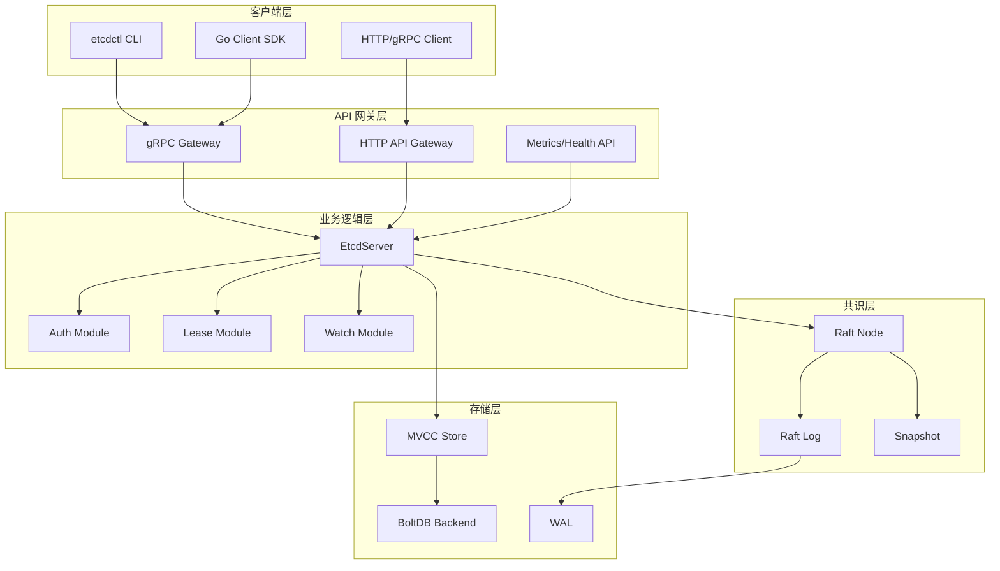
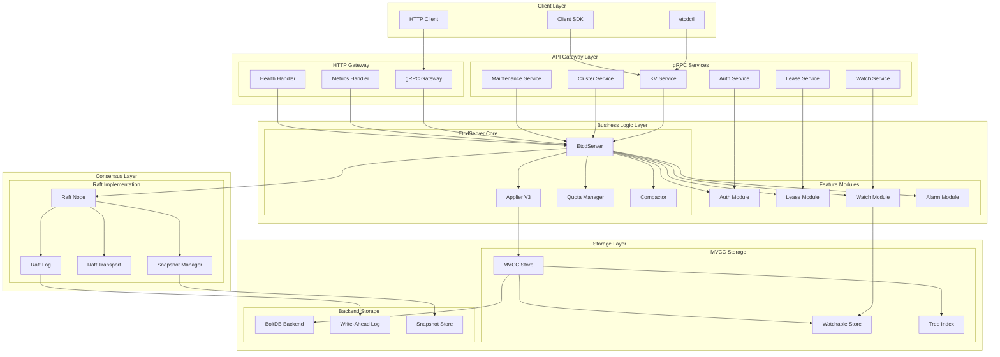
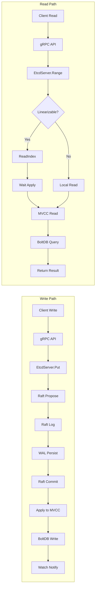
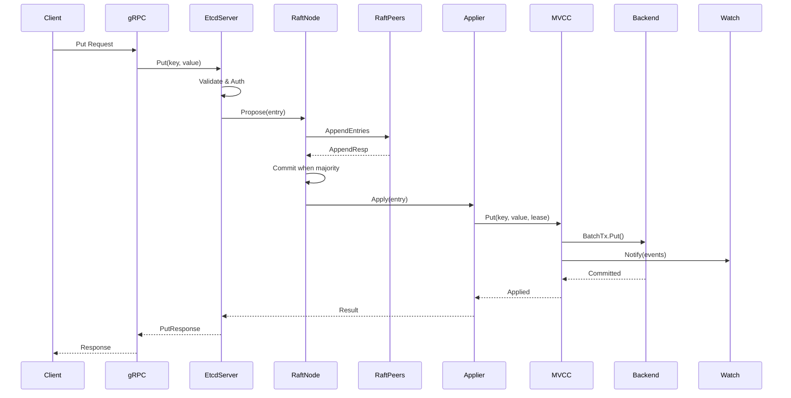
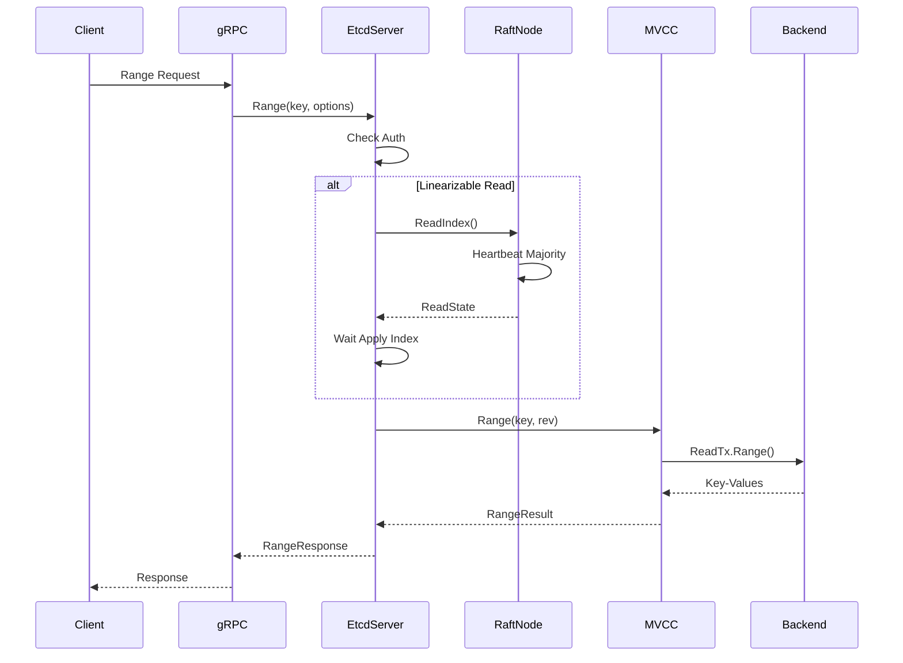
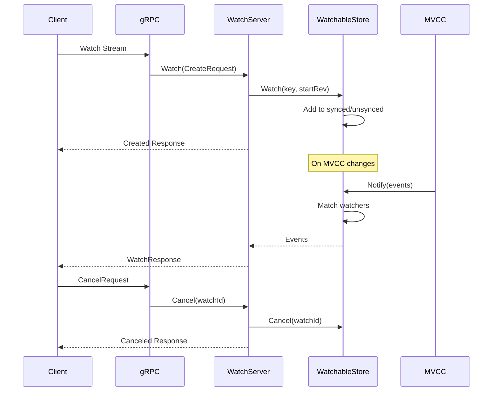
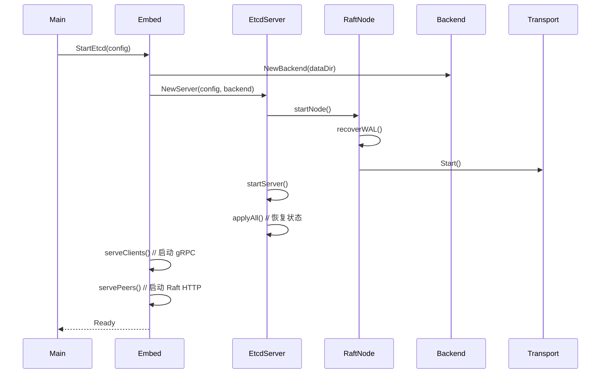

# etcd 整体架构与模块交互分析

etcd 是一个高可用的分布式键值存储系统，采用模块化设计，各模块职责清晰，协同工作。本文将深入分析 etcd 的整体架构、核心模块及其交互关系。

## 1. 整体架构概览

### 1.1 架构分层

etcd 采用分层架构设计，从上到下分为以下几层：



### 1.2 核心模块组成

etcd 主要由以下核心模块组成：

1. **API 层**：提供 gRPC 和 HTTP 接口
2. **Server 层**：核心业务逻辑处理
3. **Raft 层**：分布式共识算法实现
4. **MVCC 层**：多版本并发控制
5. **Storage 层**：持久化存储
6. **Auth 层**：认证与授权
7. **Lease 层**：租约管理
8. **Watch 层**：事件监听

## 2. 详细架构图

### 2.1 完整系统架构



### 2.2 数据流架构



## 3. 核心模块详细分析

### 3.1 EtcdServer 模块

EtcdServer 是 etcd 的核心模块，负责协调各个子模块的工作。

```go
// EtcdServer 核心结构
type EtcdServer struct {
    // Raft 相关
    r            raftNode
    raftStorage  *raft.MemoryStorage
    
    // MVCC 存储
    kv           mvcc.ConsistentWatchableKV
    lessor       lease.Lessor
    
    // 认证授权
    authStore    auth.AuthStore
    
    // 集群管理
    cluster      *membership.RaftCluster
    
    // 应用器
    uberApply    apply.UberApplier
    
    // 配置和状态
    Cfg          config.ServerConfig
    appliedIndex atomic.Uint64
    committedIndex atomic.Uint64
    
    // 通知和等待
    readwaitc    chan struct{}
    applyWait    wait.WaitTime
    leaderChanged *notify.Notifier
}
```

**关键功能**：
- 处理客户端请求
- 协调 Raft 共识
- 管理 MVCC 存储
- 处理认证授权
- 管理集群成员

### 3.2 Raft 模块

Raft 模块实现分布式共识算法，确保集群数据一致性。

```go
// raftNode 包装 Raft 实现
type raftNode struct {
    raftNodeConfig
    
    // Raft 核心
    node        raft.Node
    raftStorage *raft.MemoryStorage
    transport   *rafthttp.Transport
    
    // 状态管理
    lead        uint64
    term        uint64
    
    // 通道通信
    propc       chan msgWithResult
    recvc       chan pb.Message
    confc       chan pb.ConfChange
    readStateC  chan raft.ReadState
    
    // 存储
    wal         *wal.WAL
    snapshotter *snap.Snapshotter
}
```

**关键功能**：
- 领导者选举
- 日志复制
- 成员变更
- 快照管理

### 3.3 MVCC 模块

MVCC 模块提供多版本并发控制，支持事务和历史版本查询。

```go
// store 实现 MVCC 存储
type store struct {
    // 后端存储
    b       backend.Backend
    kvindex index
    
    // 版本管理
    currentRev int64
    compactMainRev int64
    
    // 事务管理
    mu    sync.RWMutex
    tx    backend.BatchTx
    txnID int64
    
    // 压缩器
    compactor Compactor
}

// watchableStore 扩展 store 支持 Watch
type watchableStore struct {
    *store
    
    // Watch 管理
    mu      sync.RWMutex
    synced  watcherGroup
    unsynced watcherGroup
    victims watcherBatch
}
```

**关键功能**：
- 多版本存储
- 事务支持
- 历史版本查询
- Watch 事件生成

### 3.4 Backend 存储模块

Backend 模块基于 BoltDB 提供持久化存储。

```go
// Backend 接口定义
type Backend interface {
    ReadTx() ReadTx
    BatchTx() BatchTx
    
    Snapshot() Snapshot
    Hash(ignores map[IgnoreKey]struct{}) (uint32, error)
    Size() int64
    SizeInUse() int64
    
    Defrag() error
    ForceCommit()
    Close() error
}

// backend 实现
type backend struct {
    // BoltDB 实例
    db *bolt.DB
    
    // 事务管理
    batchTx       *batchTxBuffered
    readTx        *readTx
    batchInterval time.Duration
    batchLimit    int
    
    // 统计信息
    commits int64
    
    mu sync.RWMutex
}
```

**关键功能**：
- 持久化存储
- 事务管理
- 批量提交
- 数据压缩

## 4. 模块交互时序图

### 4.1 写操作时序图



### 4.2 读操作时序图



### 4.3 Watch 操作时序图



## 5. 关键数据结构

### 5.1 请求处理结构

```go
// InternalRaftRequest 内部 Raft 请求
type InternalRaftRequest struct {
    Header *RequestHeader
    ID     uint64
    
    // 具体请求类型
    Put           *PutRequest
    DeleteRange   *DeleteRangeRequest
    Txn           *TxnRequest
    Compaction    *CompactionRequest
    LeaseGrant    *LeaseGrantRequest
    LeaseRevoke   *LeaseRevokeRequest
    Alarm         *AlarmRequest
    AuthEnable    *AuthEnableRequest
    AuthDisable   *AuthDisableRequest
    Authenticate  *AuthenticateRequest
    AuthUserAdd   *AuthUserAddRequest
    AuthRoleAdd   *AuthRoleAddRequest
}
```

### 5.2 MVCC 键值结构

```go
// KeyValue MVCC 键值对
type KeyValue struct {
    Key            []byte
    CreateRevision int64
    ModRevision    int64
    Version        int64
    Value          []byte
    Lease          int64
}

// Revision 版本号
type Revision struct {
    Main int64  // 主版本号
    Sub  int64  // 子版本号
}
```

### 5.3 Raft 日志结构

```go
// Entry Raft 日志条目
type Entry struct {
    Term  uint64
    Index uint64
    Type  EntryType
    Data  []byte
}

// Message Raft 消息
type Message struct {
    Type     MessageType
    To       uint64
    From     uint64
    Term     uint64
    LogTerm  uint64
    Index    uint64
    Entries  []Entry
    Commit   uint64
    Snapshot Snapshot
    Reject   bool
    Context  []byte
}
```

## 6. 配置与启动流程

### 6.1 启动时序图



### 6.2 关键配置参数

```go
// ServerConfig 服务器配置
type ServerConfig struct {
    Name                    string
    DataDir                 string
    WalDir                  string
    
    // 网络配置
    LCUrls                  []url.URL  // 客户端监听地址
    ACUrls                  []url.URL  // 客户端广告地址
    LPUrls                  []url.URL  // 节点监听地址
    APUrls                  []url.URL  // 节点广告地址
    
    // 集群配置
    InitialCluster          string
    InitialClusterState     string
    InitialClusterToken     string
    
    // 性能配置
    TickMs                  uint
    ElectionMs              uint
    MaxSnapFiles            uint
    MaxWalFiles             uint
    SnapshotCount           uint64
    QuotaBackendBytes       int64
    
    // 压缩配置
    AutoCompactionRetention string
    AutoCompactionMode      string
}
```

## 7. 监控与可观测性

### 7.1 关键指标

```go
// 服务器指标
var (
    proposalsCommitted = prometheus.NewCounter(...)
    proposalsApplied   = prometheus.NewCounter(...)
    proposalsPending   = prometheus.NewGauge(...)
    
    // 磁盘指标
    diskWALFsyncDuration     = prometheus.NewHistogram(...)
    diskBackendCommitDuration = prometheus.NewHistogram(...)
    
    // 网络指标
    networkPeerRoundTripTime = prometheus.NewHistogramVec(...)
    
    // 存储指标
    mvccDBTotalSize = prometheus.NewGauge(...)
    mvccDBInUse     = prometheus.NewGauge(...)
)
```

### 7.2 健康检查

```go
// Health 健康检查接口
type Health interface {
    Range(ctx context.Context, r *pb.RangeRequest) (*pb.RangeResponse, error)
    Check(ctx context.Context, r *pb.HealthCheckRequest) (*pb.HealthCheckResponse, error)
}

// 健康检查实现
func (s *EtcdServer) Check(ctx context.Context, r *pb.HealthCheckRequest) (*pb.HealthCheckResponse, error) {
    if uint64(s.Leader()) == raft.None {
        return nil, rpctypes.ErrNoLeader
    }
    
    // 检查存储健康
    if s.alarmStore.NOSPACE() {
        return nil, rpctypes.ErrNoSpace
    }
    
    return &pb.HealthCheckResponse{Status: pb.HealthCheckResponse_SERVING}, nil
}
```

## 8. 总结

etcd 的整体架构具有以下特点：

1. **分层设计**：清晰的分层架构，职责分离
2. **模块化**：各模块独立，便于维护和扩展
3. **高可用**：基于 Raft 算法保证强一致性
4. **高性能**：MVCC 支持并发读写，WAL 保证持久性
5. **可扩展**：支持动态成员变更和水平扩展
6. **可观测**：丰富的监控指标和健康检查

这种架构设计使得 etcd 能够在分布式环境中提供可靠、高效的键值存储服务，广泛应用于配置管理、服务发现、分布式锁等场景。
